# Day-Model Linear Trade Return Predictor — Report

*Generated by `generate_report.py`*

## 1. Executive Summary

Optuna-tuned sparse/robust linear models (skglm_huber_l1, skglm_mcp from skglm) predicting entry-to-exit trade return (entry at open of decision_bar+1, exit at close of exit_bar (14:30)) using features and indicators calculated from daily and intraday Index data directly (to eliminate look-ahead bias and accelerate computation), while executing trades on the actual ETF (to accurately reflect P&L performance). The input feature space spans early-bar features (up to decision bar close) + prior-day technical indicators. Features are robustly selected using the new TimeSeriesStabilitySelector which incorporates regime-stratified bootstrapping, randomized ElasticNet penalties, OOB IC screening, and across-fold variance filtering.

**Validation**: Purged walk-forward TimeSeriesSplit (gap=5 days, 5 folds). Optuna TPE hyperparameter search (100 trials). 20% holdout never used in tuning.


| ETF/Tag | Model | Threshold | Features | Samples | Holdout IC | Holdout Dir | L/S Sharpe | Ridge Base IC | IS-OOS Gap |
|---------|-------|-----------|----------|---------|-----------|-------------|-----------|---------------|------------|
| 300ETF_long | SKGLM_MCP | 0.50 | 7/238 | 2722 | -0.0200 | 0.489 | +0.36 | +0.1183 | +0.1292 |
| 300ETF_short | SKGLM_MCP | 0.54 | 5/238 | 2722 | -0.0480 | 0.483 | +0.38 | +0.1183 | +0.0712 |
| 50ETF_long | SKGLM_HUBER_L1 | 0.66 | 4/238 | 2722 | +0.0340 | 0.500 | +1.53 | +0.1178 | +0.0942 |
| 50ETF_short | SKGLM_HUBER_L1 | 0.47 | 7/238 | 2722 | +0.0616 | 0.517 | +0.86 | +0.1178 | +0.0619 |
| 500ETF_long | SKGLM_MCP | 0.54 | 10/238 | 2722 | +0.1306 | 0.572 | +2.61 | +0.1348 | +0.0335 |
| 500ETF_short | SKGLM_HUBER_L1 | 0.47 | 9/238 | 2722 | +0.1084 | 0.520 | +1.82 | +0.1348 | +0.0099 |
| 588000ETF_long | SKGLM_MCP | 0.32 | 6/238 | 1294 | -0.0529 | 0.488 | -1.33 | -0.0277 | +0.1962 |
| 588000ETF_short | SKGLM_MCP | 0.34 | 7/238 | 1294 | +0.0798 | 0.481 | +1.69 | -0.0277 | +0.0603 |
| 159915ETF_long | SKGLM_HUBER_L1 | 0.70 | 3/238 | 2722 | +0.1098 | 0.555 | +1.51 | +0.0489 | +0.0120 |
| 159915ETF_short | SKGLM_MCP | 0.44 | 7/238 | 2722 | +0.1139 | 0.559 | +2.71 | +0.0489 | -0.0003 |

## 2. Data & Features

### Feature Groups

| Group | Count | Features |
|-------|-------|----------|
| Early-bar (139) | 139 | gap_pct, first_30min_return, early_realized_vol, early_range, early_trend, early_momentum, first_bar_return, first_bar_volume, early_vwap_dev, early_skew, early_kurtosis, bar_ret_0, bar_ret_1, bar_ret_2, bar_ret_3... and 124 more (total 139) |
| Day-level (74) | 74 | macd_hist, sma20_dist, sma50_dist, atr14_norm, roc10, bb_pctb, vol20, sma10_dist, sma100_dist, sma200_dist, ema12_dist, rsi5, rsi21, roc5, roc20... and 59 more (total 74) |
| Yesterday (25) | 25 | yesterday_pm_return, yesterday_am_return, yesterday_gap_pct, yesterday_first_30min_return, yesterday_early_realized_vol, yesterday_early_range, yesterday_early_volume_ratio, yesterday_early_trend, yesterday_early_momentum, yesterday_first_bar_return, yesterday_first_bar_volume, yesterday_early_vwap_dev, yesterday_early_skew, yesterday_early_kurtosis, yesterday_day_range... and 10 more (total 25) |

- **Early-bar**: First `decision_bar+1` five-minute bars of Index data (see `DECISION_BAR` dict in `build_features.py`). Bars beyond `decision_bar` padded with 0.0. Strictly causal — no look-ahead.
- **Day-level**: Technical indicators and 3rd party flows calculated using daily and intraday Index data directly, shifted by 1 day (no look-ahead).
- **Yesterday**: Shifted full-day and early-bar features of Index data from day t-1 (no look-ahead).
- **Target**: `trade_return` = log(close[EXIT_BAR] / open[decision_bar+1]) using ETF prices to accurately reflect actual daytrade P&L (entry at next-bar open after decision, exit at 14:30 close).
- **Diagnostic target**: `pm_return` (bars 24..47, 13:00→15:00) of the ETF, retained for IC sanity-checks vs the old baseline — do NOT train on it.
- **Warmup**: First 60 rows dropped (SMA50/ATR14 burn-in).

## 3. Methodology

### Purged Walk-Forward Validation & Feature Selection

- **TimeSeriesSplit**: 5 folds expanding window.
- **Purge gap**: 5 trading days between train and test.
- **Stability Selection**: 50 stratified block bootstrap trials (block length 20 days) using randomized `ElasticNet` (pre-tuned via `ElasticNetCV`) combined with an out-of-bag (OOB) Spearman rank IC significance check (p < 0.05 or |IC| > 0.02) as the base selector. Stability scores and cross-fold variance filters are computed across purged walk-forward validation folds.

- **Tuning**: The top K features by stability selection are tuned via Optuna in walk-forward CV over $K \in [3, 50]$ to find the globally most robust subset.

- **Optuna objective**: mean Spearman rank IC across folds (100 trials)

### Search Space

| Parameter | Range / Options |
|-----------|-----------------|
| model_type | skglm_huber_l1, skglm_mcp (from `skglm` library) |
| top_k_features | 3–50 (step 1) |
| **skglm_huber_l1** | alpha: $10^{-5}$–$10^3$ (log), delta: $1.0$–$3.0$ |
| **skglm_mcp** | alpha: $10^{-5}$–$10^3$ (log), gamma: $1.5$–$15.0$ |

## 4. Results

### 300ETF_long

- **Selected Model**: SKGLM_MCP
- **Tuned Stability Threshold**: 0.50
- **Samples**: 2722 (2015-04-07 → 2026-06-17)
- **Holdout**: 544 days (2024-03-19 → 2026-06-17)
- **Target stats**: mean=0.0125%, std=0.9550%, Sharpe=0.21
- **Selected features (7)**: `yesterday_early_range, early_skew, sma100_dist, consecutive_higher_highs, inside_bar_failure_bear, vol_gk10, intraday_bullish_fvg`

#### Selected Feature Stability Scores (Block Bootstrap)

<details>
<summary><b>Click to expand Feature Stability Scores Table</b></summary>

| Feature | Stability Score | Status | Pearson $r$ | Spearman $\rho$ | Monotonicity Score | Mutual Info | Quality Rating | Holdout IC | Yearly ICs | Yearly IC Std |
|---------|-----------------|--------|-------------|-----------------|--------------------|-------------|----------------|------------|------------|---------------|
| yesterday_early_range | 74.8% | **Selected** | +0.0278 | +0.0063 | +0.80 | 0.0409 | ** Moderate Monotonic | -0.0142 | 15:+0.13 16:-0.02 17:+0.06 18:+0.05 19:-0.05 20:+0.01 21:-0.09 22:-0.02 23:-0.04 24:+0.01 25:+0.02 26:-0.06 | 0.0579 |
| early_skew | 67.2% | **Selected** | +0.0386 | +0.0356 | +0.70 | 0.0035 | ** Moderate Monotonic | +0.0137 | 15:+0.11 16:+0.05 17:+0.08 18:-0.02 19:+0.04 20:+0.07 21:-0.03 22:+0.10 23:-0.00 24:+0.01 25:-0.00 26:+0.08 | 0.0469 |
| sma100_dist | 62.4% | **Selected** | -0.0790 | -0.0440 | -0.70 | 0.0350 | ** Moderate Monotonic | -0.0390 | 15:-0.18 16:-0.09 17:-0.01 18:-0.05 19:-0.16 20:-0.08 21:-0.14 22:-0.07 23:-0.09 24:-0.06 25:-0.01 26:-0.16 | 0.0535 |
| consecutive_higher_highs | 54.0% | **Selected** | +0.0565 | +0.0444 | +0.50 | 0.0000 | ** Moderate Monotonic | -0.0181 | 15:+0.04 16:+0.01 17:-0.03 18:+0.12 19:+0.06 20:-0.02 21:+0.19 22:+0.00 23:+0.11 24:-0.01 25:+0.07 26:-0.19 | 0.0925 |
| inside_bar_failure_bear | 52.8% | **Selected** | +0.0272 | +0.0257 | N/A | 0.0000 | N/A | +0.0561 | 15:+0.04 16:+0.07 17:+0.07 18:+0.07 19:-0.02 20:+0.03 21:-0.06 22:+0.05 23:-0.03 24:+0.02 25:-0.02 26:+0.20 | 0.0636 |
| vol_gk10 | 52.4% | **Selected** | +0.0401 | +0.0292 | +0.80 | 0.0392 | ** Moderate Monotonic | +0.0255 | 15:+0.04 16:+0.03 17:+0.09 18:+0.01 19:-0.04 20:-0.06 21:+0.04 22:+0.11 23:+0.01 24:+0.10 25:+0.06 26:+0.01 | 0.0504 |
| intraday_bullish_fvg | 50.4% | **Selected** | +0.0588 | +0.0444 | N/A | 0.0000 | N/A | +0.0100 | 15:+0.14 16:+0.04 17:+0.06 18:+0.00 19:-0.02 20:+0.04 21:+0.08 22:+0.08 23:-0.00 24:-0.02 25:+0.04 26:-0.01 | 0.0451 |

</details>

#### Metrics

| Metric | Best Linear | Ridge Base | Zero | Yesterday PM | First 30min Mom |
|--------|-------------|------------|------|--------------|-----------------|
| IC | -0.0200 | +0.1183 | +0.0000 | -0.0638 | -0.0160 |
| Dir Acc | 0.489 | 0.531 | 0.500 | 0.458 | 0.493 |
| RMSE | 0.8008% | 0.8415% | 0.8010% | 1.1427% | 0.8685% |
| L/S Sharpe | +0.36 | +1.96 | — | — | — |

#### Best Hyperparameters

<details>
<summary><b>Click to expand Best Hyperparameters JSON</b></summary>

```json
{
  "model_type": "skglm_mcp",
  "top_k_features": 7,
  "skglm_mcp_alpha": 0.028546978577971817,
  "skglm_mcp_gamma": 5.431593392673566,
  "stability_threshold": 0.504
}
```

</details>

#### Walk-Forward Fold ICs

| Fold | IS IC | OOS IC |
|------|-------|--------|
| 1 | 0.1564 | -0.0137 |
| 2 | 0.1026 | +0.0810 |
| 3 | 0.0920 | +0.0644 |
| 4 | 0.0883 | +0.0250 |
| 5 | 0.0764 | +0.0063 |
| **Overall** | — | +0.0222 |

#### Year-by-Year OOS IC

| Year | IC | Dir Acc | N | L/S Sharpe |
|------|-----|---------|---|-----------|
| 2017 | +0.0890 | 0.474 | 215 | +3.56 |
| 2018 | +0.0637 | 0.432 | 243 | +1.23 |
| 2019 | +0.0843 | 0.508 | 244 | +3.16 |
| 2020 | +0.0635 | 0.490 | 243 | +1.81 |
| 2021 | +0.0562 | 0.473 | 243 | +1.56 |
| 2022 | +0.0547 | 0.459 | 242 | +1.32 |
| 2023 | +0.1220 | 0.525 | 242 | +3.85 |
| 2024 | +0.0387 | 0.492 | 242 | +0.16 |
| 2025 | +0.0476 | 0.494 | 243 | +3.08 |
| 2026 | -0.0708 | 0.509 | 108 | -1.00 |

#### Diagnostic Plots

<details>
<summary><b>Click to expand Diagnostic Plots</b></summary>

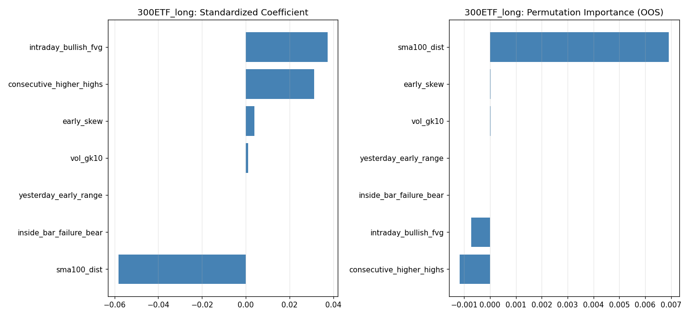<br>


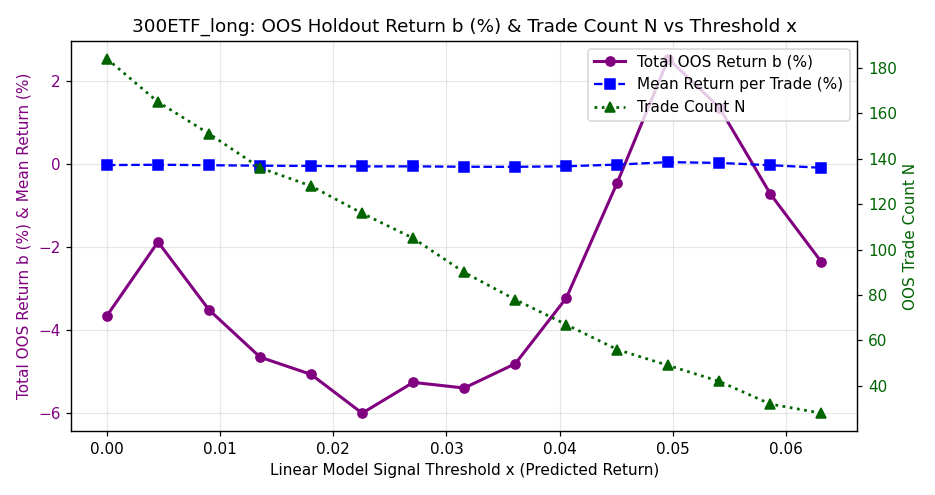<br>


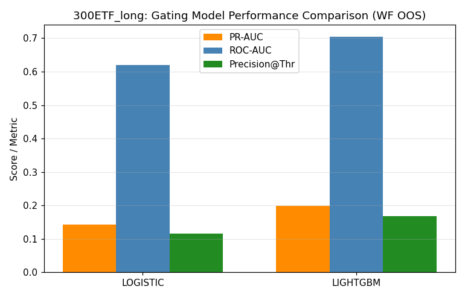<br>


</details>

### 300ETF_short

- **Selected Model**: SKGLM_MCP
- **Tuned Stability Threshold**: 0.54
- **Samples**: 2722 (2015-04-07 → 2026-06-17)
- **Holdout**: 544 days (2024-03-19 → 2026-06-17)
- **Target stats**: mean=0.0125%, std=0.9550%, Sharpe=0.21
- **Selected features (5)**: `bb_width, volume_dryup_ratio, gap_pct, inside_bar_failure_bull, northbound_net`

#### Selected Feature Stability Scores (Block Bootstrap)

<details>
<summary><b>Click to expand Feature Stability Scores Table</b></summary>

| Feature | Stability Score | Status | Pearson $r$ | Spearman $\rho$ | Monotonicity Score | Mutual Info | Quality Rating | Holdout IC | Yearly ICs | Yearly IC Std |
|---------|-----------------|--------|-------------|-----------------|--------------------|-------------|----------------|------------|------------|---------------|
| bb_width | 71.6% | **Selected** | -0.0155 | -0.0173 | -0.90 | 0.0284 | *** Strong Monotonic | +0.0110 | 15:-0.02 16:+0.08 17:+0.02 18:-0.07 19:+0.03 20:+0.02 21:+0.02 22:-0.16 23:-0.12 24:-0.06 25:+0.03 26:-0.02 | 0.0671 |
| volume_dryup_ratio | 63.2% | **Selected** | +0.0333 | +0.0344 | N/A | 0.0000 | N/A | +0.0059 | 15:+0.08 16:+0.05 17:+0.07 18:-0.01 19:-0.01 20:+0.01 21:+0.04 22:-0.06 23:-0.02 24:+0.03 25:+0.04 | 0.0403 |
| gap_pct | 63.2% | **Selected** | +0.0344 | +0.0234 | +0.90 | 0.0000 | *** Strong Monotonic | +0.0381 | 15:+0.07 16:+0.03 17:-0.15 18:+0.06 19:+0.04 20:+0.01 21:+0.00 22:+0.05 23:-0.01 24:-0.06 25:+0.05 26:+0.12 | 0.0677 |
| inside_bar_failure_bull | 55.2% | **Selected** | -0.0506 | -0.0409 | N/A | 0.0021 | N/A | -0.0058 | 15:-0.16 16:-0.01 17:-0.12 18:+0.01 19:-0.07 20:-0.06 21:-0.01 22:+0.05 23:-0.09 24:-0.03 25:+0.04 26:-0.12 | 0.0645 |
| northbound_net | 53.6% | **Selected** | +0.0381 | +0.0469 | +0.90 | 0.0000 | *** Strong Monotonic | -0.0416 | 15:+0.04 16:+0.01 17:-0.00 18:+0.07 19:+0.14 20:+0.05 21:+0.02 22:+0.06 23:+0.08 24:-0.01 26:+nan | nan |

</details>

#### Metrics

| Metric | Best Linear | Ridge Base | Zero | Yesterday PM | First 30min Mom |
|--------|-------------|------------|------|--------------|-----------------|
| IC | -0.0480 | +0.1183 | +0.0000 | -0.0638 | -0.0160 |
| Dir Acc | 0.483 | 0.531 | 0.500 | 0.458 | 0.493 |
| RMSE | 0.8047% | 0.8415% | 0.8010% | 1.1427% | 0.8685% |
| L/S Sharpe | +0.38 | +1.96 | — | — | — |

#### Best Hyperparameters

<details>
<summary><b>Click to expand Best Hyperparameters JSON</b></summary>

```json
{
  "model_type": "skglm_mcp",
  "top_k_features": 5,
  "skglm_mcp_alpha": 0.023390087639703166,
  "skglm_mcp_gamma": 1.561885261134555,
  "stability_threshold": 0.5359999999999999
}
```

</details>

#### Walk-Forward Fold ICs

| Fold | IS IC | OOS IC |
|------|-------|--------|
| 1 | 0.1141 | +0.0270 |
| 2 | 0.0771 | +0.0712 |
| 3 | 0.0864 | +0.0179 |
| 4 | 0.0656 | +0.0810 |
| 5 | 0.0660 | -0.0070 |
| **Overall** | — | +0.0329 |

#### Year-by-Year OOS IC

| Year | IC | Dir Acc | N | L/S Sharpe |
|------|-----|---------|---|-----------|
| 2017 | -0.0090 | 0.465 | 215 | +1.61 |
| 2018 | +0.0683 | 0.449 | 243 | +1.64 |
| 2019 | +0.0848 | 0.541 | 244 | +1.60 |
| 2020 | +0.0577 | 0.481 | 243 | +0.70 |
| 2021 | -0.0044 | 0.519 | 243 | +0.71 |
| 2022 | +0.0323 | 0.525 | 242 | +1.36 |
| 2023 | +0.1162 | 0.512 | 242 | +1.84 |
| 2024 | +0.0155 | 0.512 | 242 | +0.94 |
| 2025 | -0.0441 | 0.502 | 243 | -0.67 |
| 2026 | +0.0822 | 0.519 | 108 | +5.19 |

#### Diagnostic Plots

<details>
<summary><b>Click to expand Diagnostic Plots</b></summary>

<br>


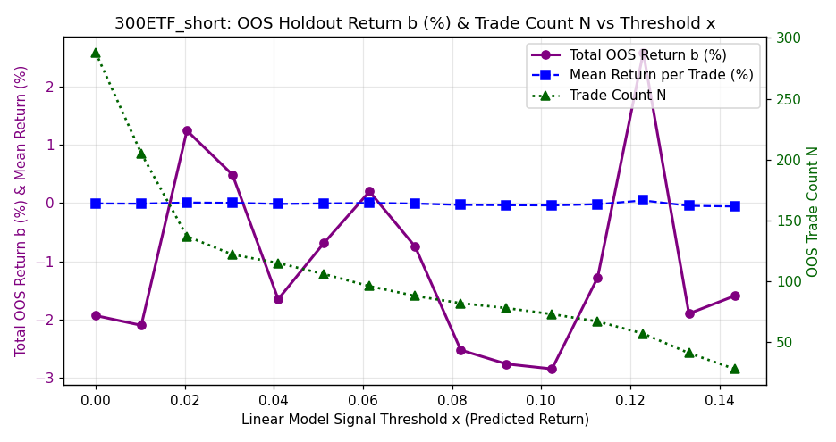<br>


<br>


</details>

### 50ETF_long

- **Selected Model**: SKGLM_HUBER_L1
- **Tuned Stability Threshold**: 0.66
- **Samples**: 2722 (2015-04-07 → 2026-06-17)
- **Holdout**: 544 days (2024-03-19 → 2026-06-17)
- **Target stats**: mean=-0.0019%, std=0.9480%, Sharpe=-0.03
- **Selected features (4)**: `yesterday_body_ratio, yesterday_early_range, margin_net_buy, decision_bar_body`

#### Selected Feature Stability Scores (Block Bootstrap)

<details>
<summary><b>Click to expand Feature Stability Scores Table</b></summary>

| Feature | Stability Score | Status | Pearson $r$ | Spearman $\rho$ | Monotonicity Score | Mutual Info | Quality Rating | Holdout IC | Yearly ICs | Yearly IC Std |
|---------|-----------------|--------|-------------|-----------------|--------------------|-------------|----------------|------------|------------|---------------|
| yesterday_body_ratio | 94.0% | **Selected** | -0.0635 | -0.0554 | -0.80 | 0.0069 | ** Moderate Monotonic | -0.0322 | 15:-0.09 16:-0.14 17:-0.03 18:-0.03 19:+0.03 20:-0.08 21:-0.16 22:+0.00 23:-0.04 24:-0.04 25:-0.02 26:-0.04 | 0.0526 |
| yesterday_early_range | 84.4% | **Selected** | +0.0691 | -0.0258 | -0.20 | 0.0235 | * Non-Monotonic / Weak | -0.0498 | 15:+0.08 16:-0.02 17:+0.05 18:-0.01 19:-0.08 20:+0.03 21:-0.08 22:-0.00 23:-0.05 24:-0.02 25:-0.09 26:+0.06 | 0.0559 |
| margin_net_buy | 82.0% | **Selected** | -0.1262 | -0.0654 | -0.90 | 0.0000 | *** Strong Monotonic | -0.0343 | 15:-0.11 16:+0.05 17:+0.00 18:-0.08 19:-0.07 20:-0.08 21:-0.10 22:-0.07 23:-0.06 24:-0.18 25:+0.07 26:+0.07 | 0.0742 |
| decision_bar_body | 66.0% | **Selected** | +0.0383 | +0.0368 | +0.90 | 0.0288 | *** Strong Monotonic | -0.0202 | 15:+0.16 16:+0.06 17:+0.02 18:+0.11 19:-0.00 20:+0.01 21:+0.01 22:+0.05 23:+0.06 24:-0.09 25:+0.05 26:+0.02 | 0.0575 |

</details>

#### Metrics

| Metric | Best Linear | Ridge Base | Zero | Yesterday PM | First 30min Mom |
|--------|-------------|------------|------|--------------|-----------------|
| IC | +0.0340 | +0.1178 | +0.0000 | +0.0088 | -0.0301 |
| Dir Acc | 0.500 | 0.513 | 0.500 | 0.485 | 0.493 |
| RMSE | 0.7459% | 0.8028% | 0.7416% | 1.0417% | 0.8229% |
| L/S Sharpe | +1.53 | +3.25 | — | — | — |

#### Best Hyperparameters

<details>
<summary><b>Click to expand Best Hyperparameters JSON</b></summary>

```json
{
  "model_type": "skglm_huber_l1",
  "top_k_features": 4,
  "skglm_huber_l1_alpha": 6.673035101311809e-05,
  "skglm_huber_delta": 2.3610848186160975,
  "stability_threshold": 0.6599999999999999
}
```

</details>

#### Walk-Forward Fold ICs

| Fold | IS IC | OOS IC |
|------|-------|--------|
| 1 | 0.1614 | +0.0728 |
| 2 | 0.1204 | +0.0230 |
| 3 | 0.0940 | +0.1086 |
| 4 | 0.1002 | +0.0495 |
| 5 | 0.0937 | +0.0319 |
| **Overall** | — | +0.0552 |

#### Year-by-Year OOS IC

| Year | IC | Dir Acc | N | L/S Sharpe |
|------|-----|---------|---|-----------|
| 2017 | +0.0378 | 0.512 | 215 | +1.64 |
| 2018 | +0.0929 | 0.539 | 243 | +1.33 |
| 2019 | -0.0413 | 0.475 | 244 | -1.04 |
| 2020 | +0.1289 | 0.547 | 243 | +0.69 |
| 2021 | +0.0828 | 0.539 | 243 | +0.66 |
| 2022 | +0.1077 | 0.525 | 242 | +3.08 |
| 2023 | +0.0562 | 0.525 | 242 | +1.41 |
| 2024 | +0.0661 | 0.537 | 242 | +2.76 |
| 2025 | -0.0037 | 0.473 | 243 | +1.45 |
| 2026 | +0.0363 | 0.481 | 108 | -0.94 |

#### Diagnostic Plots

<details>
<summary><b>Click to expand Diagnostic Plots</b></summary>

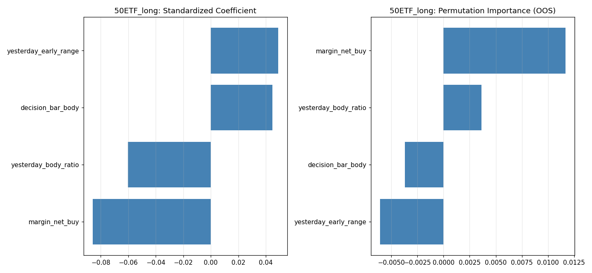<br>


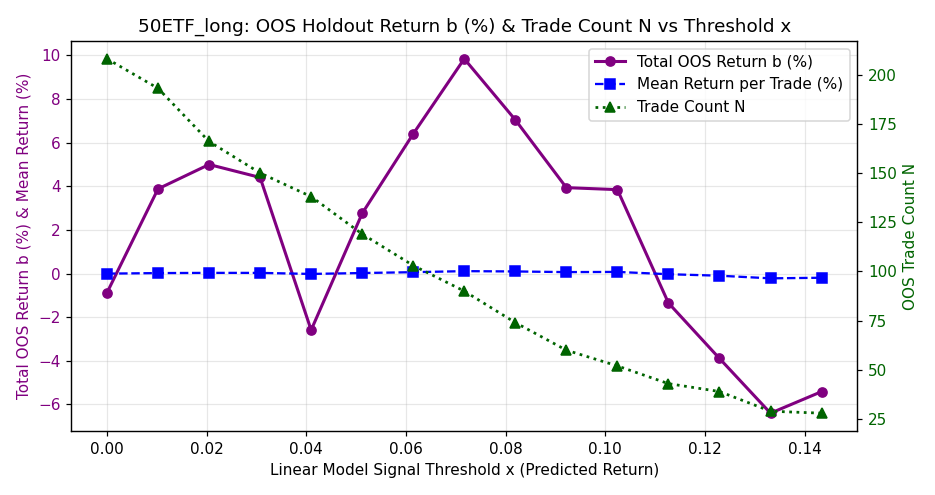<br>


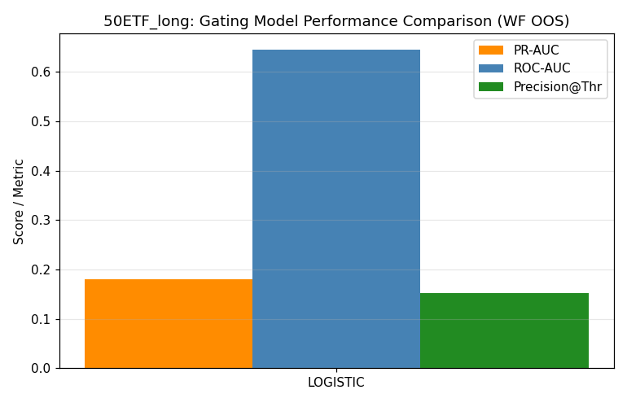<br>


</details>

### 50ETF_short

- **Selected Model**: SKGLM_HUBER_L1
- **Tuned Stability Threshold**: 0.47
- **Samples**: 2722 (2015-04-07 → 2026-06-17)
- **Holdout**: 544 days (2024-03-19 → 2026-06-17)
- **Target stats**: mean=-0.0019%, std=0.9480%, Sharpe=-0.03
- **Selected features (7)**: `bar_vol_2, gap_pct, spike_exhaustion_ratio, iv, adx_opening, northbound_net, yesterday_day_late_mom`

#### Selected Feature Stability Scores (Block Bootstrap)

<details>
<summary><b>Click to expand Feature Stability Scores Table</b></summary>

| Feature | Stability Score | Status | Pearson $r$ | Spearman $\rho$ | Monotonicity Score | Mutual Info | Quality Rating | Holdout IC | Yearly ICs | Yearly IC Std |
|---------|-----------------|--------|-------------|-----------------|--------------------|-------------|----------------|------------|------------|---------------|
| bar_vol_2 | 60.4% | **Selected** | -0.0341 | -0.0384 | -0.20 | 0.0246 | * Non-Monotonic / Weak | -0.0733 | 15:-0.04 16:-0.02 17:-0.02 18:-0.06 19:-0.03 20:+0.01 21:-0.11 22:+0.04 23:+0.02 24:-0.07 25:-0.05 26:-0.01 | 0.0392 |
| gap_pct | 55.6% | **Selected** | +0.0437 | +0.0200 | +0.70 | 0.0101 | ** Moderate Monotonic | +0.0164 | 15:+0.03 16:+0.06 17:-0.12 18:+0.03 19:+0.06 20:+0.07 21:+0.01 22:+0.08 23:-0.07 24:-0.06 25:+0.00 26:+0.18 | 0.0757 |
| spike_exhaustion_ratio | 54.0% | **Selected** | -0.0217 | -0.0235 | -0.60 | 0.0001 | ** Moderate Monotonic | +0.0241 | 15:-0.12 16:-0.04 17:-0.05 18:-0.03 19:+0.03 20:-0.01 21:+0.01 22:-0.05 23:-0.05 24:+0.06 25:-0.05 26:-0.00 | 0.0452 |
| iv | 52.0% | **Selected** | -0.0146 | -0.0456 | -0.70 | 0.0595 | ** Moderate Monotonic | -0.0462 | 15:-0.01 16:-0.11 17:-0.04 18:-0.02 19:-0.11 20:-0.08 21:-0.02 22:+0.08 23:-0.04 24:+0.01 25:-0.05 26:-0.05 | 0.0488 |
| adx_opening | 51.2% | **Selected** | +0.0776 | +0.0218 | N/A | 0.0000 | N/A | -0.0761 | 15:-0.03 16:-0.01 17:+0.09 18:+0.08 19:+0.12 20:-0.02 21:+0.02 22:+0.08 23:-0.01 24:-0.09 25:-0.02 26:-0.11 | 0.0702 |
| northbound_net | 50.0% | **Selected** | +0.0324 | +0.0458 | +0.90 | 0.0016 | *** Strong Monotonic | -0.0394 | 15:+0.06 16:-0.03 17:+0.01 18:+0.09 19:+0.15 20:+0.01 21:+0.04 22:+0.09 23:+0.06 24:-0.03 26:+nan | nan |
| yesterday_day_late_mom | 46.8% | **Selected** | +0.0363 | +0.0062 | +0.30 | 0.0000 | * Non-Monotonic / Weak | -0.0195 | 15:+0.10 16:+0.05 17:+0.13 18:-0.05 19:-0.05 20:+0.05 21:-0.06 22:-0.05 23:-0.05 24:-0.05 25:+0.05 26:+0.00 | 0.0635 |

</details>

#### Metrics

| Metric | Best Linear | Ridge Base | Zero | Yesterday PM | First 30min Mom |
|--------|-------------|------------|------|--------------|-----------------|
| IC | +0.0616 | +0.1178 | +0.0000 | +0.0088 | -0.0301 |
| Dir Acc | 0.517 | 0.513 | 0.500 | 0.485 | 0.493 |
| RMSE | 0.7342% | 0.8028% | 0.7416% | 1.0417% | 0.8229% |
| L/S Sharpe | +0.86 | +3.25 | — | — | — |

#### Best Hyperparameters

<details>
<summary><b>Click to expand Best Hyperparameters JSON</b></summary>

```json
{
  "model_type": "skglm_huber_l1",
  "top_k_features": 7,
  "skglm_huber_l1_alpha": 1.5240351263263867e-05,
  "skglm_huber_delta": 2.9988269881753706,
  "stability_threshold": 0.46799999999999997
}
```

</details>

#### Walk-Forward Fold ICs

| Fold | IS IC | OOS IC |
|------|-------|--------|
| 1 | 0.1022 | +0.0623 |
| 2 | 0.0997 | +0.0935 |
| 3 | 0.1088 | +0.0443 |
| 4 | 0.0944 | +0.0028 |
| 5 | 0.0767 | +0.0583 |
| **Overall** | — | +0.0528 |

#### Year-by-Year OOS IC

| Year | IC | Dir Acc | N | L/S Sharpe |
|------|-----|---------|---|-----------|
| 2017 | +0.0917 | 0.488 | 215 | +1.48 |
| 2018 | +0.0341 | 0.498 | 243 | +0.72 |
| 2019 | +0.0685 | 0.504 | 244 | +0.21 |
| 2020 | +0.1035 | 0.539 | 243 | +1.49 |
| 2021 | +0.0253 | 0.490 | 243 | +0.03 |
| 2022 | +0.0905 | 0.508 | 242 | +1.20 |
| 2023 | -0.0175 | 0.500 | 242 | -1.13 |
| 2024 | -0.0103 | 0.504 | 242 | -0.25 |
| 2025 | +0.0487 | 0.539 | 243 | +2.24 |
| 2026 | +0.0761 | 0.509 | 108 | +0.26 |

#### Diagnostic Plots

<details>
<summary><b>Click to expand Diagnostic Plots</b></summary>

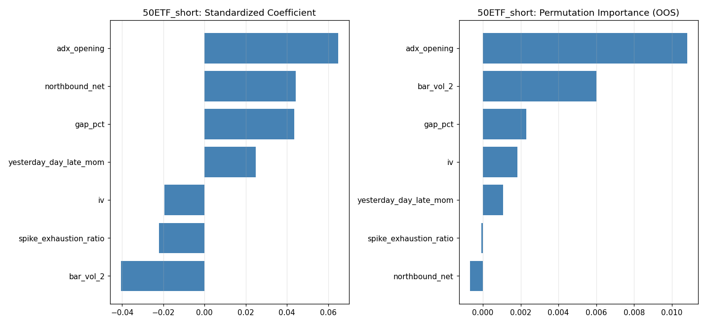<br>


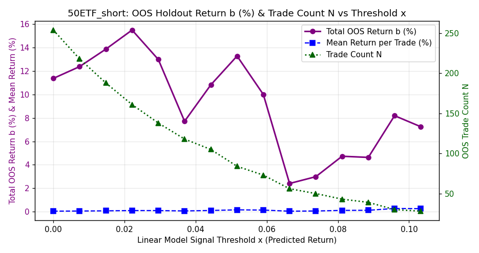<br>


<br>


</details>

### 500ETF_long

- **Selected Model**: SKGLM_MCP
- **Tuned Stability Threshold**: 0.54
- **Samples**: 2722 (2015-04-07 → 2026-06-17)
- **Holdout**: 544 days (2024-03-19 → 2026-06-17)
- **Target stats**: mean=0.0195%, std=1.1474%, Sharpe=0.27
- **Selected features (10)**: `sma100_dist, bar_rng_4, upper_shadow_rejection, bb_width, bar_vwap_dev_1, volume_surge_direction, yesterday_day_vwap_dev, yesterday_early_range, max_up_ret, volatility_regime_intraday`

#### Selected Feature Stability Scores (Block Bootstrap)

<details>
<summary><b>Click to expand Feature Stability Scores Table</b></summary>

| Feature | Stability Score | Status | Pearson $r$ | Spearman $\rho$ | Monotonicity Score | Mutual Info | Quality Rating | Holdout IC | Yearly ICs | Yearly IC Std |
|---------|-----------------|--------|-------------|-----------------|--------------------|-------------|----------------|------------|------------|---------------|
| sma100_dist | 84.0% | **Selected** | -0.0730 | -0.0389 | -0.90 | 0.0489 | *** Strong Monotonic | +0.0163 | 15:-0.19 16:-0.06 17:-0.09 18:-0.10 19:-0.03 20:-0.07 21:-0.16 22:-0.10 23:-0.12 24:-0.03 25:-0.02 26:+0.05 | 0.0627 |
| bar_rng_4 | 70.8% | **Selected** | +0.0421 | +0.0002 | +0.00 | 0.0526 | * Non-Monotonic / Weak | -0.0764 | 15:-0.04 16:+0.01 17:-0.05 18:+0.07 19:-0.02 20:+0.02 21:-0.03 22:+0.05 23:-0.01 24:+0.04 25:-0.10 26:-0.15 | 0.0597 |
| upper_shadow_rejection | 68.8% | **Selected** | +0.0271 | +0.0156 | +0.30 | 0.0000 | * Non-Monotonic / Weak | +0.0376 | 15:+0.08 16:+0.15 17:+0.07 18:-0.02 19:-0.08 20:-0.01 21:-0.10 22:-0.04 23:+0.05 24:+0.01 25:-0.08 26:+0.27 | 0.1034 |
| bb_width | 67.2% | **Selected** | -0.0362 | -0.0561 | -1.00 | 0.0631 | ** Non-Linear Monotonic | -0.0604 | 15:-0.01 16:-0.02 17:-0.06 18:-0.09 19:-0.03 20:+0.01 21:+0.06 22:-0.17 23:-0.13 24:-0.11 25:-0.03 26:-0.08 | 0.0619 |
| bar_vwap_dev_1 | 60.0% | **Selected** | +0.0854 | +0.0651 | +1.00 | 0.0325 | *** Strong Monotonic | +0.0648 | 15:+0.09 16:+0.11 17:+0.14 18:+0.01 19:+0.07 20:+0.02 21:+0.14 22:-0.02 23:+0.11 24:+0.07 25:-0.02 26:+0.08 | 0.0551 |
| volume_surge_direction | 59.6% | **Selected** | +0.1240 | +0.0946 | +1.00 | 0.0029 | *** Strong Monotonic | +0.1206 | 15:+0.25 16:+0.05 17:+0.04 18:+0.19 19:+0.08 20:+0.06 21:+0.08 22:+0.12 23:+0.03 24:+0.09 25:+0.15 26:+0.07 | 0.0636 |
| yesterday_day_vwap_dev | 59.2% | **Selected** | -0.0341 | -0.0436 | -0.60 | 0.0316 | ** Moderate Monotonic | -0.0735 | 15:+0.04 16:-0.09 17:-0.03 18:-0.07 19:-0.06 20:-0.14 21:-0.03 22:-0.01 23:-0.06 24:-0.01 25:-0.09 26:-0.15 | 0.0539 |
| yesterday_early_range | 57.2% | **Selected** | +0.0143 | +0.0359 | +0.80 | 0.0411 | ** Moderate Monotonic | +0.0219 | 15:+0.00 16:+0.06 17:+0.05 18:-0.00 19:+0.04 20:+0.05 21:-0.04 22:-0.02 23:+0.05 24:+0.07 25:+0.04 26:-0.05 | 0.0406 |
| max_up_ret | 56.4% | **Selected** | +0.1443 | +0.1276 | +0.90 | 0.0100 | *** Strong Monotonic | +0.1102 | 15:+0.28 16:+0.13 17:+0.16 18:+0.20 19:+0.03 20:+0.11 21:+0.13 22:+0.04 23:+0.11 24:+0.15 25:+0.12 26:-0.02 | 0.0750 |
| volatility_regime_intraday | 54.4% | **Selected** | +0.0169 | +0.0407 | +0.70 | 0.0000 | ** Moderate Monotonic | +0.0479 | 15:-0.03 16:+0.15 17:+0.02 18:+0.01 19:-0.00 20:+0.10 21:+0.05 22:-0.06 23:+0.01 24:+0.01 25:+0.12 26:+0.06 | 0.0593 |

</details>

#### Metrics

| Metric | Best Linear | Ridge Base | Zero | Yesterday PM | First 30min Mom |
|--------|-------------|------------|------|--------------|-----------------|
| IC | +0.1306 | +0.1348 | +0.0000 | -0.0748 | +0.1142 |
| Dir Acc | 0.572 | 0.529 | 0.500 | 0.460 | 0.551 |
| RMSE | 1.0069% | 1.1061% | 1.0131% | 1.4746% | 1.1190% |
| L/S Sharpe | +2.61 | +3.10 | — | — | — |

#### Best Hyperparameters

<details>
<summary><b>Click to expand Best Hyperparameters JSON</b></summary>

```json
{
  "model_type": "skglm_mcp",
  "top_k_features": 10,
  "skglm_mcp_alpha": 0.03978219380443064,
  "skglm_mcp_gamma": 1.6430201168885805,
  "stability_threshold": 0.5439999999999999
}
```

</details>

#### Walk-Forward Fold ICs

| Fold | IS IC | OOS IC |
|------|-------|--------|
| 1 | 0.2656 | +0.1371 |
| 2 | 0.2197 | +0.0899 |
| 3 | 0.1648 | +0.1038 |
| 4 | 0.1399 | +0.1176 |
| 5 | 0.1356 | +0.0994 |
| **Overall** | — | +0.0948 |

#### Year-by-Year OOS IC

| Year | IC | Dir Acc | N | L/S Sharpe |
|------|-----|---------|---|-----------|
| 2017 | +0.1265 | 0.530 | 215 | +3.10 |
| 2018 | +0.1843 | 0.486 | 243 | +5.59 |
| 2019 | +0.0798 | 0.504 | 244 | +2.74 |
| 2020 | +0.0902 | 0.490 | 243 | +4.06 |
| 2021 | +0.1747 | 0.568 | 243 | +2.50 |
| 2022 | +0.0524 | 0.504 | 242 | +1.86 |
| 2023 | +0.1445 | 0.541 | 242 | +2.61 |
| 2024 | +0.1505 | 0.579 | 242 | +4.20 |
| 2025 | +0.1500 | 0.564 | 243 | +2.87 |
| 2026 | -0.0136 | 0.546 | 108 | +1.27 |

#### Diagnostic Plots

<details>
<summary><b>Click to expand Diagnostic Plots</b></summary>

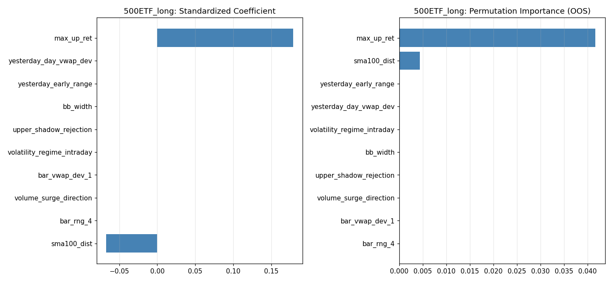<br>


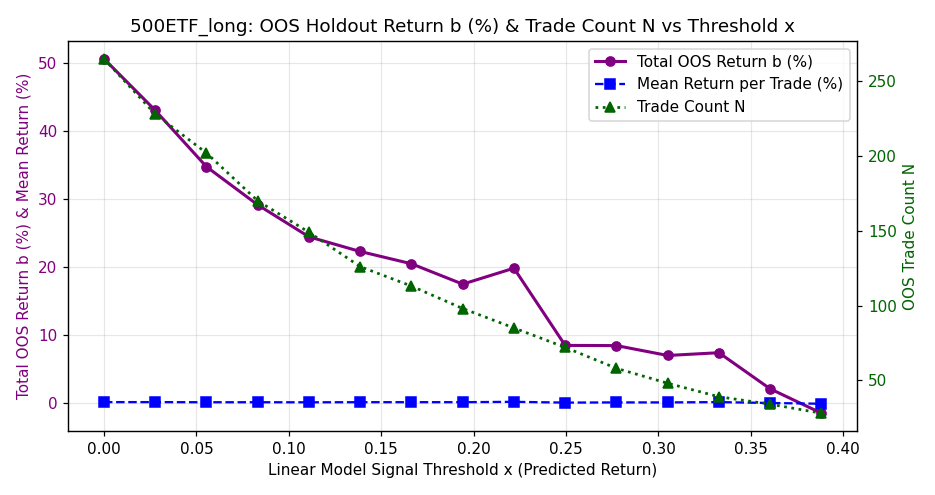<br>


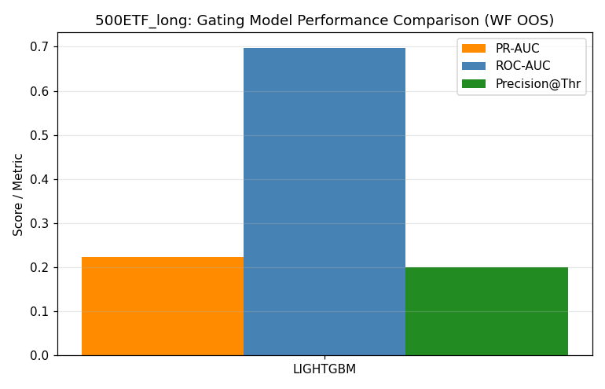<br>


</details>

### 500ETF_short

- **Selected Model**: SKGLM_HUBER_L1
- **Tuned Stability Threshold**: 0.47
- **Samples**: 2722 (2015-04-07 → 2026-06-17)
- **Holdout**: 544 days (2024-03-19 → 2026-06-17)
- **Target stats**: mean=0.0195%, std=1.1474%, Sharpe=0.27
- **Selected features (9)**: `yesterday_early_vwap_dev, bb_width, measured_move_proximity, gap_pct, margin_short_ratio, yesterday_intraday_close_position, bar_vwap_dev_2, yesterday_day_skew, volume_dryup_ratio`

#### Selected Feature Stability Scores (Block Bootstrap)

<details>
<summary><b>Click to expand Feature Stability Scores Table</b></summary>

| Feature | Stability Score | Status | Pearson $r$ | Spearman $\rho$ | Monotonicity Score | Mutual Info | Quality Rating | Holdout IC | Yearly ICs | Yearly IC Std |
|---------|-----------------|--------|-------------|-----------------|--------------------|-------------|----------------|------------|------------|---------------|
| yesterday_early_vwap_dev | 63.6% | **Selected** | +0.1047 | +0.0822 | +0.90 | 0.0290 | *** Strong Monotonic | +0.0866 | 15:+0.10 16:+0.09 17:+0.04 18:+0.06 19:+0.03 20:+0.16 21:+0.04 22:+0.16 23:+0.05 24:+0.02 25:+0.04 26:+0.22 | 0.0619 |
| bb_width | 62.4% | **Selected** | -0.0362 | -0.0561 | -1.00 | 0.0631 | ** Non-Linear Monotonic | -0.0604 | 15:-0.01 16:-0.02 17:-0.06 18:-0.09 19:-0.03 20:+0.01 21:+0.06 22:-0.17 23:-0.13 24:-0.11 25:-0.03 26:-0.08 | 0.0619 |
| measured_move_proximity | 58.0% | **Selected** | +0.0142 | +0.0149 | N/A | 0.0144 | N/A | -0.0136 | 15:+0.05 16:-0.04 17:-0.05 18:+0.06 19:+0.08 20:+0.08 21:-0.03 22:+0.01 23:+0.00 24:-0.15 25:-0.07 26:+0.20 | 0.0848 |
| gap_pct | 57.2% | **Selected** | +0.0412 | +0.0358 | +0.60 | 0.0388 | ** Moderate Monotonic | +0.0767 | 15:+0.07 16:+0.04 17:+0.05 18:+0.00 19:+0.08 20:-0.00 21:-0.06 22:+0.02 23:+0.02 24:-0.01 25:+0.06 26:+0.17 | 0.0544 |
| margin_short_ratio | 56.8% | **Selected** | -0.0018 | +0.0092 | +0.60 | 0.0511 | ** Moderate Monotonic | +0.0041 | 15:-0.08 16:+0.02 17:+0.13 18:-0.07 19:-0.09 20:+0.05 21:+0.03 22:+0.08 23:+0.01 24:+0.07 25:-0.03 26:+0.04 | 0.0646 |
| yesterday_intraday_close_position | 54.0% | **Selected** | +0.0944 | +0.0926 | +0.80 | 0.0057 | ** Moderate Monotonic | +0.0756 | 15:+0.10 16:+0.07 17:+0.04 18:+0.05 19:+0.08 20:+0.20 21:-0.02 22:+0.21 23:+0.13 24:-0.00 25:+0.06 26:+0.19 | 0.0721 |
| bar_vwap_dev_2 | 54.0% | **Selected** | +0.0781 | +0.0729 | +0.80 | 0.0387 | ** Moderate Monotonic | +0.0601 | 15:+0.10 16:+0.03 17:+0.06 18:+0.06 19:+0.06 20:+0.10 21:+0.08 22:+0.03 23:+0.08 24:+0.08 25:+0.06 26:+0.00 | 0.0278 |
| yesterday_day_skew | 49.6% | **Selected** | -0.0012 | +0.0036 | -0.20 | 0.0000 | * Non-Monotonic / Weak | +0.0245 | 15:+0.02 16:+0.01 17:-0.02 18:-0.01 19:-0.04 20:+0.03 21:-0.01 22:+0.09 23:+0.05 24:+0.03 25:-0.04 26:+0.07 | 0.0394 |
| volume_dryup_ratio | 47.2% | **Selected** | +0.0252 | +0.0318 | N/A | 0.0034 | N/A | +0.0430 | 15:-0.01 16:+0.12 17:+0.03 18:-0.03 19:+0.10 20:+0.03 22:-0.05 23:+0.07 24:+0.09 25:+0.04 26:-0.10 | 0.0639 |

</details>

#### Metrics

| Metric | Best Linear | Ridge Base | Zero | Yesterday PM | First 30min Mom |
|--------|-------------|------------|------|--------------|-----------------|
| IC | +0.1084 | +0.1348 | +0.0000 | -0.0748 | +0.1142 |
| Dir Acc | 0.520 | 0.529 | 0.500 | 0.460 | 0.551 |
| RMSE | 1.0049% | 1.1061% | 1.0131% | 1.4746% | 1.1190% |
| L/S Sharpe | +1.82 | +3.10 | — | — | — |

#### Best Hyperparameters

<details>
<summary><b>Click to expand Best Hyperparameters JSON</b></summary>

```json
{
  "model_type": "skglm_huber_l1",
  "top_k_features": 9,
  "skglm_huber_l1_alpha": 7.032978059106852e-05,
  "skglm_huber_delta": 2.5285386073862965,
  "stability_threshold": 0.472
}
```

</details>

#### Walk-Forward Fold ICs

| Fold | IS IC | OOS IC |
|------|-------|--------|
| 1 | 0.1426 | +0.1049 |
| 2 | 0.1390 | +0.1290 |
| 3 | 0.1422 | +0.1158 |
| 4 | 0.1373 | +0.0352 |
| 5 | 0.1283 | +0.1422 |
| **Overall** | — | +0.1039 |

#### Year-by-Year OOS IC

| Year | IC | Dir Acc | N | L/S Sharpe |
|------|-----|---------|---|-----------|
| 2017 | +0.0624 | 0.516 | 215 | +0.94 |
| 2018 | +0.1142 | 0.519 | 243 | +3.35 |
| 2019 | +0.1103 | 0.500 | 244 | +2.97 |
| 2020 | +0.1390 | 0.564 | 243 | +2.58 |
| 2021 | +0.0411 | 0.527 | 243 | +1.30 |
| 2022 | +0.1306 | 0.533 | 242 | +1.82 |
| 2023 | +0.0929 | 0.500 | 242 | +1.05 |
| 2024 | +0.0479 | 0.512 | 242 | +0.46 |
| 2025 | +0.0697 | 0.510 | 243 | +0.29 |
| 2026 | +0.2596 | 0.565 | 108 | +8.00 |

#### Diagnostic Plots

<details>
<summary><b>Click to expand Diagnostic Plots</b></summary>

<br>


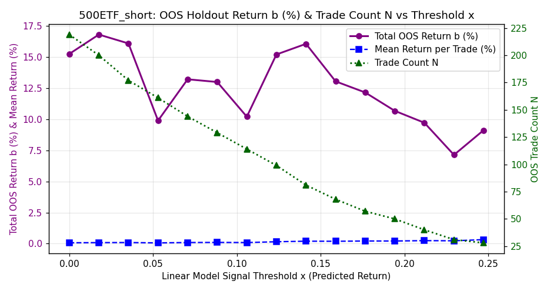<br>


<br>


</details>

### 588000ETF_long

- **Selected Model**: SKGLM_MCP
- **Tuned Stability Threshold**: 0.32
- **Samples**: 1294 (2021-02-09 → 2026-06-17)
- **Holdout**: 258 days (2025-05-27 → 2026-06-17)
- **Target stats**: mean=-0.0044%, std=1.3690%, Sharpe=-0.05
- **Selected features (6)**: `yesterday_day_realized_vol, vol5, roc5, pullback_depth_max, volume_weighted_price_position, bar_ret_2`

#### Selected Feature Stability Scores (Block Bootstrap)

<details>
<summary><b>Click to expand Feature Stability Scores Table</b></summary>

| Feature | Stability Score | Status | Pearson $r$ | Spearman $\rho$ | Monotonicity Score | Mutual Info | Quality Rating | Holdout IC | Yearly ICs | Yearly IC Std |
|---------|-----------------|--------|-------------|-----------------|--------------------|-------------|----------------|------------|------------|---------------|
| yesterday_day_realized_vol | 60.4% | **Selected** | +0.0612 | +0.0458 | +0.90 | 0.0380 | *** Strong Monotonic | -0.0176 | 21:+0.01 22:+0.19 23:-0.06 24:+0.08 25:+0.02 26:+0.03 | 0.0766 |
| vol5 | 39.6% | **Selected** | +0.0566 | +0.0443 | +0.70 | 0.0240 | ** Moderate Monotonic | -0.0448 | 21:+0.01 22:+0.18 23:+0.11 24:-0.01 25:+0.01 26:-0.02 | 0.0721 |
| roc5 | 37.2% | **Selected** | -0.0147 | -0.0026 | +0.00 | 0.0000 | * Non-Monotonic / Weak | -0.0143 | 21:-0.06 22:+0.05 23:+0.02 24:-0.08 25:-0.02 26:+0.05 | 0.0509 |
| pullback_depth_max | 34.0% | **Selected** | -0.1048 | -0.1069 | -0.90 | 0.0000 | *** Strong Monotonic | +0.0285 | 21:-0.23 22:-0.12 23:-0.12 24:-0.10 25:-0.06 26:+0.02 | 0.0752 |
| volume_weighted_price_position | 33.2% | **Selected** | +0.1182 | +0.1232 | +0.80 | 0.0000 | ** Moderate Monotonic | +0.0681 | 21:+0.29 22:+0.09 23:+0.12 24:+0.09 25:+0.05 26:+0.09 | 0.0787 |
| bar_ret_2 | 32.0% | **Selected** | +0.0033 | +0.0054 | +0.40 | 0.0000 | * Non-Monotonic / Weak | -0.0651 | 21:+0.01 22:-0.02 23:+0.12 24:-0.01 25:-0.01 26:-0.08 | 0.0577 |

</details>

#### Metrics

| Metric | Best Linear | Ridge Base | Zero | Yesterday PM | First 30min Mom |
|--------|-------------|------------|------|--------------|-----------------|
| IC | -0.0529 | -0.0277 | +0.0000 | -0.1324 | +0.0184 |
| Dir Acc | 0.488 | 0.450 | 0.500 | 0.403 | 0.496 |
| RMSE | 1.4968% | 1.7442% | 1.4761% | 2.1833% | 1.6720% |
| L/S Sharpe | -1.33 | +0.12 | — | — | — |

#### Best Hyperparameters

<details>
<summary><b>Click to expand Best Hyperparameters JSON</b></summary>

```json
{
  "model_type": "skglm_mcp",
  "top_k_features": 6,
  "skglm_mcp_alpha": 0.028546978577971817,
  "skglm_mcp_gamma": 5.431593392673566,
  "stability_threshold": 0.32
}
```

</details>

#### Walk-Forward Fold ICs

| Fold | IS IC | OOS IC |
|------|-------|--------|
| 1 | 0.3143 | +0.0635 |
| 2 | 0.2279 | +0.1501 |
| 3 | 0.1983 | +0.1031 |
| 4 | 0.1770 | +0.0515 |
| 5 | 0.1527 | -0.0743 |
| **Overall** | — | +0.0573 |

#### Year-by-Year OOS IC

| Year | IC | Dir Acc | N | L/S Sharpe |
|------|-----|---------|---|-----------|
| 2022 | +0.0941 | 0.483 | 240 | +4.59 |
| 2023 | +0.1261 | 0.550 | 242 | +2.39 |
| 2024 | +0.0637 | 0.529 | 242 | +2.06 |
| 2025 | +0.0091 | 0.490 | 243 | +0.06 |
| 2026 | -0.0389 | 0.491 | 108 | -1.00 |

#### Diagnostic Plots

<details>
<summary><b>Click to expand Diagnostic Plots</b></summary>

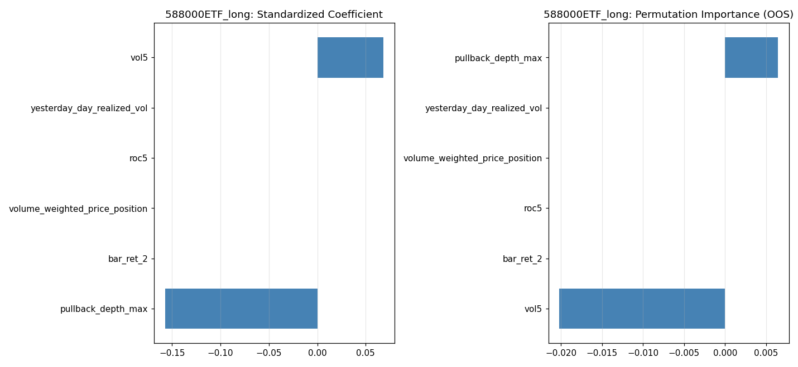<br>


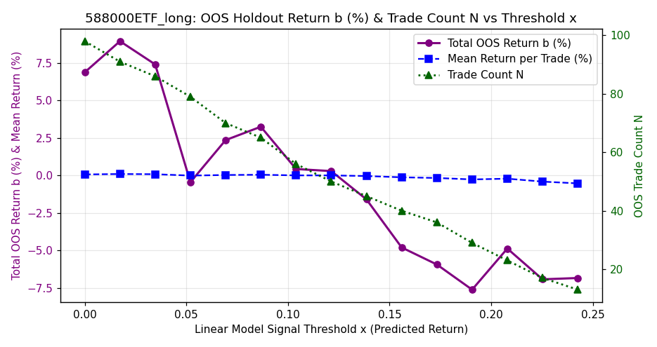<br>


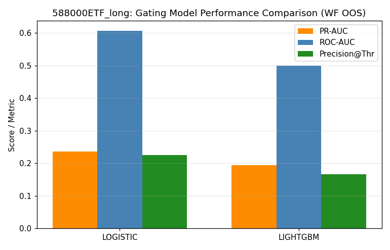<br>


</details>

### 588000ETF_short

- **Selected Model**: SKGLM_MCP
- **Tuned Stability Threshold**: 0.34
- **Samples**: 1294 (2021-02-09 → 2026-06-17)
- **Holdout**: 258 days (2025-05-27 → 2026-06-17)
- **Target stats**: mean=-0.0044%, std=1.3690%, Sharpe=-0.05
- **Selected features (7)**: `volume_weighted_price_position, yesterday_am_return, measured_move_proximity, yesterday_day_pm_am_vol_ratio, yesterday_first_bar_return, yesterday_early_realized_vol, volume_trend_intraday`

#### Selected Feature Stability Scores (Block Bootstrap)

<details>
<summary><b>Click to expand Feature Stability Scores Table</b></summary>

| Feature | Stability Score | Status | Pearson $r$ | Spearman $\rho$ | Monotonicity Score | Mutual Info | Quality Rating | Holdout IC | Yearly ICs | Yearly IC Std |
|---------|-----------------|--------|-------------|-----------------|--------------------|-------------|----------------|------------|------------|---------------|
| volume_weighted_price_position | 64.0% | **Selected** | +0.1182 | +0.1232 | +0.80 | 0.0000 | ** Moderate Monotonic | +0.0681 | 21:+0.29 22:+0.09 23:+0.12 24:+0.09 25:+0.05 26:+0.09 | 0.0787 |
| yesterday_am_return | 47.6% | **Selected** | +0.0192 | +0.0216 | +0.30 | 0.0439 | * Non-Monotonic / Weak | -0.0564 | 21:+0.04 22:+0.15 23:-0.00 24:-0.05 25:+0.00 26:-0.07 | 0.0739 |
| measured_move_proximity | 46.0% | **Selected** | +0.0207 | +0.0108 | N/A | 0.0000 | N/A | +0.0076 | 21:+0.03 22:+0.10 23:-0.04 24:-0.05 25:-0.05 26:+0.06 | 0.0561 |
| yesterday_day_pm_am_vol_ratio | 45.2% | **Selected** | +0.0100 | +0.0133 | -0.20 | 0.0087 | * Non-Monotonic / Weak | +0.0358 | 21:-0.02 22:+0.04 23:+0.15 24:-0.02 25:-0.05 26:+0.04 | 0.0645 |
| yesterday_first_bar_return | 42.8% | **Selected** | -0.0436 | +0.0225 | -0.20 | 0.0000 | * Non-Monotonic / Weak | -0.0411 | 21:+0.10 22:+0.04 23:+0.17 24:-0.05 25:-0.03 26:-0.08 | 0.0883 |
| yesterday_early_realized_vol | 40.4% | **Selected** | +0.0166 | -0.0002 | +0.40 | 0.0017 | * Non-Monotonic / Weak | -0.0335 | 21:-0.05 22:+0.04 23:-0.01 24:-0.04 25:+0.02 26:+0.09 | 0.0490 |
| volume_trend_intraday | 34.0% | **Selected** | +0.0070 | +0.0162 | +0.10 | 0.0000 | * Non-Monotonic / Weak | +0.0382 | 21:-0.09 22:+0.04 23:+0.09 24:+0.03 25:+0.04 26:+0.01 | 0.0544 |

</details>

#### Metrics

| Metric | Best Linear | Ridge Base | Zero | Yesterday PM | First 30min Mom |
|--------|-------------|------------|------|--------------|-----------------|
| IC | +0.0798 | -0.0277 | +0.0000 | -0.1324 | +0.0184 |
| Dir Acc | 0.481 | 0.450 | 0.500 | 0.403 | 0.496 |
| RMSE | 1.4794% | 1.7442% | 1.4761% | 2.1833% | 1.6720% |
| L/S Sharpe | +1.69 | +0.12 | — | — | — |

#### Best Hyperparameters

<details>
<summary><b>Click to expand Best Hyperparameters JSON</b></summary>

```json
{
  "model_type": "skglm_mcp",
  "top_k_features": 7,
  "skglm_mcp_alpha": 0.06979498375056391,
  "skglm_mcp_gamma": 4.808518293930722,
  "stability_threshold": 0.33999999999999997
}
```

</details>

#### Walk-Forward Fold ICs

| Fold | IS IC | OOS IC |
|------|-------|--------|
| 1 | 0.2966 | +0.0462 |
| 2 | 0.1909 | +0.1448 |
| 3 | 0.1688 | +0.1242 |
| 4 | 0.1575 | +0.0773 |
| 5 | 0.1382 | +0.0492 |
| **Overall** | — | +0.0718 |

#### Year-by-Year OOS IC

| Year | IC | Dir Acc | N | L/S Sharpe |
|------|-----|---------|---|-----------|
| 2022 | +0.0735 | 0.479 | 240 | +1.37 |
| 2023 | +0.1096 | 0.512 | 242 | +2.67 |
| 2024 | +0.0918 | 0.541 | 242 | +0.66 |
| 2025 | +0.0516 | 0.498 | 243 | +1.08 |
| 2026 | +0.0902 | 0.481 | 108 | +2.29 |

#### Diagnostic Plots

<details>
<summary><b>Click to expand Diagnostic Plots</b></summary>

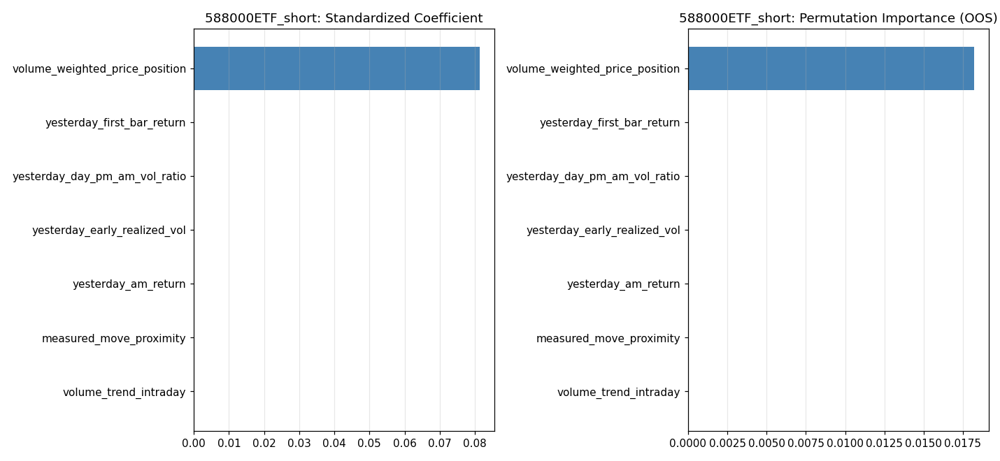<br>


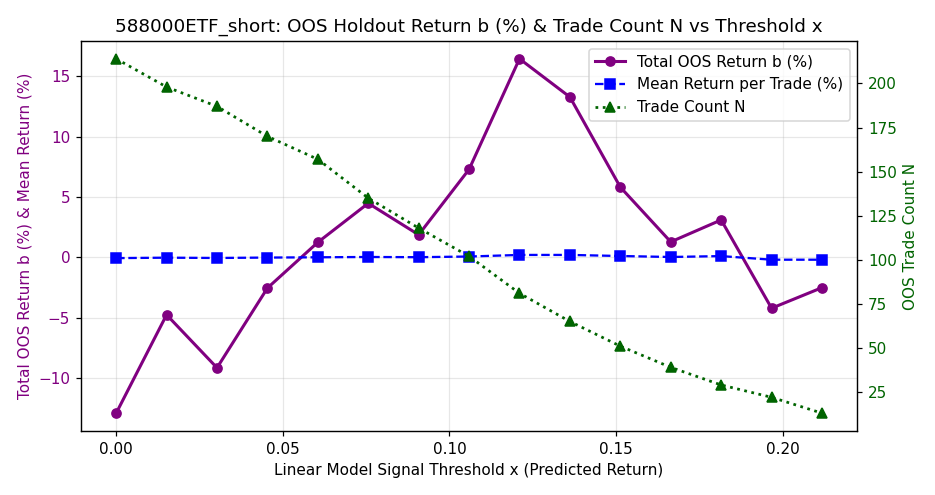<br>


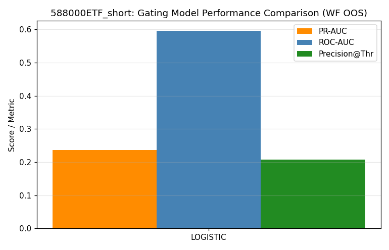<br>


</details>

### 159915ETF_long

- **Selected Model**: SKGLM_HUBER_L1
- **Tuned Stability Threshold**: 0.70
- **Samples**: 2722 (2015-04-07 → 2026-06-17)
- **Holdout**: 544 days (2024-03-19 → 2026-06-17)
- **Target stats**: mean=0.0195%, std=1.4037%, Sharpe=0.22
- **Selected features (3)**: `sma100_dist, yesterday_early_realized_vol, yesterday_day_vwap_dev`

#### Selected Feature Stability Scores (Block Bootstrap)

<details>
<summary><b>Click to expand Feature Stability Scores Table</b></summary>

| Feature | Stability Score | Status | Pearson $r$ | Spearman $\rho$ | Monotonicity Score | Mutual Info | Quality Rating | Holdout IC | Yearly ICs | Yearly IC Std |
|---------|-----------------|--------|-------------|-----------------|--------------------|-------------|----------------|------------|------------|---------------|
| sma100_dist | 84.0% | **Selected** | -0.0700 | -0.0320 | -0.80 | 0.0358 | ** Moderate Monotonic | -0.0170 | 15:-0.18 16:-0.09 17:-0.08 18:-0.07 19:-0.06 20:-0.07 21:-0.02 22:-0.06 23:-0.13 24:-0.06 25:+0.02 26:-0.10 | 0.0487 |
| yesterday_early_realized_vol | 76.8% | **Selected** | +0.0581 | +0.0246 | +0.90 | 0.0524 | *** Strong Monotonic | +0.0563 | 15:+0.10 16:+0.11 17:-0.01 18:-0.05 19:+0.00 20:-0.05 21:+0.10 22:-0.04 23:-0.01 24:+0.06 25:+0.02 26:+0.02 | 0.0562 |
| yesterday_day_vwap_dev | 69.6% | **Selected** | -0.0754 | -0.0876 | -1.00 | 0.0099 | *** Strong Monotonic | -0.1132 | 15:-0.05 16:-0.13 17:-0.11 18:-0.14 19:-0.05 20:-0.20 21:+0.01 22:-0.02 23:-0.08 24:-0.05 25:-0.12 26:-0.21 | 0.0653 |

</details>

#### Metrics

| Metric | Best Linear | Ridge Base | Zero | Yesterday PM | First 30min Mom |
|--------|-------------|------------|------|--------------|-----------------|
| IC | +0.1098 | +0.0489 | +0.0000 | -0.1212 | +0.0808 |
| Dir Acc | 0.555 | 0.535 | 0.500 | 0.449 | 0.533 |
| RMSE | 1.3330% | 1.9078% | 1.3300% | 1.9558% | 1.4395% |
| L/S Sharpe | +1.51 | +2.30 | — | — | — |

#### Best Hyperparameters

<details>
<summary><b>Click to expand Best Hyperparameters JSON</b></summary>

```json
{
  "model_type": "skglm_huber_l1",
  "top_k_features": 3,
  "skglm_huber_l1_alpha": 4.2797603056630346e-05,
  "skglm_huber_delta": 2.1567684889283134,
  "stability_threshold": 0.6960000000000001
}
```

</details>

#### Walk-Forward Fold ICs

| Fold | IS IC | OOS IC |
|------|-------|--------|
| 1 | 0.1610 | +0.0601 |
| 2 | 0.1255 | +0.0856 |
| 3 | 0.1102 | +0.0456 |
| 4 | 0.0964 | +0.0591 |
| 5 | 0.0854 | +0.0919 |
| **Overall** | — | +0.0515 |

#### Year-by-Year OOS IC

| Year | IC | Dir Acc | N | L/S Sharpe |
|------|-----|---------|---|-----------|
| 2017 | +0.1061 | 0.516 | 215 | +4.16 |
| 2018 | +0.0808 | 0.502 | 243 | +2.74 |
| 2019 | +0.0645 | 0.480 | 244 | +3.19 |
| 2020 | +0.1128 | 0.506 | 243 | +3.25 |
| 2021 | +0.0762 | 0.560 | 243 | -0.07 |
| 2022 | +0.0273 | 0.492 | 242 | +1.05 |
| 2023 | +0.0840 | 0.488 | 242 | +1.90 |
| 2024 | +0.0713 | 0.537 | 242 | +0.65 |
| 2025 | +0.0519 | 0.551 | 243 | +0.90 |
| 2026 | +0.2018 | 0.556 | 108 | +4.54 |

#### Diagnostic Plots

<details>
<summary><b>Click to expand Diagnostic Plots</b></summary>

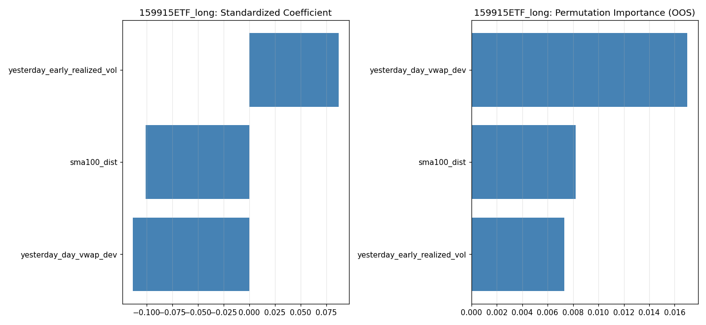<br>


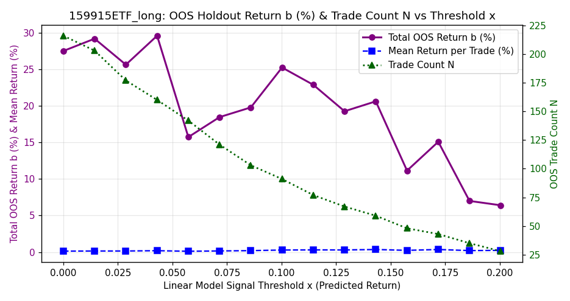<br>


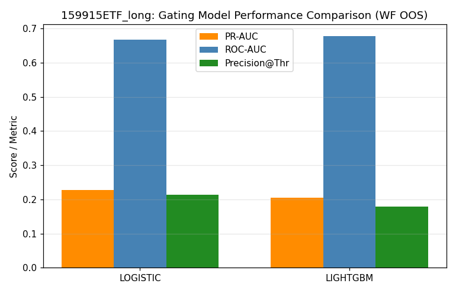<br>


</details>

### 159915ETF_short

- **Selected Model**: SKGLM_MCP
- **Tuned Stability Threshold**: 0.44
- **Samples**: 2722 (2015-04-07 → 2026-06-17)
- **Holdout**: 544 days (2024-03-19 → 2026-06-17)
- **Target stats**: mean=0.0195%, std=1.4037%, Sharpe=0.22
- **Selected features (7)**: `upper_wick_dominance, early_bullish_engulfing_count, gap_pct, early_kurtosis, yesterday_body_ratio, yesterday_day_vwap_dev, yesterday_early_momentum`

#### Selected Feature Stability Scores (Block Bootstrap)

<details>
<summary><b>Click to expand Feature Stability Scores Table</b></summary>

| Feature | Stability Score | Status | Pearson $r$ | Spearman $\rho$ | Monotonicity Score | Mutual Info | Quality Rating | Holdout IC | Yearly ICs | Yearly IC Std |
|---------|-----------------|--------|-------------|-----------------|--------------------|-------------|----------------|------------|------------|---------------|
| upper_wick_dominance | 61.6% | **Selected** | -0.0314 | +0.0175 | -0.10 | 0.0000 | * Non-Monotonic / Weak | +0.0092 | 15:-0.05 16:+0.04 17:+0.07 18:+0.10 19:-0.02 20:+0.14 21:-0.07 22:-0.01 23:-0.00 24:-0.01 25:-0.03 26:+0.04 | 0.0604 |
| early_bullish_engulfing_count | 54.0% | **Selected** | -0.0250 | -0.0105 | N/A | 0.0000 | N/A | +0.0319 | 15:-0.15 16:-0.05 17:-0.04 18:-0.02 19:-0.06 20:-0.01 21:-0.02 22:+0.05 23:+0.04 24:+0.11 25:-0.02 26:-0.01 | 0.0614 |
| gap_pct | 50.0% | **Selected** | +0.0430 | +0.0557 | +0.90 | 0.0292 | *** Strong Monotonic | +0.0786 | 15:+0.06 16:+0.01 17:-0.04 18:+0.02 19:+0.13 20:+0.05 21:+0.05 22:+0.06 23:+0.01 24:-0.01 25:+0.07 26:+0.14 | 0.0513 |
| early_kurtosis | 49.6% | **Selected** | +0.0324 | +0.0439 | +0.30 | 0.0000 | * Non-Monotonic / Weak | +0.0481 | 15:+0.01 16:+0.14 17:+0.06 18:+0.17 19:-0.05 20:+0.00 21:+0.02 22:-0.00 23:+0.02 24:+0.06 25:-0.02 26:+0.14 | 0.0665 |
| yesterday_body_ratio | 46.4% | **Selected** | +0.0008 | -0.0075 | +0.20 | 0.0000 | * Non-Monotonic / Weak | -0.0578 | 15:+0.04 16:+0.05 17:+0.00 18:-0.02 19:+0.06 20:-0.09 21:+0.01 22:-0.04 23:+0.11 24:-0.07 25:-0.11 26:-0.06 | 0.0645 |
| yesterday_day_vwap_dev | 45.2% | **Selected** | -0.0754 | -0.0876 | -1.00 | 0.0099 | *** Strong Monotonic | -0.1132 | 15:-0.05 16:-0.13 17:-0.11 18:-0.14 19:-0.05 20:-0.20 21:+0.01 22:-0.02 23:-0.08 24:-0.05 25:-0.12 26:-0.21 | 0.0653 |
| yesterday_early_momentum | 44.4% | **Selected** | +0.0886 | +0.0780 | +1.00 | 0.0000 | *** Strong Monotonic | +0.0713 | 15:+0.08 16:+0.11 17:-0.02 18:+0.14 19:+0.01 20:+0.18 21:-0.02 22:+0.14 23:+0.08 24:+0.01 25:+0.04 26:+0.17 | 0.0702 |

</details>

#### Metrics

| Metric | Best Linear | Ridge Base | Zero | Yesterday PM | First 30min Mom |
|--------|-------------|------------|------|--------------|-----------------|
| IC | +0.1139 | +0.0489 | +0.0000 | -0.1212 | +0.0808 |
| Dir Acc | 0.559 | 0.535 | 0.500 | 0.449 | 0.533 |
| RMSE | 1.3101% | 1.9078% | 1.3300% | 1.9558% | 1.4395% |
| L/S Sharpe | +2.71 | +2.30 | — | — | — |

#### Best Hyperparameters

<details>
<summary><b>Click to expand Best Hyperparameters JSON</b></summary>

```json
{
  "model_type": "skglm_mcp",
  "top_k_features": 7,
  "skglm_mcp_alpha": 0.0005776666818111327,
  "skglm_mcp_gamma": 12.428789492849656,
  "stability_threshold": 0.44400000000000006
}
```

</details>

#### Walk-Forward Fold ICs

| Fold | IS IC | OOS IC |
|------|-------|--------|
| 1 | 0.1501 | +0.1105 |
| 2 | 0.1654 | +0.1271 |
| 3 | 0.1648 | +0.0577 |
| 4 | 0.1399 | +0.0381 |
| 5 | 0.1280 | +0.1390 |
| **Overall** | — | +0.0968 |

#### Year-by-Year OOS IC

| Year | IC | Dir Acc | N | L/S Sharpe |
|------|-----|---------|---|-----------|
| 2017 | -0.0029 | 0.488 | 215 | -0.15 |
| 2018 | +0.1592 | 0.510 | 243 | +4.86 |
| 2019 | +0.0297 | 0.471 | 244 | +1.12 |
| 2020 | +0.2053 | 0.593 | 243 | +4.24 |
| 2021 | +0.0114 | 0.490 | 243 | +0.41 |
| 2022 | +0.0914 | 0.496 | 242 | +2.73 |
| 2023 | +0.0797 | 0.512 | 242 | +0.12 |
| 2024 | -0.0195 | 0.496 | 242 | +1.56 |
| 2025 | +0.1108 | 0.551 | 243 | +1.84 |
| 2026 | +0.3002 | 0.657 | 108 | +5.31 |

#### Diagnostic Plots

<details>
<summary><b>Click to expand Diagnostic Plots</b></summary>

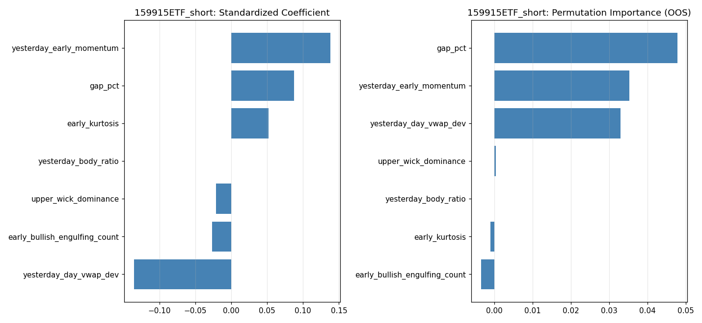<br>


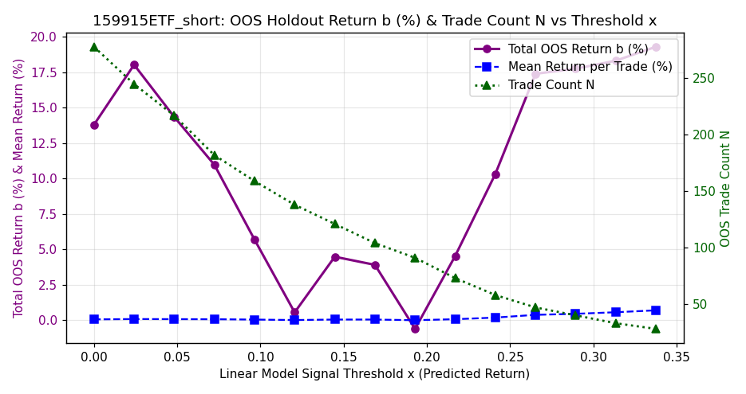<br>


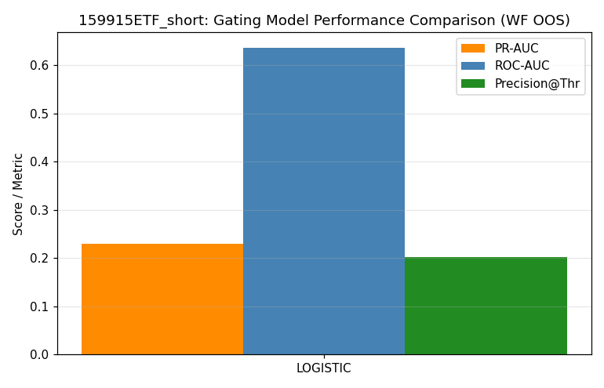<br>


</details>

## 5. Comparison to Baselines

Four baselines evaluated on the same holdout set:

1. **Zero** (no-skill): Always predicts 0. IC=0 by definition.
2. **Yesterday trade_return**: Autocorrelation baseline. Tests if trade returns are predictable from prior day.
3. **First 30-min return (up to decision time)**: Momentum baseline. Tests AM-to-PM momentum.
4. **Ridge Base**: Ridge regression with alpha=1.0 on all candidate features (238 features). Controls for tuning/selection lift.

| ETF/Tag | Best Linear IC > Ridge Base IC? | Best Linear IC > Mom IC? | Best Baseline |
|---------|---------------------------------|--------------------------|---------------|
| 300ETF_long | No | No | ridge (IC=+0.1183) |
| 300ETF_short | No | No | ridge (IC=+0.1183) |
| 50ETF_long | No | Yes | ridge (IC=+0.1178) |
| 50ETF_short | No | Yes | ridge (IC=+0.1178) |
| 500ETF_long | No | Yes | ridge (IC=+0.1348) |
| 500ETF_short | No | No | ridge (IC=+0.1348) |
| 588000ETF_long | No | No | first_30min_mom (IC=+0.0184) |
| 588000ETF_short | Yes | Yes | first_30min_mom (IC=+0.0184) |
| 159915ETF_long | Yes | Yes | first_30min_mom (IC=+0.0808) |
| 159915ETF_short | Yes | Yes | first_30min_mom (IC=+0.0808) |

## 6. Risk of Overfitting

### 6.1 IS vs OOS Gap

| ETF/Tag | IS IC | OOS IC | Gap | Assessment |
|---------|-------|--------|-----|-----------|
| 300ETF_long | 0.1092 | -0.0200 | +0.1292 | Low |
| 300ETF_short | 0.0232 | -0.0480 | +0.0712 | Low |
| 50ETF_long | 0.1281 | 0.0340 | +0.0942 | Low |
| 50ETF_short | 0.1235 | 0.0616 | +0.0619 | Low |
| 500ETF_long | 0.1641 | 0.1306 | +0.0335 | Low |
| 500ETF_short | 0.1183 | 0.1084 | +0.0099 | Low |
| 588000ETF_long | 0.1433 | -0.0529 | +0.1962 | Low |
| 588000ETF_short | 0.1401 | 0.0798 | +0.0603 | Low |
| 159915ETF_long | 0.1219 | 0.1098 | +0.0120 | Low |
| 159915ETF_short | 0.1136 | 0.1139 | -0.0003 | Low |

### 6.2 Regime Breakdown (Year-by-Year)

See per-ETF year-by-year tables in §4. Large year-to-year IC variance signals regime sensitivity.

### 6.3 Purge-Gap Sensitivity

If IC drops sharply as purge gap increases from 0→5→10, it indicates short-term leakage.

| ETF/Tag | Gap=0 | Gap=5 | Gap=10 | Delta(0→10) |
|---------|-------|-------|--------|------------|
| 300ETF_long | +0.0312 | +0.0326 | +0.0308 | +0.0004 |
| 300ETF_short | +0.0382 | +0.0380 | +0.0387 | -0.0006 |
| 50ETF_long | +0.0570 | +0.0571 | +0.0569 | +0.0001 |
| 50ETF_short | +0.0526 | +0.0522 | +0.0527 | -0.0001 |
| 500ETF_long | +0.1093 | +0.1096 | +0.1095 | -0.0003 |
| 500ETF_short | +0.1058 | +0.1054 | +0.1042 | +0.0016 |
| 588000ETF_long | +0.0585 | +0.0588 | +0.0593 | -0.0008 |
| 588000ETF_short | +0.0879 | +0.0883 | +0.0880 | -0.0001 |
| 159915ETF_long | +0.0685 | +0.0684 | +0.0684 | +0.0001 |
| 159915ETF_short | +0.0947 | +0.0945 | +0.0952 | -0.0005 |

### 6.4 Feature Importance Stability

Compare standardized coefficients vs permutation importance (OOS) across features. Large divergence indicates overfitting to specific features.

### 6.5 Top-5 Features: Standardized Coefficient vs Permutation


**300ETF_long**:

| Rank | Standardized Coefficient (Abs) | Permutation Importance |
|------|--------------------------------|----------------------|
| 1 | sma100_dist (-0.0582) | sma100_dist (+0.006911) |
| 2 | intraday_bullish_fvg (+0.0373) | early_skew (+0.000027) |
| 3 | consecutive_higher_highs (+0.0311) | vol_gk10 (+0.000020) |
| 4 | early_skew (+0.0040) | early_range (+0.000000) |
| 5 | vol_gk10 (+0.0010) | early_realized_vol (+0.000000) |

**300ETF_short**:

| Rank | Standardized Coefficient (Abs) | Permutation Importance |
|------|--------------------------------|----------------------|
| 1 | bb_width (-0.0474) | northbound_net (+0.000121) |
| 2 | inside_bar_failure_bull (-0.0436) | gap_pct (+0.000000) |
| 3 | northbound_net (+0.0435) | early_realized_vol (+0.000000) |
| 4 | early_range (+0.0000) | early_range (+0.000000) |
| 5 | early_realized_vol (+0.0000) | early_trend (+0.000000) |

**50ETF_long**:

| Rank | Standardized Coefficient (Abs) | Permutation Importance |
|------|--------------------------------|----------------------|
| 1 | margin_net_buy (-0.0858) | margin_net_buy (+0.011658) |
| 2 | yesterday_body_ratio (-0.0601) | yesterday_body_ratio (+0.003648) |
| 3 | yesterday_early_range (+0.0489) | early_realized_vol (+0.000000) |
| 4 | decision_bar_body (+0.0450) | early_range (+0.000000) |
| 5 | gap_pct (+0.0000) | gap_pct (+0.000000) |

**50ETF_short**:

| Rank | Standardized Coefficient (Abs) | Permutation Importance |
|------|--------------------------------|----------------------|
| 1 | adx_opening (+0.0648) | adx_opening (+0.010804) |
| 2 | northbound_net (+0.0444) | bar_vol_2 (+0.006009) |
| 3 | gap_pct (+0.0437) | gap_pct (+0.002308) |
| 4 | bar_vol_2 (-0.0406) | iv (+0.001825) |
| 5 | yesterday_day_late_mom (+0.0249) | yesterday_day_late_mom (+0.001070) |

**500ETF_long**:

| Rank | Standardized Coefficient (Abs) | Permutation Importance |
|------|--------------------------------|----------------------|
| 1 | max_up_ret (+0.1786) | max_up_ret (+0.041596) |
| 2 | sma100_dist (-0.0671) | sma100_dist (+0.004327) |
| 3 | early_realized_vol (+0.0000) | early_realized_vol (+0.000000) |
| 4 | early_range (+0.0000) | early_range (+0.000000) |
| 5 | early_trend (+0.0000) | early_trend (+0.000000) |

**500ETF_short**:

| Rank | Standardized Coefficient (Abs) | Permutation Importance |
|------|--------------------------------|----------------------|
| 1 | bar_vwap_dev_2 (+0.0952) | bar_vwap_dev_2 (+0.017977) |
| 2 | yesterday_intraday_close_position (+0.0784) | yesterday_early_vwap_dev (+0.009627) |
| 3 | bb_width (-0.0607) | gap_pct (+0.009101) |
| 4 | gap_pct (+0.0585) | yesterday_intraday_close_position (+0.007480) |
| 5 | yesterday_early_vwap_dev (+0.0583) | bb_width (+0.001842) |

**588000ETF_long**:

| Rank | Standardized Coefficient (Abs) | Permutation Importance |
|------|--------------------------------|----------------------|
| 1 | pullback_depth_max (-0.1573) | pullback_depth_max (+0.006435) |
| 2 | vol5 (+0.0684) | gap_pct (+0.000000) |
| 3 | early_realized_vol (+0.0000) | early_realized_vol (+0.000000) |
| 4 | early_range (+0.0000) | early_range (+0.000000) |
| 5 | early_trend (+0.0000) | early_trend (+0.000000) |

**588000ETF_short**:

| Rank | Standardized Coefficient (Abs) | Permutation Importance |
|------|--------------------------------|----------------------|
| 1 | volume_weighted_price_position (+0.0814) | volume_weighted_price_position (+0.018217) |
| 2 | gap_pct (+0.0000) | gap_pct (+0.000000) |
| 3 | early_realized_vol (+0.0000) | early_realized_vol (+0.000000) |
| 4 | early_range (+0.0000) | early_range (+0.000000) |
| 5 | early_trend (+0.0000) | early_trend (+0.000000) |

**159915ETF_long**:

| Rank | Standardized Coefficient (Abs) | Permutation Importance |
|------|--------------------------------|----------------------|
| 1 | yesterday_day_vwap_dev (-0.1134) | yesterday_day_vwap_dev (+0.016984) |
| 2 | sma100_dist (-0.1011) | sma100_dist (+0.008209) |
| 3 | yesterday_early_realized_vol (+0.0870) | yesterday_early_realized_vol (+0.007301) |
| 4 | early_realized_vol (+0.0000) | early_realized_vol (+0.000000) |
| 5 | gap_pct (+0.0000) | gap_pct (+0.000000) |

**159915ETF_short**:

| Rank | Standardized Coefficient (Abs) | Permutation Importance |
|------|--------------------------------|----------------------|
| 1 | yesterday_early_momentum (+0.1381) | gap_pct (+0.047809) |
| 2 | yesterday_day_vwap_dev (-0.1353) | yesterday_early_momentum (+0.035272) |
| 3 | gap_pct (+0.0877) | yesterday_day_vwap_dev (+0.032994) |
| 4 | early_kurtosis (+0.0522) | upper_wick_dominance (+0.000511) |
| 5 | early_bullish_engulfing_count (-0.0265) | early_realized_vol (+0.000000) |

### 6.6 Hyperparameter Sensitivity

Optuna parameter importance shows which parameters most affect CV IC.

- **300ETF_long**: Most influential = `top_k_features` (82.22%)
- **300ETF_short**: Most influential = `top_k_features` (85.41%)
- **50ETF_long**: Most influential = `top_k_features` (86.25%)
- **50ETF_short**: Most influential = `top_k_features` (90.71%)
- **500ETF_long**: Most influential = `top_k_features` (78.16%)
- **500ETF_short**: Most influential = `top_k_features` (58.59%)
- **588000ETF_long**: Most influential = `top_k_features` (95.23%)
- **588000ETF_short**: Most influential = `top_k_features` (63.60%)
- **159915ETF_long**: Most influential = `top_k_features` (74.11%)
- **159915ETF_short**: Most influential = `top_k_features` (82.44%)

## 7. Sensitivity to Prediction Time (Bar Count Comparison)

To determine how early the trade_return prediction can be made, we evaluated model performance across different morning bar counts (target = `trade_return`: open[decision_bar+1] -> close[EXIT_BAR] using ETF prices, with features computed from Index data):
- **9:45 AM (3 bars)**: First 15 minutes of trading (9:30–9:45)
- **9:50 AM (4 bars)**: First 20 minutes of trading (9:30–9:50)
- **9:55 AM (5 bars)**: First 25 minutes of trading (9:30–9:55)
- **10:00 AM (6 bars)**: First 30 minutes of trading (9:30–10:00) [Original Baseline]

> [!IMPORTANT]
> **Look-Ahead Bias Correction**: To prevent any look-ahead bias, volume normalization in these experiments uses a rolling 20-day historical average of daily volume shifted by 1 day (i.e. expected bar volume = `yesterday_rolling_20d_daily_volume / 48`), ensuring zero future information leaks into the features.

### 7.1 Performance Summary by Bar Count

| ETF | Bar Count | Prediction Time | Selected Model | Features | Holdout IC | Holdout Dir | L/S Sharpe |
|-----|-----------|-----------------|----------------|----------|------------|-------------|------------|
| **300ETF** | 3 | 9:45 (3 bar) | RIDGE | 30 | +0.0212 | 0.482 | +1.46 |
|  | 4 | 9:50 (4 bar) | HUBER | 27 | +0.0449 | 0.487 | +0.92 |
|  | 5 | 9:55 (5 bar) | HUBER | 20 | +0.0632 | 0.504 | **+1.93** |
|  | 6 | 10:00 (6 bar) | HUBER | 14 | **+0.0770** | 0.507 | +1.72 |
| | | | | | | | |
| **50ETF** | 3 | 9:45 (3 bar) | HUBER | 10 | -0.0233 | 0.533 | -0.58 |
|  | 4 | 9:50 (4 bar) | HUBER | 13 | -0.0029 | 0.513 | +0.70 |
|  | 5 | 9:55 (5 bar) | HUBER | 13 | +0.0047 | 0.504 | -0.27 |
|  | 6 | 10:00 (6 bar) | HUBER | 27 | **+0.0188** | 0.507 | **+1.63** |
| | | | | | | | |
| **500ETF** | 3 | 9:45 (3 bar) | HUBER | 9 | +0.1369 | 0.564 | +2.54 |
|  | 4 | 9:50 (4 bar) | LASSO | 11 | +0.0880 | 0.549 | +1.12 |
|  | 5 | 9:55 (5 bar) | HUBER | 24 | **+0.1466** | 0.551 | +2.39 |
|  | 6 | 10:00 (6 bar) | RIDGE | 26 | +0.1149 | 0.551 | **+3.07** |
| | | | | | | | |
| **588000ETF** | 3 | 9:45 (3 bar) | ELASTICNET | 19 | -0.0213 | 0.492 | -0.37 |
|  | 4 | 9:50 (4 bar) | LASSO | 33 | **+0.0082** | 0.492 | +0.70 |
|  | 5 | 9:55 (5 bar) | ELASTICNET | 31 | -0.0283 | 0.484 | **+0.75** |
|  | 6 | 10:00 (6 bar) | LASSO | 23 | -0.0630 | 0.469 | -1.09 |
| | | | | | | | |
| **159915ETF** | 3 | 9:45 (3 bar) | RIDGE | 44 | +0.2032 | 0.578 | **+4.68** |
|  | 4 | 9:50 (4 bar) | HUBER | 12 | +0.2117 | 0.595 | +4.43 |
|  | 5 | 9:55 (5 bar) | ELASTICNET | 14 | **+0.2164** | 0.591 | +4.41 |
|  | 6 | 10:00 (6 bar) | ELASTICNET | 13 | +0.1802 | 0.571 | +3.98 |
| | | | | | | | |

### 7.2 Key Insights & Observations

1. **Window Duration vs. Model Maturity**:
   - For blue-chip ETFs (**300ETF** and **50ETF**), predictive accuracy improves monotonically as the morning observation window expands. 300ETF holdout IC climbs from `+0.0212` (9:45 AM) to `+0.0770` (10:00 AM) in experiments. This indicates that blue-chip index momentum requires a full 30-minute digestion period to become highly predictive.
2. **Early Peak Signals in Chinext/Mid-Cap**:
   - For high-beta/growth index ETFs (**159915ETF** and **500ETF**), prediction power peaks *before* 10:00 AM:
     - **159915ETF** achieves its highest Holdout IC at 9:55 AM (`+0.2164`, L/S Sharpe `+4.41`), and its highest L/S Sharpe at 9:45 AM (`+4.68`, Holdout IC `+0.2032`).
     - **500ETF** holds high predictive power at 9:45 AM (`+0.1369`, L/S Sharpe `+2.54`), peaking in Holdout IC at 9:55 AM (`+0.1466`).
     - *Rationale*: Opening cross and morning price action in mid-cap/growth stock structures are rich with early direction info. Waiting until 10:00 AM dilutes this signal as daily variance decays.
3. **Execution Edge**:
   - These findings indicate we can deploy day-models for **159915ETF** and **500ETF** as early as **9:45 AM** or **9:50 AM** with superior predictive stats. This gives execution models (e.g. limit entry solvers) more time to enter before the afternoon session.

## 8. Conclusions & Caveats

**Potentially deployable** (IC>0.03, L/S Sharpe>0.5, beats Ridge Base): 588000ETF_short, 159915ETF_long, 159915ETF_short

**Marginal** (positive IC but weak Sharpe or below Ridge Base): 50ETF_long, 50ETF_short, 500ETF_long, 500ETF_short

**Weak/Not recommended** (negative IC or no edge): 300ETF_long, 300ETF_short, 588000ETF_long


**Key caveats**:

1. Trade return prediction is inherently noisy (low signal-to-noise ratio)
2. Feature selection using block bootstrap stability scores handles highly correlated features much better than greedy RFE
3. Robust Huber datafits (used in both `skglm_huber_l1` and `skglm_mcp` models) handle extreme outlier days much better than standard MSE-based models
4. Transaction costs and execution slippage are not modeled here
