# Day-Model Linear Trade Return Predictor — Report

*Generated by `generate_report.py`*

## 1. Executive Summary

Optuna-tuned linear models (Ridge, Lasso, ElasticNet, HuberRegressor) predicting entry-to-exit trade return (entry at open of decision_bar+1, exit at close of exit_bar (14:30)) using features and indicators calculated from daily and intraday Index data directly (to eliminate look-ahead bias and accelerate computation), while executing trades on the actual ETF (to accurately reflect P&L performance). The input feature space spans early-bar features (up to decision bar close) + prior-day technical indicators. Features are robustly selected using the new TimeSeriesStabilitySelector which incorporates regime-stratified bootstrapping, randomized ElasticNet penalties, OOB IC screening, and across-fold variance filtering.

**Validation**: Purged walk-forward TimeSeriesSplit (gap=5 days, 5 folds). Optuna TPE hyperparameter search (100 trials). 20% holdout never used in tuning.


| ETF/Tag | Model | Threshold | Features | Samples | Holdout IC | Holdout Dir | L/S Sharpe | Ridge Base IC | IS-OOS Gap |
|---------|-------|-----------|----------|---------|-----------|-------------|-----------|---------------|------------|
| 300ETF_long | HUBER | 0.65 | 5/130 | 2722 | +0.0478 | 0.504 | +0.09 | +0.1028 | +0.1059 |
| 300ETF_short | RIDGE | 0.40 | 14/130 | 2722 | +0.0752 | 0.526 | +1.59 | +0.1028 | +0.0487 |
| 50ETF_long | HUBER | 0.65 | 4/130 | 2722 | +0.0116 | 0.483 | +0.94 | +0.0912 | +0.1114 |
| 50ETF_short | HUBER | 0.75 | 3/130 | 2722 | +0.1278 | 0.491 | +1.49 | +0.0912 | +0.0008 |
| 500ETF_long | HUBER | 0.65 | 4/130 | 2722 | +0.0972 | 0.500 | +1.09 | +0.1260 | +0.0776 |
| 500ETF_short | HUBER | 0.60 | 5/130 | 2722 | +0.1810 | 0.574 | +2.99 | +0.1260 | -0.0508 |
| 588000ETF_long | HUBER | 0.55 | 3/130 | 1294 | +0.0684 | 0.496 | -1.83 | +0.0168 | +0.0629 |
| 588000ETF_short | HUBER | 0.40 | 5/130 | 1294 | +0.0071 | 0.484 | +0.91 | +0.0168 | +0.1337 |
| 159915ETF_long | RIDGE | 0.75 | 3/130 | 2722 | +0.1206 | 0.450 | +1.91 | +0.0520 | +0.0047 |
| 159915ETF_short | LASSO | 0.45 | 6/130 | 2722 | +0.0982 | 0.562 | +1.27 | +0.0520 | +0.0421 |

## 2. Data & Features

### Feature Groups

| Group | Count | Features |
|-------|-------|----------|
| Early-bar (48) | 48 | gap_pct, first_30min_return, early_realized_vol, early_range, early_trend, early_momentum, first_bar_return, first_bar_volume, early_vwap_dev, early_skew, early_kurtosis, bar_ret_0, bar_ret_1, bar_ret_2, bar_ret_3... and 33 more (total 48) |
| Day-level (60) | 60 | macd_hist, sma20_dist, sma50_dist, atr14_norm, roc10, bb_pctb, vol20, sma10_dist, sma100_dist, sma200_dist, ema12_dist, rsi5, rsi21, roc5, roc20... and 45 more (total 60) |
| Yesterday (22) | 22 | yesterday_pm_return, yesterday_am_return, yesterday_gap_pct, yesterday_first_30min_return, yesterday_early_realized_vol, yesterday_early_range, yesterday_early_volume_ratio, yesterday_early_trend, yesterday_early_momentum, yesterday_first_bar_return, yesterday_first_bar_volume, yesterday_early_vwap_dev, yesterday_early_skew, yesterday_early_kurtosis, yesterday_day_range... and 7 more (total 22) |

- **Early-bar**: First `decision_bar+1` five-minute bars of Index data (see `DECISION_BAR` dict in `build_features.py`). Bars beyond `decision_bar` padded with 0.0. Strictly causal — no look-ahead.
- **Day-level**: Technical indicators and 3rd party flows calculated using daily and intraday Index data directly, shifted by 1 day (no look-ahead).
- **Yesterday**: Shifted full-day and early-bar features of Index data from day t-1 (no look-ahead).
- **Target**: `trade_return` = log(close[EXIT_BAR] / open[decision_bar+1]) using ETF prices to accurately reflect actual daytrade P&L (entry at next-bar open after decision, exit at 14:30 close).
- **Diagnostic target**: `pm_return` (bars 24..47, 13:00→15:00) of the ETF, retained for IC sanity-checks vs the old baseline — do NOT train on it.
- **Warmup**: First 60 rows dropped (SMA50/ATR14 burn-in).

## 3. Methodology

### Purged Walk-Forward Validation & Feature Selection

- **TimeSeriesSplit**: 5 folds expanding window.
- **Purge gap**: 5 trading days between train and test.
- **Stability Selection**: 50 block bootstrap trials (block length 20 days) using `LassoCV` as the base selector. Stability scores computed on the dev set.

- **Tuning**: The stability selection threshold is searched via Optuna in walk-forward CV over $[0.40, 0.90]$ to find the globally most robust subset.

- **Optuna objective**: mean Spearman rank IC across folds (100 trials)

### Search Space

| Parameter | Range / Options |
|-----------|-----------------|
| model_type | ridge, lasso, elasticnet, huber |
| stability_threshold | 0.40–0.90 (step 0.05) |
| **Ridge** alpha | $10^{-3}$–$10^4$ (log) |
| **Lasso** alpha | $10^{-5}$–$1.0$ (log) |
| **ElasticNet** alpha, l1_ratio | alpha: $10^{-5}$–$1.0$ (log), l1_ratio: 0.0–1.0 |
| **HuberRegressor** alpha, epsilon | alpha: $10^{-4}$–$10^4$ (log), epsilon: 1.0–2.0 |

## 4. Results

### 300ETF_long

- **Selected Model**: HUBER
- **Tuned Stability Threshold**: 0.65
- **Samples**: 2722 (2015-04-07 → 2026-06-17)
- **Holdout**: 544 days (2024-03-19 → 2026-06-17)
- **Target stats**: mean=0.0125%, std=0.9550%, Sharpe=0.21
- **Selected features (5)**: `early_skew, bar_body_rng_0, max_up_ret, sma100_dist, yesterday_early_range`

#### Feature Stability Scores (Block Bootstrap)

<details>
<summary><b>Click to expand Feature Stability Scores (Block Bootstrap) Table</b></summary>

| Feature | Stability Score | Status | Pearson $r$ | Spearman $\rho$ | Monotonicity Score | Mutual Info | Quality Rating | Holdout IC | Yearly ICs | Yearly IC Std |
|---------|-----------------|--------|-------------|-----------------|--------------------|-------------|----------------|------------|------------|---------------|
| sma100_dist | 78.0% | **Selected** | -0.0790 | -0.0440 | -0.70 | 0.0350 | ** Moderate Monotonic | -0.0390 | 15:-0.18 16:-0.09 17:-0.01 18:-0.05 19:-0.16 20:-0.08 21:-0.14 22:-0.07 23:-0.09 24:-0.06 25:-0.01 26:-0.16 | 0.0535 |
| early_skew | 77.6% | **Selected** | +0.0386 | +0.0356 | +0.70 | 0.0035 | ** Moderate Monotonic | +0.0137 | 15:+0.11 16:+0.05 17:+0.08 18:-0.02 19:+0.04 20:+0.07 21:-0.03 22:+0.10 23:-0.00 24:+0.01 25:-0.00 26:+0.08 | 0.0469 |
| yesterday_early_range | 77.2% | **Selected** | +0.0278 | +0.0063 | +0.80 | 0.0409 | ** Moderate Monotonic | -0.0142 | 15:+0.13 16:-0.02 17:+0.06 18:+0.05 19:-0.05 20:+0.01 21:-0.09 22:-0.02 23:-0.04 24:+0.01 25:+0.02 26:-0.06 | 0.0579 |
| bar_body_rng_0 | 74.4% | **Selected** | +0.1072 | +0.0952 | +1.00 | 0.0073 | *** Strong Monotonic | +0.0300 | 15:+0.22 16:+0.12 17:+0.03 18:+0.20 19:+0.07 20:-0.00 21:+0.16 22:-0.00 23:+0.14 24:+0.07 25:+0.07 26:-0.10 | 0.0883 |
| max_up_ret | 65.2% | **Selected** | +0.1202 | +0.0819 | +0.80 | 0.0075 | ** Moderate Monotonic | +0.0000 | 15:+0.18 16:+0.10 17:+0.03 18:+0.19 19:+0.01 20:+0.05 21:+0.15 22:-0.03 23:+0.14 24:+0.10 25:+0.04 26:-0.16 | 0.0956 |
| vol_gk10 | 64.8% | Pruned | +0.0401 | +0.0292 | +0.80 | 0.0392 | ** Moderate Monotonic | +0.0255 | 15:+0.04 16:+0.03 17:+0.09 18:+0.01 19:-0.04 20:-0.06 21:+0.04 22:+0.11 23:+0.01 24:+0.10 25:+0.06 26:+0.01 | 0.0504 |
| bar_rng_0 | 61.6% | Pruned | +0.0222 | +0.0309 | +0.70 | 0.0477 | ** Moderate Monotonic | +0.0035 | 15:-0.04 16:+0.09 17:+0.05 18:+0.06 19:-0.08 20:+0.08 21:+0.01 22:+0.02 23:-0.02 24:+0.11 25:-0.04 26:+0.07 | 0.0573 |
| yesterday_day_range | 61.6% | Pruned | +0.0105 | +0.0062 | +0.50 | 0.0906 | * Non-Monotonic / Weak | -0.0360 | 15:+0.10 16:-0.02 17:+0.09 18:-0.06 19:+0.06 20:-0.06 21:+0.02 22:-0.07 23:-0.06 24:+0.03 25:+0.01 26:-0.05 | 0.0600 |
| yesterday_day_close_pos | 59.6% | Pruned | -0.0314 | -0.0382 | -0.90 | 0.0271 | *** Strong Monotonic | -0.0594 | 15:+0.01 16:-0.15 17:+0.01 18:-0.06 19:-0.12 20:-0.01 21:-0.00 22:-0.04 23:-0.01 24:-0.00 25:-0.06 26:-0.11 | 0.0516 |
| yesterday_early_realized_vol | 58.4% | Pruned | +0.0256 | +0.0150 | +0.30 | 0.0216 | * Non-Monotonic / Weak | +0.0239 | 15:+0.13 16:+0.09 17:-0.06 18:+0.05 19:-0.05 20:-0.05 21:+0.01 22:-0.07 23:-0.13 24:+0.09 25:+0.00 26:+0.01 | 0.0742 |
| bar_rng_2 | 56.0% | Pruned | +0.0092 | +0.0017 | +0.20 | 0.0663 | * Non-Monotonic / Weak | -0.0829 | 15:+0.08 16:-0.07 17:+0.01 18:+0.02 19:-0.03 20:+0.01 21:-0.01 22:-0.02 23:+0.11 24:+0.05 25:-0.12 26:-0.10 | 0.0654 |
| yesterday_gap_pct | 49.6% | Pruned | -0.0003 | +0.0194 | +0.60 | 0.0000 | ** Moderate Monotonic | +0.0296 | 15:+0.06 16:-0.08 17:-0.05 18:-0.06 19:+0.05 20:+0.02 21:+0.11 22:+0.05 23:+0.01 24:+0.02 25:+0.07 26:-0.02 | 0.0536 |
| total_path_length | 46.8% | Pruned | +0.0298 | +0.0328 | +0.90 | 0.0553 | *** Strong Monotonic | -0.0158 | 15:-0.04 16:+0.06 17:+0.04 18:+0.06 19:+0.01 20:+0.10 21:+0.02 22:-0.05 23:+0.12 24:+0.06 25:-0.08 26:+0.08 | 0.0601 |
| capital_net_value | 46.0% | Pruned | -0.0252 | -0.0462 | -0.60 | 0.0142 | ** Moderate Monotonic | -0.0077 | 15:+nan 16:+nan 17:-0.04 18:+0.04 19:-0.17 20:-0.10 21:-0.08 22:-0.07 23:+0.03 24:-0.06 25:-0.00 26:+0.02 | nan |
| yesterday_early_vwap_dev | 45.6% | Pruned | +0.0745 | +0.0406 | +0.60 | 0.0191 | ** Moderate Monotonic | +0.0473 | 15:+0.06 16:-0.02 17:+0.09 18:+0.07 19:+0.01 20:+0.13 21:-0.06 22:+0.03 23:-0.05 24:+0.03 25:+0.05 26:+0.05 | 0.0543 |
| bar_rng_3 | 43.6% | Pruned | +0.0018 | +0.0070 | +0.30 | 0.0414 | * Non-Monotonic / Weak | -0.0704 | 15:-0.00 16:+0.02 17:+0.05 18:+0.07 19:+0.06 20:+0.05 21:-0.05 22:+0.08 23:-0.07 24:+0.04 25:-0.11 26:-0.15 | 0.0728 |
| roc10 | 43.2% | Pruned | -0.0675 | -0.0325 | -0.50 | 0.0236 | * Non-Monotonic / Weak | -0.0431 | 15:-0.09 16:-0.12 17:-0.09 18:-0.00 19:-0.07 20:-0.02 21:-0.14 22:+0.05 23:+0.02 24:-0.06 25:+0.01 26:-0.12 | 0.0600 |
| northbound_net | 43.2% | Pruned | +0.0381 | +0.0469 | +0.90 | 0.0000 | *** Strong Monotonic | -0.0416 | 15:+0.04 16:+0.01 17:-0.00 18:+0.07 19:+0.14 20:+0.05 21:+0.02 22:+0.06 23:+0.08 24:-0.01 26:+nan | nan |
| bar_rng_1 | 42.4% | Pruned | -0.0022 | +0.0162 | +0.00 | 0.0405 | * Non-Monotonic / Weak | +0.0123 | 15:-0.03 16:+0.02 17:+0.05 18:-0.02 19:+0.05 20:+0.00 21:+0.03 22:-0.11 23:+0.12 24:+0.04 25:-0.01 26:+0.06 | 0.0544 |
| yesterday_day_late_mom | 42.4% | Pruned | +0.0282 | -0.0038 | -0.10 | 0.0046 | * Non-Monotonic / Weak | -0.0514 | 15:+0.04 16:-0.01 17:+0.14 18:-0.02 19:-0.06 20:+0.07 21:-0.04 22:-0.03 23:-0.03 24:-0.05 25:+0.01 26:-0.10 | 0.0616 |
| yesterday_am_return | 41.2% | Pruned | +0.0594 | +0.0241 | +0.30 | 0.0078 | * Non-Monotonic / Weak | -0.0303 | 15:+0.15 16:+0.02 17:-0.06 18:-0.01 19:+0.05 20:+0.03 21:-0.04 22:+0.07 23:+0.08 24:-0.05 25:+0.00 26:-0.12 | 0.0700 |
| yesterday_day_vwap_dev | 41.2% | Pruned | -0.0144 | -0.0541 | -0.80 | 0.0240 | ** Moderate Monotonic | -0.0784 | 15:+0.03 16:-0.16 17:+0.01 18:-0.08 19:-0.13 20:-0.06 21:+0.00 22:-0.05 23:-0.01 24:-0.04 25:-0.08 26:-0.11 | 0.0564 |
| bar_vwap_dev_0 | 40.4% | Pruned | -0.0056 | -0.0031 | N/A | 0.0000 | N/A | N/A | N/A | N/A |
| vol5 | 40.0% | Pruned | +0.0138 | -0.0147 | -0.40 | 0.0119 | * Non-Monotonic / Weak | -0.0209 | 15:+0.10 16:-0.10 17:-0.03 18:-0.08 19:-0.01 20:-0.08 21:+0.03 22:+0.09 23:-0.12 24:-0.06 25:+0.02 26:+0.14 | 0.0823 |
| body_to_range_ratio | 38.0% | Pruned | +0.0057 | +0.0066 | +0.10 | 0.0000 | * Non-Monotonic / Weak | -0.0694 | 15:-0.00 16:+0.11 17:-0.08 18:+0.05 19:+0.01 20:+0.07 21:-0.09 22:+0.09 23:+0.08 24:-0.02 25:-0.11 26:-0.09 | 0.0761 |
| yesterday_pm_return | 36.8% | Pruned | -0.0015 | -0.0246 | +0.00 | 0.0063 | * Non-Monotonic / Weak | -0.0341 | 15:+0.03 16:-0.07 17:+0.01 18:-0.06 19:-0.16 20:+0.03 21:+0.01 22:+0.01 23:-0.05 24:-0.01 25:+0.01 26:-0.13 | 0.0595 |
| yesterday_early_kurtosis | 36.8% | Pruned | -0.0060 | -0.0153 | +0.20 | 0.0000 | * Non-Monotonic / Weak | -0.0239 | 15:-0.02 16:+0.03 17:-0.02 18:+0.04 19:+0.02 20:-0.06 21:+0.05 22:-0.20 23:+0.01 24:-0.04 25:+0.05 26:-0.09 | 0.0691 |
| yesterday_early_skew | 36.4% | Pruned | -0.0366 | -0.0329 | -0.80 | 0.0000 | ** Moderate Monotonic | -0.0665 | 15:-0.05 16:+0.01 17:-0.16 18:-0.09 19:+0.10 20:-0.16 21:-0.00 22:+0.01 23:+0.06 24:-0.00 25:-0.07 26:-0.11 | 0.0781 |
| yesterday_day_pm_am_vol_ratio | 36.0% | Pruned | +0.0123 | +0.0004 | +0.10 | 0.0097 | * Non-Monotonic / Weak | -0.0139 | 15:+0.02 16:+0.14 17:+0.03 18:+0.07 19:-0.16 20:-0.09 21:-0.02 22:-0.04 23:+0.01 24:+0.04 25:-0.07 26:+0.02 | 0.0762 |
| vol_ratio_10_60 | 36.0% | Pruned | +0.0087 | -0.0049 | +0.10 | 0.0160 | * Non-Monotonic / Weak | -0.0074 | 15:+0.05 16:-0.04 17:-0.02 18:+0.05 19:-0.05 20:+0.01 21:+0.06 22:-0.06 23:-0.06 24:-0.02 25:+0.05 26:+0.06 | 0.0469 |
| sma200_dist | 35.2% | Pruned | -0.0462 | -0.0186 | -0.70 | 0.0410 | ** Moderate Monotonic | -0.0385 | 15:+0.02 16:-0.05 17:-0.03 18:-0.04 19:-0.21 20:-0.08 21:-0.09 22:-0.10 23:-0.11 24:-0.08 25:-0.06 26:-0.10 | 0.0526 |
| yesterday_first_bar_return | 35.2% | Pruned | -0.0228 | +0.0267 | +0.00 | 0.0000 | * Non-Monotonic / Weak | +0.0649 | 15:+0.03 16:+0.05 17:+0.01 18:-0.12 19:+0.03 20:+0.00 21:-0.06 22:+0.06 23:+0.19 24:+0.02 25:+0.12 26:-0.01 | 0.0756 |
| gap_pct | 35.2% | Pruned | +0.0344 | +0.0234 | +0.90 | 0.0000 | *** Strong Monotonic | +0.0381 | 15:+0.07 16:+0.03 17:-0.15 18:+0.06 19:+0.04 20:+0.01 21:+0.00 22:+0.05 23:-0.01 24:-0.06 25:+0.05 26:+0.12 | 0.0677 |
| sma10_dist | 34.8% | Pruned | -0.0475 | -0.0365 | -0.90 | 0.0331 | *** Strong Monotonic | -0.0501 | 15:-0.03 16:-0.14 17:-0.10 18:+0.01 19:-0.09 20:-0.04 21:-0.07 22:+0.01 23:+0.00 24:-0.07 25:-0.04 26:-0.09 | 0.0453 |
| yesterday_day_kurtosis | 33.6% | Pruned | -0.0159 | -0.0416 | -0.60 | 0.0117 | ** Moderate Monotonic | -0.0871 | 15:+0.05 16:+0.04 17:+0.02 18:-0.06 19:-0.03 20:+0.03 21:-0.11 22:-0.06 23:-0.13 24:-0.09 25:-0.13 26:-0.07 | 0.0628 |
| aroon_osc | 33.6% | Pruned | -0.0264 | -0.0176 | -0.80 | 0.0000 | ** Moderate Monotonic | -0.0313 | 15:+0.03 16:-0.14 17:-0.05 18:-0.05 19:-0.04 20:+0.01 21:-0.11 22:+0.03 23:+0.01 24:-0.05 25:+0.04 26:-0.18 | 0.0684 |
| yesterday_day_realized_vol | 33.2% | Pruned | +0.0130 | +0.0183 | +0.50 | 0.0768 | * Non-Monotonic / Weak | -0.0286 | 15:+0.08 16:-0.02 17:+0.11 18:-0.05 19:-0.01 20:-0.02 21:+0.07 22:+0.03 23:-0.06 24:+0.09 25:-0.02 26:-0.14 | 0.0709 |
| bar_ret_2 | 32.8% | Pruned | -0.0230 | -0.0021 | -0.30 | 0.0211 | * Non-Monotonic / Weak | -0.0451 | 15:-0.03 16:-0.14 17:-0.07 18:+0.02 19:+0.05 20:+0.04 21:+0.05 22:-0.00 23:+0.05 24:-0.04 25:+0.04 26:-0.21 | 0.0817 |
| num_up_bars | 32.8% | Pruned | +0.0525 | +0.0513 | +0.80 | 0.0000 | ** Moderate Monotonic | +0.0177 | 15:-0.01 16:+0.07 17:-0.11 18:+0.11 19:+0.05 20:-0.02 21:+0.18 22:+0.07 23:+0.10 24:+0.01 25:+0.12 26:-0.17 | 0.0946 |
| bar_body_rng_1 | 32.8% | Pruned | +0.0175 | +0.0283 | +0.60 | 0.0292 | ** Moderate Monotonic | +0.0208 | 15:-0.02 16:+0.04 17:+0.04 18:+0.10 19:-0.04 20:-0.06 21:+0.12 22:-0.02 23:+0.07 24:+0.07 25:-0.01 26:-0.01 | 0.0553 |
| early_kurtosis | 32.0% | Pruned | -0.0019 | -0.0038 | +0.30 | 0.0000 | * Non-Monotonic / Weak | +0.0023 | 15:+0.10 16:-0.06 17:-0.09 18:+0.01 19:-0.15 20:+0.10 21:-0.10 22:-0.02 23:+0.07 24:+0.10 25:-0.06 26:+0.03 | 0.0838 |
| ema12_dist | 31.6% | Pruned | -0.0516 | -0.0362 | -0.80 | 0.0168 | ** Moderate Monotonic | -0.0415 | 15:-0.05 16:-0.14 17:-0.08 18:-0.01 19:-0.09 20:-0.04 21:-0.07 22:+0.02 23:-0.01 24:-0.04 25:-0.04 26:-0.10 | 0.0425 |
| early_range | 31.2% | Pruned | +0.0207 | +0.0324 | +0.90 | 0.0738 | ** Non-Linear Monotonic | -0.0513 | 15:+0.07 16:+0.07 17:+0.05 18:+0.07 19:+0.02 20:+0.07 21:-0.05 22:+0.01 23:+0.07 24:+0.04 25:-0.08 26:-0.00 | 0.0494 |
| cl_pos_in_range | 31.2% | Pruned | +0.0309 | +0.0295 | +0.90 | 0.0132 | *** Strong Monotonic | -0.0285 | 15:+0.09 16:+0.04 17:-0.08 18:-0.01 19:+0.02 20:-0.02 21:+0.13 22:+0.08 23:+0.11 24:-0.02 25:+0.08 26:-0.27 | 0.1055 |
| buy_on_margin_value | 31.2% | Pruned | -0.0191 | -0.0152 | -0.20 | 0.0354 | * Non-Monotonic / Weak | -0.0384 | 15:-0.01 16:-0.07 17:+0.03 18:-0.01 19:+0.02 20:-0.05 21:+0.05 22:-0.01 23:-0.01 24:-0.02 25:-0.06 26:+0.02 | 0.0353 |
| margin_repayment | 31.2% | Pruned | +0.0026 | +0.0011 | +0.00 | 0.0064 | * Non-Monotonic / Weak | -0.0488 | 15:+0.03 16:+0.04 17:+0.05 18:-0.01 19:-0.06 20:-0.15 21:+0.00 22:+0.03 23:-0.01 24:+0.03 25:-0.08 26:-0.00 | 0.0550 |
| margin_short_ratio | 31.2% | Pruned | +0.0166 | +0.0071 | +0.70 | 0.0000 | ** Moderate Monotonic | +0.0066 | 15:+0.03 16:-0.05 17:-0.03 18:-0.06 19:+0.16 20:-0.02 21:+0.10 22:-0.10 23:+0.01 24:+0.07 25:-0.05 26:+0.17 | 0.0831 |
| vol_ratio_5_20 | 30.8% | Pruned | -0.0107 | -0.0304 | -0.60 | 0.0000 | ** Moderate Monotonic | -0.0260 | 15:+0.09 16:-0.11 17:-0.02 18:-0.11 19:+0.03 20:-0.07 21:-0.00 22:+0.03 23:-0.11 24:-0.16 25:+0.06 26:+0.15 | 0.0911 |
| roc60 | 29.2% | Pruned | -0.0442 | -0.0160 | -0.90 | 0.0284 | *** Strong Monotonic | -0.0053 | 15:-0.07 16:-0.09 17:-0.02 18:-0.03 19:-0.11 20:-0.06 21:-0.06 22:-0.06 23:-0.03 24:-0.03 25:+0.03 26:-0.24 | 0.0652 |
| cci14 | 28.8% | Pruned | +0.0046 | +0.0118 | +0.00 | 0.0519 | * Non-Monotonic / Weak | -0.0247 | 15:-0.05 16:-0.07 17:+0.00 18:+0.04 19:-0.08 20:+0.02 21:-0.04 22:+0.16 23:+0.05 24:+0.01 25:+0.01 26:-0.07 | 0.0651 |
| bb_pctb | 27.2% | Pruned | +0.0177 | +0.0270 | +0.20 | 0.0153 | * Non-Monotonic / Weak | +0.0206 | 15:+0.04 16:+0.13 17:+0.08 18:+0.00 19:+0.09 20:+0.02 21:+0.12 22:-0.06 23:+0.02 24:+0.05 25:-0.02 26:+0.12 | 0.0573 |
| roc20 | 27.2% | Pruned | -0.0417 | -0.0251 | -0.60 | 0.0138 | ** Moderate Monotonic | -0.0463 | 15:-0.06 16:-0.08 17:-0.01 18:-0.05 19:-0.10 20:-0.01 21:-0.11 22:-0.01 23:-0.06 24:-0.03 25:-0.03 26:-0.12 | 0.0387 |
| mfi14 | 26.8% | Pruned | -0.0311 | -0.0248 | -0.20 | 0.0033 | * Non-Monotonic / Weak | -0.0445 | 15:-0.01 16:-0.05 17:-0.07 18:-0.11 19:-0.09 20:+0.07 21:-0.05 22:-0.01 23:-0.04 24:-0.09 25:+0.01 26:-0.10 | 0.0496 |
| yesterday_day_skew | 26.8% | Pruned | +0.0063 | +0.0089 | +0.70 | 0.0042 | ** Moderate Monotonic | +0.0367 | 15:+0.12 16:-0.02 17:-0.02 18:+0.00 19:+0.06 20:+0.04 21:-0.03 22:-0.01 23:-0.02 24:+0.06 25:-0.03 26:+0.13 | 0.0549 |
| rsi21 | 26.8% | Pruned | -0.0374 | -0.0258 | -0.10 | 0.0208 | * Non-Monotonic / Weak | -0.0243 | 15:-0.06 16:-0.10 17:-0.02 18:-0.04 19:-0.14 20:-0.05 21:-0.12 22:+0.02 23:-0.07 24:-0.04 25:+0.01 26:-0.14 | 0.0514 |
| margin_net_buy | 26.0% | Pruned | -0.0280 | -0.0063 | +0.00 | 0.0000 | * Non-Monotonic / Weak | -0.0131 | 15:-0.01 16:-0.03 17:-0.06 18:+0.08 19:+0.06 20:+0.08 21:+0.04 22:-0.04 23:-0.03 24:-0.13 25:+0.01 26:+0.11 | 0.0674 |
| capital_net_ratio | 26.0% | Pruned | -0.0251 | -0.0464 | -0.60 | 0.0091 | ** Moderate Monotonic | -0.0151 | 17:-0.02 18:+0.04 19:-0.16 20:-0.09 21:-0.10 22:-0.07 23:+0.03 24:-0.06 25:-0.02 26:-0.01 | 0.0567 |
| bb_width | 25.6% | Pruned | -0.0155 | -0.0173 | -0.90 | 0.0284 | *** Strong Monotonic | +0.0110 | 15:-0.02 16:+0.08 17:+0.02 18:-0.07 19:+0.03 20:+0.02 21:+0.02 22:-0.16 23:-0.12 24:-0.06 25:+0.03 26:-0.02 | 0.0671 |
| atr14_norm | 25.2% | Pruned | +0.0347 | +0.0158 | +0.30 | 0.0622 | * Non-Monotonic / Weak | -0.0003 | 15:+0.05 16:-0.02 17:+0.04 18:+0.03 19:-0.04 20:-0.06 21:+0.05 22:+0.15 23:+0.03 24:+0.06 25:+0.00 26:+0.05 | 0.0527 |
| bar_ret_1 | 24.8% | Pruned | -0.0123 | +0.0265 | +0.70 | 0.0170 | ** Moderate Monotonic | +0.0251 | 15:-0.04 16:+0.06 17:+0.01 18:+0.08 19:-0.02 20:-0.04 21:+0.11 22:-0.03 23:+0.09 24:+0.08 25:-0.01 26:+0.00 | 0.0527 |
| bar_ret_3 | 24.8% | Pruned | +0.0013 | -0.0025 | +0.00 | 0.0069 | * Non-Monotonic / Weak | -0.0231 | 15:+0.06 16:+0.08 17:-0.08 18:-0.12 19:-0.04 20:-0.01 21:+0.05 22:+0.11 23:+0.03 24:-0.08 25:+0.05 26:-0.11 | 0.0756 |
| bar_body_rng_3 | 24.8% | Pruned | -0.0051 | -0.0077 | +0.00 | 0.0000 | * Non-Monotonic / Weak | -0.0277 | 15:+0.04 16:+0.10 17:-0.10 18:-0.11 19:-0.03 20:-0.00 21:+0.03 22:+0.10 23:+0.02 24:-0.08 25:+0.03 26:-0.08 | 0.0705 |
| volume_slope | 24.4% | Pruned | +0.0151 | +0.0282 | +0.60 | 0.0000 | ** Moderate Monotonic | +0.0197 | 15:-0.02 16:-0.04 17:+0.08 18:+0.05 19:-0.01 20:-0.04 21:+0.13 22:+0.03 23:+0.04 24:-0.01 25:+0.03 26:+0.03 | 0.0475 |
| yesterday_early_trend | 24.4% | Pruned | +0.0575 | +0.0346 | +0.90 | 0.0000 | *** Strong Monotonic | +0.0280 | 15:+0.06 16:-0.03 17:+0.08 18:+0.09 19:-0.00 20:+0.17 21:-0.10 22:+0.01 23:-0.01 24:+0.03 25:+0.04 26:+0.02 | 0.0654 |
| early_realized_vol | 24.0% | Pruned | +0.0180 | +0.0263 | +0.60 | 0.0638 | ** Moderate Monotonic | +0.0328 | 15:-0.06 16:+0.06 17:+0.05 18:+0.03 19:-0.03 20:+0.04 21:+0.02 22:-0.05 23:+0.04 24:+0.07 25:-0.01 26:+0.14 | 0.0540 |
| volume_sma_ratio_long | 24.0% | Pruned | -0.0146 | -0.0054 | +0.10 | 0.0093 | * Non-Monotonic / Weak | +0.0233 | 15:-0.02 16:-0.07 17:-0.05 18:-0.01 19:-0.05 20:+0.04 21:-0.02 22:+0.11 23:-0.13 24:+0.03 25:+0.12 26:-0.06 | 0.0699 |
| roc5 | 23.6% | Pruned | -0.0323 | -0.0279 | -0.30 | 0.0098 | * Non-Monotonic / Weak | -0.0312 | 15:+0.01 16:-0.15 17:-0.19 18:+0.01 19:-0.08 20:+0.01 21:-0.04 22:-0.01 23:-0.01 24:-0.06 25:-0.02 26:-0.09 | 0.0622 |
| yesterday_first_bar_volume | 22.8% | Pruned | +0.0026 | -0.0116 | +0.20 | 0.0268 | * Non-Monotonic / Weak | +0.0067 | 15:+0.01 16:-0.10 17:+0.00 18:+0.03 19:+0.07 20:+0.01 21:-0.09 22:+0.02 23:-0.07 24:+0.00 25:+0.02 26:+0.01 | 0.0500 |
| bar_vwap_dev_1 | 22.0% | Pruned | -0.0102 | +0.0257 | +0.80 | 0.0446 | ** Moderate Monotonic | +0.0207 | 15:-0.04 16:+0.06 17:+0.01 18:+0.08 19:-0.02 20:-0.03 21:+0.11 22:-0.04 23:+0.09 24:+0.07 25:-0.02 26:-0.00 | 0.0533 |
| yesterday_early_momentum | 22.0% | Pruned | +0.0602 | +0.0376 | +0.90 | 0.0376 | *** Strong Monotonic | +0.0274 | 15:+0.05 16:-0.02 17:+0.07 18:+0.11 19:+0.01 20:+0.18 21:-0.10 22:+0.03 23:-0.01 24:+0.01 25:+0.05 26:-0.01 | 0.0675 |
| bar_vol_3 | 21.6% | Pruned | +0.0118 | -0.0198 | -0.40 | 0.0000 | * Non-Monotonic / Weak | -0.0411 | 15:-0.04 16:-0.05 17:-0.10 18:+0.02 19:-0.02 20:+0.09 21:-0.11 22:+0.01 23:+0.02 24:+0.00 25:-0.08 26:-0.02 | 0.0558 |
| volume_sma_ratio | 21.6% | Pruned | -0.0101 | -0.0142 | -0.10 | 0.0000 | * Non-Monotonic / Weak | -0.0301 | 15:+0.00 16:-0.11 17:-0.01 18:-0.00 19:+0.05 20:+0.06 21:-0.05 22:-0.03 23:-0.06 24:-0.01 25:+0.00 26:-0.06 | 0.0461 |
| bar_body_rng_2 | 21.2% | Pruned | -0.0053 | -0.0033 | -0.10 | 0.0177 | * Non-Monotonic / Weak | -0.0480 | 15:-0.06 16:-0.11 17:-0.06 18:+0.02 19:+0.03 20:+0.06 21:+0.07 22:+0.01 23:+0.06 24:-0.04 25:+0.03 26:-0.18 | 0.0737 |
| vix_diff_1d | 21.2% | Pruned | -0.0159 | -0.0117 | +0.00 | 0.0177 | * Non-Monotonic / Weak | -0.0028 | 19:+0.10 20:+0.02 21:-0.06 22:-0.06 23:-0.06 24:+0.02 25:-0.02 26:-0.04 | 0.0541 |
| stoch_d | 20.8% | Pruned | -0.0389 | -0.0347 | -0.90 | 0.0042 | *** Strong Monotonic | -0.0168 | 15:-0.04 16:-0.07 17:-0.11 18:-0.04 19:-0.12 20:-0.01 21:-0.15 22:+0.01 23:-0.05 24:-0.03 25:+0.03 26:-0.14 | 0.0559 |
| short_sell_quantity | 20.8% | Pruned | +0.0027 | +0.0135 | +0.20 | 0.0086 | * Non-Monotonic / Weak | -0.0672 | 15:-0.03 16:-0.04 17:-0.01 18:+0.06 19:+0.04 20:+0.01 21:+0.07 22:+0.02 23:+0.07 24:+0.01 25:-0.07 26:-0.20 | 0.0723 |
| first_bar_return | 20.0% | Pruned | +0.1595 | +0.0934 | +1.00 | 0.0388 | *** Strong Monotonic | +0.0181 | 15:+0.20 16:+0.12 17:+0.05 18:+0.21 19:+0.08 20:+0.02 21:+0.13 22:+0.01 23:+0.12 24:+0.08 25:+0.05 26:-0.11 | 0.0821 |
| macd_hist | 20.0% | Pruned | -0.0415 | -0.0287 | -0.10 | 0.0149 | * Non-Monotonic / Weak | -0.0547 | 15:-0.03 16:-0.05 17:-0.10 18:-0.03 19:-0.07 20:+0.00 21:-0.14 22:+0.02 23:-0.01 24:-0.05 25:-0.01 26:-0.15 | 0.0536 |
| vol_gk20 | 19.6% | Pruned | +0.0305 | +0.0200 | +0.30 | 0.0333 | * Non-Monotonic / Weak | +0.0201 | 15:+0.02 16:+0.01 17:+0.05 18:+0.01 19:-0.06 20:-0.08 21:+0.03 22:+0.14 23:+0.05 24:+0.09 25:+0.02 26:+0.06 | 0.0577 |
| max_down_ret | 19.2% | Pruned | +0.0912 | +0.0605 | +1.00 | 0.0285 | *** Strong Monotonic | +0.0232 | 15:+0.06 16:+0.10 17:-0.02 18:+0.16 19:+0.03 20:+0.05 21:+0.13 22:+0.02 23:+0.11 24:+0.05 25:+0.06 26:-0.15 | 0.0761 |
| capital_sell_volume | 19.2% | Pruned | +0.0083 | +0.0192 | +0.50 | 0.0210 | * Non-Monotonic / Weak | -0.0169 | 15:+nan 16:+nan 17:-0.01 18:-0.03 19:+0.03 20:-0.00 21:+0.08 22:+0.02 23:-0.04 24:+0.02 25:-0.01 26:-0.01 | nan |
| willr14 | 19.2% | Pruned | -0.0225 | -0.0228 | -0.60 | 0.0080 | ** Moderate Monotonic | -0.0212 | 15:-0.06 16:-0.12 17:-0.06 18:-0.01 19:-0.08 20:-0.01 21:-0.09 22:+0.04 23:-0.02 24:-0.02 25:-0.01 26:-0.12 | 0.0466 |
| northbound_sell | 17.6% | Pruned | -0.0252 | -0.0459 | -0.90 | 0.0349 | ** Non-Linear Monotonic | -0.0340 | 15:-0.03 16:-0.05 17:+0.03 18:-0.06 19:-0.12 20:-0.05 21:-0.02 22:-0.08 23:-0.05 24:+0.09 25:+nan 26:+nan | nan |
| bar_vol_1 | 16.8% | Pruned | -0.0088 | -0.0255 | -0.20 | 0.0000 | * Non-Monotonic / Weak | -0.0550 | 15:+0.00 16:-0.01 17:-0.09 18:-0.00 19:+0.02 20:+0.07 21:-0.14 22:-0.08 23:+0.03 24:-0.03 25:-0.08 26:-0.06 | 0.0585 |
| yesterday_early_volume_ratio | 16.4% | Pruned | -0.0007 | -0.0093 | +0.10 | 0.0000 | * Non-Monotonic / Weak | +0.0008 | 15:+0.01 16:-0.12 17:+0.03 18:+0.06 19:+0.07 20:+0.04 21:-0.09 22:+0.00 23:-0.08 24:-0.02 25:+0.05 26:-0.03 | 0.0611 |
| first_bar_volume | 16.0% | Pruned | -0.0066 | -0.0258 | -0.50 | 0.0175 | * Non-Monotonic / Weak | -0.0183 | 15:-0.00 16:-0.03 17:-0.11 18:-0.02 19:-0.01 20:+0.07 21:-0.13 22:-0.02 23:-0.01 24:+0.01 25:-0.06 26:-0.04 | 0.0503 |
| vix_vol_ratio | 16.0% | Pruned | -0.0024 | +0.0127 | -0.20 | 0.0109 | * Non-Monotonic / Weak | +0.0070 | 19:+0.07 20:-0.04 21:-0.01 22:-0.09 23:+0.07 24:+0.00 25:+0.01 26:-0.08 | 0.0564 |
| vol10 | 15.6% | Pruned | +0.0296 | +0.0010 | +0.10 | 0.0570 | * Non-Monotonic / Weak | -0.0235 | 15:+0.04 16:-0.07 17:-0.03 18:+0.04 19:-0.05 20:-0.06 21:+0.07 22:+0.06 23:-0.06 24:+0.02 25:-0.03 26:+0.04 | 0.0506 |
| yesterday_first_30min_return | 15.6% | Pruned | +0.0341 | +0.0402 | +0.70 | 0.0051 | ** Moderate Monotonic | +0.0454 | 15:+0.03 16:+0.01 17:+0.06 18:+0.03 19:+0.05 20:+0.13 21:-0.13 22:+0.04 23:+0.12 24:-0.01 25:+0.08 26:+0.02 | 0.0649 |
| vol60 | 15.2% | Pruned | +0.0184 | +0.0099 | +0.20 | 0.0297 | * Non-Monotonic / Weak | -0.0012 | 15:+0.03 16:-0.02 17:-0.03 18:-0.03 19:-0.06 20:-0.11 21:+0.01 22:+0.16 23:-0.02 24:+0.06 25:-0.06 26:-0.02 | 0.0644 |
| iv | 15.2% | Pruned | -0.0231 | +0.0094 | +0.80 | 0.0366 | ** Moderate Monotonic | -0.0042 | 19:-0.03 20:-0.13 21:+0.02 22:+0.11 23:-0.01 24:+0.05 25:-0.02 26:+0.04 | 0.0657 |
| iv_diff_1d | 14.8% | Pruned | -0.0231 | -0.0179 | -0.80 | 0.0083 | ** Moderate Monotonic | +0.0402 | 19:+0.01 20:-0.07 21:-0.07 22:-0.05 23:-0.05 24:+0.00 25:+0.05 26:+0.04 | 0.0462 |
| bar_ret_0 | 14.8% | Pruned | +0.1595 | +0.0934 | +1.00 | 0.0388 | *** Strong Monotonic | +0.0181 | 15:+0.20 16:+0.12 17:+0.05 18:+0.21 19:+0.08 20:+0.02 21:+0.13 22:+0.01 23:+0.12 24:+0.08 25:+0.05 26:-0.11 | 0.0821 |
| iv_vol_ratio | 14.0% | Pruned | -0.0145 | -0.0025 | -0.80 | 0.0164 | ** Moderate Monotonic | +0.0044 | 19:+0.08 20:-0.12 21:-0.01 22:-0.09 23:+0.05 24:-0.04 25:+0.01 26:-0.02 | 0.0613 |
| stoch_k | 13.2% | Pruned | -0.0316 | -0.0291 | -0.70 | 0.0000 | ** Moderate Monotonic | -0.0258 | 15:-0.06 16:-0.09 17:-0.10 18:-0.01 19:-0.11 20:+0.01 21:-0.12 22:+0.02 23:-0.04 24:-0.03 25:-0.01 26:-0.15 | 0.0535 |
| bar_vwap_dev_2 | 12.8% | Pruned | -0.0221 | +0.0112 | +0.10 | 0.0422 | * Non-Monotonic / Weak | -0.0411 | 15:-0.03 16:-0.04 17:-0.04 18:+0.05 19:+0.03 20:-0.01 21:+0.09 22:-0.02 23:+0.11 24:+0.01 25:+0.02 26:-0.22 | 0.0803 |
| northbound_buy | 12.8% | Pruned | -0.0184 | -0.0413 | -0.80 | 0.0121 | ** Moderate Monotonic | -0.0373 | 15:+0.04 16:-0.05 17:+0.01 18:+0.02 19:-0.06 20:-0.03 21:-0.02 22:-0.03 23:-0.01 24:+0.07 25:+nan 26:+nan | nan |
| vix_iv_spread | 12.8% | Pruned | +0.0440 | +0.0576 | +0.80 | 0.0187 | ** Moderate Monotonic | +0.0185 | 19:-0.08 20:+0.11 21:+0.01 22:+0.06 23:+0.07 24:+0.16 25:+0.04 26:-0.17 | 0.0984 |
| sma20_dist | 12.4% | Pruned | -0.0591 | -0.0422 | -0.70 | 0.0228 | ** Moderate Monotonic | -0.0354 | 15:-0.06 16:-0.15 17:-0.07 18:-0.05 19:-0.11 20:-0.04 21:-0.12 22:+0.01 23:-0.04 24:-0.05 25:-0.02 26:-0.12 | 0.0450 |
| rsi5 | 12.4% | Pruned | -0.0227 | -0.0272 | -0.60 | 0.0000 | ** Moderate Monotonic | -0.0335 | 15:-0.05 16:-0.14 17:-0.08 18:+0.02 19:-0.08 20:-0.01 21:-0.09 22:+0.04 23:+0.00 24:-0.05 25:-0.03 26:-0.10 | 0.0506 |
| short_balance_quantity | 12.4% | Pruned | +0.0155 | +0.0354 | +0.60 | 0.0000 | ** Moderate Monotonic | -0.0206 | 15:-0.00 16:+0.07 17:+0.02 18:+0.08 19:-0.13 20:+0.02 21:-0.07 22:+0.11 23:+0.02 24:-0.03 25:+0.03 26:-0.17 | 0.0799 |
| bar_vol_0 | 12.0% | Pruned | -0.0066 | -0.0258 | -0.50 | 0.0175 | * Non-Monotonic / Weak | -0.0183 | 15:-0.00 16:-0.03 17:-0.11 18:-0.02 19:-0.01 20:+0.07 21:-0.13 22:-0.02 23:-0.01 24:+0.01 25:-0.06 26:-0.04 | 0.0503 |
| capital_sell_value | 12.0% | Pruned | -0.0012 | +0.0172 | -0.20 | 0.0369 | * Non-Monotonic / Weak | -0.0148 | 15:+nan 16:+nan 17:-0.01 18:-0.03 19:+0.00 20:-0.02 21:+0.07 22:+0.01 23:-0.05 24:+0.02 25:-0.01 26:-0.01 | nan |
| short_repayment_quantity | 12.0% | Pruned | +0.0011 | -0.0168 | -0.70 | 0.0263 | ** Moderate Monotonic | -0.0256 | 15:+0.00 16:-0.10 17:-0.05 18:-0.06 19:-0.03 20:-0.10 21:-0.01 22:+0.08 23:-0.02 24:-0.05 25:-0.03 26:+0.06 | 0.0536 |
| short_balance | 11.2% | Pruned | -0.0005 | +0.0260 | +0.20 | 0.0008 | * Non-Monotonic / Weak | -0.0194 | 15:-0.10 16:+0.03 17:+0.02 18:+0.07 19:-0.15 20:+0.01 21:-0.09 22:+0.09 23:+0.00 24:-0.06 25:+0.03 26:-0.22 | 0.0900 |
| sma50_dist | 10.4% | Pruned | -0.0525 | -0.0228 | -0.50 | 0.0493 | * Non-Monotonic / Weak | -0.0275 | 15:-0.07 16:-0.11 17:-0.00 18:-0.07 19:-0.12 20:-0.06 21:-0.09 22:+0.00 23:-0.07 24:-0.02 25:+0.00 26:-0.15 | 0.0480 |
| bar_vol_2 | 10.0% | Pruned | -0.0022 | -0.0311 | -0.30 | 0.0000 | * Non-Monotonic / Weak | -0.0274 | 15:-0.01 16:-0.06 17:-0.05 18:-0.03 19:-0.04 20:+0.06 21:-0.17 22:-0.05 23:+0.04 24:-0.01 25:-0.04 26:-0.01 | 0.0539 |
| vix | 10.0% | Pruned | -0.0034 | +0.0342 | +0.80 | 0.0415 | ** Moderate Monotonic | +0.0024 | 19:-0.03 20:-0.07 21:+0.01 22:+0.13 23:+0.01 24:+0.08 25:-0.01 26:-0.11 | 0.0731 |
| first_30min_return | 9.2% | Pruned | +0.0870 | +0.0575 | +1.00 | 0.0380 | *** Strong Monotonic | -0.0160 | 15:+0.10 16:+0.07 17:-0.03 18:+0.12 19:+0.02 20:+0.03 21:+0.16 22:+0.02 23:+0.13 24:+0.03 25:+0.08 26:-0.24 | 0.1002 |
| vol20 | 9.2% | Pruned | +0.0236 | +0.0064 | +0.30 | 0.0558 | * Non-Monotonic / Weak | -0.0034 | 15:+0.04 16:-0.04 17:-0.04 18:+0.01 19:-0.08 20:-0.01 21:+0.00 22:+0.13 23:-0.06 24:+0.06 25:-0.02 26:+0.05 | 0.0567 |
| margin_balance | 9.2% | Pruned | +0.0092 | +0.0299 | +0.30 | 0.0256 | * Non-Monotonic / Weak | -0.0089 | 15:-0.03 16:-0.02 17:-0.06 18:+0.04 19:+0.04 20:-0.01 21:+0.07 22:+0.01 23:+0.05 24:+0.08 25:-0.07 26:+0.08 | 0.0524 |
| early_trend | 8.0% | Pruned | -0.0201 | +0.0099 | +0.10 | 0.0626 | * Non-Monotonic / Weak | -0.0388 | 15:+0.01 16:+0.01 17:-0.08 18:-0.02 19:-0.01 20:-0.03 21:+0.12 22:+0.03 23:+0.11 24:-0.02 25:+0.05 26:-0.25 | 0.0918 |
| total_balance | 7.6% | Pruned | +0.0090 | +0.0290 | +0.40 | 0.0288 | * Non-Monotonic / Weak | -0.0112 | 15:-0.03 16:-0.02 17:-0.07 18:+0.05 19:-0.01 20:-0.00 21:+0.03 22:+0.01 23:+0.04 24:+0.08 25:-0.08 26:+0.07 | 0.0491 |
| bar_vwap_dev_3 | 6.8% | Pruned | -0.0194 | +0.0135 | +0.70 | 0.0000 | ** Moderate Monotonic | -0.0360 | 15:+0.06 16:+0.02 17:-0.11 18:-0.04 19:-0.03 20:-0.02 21:+0.12 22:+0.07 23:+0.09 24:-0.05 25:+0.06 26:-0.22 | 0.0912 |
| early_momentum | 6.0% | Pruned | -0.0182 | +0.0098 | +0.10 | 0.0362 | * Non-Monotonic / Weak | -0.0350 | 15:+0.02 16:+0.02 17:-0.08 18:-0.02 19:-0.02 20:-0.03 21:+0.12 22:+0.04 23:+0.11 24:-0.02 25:+0.05 26:-0.24 | 0.0904 |
| early_vwap_dev | 6.0% | Pruned | -0.0194 | +0.0135 | +0.70 | 0.0000 | ** Moderate Monotonic | -0.0360 | 15:+0.06 16:+0.02 17:-0.11 18:-0.04 19:-0.03 20:-0.02 21:+0.12 22:+0.07 23:+0.09 24:-0.05 25:+0.06 26:-0.22 | 0.0912 |
| vix_iv_ratio | 4.4% | Pruned | +0.0290 | +0.0629 | +0.90 | 0.0283 | ** Non-Linear Monotonic | +0.0202 | 19:-0.08 20:+0.13 21:+0.02 22:+0.03 23:+0.07 24:+0.11 25:+0.05 26:-0.12 | 0.0817 |
| vol_pk20 | 4.0% | Pruned | +0.0248 | +0.0141 | +0.40 | 0.0394 | * Non-Monotonic / Weak | +0.0050 | 15:+0.00 16:-0.01 17:+0.02 18:+0.02 19:-0.07 20:-0.08 21:+0.02 22:+0.15 23:+0.01 24:+0.07 25:+0.01 26:+0.08 | 0.0603 |
| capital_buy_volume | 2.4% | Pruned | +0.0007 | +0.0010 | -0.10 | 0.0340 | * Non-Monotonic / Weak | -0.0221 | 15:+nan 16:+nan 17:-0.01 18:-0.04 19:-0.02 20:-0.05 21:+0.04 22:-0.00 23:-0.01 24:+0.01 25:-0.01 26:-0.01 | nan |
| capital_buy_value | 2.4% | Pruned | -0.0109 | -0.0000 | -0.50 | 0.0392 | * Non-Monotonic / Weak | -0.0196 | 17:-0.01 18:-0.04 19:-0.05 20:-0.06 21:+0.03 22:-0.01 23:-0.02 24:+0.01 25:-0.01 26:-0.02 | 0.0266 |
| bar_ret_4 | 0.0% | Pruned | N/A | N/A | N/A | 0.0000 | N/A | N/A | N/A | N/A |
| bar_ret_5 | 0.0% | Pruned | N/A | N/A | N/A | 0.0000 | N/A | N/A | N/A | N/A |
| bar_vol_4 | 0.0% | Pruned | N/A | N/A | N/A | 0.0000 | N/A | N/A | N/A | N/A |
| bar_vol_5 | 0.0% | Pruned | N/A | N/A | N/A | 0.0000 | N/A | N/A | N/A | N/A |
| bar_rng_4 | 0.0% | Pruned | N/A | N/A | N/A | 0.0000 | N/A | N/A | N/A | N/A |
| bar_rng_5 | 0.0% | Pruned | N/A | N/A | N/A | 0.0000 | N/A | N/A | N/A | N/A |
| bar_body_rng_4 | 0.0% | Pruned | N/A | N/A | N/A | 0.0000 | N/A | N/A | N/A | N/A |
| bar_body_rng_5 | 0.0% | Pruned | N/A | N/A | N/A | 0.0000 | N/A | N/A | N/A | N/A |
| bar_vwap_dev_4 | 0.0% | Pruned | N/A | N/A | N/A | 0.0000 | N/A | N/A | N/A | N/A |
| bar_vwap_dev_5 | 0.0% | Pruned | N/A | N/A | N/A | 0.0000 | N/A | N/A | N/A | N/A |

- **Pearson $r$**: Linear correlation coefficient.
- **Spearman $\rho$**: Rank correlation coefficient (overall monotonic relation).
- **Monotonicity Score**: Spearman rank correlation of target means across 5 feature quintiles. $\pm 1.0$ indicates perfect bin-wise monotonicity.
- **Mutual Info**: Estimated information gain (captures non-linear dependencies).
- **Quality Rating**: Categorized by strength and shape of the monotonic relationship.
- **Holdout IC**: Spearman rank correlation on the holdout set (out-of-sample predictive power).
- **Yearly ICs**: Spearman rank correlation calculated per year.
- **Yearly IC Std**: Standard deviation of yearly ICs (measures temporal stability).

</details>

#### Metrics

| Metric | Best Linear | Ridge Base | Zero | Yesterday PM | First 30min Mom |
|--------|-------------|------------|------|--------------|-----------------|
| IC | +0.0478 | +0.1028 | +0.0000 | -0.0638 | -0.0160 |
| Dir Acc | 0.504 | 0.520 | 0.500 | 0.458 | 0.493 |
| RMSE | 0.8223% | 0.8188% | 0.8010% | 1.1427% | 0.8685% |
| L/S Sharpe | +0.09 | +2.42 | — | — | — |

#### Best Hyperparameters

<details>
<summary><b>Click to expand Best Hyperparameters JSON</b></summary>

```json
{
  "model_type": "huber",
  "stability_threshold": 0.65,
  "huber_alpha": 0.008844566159976591,
  "huber_epsilon": 1.6239231716293077
}
```

</details>

#### Walk-Forward Fold ICs

| Fold | IS IC | OOS IC |
|------|-------|--------|
| 1 | 0.2038 | +0.0595 |
| 2 | 0.1446 | +0.0830 |
| 3 | 0.1190 | +0.0451 |
| 4 | 0.1004 | +0.0728 |
| 5 | 0.0950 | -0.0191 |
| **Overall** | — | +0.0434 |

#### Year-by-Year OOS IC

| Year | IC | Dir Acc | N | L/S Sharpe |
|------|-----|---------|---|-----------|
| 2017 | +0.0595 | 0.474 | 215 | +2.26 |
| 2018 | +0.1479 | 0.469 | 243 | +3.64 |
| 2019 | +0.0928 | 0.549 | 244 | +3.32 |
| 2020 | +0.0766 | 0.473 | 243 | +3.75 |
| 2021 | +0.0635 | 0.510 | 243 | +1.27 |
| 2022 | +0.0172 | 0.475 | 242 | +0.08 |
| 2023 | +0.1264 | 0.508 | 242 | +2.87 |
| 2024 | +0.0476 | 0.500 | 242 | +0.80 |
| 2025 | +0.0393 | 0.535 | 243 | -0.01 |
| 2026 | -0.0851 | 0.463 | 108 | -2.60 |

#### Diagnostic Plots

<details>
<summary><b>Click to expand Diagnostic Plots</b></summary>

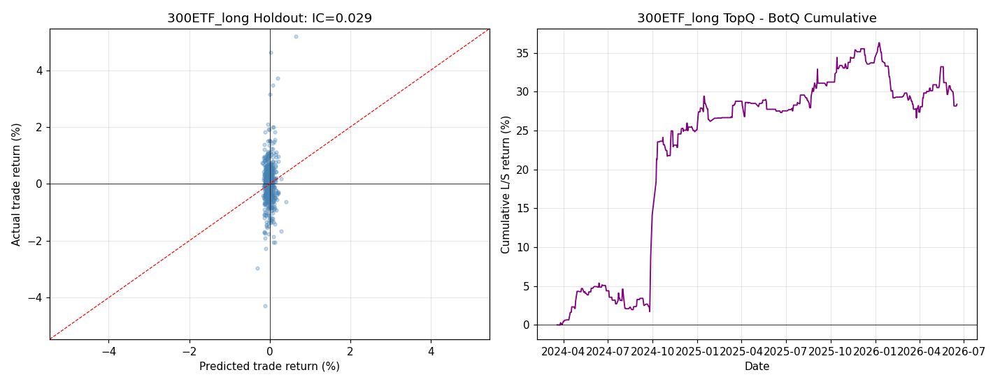


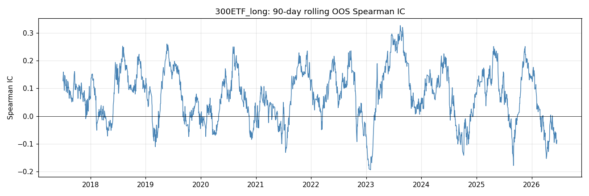


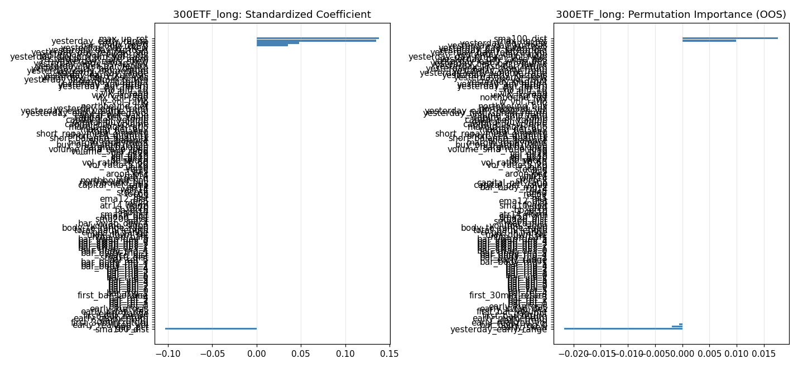


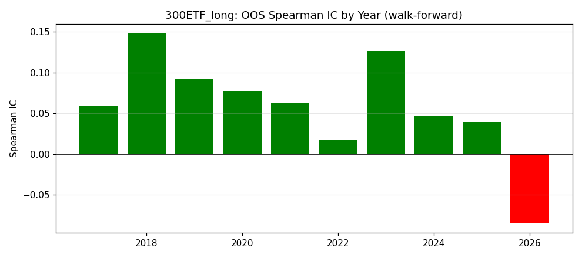


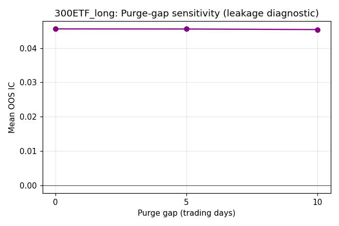


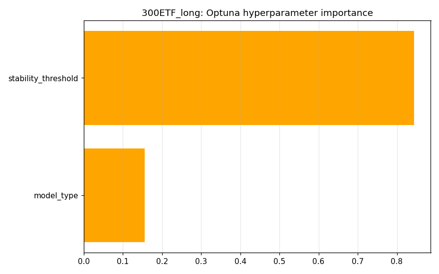


</details>

### 300ETF_short

- **Selected Model**: RIDGE
- **Tuned Stability Threshold**: 0.40
- **Samples**: 2722 (2015-04-07 → 2026-06-17)
- **Holdout**: 544 days (2024-03-19 → 2026-06-17)
- **Target stats**: mean=0.0125%, std=0.9550%, Sharpe=0.21
- **Selected features (14)**: `gap_pct, first_bar_return, bar_ret_0, bar_rng_0, bar_rng_2, body_to_range_ratio, cci14, bb_width, yesterday_gap_pct, yesterday_early_range, yesterday_first_bar_return, yesterday_early_vwap_dev, yesterday_day_close_pos, yesterday_day_late_mom`

#### Feature Stability Scores (Block Bootstrap)

<details>
<summary><b>Click to expand Feature Stability Scores (Block Bootstrap) Table</b></summary>

| Feature | Stability Score | Status | Pearson $r$ | Spearman $\rho$ | Monotonicity Score | Mutual Info | Quality Rating | Holdout IC | Yearly ICs | Yearly IC Std |
|---------|-----------------|--------|-------------|-----------------|--------------------|-------------|----------------|------------|------------|---------------|
| gap_pct | 71.2% | **Selected** | +0.0344 | +0.0234 | +0.90 | 0.0000 | *** Strong Monotonic | +0.0381 | 15:+0.07 16:+0.03 17:-0.15 18:+0.06 19:+0.04 20:+0.01 21:+0.00 22:+0.05 23:-0.01 24:-0.06 25:+0.05 26:+0.12 | 0.0677 |
| bb_width | 70.8% | **Selected** | -0.0155 | -0.0173 | -0.90 | 0.0284 | *** Strong Monotonic | +0.0110 | 15:-0.02 16:+0.08 17:+0.02 18:-0.07 19:+0.03 20:+0.02 21:+0.02 22:-0.16 23:-0.12 24:-0.06 25:+0.03 26:-0.02 | 0.0671 |
| northbound_net | 59.6% | **Selected** | +0.0381 | +0.0469 | +0.90 | 0.0000 | *** Strong Monotonic | -0.0416 | 15:+0.04 16:+0.01 17:-0.00 18:+0.07 19:+0.14 20:+0.05 21:+0.02 22:+0.06 23:+0.08 24:-0.01 26:+nan | nan |
| yesterday_am_return | 58.0% | **Selected** | +0.0594 | +0.0241 | +0.30 | 0.0078 | * Non-Monotonic / Weak | -0.0303 | 15:+0.15 16:+0.02 17:-0.06 18:-0.01 19:+0.05 20:+0.03 21:-0.04 22:+0.07 23:+0.08 24:-0.05 25:+0.00 26:-0.12 | 0.0700 |
| bar_rng_2 | 54.8% | **Selected** | +0.0092 | +0.0017 | +0.20 | 0.0663 | * Non-Monotonic / Weak | -0.0829 | 15:+0.08 16:-0.07 17:+0.01 18:+0.02 19:-0.03 20:+0.01 21:-0.01 22:-0.02 23:+0.11 24:+0.05 25:-0.12 26:-0.10 | 0.0654 |
| yesterday_day_late_mom | 54.4% | **Selected** | +0.0282 | -0.0038 | -0.10 | 0.0046 | * Non-Monotonic / Weak | -0.0514 | 15:+0.04 16:-0.01 17:+0.14 18:-0.02 19:-0.06 20:+0.07 21:-0.04 22:-0.03 23:-0.03 24:-0.05 25:+0.01 26:-0.10 | 0.0616 |
| yesterday_early_vwap_dev | 51.6% | **Selected** | +0.0745 | +0.0406 | +0.60 | 0.0191 | ** Moderate Monotonic | +0.0473 | 15:+0.06 16:-0.02 17:+0.09 18:+0.07 19:+0.01 20:+0.13 21:-0.06 22:+0.03 23:-0.05 24:+0.03 25:+0.05 26:+0.05 | 0.0543 |
| cci14 | 48.4% | **Selected** | +0.0046 | +0.0118 | +0.00 | 0.0519 | * Non-Monotonic / Weak | -0.0247 | 15:-0.05 16:-0.07 17:+0.00 18:+0.04 19:-0.08 20:+0.02 21:-0.04 22:+0.16 23:+0.05 24:+0.01 25:+0.01 26:-0.07 | 0.0651 |
| yesterday_gap_pct | 48.4% | **Selected** | -0.0003 | +0.0194 | +0.60 | 0.0000 | ** Moderate Monotonic | +0.0296 | 15:+0.06 16:-0.08 17:-0.05 18:-0.06 19:+0.05 20:+0.02 21:+0.11 22:+0.05 23:+0.01 24:+0.02 25:+0.07 26:-0.02 | 0.0536 |
| bar_rng_0 | 48.0% | **Selected** | +0.0222 | +0.0309 | +0.70 | 0.0477 | ** Moderate Monotonic | +0.0035 | 15:-0.04 16:+0.09 17:+0.05 18:+0.06 19:-0.08 20:+0.08 21:+0.01 22:+0.02 23:-0.02 24:+0.11 25:-0.04 26:+0.07 | 0.0573 |
| body_to_range_ratio | 46.4% | **Selected** | +0.0057 | +0.0066 | +0.10 | 0.0000 | * Non-Monotonic / Weak | -0.0694 | 15:-0.00 16:+0.11 17:-0.08 18:+0.05 19:+0.01 20:+0.07 21:-0.09 22:+0.09 23:+0.08 24:-0.02 25:-0.11 26:-0.09 | 0.0761 |
| bar_ret_0 | 44.4% | **Selected** | +0.1595 | +0.0934 | +1.00 | 0.0388 | *** Strong Monotonic | +0.0181 | 15:+0.20 16:+0.12 17:+0.05 18:+0.21 19:+0.08 20:+0.02 21:+0.13 22:+0.01 23:+0.12 24:+0.08 25:+0.05 26:-0.11 | 0.0821 |
| first_bar_return | 43.2% | **Selected** | +0.1595 | +0.0934 | +1.00 | 0.0388 | *** Strong Monotonic | +0.0181 | 15:+0.20 16:+0.12 17:+0.05 18:+0.21 19:+0.08 20:+0.02 21:+0.13 22:+0.01 23:+0.12 24:+0.08 25:+0.05 26:-0.11 | 0.0821 |
| yesterday_early_range | 42.4% | **Selected** | +0.0278 | +0.0063 | +0.80 | 0.0409 | ** Moderate Monotonic | -0.0142 | 15:+0.13 16:-0.02 17:+0.06 18:+0.05 19:-0.05 20:+0.01 21:-0.09 22:-0.02 23:-0.04 24:+0.01 25:+0.02 26:-0.06 | 0.0579 |
| bar_ret_3 | 41.6% | **Selected** | +0.0013 | -0.0025 | +0.00 | 0.0069 | * Non-Monotonic / Weak | -0.0231 | 15:+0.06 16:+0.08 17:-0.08 18:-0.12 19:-0.04 20:-0.01 21:+0.05 22:+0.11 23:+0.03 24:-0.08 25:+0.05 26:-0.11 | 0.0756 |
| yesterday_day_close_pos | 41.6% | **Selected** | -0.0314 | -0.0382 | -0.90 | 0.0271 | *** Strong Monotonic | -0.0594 | 15:+0.01 16:-0.15 17:+0.01 18:-0.06 19:-0.12 20:-0.01 21:-0.00 22:-0.04 23:-0.01 24:-0.00 25:-0.06 26:-0.11 | 0.0516 |
| yesterday_first_bar_return | 40.0% | **Selected** | -0.0228 | +0.0267 | +0.00 | 0.0000 | * Non-Monotonic / Weak | +0.0649 | 15:+0.03 16:+0.05 17:+0.01 18:-0.12 19:+0.03 20:+0.00 21:-0.06 22:+0.06 23:+0.19 24:+0.02 25:+0.12 26:-0.01 | 0.0756 |
| yesterday_early_skew | 40.0% | **Selected** | -0.0366 | -0.0329 | -0.80 | 0.0000 | ** Moderate Monotonic | -0.0665 | 15:-0.05 16:+0.01 17:-0.16 18:-0.09 19:+0.10 20:-0.16 21:-0.00 22:+0.01 23:+0.06 24:-0.00 25:-0.07 26:-0.11 | 0.0781 |
| bar_rng_3 | 39.2% | Pruned | +0.0018 | +0.0070 | +0.30 | 0.0414 | * Non-Monotonic / Weak | -0.0704 | 15:-0.00 16:+0.02 17:+0.05 18:+0.07 19:+0.06 20:+0.05 21:-0.05 22:+0.08 23:-0.07 24:+0.04 25:-0.11 26:-0.15 | 0.0728 |
| bar_body_rng_0 | 39.2% | Pruned | +0.1072 | +0.0952 | +1.00 | 0.0073 | *** Strong Monotonic | +0.0300 | 15:+0.22 16:+0.12 17:+0.03 18:+0.20 19:+0.07 20:-0.00 21:+0.16 22:-0.00 23:+0.14 24:+0.07 25:+0.07 26:-0.10 | 0.0883 |
| yesterday_early_kurtosis | 39.2% | Pruned | -0.0060 | -0.0153 | +0.20 | 0.0000 | * Non-Monotonic / Weak | -0.0239 | 15:-0.02 16:+0.03 17:-0.02 18:+0.04 19:+0.02 20:-0.06 21:+0.05 22:-0.20 23:+0.01 24:-0.04 25:+0.05 26:-0.09 | 0.0691 |
| yesterday_early_realized_vol | 36.4% | Pruned | +0.0256 | +0.0150 | +0.30 | 0.0216 | * Non-Monotonic / Weak | +0.0239 | 15:+0.13 16:+0.09 17:-0.06 18:+0.05 19:-0.05 20:-0.05 21:+0.01 22:-0.07 23:-0.13 24:+0.09 25:+0.00 26:+0.01 | 0.0742 |
| vol60 | 34.4% | Pruned | +0.0184 | +0.0099 | +0.20 | 0.0297 | * Non-Monotonic / Weak | -0.0012 | 15:+0.03 16:-0.02 17:-0.03 18:-0.03 19:-0.06 20:-0.11 21:+0.01 22:+0.16 23:-0.02 24:+0.06 25:-0.06 26:-0.02 | 0.0644 |
| margin_repayment | 34.0% | Pruned | +0.0026 | +0.0011 | +0.00 | 0.0064 | * Non-Monotonic / Weak | -0.0488 | 15:+0.03 16:+0.04 17:+0.05 18:-0.01 19:-0.06 20:-0.15 21:+0.00 22:+0.03 23:-0.01 24:+0.03 25:-0.08 26:-0.00 | 0.0550 |
| northbound_sell | 33.2% | Pruned | -0.0252 | -0.0459 | -0.90 | 0.0349 | ** Non-Linear Monotonic | -0.0340 | 15:-0.03 16:-0.05 17:+0.03 18:-0.06 19:-0.12 20:-0.05 21:-0.02 22:-0.08 23:-0.05 24:+0.09 25:+nan 26:+nan | nan |
| roc10 | 33.2% | Pruned | -0.0675 | -0.0325 | -0.50 | 0.0236 | * Non-Monotonic / Weak | -0.0431 | 15:-0.09 16:-0.12 17:-0.09 18:-0.00 19:-0.07 20:-0.02 21:-0.14 22:+0.05 23:+0.02 24:-0.06 25:+0.01 26:-0.12 | 0.0600 |
| early_skew | 32.8% | Pruned | +0.0386 | +0.0356 | +0.70 | 0.0035 | ** Moderate Monotonic | +0.0137 | 15:+0.11 16:+0.05 17:+0.08 18:-0.02 19:+0.04 20:+0.07 21:-0.03 22:+0.10 23:-0.00 24:+0.01 25:-0.00 26:+0.08 | 0.0469 |
| first_bar_volume | 30.0% | Pruned | -0.0066 | -0.0258 | -0.50 | 0.0175 | * Non-Monotonic / Weak | -0.0183 | 15:-0.00 16:-0.03 17:-0.11 18:-0.02 19:-0.01 20:+0.07 21:-0.13 22:-0.02 23:-0.01 24:+0.01 25:-0.06 26:-0.04 | 0.0503 |
| bar_vol_3 | 30.0% | Pruned | +0.0118 | -0.0198 | -0.40 | 0.0000 | * Non-Monotonic / Weak | -0.0411 | 15:-0.04 16:-0.05 17:-0.10 18:+0.02 19:-0.02 20:+0.09 21:-0.11 22:+0.01 23:+0.02 24:+0.00 25:-0.08 26:-0.02 | 0.0558 |
| bar_vol_0 | 29.6% | Pruned | -0.0066 | -0.0258 | -0.50 | 0.0175 | * Non-Monotonic / Weak | -0.0183 | 15:-0.00 16:-0.03 17:-0.11 18:-0.02 19:-0.01 20:+0.07 21:-0.13 22:-0.02 23:-0.01 24:+0.01 25:-0.06 26:-0.04 | 0.0503 |
| early_kurtosis | 29.6% | Pruned | -0.0019 | -0.0038 | +0.30 | 0.0000 | * Non-Monotonic / Weak | +0.0023 | 15:+0.10 16:-0.06 17:-0.09 18:+0.01 19:-0.15 20:+0.10 21:-0.10 22:-0.02 23:+0.07 24:+0.10 25:-0.06 26:+0.03 | 0.0838 |
| yesterday_day_kurtosis | 29.6% | Pruned | -0.0159 | -0.0416 | -0.60 | 0.0117 | ** Moderate Monotonic | -0.0871 | 15:+0.05 16:+0.04 17:+0.02 18:-0.06 19:-0.03 20:+0.03 21:-0.11 22:-0.06 23:-0.13 24:-0.09 25:-0.13 26:-0.07 | 0.0628 |
| yesterday_day_pm_am_vol_ratio | 29.2% | Pruned | +0.0123 | +0.0004 | +0.10 | 0.0097 | * Non-Monotonic / Weak | -0.0139 | 15:+0.02 16:+0.14 17:+0.03 18:+0.07 19:-0.16 20:-0.09 21:-0.02 22:-0.04 23:+0.01 24:+0.04 25:-0.07 26:+0.02 | 0.0762 |
| yesterday_day_skew | 29.2% | Pruned | +0.0063 | +0.0089 | +0.70 | 0.0042 | ** Moderate Monotonic | +0.0367 | 15:+0.12 16:-0.02 17:-0.02 18:+0.00 19:+0.06 20:+0.04 21:-0.03 22:-0.01 23:-0.02 24:+0.06 25:-0.03 26:+0.13 | 0.0549 |
| aroon_osc | 28.8% | Pruned | -0.0264 | -0.0176 | -0.80 | 0.0000 | ** Moderate Monotonic | -0.0313 | 15:+0.03 16:-0.14 17:-0.05 18:-0.05 19:-0.04 20:+0.01 21:-0.11 22:+0.03 23:+0.01 24:-0.05 25:+0.04 26:-0.18 | 0.0684 |
| yesterday_day_realized_vol | 28.4% | Pruned | +0.0130 | +0.0183 | +0.50 | 0.0768 | * Non-Monotonic / Weak | -0.0286 | 15:+0.08 16:-0.02 17:+0.11 18:-0.05 19:-0.01 20:-0.02 21:+0.07 22:+0.03 23:-0.06 24:+0.09 25:-0.02 26:-0.14 | 0.0709 |
| macd_hist | 28.0% | Pruned | -0.0415 | -0.0287 | -0.10 | 0.0149 | * Non-Monotonic / Weak | -0.0547 | 15:-0.03 16:-0.05 17:-0.10 18:-0.03 19:-0.07 20:+0.00 21:-0.14 22:+0.02 23:-0.01 24:-0.05 25:-0.01 26:-0.15 | 0.0536 |
| bar_rng_1 | 27.6% | Pruned | -0.0022 | +0.0162 | +0.00 | 0.0405 | * Non-Monotonic / Weak | +0.0123 | 15:-0.03 16:+0.02 17:+0.05 18:-0.02 19:+0.05 20:+0.00 21:+0.03 22:-0.11 23:+0.12 24:+0.04 25:-0.01 26:+0.06 | 0.0544 |
| margin_net_buy | 26.8% | Pruned | -0.0280 | -0.0063 | +0.00 | 0.0000 | * Non-Monotonic / Weak | -0.0131 | 15:-0.01 16:-0.03 17:-0.06 18:+0.08 19:+0.06 20:+0.08 21:+0.04 22:-0.04 23:-0.03 24:-0.13 25:+0.01 26:+0.11 | 0.0674 |
| bar_ret_2 | 26.4% | Pruned | -0.0230 | -0.0021 | -0.30 | 0.0211 | * Non-Monotonic / Weak | -0.0451 | 15:-0.03 16:-0.14 17:-0.07 18:+0.02 19:+0.05 20:+0.04 21:+0.05 22:-0.00 23:+0.05 24:-0.04 25:+0.04 26:-0.21 | 0.0817 |
| num_up_bars | 26.0% | Pruned | +0.0525 | +0.0513 | +0.80 | 0.0000 | ** Moderate Monotonic | +0.0177 | 15:-0.01 16:+0.07 17:-0.11 18:+0.11 19:+0.05 20:-0.02 21:+0.18 22:+0.07 23:+0.10 24:+0.01 25:+0.12 26:-0.17 | 0.0946 |
| max_down_ret | 26.0% | Pruned | +0.0912 | +0.0605 | +1.00 | 0.0285 | *** Strong Monotonic | +0.0232 | 15:+0.06 16:+0.10 17:-0.02 18:+0.16 19:+0.03 20:+0.05 21:+0.13 22:+0.02 23:+0.11 24:+0.05 25:+0.06 26:-0.15 | 0.0761 |
| vol_ratio_10_60 | 26.0% | Pruned | +0.0087 | -0.0049 | +0.10 | 0.0160 | * Non-Monotonic / Weak | -0.0074 | 15:+0.05 16:-0.04 17:-0.02 18:+0.05 19:-0.05 20:+0.01 21:+0.06 22:-0.06 23:-0.06 24:-0.02 25:+0.05 26:+0.06 | 0.0469 |
| capital_net_value | 26.0% | Pruned | -0.0252 | -0.0462 | -0.60 | 0.0142 | ** Moderate Monotonic | -0.0077 | 15:+nan 16:+nan 17:-0.04 18:+0.04 19:-0.17 20:-0.10 21:-0.08 22:-0.07 23:+0.03 24:-0.06 25:-0.00 26:+0.02 | nan |
| yesterday_early_volume_ratio | 25.2% | Pruned | -0.0007 | -0.0093 | +0.10 | 0.0000 | * Non-Monotonic / Weak | +0.0008 | 15:+0.01 16:-0.12 17:+0.03 18:+0.06 19:+0.07 20:+0.04 21:-0.09 22:+0.00 23:-0.08 24:-0.02 25:+0.05 26:-0.03 | 0.0611 |
| sma200_dist | 24.8% | Pruned | -0.0462 | -0.0186 | -0.70 | 0.0410 | ** Moderate Monotonic | -0.0385 | 15:+0.02 16:-0.05 17:-0.03 18:-0.04 19:-0.21 20:-0.08 21:-0.09 22:-0.10 23:-0.11 24:-0.08 25:-0.06 26:-0.10 | 0.0526 |
| bar_body_rng_1 | 24.0% | Pruned | +0.0175 | +0.0283 | +0.60 | 0.0292 | ** Moderate Monotonic | +0.0208 | 15:-0.02 16:+0.04 17:+0.04 18:+0.10 19:-0.04 20:-0.06 21:+0.12 22:-0.02 23:+0.07 24:+0.07 25:-0.01 26:-0.01 | 0.0553 |
| iv_diff_1d | 24.0% | Pruned | -0.0231 | -0.0179 | -0.80 | 0.0083 | ** Moderate Monotonic | +0.0402 | 19:+0.01 20:-0.07 21:-0.07 22:-0.05 23:-0.05 24:+0.00 25:+0.05 26:+0.04 | 0.0462 |
| sma100_dist | 23.2% | Pruned | -0.0790 | -0.0440 | -0.70 | 0.0350 | ** Moderate Monotonic | -0.0390 | 15:-0.18 16:-0.09 17:-0.01 18:-0.05 19:-0.16 20:-0.08 21:-0.14 22:-0.07 23:-0.09 24:-0.06 25:-0.01 26:-0.16 | 0.0535 |
| vol_ratio_5_20 | 23.2% | Pruned | -0.0107 | -0.0304 | -0.60 | 0.0000 | ** Moderate Monotonic | -0.0260 | 15:+0.09 16:-0.11 17:-0.02 18:-0.11 19:+0.03 20:-0.07 21:-0.00 22:+0.03 23:-0.11 24:-0.16 25:+0.06 26:+0.15 | 0.0911 |
| margin_balance | 23.2% | Pruned | +0.0092 | +0.0299 | +0.30 | 0.0256 | * Non-Monotonic / Weak | -0.0089 | 15:-0.03 16:-0.02 17:-0.06 18:+0.04 19:+0.04 20:-0.01 21:+0.07 22:+0.01 23:+0.05 24:+0.08 25:-0.07 26:+0.08 | 0.0524 |
| total_balance | 22.0% | Pruned | +0.0090 | +0.0290 | +0.40 | 0.0288 | * Non-Monotonic / Weak | -0.0112 | 15:-0.03 16:-0.02 17:-0.07 18:+0.05 19:-0.01 20:-0.00 21:+0.03 22:+0.01 23:+0.04 24:+0.08 25:-0.08 26:+0.07 | 0.0491 |
| volume_sma_ratio | 21.2% | Pruned | -0.0101 | -0.0142 | -0.10 | 0.0000 | * Non-Monotonic / Weak | -0.0301 | 15:+0.00 16:-0.11 17:-0.01 18:-0.00 19:+0.05 20:+0.06 21:-0.05 22:-0.03 23:-0.06 24:-0.01 25:+0.00 26:-0.06 | 0.0461 |
| yesterday_pm_return | 20.8% | Pruned | -0.0015 | -0.0246 | +0.00 | 0.0063 | * Non-Monotonic / Weak | -0.0341 | 15:+0.03 16:-0.07 17:+0.01 18:-0.06 19:-0.16 20:+0.03 21:+0.01 22:+0.01 23:-0.05 24:-0.01 25:+0.01 26:-0.13 | 0.0595 |
| bar_vwap_dev_0 | 20.0% | Pruned | -0.0056 | -0.0031 | N/A | 0.0000 | N/A | N/A | N/A | N/A |
| volume_slope | 20.0% | Pruned | +0.0151 | +0.0282 | +0.60 | 0.0000 | ** Moderate Monotonic | +0.0197 | 15:-0.02 16:-0.04 17:+0.08 18:+0.05 19:-0.01 20:-0.04 21:+0.13 22:+0.03 23:+0.04 24:-0.01 25:+0.03 26:+0.03 | 0.0475 |
| cl_pos_in_range | 20.0% | Pruned | +0.0309 | +0.0295 | +0.90 | 0.0132 | *** Strong Monotonic | -0.0285 | 15:+0.09 16:+0.04 17:-0.08 18:-0.01 19:+0.02 20:-0.02 21:+0.13 22:+0.08 23:+0.11 24:-0.02 25:+0.08 26:-0.27 | 0.1055 |
| yesterday_first_bar_volume | 19.6% | Pruned | +0.0026 | -0.0116 | +0.20 | 0.0268 | * Non-Monotonic / Weak | +0.0067 | 15:+0.01 16:-0.10 17:+0.00 18:+0.03 19:+0.07 20:+0.01 21:-0.09 22:+0.02 23:-0.07 24:+0.00 25:+0.02 26:+0.01 | 0.0500 |
| vix_iv_spread | 19.2% | Pruned | +0.0440 | +0.0576 | +0.80 | 0.0187 | ** Moderate Monotonic | +0.0185 | 19:-0.08 20:+0.11 21:+0.01 22:+0.06 23:+0.07 24:+0.16 25:+0.04 26:-0.17 | 0.0984 |
| bar_body_rng_3 | 18.8% | Pruned | -0.0051 | -0.0077 | +0.00 | 0.0000 | * Non-Monotonic / Weak | -0.0277 | 15:+0.04 16:+0.10 17:-0.10 18:-0.11 19:-0.03 20:-0.00 21:+0.03 22:+0.10 23:+0.02 24:-0.08 25:+0.03 26:-0.08 | 0.0705 |
| vol_pk20 | 18.8% | Pruned | +0.0248 | +0.0141 | +0.40 | 0.0394 | * Non-Monotonic / Weak | +0.0050 | 15:+0.00 16:-0.01 17:+0.02 18:+0.02 19:-0.07 20:-0.08 21:+0.02 22:+0.15 23:+0.01 24:+0.07 25:+0.01 26:+0.08 | 0.0603 |
| vol20 | 18.4% | Pruned | +0.0236 | +0.0064 | +0.30 | 0.0558 | * Non-Monotonic / Weak | -0.0034 | 15:+0.04 16:-0.04 17:-0.04 18:+0.01 19:-0.08 20:-0.01 21:+0.00 22:+0.13 23:-0.06 24:+0.06 25:-0.02 26:+0.05 | 0.0567 |
| roc20 | 18.0% | Pruned | -0.0417 | -0.0251 | -0.60 | 0.0138 | ** Moderate Monotonic | -0.0463 | 15:-0.06 16:-0.08 17:-0.01 18:-0.05 19:-0.10 20:-0.01 21:-0.11 22:-0.01 23:-0.06 24:-0.03 25:-0.03 26:-0.12 | 0.0387 |
| margin_short_ratio | 18.0% | Pruned | +0.0166 | +0.0071 | +0.70 | 0.0000 | ** Moderate Monotonic | +0.0066 | 15:+0.03 16:-0.05 17:-0.03 18:-0.06 19:+0.16 20:-0.02 21:+0.10 22:-0.10 23:+0.01 24:+0.07 25:-0.05 26:+0.17 | 0.0831 |
| first_30min_return | 17.6% | Pruned | +0.0870 | +0.0575 | +1.00 | 0.0380 | *** Strong Monotonic | -0.0160 | 15:+0.10 16:+0.07 17:-0.03 18:+0.12 19:+0.02 20:+0.03 21:+0.16 22:+0.02 23:+0.13 24:+0.03 25:+0.08 26:-0.24 | 0.1002 |
| total_path_length | 17.6% | Pruned | +0.0298 | +0.0328 | +0.90 | 0.0553 | *** Strong Monotonic | -0.0158 | 15:-0.04 16:+0.06 17:+0.04 18:+0.06 19:+0.01 20:+0.10 21:+0.02 22:-0.05 23:+0.12 24:+0.06 25:-0.08 26:+0.08 | 0.0601 |
| bar_vwap_dev_1 | 17.2% | Pruned | -0.0102 | +0.0257 | +0.80 | 0.0446 | ** Moderate Monotonic | +0.0207 | 15:-0.04 16:+0.06 17:+0.01 18:+0.08 19:-0.02 20:-0.03 21:+0.11 22:-0.04 23:+0.09 24:+0.07 25:-0.02 26:-0.00 | 0.0533 |
| vol5 | 16.8% | Pruned | +0.0138 | -0.0147 | -0.40 | 0.0119 | * Non-Monotonic / Weak | -0.0209 | 15:+0.10 16:-0.10 17:-0.03 18:-0.08 19:-0.01 20:-0.08 21:+0.03 22:+0.09 23:-0.12 24:-0.06 25:+0.02 26:+0.14 | 0.0823 |
| roc5 | 16.4% | Pruned | -0.0323 | -0.0279 | -0.30 | 0.0098 | * Non-Monotonic / Weak | -0.0312 | 15:+0.01 16:-0.15 17:-0.19 18:+0.01 19:-0.08 20:+0.01 21:-0.04 22:-0.01 23:-0.01 24:-0.06 25:-0.02 26:-0.09 | 0.0622 |
| bar_body_rng_2 | 15.6% | Pruned | -0.0053 | -0.0033 | -0.10 | 0.0177 | * Non-Monotonic / Weak | -0.0480 | 15:-0.06 16:-0.11 17:-0.06 18:+0.02 19:+0.03 20:+0.06 21:+0.07 22:+0.01 23:+0.06 24:-0.04 25:+0.03 26:-0.18 | 0.0737 |
| vix_diff_1d | 14.8% | Pruned | -0.0159 | -0.0117 | +0.00 | 0.0177 | * Non-Monotonic / Weak | -0.0028 | 19:+0.10 20:+0.02 21:-0.06 22:-0.06 23:-0.06 24:+0.02 25:-0.02 26:-0.04 | 0.0541 |
| yesterday_early_momentum | 14.0% | Pruned | +0.0602 | +0.0376 | +0.90 | 0.0376 | *** Strong Monotonic | +0.0274 | 15:+0.05 16:-0.02 17:+0.07 18:+0.11 19:+0.01 20:+0.18 21:-0.10 22:+0.03 23:-0.01 24:+0.01 25:+0.05 26:-0.01 | 0.0675 |
| yesterday_day_vwap_dev | 14.0% | Pruned | -0.0144 | -0.0541 | -0.80 | 0.0240 | ** Moderate Monotonic | -0.0784 | 15:+0.03 16:-0.16 17:+0.01 18:-0.08 19:-0.13 20:-0.06 21:+0.00 22:-0.05 23:-0.01 24:-0.04 25:-0.08 26:-0.11 | 0.0564 |
| bar_ret_1 | 13.6% | Pruned | -0.0123 | +0.0265 | +0.70 | 0.0170 | ** Moderate Monotonic | +0.0251 | 15:-0.04 16:+0.06 17:+0.01 18:+0.08 19:-0.02 20:-0.04 21:+0.11 22:-0.03 23:+0.09 24:+0.08 25:-0.01 26:+0.00 | 0.0527 |
| yesterday_early_trend | 13.2% | Pruned | +0.0575 | +0.0346 | +0.90 | 0.0000 | *** Strong Monotonic | +0.0280 | 15:+0.06 16:-0.03 17:+0.08 18:+0.09 19:-0.00 20:+0.17 21:-0.10 22:+0.01 23:-0.01 24:+0.03 25:+0.04 26:+0.02 | 0.0654 |
| capital_sell_value | 12.8% | Pruned | -0.0012 | +0.0172 | -0.20 | 0.0369 | * Non-Monotonic / Weak | -0.0148 | 15:+nan 16:+nan 17:-0.01 18:-0.03 19:+0.00 20:-0.02 21:+0.07 22:+0.01 23:-0.05 24:+0.02 25:-0.01 26:-0.01 | nan |
| short_sell_quantity | 12.8% | Pruned | +0.0027 | +0.0135 | +0.20 | 0.0086 | * Non-Monotonic / Weak | -0.0672 | 15:-0.03 16:-0.04 17:-0.01 18:+0.06 19:+0.04 20:+0.01 21:+0.07 22:+0.02 23:+0.07 24:+0.01 25:-0.07 26:-0.20 | 0.0723 |
| capital_sell_volume | 12.4% | Pruned | +0.0083 | +0.0192 | +0.50 | 0.0210 | * Non-Monotonic / Weak | -0.0169 | 15:+nan 16:+nan 17:-0.01 18:-0.03 19:+0.03 20:-0.00 21:+0.08 22:+0.02 23:-0.04 24:+0.02 25:-0.01 26:-0.01 | nan |
| capital_net_ratio | 12.4% | Pruned | -0.0251 | -0.0464 | -0.60 | 0.0091 | ** Moderate Monotonic | -0.0151 | 17:-0.02 18:+0.04 19:-0.16 20:-0.09 21:-0.10 22:-0.07 23:+0.03 24:-0.06 25:-0.02 26:-0.01 | 0.0567 |
| iv_vol_ratio | 12.0% | Pruned | -0.0145 | -0.0025 | -0.80 | 0.0164 | ** Moderate Monotonic | +0.0044 | 19:+0.08 20:-0.12 21:-0.01 22:-0.09 23:+0.05 24:-0.04 25:+0.01 26:-0.02 | 0.0613 |
| volume_sma_ratio_long | 11.6% | Pruned | -0.0146 | -0.0054 | +0.10 | 0.0093 | * Non-Monotonic / Weak | +0.0233 | 15:-0.02 16:-0.07 17:-0.05 18:-0.01 19:-0.05 20:+0.04 21:-0.02 22:+0.11 23:-0.13 24:+0.03 25:+0.12 26:-0.06 | 0.0699 |
| mfi14 | 11.6% | Pruned | -0.0311 | -0.0248 | -0.20 | 0.0033 | * Non-Monotonic / Weak | -0.0445 | 15:-0.01 16:-0.05 17:-0.07 18:-0.11 19:-0.09 20:+0.07 21:-0.05 22:-0.01 23:-0.04 24:-0.09 25:+0.01 26:-0.10 | 0.0496 |
| buy_on_margin_value | 10.8% | Pruned | -0.0191 | -0.0152 | -0.20 | 0.0354 | * Non-Monotonic / Weak | -0.0384 | 15:-0.01 16:-0.07 17:+0.03 18:-0.01 19:+0.02 20:-0.05 21:+0.05 22:-0.01 23:-0.01 24:-0.02 25:-0.06 26:+0.02 | 0.0353 |
| sma10_dist | 10.4% | Pruned | -0.0475 | -0.0365 | -0.90 | 0.0331 | *** Strong Monotonic | -0.0501 | 15:-0.03 16:-0.14 17:-0.10 18:+0.01 19:-0.09 20:-0.04 21:-0.07 22:+0.01 23:+0.00 24:-0.07 25:-0.04 26:-0.09 | 0.0453 |
| northbound_buy | 8.8% | Pruned | -0.0184 | -0.0413 | -0.80 | 0.0121 | ** Moderate Monotonic | -0.0373 | 15:+0.04 16:-0.05 17:+0.01 18:+0.02 19:-0.06 20:-0.03 21:-0.02 22:-0.03 23:-0.01 24:+0.07 25:+nan 26:+nan | nan |
| yesterday_day_range | 8.4% | Pruned | +0.0105 | +0.0062 | +0.50 | 0.0906 | * Non-Monotonic / Weak | -0.0360 | 15:+0.10 16:-0.02 17:+0.09 18:-0.06 19:+0.06 20:-0.06 21:+0.02 22:-0.07 23:-0.06 24:+0.03 25:+0.01 26:-0.05 | 0.0600 |
| rsi5 | 8.4% | Pruned | -0.0227 | -0.0272 | -0.60 | 0.0000 | ** Moderate Monotonic | -0.0335 | 15:-0.05 16:-0.14 17:-0.08 18:+0.02 19:-0.08 20:-0.01 21:-0.09 22:+0.04 23:+0.00 24:-0.05 25:-0.03 26:-0.10 | 0.0506 |
| vol_gk20 | 8.4% | Pruned | +0.0305 | +0.0200 | +0.30 | 0.0333 | * Non-Monotonic / Weak | +0.0201 | 15:+0.02 16:+0.01 17:+0.05 18:+0.01 19:-0.06 20:-0.08 21:+0.03 22:+0.14 23:+0.05 24:+0.09 25:+0.02 26:+0.06 | 0.0577 |
| early_realized_vol | 8.0% | Pruned | +0.0180 | +0.0263 | +0.60 | 0.0638 | ** Moderate Monotonic | +0.0328 | 15:-0.06 16:+0.06 17:+0.05 18:+0.03 19:-0.03 20:+0.04 21:+0.02 22:-0.05 23:+0.04 24:+0.07 25:-0.01 26:+0.14 | 0.0540 |
| max_up_ret | 8.0% | Pruned | +0.1202 | +0.0819 | +0.80 | 0.0075 | ** Moderate Monotonic | +0.0000 | 15:+0.18 16:+0.10 17:+0.03 18:+0.19 19:+0.01 20:+0.05 21:+0.15 22:-0.03 23:+0.14 24:+0.10 25:+0.04 26:-0.16 | 0.0956 |
| vol_gk10 | 6.8% | Pruned | +0.0401 | +0.0292 | +0.80 | 0.0392 | ** Moderate Monotonic | +0.0255 | 15:+0.04 16:+0.03 17:+0.09 18:+0.01 19:-0.04 20:-0.06 21:+0.04 22:+0.11 23:+0.01 24:+0.10 25:+0.06 26:+0.01 | 0.0504 |
| bar_vol_2 | 6.8% | Pruned | -0.0022 | -0.0311 | -0.30 | 0.0000 | * Non-Monotonic / Weak | -0.0274 | 15:-0.01 16:-0.06 17:-0.05 18:-0.03 19:-0.04 20:+0.06 21:-0.17 22:-0.05 23:+0.04 24:-0.01 25:-0.04 26:-0.01 | 0.0539 |
| early_range | 6.4% | Pruned | +0.0207 | +0.0324 | +0.90 | 0.0738 | ** Non-Linear Monotonic | -0.0513 | 15:+0.07 16:+0.07 17:+0.05 18:+0.07 19:+0.02 20:+0.07 21:-0.05 22:+0.01 23:+0.07 24:+0.04 25:-0.08 26:-0.00 | 0.0494 |
| roc60 | 6.4% | Pruned | -0.0442 | -0.0160 | -0.90 | 0.0284 | *** Strong Monotonic | -0.0053 | 15:-0.07 16:-0.09 17:-0.02 18:-0.03 19:-0.11 20:-0.06 21:-0.06 22:-0.06 23:-0.03 24:-0.03 25:+0.03 26:-0.24 | 0.0652 |
| capital_buy_volume | 6.4% | Pruned | +0.0007 | +0.0010 | -0.10 | 0.0340 | * Non-Monotonic / Weak | -0.0221 | 15:+nan 16:+nan 17:-0.01 18:-0.04 19:-0.02 20:-0.05 21:+0.04 22:-0.00 23:-0.01 24:+0.01 25:-0.01 26:-0.01 | nan |
| iv | 6.0% | Pruned | -0.0231 | +0.0094 | +0.80 | 0.0366 | ** Moderate Monotonic | -0.0042 | 19:-0.03 20:-0.13 21:+0.02 22:+0.11 23:-0.01 24:+0.05 25:-0.02 26:+0.04 | 0.0657 |
| vix_vol_ratio | 5.6% | Pruned | -0.0024 | +0.0127 | -0.20 | 0.0109 | * Non-Monotonic / Weak | +0.0070 | 19:+0.07 20:-0.04 21:-0.01 22:-0.09 23:+0.07 24:+0.00 25:+0.01 26:-0.08 | 0.0564 |
| short_balance | 5.6% | Pruned | -0.0005 | +0.0260 | +0.20 | 0.0008 | * Non-Monotonic / Weak | -0.0194 | 15:-0.10 16:+0.03 17:+0.02 18:+0.07 19:-0.15 20:+0.01 21:-0.09 22:+0.09 23:+0.00 24:-0.06 25:+0.03 26:-0.22 | 0.0900 |
| vix | 5.2% | Pruned | -0.0034 | +0.0342 | +0.80 | 0.0415 | ** Moderate Monotonic | +0.0024 | 19:-0.03 20:-0.07 21:+0.01 22:+0.13 23:+0.01 24:+0.08 25:-0.01 26:-0.11 | 0.0731 |
| stoch_k | 4.8% | Pruned | -0.0316 | -0.0291 | -0.70 | 0.0000 | ** Moderate Monotonic | -0.0258 | 15:-0.06 16:-0.09 17:-0.10 18:-0.01 19:-0.11 20:+0.01 21:-0.12 22:+0.02 23:-0.04 24:-0.03 25:-0.01 26:-0.15 | 0.0535 |
| capital_buy_value | 4.8% | Pruned | -0.0109 | -0.0000 | -0.50 | 0.0392 | * Non-Monotonic / Weak | -0.0196 | 17:-0.01 18:-0.04 19:-0.05 20:-0.06 21:+0.03 22:-0.01 23:-0.02 24:+0.01 25:-0.01 26:-0.02 | 0.0266 |
| yesterday_first_30min_return | 4.8% | Pruned | +0.0341 | +0.0402 | +0.70 | 0.0051 | ** Moderate Monotonic | +0.0454 | 15:+0.03 16:+0.01 17:+0.06 18:+0.03 19:+0.05 20:+0.13 21:-0.13 22:+0.04 23:+0.12 24:-0.01 25:+0.08 26:+0.02 | 0.0649 |
| sma50_dist | 4.4% | Pruned | -0.0525 | -0.0228 | -0.50 | 0.0493 | * Non-Monotonic / Weak | -0.0275 | 15:-0.07 16:-0.11 17:-0.00 18:-0.07 19:-0.12 20:-0.06 21:-0.09 22:+0.00 23:-0.07 24:-0.02 25:+0.00 26:-0.15 | 0.0480 |
| stoch_d | 4.4% | Pruned | -0.0389 | -0.0347 | -0.90 | 0.0042 | *** Strong Monotonic | -0.0168 | 15:-0.04 16:-0.07 17:-0.11 18:-0.04 19:-0.12 20:-0.01 21:-0.15 22:+0.01 23:-0.05 24:-0.03 25:+0.03 26:-0.14 | 0.0559 |
| bb_pctb | 4.0% | Pruned | +0.0177 | +0.0270 | +0.20 | 0.0153 | * Non-Monotonic / Weak | +0.0206 | 15:+0.04 16:+0.13 17:+0.08 18:+0.00 19:+0.09 20:+0.02 21:+0.12 22:-0.06 23:+0.02 24:+0.05 25:-0.02 26:+0.12 | 0.0573 |
| short_repayment_quantity | 4.0% | Pruned | +0.0011 | -0.0168 | -0.70 | 0.0263 | ** Moderate Monotonic | -0.0256 | 15:+0.00 16:-0.10 17:-0.05 18:-0.06 19:-0.03 20:-0.10 21:-0.01 22:+0.08 23:-0.02 24:-0.05 25:-0.03 26:+0.06 | 0.0536 |
| early_vwap_dev | 4.0% | Pruned | -0.0194 | +0.0135 | +0.70 | 0.0000 | ** Moderate Monotonic | -0.0360 | 15:+0.06 16:+0.02 17:-0.11 18:-0.04 19:-0.03 20:-0.02 21:+0.12 22:+0.07 23:+0.09 24:-0.05 25:+0.06 26:-0.22 | 0.0912 |
| willr14 | 4.0% | Pruned | -0.0225 | -0.0228 | -0.60 | 0.0080 | ** Moderate Monotonic | -0.0212 | 15:-0.06 16:-0.12 17:-0.06 18:-0.01 19:-0.08 20:-0.01 21:-0.09 22:+0.04 23:-0.02 24:-0.02 25:-0.01 26:-0.12 | 0.0466 |
| bar_vol_1 | 3.6% | Pruned | -0.0088 | -0.0255 | -0.20 | 0.0000 | * Non-Monotonic / Weak | -0.0550 | 15:+0.00 16:-0.01 17:-0.09 18:-0.00 19:+0.02 20:+0.07 21:-0.14 22:-0.08 23:+0.03 24:-0.03 25:-0.08 26:-0.06 | 0.0585 |
| vol10 | 3.6% | Pruned | +0.0296 | +0.0010 | +0.10 | 0.0570 | * Non-Monotonic / Weak | -0.0235 | 15:+0.04 16:-0.07 17:-0.03 18:+0.04 19:-0.05 20:-0.06 21:+0.07 22:+0.06 23:-0.06 24:+0.02 25:-0.03 26:+0.04 | 0.0506 |
| vix_iv_ratio | 3.6% | Pruned | +0.0290 | +0.0629 | +0.90 | 0.0283 | ** Non-Linear Monotonic | +0.0202 | 19:-0.08 20:+0.13 21:+0.02 22:+0.03 23:+0.07 24:+0.11 25:+0.05 26:-0.12 | 0.0817 |
| rsi21 | 3.2% | Pruned | -0.0374 | -0.0258 | -0.10 | 0.0208 | * Non-Monotonic / Weak | -0.0243 | 15:-0.06 16:-0.10 17:-0.02 18:-0.04 19:-0.14 20:-0.05 21:-0.12 22:+0.02 23:-0.07 24:-0.04 25:+0.01 26:-0.14 | 0.0514 |
| short_balance_quantity | 2.8% | Pruned | +0.0155 | +0.0354 | +0.60 | 0.0000 | ** Moderate Monotonic | -0.0206 | 15:-0.00 16:+0.07 17:+0.02 18:+0.08 19:-0.13 20:+0.02 21:-0.07 22:+0.11 23:+0.02 24:-0.03 25:+0.03 26:-0.17 | 0.0799 |
| bar_vwap_dev_3 | 2.8% | Pruned | -0.0194 | +0.0135 | +0.70 | 0.0000 | ** Moderate Monotonic | -0.0360 | 15:+0.06 16:+0.02 17:-0.11 18:-0.04 19:-0.03 20:-0.02 21:+0.12 22:+0.07 23:+0.09 24:-0.05 25:+0.06 26:-0.22 | 0.0912 |
| early_momentum | 2.4% | Pruned | -0.0182 | +0.0098 | +0.10 | 0.0362 | * Non-Monotonic / Weak | -0.0350 | 15:+0.02 16:+0.02 17:-0.08 18:-0.02 19:-0.02 20:-0.03 21:+0.12 22:+0.04 23:+0.11 24:-0.02 25:+0.05 26:-0.24 | 0.0904 |
| bar_vwap_dev_2 | 2.4% | Pruned | -0.0221 | +0.0112 | +0.10 | 0.0422 | * Non-Monotonic / Weak | -0.0411 | 15:-0.03 16:-0.04 17:-0.04 18:+0.05 19:+0.03 20:-0.01 21:+0.09 22:-0.02 23:+0.11 24:+0.01 25:+0.02 26:-0.22 | 0.0803 |
| atr14_norm | 2.4% | Pruned | +0.0347 | +0.0158 | +0.30 | 0.0622 | * Non-Monotonic / Weak | -0.0003 | 15:+0.05 16:-0.02 17:+0.04 18:+0.03 19:-0.04 20:-0.06 21:+0.05 22:+0.15 23:+0.03 24:+0.06 25:+0.00 26:+0.05 | 0.0527 |
| sma20_dist | 1.2% | Pruned | -0.0591 | -0.0422 | -0.70 | 0.0228 | ** Moderate Monotonic | -0.0354 | 15:-0.06 16:-0.15 17:-0.07 18:-0.05 19:-0.11 20:-0.04 21:-0.12 22:+0.01 23:-0.04 24:-0.05 25:-0.02 26:-0.12 | 0.0450 |
| ema12_dist | 0.8% | Pruned | -0.0516 | -0.0362 | -0.80 | 0.0168 | ** Moderate Monotonic | -0.0415 | 15:-0.05 16:-0.14 17:-0.08 18:-0.01 19:-0.09 20:-0.04 21:-0.07 22:+0.02 23:-0.01 24:-0.04 25:-0.04 26:-0.10 | 0.0425 |
| early_trend | 0.0% | Pruned | -0.0201 | +0.0099 | +0.10 | 0.0626 | * Non-Monotonic / Weak | -0.0388 | 15:+0.01 16:+0.01 17:-0.08 18:-0.02 19:-0.01 20:-0.03 21:+0.12 22:+0.03 23:+0.11 24:-0.02 25:+0.05 26:-0.25 | 0.0918 |
| bar_ret_4 | 0.0% | Pruned | N/A | N/A | N/A | 0.0000 | N/A | N/A | N/A | N/A |
| bar_ret_5 | 0.0% | Pruned | N/A | N/A | N/A | 0.0000 | N/A | N/A | N/A | N/A |
| bar_vol_4 | 0.0% | Pruned | N/A | N/A | N/A | 0.0000 | N/A | N/A | N/A | N/A |
| bar_vol_5 | 0.0% | Pruned | N/A | N/A | N/A | 0.0000 | N/A | N/A | N/A | N/A |
| bar_rng_4 | 0.0% | Pruned | N/A | N/A | N/A | 0.0000 | N/A | N/A | N/A | N/A |
| bar_rng_5 | 0.0% | Pruned | N/A | N/A | N/A | 0.0000 | N/A | N/A | N/A | N/A |
| bar_body_rng_4 | 0.0% | Pruned | N/A | N/A | N/A | 0.0000 | N/A | N/A | N/A | N/A |
| bar_body_rng_5 | 0.0% | Pruned | N/A | N/A | N/A | 0.0000 | N/A | N/A | N/A | N/A |
| bar_vwap_dev_4 | 0.0% | Pruned | N/A | N/A | N/A | 0.0000 | N/A | N/A | N/A | N/A |
| bar_vwap_dev_5 | 0.0% | Pruned | N/A | N/A | N/A | 0.0000 | N/A | N/A | N/A | N/A |

- **Pearson $r$**: Linear correlation coefficient.
- **Spearman $\rho$**: Rank correlation coefficient (overall monotonic relation).
- **Monotonicity Score**: Spearman rank correlation of target means across 5 feature quintiles. $\pm 1.0$ indicates perfect bin-wise monotonicity.
- **Mutual Info**: Estimated information gain (captures non-linear dependencies).
- **Quality Rating**: Categorized by strength and shape of the monotonic relationship.
- **Holdout IC**: Spearman rank correlation on the holdout set (out-of-sample predictive power).
- **Yearly ICs**: Spearman rank correlation calculated per year.
- **Yearly IC Std**: Standard deviation of yearly ICs (measures temporal stability).

</details>

#### Metrics

| Metric | Best Linear | Ridge Base | Zero | Yesterday PM | First 30min Mom |
|--------|-------------|------------|------|--------------|-----------------|
| IC | +0.0752 | +0.1028 | +0.0000 | -0.0638 | -0.0160 |
| Dir Acc | 0.526 | 0.520 | 0.500 | 0.458 | 0.493 |
| RMSE | 0.8127% | 0.8188% | 0.8010% | 1.1427% | 0.8685% |
| L/S Sharpe | +1.59 | +2.42 | — | — | — |

#### Best Hyperparameters

<details>
<summary><b>Click to expand Best Hyperparameters JSON</b></summary>

```json
{
  "model_type": "ridge",
  "stability_threshold": 0.4,
  "ridge_alpha": 0.0025223209588465575
}
```

</details>

#### Walk-Forward Fold ICs

| Fold | IS IC | OOS IC |
|------|-------|--------|
| 1 | 0.1668 | +0.1251 |
| 2 | 0.1552 | +0.1251 |
| 3 | 0.1458 | +0.0724 |
| 4 | 0.1308 | +0.0047 |
| 5 | 0.1110 | +0.1165 |
| **Overall** | — | +0.0872 |

#### Year-by-Year OOS IC

| Year | IC | Dir Acc | N | L/S Sharpe |
|------|-----|---------|---|-----------|
| 2017 | +0.0537 | 0.530 | 215 | +0.63 |
| 2018 | +0.1416 | 0.543 | 243 | +3.84 |
| 2019 | +0.1051 | 0.500 | 244 | +1.78 |
| 2020 | +0.1319 | 0.531 | 243 | +2.03 |
| 2021 | +0.0981 | 0.531 | 243 | +2.40 |
| 2022 | +0.0197 | 0.545 | 242 | +0.12 |
| 2023 | +0.0086 | 0.529 | 242 | -0.51 |
| 2024 | +0.0320 | 0.521 | 242 | +2.35 |
| 2025 | +0.1945 | 0.514 | 243 | +4.29 |
| 2026 | +0.0336 | 0.537 | 108 | +0.52 |

#### Diagnostic Plots

<details>
<summary><b>Click to expand Diagnostic Plots</b></summary>

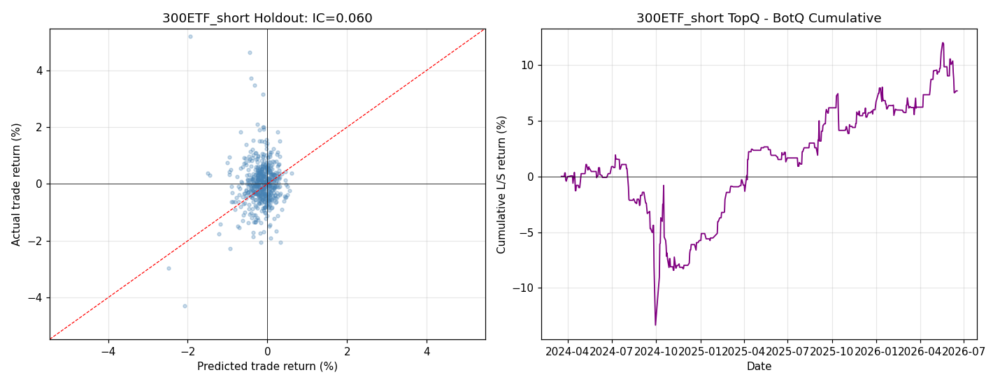


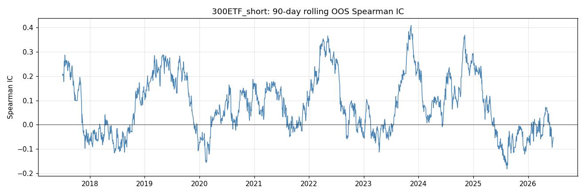


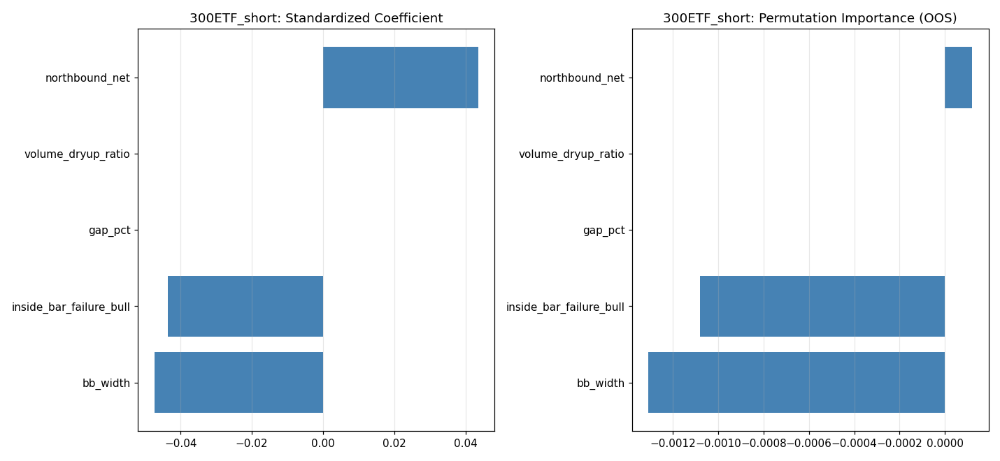


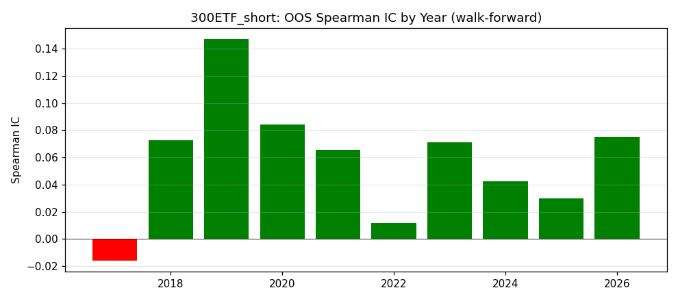


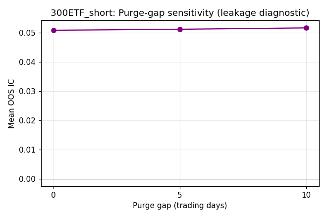


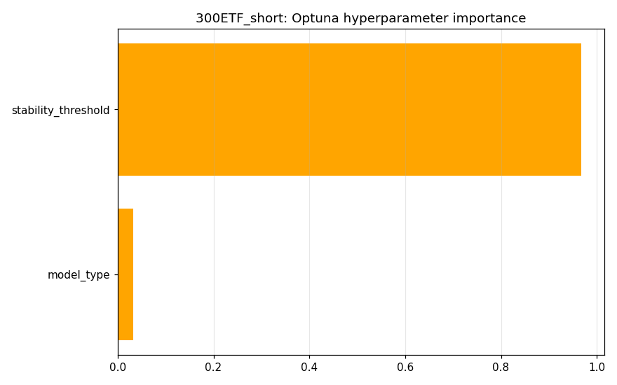


</details>

### 50ETF_long

- **Selected Model**: HUBER
- **Tuned Stability Threshold**: 0.65
- **Samples**: 2722 (2015-04-07 → 2026-06-17)
- **Holdout**: 544 days (2024-03-19 → 2026-06-17)
- **Target stats**: mean=-0.0019%, std=0.9480%, Sharpe=-0.03
- **Selected features (4)**: `bar_rng_0, sma100_dist, margin_net_buy, yesterday_early_range`

#### Feature Stability Scores (Block Bootstrap)

<details>
<summary><b>Click to expand Feature Stability Scores (Block Bootstrap) Table</b></summary>

| Feature | Stability Score | Status | Pearson $r$ | Spearman $\rho$ | Monotonicity Score | Mutual Info | Quality Rating | Holdout IC | Yearly ICs | Yearly IC Std |
|---------|-----------------|--------|-------------|-----------------|--------------------|-------------|----------------|------------|------------|---------------|
| yesterday_early_range | 86.8% | **Selected** | +0.0691 | -0.0258 | -0.20 | 0.0235 | * Non-Monotonic / Weak | -0.0498 | 15:+0.08 16:-0.02 17:+0.05 18:-0.01 19:-0.08 20:+0.03 21:-0.08 22:-0.00 23:-0.05 24:-0.02 25:-0.09 26:+0.06 | 0.0559 |
| margin_net_buy | 82.4% | **Selected** | -0.1262 | -0.0654 | -0.90 | 0.0000 | *** Strong Monotonic | -0.0343 | 15:-0.11 16:+0.05 17:+0.00 18:-0.08 19:-0.07 20:-0.08 21:-0.10 22:-0.07 23:-0.06 24:-0.18 25:+0.07 26:+0.07 | 0.0742 |
| bar_rng_0 | 78.0% | **Selected** | +0.0489 | -0.0012 | +0.50 | 0.0745 | * Non-Monotonic / Weak | -0.0345 | 15:-0.02 16:-0.05 17:+0.00 18:+0.03 19:-0.03 20:+0.07 21:+0.01 22:+0.02 23:-0.04 24:+0.03 25:-0.01 26:-0.10 | 0.0433 |
| sma100_dist | 69.6% | **Selected** | -0.0831 | -0.0496 | -0.70 | 0.0046 | ** Moderate Monotonic | -0.0418 | 15:-0.13 16:-0.06 17:-0.07 18:-0.05 19:-0.23 20:-0.09 21:-0.11 22:-0.06 23:-0.13 24:-0.08 25:-0.12 26:-0.10 | 0.0463 |
| sma200_dist | 68.4% | **Selected** | -0.0567 | -0.0335 | -0.70 | 0.0023 | ** Moderate Monotonic | -0.0475 | 15:-0.05 16:-0.01 17:-0.08 18:-0.08 19:-0.25 20:-0.10 21:-0.10 22:-0.06 23:-0.13 24:-0.11 25:-0.15 26:-0.07 | 0.0568 |
| yesterday_early_realized_vol | 62.4% | Pruned | +0.0306 | -0.0039 | +0.50 | 0.0055 | * Non-Monotonic / Weak | +0.0023 | 15:+0.01 16:+0.02 17:+0.04 18:+0.05 19:-0.11 20:+0.01 21:+0.08 22:-0.03 23:-0.08 24:-0.01 25:+0.02 26:+0.05 | 0.0522 |
| bar_rng_2 | 60.4% | Pruned | -0.0089 | +0.0060 | +0.50 | 0.0221 | * Non-Monotonic / Weak | -0.0552 | 15:+0.07 16:-0.08 17:+0.02 18:+0.03 19:-0.01 20:-0.00 21:+0.04 22:+0.03 23:+0.11 24:-0.05 25:-0.07 26:+0.08 | 0.0575 |
| cl_pos_in_range | 60.0% | Pruned | +0.0156 | +0.0142 | +0.50 | 0.0000 | * Non-Monotonic / Weak | -0.0386 | 15:-0.05 16:+0.05 17:-0.05 18:+0.09 19:+0.04 20:-0.02 21:+0.05 22:-0.02 23:+0.05 24:-0.01 25:+0.03 26:-0.16 | 0.0661 |
| bar_rng_1 | 58.0% | Pruned | +0.0038 | -0.0298 | -0.60 | 0.0223 | ** Moderate Monotonic | -0.0595 | 15:-0.04 16:-0.09 17:+0.01 18:+0.02 19:+0.03 20:-0.07 21:-0.07 22:-0.08 23:+0.11 24:-0.04 25:-0.10 26:+0.02 | 0.0589 |
| body_to_range_ratio | 58.0% | Pruned | +0.0279 | +0.0285 | +0.90 | 0.0077 | *** Strong Monotonic | -0.0174 | 15:-0.04 16:+0.10 17:+0.00 18:+0.04 19:+0.03 20:-0.01 21:+0.05 22:+0.14 23:+0.05 24:-0.04 25:+0.01 26:-0.01 | 0.0513 |
| bar_body_rng_0 | 57.2% | Pruned | +0.0720 | +0.0527 | +1.00 | 0.0000 | *** Strong Monotonic | -0.0212 | 15:+0.15 16:+0.12 17:-0.07 18:+0.16 19:+0.03 20:+0.01 21:+0.08 22:+0.03 23:+0.09 24:-0.03 25:+0.03 26:-0.12 | 0.0837 |
| yesterday_gap_pct | 56.4% | Pruned | -0.0115 | +0.0254 | +0.90 | 0.0193 | ** Non-Linear Monotonic | +0.0571 | 15:+0.10 16:-0.05 17:-0.01 18:-0.07 19:+0.04 20:-0.01 21:+0.11 22:+0.08 23:+0.01 24:+0.04 25:+0.10 26:-0.01 | 0.0571 |
| bar_vwap_dev_0 | 53.6% | Pruned | +0.0311 | +0.0409 | N/A | 0.0000 | N/A | N/A | N/A | N/A |
| max_up_ret | 53.6% | Pruned | +0.0693 | +0.0248 | +0.90 | 0.0136 | *** Strong Monotonic | -0.0492 | 15:+0.08 16:+0.04 17:-0.00 18:+0.16 19:-0.00 20:-0.00 21:+0.05 22:-0.04 23:+0.08 24:-0.04 25:-0.01 26:-0.12 | 0.0693 |
| vix_diff_1d | 52.8% | Pruned | +0.0383 | -0.0402 | -0.60 | 0.0320 | ** Moderate Monotonic | -0.0495 | 15:+0.17 16:-0.16 17:-0.02 18:-0.09 19:-0.15 20:-0.03 21:-0.02 22:-0.09 23:-0.02 24:-0.01 25:-0.05 26:-0.07 | 0.0794 |
| bar_body_rng_1 | 50.8% | Pruned | -0.0083 | +0.0047 | -0.70 | 0.0000 | ** Moderate Monotonic | -0.0395 | 15:-0.09 16:+0.01 17:+0.05 18:+0.09 19:-0.02 20:-0.06 21:+0.08 22:-0.04 23:+0.02 24:-0.00 25:-0.00 26:-0.12 | 0.0614 |
| gap_pct | 48.8% | Pruned | +0.0437 | +0.0200 | +0.70 | 0.0101 | ** Moderate Monotonic | +0.0164 | 15:+0.03 16:+0.06 17:-0.12 18:+0.03 19:+0.06 20:+0.07 21:+0.01 22:+0.08 23:-0.07 24:-0.06 25:+0.00 26:+0.18 | 0.0757 |
| yesterday_day_late_mom | 48.8% | Pruned | +0.0363 | +0.0062 | +0.30 | 0.0000 | * Non-Monotonic / Weak | -0.0195 | 15:+0.10 16:+0.05 17:+0.13 18:-0.05 19:-0.05 20:+0.05 21:-0.06 22:-0.05 23:-0.05 24:-0.05 25:+0.05 26:+0.00 | 0.0635 |
| vix_iv_spread | 47.6% | Pruned | +0.0448 | +0.0625 | +0.80 | 0.0123 | ** Moderate Monotonic | +0.0274 | 15:+0.08 16:+0.08 17:+0.04 18:+0.02 19:+0.02 20:+0.13 21:+0.01 22:+0.04 23:+0.06 24:+0.11 25:+0.07 26:-0.11 | 0.0585 |
| roc10 | 47.2% | Pruned | -0.0791 | -0.0420 | -0.10 | 0.0262 | * Non-Monotonic / Weak | -0.0668 | 15:-0.07 16:-0.07 17:-0.09 18:-0.04 19:-0.11 20:-0.06 21:-0.10 22:+0.05 23:-0.01 24:-0.09 25:-0.06 26:-0.09 | 0.0428 |
| early_realized_vol | 46.4% | Pruned | +0.0280 | -0.0066 | -0.10 | 0.0201 | * Non-Monotonic / Weak | +0.0261 | 15:+0.04 16:-0.00 17:-0.04 18:-0.01 19:-0.01 20:+0.00 21:-0.08 22:-0.07 23:+0.06 24:+0.06 25:+0.01 26:+0.01 | 0.0429 |
| yesterday_day_vwap_dev | 45.6% | Pruned | -0.0057 | -0.0281 | -0.80 | 0.0000 | ** Moderate Monotonic | -0.0080 | 15:+0.04 16:-0.11 17:+0.04 18:-0.08 19:-0.13 20:-0.03 21:-0.01 22:-0.03 23:+0.01 24:+0.01 25:-0.02 26:+0.08 | 0.0583 |
| yesterday_day_close_pos | 44.8% | Pruned | -0.0143 | -0.0146 | -0.50 | 0.0039 | * Non-Monotonic / Weak | +0.0108 | 15:+0.03 16:-0.09 17:+0.04 18:-0.05 19:-0.10 20:+0.01 21:-0.02 22:-0.02 23:-0.01 24:+0.05 25:+0.01 26:+0.04 | 0.0469 |
| yesterday_day_pm_am_vol_ratio | 44.4% | Pruned | +0.0077 | -0.0110 | +0.10 | 0.0000 | * Non-Monotonic / Weak | -0.0158 | 15:+0.01 16:+0.14 17:+0.03 18:+0.01 19:-0.12 20:-0.07 21:-0.06 22:-0.05 23:+0.03 24:+0.08 25:-0.06 26:-0.03 | 0.0701 |
| volume_sma_ratio_long | 41.6% | Pruned | -0.0277 | -0.0332 | -0.20 | 0.0270 | * Non-Monotonic / Weak | -0.0228 | 15:-0.04 16:-0.07 17:-0.08 18:+0.02 19:-0.14 20:+0.01 21:-0.04 22:+0.07 23:-0.15 24:-0.09 25:+0.11 26:-0.04 | 0.0738 |
| yesterday_day_realized_vol | 39.2% | Pruned | +0.0460 | -0.0214 | +0.10 | 0.0615 | * Non-Monotonic / Weak | -0.0492 | 15:+0.08 16:-0.06 17:+0.06 18:-0.00 19:-0.04 20:-0.01 21:+0.04 22:-0.01 23:-0.11 24:+0.00 25:+0.02 26:-0.13 | 0.0608 |
| bar_vwap_dev_1 | 38.8% | Pruned | -0.0668 | -0.0006 | -0.60 | 0.0153 | ** Moderate Monotonic | -0.0558 | 15:-0.11 16:+0.00 17:+0.04 18:+0.12 19:-0.04 20:-0.03 21:+0.07 22:-0.05 23:+0.02 24:-0.00 25:-0.01 26:-0.16 | 0.0717 |
| aroon_osc | 38.4% | Pruned | -0.0382 | -0.0405 | -0.80 | 0.0000 | ** Moderate Monotonic | -0.0474 | 15:-0.11 16:-0.06 17:-0.04 18:-0.04 19:-0.12 20:-0.00 21:-0.11 22:+0.02 23:+0.02 24:-0.10 25:+0.00 26:-0.11 | 0.0527 |
| macd_hist | 38.4% | Pruned | -0.0658 | -0.0520 | -0.90 | 0.0170 | *** Strong Monotonic | -0.0710 | 15:-0.07 16:-0.01 17:-0.09 18:-0.09 19:-0.09 20:-0.03 21:-0.10 22:+0.03 23:-0.03 24:-0.05 25:-0.07 26:-0.14 | 0.0430 |
| stoch_d | 38.0% | Pruned | -0.0490 | -0.0535 | -0.90 | 0.0000 | *** Strong Monotonic | -0.0469 | 15:-0.10 16:-0.01 17:-0.09 18:-0.08 19:-0.17 20:-0.01 21:-0.12 22:+0.01 23:-0.07 24:-0.06 25:-0.05 26:-0.07 | 0.0489 |
| cci14 | 38.0% | Pruned | -0.0206 | -0.0374 | -0.80 | 0.0577 | ** Moderate Monotonic | -0.1132 | 15:-0.01 16:-0.09 17:+0.01 18:+0.03 19:-0.13 20:+0.02 21:+0.02 22:+0.07 23:-0.06 24:-0.05 25:-0.10 26:-0.14 | 0.0672 |
| yesterday_am_return | 37.2% | Pruned | +0.0364 | +0.0170 | +0.90 | 0.0000 | *** Strong Monotonic | -0.0050 | 15:+0.05 16:-0.06 17:-0.01 18:+0.07 19:+0.05 20:-0.00 21:-0.02 22:+0.03 23:+0.09 24:-0.02 25:+0.03 26:-0.07 | 0.0481 |
| yesterday_early_skew | 37.2% | Pruned | -0.0195 | -0.0293 | -0.10 | 0.0000 | * Non-Monotonic / Weak | -0.0152 | 15:-0.03 16:+0.05 17:-0.12 18:-0.03 19:+0.11 20:-0.05 21:-0.10 22:-0.05 23:+0.00 24:+0.04 25:-0.09 26:-0.02 | 0.0635 |
| roc20 | 36.8% | Pruned | -0.0665 | -0.0521 | -0.70 | 0.0312 | ** Moderate Monotonic | -0.0848 | 15:-0.08 16:-0.05 17:-0.07 18:-0.03 19:-0.14 20:-0.06 21:-0.08 22:-0.02 23:-0.07 24:-0.05 25:-0.14 26:-0.14 | 0.0396 |
| bb_width | 36.4% | Pruned | -0.0056 | +0.0330 | +0.10 | 0.0548 | * Non-Monotonic / Weak | +0.1119 | 15:-0.02 16:+0.12 17:+0.06 18:-0.03 19:+0.06 20:-0.00 21:+0.09 22:-0.09 23:-0.03 24:-0.01 25:+0.16 26:+0.15 | 0.0765 |
| max_down_ret | 36.4% | Pruned | +0.0524 | +0.0474 | +1.00 | 0.0000 | *** Strong Monotonic | +0.0121 | 15:+0.02 16:+0.16 17:-0.09 18:+0.17 19:+0.02 20:+0.04 21:+0.09 22:-0.01 23:+0.07 24:+0.01 25:+0.06 26:-0.17 | 0.0910 |
| roc60 | 36.4% | Pruned | -0.0570 | -0.0261 | -0.70 | 0.0356 | ** Moderate Monotonic | +0.0156 | 15:-0.08 16:-0.08 17:-0.05 18:-0.02 19:-0.20 20:-0.07 21:-0.08 22:-0.06 23:-0.07 24:-0.03 25:-0.03 26:-0.10 | 0.0450 |
| yesterday_day_kurtosis | 36.4% | Pruned | -0.0115 | -0.0207 | -0.60 | 0.0148 | ** Moderate Monotonic | -0.0571 | 15:+0.08 16:+0.01 17:-0.09 18:+0.08 19:+0.03 20:-0.06 21:-0.06 22:-0.04 23:-0.08 24:-0.07 25:-0.04 26:-0.09 | 0.0589 |
| northbound_net | 36.0% | Pruned | +0.0324 | +0.0458 | +0.90 | 0.0016 | *** Strong Monotonic | -0.0394 | 15:+0.06 16:-0.03 17:+0.01 18:+0.09 19:+0.15 20:+0.01 21:+0.04 22:+0.09 23:+0.06 24:-0.03 26:+nan | nan |
| yesterday_first_30min_return | 36.0% | Pruned | -0.0064 | +0.0180 | -0.10 | 0.0106 | * Non-Monotonic / Weak | +0.0062 | 15:+0.03 16:-0.07 17:+0.11 18:+0.07 19:+0.01 20:+0.08 21:-0.12 22:-0.00 23:+0.10 24:-0.00 25:+0.02 26:-0.02 | 0.0658 |
| vol5 | 35.2% | Pruned | +0.0186 | -0.0472 | -0.70 | 0.0631 | ** Moderate Monotonic | -0.0595 | 15:+0.10 16:-0.17 17:-0.07 18:-0.04 19:-0.07 20:-0.04 21:-0.03 22:+0.09 23:-0.13 24:-0.11 25:+0.01 26:+0.10 | 0.0849 |
| iv_diff_1d | 35.2% | Pruned | -0.0140 | -0.0289 | -0.60 | 0.0022 | ** Moderate Monotonic | -0.0398 | 15:+0.06 16:+0.06 17:-0.05 18:-0.03 19:-0.11 20:-0.06 21:-0.07 22:-0.04 23:-0.06 24:-0.04 25:-0.01 26:-0.07 | 0.0482 |
| early_skew | 34.8% | Pruned | +0.0314 | +0.0317 | +0.90 | 0.0000 | *** Strong Monotonic | +0.0465 | 15:+0.07 16:+0.09 17:+0.07 18:-0.07 19:-0.04 20:+0.00 21:-0.05 22:+0.22 23:-0.02 24:+0.08 25:+0.02 26:+0.02 | 0.0761 |
| yesterday_pm_return | 34.4% | Pruned | +0.0062 | -0.0015 | +0.00 | 0.0000 | * Non-Monotonic / Weak | +0.0284 | 15:+0.07 16:-0.04 17:+0.02 18:-0.05 19:-0.16 20:+0.07 21:+0.00 22:+0.02 23:-0.04 24:+0.02 25:+0.03 26:+0.06 | 0.0625 |
| yesterday_early_vwap_dev | 34.0% | Pruned | +0.0141 | +0.0237 | +0.30 | 0.0000 | * Non-Monotonic / Weak | +0.0258 | 15:+0.07 16:-0.06 17:+0.10 18:+0.12 19:-0.02 20:+0.07 21:-0.06 22:-0.04 23:+0.01 24:+0.07 25:+0.04 26:-0.05 | 0.0628 |
| bb_pctb | 33.6% | Pruned | +0.0251 | +0.0385 | +0.70 | 0.0070 | ** Moderate Monotonic | +0.0344 | 15:+0.07 16:+0.08 17:+0.05 18:+0.04 19:+0.13 20:+0.06 21:+0.08 22:-0.05 23:+0.04 24:+0.05 25:+0.03 26:+0.11 | 0.0423 |
| roc5 | 33.6% | Pruned | -0.0379 | -0.0333 | -0.70 | 0.0226 | ** Moderate Monotonic | -0.0311 | 15:+0.00 16:-0.13 17:-0.13 18:-0.02 19:-0.11 20:+0.01 21:+0.02 22:-0.02 23:-0.02 24:-0.03 25:-0.05 26:-0.07 | 0.0491 |
| yesterday_early_trend | 32.8% | Pruned | +0.0009 | +0.0214 | +0.60 | 0.0214 | ** Moderate Monotonic | +0.0233 | 15:+0.03 16:-0.07 17:+0.08 18:+0.15 19:-0.00 20:+0.10 21:-0.07 22:-0.04 23:+0.01 24:+0.04 25:+0.06 26:-0.06 | 0.0696 |
| yesterday_day_range | 32.8% | Pruned | +0.0247 | -0.0275 | -0.60 | 0.0484 | ** Moderate Monotonic | -0.0550 | 15:+0.10 16:-0.08 17:+0.04 18:-0.04 19:+0.02 20:-0.05 21:-0.01 22:-0.00 23:-0.12 24:-0.03 25:+0.01 26:-0.07 | 0.0576 |
| mfi14 | 32.4% | Pruned | -0.0429 | -0.0425 | -0.50 | 0.0213 | * Non-Monotonic / Weak | -0.0713 | 15:-0.05 16:-0.07 17:-0.01 18:-0.07 19:-0.10 20:-0.04 21:-0.03 22:+0.01 23:-0.08 24:-0.09 25:-0.07 26:-0.13 | 0.0396 |
| yesterday_first_bar_volume | 32.0% | Pruned | +0.0133 | -0.0306 | -0.20 | 0.0020 | * Non-Monotonic / Weak | -0.0542 | 15:-0.01 16:-0.11 17:-0.03 18:-0.01 19:+0.00 20:-0.00 21:-0.12 22:+0.03 23:-0.02 24:-0.14 25:+0.04 26:-0.03 | 0.0564 |
| yesterday_day_skew | 31.6% | Pruned | +0.0082 | +0.0104 | -0.60 | 0.0000 | ** Moderate Monotonic | +0.0387 | 15:+0.09 16:-0.04 17:-0.04 18:+0.11 19:+0.06 20:+0.03 21:-0.06 22:-0.10 23:+0.02 24:+0.00 25:+0.07 26:+0.12 | 0.0681 |
| sma10_dist | 30.4% | Pruned | -0.0606 | -0.0406 | -0.70 | 0.0230 | ** Moderate Monotonic | -0.0554 | 15:-0.04 16:-0.09 17:-0.07 18:-0.03 19:-0.10 20:-0.05 21:-0.04 22:+0.01 23:-0.02 24:-0.05 25:-0.08 26:-0.06 | 0.0298 |
| short_sell_quantity | 29.6% | Pruned | -0.0036 | -0.0267 | -0.20 | 0.0000 | * Non-Monotonic / Weak | +0.0461 | 15:-0.04 16:+0.00 17:-0.05 18:-0.01 19:-0.09 20:-0.11 21:-0.06 22:+0.09 23:-0.02 24:+0.01 25:+0.09 26:+0.02 | 0.0598 |
| vol_gk10 | 28.4% | Pruned | +0.0387 | -0.0137 | +0.20 | 0.0385 | * Non-Monotonic / Weak | +0.0036 | 15:+0.01 16:-0.06 17:+0.01 18:+0.00 19:-0.07 20:-0.02 21:-0.01 22:+0.09 23:-0.04 24:+0.05 25:+0.05 26:-0.01 | 0.0441 |
| yesterday_early_momentum | 28.4% | Pruned | +0.0007 | +0.0215 | +0.60 | 0.0223 | ** Moderate Monotonic | +0.0235 | 15:+0.03 16:-0.07 17:+0.08 18:+0.15 19:-0.00 20:+0.10 21:-0.07 22:-0.04 23:+0.01 24:+0.04 25:+0.07 26:-0.06 | 0.0696 |
| early_vwap_dev | 27.6% | Pruned | -0.0663 | -0.0007 | -0.30 | 0.0000 | * Non-Monotonic / Weak | -0.0410 | 15:-0.09 16:-0.00 17:-0.03 18:+0.05 19:+0.06 20:-0.05 21:+0.08 22:-0.07 23:+0.06 24:+0.00 25:+0.00 26:-0.17 | 0.0700 |
| margin_short_ratio | 26.4% | Pruned | +0.0193 | +0.0256 | +0.60 | 0.0251 | ** Moderate Monotonic | +0.0296 | 15:-0.00 16:+0.05 17:+0.03 18:+0.06 19:+0.17 20:+0.03 21:+0.12 22:-0.09 23:+0.05 24:-0.02 25:+0.00 26:+0.14 | 0.0703 |
| bar_ret_1 | 26.0% | Pruned | -0.0677 | -0.0022 | -0.20 | 0.0154 | * Non-Monotonic / Weak | -0.0476 | 15:-0.12 16:+0.00 17:+0.04 18:+0.10 19:-0.04 20:-0.04 21:+0.07 22:-0.04 23:+0.01 24:+0.00 25:+0.00 26:-0.15 | 0.0685 |
| yesterday_first_bar_return | 26.0% | Pruned | -0.0107 | +0.0153 | +0.60 | 0.0014 | ** Moderate Monotonic | +0.0222 | 15:+0.04 16:-0.03 17:+0.09 18:-0.07 19:+0.02 20:+0.00 21:-0.07 22:+0.04 23:+0.13 24:+0.01 25:+0.04 26:+0.02 | 0.0561 |
| vol_ratio_10_60 | 25.6% | Pruned | -0.0021 | -0.0251 | -0.50 | 0.0039 | * Non-Monotonic / Weak | -0.0659 | 15:+0.04 16:-0.08 17:-0.07 18:+0.09 19:-0.11 20:+0.01 21:+0.03 22:-0.03 23:-0.12 24:-0.09 25:+0.07 26:-0.08 | 0.0709 |
| vol_ratio_5_20 | 25.6% | Pruned | -0.0057 | -0.0322 | -0.30 | 0.0000 | * Non-Monotonic / Weak | -0.0320 | 15:+0.12 16:-0.15 17:-0.04 18:-0.06 19:+0.02 20:-0.05 21:-0.02 22:+0.01 23:-0.11 24:-0.16 25:+0.07 26:+0.06 | 0.0839 |
| num_up_bars | 24.8% | Pruned | +0.0181 | +0.0170 | +0.50 | 0.0000 | ** Moderate Monotonic | -0.0508 | 15:-0.04 16:+0.04 17:-0.04 18:+0.16 19:+0.04 20:-0.04 21:+0.10 22:-0.02 23:+0.04 24:-0.06 25:+0.02 26:-0.20 | 0.0861 |
| first_bar_return | 24.0% | Pruned | +0.1198 | +0.0526 | +0.90 | 0.0083 | *** Strong Monotonic | -0.0296 | 15:+0.14 16:+0.09 17:-0.05 18:+0.17 19:+0.03 20:+0.04 21:+0.05 22:+0.05 23:+0.07 24:-0.01 25:+0.00 26:-0.15 | 0.0812 |
| bar_vwap_dev_2 | 23.2% | Pruned | -0.0663 | -0.0007 | -0.30 | 0.0000 | * Non-Monotonic / Weak | -0.0410 | 15:-0.09 16:-0.00 17:-0.03 18:+0.05 19:+0.06 20:-0.05 21:+0.08 22:-0.07 23:+0.06 24:+0.00 25:+0.00 26:-0.17 | 0.0700 |
| total_path_length | 22.8% | Pruned | +0.0245 | +0.0010 | +0.50 | 0.0415 | * Non-Monotonic / Weak | -0.0245 | 15:+0.03 16:-0.01 17:-0.01 18:+0.02 19:-0.00 20:-0.01 21:-0.03 22:+0.00 23:+0.10 24:-0.00 25:-0.04 26:+0.03 | 0.0355 |
| vix_iv_ratio | 22.8% | Pruned | +0.0340 | +0.0649 | +0.80 | 0.0270 | ** Moderate Monotonic | +0.0395 | 15:+0.07 16:+0.11 17:+0.04 18:+0.02 19:+0.02 20:+0.14 21:+0.02 22:+0.03 23:+0.06 24:+0.10 25:+0.08 26:-0.06 | 0.0500 |
| volume_slope | 22.4% | Pruned | +0.0246 | +0.0156 | +0.50 | 0.0000 | * Non-Monotonic / Weak | -0.0415 | 15:+0.05 16:-0.02 17:+0.11 18:+0.08 19:+0.04 20:-0.06 21:+0.03 22:+0.04 23:-0.00 24:-0.03 25:-0.07 26:-0.07 | 0.0580 |
| margin_repayment | 21.2% | Pruned | +0.0736 | -0.0337 | -0.70 | 0.0000 | ** Moderate Monotonic | -0.0389 | 15:+0.00 16:-0.14 17:-0.00 18:+0.01 19:-0.08 20:+0.01 21:+0.01 22:-0.03 23:-0.07 24:-0.01 25:+0.00 26:-0.08 | 0.0469 |
| capital_net_ratio | 21.2% | Pruned | -0.0201 | -0.0390 | -0.70 | 0.0153 | ** Moderate Monotonic | +0.0021 | 17:-0.07 18:-0.05 19:-0.02 20:-0.05 21:-0.09 22:+0.05 23:-0.13 24:-0.14 25:+0.02 26:+0.10 | 0.0728 |
| northbound_sell | 20.4% | Pruned | -0.0172 | -0.0279 | -0.90 | 0.0260 | ** Non-Linear Monotonic | -0.0052 | 15:-0.09 16:-0.04 17:-0.02 18:-0.06 19:-0.16 20:-0.02 21:+0.00 22:-0.06 23:-0.06 24:+0.11 25:+nan 26:+nan | nan |
| vol_pk20 | 19.6% | Pruned | +0.0129 | -0.0194 | -0.10 | 0.0621 | * Non-Monotonic / Weak | +0.0039 | 15:-0.01 16:-0.08 17:-0.00 18:-0.00 19:-0.09 20:-0.01 21:+0.01 22:+0.12 23:-0.06 24:+0.05 25:+0.01 26:+0.07 | 0.0581 |
| yesterday_early_volume_ratio | 19.6% | Pruned | +0.0124 | -0.0295 | +0.10 | 0.0296 | * Non-Monotonic / Weak | -0.0581 | 15:-0.00 16:-0.09 17:-0.02 18:+0.01 19:+0.01 20:-0.01 21:-0.10 22:+0.03 23:-0.08 24:-0.15 25:+0.05 26:-0.08 | 0.0584 |
| vol10 | 19.2% | Pruned | +0.0255 | -0.0327 | -0.10 | 0.0499 | * Non-Monotonic / Weak | -0.0773 | 15:+0.02 16:-0.12 17:-0.07 18:+0.06 19:-0.11 20:+0.01 21:+0.03 22:+0.05 23:-0.13 24:-0.02 25:-0.05 26:-0.03 | 0.0620 |
| bar_ret_0 | 18.8% | Pruned | +0.1197 | +0.0526 | +0.90 | 0.0083 | *** Strong Monotonic | -0.0296 | 15:+0.14 16:+0.09 17:-0.05 18:+0.17 19:+0.03 20:+0.04 21:+0.05 22:+0.05 23:+0.07 24:-0.01 25:+0.00 26:-0.15 | 0.0812 |
| vix_vol_ratio | 18.8% | Pruned | +0.0053 | +0.0168 | +0.30 | 0.0049 | * Non-Monotonic / Weak | +0.0561 | 15:+0.02 16:+0.08 17:+0.07 18:-0.05 19:+0.03 20:-0.07 21:+0.01 22:-0.09 23:+0.10 24:+0.03 25:+0.06 26:-0.09 | 0.0646 |
| margin_balance | 18.4% | Pruned | +0.0005 | -0.0053 | +0.20 | 0.0334 | * Non-Monotonic / Weak | +0.0192 | 15:-0.07 16:-0.06 17:-0.09 18:-0.02 19:-0.01 20:-0.01 21:+0.01 22:+0.04 23:+0.04 24:+0.08 25:-0.01 26:+0.05 | 0.0489 |
| total_balance | 18.0% | Pruned | +0.0001 | -0.0062 | -0.10 | 0.0333 | * Non-Monotonic / Weak | +0.0158 | 15:-0.07 16:-0.06 17:-0.10 18:-0.02 19:-0.03 20:-0.02 21:+0.00 22:+0.05 23:+0.02 24:+0.08 25:-0.02 26:+0.03 | 0.0494 |
| willr14 | 17.6% | Pruned | -0.0212 | -0.0274 | -0.70 | 0.0000 | ** Moderate Monotonic | -0.0281 | 15:-0.05 16:-0.04 17:-0.04 18:-0.05 19:-0.10 20:-0.02 21:-0.05 22:+0.05 23:-0.04 24:-0.02 25:-0.06 26:-0.05 | 0.0328 |
| bar_vol_1 | 17.6% | Pruned | -0.0351 | -0.0371 | -0.50 | 0.0000 | * Non-Monotonic / Weak | -0.0753 | 15:-0.02 16:+0.01 17:-0.06 18:-0.05 19:+0.00 20:+0.00 21:-0.12 22:-0.04 23:+0.03 24:-0.09 25:-0.04 26:-0.03 | 0.0408 |
| bar_body_rng_2 | 17.2% | Pruned | -0.0024 | +0.0025 | -0.10 | 0.0226 | * Non-Monotonic / Weak | -0.0077 | 15:-0.06 16:-0.02 17:-0.04 18:-0.00 19:+0.09 20:-0.01 21:+0.05 22:-0.05 23:+0.02 24:-0.01 25:+0.02 26:-0.06 | 0.0439 |
| bar_ret_2 | 17.2% | Pruned | -0.0340 | -0.0034 | -0.10 | 0.0000 | * Non-Monotonic / Weak | -0.0249 | 15:-0.08 16:-0.05 17:-0.05 18:-0.00 19:+0.11 20:-0.02 21:+0.05 22:-0.05 23:+0.03 24:-0.02 25:+0.01 26:-0.09 | 0.0549 |
| capital_sell_value | 17.2% | Pruned | -0.0209 | -0.0318 | -0.80 | 0.0360 | ** Moderate Monotonic | -0.0258 | 15:+nan 17:-0.05 18:-0.11 19:-0.09 20:-0.06 21:-0.03 22:-0.04 23:-0.07 24:+0.03 25:+0.06 26:-0.09 | nan |
| capital_buy_value | 16.0% | Pruned | -0.0318 | -0.0438 | -0.90 | 0.0398 | *** Strong Monotonic | -0.0411 | 16:+nan 17:-0.03 18:-0.16 19:-0.11 20:-0.09 21:-0.08 22:+0.00 23:-0.13 24:-0.04 25:+0.05 26:-0.08 | nan |
| bar_vol_2 | 15.6% | Pruned | -0.0341 | -0.0384 | -0.20 | 0.0246 | * Non-Monotonic / Weak | -0.0733 | 15:-0.04 16:-0.02 17:-0.02 18:-0.06 19:-0.03 20:+0.01 21:-0.11 22:+0.04 23:+0.02 24:-0.07 25:-0.05 26:-0.01 | 0.0392 |
| capital_buy_volume | 15.2% | Pruned | -0.0170 | -0.0386 | -0.90 | 0.0257 | ** Non-Linear Monotonic | -0.0338 | 15:+nan 17:-0.04 18:-0.15 19:-0.08 20:-0.08 21:-0.06 22:+0.00 23:-0.11 24:-0.04 25:+0.05 26:-0.08 | nan |
| capital_net_value | 15.2% | Pruned | -0.0081 | -0.0378 | -0.90 | 0.0036 | ** Non-Linear Monotonic | +0.0035 | 15:+nan 16:+nan 17:-0.11 18:-0.04 19:-0.04 20:-0.01 21:-0.10 22:+0.05 23:-0.13 24:-0.16 25:+0.04 26:+0.11 | nan |
| iv_vol_ratio | 15.2% | Pruned | -0.0196 | -0.0239 | -0.70 | 0.0273 | ** Moderate Monotonic | +0.0357 | 15:-0.03 16:-0.00 17:+0.01 18:-0.07 19:-0.01 20:-0.15 21:+0.02 22:-0.10 23:+0.08 24:-0.02 25:+0.05 26:-0.05 | 0.0618 |
| vix | 14.8% | Pruned | +0.0045 | -0.0303 | -0.30 | 0.0341 | * Non-Monotonic / Weak | -0.0298 | 15:+0.01 16:-0.09 17:-0.04 18:-0.01 19:-0.13 20:-0.04 21:-0.03 22:+0.08 23:-0.00 24:+0.05 25:-0.03 26:-0.11 | 0.0601 |
| northbound_buy | 14.4% | Pruned | -0.0114 | -0.0230 | -0.90 | 0.0089 | ** Non-Linear Monotonic | -0.0086 | 15:-0.01 16:-0.07 17:-0.02 18:+0.03 19:-0.10 20:-0.01 21:+0.01 22:+0.01 23:-0.03 24:+0.10 25:+nan 26:+nan | nan |
| rsi21 | 14.0% | Pruned | -0.0556 | -0.0460 | -0.70 | 0.0000 | ** Moderate Monotonic | -0.0551 | 15:-0.08 16:-0.07 17:-0.08 18:-0.04 19:-0.19 20:-0.10 21:-0.09 22:-0.00 23:-0.09 24:-0.05 25:-0.09 26:-0.13 | 0.0434 |
| volume_sma_ratio | 13.6% | Pruned | -0.0009 | -0.0298 | +0.10 | 0.0022 | * Non-Monotonic / Weak | -0.0886 | 15:+0.03 16:-0.09 17:-0.04 18:-0.01 19:+0.03 20:+0.00 21:-0.07 22:+0.00 23:-0.08 24:-0.13 25:+0.02 26:-0.14 | 0.0586 |
| short_balance | 13.2% | Pruned | -0.0170 | -0.0340 | -0.60 | 0.0000 | ** Moderate Monotonic | -0.0210 | 15:-0.06 16:-0.06 17:-0.04 18:-0.08 19:-0.17 20:-0.04 21:-0.12 22:+0.10 23:-0.05 24:+0.03 25:-0.00 26:-0.16 | 0.0732 |
| short_repayment_quantity | 12.0% | Pruned | -0.0090 | -0.0164 | -0.10 | 0.0158 | * Non-Monotonic / Weak | +0.0324 | 15:+0.03 16:+0.01 17:+0.06 18:-0.14 19:-0.06 20:-0.12 21:+0.04 22:-0.01 23:+0.01 24:+0.09 25:+0.05 26:-0.13 | 0.0752 |
| bar_vol_0 | 10.8% | Pruned | -0.0327 | -0.0319 | -0.30 | 0.0000 | * Non-Monotonic / Weak | -0.0033 | 15:-0.04 16:-0.03 17:-0.11 18:-0.09 19:-0.06 20:+0.05 21:-0.07 22:+0.01 23:+0.00 24:-0.02 25:+0.04 26:+0.02 | 0.0484 |
| first_bar_volume | 10.4% | Pruned | -0.0327 | -0.0319 | -0.30 | 0.0000 | * Non-Monotonic / Weak | -0.0033 | 15:-0.04 16:-0.03 17:-0.11 18:-0.09 19:-0.06 20:+0.05 21:-0.07 22:+0.01 23:+0.00 24:-0.02 25:+0.04 26:+0.02 | 0.0484 |
| stoch_k | 10.4% | Pruned | -0.0360 | -0.0430 | -0.60 | 0.0020 | ** Moderate Monotonic | -0.0421 | 15:-0.12 16:-0.02 17:-0.07 18:-0.05 19:-0.15 20:+0.01 21:-0.09 22:+0.02 23:-0.07 24:-0.03 25:-0.07 26:-0.09 | 0.0472 |
| vol_gk20 | 10.4% | Pruned | +0.0222 | -0.0120 | +0.10 | 0.0449 | * Non-Monotonic / Weak | +0.0136 | 15:-0.01 16:-0.08 17:+0.03 18:-0.01 19:-0.08 20:-0.03 21:+0.02 22:+0.11 23:-0.01 24:+0.05 25:+0.03 26:+0.08 | 0.0538 |
| early_range | 10.0% | Pruned | +0.0195 | -0.0106 | +0.10 | 0.0672 | * Non-Monotonic / Weak | -0.0633 | 15:+0.05 16:-0.07 17:+0.08 18:-0.01 19:-0.00 20:-0.04 21:-0.04 22:+0.00 23:+0.02 24:-0.04 25:-0.07 26:+0.03 | 0.0450 |
| sma50_dist | 10.0% | Pruned | -0.0696 | -0.0428 | -0.70 | 0.0324 | ** Moderate Monotonic | -0.0662 | 15:-0.07 16:-0.09 17:-0.07 18:-0.04 19:-0.17 20:-0.09 21:-0.08 22:-0.02 23:-0.08 24:-0.05 25:-0.10 26:-0.16 | 0.0414 |
| sma20_dist | 9.6% | Pruned | -0.0816 | -0.0561 | -0.90 | 0.0233 | *** Strong Monotonic | -0.0687 | 15:-0.08 16:-0.09 17:-0.09 18:-0.07 19:-0.14 20:-0.06 21:-0.09 22:+0.01 23:-0.06 24:-0.08 25:-0.08 26:-0.11 | 0.0329 |
| short_balance_quantity | 9.6% | Pruned | -0.0051 | -0.0231 | -0.60 | 0.0447 | ** Moderate Monotonic | -0.0136 | 15:-0.04 16:-0.04 17:-0.04 18:-0.08 19:-0.17 20:-0.03 21:-0.10 22:+0.11 23:-0.04 24:+0.05 25:+0.01 26:-0.14 | 0.0721 |
| rsi5 | 9.2% | Pruned | -0.0275 | -0.0330 | -0.20 | 0.0187 | * Non-Monotonic / Weak | -0.0408 | 15:-0.05 16:-0.10 17:-0.06 18:-0.02 19:-0.10 20:-0.03 21:-0.04 22:+0.04 23:-0.03 24:-0.04 25:-0.06 26:-0.05 | 0.0336 |
| buy_on_margin_value | 9.2% | Pruned | -0.0087 | -0.0688 | -0.90 | 0.0000 | ** Non-Linear Monotonic | -0.0535 | 15:-0.04 16:-0.18 17:+0.00 18:-0.11 19:-0.12 20:-0.11 21:-0.04 22:-0.05 23:-0.13 24:-0.09 25:+0.00 26:-0.06 | 0.0541 |
| iv | 9.2% | Pruned | -0.0146 | -0.0456 | -0.70 | 0.0595 | ** Moderate Monotonic | -0.0462 | 15:-0.01 16:-0.11 17:-0.04 18:-0.02 19:-0.11 20:-0.08 21:-0.02 22:+0.08 23:-0.04 24:+0.01 25:-0.05 26:-0.05 | 0.0488 |
| vol60 | 8.8% | Pruned | +0.0151 | -0.0153 | -0.10 | 0.0434 | * Non-Monotonic / Weak | -0.0137 | 15:+0.03 16:-0.06 17:-0.03 18:-0.02 19:-0.08 20:-0.02 21:+0.01 22:+0.13 23:-0.02 24:+0.06 25:-0.08 26:+0.04 | 0.0606 |
| capital_sell_volume | 6.4% | Pruned | -0.0107 | -0.0244 | -0.80 | 0.0227 | ** Moderate Monotonic | -0.0273 | 15:+nan 16:+nan 17:-0.05 18:-0.11 19:-0.06 20:-0.05 21:-0.01 22:-0.04 23:-0.06 24:+0.03 25:+0.07 26:-0.09 | nan |
| vol20 | 5.6% | Pruned | +0.0078 | -0.0306 | -0.40 | 0.0551 | * Non-Monotonic / Weak | -0.0502 | 15:-0.00 16:-0.11 17:-0.07 18:+0.00 19:-0.11 20:+0.03 21:-0.03 22:+0.11 23:-0.12 24:+0.02 25:-0.06 26:+0.09 | 0.0729 |
| ema12_dist | 5.2% | Pruned | -0.0668 | -0.0446 | -0.60 | 0.0000 | ** Moderate Monotonic | -0.0655 | 15:-0.06 16:-0.09 17:-0.07 18:-0.04 19:-0.11 20:-0.06 21:-0.05 22:+0.02 23:-0.03 24:-0.06 25:-0.09 26:-0.09 | 0.0321 |
| early_trend | 3.6% | Pruned | -0.0647 | -0.0058 | -0.50 | 0.0097 | * Non-Monotonic / Weak | -0.0436 | 15:-0.11 16:+0.00 17:-0.02 18:+0.06 19:+0.03 20:-0.05 21:+0.08 22:-0.08 23:+0.04 24:-0.00 25:+0.02 26:-0.18 | 0.0718 |
| first_30min_return | 3.2% | Pruned | +0.0314 | +0.0299 | +1.00 | 0.0000 | *** Strong Monotonic | -0.0301 | 15:-0.01 16:+0.06 17:-0.03 18:+0.18 19:+0.04 20:-0.01 21:+0.06 22:-0.03 23:+0.08 24:-0.01 25:+0.05 26:-0.20 | 0.0858 |
| early_momentum | 2.0% | Pruned | -0.0644 | -0.0057 | -0.50 | 0.0113 | * Non-Monotonic / Weak | -0.0436 | 15:-0.11 16:+0.00 17:-0.02 18:+0.06 19:+0.03 20:-0.05 21:+0.08 22:-0.08 23:+0.05 24:-0.00 25:+0.02 26:-0.18 | 0.0718 |
| atr14_norm | 1.2% | Pruned | +0.0292 | -0.0161 | +0.10 | 0.0599 | * Non-Monotonic / Weak | -0.0199 | 15:+0.01 16:-0.09 17:+0.01 18:+0.01 19:-0.07 20:+0.01 21:+0.04 22:+0.12 23:-0.02 24:+0.03 25:-0.01 26:+0.14 | 0.0625 |
| early_kurtosis | 0.0% | Pruned | -0.0052 | -0.0172 | -0.80 | 0.0006 | ** Moderate Monotonic | N/A | N/A | N/A |
| bar_ret_3 | 0.0% | Pruned | N/A | N/A | N/A | 0.0000 | N/A | N/A | N/A | N/A |
| bar_ret_4 | 0.0% | Pruned | N/A | N/A | N/A | 0.0000 | N/A | N/A | N/A | N/A |
| bar_ret_5 | 0.0% | Pruned | N/A | N/A | N/A | 0.0000 | N/A | N/A | N/A | N/A |
| bar_vol_3 | 0.0% | Pruned | N/A | N/A | N/A | 0.0000 | N/A | N/A | N/A | N/A |
| bar_vol_4 | 0.0% | Pruned | N/A | N/A | N/A | 0.0000 | N/A | N/A | N/A | N/A |
| bar_vol_5 | 0.0% | Pruned | N/A | N/A | N/A | 0.0000 | N/A | N/A | N/A | N/A |
| bar_rng_3 | 0.0% | Pruned | N/A | N/A | N/A | 0.0000 | N/A | N/A | N/A | N/A |
| bar_rng_4 | 0.0% | Pruned | N/A | N/A | N/A | 0.0000 | N/A | N/A | N/A | N/A |
| bar_rng_5 | 0.0% | Pruned | N/A | N/A | N/A | 0.0000 | N/A | N/A | N/A | N/A |
| bar_body_rng_3 | 0.0% | Pruned | N/A | N/A | N/A | 0.0000 | N/A | N/A | N/A | N/A |
| bar_body_rng_4 | 0.0% | Pruned | N/A | N/A | N/A | 0.0000 | N/A | N/A | N/A | N/A |
| bar_body_rng_5 | 0.0% | Pruned | N/A | N/A | N/A | 0.0000 | N/A | N/A | N/A | N/A |
| bar_vwap_dev_3 | 0.0% | Pruned | N/A | N/A | N/A | 0.0000 | N/A | N/A | N/A | N/A |
| bar_vwap_dev_4 | 0.0% | Pruned | N/A | N/A | N/A | 0.0000 | N/A | N/A | N/A | N/A |
| bar_vwap_dev_5 | 0.0% | Pruned | N/A | N/A | N/A | 0.0000 | N/A | N/A | N/A | N/A |
| yesterday_early_kurtosis | 0.0% | Pruned | -0.0150 | -0.0110 | -0.40 | 0.0006 | * Non-Monotonic / Weak | N/A | N/A | N/A |

- **Pearson $r$**: Linear correlation coefficient.
- **Spearman $\rho$**: Rank correlation coefficient (overall monotonic relation).
- **Monotonicity Score**: Spearman rank correlation of target means across 5 feature quintiles. $\pm 1.0$ indicates perfect bin-wise monotonicity.
- **Mutual Info**: Estimated information gain (captures non-linear dependencies).
- **Quality Rating**: Categorized by strength and shape of the monotonic relationship.
- **Holdout IC**: Spearman rank correlation on the holdout set (out-of-sample predictive power).
- **Yearly ICs**: Spearman rank correlation calculated per year.
- **Yearly IC Std**: Standard deviation of yearly ICs (measures temporal stability).

</details>

#### Metrics

| Metric | Best Linear | Ridge Base | Zero | Yesterday PM | First 30min Mom |
|--------|-------------|------------|------|--------------|-----------------|
| IC | +0.0116 | +0.0912 | +0.0000 | +0.0088 | -0.0301 |
| Dir Acc | 0.483 | 0.491 | 0.500 | 0.485 | 0.493 |
| RMSE | 0.7686% | 0.7909% | 0.7416% | 1.0417% | 0.8229% |
| L/S Sharpe | +0.94 | +2.65 | — | — | — |

#### Best Hyperparameters

<details>
<summary><b>Click to expand Best Hyperparameters JSON</b></summary>

```json
{
  "model_type": "huber",
  "stability_threshold": 0.65,
  "huber_alpha": 0.0005188537138278257,
  "huber_epsilon": 1.6994872752732892
}
```

</details>

#### Walk-Forward Fold ICs

| Fold | IS IC | OOS IC |
|------|-------|--------|
| 1 | 0.0708 | +0.0211 |
| 2 | 0.0560 | +0.0778 |
| 3 | 0.0736 | +0.0561 |
| 4 | 0.0778 | +0.0411 |
| 5 | 0.0714 | -0.0282 |
| **Overall** | — | +0.0414 |

#### Year-by-Year OOS IC

| Year | IC | Dir Acc | N | L/S Sharpe |
|------|-----|---------|---|-----------|
| 2017 | +0.0114 | 0.470 | 215 | +1.51 |
| 2018 | +0.0684 | 0.486 | 243 | +2.03 |
| 2019 | +0.0269 | 0.504 | 244 | +0.87 |
| 2020 | +0.1554 | 0.481 | 243 | +1.85 |
| 2021 | +0.0178 | 0.498 | 243 | +0.51 |
| 2022 | +0.0978 | 0.471 | 242 | +2.13 |
| 2023 | -0.0056 | 0.479 | 242 | +1.20 |
| 2024 | +0.1298 | 0.508 | 242 | +2.89 |
| 2025 | -0.0516 | 0.494 | 243 | +0.26 |
| 2026 | +0.0098 | 0.417 | 108 | -1.76 |

#### Diagnostic Plots

<details>
<summary><b>Click to expand Diagnostic Plots</b></summary>

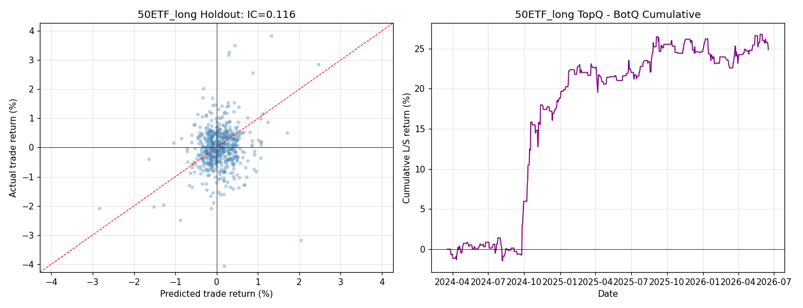


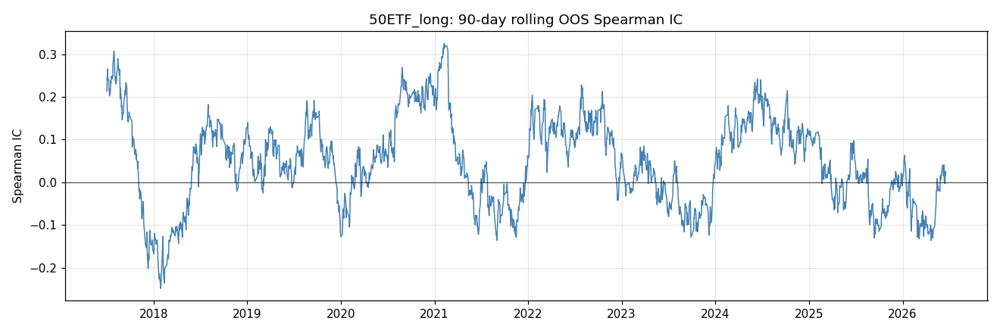


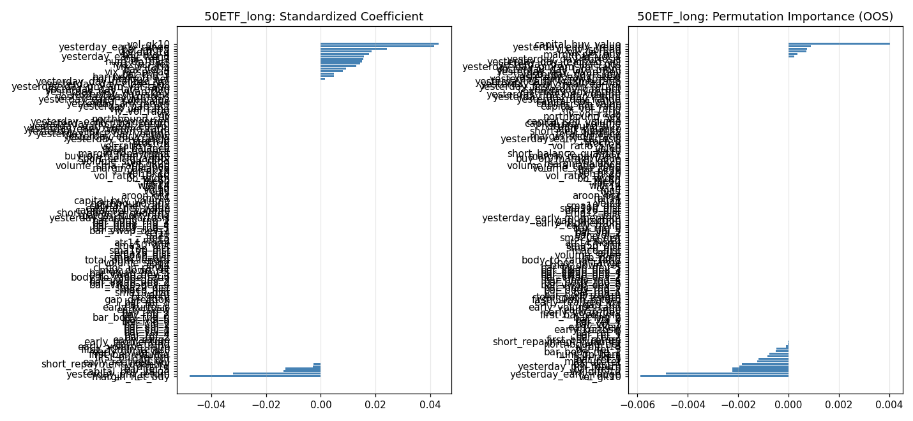


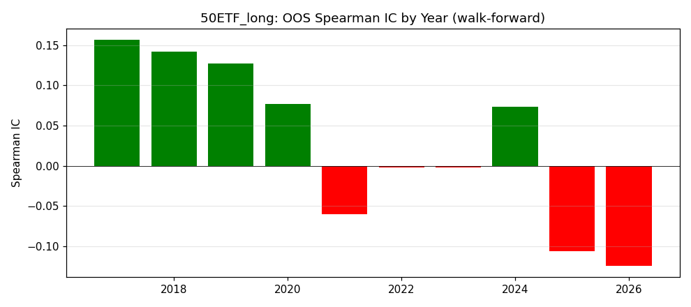


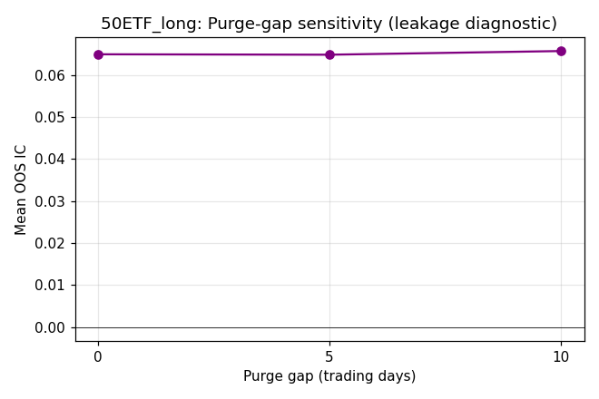


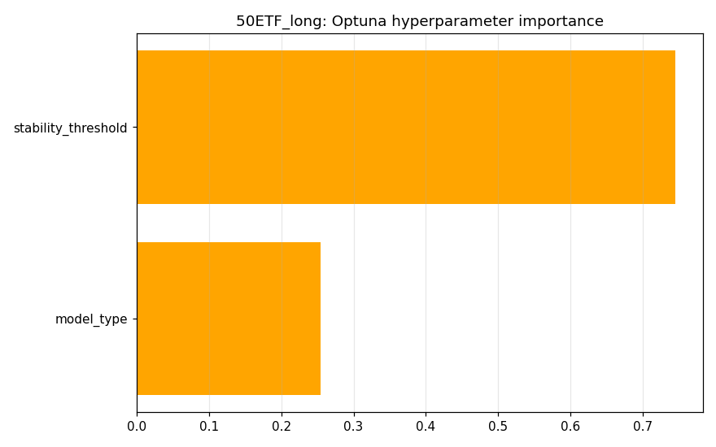


</details>

### 50ETF_short

- **Selected Model**: HUBER
- **Tuned Stability Threshold**: 0.75
- **Samples**: 2722 (2015-04-07 → 2026-06-17)
- **Holdout**: 544 days (2024-03-19 → 2026-06-17)
- **Target stats**: mean=-0.0019%, std=0.9480%, Sharpe=-0.03
- **Selected features (3)**: `bar_vol_2, iv, gap_pct`

#### Feature Stability Scores (Block Bootstrap)

<details>
<summary><b>Click to expand Feature Stability Scores (Block Bootstrap) Table</b></summary>

| Feature | Stability Score | Status | Pearson $r$ | Spearman $\rho$ | Monotonicity Score | Mutual Info | Quality Rating | Holdout IC | Yearly ICs | Yearly IC Std |
|---------|-----------------|--------|-------------|-----------------|--------------------|-------------|----------------|------------|------------|---------------|
| bar_vol_2 | 66.8% | **Selected** | -0.0341 | -0.0384 | -0.20 | 0.0246 | * Non-Monotonic / Weak | -0.0733 | 15:-0.04 16:-0.02 17:-0.02 18:-0.06 19:-0.03 20:+0.01 21:-0.11 22:+0.04 23:+0.02 24:-0.07 25:-0.05 26:-0.01 | 0.0392 |
| iv | 58.0% | **Selected** | -0.0146 | -0.0456 | -0.70 | 0.0595 | ** Moderate Monotonic | -0.0462 | 15:-0.01 16:-0.11 17:-0.04 18:-0.02 19:-0.11 20:-0.08 21:-0.02 22:+0.08 23:-0.04 24:+0.01 25:-0.05 26:-0.05 | 0.0488 |
| gap_pct | 56.0% | **Selected** | +0.0437 | +0.0200 | +0.70 | 0.0101 | ** Moderate Monotonic | +0.0164 | 15:+0.03 16:+0.06 17:-0.12 18:+0.03 19:+0.06 20:+0.07 21:+0.01 22:+0.08 23:-0.07 24:-0.06 25:+0.00 26:+0.18 | 0.0757 |
| northbound_net | 53.6% | Pruned | +0.0324 | +0.0458 | +0.90 | 0.0016 | *** Strong Monotonic | -0.0394 | 15:+0.06 16:-0.03 17:+0.01 18:+0.09 19:+0.15 20:+0.01 21:+0.04 22:+0.09 23:+0.06 24:-0.03 26:+nan | nan |
| yesterday_day_late_mom | 46.4% | Pruned | +0.0363 | +0.0062 | +0.30 | 0.0000 | * Non-Monotonic / Weak | -0.0195 | 15:+0.10 16:+0.05 17:+0.13 18:-0.05 19:-0.05 20:+0.05 21:-0.06 22:-0.05 23:-0.05 24:-0.05 25:+0.05 26:+0.00 | 0.0635 |
| bar_rng_0 | 44.4% | Pruned | +0.0489 | -0.0012 | +0.50 | 0.0745 | * Non-Monotonic / Weak | -0.0345 | 15:-0.02 16:-0.05 17:+0.00 18:+0.03 19:-0.03 20:+0.07 21:+0.01 22:+0.02 23:-0.04 24:+0.03 25:-0.01 26:-0.10 | 0.0433 |
| yesterday_early_range | 42.0% | Pruned | +0.0691 | -0.0258 | -0.20 | 0.0235 | * Non-Monotonic / Weak | -0.0498 | 15:+0.08 16:-0.02 17:+0.05 18:-0.01 19:-0.08 20:+0.03 21:-0.08 22:-0.00 23:-0.05 24:-0.02 25:-0.09 26:+0.06 | 0.0559 |
| yesterday_early_skew | 40.4% | Pruned | -0.0195 | -0.0293 | -0.10 | 0.0000 | * Non-Monotonic / Weak | -0.0152 | 15:-0.03 16:+0.05 17:-0.12 18:-0.03 19:+0.11 20:-0.05 21:-0.10 22:-0.05 23:+0.00 24:+0.04 25:-0.09 26:-0.02 | 0.0635 |
| vix_vol_ratio | 39.6% | Pruned | +0.0053 | +0.0168 | +0.30 | 0.0049 | * Non-Monotonic / Weak | +0.0561 | 15:+0.02 16:+0.08 17:+0.07 18:-0.05 19:+0.03 20:-0.07 21:+0.01 22:-0.09 23:+0.10 24:+0.03 25:+0.06 26:-0.09 | 0.0646 |
| vix_diff_1d | 38.4% | Pruned | +0.0383 | -0.0402 | -0.60 | 0.0320 | ** Moderate Monotonic | -0.0495 | 15:+0.17 16:-0.16 17:-0.02 18:-0.09 19:-0.15 20:-0.03 21:-0.02 22:-0.09 23:-0.02 24:-0.01 25:-0.05 26:-0.07 | 0.0794 |
| yesterday_gap_pct | 37.6% | Pruned | -0.0115 | +0.0254 | +0.90 | 0.0193 | ** Non-Linear Monotonic | +0.0571 | 15:+0.10 16:-0.05 17:-0.01 18:-0.07 19:+0.04 20:-0.01 21:+0.11 22:+0.08 23:+0.01 24:+0.04 25:+0.10 26:-0.01 | 0.0571 |
| yesterday_early_realized_vol | 36.8% | Pruned | +0.0306 | -0.0039 | +0.50 | 0.0055 | * Non-Monotonic / Weak | +0.0023 | 15:+0.01 16:+0.02 17:+0.04 18:+0.05 19:-0.11 20:+0.01 21:+0.08 22:-0.03 23:-0.08 24:-0.01 25:+0.02 26:+0.05 | 0.0522 |
| first_bar_return | 34.0% | Pruned | +0.1198 | +0.0526 | +0.90 | 0.0083 | *** Strong Monotonic | -0.0296 | 15:+0.14 16:+0.09 17:-0.05 18:+0.17 19:+0.03 20:+0.04 21:+0.05 22:+0.05 23:+0.07 24:-0.01 25:+0.00 26:-0.15 | 0.0812 |
| capital_net_ratio | 34.0% | Pruned | -0.0201 | -0.0390 | -0.70 | 0.0153 | ** Moderate Monotonic | +0.0021 | 17:-0.07 18:-0.05 19:-0.02 20:-0.05 21:-0.09 22:+0.05 23:-0.13 24:-0.14 25:+0.02 26:+0.10 | 0.0728 |
| early_skew | 33.2% | Pruned | +0.0314 | +0.0317 | +0.90 | 0.0000 | *** Strong Monotonic | +0.0465 | 15:+0.07 16:+0.09 17:+0.07 18:-0.07 19:-0.04 20:+0.00 21:-0.05 22:+0.22 23:-0.02 24:+0.08 25:+0.02 26:+0.02 | 0.0761 |
| short_balance_quantity | 32.8% | Pruned | -0.0051 | -0.0231 | -0.60 | 0.0447 | ** Moderate Monotonic | -0.0136 | 15:-0.04 16:-0.04 17:-0.04 18:-0.08 19:-0.17 20:-0.03 21:-0.10 22:+0.11 23:-0.04 24:+0.05 25:+0.01 26:-0.14 | 0.0721 |
| vix_iv_spread | 31.6% | Pruned | +0.0448 | +0.0625 | +0.80 | 0.0123 | ** Moderate Monotonic | +0.0274 | 15:+0.08 16:+0.08 17:+0.04 18:+0.02 19:+0.02 20:+0.13 21:+0.01 22:+0.04 23:+0.06 24:+0.11 25:+0.07 26:-0.11 | 0.0585 |
| vol_pk20 | 31.2% | Pruned | +0.0129 | -0.0194 | -0.10 | 0.0621 | * Non-Monotonic / Weak | +0.0039 | 15:-0.01 16:-0.08 17:-0.00 18:-0.00 19:-0.09 20:-0.01 21:+0.01 22:+0.12 23:-0.06 24:+0.05 25:+0.01 26:+0.07 | 0.0581 |
| bar_vwap_dev_0 | 30.8% | Pruned | +0.0311 | +0.0409 | N/A | 0.0000 | N/A | N/A | N/A | N/A |
| first_bar_volume | 29.6% | Pruned | -0.0327 | -0.0319 | -0.30 | 0.0000 | * Non-Monotonic / Weak | -0.0033 | 15:-0.04 16:-0.03 17:-0.11 18:-0.09 19:-0.06 20:+0.05 21:-0.07 22:+0.01 23:+0.00 24:-0.02 25:+0.04 26:+0.02 | 0.0484 |
| yesterday_day_close_pos | 29.2% | Pruned | -0.0143 | -0.0146 | -0.50 | 0.0039 | * Non-Monotonic / Weak | +0.0108 | 15:+0.03 16:-0.09 17:+0.04 18:-0.05 19:-0.10 20:+0.01 21:-0.02 22:-0.02 23:-0.01 24:+0.05 25:+0.01 26:+0.04 | 0.0469 |
| capital_sell_value | 28.8% | Pruned | -0.0209 | -0.0318 | -0.80 | 0.0360 | ** Moderate Monotonic | -0.0258 | 15:+nan 17:-0.05 18:-0.11 19:-0.09 20:-0.06 21:-0.03 22:-0.04 23:-0.07 24:+0.03 25:+0.06 26:-0.09 | nan |
| bar_vol_0 | 28.4% | Pruned | -0.0327 | -0.0319 | -0.30 | 0.0000 | * Non-Monotonic / Weak | -0.0033 | 15:-0.04 16:-0.03 17:-0.11 18:-0.09 19:-0.06 20:+0.05 21:-0.07 22:+0.01 23:+0.00 24:-0.02 25:+0.04 26:+0.02 | 0.0484 |
| yesterday_am_return | 28.0% | Pruned | +0.0364 | +0.0170 | +0.90 | 0.0000 | *** Strong Monotonic | -0.0050 | 15:+0.05 16:-0.06 17:-0.01 18:+0.07 19:+0.05 20:-0.00 21:-0.02 22:+0.03 23:+0.09 24:-0.02 25:+0.03 26:-0.07 | 0.0481 |
| margin_net_buy | 28.0% | Pruned | -0.1262 | -0.0654 | -0.90 | 0.0000 | *** Strong Monotonic | -0.0343 | 15:-0.11 16:+0.05 17:+0.00 18:-0.08 19:-0.07 20:-0.08 21:-0.10 22:-0.07 23:-0.06 24:-0.18 25:+0.07 26:+0.07 | 0.0742 |
| bar_ret_0 | 27.2% | Pruned | +0.1197 | +0.0526 | +0.90 | 0.0083 | *** Strong Monotonic | -0.0296 | 15:+0.14 16:+0.09 17:-0.05 18:+0.17 19:+0.03 20:+0.04 21:+0.05 22:+0.05 23:+0.07 24:-0.01 25:+0.00 26:-0.15 | 0.0812 |
| yesterday_pm_return | 24.0% | Pruned | +0.0062 | -0.0015 | +0.00 | 0.0000 | * Non-Monotonic / Weak | +0.0284 | 15:+0.07 16:-0.04 17:+0.02 18:-0.05 19:-0.16 20:+0.07 21:+0.00 22:+0.02 23:-0.04 24:+0.02 25:+0.03 26:+0.06 | 0.0625 |
| roc60 | 24.0% | Pruned | -0.0570 | -0.0261 | -0.70 | 0.0356 | ** Moderate Monotonic | +0.0156 | 15:-0.08 16:-0.08 17:-0.05 18:-0.02 19:-0.20 20:-0.07 21:-0.08 22:-0.06 23:-0.07 24:-0.03 25:-0.03 26:-0.10 | 0.0450 |
| bar_rng_1 | 23.6% | Pruned | +0.0038 | -0.0298 | -0.60 | 0.0223 | ** Moderate Monotonic | -0.0595 | 15:-0.04 16:-0.09 17:+0.01 18:+0.02 19:+0.03 20:-0.07 21:-0.07 22:-0.08 23:+0.11 24:-0.04 25:-0.10 26:+0.02 | 0.0589 |
| vix | 22.8% | Pruned | +0.0045 | -0.0303 | -0.30 | 0.0341 | * Non-Monotonic / Weak | -0.0298 | 15:+0.01 16:-0.09 17:-0.04 18:-0.01 19:-0.13 20:-0.04 21:-0.03 22:+0.08 23:-0.00 24:+0.05 25:-0.03 26:-0.11 | 0.0601 |
| capital_buy_value | 22.4% | Pruned | -0.0318 | -0.0438 | -0.90 | 0.0398 | *** Strong Monotonic | -0.0411 | 16:+nan 17:-0.03 18:-0.16 19:-0.11 20:-0.09 21:-0.08 22:+0.00 23:-0.13 24:-0.04 25:+0.05 26:-0.08 | nan |
| bar_ret_1 | 21.6% | Pruned | -0.0677 | -0.0022 | -0.20 | 0.0154 | * Non-Monotonic / Weak | -0.0476 | 15:-0.12 16:+0.00 17:+0.04 18:+0.10 19:-0.04 20:-0.04 21:+0.07 22:-0.04 23:+0.01 24:+0.00 25:+0.00 26:-0.15 | 0.0685 |
| total_balance | 21.6% | Pruned | +0.0001 | -0.0062 | -0.10 | 0.0333 | * Non-Monotonic / Weak | +0.0158 | 15:-0.07 16:-0.06 17:-0.10 18:-0.02 19:-0.03 20:-0.02 21:+0.00 22:+0.05 23:+0.02 24:+0.08 25:-0.02 26:+0.03 | 0.0494 |
| iv_diff_1d | 20.8% | Pruned | -0.0140 | -0.0289 | -0.60 | 0.0022 | ** Moderate Monotonic | -0.0398 | 15:+0.06 16:+0.06 17:-0.05 18:-0.03 19:-0.11 20:-0.06 21:-0.07 22:-0.04 23:-0.06 24:-0.04 25:-0.01 26:-0.07 | 0.0482 |
| yesterday_day_skew | 20.8% | Pruned | +0.0082 | +0.0104 | -0.60 | 0.0000 | ** Moderate Monotonic | +0.0387 | 15:+0.09 16:-0.04 17:-0.04 18:+0.11 19:+0.06 20:+0.03 21:-0.06 22:-0.10 23:+0.02 24:+0.00 25:+0.07 26:+0.12 | 0.0681 |
| margin_repayment | 20.4% | Pruned | +0.0736 | -0.0337 | -0.70 | 0.0000 | ** Moderate Monotonic | -0.0389 | 15:+0.00 16:-0.14 17:-0.00 18:+0.01 19:-0.08 20:+0.01 21:+0.01 22:-0.03 23:-0.07 24:-0.01 25:+0.00 26:-0.08 | 0.0469 |
| yesterday_day_pm_am_vol_ratio | 20.4% | Pruned | +0.0077 | -0.0110 | +0.10 | 0.0000 | * Non-Monotonic / Weak | -0.0158 | 15:+0.01 16:+0.14 17:+0.03 18:+0.01 19:-0.12 20:-0.07 21:-0.06 22:-0.05 23:+0.03 24:+0.08 25:-0.06 26:-0.03 | 0.0701 |
| yesterday_day_kurtosis | 20.4% | Pruned | -0.0115 | -0.0207 | -0.60 | 0.0148 | ** Moderate Monotonic | -0.0571 | 15:+0.08 16:+0.01 17:-0.09 18:+0.08 19:+0.03 20:-0.06 21:-0.06 22:-0.04 23:-0.08 24:-0.07 25:-0.04 26:-0.09 | 0.0589 |
| margin_balance | 20.0% | Pruned | +0.0005 | -0.0053 | +0.20 | 0.0334 | * Non-Monotonic / Weak | +0.0192 | 15:-0.07 16:-0.06 17:-0.09 18:-0.02 19:-0.01 20:-0.01 21:+0.01 22:+0.04 23:+0.04 24:+0.08 25:-0.01 26:+0.05 | 0.0489 |
| yesterday_day_vwap_dev | 19.6% | Pruned | -0.0057 | -0.0281 | -0.80 | 0.0000 | ** Moderate Monotonic | -0.0080 | 15:+0.04 16:-0.11 17:+0.04 18:-0.08 19:-0.13 20:-0.03 21:-0.01 22:-0.03 23:+0.01 24:+0.01 25:-0.02 26:+0.08 | 0.0583 |
| early_realized_vol | 19.2% | Pruned | +0.0280 | -0.0066 | -0.10 | 0.0201 | * Non-Monotonic / Weak | +0.0261 | 15:+0.04 16:-0.00 17:-0.04 18:-0.01 19:-0.01 20:+0.00 21:-0.08 22:-0.07 23:+0.06 24:+0.06 25:+0.01 26:+0.01 | 0.0429 |
| vix_iv_ratio | 18.8% | Pruned | +0.0340 | +0.0649 | +0.80 | 0.0270 | ** Moderate Monotonic | +0.0395 | 15:+0.07 16:+0.11 17:+0.04 18:+0.02 19:+0.02 20:+0.14 21:+0.02 22:+0.03 23:+0.06 24:+0.10 25:+0.08 26:-0.06 | 0.0500 |
| yesterday_early_volume_ratio | 18.0% | Pruned | +0.0124 | -0.0295 | +0.10 | 0.0296 | * Non-Monotonic / Weak | -0.0581 | 15:-0.00 16:-0.09 17:-0.02 18:+0.01 19:+0.01 20:-0.01 21:-0.10 22:+0.03 23:-0.08 24:-0.15 25:+0.05 26:-0.08 | 0.0584 |
| northbound_sell | 17.6% | Pruned | -0.0172 | -0.0279 | -0.90 | 0.0260 | ** Non-Linear Monotonic | -0.0052 | 15:-0.09 16:-0.04 17:-0.02 18:-0.06 19:-0.16 20:-0.02 21:+0.00 22:-0.06 23:-0.06 24:+0.11 25:+nan 26:+nan | nan |
| vol_ratio_5_20 | 17.2% | Pruned | -0.0057 | -0.0322 | -0.30 | 0.0000 | * Non-Monotonic / Weak | -0.0320 | 15:+0.12 16:-0.15 17:-0.04 18:-0.06 19:+0.02 20:-0.05 21:-0.02 22:+0.01 23:-0.11 24:-0.16 25:+0.07 26:+0.06 | 0.0839 |
| max_down_ret | 17.2% | Pruned | +0.0524 | +0.0474 | +1.00 | 0.0000 | *** Strong Monotonic | +0.0121 | 15:+0.02 16:+0.16 17:-0.09 18:+0.17 19:+0.02 20:+0.04 21:+0.09 22:-0.01 23:+0.07 24:+0.01 25:+0.06 26:-0.17 | 0.0910 |
| capital_net_value | 16.4% | Pruned | -0.0081 | -0.0378 | -0.90 | 0.0036 | ** Non-Linear Monotonic | +0.0035 | 15:+nan 16:+nan 17:-0.11 18:-0.04 19:-0.04 20:-0.01 21:-0.10 22:+0.05 23:-0.13 24:-0.16 25:+0.04 26:+0.11 | nan |
| volume_sma_ratio | 16.0% | Pruned | -0.0009 | -0.0298 | +0.10 | 0.0022 | * Non-Monotonic / Weak | -0.0886 | 15:+0.03 16:-0.09 17:-0.04 18:-0.01 19:+0.03 20:+0.00 21:-0.07 22:+0.00 23:-0.08 24:-0.13 25:+0.02 26:-0.14 | 0.0586 |
| bar_rng_2 | 15.6% | Pruned | -0.0089 | +0.0060 | +0.50 | 0.0221 | * Non-Monotonic / Weak | -0.0552 | 15:+0.07 16:-0.08 17:+0.02 18:+0.03 19:-0.01 20:-0.00 21:+0.04 22:+0.03 23:+0.11 24:-0.05 25:-0.07 26:+0.08 | 0.0575 |
| volume_sma_ratio_long | 15.6% | Pruned | -0.0277 | -0.0332 | -0.20 | 0.0270 | * Non-Monotonic / Weak | -0.0228 | 15:-0.04 16:-0.07 17:-0.08 18:+0.02 19:-0.14 20:+0.01 21:-0.04 22:+0.07 23:-0.15 24:-0.09 25:+0.11 26:-0.04 | 0.0738 |
| yesterday_first_bar_return | 15.2% | Pruned | -0.0107 | +0.0153 | +0.60 | 0.0014 | ** Moderate Monotonic | +0.0222 | 15:+0.04 16:-0.03 17:+0.09 18:-0.07 19:+0.02 20:+0.00 21:-0.07 22:+0.04 23:+0.13 24:+0.01 25:+0.04 26:+0.02 | 0.0561 |
| cci14 | 14.8% | Pruned | -0.0206 | -0.0374 | -0.80 | 0.0577 | ** Moderate Monotonic | -0.1132 | 15:-0.01 16:-0.09 17:+0.01 18:+0.03 19:-0.13 20:+0.02 21:+0.02 22:+0.07 23:-0.06 24:-0.05 25:-0.10 26:-0.14 | 0.0672 |
| bb_width | 14.4% | Pruned | -0.0056 | +0.0330 | +0.10 | 0.0548 | * Non-Monotonic / Weak | +0.1119 | 15:-0.02 16:+0.12 17:+0.06 18:-0.03 19:+0.06 20:-0.00 21:+0.09 22:-0.09 23:-0.03 24:-0.01 25:+0.16 26:+0.15 | 0.0765 |
| body_to_range_ratio | 14.4% | Pruned | +0.0279 | +0.0285 | +0.90 | 0.0077 | *** Strong Monotonic | -0.0174 | 15:-0.04 16:+0.10 17:+0.00 18:+0.04 19:+0.03 20:-0.01 21:+0.05 22:+0.14 23:+0.05 24:-0.04 25:+0.01 26:-0.01 | 0.0513 |
| yesterday_first_bar_volume | 14.0% | Pruned | +0.0133 | -0.0306 | -0.20 | 0.0020 | * Non-Monotonic / Weak | -0.0542 | 15:-0.01 16:-0.11 17:-0.03 18:-0.01 19:+0.00 20:-0.00 21:-0.12 22:+0.03 23:-0.02 24:-0.14 25:+0.04 26:-0.03 | 0.0564 |
| roc10 | 14.0% | Pruned | -0.0791 | -0.0420 | -0.10 | 0.0262 | * Non-Monotonic / Weak | -0.0668 | 15:-0.07 16:-0.07 17:-0.09 18:-0.04 19:-0.11 20:-0.06 21:-0.10 22:+0.05 23:-0.01 24:-0.09 25:-0.06 26:-0.09 | 0.0428 |
| vol60 | 14.0% | Pruned | +0.0151 | -0.0153 | -0.10 | 0.0434 | * Non-Monotonic / Weak | -0.0137 | 15:+0.03 16:-0.06 17:-0.03 18:-0.02 19:-0.08 20:-0.02 21:+0.01 22:+0.13 23:-0.02 24:+0.06 25:-0.08 26:+0.04 | 0.0606 |
| vol_ratio_10_60 | 14.0% | Pruned | -0.0021 | -0.0251 | -0.50 | 0.0039 | * Non-Monotonic / Weak | -0.0659 | 15:+0.04 16:-0.08 17:-0.07 18:+0.09 19:-0.11 20:+0.01 21:+0.03 22:-0.03 23:-0.12 24:-0.09 25:+0.07 26:-0.08 | 0.0709 |
| sma200_dist | 13.6% | Pruned | -0.0567 | -0.0335 | -0.70 | 0.0023 | ** Moderate Monotonic | -0.0475 | 15:-0.05 16:-0.01 17:-0.08 18:-0.08 19:-0.25 20:-0.10 21:-0.10 22:-0.06 23:-0.13 24:-0.11 25:-0.15 26:-0.07 | 0.0568 |
| bar_ret_2 | 13.2% | Pruned | -0.0340 | -0.0034 | -0.10 | 0.0000 | * Non-Monotonic / Weak | -0.0249 | 15:-0.08 16:-0.05 17:-0.05 18:-0.00 19:+0.11 20:-0.02 21:+0.05 22:-0.05 23:+0.03 24:-0.02 25:+0.01 26:-0.09 | 0.0549 |
| macd_hist | 13.2% | Pruned | -0.0658 | -0.0520 | -0.90 | 0.0170 | *** Strong Monotonic | -0.0710 | 15:-0.07 16:-0.01 17:-0.09 18:-0.09 19:-0.09 20:-0.03 21:-0.10 22:+0.03 23:-0.03 24:-0.05 25:-0.07 26:-0.14 | 0.0430 |
| buy_on_margin_value | 13.2% | Pruned | -0.0087 | -0.0688 | -0.90 | 0.0000 | ** Non-Linear Monotonic | -0.0535 | 15:-0.04 16:-0.18 17:+0.00 18:-0.11 19:-0.12 20:-0.11 21:-0.04 22:-0.05 23:-0.13 24:-0.09 25:+0.00 26:-0.06 | 0.0541 |
| bar_vwap_dev_1 | 12.8% | Pruned | -0.0668 | -0.0006 | -0.60 | 0.0153 | ** Moderate Monotonic | -0.0558 | 15:-0.11 16:+0.00 17:+0.04 18:+0.12 19:-0.04 20:-0.03 21:+0.07 22:-0.05 23:+0.02 24:-0.00 25:-0.01 26:-0.16 | 0.0717 |
| cl_pos_in_range | 12.8% | Pruned | +0.0156 | +0.0142 | +0.50 | 0.0000 | * Non-Monotonic / Weak | -0.0386 | 15:-0.05 16:+0.05 17:-0.05 18:+0.09 19:+0.04 20:-0.02 21:+0.05 22:-0.02 23:+0.05 24:-0.01 25:+0.03 26:-0.16 | 0.0661 |
| roc5 | 12.8% | Pruned | -0.0379 | -0.0333 | -0.70 | 0.0226 | ** Moderate Monotonic | -0.0311 | 15:+0.00 16:-0.13 17:-0.13 18:-0.02 19:-0.11 20:+0.01 21:+0.02 22:-0.02 23:-0.02 24:-0.03 25:-0.05 26:-0.07 | 0.0491 |
| yesterday_early_trend | 12.0% | Pruned | +0.0009 | +0.0214 | +0.60 | 0.0214 | ** Moderate Monotonic | +0.0233 | 15:+0.03 16:-0.07 17:+0.08 18:+0.15 19:-0.00 20:+0.10 21:-0.07 22:-0.04 23:+0.01 24:+0.04 25:+0.06 26:-0.06 | 0.0696 |
| sma10_dist | 11.6% | Pruned | -0.0606 | -0.0406 | -0.70 | 0.0230 | ** Moderate Monotonic | -0.0554 | 15:-0.04 16:-0.09 17:-0.07 18:-0.03 19:-0.10 20:-0.05 21:-0.04 22:+0.01 23:-0.02 24:-0.05 25:-0.08 26:-0.06 | 0.0298 |
| mfi14 | 11.6% | Pruned | -0.0429 | -0.0425 | -0.50 | 0.0213 | * Non-Monotonic / Weak | -0.0713 | 15:-0.05 16:-0.07 17:-0.01 18:-0.07 19:-0.10 20:-0.04 21:-0.03 22:+0.01 23:-0.08 24:-0.09 25:-0.07 26:-0.13 | 0.0396 |
| num_up_bars | 11.2% | Pruned | +0.0181 | +0.0170 | +0.50 | 0.0000 | ** Moderate Monotonic | -0.0508 | 15:-0.04 16:+0.04 17:-0.04 18:+0.16 19:+0.04 20:-0.04 21:+0.10 22:-0.02 23:+0.04 24:-0.06 25:+0.02 26:-0.20 | 0.0861 |
| vol20 | 10.8% | Pruned | +0.0078 | -0.0306 | -0.40 | 0.0551 | * Non-Monotonic / Weak | -0.0502 | 15:-0.00 16:-0.11 17:-0.07 18:+0.00 19:-0.11 20:+0.03 21:-0.03 22:+0.11 23:-0.12 24:+0.02 25:-0.06 26:+0.09 | 0.0729 |
| sma100_dist | 10.8% | Pruned | -0.0831 | -0.0496 | -0.70 | 0.0046 | ** Moderate Monotonic | -0.0418 | 15:-0.13 16:-0.06 17:-0.07 18:-0.05 19:-0.23 20:-0.09 21:-0.11 22:-0.06 23:-0.13 24:-0.08 25:-0.12 26:-0.10 | 0.0463 |
| aroon_osc | 10.8% | Pruned | -0.0382 | -0.0405 | -0.80 | 0.0000 | ** Moderate Monotonic | -0.0474 | 15:-0.11 16:-0.06 17:-0.04 18:-0.04 19:-0.12 20:-0.00 21:-0.11 22:+0.02 23:+0.02 24:-0.10 25:+0.00 26:-0.11 | 0.0527 |
| margin_short_ratio | 10.4% | Pruned | +0.0193 | +0.0256 | +0.60 | 0.0251 | ** Moderate Monotonic | +0.0296 | 15:-0.00 16:+0.05 17:+0.03 18:+0.06 19:+0.17 20:+0.03 21:+0.12 22:-0.09 23:+0.05 24:-0.02 25:+0.00 26:+0.14 | 0.0703 |
| vol5 | 10.0% | Pruned | +0.0186 | -0.0472 | -0.70 | 0.0631 | ** Moderate Monotonic | -0.0595 | 15:+0.10 16:-0.17 17:-0.07 18:-0.04 19:-0.07 20:-0.04 21:-0.03 22:+0.09 23:-0.13 24:-0.11 25:+0.01 26:+0.10 | 0.0849 |
| yesterday_early_momentum | 9.6% | Pruned | +0.0007 | +0.0215 | +0.60 | 0.0223 | ** Moderate Monotonic | +0.0235 | 15:+0.03 16:-0.07 17:+0.08 18:+0.15 19:-0.00 20:+0.10 21:-0.07 22:-0.04 23:+0.01 24:+0.04 25:+0.07 26:-0.06 | 0.0696 |
| yesterday_day_range | 9.6% | Pruned | +0.0247 | -0.0275 | -0.60 | 0.0484 | ** Moderate Monotonic | -0.0550 | 15:+0.10 16:-0.08 17:+0.04 18:-0.04 19:+0.02 20:-0.05 21:-0.01 22:-0.00 23:-0.12 24:-0.03 25:+0.01 26:-0.07 | 0.0576 |
| vol10 | 8.8% | Pruned | +0.0255 | -0.0327 | -0.10 | 0.0499 | * Non-Monotonic / Weak | -0.0773 | 15:+0.02 16:-0.12 17:-0.07 18:+0.06 19:-0.11 20:+0.01 21:+0.03 22:+0.05 23:-0.13 24:-0.02 25:-0.05 26:-0.03 | 0.0620 |
| bar_vwap_dev_2 | 8.8% | Pruned | -0.0663 | -0.0007 | -0.30 | 0.0000 | * Non-Monotonic / Weak | -0.0410 | 15:-0.09 16:-0.00 17:-0.03 18:+0.05 19:+0.06 20:-0.05 21:+0.08 22:-0.07 23:+0.06 24:+0.00 25:+0.00 26:-0.17 | 0.0700 |
| max_up_ret | 8.8% | Pruned | +0.0693 | +0.0248 | +0.90 | 0.0136 | *** Strong Monotonic | -0.0492 | 15:+0.08 16:+0.04 17:-0.00 18:+0.16 19:-0.00 20:-0.00 21:+0.05 22:-0.04 23:+0.08 24:-0.04 25:-0.01 26:-0.12 | 0.0693 |
| volume_slope | 8.0% | Pruned | +0.0246 | +0.0156 | +0.50 | 0.0000 | * Non-Monotonic / Weak | -0.0415 | 15:+0.05 16:-0.02 17:+0.11 18:+0.08 19:+0.04 20:-0.06 21:+0.03 22:+0.04 23:-0.00 24:-0.03 25:-0.07 26:-0.07 | 0.0580 |
| roc20 | 8.0% | Pruned | -0.0665 | -0.0521 | -0.70 | 0.0312 | ** Moderate Monotonic | -0.0848 | 15:-0.08 16:-0.05 17:-0.07 18:-0.03 19:-0.14 20:-0.06 21:-0.08 22:-0.02 23:-0.07 24:-0.05 25:-0.14 26:-0.14 | 0.0396 |
| yesterday_early_vwap_dev | 8.0% | Pruned | +0.0141 | +0.0237 | +0.30 | 0.0000 | * Non-Monotonic / Weak | +0.0258 | 15:+0.07 16:-0.06 17:+0.10 18:+0.12 19:-0.02 20:+0.07 21:-0.06 22:-0.04 23:+0.01 24:+0.07 25:+0.04 26:-0.05 | 0.0628 |
| vol_gk20 | 8.0% | Pruned | +0.0222 | -0.0120 | +0.10 | 0.0449 | * Non-Monotonic / Weak | +0.0136 | 15:-0.01 16:-0.08 17:+0.03 18:-0.01 19:-0.08 20:-0.03 21:+0.02 22:+0.11 23:-0.01 24:+0.05 25:+0.03 26:+0.08 | 0.0538 |
| early_vwap_dev | 7.6% | Pruned | -0.0663 | -0.0007 | -0.30 | 0.0000 | * Non-Monotonic / Weak | -0.0410 | 15:-0.09 16:-0.00 17:-0.03 18:+0.05 19:+0.06 20:-0.05 21:+0.08 22:-0.07 23:+0.06 24:+0.00 25:+0.00 26:-0.17 | 0.0700 |
| bar_body_rng_1 | 7.6% | Pruned | -0.0083 | +0.0047 | -0.70 | 0.0000 | ** Moderate Monotonic | -0.0395 | 15:-0.09 16:+0.01 17:+0.05 18:+0.09 19:-0.02 20:-0.06 21:+0.08 22:-0.04 23:+0.02 24:-0.00 25:-0.00 26:-0.12 | 0.0614 |
| northbound_buy | 7.6% | Pruned | -0.0114 | -0.0230 | -0.90 | 0.0089 | ** Non-Linear Monotonic | -0.0086 | 15:-0.01 16:-0.07 17:-0.02 18:+0.03 19:-0.10 20:-0.01 21:+0.01 22:+0.01 23:-0.03 24:+0.10 25:+nan 26:+nan | nan |
| short_balance | 7.2% | Pruned | -0.0170 | -0.0340 | -0.60 | 0.0000 | ** Moderate Monotonic | -0.0210 | 15:-0.06 16:-0.06 17:-0.04 18:-0.08 19:-0.17 20:-0.04 21:-0.12 22:+0.10 23:-0.05 24:+0.03 25:-0.00 26:-0.16 | 0.0732 |
| bar_body_rng_2 | 6.8% | Pruned | -0.0024 | +0.0025 | -0.10 | 0.0226 | * Non-Monotonic / Weak | -0.0077 | 15:-0.06 16:-0.02 17:-0.04 18:-0.00 19:+0.09 20:-0.01 21:+0.05 22:-0.05 23:+0.02 24:-0.01 25:+0.02 26:-0.06 | 0.0439 |
| short_sell_quantity | 6.8% | Pruned | -0.0036 | -0.0267 | -0.20 | 0.0000 | * Non-Monotonic / Weak | +0.0461 | 15:-0.04 16:+0.00 17:-0.05 18:-0.01 19:-0.09 20:-0.11 21:-0.06 22:+0.09 23:-0.02 24:+0.01 25:+0.09 26:+0.02 | 0.0598 |
| yesterday_first_30min_return | 6.8% | Pruned | -0.0064 | +0.0180 | -0.10 | 0.0106 | * Non-Monotonic / Weak | +0.0062 | 15:+0.03 16:-0.07 17:+0.11 18:+0.07 19:+0.01 20:+0.08 21:-0.12 22:-0.00 23:+0.10 24:-0.00 25:+0.02 26:-0.02 | 0.0658 |
| yesterday_day_realized_vol | 6.4% | Pruned | +0.0460 | -0.0214 | +0.10 | 0.0615 | * Non-Monotonic / Weak | -0.0492 | 15:+0.08 16:-0.06 17:+0.06 18:-0.00 19:-0.04 20:-0.01 21:+0.04 22:-0.01 23:-0.11 24:+0.00 25:+0.02 26:-0.13 | 0.0608 |
| bar_body_rng_0 | 6.4% | Pruned | +0.0720 | +0.0527 | +1.00 | 0.0000 | *** Strong Monotonic | -0.0212 | 15:+0.15 16:+0.12 17:-0.07 18:+0.16 19:+0.03 20:+0.01 21:+0.08 22:+0.03 23:+0.09 24:-0.03 25:+0.03 26:-0.12 | 0.0837 |
| total_path_length | 6.4% | Pruned | +0.0245 | +0.0010 | +0.50 | 0.0415 | * Non-Monotonic / Weak | -0.0245 | 15:+0.03 16:-0.01 17:-0.01 18:+0.02 19:-0.00 20:-0.01 21:-0.03 22:+0.00 23:+0.10 24:-0.00 25:-0.04 26:+0.03 | 0.0355 |
| capital_sell_volume | 6.4% | Pruned | -0.0107 | -0.0244 | -0.80 | 0.0227 | ** Moderate Monotonic | -0.0273 | 15:+nan 16:+nan 17:-0.05 18:-0.11 19:-0.06 20:-0.05 21:-0.01 22:-0.04 23:-0.06 24:+0.03 25:+0.07 26:-0.09 | nan |
| stoch_d | 6.0% | Pruned | -0.0490 | -0.0535 | -0.90 | 0.0000 | *** Strong Monotonic | -0.0469 | 15:-0.10 16:-0.01 17:-0.09 18:-0.08 19:-0.17 20:-0.01 21:-0.12 22:+0.01 23:-0.07 24:-0.06 25:-0.05 26:-0.07 | 0.0489 |
| early_range | 5.2% | Pruned | +0.0195 | -0.0106 | +0.10 | 0.0672 | * Non-Monotonic / Weak | -0.0633 | 15:+0.05 16:-0.07 17:+0.08 18:-0.01 19:-0.00 20:-0.04 21:-0.04 22:+0.00 23:+0.02 24:-0.04 25:-0.07 26:+0.03 | 0.0450 |
| short_repayment_quantity | 5.2% | Pruned | -0.0090 | -0.0164 | -0.10 | 0.0158 | * Non-Monotonic / Weak | +0.0324 | 15:+0.03 16:+0.01 17:+0.06 18:-0.14 19:-0.06 20:-0.12 21:+0.04 22:-0.01 23:+0.01 24:+0.09 25:+0.05 26:-0.13 | 0.0752 |
| sma50_dist | 4.4% | Pruned | -0.0696 | -0.0428 | -0.70 | 0.0324 | ** Moderate Monotonic | -0.0662 | 15:-0.07 16:-0.09 17:-0.07 18:-0.04 19:-0.17 20:-0.09 21:-0.08 22:-0.02 23:-0.08 24:-0.05 25:-0.10 26:-0.16 | 0.0414 |
| atr14_norm | 4.0% | Pruned | +0.0292 | -0.0161 | +0.10 | 0.0599 | * Non-Monotonic / Weak | -0.0199 | 15:+0.01 16:-0.09 17:+0.01 18:+0.01 19:-0.07 20:+0.01 21:+0.04 22:+0.12 23:-0.02 24:+0.03 25:-0.01 26:+0.14 | 0.0625 |
| rsi5 | 4.0% | Pruned | -0.0275 | -0.0330 | -0.20 | 0.0187 | * Non-Monotonic / Weak | -0.0408 | 15:-0.05 16:-0.10 17:-0.06 18:-0.02 19:-0.10 20:-0.03 21:-0.04 22:+0.04 23:-0.03 24:-0.04 25:-0.06 26:-0.05 | 0.0336 |
| willr14 | 4.0% | Pruned | -0.0212 | -0.0274 | -0.70 | 0.0000 | ** Moderate Monotonic | -0.0281 | 15:-0.05 16:-0.04 17:-0.04 18:-0.05 19:-0.10 20:-0.02 21:-0.05 22:+0.05 23:-0.04 24:-0.02 25:-0.06 26:-0.05 | 0.0328 |
| capital_buy_volume | 4.0% | Pruned | -0.0170 | -0.0386 | -0.90 | 0.0257 | ** Non-Linear Monotonic | -0.0338 | 15:+nan 17:-0.04 18:-0.15 19:-0.08 20:-0.08 21:-0.06 22:+0.00 23:-0.11 24:-0.04 25:+0.05 26:-0.08 | nan |
| early_momentum | 3.2% | Pruned | -0.0644 | -0.0057 | -0.50 | 0.0113 | * Non-Monotonic / Weak | -0.0436 | 15:-0.11 16:+0.00 17:-0.02 18:+0.06 19:+0.03 20:-0.05 21:+0.08 22:-0.08 23:+0.05 24:-0.00 25:+0.02 26:-0.18 | 0.0718 |
| bar_vol_1 | 3.2% | Pruned | -0.0351 | -0.0371 | -0.50 | 0.0000 | * Non-Monotonic / Weak | -0.0753 | 15:-0.02 16:+0.01 17:-0.06 18:-0.05 19:+0.00 20:+0.00 21:-0.12 22:-0.04 23:+0.03 24:-0.09 25:-0.04 26:-0.03 | 0.0408 |
| stoch_k | 2.8% | Pruned | -0.0360 | -0.0430 | -0.60 | 0.0020 | ** Moderate Monotonic | -0.0421 | 15:-0.12 16:-0.02 17:-0.07 18:-0.05 19:-0.15 20:+0.01 21:-0.09 22:+0.02 23:-0.07 24:-0.03 25:-0.07 26:-0.09 | 0.0472 |
| ema12_dist | 2.8% | Pruned | -0.0668 | -0.0446 | -0.60 | 0.0000 | ** Moderate Monotonic | -0.0655 | 15:-0.06 16:-0.09 17:-0.07 18:-0.04 19:-0.11 20:-0.06 21:-0.05 22:+0.02 23:-0.03 24:-0.06 25:-0.09 26:-0.09 | 0.0321 |
| vol_gk10 | 2.8% | Pruned | +0.0387 | -0.0137 | +0.20 | 0.0385 | * Non-Monotonic / Weak | +0.0036 | 15:+0.01 16:-0.06 17:+0.01 18:+0.00 19:-0.07 20:-0.02 21:-0.01 22:+0.09 23:-0.04 24:+0.05 25:+0.05 26:-0.01 | 0.0441 |
| early_trend | 2.4% | Pruned | -0.0647 | -0.0058 | -0.50 | 0.0097 | * Non-Monotonic / Weak | -0.0436 | 15:-0.11 16:+0.00 17:-0.02 18:+0.06 19:+0.03 20:-0.05 21:+0.08 22:-0.08 23:+0.04 24:-0.00 25:+0.02 26:-0.18 | 0.0718 |
| iv_vol_ratio | 2.4% | Pruned | -0.0196 | -0.0239 | -0.70 | 0.0273 | ** Moderate Monotonic | +0.0357 | 15:-0.03 16:-0.00 17:+0.01 18:-0.07 19:-0.01 20:-0.15 21:+0.02 22:-0.10 23:+0.08 24:-0.02 25:+0.05 26:-0.05 | 0.0618 |
| bb_pctb | 1.6% | Pruned | +0.0251 | +0.0385 | +0.70 | 0.0070 | ** Moderate Monotonic | +0.0344 | 15:+0.07 16:+0.08 17:+0.05 18:+0.04 19:+0.13 20:+0.06 21:+0.08 22:-0.05 23:+0.04 24:+0.05 25:+0.03 26:+0.11 | 0.0423 |
| rsi21 | 1.6% | Pruned | -0.0556 | -0.0460 | -0.70 | 0.0000 | ** Moderate Monotonic | -0.0551 | 15:-0.08 16:-0.07 17:-0.08 18:-0.04 19:-0.19 20:-0.10 21:-0.09 22:-0.00 23:-0.09 24:-0.05 25:-0.09 26:-0.13 | 0.0434 |
| first_30min_return | 1.2% | Pruned | +0.0314 | +0.0299 | +1.00 | 0.0000 | *** Strong Monotonic | -0.0301 | 15:-0.01 16:+0.06 17:-0.03 18:+0.18 19:+0.04 20:-0.01 21:+0.06 22:-0.03 23:+0.08 24:-0.01 25:+0.05 26:-0.20 | 0.0858 |
| sma20_dist | 0.4% | Pruned | -0.0816 | -0.0561 | -0.90 | 0.0233 | *** Strong Monotonic | -0.0687 | 15:-0.08 16:-0.09 17:-0.09 18:-0.07 19:-0.14 20:-0.06 21:-0.09 22:+0.01 23:-0.06 24:-0.08 25:-0.08 26:-0.11 | 0.0329 |
| early_kurtosis | 0.0% | Pruned | -0.0052 | -0.0172 | -0.80 | 0.0006 | ** Moderate Monotonic | N/A | N/A | N/A |
| bar_ret_3 | 0.0% | Pruned | N/A | N/A | N/A | 0.0000 | N/A | N/A | N/A | N/A |
| bar_ret_4 | 0.0% | Pruned | N/A | N/A | N/A | 0.0000 | N/A | N/A | N/A | N/A |
| bar_ret_5 | 0.0% | Pruned | N/A | N/A | N/A | 0.0000 | N/A | N/A | N/A | N/A |
| bar_vol_3 | 0.0% | Pruned | N/A | N/A | N/A | 0.0000 | N/A | N/A | N/A | N/A |
| bar_vol_4 | 0.0% | Pruned | N/A | N/A | N/A | 0.0000 | N/A | N/A | N/A | N/A |
| bar_vol_5 | 0.0% | Pruned | N/A | N/A | N/A | 0.0000 | N/A | N/A | N/A | N/A |
| bar_rng_3 | 0.0% | Pruned | N/A | N/A | N/A | 0.0000 | N/A | N/A | N/A | N/A |
| bar_rng_4 | 0.0% | Pruned | N/A | N/A | N/A | 0.0000 | N/A | N/A | N/A | N/A |
| bar_rng_5 | 0.0% | Pruned | N/A | N/A | N/A | 0.0000 | N/A | N/A | N/A | N/A |
| bar_body_rng_3 | 0.0% | Pruned | N/A | N/A | N/A | 0.0000 | N/A | N/A | N/A | N/A |
| bar_body_rng_4 | 0.0% | Pruned | N/A | N/A | N/A | 0.0000 | N/A | N/A | N/A | N/A |
| bar_body_rng_5 | 0.0% | Pruned | N/A | N/A | N/A | 0.0000 | N/A | N/A | N/A | N/A |
| bar_vwap_dev_3 | 0.0% | Pruned | N/A | N/A | N/A | 0.0000 | N/A | N/A | N/A | N/A |
| bar_vwap_dev_4 | 0.0% | Pruned | N/A | N/A | N/A | 0.0000 | N/A | N/A | N/A | N/A |
| bar_vwap_dev_5 | 0.0% | Pruned | N/A | N/A | N/A | 0.0000 | N/A | N/A | N/A | N/A |
| yesterday_early_kurtosis | 0.0% | Pruned | -0.0150 | -0.0110 | -0.40 | 0.0006 | * Non-Monotonic / Weak | N/A | N/A | N/A |

- **Pearson $r$**: Linear correlation coefficient.
- **Spearman $\rho$**: Rank correlation coefficient (overall monotonic relation).
- **Monotonicity Score**: Spearman rank correlation of target means across 5 feature quintiles. $\pm 1.0$ indicates perfect bin-wise monotonicity.
- **Mutual Info**: Estimated information gain (captures non-linear dependencies).
- **Quality Rating**: Categorized by strength and shape of the monotonic relationship.
- **Holdout IC**: Spearman rank correlation on the holdout set (out-of-sample predictive power).
- **Yearly ICs**: Spearman rank correlation calculated per year.
- **Yearly IC Std**: Standard deviation of yearly ICs (measures temporal stability).

</details>

#### Metrics

| Metric | Best Linear | Ridge Base | Zero | Yesterday PM | First 30min Mom |
|--------|-------------|------------|------|--------------|-----------------|
| IC | +0.1278 | +0.0912 | +0.0000 | +0.0088 | -0.0301 |
| Dir Acc | 0.491 | 0.491 | 0.500 | 0.485 | 0.493 |
| RMSE | 0.7481% | 0.7909% | 0.7416% | 1.0417% | 0.8229% |
| L/S Sharpe | +1.49 | +2.65 | — | — | — |

#### Best Hyperparameters

<details>
<summary><b>Click to expand Best Hyperparameters JSON</b></summary>

```json
{
  "model_type": "huber",
  "stability_threshold": 0.75,
  "huber_alpha": 0.00020652477490005586,
  "huber_epsilon": 1.2705955772697044
}
```

</details>

#### Walk-Forward Fold ICs

| Fold | IS IC | OOS IC |
|------|-------|--------|
| 1 | 0.0544 | +0.0990 |
| 2 | 0.0623 | +0.1033 |
| 3 | 0.0776 | +0.0361 |
| 4 | 0.0707 | -0.0237 |
| 5 | 0.0570 | +0.0649 |
| **Overall** | — | +0.0596 |

#### Year-by-Year OOS IC

| Year | IC | Dir Acc | N | L/S Sharpe |
|------|-----|---------|---|-----------|
| 2017 | +0.0503 | 0.526 | 215 | +0.91 |
| 2018 | +0.0765 | 0.543 | 243 | +1.37 |
| 2019 | +0.1040 | 0.488 | 244 | +0.43 |
| 2020 | +0.1098 | 0.523 | 243 | +3.04 |
| 2021 | +0.0697 | 0.514 | 243 | +1.30 |
| 2022 | -0.0152 | 0.529 | 242 | -0.57 |
| 2023 | -0.0353 | 0.521 | 242 | -0.73 |
| 2024 | -0.0161 | 0.479 | 242 | +1.00 |
| 2025 | +0.0676 | 0.444 | 243 | +2.98 |
| 2026 | +0.0461 | 0.565 | 108 | +2.29 |

#### Diagnostic Plots

<details>
<summary><b>Click to expand Diagnostic Plots</b></summary>

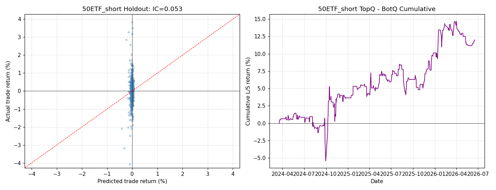


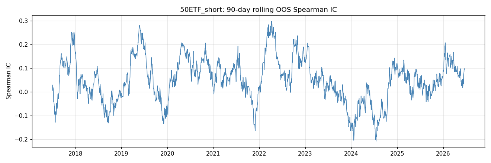


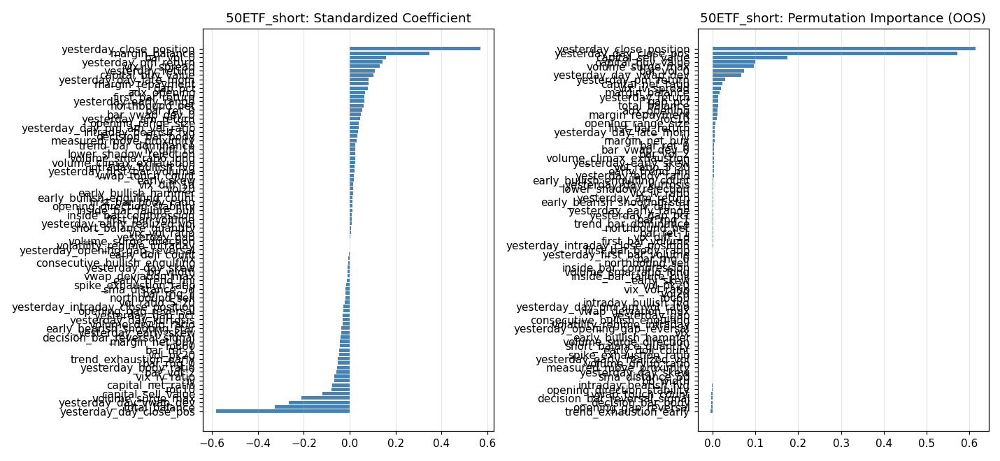


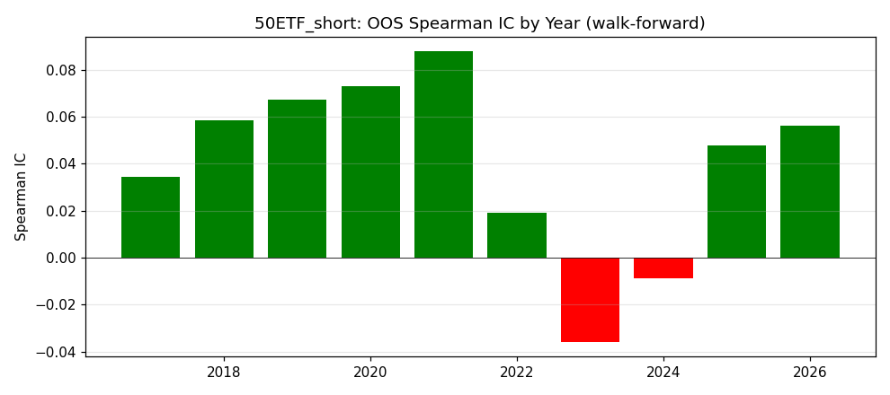


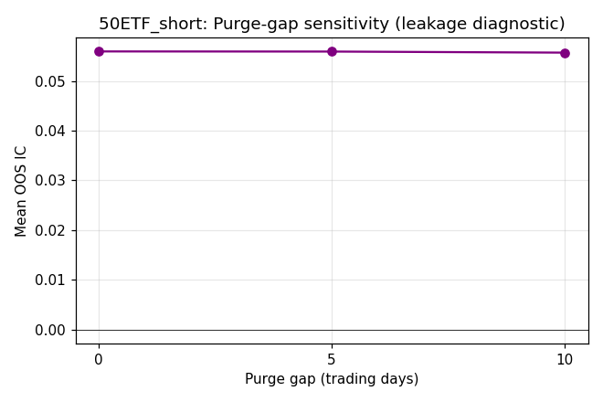


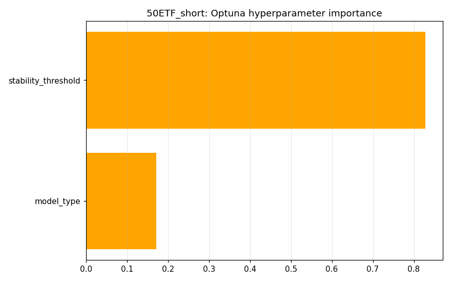


</details>

### 500ETF_long

- **Selected Model**: HUBER
- **Tuned Stability Threshold**: 0.65
- **Samples**: 2722 (2015-04-07 → 2026-06-17)
- **Holdout**: 544 days (2024-03-19 → 2026-06-17)
- **Target stats**: mean=0.0195%, std=1.1474%, Sharpe=0.27
- **Selected features (4)**: `bar_rng_4, max_up_ret, sma100_dist, yesterday_gap_pct`

#### Feature Stability Scores (Block Bootstrap)

<details>
<summary><b>Click to expand Feature Stability Scores (Block Bootstrap) Table</b></summary>

| Feature | Stability Score | Status | Pearson $r$ | Spearman $\rho$ | Monotonicity Score | Mutual Info | Quality Rating | Holdout IC | Yearly ICs | Yearly IC Std |
|---------|-----------------|--------|-------------|-----------------|--------------------|-------------|----------------|------------|------------|---------------|
| sma100_dist | 90.0% | **Selected** | -0.0730 | -0.0389 | -0.90 | 0.0489 | *** Strong Monotonic | +0.0163 | 15:-0.19 16:-0.06 17:-0.09 18:-0.10 19:-0.03 20:-0.07 21:-0.16 22:-0.10 23:-0.12 24:-0.03 25:-0.02 26:+0.05 | 0.0627 |
| yesterday_day_vwap_dev | 74.0% | **Selected** | -0.0341 | -0.0436 | -0.60 | 0.0316 | ** Moderate Monotonic | -0.0735 | 15:+0.04 16:-0.09 17:-0.03 18:-0.07 19:-0.06 20:-0.14 21:-0.03 22:-0.01 23:-0.06 24:-0.01 25:-0.09 26:-0.15 | 0.0539 |
| bar_rng_4 | 72.0% | **Selected** | +0.0421 | +0.0002 | +0.00 | 0.0526 | * Non-Monotonic / Weak | -0.0764 | 15:-0.04 16:+0.01 17:-0.05 18:+0.07 19:-0.02 20:+0.02 21:-0.03 22:+0.05 23:-0.01 24:+0.04 25:-0.10 26:-0.15 | 0.0597 |
| bb_width | 67.6% | **Selected** | -0.0362 | -0.0561 | -1.00 | 0.0631 | ** Non-Linear Monotonic | -0.0604 | 15:-0.01 16:-0.02 17:-0.06 18:-0.09 19:-0.03 20:+0.01 21:+0.06 22:-0.17 23:-0.13 24:-0.11 25:-0.03 26:-0.08 | 0.0619 |
| yesterday_gap_pct | 66.8% | **Selected** | +0.0383 | +0.0175 | +0.40 | 0.0000 | * Non-Monotonic / Weak | +0.0535 | 15:+0.09 16:-0.11 17:-0.04 18:-0.05 19:+0.02 20:+0.03 21:+0.07 22:-0.00 23:+0.01 24:+0.06 25:+0.04 26:-0.02 | 0.0545 |
| max_up_ret | 66.4% | **Selected** | +0.1443 | +0.1276 | +0.90 | 0.0100 | *** Strong Monotonic | +0.1102 | 15:+0.28 16:+0.13 17:+0.16 18:+0.20 19:+0.03 20:+0.11 21:+0.13 22:+0.04 23:+0.11 24:+0.15 25:+0.12 26:-0.02 | 0.0750 |
| body_to_range_ratio | 66.0% | **Selected** | +0.0366 | +0.0520 | +0.70 | 0.0000 | ** Moderate Monotonic | +0.0656 | 15:+0.06 16:+0.11 17:+0.12 18:+0.16 19:-0.00 20:+0.06 21:+0.00 22:-0.00 23:-0.03 24:-0.03 25:+0.06 26:+0.16 | 0.0663 |
| yesterday_early_realized_vol | 62.8% | Pruned | +0.0155 | +0.0366 | +0.90 | 0.0611 | ** Non-Linear Monotonic | +0.0131 | 15:-0.01 16:+0.10 17:+0.06 18:-0.02 19:+0.04 20:+0.04 21:+0.05 22:-0.01 23:-0.05 24:+0.05 25:-0.01 26:+0.01 | 0.0401 |
| yesterday_early_range | 62.0% | Pruned | +0.0143 | +0.0359 | +0.80 | 0.0411 | ** Moderate Monotonic | +0.0219 | 15:+0.00 16:+0.06 17:+0.05 18:-0.00 19:+0.04 20:+0.05 21:-0.04 22:-0.02 23:+0.05 24:+0.07 25:+0.04 26:-0.05 | 0.0406 |
| bar_rng_0 | 61.2% | Pruned | -0.0001 | +0.0520 | +0.90 | 0.0662 | ** Non-Linear Monotonic | +0.0479 | 15:-0.08 16:+0.10 17:+0.05 18:+0.08 19:-0.04 20:+0.07 21:+0.02 22:+0.04 23:+0.09 24:+0.08 25:+0.10 26:+0.04 | 0.0560 |
| bar_vwap_dev_1 | 59.2% | Pruned | +0.0854 | +0.0651 | +1.00 | 0.0325 | *** Strong Monotonic | +0.0648 | 15:+0.09 16:+0.11 17:+0.14 18:+0.01 19:+0.07 20:+0.02 21:+0.14 22:-0.02 23:+0.11 24:+0.07 25:-0.02 26:+0.08 | 0.0551 |
| bar_rng_3 | 58.8% | Pruned | +0.0385 | +0.0346 | +0.70 | 0.0490 | ** Moderate Monotonic | -0.0003 | 15:+0.00 16:+0.06 17:+0.06 18:+0.10 19:-0.11 20:+0.09 21:+0.00 22:+0.09 23:+0.01 24:+0.06 25:+0.02 26:-0.13 | 0.0706 |
| roc60 | 54.8% | Pruned | -0.0246 | -0.0163 | -1.00 | 0.0350 | *** Strong Monotonic | +0.0148 | 15:-0.03 16:-0.08 17:-0.07 18:-0.09 19:-0.01 20:-0.03 21:-0.09 22:-0.10 23:-0.04 24:-0.01 25:+0.01 26:-0.07 | 0.0341 |
| volume_sma_ratio | 53.2% | Pruned | +0.0146 | +0.0126 | +0.10 | 0.0000 | * Non-Monotonic / Weak | +0.0495 | 15:+0.04 16:-0.13 17:-0.03 18:+0.05 19:+0.08 20:+0.08 21:-0.07 22:-0.02 23:-0.00 24:+0.04 25:+0.02 26:+0.08 | 0.0641 |
| yesterday_early_vwap_dev | 50.4% | Pruned | +0.1047 | +0.0822 | +0.90 | 0.0290 | *** Strong Monotonic | +0.0866 | 15:+0.10 16:+0.09 17:+0.04 18:+0.06 19:+0.03 20:+0.16 21:+0.04 22:+0.16 23:+0.05 24:+0.02 25:+0.04 26:+0.22 | 0.0619 |
| yesterday_day_range | 47.2% | Pruned | +0.0077 | +0.0333 | +0.80 | 0.0348 | ** Moderate Monotonic | +0.0061 | 15:-0.01 16:+0.06 17:+0.02 18:+0.02 19:+0.08 20:-0.06 21:+0.01 22:+0.03 23:+0.04 24:+0.05 25:-0.02 26:+0.01 | 0.0361 |
| bar_rng_2 | 45.2% | Pruned | -0.0040 | +0.0115 | +0.60 | 0.0200 | ** Moderate Monotonic | -0.0411 | 15:-0.01 16:+0.01 17:-0.11 18:+0.05 19:-0.01 20:-0.01 21:+0.02 22:+0.06 23:+0.05 24:+0.03 25:-0.08 26:-0.01 | 0.0481 |
| bar_body_rng_0 | 44.8% | Pruned | +0.1126 | +0.1110 | +1.00 | 0.0287 | *** Strong Monotonic | +0.1015 | 15:+0.25 16:+0.13 17:+0.12 18:+0.17 19:+0.09 20:+0.08 21:+0.11 22:+0.03 23:+0.07 24:+0.11 25:+0.14 26:-0.02 | 0.0650 |
| yesterday_day_skew | 44.8% | Pruned | -0.0012 | +0.0036 | -0.20 | 0.0000 | * Non-Monotonic / Weak | +0.0245 | 15:+0.02 16:+0.01 17:-0.02 18:-0.01 19:-0.04 20:+0.03 21:-0.01 22:+0.09 23:+0.05 24:+0.03 25:-0.04 26:+0.07 | 0.0394 |
| bar_ret_3 | 44.8% | Pruned | -0.0288 | -0.0122 | -0.50 | 0.0143 | * Non-Monotonic / Weak | +0.0030 | 15:+0.00 16:+0.00 17:+0.01 18:-0.11 19:-0.04 20:-0.05 21:-0.08 22:+0.11 23:+0.01 24:-0.02 25:+0.03 26:-0.07 | 0.0552 |
| short_repayment_quantity | 42.8% | Pruned | -0.0004 | -0.0225 | -0.30 | 0.0154 | * Non-Monotonic / Weak | -0.0007 | 15:+0.01 16:-0.03 17:-0.08 18:-0.00 19:-0.02 20:-0.01 21:+0.05 22:+0.09 23:+0.05 24:-0.04 25:-0.00 26:+0.10 | 0.0527 |
| gap_pct | 42.4% | Pruned | +0.0412 | +0.0358 | +0.60 | 0.0388 | ** Moderate Monotonic | +0.0767 | 15:+0.07 16:+0.04 17:+0.05 18:+0.00 19:+0.08 20:-0.00 21:-0.06 22:+0.02 23:+0.02 24:-0.01 25:+0.06 26:+0.17 | 0.0544 |
| yesterday_day_kurtosis | 42.0% | Pruned | -0.0093 | -0.0422 | -0.90 | 0.0048 | ** Non-Linear Monotonic | -0.0507 | 15:-0.06 16:+0.01 17:-0.11 18:-0.16 19:-0.01 20:+0.10 21:-0.11 22:-0.04 23:-0.05 24:-0.04 25:-0.07 26:-0.04 | 0.0632 |
| vol_gk10 | 41.6% | Pruned | +0.0398 | +0.0508 | +0.70 | 0.0865 | ** Moderate Monotonic | -0.0007 | 15:-0.00 16:+0.09 17:+0.09 18:+0.11 19:+0.02 20:-0.06 21:+0.04 22:+0.17 23:+0.05 24:+0.11 25:+0.01 26:-0.09 | 0.0716 |
| vol_ratio_10_60 | 40.8% | Pruned | +0.0425 | +0.0374 | +0.60 | 0.0000 | ** Moderate Monotonic | +0.0089 | 15:+0.02 16:+0.06 17:+0.07 18:+0.11 19:+0.08 20:+0.03 21:+0.07 22:-0.01 23:+0.04 24:-0.01 25:+0.04 26:-0.08 | 0.0484 |
| bar_vol_4 | 40.4% | Pruned | +0.0488 | +0.0099 | +0.40 | 0.0000 | * Non-Monotonic / Weak | +0.0154 | 15:+0.03 16:-0.02 17:-0.06 18:+0.13 19:+0.00 20:+0.10 21:-0.09 22:-0.04 23:-0.02 24:-0.05 25:-0.03 26:+0.16 | 0.0759 |
| yesterday_day_late_mom | 40.4% | Pruned | +0.0062 | -0.0107 | -0.40 | 0.0151 | * Non-Monotonic / Weak | -0.0332 | 15:-0.03 16:+0.02 17:+0.06 18:+0.04 19:+0.00 20:-0.02 21:-0.03 22:+0.00 23:-0.09 24:+0.00 25:-0.02 26:-0.12 | 0.0477 |
| bar_ret_0 | 40.0% | Pruned | +0.1463 | +0.1212 | +1.00 | 0.0322 | *** Strong Monotonic | +0.0934 | 15:+0.25 16:+0.14 17:+0.11 18:+0.22 19:+0.11 20:+0.08 21:+0.10 22:+0.04 23:+0.06 24:+0.12 25:+0.13 26:-0.03 | 0.0710 |
| margin_balance | 40.0% | Pruned | -0.0182 | -0.0504 | -0.20 | 0.0391 | * Non-Monotonic / Weak | -0.0382 | 15:-0.14 16:-0.04 17:+0.04 18:-0.03 19:-0.07 20:-0.03 21:-0.05 22:+0.00 23:-0.01 24:+0.09 25:-0.05 26:-0.01 | 0.0549 |
| yesterday_early_skew | 39.6% | Pruned | +0.0063 | +0.0063 | -0.20 | 0.0000 | * Non-Monotonic / Weak | +0.0051 | 15:+0.13 16:+0.01 17:-0.04 18:+0.00 19:+0.02 20:-0.05 21:-0.01 22:+0.05 23:-0.02 24:+0.02 25:+0.00 26:-0.04 | 0.0455 |
| first_bar_return | 38.8% | Pruned | +0.1460 | +0.1212 | +1.00 | 0.0323 | *** Strong Monotonic | +0.0934 | 15:+0.25 16:+0.14 17:+0.11 18:+0.22 19:+0.11 20:+0.08 21:+0.10 22:+0.04 23:+0.06 24:+0.12 25:+0.13 26:-0.03 | 0.0710 |
| northbound_net | 36.4% | Pruned | +0.0326 | +0.0303 | +0.60 | 0.0072 | ** Moderate Monotonic | -0.0371 | 15:-0.01 16:+0.10 17:-0.04 18:+0.05 19:+0.11 20:+0.06 21:-0.02 22:+0.02 23:+0.09 24:-0.01 26:+nan | nan |
| bar_ret_4 | 36.0% | Pruned | +0.0064 | +0.0079 | +0.90 | 0.0457 | *** Strong Monotonic | +0.0224 | 15:-0.07 16:+0.09 17:+0.04 18:-0.04 19:-0.03 20:+0.01 21:-0.05 22:+0.02 23:+0.07 24:+0.10 25:+0.04 26:-0.15 | 0.0709 |
| yesterday_first_bar_return | 36.0% | Pruned | -0.0144 | +0.0263 | +0.50 | 0.0083 | * Non-Monotonic / Weak | +0.0867 | 15:+0.02 16:+0.06 17:-0.01 18:-0.13 19:+0.07 20:-0.03 21:-0.07 22:+0.08 23:+0.12 24:+0.02 25:+0.10 26:+0.09 | 0.0723 |
| yesterday_day_pm_am_vol_ratio | 36.0% | Pruned | +0.0262 | +0.0221 | +0.60 | 0.0301 | ** Moderate Monotonic | -0.0446 | 15:-0.06 16:+0.08 17:+0.05 18:+0.17 19:+0.02 20:-0.03 21:+0.04 22:+0.01 23:+0.03 24:+0.05 25:-0.11 26:+0.01 | 0.0667 |
| yesterday_day_close_pos | 35.6% | Pruned | -0.0307 | -0.0431 | -1.00 | 0.0000 | *** Strong Monotonic | -0.0620 | 15:+0.04 16:-0.08 17:-0.02 18:-0.02 19:-0.06 20:-0.13 21:-0.05 22:-0.04 23:-0.08 24:+0.02 25:-0.09 26:-0.13 | 0.0500 |
| early_kurtosis | 35.2% | Pruned | +0.0021 | +0.0067 | +0.30 | 0.0157 | * Non-Monotonic / Weak | -0.0350 | 15:-0.01 16:+0.05 17:+0.05 18:+0.06 19:-0.02 20:-0.04 21:-0.02 22:+0.08 23:+0.02 24:-0.00 25:-0.09 26:+0.08 | 0.0493 |
| roc10 | 35.2% | Pruned | -0.0115 | +0.0155 | -0.20 | 0.0411 | * Non-Monotonic / Weak | +0.0465 | 15:+0.03 16:-0.10 17:-0.10 18:-0.03 19:+0.03 20:+0.01 21:-0.17 22:+0.05 23:-0.00 24:-0.03 25:+0.03 26:+0.11 | 0.0740 |
| vol_ratio_5_20 | 35.2% | Pruned | -0.0009 | -0.0068 | -0.30 | 0.0000 | * Non-Monotonic / Weak | -0.0417 | 15:-0.03 16:-0.06 17:+0.08 18:-0.04 19:+0.03 20:-0.02 21:+0.04 22:+0.07 23:+0.01 24:-0.13 25:+0.00 26:+0.01 | 0.0555 |
| yesterday_day_realized_vol | 34.8% | Pruned | -0.0043 | +0.0366 | +0.90 | 0.0658 | ** Non-Linear Monotonic | -0.0039 | 15:-0.03 16:+0.04 17:+0.02 18:-0.04 19:+0.02 20:+0.00 21:+0.09 22:+0.06 23:+0.04 24:+0.11 25:-0.01 26:-0.10 | 0.0563 |
| yesterday_pm_return | 34.4% | Pruned | -0.0125 | -0.0405 | -0.70 | 0.0069 | ** Moderate Monotonic | -0.0728 | 15:-0.02 16:-0.05 17:-0.04 18:-0.05 19:-0.08 20:-0.09 21:+0.01 22:-0.04 23:-0.03 24:-0.00 25:-0.07 26:-0.16 | 0.0419 |
| yesterday_am_return | 34.0% | Pruned | +0.0471 | +0.0079 | +0.30 | 0.0077 | * Non-Monotonic / Weak | +0.0063 | 15:+0.05 16:+0.02 17:-0.06 18:-0.09 19:+0.07 20:+0.03 21:-0.10 22:+0.13 23:-0.03 24:-0.05 25:+0.02 26:-0.01 | 0.0661 |
| bar_body_rng_1 | 34.0% | Pruned | +0.0600 | +0.0575 | +0.90 | 0.0078 | *** Strong Monotonic | +0.0638 | 15:+0.06 16:+0.08 17:+0.17 18:+0.03 19:+0.02 20:+0.01 21:+0.11 22:+0.01 23:+0.10 24:+0.06 25:-0.01 26:+0.11 | 0.0506 |
| bar_rng_1 | 33.6% | Pruned | -0.0233 | +0.0046 | +0.00 | 0.0363 | * Non-Monotonic / Weak | -0.0276 | 15:-0.13 16:-0.01 17:-0.02 18:-0.00 19:+0.02 20:+0.02 21:-0.05 22:+0.00 23:+0.17 24:+0.04 25:-0.08 26:-0.07 | 0.0718 |
| sma10_dist | 33.2% | Pruned | -0.0020 | +0.0026 | -0.40 | 0.0412 | * Non-Monotonic / Weak | +0.0258 | 15:+0.06 16:-0.08 17:-0.07 18:+0.01 19:-0.01 20:-0.02 21:-0.12 22:+0.03 23:-0.04 24:-0.06 25:-0.01 26:+0.06 | 0.0529 |
| sma200_dist | 32.8% | Pruned | -0.0388 | -0.0159 | -0.70 | 0.0196 | ** Moderate Monotonic | +0.0350 | 15:-0.02 16:-0.07 17:-0.11 18:-0.08 19:-0.13 20:-0.10 21:-0.16 22:-0.16 23:-0.10 24:-0.03 25:-0.03 26:+0.05 | 0.0582 |
| macd_hist | 32.4% | Pruned | +0.0430 | +0.0232 | +0.30 | 0.0172 | * Non-Monotonic / Weak | +0.0423 | 15:+0.12 16:-0.02 17:-0.07 18:-0.01 19:+0.00 20:+0.02 21:-0.12 22:+0.04 23:-0.01 24:-0.07 25:+0.05 26:+0.09 | 0.0654 |
| sma50_dist | 32.4% | Pruned | -0.0226 | -0.0047 | -0.10 | 0.0517 | * Non-Monotonic / Weak | +0.0460 | 15:-0.02 16:-0.08 17:-0.07 18:-0.10 19:-0.00 20:-0.00 21:-0.14 22:-0.03 23:-0.12 24:+0.01 25:-0.00 26:+0.09 | 0.0614 |
| margin_short_ratio | 32.0% | Pruned | -0.0018 | +0.0092 | +0.60 | 0.0511 | ** Moderate Monotonic | +0.0041 | 15:-0.08 16:+0.02 17:+0.13 18:-0.07 19:-0.09 20:+0.05 21:+0.03 22:+0.08 23:+0.01 24:+0.07 25:-0.03 26:+0.04 | 0.0646 |
| cci14 | 31.6% | Pruned | +0.0257 | +0.0442 | +0.90 | 0.0555 | ** Non-Linear Monotonic | +0.0399 | 15:-0.08 16:-0.01 17:+0.02 18:+0.06 19:+0.08 20:+0.02 21:-0.12 22:+0.08 23:+0.13 24:+0.07 25:+0.00 26:+0.04 | 0.0663 |
| early_range | 30.8% | Pruned | +0.0058 | +0.0597 | +1.00 | 0.0848 | ** Non-Linear Monotonic | +0.0081 | 15:-0.00 16:+0.11 17:+0.05 18:+0.15 19:-0.05 20:+0.11 21:+0.04 22:+0.04 23:+0.14 24:+0.01 25:+0.01 26:+0.04 | 0.0589 |
| rsi21 | 30.4% | Pruned | -0.0110 | -0.0012 | -0.10 | 0.0182 | * Non-Monotonic / Weak | +0.0530 | 15:+0.00 16:-0.09 17:-0.08 18:-0.06 19:-0.01 20:-0.02 21:-0.14 22:-0.00 23:-0.10 24:+0.00 25:+0.01 26:+0.11 | 0.0629 |
| bar_body_rng_3 | 30.0% | Pruned | -0.0108 | -0.0069 | +0.10 | 0.0089 | * Non-Monotonic / Weak | +0.0181 | 15:+0.02 16:-0.01 17:-0.03 18:-0.08 19:-0.03 20:-0.02 21:-0.06 22:+0.09 23:-0.00 24:+0.01 25:+0.03 26:-0.05 | 0.0445 |
| yesterday_early_kurtosis | 30.0% | Pruned | -0.0028 | +0.0064 | -0.10 | 0.0000 | * Non-Monotonic / Weak | -0.0444 | 15:-0.06 16:+0.06 17:+0.04 18:+0.09 19:-0.03 20:+0.03 21:+0.05 22:+0.03 23:-0.05 24:-0.05 25:+0.02 26:-0.13 | 0.0601 |
| num_up_bars | 29.6% | Pruned | +0.0918 | +0.0864 | +1.00 | 0.0156 | *** Strong Monotonic | +0.1152 | 15:+0.07 16:+0.12 17:+0.07 18:+0.07 19:+0.06 20:+0.06 21:+0.03 22:+0.09 23:+0.08 24:+0.17 25:+0.09 26:+0.04 | 0.0348 |
| yesterday_first_30min_return | 29.6% | Pruned | +0.0702 | +0.0829 | +0.80 | 0.0220 | ** Moderate Monotonic | +0.1015 | 15:+0.11 16:+0.11 17:+0.04 18:-0.01 19:+0.08 20:+0.12 21:-0.05 22:+0.18 23:+0.13 24:+0.03 25:+0.10 26:+0.18 | 0.0684 |
| early_skew | 29.2% | Pruned | +0.0192 | +0.0202 | +0.90 | 0.0000 | *** Strong Monotonic | +0.0353 | 15:+0.03 16:+0.04 17:+0.07 18:+0.00 19:-0.03 20:+0.04 21:+0.01 22:+0.08 23:-0.06 24:+0.01 25:+0.03 26:+0.08 | 0.0402 |
| capital_net_value | 28.8% | Pruned | +0.0367 | -0.0065 | -0.20 | 0.0289 | * Non-Monotonic / Weak | +0.0076 | 15:+nan 16:+nan 17:+0.05 18:+0.04 19:-0.02 20:-0.02 21:-0.03 22:-0.00 23:-0.15 24:+0.02 25:+0.01 26:+0.02 | nan |
| margin_net_buy | 28.8% | Pruned | -0.0137 | -0.0176 | -0.90 | 0.0000 | *** Strong Monotonic | +0.0165 | 15:-0.05 16:-0.07 17:-0.03 18:+0.01 19:+0.06 20:-0.04 21:-0.01 22:-0.16 23:-0.09 24:+0.04 25:+0.01 26:+0.00 | 0.0597 |
| vol20 | 28.4% | Pruned | +0.0478 | +0.0456 | +0.70 | 0.0619 | ** Moderate Monotonic | +0.0288 | 15:+0.04 16:+0.04 17:+0.12 18:+0.11 19:-0.04 20:-0.03 21:+0.04 22:+0.17 23:+0.08 24:+0.12 25:+0.03 26:-0.06 | 0.0667 |
| bar_vol_1 | 28.4% | Pruned | +0.0139 | +0.0008 | +0.00 | 0.0000 | * Non-Monotonic / Weak | +0.0074 | 15:-0.04 16:-0.00 17:-0.06 18:+0.02 19:+0.04 20:+0.13 21:-0.16 22:-0.08 23:+0.03 24:+0.01 25:-0.09 26:+0.04 | 0.0735 |
| bar_vwap_dev_0 | 27.6% | Pruned | -0.0224 | -0.0317 | N/A | 0.0000 | N/A | N/A | N/A | N/A |
| bar_body_rng_2 | 26.0% | Pruned | +0.0324 | +0.0304 | +0.60 | 0.0088 | ** Moderate Monotonic | +0.0196 | 15:+0.03 16:-0.10 17:-0.01 18:+0.09 19:+0.01 20:+0.12 21:+0.02 22:+0.06 23:+0.01 24:+0.05 25:+0.04 26:-0.02 | 0.0538 |
| short_sell_quantity | 26.0% | Pruned | +0.0145 | -0.0233 | -0.60 | 0.0254 | ** Moderate Monotonic | -0.0724 | 15:-0.02 16:+0.03 17:+0.02 18:-0.07 19:+0.05 20:-0.00 21:-0.01 22:+0.11 23:+0.14 24:+0.05 25:-0.09 26:-0.16 | 0.0803 |
| rsi5 | 22.8% | Pruned | +0.0006 | +0.0017 | +0.30 | 0.0157 | * Non-Monotonic / Weak | +0.0355 | 15:+0.03 16:-0.11 17:-0.08 18:+0.02 19:+0.03 20:+0.00 21:-0.14 22:+0.04 23:-0.04 24:-0.04 25:-0.02 26:+0.10 | 0.0656 |
| vix_vol_ratio | 22.4% | Pruned | -0.0414 | -0.0365 | -0.70 | 0.0658 | ** Moderate Monotonic | -0.0174 | 15:-0.04 16:-0.04 17:-0.12 18:-0.11 19:+0.04 20:+0.03 21:-0.04 22:-0.17 23:-0.07 24:-0.08 25:-0.07 26:+0.06 | 0.0651 |
| bar_body_rng_4 | 22.0% | Pruned | +0.0089 | +0.0091 | +0.30 | 0.0000 | * Non-Monotonic / Weak | +0.0258 | 15:-0.06 16:+0.07 17:+0.04 18:-0.05 19:-0.03 20:+0.01 21:-0.04 22:+0.02 23:+0.08 24:+0.07 25:+0.03 26:-0.11 | 0.0576 |
| vol5 | 22.0% | Pruned | +0.0309 | +0.0336 | +0.30 | 0.0372 | * Non-Monotonic / Weak | -0.0154 | 15:+0.01 16:+0.01 17:+0.12 18:+0.02 19:+0.01 20:-0.05 21:+0.10 22:+0.14 23:+0.04 24:-0.01 25:+0.01 26:-0.02 | 0.0564 |
| roc20 | 21.6% | Pruned | -0.0053 | +0.0121 | +0.30 | 0.0374 | * Non-Monotonic / Weak | +0.0440 | 15:+0.05 16:-0.11 17:-0.05 18:-0.02 19:-0.01 20:+0.01 21:-0.13 22:-0.02 23:-0.06 24:-0.04 25:-0.00 26:+0.14 | 0.0684 |
| aroon_osc | 21.6% | Pruned | -0.0001 | +0.0112 | -0.10 | 0.0000 | * Non-Monotonic / Weak | +0.0898 | 15:+0.03 16:-0.12 17:-0.09 18:-0.10 19:+0.00 20:+0.06 21:-0.12 22:-0.01 23:-0.01 24:-0.01 25:+0.08 26:+0.16 | 0.0823 |
| early_realized_vol | 20.4% | Pruned | +0.0073 | +0.0414 | +0.50 | 0.0740 | * Non-Monotonic / Weak | +0.0084 | 15:-0.10 16:+0.09 17:-0.00 18:+0.09 19:-0.05 20:+0.10 21:-0.00 22:+0.07 23:+0.05 24:+0.05 25:+0.03 26:-0.06 | 0.0622 |
| yesterday_early_trend | 20.4% | Pruned | +0.0882 | +0.0790 | +1.00 | 0.0026 | *** Strong Monotonic | +0.0738 | 15:+0.09 16:+0.07 17:+0.07 18:+0.06 19:+0.04 20:+0.19 21:-0.00 22:+0.15 23:+0.03 24:+0.04 25:+0.04 26:+0.20 | 0.0617 |
| ema12_dist | 20.0% | Pruned | -0.0047 | +0.0066 | +0.00 | 0.0270 | * Non-Monotonic / Weak | +0.0396 | 15:+0.05 16:-0.10 17:-0.07 18:-0.01 19:+0.01 20:-0.01 21:-0.11 22:+0.03 23:-0.05 24:-0.05 25:-0.01 26:+0.10 | 0.0582 |
| cl_pos_in_range | 19.6% | Pruned | +0.0519 | +0.0567 | +0.70 | 0.0183 | ** Moderate Monotonic | +0.0860 | 15:+0.07 16:+0.06 17:+0.11 18:+0.01 19:+0.01 20:+0.04 21:+0.02 22:+0.03 23:+0.08 24:+0.13 25:+0.11 26:-0.09 | 0.0589 |
| capital_sell_volume | 19.2% | Pruned | +0.0304 | +0.0363 | +1.00 | 0.0164 | *** Strong Monotonic | +0.0089 | 17:+0.09 18:+0.01 19:+0.05 20:+0.04 21:+0.10 22:+0.01 23:+0.13 24:+0.07 25:+0.00 26:+0.03 | 0.0411 |
| bar_vol_3 | 18.8% | Pruned | +0.0324 | +0.0118 | +0.60 | 0.0000 | ** Moderate Monotonic | +0.0254 | 15:+0.07 16:-0.02 17:-0.04 18:+0.08 19:-0.02 20:+0.10 21:-0.12 22:-0.03 23:-0.03 24:+0.01 25:-0.05 26:+0.11 | 0.0661 |
| volume_sma_ratio_long | 18.8% | Pruned | +0.0133 | +0.0177 | +0.60 | 0.0000 | ** Moderate Monotonic | +0.0401 | 15:+0.00 16:-0.05 17:-0.05 18:+0.00 19:+0.04 20:+0.06 21:-0.03 22:+0.03 23:-0.08 24:+0.07 25:+0.03 26:+0.06 | 0.0480 |
| margin_repayment | 18.4% | Pruned | +0.0111 | -0.0093 | +0.90 | 0.0017 | *** Strong Monotonic | +0.0445 | 15:+0.07 16:+0.01 17:+0.13 18:-0.01 19:-0.06 20:-0.06 21:+0.01 22:+0.07 23:-0.02 24:+0.01 25:+0.05 26:+0.13 | 0.0606 |
| yesterday_early_momentum | 18.4% | Pruned | +0.0983 | +0.0853 | +1.00 | 0.0062 | *** Strong Monotonic | +0.0719 | 15:+0.11 16:+0.08 17:+0.05 18:+0.07 19:+0.04 20:+0.22 21:-0.00 22:+0.16 23:+0.05 24:+0.02 25:+0.03 26:+0.21 | 0.0710 |
| mfi14 | 17.6% | Pruned | +0.0008 | +0.0144 | +0.30 | 0.0178 | * Non-Monotonic / Weak | +0.0470 | 15:+0.04 16:-0.09 17:-0.00 18:-0.08 19:+0.01 20:+0.08 21:-0.07 22:-0.01 23:-0.03 24:-0.05 25:+0.03 26:+0.14 | 0.0644 |
| bar_ret_2 | 17.6% | Pruned | +0.0324 | +0.0429 | +0.80 | 0.0183 | ** Moderate Monotonic | +0.0361 | 15:+0.07 16:-0.09 17:-0.00 18:+0.09 19:+0.03 20:+0.13 21:+0.01 22:+0.03 23:+0.03 24:+0.05 25:+0.06 26:+0.00 | 0.0521 |
| atr14_norm | 17.2% | Pruned | +0.0317 | +0.0411 | +0.90 | 0.0768 | *** Strong Monotonic | -0.0038 | 15:-0.00 16:+0.04 17:+0.09 18:+0.12 19:-0.02 20:-0.06 21:+0.05 22:+0.20 23:+0.10 24:+0.14 25:-0.00 26:-0.11 | 0.0857 |
| iv_vol_ratio | 17.2% | Pruned | -0.0383 | -0.0324 | -0.90 | 0.0554 | *** Strong Monotonic | -0.0082 | 15:-0.04 16:-0.04 17:-0.12 18:-0.11 19:+0.04 20:+0.03 21:-0.04 22:-0.15 23:-0.07 24:-0.04 25:-0.04 26:+0.12 | 0.0696 |
| willr14 | 16.0% | Pruned | -0.0003 | +0.0014 | -0.30 | 0.0231 | * Non-Monotonic / Weak | +0.0338 | 15:+0.03 16:-0.11 17:-0.09 18:+0.00 19:+0.02 20:-0.00 21:-0.13 22:+0.05 23:-0.05 24:-0.03 25:-0.01 26:+0.06 | 0.0584 |
| vol60 | 16.0% | Pruned | +0.0222 | +0.0204 | +0.40 | 0.0458 | * Non-Monotonic / Weak | -0.0016 | 15:+0.02 16:+0.01 17:+0.12 18:+0.06 19:-0.08 20:-0.09 21:+0.02 22:+0.19 23:+0.09 24:+0.08 25:-0.04 26:-0.02 | 0.0785 |
| bar_vwap_dev_2 | 15.6% | Pruned | +0.0781 | +0.0729 | +0.80 | 0.0387 | ** Moderate Monotonic | +0.0601 | 15:+0.10 16:+0.03 17:+0.06 18:+0.06 19:+0.06 20:+0.10 21:+0.08 22:+0.03 23:+0.08 24:+0.08 25:+0.06 26:+0.00 | 0.0278 |
| buy_on_margin_value | 15.6% | Pruned | +0.0018 | -0.0246 | +0.10 | 0.0065 | * Non-Monotonic / Weak | +0.0410 | 15:-0.01 16:-0.03 17:+0.04 18:-0.04 19:-0.03 20:-0.06 21:+0.03 22:-0.08 23:-0.04 24:+0.04 25:+0.04 26:+0.15 | 0.0598 |
| northbound_sell | 15.2% | Pruned | -0.0159 | -0.0280 | -0.70 | 0.0187 | ** Moderate Monotonic | -0.0737 | 15:-0.02 16:-0.05 17:+0.00 18:-0.02 19:-0.01 20:-0.02 21:-0.05 22:-0.09 23:+0.02 24:+0.04 25:+nan 26:+nan | nan |
| yesterday_early_volume_ratio | 15.2% | Pruned | +0.0112 | -0.0009 | +0.00 | 0.0000 | * Non-Monotonic / Weak | +0.0724 | 15:+0.06 16:-0.16 17:-0.09 18:+0.02 19:+0.05 20:+0.08 21:-0.12 22:-0.05 23:-0.06 24:+0.02 25:+0.09 26:+0.07 | 0.0803 |
| capital_net_ratio | 14.8% | Pruned | +0.0040 | -0.0040 | -0.10 | 0.0067 | * Non-Monotonic / Weak | +0.0098 | 17:-0.07 18:+0.05 19:-0.01 20:-0.02 21:-0.04 22:-0.00 23:-0.16 24:+0.04 25:+0.00 26:+0.08 | 0.0643 |
| bar_vol_2 | 14.4% | Pruned | +0.0121 | +0.0051 | +0.10 | 0.0002 | * Non-Monotonic / Weak | +0.0458 | 15:-0.01 16:-0.05 17:-0.02 18:+0.06 19:+0.02 20:+0.08 21:-0.17 22:-0.05 23:+0.04 24:+0.01 25:-0.01 26:+0.07 | 0.0661 |
| capital_sell_value | 14.4% | Pruned | +0.0182 | +0.0368 | +0.70 | 0.0091 | ** Moderate Monotonic | +0.0167 | 15:+nan 16:+nan 17:+0.09 18:+0.00 19:+0.04 20:+0.02 21:+0.09 22:-0.01 23:+0.12 24:+0.06 25:+0.01 26:+0.03 | nan |
| early_trend | 13.6% | Pruned | +0.0473 | +0.0468 | +0.90 | 0.0625 | *** Strong Monotonic | +0.0555 | 15:+0.06 16:+0.02 17:+0.08 18:-0.02 19:+0.00 20:+0.05 21:+0.01 22:+0.07 23:+0.10 24:+0.06 25:+0.10 26:-0.08 | 0.0523 |
| bb_pctb | 13.6% | Pruned | -0.0138 | -0.0141 | -0.40 | 0.0057 | * Non-Monotonic / Weak | -0.0595 | 15:-0.07 16:+0.09 17:+0.09 18:+0.01 19:-0.03 20:+0.01 21:+0.11 22:-0.06 23:+0.06 24:+0.03 25:-0.02 26:-0.13 | 0.0719 |
| yesterday_first_bar_volume | 13.2% | Pruned | +0.0148 | -0.0059 | +0.30 | 0.0000 | * Non-Monotonic / Weak | +0.0748 | 15:+0.02 16:-0.14 17:-0.10 18:+0.03 19:+0.03 20:+0.06 21:-0.16 22:-0.05 23:-0.03 24:+0.02 25:+0.06 26:+0.12 | 0.0809 |
| volume_slope | 12.8% | Pruned | -0.0107 | +0.0034 | -0.20 | 0.0000 | * Non-Monotonic / Weak | -0.0690 | 15:+0.01 16:+0.06 17:-0.01 18:+0.07 19:-0.02 20:-0.09 21:+0.15 22:+0.02 23:-0.02 24:-0.08 25:+0.02 26:-0.04 | 0.0637 |
| vol_gk20 | 12.8% | Pruned | +0.0314 | +0.0452 | +0.90 | 0.0640 | *** Strong Monotonic | +0.0065 | 15:-0.03 16:+0.06 17:+0.09 18:+0.10 19:-0.02 20:-0.08 21:+0.02 22:+0.19 23:+0.05 24:+0.13 25:+0.02 26:-0.13 | 0.0855 |
| bar_ret_1 | 12.4% | Pruned | +0.0768 | +0.0621 | +1.00 | 0.0078 | *** Strong Monotonic | +0.0661 | 15:+0.08 16:+0.10 17:+0.13 18:+0.01 19:+0.06 20:+0.02 21:+0.13 22:-0.02 23:+0.11 24:+0.08 25:-0.02 26:+0.08 | 0.0525 |
| roc5 | 12.4% | Pruned | -0.0045 | -0.0076 | -0.40 | 0.0416 | * Non-Monotonic / Weak | +0.0235 | 15:+0.07 16:-0.09 17:-0.09 18:-0.01 19:-0.01 20:-0.00 21:-0.11 22:+0.01 23:-0.04 24:-0.08 25:-0.01 26:+0.03 | 0.0540 |
| first_bar_volume | 12.0% | Pruned | +0.0259 | +0.0048 | +0.70 | 0.0000 | ** Moderate Monotonic | +0.0706 | 15:+0.00 16:-0.06 17:-0.03 18:+0.01 19:+0.01 20:+0.11 21:-0.14 22:-0.01 23:+0.01 24:+0.07 25:-0.01 26:+0.06 | 0.0633 |
| bar_vwap_dev_3 | 12.0% | Pruned | +0.0376 | +0.0472 | +0.70 | 0.0222 | ** Moderate Monotonic | +0.0404 | 15:+0.10 16:+0.03 17:+0.07 18:-0.00 19:-0.01 20:+0.05 21:+0.01 22:+0.11 23:+0.06 24:+0.02 25:+0.07 26:-0.03 | 0.0417 |
| northbound_buy | 12.0% | Pruned | -0.0101 | -0.0260 | -0.20 | 0.0399 | * Non-Monotonic / Weak | -0.0767 | 15:+0.01 16:+0.04 17:-0.04 18:+0.05 19:+0.06 20:-0.01 21:-0.08 22:-0.08 23:+0.04 24:+0.03 25:+nan 26:+nan | nan |
| total_path_length | 11.6% | Pruned | +0.0156 | +0.0474 | +1.00 | 0.0795 | ** Non-Linear Monotonic | +0.0154 | 15:-0.08 16:+0.08 17:+0.02 18:+0.13 19:-0.03 20:+0.10 21:-0.00 22:+0.04 23:+0.07 24:+0.03 25:+0.04 26:-0.08 | 0.0639 |
| bar_vol_0 | 11.6% | Pruned | +0.0259 | +0.0048 | +0.70 | 0.0000 | ** Moderate Monotonic | +0.0706 | 15:+0.00 16:-0.06 17:-0.03 18:+0.01 19:+0.01 20:+0.11 21:-0.14 22:-0.01 23:+0.01 24:+0.07 25:-0.01 26:+0.06 | 0.0633 |
| total_balance | 10.8% | Pruned | -0.0134 | -0.0290 | -0.50 | 0.0526 | * Non-Monotonic / Weak | -0.0480 | 15:-0.14 16:-0.01 17:-0.09 18:-0.01 19:-0.06 20:-0.05 21:-0.16 22:-0.12 23:-0.02 24:-0.02 25:+0.03 26:-0.10 | 0.0575 |
| short_balance_quantity | 10.0% | Pruned | -0.0083 | -0.0239 | -0.60 | 0.0573 | ** Moderate Monotonic | -0.0469 | 15:+0.04 16:-0.00 17:-0.09 18:+0.01 19:+0.08 20:-0.04 21:-0.13 22:-0.01 23:+0.00 24:-0.01 25:+0.02 26:-0.14 | 0.0642 |
| vol10 | 9.6% | Pruned | +0.0445 | +0.0479 | +0.70 | 0.0832 | ** Moderate Monotonic | -0.0039 | 15:+0.01 16:+0.03 17:+0.11 18:+0.10 19:+0.01 20:-0.02 21:+0.08 22:+0.12 23:+0.06 24:+0.10 25:-0.00 26:-0.09 | 0.0601 |
| vol_pk20 | 9.6% | Pruned | +0.0355 | +0.0467 | +0.90 | 0.0505 | *** Strong Monotonic | +0.0051 | 15:-0.02 16:+0.06 17:+0.11 18:+0.11 19:-0.02 20:-0.08 21:+0.03 22:+0.19 23:+0.05 24:+0.13 25:+0.02 26:-0.13 | 0.0887 |
| stoch_k | 9.2% | Pruned | -0.0080 | -0.0018 | -0.20 | 0.0210 | * Non-Monotonic / Weak | +0.0578 | 15:+0.01 16:-0.10 17:-0.08 18:-0.02 19:+0.00 20:+0.02 21:-0.16 22:+0.03 23:-0.08 24:-0.04 25:+0.02 26:+0.13 | 0.0719 |
| stoch_d | 7.6% | Pruned | -0.0107 | -0.0007 | -0.60 | 0.0069 | ** Moderate Monotonic | +0.0717 | 15:+0.04 16:-0.08 17:-0.08 18:-0.04 19:-0.03 20:+0.01 21:-0.17 22:+0.01 23:-0.08 24:-0.02 25:+0.04 26:+0.15 | 0.0778 |
| bar_vwap_dev_4 | 7.2% | Pruned | +0.0361 | +0.0270 | +0.40 | 0.0235 | * Non-Monotonic / Weak | +0.0399 | 15:+0.01 16:+0.03 17:+0.08 18:-0.06 19:-0.03 20:+0.06 21:-0.04 22:+0.05 23:+0.10 24:+0.05 25:+0.10 26:-0.13 | 0.0661 |
| early_vwap_dev | 6.4% | Pruned | +0.0361 | +0.0270 | +0.40 | 0.0235 | * Non-Monotonic / Weak | +0.0399 | 15:+0.01 16:+0.03 17:+0.08 18:-0.06 19:-0.03 20:+0.06 21:-0.04 22:+0.05 23:+0.10 24:+0.05 25:+0.10 26:-0.13 | 0.0661 |
| early_momentum | 4.4% | Pruned | +0.0586 | +0.0506 | +0.90 | 0.0569 | *** Strong Monotonic | +0.0658 | 15:+0.06 16:+0.04 17:+0.13 18:-0.02 19:+0.01 20:+0.05 21:+0.02 22:+0.06 23:+0.12 24:+0.08 25:+0.09 26:-0.08 | 0.0559 |
| short_balance | 4.4% | Pruned | -0.0119 | -0.0260 | -0.70 | 0.0599 | ** Moderate Monotonic | -0.0378 | 15:-0.01 16:-0.02 17:-0.11 18:-0.00 19:+0.05 20:-0.05 21:-0.16 22:-0.12 23:-0.02 24:-0.04 25:+0.03 26:-0.16 | 0.0660 |
| max_down_ret | 4.0% | Pruned | +0.1199 | +0.0933 | +1.00 | 0.0371 | *** Strong Monotonic | +0.1319 | 15:+0.20 16:+0.09 17:+0.20 18:+0.10 19:+0.07 20:+0.13 21:+0.07 22:+0.04 23:+0.01 24:+0.13 25:+0.17 26:-0.00 | 0.0651 |
| first_30min_return | 3.6% | Pruned | +0.1339 | +0.0989 | +0.70 | 0.0107 | ** Moderate Monotonic | +0.1142 | 15:+0.18 16:+0.06 17:+0.18 18:+0.12 19:+0.05 20:+0.09 21:+0.09 22:+0.04 23:+0.09 24:+0.14 25:+0.16 26:-0.07 | 0.0678 |
| capital_buy_value | 3.2% | Pruned | +0.0342 | +0.0269 | +0.40 | 0.0179 | * Non-Monotonic / Weak | +0.0171 | 15:+nan 16:+nan 17:+0.08 18:+0.03 19:+0.04 20:+0.02 21:+0.04 22:-0.02 23:+0.03 24:+0.08 25:-0.02 26:+0.08 | nan |
| capital_buy_volume | 2.8% | Pruned | +0.0488 | +0.0325 | +0.80 | 0.0339 | ** Moderate Monotonic | +0.0085 | 15:+nan 16:+nan 17:+0.08 18:+0.03 19:+0.05 20:+0.05 21:+0.06 22:-0.00 23:+0.05 24:+0.09 25:-0.03 26:+0.08 | nan |
| sma20_dist | 1.6% | Pruned | -0.0026 | +0.0124 | +0.30 | 0.0505 | * Non-Monotonic / Weak | +0.0501 | 15:+0.05 16:-0.11 17:-0.08 18:-0.03 19:+0.01 20:-0.02 21:-0.12 22:+0.03 23:-0.07 24:-0.05 25:+0.01 26:+0.11 | 0.0652 |
| bar_ret_5 | 0.0% | Pruned | N/A | N/A | N/A | 0.0000 | N/A | N/A | N/A | N/A |
| bar_vol_5 | 0.0% | Pruned | N/A | N/A | N/A | 0.0000 | N/A | N/A | N/A | N/A |
| bar_rng_5 | 0.0% | Pruned | N/A | N/A | N/A | 0.0000 | N/A | N/A | N/A | N/A |
| bar_body_rng_5 | 0.0% | Pruned | N/A | N/A | N/A | 0.0000 | N/A | N/A | N/A | N/A |
| bar_vwap_dev_5 | 0.0% | Pruned | N/A | N/A | N/A | 0.0000 | N/A | N/A | N/A | N/A |
| iv | 0.0% | Pruned | +0.0228 | +0.0463 | +1.00 | 0.0100 | ** Non-Linear Monotonic | +0.0351 | 22:+0.09 23:+0.01 24:+0.15 25:+0.02 26:+0.03 | 0.0535 |
| vix | 0.0% | Pruned | +0.0243 | +0.0271 | +1.00 | 0.0132 | *** Strong Monotonic | +0.0196 | 22:+0.02 23:+0.02 24:+0.15 25:-0.04 26:-0.09 | 0.0815 |
| vix_iv_spread | 0.0% | Pruned | +0.0021 | +0.0078 | N/A | 0.0000 | N/A | -0.0108 | 22:-0.06 23:+0.01 24:+0.01 25:-0.09 26:-0.16 | 0.0663 |
| vix_iv_ratio | 0.0% | Pruned | -0.0125 | -0.0152 | N/A | 0.0003 | N/A | -0.0193 | 22:-0.07 23:+0.00 24:-0.08 25:-0.06 26:-0.14 | 0.0456 |
| iv_diff_1d | 0.0% | Pruned | +0.0245 | +0.0259 | N/A | 0.0000 | N/A | +0.0766 | 22:+0.04 23:+0.09 24:+0.04 25:+0.05 26:+0.17 | 0.0503 |
| vix_diff_1d | 0.0% | Pruned | +0.0403 | +0.0179 | N/A | 0.0000 | N/A | +0.0445 | 22:-0.03 23:+0.06 24:+0.11 25:-0.03 26:+0.04 | 0.0515 |

- **Pearson $r$**: Linear correlation coefficient.
- **Spearman $\rho$**: Rank correlation coefficient (overall monotonic relation).
- **Monotonicity Score**: Spearman rank correlation of target means across 5 feature quintiles. $\pm 1.0$ indicates perfect bin-wise monotonicity.
- **Mutual Info**: Estimated information gain (captures non-linear dependencies).
- **Quality Rating**: Categorized by strength and shape of the monotonic relationship.
- **Holdout IC**: Spearman rank correlation on the holdout set (out-of-sample predictive power).
- **Yearly ICs**: Spearman rank correlation calculated per year.
- **Yearly IC Std**: Standard deviation of yearly ICs (measures temporal stability).

</details>

#### Metrics

| Metric | Best Linear | Ridge Base | Zero | Yesterday PM | First 30min Mom |
|--------|-------------|------------|------|--------------|-----------------|
| IC | +0.0972 | +0.1260 | +0.0000 | -0.0748 | +0.1142 |
| Dir Acc | 0.500 | 0.540 | 0.500 | 0.460 | 0.551 |
| RMSE | 1.0695% | 1.0703% | 1.0131% | 1.4746% | 1.1190% |
| L/S Sharpe | +1.09 | +2.77 | — | — | — |

#### Best Hyperparameters

<details>
<summary><b>Click to expand Best Hyperparameters JSON</b></summary>

```json
{
  "model_type": "huber",
  "stability_threshold": 0.65,
  "huber_alpha": 79.2749212278327,
  "huber_epsilon": 1.5640654410320907
}
```

</details>

#### Walk-Forward Fold ICs

| Fold | IS IC | OOS IC |
|------|-------|--------|
| 1 | 0.1963 | +0.1129 |
| 2 | 0.1593 | +0.1124 |
| 3 | 0.1436 | +0.1077 |
| 4 | 0.1335 | +0.1263 |
| 5 | 0.1273 | +0.0296 |
| **Overall** | — | +0.0926 |

#### Year-by-Year OOS IC

| Year | IC | Dir Acc | N | L/S Sharpe |
|------|-----|---------|---|-----------|
| 2017 | +0.1305 | 0.530 | 215 | +2.59 |
| 2018 | +0.2021 | 0.477 | 243 | +5.55 |
| 2019 | +0.0546 | 0.475 | 244 | +2.14 |
| 2020 | +0.1619 | 0.510 | 243 | +3.06 |
| 2021 | +0.1678 | 0.576 | 243 | +2.86 |
| 2022 | +0.0834 | 0.512 | 242 | +2.45 |
| 2023 | +0.1356 | 0.512 | 242 | +2.63 |
| 2024 | +0.1356 | 0.525 | 242 | +3.03 |
| 2025 | +0.0853 | 0.514 | 243 | +1.22 |
| 2026 | -0.0931 | 0.454 | 108 | -1.95 |

#### Diagnostic Plots

<details>
<summary><b>Click to expand Diagnostic Plots</b></summary>

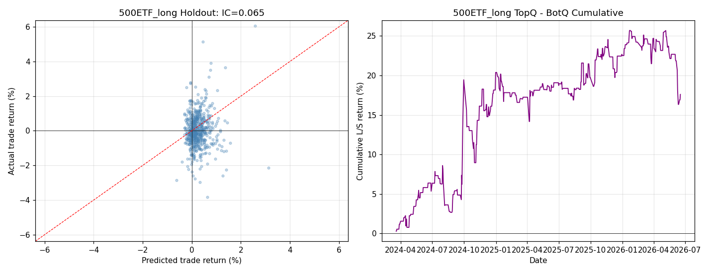


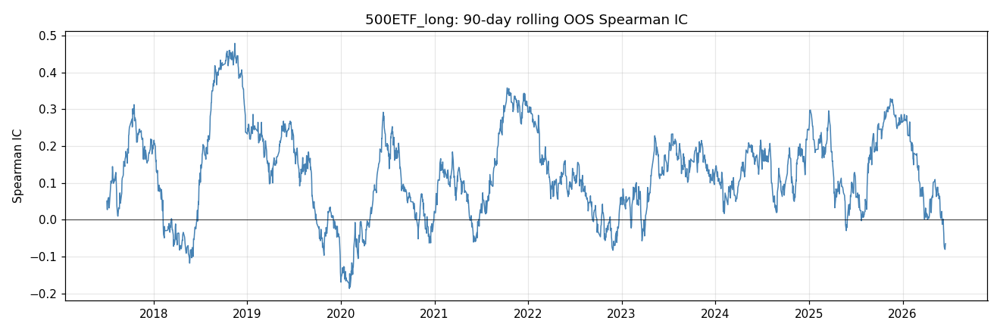


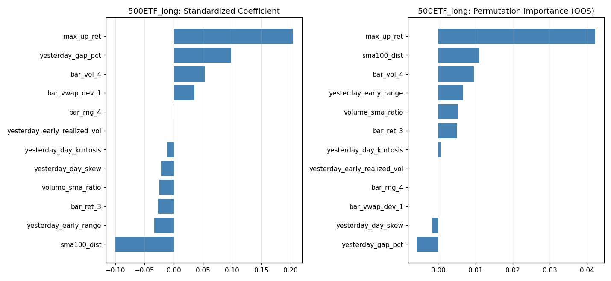


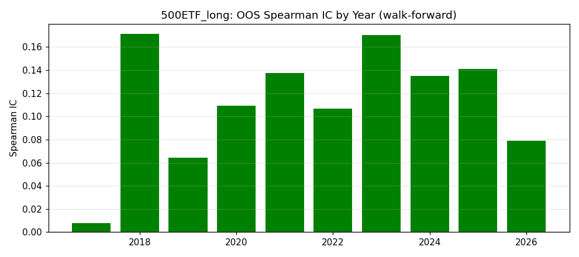


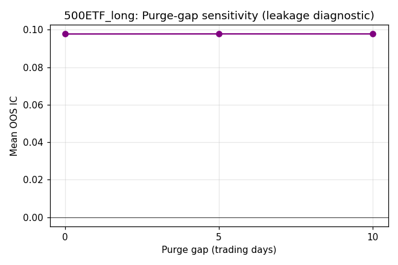


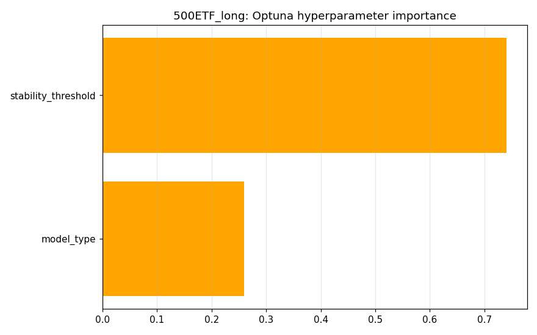


</details>

### 500ETF_short

- **Selected Model**: HUBER
- **Tuned Stability Threshold**: 0.60
- **Samples**: 2722 (2015-04-07 → 2026-06-17)
- **Holdout**: 544 days (2024-03-19 → 2026-06-17)
- **Target stats**: mean=0.0195%, std=1.1474%, Sharpe=0.27
- **Selected features (5)**: `gap_pct, bar_body_rng_0, bar_vwap_dev_2, bb_width, yesterday_early_vwap_dev`

#### Feature Stability Scores (Block Bootstrap)

<details>
<summary><b>Click to expand Feature Stability Scores (Block Bootstrap) Table</b></summary>

| Feature | Stability Score | Status | Pearson $r$ | Spearman $\rho$ | Monotonicity Score | Mutual Info | Quality Rating | Holdout IC | Yearly ICs | Yearly IC Std |
|---------|-----------------|--------|-------------|-----------------|--------------------|-------------|----------------|------------|------------|---------------|
| yesterday_early_vwap_dev | 72.8% | **Selected** | +0.1047 | +0.0822 | +0.90 | 0.0290 | *** Strong Monotonic | +0.0866 | 15:+0.10 16:+0.09 17:+0.04 18:+0.06 19:+0.03 20:+0.16 21:+0.04 22:+0.16 23:+0.05 24:+0.02 25:+0.04 26:+0.22 | 0.0619 |
| bb_width | 67.6% | **Selected** | -0.0362 | -0.0561 | -1.00 | 0.0631 | ** Non-Linear Monotonic | -0.0604 | 15:-0.01 16:-0.02 17:-0.06 18:-0.09 19:-0.03 20:+0.01 21:+0.06 22:-0.17 23:-0.13 24:-0.11 25:-0.03 26:-0.08 | 0.0619 |
| gap_pct | 64.8% | **Selected** | +0.0412 | +0.0358 | +0.60 | 0.0388 | ** Moderate Monotonic | +0.0767 | 15:+0.07 16:+0.04 17:+0.05 18:+0.00 19:+0.08 20:-0.00 21:-0.06 22:+0.02 23:+0.02 24:-0.01 25:+0.06 26:+0.17 | 0.0544 |
| bar_body_rng_0 | 64.8% | **Selected** | +0.1126 | +0.1110 | +1.00 | 0.0287 | *** Strong Monotonic | +0.1015 | 15:+0.25 16:+0.13 17:+0.12 18:+0.17 19:+0.09 20:+0.08 21:+0.11 22:+0.03 23:+0.07 24:+0.11 25:+0.14 26:-0.02 | 0.0650 |
| bar_vwap_dev_2 | 62.8% | **Selected** | +0.0781 | +0.0729 | +0.80 | 0.0387 | ** Moderate Monotonic | +0.0601 | 15:+0.10 16:+0.03 17:+0.06 18:+0.06 19:+0.06 20:+0.10 21:+0.08 22:+0.03 23:+0.08 24:+0.08 25:+0.06 26:+0.00 | 0.0278 |
| margin_short_ratio | 57.2% | Pruned | -0.0018 | +0.0092 | +0.60 | 0.0511 | ** Moderate Monotonic | +0.0041 | 15:-0.08 16:+0.02 17:+0.13 18:-0.07 19:-0.09 20:+0.05 21:+0.03 22:+0.08 23:+0.01 24:+0.07 25:-0.03 26:+0.04 | 0.0646 |
| yesterday_day_skew | 56.0% | Pruned | -0.0012 | +0.0036 | -0.20 | 0.0000 | * Non-Monotonic / Weak | +0.0245 | 15:+0.02 16:+0.01 17:-0.02 18:-0.01 19:-0.04 20:+0.03 21:-0.01 22:+0.09 23:+0.05 24:+0.03 25:-0.04 26:+0.07 | 0.0394 |
| bar_rng_1 | 53.6% | Pruned | -0.0233 | +0.0046 | +0.00 | 0.0363 | * Non-Monotonic / Weak | -0.0276 | 15:-0.13 16:-0.01 17:-0.02 18:-0.00 19:+0.02 20:+0.02 21:-0.05 22:+0.00 23:+0.17 24:+0.04 25:-0.08 26:-0.07 | 0.0718 |
| bar_vwap_dev_0 | 52.8% | Pruned | -0.0224 | -0.0317 | N/A | 0.0000 | N/A | N/A | N/A | N/A |
| yesterday_gap_pct | 51.6% | Pruned | +0.0383 | +0.0175 | +0.40 | 0.0000 | * Non-Monotonic / Weak | +0.0535 | 15:+0.09 16:-0.11 17:-0.04 18:-0.05 19:+0.02 20:+0.03 21:+0.07 22:-0.00 23:+0.01 24:+0.06 25:+0.04 26:-0.02 | 0.0545 |
| bar_rng_0 | 48.8% | Pruned | -0.0001 | +0.0520 | +0.90 | 0.0662 | ** Non-Linear Monotonic | +0.0479 | 15:-0.08 16:+0.10 17:+0.05 18:+0.08 19:-0.04 20:+0.07 21:+0.02 22:+0.04 23:+0.09 24:+0.08 25:+0.10 26:+0.04 | 0.0560 |
| num_up_bars | 48.4% | Pruned | +0.0918 | +0.0864 | +1.00 | 0.0156 | *** Strong Monotonic | +0.1152 | 15:+0.07 16:+0.12 17:+0.07 18:+0.07 19:+0.06 20:+0.06 21:+0.03 22:+0.09 23:+0.08 24:+0.17 25:+0.09 26:+0.04 | 0.0348 |
| yesterday_early_kurtosis | 48.0% | Pruned | -0.0028 | +0.0064 | -0.10 | 0.0000 | * Non-Monotonic / Weak | -0.0444 | 15:-0.06 16:+0.06 17:+0.04 18:+0.09 19:-0.03 20:+0.03 21:+0.05 22:+0.03 23:-0.05 24:-0.05 25:+0.02 26:-0.13 | 0.0601 |
| yesterday_early_momentum | 47.6% | Pruned | +0.0983 | +0.0853 | +1.00 | 0.0062 | *** Strong Monotonic | +0.0719 | 15:+0.11 16:+0.08 17:+0.05 18:+0.07 19:+0.04 20:+0.22 21:-0.00 22:+0.16 23:+0.05 24:+0.02 25:+0.03 26:+0.21 | 0.0710 |
| yesterday_day_realized_vol | 47.6% | Pruned | -0.0043 | +0.0366 | +0.90 | 0.0658 | ** Non-Linear Monotonic | -0.0039 | 15:-0.03 16:+0.04 17:+0.02 18:-0.04 19:+0.02 20:+0.00 21:+0.09 22:+0.06 23:+0.04 24:+0.11 25:-0.01 26:-0.10 | 0.0563 |
| cl_pos_in_range | 45.2% | Pruned | +0.0519 | +0.0567 | +0.70 | 0.0183 | ** Moderate Monotonic | +0.0860 | 15:+0.07 16:+0.06 17:+0.11 18:+0.01 19:+0.01 20:+0.04 21:+0.02 22:+0.03 23:+0.08 24:+0.13 25:+0.11 26:-0.09 | 0.0589 |
| yesterday_early_skew | 45.2% | Pruned | +0.0063 | +0.0063 | -0.20 | 0.0000 | * Non-Monotonic / Weak | +0.0051 | 15:+0.13 16:+0.01 17:-0.04 18:+0.00 19:+0.02 20:-0.05 21:-0.01 22:+0.05 23:-0.02 24:+0.02 25:+0.00 26:-0.04 | 0.0455 |
| max_down_ret | 43.6% | Pruned | +0.1199 | +0.0933 | +1.00 | 0.0371 | *** Strong Monotonic | +0.1319 | 15:+0.20 16:+0.09 17:+0.20 18:+0.10 19:+0.07 20:+0.13 21:+0.07 22:+0.04 23:+0.01 24:+0.13 25:+0.17 26:-0.00 | 0.0651 |
| macd_hist | 43.2% | Pruned | +0.0430 | +0.0232 | +0.30 | 0.0172 | * Non-Monotonic / Weak | +0.0423 | 15:+0.12 16:-0.02 17:-0.07 18:-0.01 19:+0.00 20:+0.02 21:-0.12 22:+0.04 23:-0.01 24:-0.07 25:+0.05 26:+0.09 | 0.0654 |
| bar_rng_2 | 42.4% | Pruned | -0.0040 | +0.0115 | +0.60 | 0.0200 | ** Moderate Monotonic | -0.0411 | 15:-0.01 16:+0.01 17:-0.11 18:+0.05 19:-0.01 20:-0.01 21:+0.02 22:+0.06 23:+0.05 24:+0.03 25:-0.08 26:-0.01 | 0.0481 |
| yesterday_day_kurtosis | 41.6% | Pruned | -0.0093 | -0.0422 | -0.90 | 0.0048 | ** Non-Linear Monotonic | -0.0507 | 15:-0.06 16:+0.01 17:-0.11 18:-0.16 19:-0.01 20:+0.10 21:-0.11 22:-0.04 23:-0.05 24:-0.04 25:-0.07 26:-0.04 | 0.0632 |
| body_to_range_ratio | 39.6% | Pruned | +0.0366 | +0.0520 | +0.70 | 0.0000 | ** Moderate Monotonic | +0.0656 | 15:+0.06 16:+0.11 17:+0.12 18:+0.16 19:-0.00 20:+0.06 21:+0.00 22:-0.00 23:-0.03 24:-0.03 25:+0.06 26:+0.16 | 0.0663 |
| northbound_net | 39.6% | Pruned | +0.0326 | +0.0303 | +0.60 | 0.0072 | ** Moderate Monotonic | -0.0371 | 15:-0.01 16:+0.10 17:-0.04 18:+0.05 19:+0.11 20:+0.06 21:-0.02 22:+0.02 23:+0.09 24:-0.01 26:+nan | nan |
| bar_body_rng_1 | 39.2% | Pruned | +0.0600 | +0.0575 | +0.90 | 0.0078 | *** Strong Monotonic | +0.0638 | 15:+0.06 16:+0.08 17:+0.17 18:+0.03 19:+0.02 20:+0.01 21:+0.11 22:+0.01 23:+0.10 24:+0.06 25:-0.01 26:+0.11 | 0.0506 |
| bar_rng_3 | 38.4% | Pruned | +0.0385 | +0.0346 | +0.70 | 0.0490 | ** Moderate Monotonic | -0.0003 | 15:+0.00 16:+0.06 17:+0.06 18:+0.10 19:-0.11 20:+0.09 21:+0.00 22:+0.09 23:+0.01 24:+0.06 25:+0.02 26:-0.13 | 0.0706 |
| bar_ret_0 | 38.0% | Pruned | +0.1463 | +0.1212 | +1.00 | 0.0322 | *** Strong Monotonic | +0.0934 | 15:+0.25 16:+0.14 17:+0.11 18:+0.22 19:+0.11 20:+0.08 21:+0.10 22:+0.04 23:+0.06 24:+0.12 25:+0.13 26:-0.03 | 0.0710 |
| first_bar_return | 37.2% | Pruned | +0.1460 | +0.1212 | +1.00 | 0.0323 | *** Strong Monotonic | +0.0934 | 15:+0.25 16:+0.14 17:+0.11 18:+0.22 19:+0.11 20:+0.08 21:+0.10 22:+0.04 23:+0.06 24:+0.12 25:+0.13 26:-0.03 | 0.0710 |
| bar_rng_4 | 36.8% | Pruned | +0.0421 | +0.0002 | +0.00 | 0.0526 | * Non-Monotonic / Weak | -0.0764 | 15:-0.04 16:+0.01 17:-0.05 18:+0.07 19:-0.02 20:+0.02 21:-0.03 22:+0.05 23:-0.01 24:+0.04 25:-0.10 26:-0.15 | 0.0597 |
| yesterday_first_bar_return | 35.6% | Pruned | -0.0144 | +0.0263 | +0.50 | 0.0083 | * Non-Monotonic / Weak | +0.0867 | 15:+0.02 16:+0.06 17:-0.01 18:-0.13 19:+0.07 20:-0.03 21:-0.07 22:+0.08 23:+0.12 24:+0.02 25:+0.10 26:+0.09 | 0.0723 |
| vol_ratio_10_60 | 35.2% | Pruned | +0.0425 | +0.0374 | +0.60 | 0.0000 | ** Moderate Monotonic | +0.0089 | 15:+0.02 16:+0.06 17:+0.07 18:+0.11 19:+0.08 20:+0.03 21:+0.07 22:-0.01 23:+0.04 24:-0.01 25:+0.04 26:-0.08 | 0.0484 |
| sma100_dist | 34.8% | Pruned | -0.0730 | -0.0389 | -0.90 | 0.0489 | *** Strong Monotonic | +0.0163 | 15:-0.19 16:-0.06 17:-0.09 18:-0.10 19:-0.03 20:-0.07 21:-0.16 22:-0.10 23:-0.12 24:-0.03 25:-0.02 26:+0.05 | 0.0627 |
| vol60 | 34.4% | Pruned | +0.0222 | +0.0204 | +0.40 | 0.0458 | * Non-Monotonic / Weak | -0.0016 | 15:+0.02 16:+0.01 17:+0.12 18:+0.06 19:-0.08 20:-0.09 21:+0.02 22:+0.19 23:+0.09 24:+0.08 25:-0.04 26:-0.02 | 0.0785 |
| bar_vwap_dev_1 | 34.0% | Pruned | +0.0854 | +0.0651 | +1.00 | 0.0325 | *** Strong Monotonic | +0.0648 | 15:+0.09 16:+0.11 17:+0.14 18:+0.01 19:+0.07 20:+0.02 21:+0.14 22:-0.02 23:+0.11 24:+0.07 25:-0.02 26:+0.08 | 0.0551 |
| vol5 | 33.6% | Pruned | +0.0309 | +0.0336 | +0.30 | 0.0372 | * Non-Monotonic / Weak | -0.0154 | 15:+0.01 16:+0.01 17:+0.12 18:+0.02 19:+0.01 20:-0.05 21:+0.10 22:+0.14 23:+0.04 24:-0.01 25:+0.01 26:-0.02 | 0.0564 |
| yesterday_day_pm_am_vol_ratio | 33.6% | Pruned | +0.0262 | +0.0221 | +0.60 | 0.0301 | ** Moderate Monotonic | -0.0446 | 15:-0.06 16:+0.08 17:+0.05 18:+0.17 19:+0.02 20:-0.03 21:+0.04 22:+0.01 23:+0.03 24:+0.05 25:-0.11 26:+0.01 | 0.0667 |
| roc10 | 33.2% | Pruned | -0.0115 | +0.0155 | -0.20 | 0.0411 | * Non-Monotonic / Weak | +0.0465 | 15:+0.03 16:-0.10 17:-0.10 18:-0.03 19:+0.03 20:+0.01 21:-0.17 22:+0.05 23:-0.00 24:-0.03 25:+0.03 26:+0.11 | 0.0740 |
| yesterday_pm_return | 32.0% | Pruned | -0.0125 | -0.0405 | -0.70 | 0.0069 | ** Moderate Monotonic | -0.0728 | 15:-0.02 16:-0.05 17:-0.04 18:-0.05 19:-0.08 20:-0.09 21:+0.01 22:-0.04 23:-0.03 24:-0.00 25:-0.07 26:-0.16 | 0.0419 |
| early_skew | 30.4% | Pruned | +0.0192 | +0.0202 | +0.90 | 0.0000 | *** Strong Monotonic | +0.0353 | 15:+0.03 16:+0.04 17:+0.07 18:+0.00 19:-0.03 20:+0.04 21:+0.01 22:+0.08 23:-0.06 24:+0.01 25:+0.03 26:+0.08 | 0.0402 |
| bar_ret_4 | 30.4% | Pruned | +0.0064 | +0.0079 | +0.90 | 0.0457 | *** Strong Monotonic | +0.0224 | 15:-0.07 16:+0.09 17:+0.04 18:-0.04 19:-0.03 20:+0.01 21:-0.05 22:+0.02 23:+0.07 24:+0.10 25:+0.04 26:-0.15 | 0.0709 |
| yesterday_day_vwap_dev | 27.2% | Pruned | -0.0341 | -0.0436 | -0.60 | 0.0316 | ** Moderate Monotonic | -0.0735 | 15:+0.04 16:-0.09 17:-0.03 18:-0.07 19:-0.06 20:-0.14 21:-0.03 22:-0.01 23:-0.06 24:-0.01 25:-0.09 26:-0.15 | 0.0539 |
| bar_vwap_dev_3 | 27.2% | Pruned | +0.0376 | +0.0472 | +0.70 | 0.0222 | ** Moderate Monotonic | +0.0404 | 15:+0.10 16:+0.03 17:+0.07 18:-0.00 19:-0.01 20:+0.05 21:+0.01 22:+0.11 23:+0.06 24:+0.02 25:+0.07 26:-0.03 | 0.0417 |
| yesterday_early_realized_vol | 26.8% | Pruned | +0.0155 | +0.0366 | +0.90 | 0.0611 | ** Non-Linear Monotonic | +0.0131 | 15:-0.01 16:+0.10 17:+0.06 18:-0.02 19:+0.04 20:+0.04 21:+0.05 22:-0.01 23:-0.05 24:+0.05 25:-0.01 26:+0.01 | 0.0401 |
| volume_sma_ratio | 26.8% | Pruned | +0.0146 | +0.0126 | +0.10 | 0.0000 | * Non-Monotonic / Weak | +0.0495 | 15:+0.04 16:-0.13 17:-0.03 18:+0.05 19:+0.08 20:+0.08 21:-0.07 22:-0.02 23:-0.00 24:+0.04 25:+0.02 26:+0.08 | 0.0641 |
| bar_vol_3 | 26.4% | Pruned | +0.0324 | +0.0118 | +0.60 | 0.0000 | ** Moderate Monotonic | +0.0254 | 15:+0.07 16:-0.02 17:-0.04 18:+0.08 19:-0.02 20:+0.10 21:-0.12 22:-0.03 23:-0.03 24:+0.01 25:-0.05 26:+0.11 | 0.0661 |
| aroon_osc | 26.0% | Pruned | -0.0001 | +0.0112 | -0.10 | 0.0000 | * Non-Monotonic / Weak | +0.0898 | 15:+0.03 16:-0.12 17:-0.09 18:-0.10 19:+0.00 20:+0.06 21:-0.12 22:-0.01 23:-0.01 24:-0.01 25:+0.08 26:+0.16 | 0.0823 |
| max_up_ret | 25.2% | Pruned | +0.1443 | +0.1276 | +0.90 | 0.0100 | *** Strong Monotonic | +0.1102 | 15:+0.28 16:+0.13 17:+0.16 18:+0.20 19:+0.03 20:+0.11 21:+0.13 22:+0.04 23:+0.11 24:+0.15 25:+0.12 26:-0.02 | 0.0750 |
| roc5 | 25.2% | Pruned | -0.0045 | -0.0076 | -0.40 | 0.0416 | * Non-Monotonic / Weak | +0.0235 | 15:+0.07 16:-0.09 17:-0.09 18:-0.01 19:-0.01 20:-0.00 21:-0.11 22:+0.01 23:-0.04 24:-0.08 25:-0.01 26:+0.03 | 0.0540 |
| bar_body_rng_2 | 24.8% | Pruned | +0.0324 | +0.0304 | +0.60 | 0.0088 | ** Moderate Monotonic | +0.0196 | 15:+0.03 16:-0.10 17:-0.01 18:+0.09 19:+0.01 20:+0.12 21:+0.02 22:+0.06 23:+0.01 24:+0.05 25:+0.04 26:-0.02 | 0.0538 |
| margin_net_buy | 24.8% | Pruned | -0.0137 | -0.0176 | -0.90 | 0.0000 | *** Strong Monotonic | +0.0165 | 15:-0.05 16:-0.07 17:-0.03 18:+0.01 19:+0.06 20:-0.04 21:-0.01 22:-0.16 23:-0.09 24:+0.04 25:+0.01 26:+0.00 | 0.0597 |
| margin_balance | 24.4% | Pruned | -0.0182 | -0.0504 | -0.20 | 0.0391 | * Non-Monotonic / Weak | -0.0382 | 15:-0.14 16:-0.04 17:+0.04 18:-0.03 19:-0.07 20:-0.03 21:-0.05 22:+0.00 23:-0.01 24:+0.09 25:-0.05 26:-0.01 | 0.0549 |
| capital_net_ratio | 24.4% | Pruned | +0.0040 | -0.0040 | -0.10 | 0.0067 | * Non-Monotonic / Weak | +0.0098 | 17:-0.07 18:+0.05 19:-0.01 20:-0.02 21:-0.04 22:-0.00 23:-0.16 24:+0.04 25:+0.00 26:+0.08 | 0.0643 |
| yesterday_day_late_mom | 24.0% | Pruned | +0.0062 | -0.0107 | -0.40 | 0.0151 | * Non-Monotonic / Weak | -0.0332 | 15:-0.03 16:+0.02 17:+0.06 18:+0.04 19:+0.00 20:-0.02 21:-0.03 22:+0.00 23:-0.09 24:+0.00 25:-0.02 26:-0.12 | 0.0477 |
| early_kurtosis | 24.0% | Pruned | +0.0021 | +0.0067 | +0.30 | 0.0157 | * Non-Monotonic / Weak | -0.0350 | 15:-0.01 16:+0.05 17:+0.05 18:+0.06 19:-0.02 20:-0.04 21:-0.02 22:+0.08 23:+0.02 24:-0.00 25:-0.09 26:+0.08 | 0.0493 |
| bar_body_rng_3 | 24.0% | Pruned | -0.0108 | -0.0069 | +0.10 | 0.0089 | * Non-Monotonic / Weak | +0.0181 | 15:+0.02 16:-0.01 17:-0.03 18:-0.08 19:-0.03 20:-0.02 21:-0.06 22:+0.09 23:-0.00 24:+0.01 25:+0.03 26:-0.05 | 0.0445 |
| mfi14 | 24.0% | Pruned | +0.0008 | +0.0144 | +0.30 | 0.0178 | * Non-Monotonic / Weak | +0.0470 | 15:+0.04 16:-0.09 17:-0.00 18:-0.08 19:+0.01 20:+0.08 21:-0.07 22:-0.01 23:-0.03 24:-0.05 25:+0.03 26:+0.14 | 0.0644 |
| vol_ratio_5_20 | 23.2% | Pruned | -0.0009 | -0.0068 | -0.30 | 0.0000 | * Non-Monotonic / Weak | -0.0417 | 15:-0.03 16:-0.06 17:+0.08 18:-0.04 19:+0.03 20:-0.02 21:+0.04 22:+0.07 23:+0.01 24:-0.13 25:+0.00 26:+0.01 | 0.0555 |
| yesterday_am_return | 23.2% | Pruned | +0.0471 | +0.0079 | +0.30 | 0.0077 | * Non-Monotonic / Weak | +0.0063 | 15:+0.05 16:+0.02 17:-0.06 18:-0.09 19:+0.07 20:+0.03 21:-0.10 22:+0.13 23:-0.03 24:-0.05 25:+0.02 26:-0.01 | 0.0661 |
| volume_slope | 22.4% | Pruned | -0.0107 | +0.0034 | -0.20 | 0.0000 | * Non-Monotonic / Weak | -0.0690 | 15:+0.01 16:+0.06 17:-0.01 18:+0.07 19:-0.02 20:-0.09 21:+0.15 22:+0.02 23:-0.02 24:-0.08 25:+0.02 26:-0.04 | 0.0637 |
| capital_net_value | 21.6% | Pruned | +0.0367 | -0.0065 | -0.20 | 0.0289 | * Non-Monotonic / Weak | +0.0076 | 15:+nan 16:+nan 17:+0.05 18:+0.04 19:-0.02 20:-0.02 21:-0.03 22:-0.00 23:-0.15 24:+0.02 25:+0.01 26:+0.02 | nan |
| bar_vol_4 | 20.8% | Pruned | +0.0488 | +0.0099 | +0.40 | 0.0000 | * Non-Monotonic / Weak | +0.0154 | 15:+0.03 16:-0.02 17:-0.06 18:+0.13 19:+0.00 20:+0.10 21:-0.09 22:-0.04 23:-0.02 24:-0.05 25:-0.03 26:+0.16 | 0.0759 |
| bb_pctb | 20.8% | Pruned | -0.0138 | -0.0141 | -0.40 | 0.0057 | * Non-Monotonic / Weak | -0.0595 | 15:-0.07 16:+0.09 17:+0.09 18:+0.01 19:-0.03 20:+0.01 21:+0.11 22:-0.06 23:+0.06 24:+0.03 25:-0.02 26:-0.13 | 0.0719 |
| rsi5 | 20.0% | Pruned | +0.0006 | +0.0017 | +0.30 | 0.0157 | * Non-Monotonic / Weak | +0.0355 | 15:+0.03 16:-0.11 17:-0.08 18:+0.02 19:+0.03 20:+0.00 21:-0.14 22:+0.04 23:-0.04 24:-0.04 25:-0.02 26:+0.10 | 0.0656 |
| cci14 | 20.0% | Pruned | +0.0257 | +0.0442 | +0.90 | 0.0555 | ** Non-Linear Monotonic | +0.0399 | 15:-0.08 16:-0.01 17:+0.02 18:+0.06 19:+0.08 20:+0.02 21:-0.12 22:+0.08 23:+0.13 24:+0.07 25:+0.00 26:+0.04 | 0.0663 |
| vol_gk20 | 19.6% | Pruned | +0.0314 | +0.0452 | +0.90 | 0.0640 | *** Strong Monotonic | +0.0065 | 15:-0.03 16:+0.06 17:+0.09 18:+0.10 19:-0.02 20:-0.08 21:+0.02 22:+0.19 23:+0.05 24:+0.13 25:+0.02 26:-0.13 | 0.0855 |
| yesterday_early_range | 19.2% | Pruned | +0.0143 | +0.0359 | +0.80 | 0.0411 | ** Moderate Monotonic | +0.0219 | 15:+0.00 16:+0.06 17:+0.05 18:-0.00 19:+0.04 20:+0.05 21:-0.04 22:-0.02 23:+0.05 24:+0.07 25:+0.04 26:-0.05 | 0.0406 |
| yesterday_day_range | 19.2% | Pruned | +0.0077 | +0.0333 | +0.80 | 0.0348 | ** Moderate Monotonic | +0.0061 | 15:-0.01 16:+0.06 17:+0.02 18:+0.02 19:+0.08 20:-0.06 21:+0.01 22:+0.03 23:+0.04 24:+0.05 25:-0.02 26:+0.01 | 0.0361 |
| yesterday_early_trend | 18.8% | Pruned | +0.0882 | +0.0790 | +1.00 | 0.0026 | *** Strong Monotonic | +0.0738 | 15:+0.09 16:+0.07 17:+0.07 18:+0.06 19:+0.04 20:+0.19 21:-0.00 22:+0.15 23:+0.03 24:+0.04 25:+0.04 26:+0.20 | 0.0617 |
| yesterday_day_close_pos | 18.0% | Pruned | -0.0307 | -0.0431 | -1.00 | 0.0000 | *** Strong Monotonic | -0.0620 | 15:+0.04 16:-0.08 17:-0.02 18:-0.02 19:-0.06 20:-0.13 21:-0.05 22:-0.04 23:-0.08 24:+0.02 25:-0.09 26:-0.13 | 0.0500 |
| bar_ret_1 | 18.0% | Pruned | +0.0768 | +0.0621 | +1.00 | 0.0078 | *** Strong Monotonic | +0.0661 | 15:+0.08 16:+0.10 17:+0.13 18:+0.01 19:+0.06 20:+0.02 21:+0.13 22:-0.02 23:+0.11 24:+0.08 25:-0.02 26:+0.08 | 0.0525 |
| vol_gk10 | 17.2% | Pruned | +0.0398 | +0.0508 | +0.70 | 0.0865 | ** Moderate Monotonic | -0.0007 | 15:-0.00 16:+0.09 17:+0.09 18:+0.11 19:+0.02 20:-0.06 21:+0.04 22:+0.17 23:+0.05 24:+0.11 25:+0.01 26:-0.09 | 0.0716 |
| volume_sma_ratio_long | 17.2% | Pruned | +0.0133 | +0.0177 | +0.60 | 0.0000 | ** Moderate Monotonic | +0.0401 | 15:+0.00 16:-0.05 17:-0.05 18:+0.00 19:+0.04 20:+0.06 21:-0.03 22:+0.03 23:-0.08 24:+0.07 25:+0.03 26:+0.06 | 0.0480 |
| bar_vol_1 | 16.8% | Pruned | +0.0139 | +0.0008 | +0.00 | 0.0000 | * Non-Monotonic / Weak | +0.0074 | 15:-0.04 16:-0.00 17:-0.06 18:+0.02 19:+0.04 20:+0.13 21:-0.16 22:-0.08 23:+0.03 24:+0.01 25:-0.09 26:+0.04 | 0.0735 |
| roc20 | 16.4% | Pruned | -0.0053 | +0.0121 | +0.30 | 0.0374 | * Non-Monotonic / Weak | +0.0440 | 15:+0.05 16:-0.11 17:-0.05 18:-0.02 19:-0.01 20:+0.01 21:-0.13 22:-0.02 23:-0.06 24:-0.04 25:-0.00 26:+0.14 | 0.0684 |
| sma200_dist | 16.0% | Pruned | -0.0388 | -0.0159 | -0.70 | 0.0196 | ** Moderate Monotonic | +0.0350 | 15:-0.02 16:-0.07 17:-0.11 18:-0.08 19:-0.13 20:-0.10 21:-0.16 22:-0.16 23:-0.10 24:-0.03 25:-0.03 26:+0.05 | 0.0582 |
| early_realized_vol | 15.6% | Pruned | +0.0073 | +0.0414 | +0.50 | 0.0740 | * Non-Monotonic / Weak | +0.0084 | 15:-0.10 16:+0.09 17:-0.00 18:+0.09 19:-0.05 20:+0.10 21:-0.00 22:+0.07 23:+0.05 24:+0.05 25:+0.03 26:-0.06 | 0.0622 |
| first_bar_volume | 15.6% | Pruned | +0.0259 | +0.0048 | +0.70 | 0.0000 | ** Moderate Monotonic | +0.0706 | 15:+0.00 16:-0.06 17:-0.03 18:+0.01 19:+0.01 20:+0.11 21:-0.14 22:-0.01 23:+0.01 24:+0.07 25:-0.01 26:+0.06 | 0.0633 |
| bar_vol_0 | 15.6% | Pruned | +0.0259 | +0.0048 | +0.70 | 0.0000 | ** Moderate Monotonic | +0.0706 | 15:+0.00 16:-0.06 17:-0.03 18:+0.01 19:+0.01 20:+0.11 21:-0.14 22:-0.01 23:+0.01 24:+0.07 25:-0.01 26:+0.06 | 0.0633 |
| short_repayment_quantity | 15.2% | Pruned | -0.0004 | -0.0225 | -0.30 | 0.0154 | * Non-Monotonic / Weak | -0.0007 | 15:+0.01 16:-0.03 17:-0.08 18:-0.00 19:-0.02 20:-0.01 21:+0.05 22:+0.09 23:+0.05 24:-0.04 25:-0.00 26:+0.10 | 0.0527 |
| yesterday_first_bar_volume | 15.2% | Pruned | +0.0148 | -0.0059 | +0.30 | 0.0000 | * Non-Monotonic / Weak | +0.0748 | 15:+0.02 16:-0.14 17:-0.10 18:+0.03 19:+0.03 20:+0.06 21:-0.16 22:-0.05 23:-0.03 24:+0.02 25:+0.06 26:+0.12 | 0.0809 |
| margin_repayment | 14.8% | Pruned | +0.0111 | -0.0093 | +0.90 | 0.0017 | *** Strong Monotonic | +0.0445 | 15:+0.07 16:+0.01 17:+0.13 18:-0.01 19:-0.06 20:-0.06 21:+0.01 22:+0.07 23:-0.02 24:+0.01 25:+0.05 26:+0.13 | 0.0606 |
| short_sell_quantity | 14.8% | Pruned | +0.0145 | -0.0233 | -0.60 | 0.0254 | ** Moderate Monotonic | -0.0724 | 15:-0.02 16:+0.03 17:+0.02 18:-0.07 19:+0.05 20:-0.00 21:-0.01 22:+0.11 23:+0.14 24:+0.05 25:-0.09 26:-0.16 | 0.0803 |
| bar_body_rng_4 | 14.4% | Pruned | +0.0089 | +0.0091 | +0.30 | 0.0000 | * Non-Monotonic / Weak | +0.0258 | 15:-0.06 16:+0.07 17:+0.04 18:-0.05 19:-0.03 20:+0.01 21:-0.04 22:+0.02 23:+0.08 24:+0.07 25:+0.03 26:-0.11 | 0.0576 |
| first_30min_return | 13.6% | Pruned | +0.1339 | +0.0989 | +0.70 | 0.0107 | ** Moderate Monotonic | +0.1142 | 15:+0.18 16:+0.06 17:+0.18 18:+0.12 19:+0.05 20:+0.09 21:+0.09 22:+0.04 23:+0.09 24:+0.14 25:+0.16 26:-0.07 | 0.0678 |
| capital_buy_volume | 13.6% | Pruned | +0.0488 | +0.0325 | +0.80 | 0.0339 | ** Moderate Monotonic | +0.0085 | 15:+nan 16:+nan 17:+0.08 18:+0.03 19:+0.05 20:+0.05 21:+0.06 22:-0.00 23:+0.05 24:+0.09 25:-0.03 26:+0.08 | nan |
| bar_ret_3 | 13.2% | Pruned | -0.0288 | -0.0122 | -0.50 | 0.0143 | * Non-Monotonic / Weak | +0.0030 | 15:+0.00 16:+0.00 17:+0.01 18:-0.11 19:-0.04 20:-0.05 21:-0.08 22:+0.11 23:+0.01 24:-0.02 25:+0.03 26:-0.07 | 0.0552 |
| rsi21 | 13.2% | Pruned | -0.0110 | -0.0012 | -0.10 | 0.0182 | * Non-Monotonic / Weak | +0.0530 | 15:+0.00 16:-0.09 17:-0.08 18:-0.06 19:-0.01 20:-0.02 21:-0.14 22:-0.00 23:-0.10 24:+0.00 25:+0.01 26:+0.11 | 0.0629 |
| northbound_buy | 12.8% | Pruned | -0.0101 | -0.0260 | -0.20 | 0.0399 | * Non-Monotonic / Weak | -0.0767 | 15:+0.01 16:+0.04 17:-0.04 18:+0.05 19:+0.06 20:-0.01 21:-0.08 22:-0.08 23:+0.04 24:+0.03 25:+nan 26:+nan | nan |
| iv_vol_ratio | 12.4% | Pruned | -0.0383 | -0.0324 | -0.90 | 0.0554 | *** Strong Monotonic | -0.0082 | 15:-0.04 16:-0.04 17:-0.12 18:-0.11 19:+0.04 20:+0.03 21:-0.04 22:-0.15 23:-0.07 24:-0.04 25:-0.04 26:+0.12 | 0.0696 |
| total_path_length | 12.4% | Pruned | +0.0156 | +0.0474 | +1.00 | 0.0795 | ** Non-Linear Monotonic | +0.0154 | 15:-0.08 16:+0.08 17:+0.02 18:+0.13 19:-0.03 20:+0.10 21:-0.00 22:+0.04 23:+0.07 24:+0.03 25:+0.04 26:-0.08 | 0.0639 |
| short_balance_quantity | 12.0% | Pruned | -0.0083 | -0.0239 | -0.60 | 0.0573 | ** Moderate Monotonic | -0.0469 | 15:+0.04 16:-0.00 17:-0.09 18:+0.01 19:+0.08 20:-0.04 21:-0.13 22:-0.01 23:+0.00 24:-0.01 25:+0.02 26:-0.14 | 0.0642 |
| northbound_sell | 11.6% | Pruned | -0.0159 | -0.0280 | -0.70 | 0.0187 | ** Moderate Monotonic | -0.0737 | 15:-0.02 16:-0.05 17:+0.00 18:-0.02 19:-0.01 20:-0.02 21:-0.05 22:-0.09 23:+0.02 24:+0.04 25:+nan 26:+nan | nan |
| stoch_d | 10.4% | Pruned | -0.0107 | -0.0007 | -0.60 | 0.0069 | ** Moderate Monotonic | +0.0717 | 15:+0.04 16:-0.08 17:-0.08 18:-0.04 19:-0.03 20:+0.01 21:-0.17 22:+0.01 23:-0.08 24:-0.02 25:+0.04 26:+0.15 | 0.0778 |
| roc60 | 10.0% | Pruned | -0.0246 | -0.0163 | -1.00 | 0.0350 | *** Strong Monotonic | +0.0148 | 15:-0.03 16:-0.08 17:-0.07 18:-0.09 19:-0.01 20:-0.03 21:-0.09 22:-0.10 23:-0.04 24:-0.01 25:+0.01 26:-0.07 | 0.0341 |
| buy_on_margin_value | 9.6% | Pruned | +0.0018 | -0.0246 | +0.10 | 0.0065 | * Non-Monotonic / Weak | +0.0410 | 15:-0.01 16:-0.03 17:+0.04 18:-0.04 19:-0.03 20:-0.06 21:+0.03 22:-0.08 23:-0.04 24:+0.04 25:+0.04 26:+0.15 | 0.0598 |
| bar_vol_2 | 9.2% | Pruned | +0.0121 | +0.0051 | +0.10 | 0.0002 | * Non-Monotonic / Weak | +0.0458 | 15:-0.01 16:-0.05 17:-0.02 18:+0.06 19:+0.02 20:+0.08 21:-0.17 22:-0.05 23:+0.04 24:+0.01 25:-0.01 26:+0.07 | 0.0661 |
| yesterday_first_30min_return | 9.2% | Pruned | +0.0702 | +0.0829 | +0.80 | 0.0220 | ** Moderate Monotonic | +0.1015 | 15:+0.11 16:+0.11 17:+0.04 18:-0.01 19:+0.08 20:+0.12 21:-0.05 22:+0.18 23:+0.13 24:+0.03 25:+0.10 26:+0.18 | 0.0684 |
| vix_vol_ratio | 8.8% | Pruned | -0.0414 | -0.0365 | -0.70 | 0.0658 | ** Moderate Monotonic | -0.0174 | 15:-0.04 16:-0.04 17:-0.12 18:-0.11 19:+0.04 20:+0.03 21:-0.04 22:-0.17 23:-0.07 24:-0.08 25:-0.07 26:+0.06 | 0.0651 |
| bar_ret_2 | 8.4% | Pruned | +0.0324 | +0.0429 | +0.80 | 0.0183 | ** Moderate Monotonic | +0.0361 | 15:+0.07 16:-0.09 17:-0.00 18:+0.09 19:+0.03 20:+0.13 21:+0.01 22:+0.03 23:+0.03 24:+0.05 25:+0.06 26:+0.00 | 0.0521 |
| willr14 | 8.4% | Pruned | -0.0003 | +0.0014 | -0.30 | 0.0231 | * Non-Monotonic / Weak | +0.0338 | 15:+0.03 16:-0.11 17:-0.09 18:+0.00 19:+0.02 20:-0.00 21:-0.13 22:+0.05 23:-0.05 24:-0.03 25:-0.01 26:+0.06 | 0.0584 |
| early_range | 7.6% | Pruned | +0.0058 | +0.0597 | +1.00 | 0.0848 | ** Non-Linear Monotonic | +0.0081 | 15:-0.00 16:+0.11 17:+0.05 18:+0.15 19:-0.05 20:+0.11 21:+0.04 22:+0.04 23:+0.14 24:+0.01 25:+0.01 26:+0.04 | 0.0589 |
| early_vwap_dev | 7.6% | Pruned | +0.0361 | +0.0270 | +0.40 | 0.0235 | * Non-Monotonic / Weak | +0.0399 | 15:+0.01 16:+0.03 17:+0.08 18:-0.06 19:-0.03 20:+0.06 21:-0.04 22:+0.05 23:+0.10 24:+0.05 25:+0.10 26:-0.13 | 0.0661 |
| short_balance | 7.6% | Pruned | -0.0119 | -0.0260 | -0.70 | 0.0599 | ** Moderate Monotonic | -0.0378 | 15:-0.01 16:-0.02 17:-0.11 18:-0.00 19:+0.05 20:-0.05 21:-0.16 22:-0.12 23:-0.02 24:-0.04 25:+0.03 26:-0.16 | 0.0660 |
| bar_vwap_dev_4 | 7.2% | Pruned | +0.0361 | +0.0270 | +0.40 | 0.0235 | * Non-Monotonic / Weak | +0.0399 | 15:+0.01 16:+0.03 17:+0.08 18:-0.06 19:-0.03 20:+0.06 21:-0.04 22:+0.05 23:+0.10 24:+0.05 25:+0.10 26:-0.13 | 0.0661 |
| yesterday_early_volume_ratio | 6.8% | Pruned | +0.0112 | -0.0009 | +0.00 | 0.0000 | * Non-Monotonic / Weak | +0.0724 | 15:+0.06 16:-0.16 17:-0.09 18:+0.02 19:+0.05 20:+0.08 21:-0.12 22:-0.05 23:-0.06 24:+0.02 25:+0.09 26:+0.07 | 0.0803 |
| vol10 | 6.8% | Pruned | +0.0445 | +0.0479 | +0.70 | 0.0832 | ** Moderate Monotonic | -0.0039 | 15:+0.01 16:+0.03 17:+0.11 18:+0.10 19:+0.01 20:-0.02 21:+0.08 22:+0.12 23:+0.06 24:+0.10 25:-0.00 26:-0.09 | 0.0601 |
| total_balance | 6.8% | Pruned | -0.0134 | -0.0290 | -0.50 | 0.0526 | * Non-Monotonic / Weak | -0.0480 | 15:-0.14 16:-0.01 17:-0.09 18:-0.01 19:-0.06 20:-0.05 21:-0.16 22:-0.12 23:-0.02 24:-0.02 25:+0.03 26:-0.10 | 0.0575 |
| vol_pk20 | 6.0% | Pruned | +0.0355 | +0.0467 | +0.90 | 0.0505 | *** Strong Monotonic | +0.0051 | 15:-0.02 16:+0.06 17:+0.11 18:+0.11 19:-0.02 20:-0.08 21:+0.03 22:+0.19 23:+0.05 24:+0.13 25:+0.02 26:-0.13 | 0.0887 |
| sma50_dist | 5.2% | Pruned | -0.0226 | -0.0047 | -0.10 | 0.0517 | * Non-Monotonic / Weak | +0.0460 | 15:-0.02 16:-0.08 17:-0.07 18:-0.10 19:-0.00 20:-0.00 21:-0.14 22:-0.03 23:-0.12 24:+0.01 25:-0.00 26:+0.09 | 0.0614 |
| sma10_dist | 4.8% | Pruned | -0.0020 | +0.0026 | -0.40 | 0.0412 | * Non-Monotonic / Weak | +0.0258 | 15:+0.06 16:-0.08 17:-0.07 18:+0.01 19:-0.01 20:-0.02 21:-0.12 22:+0.03 23:-0.04 24:-0.06 25:-0.01 26:+0.06 | 0.0529 |
| capital_sell_value | 4.4% | Pruned | +0.0182 | +0.0368 | +0.70 | 0.0091 | ** Moderate Monotonic | +0.0167 | 15:+nan 16:+nan 17:+0.09 18:+0.00 19:+0.04 20:+0.02 21:+0.09 22:-0.01 23:+0.12 24:+0.06 25:+0.01 26:+0.03 | nan |
| atr14_norm | 4.0% | Pruned | +0.0317 | +0.0411 | +0.90 | 0.0768 | *** Strong Monotonic | -0.0038 | 15:-0.00 16:+0.04 17:+0.09 18:+0.12 19:-0.02 20:-0.06 21:+0.05 22:+0.20 23:+0.10 24:+0.14 25:-0.00 26:-0.11 | 0.0857 |
| capital_buy_value | 4.0% | Pruned | +0.0342 | +0.0269 | +0.40 | 0.0179 | * Non-Monotonic / Weak | +0.0171 | 15:+nan 16:+nan 17:+0.08 18:+0.03 19:+0.04 20:+0.02 21:+0.04 22:-0.02 23:+0.03 24:+0.08 25:-0.02 26:+0.08 | nan |
| capital_sell_volume | 3.6% | Pruned | +0.0304 | +0.0363 | +1.00 | 0.0164 | *** Strong Monotonic | +0.0089 | 17:+0.09 18:+0.01 19:+0.05 20:+0.04 21:+0.10 22:+0.01 23:+0.13 24:+0.07 25:+0.00 26:+0.03 | 0.0411 |
| stoch_k | 3.6% | Pruned | -0.0080 | -0.0018 | -0.20 | 0.0210 | * Non-Monotonic / Weak | +0.0578 | 15:+0.01 16:-0.10 17:-0.08 18:-0.02 19:+0.00 20:+0.02 21:-0.16 22:+0.03 23:-0.08 24:-0.04 25:+0.02 26:+0.13 | 0.0719 |
| sma20_dist | 2.4% | Pruned | -0.0026 | +0.0124 | +0.30 | 0.0505 | * Non-Monotonic / Weak | +0.0501 | 15:+0.05 16:-0.11 17:-0.08 18:-0.03 19:+0.01 20:-0.02 21:-0.12 22:+0.03 23:-0.07 24:-0.05 25:+0.01 26:+0.11 | 0.0652 |
| early_trend | 2.0% | Pruned | +0.0473 | +0.0468 | +0.90 | 0.0625 | *** Strong Monotonic | +0.0555 | 15:+0.06 16:+0.02 17:+0.08 18:-0.02 19:+0.00 20:+0.05 21:+0.01 22:+0.07 23:+0.10 24:+0.06 25:+0.10 26:-0.08 | 0.0523 |
| early_momentum | 1.6% | Pruned | +0.0586 | +0.0506 | +0.90 | 0.0569 | *** Strong Monotonic | +0.0658 | 15:+0.06 16:+0.04 17:+0.13 18:-0.02 19:+0.01 20:+0.05 21:+0.02 22:+0.06 23:+0.12 24:+0.08 25:+0.09 26:-0.08 | 0.0559 |
| vol20 | 1.2% | Pruned | +0.0478 | +0.0456 | +0.70 | 0.0619 | ** Moderate Monotonic | +0.0288 | 15:+0.04 16:+0.04 17:+0.12 18:+0.11 19:-0.04 20:-0.03 21:+0.04 22:+0.17 23:+0.08 24:+0.12 25:+0.03 26:-0.06 | 0.0667 |
| ema12_dist | 1.2% | Pruned | -0.0047 | +0.0066 | +0.00 | 0.0270 | * Non-Monotonic / Weak | +0.0396 | 15:+0.05 16:-0.10 17:-0.07 18:-0.01 19:+0.01 20:-0.01 21:-0.11 22:+0.03 23:-0.05 24:-0.05 25:-0.01 26:+0.10 | 0.0582 |
| bar_ret_5 | 0.0% | Pruned | N/A | N/A | N/A | 0.0000 | N/A | N/A | N/A | N/A |
| bar_vol_5 | 0.0% | Pruned | N/A | N/A | N/A | 0.0000 | N/A | N/A | N/A | N/A |
| bar_rng_5 | 0.0% | Pruned | N/A | N/A | N/A | 0.0000 | N/A | N/A | N/A | N/A |
| bar_body_rng_5 | 0.0% | Pruned | N/A | N/A | N/A | 0.0000 | N/A | N/A | N/A | N/A |
| bar_vwap_dev_5 | 0.0% | Pruned | N/A | N/A | N/A | 0.0000 | N/A | N/A | N/A | N/A |
| iv | 0.0% | Pruned | +0.0228 | +0.0463 | +1.00 | 0.0100 | ** Non-Linear Monotonic | +0.0351 | 22:+0.09 23:+0.01 24:+0.15 25:+0.02 26:+0.03 | 0.0535 |
| vix | 0.0% | Pruned | +0.0243 | +0.0271 | +1.00 | 0.0132 | *** Strong Monotonic | +0.0196 | 22:+0.02 23:+0.02 24:+0.15 25:-0.04 26:-0.09 | 0.0815 |
| vix_iv_spread | 0.0% | Pruned | +0.0021 | +0.0078 | N/A | 0.0000 | N/A | -0.0108 | 22:-0.06 23:+0.01 24:+0.01 25:-0.09 26:-0.16 | 0.0663 |
| vix_iv_ratio | 0.0% | Pruned | -0.0125 | -0.0152 | N/A | 0.0003 | N/A | -0.0193 | 22:-0.07 23:+0.00 24:-0.08 25:-0.06 26:-0.14 | 0.0456 |
| iv_diff_1d | 0.0% | Pruned | +0.0245 | +0.0259 | N/A | 0.0000 | N/A | +0.0766 | 22:+0.04 23:+0.09 24:+0.04 25:+0.05 26:+0.17 | 0.0503 |
| vix_diff_1d | 0.0% | Pruned | +0.0403 | +0.0179 | N/A | 0.0000 | N/A | +0.0445 | 22:-0.03 23:+0.06 24:+0.11 25:-0.03 26:+0.04 | 0.0515 |

- **Pearson $r$**: Linear correlation coefficient.
- **Spearman $\rho$**: Rank correlation coefficient (overall monotonic relation).
- **Monotonicity Score**: Spearman rank correlation of target means across 5 feature quintiles. $\pm 1.0$ indicates perfect bin-wise monotonicity.
- **Mutual Info**: Estimated information gain (captures non-linear dependencies).
- **Quality Rating**: Categorized by strength and shape of the monotonic relationship.
- **Holdout IC**: Spearman rank correlation on the holdout set (out-of-sample predictive power).
- **Yearly ICs**: Spearman rank correlation calculated per year.
- **Yearly IC Std**: Standard deviation of yearly ICs (measures temporal stability).

</details>

#### Metrics

| Metric | Best Linear | Ridge Base | Zero | Yesterday PM | First 30min Mom |
|--------|-------------|------------|------|--------------|-----------------|
| IC | +0.1810 | +0.1260 | +0.0000 | -0.0748 | +0.1142 |
| Dir Acc | 0.574 | 0.540 | 0.500 | 0.460 | 0.551 |
| RMSE | 1.0393% | 1.0703% | 1.0131% | 1.4746% | 1.1190% |
| L/S Sharpe | +2.99 | +2.77 | — | — | — |

#### Best Hyperparameters

<details>
<summary><b>Click to expand Best Hyperparameters JSON</b></summary>

```json
{
  "model_type": "huber",
  "stability_threshold": 0.6000000000000001,
  "huber_alpha": 0.00828375793104948,
  "huber_epsilon": 1.9490621019437229
}
```

</details>

#### Walk-Forward Fold ICs

| Fold | IS IC | OOS IC |
|------|-------|--------|
| 1 | 0.1336 | +0.1625 |
| 2 | 0.1164 | +0.1343 |
| 3 | 0.1187 | +0.1071 |
| 4 | 0.1082 | +0.0341 |
| 5 | 0.0953 | +0.1662 |
| **Overall** | — | +0.1224 |

#### Year-by-Year OOS IC

| Year | IC | Dir Acc | N | L/S Sharpe |
|------|-----|---------|---|-----------|
| 2017 | +0.1346 | 0.535 | 215 | +2.16 |
| 2018 | +0.1726 | 0.551 | 243 | +4.43 |
| 2019 | +0.0957 | 0.529 | 244 | +3.10 |
| 2020 | +0.1861 | 0.539 | 243 | +2.79 |
| 2021 | +0.1305 | 0.543 | 243 | +2.22 |
| 2022 | +0.0441 | 0.471 | 242 | +0.16 |
| 2023 | +0.0407 | 0.517 | 242 | -0.63 |
| 2024 | +0.0618 | 0.558 | 242 | +1.30 |
| 2025 | +0.1439 | 0.564 | 243 | +2.35 |
| 2026 | +0.2454 | 0.565 | 108 | +5.64 |

#### Diagnostic Plots

<details>
<summary><b>Click to expand Diagnostic Plots</b></summary>

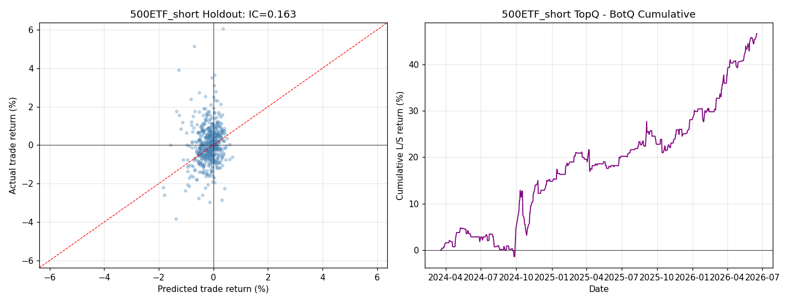


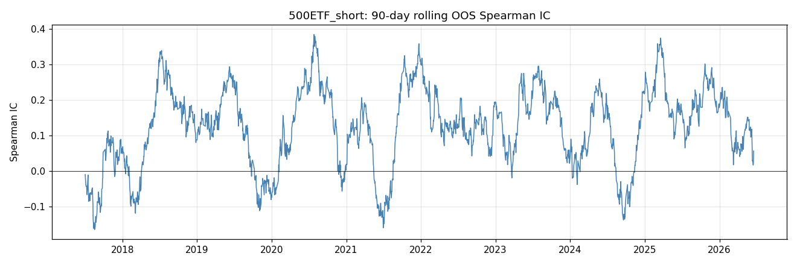


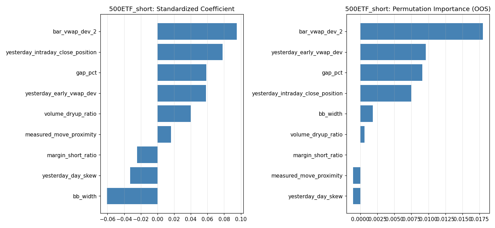


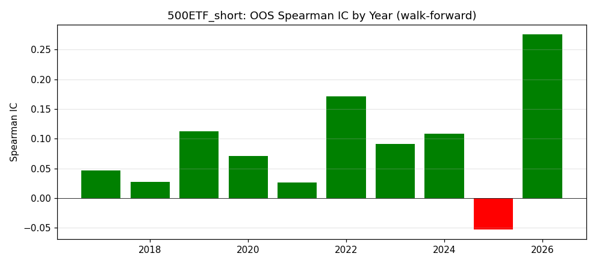


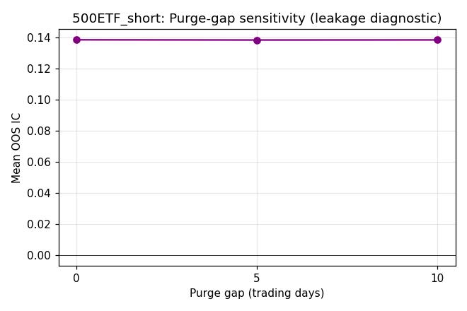


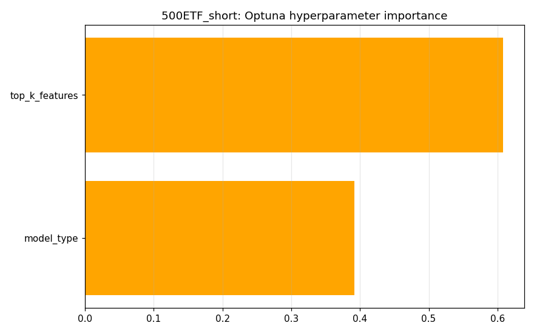


</details>

### 588000ETF_long

- **Selected Model**: HUBER
- **Tuned Stability Threshold**: 0.55
- **Samples**: 1294 (2021-02-09 → 2026-06-17)
- **Holdout**: 258 days (2025-05-27 → 2026-06-17)
- **Target stats**: mean=-0.0044%, std=1.3690%, Sharpe=-0.05
- **Selected features (3)**: `yesterday_day_realized_vol, vol5, roc5`

#### Feature Stability Scores (Block Bootstrap)

<details>
<summary><b>Click to expand Feature Stability Scores (Block Bootstrap) Table</b></summary>

| Feature | Stability Score | Status | Pearson $r$ | Spearman $\rho$ | Monotonicity Score | Mutual Info | Quality Rating | Holdout IC | Yearly ICs | Yearly IC Std |
|---------|-----------------|--------|-------------|-----------------|--------------------|-------------|----------------|------------|------------|---------------|
| yesterday_day_realized_vol | 63.6% | **Selected** | +0.0612 | +0.0458 | +0.90 | 0.0380 | *** Strong Monotonic | -0.0176 | 21:+0.01 22:+0.19 23:-0.06 24:+0.08 25:+0.02 26:+0.03 | 0.0766 |
| vol5 | 39.2% | **Selected** | +0.0566 | +0.0443 | +0.70 | 0.0240 | ** Moderate Monotonic | -0.0448 | 21:+0.01 22:+0.18 23:+0.11 24:-0.01 25:+0.01 26:-0.02 | 0.0721 |
| roc5 | 37.6% | **Selected** | -0.0147 | -0.0026 | +0.00 | 0.0000 | * Non-Monotonic / Weak | -0.0143 | 21:-0.06 22:+0.05 23:+0.02 24:-0.08 25:-0.02 26:+0.05 | 0.0509 |
| body_to_range_ratio | 37.2% | Pruned | -0.0050 | +0.0154 | -0.30 | 0.0000 | * Non-Monotonic / Weak | -0.0199 | 21:+0.13 22:+0.03 23:-0.02 24:-0.01 25:-0.06 26:-0.02 | 0.0624 |
| yesterday_day_kurtosis | 33.2% | Pruned | -0.0229 | -0.0634 | -0.60 | 0.0069 | ** Moderate Monotonic | -0.0356 | 21:-0.11 22:-0.04 23:-0.06 24:-0.08 25:-0.05 26:-0.02 | 0.0309 |
| bar_ret_2 | 32.4% | Pruned | +0.0033 | +0.0054 | +0.40 | 0.0000 | * Non-Monotonic / Weak | -0.0651 | 21:+0.01 22:-0.02 23:+0.12 24:-0.01 25:-0.01 26:-0.08 | 0.0577 |
| cl_pos_in_range | 29.2% | Pruned | +0.0778 | +0.0806 | +0.70 | 0.0123 | ** Moderate Monotonic | +0.0297 | 21:+0.19 22:+0.03 23:+0.17 24:+0.04 25:+0.04 26:+0.00 | 0.0715 |
| yesterday_early_skew | 28.4% | Pruned | -0.0420 | -0.0281 | -0.60 | 0.0000 | ** Moderate Monotonic | +0.0190 | 21:-0.10 22:-0.03 23:-0.07 24:+0.05 25:+0.03 26:-0.10 | 0.0603 |
| bb_width | 26.4% | Pruned | -0.0634 | -0.0367 | -0.90 | 0.0166 | *** Strong Monotonic | +0.0096 | 21:+0.04 22:-0.12 23:-0.04 24:-0.08 25:-0.02 26:-0.06 | 0.0504 |
| sma200_dist | 25.2% | Pruned | -0.0257 | -0.0033 | -0.30 | 0.0286 | * Non-Monotonic / Weak | -0.0808 | 21:-0.06 22:-0.14 23:-0.08 24:-0.08 25:-0.12 26:-0.02 | 0.0409 |
| sma100_dist | 24.8% | Pruned | -0.0296 | -0.0191 | -0.10 | 0.0556 | * Non-Monotonic / Weak | -0.0392 | 21:-0.03 22:-0.08 23:-0.05 24:-0.08 25:-0.06 26:+0.00 | 0.0286 |
| vol_ratio_5_20 | 24.0% | Pruned | +0.0433 | +0.0292 | +0.70 | 0.0033 | ** Moderate Monotonic | -0.0524 | 21:+0.05 22:+0.05 23:+0.12 24:-0.05 25:+0.04 26:-0.04 | 0.0568 |
| early_range | 24.0% | Pruned | +0.0699 | +0.0144 | +0.50 | 0.0159 | * Non-Monotonic / Weak | +0.0320 | 21:-0.06 22:+0.15 23:-0.07 24:+0.01 25:-0.05 26:+0.07 | 0.0793 |
| yesterday_early_range | 22.8% | Pruned | +0.0117 | +0.0197 | +0.50 | 0.0521 | * Non-Monotonic / Weak | -0.0134 | 21:-0.06 22:+0.11 23:-0.01 24:+0.01 25:+0.04 26:+0.04 | 0.0514 |
| bar_vwap_dev_0 | 22.4% | Pruned | -0.0108 | -0.0175 | N/A | 0.0024 | N/A | N/A | N/A | N/A |
| yesterday_early_realized_vol | 22.4% | Pruned | +0.0166 | -0.0002 | +0.40 | 0.0017 | * Non-Monotonic / Weak | -0.0335 | 21:-0.05 22:+0.04 23:-0.01 24:-0.04 25:+0.02 26:+0.09 | 0.0490 |
| bar_body_rng_1 | 19.2% | Pruned | +0.0571 | +0.0515 | +0.80 | 0.0000 | ** Moderate Monotonic | +0.0488 | 21:+0.14 22:+0.03 23:+0.11 24:+0.04 25:+0.00 26:-0.05 | 0.0625 |
| bar_vwap_dev_1 | 18.8% | Pruned | +0.0523 | +0.0531 | +0.90 | 0.0154 | *** Strong Monotonic | +0.0586 | 21:+0.17 22:+0.01 23:+0.12 24:+0.06 25:-0.02 26:-0.01 | 0.0692 |
| cci14 | 18.4% | Pruned | +0.0351 | +0.0282 | +0.70 | 0.0008 | ** Moderate Monotonic | -0.0054 | 21:-0.04 22:+0.08 23:+0.01 24:+0.07 25:+0.00 26:+0.06 | 0.0435 |
| yesterday_pm_return | 18.4% | Pruned | -0.0155 | -0.0359 | -0.30 | 0.0161 | * Non-Monotonic / Weak | -0.2016 | 21:+0.09 22:-0.01 23:-0.04 24:+0.01 25:-0.09 26:-0.24 | 0.1040 |
| yesterday_first_bar_volume | 16.8% | Pruned | +0.0932 | +0.0411 | +0.80 | 0.0000 | ** Moderate Monotonic | -0.0210 | 21:+0.04 22:+0.11 23:-0.02 24:-0.03 25:+0.06 26:+0.08 | 0.0493 |
| yesterday_day_pm_am_vol_ratio | 16.8% | Pruned | +0.0100 | +0.0133 | -0.20 | 0.0087 | * Non-Monotonic / Weak | +0.0358 | 21:-0.02 22:+0.04 23:+0.15 24:-0.02 25:-0.05 26:+0.04 | 0.0645 |
| yesterday_first_bar_return | 16.8% | Pruned | -0.0436 | +0.0225 | -0.20 | 0.0000 | * Non-Monotonic / Weak | -0.0411 | 21:+0.10 22:+0.04 23:+0.17 24:-0.05 25:-0.03 26:-0.08 | 0.0883 |
| early_realized_vol | 16.0% | Pruned | +0.0204 | +0.0116 | +0.50 | 0.0000 | * Non-Monotonic / Weak | +0.1198 | 21:-0.05 22:+0.05 23:-0.07 24:+0.00 25:-0.02 26:+0.20 | 0.0894 |
| margin_short_ratio | 16.0% | Pruned | +0.0183 | +0.0119 | +0.60 | 0.0455 | ** Moderate Monotonic | +0.0593 | 21:-0.05 22:+0.00 23:+0.09 24:+0.02 25:+0.06 26:+0.05 | 0.0440 |
| max_up_ret | 15.6% | Pruned | +0.1308 | +0.0790 | +0.70 | 0.0000 | ** Moderate Monotonic | +0.0188 | 21:+0.16 22:+0.12 23:+0.08 24:+0.03 25:+0.01 26:+0.03 | 0.0536 |
| yesterday_day_vwap_dev | 15.2% | Pruned | -0.0269 | -0.0599 | -0.50 | 0.0379 | * Non-Monotonic / Weak | -0.1737 | 21:+0.00 22:-0.02 23:-0.06 24:-0.04 25:-0.08 26:-0.20 | 0.0641 |
| capital_net_value | 15.2% | Pruned | +0.0283 | -0.0619 | -1.00 | 0.0000 | ** Non-Linear Monotonic | -0.0003 | 21:-0.02 22:-0.09 23:-0.04 24:-0.14 25:-0.02 26:-0.03 | 0.0423 |
| yesterday_gap_pct | 15.2% | Pruned | +0.1356 | +0.0385 | +0.60 | 0.0192 | ** Moderate Monotonic | +0.0551 | 21:-0.01 22:-0.02 23:+0.01 24:+0.10 25:+0.12 26:-0.01 | 0.0583 |
| yesterday_day_skew | 15.2% | Pruned | +0.0144 | +0.0015 | +0.10 | 0.0144 | * Non-Monotonic / Weak | +0.1410 | 21:-0.10 22:+0.04 23:-0.01 24:-0.01 25:+0.04 26:+0.09 | 0.0614 |
| northbound_sell | 14.8% | Pruned | +0.0131 | -0.0005 | -0.20 | 0.0176 | * Non-Monotonic / Weak | N/A | 21:-0.16 22:+0.10 23:-0.02 24:+0.03 25:+nan 26:+nan | nan |
| vol_ratio_10_60 | 14.4% | Pruned | +0.0534 | +0.0124 | +0.70 | 0.0001 | ** Moderate Monotonic | -0.0174 | 21:-0.08 22:+0.04 23:+0.01 24:-0.02 25:+0.09 26:-0.10 | 0.0644 |
| margin_net_buy | 14.4% | Pruned | -0.0394 | -0.0229 | -0.90 | 0.0057 | *** Strong Monotonic | +0.0600 | 21:-0.01 22:-0.08 23:-0.02 24:-0.07 25:-0.03 26:+0.10 | 0.0561 |
| vix_diff_1d | 14.4% | Pruned | +0.1261 | +0.0665 | +0.80 | 0.0060 | ** Moderate Monotonic | +0.0526 | 23:+0.00 24:+0.16 25:+0.04 26:+0.10 | 0.0598 |
| yesterday_am_return | 14.4% | Pruned | +0.0192 | +0.0216 | +0.30 | 0.0439 | * Non-Monotonic / Weak | -0.0564 | 21:+0.04 22:+0.15 23:-0.00 24:-0.05 25:+0.00 26:-0.07 | 0.0739 |
| sma10_dist | 14.0% | Pruned | -0.0071 | +0.0024 | -0.10 | 0.0000 | * Non-Monotonic / Weak | -0.0155 | 21:-0.03 22:+0.06 23:+0.01 24:-0.08 25:-0.03 26:+0.04 | 0.0482 |
| capital_net_ratio | 13.6% | Pruned | -0.0592 | -0.0736 | -0.90 | 0.0000 | *** Strong Monotonic | +0.0038 | 21:-0.03 22:-0.14 23:-0.04 24:-0.14 25:-0.03 26:-0.01 | 0.0524 |
| bar_rng_2 | 13.6% | Pruned | +0.0138 | -0.0212 | -0.10 | 0.0590 | * Non-Monotonic / Weak | -0.0254 | 21:-0.06 22:-0.07 23:+0.01 24:+0.03 25:-0.04 26:-0.02 | 0.0340 |
| bar_ret_1 | 12.8% | Pruned | +0.0531 | +0.0537 | +0.80 | 0.0000 | ** Moderate Monotonic | +0.0624 | 21:+0.15 22:+0.01 23:+0.13 24:+0.06 25:-0.01 26:-0.01 | 0.0638 |
| early_skew | 12.4% | Pruned | -0.0173 | +0.0092 | -0.30 | 0.0153 | * Non-Monotonic / Weak | -0.0409 | 21:-0.02 22:+0.00 23:+0.08 24:+0.06 25:-0.06 26:-0.03 | 0.0486 |
| yesterday_day_range | 12.0% | Pruned | +0.0452 | +0.0068 | +0.70 | 0.0174 | ** Moderate Monotonic | -0.0153 | 21:+0.01 22:+0.05 23:-0.05 24:-0.01 25:-0.01 26:+0.05 | 0.0353 |
| yesterday_early_trend | 11.6% | Pruned | -0.0279 | -0.0162 | -0.40 | 0.0000 | * Non-Monotonic / Weak | -0.0290 | 21:-0.06 22:+0.03 23:+0.00 24:-0.09 25:+0.06 26:-0.04 | 0.0514 |
| yesterday_day_late_mom | 11.2% | Pruned | +0.0086 | -0.0304 | +0.10 | 0.0000 | * Non-Monotonic / Weak | -0.0744 | 21:-0.05 22:-0.02 23:-0.04 24:+0.02 25:-0.00 26:-0.13 | 0.0497 |
| gap_pct | 10.0% | Pruned | +0.0208 | -0.0034 | +0.30 | 0.0207 | * Non-Monotonic / Weak | +0.0165 | 21:+0.03 22:-0.03 23:+0.06 24:-0.07 25:+0.01 26:+0.01 | 0.0423 |
| yesterday_early_volume_ratio | 10.0% | Pruned | +0.0830 | +0.0323 | +0.30 | 0.0054 | * Non-Monotonic / Weak | -0.0330 | 21:+0.01 22:+0.11 23:-0.02 24:-0.03 25:+0.06 26:+0.04 | 0.0488 |
| bar_ret_0 | 9.6% | Pruned | +0.1230 | +0.0907 | +1.00 | 0.0343 | *** Strong Monotonic | -0.0147 | 21:+0.18 22:+0.13 23:+0.07 24:+0.06 25:+0.03 26:-0.01 | 0.0606 |
| bar_rng_1 | 9.6% | Pruned | +0.0653 | +0.0035 | +0.60 | 0.0039 | ** Moderate Monotonic | +0.0157 | 21:-0.07 22:+0.10 23:-0.02 24:+0.06 25:-0.06 26:+0.04 | 0.0619 |
| first_bar_return | 8.4% | Pruned | +0.1231 | +0.0907 | +1.00 | 0.0341 | *** Strong Monotonic | -0.0147 | 21:+0.18 22:+0.13 23:+0.07 24:+0.06 25:+0.03 26:-0.01 | 0.0606 |
| bar_rng_0 | 8.0% | Pruned | +0.0456 | +0.0191 | +0.60 | 0.0295 | ** Moderate Monotonic | -0.0264 | 21:-0.03 22:+0.09 23:-0.03 24:+0.08 25:+0.00 26:-0.04 | 0.0533 |
| vol60 | 8.0% | Pruned | +0.0274 | +0.0207 | +0.80 | 0.0320 | ** Moderate Monotonic | -0.0428 | 21:-0.05 22:+0.16 23:+0.02 24:+0.02 25:-0.06 26:+0.04 | 0.0715 |
| bar_body_rng_0 | 7.6% | Pruned | +0.0829 | +0.0835 | +0.70 | 0.0198 | ** Moderate Monotonic | +0.0150 | 21:+0.18 22:+0.10 23:+0.07 24:+0.03 25:+0.04 26:+0.03 | 0.0519 |
| capital_buy_value | 7.6% | Pruned | +0.0305 | +0.0034 | +0.30 | 0.0348 | * Non-Monotonic / Weak | -0.0257 | 21:-0.01 22:-0.00 23:-0.02 24:-0.03 25:+0.00 26:-0.05 | 0.0190 |
| yesterday_day_close_pos | 7.6% | Pruned | -0.0481 | -0.0596 | -0.90 | 0.0000 | *** Strong Monotonic | -0.1645 | 21:-0.01 22:-0.02 23:-0.05 24:-0.07 25:-0.07 26:-0.18 | 0.0545 |
| volume_slope | 7.2% | Pruned | -0.0295 | +0.0047 | +0.00 | 0.0524 | * Non-Monotonic / Weak | +0.0289 | 21:-0.04 22:-0.03 23:+0.08 24:+0.02 25:+0.03 26:-0.04 | 0.0445 |
| vix | 7.2% | Pruned | +0.0673 | +0.0410 | +0.40 | 0.0059 | * Non-Monotonic / Weak | -0.0297 | 23:+0.07 24:+0.09 25:-0.01 26:+0.04 | 0.0404 |
| yesterday_early_momentum | 6.8% | Pruned | -0.0285 | -0.0160 | -0.10 | 0.0000 | * Non-Monotonic / Weak | -0.0283 | 21:-0.06 22:+0.03 23:+0.00 24:-0.09 25:+0.06 26:-0.04 | 0.0516 |
| short_sell_quantity | 6.0% | Pruned | -0.0159 | -0.0437 | -0.50 | 0.0484 | * Non-Monotonic / Weak | -0.0336 | 21:-0.10 22:-0.03 23:-0.03 24:-0.01 25:-0.00 26:-0.06 | 0.0314 |
| roc60 | 6.0% | Pruned | -0.0220 | -0.0160 | -0.10 | 0.0277 | * Non-Monotonic / Weak | -0.0475 | 21:-0.07 22:-0.07 23:-0.01 24:-0.04 25:-0.01 26:-0.07 | 0.0278 |
| macd_hist | 5.6% | Pruned | +0.0076 | +0.0262 | +0.10 | 0.0071 | * Non-Monotonic / Weak | +0.0097 | 21:+0.02 22:+0.01 23:-0.01 24:-0.06 25:+0.00 26:+0.05 | 0.0310 |
| northbound_buy | 5.6% | Pruned | +0.0116 | -0.0051 | -0.80 | 0.0094 | ** Moderate Monotonic | N/A | 21:-0.16 22:+0.07 23:-0.01 24:-0.01 25:+nan 26:+nan | nan |
| vol10 | 5.6% | Pruned | +0.0702 | +0.0118 | +0.50 | 0.0405 | * Non-Monotonic / Weak | -0.0485 | 21:-0.07 22:+0.11 23:+0.02 24:-0.01 25:+0.00 26:-0.01 | 0.0551 |
| short_repayment_quantity | 5.6% | Pruned | -0.0123 | -0.0162 | -0.10 | 0.0521 | * Non-Monotonic / Weak | +0.0606 | 21:-0.10 22:-0.03 23:-0.01 24:+0.05 25:+0.09 26:+0.05 | 0.0621 |
| bar_vol_2 | 5.2% | Pruned | +0.0715 | +0.0012 | -0.10 | 0.0462 | * Non-Monotonic / Weak | -0.0188 | 21:-0.05 22:+0.06 23:-0.00 24:-0.01 25:-0.01 26:-0.01 | 0.0311 |
| max_down_ret | 4.8% | Pruned | +0.0610 | +0.0740 | +1.00 | 0.0381 | *** Strong Monotonic | -0.0273 | 21:+0.22 22:+0.04 23:+0.13 24:+0.03 25:+0.00 26:-0.03 | 0.0843 |
| buy_on_margin_value | 4.8% | Pruned | +0.0177 | -0.0134 | +0.40 | 0.0120 | * Non-Monotonic / Weak | +0.0161 | 21:-0.04 22:-0.01 23:-0.03 24:-0.02 25:-0.01 26:+0.06 | 0.0346 |
| short_balance | 4.8% | Pruned | -0.0301 | -0.0202 | -0.40 | 0.0769 | * Non-Monotonic / Weak | -0.0605 | 21:+0.04 22:-0.01 23:-0.06 24:-0.02 25:-0.07 26:-0.04 | 0.0342 |
| aroon_osc | 4.4% | Pruned | +0.0219 | +0.0433 | +0.70 | 0.0108 | ** Moderate Monotonic | +0.0339 | 21:+0.08 22:+0.02 23:-0.02 24:-0.01 25:+0.03 26:+0.10 | 0.0451 |
| bar_body_rng_2 | 4.4% | Pruned | -0.0038 | -0.0061 | -0.10 | 0.0000 | * Non-Monotonic / Weak | -0.0748 | 21:-0.00 22:-0.04 23:+0.10 24:-0.01 25:-0.03 26:-0.08 | 0.0547 |
| short_balance_quantity | 4.4% | Pruned | -0.0245 | -0.0193 | -0.30 | 0.1008 | * Non-Monotonic / Weak | -0.0533 | 21:+0.05 22:+0.00 23:-0.03 24:-0.00 25:-0.05 26:-0.05 | 0.0357 |
| northbound_net | 4.4% | Pruned | -0.0014 | -0.0156 | -0.60 | 0.0045 | ** Moderate Monotonic | N/A | 21:-0.00 22:-0.04 23:+0.04 24:-0.06 26:+nan | nan |
| total_path_length | 4.0% | Pruned | +0.0269 | +0.0014 | +0.20 | 0.0000 | * Non-Monotonic / Weak | +0.0620 | 21:-0.05 22:+0.07 23:-0.05 24:-0.01 25:-0.05 26:+0.09 | 0.0565 |
| vol_gk10 | 4.0% | Pruned | +0.0730 | +0.0330 | +0.70 | 0.0344 | ** Moderate Monotonic | -0.0278 | 21:-0.04 22:+0.19 23:+0.01 24:+0.05 25:+0.03 26:-0.02 | 0.0737 |
| vix_iv_spread | 4.0% | Pruned | -0.0410 | +0.0604 | +0.80 | 0.0000 | ** Moderate Monotonic | +0.0687 | 23:+0.11 24:+0.12 25:+0.14 26:-0.01 | 0.0550 |
| yesterday_early_vwap_dev | 4.0% | Pruned | -0.0409 | -0.0219 | +0.00 | 0.0000 | * Non-Monotonic / Weak | -0.0493 | 21:-0.06 22:+0.01 23:-0.02 24:-0.07 25:+0.03 26:-0.05 | 0.0351 |
| sma50_dist | 3.6% | Pruned | -0.0153 | -0.0054 | +0.30 | 0.0701 | * Non-Monotonic / Weak | -0.0119 | 21:+0.05 22:-0.03 23:-0.08 24:-0.08 25:-0.05 26:+0.00 | 0.0448 |
| volume_sma_ratio | 3.6% | Pruned | +0.0622 | +0.0180 | +0.40 | 0.0006 | * Non-Monotonic / Weak | -0.0446 | 21:+0.00 22:+0.12 23:-0.04 24:-0.05 25:+0.02 26:+0.01 | 0.0581 |
| margin_repayment | 3.6% | Pruned | +0.0278 | -0.0079 | +0.30 | 0.0000 | * Non-Monotonic / Weak | -0.0115 | 21:-0.04 22:+0.04 23:-0.02 24:-0.01 25:+0.00 26:-0.05 | 0.0295 |
| capital_sell_value | 3.6% | Pruned | +0.0231 | +0.0185 | +0.50 | 0.0000 | * Non-Monotonic / Weak | -0.0373 | 21:+0.01 22:+0.04 23:+0.00 24:-0.00 25:+0.01 26:-0.05 | 0.0272 |
| num_up_bars | 3.2% | Pruned | +0.0665 | +0.0679 | +1.00 | 0.0208 | *** Strong Monotonic | -0.0413 | 21:+0.14 22:+0.10 23:+0.13 24:+0.03 25:-0.02 26:-0.03 | 0.0680 |
| vix_iv_ratio | 3.2% | Pruned | +0.0438 | +0.0480 | +0.40 | 0.0104 | * Non-Monotonic / Weak | +0.0742 | 23:+0.09 24:+0.07 25:+0.11 26:+0.00 | 0.0397 |
| ema12_dist | 3.2% | Pruned | +0.0067 | +0.0125 | +0.30 | 0.0000 | * Non-Monotonic / Weak | -0.0170 | 21:+0.01 22:+0.07 23:-0.00 24:-0.07 25:-0.03 26:+0.03 | 0.0432 |
| willr14 | 2.4% | Pruned | +0.0216 | +0.0189 | +0.50 | 0.0181 | * Non-Monotonic / Weak | -0.0594 | 21:+0.02 22:+0.11 23:-0.03 24:-0.04 25:-0.01 26:-0.05 | 0.0526 |
| stoch_k | 2.4% | Pruned | +0.0140 | +0.0209 | +0.90 | 0.0000 | *** Strong Monotonic | -0.0137 | 21:+0.02 22:+0.09 23:-0.03 24:-0.05 25:+0.02 26:+0.03 | 0.0449 |
| vol_gk20 | 2.4% | Pruned | +0.0472 | +0.0265 | +1.00 | 0.0281 | *** Strong Monotonic | -0.0338 | 21:-0.07 22:+0.20 23:+0.02 24:+0.04 25:-0.00 26:-0.01 | 0.0825 |
| vix_vol_ratio | 2.4% | Pruned | -0.0081 | +0.0066 | -0.10 | 0.0278 | * Non-Monotonic / Weak | +0.0322 | 21:+0.02 22:-0.16 23:-0.01 24:+0.08 25:+0.02 26:+0.02 | 0.0734 |
| yesterday_first_30min_return | 2.4% | Pruned | -0.0527 | +0.0098 | -0.10 | 0.0067 | * Non-Monotonic / Weak | -0.0550 | 21:+0.04 22:+0.04 23:+0.12 24:-0.05 25:-0.01 26:-0.08 | 0.0681 |
| roc20 | 2.0% | Pruned | +0.0076 | +0.0100 | +0.60 | 0.0197 | ** Moderate Monotonic | +0.0017 | 21:+0.06 22:+0.01 23:-0.04 24:-0.09 25:-0.03 26:+0.06 | 0.0537 |
| mfi14 | 2.0% | Pruned | +0.0142 | +0.0302 | +0.20 | 0.0000 | * Non-Monotonic / Weak | +0.0370 | 21:+0.08 22:+0.01 23:-0.03 24:-0.03 25:+0.02 26:+0.07 | 0.0420 |
| iv_vol_ratio | 2.0% | Pruned | -0.0052 | -0.0052 | -0.10 | 0.0037 | * Non-Monotonic / Weak | +0.0125 | 21:+0.02 22:-0.16 23:-0.05 24:+0.05 25:-0.01 26:+0.00 | 0.0670 |
| first_30min_return | 1.6% | Pruned | +0.1222 | +0.1013 | +1.00 | 0.0301 | *** Strong Monotonic | +0.0184 | 21:+0.22 22:+0.07 23:+0.18 24:+0.07 25:+0.03 26:-0.00 | 0.0792 |
| bar_vol_1 | 1.6% | Pruned | +0.0602 | -0.0109 | -0.10 | 0.0262 | * Non-Monotonic / Weak | -0.0722 | 21:-0.03 22:+0.08 23:-0.06 24:-0.01 25:-0.04 26:-0.07 | 0.0505 |
| sma20_dist | 1.6% | Pruned | +0.0059 | +0.0202 | +0.80 | 0.0076 | ** Moderate Monotonic | -0.0047 | 21:+0.04 22:+0.04 23:-0.03 24:-0.05 25:-0.01 26:+0.05 | 0.0393 |
| atr14_norm | 1.6% | Pruned | +0.0553 | +0.0255 | +0.30 | 0.0030 | * Non-Monotonic / Weak | -0.0276 | 21:-0.06 22:+0.21 23:+0.04 24:+0.05 25:-0.01 26:+0.03 | 0.0837 |
| stoch_d | 1.6% | Pruned | +0.0061 | +0.0175 | -0.10 | 0.0000 | * Non-Monotonic / Weak | +0.0059 | 21:+0.03 22:+0.05 23:-0.05 24:-0.04 25:+0.02 26:+0.09 | 0.0492 |
| margin_balance | 1.6% | Pruned | +0.0233 | -0.0073 | +0.60 | 0.0629 | ** Moderate Monotonic | +0.0293 | 21:-0.05 22:+0.02 23:+0.05 24:+0.06 25:-0.01 26:-0.02 | 0.0388 |
| iv_diff_1d | 1.6% | Pruned | +0.1031 | +0.0038 | +1.00 | 0.0000 | *** Strong Monotonic | +0.0062 | 23:-0.00 24:+0.04 25:-0.02 26:+0.04 | 0.0277 |
| early_trend | 1.2% | Pruned | +0.0422 | +0.0510 | +0.90 | 0.0405 | *** Strong Monotonic | +0.0388 | 21:+0.14 22:-0.02 23:+0.17 24:+0.03 25:+0.01 26:-0.02 | 0.0739 |
| early_momentum | 1.2% | Pruned | +0.0416 | +0.0509 | +0.90 | 0.0414 | *** Strong Monotonic | +0.0389 | 21:+0.14 22:-0.02 23:+0.17 24:+0.03 25:+0.01 26:-0.02 | 0.0741 |
| bar_vwap_dev_2 | 1.2% | Pruned | +0.0304 | +0.0429 | +0.60 | 0.0245 | ** Moderate Monotonic | +0.0119 | 21:+0.11 22:-0.03 23:+0.17 24:+0.02 25:+0.01 26:-0.03 | 0.0714 |
| vol20 | 1.2% | Pruned | +0.0632 | +0.0211 | +0.70 | 0.0450 | ** Moderate Monotonic | -0.0296 | 21:-0.02 22:+0.16 23:+0.04 24:+0.02 25:-0.00 26:+0.04 | 0.0582 |
| rsi5 | 1.2% | Pruned | +0.0043 | +0.0068 | +0.30 | 0.0026 | * Non-Monotonic / Weak | -0.0051 | 21:-0.01 22:+0.08 23:-0.03 24:-0.07 25:+0.01 26:+0.03 | 0.0460 |
| volume_sma_ratio_long | 1.2% | Pruned | +0.0199 | +0.0295 | +0.90 | 0.0137 | *** Strong Monotonic | -0.0059 | 21:+0.07 22:+0.06 23:-0.01 24:-0.00 25:+0.03 26:-0.01 | 0.0326 |
| total_balance | 1.2% | Pruned | +0.0215 | -0.0075 | +0.70 | 0.0720 | ** Moderate Monotonic | +0.0271 | 21:-0.05 22:+0.02 23:+0.05 24:+0.07 25:-0.01 26:-0.03 | 0.0414 |
| capital_buy_volume | 1.2% | Pruned | +0.0430 | -0.0030 | +0.40 | 0.0098 | * Non-Monotonic / Weak | -0.0069 | 21:+0.01 22:+0.02 23:-0.01 24:-0.02 25:+0.03 26:-0.08 | 0.0367 |
| capital_sell_volume | 1.2% | Pruned | +0.0413 | +0.0147 | +0.70 | 0.0274 | ** Moderate Monotonic | -0.0105 | 21:+0.04 22:+0.06 23:+0.02 24:+0.02 25:+0.04 26:-0.07 | 0.0410 |
| iv | 1.2% | Pruned | +0.0733 | +0.0053 | +0.40 | 0.0368 | * Non-Monotonic / Weak | -0.0596 | 23:-0.02 24:+0.04 25:-0.04 26:-0.03 | 0.0321 |
| first_bar_volume | 0.8% | Pruned | +0.0512 | +0.0035 | +0.00 | 0.0230 | * Non-Monotonic / Weak | -0.0397 | 21:+0.00 22:+0.06 23:-0.05 24:-0.02 25:-0.02 26:+0.01 | 0.0342 |
| bar_vol_0 | 0.8% | Pruned | +0.0512 | +0.0035 | +0.00 | 0.0230 | * Non-Monotonic / Weak | -0.0397 | 21:+0.00 22:+0.06 23:-0.05 24:-0.02 25:-0.02 26:+0.01 | 0.0342 |
| roc10 | 0.8% | Pruned | +0.0173 | +0.0280 | +0.70 | 0.0000 | ** Moderate Monotonic | +0.0093 | 21:+0.05 22:+0.06 23:+0.03 24:-0.06 25:-0.01 26:+0.08 | 0.0455 |
| bb_pctb | 0.8% | Pruned | -0.0305 | -0.0242 | -0.20 | 0.0111 | * Non-Monotonic / Weak | -0.0060 | 21:-0.02 22:-0.08 23:+0.02 24:+0.06 25:-0.03 26:-0.02 | 0.0438 |
| vol_pk20 | 0.4% | Pruned | +0.0449 | +0.0213 | +0.70 | 0.0342 | ** Moderate Monotonic | -0.0409 | 21:-0.03 22:+0.20 23:+0.03 24:+0.03 25:-0.00 26:-0.02 | 0.0766 |
| early_vwap_dev | 0.0% | Pruned | +0.0304 | +0.0429 | +0.60 | 0.0245 | ** Moderate Monotonic | +0.0119 | 21:+0.11 22:-0.03 23:+0.17 24:+0.02 25:+0.01 26:-0.03 | 0.0714 |
| early_kurtosis | 0.0% | Pruned | +0.0262 | +0.0137 | +0.00 | 0.0028 | * Non-Monotonic / Weak | N/A | N/A | N/A |
| bar_ret_3 | 0.0% | Pruned | N/A | N/A | N/A | 0.0024 | N/A | N/A | N/A | N/A |
| bar_ret_4 | 0.0% | Pruned | N/A | N/A | N/A | 0.0024 | N/A | N/A | N/A | N/A |
| bar_ret_5 | 0.0% | Pruned | N/A | N/A | N/A | 0.0024 | N/A | N/A | N/A | N/A |
| bar_vol_3 | 0.0% | Pruned | N/A | N/A | N/A | 0.0024 | N/A | N/A | N/A | N/A |
| bar_vol_4 | 0.0% | Pruned | N/A | N/A | N/A | 0.0024 | N/A | N/A | N/A | N/A |
| bar_vol_5 | 0.0% | Pruned | N/A | N/A | N/A | 0.0024 | N/A | N/A | N/A | N/A |
| bar_rng_3 | 0.0% | Pruned | N/A | N/A | N/A | 0.0024 | N/A | N/A | N/A | N/A |
| bar_rng_4 | 0.0% | Pruned | N/A | N/A | N/A | 0.0024 | N/A | N/A | N/A | N/A |
| bar_rng_5 | 0.0% | Pruned | N/A | N/A | N/A | 0.0024 | N/A | N/A | N/A | N/A |
| bar_body_rng_3 | 0.0% | Pruned | N/A | N/A | N/A | 0.0024 | N/A | N/A | N/A | N/A |
| bar_body_rng_4 | 0.0% | Pruned | N/A | N/A | N/A | 0.0024 | N/A | N/A | N/A | N/A |
| bar_body_rng_5 | 0.0% | Pruned | N/A | N/A | N/A | 0.0024 | N/A | N/A | N/A | N/A |
| bar_vwap_dev_3 | 0.0% | Pruned | N/A | N/A | N/A | 0.0024 | N/A | N/A | N/A | N/A |
| bar_vwap_dev_4 | 0.0% | Pruned | N/A | N/A | N/A | 0.0024 | N/A | N/A | N/A | N/A |
| bar_vwap_dev_5 | 0.0% | Pruned | N/A | N/A | N/A | 0.0024 | N/A | N/A | N/A | N/A |
| rsi21 | 0.0% | Pruned | -0.0057 | +0.0074 | +0.00 | 0.0679 | * Non-Monotonic / Weak | +0.0007 | 21:+0.02 22:+0.01 23:-0.05 24:-0.06 25:-0.02 26:+0.04 | 0.0354 |
| yesterday_early_kurtosis | 0.0% | Pruned | -0.0164 | -0.0324 | -0.20 | 0.0028 | * Non-Monotonic / Weak | N/A | N/A | N/A |

- **Pearson $r$**: Linear correlation coefficient.
- **Spearman $\rho$**: Rank correlation coefficient (overall monotonic relation).
- **Monotonicity Score**: Spearman rank correlation of target means across 5 feature quintiles. $\pm 1.0$ indicates perfect bin-wise monotonicity.
- **Mutual Info**: Estimated information gain (captures non-linear dependencies).
- **Quality Rating**: Categorized by strength and shape of the monotonic relationship.
- **Holdout IC**: Spearman rank correlation on the holdout set (out-of-sample predictive power).
- **Yearly ICs**: Spearman rank correlation calculated per year.
- **Yearly IC Std**: Standard deviation of yearly ICs (measures temporal stability).

</details>

#### Metrics

| Metric | Best Linear | Ridge Base | Zero | Yesterday PM | First 30min Mom |
|--------|-------------|------------|------|--------------|-----------------|
| IC | +0.0684 | +0.0168 | +0.0000 | -0.1324 | +0.0184 |
| Dir Acc | 0.496 | 0.465 | 0.500 | 0.403 | 0.496 |
| RMSE | 1.4791% | 1.6335% | 1.4761% | 2.1833% | 1.6720% |
| L/S Sharpe | -1.83 | +0.36 | — | — | — |

#### Best Hyperparameters

<details>
<summary><b>Click to expand Best Hyperparameters JSON</b></summary>

```json
{
  "model_type": "huber",
  "stability_threshold": 0.55,
  "huber_alpha": 6908.395452091094,
  "huber_epsilon": 1.2183731366392727
}
```

</details>

#### Walk-Forward Fold ICs

| Fold | IS IC | OOS IC |
|------|-------|--------|
| 1 | 0.0565 | +0.1329 |
| 2 | 0.0964 | +0.0416 |
| 3 | 0.0735 | -0.0115 |
| 4 | 0.0584 | +0.0492 |
| 5 | 0.0580 | -0.0347 |
| **Overall** | — | +0.0027 |

#### Year-by-Year OOS IC

| Year | IC | Dir Acc | N | L/S Sharpe |
|------|-----|---------|---|-----------|
| 2022 | +0.1368 | 0.408 | 240 | +5.17 |
| 2023 | +0.0036 | 0.397 | 242 | -0.51 |
| 2024 | +0.0413 | 0.397 | 242 | +2.47 |
| 2025 | +0.0296 | 0.449 | 243 | -0.70 |
| 2026 | +0.0223 | 0.528 | 108 | +0.53 |

#### Diagnostic Plots

<details>
<summary><b>Click to expand Diagnostic Plots</b></summary>

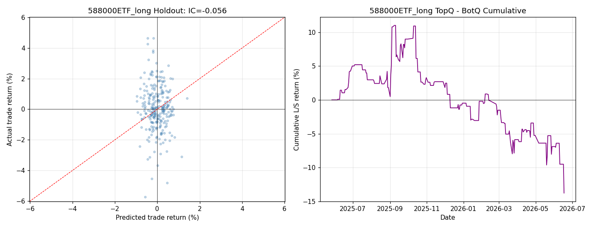


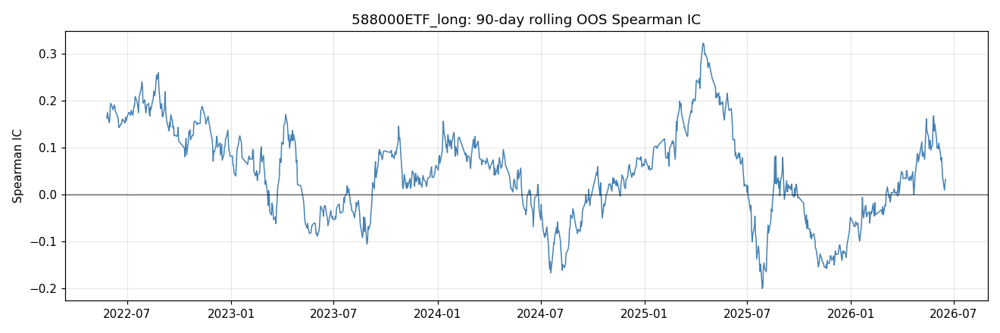


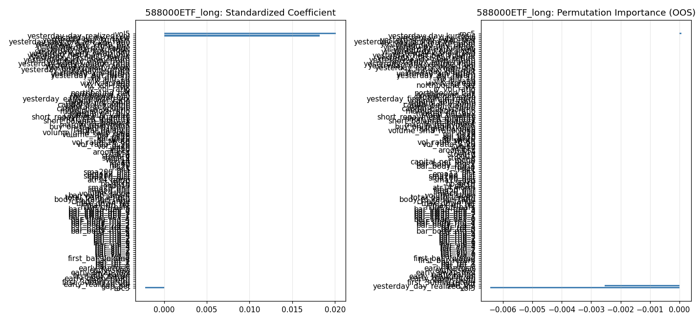


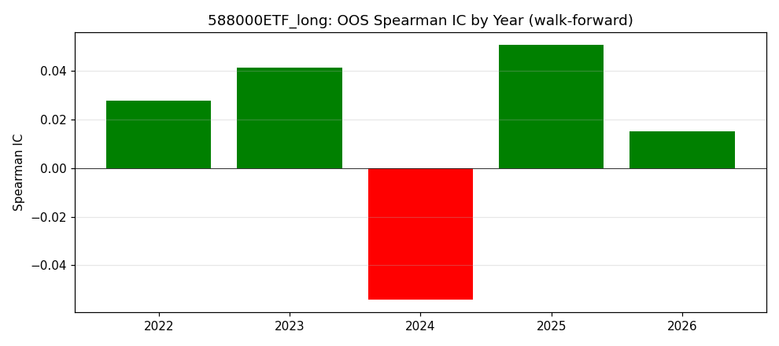


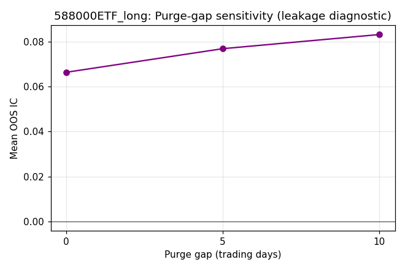


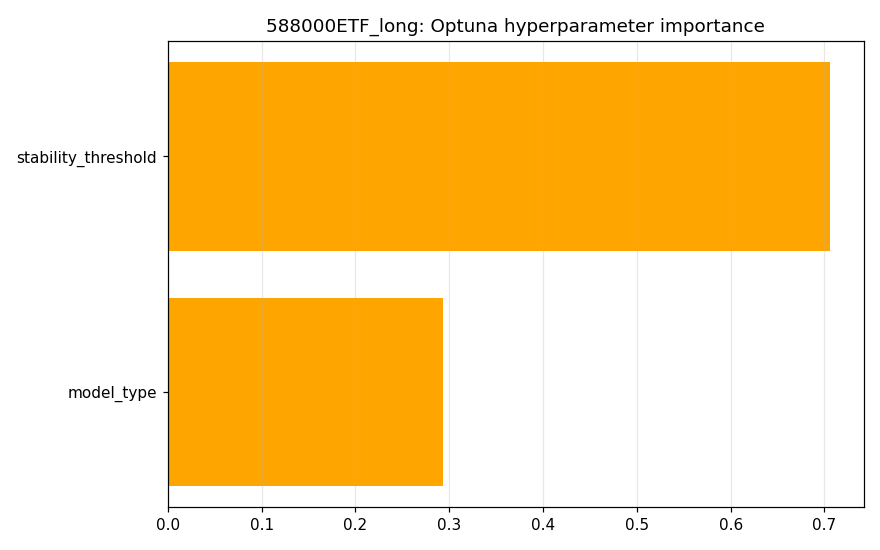


</details>

### 588000ETF_short

- **Selected Model**: HUBER
- **Tuned Stability Threshold**: 0.40
- **Samples**: 1294 (2021-02-09 → 2026-06-17)
- **Holdout**: 258 days (2025-05-27 → 2026-06-17)
- **Target stats**: mean=-0.0044%, std=1.3690%, Sharpe=-0.05
- **Selected features (5)**: `first_bar_return, bar_ret_0, cl_pos_in_range, yesterday_early_realized_vol, yesterday_day_pm_am_vol_ratio`

#### Feature Stability Scores (Block Bootstrap)

<details>
<summary><b>Click to expand Feature Stability Scores (Block Bootstrap) Table</b></summary>

| Feature | Stability Score | Status | Pearson $r$ | Spearman $\rho$ | Monotonicity Score | Mutual Info | Quality Rating | Holdout IC | Yearly ICs | Yearly IC Std |
|---------|-----------------|--------|-------------|-----------------|--------------------|-------------|----------------|------------|------------|---------------|
| yesterday_day_pm_am_vol_ratio | 64.8% | **Selected** | +0.0100 | +0.0133 | -0.20 | 0.0087 | * Non-Monotonic / Weak | +0.0358 | 21:-0.02 22:+0.04 23:+0.15 24:-0.02 25:-0.05 26:+0.04 | 0.0645 |
| yesterday_am_return | 56.8% | **Selected** | +0.0192 | +0.0216 | +0.30 | 0.0439 | * Non-Monotonic / Weak | -0.0564 | 21:+0.04 22:+0.15 23:-0.00 24:-0.05 25:+0.00 26:-0.07 | 0.0739 |
| num_up_bars | 55.6% | **Selected** | +0.0665 | +0.0679 | +1.00 | 0.0208 | *** Strong Monotonic | -0.0413 | 21:+0.14 22:+0.10 23:+0.13 24:+0.03 25:-0.02 26:-0.03 | 0.0680 |
| yesterday_first_bar_return | 53.6% | **Selected** | -0.0436 | +0.0225 | -0.20 | 0.0000 | * Non-Monotonic / Weak | -0.0411 | 21:+0.10 22:+0.04 23:+0.17 24:-0.05 25:-0.03 26:-0.08 | 0.0883 |
| cl_pos_in_range | 51.2% | **Selected** | +0.0778 | +0.0806 | +0.70 | 0.0123 | ** Moderate Monotonic | +0.0297 | 21:+0.19 22:+0.03 23:+0.17 24:+0.04 25:+0.04 26:+0.00 | 0.0715 |
| yesterday_early_realized_vol | 50.4% | **Selected** | +0.0166 | -0.0002 | +0.40 | 0.0017 | * Non-Monotonic / Weak | -0.0335 | 21:-0.05 22:+0.04 23:-0.01 24:-0.04 25:+0.02 26:+0.09 | 0.0490 |
| first_bar_return | 44.4% | **Selected** | +0.1231 | +0.0907 | +1.00 | 0.0341 | *** Strong Monotonic | -0.0147 | 21:+0.18 22:+0.13 23:+0.07 24:+0.06 25:+0.03 26:-0.01 | 0.0606 |
| bar_ret_0 | 43.6% | **Selected** | +0.1230 | +0.0907 | +1.00 | 0.0343 | *** Strong Monotonic | -0.0147 | 21:+0.18 22:+0.13 23:+0.07 24:+0.06 25:+0.03 26:-0.01 | 0.0606 |
| bar_rng_2 | 40.4% | **Selected** | +0.0138 | -0.0212 | -0.10 | 0.0590 | * Non-Monotonic / Weak | -0.0254 | 21:-0.06 22:-0.07 23:+0.01 24:+0.03 25:-0.04 26:-0.02 | 0.0340 |
| margin_short_ratio | 38.4% | Pruned | +0.0183 | +0.0119 | +0.60 | 0.0455 | ** Moderate Monotonic | +0.0593 | 21:-0.05 22:+0.00 23:+0.09 24:+0.02 25:+0.06 26:+0.05 | 0.0440 |
| gap_pct | 35.2% | Pruned | +0.0208 | -0.0034 | +0.30 | 0.0207 | * Non-Monotonic / Weak | +0.0165 | 21:+0.03 22:-0.03 23:+0.06 24:-0.07 25:+0.01 26:+0.01 | 0.0423 |
| vol5 | 35.2% | Pruned | +0.0566 | +0.0443 | +0.70 | 0.0240 | ** Moderate Monotonic | -0.0448 | 21:+0.01 22:+0.18 23:+0.11 24:-0.01 25:+0.01 26:-0.02 | 0.0721 |
| yesterday_day_kurtosis | 34.8% | Pruned | -0.0229 | -0.0634 | -0.60 | 0.0069 | ** Moderate Monotonic | -0.0356 | 21:-0.11 22:-0.04 23:-0.06 24:-0.08 25:-0.05 26:-0.02 | 0.0309 |
| capital_net_ratio | 33.6% | Pruned | -0.0592 | -0.0736 | -0.90 | 0.0000 | *** Strong Monotonic | +0.0038 | 21:-0.03 22:-0.14 23:-0.04 24:-0.14 25:-0.03 26:-0.01 | 0.0524 |
| early_realized_vol | 29.2% | Pruned | +0.0204 | +0.0116 | +0.50 | 0.0000 | * Non-Monotonic / Weak | +0.1198 | 21:-0.05 22:+0.05 23:-0.07 24:+0.00 25:-0.02 26:+0.20 | 0.0894 |
| early_skew | 28.8% | Pruned | -0.0173 | +0.0092 | -0.30 | 0.0153 | * Non-Monotonic / Weak | -0.0409 | 21:-0.02 22:+0.00 23:+0.08 24:+0.06 25:-0.06 26:-0.03 | 0.0486 |
| bar_vwap_dev_0 | 28.4% | Pruned | -0.0108 | -0.0175 | N/A | 0.0024 | N/A | N/A | N/A | N/A |
| bar_rng_1 | 28.0% | Pruned | +0.0653 | +0.0035 | +0.60 | 0.0039 | ** Moderate Monotonic | +0.0157 | 21:-0.07 22:+0.10 23:-0.02 24:+0.06 25:-0.06 26:+0.04 | 0.0619 |
| yesterday_early_skew | 28.0% | Pruned | -0.0420 | -0.0281 | -0.60 | 0.0000 | ** Moderate Monotonic | +0.0190 | 21:-0.10 22:-0.03 23:-0.07 24:+0.05 25:+0.03 26:-0.10 | 0.0603 |
| yesterday_day_late_mom | 26.4% | Pruned | +0.0086 | -0.0304 | +0.10 | 0.0000 | * Non-Monotonic / Weak | -0.0744 | 21:-0.05 22:-0.02 23:-0.04 24:+0.02 25:-0.00 26:-0.13 | 0.0497 |
| bb_width | 25.6% | Pruned | -0.0634 | -0.0367 | -0.90 | 0.0166 | *** Strong Monotonic | +0.0096 | 21:+0.04 22:-0.12 23:-0.04 24:-0.08 25:-0.02 26:-0.06 | 0.0504 |
| yesterday_gap_pct | 25.6% | Pruned | +0.1356 | +0.0385 | +0.60 | 0.0192 | ** Moderate Monotonic | +0.0551 | 21:-0.01 22:-0.02 23:+0.01 24:+0.10 25:+0.12 26:-0.01 | 0.0583 |
| volume_slope | 24.4% | Pruned | -0.0295 | +0.0047 | +0.00 | 0.0524 | * Non-Monotonic / Weak | +0.0289 | 21:-0.04 22:-0.03 23:+0.08 24:+0.02 25:+0.03 26:-0.04 | 0.0445 |
| yesterday_day_close_pos | 23.6% | Pruned | -0.0481 | -0.0596 | -0.90 | 0.0000 | *** Strong Monotonic | -0.1645 | 21:-0.01 22:-0.02 23:-0.05 24:-0.07 25:-0.07 26:-0.18 | 0.0545 |
| yesterday_pm_return | 22.4% | Pruned | -0.0155 | -0.0359 | -0.30 | 0.0161 | * Non-Monotonic / Weak | -0.2016 | 21:+0.09 22:-0.01 23:-0.04 24:+0.01 25:-0.09 26:-0.24 | 0.1040 |
| bar_rng_0 | 21.6% | Pruned | +0.0456 | +0.0191 | +0.60 | 0.0295 | ** Moderate Monotonic | -0.0264 | 21:-0.03 22:+0.09 23:-0.03 24:+0.08 25:+0.00 26:-0.04 | 0.0533 |
| volume_sma_ratio | 20.8% | Pruned | +0.0622 | +0.0180 | +0.40 | 0.0006 | * Non-Monotonic / Weak | -0.0446 | 21:+0.00 22:+0.12 23:-0.04 24:-0.05 25:+0.02 26:+0.01 | 0.0581 |
| northbound_net | 20.0% | Pruned | -0.0014 | -0.0156 | -0.60 | 0.0045 | ** Moderate Monotonic | N/A | 21:-0.00 22:-0.04 23:+0.04 24:-0.06 26:+nan | nan |
| cci14 | 19.6% | Pruned | +0.0351 | +0.0282 | +0.70 | 0.0008 | ** Moderate Monotonic | -0.0054 | 21:-0.04 22:+0.08 23:+0.01 24:+0.07 25:+0.00 26:+0.06 | 0.0435 |
| yesterday_first_bar_volume | 19.2% | Pruned | +0.0932 | +0.0411 | +0.80 | 0.0000 | ** Moderate Monotonic | -0.0210 | 21:+0.04 22:+0.11 23:-0.02 24:-0.03 25:+0.06 26:+0.08 | 0.0493 |
| yesterday_early_range | 18.8% | Pruned | +0.0117 | +0.0197 | +0.50 | 0.0521 | * Non-Monotonic / Weak | -0.0134 | 21:-0.06 22:+0.11 23:-0.01 24:+0.01 25:+0.04 26:+0.04 | 0.0514 |
| max_up_ret | 18.0% | Pruned | +0.1308 | +0.0790 | +0.70 | 0.0000 | ** Moderate Monotonic | +0.0188 | 21:+0.16 22:+0.12 23:+0.08 24:+0.03 25:+0.01 26:+0.03 | 0.0536 |
| vol_ratio_5_20 | 17.2% | Pruned | +0.0433 | +0.0292 | +0.70 | 0.0033 | ** Moderate Monotonic | -0.0524 | 21:+0.05 22:+0.05 23:+0.12 24:-0.05 25:+0.04 26:-0.04 | 0.0568 |
| bar_body_rng_0 | 16.8% | Pruned | +0.0829 | +0.0835 | +0.70 | 0.0198 | ** Moderate Monotonic | +0.0150 | 21:+0.18 22:+0.10 23:+0.07 24:+0.03 25:+0.04 26:+0.03 | 0.0519 |
| northbound_buy | 16.8% | Pruned | +0.0116 | -0.0051 | -0.80 | 0.0094 | ** Moderate Monotonic | N/A | 21:-0.16 22:+0.07 23:-0.01 24:-0.01 25:+nan 26:+nan | nan |
| bar_ret_2 | 15.2% | Pruned | +0.0033 | +0.0054 | +0.40 | 0.0000 | * Non-Monotonic / Weak | -0.0651 | 21:+0.01 22:-0.02 23:+0.12 24:-0.01 25:-0.01 26:-0.08 | 0.0577 |
| vol_ratio_10_60 | 15.2% | Pruned | +0.0534 | +0.0124 | +0.70 | 0.0001 | ** Moderate Monotonic | -0.0174 | 21:-0.08 22:+0.04 23:+0.01 24:-0.02 25:+0.09 26:-0.10 | 0.0644 |
| body_to_range_ratio | 14.8% | Pruned | -0.0050 | +0.0154 | -0.30 | 0.0000 | * Non-Monotonic / Weak | -0.0199 | 21:+0.13 22:+0.03 23:-0.02 24:-0.01 25:-0.06 26:-0.02 | 0.0624 |
| willr14 | 14.8% | Pruned | +0.0216 | +0.0189 | +0.50 | 0.0181 | * Non-Monotonic / Weak | -0.0594 | 21:+0.02 22:+0.11 23:-0.03 24:-0.04 25:-0.01 26:-0.05 | 0.0526 |
| vol_gk10 | 14.8% | Pruned | +0.0730 | +0.0330 | +0.70 | 0.0344 | ** Moderate Monotonic | -0.0278 | 21:-0.04 22:+0.19 23:+0.01 24:+0.05 25:+0.03 26:-0.02 | 0.0737 |
| margin_net_buy | 14.8% | Pruned | -0.0394 | -0.0229 | -0.90 | 0.0057 | *** Strong Monotonic | +0.0600 | 21:-0.01 22:-0.08 23:-0.02 24:-0.07 25:-0.03 26:+0.10 | 0.0561 |
| first_30min_return | 14.4% | Pruned | +0.1222 | +0.1013 | +1.00 | 0.0301 | *** Strong Monotonic | +0.0184 | 21:+0.22 22:+0.07 23:+0.18 24:+0.07 25:+0.03 26:-0.00 | 0.0792 |
| bar_body_rng_1 | 14.4% | Pruned | +0.0571 | +0.0515 | +0.80 | 0.0000 | ** Moderate Monotonic | +0.0488 | 21:+0.14 22:+0.03 23:+0.11 24:+0.04 25:+0.00 26:-0.05 | 0.0625 |
| northbound_sell | 13.6% | Pruned | +0.0131 | -0.0005 | -0.20 | 0.0176 | * Non-Monotonic / Weak | N/A | 21:-0.16 22:+0.10 23:-0.02 24:+0.03 25:+nan 26:+nan | nan |
| yesterday_day_skew | 13.6% | Pruned | +0.0144 | +0.0015 | +0.10 | 0.0144 | * Non-Monotonic / Weak | +0.1410 | 21:-0.10 22:+0.04 23:-0.01 24:-0.01 25:+0.04 26:+0.09 | 0.0614 |
| yesterday_early_trend | 12.4% | Pruned | -0.0279 | -0.0162 | -0.40 | 0.0000 | * Non-Monotonic / Weak | -0.0290 | 21:-0.06 22:+0.03 23:+0.00 24:-0.09 25:+0.06 26:-0.04 | 0.0514 |
| yesterday_early_momentum | 12.4% | Pruned | -0.0285 | -0.0160 | -0.10 | 0.0000 | * Non-Monotonic / Weak | -0.0283 | 21:-0.06 22:+0.03 23:+0.00 24:-0.09 25:+0.06 26:-0.04 | 0.0516 |
| bar_vwap_dev_1 | 10.8% | Pruned | +0.0523 | +0.0531 | +0.90 | 0.0154 | *** Strong Monotonic | +0.0586 | 21:+0.17 22:+0.01 23:+0.12 24:+0.06 25:-0.02 26:-0.01 | 0.0692 |
| total_path_length | 10.8% | Pruned | +0.0269 | +0.0014 | +0.20 | 0.0000 | * Non-Monotonic / Weak | +0.0620 | 21:-0.05 22:+0.07 23:-0.05 24:-0.01 25:-0.05 26:+0.09 | 0.0565 |
| roc5 | 10.8% | Pruned | -0.0147 | -0.0026 | +0.00 | 0.0000 | * Non-Monotonic / Weak | -0.0143 | 21:-0.06 22:+0.05 23:+0.02 24:-0.08 25:-0.02 26:+0.05 | 0.0509 |
| roc20 | 10.8% | Pruned | +0.0076 | +0.0100 | +0.60 | 0.0197 | ** Moderate Monotonic | +0.0017 | 21:+0.06 22:+0.01 23:-0.04 24:-0.09 25:-0.03 26:+0.06 | 0.0537 |
| aroon_osc | 10.8% | Pruned | +0.0219 | +0.0433 | +0.70 | 0.0108 | ** Moderate Monotonic | +0.0339 | 21:+0.08 22:+0.02 23:-0.02 24:-0.01 25:+0.03 26:+0.10 | 0.0451 |
| vol60 | 10.4% | Pruned | +0.0274 | +0.0207 | +0.80 | 0.0320 | ** Moderate Monotonic | -0.0428 | 21:-0.05 22:+0.16 23:+0.02 24:+0.02 25:-0.06 26:+0.04 | 0.0715 |
| yesterday_early_vwap_dev | 10.4% | Pruned | -0.0409 | -0.0219 | +0.00 | 0.0000 | * Non-Monotonic / Weak | -0.0493 | 21:-0.06 22:+0.01 23:-0.02 24:-0.07 25:+0.03 26:-0.05 | 0.0351 |
| roc10 | 10.0% | Pruned | +0.0173 | +0.0280 | +0.70 | 0.0000 | ** Moderate Monotonic | +0.0093 | 21:+0.05 22:+0.06 23:+0.03 24:-0.06 25:-0.01 26:+0.08 | 0.0455 |
| sma100_dist | 10.0% | Pruned | -0.0296 | -0.0191 | -0.10 | 0.0556 | * Non-Monotonic / Weak | -0.0392 | 21:-0.03 22:-0.08 23:-0.05 24:-0.08 25:-0.06 26:+0.00 | 0.0286 |
| yesterday_day_realized_vol | 10.0% | Pruned | +0.0612 | +0.0458 | +0.90 | 0.0380 | *** Strong Monotonic | -0.0176 | 21:+0.01 22:+0.19 23:-0.06 24:+0.08 25:+0.02 26:+0.03 | 0.0766 |
| macd_hist | 9.6% | Pruned | +0.0076 | +0.0262 | +0.10 | 0.0071 | * Non-Monotonic / Weak | +0.0097 | 21:+0.02 22:+0.01 23:-0.01 24:-0.06 25:+0.00 26:+0.05 | 0.0310 |
| short_sell_quantity | 9.6% | Pruned | -0.0159 | -0.0437 | -0.50 | 0.0484 | * Non-Monotonic / Weak | -0.0336 | 21:-0.10 22:-0.03 23:-0.03 24:-0.01 25:-0.00 26:-0.06 | 0.0314 |
| early_range | 9.2% | Pruned | +0.0699 | +0.0144 | +0.50 | 0.0159 | * Non-Monotonic / Weak | +0.0320 | 21:-0.06 22:+0.15 23:-0.07 24:+0.01 25:-0.05 26:+0.07 | 0.0793 |
| mfi14 | 9.2% | Pruned | +0.0142 | +0.0302 | +0.20 | 0.0000 | * Non-Monotonic / Weak | +0.0370 | 21:+0.08 22:+0.01 23:-0.03 24:-0.03 25:+0.02 26:+0.07 | 0.0420 |
| iv_diff_1d | 8.8% | Pruned | +0.1031 | +0.0038 | +1.00 | 0.0000 | *** Strong Monotonic | +0.0062 | 23:-0.00 24:+0.04 25:-0.02 26:+0.04 | 0.0277 |
| roc60 | 8.4% | Pruned | -0.0220 | -0.0160 | -0.10 | 0.0277 | * Non-Monotonic / Weak | -0.0475 | 21:-0.07 22:-0.07 23:-0.01 24:-0.04 25:-0.01 26:-0.07 | 0.0278 |
| yesterday_day_range | 8.4% | Pruned | +0.0452 | +0.0068 | +0.70 | 0.0174 | ** Moderate Monotonic | -0.0153 | 21:+0.01 22:+0.05 23:-0.05 24:-0.01 25:-0.01 26:+0.05 | 0.0353 |
| first_bar_volume | 8.0% | Pruned | +0.0512 | +0.0035 | +0.00 | 0.0230 | * Non-Monotonic / Weak | -0.0397 | 21:+0.00 22:+0.06 23:-0.05 24:-0.02 25:-0.02 26:+0.01 | 0.0342 |
| bar_body_rng_2 | 8.0% | Pruned | -0.0038 | -0.0061 | -0.10 | 0.0000 | * Non-Monotonic / Weak | -0.0748 | 21:-0.00 22:-0.04 23:+0.10 24:-0.01 25:-0.03 26:-0.08 | 0.0547 |
| bar_ret_1 | 7.6% | Pruned | +0.0531 | +0.0537 | +0.80 | 0.0000 | ** Moderate Monotonic | +0.0624 | 21:+0.15 22:+0.01 23:+0.13 24:+0.06 25:-0.01 26:-0.01 | 0.0638 |
| vix_iv_ratio | 7.6% | Pruned | +0.0438 | +0.0480 | +0.40 | 0.0104 | * Non-Monotonic / Weak | +0.0742 | 23:+0.09 24:+0.07 25:+0.11 26:+0.00 | 0.0397 |
| yesterday_day_vwap_dev | 7.6% | Pruned | -0.0269 | -0.0599 | -0.50 | 0.0379 | * Non-Monotonic / Weak | -0.1737 | 21:+0.00 22:-0.02 23:-0.06 24:-0.04 25:-0.08 26:-0.20 | 0.0641 |
| bb_pctb | 7.2% | Pruned | -0.0305 | -0.0242 | -0.20 | 0.0111 | * Non-Monotonic / Weak | -0.0060 | 21:-0.02 22:-0.08 23:+0.02 24:+0.06 25:-0.03 26:-0.02 | 0.0438 |
| capital_sell_value | 6.8% | Pruned | +0.0231 | +0.0185 | +0.50 | 0.0000 | * Non-Monotonic / Weak | -0.0373 | 21:+0.01 22:+0.04 23:+0.00 24:-0.00 25:+0.01 26:-0.05 | 0.0272 |
| capital_net_value | 6.8% | Pruned | +0.0283 | -0.0619 | -1.00 | 0.0000 | ** Non-Linear Monotonic | -0.0003 | 21:-0.02 22:-0.09 23:-0.04 24:-0.14 25:-0.02 26:-0.03 | 0.0423 |
| bar_vol_0 | 6.4% | Pruned | +0.0512 | +0.0035 | +0.00 | 0.0230 | * Non-Monotonic / Weak | -0.0397 | 21:+0.00 22:+0.06 23:-0.05 24:-0.02 25:-0.02 26:+0.01 | 0.0342 |
| sma200_dist | 6.4% | Pruned | -0.0257 | -0.0033 | -0.30 | 0.0286 | * Non-Monotonic / Weak | -0.0808 | 21:-0.06 22:-0.14 23:-0.08 24:-0.08 25:-0.12 26:-0.02 | 0.0409 |
| vol10 | 6.4% | Pruned | +0.0702 | +0.0118 | +0.50 | 0.0405 | * Non-Monotonic / Weak | -0.0485 | 21:-0.07 22:+0.11 23:+0.02 24:-0.01 25:+0.00 26:-0.01 | 0.0551 |
| short_repayment_quantity | 6.4% | Pruned | -0.0123 | -0.0162 | -0.10 | 0.0521 | * Non-Monotonic / Weak | +0.0606 | 21:-0.10 22:-0.03 23:-0.01 24:+0.05 25:+0.09 26:+0.05 | 0.0621 |
| capital_sell_volume | 6.4% | Pruned | +0.0413 | +0.0147 | +0.70 | 0.0274 | ** Moderate Monotonic | -0.0105 | 21:+0.04 22:+0.06 23:+0.02 24:+0.02 25:+0.04 26:-0.07 | 0.0410 |
| vol_gk20 | 6.0% | Pruned | +0.0472 | +0.0265 | +1.00 | 0.0281 | *** Strong Monotonic | -0.0338 | 21:-0.07 22:+0.20 23:+0.02 24:+0.04 25:-0.00 26:-0.01 | 0.0825 |
| max_down_ret | 5.6% | Pruned | +0.0610 | +0.0740 | +1.00 | 0.0381 | *** Strong Monotonic | -0.0273 | 21:+0.22 22:+0.04 23:+0.13 24:+0.03 25:+0.00 26:-0.03 | 0.0843 |
| short_balance | 5.6% | Pruned | -0.0301 | -0.0202 | -0.40 | 0.0769 | * Non-Monotonic / Weak | -0.0605 | 21:+0.04 22:-0.01 23:-0.06 24:-0.02 25:-0.07 26:-0.04 | 0.0342 |
| margin_balance | 5.2% | Pruned | +0.0233 | -0.0073 | +0.60 | 0.0629 | ** Moderate Monotonic | +0.0293 | 21:-0.05 22:+0.02 23:+0.05 24:+0.06 25:-0.01 26:-0.02 | 0.0388 |
| iv_vol_ratio | 5.2% | Pruned | -0.0052 | -0.0052 | -0.10 | 0.0037 | * Non-Monotonic / Weak | +0.0125 | 21:+0.02 22:-0.16 23:-0.05 24:+0.05 25:-0.01 26:+0.00 | 0.0670 |
| total_balance | 5.2% | Pruned | +0.0215 | -0.0075 | +0.70 | 0.0720 | ** Moderate Monotonic | +0.0271 | 21:-0.05 22:+0.02 23:+0.05 24:+0.07 25:-0.01 26:-0.03 | 0.0414 |
| bar_vol_2 | 4.8% | Pruned | +0.0715 | +0.0012 | -0.10 | 0.0462 | * Non-Monotonic / Weak | -0.0188 | 21:-0.05 22:+0.06 23:-0.00 24:-0.01 25:-0.01 26:-0.01 | 0.0311 |
| yesterday_first_30min_return | 4.8% | Pruned | -0.0527 | +0.0098 | -0.10 | 0.0067 | * Non-Monotonic / Weak | -0.0550 | 21:+0.04 22:+0.04 23:+0.12 24:-0.05 25:-0.01 26:-0.08 | 0.0681 |
| stoch_k | 4.8% | Pruned | +0.0140 | +0.0209 | +0.90 | 0.0000 | *** Strong Monotonic | -0.0137 | 21:+0.02 22:+0.09 23:-0.03 24:-0.05 25:+0.02 26:+0.03 | 0.0449 |
| volume_sma_ratio_long | 4.4% | Pruned | +0.0199 | +0.0295 | +0.90 | 0.0137 | *** Strong Monotonic | -0.0059 | 21:+0.07 22:+0.06 23:-0.01 24:-0.00 25:+0.03 26:-0.01 | 0.0326 |
| capital_buy_value | 4.4% | Pruned | +0.0305 | +0.0034 | +0.30 | 0.0348 | * Non-Monotonic / Weak | -0.0257 | 21:-0.01 22:-0.00 23:-0.02 24:-0.03 25:+0.00 26:-0.05 | 0.0190 |
| iv | 4.4% | Pruned | +0.0733 | +0.0053 | +0.40 | 0.0368 | * Non-Monotonic / Weak | -0.0596 | 23:-0.02 24:+0.04 25:-0.04 26:-0.03 | 0.0321 |
| bar_vol_1 | 4.0% | Pruned | +0.0602 | -0.0109 | -0.10 | 0.0262 | * Non-Monotonic / Weak | -0.0722 | 21:-0.03 22:+0.08 23:-0.06 24:-0.01 25:-0.04 26:-0.07 | 0.0505 |
| vix | 4.0% | Pruned | +0.0673 | +0.0410 | +0.40 | 0.0059 | * Non-Monotonic / Weak | -0.0297 | 23:+0.07 24:+0.09 25:-0.01 26:+0.04 | 0.0404 |
| margin_repayment | 3.6% | Pruned | +0.0278 | -0.0079 | +0.30 | 0.0000 | * Non-Monotonic / Weak | -0.0115 | 21:-0.04 22:+0.04 23:-0.02 24:-0.01 25:+0.00 26:-0.05 | 0.0295 |
| yesterday_early_volume_ratio | 3.6% | Pruned | +0.0830 | +0.0323 | +0.30 | 0.0054 | * Non-Monotonic / Weak | -0.0330 | 21:+0.01 22:+0.11 23:-0.02 24:-0.03 25:+0.06 26:+0.04 | 0.0488 |
| stoch_d | 3.2% | Pruned | +0.0061 | +0.0175 | -0.10 | 0.0000 | * Non-Monotonic / Weak | +0.0059 | 21:+0.03 22:+0.05 23:-0.05 24:-0.04 25:+0.02 26:+0.09 | 0.0492 |
| vix_diff_1d | 3.2% | Pruned | +0.1261 | +0.0665 | +0.80 | 0.0060 | ** Moderate Monotonic | +0.0526 | 23:+0.00 24:+0.16 25:+0.04 26:+0.10 | 0.0598 |
| vol_pk20 | 2.8% | Pruned | +0.0449 | +0.0213 | +0.70 | 0.0342 | ** Moderate Monotonic | -0.0409 | 21:-0.03 22:+0.20 23:+0.03 24:+0.03 25:-0.00 26:-0.02 | 0.0766 |
| short_balance_quantity | 2.8% | Pruned | -0.0245 | -0.0193 | -0.30 | 0.1008 | * Non-Monotonic / Weak | -0.0533 | 21:+0.05 22:+0.00 23:-0.03 24:-0.00 25:-0.05 26:-0.05 | 0.0357 |
| capital_buy_volume | 2.8% | Pruned | +0.0430 | -0.0030 | +0.40 | 0.0098 | * Non-Monotonic / Weak | -0.0069 | 21:+0.01 22:+0.02 23:-0.01 24:-0.02 25:+0.03 26:-0.08 | 0.0367 |
| rsi5 | 2.8% | Pruned | +0.0043 | +0.0068 | +0.30 | 0.0026 | * Non-Monotonic / Weak | -0.0051 | 21:-0.01 22:+0.08 23:-0.03 24:-0.07 25:+0.01 26:+0.03 | 0.0460 |
| vix_iv_spread | 2.8% | Pruned | -0.0410 | +0.0604 | +0.80 | 0.0000 | ** Moderate Monotonic | +0.0687 | 23:+0.11 24:+0.12 25:+0.14 26:-0.01 | 0.0550 |
| atr14_norm | 2.4% | Pruned | +0.0553 | +0.0255 | +0.30 | 0.0030 | * Non-Monotonic / Weak | -0.0276 | 21:-0.06 22:+0.21 23:+0.04 24:+0.05 25:-0.01 26:+0.03 | 0.0837 |
| sma10_dist | 2.4% | Pruned | -0.0071 | +0.0024 | -0.10 | 0.0000 | * Non-Monotonic / Weak | -0.0155 | 21:-0.03 22:+0.06 23:+0.01 24:-0.08 25:-0.03 26:+0.04 | 0.0482 |
| early_vwap_dev | 2.0% | Pruned | +0.0304 | +0.0429 | +0.60 | 0.0245 | ** Moderate Monotonic | +0.0119 | 21:+0.11 22:-0.03 23:+0.17 24:+0.02 25:+0.01 26:-0.03 | 0.0714 |
| bar_vwap_dev_2 | 2.0% | Pruned | +0.0304 | +0.0429 | +0.60 | 0.0245 | ** Moderate Monotonic | +0.0119 | 21:+0.11 22:-0.03 23:+0.17 24:+0.02 25:+0.01 26:-0.03 | 0.0714 |
| sma50_dist | 2.0% | Pruned | -0.0153 | -0.0054 | +0.30 | 0.0701 | * Non-Monotonic / Weak | -0.0119 | 21:+0.05 22:-0.03 23:-0.08 24:-0.08 25:-0.05 26:+0.00 | 0.0448 |
| vol20 | 2.0% | Pruned | +0.0632 | +0.0211 | +0.70 | 0.0450 | ** Moderate Monotonic | -0.0296 | 21:-0.02 22:+0.16 23:+0.04 24:+0.02 25:-0.00 26:+0.04 | 0.0582 |
| vix_vol_ratio | 2.0% | Pruned | -0.0081 | +0.0066 | -0.10 | 0.0278 | * Non-Monotonic / Weak | +0.0322 | 21:+0.02 22:-0.16 23:-0.01 24:+0.08 25:+0.02 26:+0.02 | 0.0734 |
| sma20_dist | 1.6% | Pruned | +0.0059 | +0.0202 | +0.80 | 0.0076 | ** Moderate Monotonic | -0.0047 | 21:+0.04 22:+0.04 23:-0.03 24:-0.05 25:-0.01 26:+0.05 | 0.0393 |
| buy_on_margin_value | 1.2% | Pruned | +0.0177 | -0.0134 | +0.40 | 0.0120 | * Non-Monotonic / Weak | +0.0161 | 21:-0.04 22:-0.01 23:-0.03 24:-0.02 25:-0.01 26:+0.06 | 0.0346 |
| rsi21 | 0.8% | Pruned | -0.0057 | +0.0074 | +0.00 | 0.0679 | * Non-Monotonic / Weak | +0.0007 | 21:+0.02 22:+0.01 23:-0.05 24:-0.06 25:-0.02 26:+0.04 | 0.0354 |
| early_trend | 0.0% | Pruned | +0.0422 | +0.0510 | +0.90 | 0.0405 | *** Strong Monotonic | +0.0388 | 21:+0.14 22:-0.02 23:+0.17 24:+0.03 25:+0.01 26:-0.02 | 0.0739 |
| early_momentum | 0.0% | Pruned | +0.0416 | +0.0509 | +0.90 | 0.0414 | *** Strong Monotonic | +0.0389 | 21:+0.14 22:-0.02 23:+0.17 24:+0.03 25:+0.01 26:-0.02 | 0.0741 |
| early_kurtosis | 0.0% | Pruned | +0.0262 | +0.0137 | +0.00 | 0.0028 | * Non-Monotonic / Weak | N/A | N/A | N/A |
| bar_ret_3 | 0.0% | Pruned | N/A | N/A | N/A | 0.0024 | N/A | N/A | N/A | N/A |
| bar_ret_4 | 0.0% | Pruned | N/A | N/A | N/A | 0.0024 | N/A | N/A | N/A | N/A |
| bar_ret_5 | 0.0% | Pruned | N/A | N/A | N/A | 0.0024 | N/A | N/A | N/A | N/A |
| bar_vol_3 | 0.0% | Pruned | N/A | N/A | N/A | 0.0024 | N/A | N/A | N/A | N/A |
| bar_vol_4 | 0.0% | Pruned | N/A | N/A | N/A | 0.0024 | N/A | N/A | N/A | N/A |
| bar_vol_5 | 0.0% | Pruned | N/A | N/A | N/A | 0.0024 | N/A | N/A | N/A | N/A |
| bar_rng_3 | 0.0% | Pruned | N/A | N/A | N/A | 0.0024 | N/A | N/A | N/A | N/A |
| bar_rng_4 | 0.0% | Pruned | N/A | N/A | N/A | 0.0024 | N/A | N/A | N/A | N/A |
| bar_rng_5 | 0.0% | Pruned | N/A | N/A | N/A | 0.0024 | N/A | N/A | N/A | N/A |
| bar_body_rng_3 | 0.0% | Pruned | N/A | N/A | N/A | 0.0024 | N/A | N/A | N/A | N/A |
| bar_body_rng_4 | 0.0% | Pruned | N/A | N/A | N/A | 0.0024 | N/A | N/A | N/A | N/A |
| bar_body_rng_5 | 0.0% | Pruned | N/A | N/A | N/A | 0.0024 | N/A | N/A | N/A | N/A |
| bar_vwap_dev_3 | 0.0% | Pruned | N/A | N/A | N/A | 0.0024 | N/A | N/A | N/A | N/A |
| bar_vwap_dev_4 | 0.0% | Pruned | N/A | N/A | N/A | 0.0024 | N/A | N/A | N/A | N/A |
| bar_vwap_dev_5 | 0.0% | Pruned | N/A | N/A | N/A | 0.0024 | N/A | N/A | N/A | N/A |
| ema12_dist | 0.0% | Pruned | +0.0067 | +0.0125 | +0.30 | 0.0000 | * Non-Monotonic / Weak | -0.0170 | 21:+0.01 22:+0.07 23:-0.00 24:-0.07 25:-0.03 26:+0.03 | 0.0432 |
| yesterday_early_kurtosis | 0.0% | Pruned | -0.0164 | -0.0324 | -0.20 | 0.0028 | * Non-Monotonic / Weak | N/A | N/A | N/A |

- **Pearson $r$**: Linear correlation coefficient.
- **Spearman $\rho$**: Rank correlation coefficient (overall monotonic relation).
- **Monotonicity Score**: Spearman rank correlation of target means across 5 feature quintiles. $\pm 1.0$ indicates perfect bin-wise monotonicity.
- **Mutual Info**: Estimated information gain (captures non-linear dependencies).
- **Quality Rating**: Categorized by strength and shape of the monotonic relationship.
- **Holdout IC**: Spearman rank correlation on the holdout set (out-of-sample predictive power).
- **Yearly ICs**: Spearman rank correlation calculated per year.
- **Yearly IC Std**: Standard deviation of yearly ICs (measures temporal stability).

</details>

#### Metrics

| Metric | Best Linear | Ridge Base | Zero | Yesterday PM | First 30min Mom |
|--------|-------------|------------|------|--------------|-----------------|
| IC | +0.0071 | +0.0168 | +0.0000 | -0.1324 | +0.0184 |
| Dir Acc | 0.484 | 0.465 | 0.500 | 0.403 | 0.496 |
| RMSE | 1.5170% | 1.6335% | 1.4761% | 2.1833% | 1.6720% |
| L/S Sharpe | +0.91 | +0.36 | — | — | — |

#### Best Hyperparameters

<details>
<summary><b>Click to expand Best Hyperparameters JSON</b></summary>

```json
{
  "model_type": "huber",
  "stability_threshold": 0.4,
  "huber_alpha": 5262.120070494776,
  "huber_epsilon": 1.5577186317055085
}
```

</details>

#### Walk-Forward Fold ICs

| Fold | IS IC | OOS IC |
|------|-------|--------|
| 1 | 0.2249 | +0.0809 |
| 2 | 0.1593 | +0.1446 |
| 3 | 0.1575 | +0.1088 |
| 4 | 0.1456 | +0.0692 |
| 5 | 0.1329 | -0.0358 |
| **Overall** | — | +0.0462 |

#### Year-by-Year OOS IC

| Year | IC | Dir Acc | N | L/S Sharpe |
|------|-----|---------|---|-----------|
| 2022 | +0.1070 | 0.517 | 240 | +3.14 |
| 2023 | +0.1577 | 0.550 | 242 | +3.23 |
| 2024 | +0.0735 | 0.566 | 242 | +2.56 |
| 2025 | -0.0002 | 0.506 | 243 | +0.59 |
| 2026 | -0.0312 | 0.472 | 108 | -1.27 |

#### Diagnostic Plots

<details>
<summary><b>Click to expand Diagnostic Plots</b></summary>

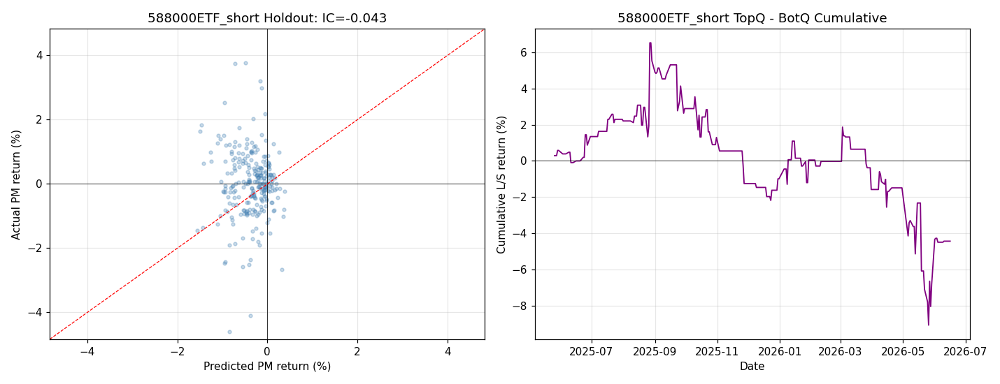


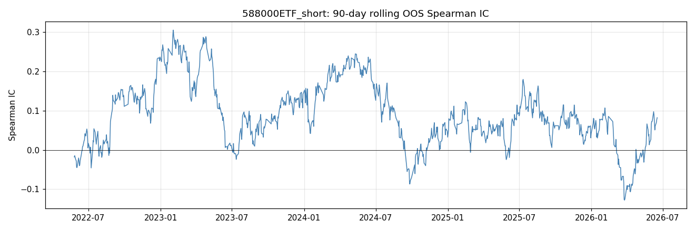


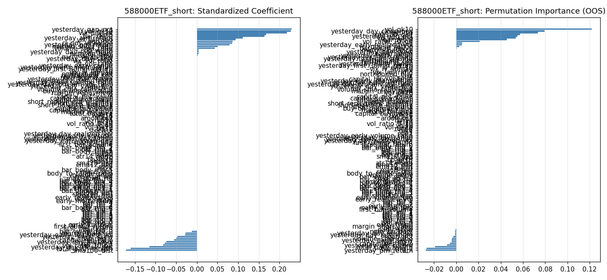


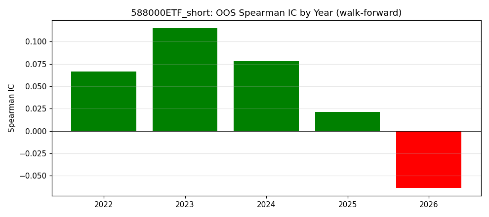


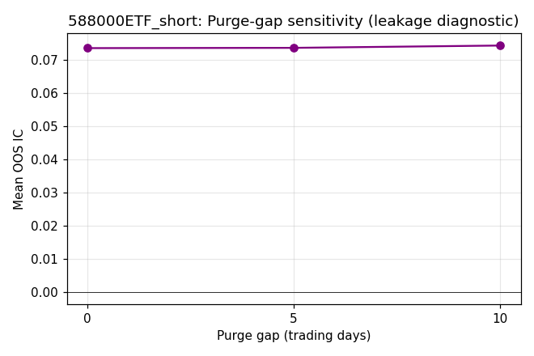


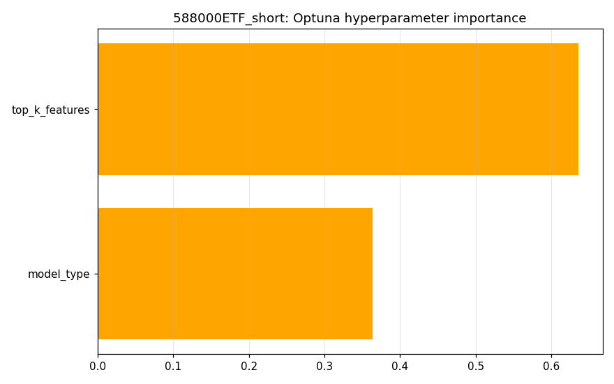


</details>

### 159915ETF_long

- **Selected Model**: RIDGE
- **Tuned Stability Threshold**: 0.75
- **Samples**: 2722 (2015-04-07 → 2026-06-17)
- **Holdout**: 544 days (2024-03-19 → 2026-06-17)
- **Target stats**: mean=0.0195%, std=1.4037%, Sharpe=0.22
- **Selected features (3)**: `sma100_dist, yesterday_early_realized_vol, yesterday_day_vwap_dev`

#### Feature Stability Scores (Block Bootstrap)

<details>
<summary><b>Click to expand Feature Stability Scores (Block Bootstrap) Table</b></summary>

| Feature | Stability Score | Status | Pearson $r$ | Spearman $\rho$ | Monotonicity Score | Mutual Info | Quality Rating | Holdout IC | Yearly ICs | Yearly IC Std |
|---------|-----------------|--------|-------------|-----------------|--------------------|-------------|----------------|------------|------------|---------------|
| sma100_dist | 88.0% | **Selected** | -0.0700 | -0.0320 | -0.80 | 0.0358 | ** Moderate Monotonic | -0.0170 | 15:-0.18 16:-0.09 17:-0.08 18:-0.07 19:-0.06 20:-0.07 21:-0.02 22:-0.06 23:-0.13 24:-0.06 25:+0.02 26:-0.10 | 0.0487 |
| yesterday_early_realized_vol | 83.2% | **Selected** | +0.0581 | +0.0246 | +0.90 | 0.0524 | *** Strong Monotonic | +0.0563 | 15:+0.10 16:+0.11 17:-0.01 18:-0.05 19:+0.00 20:-0.05 21:+0.10 22:-0.04 23:-0.01 24:+0.06 25:+0.02 26:+0.02 | 0.0562 |
| yesterday_day_vwap_dev | 81.2% | **Selected** | -0.0754 | -0.0876 | -1.00 | 0.0099 | *** Strong Monotonic | -0.1132 | 15:-0.05 16:-0.13 17:-0.11 18:-0.14 19:-0.05 20:-0.20 21:+0.01 22:-0.02 23:-0.08 24:-0.05 25:-0.12 26:-0.21 | 0.0653 |
| bar_rng_2 | 75.6% | **Selected** | +0.0328 | +0.0075 | +1.00 | 0.0456 | *** Strong Monotonic | -0.0411 | 15:+0.05 16:+0.02 17:-0.03 18:+0.05 19:-0.04 20:-0.07 21:+0.07 22:-0.02 23:+0.09 24:+0.04 25:-0.06 26:-0.13 | 0.0644 |
| bb_width | 70.0% | Pruned | -0.0495 | -0.0509 | -0.90 | 0.0841 | *** Strong Monotonic | -0.0488 | 15:-0.05 16:-0.06 17:-0.14 18:-0.10 19:+0.03 20:+0.03 21:-0.04 22:-0.08 23:-0.13 24:-0.10 25:-0.04 26:-0.03 | 0.0509 |
| yesterday_early_range | 70.0% | Pruned | +0.0428 | +0.0128 | +0.60 | 0.0605 | ** Moderate Monotonic | +0.0088 | 15:-0.02 16:+0.07 17:-0.01 18:-0.04 19:+0.05 20:-0.06 21:+0.04 22:-0.07 23:+0.03 24:+0.01 25:+0.03 26:-0.03 | 0.0436 |
| early_kurtosis | 69.2% | Pruned | +0.0324 | +0.0439 | +0.30 | 0.0000 | * Non-Monotonic / Weak | +0.0481 | 15:+0.01 16:+0.14 17:+0.06 18:+0.17 19:-0.05 20:+0.00 21:+0.02 22:-0.00 23:+0.02 24:+0.06 25:-0.02 26:+0.14 | 0.0665 |
| yesterday_day_range | 67.6% | Pruned | +0.0264 | +0.0154 | +0.80 | 0.0645 | ** Moderate Monotonic | -0.0224 | 15:+0.01 16:+0.08 17:+0.02 18:+0.00 19:+0.09 20:-0.13 21:+0.06 22:-0.04 23:-0.01 24:-0.01 25:-0.02 26:-0.08 | 0.0610 |
| bar_vol_4 | 61.2% | Pruned | +0.0613 | +0.0322 | +0.90 | 0.0000 | *** Strong Monotonic | +0.0116 | 15:+0.02 16:-0.00 17:-0.05 18:+0.09 19:+0.05 20:+0.14 21:+0.01 22:+0.01 23:+0.06 24:-0.04 25:-0.04 26:+0.16 | 0.0667 |
| yesterday_day_close_pos | 61.2% | Pruned | -0.0592 | -0.0639 | -0.80 | 0.0245 | ** Moderate Monotonic | -0.0772 | 15:-0.03 16:-0.10 17:-0.09 18:-0.07 19:-0.04 20:-0.18 21:+0.01 22:-0.01 23:-0.08 24:-0.01 25:-0.10 26:-0.18 | 0.0585 |
| total_path_length | 59.2% | Pruned | +0.0543 | +0.0379 | +0.70 | 0.0450 | ** Moderate Monotonic | +0.0185 | 15:+0.02 16:+0.10 17:-0.00 18:+0.09 19:-0.06 20:+0.07 21:+0.00 22:+0.05 23:+0.06 24:+0.01 25:-0.00 26:-0.04 | 0.0488 |
| cci14 | 57.2% | Pruned | +0.0420 | +0.0303 | +0.90 | 0.0347 | *** Strong Monotonic | +0.0193 | 15:-0.05 16:+0.05 17:+0.11 18:+0.08 19:+0.04 20:-0.09 21:-0.04 22:+0.05 23:+0.16 24:+0.02 25:+0.06 26:-0.01 | 0.0678 |
| yesterday_early_vwap_dev | 52.0% | Pruned | +0.0958 | +0.0733 | +0.90 | 0.0020 | *** Strong Monotonic | +0.0806 | 15:+0.06 16:+0.11 17:-0.04 18:+0.14 19:+0.01 20:+0.12 21:-0.00 22:+0.16 23:+0.10 24:+0.00 25:+0.05 26:+0.22 | 0.0737 |
| body_to_range_ratio | 51.6% | Pruned | +0.0407 | +0.0615 | +0.90 | 0.0022 | ** Non-Linear Monotonic | +0.0582 | 15:+0.06 16:+0.07 17:+0.04 18:+0.19 19:+0.02 20:+0.03 21:+0.00 22:+0.06 23:+0.09 24:+0.03 25:+0.09 26:+0.04 | 0.0461 |
| yesterday_pm_return | 50.4% | Pruned | -0.0554 | -0.0778 | -0.90 | 0.0361 | *** Strong Monotonic | -0.1062 | 15:-0.09 16:-0.09 17:-0.07 18:-0.11 19:-0.03 20:-0.17 21:+0.01 22:-0.04 23:-0.08 24:-0.06 25:-0.08 26:-0.21 | 0.0566 |
| gap_pct | 50.0% | Pruned | +0.0430 | +0.0557 | +0.90 | 0.0292 | *** Strong Monotonic | +0.0786 | 15:+0.06 16:+0.01 17:-0.04 18:+0.02 19:+0.13 20:+0.05 21:+0.05 22:+0.06 23:+0.01 24:-0.01 25:+0.07 26:+0.14 | 0.0513 |
| bar_ret_2 | 49.6% | Pruned | -0.0017 | +0.0271 | +0.10 | 0.0111 | * Non-Monotonic / Weak | +0.0127 | 15:-0.01 16:-0.06 17:+0.05 18:+0.08 19:+0.05 20:+0.05 21:-0.06 22:+0.06 23:-0.00 24:+0.03 25:+0.12 26:-0.17 | 0.0761 |
| yesterday_gap_pct | 49.2% | Pruned | +0.0393 | +0.0355 | +0.60 | 0.0166 | ** Moderate Monotonic | +0.0505 | 15:+0.08 16:-0.11 17:+0.00 18:-0.02 19:+0.02 20:+0.01 21:+0.11 22:+0.01 23:+0.02 24:+0.09 25:+0.10 26:-0.03 | 0.0608 |
| roc10 | 48.4% | Pruned | -0.0266 | +0.0101 | -0.10 | 0.0326 | * Non-Monotonic / Weak | -0.0090 | 15:+0.02 16:-0.10 17:-0.09 18:-0.08 19:+0.01 20:+0.05 21:-0.02 22:+0.03 23:+0.00 24:-0.07 25:+0.07 26:-0.12 | 0.0624 |
| bar_body_rng_0 | 48.0% | Pruned | +0.1195 | +0.1201 | +1.00 | 0.0165 | *** Strong Monotonic | +0.0758 | 15:+0.26 16:+0.18 17:-0.05 18:+0.14 19:+0.19 20:+0.15 21:+0.14 22:+0.05 23:+0.15 24:+0.05 25:+0.15 26:-0.06 | 0.0924 |
| bar_body_rng_1 | 46.4% | Pruned | +0.0294 | +0.0398 | +0.50 | 0.0000 | * Non-Monotonic / Weak | +0.0514 | 15:+0.02 16:+0.06 17:+0.00 18:-0.02 19:+0.07 20:-0.05 21:+0.05 22:+0.07 23:+0.17 24:+0.06 25:+0.01 26:+0.06 | 0.0524 |
| bar_rng_3 | 46.0% | Pruned | +0.0632 | +0.0497 | +0.90 | 0.0303 | *** Strong Monotonic | +0.0291 | 15:+0.06 16:+0.12 17:+0.04 18:+0.07 19:-0.05 20:+0.06 21:-0.00 22:+0.16 23:+0.03 24:+0.14 25:+0.00 26:-0.12 | 0.0757 |
| bar_rng_0 | 44.8% | Pruned | +0.0238 | +0.0350 | +0.70 | 0.0604 | ** Moderate Monotonic | +0.0378 | 15:-0.07 16:+0.15 17:+0.01 18:+0.05 19:-0.09 20:+0.06 21:+0.00 22:+0.03 23:+0.03 24:+0.06 25:+0.02 26:+0.11 | 0.0637 |
| yesterday_day_kurtosis | 44.4% | Pruned | -0.0088 | -0.0471 | -0.90 | 0.0000 | ** Non-Linear Monotonic | +0.0001 | 15:-0.07 16:-0.01 17:-0.11 18:-0.11 19:-0.05 20:+0.04 21:-0.06 22:+0.00 23:-0.14 24:-0.07 25:-0.04 26:+0.08 | 0.0612 |
| bar_rng_1 | 44.4% | Pruned | +0.0169 | +0.0028 | +0.50 | 0.0327 | * Non-Monotonic / Weak | -0.0045 | 15:-0.02 16:+0.01 17:-0.07 18:-0.06 19:+0.00 20:+0.03 21:+0.04 22:-0.04 23:+0.10 24:+0.00 25:-0.08 26:+0.00 | 0.0507 |
| northbound_net | 42.8% | Pruned | +0.0306 | +0.0285 | +0.60 | 0.0000 | ** Moderate Monotonic | -0.0061 | 15:+0.01 16:+0.07 17:-0.08 18:+0.06 19:+0.13 20:+0.05 21:-0.00 22:+0.01 23:+0.08 24:-0.00 26:+nan | nan |
| yesterday_first_bar_return | 42.4% | Pruned | -0.0230 | +0.0092 | -0.30 | 0.0000 | * Non-Monotonic / Weak | +0.0161 | 15:+0.03 16:-0.02 17:+0.01 18:-0.08 19:+0.03 20:-0.07 21:-0.02 22:+0.12 23:+0.10 24:+0.03 25:+0.03 26:-0.05 | 0.0583 |
| roc20 | 40.8% | Pruned | +0.0114 | +0.0205 | +0.10 | 0.0372 | * Non-Monotonic / Weak | -0.0127 | 15:+0.09 16:-0.12 17:-0.05 18:-0.04 19:+0.02 20:+0.05 21:+0.06 22:+0.02 23:-0.09 24:-0.06 25:+0.03 26:-0.08 | 0.0638 |
| vol5 | 40.0% | Pruned | +0.0497 | +0.0222 | +0.70 | 0.0431 | ** Moderate Monotonic | +0.0271 | 15:+0.07 16:+0.00 17:+0.11 18:+0.03 19:-0.05 20:-0.10 21:+0.10 22:+0.10 23:+0.06 24:-0.07 25:+0.04 26:+0.10 | 0.0691 |
| yesterday_day_late_mom | 39.6% | Pruned | +0.0060 | -0.0198 | -0.40 | 0.0185 | * Non-Monotonic / Weak | -0.0168 | 15:+0.03 16:-0.01 17:+0.00 18:+0.04 19:-0.01 20:-0.05 21:-0.06 22:-0.01 23:-0.14 24:-0.01 25:+0.01 26:-0.13 | 0.0546 |
| bar_rng_4 | 39.2% | Pruned | +0.0271 | -0.0057 | +0.40 | 0.0698 | * Non-Monotonic / Weak | -0.0461 | 15:+0.00 16:+0.04 17:-0.01 18:+0.02 19:-0.03 20:-0.08 21:+0.03 22:-0.08 23:+0.09 24:+0.04 25:-0.06 26:-0.10 | 0.0584 |
| first_bar_return | 38.4% | Pruned | +0.1479 | +0.1224 | +1.00 | 0.0006 | *** Strong Monotonic | +0.0588 | 15:+0.25 16:+0.19 17:-0.01 18:+0.13 19:+0.19 20:+0.13 21:+0.15 22:+0.07 23:+0.15 24:+0.06 25:+0.12 26:-0.05 | 0.0822 |
| bar_vwap_dev_1 | 38.0% | Pruned | +0.0451 | +0.0482 | +0.70 | 0.0067 | ** Moderate Monotonic | +0.0609 | 15:+0.03 16:+0.06 17:-0.01 18:-0.04 19:+0.09 20:-0.04 21:+0.08 22:+0.06 23:+0.19 24:+0.10 25:-0.01 26:+0.05 | 0.0629 |
| bar_ret_0 | 37.6% | Pruned | +0.1479 | +0.1224 | +1.00 | 0.0004 | *** Strong Monotonic | +0.0588 | 15:+0.25 16:+0.19 17:-0.01 18:+0.13 19:+0.19 20:+0.13 21:+0.15 22:+0.07 23:+0.15 24:+0.06 25:+0.12 26:-0.05 | 0.0822 |
| vol_ratio_5_20 | 37.6% | Pruned | +0.0109 | +0.0004 | +0.30 | 0.0000 | * Non-Monotonic / Weak | +0.0092 | 15:+0.07 16:-0.07 17:+0.06 18:-0.02 19:-0.01 20:-0.06 21:+0.06 22:+0.04 23:+0.04 24:-0.14 25:+0.04 26:+0.06 | 0.0632 |
| sma10_dist | 36.8% | Pruned | -0.0303 | -0.0040 | -0.50 | 0.0268 | * Non-Monotonic / Weak | -0.0126 | 15:-0.00 16:-0.10 17:-0.10 18:-0.05 19:-0.04 20:+0.01 21:-0.00 22:+0.05 23:-0.01 24:-0.08 25:+0.02 26:-0.08 | 0.0470 |
| volume_sma_ratio | 36.4% | Pruned | +0.0278 | +0.0099 | +0.30 | 0.0000 | * Non-Monotonic / Weak | -0.0133 | 15:+0.07 16:-0.10 17:-0.09 18:-0.00 19:+0.03 20:+0.07 21:+0.00 22:+0.06 23:+0.02 24:-0.02 25:-0.04 26:+0.07 | 0.0569 |
| vol20 | 35.2% | Pruned | +0.0529 | +0.0262 | +1.00 | 0.0611 | *** Strong Monotonic | +0.0274 | 15:-0.01 16:+0.06 17:+0.11 18:+0.10 19:-0.07 20:-0.09 21:+0.04 22:+0.08 23:+0.03 24:+0.05 25:+0.02 26:+0.05 | 0.0594 |
| margin_net_buy | 35.2% | Pruned | -0.0421 | -0.0321 | -0.90 | 0.0155 | *** Strong Monotonic | +0.0267 | 15:+nan 16:+nan 17:-0.04 18:+0.07 19:+0.02 20:-0.09 21:-0.04 22:-0.15 23:-0.15 24:-0.07 25:+0.01 26:+0.16 | nan |
| bar_vwap_dev_0 | 35.2% | Pruned | +0.0038 | -0.0049 | N/A | 0.0000 | N/A | N/A | N/A | N/A |
| yesterday_early_kurtosis | 34.8% | Pruned | -0.0209 | -0.0211 | -0.90 | 0.0001 | *** Strong Monotonic | -0.0660 | 15:-0.07 16:+0.02 17:+0.07 18:+0.01 19:-0.07 20:+0.01 21:+0.08 22:-0.09 23:-0.03 24:-0.02 25:-0.09 26:-0.13 | 0.0632 |
| sma50_dist | 34.4% | Pruned | -0.0123 | +0.0073 | +0.30 | 0.0610 | * Non-Monotonic / Weak | -0.0070 | 15:+0.03 16:-0.09 17:-0.06 18:-0.08 19:+0.01 20:-0.01 21:+0.03 22:+0.03 23:-0.13 24:-0.02 25:+0.02 26:-0.10 | 0.0559 |
| aroon_osc | 33.6% | Pruned | +0.0013 | +0.0108 | +0.30 | 0.0356 | * Non-Monotonic / Weak | +0.0054 | 15:+0.10 16:-0.06 17:+0.01 18:-0.10 19:-0.04 20:+0.07 21:-0.06 22:-0.03 23:-0.01 24:-0.08 25:+0.08 26:-0.10 | 0.0666 |
| yesterday_day_realized_vol | 33.6% | Pruned | +0.0319 | +0.0234 | +1.00 | 0.0747 | *** Strong Monotonic | +0.0101 | 15:+0.05 16:+0.06 17:+0.01 18:-0.06 19:-0.01 20:-0.08 21:+0.12 22:+0.04 23:-0.02 24:+0.07 25:-0.00 26:-0.06 | 0.0567 |
| max_up_ret | 33.2% | Pruned | +0.1375 | +0.1224 | +0.90 | 0.0174 | *** Strong Monotonic | +0.0734 | 15:+0.20 16:+0.13 17:+0.01 18:+0.09 19:+0.16 20:+0.14 21:+0.17 22:+0.12 23:+0.19 24:+0.06 25:+0.15 26:-0.12 | 0.0866 |
| volume_sma_ratio_long | 33.2% | Pruned | +0.0167 | +0.0140 | +0.60 | 0.0000 | ** Moderate Monotonic | +0.0228 | 15:+0.03 16:-0.08 17:-0.04 18:-0.02 19:+0.06 20:+0.02 21:-0.03 22:+0.12 23:-0.08 24:-0.01 25:+0.07 26:-0.03 | 0.0585 |
| macd_hist | 33.2% | Pruned | +0.0138 | +0.0168 | +0.60 | 0.0195 | ** Moderate Monotonic | -0.0035 | 15:+0.09 16:-0.04 17:-0.05 18:-0.04 19:-0.00 20:+0.07 21:-0.01 22:-0.00 23:-0.01 24:-0.08 25:+0.06 26:-0.08 | 0.0529 |
| early_skew | 32.4% | Pruned | +0.0352 | +0.0338 | +0.90 | 0.0065 | *** Strong Monotonic | +0.0628 | 15:+0.02 16:+0.01 17:+0.05 18:+0.02 19:+0.06 20:+0.03 21:-0.04 22:+0.07 23:+0.04 24:-0.02 25:+0.12 26:+0.11 | 0.0444 |
| bar_vol_1 | 32.4% | Pruned | +0.0296 | +0.0013 | +0.10 | 0.0000 | * Non-Monotonic / Weak | +0.0011 | 15:+0.02 16:+0.00 17:-0.10 18:-0.00 19:+0.01 20:+0.17 21:-0.04 22:-0.04 23:+0.03 24:-0.06 25:-0.06 26:+0.13 | 0.0740 |
| bar_body_rng_2 | 32.4% | Pruned | +0.0115 | +0.0206 | +0.50 | 0.0000 | * Non-Monotonic / Weak | +0.0074 | 15:-0.01 16:-0.10 17:+0.04 18:+0.06 19:+0.07 20:+0.07 21:-0.06 22:+0.05 23:+0.00 24:+0.02 25:+0.09 26:-0.16 | 0.0720 |
| margin_short_ratio | 32.4% | Pruned | -0.0054 | +0.0045 | +0.20 | 0.0571 | * Non-Monotonic / Weak | +0.0126 | 17:+0.06 18:-0.00 19:-0.04 20:-0.06 21:+0.12 22:+0.04 23:-0.00 24:+0.04 25:+0.01 26:+0.08 | 0.0515 |
| yesterday_day_pm_am_vol_ratio | 32.4% | Pruned | +0.0093 | +0.0034 | +0.20 | 0.0000 | * Non-Monotonic / Weak | -0.0554 | 15:-0.13 16:+0.00 17:+0.11 18:+0.17 19:+0.00 20:-0.03 21:+0.01 22:+0.02 23:+0.07 24:+0.03 25:-0.12 26:-0.03 | 0.0801 |
| yesterday_first_bar_volume | 31.6% | Pruned | +0.0281 | -0.0062 | +0.40 | 0.0000 | * Non-Monotonic / Weak | +0.0319 | 15:+0.03 16:-0.03 17:-0.07 18:-0.02 19:+0.04 20:+0.02 21:-0.07 22:+0.02 23:-0.01 24:-0.03 25:-0.00 26:+0.16 | 0.0598 |
| roc60 | 30.8% | Pruned | -0.0270 | -0.0147 | -0.70 | 0.0333 | ** Moderate Monotonic | -0.0036 | 15:-0.02 16:-0.05 17:-0.06 18:-0.06 19:-0.07 20:-0.05 21:-0.03 22:-0.04 23:-0.05 24:-0.04 25:+0.03 26:-0.16 | 0.0403 |
| yesterday_day_skew | 30.4% | Pruned | +0.0079 | +0.0154 | +0.40 | 0.0000 | * Non-Monotonic / Weak | +0.0728 | 15:+0.03 16:+0.00 17:-0.04 18:-0.01 19:-0.02 20:+0.07 21:+0.03 22:+0.05 23:-0.00 24:+0.07 25:+0.02 26:+0.21 | 0.0623 |
| vol_gk10 | 30.0% | Pruned | +0.0454 | +0.0345 | +0.90 | 0.0661 | *** Strong Monotonic | +0.0142 | 15:-0.02 16:+0.08 17:+0.11 18:+0.09 19:-0.01 20:-0.10 21:+0.08 22:+0.11 23:+0.06 24:+0.04 25:+0.03 26:-0.12 | 0.0755 |
| sma200_dist | 28.4% | Pruned | -0.0319 | -0.0086 | -0.50 | 0.0819 | * Non-Monotonic / Weak | -0.0165 | 15:-0.06 16:-0.13 17:-0.10 18:-0.07 19:-0.13 20:-0.09 21:-0.02 22:-0.13 23:-0.11 24:-0.08 25:-0.03 26:-0.12 | 0.0361 |
| yesterday_early_skew | 28.4% | Pruned | +0.0064 | +0.0023 | +0.30 | 0.0100 | * Non-Monotonic / Weak | -0.0159 | 15:+0.07 16:-0.01 17:+0.00 18:-0.02 19:+0.11 20:-0.04 21:-0.04 22:-0.04 23:-0.01 24:+0.01 25:+0.02 26:-0.04 | 0.0451 |
| vol_ratio_10_60 | 28.0% | Pruned | +0.0447 | +0.0142 | +0.70 | 0.0184 | ** Moderate Monotonic | +0.0340 | 15:+0.01 16:+0.04 17:+0.05 18:+0.08 19:-0.01 20:-0.05 21:+0.03 22:-0.06 23:+0.03 24:-0.04 25:+0.09 26:+0.00 | 0.0458 |
| num_up_bars | 27.6% | Pruned | +0.0580 | +0.0620 | +1.00 | 0.0147 | *** Strong Monotonic | +0.0433 | 15:+0.09 16:+0.11 17:-0.04 18:+0.01 19:+0.15 20:+0.03 21:+0.02 22:+0.07 23:+0.11 24:+0.09 25:+0.08 26:-0.12 | 0.0717 |
| capital_net_value | 27.2% | Pruned | -0.0380 | -0.0463 | -1.00 | 0.0125 | *** Strong Monotonic | -0.0571 | 15:+nan 16:+nan 17:-0.02 18:-0.00 19:-0.08 20:-0.14 21:-0.05 22:-0.12 23:-0.01 24:-0.07 25:-0.05 26:+0.01 | nan |
| max_down_ret | 27.2% | Pruned | +0.0945 | +0.1007 | +0.60 | 0.0051 | ** Moderate Monotonic | +0.0828 | 15:+0.17 16:+0.11 17:+0.01 18:+0.07 19:+0.18 20:+0.12 21:+0.08 22:+0.10 23:+0.17 24:+0.08 25:+0.14 26:-0.09 | 0.0716 |
| bar_vol_3 | 25.6% | Pruned | +0.0473 | +0.0151 | +0.10 | 0.0161 | * Non-Monotonic / Weak | +0.0098 | 15:+0.04 16:-0.04 17:-0.12 18:+0.04 19:+0.02 20:+0.14 21:+0.01 22:+0.00 23:+0.04 24:-0.06 25:-0.02 26:+0.11 | 0.0683 |
| capital_net_ratio | 25.6% | Pruned | -0.0454 | -0.0545 | -0.80 | 0.0236 | ** Moderate Monotonic | -0.0486 | 17:-0.03 18:-0.02 19:-0.06 20:-0.11 21:-0.07 22:-0.14 23:-0.01 24:-0.06 25:-0.05 26:+0.01 | 0.0422 |
| bar_ret_4 | 24.8% | Pruned | +0.0207 | +0.0005 | +0.40 | 0.0505 | * Non-Monotonic / Weak | -0.0030 | 15:-0.07 16:+0.06 17:-0.02 18:-0.04 19:+0.03 20:-0.00 21:+0.01 22:-0.00 23:+0.05 24:+0.02 25:+0.05 26:-0.10 | 0.0465 |
| short_repayment_quantity | 24.4% | Pruned | +0.0047 | -0.0170 | -0.40 | 0.0564 | * Non-Monotonic / Weak | -0.0514 | 15:+nan 16:+nan 17:+0.02 20:-0.07 21:-0.01 22:+0.11 23:+0.00 24:-0.09 25:+0.01 26:-0.02 | nan |
| yesterday_am_return | 24.0% | Pruned | +0.0274 | +0.0274 | +0.40 | 0.0411 | * Non-Monotonic / Weak | -0.0192 | 15:+0.08 16:+0.02 17:-0.07 18:-0.10 19:+0.05 20:+0.02 21:+0.02 22:+0.18 23:+0.12 24:-0.03 25:-0.02 26:-0.05 | 0.0775 |
| roc5 | 23.2% | Pruned | -0.0315 | -0.0080 | -0.10 | 0.0072 | * Non-Monotonic / Weak | -0.0060 | 15:-0.01 16:-0.06 17:-0.12 18:-0.03 19:-0.05 20:+0.04 21:-0.04 22:+0.03 23:-0.02 24:-0.06 25:+0.00 26:-0.07 | 0.0422 |
| vol60 | 22.8% | Pruned | +0.0287 | +0.0127 | +0.70 | 0.0335 | ** Moderate Monotonic | -0.0280 | 15:+0.03 16:+0.04 17:+0.10 18:-0.00 19:-0.10 20:-0.11 21:+0.05 22:+0.16 23:+0.09 24:+0.02 25:-0.04 26:-0.00 | 0.0753 |
| bar_ret_3 | 22.8% | Pruned | -0.0024 | +0.0118 | +0.00 | 0.0134 | * Non-Monotonic / Weak | +0.0176 | 15:+0.04 16:+0.01 17:-0.01 18:-0.11 19:-0.01 20:+0.02 21:+0.02 22:+0.11 23:+0.03 24:+0.02 25:+0.01 26:-0.04 | 0.0497 |
| yesterday_first_30min_return | 21.6% | Pruned | +0.0567 | +0.0668 | +0.90 | 0.0121 | *** Strong Monotonic | +0.0877 | 15:+0.06 16:+0.08 17:-0.01 18:+0.08 19:+0.05 20:+0.09 21:-0.04 22:+0.16 23:+0.12 24:+0.02 25:+0.07 26:+0.15 | 0.0571 |
| yesterday_early_momentum | 21.6% | Pruned | +0.0886 | +0.0780 | +1.00 | 0.0000 | *** Strong Monotonic | +0.0713 | 15:+0.08 16:+0.11 17:-0.02 18:+0.14 19:+0.01 20:+0.18 21:-0.02 22:+0.14 23:+0.08 24:+0.01 25:+0.04 26:+0.17 | 0.0702 |
| northbound_sell | 21.2% | Pruned | -0.0208 | -0.0267 | -0.90 | 0.0146 | *** Strong Monotonic | -0.0590 | 15:-0.06 16:-0.12 17:+0.06 18:-0.05 19:-0.09 20:-0.03 21:-0.07 22:-0.02 23:-0.01 24:+0.05 25:+nan 26:+nan | nan |
| yesterday_early_volume_ratio | 21.2% | Pruned | +0.0298 | +0.0049 | +0.30 | 0.0000 | * Non-Monotonic / Weak | +0.0280 | 15:+0.06 16:-0.06 17:-0.08 18:-0.03 19:+0.05 20:+0.07 21:-0.05 22:+0.04 23:-0.04 24:-0.02 25:+0.01 26:+0.09 | 0.0549 |
| bar_body_rng_4 | 19.6% | Pruned | +0.0127 | +0.0085 | +0.00 | 0.0116 | * Non-Monotonic / Weak | +0.0128 | 15:-0.07 16:+0.06 17:-0.03 18:-0.03 19:+0.03 20:+0.01 21:+0.03 22:-0.03 23:+0.04 24:+0.01 25:+0.07 26:-0.09 | 0.0488 |
| bar_vwap_dev_3 | 18.8% | Pruned | +0.0145 | +0.0474 | +0.90 | 0.0074 | ** Non-Linear Monotonic | +0.0340 | 15:+0.03 16:-0.00 17:+0.03 18:-0.03 19:+0.03 20:+0.05 21:+0.03 22:+0.15 23:+0.11 24:+0.06 25:+0.08 26:-0.14 | 0.0683 |
| short_balance_quantity | 18.8% | Pruned | +0.0051 | +0.0005 | +0.00 | 0.0425 | * Non-Monotonic / Weak | -0.0293 | 16:+nan 17:+0.02 19:-0.02 20:+0.04 21:-0.03 22:+0.06 23:+0.11 24:-0.06 25:-0.04 26:-0.03 | nan |
| mfi14 | 18.4% | Pruned | +0.0037 | +0.0084 | +0.10 | 0.0000 | * Non-Monotonic / Weak | -0.0030 | 15:+0.03 16:-0.07 17:-0.01 18:-0.07 19:+0.03 20:+0.07 21:+0.02 22:+0.03 23:-0.08 24:-0.06 25:+0.07 26:-0.04 | 0.0533 |
| early_realized_vol | 18.4% | Pruned | +0.0392 | +0.0275 | +0.60 | 0.0385 | ** Moderate Monotonic | +0.0278 | 15:-0.01 16:+0.11 17:+0.02 18:+0.05 19:-0.07 20:+0.06 21:-0.02 22:+0.02 23:-0.01 24:+0.01 25:+0.03 26:-0.02 | 0.0449 |
| short_sell_quantity | 18.4% | Pruned | -0.0023 | -0.0149 | +0.00 | 0.0761 | * Non-Monotonic / Weak | -0.0096 | 17:+0.02 19:-0.02 20:-0.10 21:-0.05 22:+0.15 23:+0.06 24:-0.04 25:+0.05 26:+0.04 | 0.0688 |
| bar_body_rng_3 | 17.6% | Pruned | +0.0008 | +0.0074 | +0.10 | 0.0000 | * Non-Monotonic / Weak | +0.0134 | 15:+0.02 16:+0.02 17:-0.04 18:-0.08 19:+0.01 20:+0.01 21:-0.01 22:+0.08 23:+0.04 24:+0.01 25:-0.00 26:-0.03 | 0.0385 |
| yesterday_early_trend | 17.6% | Pruned | +0.0774 | +0.0709 | +1.00 | 0.0000 | *** Strong Monotonic | +0.0779 | 15:+0.06 16:+0.09 17:-0.02 18:+0.14 19:+0.01 20:+0.14 21:-0.02 22:+0.12 23:+0.06 24:+0.02 25:+0.05 26:+0.19 | 0.0633 |
| iv_vol_ratio | 16.8% | Pruned | -0.0421 | -0.0281 | -0.70 | 0.0491 | ** Moderate Monotonic | -0.0297 | 15:+0.01 16:-0.06 17:-0.11 18:-0.10 19:+0.07 20:+0.09 21:-0.04 22:-0.05 23:-0.03 24:-0.02 25:-0.05 26:-0.06 | 0.0583 |
| bb_pctb | 16.8% | Pruned | -0.0035 | -0.0055 | +0.30 | 0.0000 | * Non-Monotonic / Weak | +0.0065 | 15:-0.05 16:+0.09 17:+0.07 18:+0.06 19:+0.03 20:-0.02 21:-0.00 22:-0.05 23:+0.02 24:+0.07 25:-0.06 26:+0.11 | 0.0561 |
| cl_pos_in_range | 15.6% | Pruned | +0.0522 | +0.0577 | +0.70 | 0.0181 | ** Moderate Monotonic | +0.0559 | 15:+0.05 16:+0.03 17:+0.05 18:-0.03 19:+0.08 20:+0.04 21:+0.09 22:+0.05 23:+0.11 24:+0.07 25:+0.14 26:-0.15 | 0.0726 |
| rsi21 | 15.2% | Pruned | -0.0075 | +0.0027 | -0.10 | 0.0000 | * Non-Monotonic / Weak | -0.0038 | 15:+0.04 16:-0.09 17:-0.06 18:-0.08 19:-0.00 20:+0.01 21:+0.01 22:+0.05 23:-0.10 24:-0.04 25:+0.04 26:-0.11 | 0.0555 |
| bar_vwap_dev_2 | 14.4% | Pruned | +0.0238 | +0.0573 | +0.60 | 0.0027 | ** Moderate Monotonic | +0.0399 | 15:+0.01 16:+0.01 17:+0.03 18:+0.06 19:+0.12 20:+0.03 21:+0.01 22:+0.07 23:+0.12 24:+0.08 25:+0.08 26:-0.11 | 0.0602 |
| bar_vol_2 | 14.0% | Pruned | +0.0310 | +0.0070 | +0.30 | 0.0027 | * Non-Monotonic / Weak | +0.0183 | 15:+0.03 16:-0.06 17:-0.11 18:+0.01 19:+0.04 20:+0.11 21:-0.03 22:-0.06 23:+0.07 24:-0.03 25:-0.02 26:+0.14 | 0.0711 |
| buy_on_margin_value | 14.0% | Pruned | -0.0070 | -0.0175 | -0.20 | 0.0498 | * Non-Monotonic / Weak | -0.0091 | 15:+nan 16:+nan 17:+0.06 18:-0.03 19:+0.06 20:-0.13 21:+0.11 22:-0.02 23:-0.09 24:-0.07 25:-0.01 26:+0.03 | nan |
| willr14 | 13.6% | Pruned | -0.0082 | +0.0015 | -0.20 | 0.0000 | * Non-Monotonic / Weak | -0.0144 | 15:+0.03 16:-0.08 17:-0.08 18:-0.05 19:-0.03 20:+0.01 21:-0.03 22:+0.06 23:-0.02 24:-0.06 25:+0.02 26:-0.11 | 0.0481 |
| capital_sell_volume | 12.8% | Pruned | +0.0151 | +0.0152 | +0.80 | 0.0339 | ** Moderate Monotonic | -0.0246 | 16:+nan 17:+0.03 18:-0.02 19:+0.03 20:-0.10 21:+0.15 22:+0.13 23:+0.04 24:+0.01 25:-0.04 26:-0.14 | nan |
| volume_slope | 12.4% | Pruned | -0.0218 | +0.0218 | +0.10 | 0.0101 | * Non-Monotonic / Weak | -0.0020 | 15:+0.01 16:-0.00 17:+0.05 18:+0.07 19:+0.04 20:-0.08 21:+0.14 22:+0.02 23:-0.04 24:+0.01 25:+0.08 26:-0.10 | 0.0645 |
| early_trend | 12.0% | Pruned | +0.0252 | +0.0460 | +0.60 | 0.0252 | ** Moderate Monotonic | +0.0489 | 15:+0.02 16:-0.01 17:+0.03 18:-0.04 19:+0.08 20:+0.04 21:+0.03 22:+0.10 23:+0.11 24:+0.08 25:+0.13 26:-0.19 | 0.0814 |
| rsi5 | 12.0% | Pruned | -0.0128 | -0.0064 | -0.30 | 0.0000 | * Non-Monotonic / Weak | -0.0122 | 15:-0.01 16:-0.10 17:-0.10 18:-0.04 19:-0.03 20:+0.03 21:-0.00 22:+0.05 23:-0.02 24:-0.08 25:+0.03 26:-0.09 | 0.0504 |
| northbound_buy | 11.2% | Pruned | -0.0154 | -0.0230 | -0.70 | 0.0008 | ** Moderate Monotonic | -0.0601 | 15:-0.01 16:-0.01 17:+0.01 18:+0.03 19:-0.02 20:-0.02 21:-0.09 22:-0.01 23:+0.02 24:+0.04 25:+nan 26:+nan | nan |
| stoch_d | 10.8% | Pruned | -0.0111 | +0.0020 | -0.60 | 0.0000 | ** Moderate Monotonic | +0.0096 | 15:+0.06 16:-0.07 17:-0.06 18:-0.05 19:-0.02 20:+0.06 21:-0.07 22:-0.02 23:-0.09 24:-0.05 25:+0.07 26:-0.07 | 0.0564 |
| vix_vol_ratio | 10.8% | Pruned | -0.0405 | -0.0221 | -0.70 | 0.0566 | ** Moderate Monotonic | -0.0216 | 15:+0.01 16:-0.06 17:-0.11 18:-0.10 19:+0.07 20:+0.09 21:-0.04 22:-0.06 23:-0.02 24:+0.00 25:-0.03 26:-0.10 | 0.0621 |
| short_balance | 10.4% | Pruned | -0.0021 | +0.0003 | -0.20 | 0.0742 | * Non-Monotonic / Weak | -0.0312 | 15:+nan 17:+0.02 19:-0.02 20:+0.02 21:-0.08 22:+0.00 23:+0.11 24:-0.08 25:-0.05 26:-0.07 | nan |
| first_bar_volume | 9.6% | Pruned | +0.0391 | -0.0102 | +0.20 | 0.0146 | * Non-Monotonic / Weak | -0.0017 | 15:+0.02 16:-0.03 17:-0.08 18:-0.03 19:-0.03 20:+0.12 21:-0.10 22:-0.00 23:+0.05 24:-0.00 25:-0.09 26:+0.13 | 0.0709 |
| vol_gk20 | 9.6% | Pruned | +0.0287 | +0.0217 | +0.90 | 0.0872 | *** Strong Monotonic | +0.0167 | 15:-0.07 16:+0.07 17:+0.08 18:+0.09 19:-0.04 20:-0.12 21:+0.02 22:+0.12 23:+0.02 24:+0.04 25:+0.03 26:-0.00 | 0.0676 |
| bar_vol_0 | 8.8% | Pruned | +0.0391 | -0.0102 | +0.20 | 0.0146 | * Non-Monotonic / Weak | -0.0017 | 15:+0.02 16:-0.03 17:-0.08 18:-0.03 19:-0.03 20:+0.12 21:-0.10 22:-0.00 23:+0.05 24:-0.00 25:-0.09 26:+0.13 | 0.0709 |
| early_range | 8.4% | Pruned | +0.0324 | +0.0477 | +1.00 | 0.0531 | *** Strong Monotonic | +0.0247 | 15:+0.00 16:+0.11 17:+0.01 18:+0.09 19:+0.00 20:+0.05 21:+0.03 22:+0.05 23:+0.10 24:-0.01 25:+0.05 26:-0.03 | 0.0430 |
| bar_vwap_dev_4 | 8.0% | Pruned | +0.0235 | +0.0322 | +0.30 | 0.0173 | * Non-Monotonic / Weak | +0.0405 | 15:-0.01 16:+0.01 17:+0.04 18:-0.07 19:+0.07 20:+0.03 21:+0.03 22:+0.06 23:+0.08 24:+0.05 25:+0.12 26:-0.16 | 0.0717 |
| vol10 | 8.0% | Pruned | +0.0559 | +0.0261 | +0.80 | 0.0375 | ** Moderate Monotonic | +0.0121 | 15:-0.02 16:+0.05 17:+0.09 18:+0.08 19:-0.06 20:-0.09 21:+0.08 22:+0.05 23:+0.09 24:-0.01 25:+0.04 26:-0.01 | 0.0593 |
| bar_ret_1 | 7.6% | Pruned | +0.0410 | +0.0446 | +0.70 | 0.0160 | ** Moderate Monotonic | +0.0537 | 15:+0.02 16:+0.06 17:-0.01 18:-0.05 19:+0.09 20:-0.05 21:+0.07 22:+0.07 23:+0.18 24:+0.08 25:-0.01 26:+0.06 | 0.0620 |
| early_vwap_dev | 7.2% | Pruned | +0.0235 | +0.0322 | +0.30 | 0.0173 | * Non-Monotonic / Weak | +0.0405 | 15:-0.01 16:+0.01 17:+0.04 18:-0.07 19:+0.07 20:+0.03 21:+0.03 22:+0.06 23:+0.08 24:+0.05 25:+0.12 26:-0.16 | 0.0717 |
| total_balance | 6.8% | Pruned | +0.0102 | -0.0031 | +0.30 | 0.0376 | * Non-Monotonic / Weak | -0.0080 | 16:+nan 17:+0.06 18:-0.00 19:-0.04 20:-0.09 21:+0.09 22:+0.09 23:+0.07 24:+0.00 25:-0.08 26:+0.11 | nan |
| early_momentum | 6.4% | Pruned | +0.0336 | +0.0408 | +0.30 | 0.0275 | * Non-Monotonic / Weak | +0.0513 | 15:+0.03 16:-0.01 17:+0.02 18:-0.05 19:+0.10 20:+0.01 21:+0.02 22:+0.08 23:+0.12 24:+0.09 25:+0.12 26:-0.17 | 0.0796 |
| atr14_norm | 6.4% | Pruned | +0.0368 | +0.0206 | +0.80 | 0.0720 | ** Moderate Monotonic | +0.0033 | 15:-0.03 16:+0.06 17:+0.10 18:+0.12 19:-0.05 20:-0.12 21:+0.05 22:+0.13 23:+0.10 24:+0.05 25:+0.00 26:-0.02 | 0.0742 |
| margin_repayment | 5.6% | Pruned | +0.0110 | -0.0040 | +0.40 | 0.0708 | * Non-Monotonic / Weak | -0.0398 | 17:+0.09 18:-0.08 19:+0.03 20:-0.04 21:+0.14 22:+0.09 23:+0.05 24:-0.06 25:-0.02 26:-0.12 | 0.0793 |
| capital_buy_volume | 5.6% | Pruned | +0.0035 | +0.0010 | +0.70 | 0.0390 | ** Moderate Monotonic | -0.0441 | 15:+nan 16:+nan 17:+0.03 18:-0.04 19:+0.02 20:-0.09 21:+0.13 22:+0.08 23:+0.02 24:-0.01 25:-0.06 26:-0.16 | nan |
| capital_buy_value | 5.6% | Pruned | -0.0064 | +0.0023 | +0.40 | 0.0653 | * Non-Monotonic / Weak | -0.0223 | 16:+nan 17:+0.03 18:-0.06 19:+0.02 20:-0.13 21:+0.11 22:+0.05 23:-0.00 24:-0.01 25:-0.05 26:-0.16 | nan |
| margin_balance | 5.2% | Pruned | +0.0102 | -0.0051 | +0.30 | 0.0391 | * Non-Monotonic / Weak | -0.0085 | 15:+nan 16:+nan 17:+0.06 18:-0.00 19:-0.04 20:-0.11 21:+0.10 22:+0.07 23:+0.07 24:+0.01 25:-0.08 26:+0.11 | nan |
| capital_sell_value | 5.2% | Pruned | +0.0051 | +0.0134 | +0.40 | 0.0392 | * Non-Monotonic / Weak | -0.0071 | 15:+nan 16:+nan 17:+0.03 18:-0.04 19:+0.02 20:-0.12 21:+0.13 22:+0.11 23:+0.02 24:-0.00 25:-0.03 26:-0.16 | nan |
| vol_pk20 | 4.4% | Pruned | +0.0330 | +0.0234 | +0.90 | 0.0627 | *** Strong Monotonic | +0.0148 | 15:-0.07 16:+0.07 17:+0.09 18:+0.09 19:-0.04 20:-0.12 21:+0.04 22:+0.13 23:+0.03 24:+0.01 25:+0.04 26:+0.00 | 0.0703 |
| stoch_k | 4.0% | Pruned | -0.0079 | +0.0060 | +0.00 | 0.0037 | * Non-Monotonic / Weak | +0.0086 | 15:+0.04 16:-0.09 17:-0.05 18:-0.04 19:-0.03 20:+0.06 21:-0.05 22:+0.02 23:-0.07 24:-0.06 25:+0.05 26:-0.06 | 0.0489 |
| ema12_dist | 2.8% | Pruned | -0.0217 | +0.0023 | +0.00 | 0.0136 | * Non-Monotonic / Weak | -0.0126 | 15:+0.02 16:-0.10 17:-0.09 18:-0.06 19:-0.02 20:+0.01 21:+0.03 22:+0.05 23:-0.04 24:-0.06 25:+0.02 26:-0.08 | 0.0501 |
| first_30min_return | 0.8% | Pruned | +0.1124 | +0.0958 | +0.70 | 0.0145 | ** Moderate Monotonic | +0.0808 | 15:+0.12 16:+0.06 17:+0.04 18:+0.02 19:+0.15 20:+0.08 21:+0.14 22:+0.09 23:+0.16 24:+0.08 25:+0.19 26:-0.16 | 0.0856 |
| sma20_dist | 0.8% | Pruned | -0.0090 | +0.0121 | +0.10 | 0.0515 | * Non-Monotonic / Weak | -0.0072 | 15:+0.06 16:-0.08 17:-0.08 18:-0.07 19:-0.01 20:+0.03 21:+0.04 22:+0.03 23:-0.07 24:-0.07 25:+0.04 26:-0.08 | 0.0560 |
| bar_ret_5 | 0.0% | Pruned | N/A | N/A | N/A | 0.0000 | N/A | N/A | N/A | N/A |
| bar_vol_5 | 0.0% | Pruned | N/A | N/A | N/A | 0.0000 | N/A | N/A | N/A | N/A |
| bar_rng_5 | 0.0% | Pruned | N/A | N/A | N/A | 0.0000 | N/A | N/A | N/A | N/A |
| bar_body_rng_5 | 0.0% | Pruned | N/A | N/A | N/A | 0.0000 | N/A | N/A | N/A | N/A |
| bar_vwap_dev_5 | 0.0% | Pruned | N/A | N/A | N/A | 0.0000 | N/A | N/A | N/A | N/A |
| iv | 0.0% | Pruned | +0.0106 | -0.0073 | +0.50 | 0.0448 | ** Moderate Monotonic | -0.0027 | 22:+0.04 23:-0.00 24:+0.03 25:-0.01 26:-0.00 | 0.0217 |
| vix | 0.0% | Pruned | +0.0263 | +0.0185 | +0.50 | 0.0408 | ** Moderate Monotonic | +0.0218 | 22:+0.07 23:+0.04 24:+0.09 25:+0.00 26:-0.03 | 0.0428 |
| vix_iv_spread | 0.0% | Pruned | +0.0241 | +0.0423 | N/A | 0.0150 | N/A | +0.0499 | 22:-0.01 23:+0.06 24:+0.09 25:+0.06 26:-0.06 | 0.0560 |
| vix_iv_ratio | 0.0% | Pruned | +0.0109 | +0.0349 | N/A | 0.0513 | N/A | +0.0499 | 22:-0.02 23:+0.06 24:+0.10 25:+0.05 26:-0.05 | 0.0555 |
| iv_diff_1d | 0.0% | Pruned | +0.0096 | +0.0058 | N/A | 0.0170 | N/A | +0.0044 | 22:-0.01 23:+0.01 24:+0.04 25:-0.08 26:+0.10 | 0.0570 |
| vix_diff_1d | 0.0% | Pruned | +0.0050 | +0.0049 | N/A | 0.0221 | N/A | -0.0433 | 22:+0.01 23:+0.01 24:+0.08 25:-0.12 26:-0.01 | 0.0653 |

- **Pearson $r$**: Linear correlation coefficient.
- **Spearman $\rho$**: Rank correlation coefficient (overall monotonic relation).
- **Monotonicity Score**: Spearman rank correlation of target means across 5 feature quintiles. $\pm 1.0$ indicates perfect bin-wise monotonicity.
- **Mutual Info**: Estimated information gain (captures non-linear dependencies).
- **Quality Rating**: Categorized by strength and shape of the monotonic relationship.
- **Holdout IC**: Spearman rank correlation on the holdout set (out-of-sample predictive power).
- **Yearly ICs**: Spearman rank correlation calculated per year.
- **Yearly IC Std**: Standard deviation of yearly ICs (measures temporal stability).

</details>

#### Metrics

| Metric | Best Linear | Ridge Base | Zero | Yesterday PM | First 30min Mom |
|--------|-------------|------------|------|--------------|-----------------|
| IC | +0.1206 | +0.0520 | +0.0000 | -0.1212 | +0.0808 |
| Dir Acc | 0.450 | 0.535 | 0.500 | 0.449 | 0.533 |
| RMSE | 1.3534% | 1.7517% | 1.3300% | 1.9558% | 1.4395% |
| L/S Sharpe | +1.91 | +2.80 | — | — | — |

#### Best Hyperparameters

<details>
<summary><b>Click to expand Best Hyperparameters JSON</b></summary>

```json
{
  "model_type": "ridge",
  "stability_threshold": 0.75,
  "ridge_alpha": 8807.388953962965
}
```

</details>

#### Walk-Forward Fold ICs

| Fold | IS IC | OOS IC |
|------|-------|--------|
| 1 | 0.1493 | +0.0374 |
| 2 | 0.1074 | +0.0616 |
| 3 | 0.0894 | +0.0377 |
| 4 | 0.0781 | +0.0619 |
| 5 | 0.0720 | +0.0608 |
| **Overall** | — | +0.0291 |

#### Year-by-Year OOS IC

| Year | IC | Dir Acc | N | L/S Sharpe |
|------|-----|---------|---|-----------|
| 2017 | +0.0810 | 0.474 | 215 | +2.93 |
| 2018 | +0.0441 | 0.440 | 243 | +2.62 |
| 2019 | +0.0636 | 0.455 | 244 | +2.83 |
| 2020 | +0.0319 | 0.514 | 243 | +1.28 |
| 2021 | +0.1038 | 0.519 | 243 | +0.86 |
| 2022 | -0.0072 | 0.426 | 242 | +1.13 |
| 2023 | +0.0525 | 0.409 | 242 | +0.32 |
| 2024 | +0.0869 | 0.405 | 242 | +0.76 |
| 2025 | -0.0136 | 0.465 | 243 | -1.25 |
| 2026 | +0.1548 | 0.519 | 108 | +4.87 |

#### Diagnostic Plots

<details>
<summary><b>Click to expand Diagnostic Plots</b></summary>

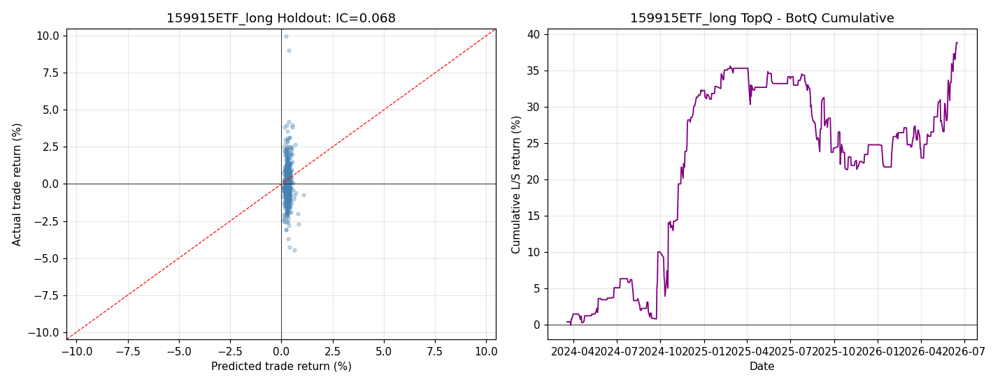


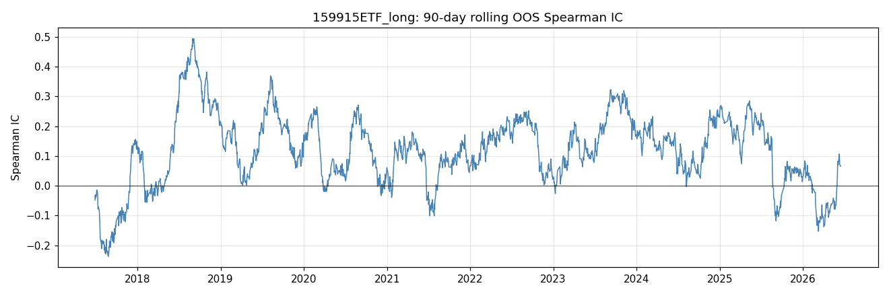


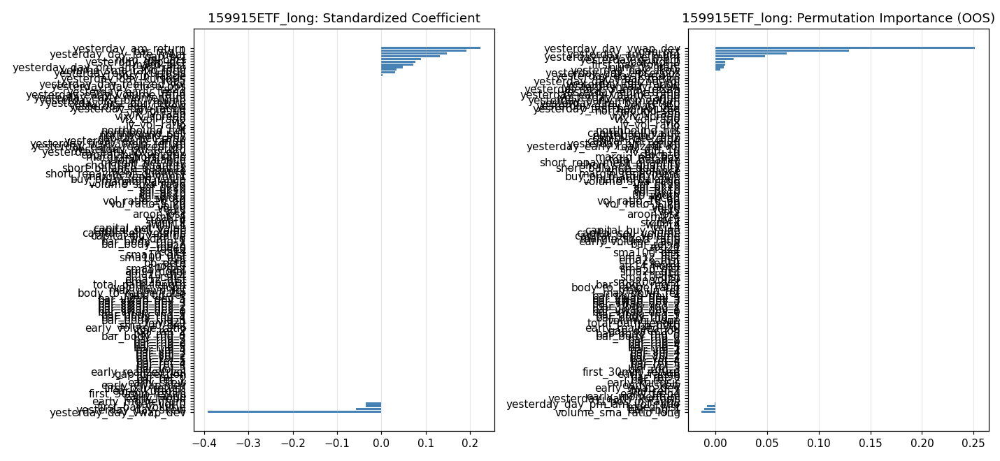


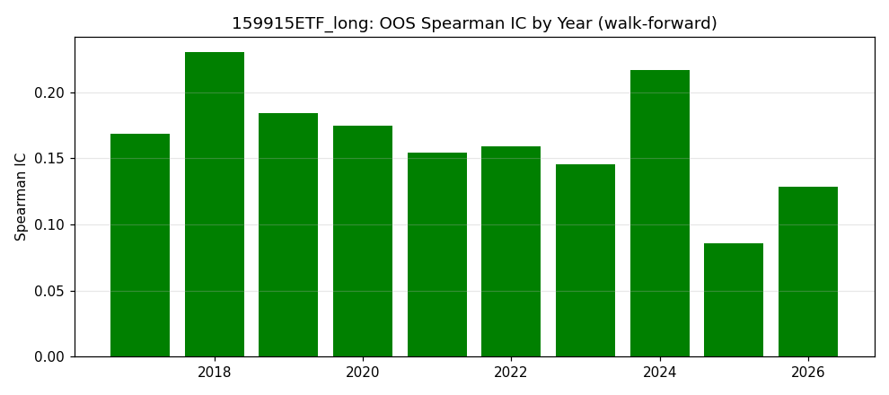


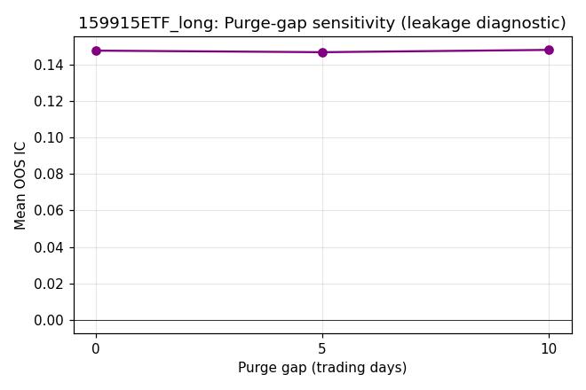


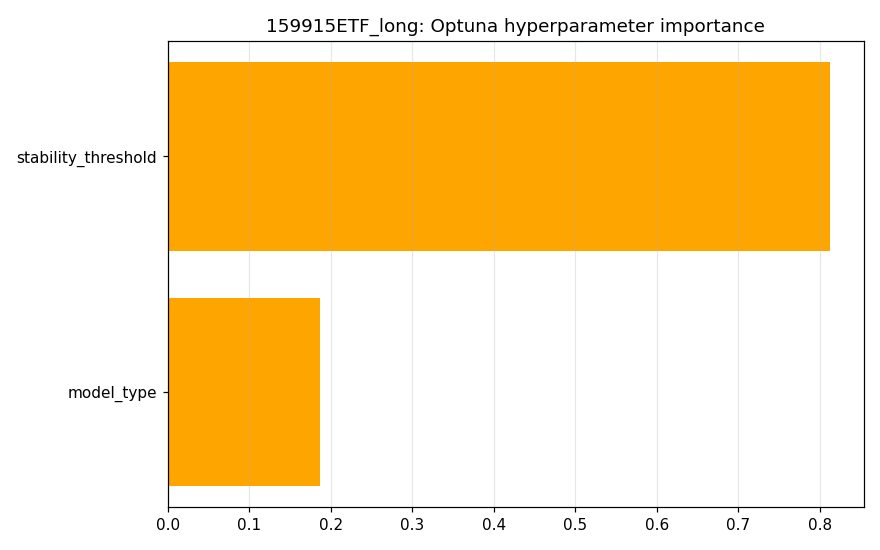


</details>

### 159915ETF_short

- **Selected Model**: LASSO
- **Tuned Stability Threshold**: 0.45
- **Samples**: 2722 (2015-04-07 → 2026-06-17)
- **Holdout**: 544 days (2024-03-19 → 2026-06-17)
- **Target stats**: mean=0.0195%, std=1.4037%, Sharpe=0.22
- **Selected features (6)**: `gap_pct, bar_body_rng_0, max_down_ret, bb_width, yesterday_gap_pct, yesterday_early_skew`

#### Feature Stability Scores (Block Bootstrap)

<details>
<summary><b>Click to expand Feature Stability Scores (Block Bootstrap) Table</b></summary>

| Feature | Stability Score | Status | Pearson $r$ | Spearman $\rho$ | Monotonicity Score | Mutual Info | Quality Rating | Holdout IC | Yearly ICs | Yearly IC Std |
|---------|-----------------|--------|-------------|-----------------|--------------------|-------------|----------------|------------|------------|---------------|
| bar_body_rng_0 | 72.0% | **Selected** | +0.1195 | +0.1201 | +1.00 | 0.0165 | *** Strong Monotonic | +0.0758 | 15:+0.26 16:+0.18 17:-0.05 18:+0.14 19:+0.19 20:+0.15 21:+0.14 22:+0.05 23:+0.15 24:+0.05 25:+0.15 26:-0.06 | 0.0924 |
| early_kurtosis | 61.2% | **Selected** | +0.0324 | +0.0439 | +0.30 | 0.0000 | * Non-Monotonic / Weak | +0.0481 | 15:+0.01 16:+0.14 17:+0.06 18:+0.17 19:-0.05 20:+0.00 21:+0.02 22:-0.00 23:+0.02 24:+0.06 25:-0.02 26:+0.14 | 0.0665 |
| max_down_ret | 59.6% | **Selected** | +0.0945 | +0.1007 | +0.60 | 0.0051 | ** Moderate Monotonic | +0.0828 | 15:+0.17 16:+0.11 17:+0.01 18:+0.07 19:+0.18 20:+0.12 21:+0.08 22:+0.10 23:+0.17 24:+0.08 25:+0.14 26:-0.09 | 0.0716 |
| gap_pct | 58.8% | **Selected** | +0.0430 | +0.0557 | +0.90 | 0.0292 | *** Strong Monotonic | +0.0786 | 15:+0.06 16:+0.01 17:-0.04 18:+0.02 19:+0.13 20:+0.05 21:+0.05 22:+0.06 23:+0.01 24:-0.01 25:+0.07 26:+0.14 | 0.0513 |
| bar_rng_1 | 56.8% | **Selected** | +0.0169 | +0.0028 | +0.50 | 0.0327 | * Non-Monotonic / Weak | -0.0045 | 15:-0.02 16:+0.01 17:-0.07 18:-0.06 19:+0.00 20:+0.03 21:+0.04 22:-0.04 23:+0.10 24:+0.00 25:-0.08 26:+0.00 | 0.0507 |
| yesterday_day_vwap_dev | 55.6% | **Selected** | -0.0754 | -0.0876 | -1.00 | 0.0099 | *** Strong Monotonic | -0.1132 | 15:-0.05 16:-0.13 17:-0.11 18:-0.14 19:-0.05 20:-0.20 21:+0.01 22:-0.02 23:-0.08 24:-0.05 25:-0.12 26:-0.21 | 0.0653 |
| bar_rng_2 | 55.2% | **Selected** | +0.0328 | +0.0075 | +1.00 | 0.0456 | *** Strong Monotonic | -0.0411 | 15:+0.05 16:+0.02 17:-0.03 18:+0.05 19:-0.04 20:-0.07 21:+0.07 22:-0.02 23:+0.09 24:+0.04 25:-0.06 26:-0.13 | 0.0644 |
| yesterday_day_realized_vol | 54.8% | **Selected** | +0.0319 | +0.0234 | +1.00 | 0.0747 | *** Strong Monotonic | +0.0101 | 15:+0.05 16:+0.06 17:+0.01 18:-0.06 19:-0.01 20:-0.08 21:+0.12 22:+0.04 23:-0.02 24:+0.07 25:-0.00 26:-0.06 | 0.0567 |
| bb_width | 50.8% | **Selected** | -0.0495 | -0.0509 | -0.90 | 0.0841 | *** Strong Monotonic | -0.0488 | 15:-0.05 16:-0.06 17:-0.14 18:-0.10 19:+0.03 20:+0.03 21:-0.04 22:-0.08 23:-0.13 24:-0.10 25:-0.04 26:-0.03 | 0.0509 |
| vol60 | 48.8% | **Selected** | +0.0287 | +0.0127 | +0.70 | 0.0335 | ** Moderate Monotonic | -0.0280 | 15:+0.03 16:+0.04 17:+0.10 18:-0.00 19:-0.10 20:-0.11 21:+0.05 22:+0.16 23:+0.09 24:+0.02 25:-0.04 26:-0.00 | 0.0753 |
| sma100_dist | 48.0% | **Selected** | -0.0700 | -0.0320 | -0.80 | 0.0358 | ** Moderate Monotonic | -0.0170 | 15:-0.18 16:-0.09 17:-0.08 18:-0.07 19:-0.06 20:-0.07 21:-0.02 22:-0.06 23:-0.13 24:-0.06 25:+0.02 26:-0.10 | 0.0487 |
| yesterday_early_momentum | 47.2% | **Selected** | +0.0886 | +0.0780 | +1.00 | 0.0000 | *** Strong Monotonic | +0.0713 | 15:+0.08 16:+0.11 17:-0.02 18:+0.14 19:+0.01 20:+0.18 21:-0.02 22:+0.14 23:+0.08 24:+0.01 25:+0.04 26:+0.17 | 0.0702 |
| yesterday_gap_pct | 46.4% | **Selected** | +0.0393 | +0.0355 | +0.60 | 0.0166 | ** Moderate Monotonic | +0.0505 | 15:+0.08 16:-0.11 17:+0.00 18:-0.02 19:+0.02 20:+0.01 21:+0.11 22:+0.01 23:+0.02 24:+0.09 25:+0.10 26:-0.03 | 0.0608 |
| yesterday_early_skew | 45.2% | **Selected** | +0.0064 | +0.0023 | +0.30 | 0.0100 | * Non-Monotonic / Weak | -0.0159 | 15:+0.07 16:-0.01 17:+0.00 18:-0.02 19:+0.11 20:-0.04 21:-0.04 22:-0.04 23:-0.01 24:+0.01 25:+0.02 26:-0.04 | 0.0451 |
| yesterday_early_range | 44.8% | Pruned | +0.0428 | +0.0128 | +0.60 | 0.0605 | ** Moderate Monotonic | +0.0088 | 15:-0.02 16:+0.07 17:-0.01 18:-0.04 19:+0.05 20:-0.06 21:+0.04 22:-0.07 23:+0.03 24:+0.01 25:+0.03 26:-0.03 | 0.0436 |
| body_to_range_ratio | 44.8% | Pruned | +0.0407 | +0.0615 | +0.90 | 0.0022 | ** Non-Linear Monotonic | +0.0582 | 15:+0.06 16:+0.07 17:+0.04 18:+0.19 19:+0.02 20:+0.03 21:+0.00 22:+0.06 23:+0.09 24:+0.03 25:+0.09 26:+0.04 | 0.0461 |
| bar_rng_3 | 42.4% | Pruned | +0.0632 | +0.0497 | +0.90 | 0.0303 | *** Strong Monotonic | +0.0291 | 15:+0.06 16:+0.12 17:+0.04 18:+0.07 19:-0.05 20:+0.06 21:-0.00 22:+0.16 23:+0.03 24:+0.14 25:+0.00 26:-0.12 | 0.0757 |
| yesterday_day_range | 38.8% | Pruned | +0.0264 | +0.0154 | +0.80 | 0.0645 | ** Moderate Monotonic | -0.0224 | 15:+0.01 16:+0.08 17:+0.02 18:+0.00 19:+0.09 20:-0.13 21:+0.06 22:-0.04 23:-0.01 24:-0.01 25:-0.02 26:-0.08 | 0.0610 |
| northbound_net | 38.0% | Pruned | +0.0306 | +0.0285 | +0.60 | 0.0000 | ** Moderate Monotonic | -0.0061 | 15:+0.01 16:+0.07 17:-0.08 18:+0.06 19:+0.13 20:+0.05 21:-0.00 22:+0.01 23:+0.08 24:-0.00 26:+nan | nan |
| yesterday_early_realized_vol | 36.8% | Pruned | +0.0581 | +0.0246 | +0.90 | 0.0524 | *** Strong Monotonic | +0.0563 | 15:+0.10 16:+0.11 17:-0.01 18:-0.05 19:+0.00 20:-0.05 21:+0.10 22:-0.04 23:-0.01 24:+0.06 25:+0.02 26:+0.02 | 0.0562 |
| bar_vwap_dev_2 | 36.4% | Pruned | +0.0238 | +0.0573 | +0.60 | 0.0027 | ** Moderate Monotonic | +0.0399 | 15:+0.01 16:+0.01 17:+0.03 18:+0.06 19:+0.12 20:+0.03 21:+0.01 22:+0.07 23:+0.12 24:+0.08 25:+0.08 26:-0.11 | 0.0602 |
| yesterday_first_bar_return | 36.4% | Pruned | -0.0230 | +0.0092 | -0.30 | 0.0000 | * Non-Monotonic / Weak | +0.0161 | 15:+0.03 16:-0.02 17:+0.01 18:-0.08 19:+0.03 20:-0.07 21:-0.02 22:+0.12 23:+0.10 24:+0.03 25:+0.03 26:-0.05 | 0.0583 |
| macd_hist | 35.2% | Pruned | +0.0138 | +0.0168 | +0.60 | 0.0195 | ** Moderate Monotonic | -0.0035 | 15:+0.09 16:-0.04 17:-0.05 18:-0.04 19:-0.00 20:+0.07 21:-0.01 22:-0.00 23:-0.01 24:-0.08 25:+0.06 26:-0.08 | 0.0529 |
| yesterday_early_vwap_dev | 35.2% | Pruned | +0.0958 | +0.0733 | +0.90 | 0.0020 | *** Strong Monotonic | +0.0806 | 15:+0.06 16:+0.11 17:-0.04 18:+0.14 19:+0.01 20:+0.12 21:-0.00 22:+0.16 23:+0.10 24:+0.00 25:+0.05 26:+0.22 | 0.0737 |
| bar_vwap_dev_1 | 35.2% | Pruned | +0.0451 | +0.0482 | +0.70 | 0.0067 | ** Moderate Monotonic | +0.0609 | 15:+0.03 16:+0.06 17:-0.01 18:-0.04 19:+0.09 20:-0.04 21:+0.08 22:+0.06 23:+0.19 24:+0.10 25:-0.01 26:+0.05 | 0.0629 |
| vol_gk20 | 35.2% | Pruned | +0.0287 | +0.0217 | +0.90 | 0.0872 | *** Strong Monotonic | +0.0167 | 15:-0.07 16:+0.07 17:+0.08 18:+0.09 19:-0.04 20:-0.12 21:+0.02 22:+0.12 23:+0.02 24:+0.04 25:+0.03 26:-0.00 | 0.0676 |
| bar_rng_4 | 34.0% | Pruned | +0.0271 | -0.0057 | +0.40 | 0.0698 | * Non-Monotonic / Weak | -0.0461 | 15:+0.00 16:+0.04 17:-0.01 18:+0.02 19:-0.03 20:-0.08 21:+0.03 22:-0.08 23:+0.09 24:+0.04 25:-0.06 26:-0.10 | 0.0584 |
| bar_ret_4 | 33.6% | Pruned | +0.0207 | +0.0005 | +0.40 | 0.0505 | * Non-Monotonic / Weak | -0.0030 | 15:-0.07 16:+0.06 17:-0.02 18:-0.04 19:+0.03 20:-0.00 21:+0.01 22:-0.00 23:+0.05 24:+0.02 25:+0.05 26:-0.10 | 0.0465 |
| yesterday_day_skew | 33.6% | Pruned | +0.0079 | +0.0154 | +0.40 | 0.0000 | * Non-Monotonic / Weak | +0.0728 | 15:+0.03 16:+0.00 17:-0.04 18:-0.01 19:-0.02 20:+0.07 21:+0.03 22:+0.05 23:-0.00 24:+0.07 25:+0.02 26:+0.21 | 0.0623 |
| bar_ret_0 | 33.2% | Pruned | +0.1479 | +0.1224 | +1.00 | 0.0004 | *** Strong Monotonic | +0.0588 | 15:+0.25 16:+0.19 17:-0.01 18:+0.13 19:+0.19 20:+0.13 21:+0.15 22:+0.07 23:+0.15 24:+0.06 25:+0.12 26:-0.05 | 0.0822 |
| first_bar_return | 32.4% | Pruned | +0.1479 | +0.1224 | +1.00 | 0.0006 | *** Strong Monotonic | +0.0588 | 15:+0.25 16:+0.19 17:-0.01 18:+0.13 19:+0.19 20:+0.13 21:+0.15 22:+0.07 23:+0.15 24:+0.06 25:+0.12 26:-0.05 | 0.0822 |
| yesterday_day_kurtosis | 32.4% | Pruned | -0.0088 | -0.0471 | -0.90 | 0.0000 | ** Non-Linear Monotonic | +0.0001 | 15:-0.07 16:-0.01 17:-0.11 18:-0.11 19:-0.05 20:+0.04 21:-0.06 22:+0.00 23:-0.14 24:-0.07 25:-0.04 26:+0.08 | 0.0612 |
| yesterday_early_kurtosis | 30.8% | Pruned | -0.0209 | -0.0211 | -0.90 | 0.0001 | *** Strong Monotonic | -0.0660 | 15:-0.07 16:+0.02 17:+0.07 18:+0.01 19:-0.07 20:+0.01 21:+0.08 22:-0.09 23:-0.03 24:-0.02 25:-0.09 26:-0.13 | 0.0632 |
| yesterday_day_pm_am_vol_ratio | 30.8% | Pruned | +0.0093 | +0.0034 | +0.20 | 0.0000 | * Non-Monotonic / Weak | -0.0554 | 15:-0.13 16:+0.00 17:+0.11 18:+0.17 19:+0.00 20:-0.03 21:+0.01 22:+0.02 23:+0.07 24:+0.03 25:-0.12 26:-0.03 | 0.0801 |
| early_skew | 30.0% | Pruned | +0.0352 | +0.0338 | +0.90 | 0.0065 | *** Strong Monotonic | +0.0628 | 15:+0.02 16:+0.01 17:+0.05 18:+0.02 19:+0.06 20:+0.03 21:-0.04 22:+0.07 23:+0.04 24:-0.02 25:+0.12 26:+0.11 | 0.0444 |
| vol5 | 30.0% | Pruned | +0.0497 | +0.0222 | +0.70 | 0.0431 | ** Moderate Monotonic | +0.0271 | 15:+0.07 16:+0.00 17:+0.11 18:+0.03 19:-0.05 20:-0.10 21:+0.10 22:+0.10 23:+0.06 24:-0.07 25:+0.04 26:+0.10 | 0.0691 |
| vol_ratio_10_60 | 30.0% | Pruned | +0.0447 | +0.0142 | +0.70 | 0.0184 | ** Moderate Monotonic | +0.0340 | 15:+0.01 16:+0.04 17:+0.05 18:+0.08 19:-0.01 20:-0.05 21:+0.03 22:-0.06 23:+0.03 24:-0.04 25:+0.09 26:+0.00 | 0.0458 |
| num_up_bars | 29.2% | Pruned | +0.0580 | +0.0620 | +1.00 | 0.0147 | *** Strong Monotonic | +0.0433 | 15:+0.09 16:+0.11 17:-0.04 18:+0.01 19:+0.15 20:+0.03 21:+0.02 22:+0.07 23:+0.11 24:+0.09 25:+0.08 26:-0.12 | 0.0717 |
| bar_vwap_dev_0 | 28.8% | Pruned | +0.0038 | -0.0049 | N/A | 0.0000 | N/A | N/A | N/A | N/A |
| roc10 | 28.4% | Pruned | -0.0266 | +0.0101 | -0.10 | 0.0326 | * Non-Monotonic / Weak | -0.0090 | 15:+0.02 16:-0.10 17:-0.09 18:-0.08 19:+0.01 20:+0.05 21:-0.02 22:+0.03 23:+0.00 24:-0.07 25:+0.07 26:-0.12 | 0.0624 |
| yesterday_pm_return | 28.0% | Pruned | -0.0554 | -0.0778 | -0.90 | 0.0361 | *** Strong Monotonic | -0.1062 | 15:-0.09 16:-0.09 17:-0.07 18:-0.11 19:-0.03 20:-0.17 21:+0.01 22:-0.04 23:-0.08 24:-0.06 25:-0.08 26:-0.21 | 0.0566 |
| bar_vol_1 | 26.4% | Pruned | +0.0296 | +0.0013 | +0.10 | 0.0000 | * Non-Monotonic / Weak | +0.0011 | 15:+0.02 16:+0.00 17:-0.10 18:-0.00 19:+0.01 20:+0.17 21:-0.04 22:-0.04 23:+0.03 24:-0.06 25:-0.06 26:+0.13 | 0.0740 |
| bar_vol_4 | 25.6% | Pruned | +0.0613 | +0.0322 | +0.90 | 0.0000 | *** Strong Monotonic | +0.0116 | 15:+0.02 16:-0.00 17:-0.05 18:+0.09 19:+0.05 20:+0.14 21:+0.01 22:+0.01 23:+0.06 24:-0.04 25:-0.04 26:+0.16 | 0.0667 |
| volume_sma_ratio | 25.6% | Pruned | +0.0278 | +0.0099 | +0.30 | 0.0000 | * Non-Monotonic / Weak | -0.0133 | 15:+0.07 16:-0.10 17:-0.09 18:-0.00 19:+0.03 20:+0.07 21:+0.00 22:+0.06 23:+0.02 24:-0.02 25:-0.04 26:+0.07 | 0.0569 |
| margin_short_ratio | 25.6% | Pruned | -0.0054 | +0.0045 | +0.20 | 0.0571 | * Non-Monotonic / Weak | +0.0126 | 17:+0.06 18:-0.00 19:-0.04 20:-0.06 21:+0.12 22:+0.04 23:-0.00 24:+0.04 25:+0.01 26:+0.08 | 0.0515 |
| bar_rng_0 | 25.2% | Pruned | +0.0238 | +0.0350 | +0.70 | 0.0604 | ** Moderate Monotonic | +0.0378 | 15:-0.07 16:+0.15 17:+0.01 18:+0.05 19:-0.09 20:+0.06 21:+0.00 22:+0.03 23:+0.03 24:+0.06 25:+0.02 26:+0.11 | 0.0637 |
| yesterday_am_return | 24.8% | Pruned | +0.0274 | +0.0274 | +0.40 | 0.0411 | * Non-Monotonic / Weak | -0.0192 | 15:+0.08 16:+0.02 17:-0.07 18:-0.10 19:+0.05 20:+0.02 21:+0.02 22:+0.18 23:+0.12 24:-0.03 25:-0.02 26:-0.05 | 0.0775 |
| capital_net_value | 24.0% | Pruned | -0.0380 | -0.0463 | -1.00 | 0.0125 | *** Strong Monotonic | -0.0571 | 15:+nan 16:+nan 17:-0.02 18:-0.00 19:-0.08 20:-0.14 21:-0.05 22:-0.12 23:-0.01 24:-0.07 25:-0.05 26:+0.01 | nan |
| vol_ratio_5_20 | 23.6% | Pruned | +0.0109 | +0.0004 | +0.30 | 0.0000 | * Non-Monotonic / Weak | +0.0092 | 15:+0.07 16:-0.07 17:+0.06 18:-0.02 19:-0.01 20:-0.06 21:+0.06 22:+0.04 23:+0.04 24:-0.14 25:+0.04 26:+0.06 | 0.0632 |
| yesterday_day_late_mom | 22.8% | Pruned | +0.0060 | -0.0198 | -0.40 | 0.0185 | * Non-Monotonic / Weak | -0.0168 | 15:+0.03 16:-0.01 17:+0.00 18:+0.04 19:-0.01 20:-0.05 21:-0.06 22:-0.01 23:-0.14 24:-0.01 25:+0.01 26:-0.13 | 0.0546 |
| sma50_dist | 22.0% | Pruned | -0.0123 | +0.0073 | +0.30 | 0.0610 | * Non-Monotonic / Weak | -0.0070 | 15:+0.03 16:-0.09 17:-0.06 18:-0.08 19:+0.01 20:-0.01 21:+0.03 22:+0.03 23:-0.13 24:-0.02 25:+0.02 26:-0.10 | 0.0559 |
| cl_pos_in_range | 21.2% | Pruned | +0.0522 | +0.0577 | +0.70 | 0.0181 | ** Moderate Monotonic | +0.0559 | 15:+0.05 16:+0.03 17:+0.05 18:-0.03 19:+0.08 20:+0.04 21:+0.09 22:+0.05 23:+0.11 24:+0.07 25:+0.14 26:-0.15 | 0.0726 |
| yesterday_early_volume_ratio | 21.2% | Pruned | +0.0298 | +0.0049 | +0.30 | 0.0000 | * Non-Monotonic / Weak | +0.0280 | 15:+0.06 16:-0.06 17:-0.08 18:-0.03 19:+0.05 20:+0.07 21:-0.05 22:+0.04 23:-0.04 24:-0.02 25:+0.01 26:+0.09 | 0.0549 |
| bar_body_rng_3 | 20.4% | Pruned | +0.0008 | +0.0074 | +0.10 | 0.0000 | * Non-Monotonic / Weak | +0.0134 | 15:+0.02 16:+0.02 17:-0.04 18:-0.08 19:+0.01 20:+0.01 21:-0.01 22:+0.08 23:+0.04 24:+0.01 25:-0.00 26:-0.03 | 0.0385 |
| bar_body_rng_1 | 18.4% | Pruned | +0.0294 | +0.0398 | +0.50 | 0.0000 | * Non-Monotonic / Weak | +0.0514 | 15:+0.02 16:+0.06 17:+0.00 18:-0.02 19:+0.07 20:-0.05 21:+0.05 22:+0.07 23:+0.17 24:+0.06 25:+0.01 26:+0.06 | 0.0524 |
| yesterday_first_bar_volume | 18.0% | Pruned | +0.0281 | -0.0062 | +0.40 | 0.0000 | * Non-Monotonic / Weak | +0.0319 | 15:+0.03 16:-0.03 17:-0.07 18:-0.02 19:+0.04 20:+0.02 21:-0.07 22:+0.02 23:-0.01 24:-0.03 25:-0.00 26:+0.16 | 0.0598 |
| roc5 | 17.6% | Pruned | -0.0315 | -0.0080 | -0.10 | 0.0072 | * Non-Monotonic / Weak | -0.0060 | 15:-0.01 16:-0.06 17:-0.12 18:-0.03 19:-0.05 20:+0.04 21:-0.04 22:+0.03 23:-0.02 24:-0.06 25:+0.00 26:-0.07 | 0.0422 |
| iv_vol_ratio | 17.2% | Pruned | -0.0421 | -0.0281 | -0.70 | 0.0491 | ** Moderate Monotonic | -0.0297 | 15:+0.01 16:-0.06 17:-0.11 18:-0.10 19:+0.07 20:+0.09 21:-0.04 22:-0.05 23:-0.03 24:-0.02 25:-0.05 26:-0.06 | 0.0583 |
| bar_ret_3 | 17.2% | Pruned | -0.0024 | +0.0118 | +0.00 | 0.0134 | * Non-Monotonic / Weak | +0.0176 | 15:+0.04 16:+0.01 17:-0.01 18:-0.11 19:-0.01 20:+0.02 21:+0.02 22:+0.11 23:+0.03 24:+0.02 25:+0.01 26:-0.04 | 0.0497 |
| volume_sma_ratio_long | 17.2% | Pruned | +0.0167 | +0.0140 | +0.60 | 0.0000 | ** Moderate Monotonic | +0.0228 | 15:+0.03 16:-0.08 17:-0.04 18:-0.02 19:+0.06 20:+0.02 21:-0.03 22:+0.12 23:-0.08 24:-0.01 25:+0.07 26:-0.03 | 0.0585 |
| atr14_norm | 16.4% | Pruned | +0.0368 | +0.0206 | +0.80 | 0.0720 | ** Moderate Monotonic | +0.0033 | 15:-0.03 16:+0.06 17:+0.10 18:+0.12 19:-0.05 20:-0.12 21:+0.05 22:+0.13 23:+0.10 24:+0.05 25:+0.00 26:-0.02 | 0.0742 |
| sma200_dist | 15.6% | Pruned | -0.0319 | -0.0086 | -0.50 | 0.0819 | * Non-Monotonic / Weak | -0.0165 | 15:-0.06 16:-0.13 17:-0.10 18:-0.07 19:-0.13 20:-0.09 21:-0.02 22:-0.13 23:-0.11 24:-0.08 25:-0.03 26:-0.12 | 0.0361 |
| capital_net_ratio | 15.6% | Pruned | -0.0454 | -0.0545 | -0.80 | 0.0236 | ** Moderate Monotonic | -0.0486 | 17:-0.03 18:-0.02 19:-0.06 20:-0.11 21:-0.07 22:-0.14 23:-0.01 24:-0.06 25:-0.05 26:+0.01 | 0.0422 |
| bar_vol_2 | 15.2% | Pruned | +0.0310 | +0.0070 | +0.30 | 0.0027 | * Non-Monotonic / Weak | +0.0183 | 15:+0.03 16:-0.06 17:-0.11 18:+0.01 19:+0.04 20:+0.11 21:-0.03 22:-0.06 23:+0.07 24:-0.03 25:-0.02 26:+0.14 | 0.0711 |
| roc20 | 15.2% | Pruned | +0.0114 | +0.0205 | +0.10 | 0.0372 | * Non-Monotonic / Weak | -0.0127 | 15:+0.09 16:-0.12 17:-0.05 18:-0.04 19:+0.02 20:+0.05 21:+0.06 22:+0.02 23:-0.09 24:-0.06 25:+0.03 26:-0.08 | 0.0638 |
| bar_body_rng_2 | 14.8% | Pruned | +0.0115 | +0.0206 | +0.50 | 0.0000 | * Non-Monotonic / Weak | +0.0074 | 15:-0.01 16:-0.10 17:+0.04 18:+0.06 19:+0.07 20:+0.07 21:-0.06 22:+0.05 23:+0.00 24:+0.02 25:+0.09 26:-0.16 | 0.0720 |
| first_bar_volume | 14.4% | Pruned | +0.0391 | -0.0102 | +0.20 | 0.0146 | * Non-Monotonic / Weak | -0.0017 | 15:+0.02 16:-0.03 17:-0.08 18:-0.03 19:-0.03 20:+0.12 21:-0.10 22:-0.00 23:+0.05 24:-0.00 25:-0.09 26:+0.13 | 0.0709 |
| margin_net_buy | 14.4% | Pruned | -0.0421 | -0.0321 | -0.90 | 0.0155 | *** Strong Monotonic | +0.0267 | 15:+nan 16:+nan 17:-0.04 18:+0.07 19:+0.02 20:-0.09 21:-0.04 22:-0.15 23:-0.15 24:-0.07 25:+0.01 26:+0.16 | nan |
| bar_vol_0 | 13.6% | Pruned | +0.0391 | -0.0102 | +0.20 | 0.0146 | * Non-Monotonic / Weak | -0.0017 | 15:+0.02 16:-0.03 17:-0.08 18:-0.03 19:-0.03 20:+0.12 21:-0.10 22:-0.00 23:+0.05 24:-0.00 25:-0.09 26:+0.13 | 0.0709 |
| total_balance | 13.6% | Pruned | +0.0102 | -0.0031 | +0.30 | 0.0376 | * Non-Monotonic / Weak | -0.0080 | 16:+nan 17:+0.06 18:-0.00 19:-0.04 20:-0.09 21:+0.09 22:+0.09 23:+0.07 24:+0.00 25:-0.08 26:+0.11 | nan |
| vol_pk20 | 13.6% | Pruned | +0.0330 | +0.0234 | +0.90 | 0.0627 | *** Strong Monotonic | +0.0148 | 15:-0.07 16:+0.07 17:+0.09 18:+0.09 19:-0.04 20:-0.12 21:+0.04 22:+0.13 23:+0.03 24:+0.01 25:+0.04 26:+0.00 | 0.0703 |
| max_up_ret | 13.2% | Pruned | +0.1375 | +0.1224 | +0.90 | 0.0174 | *** Strong Monotonic | +0.0734 | 15:+0.20 16:+0.13 17:+0.01 18:+0.09 19:+0.16 20:+0.14 21:+0.17 22:+0.12 23:+0.19 24:+0.06 25:+0.15 26:-0.12 | 0.0866 |
| bb_pctb | 13.2% | Pruned | -0.0035 | -0.0055 | +0.30 | 0.0000 | * Non-Monotonic / Weak | +0.0065 | 15:-0.05 16:+0.09 17:+0.07 18:+0.06 19:+0.03 20:-0.02 21:-0.00 22:-0.05 23:+0.02 24:+0.07 25:-0.06 26:+0.11 | 0.0561 |
| short_repayment_quantity | 12.8% | Pruned | +0.0047 | -0.0170 | -0.40 | 0.0564 | * Non-Monotonic / Weak | -0.0514 | 15:+nan 16:+nan 17:+0.02 20:-0.07 21:-0.01 22:+0.11 23:+0.00 24:-0.09 25:+0.01 26:-0.02 | nan |
| yesterday_day_close_pos | 12.8% | Pruned | -0.0592 | -0.0639 | -0.80 | 0.0245 | ** Moderate Monotonic | -0.0772 | 15:-0.03 16:-0.10 17:-0.09 18:-0.07 19:-0.04 20:-0.18 21:+0.01 22:-0.01 23:-0.08 24:-0.01 25:-0.10 26:-0.18 | 0.0585 |
| volume_slope | 12.4% | Pruned | -0.0218 | +0.0218 | +0.10 | 0.0101 | * Non-Monotonic / Weak | -0.0020 | 15:+0.01 16:-0.00 17:+0.05 18:+0.07 19:+0.04 20:-0.08 21:+0.14 22:+0.02 23:-0.04 24:+0.01 25:+0.08 26:-0.10 | 0.0645 |
| vix_vol_ratio | 12.0% | Pruned | -0.0405 | -0.0221 | -0.70 | 0.0566 | ** Moderate Monotonic | -0.0216 | 15:+0.01 16:-0.06 17:-0.11 18:-0.10 19:+0.07 20:+0.09 21:-0.04 22:-0.06 23:-0.02 24:+0.00 25:-0.03 26:-0.10 | 0.0621 |
| aroon_osc | 11.6% | Pruned | +0.0013 | +0.0108 | +0.30 | 0.0356 | * Non-Monotonic / Weak | +0.0054 | 15:+0.10 16:-0.06 17:+0.01 18:-0.10 19:-0.04 20:+0.07 21:-0.06 22:-0.03 23:-0.01 24:-0.08 25:+0.08 26:-0.10 | 0.0666 |
| first_30min_return | 11.2% | Pruned | +0.1124 | +0.0958 | +0.70 | 0.0145 | ** Moderate Monotonic | +0.0808 | 15:+0.12 16:+0.06 17:+0.04 18:+0.02 19:+0.15 20:+0.08 21:+0.14 22:+0.09 23:+0.16 24:+0.08 25:+0.19 26:-0.16 | 0.0856 |
| early_range | 11.2% | Pruned | +0.0324 | +0.0477 | +1.00 | 0.0531 | *** Strong Monotonic | +0.0247 | 15:+0.00 16:+0.11 17:+0.01 18:+0.09 19:+0.00 20:+0.05 21:+0.03 22:+0.05 23:+0.10 24:-0.01 25:+0.05 26:-0.03 | 0.0430 |
| bar_ret_1 | 11.2% | Pruned | +0.0410 | +0.0446 | +0.70 | 0.0160 | ** Moderate Monotonic | +0.0537 | 15:+0.02 16:+0.06 17:-0.01 18:-0.05 19:+0.09 20:-0.05 21:+0.07 22:+0.07 23:+0.18 24:+0.08 25:-0.01 26:+0.06 | 0.0620 |
| northbound_buy | 11.2% | Pruned | -0.0154 | -0.0230 | -0.70 | 0.0008 | ** Moderate Monotonic | -0.0601 | 15:-0.01 16:-0.01 17:+0.01 18:+0.03 19:-0.02 20:-0.02 21:-0.09 22:-0.01 23:+0.02 24:+0.04 25:+nan 26:+nan | nan |
| bar_ret_2 | 10.8% | Pruned | -0.0017 | +0.0271 | +0.10 | 0.0111 | * Non-Monotonic / Weak | +0.0127 | 15:-0.01 16:-0.06 17:+0.05 18:+0.08 19:+0.05 20:+0.05 21:-0.06 22:+0.06 23:-0.00 24:+0.03 25:+0.12 26:-0.17 | 0.0761 |
| roc60 | 10.8% | Pruned | -0.0270 | -0.0147 | -0.70 | 0.0333 | ** Moderate Monotonic | -0.0036 | 15:-0.02 16:-0.05 17:-0.06 18:-0.06 19:-0.07 20:-0.05 21:-0.03 22:-0.04 23:-0.05 24:-0.04 25:+0.03 26:-0.16 | 0.0403 |
| buy_on_margin_value | 10.8% | Pruned | -0.0070 | -0.0175 | -0.20 | 0.0498 | * Non-Monotonic / Weak | -0.0091 | 15:+nan 16:+nan 17:+0.06 18:-0.03 19:+0.06 20:-0.13 21:+0.11 22:-0.02 23:-0.09 24:-0.07 25:-0.01 26:+0.03 | nan |
| early_realized_vol | 10.4% | Pruned | +0.0392 | +0.0275 | +0.60 | 0.0385 | ** Moderate Monotonic | +0.0278 | 15:-0.01 16:+0.11 17:+0.02 18:+0.05 19:-0.07 20:+0.06 21:-0.02 22:+0.02 23:-0.01 24:+0.01 25:+0.03 26:-0.02 | 0.0449 |
| margin_repayment | 10.0% | Pruned | +0.0110 | -0.0040 | +0.40 | 0.0708 | * Non-Monotonic / Weak | -0.0398 | 17:+0.09 18:-0.08 19:+0.03 20:-0.04 21:+0.14 22:+0.09 23:+0.05 24:-0.06 25:-0.02 26:-0.12 | 0.0793 |
| bar_body_rng_4 | 9.6% | Pruned | +0.0127 | +0.0085 | +0.00 | 0.0116 | * Non-Monotonic / Weak | +0.0128 | 15:-0.07 16:+0.06 17:-0.03 18:-0.03 19:+0.03 20:+0.01 21:+0.03 22:-0.03 23:+0.04 24:+0.01 25:+0.07 26:-0.09 | 0.0488 |
| rsi21 | 9.2% | Pruned | -0.0075 | +0.0027 | -0.10 | 0.0000 | * Non-Monotonic / Weak | -0.0038 | 15:+0.04 16:-0.09 17:-0.06 18:-0.08 19:-0.00 20:+0.01 21:+0.01 22:+0.05 23:-0.10 24:-0.04 25:+0.04 26:-0.11 | 0.0555 |
| early_vwap_dev | 8.8% | Pruned | +0.0235 | +0.0322 | +0.30 | 0.0173 | * Non-Monotonic / Weak | +0.0405 | 15:-0.01 16:+0.01 17:+0.04 18:-0.07 19:+0.07 20:+0.03 21:+0.03 22:+0.06 23:+0.08 24:+0.05 25:+0.12 26:-0.16 | 0.0717 |
| mfi14 | 8.8% | Pruned | +0.0037 | +0.0084 | +0.10 | 0.0000 | * Non-Monotonic / Weak | -0.0030 | 15:+0.03 16:-0.07 17:-0.01 18:-0.07 19:+0.03 20:+0.07 21:+0.02 22:+0.03 23:-0.08 24:-0.06 25:+0.07 26:-0.04 | 0.0533 |
| margin_balance | 8.8% | Pruned | +0.0102 | -0.0051 | +0.30 | 0.0391 | * Non-Monotonic / Weak | -0.0085 | 15:+nan 16:+nan 17:+0.06 18:-0.00 19:-0.04 20:-0.11 21:+0.10 22:+0.07 23:+0.07 24:+0.01 25:-0.08 26:+0.11 | nan |
| yesterday_early_trend | 8.8% | Pruned | +0.0774 | +0.0709 | +1.00 | 0.0000 | *** Strong Monotonic | +0.0779 | 15:+0.06 16:+0.09 17:-0.02 18:+0.14 19:+0.01 20:+0.14 21:-0.02 22:+0.12 23:+0.06 24:+0.02 25:+0.05 26:+0.19 | 0.0633 |
| bar_vol_3 | 8.4% | Pruned | +0.0473 | +0.0151 | +0.10 | 0.0161 | * Non-Monotonic / Weak | +0.0098 | 15:+0.04 16:-0.04 17:-0.12 18:+0.04 19:+0.02 20:+0.14 21:+0.01 22:+0.00 23:+0.04 24:-0.06 25:-0.02 26:+0.11 | 0.0683 |
| northbound_sell | 8.4% | Pruned | -0.0208 | -0.0267 | -0.90 | 0.0146 | *** Strong Monotonic | -0.0590 | 15:-0.06 16:-0.12 17:+0.06 18:-0.05 19:-0.09 20:-0.03 21:-0.07 22:-0.02 23:-0.01 24:+0.05 25:+nan 26:+nan | nan |
| short_balance | 8.0% | Pruned | -0.0021 | +0.0003 | -0.20 | 0.0742 | * Non-Monotonic / Weak | -0.0312 | 15:+nan 17:+0.02 19:-0.02 20:+0.02 21:-0.08 22:+0.00 23:+0.11 24:-0.08 25:-0.05 26:-0.07 | nan |
| stoch_d | 7.6% | Pruned | -0.0111 | +0.0020 | -0.60 | 0.0000 | ** Moderate Monotonic | +0.0096 | 15:+0.06 16:-0.07 17:-0.06 18:-0.05 19:-0.02 20:+0.06 21:-0.07 22:-0.02 23:-0.09 24:-0.05 25:+0.07 26:-0.07 | 0.0564 |
| capital_buy_volume | 7.6% | Pruned | +0.0035 | +0.0010 | +0.70 | 0.0390 | ** Moderate Monotonic | -0.0441 | 15:+nan 16:+nan 17:+0.03 18:-0.04 19:+0.02 20:-0.09 21:+0.13 22:+0.08 23:+0.02 24:-0.01 25:-0.06 26:-0.16 | nan |
| stoch_k | 7.2% | Pruned | -0.0079 | +0.0060 | +0.00 | 0.0037 | * Non-Monotonic / Weak | +0.0086 | 15:+0.04 16:-0.09 17:-0.05 18:-0.04 19:-0.03 20:+0.06 21:-0.05 22:+0.02 23:-0.07 24:-0.06 25:+0.05 26:-0.06 | 0.0489 |
| cci14 | 7.2% | Pruned | +0.0420 | +0.0303 | +0.90 | 0.0347 | *** Strong Monotonic | +0.0193 | 15:-0.05 16:+0.05 17:+0.11 18:+0.08 19:+0.04 20:-0.09 21:-0.04 22:+0.05 23:+0.16 24:+0.02 25:+0.06 26:-0.01 | 0.0678 |
| short_sell_quantity | 7.2% | Pruned | -0.0023 | -0.0149 | +0.00 | 0.0761 | * Non-Monotonic / Weak | -0.0096 | 17:+0.02 19:-0.02 20:-0.10 21:-0.05 22:+0.15 23:+0.06 24:-0.04 25:+0.05 26:+0.04 | 0.0688 |
| vol_gk10 | 6.8% | Pruned | +0.0454 | +0.0345 | +0.90 | 0.0661 | *** Strong Monotonic | +0.0142 | 15:-0.02 16:+0.08 17:+0.11 18:+0.09 19:-0.01 20:-0.10 21:+0.08 22:+0.11 23:+0.06 24:+0.04 25:+0.03 26:-0.12 | 0.0755 |
| bar_vwap_dev_4 | 6.0% | Pruned | +0.0235 | +0.0322 | +0.30 | 0.0173 | * Non-Monotonic / Weak | +0.0405 | 15:-0.01 16:+0.01 17:+0.04 18:-0.07 19:+0.07 20:+0.03 21:+0.03 22:+0.06 23:+0.08 24:+0.05 25:+0.12 26:-0.16 | 0.0717 |
| total_path_length | 6.0% | Pruned | +0.0543 | +0.0379 | +0.70 | 0.0450 | ** Moderate Monotonic | +0.0185 | 15:+0.02 16:+0.10 17:-0.00 18:+0.09 19:-0.06 20:+0.07 21:+0.00 22:+0.05 23:+0.06 24:+0.01 25:-0.00 26:-0.04 | 0.0488 |
| willr14 | 5.6% | Pruned | -0.0082 | +0.0015 | -0.20 | 0.0000 | * Non-Monotonic / Weak | -0.0144 | 15:+0.03 16:-0.08 17:-0.08 18:-0.05 19:-0.03 20:+0.01 21:-0.03 22:+0.06 23:-0.02 24:-0.06 25:+0.02 26:-0.11 | 0.0481 |
| rsi5 | 5.2% | Pruned | -0.0128 | -0.0064 | -0.30 | 0.0000 | * Non-Monotonic / Weak | -0.0122 | 15:-0.01 16:-0.10 17:-0.10 18:-0.04 19:-0.03 20:+0.03 21:-0.00 22:+0.05 23:-0.02 24:-0.08 25:+0.03 26:-0.09 | 0.0504 |
| bar_vwap_dev_3 | 4.8% | Pruned | +0.0145 | +0.0474 | +0.90 | 0.0074 | ** Non-Linear Monotonic | +0.0340 | 15:+0.03 16:-0.00 17:+0.03 18:-0.03 19:+0.03 20:+0.05 21:+0.03 22:+0.15 23:+0.11 24:+0.06 25:+0.08 26:-0.14 | 0.0683 |
| vol10 | 4.8% | Pruned | +0.0559 | +0.0261 | +0.80 | 0.0375 | ** Moderate Monotonic | +0.0121 | 15:-0.02 16:+0.05 17:+0.09 18:+0.08 19:-0.06 20:-0.09 21:+0.08 22:+0.05 23:+0.09 24:-0.01 25:+0.04 26:-0.01 | 0.0593 |
| short_balance_quantity | 4.4% | Pruned | +0.0051 | +0.0005 | +0.00 | 0.0425 | * Non-Monotonic / Weak | -0.0293 | 16:+nan 17:+0.02 19:-0.02 20:+0.04 21:-0.03 22:+0.06 23:+0.11 24:-0.06 25:-0.04 26:-0.03 | nan |
| yesterday_first_30min_return | 4.4% | Pruned | +0.0567 | +0.0668 | +0.90 | 0.0121 | *** Strong Monotonic | +0.0877 | 15:+0.06 16:+0.08 17:-0.01 18:+0.08 19:+0.05 20:+0.09 21:-0.04 22:+0.16 23:+0.12 24:+0.02 25:+0.07 26:+0.15 | 0.0571 |
| capital_sell_volume | 4.0% | Pruned | +0.0151 | +0.0152 | +0.80 | 0.0339 | ** Moderate Monotonic | -0.0246 | 16:+nan 17:+0.03 18:-0.02 19:+0.03 20:-0.10 21:+0.15 22:+0.13 23:+0.04 24:+0.01 25:-0.04 26:-0.14 | nan |
| capital_sell_value | 4.0% | Pruned | +0.0051 | +0.0134 | +0.40 | 0.0392 | * Non-Monotonic / Weak | -0.0071 | 15:+nan 16:+nan 17:+0.03 18:-0.04 19:+0.02 20:-0.12 21:+0.13 22:+0.11 23:+0.02 24:-0.00 25:-0.03 26:-0.16 | nan |
| early_momentum | 4.0% | Pruned | +0.0336 | +0.0408 | +0.30 | 0.0275 | * Non-Monotonic / Weak | +0.0513 | 15:+0.03 16:-0.01 17:+0.02 18:-0.05 19:+0.10 20:+0.01 21:+0.02 22:+0.08 23:+0.12 24:+0.09 25:+0.12 26:-0.17 | 0.0796 |
| capital_buy_value | 4.0% | Pruned | -0.0064 | +0.0023 | +0.40 | 0.0653 | * Non-Monotonic / Weak | -0.0223 | 16:+nan 17:+0.03 18:-0.06 19:+0.02 20:-0.13 21:+0.11 22:+0.05 23:-0.00 24:-0.01 25:-0.05 26:-0.16 | nan |
| vol20 | 2.8% | Pruned | +0.0529 | +0.0262 | +1.00 | 0.0611 | *** Strong Monotonic | +0.0274 | 15:-0.01 16:+0.06 17:+0.11 18:+0.10 19:-0.07 20:-0.09 21:+0.04 22:+0.08 23:+0.03 24:+0.05 25:+0.02 26:+0.05 | 0.0594 |
| sma20_dist | 2.4% | Pruned | -0.0090 | +0.0121 | +0.10 | 0.0515 | * Non-Monotonic / Weak | -0.0072 | 15:+0.06 16:-0.08 17:-0.08 18:-0.07 19:-0.01 20:+0.03 21:+0.04 22:+0.03 23:-0.07 24:-0.07 25:+0.04 26:-0.08 | 0.0560 |
| sma10_dist | 2.0% | Pruned | -0.0303 | -0.0040 | -0.50 | 0.0268 | * Non-Monotonic / Weak | -0.0126 | 15:-0.00 16:-0.10 17:-0.10 18:-0.05 19:-0.04 20:+0.01 21:-0.00 22:+0.05 23:-0.01 24:-0.08 25:+0.02 26:-0.08 | 0.0470 |
| early_trend | 1.2% | Pruned | +0.0252 | +0.0460 | +0.60 | 0.0252 | ** Moderate Monotonic | +0.0489 | 15:+0.02 16:-0.01 17:+0.03 18:-0.04 19:+0.08 20:+0.04 21:+0.03 22:+0.10 23:+0.11 24:+0.08 25:+0.13 26:-0.19 | 0.0814 |
| ema12_dist | 0.4% | Pruned | -0.0217 | +0.0023 | +0.00 | 0.0136 | * Non-Monotonic / Weak | -0.0126 | 15:+0.02 16:-0.10 17:-0.09 18:-0.06 19:-0.02 20:+0.01 21:+0.03 22:+0.05 23:-0.04 24:-0.06 25:+0.02 26:-0.08 | 0.0501 |
| bar_ret_5 | 0.0% | Pruned | N/A | N/A | N/A | 0.0000 | N/A | N/A | N/A | N/A |
| bar_vol_5 | 0.0% | Pruned | N/A | N/A | N/A | 0.0000 | N/A | N/A | N/A | N/A |
| bar_rng_5 | 0.0% | Pruned | N/A | N/A | N/A | 0.0000 | N/A | N/A | N/A | N/A |
| bar_body_rng_5 | 0.0% | Pruned | N/A | N/A | N/A | 0.0000 | N/A | N/A | N/A | N/A |
| bar_vwap_dev_5 | 0.0% | Pruned | N/A | N/A | N/A | 0.0000 | N/A | N/A | N/A | N/A |
| iv | 0.0% | Pruned | +0.0106 | -0.0073 | +0.50 | 0.0448 | ** Moderate Monotonic | -0.0027 | 22:+0.04 23:-0.00 24:+0.03 25:-0.01 26:-0.00 | 0.0217 |
| vix | 0.0% | Pruned | +0.0263 | +0.0185 | +0.50 | 0.0408 | ** Moderate Monotonic | +0.0218 | 22:+0.07 23:+0.04 24:+0.09 25:+0.00 26:-0.03 | 0.0428 |
| vix_iv_spread | 0.0% | Pruned | +0.0241 | +0.0423 | N/A | 0.0150 | N/A | +0.0499 | 22:-0.01 23:+0.06 24:+0.09 25:+0.06 26:-0.06 | 0.0560 |
| vix_iv_ratio | 0.0% | Pruned | +0.0109 | +0.0349 | N/A | 0.0513 | N/A | +0.0499 | 22:-0.02 23:+0.06 24:+0.10 25:+0.05 26:-0.05 | 0.0555 |
| iv_diff_1d | 0.0% | Pruned | +0.0096 | +0.0058 | N/A | 0.0170 | N/A | +0.0044 | 22:-0.01 23:+0.01 24:+0.04 25:-0.08 26:+0.10 | 0.0570 |
| vix_diff_1d | 0.0% | Pruned | +0.0050 | +0.0049 | N/A | 0.0221 | N/A | -0.0433 | 22:+0.01 23:+0.01 24:+0.08 25:-0.12 26:-0.01 | 0.0653 |

- **Pearson $r$**: Linear correlation coefficient.
- **Spearman $\rho$**: Rank correlation coefficient (overall monotonic relation).
- **Monotonicity Score**: Spearman rank correlation of target means across 5 feature quintiles. $\pm 1.0$ indicates perfect bin-wise monotonicity.
- **Mutual Info**: Estimated information gain (captures non-linear dependencies).
- **Quality Rating**: Categorized by strength and shape of the monotonic relationship.
- **Holdout IC**: Spearman rank correlation on the holdout set (out-of-sample predictive power).
- **Yearly ICs**: Spearman rank correlation calculated per year.
- **Yearly IC Std**: Standard deviation of yearly ICs (measures temporal stability).

</details>

#### Metrics

| Metric | Best Linear | Ridge Base | Zero | Yesterday PM | First 30min Mom |
|--------|-------------|------------|------|--------------|-----------------|
| IC | +0.0982 | +0.0520 | +0.0000 | -0.1212 | +0.0808 |
| Dir Acc | 0.562 | 0.535 | 0.500 | 0.449 | 0.533 |
| RMSE | 1.3691% | 1.7517% | 1.3300% | 1.9558% | 1.4395% |
| L/S Sharpe | +1.27 | +2.80 | — | — | — |

#### Best Hyperparameters

<details>
<summary><b>Click to expand Best Hyperparameters JSON</b></summary>

```json
{
  "model_type": "lasso",
  "stability_threshold": 0.45,
  "lasso_alpha": 0.00026019425954421863
}
```

</details>

#### Walk-Forward Fold ICs

| Fold | IS IC | OOS IC |
|------|-------|--------|
| 1 | 0.1703 | +0.0232 |
| 2 | 0.0796 | +0.1485 |
| 3 | 0.0975 | +0.0932 |
| 4 | 0.0904 | +0.1005 |
| 5 | 0.0913 | +0.0988 |
| **Overall** | — | +0.0812 |

#### Year-by-Year OOS IC

| Year | IC | Dir Acc | N | L/S Sharpe |
|------|-----|---------|---|-----------|
| 2017 | -0.0715 | 0.442 | 215 | -2.73 |
| 2018 | +0.0807 | 0.498 | 243 | +1.71 |
| 2019 | +0.1937 | 0.533 | 244 | +3.16 |
| 2020 | +0.1167 | 0.519 | 243 | +2.25 |
| 2021 | +0.1069 | 0.510 | 243 | +3.42 |
| 2022 | +0.0540 | 0.574 | 242 | +0.73 |
| 2023 | +0.1376 | 0.579 | 242 | +1.40 |
| 2024 | +0.0683 | 0.550 | 242 | +1.23 |
| 2025 | +0.1740 | 0.568 | 243 | +4.00 |
| 2026 | -0.0641 | 0.537 | 108 | -2.77 |

#### Diagnostic Plots

<details>
<summary><b>Click to expand Diagnostic Plots</b></summary>

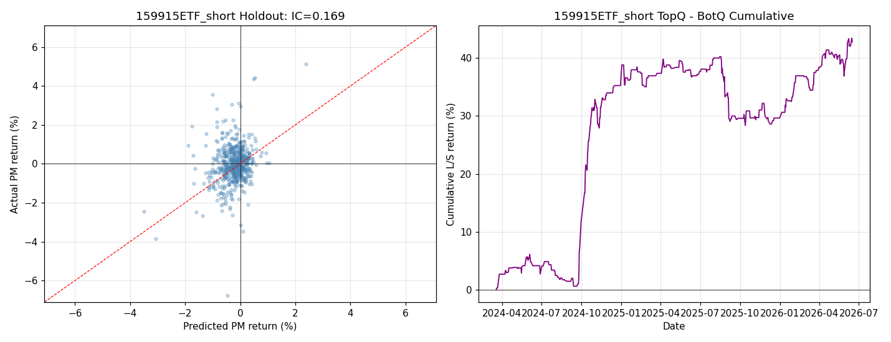


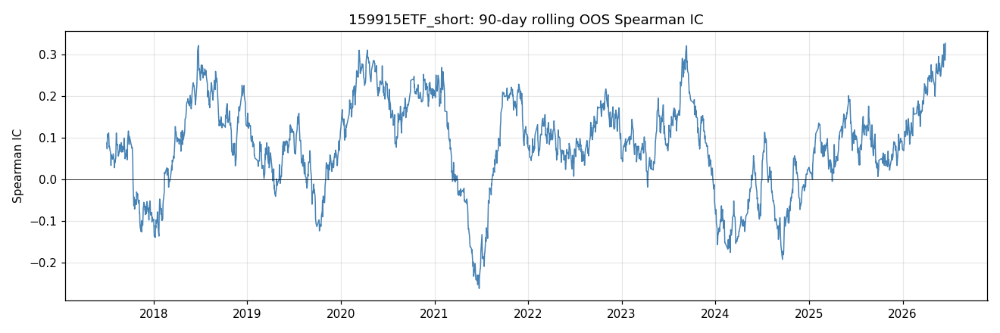


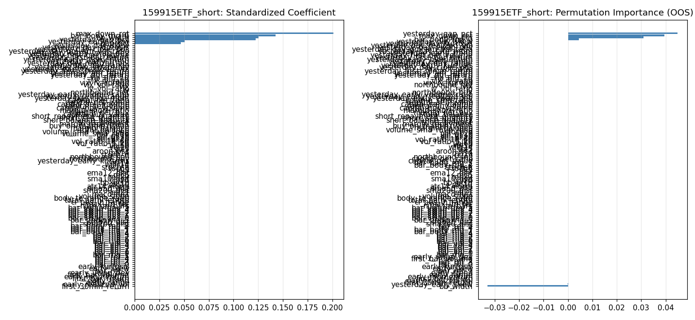


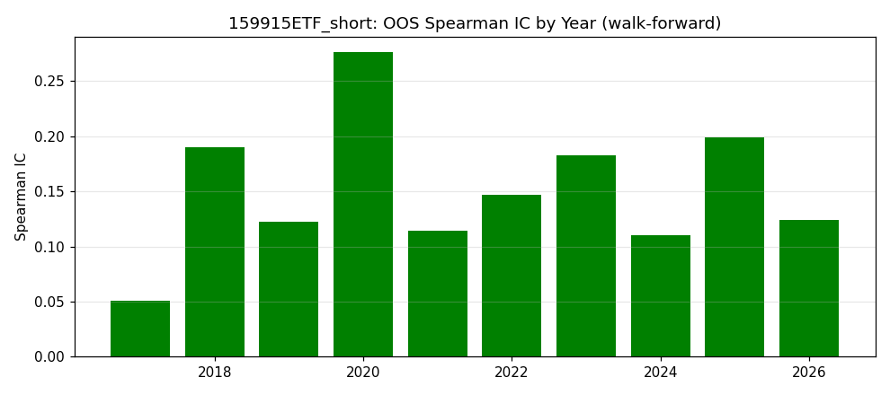


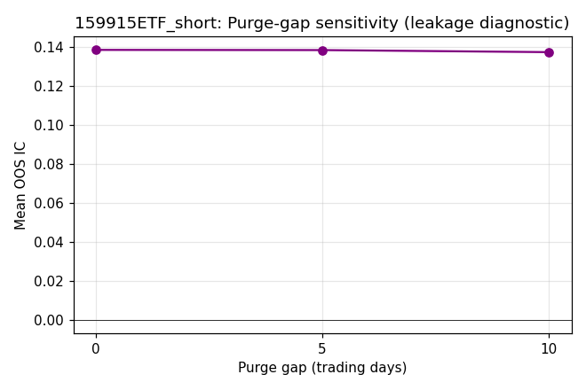


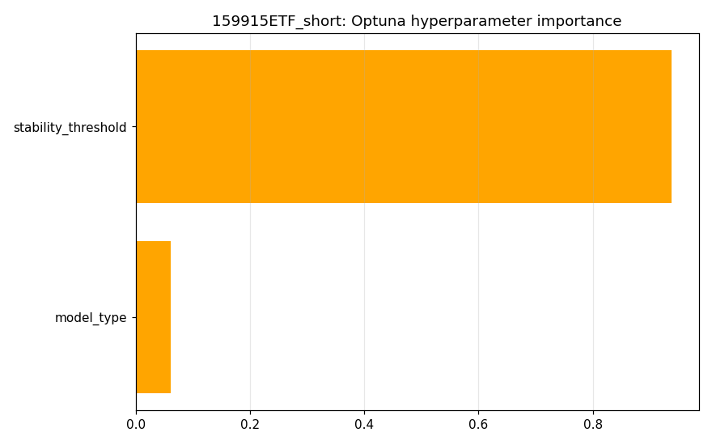


</details>

## 5. Comparison to Baselines

Four baselines evaluated on the same holdout set:

1. **Zero** (no-skill): Always predicts 0. IC=0 by definition.
2. **Yesterday trade_return**: Autocorrelation baseline. Tests if trade returns are predictable from prior day.
3. **First 30-min return (up to decision time)**: Momentum baseline. Tests AM-to-PM momentum.
4. **Ridge Base**: Ridge regression with alpha=1.0 on all features (130 features). Controls for tuning/selection lift.

| ETF/Tag | Best Linear IC > Ridge Base IC? | Best Linear IC > Mom IC? | Best Baseline |
|---------|---------------------------------|--------------------------|---------------|
| 300ETF_long | No | Yes | ridge (IC=+0.1028) |
| 300ETF_short | No | Yes | ridge (IC=+0.1028) |
| 50ETF_long | No | Yes | ridge (IC=+0.0912) |
| 50ETF_short | Yes | Yes | ridge (IC=+0.0912) |
| 500ETF_long | No | No | ridge (IC=+0.1260) |
| 500ETF_short | Yes | Yes | ridge (IC=+0.1260) |
| 588000ETF_long | Yes | Yes | first_30min_mom (IC=+0.0184) |
| 588000ETF_short | No | No | first_30min_mom (IC=+0.0184) |
| 159915ETF_long | Yes | Yes | first_30min_mom (IC=+0.0808) |
| 159915ETF_short | Yes | Yes | first_30min_mom (IC=+0.0808) |

## 6. Risk of Overfitting

### 6.1 IS vs OOS Gap

| ETF/Tag | IS IC | OOS IC | Gap | Assessment |
|---------|-------|--------|-----|-----------|
| 300ETF_long | 0.1537 | 0.0478 | +0.1059 | Low |
| 300ETF_short | 0.1239 | 0.0752 | +0.0487 | Low |
| 50ETF_long | 0.1230 | 0.0116 | +0.1114 | Low |
| 50ETF_short | 0.1286 | 0.1278 | +0.0008 | Low |
| 500ETF_long | 0.1749 | 0.0972 | +0.0776 | Low |
| 500ETF_short | 0.1302 | 0.1810 | -0.0508 | Low |
| 588000ETF_long | 0.1313 | 0.0684 | +0.0629 | Low |
| 588000ETF_short | 0.1408 | 0.0071 | +0.1337 | Low |
| 159915ETF_long | 0.1252 | 0.1206 | +0.0047 | Low |
| 159915ETF_short | 0.1403 | 0.0982 | +0.0421 | Low |

### 6.2 Regime Breakdown (Year-by-Year)

See per-ETF year-by-year tables in §4. Large year-to-year IC variance signals regime sensitivity.

### 6.3 Purge-Gap Sensitivity

If IC drops sharply as purge gap increases from 0→5→10, it indicates short-term leakage.

| ETF/Tag | Gap=0 | Gap=5 | Gap=10 | Delta(0→10) |
|---------|-------|-------|--------|------------|
| 300ETF_long | +0.0476 | +0.0482 | +0.0480 | -0.0004 |
| 300ETF_short | +0.0887 | +0.0887 | +0.0884 | +0.0003 |
| 50ETF_long | +0.0337 | +0.0336 | +0.0333 | +0.0003 |
| 50ETF_short | +0.0559 | +0.0559 | +0.0557 | +0.0002 |
| 500ETF_long | +0.0977 | +0.0978 | +0.0978 | -0.0000 |
| 500ETF_short | +0.1210 | +0.1208 | +0.1209 | +0.0001 |
| 588000ETF_long | +0.0340 | +0.0355 | +0.0314 | +0.0025 |
| 588000ETF_short | +0.0735 | +0.0735 | +0.0742 | -0.0008 |
| 159915ETF_long | +0.0519 | +0.0519 | +0.0519 | -0.0000 |
| 159915ETF_short | +0.0928 | +0.0928 | +0.0928 | +0.0000 |

### 6.4 Feature Importance Stability

Compare standardized coefficients vs permutation importance (OOS) across features. Large divergence indicates overfitting to specific features.

### 6.5 Top-5 Features: Standardized Coefficient vs Permutation


**300ETF_long**:

| Rank | Standardized Coefficient (Abs) | Permutation Importance |
|------|--------------------------------|----------------------|
| 1 | max_up_ret (+0.1383) | sma100_dist (+0.017638) |
| 2 | yesterday_early_range (+0.1346) | max_up_ret (+0.009930) |
| 3 | sma100_dist (-0.1029) | first_30min_return (+0.000000) |
| 4 | early_skew (+0.0478) | gap_pct (+0.000000) |
| 5 | bar_body_rng_0 (+0.0352) | early_realized_vol (+0.000000) |

**300ETF_short**:

| Rank | Standardized Coefficient (Abs) | Permutation Importance |
|------|--------------------------------|----------------------|
| 1 | bar_ret_0 (+13.6566) | bar_ret_0 (+345.601336) |
| 2 | first_bar_return (-13.4531) | first_bar_return (+334.657937) |
| 3 | bb_width (+0.1364) | yesterday_early_vwap_dev (+0.021581) |
| 4 | yesterday_early_vwap_dev (+0.1175) | gap_pct (+0.020015) |
| 5 | yesterday_day_late_mom (+0.1162) | bb_width (+0.010033) |

**50ETF_long**:

| Rank | Standardized Coefficient (Abs) | Permutation Importance |
|------|--------------------------------|----------------------|
| 1 | margin_net_buy (-0.1723) | margin_net_buy (+0.024772) |
| 2 | yesterday_early_range (+0.1031) | sma100_dist (+0.013188) |
| 3 | bar_rng_0 (+0.0968) | first_30min_return (+0.000000) |
| 4 | sma100_dist (-0.0866) | gap_pct (+0.000000) |
| 5 | first_30min_return (+0.0000) | early_trend (+0.000000) |

**50ETF_short**:

| Rank | Standardized Coefficient (Abs) | Permutation Importance |
|------|--------------------------------|----------------------|
| 1 | iv (-0.1573) | iv (+0.015572) |
| 2 | bar_vol_2 (-0.0752) | bar_vol_2 (+0.009466) |
| 3 | gap_pct (+0.0664) | gap_pct (+0.004442) |
| 4 | first_30min_return (+0.0000) | first_30min_return (+0.000000) |
| 5 | early_trend (+0.0000) | early_trend (+0.000000) |

**500ETF_long**:

| Rank | Standardized Coefficient (Abs) | Permutation Importance |
|------|--------------------------------|----------------------|
| 1 | max_up_ret (+0.2710) | max_up_ret (+0.048815) |
| 2 | bar_rng_4 (+0.1454) | sma100_dist (+0.019085) |
| 3 | sma100_dist (-0.1356) | first_30min_return (+0.000000) |
| 4 | yesterday_gap_pct (+0.1277) | gap_pct (+0.000000) |
| 5 | first_30min_return (+0.0000) | early_realized_vol (+0.000000) |

**500ETF_short**:

| Rank | Standardized Coefficient (Abs) | Permutation Importance |
|------|--------------------------------|----------------------|
| 1 | yesterday_early_vwap_dev (+0.1851) | yesterday_early_vwap_dev (+0.048976) |
| 2 | bb_width (+0.1847) | bar_vwap_dev_2 (+0.037532) |
| 3 | bar_vwap_dev_2 (+0.1830) | gap_pct (+0.031781) |
| 4 | bar_body_rng_0 (+0.1526) | bar_body_rng_0 (+0.027701) |
| 5 | gap_pct (+0.0992) | first_30min_return (+0.000000) |

**588000ETF_long**:

| Rank | Standardized Coefficient (Abs) | Permutation Importance |
|------|--------------------------------|----------------------|
| 1 | vol5 (+0.0201) | roc5 (+0.000064) |
| 2 | yesterday_day_realized_vol (+0.0182) | gap_pct (+0.000000) |
| 3 | roc5 (-0.0022) | first_30min_return (+0.000000) |
| 4 | gap_pct (+0.0000) | early_realized_vol (+0.000000) |
| 5 | first_30min_return (+0.0000) | early_trend (+0.000000) |

**588000ETF_short**:

| Rank | Standardized Coefficient (Abs) | Permutation Importance |
|------|--------------------------------|----------------------|
| 1 | bar_ret_0 (+0.0265) | cl_pos_in_range (+0.002221) |
| 2 | first_bar_return (+0.0263) | yesterday_early_realized_vol (+0.001775) |
| 3 | cl_pos_in_range (+0.0147) | yesterday_day_pm_am_vol_ratio (+0.000135) |
| 4 | yesterday_early_realized_vol (-0.0080) | gap_pct (+0.000000) |
| 5 | yesterday_day_pm_am_vol_ratio (+0.0079) | first_30min_return (+0.000000) |

**159915ETF_long**:

| Rank | Standardized Coefficient (Abs) | Permutation Importance |
|------|--------------------------------|----------------------|
| 1 | yesterday_early_realized_vol (+0.0950) | yesterday_day_vwap_dev (+0.007513) |
| 2 | sma100_dist (-0.0502) | sma100_dist (+0.005494) |
| 3 | yesterday_day_vwap_dev (-0.0449) | yesterday_early_realized_vol (+0.002651) |
| 4 | gap_pct (+0.0000) | gap_pct (+0.000000) |
| 5 | first_30min_return (+0.0000) | first_30min_return (+0.000000) |

**159915ETF_short**:

| Rank | Standardized Coefficient (Abs) | Permutation Importance |
|------|--------------------------------|----------------------|
| 1 | max_down_ret (+0.2013) | yesterday_gap_pct (+0.044859) |
| 2 | bar_body_rng_0 (+0.1425) | max_down_ret (+0.039468) |
| 3 | bb_width (+0.1254) | gap_pct (+0.030974) |
| 4 | yesterday_gap_pct (+0.1225) | bar_body_rng_0 (+0.004406) |
| 5 | yesterday_early_skew (+0.0507) | first_30min_return (+0.000000) |

### 6.6 Hyperparameter Sensitivity

Optuna parameter importance shows which parameters most affect CV IC.

- **300ETF_long**: Most influential = `stability_threshold` (84.44%)
- **300ETF_short**: Most influential = `stability_threshold` (66.67%)
- **50ETF_long**: Most influential = `model_type` (53.71%)
- **50ETF_short**: Most influential = `model_type` (83.05%)
- **500ETF_long**: Most influential = `stability_threshold` (61.23%)
- **500ETF_short**: Most influential = `stability_threshold` (63.29%)
- **588000ETF_long**: Most influential = `model_type` (60.09%)
- **588000ETF_short**: Most influential = `stability_threshold` (71.52%)
- **159915ETF_long**: Most influential = `stability_threshold` (88.79%)
- **159915ETF_short**: Most influential = `model_type` (57.13%)

## 7. Sensitivity to Prediction Time (Bar Count Comparison)

To determine how early the trade_return prediction can be made, we evaluated model performance across different morning bar counts (target = `trade_return`: open[decision_bar+1] -> close[EXIT_BAR] using ETF prices, with features computed from Index data):
- **9:45 AM (3 bars)**: First 15 minutes of trading (9:30–9:45)
- **9:50 AM (4 bars)**: First 20 minutes of trading (9:30–9:50)
- **9:55 AM (5 bars)**: First 25 minutes of trading (9:30–9:55)
- **10:00 AM (6 bars)**: First 30 minutes of trading (9:30–10:00) [Original Baseline]

> [!IMPORTANT]
> **Look-Ahead Bias Correction**: To prevent any look-ahead bias, volume normalization in these experiments uses a rolling 20-day historical average of daily volume shifted by 1 day (i.e. expected bar volume = `yesterday_rolling_20d_daily_volume / 48`), ensuring zero future information leaks into the features.

### 7.1 Performance Summary by Bar Count

| ETF | Bar Count | Prediction Time | Selected Model | Features | Holdout IC | Holdout Dir | L/S Sharpe |
|-----|-----------|-----------------|----------------|----------|------------|-------------|------------|
| **300ETF** | 3 | 9:45 (3 bar) | RIDGE | 30 | +0.0212 | 0.482 | +1.46 |
|  | 4 | 9:50 (4 bar) | HUBER | 27 | +0.0449 | 0.487 | +0.92 |
|  | 5 | 9:55 (5 bar) | HUBER | 20 | +0.0632 | 0.504 | **+1.93** |
|  | 6 | 10:00 (6 bar) | HUBER | 14 | **+0.0770** | 0.507 | +1.72 |
| | | | | | | | |
| **50ETF** | 3 | 9:45 (3 bar) | HUBER | 10 | -0.0233 | 0.533 | -0.58 |
|  | 4 | 9:50 (4 bar) | HUBER | 13 | -0.0029 | 0.513 | +0.70 |
|  | 5 | 9:55 (5 bar) | HUBER | 13 | +0.0047 | 0.504 | -0.27 |
|  | 6 | 10:00 (6 bar) | HUBER | 27 | **+0.0188** | 0.507 | **+1.63** |
| | | | | | | | |
| **500ETF** | 3 | 9:45 (3 bar) | HUBER | 9 | +0.1369 | 0.564 | +2.54 |
|  | 4 | 9:50 (4 bar) | LASSO | 11 | +0.0880 | 0.549 | +1.12 |
|  | 5 | 9:55 (5 bar) | HUBER | 24 | **+0.1466** | 0.551 | +2.39 |
|  | 6 | 10:00 (6 bar) | RIDGE | 26 | +0.1149 | 0.551 | **+3.07** |
| | | | | | | | |
| **588000ETF** | 3 | 9:45 (3 bar) | ELASTICNET | 19 | -0.0213 | 0.492 | -0.37 |
|  | 4 | 9:50 (4 bar) | LASSO | 33 | **+0.0082** | 0.492 | +0.70 |
|  | 5 | 9:55 (5 bar) | ELASTICNET | 31 | -0.0283 | 0.484 | **+0.75** |
|  | 6 | 10:00 (6 bar) | LASSO | 23 | -0.0630 | 0.469 | -1.09 |
| | | | | | | | |
| **159915ETF** | 3 | 9:45 (3 bar) | RIDGE | 44 | +0.2032 | 0.578 | **+4.68** |
|  | 4 | 9:50 (4 bar) | HUBER | 12 | +0.2117 | 0.595 | +4.43 |
|  | 5 | 9:55 (5 bar) | ELASTICNET | 14 | **+0.2164** | 0.591 | +4.41 |
|  | 6 | 10:00 (6 bar) | ELASTICNET | 13 | +0.1802 | 0.571 | +3.98 |
| | | | | | | | |

### 7.2 Key Insights & Observations

1. **Window Duration vs. Model Maturity**:
   - For blue-chip ETFs (**300ETF** and **50ETF**), predictive accuracy improves monotonically as the morning observation window expands. 300ETF holdout IC climbs from `+0.0212` (9:45 AM) to `+0.0770` (10:00 AM) in experiments. This indicates that blue-chip index momentum requires a full 30-minute digestion period to become highly predictive.
2. **Early Peak Signals in Chinext/Mid-Cap**:
   - For high-beta/growth index ETFs (**159915ETF** and **500ETF**), prediction power peaks *before* 10:00 AM:
     - **159915ETF** achieves its highest Holdout IC at 9:55 AM (`+0.2164`, L/S Sharpe `+4.41`), and its highest L/S Sharpe at 9:45 AM (`+4.68`, Holdout IC `+0.2032`).
     - **500ETF** holds high predictive power at 9:45 AM (`+0.1369`, L/S Sharpe `+2.54`), peaking in Holdout IC at 9:55 AM (`+0.1466`).
     - *Rationale*: Opening cross and morning price action in mid-cap/growth stock structures are rich with early direction info. Waiting until 10:00 AM dilutes this signal as daily variance decays.
3. **Execution Edge**:
   - These findings indicate we can deploy day-models for **159915ETF** and **500ETF** as early as **9:45 AM** or **9:50 AM** with superior predictive stats. This gives execution models (e.g. limit entry solvers) more time to enter before the afternoon session.

## 8. Conclusions & Caveats

**Potentially deployable** (IC>0.03, L/S Sharpe>0.5, beats Ridge Base): 50ETF_short, 500ETF_short, 159915ETF_long, 159915ETF_short

**Marginal** (positive IC but weak Sharpe or below Ridge Base): 300ETF_long, 300ETF_short, 50ETF_long, 500ETF_long, 588000ETF_short

**Weak/Not recommended** (negative IC or no edge): 588000ETF_long


**Key caveats**:

1. Trade return prediction is inherently noisy (low signal-to-noise ratio)
2. Feature selection using block bootstrap stability scores handles highly correlated features much better than greedy RFE
3. HuberRegressor handles extreme outlier days much better than standard MSE-based models
4. Transaction costs and execution slippage are not modeled here
