# Day-Model Remake Optimization Report
> Generated by day-model/generate_report.py

> [!WARNING]
> Step 2 stability selection fallback was triggered for tags: `500ETF`, `500ETF_long`, `500ETF_short`, `50ETF_gauss`, `50ETF_rank`, `50ETF_long_gauss`, `50ETF_long_rank`, `50ETF_short_gauss`, `50ETF_short_rank` (selected fewer than 15 clusters, fell back to top 15 clusters).

Side-aware objective: `single` (legacy two-sided Tail IC), `long` (top-only, `pred >= P85(pred)`), `short` (bot-only, `pred <= P15(pred)`). Tail IC and lockbox Tail IC are side-aware; CV M1..M6 metrics stay two-sided.

This report summarizes the performance and features of the remade `day-model` return predictors, optimized using first-principles multi-metric objective functions and stability selection.

## Out-of-Sample Lockbox Performance (2024-03 to Last Day)

| Tag | ETF | Side | Selected | Active | Model Type | Lockbox IC | Lockbox Tail IC | Tail IC Def |
| :--- | :---: | :---: | :---: | :---: | :---: | :---: | :---: | :---: |
| 300ETF | 300ETF | `single` | 16 | 16 | `unified` | +0.0826 | +0.1211 | single |
| 300ETF_gauss | 300ETF | `single` | 18 | 18 | `unified` | +0.0694 | +0.0688 | single |
| 300ETF_rank | 300ETF | `single` | 17 | 16 | `unified` | +0.0600 | +0.0112 | single |
| 300ETF_long | 300ETF | `long` | 16 | 16 | `unified` | +0.0778 | +0.1074 | long |
| 300ETF_long_gauss | 300ETF | `long` | 18 | 18 | `unified` | +0.0710 | +0.0183 | long |
| 300ETF_long_rank | 300ETF | `long` | 18 | 18 | `unified` | +0.0491 | +0.1287 | long |
| 300ETF_short | 300ETF | `short` | 16 | 16 | `unified` | +0.0735 | -0.1406 | short |
| 300ETF_short_gauss | 300ETF | `short` | 18 | 18 | `unified` | +0.0787 | +0.0132 | short |
| 300ETF_short_rank | 300ETF | `short` | 18 | 18 | `unified` | +0.0375 | -0.0518 | short |
| 500ETF | 500ETF | `single` | 13 | 12 | `unified` | +0.1229 | +0.0791 | single |
| 500ETF_gauss | 500ETF | `single` | 8 | 7 | `unified` | +0.1096 | +0.0868 | single |
| 500ETF_rank | 500ETF | `single` | 7 | 5 | `unified` | +0.1075 | +0.1129 | single |
| 500ETF_long | 500ETF | `long` | 12 | 10 | `unified` | +0.1215 | -0.1323 | long |
| 500ETF_long_gauss | 500ETF | `long` | 10 | 7 | `unified` | +0.1115 | -0.0049 | long |
| 500ETF_long_rank | 500ETF | `long` | 17 | 17 | `unified` | +0.1147 | -0.0015 | long |
| 500ETF_short | 500ETF | `short` | 11 | 11 | `unified` | +0.1242 | +0.1059 | short |
| 500ETF_short_gauss | 500ETF | `short` | 15 | 15 | `unified` | +0.1024 | +0.0637 | short |
| 500ETF_short_rank | 500ETF | `short` | 4 | 1 | `unified` | +0.0852 | +0.0042 | short |
| 588000ETF | 588000ETF | `single` | 24 | 24 | `unified` | -0.0016 | -0.0103 | single |
| 588000ETF_gauss | 588000ETF | `single` | 16 | 15 | `unified` | -0.0463 | +0.0596 | single |
| 588000ETF_rank | 588000ETF | `single` | 23 | 23 | `unified` | +0.0405 | +0.1580 | single |
| 588000ETF_long | 588000ETF | `long` | 24 | 24 | `unified` | +0.0060 | +0.1236 | long |
| 588000ETF_long_gauss | 588000ETF | `long` | 23 | 20 | `unified` | +0.0057 | +0.0442 | long |
| 588000ETF_long_rank | 588000ETF | `long` | 23 | 23 | `unified` | +0.0460 | +0.1033 | long |
| 588000ETF_short | 588000ETF | `short` | 24 | 24 | `unified` | +0.0109 | -0.1073 | short |
| 588000ETF_short_gauss | 588000ETF | `short` | 24 | 23 | `unified` | -0.0102 | -0.0548 | short |
| 588000ETF_short_rank | 588000ETF | `short` | 23 | 22 | `unified` | +0.0525 | -0.0705 | short |
| 159915ETF | 159915ETF | `single` | 5 | 4 | `unified` | +0.1100 | +0.0742 | single |
| 159915ETF_gauss | 159915ETF | `single` | 16 | 16 | `unified` | +0.1535 | +0.2402 | single |
| 159915ETF_rank | 159915ETF | `single` | 17 | 17 | `unified` | +0.1591 | +0.1902 | single |
| 159915ETF_long | 159915ETF | `long` | 20 | 20 | `unified` | +0.1423 | +0.1568 | long |
| 159915ETF_long_gauss | 159915ETF | `long` | 4 | 4 | `unified` | +0.0947 | -0.1191 | long |
| 159915ETF_long_rank | 159915ETF | `long` | 17 | 17 | `unified` | +0.1433 | -0.0411 | long |
| 159915ETF_short | 159915ETF | `short` | 20 | 20 | `unified` | +0.1654 | +0.2443 | short |
| 159915ETF_short_gauss | 159915ETF | `short` | 12 | 12 | `unified` | +0.1385 | -0.1094 | short |
| 159915ETF_short_rank | 159915ETF | `short` | 7 | 6 | `unified` | +0.1224 | +0.0464 | short |
| 50ETF | 50ETF | `single` | 15 | 15 | `unified` | +0.1114 | +0.2081 | single |
| 50ETF_gauss | 50ETF | `single` | 13 | 12 | `unified` | +0.0950 | +0.1366 | single |
| 50ETF_rank | 50ETF | `single` | 14 | 14 | `unified` | +0.0735 | +0.1210 | single |
| 50ETF_long | 50ETF | `long` | 13 | 10 | `unified` | +0.1098 | +0.0269 | long |
| 50ETF_long_gauss | 50ETF | `long` | 6 | 5 | `unified` | +0.0707 | -0.0205 | long |
| 50ETF_long_rank | 50ETF | `long` | 14 | 14 | `unified` | +0.0773 | +0.0916 | long |
| 50ETF_short | 50ETF | `short` | 15 | 14 | `unified` | +0.0901 | +0.1072 | short |
| 50ETF_short_gauss | 50ETF | `short` | 9 | 9 | `unified` | +0.0902 | +0.0282 | short |
| 50ETF_short_rank | 50ETF | `short` | 11 | 8 | `unified` | +0.0612 | -0.0111 | short |

## Detailed Trial Metrics & Optimization Objectives

CV fold metrics M1..M6 are two-sided for all sides (per side-aware spec). V1..V4 weights: single `[0.40, 0.40, 0.15, 0.05]`; long/short `[0.45, 0.45, 0.10, 0.00]` (V4 dropped, renormalized).

| Tag | Side | Yearly Tail IC IR | Yearly Tail IC Mean | Hit Rate | Decile Monotonicity | Top-Bottom Spread |
| :--- | :---: | :---: | :---: | :---: | :---: | :---: |
| 300ETF | `single` | 2.1083 | +0.3265 | 100.0% | 0.5697 | +80.9251% |
| 300ETF_gauss | `single` | 2.7763 | +0.3219 | 100.0% | 0.5964 | +73.2070% |
| 300ETF_rank | `single` | 1.3304 | +0.2475 | 100.0% | 0.5236 | +77.3489% |
| 300ETF_long | `long` | 1.9605 | +0.2979 | 100.0% | 0.6121 | +81.1336% |
| 300ETF_long_gauss | `long` | 1.9202 | +0.2946 | 100.0% | 0.5430 | +68.4441% |
| 300ETF_long_rank | `long` | 2.4209 | +0.3181 | 100.0% | 0.6473 | +62.5574% |
| 300ETF_short | `short` | 1.6893 | +0.3111 | 100.0% | 0.6194 | +75.2795% |
| 300ETF_short_gauss | `short` | 2.2418 | +0.3401 | 100.0% | 0.5479 | +74.4982% |
| 300ETF_short_rank | `short` | 2.6398 | +0.3040 | 100.0% | 0.6570 | +63.7656% |
| 500ETF | `single` | 2.1188 | +0.2395 | 100.0% | 0.5273 | +84.8137% |
| 500ETF_gauss | `single` | 1.6894 | +0.2482 | 100.0% | 0.4752 | +76.6792% |
| 500ETF_rank | `single` | 1.5322 | +0.2467 | 100.0% | 0.4109 | +77.1226% |
| 500ETF_long | `long` | 1.7445 | +0.2462 | 100.0% | 0.5200 | +77.5870% |
| 500ETF_long_gauss | `long` | 2.2602 | +0.2391 | 100.0% | 0.4800 | +79.1833% |
| 500ETF_long_rank | `long` | 1.4156 | +0.2315 | 90.0% | 0.5333 | +90.7734% |
| 500ETF_short | `short` | 1.6167 | +0.2365 | 100.0% | 0.4545 | +79.3869% |
| 500ETF_short_gauss | `short` | 2.0245 | +0.2463 | 90.0% | 0.5285 | +84.4704% |
| 500ETF_short_rank | `short` | 1.5859 | +0.2770 | 100.0% | 0.3588 | +76.9195% |
| 588000ETF | `single` | 0.6662 | +0.2102 | 60.0% | 0.3648 | +32.3093% |
| 588000ETF_gauss | `single` | 3.1055 | +0.4187 | 100.0% | 0.6339 | +125.7925% |
| 588000ETF_rank | `single` | 0.3220 | +0.1109 | 60.0% | 0.3018 | +4.3184% |
| 588000ETF_long | `long` | 2.4361 | +0.4847 | 100.0% | 0.6145 | +176.4350% |
| 588000ETF_long_gauss | `long` | 3.3764 | +0.4105 | 100.0% | 0.6800 | +132.3038% |
| 588000ETF_long_rank | `long` | 1.9597 | +0.2831 | 100.0% | 0.6533 | +95.1032% |
| 588000ETF_short | `short` | 2.6694 | +0.4087 | 100.0% | 0.6024 | +128.0030% |
| 588000ETF_short_gauss | `short` | 3.4565 | +0.4135 | 100.0% | 0.5879 | +123.8091% |
| 588000ETF_short_rank | `short` | 1.7202 | +0.4286 | 100.0% | 0.7164 | +119.0862% |
| 159915ETF | `single` | 1.0642 | +0.2244 | 80.0% | 0.4461 | +77.8614% |
| 159915ETF_gauss | `single` | 2.1637 | +0.3659 | 100.0% | 0.5830 | +130.8659% |
| 159915ETF_rank | `single` | 1.6604 | +0.3134 | 100.0% | 0.5285 | +123.7795% |
| 159915ETF_long | `long` | 1.1953 | +0.3004 | 90.0% | 0.5697 | +89.8749% |
| 159915ETF_long_gauss | `long` | 1.0080 | +0.2280 | 80.0% | 0.5103 | +80.5925% |
| 159915ETF_long_rank | `long` | 2.3748 | +0.3141 | 100.0% | 0.6594 | +109.6014% |
| 159915ETF_short | `short` | 0.9163 | +0.2649 | 90.0% | 0.6073 | +88.0659% |
| 159915ETF_short_gauss | `short` | 1.3914 | +0.3165 | 90.0% | 0.4945 | +110.2225% |
| 159915ETF_short_rank | `short` | 0.7810 | +0.1639 | 90.0% | 0.4473 | +57.1166% |
| 50ETF | `single` | 0.6882 | +0.1710 | 70.0% | 0.5503 | +55.0295% |
| 50ETF_gauss | `single` | 1.3806 | +0.2125 | 90.0% | 0.4230 | +53.9450% |
| 50ETF_rank | `single` | 1.8199 | +0.2846 | 100.0% | 0.5927 | +67.6801% |
| 50ETF_long | `long` | 0.6084 | +0.1510 | 70.0% | 0.3636 | +34.7694% |
| 50ETF_long_gauss | `long` | 0.6821 | +0.1562 | 80.0% | 0.3491 | +35.6513% |
| 50ETF_long_rank | `long` | 1.8972 | +0.2654 | 100.0% | 0.6000 | +64.3756% |
| 50ETF_short | `short` | 0.7858 | +0.1914 | 70.0% | 0.4812 | +59.1619% |
| 50ETF_short_gauss | `short` | 1.0721 | +0.1981 | 80.0% | 0.3406 | +46.2988% |
| 50ETF_short_rank | `short` | 1.3228 | +0.2282 | 90.0% | 0.5188 | +65.2291% |

## Model Quality & Generalization Diagnostics

### Multi-Collinearity & Weight Concentration

| Tag | Side | Raw X Cond | Reg kappa | Collinear Pairs (>=0.85) | Gini | Tail ESS | Tail ESS % |
| :--- | :---: | :---: | :---: | :---: | :---: | :---: | :---: |
| 300ETF | `single` | 3.02 | 9.07 | 0 | 0.5184 | 550.0 | 25.4% |
| 300ETF_gauss | `single` | 3.00 | 8.97 | 0 | 0.4461 | 562.4 | 26.0% |
| 300ETF_rank | `single` | 2.90 | 5.41 | 0 | 0.4089 | 1260.0 | 58.2% |
| 300ETF_long | `long` | 3.02 | 9.13 | 0 | 0.2971 | 1639.7 | 75.7% |
| 300ETF_long_gauss | `long` | 3.00 | 8.05 | 0 | 0.2903 | 2070.6 | 95.6% |
| 300ETF_long_rank | `long` | 2.92 | 7.63 | 0 | 0.2766 | 2070.6 | 95.6% |
| 300ETF_short | `short` | 3.02 | 9.14 | 0 | 0.4646 | 667.2 | 30.8% |
| 300ETF_short_gauss | `short` | 3.00 | 8.99 | 0 | 0.4334 | 648.8 | 30.0% |
| 300ETF_short_rank | `short` | 2.92 | 8.51 | 0 | 0.4038 | 827.2 | 38.2% |
| 500ETF | `single` | 4.36 | 2.22 | 0 | 0.3598 | 822.5 | 38.0% |
| 500ETF_gauss | `single` | 2.23 | 2.90 | 0 | 0.4576 | 1902.0 | 87.8% |
| 500ETF_rank | `single` | 1.52 | 2.20 | 0 | 0.6309 | 1790.9 | 82.7% |
| 500ETF_long | `long` | 4.36 | 5.83 | 0 | 0.4277 | 1034.5 | 47.8% |
| 500ETF_long_gauss | `long` | 2.34 | 5.45 | 0 | 0.5805 | 2109.5 | 97.4% |
| 500ETF_long_rank | `long` | 3.56 | 8.04 | 0 | 0.2537 | 880.3 | 40.6% |
| 500ETF_short | `short` | 3.43 | 9.99 | 0 | 0.3495 | 1920.1 | 88.6% |
| 500ETF_short_gauss | `short` | 2.43 | 4.77 | 0 | 0.3233 | 785.4 | 36.3% |
| 500ETF_short_rank | `short` | 1.37 | 1.79 | 0 | 0.7500 | 2098.5 | 96.9% |
| 588000ETF | `single` | 2.98 | 8.89 | 0 | 0.3228 | 310.8 | 38.2% |
| 588000ETF_gauss | `single` | 2.72 | 6.60 | 0 | 0.3136 | 335.4 | 41.2% |
| 588000ETF_rank | `single` | 2.55 | 6.47 | 0 | 0.3425 | 342.1 | 42.0% |
| 588000ETF_long | `long` | 2.98 | 8.89 | 0 | 0.3032 | 406.4 | 49.9% |
| 588000ETF_long_gauss | `long` | 2.89 | 8.24 | 0 | 0.4274 | 460.8 | 56.6% |
| 588000ETF_long_rank | `long` | 2.55 | 6.48 | 0 | 0.2204 | 782.8 | 96.2% |
| 588000ETF_short | `short` | 2.98 | 8.89 | 0 | 0.2799 | 522.6 | 64.2% |
| 588000ETF_short_gauss | `short` | 3.93 | 14.43 | 0 | 0.4012 | 383.2 | 47.1% |
| 588000ETF_short_rank | `short` | 2.55 | 6.32 | 0 | 0.2914 | 648.4 | 79.7% |
| 159915ETF | `single` | 1.15 | 1.26 | 0 | 0.3482 | 1274.5 | 58.8% |
| 159915ETF_gauss | `single` | 3.99 | 2.56 | 0 | 0.2859 | 1404.2 | 64.8% |
| 159915ETF_rank | `single` | 4.00 | 7.48 | 0 | 0.3897 | 1087.6 | 50.2% |
| 159915ETF_long | `long` | 24.67 | 605.00 [SEVERE] | 0 | 0.3178 | 715.4 | 33.0% |
| 159915ETF_long_gauss | `long` | 1.11 | 1.13 | 0 | 0.4020 | 763.9 | 35.3% |
| 159915ETF_long_rank | `long` | 4.00 | 15.97 | 0 | 0.2712 | 666.8 | 30.8% |
| 159915ETF_short | `short` | 24.67 | 63.33 [MODERATE] | 0 | 0.2982 | 2058.9 | 95.1% |
| 159915ETF_short_gauss | `short` | 2.03 | 3.97 | 0 | 0.3958 | 801.0 | 37.0% |
| 159915ETF_short_rank | `short` | 3.89 | 13.09 | 0 | 0.4135 | 1915.4 | 88.4% |
| 50ETF | `single` | 2.51 | 6.08 | 0 | 0.3182 | 529.2 | 24.4% |
| 50ETF_gauss | `single` | 1.88 | 3.38 | 0 | 0.4428 | 1000.9 | 46.2% |
| 50ETF_rank | `single` | 1.85 | 3.26 | 0 | 0.3777 | 2048.7 | 94.6% |
| 50ETF_long | `long` | 2.08 | 3.74 | 0 | 0.5124 | 645.6 | 29.8% |
| 50ETF_long_gauss | `long` | 1.70 | 2.87 | 0 | 0.3892 | 1202.8 | 55.5% |
| 50ETF_long_rank | `long` | 1.85 | 3.44 | 0 | 0.3440 | 1385.7 | 64.0% |
| 50ETF_short | `short` | 2.51 | 5.73 | 0 | 0.3290 | 2048.7 | 94.6% |
| 50ETF_short_gauss | `short` | 1.79 | 3.06 | 0 | 0.3885 | 643.8 | 29.7% |
| 50ETF_short_rank | `short` | 1.82 | 3.17 | 0 | 0.4990 | 551.3 | 25.5% |

### Generalization Gap (CV vs Selection Val vs OOS)

| Tag | Side | CV IC | Deflated CV IC | Sel Val IC | Deflated Val IC | OOS IC | IC Gen Gap | CV Mono | OOS Mono | Mono Gen Gap |
| :--- | :---: | :---: | :---: | :---: | :---: | :---: | :---: | :---: | :---: | :---: |
| 300ETF | `single` | +0.1752 | +0.0913 | +0.1399 | +0.0717 | +0.0826 | -0.0110 | +0.5697 | +0.7939 | -0.2242 |
| 300ETF_gauss | `single` | +0.1647 | +0.0929 | +0.1429 | +0.0759 | +0.0694 | +0.0065 | +0.5964 | +0.6364 | -0.0400 |
| 300ETF_rank | `single` | +0.1436 | +0.0156 | +0.1039 | +0.0205 | +0.0600 | -0.0395 | +0.5236 | +0.7697 | -0.2461 |
| 300ETF_long | `long` | +0.1732 | +0.1007 | +0.1317 | +0.0753 | +0.0778 | -0.0024 | +0.6121 | +0.9030 | -0.2909 |
| 300ETF_long_gauss | `long` | +0.1597 | +0.0853 | +0.1316 | +0.0637 | +0.0710 | -0.0073 | +0.5430 | +0.7091 | -0.1661 |
| 300ETF_long_rank | `long` | +0.1655 | +0.0791 | +0.1055 | +0.0514 | +0.0491 | +0.0023 | +0.6473 | +0.6970 | -0.0497 |
| 300ETF_short | `short` | +0.1710 | +0.0471 | +0.1362 | +0.0293 | +0.0735 | -0.0442 | +0.6194 | +0.8788 | -0.2594 |
| 300ETF_short_gauss | `short` | +0.1632 | +0.0912 | +0.1427 | +0.0823 | +0.0787 | +0.0036 | +0.5479 | +0.7818 | -0.2339 |
| 300ETF_short_rank | `short` | +0.1744 | +0.0832 | +0.1016 | +0.0452 | +0.0375 | +0.0077 | +0.6570 | +0.7455 | -0.0885 |
| 500ETF | `single` | +0.1394 | +0.0343 | +0.1847 | +0.0505 | +0.1229 | -0.0724 | +0.5273 | +0.6970 | -0.1697 |
| 500ETF_gauss | `single` | +0.1220 | -0.0111 | +0.1802 | +0.0546 | +0.1096 | -0.0550 | +0.4752 | +0.8909 | -0.4158 |
| 500ETF_rank | `single` | +0.1110 | -0.0219 | +0.1905 | +0.0478 | +0.1075 | -0.0597 | +0.4109 | +0.5515 | -0.1406 |
| 500ETF_long | `long` | +0.1374 | +0.0397 | +0.1785 | +0.0533 | +0.1215 | -0.0682 | +0.5200 | +0.7576 | -0.2376 |
| 500ETF_long_gauss | `long` | +0.1257 | +0.0143 | +0.1537 | +0.0483 | +0.1115 | -0.0633 | +0.4800 | +0.7818 | -0.3018 |
| 500ETF_long_rank | `long` | +0.1676 | +0.0332 | +0.0964 | -0.0284 | +0.1147 | -0.1431 | +0.5333 | +0.6848 | -0.1515 |
| 500ETF_short | `short` | +0.1196 | +0.0536 | +0.1602 | +0.0819 | +0.1242 | -0.0424 | +0.4545 | +0.6242 | -0.1697 |
| 500ETF_short_gauss | `short` | +0.1628 | +0.0744 | +0.1065 | +0.0325 | +0.1024 | -0.0699 | +0.5285 | +0.8909 | -0.3624 |
| 500ETF_short_rank | `short` | +0.0992 | -0.0178 | +0.1735 | +0.0529 | +0.0852 | -0.0323 | +0.3588 | +0.6970 | -0.3382 |
| 588000ETF | `single` | +0.1287 | -0.0921 | -0.0413 | -0.1723 | -0.0016 | -0.1708 | +0.3648 | +0.4667 | -0.1018 |
| 588000ETF_gauss | `single` | +0.2513 | +0.0011 | +0.0423 | -0.1339 | -0.0463 | -0.0877 | +0.6339 | -0.0788 | +0.7127 [DEGRADED] |
| 588000ETF_rank | `single` | +0.0934 | -0.0703 | -0.2376 | -0.4079 | +0.0405 | -0.4484 | +0.3018 | +0.5879 | -0.2861 |
| 588000ETF_long | `long` | +0.2419 | +0.0744 | -0.0626 | -0.1329 | +0.0060 | -0.1389 | +0.6145 | +0.2485 | +0.3661 [DEGRADED] |
| 588000ETF_long_gauss | `long` | +0.2745 | +0.0834 | -0.0134 | -0.1301 | +0.0057 | -0.1359 | +0.6800 | +0.2121 | +0.4679 [DEGRADED] |
| 588000ETF_long_rank | `long` | +0.2579 | +0.0710 | -0.3007 | -0.4598 | +0.0460 | -0.5059 | +0.6533 | +0.5152 | +0.1382 |
| 588000ETF_short | `short` | +0.2561 | +0.0177 | -0.0779 | -0.1899 | +0.0109 | -0.2008 | +0.6024 | +0.4182 | +0.1842 |
| 588000ETF_short_gauss | `short` | +0.2610 | +0.0684 | -0.0361 | -0.1396 | -0.0102 | -0.1294 | +0.5879 | +0.4061 | +0.1818 |
| 588000ETF_short_rank | `short` | +0.3091 | +0.0566 | -0.3144 | -0.5591 | +0.0525 | -0.6115 | +0.7164 | +0.7091 | +0.0073 |
| 159915ETF | `single` | +0.1399 | -0.0141 | +0.1957 | +0.0286 | +0.1100 | -0.0814 | +0.4461 | +0.7091 | -0.2630 |
| 159915ETF_gauss | `single` | +0.1925 | +0.0064 | +0.1948 | +0.0148 | +0.1535 | -0.1387 | +0.5830 | +0.8788 | -0.2958 |
| 159915ETF_rank | `single` | +0.1784 | +0.0302 | +0.2169 | +0.0403 | +0.1591 | -0.1188 | +0.5285 | +0.8667 | -0.3382 |
| 159915ETF_long | `long` | +0.1719 | +0.0995 | +0.1100 | +0.0309 | +0.1423 | -0.1114 | +0.5697 | +0.5030 | +0.0667 |
| 159915ETF_long_gauss | `long` | +0.1240 | -0.0334 | +0.1802 | +0.0450 | +0.0947 | -0.0497 | +0.5103 | +0.7455 | -0.2352 |
| 159915ETF_long_rank | `long` | +0.2023 | +0.1095 | +0.1569 | +0.0728 | +0.1433 | -0.0705 | +0.6594 | +0.7091 | -0.0497 |
| 159915ETF_short | `short` | +0.1784 | +0.0671 | +0.1572 | +0.0186 | +0.1654 | -0.1468 | +0.6073 | +0.6848 | -0.0776 |
| 159915ETF_short_gauss | `short` | +0.1740 | +0.0514 | +0.1750 | +0.0722 | +0.1385 | -0.0663 | +0.4945 | +0.7697 | -0.2752 |
| 159915ETF_short_rank | `short` | +0.1368 | -0.0326 | +0.2588 | +0.0642 | +0.1224 | -0.0581 | +0.4473 | +0.7939 | -0.3467 |
| 50ETF | `single` | +0.1088 | +0.0338 | +0.1286 | +0.0353 | +0.1114 | -0.0762 | +0.5503 | +0.7576 | -0.2073 |
| 50ETF_gauss | `single` | +0.1032 | +0.0191 | +0.1175 | +0.0203 | +0.0950 | -0.0747 | +0.4230 | +0.5030 | -0.0800 |
| 50ETF_rank | `single` | +0.1336 | +0.0338 | +0.1012 | +0.0243 | +0.0735 | -0.0492 | +0.5927 | +0.7576 | -0.1648 |
| 50ETF_long | `long` | +0.0824 | +0.0018 | +0.1461 | +0.0427 | +0.1098 | -0.0671 | +0.3636 | +0.7091 | -0.3455 |
| 50ETF_long_gauss | `long` | +0.0643 | -0.0204 | +0.1106 | +0.0171 | +0.0707 | -0.0536 | +0.3491 | +0.5273 | -0.1782 |
| 50ETF_long_rank | `long` | +0.1319 | +0.0485 | +0.1076 | +0.0474 | +0.0773 | -0.0299 | +0.6000 | +0.7939 | -0.1939 |
| 50ETF_short | `short` | +0.1087 | +0.0389 | +0.1207 | +0.0407 | +0.0901 | -0.0495 | +0.4812 | +0.6485 | -0.1673 |
| 50ETF_short_gauss | `short` | +0.0869 | +0.0256 | +0.1359 | +0.0725 | +0.0902 | -0.0178 | +0.3406 | +0.6727 | -0.3321 |
| 50ETF_short_rank | `short` | +0.1105 | +0.0143 | +0.1090 | +0.0216 | +0.0612 | -0.0396 | +0.5188 | +0.6606 | -0.1418 |

### Overfitting Diagnostics (PBO & Lockbox Bootstrap CIs)

| Tag | Side | PBO | Perf Deg | OOS IC 95% CI | CV IC Target | IC Sig? | OOS Mono 95% CI | CV Mono | Mono Sig? |
| :--- | :---: | :---: | :---: | :---: | :---: | :---: | :---: | :---: | :---: |
| 300ETF | `single` | 60.0% | -1.6174 | [+0.0015, +0.1620] | +0.0717 | **Noise** | [-0.0545, +0.8667] | +0.5697 | **Noise** |
| 300ETF_gauss | `single` | 53.3% | -1.5667 | [-0.0178, +0.1504] | +0.0759 | **Noise** | [-0.0909, +0.7942] | +0.5964 | **Noise** |
| 300ETF_rank | `single` | 0.0% | -1.3296 | [-0.0439, +0.1476] | +0.0205 | **Noise** | [-0.1394, +0.8791] | +0.5236 | **Noise** |
| 300ETF_long | `long` | 73.3% | -1.6174 | [-0.0133, +0.1636] | +0.0753 | **Noise** | [+0.0061, +0.8788] | +0.6121 | **Noise** |
| 300ETF_long_gauss | `long` | 60.0% | -1.5756 | [-0.0203, +0.1600] | +0.0637 | **Noise** | [+0.0182, +0.8424] | +0.5430 | **Noise** |
| 300ETF_long_rank | `long` | 60.0% | -1.2809 | [-0.0464, +0.1373] | +0.0514 | **Noise** | [-0.1030, +0.8306] | +0.6473 | **Noise** |
| 300ETF_short | `short` | 60.0% | -1.5778 | [-0.0143, +0.1556] | +0.0293 | **Noise** | [-0.0185, +0.8303] | +0.6194 | **Noise** |
| 300ETF_short_gauss | `short` | 60.0% | -1.5931 | [-0.0106, +0.1597] | +0.0823 | **Noise** | [-0.0061, +0.8303] | +0.5479 | **Noise** |
| 300ETF_short_rank | `short` | 60.0% | -1.2791 | [-0.0495, +0.1230] | +0.0452 | **Noise** | [-0.2485, +0.8061] | +0.6570 | **Noise** |
| 500ETF | `single` | 0.0% | -1.6213 | [+0.0360, +0.2082] | +0.0505 | **Noise** | [+0.1876, +0.8548] | +0.5273 | **Noise** |
| 500ETF_gauss | `single` | 20.0% | -1.6753 | [+0.0146, +0.1959] | +0.0546 | **Noise** | [+0.1755, +0.9273] | +0.4752 | **Noise** |
| 500ETF_rank | `single` | 0.0% | -2.0880 | [+0.0276, +0.1932] | +0.0478 | **Noise** | [+0.1758, +0.9030] | +0.4109 | **Noise** |
| 500ETF_long | `long` | 0.0% | -1.6866 | [+0.0300, +0.2078] | +0.0533 | **Noise** | [+0.3209, +0.9273] | +0.5200 | **Noise** |
| 500ETF_long_gauss | `long` | 20.0% | -1.8080 | [+0.0294, +0.1949] | +0.0483 | **Noise** | [+0.2606, +0.8909] | +0.4800 | **Noise** |
| 500ETF_long_rank | `long` | 26.7% | -2.0666 | [+0.0317, +0.1907] | -0.0284 | **Signal** | [+0.2000, +0.8667] | +0.5333 | **Noise** |
| 500ETF_short | `short` | 13.3% | -1.7211 | [+0.0406, +0.2070] | +0.0819 | **Noise** | [+0.2724, +0.8667] | +0.4545 | **Noise** |
| 500ETF_short_gauss | `short` | 33.3% | -1.7085 | [+0.0150, +0.1828] | +0.0325 | **Noise** | [+0.1148, +0.8909] | +0.5285 | **Noise** |
| 500ETF_short_rank | `short` | 0.0% | -2.2399 | [-0.0050, +0.1708] | +0.0529 | **Noise** | [+0.0303, +0.8667] | +0.3588 | **Noise** |
| 588000ETF | `single` | 6.7% | -2.2175 | [-0.0763, +0.0738] | -0.1723 | **Signal** | [-0.1882, +0.7455] | +0.3648 | **Noise** |
| 588000ETF_gauss | `single` | 0.0% | -2.4138 | [-0.1182, +0.0353] | -0.1339 | **Signal** | [-0.5636, +0.3212] | +0.6339 | **Signal** |
| 588000ETF_rank | `single` | 13.3% | -1.8586 | [-0.0419, +0.1257] | -0.4079 | **Signal** | [-0.1515, +0.7455] | +0.3018 | **Noise** |
| 588000ETF_long | `long` | 26.7% | -2.2175 | [-0.0711, +0.0850] | -0.1329 | **Signal** | [-0.1758, +0.7215] | +0.6145 | **Noise** |
| 588000ETF_long_gauss | `long` | 26.7% | -2.4138 | [-0.0706, +0.0895] | -0.1301 | **Signal** | [-0.1521, +0.6848] | +0.6800 | **Noise** |
| 588000ETF_long_rank | `long` | 53.3% | -1.7152 | [-0.0366, +0.1337] | -0.4598 | **Signal** | [-0.1758, +0.7455] | +0.6533 | **Noise** |
| 588000ETF_short | `short` | 20.0% | -2.2175 | [-0.0680, +0.0905] | -0.1899 | **Signal** | [-0.2000, +0.7333] | +0.6024 | **Noise** |
| 588000ETF_short_gauss | `short` | 20.0% | -2.4138 | [-0.0804, +0.0694] | -0.1396 | **Signal** | [-0.2606, +0.6000] | +0.5879 | **Noise** |
| 588000ETF_short_rank | `short` | 6.7% | -0.7566 | [-0.0329, +0.1383] | -0.5591 | **Signal** | [-0.1155, +0.8061] | +0.7164 | **Noise** |
| 159915ETF | `single` | 0.0% | -1.5575 | [+0.0208, +0.1905] | +0.0286 | **Noise** | [+0.2000, +0.9152] | +0.4461 | **Noise** |
| 159915ETF_gauss | `single` | 0.0% | -1.5651 | [+0.0500, +0.2304] | +0.0148 | **Signal** | [+0.1755, +0.9030] | +0.5830 | **Noise** |
| 159915ETF_rank | `single` | 0.0% | -1.9388 | [+0.0637, +0.2375] | +0.0403 | **Signal** | [+0.2845, +0.9276] | +0.5285 | **Noise** |
| 159915ETF_long | `long` | 13.3% | -1.5724 | [+0.0399, +0.2212] | +0.0309 | **Signal** | [+0.0545, +0.8548] | +0.5697 | **Noise** |
| 159915ETF_long_gauss | `long` | 33.3% | -1.5600 | [+0.0011, +0.1742] | +0.0450 | **Noise** | [+0.0545, +0.7942] | +0.5103 | **Noise** |
| 159915ETF_long_rank | `long` | 53.3% | -1.9315 | [+0.0480, +0.2287] | +0.0728 | **Noise** | [+0.1388, +0.8670] | +0.6594 | **Noise** |
| 159915ETF_short | `short` | 13.3% | -1.3628 | [+0.0643, +0.2448] | +0.0186 | **Signal** | [+0.1879, +0.8912] | +0.6073 | **Noise** |
| 159915ETF_short_gauss | `short` | 33.3% | -1.5744 | [+0.0404, +0.2202] | +0.0722 | **Noise** | [+0.1394, +0.8909] | +0.4945 | **Noise** |
| 159915ETF_short_rank | `short` | 0.0% | -1.9781 | [+0.0412, +0.2015] | +0.0642 | **Noise** | [+0.3091, +0.8912] | +0.4473 | **Noise** |
| 50ETF | `single` | 60.0% | -1.7749 | [+0.0258, +0.1967] | +0.0353 | **Noise** | [+0.1152, +0.8909] | +0.5503 | **Noise** |
| 50ETF_gauss | `single` | 33.3% | -1.5946 | [+0.0134, +0.1730] | +0.0203 | **Noise** | [+0.0303, +0.8306] | +0.4230 | **Noise** |
| 50ETF_rank | `single` | 26.7% | -1.3482 | [-0.0061, +0.1545] | +0.0243 | **Noise** | [+0.0424, +0.8545] | +0.5927 | **Noise** |
| 50ETF_long | `long` | 26.7% | -1.6217 | [+0.0289, +0.1890] | +0.0427 | **Noise** | [+0.1636, +0.8667] | +0.3636 | **Noise** |
| 50ETF_long_gauss | `long` | 20.0% | -1.5902 | [-0.0061, +0.1407] | +0.0171 | **Noise** | [-0.1273, +0.7576] | +0.3491 | **Noise** |
| 50ETF_long_rank | `long` | 33.3% | -1.3269 | [-0.0045, +0.1587] | +0.0474 | **Noise** | [+0.0788, +0.8788] | +0.6000 | **Noise** |
| 50ETF_short | `short` | 26.7% | -1.5028 | [+0.0064, +0.1718] | +0.0407 | **Noise** | [+0.0421, +0.8061] | +0.4812 | **Noise** |
| 50ETF_short_gauss | `short` | 46.7% | -1.6009 | [+0.0110, +0.1641] | +0.0725 | **Noise** | [+0.0545, +0.8061] | +0.3406 | **Noise** |
| 50ETF_short_rank | `short` | 20.0% | -1.3416 | [-0.0169, +0.1309] | +0.0216 | **Noise** | [-0.0548, +0.8061] | +0.5188 | **Noise** |

### Feature Selection Metrics & Fallbacks

| Tag | Side | Screen In | BH Pass | Screen FB? | Stability In | Stability Pass | Stability FB? | Kept |
| :--- | :---: | :---: | :---: | :---: | :---: | :---: | :---: | :---: |
| 300ETF | `single` | 214 | 77 | NO | 214 | 18 | NO | **16** |
| 300ETF_gauss | `single` | 214 | 77 | NO | 214 | 21 | NO | **18** |
| 300ETF_rank | `single` | 214 | 77 | NO | 214 | 21 | NO | **18** |
| 300ETF_long | `long` | 214 | 77 | NO | 214 | 18 | NO | **16** |
| 300ETF_long_gauss | `long` | 214 | 77 | NO | 214 | 21 | NO | **18** |
| 300ETF_long_rank | `long` | 214 | 77 | NO | 214 | 21 | NO | **18** |
| 300ETF_short | `short` | 214 | 77 | NO | 214 | 18 | NO | **16** |
| 300ETF_short_gauss | `short` | 214 | 77 | NO | 214 | 21 | NO | **18** |
| 300ETF_short_rank | `short` | 214 | 77 | NO | 214 | 21 | NO | **18** |
| 500ETF | `single` | 214 | 119 | NO | 214 | 16 | YES [WARNING] | **14** |
| 500ETF_gauss | `single` | 214 | 119 | NO | 214 | 18 | NO | **15** |
| 500ETF_rank | `single` | 214 | 119 | NO | 214 | 19 | NO | **17** |
| 500ETF_long | `long` | 214 | 119 | NO | 214 | 16 | YES [WARNING] | **14** |
| 500ETF_long_gauss | `long` | 214 | 119 | NO | 214 | 18 | NO | **15** |
| 500ETF_long_rank | `long` | 214 | 119 | NO | 214 | 19 | NO | **17** |
| 500ETF_short | `short` | 214 | 119 | NO | 214 | 16 | YES [WARNING] | **14** |
| 500ETF_short_gauss | `short` | 214 | 119 | NO | 214 | 18 | NO | **15** |
| 500ETF_short_rank | `short` | 214 | 119 | NO | 214 | 19 | NO | **17** |
| 588000ETF | `single` | 214 | 79 | NO | 214 | 28 | NO | **24** |
| 588000ETF_gauss | `single` | 214 | 79 | NO | 214 | 27 | NO | **24** |
| 588000ETF_rank | `single` | 214 | 79 | NO | 214 | 27 | NO | **23** |
| 588000ETF_long | `long` | 214 | 79 | NO | 214 | 28 | NO | **24** |
| 588000ETF_long_gauss | `long` | 214 | 79 | NO | 214 | 27 | NO | **24** |
| 588000ETF_long_rank | `long` | 214 | 79 | NO | 214 | 27 | NO | **23** |
| 588000ETF_short | `short` | 214 | 79 | NO | 214 | 28 | NO | **24** |
| 588000ETF_short_gauss | `short` | 214 | 79 | NO | 214 | 27 | NO | **24** |
| 588000ETF_short_rank | `short` | 214 | 79 | NO | 214 | 27 | NO | **23** |
| 159915ETF | `single` | 214 | 130 | NO | 214 | 23 | NO | **20** |
| 159915ETF_gauss | `single` | 214 | 130 | NO | 214 | 18 | NO | **16** |
| 159915ETF_rank | `single` | 214 | 130 | NO | 214 | 19 | NO | **17** |
| 159915ETF_long | `long` | 214 | 130 | NO | 214 | 23 | NO | **20** |
| 159915ETF_long_gauss | `long` | 214 | 130 | NO | 214 | 18 | NO | **16** |
| 159915ETF_long_rank | `long` | 214 | 130 | NO | 214 | 19 | NO | **17** |
| 159915ETF_short | `short` | 214 | 130 | NO | 214 | 23 | NO | **20** |
| 159915ETF_short_gauss | `short` | 214 | 130 | NO | 214 | 18 | NO | **16** |
| 159915ETF_short_rank | `short` | 214 | 130 | NO | 214 | 19 | NO | **17** |
| 50ETF | `single` | 214 | 111 | NO | 214 | 19 | NO | **15** |
| 50ETF_gauss | `single` | 214 | 111 | NO | 214 | 17 | YES [WARNING] | **14** |
| 50ETF_rank | `single` | 214 | 111 | NO | 214 | 16 | YES [WARNING] | **14** |
| 50ETF_long | `long` | 214 | 111 | NO | 214 | 19 | NO | **15** |
| 50ETF_long_gauss | `long` | 214 | 111 | NO | 214 | 17 | YES [WARNING] | **14** |
| 50ETF_long_rank | `long` | 214 | 111 | NO | 214 | 16 | YES [WARNING] | **14** |
| 50ETF_short | `short` | 214 | 111 | NO | 214 | 19 | NO | **15** |
| 50ETF_short_gauss | `short` | 214 | 111 | NO | 214 | 17 | YES [WARNING] | **14** |
| 50ETF_short_rank | `short` | 214 | 111 | NO | 214 | 16 | YES [WARNING] | **14** |

### Optuna Main Study & Pruning Reasons

| Tag | Side | Total | Completed | Pruned/Failed | M4 | M3 | M5 | M6 | ESS | Floor | Gini |
| :--- | :---: | :---: | :---: | :---: | :---: | :---: | :---: | :---: | :---: | :---: | :---: |
| 300ETF | `single` | 100 | 89 | 11 | 0 | 5 | 5 | 1 | 0 | 11 | 0 |
| 300ETF_gauss | `single` | 100 | 95 | 5 | 1 | 4 | 4 | 0 | 0 | 5 | 0 |
| 300ETF_rank | `single` | 100 | 80 | 20 | 8 | 16 | 16 | 0 | 0 | 20 | 0 |
| 300ETF_long | `long` | 100 | 95 | 5 | 1 | 4 | 4 | 1 | 0 | 5 | 0 |
| 300ETF_long_gauss | `long` | 100 | 94 | 6 | 0 | 4 | 4 | 0 | 0 | 6 | 0 |
| 300ETF_long_rank | `long` | 100 | 83 | 17 | 1 | 6 | 6 | 1 | 0 | 7 | 0 |
| 300ETF_short | `short` | 100 | 68 | 32 | 1 | 13 | 14 | 4 | 0 | 20 | 0 |
| 300ETF_short_gauss | `short` | 100 | 65 | 35 | 1 | 4 | 4 | 0 | 0 | 5 | 0 |
| 300ETF_short_rank | `short` | 100 | 89 | 11 | 1 | 6 | 6 | 3 | 0 | 10 | 0 |
| 500ETF | `single` | 100 | 72 | 28 | 7 | 15 | 19 | 0 | 0 | 28 | 0 |
| 500ETF_gauss | `single` | 100 | 69 | 31 | 2 | 18 | 19 | 2 | 0 | 27 | 0 |
| 500ETF_rank | `single` | 100 | 67 | 33 | 0 | 20 | 23 | 0 | 0 | 33 | 0 |
| 500ETF_long | `long` | 100 | 59 | 41 | 2 | 12 | 14 | 0 | 0 | 25 | 0 |
| 500ETF_long_gauss | `long` | 100 | 47 | 53 | 0 | 12 | 13 | 0 | 0 | 22 | 0 |
| 500ETF_long_rank | `long` | 100 | 27 | 73 | 1 | 20 | 21 | 0 | 0 | 28 | 0 |
| 500ETF_short | `short` | 100 | 67 | 33 | 5 | 6 | 7 | 0 | 0 | 12 | 0 |
| 500ETF_short_gauss | `short` | 100 | 83 | 17 | 1 | 6 | 7 | 0 | 0 | 10 | 0 |
| 500ETF_short_rank | `short` | 100 | 73 | 27 | 0 | 14 | 16 | 0 | 0 | 27 | 0 |
| 588000ETF | `single` | 100 | 78 | 22 | 12 | 22 | 15 | 16 | 0 | 20 | 0 |
| 588000ETF_gauss | `single` | 100 | 70 | 30 | 18 | 21 | 23 | 21 | 0 | 29 | 0 |
| 588000ETF_rank | `single` | 100 | 87 | 13 | 7 | 9 | 12 | 10 | 0 | 9 | 0 |
| 588000ETF_long | `long` | 100 | 81 | 19 | 4 | 4 | 4 | 4 | 0 | 4 | 0 |
| 588000ETF_long_gauss | `long` | 100 | 83 | 17 | 7 | 7 | 8 | 7 | 0 | 9 | 0 |
| 588000ETF_long_rank | `long` | 100 | 67 | 33 | 5 | 6 | 6 | 5 | 0 | 6 | 0 |
| 588000ETF_short | `short` | 100 | 60 | 40 | 14 | 16 | 16 | 16 | 0 | 16 | 0 |
| 588000ETF_short_gauss | `short` | 100 | 74 | 26 | 8 | 8 | 8 | 8 | 0 | 9 | 0 |
| 588000ETF_short_rank | `short` | 100 | 8 | 92 | 14 | 14 | 14 | 14 | 0 | 21 | 0 |
| 159915ETF | `single` | 100 | 68 | 32 | 6 | 26 | 26 | 4 | 0 | 32 | 0 |
| 159915ETF_gauss | `single` | 100 | 60 | 40 | 21 | 31 | 32 | 17 | 0 | 40 | 0 |
| 159915ETF_rank | `single` | 100 | 71 | 29 | 4 | 17 | 17 | 0 | 0 | 29 | 0 |
| 159915ETF_long | `long` | 100 | 21 | 79 | 2 | 4 | 4 | 1 | 0 | 6 | 0 |
| 159915ETF_long_gauss | `long` | 100 | 63 | 37 | 8 | 15 | 16 | 4 | 0 | 22 | 0 |
| 159915ETF_long_rank | `long` | 100 | 61 | 39 | 3 | 5 | 5 | 0 | 0 | 5 | 0 |
| 159915ETF_short | `short` | 100 | 79 | 21 | 4 | 10 | 10 | 3 | 0 | 19 | 0 |
| 159915ETF_short_gauss | `short` | 100 | 84 | 16 | 4 | 8 | 9 | 1 | 0 | 16 | 0 |
| 159915ETF_short_rank | `short` | 100 | 64 | 36 | 17 | 25 | 25 | 2 | 0 | 36 | 0 |
| 50ETF | `single` | 100 | 85 | 15 | 1 | 12 | 13 | 1 | 0 | 15 | 0 |
| 50ETF_gauss | `single` | 100 | 79 | 21 | 2 | 16 | 18 | 0 | 0 | 21 | 0 |
| 50ETF_rank | `single` | 100 | 85 | 15 | 7 | 13 | 13 | 2 | 0 | 15 | 0 |
| 50ETF_long | `long` | 100 | 77 | 23 | 2 | 15 | 15 | 1 | 0 | 23 | 0 |
| 50ETF_long_gauss | `long` | 100 | 75 | 25 | 2 | 17 | 18 | 1 | 0 | 19 | 0 |
| 50ETF_long_rank | `long` | 100 | 89 | 11 | 7 | 7 | 7 | 2 | 0 | 11 | 0 |
| 50ETF_short | `short` | 100 | 46 | 54 | 1 | 9 | 11 | 1 | 0 | 17 | 0 |
| 50ETF_short_gauss | `short` | 100 | 76 | 24 | 2 | 5 | 5 | 0 | 0 | 8 | 0 |
| 50ETF_short_rank | `short` | 100 | 78 | 22 | 4 | 17 | 17 | 2 | 0 | 21 | 0 |

### Hyperparameter Plateau Selection

| Tag | Side | Plateau Trial | Plateau Objective | Raw Best Trial | Raw Best Objective |
| :--- | :---: | :---: | :---: | :---: | :---: |
| 300ETF | `single` | 78 | +1.0416 | 72 | +1.2221 |
| 300ETF_gauss | `single` | 69 | +0.7198 | 30 | +0.9656 |
| 300ETF_rank | `single` | 25 | +1.0307 | 59 | +2.2894 |
| 300ETF_long | `long` | 83 | +0.8016 | 86 | +1.0397 |
| 300ETF_long_gauss | `long` | 0 | -1.7558 | 99 | +3.2437 |
| 300ETF_long_rank | `long` | 0 | +0.4247 | 98 | +1.7098 |
| 300ETF_short | `short` | 73 | -7.2830 | 63 | -2.4662 |
| 300ETF_short_gauss | `short` | 87 | +0.7151 | 53 | +1.0658 |
| 300ETF_short_rank | `short` | 39 | +1.1984 | 89 | +1.4505 |
| 500ETF | `single` | 97 | +3.3869 | 47 | +4.2802 |
| 500ETF_gauss | `single` | 26 | +5.7867 | 42 | +6.7077 |
| 500ETF_rank | `single` | 29 | +6.2962 | 92 | +6.4738 |
| 500ETF_long | `long` | 25 | +1.2032 | 71 | +2.5403 |
| 500ETF_long_gauss | `long` | 57 | +0.6102 | 43 | +2.8057 |
| 500ETF_long_rank | `long` | 35 | +3.1042 | 50 | +18.8255 |
| 500ETF_short | `short` | 42 | +0.2315 | 42 | +0.2315 |
| 500ETF_short_gauss | `short` | 52 | +0.8261 | 98 | +1.1230 |
| 500ETF_short_rank | `short` | 90 | +5.5443 | 79 | +6.9823 |
| 588000ETF | `single` | 30 | +1.4857 | 95 | +3.3574 |
| 588000ETF_gauss | `single` | 55 | +0.4665 | 34 | +0.9019 |
| 588000ETF_rank | `single` | 93 | +0.0154 | 50 | +0.1558 |
| 588000ETF_long | `long` | 78 | +1.3991 | 28 | +1.5719 |
| 588000ETF_long_gauss | `long` | 53 | +0.5910 | 93 | +0.5973 |
| 588000ETF_long_rank | `long` | 74 | +6.0500 | 87 | +6.3666 |
| 588000ETF_short | `short` | 41 | +0.5851 | 58 | +1.7070 |
| 588000ETF_short_gauss | `short` | 9 | +0.3506 | 64 | +0.5940 |
| 588000ETF_short_rank | `short` | 21 | -0.4616 | 25 | +0.0709 |
| 159915ETF | `single` | 86 | +2.2307 | 77 | +3.2989 |
| 159915ETF_gauss | `single` | 39 | +5.0624 | 43 | +12.9126 |
| 159915ETF_rank | `single` | 45 | +2.1871 | 56 | +5.1423 |
| 159915ETF_long | `long` | 76 | +0.3556 | 78 | +0.4504 |
| 159915ETF_long_gauss | `long` | 60 | +2.1858 | 60 | +2.1858 |
| 159915ETF_long_rank | `long` | 95 | +1.1096 | 25 | +3.7114 |
| 159915ETF_short | `short` | 0 | +2.0599 | 30 | +4.0272 |
| 159915ETF_short_gauss | `short` | 60 | +1.0768 | 52 | +3.1021 |
| 159915ETF_short_rank | `short` | 58 | +6.8614 | 58 | +6.8614 |
| 50ETF | `single` | 87 | +2.8728 | 63 | +3.4938 |
| 50ETF_gauss | `single` | 46 | +2.6164 | 72 | +5.6777 |
| 50ETF_rank | `single` | 0 | -0.0149 | 31 | +6.0911 |
| 50ETF_long | `long` | 25 | +3.1118 | 25 | +3.1118 |
| 50ETF_long_gauss | `long` | 36 | +1.5299 | 93 | +3.4839 |
| 50ETF_long_rank | `long` | 89 | +1.0921 | 96 | +1.6964 |
| 50ETF_short | `short` | 0 | -2.4199 | 32 | -0.9508 |
| 50ETF_short_gauss | `short` | 62 | +1.3211 | 80 | +2.5446 |
| 50ETF_short_rank | `short` | 57 | +1.9054 | 43 | +2.1745 |

## Per-Tag Diagnostics (15-Panel Figure per Side)

Each tag has ONE combined diagnostics figure with 15 subplots (5 rows x 3 cols):
coefficients, OOS decile spread, all-data decile spread, side-tail return hist, tail scatter, yearly overall IC, yearly side-aware tail IC, yearly tail hit rate, tail vs rest mean, rolling 252d tail IC, rolling 252d overall IC, prediction dist, tail equity curve, quantile decay, precision @ k.

### 300ETF (300ETF, side=`single`)
- **Selected features**: 16
- **Active features**: 16
- **Active**: `bar_vwap_dev_5`, `outside_bar_reversal_day`, `gap_pct`, `yesterday_body_ratio`, `sma100_dist`, `yesterday_gap`, `bar_ret_0`, `max_up_ret`, `vix_iv_spread`, `iv_diff_1d`, `yesterday_day_close_pos`, `yesterday_cvd_close`, `yesterday_early_trend`, `yesterday_am_return`, `cvd_divergence_day`, `yesterday_lunch_gap`
- **Stopped by Step 1 (FDR Screening)** (0 features):
  None
- **Stopped by Step 2 (Stability & VIF Pruning)** (198 features):
  

  
Show 198 features

  
  `first_30min_return`, `early_realized_vol`, `early_range`, `early_trend`, `early_momentum`, `first_bar_return`, `first_bar_volume`, `early_vwap_dev`, `early_skew`, `early_kurtosis`, `bar_ret_1`, `bar_ret_2`, `bar_vol_0`, `bar_vol_4`, `bar_vol_5`, `bar_rng_0`, `bar_rng_2`, `bar_rng_3`, `bar_rng_5`, `bar_body_rng_0`, `bar_body_rng_1`, `bar_body_rng_2`, `bar_vwap_dev_0`, `bar_vwap_dev_1`, `bar_vwap_dev_2`, `bar_vwap_dev_3`, `num_up_bars`, `max_down_ret`, `cl_pos_in_range`, `body_to_range_ratio`, `total_path_length`, `volume_slope`, `spike_exhaustion_ratio`, `first_bar_sentiment`, `or_fill_ratio`, `close_vs_open_range`, `inside_bar_failure_bull`, `consecutive_higher_highs`, `early_bearish_engulfing_count`, `volume_surge_max`, `volume_concentration`, `volume_trend_intraday`, `volume_acceleration`, `volume_surge_direction`, `pullback_ratio`, `rally_ratio`, `range_expansion_ratio`, `pullback_depth_ratio`, `pullback_depth_max`, `rally_strength_max`, `vwap_slope_intraday`, `volume_weighted_price_position`, `net_volume_flow`, `early_body_momentum`, `late_bar_momentum`, `trend_strength_intraday`, `high_low_sequence_momentum`, `intraday_slope`, `intraday_autocorr`, `opening_momentum_score`, `opening_direction_stability`, `early_trend_hhi`, `session_high_proximity`, `session_low_proximity`, `close_above_open_count`, `open_to_current_return`, `upper_wick_dominance`, `rsi_opening`, `stoch_opening`, `momentum_strength_intraday`, `opening_auction_imbalance`, `intraday_close_position`, `limit_down_proximity_early`, `morning_trend_extrapolated`, `demark_setup_reversal_early`, `failed_breakout_reversal_early`, `early_wavetrend_cross`, `atr_expansion_flag_early`, `volatility_breakout_squeeze`, `early_bid_ask_spread_proxy`, `early_vwap_acceleration`, `early_order_flow_imbalance`, `rbreaker_sell_setup_proximity_early`, `rbreaker_buy_setup_proximity_early`, `skypark_gap_reversal_early`, `turtle_breakout_strength_early`, `macd_hist`, `sma20_dist`, `sma50_dist`, `atr14_norm`, `roc10`, `vol20`, `sma10_dist`, `sma200_dist`, `ema12_dist`, `rsi5`, `rsi21`, `roc5`, `roc20`, `roc60`, `cci14`, `willr14`, `stoch_k`, `stoch_d`, `mfi14`, `aroon_osc`, `vol5`, `vol10`, `vol60`, `vol_ratio_5_20`, `vol_ratio_10_60`, `bb_width`, `vol_pk20`, `vol_gk10`, `vol_gk20`, `volume_sma_ratio`, `margin_balance`, `buy_on_margin_value`, `margin_repayment`, `short_balance`, `short_balance_quantity`, `short_sell_quantity`, `short_repayment_quantity`, `total_balance`, `margin_net_buy`, `margin_short_ratio`, `capital_buy_volume`, `capital_buy_value`, `capital_sell_volume`, `capital_sell_value`, `capital_net_value`, `capital_net_ratio`, `northbound_buy`, `northbound_sell`, `northbound_net`, `iv`, `iv_vol_ratio`, `vix`, `vix_vol_ratio`, `vix_iv_ratio`, `vix_diff_1d`, `tech_value_rotation`, `yesterday_limit_up_touch`, `limit_up_proximity_day`, `limit_down_proximity_day`, `growth_momentum_ratio`, `high_beta_vol_ratio`, `vix_skew_proxy`, `vix_rolling_percentile_60d`, `iv_corridor_width`, `yesterday_vix_early_drift`, `vix_realized_spread`, `option_oi_growth`, `iv_envelope_deviation`, `margin_lever_ratio`, `capital_net_accel`, `northbound_volume_share`, `yesterday_northbound_net_ratio`, `margin_buy_repayment_spread`, `short_sell_cover_spread`, `margin_extreme_rank_252d`, `capital_large_order_ratio`, `consecutive_inside_bars_3d`, `wavetrend_osc_day`, `keltner_squeeze_width`, `yesterday_wavetrend_osc`, `yesterday_stoch_rsi_cross`, `yesterday_illiquidity_amihud`, `coppock_curve_day`, `yesterday_range_ratio`, `yesterday_volume_ratio`, `yesterday_return`, `yesterday_close_position`, `sma_distance_5d`, `sma_distance_60d`, `volatility_percentile_20d`, `volume_percentile_20d`, `yearly_high_distance`, `yearly_low_distance`, `twenty_gap_bars_regime`, `measured_move_proximity`, `yesterday_pm_return`, `yesterday_gap_pct`, `yesterday_first_30min_return`, `yesterday_early_realized_vol`, `yesterday_early_range`, `yesterday_early_momentum`, `yesterday_first_bar_volume`, `yesterday_early_vwap_dev`, `yesterday_day_range`, `yesterday_day_realized_vol`, `yesterday_day_pm_am_vol_ratio`, `yesterday_day_vwap_dev`, `yesterday_day_skew`, `yesterday_day_kurtosis`, `yesterday_afternoon_reversal`, `yesterday_pm_am_vol_ratio`, `yesterday_afternoon_momentum`
  

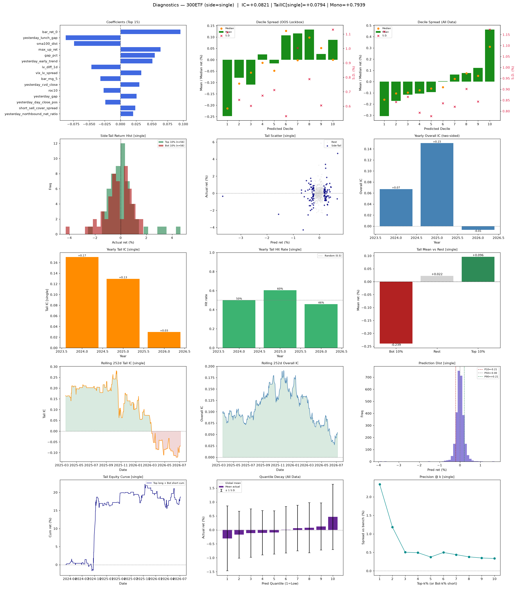

### 300ETF_gauss (300ETF, side=`single`)
- **Selected features**: 18
- **Active features**: 18
- **Active**: `outside_bar_reversal_day`, `gap_pct`, `yesterday_body_ratio`, `sma100_dist`, `yesterday_gap`, `yesterday_northbound_net_ratio`, `short_sell_cover_spread`, `bar_ret_0`, `max_up_ret`, `vix_iv_spread`, `iv_diff_1d`, `option_oi_growth`, `yesterday_day_close_pos`, `yesterday_cvd_close`, `yesterday_early_trend`, `yesterday_am_return`, `cvd_divergence_day`, `yesterday_lunch_gap`
- **Stopped by Step 1 (FDR Screening)** (0 features):
  None
- **Stopped by Step 2 (Stability & VIF Pruning)** (196 features):
  

  
Show 196 features

  
  `first_30min_return`, `early_realized_vol`, `early_range`, `early_trend`, `early_momentum`, `first_bar_return`, `first_bar_volume`, `early_vwap_dev`, `early_skew`, `early_kurtosis`, `bar_ret_1`, `bar_ret_2`, `bar_vol_0`, `bar_vol_4`, `bar_vol_5`, `bar_rng_0`, `bar_rng_2`, `bar_rng_3`, `bar_rng_5`, `bar_body_rng_0`, `bar_body_rng_1`, `bar_body_rng_2`, `bar_vwap_dev_0`, `bar_vwap_dev_1`, `bar_vwap_dev_2`, `bar_vwap_dev_3`, `bar_vwap_dev_5`, `num_up_bars`, `max_down_ret`, `cl_pos_in_range`, `body_to_range_ratio`, `total_path_length`, `volume_slope`, `spike_exhaustion_ratio`, `first_bar_sentiment`, `or_fill_ratio`, `close_vs_open_range`, `inside_bar_failure_bull`, `consecutive_higher_highs`, `early_bearish_engulfing_count`, `volume_surge_max`, `volume_concentration`, `volume_trend_intraday`, `volume_acceleration`, `volume_surge_direction`, `pullback_ratio`, `rally_ratio`, `range_expansion_ratio`, `pullback_depth_ratio`, `pullback_depth_max`, `rally_strength_max`, `vwap_slope_intraday`, `volume_weighted_price_position`, `net_volume_flow`, `early_body_momentum`, `late_bar_momentum`, `trend_strength_intraday`, `high_low_sequence_momentum`, `intraday_slope`, `intraday_autocorr`, `opening_momentum_score`, `opening_direction_stability`, `early_trend_hhi`, `session_high_proximity`, `session_low_proximity`, `close_above_open_count`, `open_to_current_return`, `upper_wick_dominance`, `rsi_opening`, `stoch_opening`, `momentum_strength_intraday`, `opening_auction_imbalance`, `intraday_close_position`, `limit_down_proximity_early`, `morning_trend_extrapolated`, `demark_setup_reversal_early`, `failed_breakout_reversal_early`, `early_wavetrend_cross`, `atr_expansion_flag_early`, `volatility_breakout_squeeze`, `early_bid_ask_spread_proxy`, `early_vwap_acceleration`, `early_order_flow_imbalance`, `rbreaker_sell_setup_proximity_early`, `rbreaker_buy_setup_proximity_early`, `skypark_gap_reversal_early`, `turtle_breakout_strength_early`, `macd_hist`, `sma20_dist`, `sma50_dist`, `atr14_norm`, `roc10`, `vol20`, `sma10_dist`, `sma200_dist`, `ema12_dist`, `rsi5`, `rsi21`, `roc5`, `roc20`, `roc60`, `cci14`, `willr14`, `stoch_k`, `stoch_d`, `mfi14`, `aroon_osc`, `vol5`, `vol10`, `vol60`, `vol_ratio_5_20`, `vol_ratio_10_60`, `bb_width`, `vol_pk20`, `vol_gk10`, `vol_gk20`, `volume_sma_ratio`, `margin_balance`, `buy_on_margin_value`, `margin_repayment`, `short_balance`, `short_balance_quantity`, `short_sell_quantity`, `short_repayment_quantity`, `total_balance`, `margin_net_buy`, `margin_short_ratio`, `capital_buy_volume`, `capital_buy_value`, `capital_sell_volume`, `capital_sell_value`, `capital_net_value`, `capital_net_ratio`, `northbound_buy`, `northbound_sell`, `northbound_net`, `iv`, `iv_vol_ratio`, `vix`, `vix_vol_ratio`, `vix_iv_ratio`, `vix_diff_1d`, `tech_value_rotation`, `yesterday_limit_up_touch`, `limit_up_proximity_day`, `limit_down_proximity_day`, `growth_momentum_ratio`, `high_beta_vol_ratio`, `vix_skew_proxy`, `vix_rolling_percentile_60d`, `iv_corridor_width`, `yesterday_vix_early_drift`, `vix_realized_spread`, `iv_envelope_deviation`, `margin_lever_ratio`, `capital_net_accel`, `northbound_volume_share`, `margin_buy_repayment_spread`, `margin_extreme_rank_252d`, `capital_large_order_ratio`, `consecutive_inside_bars_3d`, `wavetrend_osc_day`, `keltner_squeeze_width`, `yesterday_wavetrend_osc`, `yesterday_stoch_rsi_cross`, `yesterday_illiquidity_amihud`, `coppock_curve_day`, `yesterday_range_ratio`, `yesterday_volume_ratio`, `yesterday_return`, `yesterday_close_position`, `sma_distance_5d`, `sma_distance_60d`, `volatility_percentile_20d`, `volume_percentile_20d`, `yearly_high_distance`, `yearly_low_distance`, `twenty_gap_bars_regime`, `measured_move_proximity`, `yesterday_pm_return`, `yesterday_gap_pct`, `yesterday_first_30min_return`, `yesterday_early_realized_vol`, `yesterday_early_range`, `yesterday_early_momentum`, `yesterday_first_bar_volume`, `yesterday_early_vwap_dev`, `yesterday_day_range`, `yesterday_day_realized_vol`, `yesterday_day_pm_am_vol_ratio`, `yesterday_day_vwap_dev`, `yesterday_day_skew`, `yesterday_day_kurtosis`, `yesterday_afternoon_reversal`, `yesterday_pm_am_vol_ratio`, `yesterday_afternoon_momentum`
  

### 300ETF_rank (300ETF, side=`single`)
- **Selected features**: 17
- **Active features**: 16
- **Active**: `outside_bar_reversal_day`, `gap_pct`, `volume_slope`, `sma100_dist`, `yesterday_gap`, `yesterday_northbound_net_ratio`, `short_sell_cover_spread`, `bar_ret_0`, `max_up_ret`, `vix_iv_spread`, `iv_diff_1d`, `option_oi_growth`, `yesterday_day_close_pos`, `yesterday_cvd_close`, `yesterday_am_return`, `cvd_divergence_day`
- **Stopped by Step 1 (FDR Screening)** (0 features):
  None
- **Stopped by Step 2 (Stability & VIF Pruning)** (197 features):
  

  
Show 197 features

  
  `first_30min_return`, `early_realized_vol`, `early_range`, `early_trend`, `early_momentum`, `first_bar_return`, `first_bar_volume`, `early_vwap_dev`, `early_skew`, `early_kurtosis`, `bar_ret_1`, `bar_ret_2`, `bar_vol_0`, `bar_vol_4`, `bar_vol_5`, `bar_rng_0`, `bar_rng_2`, `bar_rng_3`, `bar_rng_5`, `bar_body_rng_0`, `bar_body_rng_1`, `bar_body_rng_2`, `bar_vwap_dev_0`, `bar_vwap_dev_1`, `bar_vwap_dev_2`, `bar_vwap_dev_3`, `bar_vwap_dev_5`, `num_up_bars`, `max_down_ret`, `cl_pos_in_range`, `body_to_range_ratio`, `total_path_length`, `spike_exhaustion_ratio`, `first_bar_sentiment`, `or_fill_ratio`, `close_vs_open_range`, `inside_bar_failure_bull`, `consecutive_higher_highs`, `early_bearish_engulfing_count`, `volume_surge_max`, `volume_concentration`, `volume_trend_intraday`, `volume_acceleration`, `volume_surge_direction`, `pullback_ratio`, `rally_ratio`, `range_expansion_ratio`, `pullback_depth_ratio`, `pullback_depth_max`, `rally_strength_max`, `vwap_slope_intraday`, `volume_weighted_price_position`, `net_volume_flow`, `early_body_momentum`, `late_bar_momentum`, `trend_strength_intraday`, `high_low_sequence_momentum`, `intraday_slope`, `intraday_autocorr`, `opening_momentum_score`, `opening_direction_stability`, `early_trend_hhi`, `session_high_proximity`, `session_low_proximity`, `close_above_open_count`, `open_to_current_return`, `upper_wick_dominance`, `rsi_opening`, `stoch_opening`, `momentum_strength_intraday`, `opening_auction_imbalance`, `intraday_close_position`, `limit_down_proximity_early`, `morning_trend_extrapolated`, `demark_setup_reversal_early`, `failed_breakout_reversal_early`, `early_wavetrend_cross`, `atr_expansion_flag_early`, `volatility_breakout_squeeze`, `early_bid_ask_spread_proxy`, `early_vwap_acceleration`, `early_order_flow_imbalance`, `rbreaker_sell_setup_proximity_early`, `rbreaker_buy_setup_proximity_early`, `skypark_gap_reversal_early`, `turtle_breakout_strength_early`, `macd_hist`, `sma20_dist`, `sma50_dist`, `atr14_norm`, `roc10`, `vol20`, `sma10_dist`, `sma200_dist`, `ema12_dist`, `rsi5`, `rsi21`, `roc5`, `roc20`, `roc60`, `cci14`, `willr14`, `stoch_k`, `stoch_d`, `mfi14`, `aroon_osc`, `vol5`, `vol10`, `vol60`, `vol_ratio_5_20`, `vol_ratio_10_60`, `bb_width`, `vol_pk20`, `vol_gk10`, `vol_gk20`, `volume_sma_ratio`, `margin_balance`, `buy_on_margin_value`, `margin_repayment`, `short_balance`, `short_balance_quantity`, `short_sell_quantity`, `short_repayment_quantity`, `total_balance`, `margin_net_buy`, `margin_short_ratio`, `capital_buy_volume`, `capital_buy_value`, `capital_sell_volume`, `capital_sell_value`, `capital_net_value`, `capital_net_ratio`, `northbound_buy`, `northbound_sell`, `northbound_net`, `iv`, `iv_vol_ratio`, `vix`, `vix_vol_ratio`, `vix_iv_ratio`, `vix_diff_1d`, `tech_value_rotation`, `yesterday_limit_up_touch`, `limit_up_proximity_day`, `limit_down_proximity_day`, `growth_momentum_ratio`, `high_beta_vol_ratio`, `vix_skew_proxy`, `vix_rolling_percentile_60d`, `iv_corridor_width`, `yesterday_vix_early_drift`, `vix_realized_spread`, `iv_envelope_deviation`, `margin_lever_ratio`, `capital_net_accel`, `northbound_volume_share`, `margin_buy_repayment_spread`, `margin_extreme_rank_252d`, `capital_large_order_ratio`, `consecutive_inside_bars_3d`, `wavetrend_osc_day`, `keltner_squeeze_width`, `yesterday_wavetrend_osc`, `yesterday_stoch_rsi_cross`, `yesterday_illiquidity_amihud`, `coppock_curve_day`, `yesterday_range_ratio`, `yesterday_body_ratio`, `yesterday_volume_ratio`, `yesterday_return`, `yesterday_close_position`, `sma_distance_5d`, `sma_distance_60d`, `volatility_percentile_20d`, `volume_percentile_20d`, `yearly_high_distance`, `yearly_low_distance`, `twenty_gap_bars_regime`, `measured_move_proximity`, `yesterday_pm_return`, `yesterday_gap_pct`, `yesterday_first_30min_return`, `yesterday_early_realized_vol`, `yesterday_early_range`, `yesterday_early_trend`, `yesterday_early_momentum`, `yesterday_first_bar_volume`, `yesterday_early_vwap_dev`, `yesterday_day_range`, `yesterday_day_realized_vol`, `yesterday_day_pm_am_vol_ratio`, `yesterday_day_vwap_dev`, `yesterday_day_skew`, `yesterday_day_kurtosis`, `yesterday_afternoon_reversal`, `yesterday_pm_am_vol_ratio`, `yesterday_afternoon_momentum`
  

### 300ETF_long (300ETF, side=`long`)
- **Selected features**: 16
- **Active features**: 16
- **Active**: `bar_vwap_dev_5`, `outside_bar_reversal_day`, `gap_pct`, `yesterday_body_ratio`, `sma100_dist`, `yesterday_gap`, `bar_ret_0`, `max_up_ret`, `vix_iv_spread`, `iv_diff_1d`, `yesterday_day_close_pos`, `yesterday_cvd_close`, `yesterday_early_trend`, `yesterday_am_return`, `cvd_divergence_day`, `yesterday_lunch_gap`
- **Stopped by Step 1 (FDR Screening)** (0 features):
  None
- **Stopped by Step 2 (Stability & VIF Pruning)** (198 features):
  

  
Show 198 features

  
  `first_30min_return`, `early_realized_vol`, `early_range`, `early_trend`, `early_momentum`, `first_bar_return`, `first_bar_volume`, `early_vwap_dev`, `early_skew`, `early_kurtosis`, `bar_ret_1`, `bar_ret_2`, `bar_vol_0`, `bar_vol_4`, `bar_vol_5`, `bar_rng_0`, `bar_rng_2`, `bar_rng_3`, `bar_rng_5`, `bar_body_rng_0`, `bar_body_rng_1`, `bar_body_rng_2`, `bar_vwap_dev_0`, `bar_vwap_dev_1`, `bar_vwap_dev_2`, `bar_vwap_dev_3`, `num_up_bars`, `max_down_ret`, `cl_pos_in_range`, `body_to_range_ratio`, `total_path_length`, `volume_slope`, `spike_exhaustion_ratio`, `first_bar_sentiment`, `or_fill_ratio`, `close_vs_open_range`, `inside_bar_failure_bull`, `consecutive_higher_highs`, `early_bearish_engulfing_count`, `volume_surge_max`, `volume_concentration`, `volume_trend_intraday`, `volume_acceleration`, `volume_surge_direction`, `pullback_ratio`, `rally_ratio`, `range_expansion_ratio`, `pullback_depth_ratio`, `pullback_depth_max`, `rally_strength_max`, `vwap_slope_intraday`, `volume_weighted_price_position`, `net_volume_flow`, `early_body_momentum`, `late_bar_momentum`, `trend_strength_intraday`, `high_low_sequence_momentum`, `intraday_slope`, `intraday_autocorr`, `opening_momentum_score`, `opening_direction_stability`, `early_trend_hhi`, `session_high_proximity`, `session_low_proximity`, `close_above_open_count`, `open_to_current_return`, `upper_wick_dominance`, `rsi_opening`, `stoch_opening`, `momentum_strength_intraday`, `opening_auction_imbalance`, `intraday_close_position`, `limit_down_proximity_early`, `morning_trend_extrapolated`, `demark_setup_reversal_early`, `failed_breakout_reversal_early`, `early_wavetrend_cross`, `atr_expansion_flag_early`, `volatility_breakout_squeeze`, `early_bid_ask_spread_proxy`, `early_vwap_acceleration`, `early_order_flow_imbalance`, `rbreaker_sell_setup_proximity_early`, `rbreaker_buy_setup_proximity_early`, `skypark_gap_reversal_early`, `turtle_breakout_strength_early`, `macd_hist`, `sma20_dist`, `sma50_dist`, `atr14_norm`, `roc10`, `vol20`, `sma10_dist`, `sma200_dist`, `ema12_dist`, `rsi5`, `rsi21`, `roc5`, `roc20`, `roc60`, `cci14`, `willr14`, `stoch_k`, `stoch_d`, `mfi14`, `aroon_osc`, `vol5`, `vol10`, `vol60`, `vol_ratio_5_20`, `vol_ratio_10_60`, `bb_width`, `vol_pk20`, `vol_gk10`, `vol_gk20`, `volume_sma_ratio`, `margin_balance`, `buy_on_margin_value`, `margin_repayment`, `short_balance`, `short_balance_quantity`, `short_sell_quantity`, `short_repayment_quantity`, `total_balance`, `margin_net_buy`, `margin_short_ratio`, `capital_buy_volume`, `capital_buy_value`, `capital_sell_volume`, `capital_sell_value`, `capital_net_value`, `capital_net_ratio`, `northbound_buy`, `northbound_sell`, `northbound_net`, `iv`, `iv_vol_ratio`, `vix`, `vix_vol_ratio`, `vix_iv_ratio`, `vix_diff_1d`, `tech_value_rotation`, `yesterday_limit_up_touch`, `limit_up_proximity_day`, `limit_down_proximity_day`, `growth_momentum_ratio`, `high_beta_vol_ratio`, `vix_skew_proxy`, `vix_rolling_percentile_60d`, `iv_corridor_width`, `yesterday_vix_early_drift`, `vix_realized_spread`, `option_oi_growth`, `iv_envelope_deviation`, `margin_lever_ratio`, `capital_net_accel`, `northbound_volume_share`, `yesterday_northbound_net_ratio`, `margin_buy_repayment_spread`, `short_sell_cover_spread`, `margin_extreme_rank_252d`, `capital_large_order_ratio`, `consecutive_inside_bars_3d`, `wavetrend_osc_day`, `keltner_squeeze_width`, `yesterday_wavetrend_osc`, `yesterday_stoch_rsi_cross`, `yesterday_illiquidity_amihud`, `coppock_curve_day`, `yesterday_range_ratio`, `yesterday_volume_ratio`, `yesterday_return`, `yesterday_close_position`, `sma_distance_5d`, `sma_distance_60d`, `volatility_percentile_20d`, `volume_percentile_20d`, `yearly_high_distance`, `yearly_low_distance`, `twenty_gap_bars_regime`, `measured_move_proximity`, `yesterday_pm_return`, `yesterday_gap_pct`, `yesterday_first_30min_return`, `yesterday_early_realized_vol`, `yesterday_early_range`, `yesterday_early_momentum`, `yesterday_first_bar_volume`, `yesterday_early_vwap_dev`, `yesterday_day_range`, `yesterday_day_realized_vol`, `yesterday_day_pm_am_vol_ratio`, `yesterday_day_vwap_dev`, `yesterday_day_skew`, `yesterday_day_kurtosis`, `yesterday_afternoon_reversal`, `yesterday_pm_am_vol_ratio`, `yesterday_afternoon_momentum`
  

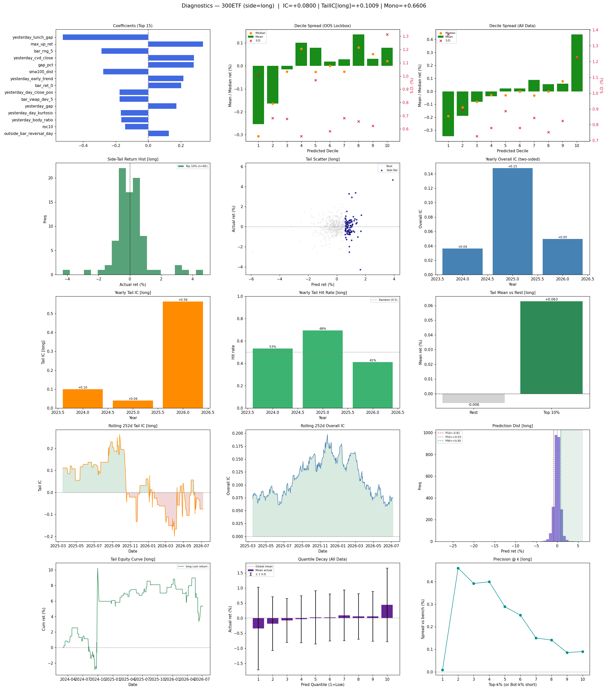

### 300ETF_long_gauss (300ETF, side=`long`)
- **Selected features**: 18
- **Active features**: 18
- **Active**: `outside_bar_reversal_day`, `gap_pct`, `yesterday_body_ratio`, `sma100_dist`, `yesterday_gap`, `yesterday_northbound_net_ratio`, `short_sell_cover_spread`, `bar_ret_0`, `max_up_ret`, `vix_iv_spread`, `iv_diff_1d`, `option_oi_growth`, `yesterday_day_close_pos`, `yesterday_cvd_close`, `yesterday_early_trend`, `yesterday_am_return`, `cvd_divergence_day`, `yesterday_lunch_gap`
- **Stopped by Step 1 (FDR Screening)** (0 features):
  None
- **Stopped by Step 2 (Stability & VIF Pruning)** (196 features):
  

  
Show 196 features

  
  `first_30min_return`, `early_realized_vol`, `early_range`, `early_trend`, `early_momentum`, `first_bar_return`, `first_bar_volume`, `early_vwap_dev`, `early_skew`, `early_kurtosis`, `bar_ret_1`, `bar_ret_2`, `bar_vol_0`, `bar_vol_4`, `bar_vol_5`, `bar_rng_0`, `bar_rng_2`, `bar_rng_3`, `bar_rng_5`, `bar_body_rng_0`, `bar_body_rng_1`, `bar_body_rng_2`, `bar_vwap_dev_0`, `bar_vwap_dev_1`, `bar_vwap_dev_2`, `bar_vwap_dev_3`, `bar_vwap_dev_5`, `num_up_bars`, `max_down_ret`, `cl_pos_in_range`, `body_to_range_ratio`, `total_path_length`, `volume_slope`, `spike_exhaustion_ratio`, `first_bar_sentiment`, `or_fill_ratio`, `close_vs_open_range`, `inside_bar_failure_bull`, `consecutive_higher_highs`, `early_bearish_engulfing_count`, `volume_surge_max`, `volume_concentration`, `volume_trend_intraday`, `volume_acceleration`, `volume_surge_direction`, `pullback_ratio`, `rally_ratio`, `range_expansion_ratio`, `pullback_depth_ratio`, `pullback_depth_max`, `rally_strength_max`, `vwap_slope_intraday`, `volume_weighted_price_position`, `net_volume_flow`, `early_body_momentum`, `late_bar_momentum`, `trend_strength_intraday`, `high_low_sequence_momentum`, `intraday_slope`, `intraday_autocorr`, `opening_momentum_score`, `opening_direction_stability`, `early_trend_hhi`, `session_high_proximity`, `session_low_proximity`, `close_above_open_count`, `open_to_current_return`, `upper_wick_dominance`, `rsi_opening`, `stoch_opening`, `momentum_strength_intraday`, `opening_auction_imbalance`, `intraday_close_position`, `limit_down_proximity_early`, `morning_trend_extrapolated`, `demark_setup_reversal_early`, `failed_breakout_reversal_early`, `early_wavetrend_cross`, `atr_expansion_flag_early`, `volatility_breakout_squeeze`, `early_bid_ask_spread_proxy`, `early_vwap_acceleration`, `early_order_flow_imbalance`, `rbreaker_sell_setup_proximity_early`, `rbreaker_buy_setup_proximity_early`, `skypark_gap_reversal_early`, `turtle_breakout_strength_early`, `macd_hist`, `sma20_dist`, `sma50_dist`, `atr14_norm`, `roc10`, `vol20`, `sma10_dist`, `sma200_dist`, `ema12_dist`, `rsi5`, `rsi21`, `roc5`, `roc20`, `roc60`, `cci14`, `willr14`, `stoch_k`, `stoch_d`, `mfi14`, `aroon_osc`, `vol5`, `vol10`, `vol60`, `vol_ratio_5_20`, `vol_ratio_10_60`, `bb_width`, `vol_pk20`, `vol_gk10`, `vol_gk20`, `volume_sma_ratio`, `margin_balance`, `buy_on_margin_value`, `margin_repayment`, `short_balance`, `short_balance_quantity`, `short_sell_quantity`, `short_repayment_quantity`, `total_balance`, `margin_net_buy`, `margin_short_ratio`, `capital_buy_volume`, `capital_buy_value`, `capital_sell_volume`, `capital_sell_value`, `capital_net_value`, `capital_net_ratio`, `northbound_buy`, `northbound_sell`, `northbound_net`, `iv`, `iv_vol_ratio`, `vix`, `vix_vol_ratio`, `vix_iv_ratio`, `vix_diff_1d`, `tech_value_rotation`, `yesterday_limit_up_touch`, `limit_up_proximity_day`, `limit_down_proximity_day`, `growth_momentum_ratio`, `high_beta_vol_ratio`, `vix_skew_proxy`, `vix_rolling_percentile_60d`, `iv_corridor_width`, `yesterday_vix_early_drift`, `vix_realized_spread`, `iv_envelope_deviation`, `margin_lever_ratio`, `capital_net_accel`, `northbound_volume_share`, `margin_buy_repayment_spread`, `margin_extreme_rank_252d`, `capital_large_order_ratio`, `consecutive_inside_bars_3d`, `wavetrend_osc_day`, `keltner_squeeze_width`, `yesterday_wavetrend_osc`, `yesterday_stoch_rsi_cross`, `yesterday_illiquidity_amihud`, `coppock_curve_day`, `yesterday_range_ratio`, `yesterday_volume_ratio`, `yesterday_return`, `yesterday_close_position`, `sma_distance_5d`, `sma_distance_60d`, `volatility_percentile_20d`, `volume_percentile_20d`, `yearly_high_distance`, `yearly_low_distance`, `twenty_gap_bars_regime`, `measured_move_proximity`, `yesterday_pm_return`, `yesterday_gap_pct`, `yesterday_first_30min_return`, `yesterday_early_realized_vol`, `yesterday_early_range`, `yesterday_early_momentum`, `yesterday_first_bar_volume`, `yesterday_early_vwap_dev`, `yesterday_day_range`, `yesterday_day_realized_vol`, `yesterday_day_pm_am_vol_ratio`, `yesterday_day_vwap_dev`, `yesterday_day_skew`, `yesterday_day_kurtosis`, `yesterday_afternoon_reversal`, `yesterday_pm_am_vol_ratio`, `yesterday_afternoon_momentum`
  

### 300ETF_long_rank (300ETF, side=`long`)
- **Selected features**: 18
- **Active features**: 18
- **Active**: `outside_bar_reversal_day`, `gap_pct`, `volume_slope`, `sma100_dist`, `yesterday_gap`, `yesterday_northbound_net_ratio`, `short_sell_cover_spread`, `bar_ret_0`, `max_up_ret`, `vix_iv_spread`, `iv_diff_1d`, `option_oi_growth`, `measured_move_proximity`, `yesterday_day_close_pos`, `yesterday_cvd_close`, `yesterday_am_return`, `cvd_divergence_day`, `yesterday_lunch_gap`
- **Stopped by Step 1 (FDR Screening)** (0 features):
  None
- **Stopped by Step 2 (Stability & VIF Pruning)** (196 features):
  

  
Show 196 features

  
  `first_30min_return`, `early_realized_vol`, `early_range`, `early_trend`, `early_momentum`, `first_bar_return`, `first_bar_volume`, `early_vwap_dev`, `early_skew`, `early_kurtosis`, `bar_ret_1`, `bar_ret_2`, `bar_vol_0`, `bar_vol_4`, `bar_vol_5`, `bar_rng_0`, `bar_rng_2`, `bar_rng_3`, `bar_rng_5`, `bar_body_rng_0`, `bar_body_rng_1`, `bar_body_rng_2`, `bar_vwap_dev_0`, `bar_vwap_dev_1`, `bar_vwap_dev_2`, `bar_vwap_dev_3`, `bar_vwap_dev_5`, `num_up_bars`, `max_down_ret`, `cl_pos_in_range`, `body_to_range_ratio`, `total_path_length`, `spike_exhaustion_ratio`, `first_bar_sentiment`, `or_fill_ratio`, `close_vs_open_range`, `inside_bar_failure_bull`, `consecutive_higher_highs`, `early_bearish_engulfing_count`, `volume_surge_max`, `volume_concentration`, `volume_trend_intraday`, `volume_acceleration`, `volume_surge_direction`, `pullback_ratio`, `rally_ratio`, `range_expansion_ratio`, `pullback_depth_ratio`, `pullback_depth_max`, `rally_strength_max`, `vwap_slope_intraday`, `volume_weighted_price_position`, `net_volume_flow`, `early_body_momentum`, `late_bar_momentum`, `trend_strength_intraday`, `high_low_sequence_momentum`, `intraday_slope`, `intraday_autocorr`, `opening_momentum_score`, `opening_direction_stability`, `early_trend_hhi`, `session_high_proximity`, `session_low_proximity`, `close_above_open_count`, `open_to_current_return`, `upper_wick_dominance`, `rsi_opening`, `stoch_opening`, `momentum_strength_intraday`, `opening_auction_imbalance`, `intraday_close_position`, `limit_down_proximity_early`, `morning_trend_extrapolated`, `demark_setup_reversal_early`, `failed_breakout_reversal_early`, `early_wavetrend_cross`, `atr_expansion_flag_early`, `volatility_breakout_squeeze`, `early_bid_ask_spread_proxy`, `early_vwap_acceleration`, `early_order_flow_imbalance`, `rbreaker_sell_setup_proximity_early`, `rbreaker_buy_setup_proximity_early`, `skypark_gap_reversal_early`, `turtle_breakout_strength_early`, `macd_hist`, `sma20_dist`, `sma50_dist`, `atr14_norm`, `roc10`, `vol20`, `sma10_dist`, `sma200_dist`, `ema12_dist`, `rsi5`, `rsi21`, `roc5`, `roc20`, `roc60`, `cci14`, `willr14`, `stoch_k`, `stoch_d`, `mfi14`, `aroon_osc`, `vol5`, `vol10`, `vol60`, `vol_ratio_5_20`, `vol_ratio_10_60`, `bb_width`, `vol_pk20`, `vol_gk10`, `vol_gk20`, `volume_sma_ratio`, `margin_balance`, `buy_on_margin_value`, `margin_repayment`, `short_balance`, `short_balance_quantity`, `short_sell_quantity`, `short_repayment_quantity`, `total_balance`, `margin_net_buy`, `margin_short_ratio`, `capital_buy_volume`, `capital_buy_value`, `capital_sell_volume`, `capital_sell_value`, `capital_net_value`, `capital_net_ratio`, `northbound_buy`, `northbound_sell`, `northbound_net`, `iv`, `iv_vol_ratio`, `vix`, `vix_vol_ratio`, `vix_iv_ratio`, `vix_diff_1d`, `tech_value_rotation`, `yesterday_limit_up_touch`, `limit_up_proximity_day`, `limit_down_proximity_day`, `growth_momentum_ratio`, `high_beta_vol_ratio`, `vix_skew_proxy`, `vix_rolling_percentile_60d`, `iv_corridor_width`, `yesterday_vix_early_drift`, `vix_realized_spread`, `iv_envelope_deviation`, `margin_lever_ratio`, `capital_net_accel`, `northbound_volume_share`, `margin_buy_repayment_spread`, `margin_extreme_rank_252d`, `capital_large_order_ratio`, `consecutive_inside_bars_3d`, `wavetrend_osc_day`, `keltner_squeeze_width`, `yesterday_wavetrend_osc`, `yesterday_stoch_rsi_cross`, `yesterday_illiquidity_amihud`, `coppock_curve_day`, `yesterday_range_ratio`, `yesterday_body_ratio`, `yesterday_volume_ratio`, `yesterday_return`, `yesterday_close_position`, `sma_distance_5d`, `sma_distance_60d`, `volatility_percentile_20d`, `volume_percentile_20d`, `yearly_high_distance`, `yearly_low_distance`, `twenty_gap_bars_regime`, `yesterday_pm_return`, `yesterday_gap_pct`, `yesterday_first_30min_return`, `yesterday_early_realized_vol`, `yesterday_early_range`, `yesterday_early_trend`, `yesterday_early_momentum`, `yesterday_first_bar_volume`, `yesterday_early_vwap_dev`, `yesterday_day_range`, `yesterday_day_realized_vol`, `yesterday_day_pm_am_vol_ratio`, `yesterday_day_vwap_dev`, `yesterday_day_skew`, `yesterday_day_kurtosis`, `yesterday_afternoon_reversal`, `yesterday_pm_am_vol_ratio`, `yesterday_afternoon_momentum`
  

### 300ETF_short (300ETF, side=`short`)
- **Selected features**: 16
- **Active features**: 16
- **Active**: `bar_vwap_dev_5`, `outside_bar_reversal_day`, `gap_pct`, `yesterday_body_ratio`, `sma100_dist`, `yesterday_gap`, `bar_ret_0`, `max_up_ret`, `vix_iv_spread`, `iv_diff_1d`, `yesterday_day_close_pos`, `yesterday_cvd_close`, `yesterday_early_trend`, `yesterday_am_return`, `cvd_divergence_day`, `yesterday_lunch_gap`
- **Stopped by Step 1 (FDR Screening)** (0 features):
  None
- **Stopped by Step 2 (Stability & VIF Pruning)** (198 features):
  

  
Show 198 features

  
  `first_30min_return`, `early_realized_vol`, `early_range`, `early_trend`, `early_momentum`, `first_bar_return`, `first_bar_volume`, `early_vwap_dev`, `early_skew`, `early_kurtosis`, `bar_ret_1`, `bar_ret_2`, `bar_vol_0`, `bar_vol_4`, `bar_vol_5`, `bar_rng_0`, `bar_rng_2`, `bar_rng_3`, `bar_rng_5`, `bar_body_rng_0`, `bar_body_rng_1`, `bar_body_rng_2`, `bar_vwap_dev_0`, `bar_vwap_dev_1`, `bar_vwap_dev_2`, `bar_vwap_dev_3`, `num_up_bars`, `max_down_ret`, `cl_pos_in_range`, `body_to_range_ratio`, `total_path_length`, `volume_slope`, `spike_exhaustion_ratio`, `first_bar_sentiment`, `or_fill_ratio`, `close_vs_open_range`, `inside_bar_failure_bull`, `consecutive_higher_highs`, `early_bearish_engulfing_count`, `volume_surge_max`, `volume_concentration`, `volume_trend_intraday`, `volume_acceleration`, `volume_surge_direction`, `pullback_ratio`, `rally_ratio`, `range_expansion_ratio`, `pullback_depth_ratio`, `pullback_depth_max`, `rally_strength_max`, `vwap_slope_intraday`, `volume_weighted_price_position`, `net_volume_flow`, `early_body_momentum`, `late_bar_momentum`, `trend_strength_intraday`, `high_low_sequence_momentum`, `intraday_slope`, `intraday_autocorr`, `opening_momentum_score`, `opening_direction_stability`, `early_trend_hhi`, `session_high_proximity`, `session_low_proximity`, `close_above_open_count`, `open_to_current_return`, `upper_wick_dominance`, `rsi_opening`, `stoch_opening`, `momentum_strength_intraday`, `opening_auction_imbalance`, `intraday_close_position`, `limit_down_proximity_early`, `morning_trend_extrapolated`, `demark_setup_reversal_early`, `failed_breakout_reversal_early`, `early_wavetrend_cross`, `atr_expansion_flag_early`, `volatility_breakout_squeeze`, `early_bid_ask_spread_proxy`, `early_vwap_acceleration`, `early_order_flow_imbalance`, `rbreaker_sell_setup_proximity_early`, `rbreaker_buy_setup_proximity_early`, `skypark_gap_reversal_early`, `turtle_breakout_strength_early`, `macd_hist`, `sma20_dist`, `sma50_dist`, `atr14_norm`, `roc10`, `vol20`, `sma10_dist`, `sma200_dist`, `ema12_dist`, `rsi5`, `rsi21`, `roc5`, `roc20`, `roc60`, `cci14`, `willr14`, `stoch_k`, `stoch_d`, `mfi14`, `aroon_osc`, `vol5`, `vol10`, `vol60`, `vol_ratio_5_20`, `vol_ratio_10_60`, `bb_width`, `vol_pk20`, `vol_gk10`, `vol_gk20`, `volume_sma_ratio`, `margin_balance`, `buy_on_margin_value`, `margin_repayment`, `short_balance`, `short_balance_quantity`, `short_sell_quantity`, `short_repayment_quantity`, `total_balance`, `margin_net_buy`, `margin_short_ratio`, `capital_buy_volume`, `capital_buy_value`, `capital_sell_volume`, `capital_sell_value`, `capital_net_value`, `capital_net_ratio`, `northbound_buy`, `northbound_sell`, `northbound_net`, `iv`, `iv_vol_ratio`, `vix`, `vix_vol_ratio`, `vix_iv_ratio`, `vix_diff_1d`, `tech_value_rotation`, `yesterday_limit_up_touch`, `limit_up_proximity_day`, `limit_down_proximity_day`, `growth_momentum_ratio`, `high_beta_vol_ratio`, `vix_skew_proxy`, `vix_rolling_percentile_60d`, `iv_corridor_width`, `yesterday_vix_early_drift`, `vix_realized_spread`, `option_oi_growth`, `iv_envelope_deviation`, `margin_lever_ratio`, `capital_net_accel`, `northbound_volume_share`, `yesterday_northbound_net_ratio`, `margin_buy_repayment_spread`, `short_sell_cover_spread`, `margin_extreme_rank_252d`, `capital_large_order_ratio`, `consecutive_inside_bars_3d`, `wavetrend_osc_day`, `keltner_squeeze_width`, `yesterday_wavetrend_osc`, `yesterday_stoch_rsi_cross`, `yesterday_illiquidity_amihud`, `coppock_curve_day`, `yesterday_range_ratio`, `yesterday_volume_ratio`, `yesterday_return`, `yesterday_close_position`, `sma_distance_5d`, `sma_distance_60d`, `volatility_percentile_20d`, `volume_percentile_20d`, `yearly_high_distance`, `yearly_low_distance`, `twenty_gap_bars_regime`, `measured_move_proximity`, `yesterday_pm_return`, `yesterday_gap_pct`, `yesterday_first_30min_return`, `yesterday_early_realized_vol`, `yesterday_early_range`, `yesterday_early_momentum`, `yesterday_first_bar_volume`, `yesterday_early_vwap_dev`, `yesterday_day_range`, `yesterday_day_realized_vol`, `yesterday_day_pm_am_vol_ratio`, `yesterday_day_vwap_dev`, `yesterday_day_skew`, `yesterday_day_kurtosis`, `yesterday_afternoon_reversal`, `yesterday_pm_am_vol_ratio`, `yesterday_afternoon_momentum`
  

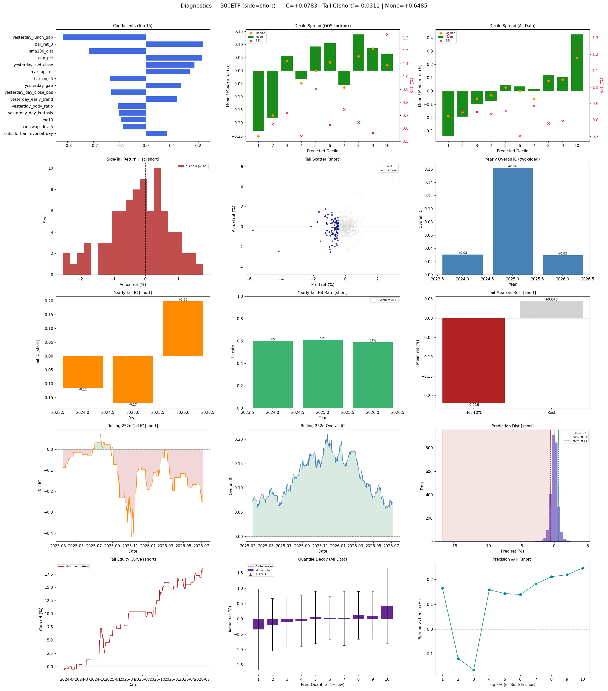

### 300ETF_short_gauss (300ETF, side=`short`)
- **Selected features**: 18
- **Active features**: 18
- **Active**: `outside_bar_reversal_day`, `gap_pct`, `yesterday_body_ratio`, `sma100_dist`, `yesterday_gap`, `yesterday_northbound_net_ratio`, `short_sell_cover_spread`, `bar_ret_0`, `max_up_ret`, `vix_iv_spread`, `iv_diff_1d`, `option_oi_growth`, `yesterday_day_close_pos`, `yesterday_cvd_close`, `yesterday_early_trend`, `yesterday_am_return`, `cvd_divergence_day`, `yesterday_lunch_gap`
- **Stopped by Step 1 (FDR Screening)** (0 features):
  None
- **Stopped by Step 2 (Stability & VIF Pruning)** (196 features):
  

  
Show 196 features

  
  `first_30min_return`, `early_realized_vol`, `early_range`, `early_trend`, `early_momentum`, `first_bar_return`, `first_bar_volume`, `early_vwap_dev`, `early_skew`, `early_kurtosis`, `bar_ret_1`, `bar_ret_2`, `bar_vol_0`, `bar_vol_4`, `bar_vol_5`, `bar_rng_0`, `bar_rng_2`, `bar_rng_3`, `bar_rng_5`, `bar_body_rng_0`, `bar_body_rng_1`, `bar_body_rng_2`, `bar_vwap_dev_0`, `bar_vwap_dev_1`, `bar_vwap_dev_2`, `bar_vwap_dev_3`, `bar_vwap_dev_5`, `num_up_bars`, `max_down_ret`, `cl_pos_in_range`, `body_to_range_ratio`, `total_path_length`, `volume_slope`, `spike_exhaustion_ratio`, `first_bar_sentiment`, `or_fill_ratio`, `close_vs_open_range`, `inside_bar_failure_bull`, `consecutive_higher_highs`, `early_bearish_engulfing_count`, `volume_surge_max`, `volume_concentration`, `volume_trend_intraday`, `volume_acceleration`, `volume_surge_direction`, `pullback_ratio`, `rally_ratio`, `range_expansion_ratio`, `pullback_depth_ratio`, `pullback_depth_max`, `rally_strength_max`, `vwap_slope_intraday`, `volume_weighted_price_position`, `net_volume_flow`, `early_body_momentum`, `late_bar_momentum`, `trend_strength_intraday`, `high_low_sequence_momentum`, `intraday_slope`, `intraday_autocorr`, `opening_momentum_score`, `opening_direction_stability`, `early_trend_hhi`, `session_high_proximity`, `session_low_proximity`, `close_above_open_count`, `open_to_current_return`, `upper_wick_dominance`, `rsi_opening`, `stoch_opening`, `momentum_strength_intraday`, `opening_auction_imbalance`, `intraday_close_position`, `limit_down_proximity_early`, `morning_trend_extrapolated`, `demark_setup_reversal_early`, `failed_breakout_reversal_early`, `early_wavetrend_cross`, `atr_expansion_flag_early`, `volatility_breakout_squeeze`, `early_bid_ask_spread_proxy`, `early_vwap_acceleration`, `early_order_flow_imbalance`, `rbreaker_sell_setup_proximity_early`, `rbreaker_buy_setup_proximity_early`, `skypark_gap_reversal_early`, `turtle_breakout_strength_early`, `macd_hist`, `sma20_dist`, `sma50_dist`, `atr14_norm`, `roc10`, `vol20`, `sma10_dist`, `sma200_dist`, `ema12_dist`, `rsi5`, `rsi21`, `roc5`, `roc20`, `roc60`, `cci14`, `willr14`, `stoch_k`, `stoch_d`, `mfi14`, `aroon_osc`, `vol5`, `vol10`, `vol60`, `vol_ratio_5_20`, `vol_ratio_10_60`, `bb_width`, `vol_pk20`, `vol_gk10`, `vol_gk20`, `volume_sma_ratio`, `margin_balance`, `buy_on_margin_value`, `margin_repayment`, `short_balance`, `short_balance_quantity`, `short_sell_quantity`, `short_repayment_quantity`, `total_balance`, `margin_net_buy`, `margin_short_ratio`, `capital_buy_volume`, `capital_buy_value`, `capital_sell_volume`, `capital_sell_value`, `capital_net_value`, `capital_net_ratio`, `northbound_buy`, `northbound_sell`, `northbound_net`, `iv`, `iv_vol_ratio`, `vix`, `vix_vol_ratio`, `vix_iv_ratio`, `vix_diff_1d`, `tech_value_rotation`, `yesterday_limit_up_touch`, `limit_up_proximity_day`, `limit_down_proximity_day`, `growth_momentum_ratio`, `high_beta_vol_ratio`, `vix_skew_proxy`, `vix_rolling_percentile_60d`, `iv_corridor_width`, `yesterday_vix_early_drift`, `vix_realized_spread`, `iv_envelope_deviation`, `margin_lever_ratio`, `capital_net_accel`, `northbound_volume_share`, `margin_buy_repayment_spread`, `margin_extreme_rank_252d`, `capital_large_order_ratio`, `consecutive_inside_bars_3d`, `wavetrend_osc_day`, `keltner_squeeze_width`, `yesterday_wavetrend_osc`, `yesterday_stoch_rsi_cross`, `yesterday_illiquidity_amihud`, `coppock_curve_day`, `yesterday_range_ratio`, `yesterday_volume_ratio`, `yesterday_return`, `yesterday_close_position`, `sma_distance_5d`, `sma_distance_60d`, `volatility_percentile_20d`, `volume_percentile_20d`, `yearly_high_distance`, `yearly_low_distance`, `twenty_gap_bars_regime`, `measured_move_proximity`, `yesterday_pm_return`, `yesterday_gap_pct`, `yesterday_first_30min_return`, `yesterday_early_realized_vol`, `yesterday_early_range`, `yesterday_early_momentum`, `yesterday_first_bar_volume`, `yesterday_early_vwap_dev`, `yesterday_day_range`, `yesterday_day_realized_vol`, `yesterday_day_pm_am_vol_ratio`, `yesterday_day_vwap_dev`, `yesterday_day_skew`, `yesterday_day_kurtosis`, `yesterday_afternoon_reversal`, `yesterday_pm_am_vol_ratio`, `yesterday_afternoon_momentum`
  

### 300ETF_short_rank (300ETF, side=`short`)
- **Selected features**: 18
- **Active features**: 18
- **Active**: `outside_bar_reversal_day`, `gap_pct`, `volume_slope`, `sma100_dist`, `yesterday_gap`, `yesterday_northbound_net_ratio`, `short_sell_cover_spread`, `bar_ret_0`, `max_up_ret`, `vix_iv_spread`, `iv_diff_1d`, `option_oi_growth`, `measured_move_proximity`, `yesterday_day_close_pos`, `yesterday_cvd_close`, `yesterday_am_return`, `cvd_divergence_day`, `yesterday_lunch_gap`
- **Stopped by Step 1 (FDR Screening)** (0 features):
  None
- **Stopped by Step 2 (Stability & VIF Pruning)** (196 features):
  

  
Show 196 features

  
  `first_30min_return`, `early_realized_vol`, `early_range`, `early_trend`, `early_momentum`, `first_bar_return`, `first_bar_volume`, `early_vwap_dev`, `early_skew`, `early_kurtosis`, `bar_ret_1`, `bar_ret_2`, `bar_vol_0`, `bar_vol_4`, `bar_vol_5`, `bar_rng_0`, `bar_rng_2`, `bar_rng_3`, `bar_rng_5`, `bar_body_rng_0`, `bar_body_rng_1`, `bar_body_rng_2`, `bar_vwap_dev_0`, `bar_vwap_dev_1`, `bar_vwap_dev_2`, `bar_vwap_dev_3`, `bar_vwap_dev_5`, `num_up_bars`, `max_down_ret`, `cl_pos_in_range`, `body_to_range_ratio`, `total_path_length`, `spike_exhaustion_ratio`, `first_bar_sentiment`, `or_fill_ratio`, `close_vs_open_range`, `inside_bar_failure_bull`, `consecutive_higher_highs`, `early_bearish_engulfing_count`, `volume_surge_max`, `volume_concentration`, `volume_trend_intraday`, `volume_acceleration`, `volume_surge_direction`, `pullback_ratio`, `rally_ratio`, `range_expansion_ratio`, `pullback_depth_ratio`, `pullback_depth_max`, `rally_strength_max`, `vwap_slope_intraday`, `volume_weighted_price_position`, `net_volume_flow`, `early_body_momentum`, `late_bar_momentum`, `trend_strength_intraday`, `high_low_sequence_momentum`, `intraday_slope`, `intraday_autocorr`, `opening_momentum_score`, `opening_direction_stability`, `early_trend_hhi`, `session_high_proximity`, `session_low_proximity`, `close_above_open_count`, `open_to_current_return`, `upper_wick_dominance`, `rsi_opening`, `stoch_opening`, `momentum_strength_intraday`, `opening_auction_imbalance`, `intraday_close_position`, `limit_down_proximity_early`, `morning_trend_extrapolated`, `demark_setup_reversal_early`, `failed_breakout_reversal_early`, `early_wavetrend_cross`, `atr_expansion_flag_early`, `volatility_breakout_squeeze`, `early_bid_ask_spread_proxy`, `early_vwap_acceleration`, `early_order_flow_imbalance`, `rbreaker_sell_setup_proximity_early`, `rbreaker_buy_setup_proximity_early`, `skypark_gap_reversal_early`, `turtle_breakout_strength_early`, `macd_hist`, `sma20_dist`, `sma50_dist`, `atr14_norm`, `roc10`, `vol20`, `sma10_dist`, `sma200_dist`, `ema12_dist`, `rsi5`, `rsi21`, `roc5`, `roc20`, `roc60`, `cci14`, `willr14`, `stoch_k`, `stoch_d`, `mfi14`, `aroon_osc`, `vol5`, `vol10`, `vol60`, `vol_ratio_5_20`, `vol_ratio_10_60`, `bb_width`, `vol_pk20`, `vol_gk10`, `vol_gk20`, `volume_sma_ratio`, `margin_balance`, `buy_on_margin_value`, `margin_repayment`, `short_balance`, `short_balance_quantity`, `short_sell_quantity`, `short_repayment_quantity`, `total_balance`, `margin_net_buy`, `margin_short_ratio`, `capital_buy_volume`, `capital_buy_value`, `capital_sell_volume`, `capital_sell_value`, `capital_net_value`, `capital_net_ratio`, `northbound_buy`, `northbound_sell`, `northbound_net`, `iv`, `iv_vol_ratio`, `vix`, `vix_vol_ratio`, `vix_iv_ratio`, `vix_diff_1d`, `tech_value_rotation`, `yesterday_limit_up_touch`, `limit_up_proximity_day`, `limit_down_proximity_day`, `growth_momentum_ratio`, `high_beta_vol_ratio`, `vix_skew_proxy`, `vix_rolling_percentile_60d`, `iv_corridor_width`, `yesterday_vix_early_drift`, `vix_realized_spread`, `iv_envelope_deviation`, `margin_lever_ratio`, `capital_net_accel`, `northbound_volume_share`, `margin_buy_repayment_spread`, `margin_extreme_rank_252d`, `capital_large_order_ratio`, `consecutive_inside_bars_3d`, `wavetrend_osc_day`, `keltner_squeeze_width`, `yesterday_wavetrend_osc`, `yesterday_stoch_rsi_cross`, `yesterday_illiquidity_amihud`, `coppock_curve_day`, `yesterday_range_ratio`, `yesterday_body_ratio`, `yesterday_volume_ratio`, `yesterday_return`, `yesterday_close_position`, `sma_distance_5d`, `sma_distance_60d`, `volatility_percentile_20d`, `volume_percentile_20d`, `yearly_high_distance`, `yearly_low_distance`, `twenty_gap_bars_regime`, `yesterday_pm_return`, `yesterday_gap_pct`, `yesterday_first_30min_return`, `yesterday_early_realized_vol`, `yesterday_early_range`, `yesterday_early_trend`, `yesterday_early_momentum`, `yesterday_first_bar_volume`, `yesterday_early_vwap_dev`, `yesterday_day_range`, `yesterday_day_realized_vol`, `yesterday_day_pm_am_vol_ratio`, `yesterday_day_vwap_dev`, `yesterday_day_skew`, `yesterday_day_kurtosis`, `yesterday_afternoon_reversal`, `yesterday_pm_am_vol_ratio`, `yesterday_afternoon_momentum`
  

### 500ETF (500ETF, side=`single`)
- **Selected features**: 13
- **Active features**: 12
- **Active**: `bar_rng_0`, `yesterday_lunch_gap`, `yesterday_gap`, `bar_ret_0`, `max_up_ret`, `yesterday_early_trend`, `bar_vwap_dev_2`, `early_skew`, `sma100_dist`, `margin_buy_repayment_spread`, `gap_pct`, `yesterday_afternoon_momentum`
- **Stopped by Step 1 (FDR Screening)** (0 features):
  None
- **Stopped by Step 2 (Stability & VIF Pruning)** (201 features):
  

  
Show 201 features

  
  `first_30min_return`, `early_realized_vol`, `early_range`, `early_trend`, `early_momentum`, `first_bar_return`, `first_bar_volume`, `early_vwap_dev`, `early_kurtosis`, `bar_ret_1`, `bar_ret_2`, `bar_vol_0`, `bar_vol_4`, `bar_vol_5`, `bar_rng_2`, `bar_rng_3`, `bar_rng_5`, `bar_body_rng_0`, `bar_body_rng_1`, `bar_body_rng_2`, `bar_vwap_dev_0`, `bar_vwap_dev_1`, `bar_vwap_dev_3`, `bar_vwap_dev_5`, `num_up_bars`, `max_down_ret`, `cl_pos_in_range`, `body_to_range_ratio`, `total_path_length`, `volume_slope`, `spike_exhaustion_ratio`, `first_bar_sentiment`, `or_fill_ratio`, `close_vs_open_range`, `inside_bar_failure_bull`, `consecutive_higher_highs`, `early_bearish_engulfing_count`, `volume_surge_max`, `volume_concentration`, `volume_trend_intraday`, `volume_acceleration`, `volume_surge_direction`, `pullback_ratio`, `rally_ratio`, `range_expansion_ratio`, `pullback_depth_ratio`, `pullback_depth_max`, `rally_strength_max`, `vwap_slope_intraday`, `volume_weighted_price_position`, `net_volume_flow`, `early_body_momentum`, `late_bar_momentum`, `trend_strength_intraday`, `high_low_sequence_momentum`, `intraday_slope`, `intraday_autocorr`, `opening_momentum_score`, `opening_direction_stability`, `early_trend_hhi`, `session_high_proximity`, `session_low_proximity`, `close_above_open_count`, `open_to_current_return`, `upper_wick_dominance`, `rsi_opening`, `stoch_opening`, `momentum_strength_intraday`, `opening_auction_imbalance`, `intraday_close_position`, `limit_down_proximity_early`, `morning_trend_extrapolated`, `demark_setup_reversal_early`, `failed_breakout_reversal_early`, `early_wavetrend_cross`, `atr_expansion_flag_early`, `volatility_breakout_squeeze`, `early_bid_ask_spread_proxy`, `early_vwap_acceleration`, `early_order_flow_imbalance`, `rbreaker_sell_setup_proximity_early`, `rbreaker_buy_setup_proximity_early`, `skypark_gap_reversal_early`, `turtle_breakout_strength_early`, `macd_hist`, `sma20_dist`, `sma50_dist`, `atr14_norm`, `roc10`, `vol20`, `sma10_dist`, `sma200_dist`, `ema12_dist`, `rsi5`, `rsi21`, `roc5`, `roc20`, `roc60`, `cci14`, `willr14`, `stoch_k`, `stoch_d`, `mfi14`, `aroon_osc`, `vol5`, `vol10`, `vol60`, `vol_ratio_5_20`, `vol_ratio_10_60`, `bb_width`, `vol_pk20`, `vol_gk10`, `vol_gk20`, `volume_sma_ratio`, `margin_balance`, `buy_on_margin_value`, `margin_repayment`, `short_balance`, `short_balance_quantity`, `short_sell_quantity`, `short_repayment_quantity`, `total_balance`, `margin_net_buy`, `margin_short_ratio`, `capital_buy_volume`, `capital_buy_value`, `capital_sell_volume`, `capital_sell_value`, `capital_net_value`, `capital_net_ratio`, `northbound_buy`, `northbound_sell`, `northbound_net`, `iv`, `iv_vol_ratio`, `vix`, `vix_vol_ratio`, `vix_iv_spread`, `vix_iv_ratio`, `iv_diff_1d`, `vix_diff_1d`, `tech_value_rotation`, `yesterday_limit_up_touch`, `limit_up_proximity_day`, `limit_down_proximity_day`, `growth_momentum_ratio`, `high_beta_vol_ratio`, `vix_skew_proxy`, `vix_rolling_percentile_60d`, `iv_corridor_width`, `yesterday_vix_early_drift`, `vix_realized_spread`, `option_oi_growth`, `iv_envelope_deviation`, `margin_lever_ratio`, `capital_net_accel`, `northbound_volume_share`, `yesterday_northbound_net_ratio`, `short_sell_cover_spread`, `margin_extreme_rank_252d`, `capital_large_order_ratio`, `consecutive_inside_bars_3d`, `outside_bar_reversal_day`, `wavetrend_osc_day`, `keltner_squeeze_width`, `yesterday_wavetrend_osc`, `yesterday_stoch_rsi_cross`, `yesterday_illiquidity_amihud`, `coppock_curve_day`, `yesterday_range_ratio`, `yesterday_body_ratio`, `yesterday_volume_ratio`, `yesterday_return`, `yesterday_close_position`, `sma_distance_5d`, `sma_distance_60d`, `volatility_percentile_20d`, `volume_percentile_20d`, `yearly_high_distance`, `yearly_low_distance`, `twenty_gap_bars_regime`, `measured_move_proximity`, `yesterday_pm_return`, `yesterday_am_return`, `yesterday_gap_pct`, `yesterday_first_30min_return`, `yesterday_early_realized_vol`, `yesterday_early_range`, `yesterday_early_momentum`, `yesterday_first_bar_volume`, `yesterday_early_vwap_dev`, `yesterday_day_range`, `yesterday_day_realized_vol`, `yesterday_day_close_pos`, `yesterday_day_pm_am_vol_ratio`, `yesterday_day_vwap_dev`, `yesterday_day_skew`, `yesterday_day_kurtosis`, `yesterday_afternoon_reversal`, `yesterday_pm_am_vol_ratio`, `yesterday_cvd_close`
  

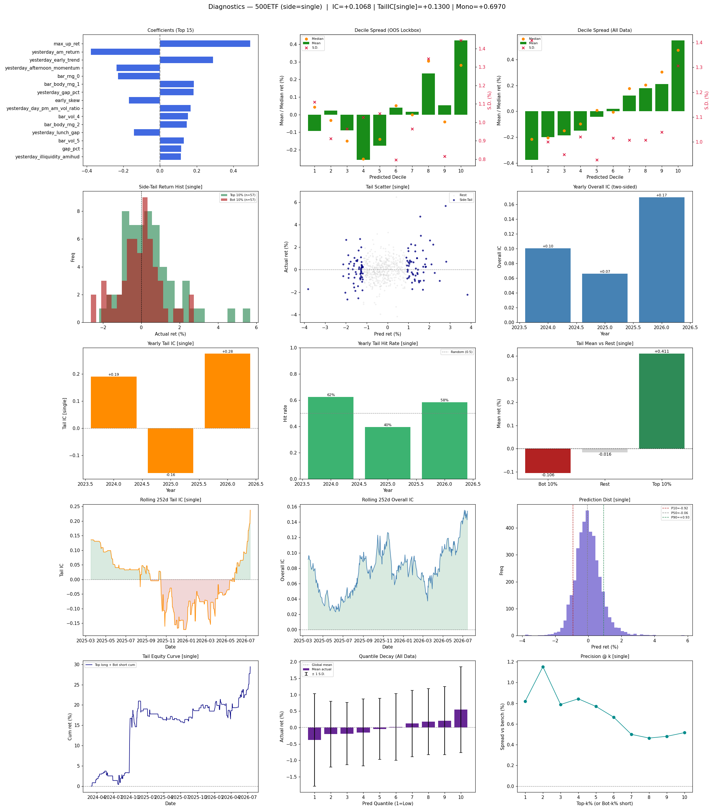

### 500ETF_gauss (500ETF, side=`single`)
- **Selected features**: 8
- **Active features**: 7
- **Active**: `bar_ret_0`, `max_up_ret`, `yesterday_early_trend`, `bar_body_rng_2`, `sma100_dist`, `gap_pct`, `yesterday_afternoon_momentum`
- **Stopped by Step 1 (FDR Screening)** (0 features):
  None
- **Stopped by Step 2 (Stability & VIF Pruning)** (206 features):
  

  
Show 206 features

  
  `first_30min_return`, `early_realized_vol`, `early_range`, `early_trend`, `early_momentum`, `first_bar_return`, `first_bar_volume`, `early_vwap_dev`, `early_skew`, `early_kurtosis`, `bar_ret_1`, `bar_ret_2`, `bar_vol_0`, `bar_vol_4`, `bar_vol_5`, `bar_rng_0`, `bar_rng_2`, `bar_rng_3`, `bar_rng_5`, `bar_body_rng_0`, `bar_body_rng_1`, `bar_vwap_dev_0`, `bar_vwap_dev_1`, `bar_vwap_dev_2`, `bar_vwap_dev_3`, `bar_vwap_dev_5`, `num_up_bars`, `max_down_ret`, `cl_pos_in_range`, `body_to_range_ratio`, `total_path_length`, `volume_slope`, `spike_exhaustion_ratio`, `first_bar_sentiment`, `or_fill_ratio`, `close_vs_open_range`, `inside_bar_failure_bull`, `consecutive_higher_highs`, `early_bearish_engulfing_count`, `volume_surge_max`, `volume_concentration`, `volume_trend_intraday`, `volume_acceleration`, `volume_surge_direction`, `pullback_ratio`, `rally_ratio`, `range_expansion_ratio`, `pullback_depth_ratio`, `pullback_depth_max`, `rally_strength_max`, `vwap_slope_intraday`, `volume_weighted_price_position`, `net_volume_flow`, `early_body_momentum`, `late_bar_momentum`, `trend_strength_intraday`, `high_low_sequence_momentum`, `intraday_slope`, `intraday_autocorr`, `opening_momentum_score`, `opening_direction_stability`, `early_trend_hhi`, `session_high_proximity`, `session_low_proximity`, `close_above_open_count`, `open_to_current_return`, `upper_wick_dominance`, `rsi_opening`, `stoch_opening`, `momentum_strength_intraday`, `opening_auction_imbalance`, `intraday_close_position`, `limit_down_proximity_early`, `morning_trend_extrapolated`, `demark_setup_reversal_early`, `failed_breakout_reversal_early`, `early_wavetrend_cross`, `atr_expansion_flag_early`, `volatility_breakout_squeeze`, `early_bid_ask_spread_proxy`, `early_vwap_acceleration`, `early_order_flow_imbalance`, `rbreaker_sell_setup_proximity_early`, `rbreaker_buy_setup_proximity_early`, `skypark_gap_reversal_early`, `turtle_breakout_strength_early`, `macd_hist`, `sma20_dist`, `sma50_dist`, `atr14_norm`, `roc10`, `vol20`, `sma10_dist`, `sma200_dist`, `ema12_dist`, `rsi5`, `rsi21`, `roc5`, `roc20`, `roc60`, `cci14`, `willr14`, `stoch_k`, `stoch_d`, `mfi14`, `aroon_osc`, `vol5`, `vol10`, `vol60`, `vol_ratio_5_20`, `vol_ratio_10_60`, `bb_width`, `vol_pk20`, `vol_gk10`, `vol_gk20`, `volume_sma_ratio`, `margin_balance`, `buy_on_margin_value`, `margin_repayment`, `short_balance`, `short_balance_quantity`, `short_sell_quantity`, `short_repayment_quantity`, `total_balance`, `margin_net_buy`, `margin_short_ratio`, `capital_buy_volume`, `capital_buy_value`, `capital_sell_volume`, `capital_sell_value`, `capital_net_value`, `capital_net_ratio`, `northbound_buy`, `northbound_sell`, `northbound_net`, `iv`, `iv_vol_ratio`, `vix`, `vix_vol_ratio`, `vix_iv_spread`, `vix_iv_ratio`, `iv_diff_1d`, `vix_diff_1d`, `tech_value_rotation`, `yesterday_limit_up_touch`, `limit_up_proximity_day`, `limit_down_proximity_day`, `growth_momentum_ratio`, `high_beta_vol_ratio`, `vix_skew_proxy`, `vix_rolling_percentile_60d`, `iv_corridor_width`, `yesterday_vix_early_drift`, `vix_realized_spread`, `option_oi_growth`, `iv_envelope_deviation`, `margin_lever_ratio`, `capital_net_accel`, `northbound_volume_share`, `yesterday_northbound_net_ratio`, `margin_buy_repayment_spread`, `short_sell_cover_spread`, `margin_extreme_rank_252d`, `capital_large_order_ratio`, `consecutive_inside_bars_3d`, `outside_bar_reversal_day`, `wavetrend_osc_day`, `keltner_squeeze_width`, `yesterday_wavetrend_osc`, `yesterday_stoch_rsi_cross`, `cvd_divergence_day`, `yesterday_illiquidity_amihud`, `coppock_curve_day`, `yesterday_range_ratio`, `yesterday_body_ratio`, `yesterday_volume_ratio`, `yesterday_return`, `yesterday_gap`, `yesterday_close_position`, `sma_distance_5d`, `sma_distance_60d`, `volatility_percentile_20d`, `volume_percentile_20d`, `yearly_high_distance`, `yearly_low_distance`, `twenty_gap_bars_regime`, `measured_move_proximity`, `yesterday_pm_return`, `yesterday_am_return`, `yesterday_gap_pct`, `yesterday_first_30min_return`, `yesterday_early_realized_vol`, `yesterday_early_range`, `yesterday_early_momentum`, `yesterday_first_bar_volume`, `yesterday_early_vwap_dev`, `yesterday_day_range`, `yesterday_day_realized_vol`, `yesterday_day_close_pos`, `yesterday_day_vwap_dev`, `yesterday_day_skew`, `yesterday_day_kurtosis`, `yesterday_afternoon_reversal`, `yesterday_lunch_gap`, `yesterday_pm_am_vol_ratio`, `yesterday_cvd_close`
  

### 500ETF_rank (500ETF, side=`single`)
- **Selected features**: 7
- **Active features**: 5
- **Active**: `yesterday_gap`, `max_up_ret`, `yesterday_early_trend`, `gap_pct`, `yesterday_afternoon_momentum`
- **Stopped by Step 1 (FDR Screening)** (0 features):
  None
- **Stopped by Step 2 (Stability & VIF Pruning)** (207 features):
  

  
Show 207 features

  
  `first_30min_return`, `early_realized_vol`, `early_range`, `early_trend`, `early_momentum`, `first_bar_return`, `first_bar_volume`, `early_vwap_dev`, `early_skew`, `early_kurtosis`, `bar_ret_0`, `bar_ret_1`, `bar_ret_2`, `bar_vol_0`, `bar_vol_4`, `bar_vol_5`, `bar_rng_0`, `bar_rng_2`, `bar_rng_3`, `bar_rng_5`, `bar_body_rng_0`, `bar_body_rng_1`, `bar_body_rng_2`, `bar_vwap_dev_0`, `bar_vwap_dev_1`, `bar_vwap_dev_2`, `bar_vwap_dev_3`, `bar_vwap_dev_5`, `num_up_bars`, `max_down_ret`, `cl_pos_in_range`, `body_to_range_ratio`, `total_path_length`, `volume_slope`, `spike_exhaustion_ratio`, `first_bar_sentiment`, `or_fill_ratio`, `close_vs_open_range`, `inside_bar_failure_bull`, `consecutive_higher_highs`, `early_bearish_engulfing_count`, `volume_surge_max`, `volume_concentration`, `volume_trend_intraday`, `volume_acceleration`, `volume_surge_direction`, `pullback_ratio`, `rally_ratio`, `range_expansion_ratio`, `pullback_depth_ratio`, `pullback_depth_max`, `rally_strength_max`, `vwap_slope_intraday`, `volume_weighted_price_position`, `net_volume_flow`, `early_body_momentum`, `late_bar_momentum`, `trend_strength_intraday`, `high_low_sequence_momentum`, `intraday_slope`, `intraday_autocorr`, `opening_momentum_score`, `opening_direction_stability`, `early_trend_hhi`, `session_high_proximity`, `session_low_proximity`, `close_above_open_count`, `open_to_current_return`, `upper_wick_dominance`, `rsi_opening`, `stoch_opening`, `momentum_strength_intraday`, `opening_auction_imbalance`, `intraday_close_position`, `limit_down_proximity_early`, `morning_trend_extrapolated`, `demark_setup_reversal_early`, `failed_breakout_reversal_early`, `early_wavetrend_cross`, `atr_expansion_flag_early`, `volatility_breakout_squeeze`, `early_bid_ask_spread_proxy`, `early_vwap_acceleration`, `early_order_flow_imbalance`, `rbreaker_sell_setup_proximity_early`, `rbreaker_buy_setup_proximity_early`, `skypark_gap_reversal_early`, `turtle_breakout_strength_early`, `macd_hist`, `sma20_dist`, `sma50_dist`, `atr14_norm`, `roc10`, `vol20`, `sma10_dist`, `sma200_dist`, `ema12_dist`, `rsi5`, `rsi21`, `roc5`, `roc20`, `roc60`, `cci14`, `willr14`, `stoch_k`, `stoch_d`, `mfi14`, `aroon_osc`, `vol5`, `vol10`, `vol60`, `vol_ratio_5_20`, `vol_ratio_10_60`, `bb_width`, `vol_pk20`, `vol_gk10`, `vol_gk20`, `volume_sma_ratio`, `margin_balance`, `buy_on_margin_value`, `margin_repayment`, `short_balance`, `short_balance_quantity`, `short_sell_quantity`, `short_repayment_quantity`, `total_balance`, `margin_net_buy`, `margin_short_ratio`, `capital_buy_volume`, `capital_buy_value`, `capital_sell_volume`, `capital_sell_value`, `capital_net_value`, `capital_net_ratio`, `northbound_buy`, `northbound_sell`, `northbound_net`, `iv`, `iv_vol_ratio`, `vix`, `vix_vol_ratio`, `vix_iv_spread`, `vix_iv_ratio`, `iv_diff_1d`, `vix_diff_1d`, `tech_value_rotation`, `yesterday_limit_up_touch`, `limit_up_proximity_day`, `limit_down_proximity_day`, `growth_momentum_ratio`, `high_beta_vol_ratio`, `vix_skew_proxy`, `vix_rolling_percentile_60d`, `iv_corridor_width`, `yesterday_vix_early_drift`, `vix_realized_spread`, `option_oi_growth`, `iv_envelope_deviation`, `margin_lever_ratio`, `capital_net_accel`, `northbound_volume_share`, `yesterday_northbound_net_ratio`, `margin_buy_repayment_spread`, `short_sell_cover_spread`, `margin_extreme_rank_252d`, `capital_large_order_ratio`, `consecutive_inside_bars_3d`, `outside_bar_reversal_day`, `wavetrend_osc_day`, `keltner_squeeze_width`, `yesterday_wavetrend_osc`, `yesterday_stoch_rsi_cross`, `cvd_divergence_day`, `yesterday_illiquidity_amihud`, `coppock_curve_day`, `yesterday_range_ratio`, `yesterday_body_ratio`, `yesterday_volume_ratio`, `yesterday_return`, `yesterday_close_position`, `sma_distance_5d`, `sma_distance_60d`, `volatility_percentile_20d`, `volume_percentile_20d`, `yearly_high_distance`, `yearly_low_distance`, `twenty_gap_bars_regime`, `measured_move_proximity`, `yesterday_pm_return`, `yesterday_am_return`, `yesterday_gap_pct`, `yesterday_first_30min_return`, `yesterday_early_realized_vol`, `yesterday_early_range`, `yesterday_early_momentum`, `yesterday_first_bar_volume`, `yesterday_early_vwap_dev`, `yesterday_day_range`, `yesterday_day_realized_vol`, `yesterday_day_close_pos`, `yesterday_day_vwap_dev`, `yesterday_day_skew`, `yesterday_day_kurtosis`, `yesterday_afternoon_reversal`, `yesterday_lunch_gap`, `yesterday_pm_am_vol_ratio`, `yesterday_cvd_close`
  

### 500ETF_long (500ETF, side=`long`)
- **Selected features**: 12
- **Active features**: 10
- **Active**: `yesterday_lunch_gap`, `yesterday_gap`, `bar_ret_0`, `max_up_ret`, `yesterday_early_trend`, `bar_vwap_dev_2`, `sma100_dist`, `margin_buy_repayment_spread`, `gap_pct`, `yesterday_afternoon_momentum`
- **Stopped by Step 1 (FDR Screening)** (0 features):
  None
- **Stopped by Step 2 (Stability & VIF Pruning)** (202 features):
  

  
Show 202 features

  
  `first_30min_return`, `early_realized_vol`, `early_range`, `early_trend`, `early_momentum`, `first_bar_return`, `first_bar_volume`, `early_vwap_dev`, `early_kurtosis`, `bar_ret_1`, `bar_ret_2`, `bar_vol_0`, `bar_vol_4`, `bar_vol_5`, `bar_rng_2`, `bar_rng_3`, `bar_rng_5`, `bar_body_rng_0`, `bar_body_rng_1`, `bar_body_rng_2`, `bar_vwap_dev_0`, `bar_vwap_dev_1`, `bar_vwap_dev_3`, `bar_vwap_dev_5`, `num_up_bars`, `max_down_ret`, `cl_pos_in_range`, `body_to_range_ratio`, `total_path_length`, `volume_slope`, `spike_exhaustion_ratio`, `first_bar_sentiment`, `or_fill_ratio`, `close_vs_open_range`, `inside_bar_failure_bull`, `consecutive_higher_highs`, `early_bearish_engulfing_count`, `volume_surge_max`, `volume_concentration`, `volume_trend_intraday`, `volume_acceleration`, `volume_surge_direction`, `pullback_ratio`, `rally_ratio`, `range_expansion_ratio`, `pullback_depth_ratio`, `pullback_depth_max`, `rally_strength_max`, `vwap_slope_intraday`, `volume_weighted_price_position`, `net_volume_flow`, `early_body_momentum`, `late_bar_momentum`, `trend_strength_intraday`, `high_low_sequence_momentum`, `intraday_slope`, `intraday_autocorr`, `opening_momentum_score`, `opening_direction_stability`, `early_trend_hhi`, `session_high_proximity`, `session_low_proximity`, `close_above_open_count`, `open_to_current_return`, `upper_wick_dominance`, `rsi_opening`, `stoch_opening`, `momentum_strength_intraday`, `opening_auction_imbalance`, `intraday_close_position`, `limit_down_proximity_early`, `morning_trend_extrapolated`, `demark_setup_reversal_early`, `failed_breakout_reversal_early`, `early_wavetrend_cross`, `atr_expansion_flag_early`, `volatility_breakout_squeeze`, `early_bid_ask_spread_proxy`, `early_vwap_acceleration`, `early_order_flow_imbalance`, `rbreaker_sell_setup_proximity_early`, `rbreaker_buy_setup_proximity_early`, `skypark_gap_reversal_early`, `turtle_breakout_strength_early`, `macd_hist`, `sma20_dist`, `sma50_dist`, `atr14_norm`, `roc10`, `vol20`, `sma10_dist`, `sma200_dist`, `ema12_dist`, `rsi5`, `rsi21`, `roc5`, `roc20`, `roc60`, `cci14`, `willr14`, `stoch_k`, `stoch_d`, `mfi14`, `aroon_osc`, `vol5`, `vol10`, `vol60`, `vol_ratio_5_20`, `vol_ratio_10_60`, `bb_width`, `vol_pk20`, `vol_gk10`, `vol_gk20`, `volume_sma_ratio`, `margin_balance`, `buy_on_margin_value`, `margin_repayment`, `short_balance`, `short_balance_quantity`, `short_sell_quantity`, `short_repayment_quantity`, `total_balance`, `margin_net_buy`, `margin_short_ratio`, `capital_buy_volume`, `capital_buy_value`, `capital_sell_volume`, `capital_sell_value`, `capital_net_value`, `capital_net_ratio`, `northbound_buy`, `northbound_sell`, `northbound_net`, `iv`, `iv_vol_ratio`, `vix`, `vix_vol_ratio`, `vix_iv_spread`, `vix_iv_ratio`, `iv_diff_1d`, `vix_diff_1d`, `tech_value_rotation`, `yesterday_limit_up_touch`, `limit_up_proximity_day`, `limit_down_proximity_day`, `growth_momentum_ratio`, `high_beta_vol_ratio`, `vix_skew_proxy`, `vix_rolling_percentile_60d`, `iv_corridor_width`, `yesterday_vix_early_drift`, `vix_realized_spread`, `option_oi_growth`, `iv_envelope_deviation`, `margin_lever_ratio`, `capital_net_accel`, `northbound_volume_share`, `yesterday_northbound_net_ratio`, `short_sell_cover_spread`, `margin_extreme_rank_252d`, `capital_large_order_ratio`, `consecutive_inside_bars_3d`, `outside_bar_reversal_day`, `wavetrend_osc_day`, `keltner_squeeze_width`, `yesterday_wavetrend_osc`, `yesterday_stoch_rsi_cross`, `cvd_divergence_day`, `yesterday_illiquidity_amihud`, `coppock_curve_day`, `yesterday_range_ratio`, `yesterday_body_ratio`, `yesterday_volume_ratio`, `yesterday_return`, `yesterday_close_position`, `sma_distance_5d`, `sma_distance_60d`, `volatility_percentile_20d`, `volume_percentile_20d`, `yearly_high_distance`, `yearly_low_distance`, `twenty_gap_bars_regime`, `measured_move_proximity`, `yesterday_pm_return`, `yesterday_am_return`, `yesterday_gap_pct`, `yesterday_first_30min_return`, `yesterday_early_realized_vol`, `yesterday_early_range`, `yesterday_early_momentum`, `yesterday_first_bar_volume`, `yesterday_early_vwap_dev`, `yesterday_day_range`, `yesterday_day_realized_vol`, `yesterday_day_close_pos`, `yesterday_day_pm_am_vol_ratio`, `yesterday_day_vwap_dev`, `yesterday_day_skew`, `yesterday_day_kurtosis`, `yesterday_afternoon_reversal`, `yesterday_pm_am_vol_ratio`, `yesterday_cvd_close`
  

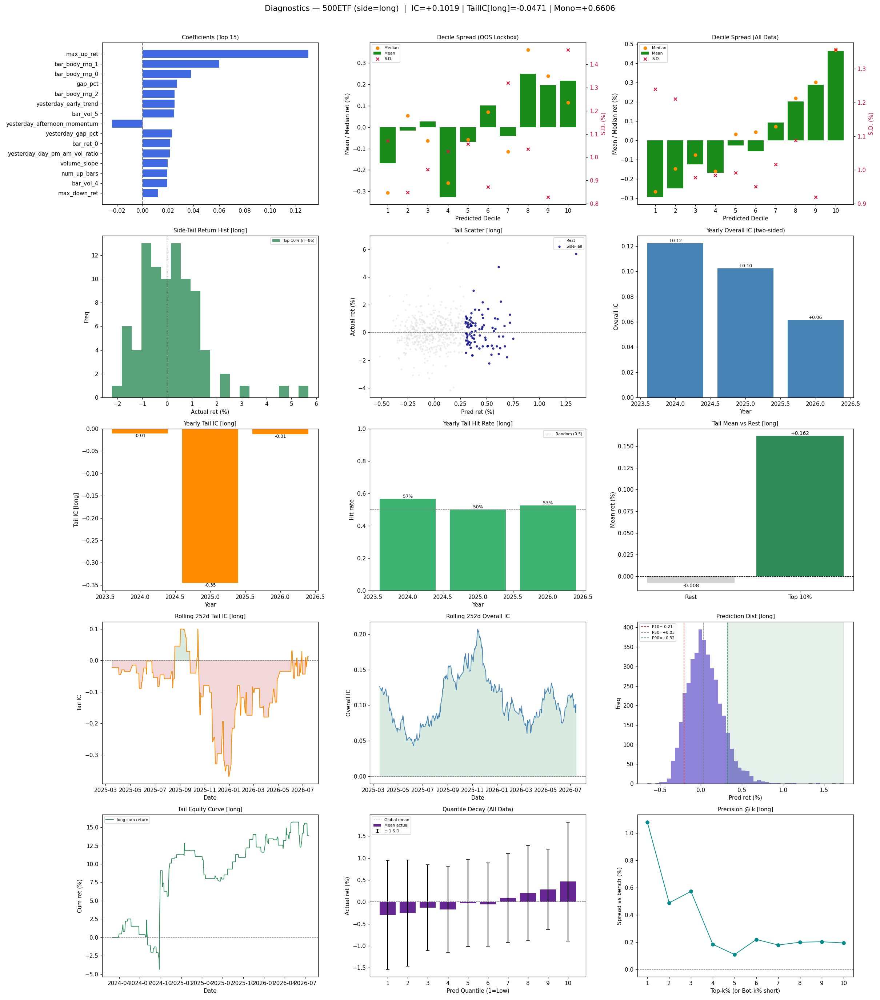

### 500ETF_long_gauss (500ETF, side=`long`)
- **Selected features**: 10
- **Active features**: 7
- **Active**: `yesterday_gap`, `bar_ret_0`, `max_up_ret`, `yesterday_early_trend`, `sma100_dist`, `gap_pct`, `yesterday_afternoon_momentum`
- **Stopped by Step 1 (FDR Screening)** (0 features):
  None
- **Stopped by Step 2 (Stability & VIF Pruning)** (204 features):
  

  
Show 204 features

  
  `first_30min_return`, `early_realized_vol`, `early_range`, `early_trend`, `early_momentum`, `first_bar_return`, `first_bar_volume`, `early_vwap_dev`, `early_skew`, `early_kurtosis`, `bar_ret_1`, `bar_ret_2`, `bar_vol_0`, `bar_vol_4`, `bar_vol_5`, `bar_rng_0`, `bar_rng_2`, `bar_rng_3`, `bar_rng_5`, `bar_body_rng_0`, `bar_body_rng_1`, `bar_body_rng_2`, `bar_vwap_dev_0`, `bar_vwap_dev_1`, `bar_vwap_dev_2`, `bar_vwap_dev_3`, `bar_vwap_dev_5`, `num_up_bars`, `max_down_ret`, `cl_pos_in_range`, `body_to_range_ratio`, `total_path_length`, `volume_slope`, `spike_exhaustion_ratio`, `first_bar_sentiment`, `or_fill_ratio`, `close_vs_open_range`, `inside_bar_failure_bull`, `consecutive_higher_highs`, `early_bearish_engulfing_count`, `volume_surge_max`, `volume_concentration`, `volume_trend_intraday`, `volume_acceleration`, `volume_surge_direction`, `pullback_ratio`, `rally_ratio`, `range_expansion_ratio`, `pullback_depth_ratio`, `pullback_depth_max`, `rally_strength_max`, `vwap_slope_intraday`, `volume_weighted_price_position`, `net_volume_flow`, `early_body_momentum`, `late_bar_momentum`, `trend_strength_intraday`, `high_low_sequence_momentum`, `intraday_slope`, `intraday_autocorr`, `opening_momentum_score`, `opening_direction_stability`, `early_trend_hhi`, `session_high_proximity`, `session_low_proximity`, `close_above_open_count`, `open_to_current_return`, `upper_wick_dominance`, `rsi_opening`, `stoch_opening`, `momentum_strength_intraday`, `opening_auction_imbalance`, `intraday_close_position`, `limit_down_proximity_early`, `morning_trend_extrapolated`, `demark_setup_reversal_early`, `failed_breakout_reversal_early`, `early_wavetrend_cross`, `atr_expansion_flag_early`, `volatility_breakout_squeeze`, `early_bid_ask_spread_proxy`, `early_vwap_acceleration`, `early_order_flow_imbalance`, `rbreaker_sell_setup_proximity_early`, `rbreaker_buy_setup_proximity_early`, `skypark_gap_reversal_early`, `turtle_breakout_strength_early`, `macd_hist`, `sma20_dist`, `sma50_dist`, `atr14_norm`, `roc10`, `vol20`, `sma10_dist`, `sma200_dist`, `ema12_dist`, `rsi5`, `rsi21`, `roc5`, `roc20`, `roc60`, `cci14`, `willr14`, `stoch_k`, `stoch_d`, `mfi14`, `aroon_osc`, `vol5`, `vol10`, `vol60`, `vol_ratio_5_20`, `vol_ratio_10_60`, `bb_width`, `vol_pk20`, `vol_gk10`, `vol_gk20`, `volume_sma_ratio`, `margin_balance`, `buy_on_margin_value`, `margin_repayment`, `short_balance`, `short_balance_quantity`, `short_sell_quantity`, `short_repayment_quantity`, `total_balance`, `margin_net_buy`, `margin_short_ratio`, `capital_buy_volume`, `capital_buy_value`, `capital_sell_volume`, `capital_sell_value`, `capital_net_value`, `capital_net_ratio`, `northbound_buy`, `northbound_sell`, `northbound_net`, `iv`, `iv_vol_ratio`, `vix`, `vix_vol_ratio`, `vix_iv_spread`, `vix_iv_ratio`, `iv_diff_1d`, `vix_diff_1d`, `tech_value_rotation`, `yesterday_limit_up_touch`, `limit_up_proximity_day`, `limit_down_proximity_day`, `growth_momentum_ratio`, `high_beta_vol_ratio`, `vix_skew_proxy`, `vix_rolling_percentile_60d`, `iv_corridor_width`, `yesterday_vix_early_drift`, `vix_realized_spread`, `option_oi_growth`, `iv_envelope_deviation`, `margin_lever_ratio`, `capital_net_accel`, `northbound_volume_share`, `yesterday_northbound_net_ratio`, `short_sell_cover_spread`, `margin_extreme_rank_252d`, `capital_large_order_ratio`, `consecutive_inside_bars_3d`, `outside_bar_reversal_day`, `wavetrend_osc_day`, `keltner_squeeze_width`, `yesterday_wavetrend_osc`, `yesterday_stoch_rsi_cross`, `cvd_divergence_day`, `yesterday_illiquidity_amihud`, `coppock_curve_day`, `yesterday_range_ratio`, `yesterday_body_ratio`, `yesterday_volume_ratio`, `yesterday_return`, `yesterday_close_position`, `sma_distance_5d`, `sma_distance_60d`, `volatility_percentile_20d`, `volume_percentile_20d`, `yearly_high_distance`, `yearly_low_distance`, `twenty_gap_bars_regime`, `measured_move_proximity`, `yesterday_pm_return`, `yesterday_am_return`, `yesterday_gap_pct`, `yesterday_first_30min_return`, `yesterday_early_realized_vol`, `yesterday_early_range`, `yesterday_early_momentum`, `yesterday_first_bar_volume`, `yesterday_early_vwap_dev`, `yesterday_day_range`, `yesterday_day_realized_vol`, `yesterday_day_close_pos`, `yesterday_day_vwap_dev`, `yesterday_day_skew`, `yesterday_day_kurtosis`, `yesterday_afternoon_reversal`, `yesterday_pm_am_vol_ratio`, `yesterday_cvd_close`
  

### 500ETF_long_rank (500ETF, side=`long`)
- **Selected features**: 17
- **Active features**: 17
- **Active**: `bar_body_rng_1`, `outside_bar_reversal_day`, `yesterday_day_pm_am_vol_ratio`, `yesterday_lunch_gap`, `yesterday_gap`, `bar_ret_0`, `bar_body_rng_0`, `max_up_ret`, `yesterday_early_trend`, `yesterday_northbound_net_ratio`, `bar_body_rng_2`, `early_skew`, `growth_momentum_ratio`, `sma100_dist`, `gap_pct`, `cvd_divergence_day`, `yesterday_afternoon_momentum`
- **Stopped by Step 1 (FDR Screening)** (0 features):
  None
- **Stopped by Step 2 (Stability & VIF Pruning)** (197 features):
  

  
Show 197 features

  
  `first_30min_return`, `early_realized_vol`, `early_range`, `early_trend`, `early_momentum`, `first_bar_return`, `first_bar_volume`, `early_vwap_dev`, `early_kurtosis`, `bar_ret_1`, `bar_ret_2`, `bar_vol_0`, `bar_vol_4`, `bar_vol_5`, `bar_rng_0`, `bar_rng_2`, `bar_rng_3`, `bar_rng_5`, `bar_vwap_dev_0`, `bar_vwap_dev_1`, `bar_vwap_dev_2`, `bar_vwap_dev_3`, `bar_vwap_dev_5`, `num_up_bars`, `max_down_ret`, `cl_pos_in_range`, `body_to_range_ratio`, `total_path_length`, `volume_slope`, `spike_exhaustion_ratio`, `first_bar_sentiment`, `or_fill_ratio`, `close_vs_open_range`, `inside_bar_failure_bull`, `consecutive_higher_highs`, `early_bearish_engulfing_count`, `volume_surge_max`, `volume_concentration`, `volume_trend_intraday`, `volume_acceleration`, `volume_surge_direction`, `pullback_ratio`, `rally_ratio`, `range_expansion_ratio`, `pullback_depth_ratio`, `pullback_depth_max`, `rally_strength_max`, `vwap_slope_intraday`, `volume_weighted_price_position`, `net_volume_flow`, `early_body_momentum`, `late_bar_momentum`, `trend_strength_intraday`, `high_low_sequence_momentum`, `intraday_slope`, `intraday_autocorr`, `opening_momentum_score`, `opening_direction_stability`, `early_trend_hhi`, `session_high_proximity`, `session_low_proximity`, `close_above_open_count`, `open_to_current_return`, `upper_wick_dominance`, `rsi_opening`, `stoch_opening`, `momentum_strength_intraday`, `opening_auction_imbalance`, `intraday_close_position`, `limit_down_proximity_early`, `morning_trend_extrapolated`, `demark_setup_reversal_early`, `failed_breakout_reversal_early`, `early_wavetrend_cross`, `atr_expansion_flag_early`, `volatility_breakout_squeeze`, `early_bid_ask_spread_proxy`, `early_vwap_acceleration`, `early_order_flow_imbalance`, `rbreaker_sell_setup_proximity_early`, `rbreaker_buy_setup_proximity_early`, `skypark_gap_reversal_early`, `turtle_breakout_strength_early`, `macd_hist`, `sma20_dist`, `sma50_dist`, `atr14_norm`, `roc10`, `vol20`, `sma10_dist`, `sma200_dist`, `ema12_dist`, `rsi5`, `rsi21`, `roc5`, `roc20`, `roc60`, `cci14`, `willr14`, `stoch_k`, `stoch_d`, `mfi14`, `aroon_osc`, `vol5`, `vol10`, `vol60`, `vol_ratio_5_20`, `vol_ratio_10_60`, `bb_width`, `vol_pk20`, `vol_gk10`, `vol_gk20`, `volume_sma_ratio`, `margin_balance`, `buy_on_margin_value`, `margin_repayment`, `short_balance`, `short_balance_quantity`, `short_sell_quantity`, `short_repayment_quantity`, `total_balance`, `margin_net_buy`, `margin_short_ratio`, `capital_buy_volume`, `capital_buy_value`, `capital_sell_volume`, `capital_sell_value`, `capital_net_value`, `capital_net_ratio`, `northbound_buy`, `northbound_sell`, `northbound_net`, `iv`, `iv_vol_ratio`, `vix`, `vix_vol_ratio`, `vix_iv_spread`, `vix_iv_ratio`, `iv_diff_1d`, `vix_diff_1d`, `tech_value_rotation`, `yesterday_limit_up_touch`, `limit_up_proximity_day`, `limit_down_proximity_day`, `high_beta_vol_ratio`, `vix_skew_proxy`, `vix_rolling_percentile_60d`, `iv_corridor_width`, `yesterday_vix_early_drift`, `vix_realized_spread`, `option_oi_growth`, `iv_envelope_deviation`, `margin_lever_ratio`, `capital_net_accel`, `northbound_volume_share`, `margin_buy_repayment_spread`, `short_sell_cover_spread`, `margin_extreme_rank_252d`, `capital_large_order_ratio`, `consecutive_inside_bars_3d`, `wavetrend_osc_day`, `keltner_squeeze_width`, `yesterday_wavetrend_osc`, `yesterday_stoch_rsi_cross`, `yesterday_illiquidity_amihud`, `coppock_curve_day`, `yesterday_range_ratio`, `yesterday_body_ratio`, `yesterday_volume_ratio`, `yesterday_return`, `yesterday_close_position`, `sma_distance_5d`, `sma_distance_60d`, `volatility_percentile_20d`, `volume_percentile_20d`, `yearly_high_distance`, `yearly_low_distance`, `twenty_gap_bars_regime`, `measured_move_proximity`, `yesterday_pm_return`, `yesterday_am_return`, `yesterday_gap_pct`, `yesterday_first_30min_return`, `yesterday_early_realized_vol`, `yesterday_early_range`, `yesterday_early_momentum`, `yesterday_first_bar_volume`, `yesterday_early_vwap_dev`, `yesterday_day_range`, `yesterday_day_realized_vol`, `yesterday_day_close_pos`, `yesterday_day_vwap_dev`, `yesterday_day_skew`, `yesterday_day_kurtosis`, `yesterday_afternoon_reversal`, `yesterday_pm_am_vol_ratio`, `yesterday_cvd_close`
  

### 500ETF_short (500ETF, side=`short`)
- **Selected features**: 11
- **Active features**: 11
- **Active**: `bar_rng_0`, `yesterday_lunch_gap`, `yesterday_gap`, `bar_ret_0`, `max_up_ret`, `yesterday_early_trend`, `early_skew`, `sma100_dist`, `margin_buy_repayment_spread`, `gap_pct`, `yesterday_afternoon_momentum`
- **Stopped by Step 1 (FDR Screening)** (0 features):
  None
- **Stopped by Step 2 (Stability & VIF Pruning)** (203 features):
  

  
Show 203 features

  
  `first_30min_return`, `early_realized_vol`, `early_range`, `early_trend`, `early_momentum`, `first_bar_return`, `first_bar_volume`, `early_vwap_dev`, `early_kurtosis`, `bar_ret_1`, `bar_ret_2`, `bar_vol_0`, `bar_vol_4`, `bar_vol_5`, `bar_rng_2`, `bar_rng_3`, `bar_rng_5`, `bar_body_rng_0`, `bar_body_rng_1`, `bar_body_rng_2`, `bar_vwap_dev_0`, `bar_vwap_dev_1`, `bar_vwap_dev_2`, `bar_vwap_dev_3`, `bar_vwap_dev_5`, `num_up_bars`, `max_down_ret`, `cl_pos_in_range`, `body_to_range_ratio`, `total_path_length`, `volume_slope`, `spike_exhaustion_ratio`, `first_bar_sentiment`, `or_fill_ratio`, `close_vs_open_range`, `inside_bar_failure_bull`, `consecutive_higher_highs`, `early_bearish_engulfing_count`, `volume_surge_max`, `volume_concentration`, `volume_trend_intraday`, `volume_acceleration`, `volume_surge_direction`, `pullback_ratio`, `rally_ratio`, `range_expansion_ratio`, `pullback_depth_ratio`, `pullback_depth_max`, `rally_strength_max`, `vwap_slope_intraday`, `volume_weighted_price_position`, `net_volume_flow`, `early_body_momentum`, `late_bar_momentum`, `trend_strength_intraday`, `high_low_sequence_momentum`, `intraday_slope`, `intraday_autocorr`, `opening_momentum_score`, `opening_direction_stability`, `early_trend_hhi`, `session_high_proximity`, `session_low_proximity`, `close_above_open_count`, `open_to_current_return`, `upper_wick_dominance`, `rsi_opening`, `stoch_opening`, `momentum_strength_intraday`, `opening_auction_imbalance`, `intraday_close_position`, `limit_down_proximity_early`, `morning_trend_extrapolated`, `demark_setup_reversal_early`, `failed_breakout_reversal_early`, `early_wavetrend_cross`, `atr_expansion_flag_early`, `volatility_breakout_squeeze`, `early_bid_ask_spread_proxy`, `early_vwap_acceleration`, `early_order_flow_imbalance`, `rbreaker_sell_setup_proximity_early`, `rbreaker_buy_setup_proximity_early`, `skypark_gap_reversal_early`, `turtle_breakout_strength_early`, `macd_hist`, `sma20_dist`, `sma50_dist`, `atr14_norm`, `roc10`, `vol20`, `sma10_dist`, `sma200_dist`, `ema12_dist`, `rsi5`, `rsi21`, `roc5`, `roc20`, `roc60`, `cci14`, `willr14`, `stoch_k`, `stoch_d`, `mfi14`, `aroon_osc`, `vol5`, `vol10`, `vol60`, `vol_ratio_5_20`, `vol_ratio_10_60`, `bb_width`, `vol_pk20`, `vol_gk10`, `vol_gk20`, `volume_sma_ratio`, `margin_balance`, `buy_on_margin_value`, `margin_repayment`, `short_balance`, `short_balance_quantity`, `short_sell_quantity`, `short_repayment_quantity`, `total_balance`, `margin_net_buy`, `margin_short_ratio`, `capital_buy_volume`, `capital_buy_value`, `capital_sell_volume`, `capital_sell_value`, `capital_net_value`, `capital_net_ratio`, `northbound_buy`, `northbound_sell`, `northbound_net`, `iv`, `iv_vol_ratio`, `vix`, `vix_vol_ratio`, `vix_iv_spread`, `vix_iv_ratio`, `iv_diff_1d`, `vix_diff_1d`, `tech_value_rotation`, `yesterday_limit_up_touch`, `limit_up_proximity_day`, `limit_down_proximity_day`, `growth_momentum_ratio`, `high_beta_vol_ratio`, `vix_skew_proxy`, `vix_rolling_percentile_60d`, `iv_corridor_width`, `yesterday_vix_early_drift`, `vix_realized_spread`, `option_oi_growth`, `iv_envelope_deviation`, `margin_lever_ratio`, `capital_net_accel`, `northbound_volume_share`, `yesterday_northbound_net_ratio`, `short_sell_cover_spread`, `margin_extreme_rank_252d`, `capital_large_order_ratio`, `consecutive_inside_bars_3d`, `outside_bar_reversal_day`, `wavetrend_osc_day`, `keltner_squeeze_width`, `yesterday_wavetrend_osc`, `yesterday_stoch_rsi_cross`, `cvd_divergence_day`, `yesterday_illiquidity_amihud`, `coppock_curve_day`, `yesterday_range_ratio`, `yesterday_body_ratio`, `yesterday_volume_ratio`, `yesterday_return`, `yesterday_close_position`, `sma_distance_5d`, `sma_distance_60d`, `volatility_percentile_20d`, `volume_percentile_20d`, `yearly_high_distance`, `yearly_low_distance`, `twenty_gap_bars_regime`, `measured_move_proximity`, `yesterday_pm_return`, `yesterday_am_return`, `yesterday_gap_pct`, `yesterday_first_30min_return`, `yesterday_early_realized_vol`, `yesterday_early_range`, `yesterday_early_momentum`, `yesterday_first_bar_volume`, `yesterday_early_vwap_dev`, `yesterday_day_range`, `yesterday_day_realized_vol`, `yesterday_day_close_pos`, `yesterday_day_pm_am_vol_ratio`, `yesterday_day_vwap_dev`, `yesterday_day_skew`, `yesterday_day_kurtosis`, `yesterday_afternoon_reversal`, `yesterday_pm_am_vol_ratio`, `yesterday_cvd_close`
  

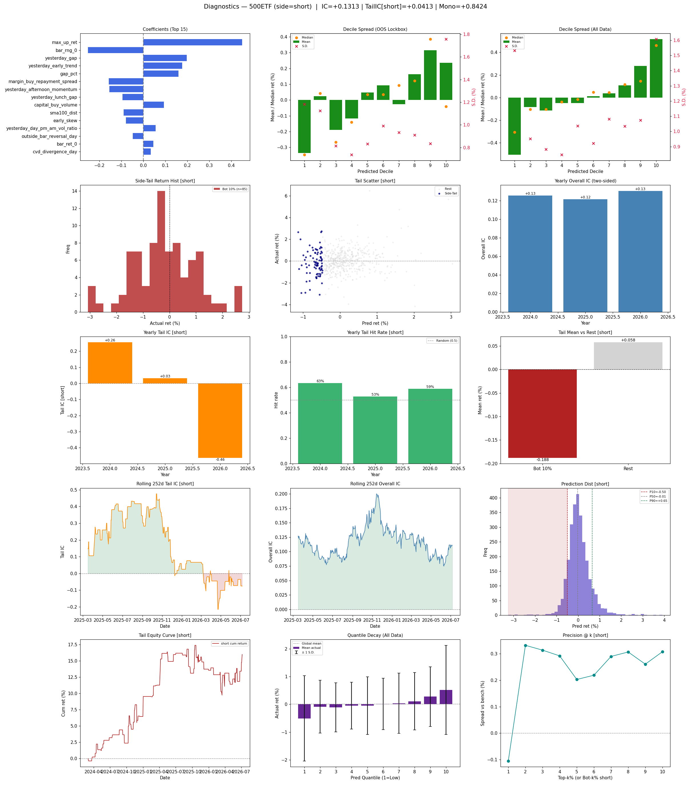

### 500ETF_short_gauss (500ETF, side=`short`)
- **Selected features**: 15
- **Active features**: 15
- **Active**: `outside_bar_reversal_day`, `yesterday_day_pm_am_vol_ratio`, `yesterday_lunch_gap`, `yesterday_gap`, `bar_ret_0`, `max_up_ret`, `yesterday_early_trend`, `yesterday_northbound_net_ratio`, `bar_body_rng_2`, `early_skew`, `sma100_dist`, `margin_buy_repayment_spread`, `gap_pct`, `cvd_divergence_day`, `yesterday_afternoon_momentum`
- **Stopped by Step 1 (FDR Screening)** (0 features):
  None
- **Stopped by Step 2 (Stability & VIF Pruning)** (199 features):
  

  
Show 199 features

  
  `first_30min_return`, `early_realized_vol`, `early_range`, `early_trend`, `early_momentum`, `first_bar_return`, `first_bar_volume`, `early_vwap_dev`, `early_kurtosis`, `bar_ret_1`, `bar_ret_2`, `bar_vol_0`, `bar_vol_4`, `bar_vol_5`, `bar_rng_0`, `bar_rng_2`, `bar_rng_3`, `bar_rng_5`, `bar_body_rng_0`, `bar_body_rng_1`, `bar_vwap_dev_0`, `bar_vwap_dev_1`, `bar_vwap_dev_2`, `bar_vwap_dev_3`, `bar_vwap_dev_5`, `num_up_bars`, `max_down_ret`, `cl_pos_in_range`, `body_to_range_ratio`, `total_path_length`, `volume_slope`, `spike_exhaustion_ratio`, `first_bar_sentiment`, `or_fill_ratio`, `close_vs_open_range`, `inside_bar_failure_bull`, `consecutive_higher_highs`, `early_bearish_engulfing_count`, `volume_surge_max`, `volume_concentration`, `volume_trend_intraday`, `volume_acceleration`, `volume_surge_direction`, `pullback_ratio`, `rally_ratio`, `range_expansion_ratio`, `pullback_depth_ratio`, `pullback_depth_max`, `rally_strength_max`, `vwap_slope_intraday`, `volume_weighted_price_position`, `net_volume_flow`, `early_body_momentum`, `late_bar_momentum`, `trend_strength_intraday`, `high_low_sequence_momentum`, `intraday_slope`, `intraday_autocorr`, `opening_momentum_score`, `opening_direction_stability`, `early_trend_hhi`, `session_high_proximity`, `session_low_proximity`, `close_above_open_count`, `open_to_current_return`, `upper_wick_dominance`, `rsi_opening`, `stoch_opening`, `momentum_strength_intraday`, `opening_auction_imbalance`, `intraday_close_position`, `limit_down_proximity_early`, `morning_trend_extrapolated`, `demark_setup_reversal_early`, `failed_breakout_reversal_early`, `early_wavetrend_cross`, `atr_expansion_flag_early`, `volatility_breakout_squeeze`, `early_bid_ask_spread_proxy`, `early_vwap_acceleration`, `early_order_flow_imbalance`, `rbreaker_sell_setup_proximity_early`, `rbreaker_buy_setup_proximity_early`, `skypark_gap_reversal_early`, `turtle_breakout_strength_early`, `macd_hist`, `sma20_dist`, `sma50_dist`, `atr14_norm`, `roc10`, `vol20`, `sma10_dist`, `sma200_dist`, `ema12_dist`, `rsi5`, `rsi21`, `roc5`, `roc20`, `roc60`, `cci14`, `willr14`, `stoch_k`, `stoch_d`, `mfi14`, `aroon_osc`, `vol5`, `vol10`, `vol60`, `vol_ratio_5_20`, `vol_ratio_10_60`, `bb_width`, `vol_pk20`, `vol_gk10`, `vol_gk20`, `volume_sma_ratio`, `margin_balance`, `buy_on_margin_value`, `margin_repayment`, `short_balance`, `short_balance_quantity`, `short_sell_quantity`, `short_repayment_quantity`, `total_balance`, `margin_net_buy`, `margin_short_ratio`, `capital_buy_volume`, `capital_buy_value`, `capital_sell_volume`, `capital_sell_value`, `capital_net_value`, `capital_net_ratio`, `northbound_buy`, `northbound_sell`, `northbound_net`, `iv`, `iv_vol_ratio`, `vix`, `vix_vol_ratio`, `vix_iv_spread`, `vix_iv_ratio`, `iv_diff_1d`, `vix_diff_1d`, `tech_value_rotation`, `yesterday_limit_up_touch`, `limit_up_proximity_day`, `limit_down_proximity_day`, `growth_momentum_ratio`, `high_beta_vol_ratio`, `vix_skew_proxy`, `vix_rolling_percentile_60d`, `iv_corridor_width`, `yesterday_vix_early_drift`, `vix_realized_spread`, `option_oi_growth`, `iv_envelope_deviation`, `margin_lever_ratio`, `capital_net_accel`, `northbound_volume_share`, `short_sell_cover_spread`, `margin_extreme_rank_252d`, `capital_large_order_ratio`, `consecutive_inside_bars_3d`, `wavetrend_osc_day`, `keltner_squeeze_width`, `yesterday_wavetrend_osc`, `yesterday_stoch_rsi_cross`, `yesterday_illiquidity_amihud`, `coppock_curve_day`, `yesterday_range_ratio`, `yesterday_body_ratio`, `yesterday_volume_ratio`, `yesterday_return`, `yesterday_close_position`, `sma_distance_5d`, `sma_distance_60d`, `volatility_percentile_20d`, `volume_percentile_20d`, `yearly_high_distance`, `yearly_low_distance`, `twenty_gap_bars_regime`, `measured_move_proximity`, `yesterday_pm_return`, `yesterday_am_return`, `yesterday_gap_pct`, `yesterday_first_30min_return`, `yesterday_early_realized_vol`, `yesterday_early_range`, `yesterday_early_momentum`, `yesterday_first_bar_volume`, `yesterday_early_vwap_dev`, `yesterday_day_range`, `yesterday_day_realized_vol`, `yesterday_day_close_pos`, `yesterday_day_vwap_dev`, `yesterday_day_skew`, `yesterday_day_kurtosis`, `yesterday_afternoon_reversal`, `yesterday_pm_am_vol_ratio`, `yesterday_cvd_close`
  

### 500ETF_short_rank (500ETF, side=`short`)
- **Selected features**: 4
- **Active features**: 1
- **Active**: `max_up_ret`
- **Stopped by Step 1 (FDR Screening)** (0 features):
  None
- **Stopped by Step 2 (Stability & VIF Pruning)** (210 features):
  

  
Show 210 features

  
  `first_30min_return`, `early_realized_vol`, `early_range`, `early_trend`, `early_momentum`, `first_bar_return`, `first_bar_volume`, `early_vwap_dev`, `early_skew`, `early_kurtosis`, `bar_ret_0`, `bar_ret_1`, `bar_ret_2`, `bar_vol_0`, `bar_vol_4`, `bar_vol_5`, `bar_rng_0`, `bar_rng_2`, `bar_rng_3`, `bar_rng_5`, `bar_body_rng_0`, `bar_body_rng_1`, `bar_body_rng_2`, `bar_vwap_dev_0`, `bar_vwap_dev_1`, `bar_vwap_dev_2`, `bar_vwap_dev_3`, `bar_vwap_dev_5`, `num_up_bars`, `max_down_ret`, `cl_pos_in_range`, `body_to_range_ratio`, `total_path_length`, `volume_slope`, `spike_exhaustion_ratio`, `first_bar_sentiment`, `or_fill_ratio`, `close_vs_open_range`, `inside_bar_failure_bull`, `consecutive_higher_highs`, `early_bearish_engulfing_count`, `volume_surge_max`, `volume_concentration`, `volume_trend_intraday`, `volume_acceleration`, `volume_surge_direction`, `pullback_ratio`, `rally_ratio`, `range_expansion_ratio`, `pullback_depth_ratio`, `pullback_depth_max`, `rally_strength_max`, `vwap_slope_intraday`, `volume_weighted_price_position`, `net_volume_flow`, `early_body_momentum`, `late_bar_momentum`, `trend_strength_intraday`, `high_low_sequence_momentum`, `intraday_slope`, `intraday_autocorr`, `opening_momentum_score`, `opening_direction_stability`, `early_trend_hhi`, `session_high_proximity`, `session_low_proximity`, `close_above_open_count`, `open_to_current_return`, `upper_wick_dominance`, `rsi_opening`, `stoch_opening`, `momentum_strength_intraday`, `opening_auction_imbalance`, `intraday_close_position`, `limit_down_proximity_early`, `morning_trend_extrapolated`, `demark_setup_reversal_early`, `failed_breakout_reversal_early`, `early_wavetrend_cross`, `atr_expansion_flag_early`, `volatility_breakout_squeeze`, `early_bid_ask_spread_proxy`, `early_vwap_acceleration`, `early_order_flow_imbalance`, `rbreaker_sell_setup_proximity_early`, `rbreaker_buy_setup_proximity_early`, `skypark_gap_reversal_early`, `turtle_breakout_strength_early`, `macd_hist`, `sma20_dist`, `sma50_dist`, `atr14_norm`, `roc10`, `vol20`, `sma10_dist`, `sma200_dist`, `ema12_dist`, `rsi5`, `rsi21`, `roc5`, `roc20`, `roc60`, `cci14`, `willr14`, `stoch_k`, `stoch_d`, `mfi14`, `aroon_osc`, `vol5`, `vol10`, `vol60`, `vol_ratio_5_20`, `vol_ratio_10_60`, `bb_width`, `vol_pk20`, `vol_gk10`, `vol_gk20`, `volume_sma_ratio`, `margin_balance`, `buy_on_margin_value`, `margin_repayment`, `short_balance`, `short_balance_quantity`, `short_sell_quantity`, `short_repayment_quantity`, `total_balance`, `margin_net_buy`, `margin_short_ratio`, `capital_buy_volume`, `capital_buy_value`, `capital_sell_volume`, `capital_sell_value`, `capital_net_value`, `capital_net_ratio`, `northbound_buy`, `northbound_sell`, `northbound_net`, `iv`, `iv_vol_ratio`, `vix`, `vix_vol_ratio`, `vix_iv_spread`, `vix_iv_ratio`, `iv_diff_1d`, `vix_diff_1d`, `tech_value_rotation`, `yesterday_limit_up_touch`, `limit_up_proximity_day`, `limit_down_proximity_day`, `growth_momentum_ratio`, `high_beta_vol_ratio`, `vix_skew_proxy`, `vix_rolling_percentile_60d`, `iv_corridor_width`, `yesterday_vix_early_drift`, `vix_realized_spread`, `option_oi_growth`, `iv_envelope_deviation`, `margin_lever_ratio`, `capital_net_accel`, `northbound_volume_share`, `yesterday_northbound_net_ratio`, `margin_buy_repayment_spread`, `short_sell_cover_spread`, `margin_extreme_rank_252d`, `capital_large_order_ratio`, `consecutive_inside_bars_3d`, `outside_bar_reversal_day`, `wavetrend_osc_day`, `keltner_squeeze_width`, `yesterday_wavetrend_osc`, `yesterday_stoch_rsi_cross`, `cvd_divergence_day`, `yesterday_illiquidity_amihud`, `coppock_curve_day`, `yesterday_range_ratio`, `yesterday_body_ratio`, `yesterday_volume_ratio`, `yesterday_return`, `yesterday_gap`, `yesterday_close_position`, `sma_distance_5d`, `sma_distance_60d`, `volatility_percentile_20d`, `volume_percentile_20d`, `yearly_high_distance`, `yearly_low_distance`, `twenty_gap_bars_regime`, `measured_move_proximity`, `yesterday_pm_return`, `yesterday_am_return`, `yesterday_gap_pct`, `yesterday_first_30min_return`, `yesterday_early_realized_vol`, `yesterday_early_range`, `yesterday_early_trend`, `yesterday_early_momentum`, `yesterday_first_bar_volume`, `yesterday_early_vwap_dev`, `yesterday_day_range`, `yesterday_day_realized_vol`, `yesterday_day_close_pos`, `yesterday_day_pm_am_vol_ratio`, `yesterday_day_vwap_dev`, `yesterday_day_skew`, `yesterday_day_kurtosis`, `yesterday_afternoon_reversal`, `yesterday_lunch_gap`, `yesterday_pm_am_vol_ratio`, `yesterday_cvd_close`
  

### 588000ETF (588000ETF, side=`single`)
- **Selected features**: 24
- **Active features**: 24
- **Active**: `bar_rng_3`, `bar_rng_2`, `vol60`, `yesterday_early_range`, `early_skew`, `bar_body_rng_1`, `vol_ratio_5_20`, `vol_ratio_10_60`, `volatility_percentile_20d`, `yesterday_day_skew`, `yesterday_day_kurtosis`, `consecutive_inside_bars_3d`, `outside_bar_reversal_day`, `bar_vwap_dev_2`, `yesterday_day_pm_am_vol_ratio`, `yesterday_body_ratio`, `early_kurtosis`, `sma100_dist`, `volume_percentile_20d`, `vix_diff_1d`, `yesterday_gap`, `capital_net_ratio`, `roc5`, `yesterday_stoch_rsi_cross`
- **Stopped by Step 1 (FDR Screening)** (0 features):
  None
- **Stopped by Step 2 (Stability & VIF Pruning)** (190 features):
  

  
Show 190 features

  
  `gap_pct`, `first_30min_return`, `early_realized_vol`, `early_range`, `early_trend`, `early_momentum`, `first_bar_return`, `first_bar_volume`, `early_vwap_dev`, `bar_ret_0`, `bar_ret_1`, `bar_ret_2`, `bar_vol_0`, `bar_vol_4`, `bar_vol_5`, `bar_rng_0`, `bar_rng_5`, `bar_body_rng_0`, `bar_body_rng_2`, `bar_vwap_dev_0`, `bar_vwap_dev_1`, `bar_vwap_dev_3`, `bar_vwap_dev_5`, `num_up_bars`, `max_up_ret`, `max_down_ret`, `cl_pos_in_range`, `body_to_range_ratio`, `total_path_length`, `volume_slope`, `spike_exhaustion_ratio`, `first_bar_sentiment`, `or_fill_ratio`, `close_vs_open_range`, `inside_bar_failure_bull`, `consecutive_higher_highs`, `early_bearish_engulfing_count`, `volume_surge_max`, `volume_concentration`, `volume_trend_intraday`, `volume_acceleration`, `volume_surge_direction`, `pullback_ratio`, `rally_ratio`, `range_expansion_ratio`, `pullback_depth_ratio`, `pullback_depth_max`, `rally_strength_max`, `vwap_slope_intraday`, `volume_weighted_price_position`, `net_volume_flow`, `early_body_momentum`, `late_bar_momentum`, `trend_strength_intraday`, `high_low_sequence_momentum`, `intraday_slope`, `intraday_autocorr`, `opening_momentum_score`, `opening_direction_stability`, `early_trend_hhi`, `session_high_proximity`, `session_low_proximity`, `close_above_open_count`, `open_to_current_return`, `upper_wick_dominance`, `rsi_opening`, `stoch_opening`, `momentum_strength_intraday`, `opening_auction_imbalance`, `intraday_close_position`, `limit_down_proximity_early`, `morning_trend_extrapolated`, `demark_setup_reversal_early`, `failed_breakout_reversal_early`, `early_wavetrend_cross`, `atr_expansion_flag_early`, `volatility_breakout_squeeze`, `early_bid_ask_spread_proxy`, `early_vwap_acceleration`, `early_order_flow_imbalance`, `rbreaker_sell_setup_proximity_early`, `rbreaker_buy_setup_proximity_early`, `skypark_gap_reversal_early`, `turtle_breakout_strength_early`, `macd_hist`, `sma20_dist`, `sma50_dist`, `atr14_norm`, `roc10`, `vol20`, `sma10_dist`, `sma200_dist`, `ema12_dist`, `rsi5`, `rsi21`, `roc20`, `roc60`, `cci14`, `willr14`, `stoch_k`, `stoch_d`, `mfi14`, `aroon_osc`, `vol5`, `vol10`, `bb_width`, `vol_pk20`, `vol_gk10`, `vol_gk20`, `volume_sma_ratio`, `margin_balance`, `buy_on_margin_value`, `margin_repayment`, `short_balance`, `short_balance_quantity`, `short_sell_quantity`, `short_repayment_quantity`, `total_balance`, `margin_net_buy`, `margin_short_ratio`, `capital_buy_volume`, `capital_buy_value`, `capital_sell_volume`, `capital_sell_value`, `capital_net_value`, `northbound_buy`, `northbound_sell`, `northbound_net`, `iv`, `iv_vol_ratio`, `vix`, `vix_vol_ratio`, `vix_iv_spread`, `vix_iv_ratio`, `iv_diff_1d`, `tech_value_rotation`, `yesterday_limit_up_touch`, `limit_up_proximity_day`, `limit_down_proximity_day`, `growth_momentum_ratio`, `high_beta_vol_ratio`, `vix_skew_proxy`, `vix_rolling_percentile_60d`, `iv_corridor_width`, `yesterday_vix_early_drift`, `vix_realized_spread`, `option_oi_growth`, `iv_envelope_deviation`, `margin_lever_ratio`, `capital_net_accel`, `northbound_volume_share`, `yesterday_northbound_net_ratio`, `margin_buy_repayment_spread`, `short_sell_cover_spread`, `margin_extreme_rank_252d`, `capital_large_order_ratio`, `wavetrend_osc_day`, `keltner_squeeze_width`, `yesterday_wavetrend_osc`, `cvd_divergence_day`, `yesterday_illiquidity_amihud`, `coppock_curve_day`, `yesterday_range_ratio`, `yesterday_volume_ratio`, `yesterday_return`, `yesterday_close_position`, `sma_distance_5d`, `sma_distance_60d`, `yearly_high_distance`, `yearly_low_distance`, `twenty_gap_bars_regime`, `measured_move_proximity`, `yesterday_pm_return`, `yesterday_am_return`, `yesterday_gap_pct`, `yesterday_first_30min_return`, `yesterday_early_realized_vol`, `yesterday_early_trend`, `yesterday_early_momentum`, `yesterday_first_bar_volume`, `yesterday_early_vwap_dev`, `yesterday_day_range`, `yesterday_day_realized_vol`, `yesterday_day_close_pos`, `yesterday_day_vwap_dev`, `yesterday_afternoon_reversal`, `yesterday_lunch_gap`, `yesterday_pm_am_vol_ratio`, `yesterday_afternoon_momentum`, `yesterday_cvd_close`
  

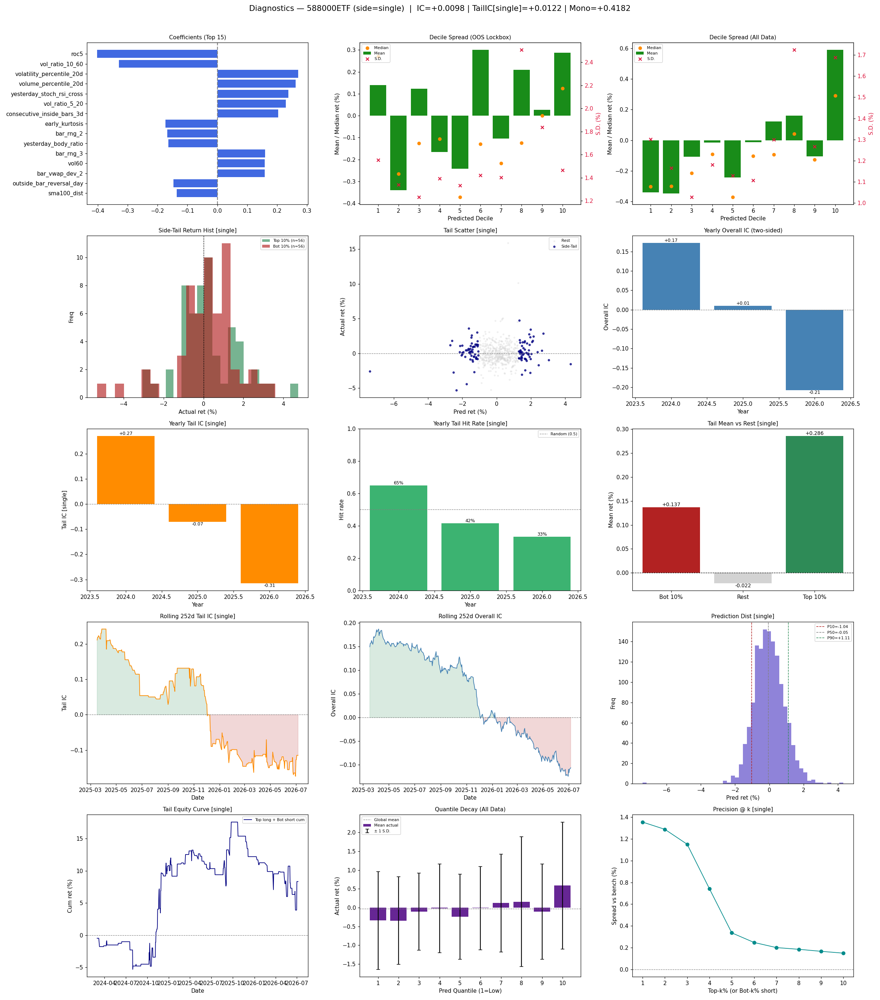

### 588000ETF_gauss (588000ETF, side=`single`)
- **Selected features**: 16
- **Active features**: 15
- **Active**: `bar_rng_3`, `bar_rng_2`, `vol60`, `first_30min_return`, `vol_ratio_5_20`, `vol_ratio_10_60`, `volatility_percentile_20d`, `consecutive_inside_bars_3d`, `outside_bar_reversal_day`, `early_kurtosis`, `sma100_dist`, `volume_percentile_20d`, `yesterday_gap`, `roc5`, `yesterday_stoch_rsi_cross`
- **Stopped by Step 1 (FDR Screening)** (0 features):
  None
- **Stopped by Step 2 (Stability & VIF Pruning)** (198 features):
  

  
Show 198 features

  
  `gap_pct`, `early_realized_vol`, `early_range`, `early_trend`, `early_momentum`, `first_bar_return`, `first_bar_volume`, `early_vwap_dev`, `early_skew`, `bar_ret_0`, `bar_ret_1`, `bar_ret_2`, `bar_vol_0`, `bar_vol_4`, `bar_vol_5`, `bar_rng_0`, `bar_rng_5`, `bar_body_rng_0`, `bar_body_rng_1`, `bar_body_rng_2`, `bar_vwap_dev_0`, `bar_vwap_dev_1`, `bar_vwap_dev_2`, `bar_vwap_dev_3`, `bar_vwap_dev_5`, `num_up_bars`, `max_up_ret`, `max_down_ret`, `cl_pos_in_range`, `body_to_range_ratio`, `total_path_length`, `volume_slope`, `spike_exhaustion_ratio`, `first_bar_sentiment`, `or_fill_ratio`, `close_vs_open_range`, `inside_bar_failure_bull`, `consecutive_higher_highs`, `early_bearish_engulfing_count`, `volume_surge_max`, `volume_concentration`, `volume_trend_intraday`, `volume_acceleration`, `volume_surge_direction`, `pullback_ratio`, `rally_ratio`, `range_expansion_ratio`, `pullback_depth_ratio`, `pullback_depth_max`, `rally_strength_max`, `vwap_slope_intraday`, `volume_weighted_price_position`, `net_volume_flow`, `early_body_momentum`, `late_bar_momentum`, `trend_strength_intraday`, `high_low_sequence_momentum`, `intraday_slope`, `intraday_autocorr`, `opening_momentum_score`, `opening_direction_stability`, `early_trend_hhi`, `session_high_proximity`, `session_low_proximity`, `close_above_open_count`, `open_to_current_return`, `upper_wick_dominance`, `rsi_opening`, `stoch_opening`, `momentum_strength_intraday`, `opening_auction_imbalance`, `intraday_close_position`, `limit_down_proximity_early`, `morning_trend_extrapolated`, `demark_setup_reversal_early`, `failed_breakout_reversal_early`, `early_wavetrend_cross`, `atr_expansion_flag_early`, `volatility_breakout_squeeze`, `early_bid_ask_spread_proxy`, `early_vwap_acceleration`, `early_order_flow_imbalance`, `rbreaker_sell_setup_proximity_early`, `rbreaker_buy_setup_proximity_early`, `skypark_gap_reversal_early`, `turtle_breakout_strength_early`, `macd_hist`, `sma20_dist`, `sma50_dist`, `atr14_norm`, `roc10`, `vol20`, `sma10_dist`, `sma200_dist`, `ema12_dist`, `rsi5`, `rsi21`, `roc20`, `roc60`, `cci14`, `willr14`, `stoch_k`, `stoch_d`, `mfi14`, `aroon_osc`, `vol5`, `vol10`, `bb_width`, `vol_pk20`, `vol_gk10`, `vol_gk20`, `volume_sma_ratio`, `margin_balance`, `buy_on_margin_value`, `margin_repayment`, `short_balance`, `short_balance_quantity`, `short_sell_quantity`, `short_repayment_quantity`, `total_balance`, `margin_net_buy`, `margin_short_ratio`, `capital_buy_volume`, `capital_buy_value`, `capital_sell_volume`, `capital_sell_value`, `capital_net_value`, `capital_net_ratio`, `northbound_buy`, `northbound_sell`, `northbound_net`, `iv`, `iv_vol_ratio`, `vix`, `vix_vol_ratio`, `vix_iv_spread`, `vix_iv_ratio`, `iv_diff_1d`, `vix_diff_1d`, `tech_value_rotation`, `yesterday_limit_up_touch`, `limit_up_proximity_day`, `limit_down_proximity_day`, `growth_momentum_ratio`, `high_beta_vol_ratio`, `vix_skew_proxy`, `vix_rolling_percentile_60d`, `iv_corridor_width`, `yesterday_vix_early_drift`, `vix_realized_spread`, `option_oi_growth`, `iv_envelope_deviation`, `margin_lever_ratio`, `capital_net_accel`, `northbound_volume_share`, `yesterday_northbound_net_ratio`, `margin_buy_repayment_spread`, `short_sell_cover_spread`, `margin_extreme_rank_252d`, `capital_large_order_ratio`, `wavetrend_osc_day`, `keltner_squeeze_width`, `yesterday_wavetrend_osc`, `cvd_divergence_day`, `yesterday_illiquidity_amihud`, `coppock_curve_day`, `yesterday_range_ratio`, `yesterday_body_ratio`, `yesterday_volume_ratio`, `yesterday_return`, `yesterday_close_position`, `sma_distance_5d`, `sma_distance_60d`, `yearly_high_distance`, `yearly_low_distance`, `twenty_gap_bars_regime`, `measured_move_proximity`, `yesterday_pm_return`, `yesterday_am_return`, `yesterday_gap_pct`, `yesterday_first_30min_return`, `yesterday_early_realized_vol`, `yesterday_early_range`, `yesterday_early_trend`, `yesterday_early_momentum`, `yesterday_first_bar_volume`, `yesterday_early_vwap_dev`, `yesterday_day_range`, `yesterday_day_realized_vol`, `yesterday_day_close_pos`, `yesterday_day_vwap_dev`, `yesterday_day_skew`, `yesterday_day_kurtosis`, `yesterday_afternoon_reversal`, `yesterday_lunch_gap`, `yesterday_pm_am_vol_ratio`, `yesterday_afternoon_momentum`, `yesterday_cvd_close`
  

### 588000ETF_rank (588000ETF, side=`single`)
- **Selected features**: 23
- **Active features**: 23
- **Active**: `bar_rng_2`, `vol60`, `early_skew`, `bar_body_rng_1`, `vol_ratio_5_20`, `vol_ratio_10_60`, `yesterday_day_skew`, `yesterday_day_kurtosis`, `tech_value_rotation`, `consecutive_inside_bars_3d`, `outside_bar_reversal_day`, `cl_pos_in_range`, `bar_vwap_dev_2`, `short_sell_cover_spread`, `yesterday_day_pm_am_vol_ratio`, `early_kurtosis`, `margin_extreme_rank_252d`, `sma100_dist`, `vix`, `vix_diff_1d`, `yesterday_gap`, `capital_net_ratio`, `capital_net_accel`
- **Stopped by Step 1 (FDR Screening)** (0 features):
  None
- **Stopped by Step 2 (Stability & VIF Pruning)** (191 features):
  

  
Show 191 features

  
  `gap_pct`, `first_30min_return`, `early_realized_vol`, `early_range`, `early_trend`, `early_momentum`, `first_bar_return`, `first_bar_volume`, `early_vwap_dev`, `bar_ret_0`, `bar_ret_1`, `bar_ret_2`, `bar_vol_0`, `bar_vol_4`, `bar_vol_5`, `bar_rng_0`, `bar_rng_3`, `bar_rng_5`, `bar_body_rng_0`, `bar_body_rng_2`, `bar_vwap_dev_0`, `bar_vwap_dev_1`, `bar_vwap_dev_3`, `bar_vwap_dev_5`, `num_up_bars`, `max_up_ret`, `max_down_ret`, `body_to_range_ratio`, `total_path_length`, `volume_slope`, `spike_exhaustion_ratio`, `first_bar_sentiment`, `or_fill_ratio`, `close_vs_open_range`, `inside_bar_failure_bull`, `consecutive_higher_highs`, `early_bearish_engulfing_count`, `volume_surge_max`, `volume_concentration`, `volume_trend_intraday`, `volume_acceleration`, `volume_surge_direction`, `pullback_ratio`, `rally_ratio`, `range_expansion_ratio`, `pullback_depth_ratio`, `pullback_depth_max`, `rally_strength_max`, `vwap_slope_intraday`, `volume_weighted_price_position`, `net_volume_flow`, `early_body_momentum`, `late_bar_momentum`, `trend_strength_intraday`, `high_low_sequence_momentum`, `intraday_slope`, `intraday_autocorr`, `opening_momentum_score`, `opening_direction_stability`, `early_trend_hhi`, `session_high_proximity`, `session_low_proximity`, `close_above_open_count`, `open_to_current_return`, `upper_wick_dominance`, `rsi_opening`, `stoch_opening`, `momentum_strength_intraday`, `opening_auction_imbalance`, `intraday_close_position`, `limit_down_proximity_early`, `morning_trend_extrapolated`, `demark_setup_reversal_early`, `failed_breakout_reversal_early`, `early_wavetrend_cross`, `atr_expansion_flag_early`, `volatility_breakout_squeeze`, `early_bid_ask_spread_proxy`, `early_vwap_acceleration`, `early_order_flow_imbalance`, `rbreaker_sell_setup_proximity_early`, `rbreaker_buy_setup_proximity_early`, `skypark_gap_reversal_early`, `turtle_breakout_strength_early`, `macd_hist`, `sma20_dist`, `sma50_dist`, `atr14_norm`, `roc10`, `vol20`, `sma10_dist`, `sma200_dist`, `ema12_dist`, `rsi5`, `rsi21`, `roc5`, `roc20`, `roc60`, `cci14`, `willr14`, `stoch_k`, `stoch_d`, `mfi14`, `aroon_osc`, `vol5`, `vol10`, `bb_width`, `vol_pk20`, `vol_gk10`, `vol_gk20`, `volume_sma_ratio`, `margin_balance`, `buy_on_margin_value`, `margin_repayment`, `short_balance`, `short_balance_quantity`, `short_sell_quantity`, `short_repayment_quantity`, `total_balance`, `margin_net_buy`, `margin_short_ratio`, `capital_buy_volume`, `capital_buy_value`, `capital_sell_volume`, `capital_sell_value`, `capital_net_value`, `northbound_buy`, `northbound_sell`, `northbound_net`, `iv`, `iv_vol_ratio`, `vix_vol_ratio`, `vix_iv_spread`, `vix_iv_ratio`, `iv_diff_1d`, `yesterday_limit_up_touch`, `limit_up_proximity_day`, `limit_down_proximity_day`, `growth_momentum_ratio`, `high_beta_vol_ratio`, `vix_skew_proxy`, `vix_rolling_percentile_60d`, `iv_corridor_width`, `yesterday_vix_early_drift`, `vix_realized_spread`, `option_oi_growth`, `iv_envelope_deviation`, `margin_lever_ratio`, `northbound_volume_share`, `yesterday_northbound_net_ratio`, `margin_buy_repayment_spread`, `capital_large_order_ratio`, `wavetrend_osc_day`, `keltner_squeeze_width`, `yesterday_wavetrend_osc`, `yesterday_stoch_rsi_cross`, `cvd_divergence_day`, `yesterday_illiquidity_amihud`, `coppock_curve_day`, `yesterday_range_ratio`, `yesterday_body_ratio`, `yesterday_volume_ratio`, `yesterday_return`, `yesterday_close_position`, `sma_distance_5d`, `sma_distance_60d`, `volatility_percentile_20d`, `volume_percentile_20d`, `yearly_high_distance`, `yearly_low_distance`, `twenty_gap_bars_regime`, `measured_move_proximity`, `yesterday_pm_return`, `yesterday_am_return`, `yesterday_gap_pct`, `yesterday_first_30min_return`, `yesterday_early_realized_vol`, `yesterday_early_range`, `yesterday_early_trend`, `yesterday_early_momentum`, `yesterday_first_bar_volume`, `yesterday_early_vwap_dev`, `yesterday_day_range`, `yesterday_day_realized_vol`, `yesterday_day_close_pos`, `yesterday_day_vwap_dev`, `yesterday_afternoon_reversal`, `yesterday_lunch_gap`, `yesterday_pm_am_vol_ratio`, `yesterday_afternoon_momentum`, `yesterday_cvd_close`
  

### 588000ETF_long (588000ETF, side=`long`)
- **Selected features**: 24
- **Active features**: 24
- **Active**: `bar_rng_3`, `bar_rng_2`, `vol60`, `yesterday_early_range`, `early_skew`, `bar_body_rng_1`, `vol_ratio_5_20`, `vol_ratio_10_60`, `volatility_percentile_20d`, `yesterday_day_skew`, `yesterday_day_kurtosis`, `consecutive_inside_bars_3d`, `outside_bar_reversal_day`, `bar_vwap_dev_2`, `yesterday_day_pm_am_vol_ratio`, `yesterday_body_ratio`, `early_kurtosis`, `sma100_dist`, `volume_percentile_20d`, `vix_diff_1d`, `yesterday_gap`, `capital_net_ratio`, `roc5`, `yesterday_stoch_rsi_cross`
- **Stopped by Step 1 (FDR Screening)** (0 features):
  None
- **Stopped by Step 2 (Stability & VIF Pruning)** (190 features):
  

  
Show 190 features

  
  `gap_pct`, `first_30min_return`, `early_realized_vol`, `early_range`, `early_trend`, `early_momentum`, `first_bar_return`, `first_bar_volume`, `early_vwap_dev`, `bar_ret_0`, `bar_ret_1`, `bar_ret_2`, `bar_vol_0`, `bar_vol_4`, `bar_vol_5`, `bar_rng_0`, `bar_rng_5`, `bar_body_rng_0`, `bar_body_rng_2`, `bar_vwap_dev_0`, `bar_vwap_dev_1`, `bar_vwap_dev_3`, `bar_vwap_dev_5`, `num_up_bars`, `max_up_ret`, `max_down_ret`, `cl_pos_in_range`, `body_to_range_ratio`, `total_path_length`, `volume_slope`, `spike_exhaustion_ratio`, `first_bar_sentiment`, `or_fill_ratio`, `close_vs_open_range`, `inside_bar_failure_bull`, `consecutive_higher_highs`, `early_bearish_engulfing_count`, `volume_surge_max`, `volume_concentration`, `volume_trend_intraday`, `volume_acceleration`, `volume_surge_direction`, `pullback_ratio`, `rally_ratio`, `range_expansion_ratio`, `pullback_depth_ratio`, `pullback_depth_max`, `rally_strength_max`, `vwap_slope_intraday`, `volume_weighted_price_position`, `net_volume_flow`, `early_body_momentum`, `late_bar_momentum`, `trend_strength_intraday`, `high_low_sequence_momentum`, `intraday_slope`, `intraday_autocorr`, `opening_momentum_score`, `opening_direction_stability`, `early_trend_hhi`, `session_high_proximity`, `session_low_proximity`, `close_above_open_count`, `open_to_current_return`, `upper_wick_dominance`, `rsi_opening`, `stoch_opening`, `momentum_strength_intraday`, `opening_auction_imbalance`, `intraday_close_position`, `limit_down_proximity_early`, `morning_trend_extrapolated`, `demark_setup_reversal_early`, `failed_breakout_reversal_early`, `early_wavetrend_cross`, `atr_expansion_flag_early`, `volatility_breakout_squeeze`, `early_bid_ask_spread_proxy`, `early_vwap_acceleration`, `early_order_flow_imbalance`, `rbreaker_sell_setup_proximity_early`, `rbreaker_buy_setup_proximity_early`, `skypark_gap_reversal_early`, `turtle_breakout_strength_early`, `macd_hist`, `sma20_dist`, `sma50_dist`, `atr14_norm`, `roc10`, `vol20`, `sma10_dist`, `sma200_dist`, `ema12_dist`, `rsi5`, `rsi21`, `roc20`, `roc60`, `cci14`, `willr14`, `stoch_k`, `stoch_d`, `mfi14`, `aroon_osc`, `vol5`, `vol10`, `bb_width`, `vol_pk20`, `vol_gk10`, `vol_gk20`, `volume_sma_ratio`, `margin_balance`, `buy_on_margin_value`, `margin_repayment`, `short_balance`, `short_balance_quantity`, `short_sell_quantity`, `short_repayment_quantity`, `total_balance`, `margin_net_buy`, `margin_short_ratio`, `capital_buy_volume`, `capital_buy_value`, `capital_sell_volume`, `capital_sell_value`, `capital_net_value`, `northbound_buy`, `northbound_sell`, `northbound_net`, `iv`, `iv_vol_ratio`, `vix`, `vix_vol_ratio`, `vix_iv_spread`, `vix_iv_ratio`, `iv_diff_1d`, `tech_value_rotation`, `yesterday_limit_up_touch`, `limit_up_proximity_day`, `limit_down_proximity_day`, `growth_momentum_ratio`, `high_beta_vol_ratio`, `vix_skew_proxy`, `vix_rolling_percentile_60d`, `iv_corridor_width`, `yesterday_vix_early_drift`, `vix_realized_spread`, `option_oi_growth`, `iv_envelope_deviation`, `margin_lever_ratio`, `capital_net_accel`, `northbound_volume_share`, `yesterday_northbound_net_ratio`, `margin_buy_repayment_spread`, `short_sell_cover_spread`, `margin_extreme_rank_252d`, `capital_large_order_ratio`, `wavetrend_osc_day`, `keltner_squeeze_width`, `yesterday_wavetrend_osc`, `cvd_divergence_day`, `yesterday_illiquidity_amihud`, `coppock_curve_day`, `yesterday_range_ratio`, `yesterday_volume_ratio`, `yesterday_return`, `yesterday_close_position`, `sma_distance_5d`, `sma_distance_60d`, `yearly_high_distance`, `yearly_low_distance`, `twenty_gap_bars_regime`, `measured_move_proximity`, `yesterday_pm_return`, `yesterday_am_return`, `yesterday_gap_pct`, `yesterday_first_30min_return`, `yesterday_early_realized_vol`, `yesterday_early_trend`, `yesterday_early_momentum`, `yesterday_first_bar_volume`, `yesterday_early_vwap_dev`, `yesterday_day_range`, `yesterday_day_realized_vol`, `yesterday_day_close_pos`, `yesterday_day_vwap_dev`, `yesterday_afternoon_reversal`, `yesterday_lunch_gap`, `yesterday_pm_am_vol_ratio`, `yesterday_afternoon_momentum`, `yesterday_cvd_close`
  

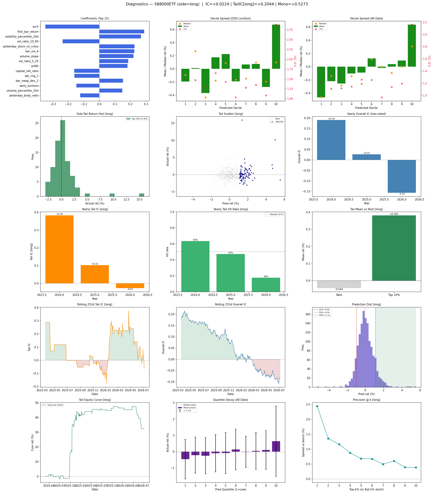

### 588000ETF_long_gauss (588000ETF, side=`long`)
- **Selected features**: 23
- **Active features**: 20
- **Active**: `bar_rng_3`, `bar_rng_2`, `vol60`, `first_30min_return`, `early_skew`, `bar_body_rng_1`, `vol_ratio_5_20`, `vol_ratio_10_60`, `volatility_percentile_20d`, `consecutive_inside_bars_3d`, `outside_bar_reversal_day`, `bar_vwap_dev_2`, `early_kurtosis`, `sma100_dist`, `volume_percentile_20d`, `vix_diff_1d`, `yesterday_gap`, `capital_net_ratio`, `roc5`, `yesterday_stoch_rsi_cross`
- **Stopped by Step 1 (FDR Screening)** (0 features):
  None
- **Stopped by Step 2 (Stability & VIF Pruning)** (191 features):
  

  
Show 191 features

  
  `gap_pct`, `early_realized_vol`, `early_range`, `early_trend`, `early_momentum`, `first_bar_return`, `first_bar_volume`, `early_vwap_dev`, `bar_ret_0`, `bar_ret_1`, `bar_ret_2`, `bar_vol_0`, `bar_vol_4`, `bar_vol_5`, `bar_rng_0`, `bar_rng_5`, `bar_body_rng_0`, `bar_body_rng_2`, `bar_vwap_dev_0`, `bar_vwap_dev_1`, `bar_vwap_dev_3`, `bar_vwap_dev_5`, `num_up_bars`, `max_up_ret`, `max_down_ret`, `cl_pos_in_range`, `body_to_range_ratio`, `total_path_length`, `volume_slope`, `spike_exhaustion_ratio`, `first_bar_sentiment`, `or_fill_ratio`, `close_vs_open_range`, `inside_bar_failure_bull`, `consecutive_higher_highs`, `early_bearish_engulfing_count`, `volume_surge_max`, `volume_concentration`, `volume_trend_intraday`, `volume_acceleration`, `volume_surge_direction`, `pullback_ratio`, `rally_ratio`, `range_expansion_ratio`, `pullback_depth_ratio`, `pullback_depth_max`, `rally_strength_max`, `vwap_slope_intraday`, `volume_weighted_price_position`, `net_volume_flow`, `early_body_momentum`, `late_bar_momentum`, `trend_strength_intraday`, `high_low_sequence_momentum`, `intraday_slope`, `intraday_autocorr`, `opening_momentum_score`, `opening_direction_stability`, `early_trend_hhi`, `session_high_proximity`, `session_low_proximity`, `close_above_open_count`, `open_to_current_return`, `upper_wick_dominance`, `rsi_opening`, `stoch_opening`, `momentum_strength_intraday`, `opening_auction_imbalance`, `intraday_close_position`, `limit_down_proximity_early`, `morning_trend_extrapolated`, `demark_setup_reversal_early`, `failed_breakout_reversal_early`, `early_wavetrend_cross`, `atr_expansion_flag_early`, `volatility_breakout_squeeze`, `early_bid_ask_spread_proxy`, `early_vwap_acceleration`, `early_order_flow_imbalance`, `rbreaker_sell_setup_proximity_early`, `rbreaker_buy_setup_proximity_early`, `skypark_gap_reversal_early`, `turtle_breakout_strength_early`, `macd_hist`, `sma20_dist`, `sma50_dist`, `atr14_norm`, `roc10`, `vol20`, `sma10_dist`, `sma200_dist`, `ema12_dist`, `rsi5`, `rsi21`, `roc20`, `roc60`, `cci14`, `willr14`, `stoch_k`, `stoch_d`, `mfi14`, `aroon_osc`, `vol5`, `vol10`, `bb_width`, `vol_pk20`, `vol_gk10`, `vol_gk20`, `volume_sma_ratio`, `margin_balance`, `buy_on_margin_value`, `margin_repayment`, `short_balance`, `short_balance_quantity`, `short_sell_quantity`, `short_repayment_quantity`, `total_balance`, `margin_net_buy`, `margin_short_ratio`, `capital_buy_volume`, `capital_buy_value`, `capital_sell_volume`, `capital_sell_value`, `capital_net_value`, `northbound_buy`, `northbound_sell`, `northbound_net`, `iv`, `iv_vol_ratio`, `vix`, `vix_vol_ratio`, `vix_iv_spread`, `vix_iv_ratio`, `iv_diff_1d`, `tech_value_rotation`, `yesterday_limit_up_touch`, `limit_up_proximity_day`, `limit_down_proximity_day`, `growth_momentum_ratio`, `high_beta_vol_ratio`, `vix_skew_proxy`, `vix_rolling_percentile_60d`, `iv_corridor_width`, `yesterday_vix_early_drift`, `vix_realized_spread`, `option_oi_growth`, `iv_envelope_deviation`, `margin_lever_ratio`, `capital_net_accel`, `northbound_volume_share`, `yesterday_northbound_net_ratio`, `margin_buy_repayment_spread`, `short_sell_cover_spread`, `margin_extreme_rank_252d`, `capital_large_order_ratio`, `wavetrend_osc_day`, `keltner_squeeze_width`, `yesterday_wavetrend_osc`, `cvd_divergence_day`, `yesterday_illiquidity_amihud`, `coppock_curve_day`, `yesterday_range_ratio`, `yesterday_body_ratio`, `yesterday_volume_ratio`, `yesterday_return`, `yesterday_close_position`, `sma_distance_5d`, `sma_distance_60d`, `yearly_high_distance`, `yearly_low_distance`, `twenty_gap_bars_regime`, `measured_move_proximity`, `yesterday_pm_return`, `yesterday_am_return`, `yesterday_gap_pct`, `yesterday_first_30min_return`, `yesterday_early_realized_vol`, `yesterday_early_range`, `yesterday_early_trend`, `yesterday_early_momentum`, `yesterday_first_bar_volume`, `yesterday_early_vwap_dev`, `yesterday_day_range`, `yesterday_day_realized_vol`, `yesterday_day_close_pos`, `yesterday_day_vwap_dev`, `yesterday_afternoon_reversal`, `yesterday_lunch_gap`, `yesterday_pm_am_vol_ratio`, `yesterday_afternoon_momentum`, `yesterday_cvd_close`
  

### 588000ETF_long_rank (588000ETF, side=`long`)
- **Selected features**: 23
- **Active features**: 23
- **Active**: `bar_rng_2`, `vol60`, `early_skew`, `bar_body_rng_1`, `vol_ratio_5_20`, `vol_ratio_10_60`, `yesterday_day_skew`, `yesterday_day_kurtosis`, `tech_value_rotation`, `consecutive_inside_bars_3d`, `outside_bar_reversal_day`, `cl_pos_in_range`, `bar_vwap_dev_2`, `short_sell_cover_spread`, `yesterday_day_pm_am_vol_ratio`, `early_kurtosis`, `margin_extreme_rank_252d`, `sma100_dist`, `vix`, `vix_diff_1d`, `yesterday_gap`, `capital_net_ratio`, `capital_net_accel`
- **Stopped by Step 1 (FDR Screening)** (0 features):
  None
- **Stopped by Step 2 (Stability & VIF Pruning)** (191 features):
  

  
Show 191 features

  
  `gap_pct`, `first_30min_return`, `early_realized_vol`, `early_range`, `early_trend`, `early_momentum`, `first_bar_return`, `first_bar_volume`, `early_vwap_dev`, `bar_ret_0`, `bar_ret_1`, `bar_ret_2`, `bar_vol_0`, `bar_vol_4`, `bar_vol_5`, `bar_rng_0`, `bar_rng_3`, `bar_rng_5`, `bar_body_rng_0`, `bar_body_rng_2`, `bar_vwap_dev_0`, `bar_vwap_dev_1`, `bar_vwap_dev_3`, `bar_vwap_dev_5`, `num_up_bars`, `max_up_ret`, `max_down_ret`, `body_to_range_ratio`, `total_path_length`, `volume_slope`, `spike_exhaustion_ratio`, `first_bar_sentiment`, `or_fill_ratio`, `close_vs_open_range`, `inside_bar_failure_bull`, `consecutive_higher_highs`, `early_bearish_engulfing_count`, `volume_surge_max`, `volume_concentration`, `volume_trend_intraday`, `volume_acceleration`, `volume_surge_direction`, `pullback_ratio`, `rally_ratio`, `range_expansion_ratio`, `pullback_depth_ratio`, `pullback_depth_max`, `rally_strength_max`, `vwap_slope_intraday`, `volume_weighted_price_position`, `net_volume_flow`, `early_body_momentum`, `late_bar_momentum`, `trend_strength_intraday`, `high_low_sequence_momentum`, `intraday_slope`, `intraday_autocorr`, `opening_momentum_score`, `opening_direction_stability`, `early_trend_hhi`, `session_high_proximity`, `session_low_proximity`, `close_above_open_count`, `open_to_current_return`, `upper_wick_dominance`, `rsi_opening`, `stoch_opening`, `momentum_strength_intraday`, `opening_auction_imbalance`, `intraday_close_position`, `limit_down_proximity_early`, `morning_trend_extrapolated`, `demark_setup_reversal_early`, `failed_breakout_reversal_early`, `early_wavetrend_cross`, `atr_expansion_flag_early`, `volatility_breakout_squeeze`, `early_bid_ask_spread_proxy`, `early_vwap_acceleration`, `early_order_flow_imbalance`, `rbreaker_sell_setup_proximity_early`, `rbreaker_buy_setup_proximity_early`, `skypark_gap_reversal_early`, `turtle_breakout_strength_early`, `macd_hist`, `sma20_dist`, `sma50_dist`, `atr14_norm`, `roc10`, `vol20`, `sma10_dist`, `sma200_dist`, `ema12_dist`, `rsi5`, `rsi21`, `roc5`, `roc20`, `roc60`, `cci14`, `willr14`, `stoch_k`, `stoch_d`, `mfi14`, `aroon_osc`, `vol5`, `vol10`, `bb_width`, `vol_pk20`, `vol_gk10`, `vol_gk20`, `volume_sma_ratio`, `margin_balance`, `buy_on_margin_value`, `margin_repayment`, `short_balance`, `short_balance_quantity`, `short_sell_quantity`, `short_repayment_quantity`, `total_balance`, `margin_net_buy`, `margin_short_ratio`, `capital_buy_volume`, `capital_buy_value`, `capital_sell_volume`, `capital_sell_value`, `capital_net_value`, `northbound_buy`, `northbound_sell`, `northbound_net`, `iv`, `iv_vol_ratio`, `vix_vol_ratio`, `vix_iv_spread`, `vix_iv_ratio`, `iv_diff_1d`, `yesterday_limit_up_touch`, `limit_up_proximity_day`, `limit_down_proximity_day`, `growth_momentum_ratio`, `high_beta_vol_ratio`, `vix_skew_proxy`, `vix_rolling_percentile_60d`, `iv_corridor_width`, `yesterday_vix_early_drift`, `vix_realized_spread`, `option_oi_growth`, `iv_envelope_deviation`, `margin_lever_ratio`, `northbound_volume_share`, `yesterday_northbound_net_ratio`, `margin_buy_repayment_spread`, `capital_large_order_ratio`, `wavetrend_osc_day`, `keltner_squeeze_width`, `yesterday_wavetrend_osc`, `yesterday_stoch_rsi_cross`, `cvd_divergence_day`, `yesterday_illiquidity_amihud`, `coppock_curve_day`, `yesterday_range_ratio`, `yesterday_body_ratio`, `yesterday_volume_ratio`, `yesterday_return`, `yesterday_close_position`, `sma_distance_5d`, `sma_distance_60d`, `volatility_percentile_20d`, `volume_percentile_20d`, `yearly_high_distance`, `yearly_low_distance`, `twenty_gap_bars_regime`, `measured_move_proximity`, `yesterday_pm_return`, `yesterday_am_return`, `yesterday_gap_pct`, `yesterday_first_30min_return`, `yesterday_early_realized_vol`, `yesterday_early_range`, `yesterday_early_trend`, `yesterday_early_momentum`, `yesterday_first_bar_volume`, `yesterday_early_vwap_dev`, `yesterday_day_range`, `yesterday_day_realized_vol`, `yesterday_day_close_pos`, `yesterday_day_vwap_dev`, `yesterday_afternoon_reversal`, `yesterday_lunch_gap`, `yesterday_pm_am_vol_ratio`, `yesterday_afternoon_momentum`, `yesterday_cvd_close`
  

### 588000ETF_short (588000ETF, side=`short`)
- **Selected features**: 24
- **Active features**: 24
- **Active**: `bar_rng_3`, `bar_rng_2`, `vol60`, `yesterday_early_range`, `early_skew`, `bar_body_rng_1`, `vol_ratio_5_20`, `vol_ratio_10_60`, `volatility_percentile_20d`, `yesterday_day_skew`, `yesterday_day_kurtosis`, `consecutive_inside_bars_3d`, `outside_bar_reversal_day`, `bar_vwap_dev_2`, `yesterday_day_pm_am_vol_ratio`, `yesterday_body_ratio`, `early_kurtosis`, `sma100_dist`, `volume_percentile_20d`, `vix_diff_1d`, `yesterday_gap`, `capital_net_ratio`, `roc5`, `yesterday_stoch_rsi_cross`
- **Stopped by Step 1 (FDR Screening)** (0 features):
  None
- **Stopped by Step 2 (Stability & VIF Pruning)** (190 features):
  

  
Show 190 features

  
  `gap_pct`, `first_30min_return`, `early_realized_vol`, `early_range`, `early_trend`, `early_momentum`, `first_bar_return`, `first_bar_volume`, `early_vwap_dev`, `bar_ret_0`, `bar_ret_1`, `bar_ret_2`, `bar_vol_0`, `bar_vol_4`, `bar_vol_5`, `bar_rng_0`, `bar_rng_5`, `bar_body_rng_0`, `bar_body_rng_2`, `bar_vwap_dev_0`, `bar_vwap_dev_1`, `bar_vwap_dev_3`, `bar_vwap_dev_5`, `num_up_bars`, `max_up_ret`, `max_down_ret`, `cl_pos_in_range`, `body_to_range_ratio`, `total_path_length`, `volume_slope`, `spike_exhaustion_ratio`, `first_bar_sentiment`, `or_fill_ratio`, `close_vs_open_range`, `inside_bar_failure_bull`, `consecutive_higher_highs`, `early_bearish_engulfing_count`, `volume_surge_max`, `volume_concentration`, `volume_trend_intraday`, `volume_acceleration`, `volume_surge_direction`, `pullback_ratio`, `rally_ratio`, `range_expansion_ratio`, `pullback_depth_ratio`, `pullback_depth_max`, `rally_strength_max`, `vwap_slope_intraday`, `volume_weighted_price_position`, `net_volume_flow`, `early_body_momentum`, `late_bar_momentum`, `trend_strength_intraday`, `high_low_sequence_momentum`, `intraday_slope`, `intraday_autocorr`, `opening_momentum_score`, `opening_direction_stability`, `early_trend_hhi`, `session_high_proximity`, `session_low_proximity`, `close_above_open_count`, `open_to_current_return`, `upper_wick_dominance`, `rsi_opening`, `stoch_opening`, `momentum_strength_intraday`, `opening_auction_imbalance`, `intraday_close_position`, `limit_down_proximity_early`, `morning_trend_extrapolated`, `demark_setup_reversal_early`, `failed_breakout_reversal_early`, `early_wavetrend_cross`, `atr_expansion_flag_early`, `volatility_breakout_squeeze`, `early_bid_ask_spread_proxy`, `early_vwap_acceleration`, `early_order_flow_imbalance`, `rbreaker_sell_setup_proximity_early`, `rbreaker_buy_setup_proximity_early`, `skypark_gap_reversal_early`, `turtle_breakout_strength_early`, `macd_hist`, `sma20_dist`, `sma50_dist`, `atr14_norm`, `roc10`, `vol20`, `sma10_dist`, `sma200_dist`, `ema12_dist`, `rsi5`, `rsi21`, `roc20`, `roc60`, `cci14`, `willr14`, `stoch_k`, `stoch_d`, `mfi14`, `aroon_osc`, `vol5`, `vol10`, `bb_width`, `vol_pk20`, `vol_gk10`, `vol_gk20`, `volume_sma_ratio`, `margin_balance`, `buy_on_margin_value`, `margin_repayment`, `short_balance`, `short_balance_quantity`, `short_sell_quantity`, `short_repayment_quantity`, `total_balance`, `margin_net_buy`, `margin_short_ratio`, `capital_buy_volume`, `capital_buy_value`, `capital_sell_volume`, `capital_sell_value`, `capital_net_value`, `northbound_buy`, `northbound_sell`, `northbound_net`, `iv`, `iv_vol_ratio`, `vix`, `vix_vol_ratio`, `vix_iv_spread`, `vix_iv_ratio`, `iv_diff_1d`, `tech_value_rotation`, `yesterday_limit_up_touch`, `limit_up_proximity_day`, `limit_down_proximity_day`, `growth_momentum_ratio`, `high_beta_vol_ratio`, `vix_skew_proxy`, `vix_rolling_percentile_60d`, `iv_corridor_width`, `yesterday_vix_early_drift`, `vix_realized_spread`, `option_oi_growth`, `iv_envelope_deviation`, `margin_lever_ratio`, `capital_net_accel`, `northbound_volume_share`, `yesterday_northbound_net_ratio`, `margin_buy_repayment_spread`, `short_sell_cover_spread`, `margin_extreme_rank_252d`, `capital_large_order_ratio`, `wavetrend_osc_day`, `keltner_squeeze_width`, `yesterday_wavetrend_osc`, `cvd_divergence_day`, `yesterday_illiquidity_amihud`, `coppock_curve_day`, `yesterday_range_ratio`, `yesterday_volume_ratio`, `yesterday_return`, `yesterday_close_position`, `sma_distance_5d`, `sma_distance_60d`, `yearly_high_distance`, `yearly_low_distance`, `twenty_gap_bars_regime`, `measured_move_proximity`, `yesterday_pm_return`, `yesterday_am_return`, `yesterday_gap_pct`, `yesterday_first_30min_return`, `yesterday_early_realized_vol`, `yesterday_early_trend`, `yesterday_early_momentum`, `yesterday_first_bar_volume`, `yesterday_early_vwap_dev`, `yesterday_day_range`, `yesterday_day_realized_vol`, `yesterday_day_close_pos`, `yesterday_day_vwap_dev`, `yesterday_afternoon_reversal`, `yesterday_lunch_gap`, `yesterday_pm_am_vol_ratio`, `yesterday_afternoon_momentum`, `yesterday_cvd_close`
  

### 588000ETF_short_gauss (588000ETF, side=`short`)
- **Selected features**: 24
- **Active features**: 23
- **Active**: `bar_rng_3`, `bar_rng_2`, `vol60`, `first_30min_return`, `early_skew`, `bar_body_rng_1`, `vol_ratio_5_20`, `vol_ratio_10_60`, `volatility_percentile_20d`, `yesterday_day_skew`, `consecutive_inside_bars_3d`, `outside_bar_reversal_day`, `cl_pos_in_range`, `bar_vwap_dev_2`, `yesterday_day_pm_am_vol_ratio`, `early_kurtosis`, `sma100_dist`, `volume_percentile_20d`, `vix_diff_1d`, `yesterday_gap`, `capital_net_ratio`, `roc5`, `yesterday_stoch_rsi_cross`
- **Stopped by Step 1 (FDR Screening)** (0 features):
  None
- **Stopped by Step 2 (Stability & VIF Pruning)** (190 features):
  

  
Show 190 features

  
  `gap_pct`, `early_realized_vol`, `early_range`, `early_trend`, `early_momentum`, `first_bar_return`, `first_bar_volume`, `early_vwap_dev`, `bar_ret_0`, `bar_ret_1`, `bar_ret_2`, `bar_vol_0`, `bar_vol_4`, `bar_vol_5`, `bar_rng_0`, `bar_rng_5`, `bar_body_rng_0`, `bar_body_rng_2`, `bar_vwap_dev_0`, `bar_vwap_dev_1`, `bar_vwap_dev_3`, `bar_vwap_dev_5`, `num_up_bars`, `max_up_ret`, `max_down_ret`, `body_to_range_ratio`, `total_path_length`, `volume_slope`, `spike_exhaustion_ratio`, `first_bar_sentiment`, `or_fill_ratio`, `close_vs_open_range`, `inside_bar_failure_bull`, `consecutive_higher_highs`, `early_bearish_engulfing_count`, `volume_surge_max`, `volume_concentration`, `volume_trend_intraday`, `volume_acceleration`, `volume_surge_direction`, `pullback_ratio`, `rally_ratio`, `range_expansion_ratio`, `pullback_depth_ratio`, `pullback_depth_max`, `rally_strength_max`, `vwap_slope_intraday`, `volume_weighted_price_position`, `net_volume_flow`, `early_body_momentum`, `late_bar_momentum`, `trend_strength_intraday`, `high_low_sequence_momentum`, `intraday_slope`, `intraday_autocorr`, `opening_momentum_score`, `opening_direction_stability`, `early_trend_hhi`, `session_high_proximity`, `session_low_proximity`, `close_above_open_count`, `open_to_current_return`, `upper_wick_dominance`, `rsi_opening`, `stoch_opening`, `momentum_strength_intraday`, `opening_auction_imbalance`, `intraday_close_position`, `limit_down_proximity_early`, `morning_trend_extrapolated`, `demark_setup_reversal_early`, `failed_breakout_reversal_early`, `early_wavetrend_cross`, `atr_expansion_flag_early`, `volatility_breakout_squeeze`, `early_bid_ask_spread_proxy`, `early_vwap_acceleration`, `early_order_flow_imbalance`, `rbreaker_sell_setup_proximity_early`, `rbreaker_buy_setup_proximity_early`, `skypark_gap_reversal_early`, `turtle_breakout_strength_early`, `macd_hist`, `sma20_dist`, `sma50_dist`, `atr14_norm`, `roc10`, `vol20`, `sma10_dist`, `sma200_dist`, `ema12_dist`, `rsi5`, `rsi21`, `roc20`, `roc60`, `cci14`, `willr14`, `stoch_k`, `stoch_d`, `mfi14`, `aroon_osc`, `vol5`, `vol10`, `bb_width`, `vol_pk20`, `vol_gk10`, `vol_gk20`, `volume_sma_ratio`, `margin_balance`, `buy_on_margin_value`, `margin_repayment`, `short_balance`, `short_balance_quantity`, `short_sell_quantity`, `short_repayment_quantity`, `total_balance`, `margin_net_buy`, `margin_short_ratio`, `capital_buy_volume`, `capital_buy_value`, `capital_sell_volume`, `capital_sell_value`, `capital_net_value`, `northbound_buy`, `northbound_sell`, `northbound_net`, `iv`, `iv_vol_ratio`, `vix`, `vix_vol_ratio`, `vix_iv_spread`, `vix_iv_ratio`, `iv_diff_1d`, `tech_value_rotation`, `yesterday_limit_up_touch`, `limit_up_proximity_day`, `limit_down_proximity_day`, `growth_momentum_ratio`, `high_beta_vol_ratio`, `vix_skew_proxy`, `vix_rolling_percentile_60d`, `iv_corridor_width`, `yesterday_vix_early_drift`, `vix_realized_spread`, `option_oi_growth`, `iv_envelope_deviation`, `margin_lever_ratio`, `capital_net_accel`, `northbound_volume_share`, `yesterday_northbound_net_ratio`, `margin_buy_repayment_spread`, `short_sell_cover_spread`, `margin_extreme_rank_252d`, `capital_large_order_ratio`, `wavetrend_osc_day`, `keltner_squeeze_width`, `yesterday_wavetrend_osc`, `cvd_divergence_day`, `yesterday_illiquidity_amihud`, `coppock_curve_day`, `yesterday_range_ratio`, `yesterday_body_ratio`, `yesterday_volume_ratio`, `yesterday_return`, `yesterday_close_position`, `sma_distance_5d`, `sma_distance_60d`, `yearly_high_distance`, `yearly_low_distance`, `twenty_gap_bars_regime`, `measured_move_proximity`, `yesterday_pm_return`, `yesterday_am_return`, `yesterday_gap_pct`, `yesterday_first_30min_return`, `yesterday_early_realized_vol`, `yesterday_early_range`, `yesterday_early_trend`, `yesterday_early_momentum`, `yesterday_first_bar_volume`, `yesterday_early_vwap_dev`, `yesterday_day_range`, `yesterday_day_realized_vol`, `yesterday_day_close_pos`, `yesterday_day_vwap_dev`, `yesterday_afternoon_reversal`, `yesterday_lunch_gap`, `yesterday_pm_am_vol_ratio`, `yesterday_afternoon_momentum`, `yesterday_cvd_close`
  

### 588000ETF_short_rank (588000ETF, side=`short`)
- **Selected features**: 23
- **Active features**: 22
- **Active**: `bar_rng_2`, `vol60`, `early_skew`, `bar_body_rng_1`, `vol_ratio_5_20`, `vol_ratio_10_60`, `yesterday_day_skew`, `yesterday_day_kurtosis`, `tech_value_rotation`, `consecutive_inside_bars_3d`, `outside_bar_reversal_day`, `cl_pos_in_range`, `bar_vwap_dev_2`, `short_sell_cover_spread`, `yesterday_day_pm_am_vol_ratio`, `early_kurtosis`, `margin_extreme_rank_252d`, `sma100_dist`, `vix`, `vix_diff_1d`, `yesterday_gap`, `capital_net_ratio`
- **Stopped by Step 1 (FDR Screening)** (0 features):
  None
- **Stopped by Step 2 (Stability & VIF Pruning)** (191 features):
  

  
Show 191 features

  
  `gap_pct`, `first_30min_return`, `early_realized_vol`, `early_range`, `early_trend`, `early_momentum`, `first_bar_return`, `first_bar_volume`, `early_vwap_dev`, `bar_ret_0`, `bar_ret_1`, `bar_ret_2`, `bar_vol_0`, `bar_vol_4`, `bar_vol_5`, `bar_rng_0`, `bar_rng_3`, `bar_rng_5`, `bar_body_rng_0`, `bar_body_rng_2`, `bar_vwap_dev_0`, `bar_vwap_dev_1`, `bar_vwap_dev_3`, `bar_vwap_dev_5`, `num_up_bars`, `max_up_ret`, `max_down_ret`, `body_to_range_ratio`, `total_path_length`, `volume_slope`, `spike_exhaustion_ratio`, `first_bar_sentiment`, `or_fill_ratio`, `close_vs_open_range`, `inside_bar_failure_bull`, `consecutive_higher_highs`, `early_bearish_engulfing_count`, `volume_surge_max`, `volume_concentration`, `volume_trend_intraday`, `volume_acceleration`, `volume_surge_direction`, `pullback_ratio`, `rally_ratio`, `range_expansion_ratio`, `pullback_depth_ratio`, `pullback_depth_max`, `rally_strength_max`, `vwap_slope_intraday`, `volume_weighted_price_position`, `net_volume_flow`, `early_body_momentum`, `late_bar_momentum`, `trend_strength_intraday`, `high_low_sequence_momentum`, `intraday_slope`, `intraday_autocorr`, `opening_momentum_score`, `opening_direction_stability`, `early_trend_hhi`, `session_high_proximity`, `session_low_proximity`, `close_above_open_count`, `open_to_current_return`, `upper_wick_dominance`, `rsi_opening`, `stoch_opening`, `momentum_strength_intraday`, `opening_auction_imbalance`, `intraday_close_position`, `limit_down_proximity_early`, `morning_trend_extrapolated`, `demark_setup_reversal_early`, `failed_breakout_reversal_early`, `early_wavetrend_cross`, `atr_expansion_flag_early`, `volatility_breakout_squeeze`, `early_bid_ask_spread_proxy`, `early_vwap_acceleration`, `early_order_flow_imbalance`, `rbreaker_sell_setup_proximity_early`, `rbreaker_buy_setup_proximity_early`, `skypark_gap_reversal_early`, `turtle_breakout_strength_early`, `macd_hist`, `sma20_dist`, `sma50_dist`, `atr14_norm`, `roc10`, `vol20`, `sma10_dist`, `sma200_dist`, `ema12_dist`, `rsi5`, `rsi21`, `roc5`, `roc20`, `roc60`, `cci14`, `willr14`, `stoch_k`, `stoch_d`, `mfi14`, `aroon_osc`, `vol5`, `vol10`, `bb_width`, `vol_pk20`, `vol_gk10`, `vol_gk20`, `volume_sma_ratio`, `margin_balance`, `buy_on_margin_value`, `margin_repayment`, `short_balance`, `short_balance_quantity`, `short_sell_quantity`, `short_repayment_quantity`, `total_balance`, `margin_net_buy`, `margin_short_ratio`, `capital_buy_volume`, `capital_buy_value`, `capital_sell_volume`, `capital_sell_value`, `capital_net_value`, `northbound_buy`, `northbound_sell`, `northbound_net`, `iv`, `iv_vol_ratio`, `vix_vol_ratio`, `vix_iv_spread`, `vix_iv_ratio`, `iv_diff_1d`, `yesterday_limit_up_touch`, `limit_up_proximity_day`, `limit_down_proximity_day`, `growth_momentum_ratio`, `high_beta_vol_ratio`, `vix_skew_proxy`, `vix_rolling_percentile_60d`, `iv_corridor_width`, `yesterday_vix_early_drift`, `vix_realized_spread`, `option_oi_growth`, `iv_envelope_deviation`, `margin_lever_ratio`, `northbound_volume_share`, `yesterday_northbound_net_ratio`, `margin_buy_repayment_spread`, `capital_large_order_ratio`, `wavetrend_osc_day`, `keltner_squeeze_width`, `yesterday_wavetrend_osc`, `yesterday_stoch_rsi_cross`, `cvd_divergence_day`, `yesterday_illiquidity_amihud`, `coppock_curve_day`, `yesterday_range_ratio`, `yesterday_body_ratio`, `yesterday_volume_ratio`, `yesterday_return`, `yesterday_close_position`, `sma_distance_5d`, `sma_distance_60d`, `volatility_percentile_20d`, `volume_percentile_20d`, `yearly_high_distance`, `yearly_low_distance`, `twenty_gap_bars_regime`, `measured_move_proximity`, `yesterday_pm_return`, `yesterday_am_return`, `yesterday_gap_pct`, `yesterday_first_30min_return`, `yesterday_early_realized_vol`, `yesterday_early_range`, `yesterday_early_trend`, `yesterday_early_momentum`, `yesterday_first_bar_volume`, `yesterday_early_vwap_dev`, `yesterday_day_range`, `yesterday_day_realized_vol`, `yesterday_day_close_pos`, `yesterday_day_vwap_dev`, `yesterday_afternoon_reversal`, `yesterday_lunch_gap`, `yesterday_pm_am_vol_ratio`, `yesterday_afternoon_momentum`, `yesterday_cvd_close`
  

### 159915ETF (159915ETF, side=`single`)
- **Selected features**: 5
- **Active features**: 4
- **Active**: `yesterday_early_trend`, `bar_ret_0`, `sma100_dist`, `yesterday_afternoon_momentum`
- **Stopped by Step 1 (FDR Screening)** (0 features):
  None
- **Stopped by Step 2 (Stability & VIF Pruning)** (209 features):
  

  
Show 209 features

  
  `gap_pct`, `first_30min_return`, `early_realized_vol`, `early_range`, `early_trend`, `early_momentum`, `first_bar_return`, `first_bar_volume`, `early_vwap_dev`, `early_skew`, `early_kurtosis`, `bar_ret_1`, `bar_ret_2`, `bar_vol_0`, `bar_vol_4`, `bar_vol_5`, `bar_rng_0`, `bar_rng_2`, `bar_rng_3`, `bar_rng_5`, `bar_body_rng_0`, `bar_body_rng_1`, `bar_body_rng_2`, `bar_vwap_dev_0`, `bar_vwap_dev_1`, `bar_vwap_dev_2`, `bar_vwap_dev_3`, `bar_vwap_dev_5`, `num_up_bars`, `max_up_ret`, `max_down_ret`, `cl_pos_in_range`, `body_to_range_ratio`, `total_path_length`, `volume_slope`, `spike_exhaustion_ratio`, `first_bar_sentiment`, `or_fill_ratio`, `close_vs_open_range`, `inside_bar_failure_bull`, `consecutive_higher_highs`, `early_bearish_engulfing_count`, `volume_surge_max`, `volume_concentration`, `volume_trend_intraday`, `volume_acceleration`, `volume_surge_direction`, `pullback_ratio`, `rally_ratio`, `range_expansion_ratio`, `pullback_depth_ratio`, `pullback_depth_max`, `rally_strength_max`, `vwap_slope_intraday`, `volume_weighted_price_position`, `net_volume_flow`, `early_body_momentum`, `late_bar_momentum`, `trend_strength_intraday`, `high_low_sequence_momentum`, `intraday_slope`, `intraday_autocorr`, `opening_momentum_score`, `opening_direction_stability`, `early_trend_hhi`, `session_high_proximity`, `session_low_proximity`, `close_above_open_count`, `open_to_current_return`, `upper_wick_dominance`, `rsi_opening`, `stoch_opening`, `momentum_strength_intraday`, `opening_auction_imbalance`, `intraday_close_position`, `limit_down_proximity_early`, `morning_trend_extrapolated`, `demark_setup_reversal_early`, `failed_breakout_reversal_early`, `early_wavetrend_cross`, `atr_expansion_flag_early`, `volatility_breakout_squeeze`, `early_bid_ask_spread_proxy`, `early_vwap_acceleration`, `early_order_flow_imbalance`, `rbreaker_sell_setup_proximity_early`, `rbreaker_buy_setup_proximity_early`, `skypark_gap_reversal_early`, `turtle_breakout_strength_early`, `macd_hist`, `sma20_dist`, `sma50_dist`, `atr14_norm`, `roc10`, `vol20`, `sma10_dist`, `sma200_dist`, `ema12_dist`, `rsi5`, `rsi21`, `roc5`, `roc20`, `roc60`, `cci14`, `willr14`, `stoch_k`, `stoch_d`, `mfi14`, `aroon_osc`, `vol5`, `vol10`, `vol60`, `vol_ratio_5_20`, `vol_ratio_10_60`, `bb_width`, `vol_pk20`, `vol_gk10`, `vol_gk20`, `volume_sma_ratio`, `margin_balance`, `buy_on_margin_value`, `margin_repayment`, `short_balance`, `short_balance_quantity`, `short_sell_quantity`, `short_repayment_quantity`, `total_balance`, `margin_net_buy`, `margin_short_ratio`, `capital_buy_volume`, `capital_buy_value`, `capital_sell_volume`, `capital_sell_value`, `capital_net_value`, `capital_net_ratio`, `northbound_buy`, `northbound_sell`, `northbound_net`, `iv`, `iv_vol_ratio`, `vix`, `vix_vol_ratio`, `vix_iv_spread`, `vix_iv_ratio`, `iv_diff_1d`, `vix_diff_1d`, `tech_value_rotation`, `yesterday_limit_up_touch`, `limit_up_proximity_day`, `limit_down_proximity_day`, `growth_momentum_ratio`, `high_beta_vol_ratio`, `vix_skew_proxy`, `vix_rolling_percentile_60d`, `iv_corridor_width`, `yesterday_vix_early_drift`, `vix_realized_spread`, `option_oi_growth`, `iv_envelope_deviation`, `margin_lever_ratio`, `capital_net_accel`, `northbound_volume_share`, `yesterday_northbound_net_ratio`, `margin_buy_repayment_spread`, `short_sell_cover_spread`, `margin_extreme_rank_252d`, `capital_large_order_ratio`, `consecutive_inside_bars_3d`, `outside_bar_reversal_day`, `wavetrend_osc_day`, `keltner_squeeze_width`, `yesterday_wavetrend_osc`, `yesterday_stoch_rsi_cross`, `cvd_divergence_day`, `yesterday_illiquidity_amihud`, `coppock_curve_day`, `yesterday_range_ratio`, `yesterday_body_ratio`, `yesterday_volume_ratio`, `yesterday_return`, `yesterday_gap`, `yesterday_close_position`, `sma_distance_5d`, `sma_distance_60d`, `volatility_percentile_20d`, `volume_percentile_20d`, `yearly_high_distance`, `yearly_low_distance`, `twenty_gap_bars_regime`, `measured_move_proximity`, `yesterday_pm_return`, `yesterday_am_return`, `yesterday_gap_pct`, `yesterday_first_30min_return`, `yesterday_early_realized_vol`, `yesterday_early_range`, `yesterday_early_momentum`, `yesterday_first_bar_volume`, `yesterday_early_vwap_dev`, `yesterday_day_range`, `yesterday_day_realized_vol`, `yesterday_day_close_pos`, `yesterday_day_pm_am_vol_ratio`, `yesterday_day_vwap_dev`, `yesterday_day_skew`, `yesterday_day_kurtosis`, `yesterday_afternoon_reversal`, `yesterday_pm_am_vol_ratio`, `yesterday_cvd_close`
  

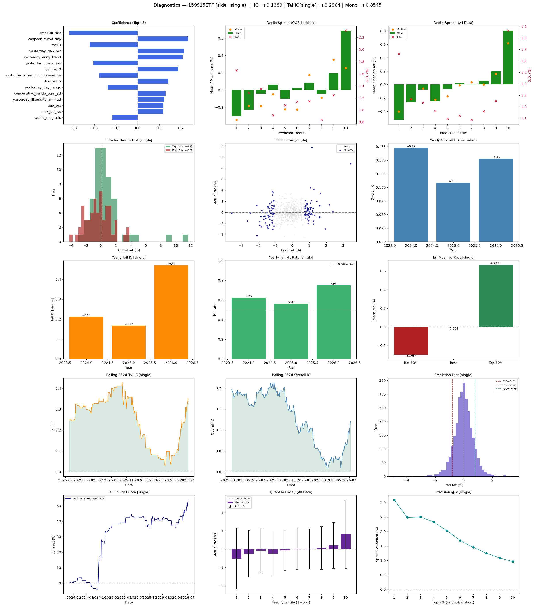

### 159915ETF_gauss (159915ETF, side=`single`)
- **Selected features**: 16
- **Active features**: 16
- **Active**: `yesterday_early_momentum`, `yesterday_gap_pct`, `northbound_net`, `bar_rng_3`, `bar_ret_0`, `bar_body_rng_0`, `max_up_ret`, `margin_buy_repayment_spread`, `capital_net_ratio`, `yesterday_lunch_gap`, `bar_vol_5`, `early_kurtosis`, `sma100_dist`, `coppock_curve_day`, `yesterday_afternoon_momentum`, `gap_pct`
- **Stopped by Step 1 (FDR Screening)** (0 features):
  None
- **Stopped by Step 2 (Stability & VIF Pruning)** (198 features):
  

  
Show 198 features

  
  `first_30min_return`, `early_realized_vol`, `early_range`, `early_trend`, `early_momentum`, `first_bar_return`, `first_bar_volume`, `early_vwap_dev`, `early_skew`, `bar_ret_1`, `bar_ret_2`, `bar_vol_0`, `bar_vol_4`, `bar_rng_0`, `bar_rng_2`, `bar_rng_5`, `bar_body_rng_1`, `bar_body_rng_2`, `bar_vwap_dev_0`, `bar_vwap_dev_1`, `bar_vwap_dev_2`, `bar_vwap_dev_3`, `bar_vwap_dev_5`, `num_up_bars`, `max_down_ret`, `cl_pos_in_range`, `body_to_range_ratio`, `total_path_length`, `volume_slope`, `spike_exhaustion_ratio`, `first_bar_sentiment`, `or_fill_ratio`, `close_vs_open_range`, `inside_bar_failure_bull`, `consecutive_higher_highs`, `early_bearish_engulfing_count`, `volume_surge_max`, `volume_concentration`, `volume_trend_intraday`, `volume_acceleration`, `volume_surge_direction`, `pullback_ratio`, `rally_ratio`, `range_expansion_ratio`, `pullback_depth_ratio`, `pullback_depth_max`, `rally_strength_max`, `vwap_slope_intraday`, `volume_weighted_price_position`, `net_volume_flow`, `early_body_momentum`, `late_bar_momentum`, `trend_strength_intraday`, `high_low_sequence_momentum`, `intraday_slope`, `intraday_autocorr`, `opening_momentum_score`, `opening_direction_stability`, `early_trend_hhi`, `session_high_proximity`, `session_low_proximity`, `close_above_open_count`, `open_to_current_return`, `upper_wick_dominance`, `rsi_opening`, `stoch_opening`, `momentum_strength_intraday`, `opening_auction_imbalance`, `intraday_close_position`, `limit_down_proximity_early`, `morning_trend_extrapolated`, `demark_setup_reversal_early`, `failed_breakout_reversal_early`, `early_wavetrend_cross`, `atr_expansion_flag_early`, `volatility_breakout_squeeze`, `early_bid_ask_spread_proxy`, `early_vwap_acceleration`, `early_order_flow_imbalance`, `rbreaker_sell_setup_proximity_early`, `rbreaker_buy_setup_proximity_early`, `skypark_gap_reversal_early`, `turtle_breakout_strength_early`, `macd_hist`, `sma20_dist`, `sma50_dist`, `atr14_norm`, `roc10`, `vol20`, `sma10_dist`, `sma200_dist`, `ema12_dist`, `rsi5`, `rsi21`, `roc5`, `roc20`, `roc60`, `cci14`, `willr14`, `stoch_k`, `stoch_d`, `mfi14`, `aroon_osc`, `vol5`, `vol10`, `vol60`, `vol_ratio_5_20`, `vol_ratio_10_60`, `bb_width`, `vol_pk20`, `vol_gk10`, `vol_gk20`, `volume_sma_ratio`, `margin_balance`, `buy_on_margin_value`, `margin_repayment`, `short_balance`, `short_balance_quantity`, `short_sell_quantity`, `short_repayment_quantity`, `total_balance`, `margin_net_buy`, `margin_short_ratio`, `capital_buy_volume`, `capital_buy_value`, `capital_sell_volume`, `capital_sell_value`, `capital_net_value`, `northbound_buy`, `northbound_sell`, `iv`, `iv_vol_ratio`, `vix`, `vix_vol_ratio`, `vix_iv_spread`, `vix_iv_ratio`, `iv_diff_1d`, `vix_diff_1d`, `tech_value_rotation`, `yesterday_limit_up_touch`, `limit_up_proximity_day`, `limit_down_proximity_day`, `growth_momentum_ratio`, `high_beta_vol_ratio`, `vix_skew_proxy`, `vix_rolling_percentile_60d`, `iv_corridor_width`, `yesterday_vix_early_drift`, `vix_realized_spread`, `option_oi_growth`, `iv_envelope_deviation`, `margin_lever_ratio`, `capital_net_accel`, `northbound_volume_share`, `yesterday_northbound_net_ratio`, `short_sell_cover_spread`, `margin_extreme_rank_252d`, `capital_large_order_ratio`, `consecutive_inside_bars_3d`, `outside_bar_reversal_day`, `wavetrend_osc_day`, `keltner_squeeze_width`, `yesterday_wavetrend_osc`, `yesterday_stoch_rsi_cross`, `cvd_divergence_day`, `yesterday_illiquidity_amihud`, `yesterday_range_ratio`, `yesterday_body_ratio`, `yesterday_volume_ratio`, `yesterday_return`, `yesterday_gap`, `yesterday_close_position`, `sma_distance_5d`, `sma_distance_60d`, `volatility_percentile_20d`, `volume_percentile_20d`, `yearly_high_distance`, `yearly_low_distance`, `twenty_gap_bars_regime`, `measured_move_proximity`, `yesterday_pm_return`, `yesterday_am_return`, `yesterday_first_30min_return`, `yesterday_early_realized_vol`, `yesterday_early_range`, `yesterday_early_trend`, `yesterday_first_bar_volume`, `yesterday_early_vwap_dev`, `yesterday_day_range`, `yesterday_day_realized_vol`, `yesterday_day_close_pos`, `yesterday_day_pm_am_vol_ratio`, `yesterday_day_vwap_dev`, `yesterday_day_skew`, `yesterday_day_kurtosis`, `yesterday_afternoon_reversal`, `yesterday_pm_am_vol_ratio`, `yesterday_cvd_close`
  

### 159915ETF_rank (159915ETF, side=`single`)
- **Selected features**: 17
- **Active features**: 17
- **Active**: `yesterday_early_momentum`, `yesterday_gap_pct`, `northbound_net`, `vix_iv_ratio`, `bar_rng_3`, `bar_ret_0`, `bar_body_rng_0`, `max_up_ret`, `margin_buy_repayment_spread`, `capital_net_ratio`, `yesterday_lunch_gap`, `bar_vol_5`, `early_kurtosis`, `sma100_dist`, `coppock_curve_day`, `yesterday_afternoon_momentum`, `gap_pct`
- **Stopped by Step 1 (FDR Screening)** (0 features):
  None
- **Stopped by Step 2 (Stability & VIF Pruning)** (197 features):
  

  
Show 197 features

  
  `first_30min_return`, `early_realized_vol`, `early_range`, `early_trend`, `early_momentum`, `first_bar_return`, `first_bar_volume`, `early_vwap_dev`, `early_skew`, `bar_ret_1`, `bar_ret_2`, `bar_vol_0`, `bar_vol_4`, `bar_rng_0`, `bar_rng_2`, `bar_rng_5`, `bar_body_rng_1`, `bar_body_rng_2`, `bar_vwap_dev_0`, `bar_vwap_dev_1`, `bar_vwap_dev_2`, `bar_vwap_dev_3`, `bar_vwap_dev_5`, `num_up_bars`, `max_down_ret`, `cl_pos_in_range`, `body_to_range_ratio`, `total_path_length`, `volume_slope`, `spike_exhaustion_ratio`, `first_bar_sentiment`, `or_fill_ratio`, `close_vs_open_range`, `inside_bar_failure_bull`, `consecutive_higher_highs`, `early_bearish_engulfing_count`, `volume_surge_max`, `volume_concentration`, `volume_trend_intraday`, `volume_acceleration`, `volume_surge_direction`, `pullback_ratio`, `rally_ratio`, `range_expansion_ratio`, `pullback_depth_ratio`, `pullback_depth_max`, `rally_strength_max`, `vwap_slope_intraday`, `volume_weighted_price_position`, `net_volume_flow`, `early_body_momentum`, `late_bar_momentum`, `trend_strength_intraday`, `high_low_sequence_momentum`, `intraday_slope`, `intraday_autocorr`, `opening_momentum_score`, `opening_direction_stability`, `early_trend_hhi`, `session_high_proximity`, `session_low_proximity`, `close_above_open_count`, `open_to_current_return`, `upper_wick_dominance`, `rsi_opening`, `stoch_opening`, `momentum_strength_intraday`, `opening_auction_imbalance`, `intraday_close_position`, `limit_down_proximity_early`, `morning_trend_extrapolated`, `demark_setup_reversal_early`, `failed_breakout_reversal_early`, `early_wavetrend_cross`, `atr_expansion_flag_early`, `volatility_breakout_squeeze`, `early_bid_ask_spread_proxy`, `early_vwap_acceleration`, `early_order_flow_imbalance`, `rbreaker_sell_setup_proximity_early`, `rbreaker_buy_setup_proximity_early`, `skypark_gap_reversal_early`, `turtle_breakout_strength_early`, `macd_hist`, `sma20_dist`, `sma50_dist`, `atr14_norm`, `roc10`, `vol20`, `sma10_dist`, `sma200_dist`, `ema12_dist`, `rsi5`, `rsi21`, `roc5`, `roc20`, `roc60`, `cci14`, `willr14`, `stoch_k`, `stoch_d`, `mfi14`, `aroon_osc`, `vol5`, `vol10`, `vol60`, `vol_ratio_5_20`, `vol_ratio_10_60`, `bb_width`, `vol_pk20`, `vol_gk10`, `vol_gk20`, `volume_sma_ratio`, `margin_balance`, `buy_on_margin_value`, `margin_repayment`, `short_balance`, `short_balance_quantity`, `short_sell_quantity`, `short_repayment_quantity`, `total_balance`, `margin_net_buy`, `margin_short_ratio`, `capital_buy_volume`, `capital_buy_value`, `capital_sell_volume`, `capital_sell_value`, `capital_net_value`, `northbound_buy`, `northbound_sell`, `iv`, `iv_vol_ratio`, `vix`, `vix_vol_ratio`, `vix_iv_spread`, `iv_diff_1d`, `vix_diff_1d`, `tech_value_rotation`, `yesterday_limit_up_touch`, `limit_up_proximity_day`, `limit_down_proximity_day`, `growth_momentum_ratio`, `high_beta_vol_ratio`, `vix_skew_proxy`, `vix_rolling_percentile_60d`, `iv_corridor_width`, `yesterday_vix_early_drift`, `vix_realized_spread`, `option_oi_growth`, `iv_envelope_deviation`, `margin_lever_ratio`, `capital_net_accel`, `northbound_volume_share`, `yesterday_northbound_net_ratio`, `short_sell_cover_spread`, `margin_extreme_rank_252d`, `capital_large_order_ratio`, `consecutive_inside_bars_3d`, `outside_bar_reversal_day`, `wavetrend_osc_day`, `keltner_squeeze_width`, `yesterday_wavetrend_osc`, `yesterday_stoch_rsi_cross`, `cvd_divergence_day`, `yesterday_illiquidity_amihud`, `yesterday_range_ratio`, `yesterday_body_ratio`, `yesterday_volume_ratio`, `yesterday_return`, `yesterday_gap`, `yesterday_close_position`, `sma_distance_5d`, `sma_distance_60d`, `volatility_percentile_20d`, `volume_percentile_20d`, `yearly_high_distance`, `yearly_low_distance`, `twenty_gap_bars_regime`, `measured_move_proximity`, `yesterday_pm_return`, `yesterday_am_return`, `yesterday_first_30min_return`, `yesterday_early_realized_vol`, `yesterday_early_range`, `yesterday_early_trend`, `yesterday_first_bar_volume`, `yesterday_early_vwap_dev`, `yesterday_day_range`, `yesterday_day_realized_vol`, `yesterday_day_close_pos`, `yesterday_day_pm_am_vol_ratio`, `yesterday_day_vwap_dev`, `yesterday_day_skew`, `yesterday_day_kurtosis`, `yesterday_afternoon_reversal`, `yesterday_pm_am_vol_ratio`, `yesterday_cvd_close`
  

### 159915ETF_long (159915ETF, side=`long`)
- **Selected features**: 20
- **Active features**: 20
- **Active**: `yesterday_early_trend`, `yesterday_gap_pct`, `northbound_net`, `margin_extreme_rank_252d`, `yesterday_early_realized_vol`, `yesterday_day_range`, `bar_ret_0`, `max_up_ret`, `margin_buy_repayment_spread`, `capital_net_ratio`, `yesterday_lunch_gap`, `bar_vol_5`, `tech_value_rotation`, `roc10`, `yesterday_illiquidity_amihud`, `early_kurtosis`, `sma100_dist`, `coppock_curve_day`, `yesterday_afternoon_momentum`, `gap_pct`
- **Stopped by Step 1 (FDR Screening)** (0 features):
  None
- **Stopped by Step 2 (Stability & VIF Pruning)** (194 features):
  

  
Show 194 features

  
  `first_30min_return`, `early_realized_vol`, `early_range`, `early_trend`, `early_momentum`, `first_bar_return`, `first_bar_volume`, `early_vwap_dev`, `early_skew`, `bar_ret_1`, `bar_ret_2`, `bar_vol_0`, `bar_vol_4`, `bar_rng_0`, `bar_rng_2`, `bar_rng_3`, `bar_rng_5`, `bar_body_rng_0`, `bar_body_rng_1`, `bar_body_rng_2`, `bar_vwap_dev_0`, `bar_vwap_dev_1`, `bar_vwap_dev_2`, `bar_vwap_dev_3`, `bar_vwap_dev_5`, `num_up_bars`, `max_down_ret`, `cl_pos_in_range`, `body_to_range_ratio`, `total_path_length`, `volume_slope`, `spike_exhaustion_ratio`, `first_bar_sentiment`, `or_fill_ratio`, `close_vs_open_range`, `inside_bar_failure_bull`, `consecutive_higher_highs`, `early_bearish_engulfing_count`, `volume_surge_max`, `volume_concentration`, `volume_trend_intraday`, `volume_acceleration`, `volume_surge_direction`, `pullback_ratio`, `rally_ratio`, `range_expansion_ratio`, `pullback_depth_ratio`, `pullback_depth_max`, `rally_strength_max`, `vwap_slope_intraday`, `volume_weighted_price_position`, `net_volume_flow`, `early_body_momentum`, `late_bar_momentum`, `trend_strength_intraday`, `high_low_sequence_momentum`, `intraday_slope`, `intraday_autocorr`, `opening_momentum_score`, `opening_direction_stability`, `early_trend_hhi`, `session_high_proximity`, `session_low_proximity`, `close_above_open_count`, `open_to_current_return`, `upper_wick_dominance`, `rsi_opening`, `stoch_opening`, `momentum_strength_intraday`, `opening_auction_imbalance`, `intraday_close_position`, `limit_down_proximity_early`, `morning_trend_extrapolated`, `demark_setup_reversal_early`, `failed_breakout_reversal_early`, `early_wavetrend_cross`, `atr_expansion_flag_early`, `volatility_breakout_squeeze`, `early_bid_ask_spread_proxy`, `early_vwap_acceleration`, `early_order_flow_imbalance`, `rbreaker_sell_setup_proximity_early`, `rbreaker_buy_setup_proximity_early`, `skypark_gap_reversal_early`, `turtle_breakout_strength_early`, `macd_hist`, `sma20_dist`, `sma50_dist`, `atr14_norm`, `vol20`, `sma10_dist`, `sma200_dist`, `ema12_dist`, `rsi5`, `rsi21`, `roc5`, `roc20`, `roc60`, `cci14`, `willr14`, `stoch_k`, `stoch_d`, `mfi14`, `aroon_osc`, `vol5`, `vol10`, `vol60`, `vol_ratio_5_20`, `vol_ratio_10_60`, `bb_width`, `vol_pk20`, `vol_gk10`, `vol_gk20`, `volume_sma_ratio`, `margin_balance`, `buy_on_margin_value`, `margin_repayment`, `short_balance`, `short_balance_quantity`, `short_sell_quantity`, `short_repayment_quantity`, `total_balance`, `margin_net_buy`, `margin_short_ratio`, `capital_buy_volume`, `capital_buy_value`, `capital_sell_volume`, `capital_sell_value`, `capital_net_value`, `northbound_buy`, `northbound_sell`, `iv`, `iv_vol_ratio`, `vix`, `vix_vol_ratio`, `vix_iv_spread`, `vix_iv_ratio`, `iv_diff_1d`, `vix_diff_1d`, `yesterday_limit_up_touch`, `limit_up_proximity_day`, `limit_down_proximity_day`, `growth_momentum_ratio`, `high_beta_vol_ratio`, `vix_skew_proxy`, `vix_rolling_percentile_60d`, `iv_corridor_width`, `yesterday_vix_early_drift`, `vix_realized_spread`, `option_oi_growth`, `iv_envelope_deviation`, `margin_lever_ratio`, `capital_net_accel`, `northbound_volume_share`, `yesterday_northbound_net_ratio`, `short_sell_cover_spread`, `capital_large_order_ratio`, `consecutive_inside_bars_3d`, `outside_bar_reversal_day`, `wavetrend_osc_day`, `keltner_squeeze_width`, `yesterday_wavetrend_osc`, `yesterday_stoch_rsi_cross`, `cvd_divergence_day`, `yesterday_range_ratio`, `yesterday_body_ratio`, `yesterday_volume_ratio`, `yesterday_return`, `yesterday_gap`, `yesterday_close_position`, `sma_distance_5d`, `sma_distance_60d`, `volatility_percentile_20d`, `volume_percentile_20d`, `yearly_high_distance`, `yearly_low_distance`, `twenty_gap_bars_regime`, `measured_move_proximity`, `yesterday_pm_return`, `yesterday_am_return`, `yesterday_first_30min_return`, `yesterday_early_range`, `yesterday_early_momentum`, `yesterday_first_bar_volume`, `yesterday_early_vwap_dev`, `yesterday_day_realized_vol`, `yesterday_day_close_pos`, `yesterday_day_pm_am_vol_ratio`, `yesterday_day_vwap_dev`, `yesterday_day_skew`, `yesterday_day_kurtosis`, `yesterday_afternoon_reversal`, `yesterday_pm_am_vol_ratio`, `yesterday_cvd_close`
  

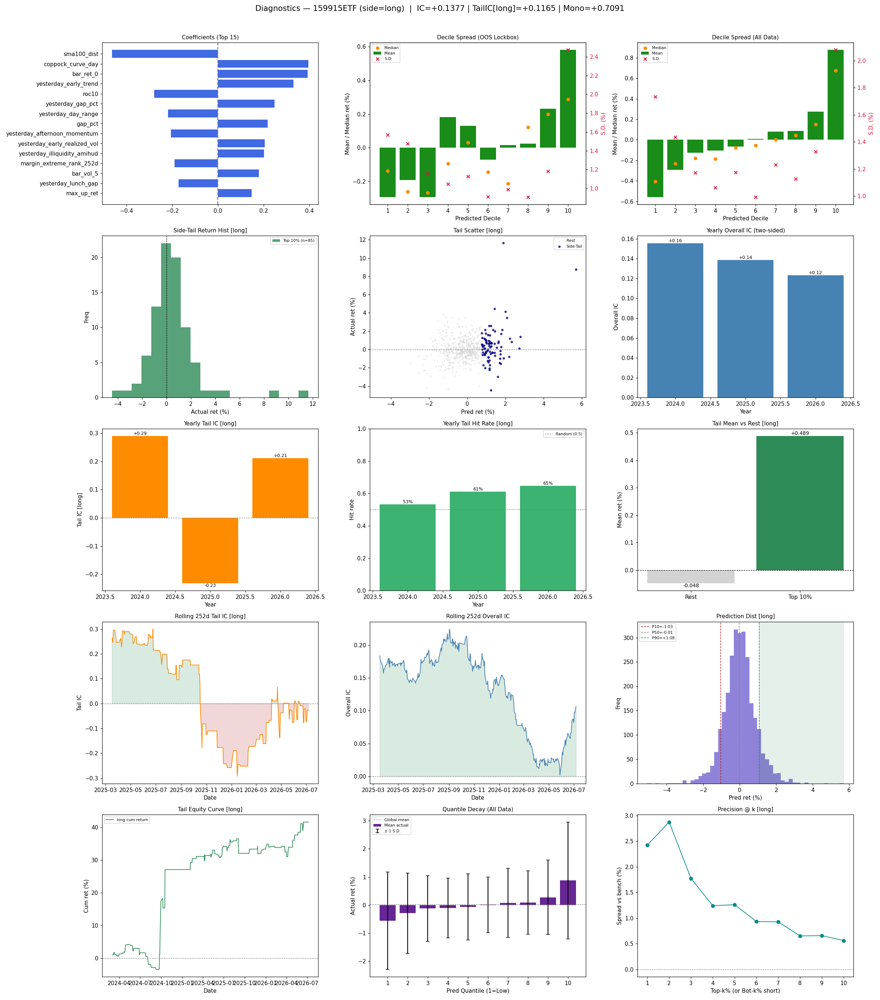

### 159915ETF_long_gauss (159915ETF, side=`long`)
- **Selected features**: 4
- **Active features**: 4
- **Active**: `bar_ret_0`, `yesterday_lunch_gap`, `sma100_dist`, `yesterday_afternoon_momentum`
- **Stopped by Step 1 (FDR Screening)** (0 features):
  None
- **Stopped by Step 2 (Stability & VIF Pruning)** (210 features):
  

  
Show 210 features

  
  `gap_pct`, `first_30min_return`, `early_realized_vol`, `early_range`, `early_trend`, `early_momentum`, `first_bar_return`, `first_bar_volume`, `early_vwap_dev`, `early_skew`, `early_kurtosis`, `bar_ret_1`, `bar_ret_2`, `bar_vol_0`, `bar_vol_4`, `bar_vol_5`, `bar_rng_0`, `bar_rng_2`, `bar_rng_3`, `bar_rng_5`, `bar_body_rng_0`, `bar_body_rng_1`, `bar_body_rng_2`, `bar_vwap_dev_0`, `bar_vwap_dev_1`, `bar_vwap_dev_2`, `bar_vwap_dev_3`, `bar_vwap_dev_5`, `num_up_bars`, `max_up_ret`, `max_down_ret`, `cl_pos_in_range`, `body_to_range_ratio`, `total_path_length`, `volume_slope`, `spike_exhaustion_ratio`, `first_bar_sentiment`, `or_fill_ratio`, `close_vs_open_range`, `inside_bar_failure_bull`, `consecutive_higher_highs`, `early_bearish_engulfing_count`, `volume_surge_max`, `volume_concentration`, `volume_trend_intraday`, `volume_acceleration`, `volume_surge_direction`, `pullback_ratio`, `rally_ratio`, `range_expansion_ratio`, `pullback_depth_ratio`, `pullback_depth_max`, `rally_strength_max`, `vwap_slope_intraday`, `volume_weighted_price_position`, `net_volume_flow`, `early_body_momentum`, `late_bar_momentum`, `trend_strength_intraday`, `high_low_sequence_momentum`, `intraday_slope`, `intraday_autocorr`, `opening_momentum_score`, `opening_direction_stability`, `early_trend_hhi`, `session_high_proximity`, `session_low_proximity`, `close_above_open_count`, `open_to_current_return`, `upper_wick_dominance`, `rsi_opening`, `stoch_opening`, `momentum_strength_intraday`, `opening_auction_imbalance`, `intraday_close_position`, `limit_down_proximity_early`, `morning_trend_extrapolated`, `demark_setup_reversal_early`, `failed_breakout_reversal_early`, `early_wavetrend_cross`, `atr_expansion_flag_early`, `volatility_breakout_squeeze`, `early_bid_ask_spread_proxy`, `early_vwap_acceleration`, `early_order_flow_imbalance`, `rbreaker_sell_setup_proximity_early`, `rbreaker_buy_setup_proximity_early`, `skypark_gap_reversal_early`, `turtle_breakout_strength_early`, `macd_hist`, `sma20_dist`, `sma50_dist`, `atr14_norm`, `roc10`, `vol20`, `sma10_dist`, `sma200_dist`, `ema12_dist`, `rsi5`, `rsi21`, `roc5`, `roc20`, `roc60`, `cci14`, `willr14`, `stoch_k`, `stoch_d`, `mfi14`, `aroon_osc`, `vol5`, `vol10`, `vol60`, `vol_ratio_5_20`, `vol_ratio_10_60`, `bb_width`, `vol_pk20`, `vol_gk10`, `vol_gk20`, `volume_sma_ratio`, `margin_balance`, `buy_on_margin_value`, `margin_repayment`, `short_balance`, `short_balance_quantity`, `short_sell_quantity`, `short_repayment_quantity`, `total_balance`, `margin_net_buy`, `margin_short_ratio`, `capital_buy_volume`, `capital_buy_value`, `capital_sell_volume`, `capital_sell_value`, `capital_net_value`, `capital_net_ratio`, `northbound_buy`, `northbound_sell`, `northbound_net`, `iv`, `iv_vol_ratio`, `vix`, `vix_vol_ratio`, `vix_iv_spread`, `vix_iv_ratio`, `iv_diff_1d`, `vix_diff_1d`, `tech_value_rotation`, `yesterday_limit_up_touch`, `limit_up_proximity_day`, `limit_down_proximity_day`, `growth_momentum_ratio`, `high_beta_vol_ratio`, `vix_skew_proxy`, `vix_rolling_percentile_60d`, `iv_corridor_width`, `yesterday_vix_early_drift`, `vix_realized_spread`, `option_oi_growth`, `iv_envelope_deviation`, `margin_lever_ratio`, `capital_net_accel`, `northbound_volume_share`, `yesterday_northbound_net_ratio`, `margin_buy_repayment_spread`, `short_sell_cover_spread`, `margin_extreme_rank_252d`, `capital_large_order_ratio`, `consecutive_inside_bars_3d`, `outside_bar_reversal_day`, `wavetrend_osc_day`, `keltner_squeeze_width`, `yesterday_wavetrend_osc`, `yesterday_stoch_rsi_cross`, `cvd_divergence_day`, `yesterday_illiquidity_amihud`, `coppock_curve_day`, `yesterday_range_ratio`, `yesterday_body_ratio`, `yesterday_volume_ratio`, `yesterday_return`, `yesterday_gap`, `yesterday_close_position`, `sma_distance_5d`, `sma_distance_60d`, `volatility_percentile_20d`, `volume_percentile_20d`, `yearly_high_distance`, `yearly_low_distance`, `twenty_gap_bars_regime`, `measured_move_proximity`, `yesterday_pm_return`, `yesterday_am_return`, `yesterday_gap_pct`, `yesterday_first_30min_return`, `yesterday_early_realized_vol`, `yesterday_early_range`, `yesterday_early_trend`, `yesterday_early_momentum`, `yesterday_first_bar_volume`, `yesterday_early_vwap_dev`, `yesterday_day_range`, `yesterday_day_realized_vol`, `yesterday_day_close_pos`, `yesterday_day_pm_am_vol_ratio`, `yesterday_day_vwap_dev`, `yesterday_day_skew`, `yesterday_day_kurtosis`, `yesterday_afternoon_reversal`, `yesterday_pm_am_vol_ratio`, `yesterday_cvd_close`
  

### 159915ETF_long_rank (159915ETF, side=`long`)
- **Selected features**: 17
- **Active features**: 17
- **Active**: `yesterday_early_momentum`, `yesterday_gap_pct`, `northbound_net`, `vix_iv_ratio`, `bar_rng_3`, `bar_ret_0`, `bar_body_rng_0`, `max_up_ret`, `margin_buy_repayment_spread`, `capital_net_ratio`, `yesterday_lunch_gap`, `bar_vol_5`, `early_kurtosis`, `sma100_dist`, `coppock_curve_day`, `yesterday_afternoon_momentum`, `gap_pct`
- **Stopped by Step 1 (FDR Screening)** (0 features):
  None
- **Stopped by Step 2 (Stability & VIF Pruning)** (197 features):
  

  
Show 197 features

  
  `first_30min_return`, `early_realized_vol`, `early_range`, `early_trend`, `early_momentum`, `first_bar_return`, `first_bar_volume`, `early_vwap_dev`, `early_skew`, `bar_ret_1`, `bar_ret_2`, `bar_vol_0`, `bar_vol_4`, `bar_rng_0`, `bar_rng_2`, `bar_rng_5`, `bar_body_rng_1`, `bar_body_rng_2`, `bar_vwap_dev_0`, `bar_vwap_dev_1`, `bar_vwap_dev_2`, `bar_vwap_dev_3`, `bar_vwap_dev_5`, `num_up_bars`, `max_down_ret`, `cl_pos_in_range`, `body_to_range_ratio`, `total_path_length`, `volume_slope`, `spike_exhaustion_ratio`, `first_bar_sentiment`, `or_fill_ratio`, `close_vs_open_range`, `inside_bar_failure_bull`, `consecutive_higher_highs`, `early_bearish_engulfing_count`, `volume_surge_max`, `volume_concentration`, `volume_trend_intraday`, `volume_acceleration`, `volume_surge_direction`, `pullback_ratio`, `rally_ratio`, `range_expansion_ratio`, `pullback_depth_ratio`, `pullback_depth_max`, `rally_strength_max`, `vwap_slope_intraday`, `volume_weighted_price_position`, `net_volume_flow`, `early_body_momentum`, `late_bar_momentum`, `trend_strength_intraday`, `high_low_sequence_momentum`, `intraday_slope`, `intraday_autocorr`, `opening_momentum_score`, `opening_direction_stability`, `early_trend_hhi`, `session_high_proximity`, `session_low_proximity`, `close_above_open_count`, `open_to_current_return`, `upper_wick_dominance`, `rsi_opening`, `stoch_opening`, `momentum_strength_intraday`, `opening_auction_imbalance`, `intraday_close_position`, `limit_down_proximity_early`, `morning_trend_extrapolated`, `demark_setup_reversal_early`, `failed_breakout_reversal_early`, `early_wavetrend_cross`, `atr_expansion_flag_early`, `volatility_breakout_squeeze`, `early_bid_ask_spread_proxy`, `early_vwap_acceleration`, `early_order_flow_imbalance`, `rbreaker_sell_setup_proximity_early`, `rbreaker_buy_setup_proximity_early`, `skypark_gap_reversal_early`, `turtle_breakout_strength_early`, `macd_hist`, `sma20_dist`, `sma50_dist`, `atr14_norm`, `roc10`, `vol20`, `sma10_dist`, `sma200_dist`, `ema12_dist`, `rsi5`, `rsi21`, `roc5`, `roc20`, `roc60`, `cci14`, `willr14`, `stoch_k`, `stoch_d`, `mfi14`, `aroon_osc`, `vol5`, `vol10`, `vol60`, `vol_ratio_5_20`, `vol_ratio_10_60`, `bb_width`, `vol_pk20`, `vol_gk10`, `vol_gk20`, `volume_sma_ratio`, `margin_balance`, `buy_on_margin_value`, `margin_repayment`, `short_balance`, `short_balance_quantity`, `short_sell_quantity`, `short_repayment_quantity`, `total_balance`, `margin_net_buy`, `margin_short_ratio`, `capital_buy_volume`, `capital_buy_value`, `capital_sell_volume`, `capital_sell_value`, `capital_net_value`, `northbound_buy`, `northbound_sell`, `iv`, `iv_vol_ratio`, `vix`, `vix_vol_ratio`, `vix_iv_spread`, `iv_diff_1d`, `vix_diff_1d`, `tech_value_rotation`, `yesterday_limit_up_touch`, `limit_up_proximity_day`, `limit_down_proximity_day`, `growth_momentum_ratio`, `high_beta_vol_ratio`, `vix_skew_proxy`, `vix_rolling_percentile_60d`, `iv_corridor_width`, `yesterday_vix_early_drift`, `vix_realized_spread`, `option_oi_growth`, `iv_envelope_deviation`, `margin_lever_ratio`, `capital_net_accel`, `northbound_volume_share`, `yesterday_northbound_net_ratio`, `short_sell_cover_spread`, `margin_extreme_rank_252d`, `capital_large_order_ratio`, `consecutive_inside_bars_3d`, `outside_bar_reversal_day`, `wavetrend_osc_day`, `keltner_squeeze_width`, `yesterday_wavetrend_osc`, `yesterday_stoch_rsi_cross`, `cvd_divergence_day`, `yesterday_illiquidity_amihud`, `yesterday_range_ratio`, `yesterday_body_ratio`, `yesterday_volume_ratio`, `yesterday_return`, `yesterday_gap`, `yesterday_close_position`, `sma_distance_5d`, `sma_distance_60d`, `volatility_percentile_20d`, `volume_percentile_20d`, `yearly_high_distance`, `yearly_low_distance`, `twenty_gap_bars_regime`, `measured_move_proximity`, `yesterday_pm_return`, `yesterday_am_return`, `yesterday_first_30min_return`, `yesterday_early_realized_vol`, `yesterday_early_range`, `yesterday_early_trend`, `yesterday_first_bar_volume`, `yesterday_early_vwap_dev`, `yesterday_day_range`, `yesterday_day_realized_vol`, `yesterday_day_close_pos`, `yesterday_day_pm_am_vol_ratio`, `yesterday_day_vwap_dev`, `yesterday_day_skew`, `yesterday_day_kurtosis`, `yesterday_afternoon_reversal`, `yesterday_pm_am_vol_ratio`, `yesterday_cvd_close`
  

### 159915ETF_short (159915ETF, side=`short`)
- **Selected features**: 20
- **Active features**: 20
- **Active**: `yesterday_early_trend`, `yesterday_gap_pct`, `northbound_net`, `margin_extreme_rank_252d`, `yesterday_early_realized_vol`, `yesterday_day_range`, `bar_ret_0`, `max_up_ret`, `margin_buy_repayment_spread`, `capital_net_ratio`, `yesterday_lunch_gap`, `bar_vol_5`, `tech_value_rotation`, `roc10`, `yesterday_illiquidity_amihud`, `early_kurtosis`, `sma100_dist`, `coppock_curve_day`, `yesterday_afternoon_momentum`, `gap_pct`
- **Stopped by Step 1 (FDR Screening)** (0 features):
  None
- **Stopped by Step 2 (Stability & VIF Pruning)** (194 features):
  

  
Show 194 features

  
  `first_30min_return`, `early_realized_vol`, `early_range`, `early_trend`, `early_momentum`, `first_bar_return`, `first_bar_volume`, `early_vwap_dev`, `early_skew`, `bar_ret_1`, `bar_ret_2`, `bar_vol_0`, `bar_vol_4`, `bar_rng_0`, `bar_rng_2`, `bar_rng_3`, `bar_rng_5`, `bar_body_rng_0`, `bar_body_rng_1`, `bar_body_rng_2`, `bar_vwap_dev_0`, `bar_vwap_dev_1`, `bar_vwap_dev_2`, `bar_vwap_dev_3`, `bar_vwap_dev_5`, `num_up_bars`, `max_down_ret`, `cl_pos_in_range`, `body_to_range_ratio`, `total_path_length`, `volume_slope`, `spike_exhaustion_ratio`, `first_bar_sentiment`, `or_fill_ratio`, `close_vs_open_range`, `inside_bar_failure_bull`, `consecutive_higher_highs`, `early_bearish_engulfing_count`, `volume_surge_max`, `volume_concentration`, `volume_trend_intraday`, `volume_acceleration`, `volume_surge_direction`, `pullback_ratio`, `rally_ratio`, `range_expansion_ratio`, `pullback_depth_ratio`, `pullback_depth_max`, `rally_strength_max`, `vwap_slope_intraday`, `volume_weighted_price_position`, `net_volume_flow`, `early_body_momentum`, `late_bar_momentum`, `trend_strength_intraday`, `high_low_sequence_momentum`, `intraday_slope`, `intraday_autocorr`, `opening_momentum_score`, `opening_direction_stability`, `early_trend_hhi`, `session_high_proximity`, `session_low_proximity`, `close_above_open_count`, `open_to_current_return`, `upper_wick_dominance`, `rsi_opening`, `stoch_opening`, `momentum_strength_intraday`, `opening_auction_imbalance`, `intraday_close_position`, `limit_down_proximity_early`, `morning_trend_extrapolated`, `demark_setup_reversal_early`, `failed_breakout_reversal_early`, `early_wavetrend_cross`, `atr_expansion_flag_early`, `volatility_breakout_squeeze`, `early_bid_ask_spread_proxy`, `early_vwap_acceleration`, `early_order_flow_imbalance`, `rbreaker_sell_setup_proximity_early`, `rbreaker_buy_setup_proximity_early`, `skypark_gap_reversal_early`, `turtle_breakout_strength_early`, `macd_hist`, `sma20_dist`, `sma50_dist`, `atr14_norm`, `vol20`, `sma10_dist`, `sma200_dist`, `ema12_dist`, `rsi5`, `rsi21`, `roc5`, `roc20`, `roc60`, `cci14`, `willr14`, `stoch_k`, `stoch_d`, `mfi14`, `aroon_osc`, `vol5`, `vol10`, `vol60`, `vol_ratio_5_20`, `vol_ratio_10_60`, `bb_width`, `vol_pk20`, `vol_gk10`, `vol_gk20`, `volume_sma_ratio`, `margin_balance`, `buy_on_margin_value`, `margin_repayment`, `short_balance`, `short_balance_quantity`, `short_sell_quantity`, `short_repayment_quantity`, `total_balance`, `margin_net_buy`, `margin_short_ratio`, `capital_buy_volume`, `capital_buy_value`, `capital_sell_volume`, `capital_sell_value`, `capital_net_value`, `northbound_buy`, `northbound_sell`, `iv`, `iv_vol_ratio`, `vix`, `vix_vol_ratio`, `vix_iv_spread`, `vix_iv_ratio`, `iv_diff_1d`, `vix_diff_1d`, `yesterday_limit_up_touch`, `limit_up_proximity_day`, `limit_down_proximity_day`, `growth_momentum_ratio`, `high_beta_vol_ratio`, `vix_skew_proxy`, `vix_rolling_percentile_60d`, `iv_corridor_width`, `yesterday_vix_early_drift`, `vix_realized_spread`, `option_oi_growth`, `iv_envelope_deviation`, `margin_lever_ratio`, `capital_net_accel`, `northbound_volume_share`, `yesterday_northbound_net_ratio`, `short_sell_cover_spread`, `capital_large_order_ratio`, `consecutive_inside_bars_3d`, `outside_bar_reversal_day`, `wavetrend_osc_day`, `keltner_squeeze_width`, `yesterday_wavetrend_osc`, `yesterday_stoch_rsi_cross`, `cvd_divergence_day`, `yesterday_range_ratio`, `yesterday_body_ratio`, `yesterday_volume_ratio`, `yesterday_return`, `yesterday_gap`, `yesterday_close_position`, `sma_distance_5d`, `sma_distance_60d`, `volatility_percentile_20d`, `volume_percentile_20d`, `yearly_high_distance`, `yearly_low_distance`, `twenty_gap_bars_regime`, `measured_move_proximity`, `yesterday_pm_return`, `yesterday_am_return`, `yesterday_first_30min_return`, `yesterday_early_range`, `yesterday_early_momentum`, `yesterday_first_bar_volume`, `yesterday_early_vwap_dev`, `yesterday_day_realized_vol`, `yesterday_day_close_pos`, `yesterday_day_pm_am_vol_ratio`, `yesterday_day_vwap_dev`, `yesterday_day_skew`, `yesterday_day_kurtosis`, `yesterday_afternoon_reversal`, `yesterday_pm_am_vol_ratio`, `yesterday_cvd_close`
  

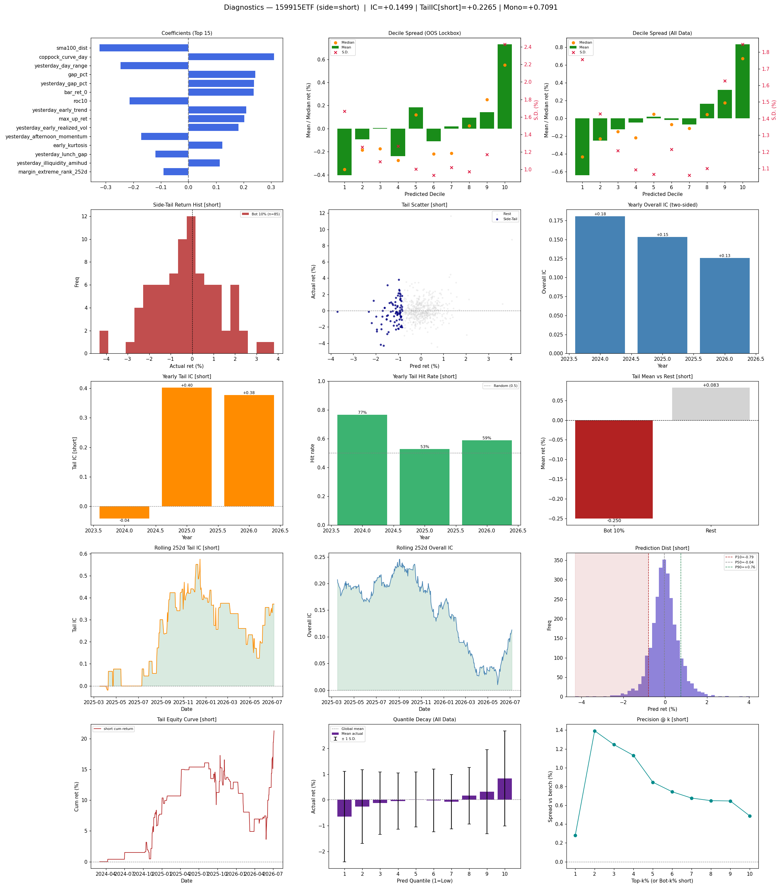

### 159915ETF_short_gauss (159915ETF, side=`short`)
- **Selected features**: 12
- **Active features**: 12
- **Active**: `yesterday_early_momentum`, `yesterday_gap_pct`, `bar_rng_3`, `bar_ret_0`, `capital_net_ratio`, `yesterday_lunch_gap`, `bar_vol_5`, `early_kurtosis`, `sma100_dist`, `coppock_curve_day`, `yesterday_afternoon_momentum`, `gap_pct`
- **Stopped by Step 1 (FDR Screening)** (0 features):
  None
- **Stopped by Step 2 (Stability & VIF Pruning)** (202 features):
  

  
Show 202 features

  
  `first_30min_return`, `early_realized_vol`, `early_range`, `early_trend`, `early_momentum`, `first_bar_return`, `first_bar_volume`, `early_vwap_dev`, `early_skew`, `bar_ret_1`, `bar_ret_2`, `bar_vol_0`, `bar_vol_4`, `bar_rng_0`, `bar_rng_2`, `bar_rng_5`, `bar_body_rng_0`, `bar_body_rng_1`, `bar_body_rng_2`, `bar_vwap_dev_0`, `bar_vwap_dev_1`, `bar_vwap_dev_2`, `bar_vwap_dev_3`, `bar_vwap_dev_5`, `num_up_bars`, `max_up_ret`, `max_down_ret`, `cl_pos_in_range`, `body_to_range_ratio`, `total_path_length`, `volume_slope`, `spike_exhaustion_ratio`, `first_bar_sentiment`, `or_fill_ratio`, `close_vs_open_range`, `inside_bar_failure_bull`, `consecutive_higher_highs`, `early_bearish_engulfing_count`, `volume_surge_max`, `volume_concentration`, `volume_trend_intraday`, `volume_acceleration`, `volume_surge_direction`, `pullback_ratio`, `rally_ratio`, `range_expansion_ratio`, `pullback_depth_ratio`, `pullback_depth_max`, `rally_strength_max`, `vwap_slope_intraday`, `volume_weighted_price_position`, `net_volume_flow`, `early_body_momentum`, `late_bar_momentum`, `trend_strength_intraday`, `high_low_sequence_momentum`, `intraday_slope`, `intraday_autocorr`, `opening_momentum_score`, `opening_direction_stability`, `early_trend_hhi`, `session_high_proximity`, `session_low_proximity`, `close_above_open_count`, `open_to_current_return`, `upper_wick_dominance`, `rsi_opening`, `stoch_opening`, `momentum_strength_intraday`, `opening_auction_imbalance`, `intraday_close_position`, `limit_down_proximity_early`, `morning_trend_extrapolated`, `demark_setup_reversal_early`, `failed_breakout_reversal_early`, `early_wavetrend_cross`, `atr_expansion_flag_early`, `volatility_breakout_squeeze`, `early_bid_ask_spread_proxy`, `early_vwap_acceleration`, `early_order_flow_imbalance`, `rbreaker_sell_setup_proximity_early`, `rbreaker_buy_setup_proximity_early`, `skypark_gap_reversal_early`, `turtle_breakout_strength_early`, `macd_hist`, `sma20_dist`, `sma50_dist`, `atr14_norm`, `roc10`, `vol20`, `sma10_dist`, `sma200_dist`, `ema12_dist`, `rsi5`, `rsi21`, `roc5`, `roc20`, `roc60`, `cci14`, `willr14`, `stoch_k`, `stoch_d`, `mfi14`, `aroon_osc`, `vol5`, `vol10`, `vol60`, `vol_ratio_5_20`, `vol_ratio_10_60`, `bb_width`, `vol_pk20`, `vol_gk10`, `vol_gk20`, `volume_sma_ratio`, `margin_balance`, `buy_on_margin_value`, `margin_repayment`, `short_balance`, `short_balance_quantity`, `short_sell_quantity`, `short_repayment_quantity`, `total_balance`, `margin_net_buy`, `margin_short_ratio`, `capital_buy_volume`, `capital_buy_value`, `capital_sell_volume`, `capital_sell_value`, `capital_net_value`, `northbound_buy`, `northbound_sell`, `northbound_net`, `iv`, `iv_vol_ratio`, `vix`, `vix_vol_ratio`, `vix_iv_spread`, `vix_iv_ratio`, `iv_diff_1d`, `vix_diff_1d`, `tech_value_rotation`, `yesterday_limit_up_touch`, `limit_up_proximity_day`, `limit_down_proximity_day`, `growth_momentum_ratio`, `high_beta_vol_ratio`, `vix_skew_proxy`, `vix_rolling_percentile_60d`, `iv_corridor_width`, `yesterday_vix_early_drift`, `vix_realized_spread`, `option_oi_growth`, `iv_envelope_deviation`, `margin_lever_ratio`, `capital_net_accel`, `northbound_volume_share`, `yesterday_northbound_net_ratio`, `margin_buy_repayment_spread`, `short_sell_cover_spread`, `margin_extreme_rank_252d`, `capital_large_order_ratio`, `consecutive_inside_bars_3d`, `outside_bar_reversal_day`, `wavetrend_osc_day`, `keltner_squeeze_width`, `yesterday_wavetrend_osc`, `yesterday_stoch_rsi_cross`, `cvd_divergence_day`, `yesterday_illiquidity_amihud`, `yesterday_range_ratio`, `yesterday_body_ratio`, `yesterday_volume_ratio`, `yesterday_return`, `yesterday_gap`, `yesterday_close_position`, `sma_distance_5d`, `sma_distance_60d`, `volatility_percentile_20d`, `volume_percentile_20d`, `yearly_high_distance`, `yearly_low_distance`, `twenty_gap_bars_regime`, `measured_move_proximity`, `yesterday_pm_return`, `yesterday_am_return`, `yesterday_first_30min_return`, `yesterday_early_realized_vol`, `yesterday_early_range`, `yesterday_early_trend`, `yesterday_first_bar_volume`, `yesterday_early_vwap_dev`, `yesterday_day_range`, `yesterday_day_realized_vol`, `yesterday_day_close_pos`, `yesterday_day_pm_am_vol_ratio`, `yesterday_day_vwap_dev`, `yesterday_day_skew`, `yesterday_day_kurtosis`, `yesterday_afternoon_reversal`, `yesterday_pm_am_vol_ratio`, `yesterday_cvd_close`
  

### 159915ETF_short_rank (159915ETF, side=`short`)
- **Selected features**: 7
- **Active features**: 6
- **Active**: `yesterday_early_momentum`, `bar_ret_0`, `bar_body_rng_0`, `max_up_ret`, `yesterday_afternoon_momentum`, `gap_pct`
- **Stopped by Step 1 (FDR Screening)** (0 features):
  None
- **Stopped by Step 2 (Stability & VIF Pruning)** (207 features):
  

  
Show 207 features

  
  `first_30min_return`, `early_realized_vol`, `early_range`, `early_trend`, `early_momentum`, `first_bar_return`, `first_bar_volume`, `early_vwap_dev`, `early_skew`, `early_kurtosis`, `bar_ret_1`, `bar_ret_2`, `bar_vol_0`, `bar_vol_4`, `bar_vol_5`, `bar_rng_0`, `bar_rng_2`, `bar_rng_3`, `bar_rng_5`, `bar_body_rng_1`, `bar_body_rng_2`, `bar_vwap_dev_0`, `bar_vwap_dev_1`, `bar_vwap_dev_2`, `bar_vwap_dev_3`, `bar_vwap_dev_5`, `num_up_bars`, `max_down_ret`, `cl_pos_in_range`, `body_to_range_ratio`, `total_path_length`, `volume_slope`, `spike_exhaustion_ratio`, `first_bar_sentiment`, `or_fill_ratio`, `close_vs_open_range`, `inside_bar_failure_bull`, `consecutive_higher_highs`, `early_bearish_engulfing_count`, `volume_surge_max`, `volume_concentration`, `volume_trend_intraday`, `volume_acceleration`, `volume_surge_direction`, `pullback_ratio`, `rally_ratio`, `range_expansion_ratio`, `pullback_depth_ratio`, `pullback_depth_max`, `rally_strength_max`, `vwap_slope_intraday`, `volume_weighted_price_position`, `net_volume_flow`, `early_body_momentum`, `late_bar_momentum`, `trend_strength_intraday`, `high_low_sequence_momentum`, `intraday_slope`, `intraday_autocorr`, `opening_momentum_score`, `opening_direction_stability`, `early_trend_hhi`, `session_high_proximity`, `session_low_proximity`, `close_above_open_count`, `open_to_current_return`, `upper_wick_dominance`, `rsi_opening`, `stoch_opening`, `momentum_strength_intraday`, `opening_auction_imbalance`, `intraday_close_position`, `limit_down_proximity_early`, `morning_trend_extrapolated`, `demark_setup_reversal_early`, `failed_breakout_reversal_early`, `early_wavetrend_cross`, `atr_expansion_flag_early`, `volatility_breakout_squeeze`, `early_bid_ask_spread_proxy`, `early_vwap_acceleration`, `early_order_flow_imbalance`, `rbreaker_sell_setup_proximity_early`, `rbreaker_buy_setup_proximity_early`, `skypark_gap_reversal_early`, `turtle_breakout_strength_early`, `macd_hist`, `sma20_dist`, `sma50_dist`, `atr14_norm`, `roc10`, `vol20`, `sma10_dist`, `sma200_dist`, `ema12_dist`, `rsi5`, `rsi21`, `roc5`, `roc20`, `roc60`, `cci14`, `willr14`, `stoch_k`, `stoch_d`, `mfi14`, `aroon_osc`, `vol5`, `vol10`, `vol60`, `vol_ratio_5_20`, `vol_ratio_10_60`, `bb_width`, `vol_pk20`, `vol_gk10`, `vol_gk20`, `volume_sma_ratio`, `margin_balance`, `buy_on_margin_value`, `margin_repayment`, `short_balance`, `short_balance_quantity`, `short_sell_quantity`, `short_repayment_quantity`, `total_balance`, `margin_net_buy`, `margin_short_ratio`, `capital_buy_volume`, `capital_buy_value`, `capital_sell_volume`, `capital_sell_value`, `capital_net_value`, `capital_net_ratio`, `northbound_buy`, `northbound_sell`, `northbound_net`, `iv`, `iv_vol_ratio`, `vix`, `vix_vol_ratio`, `vix_iv_spread`, `vix_iv_ratio`, `iv_diff_1d`, `vix_diff_1d`, `tech_value_rotation`, `yesterday_limit_up_touch`, `limit_up_proximity_day`, `limit_down_proximity_day`, `growth_momentum_ratio`, `high_beta_vol_ratio`, `vix_skew_proxy`, `vix_rolling_percentile_60d`, `iv_corridor_width`, `yesterday_vix_early_drift`, `vix_realized_spread`, `option_oi_growth`, `iv_envelope_deviation`, `margin_lever_ratio`, `capital_net_accel`, `northbound_volume_share`, `yesterday_northbound_net_ratio`, `margin_buy_repayment_spread`, `short_sell_cover_spread`, `margin_extreme_rank_252d`, `capital_large_order_ratio`, `consecutive_inside_bars_3d`, `outside_bar_reversal_day`, `wavetrend_osc_day`, `keltner_squeeze_width`, `yesterday_wavetrend_osc`, `yesterday_stoch_rsi_cross`, `cvd_divergence_day`, `yesterday_illiquidity_amihud`, `coppock_curve_day`, `yesterday_range_ratio`, `yesterday_body_ratio`, `yesterday_volume_ratio`, `yesterday_return`, `yesterday_gap`, `yesterday_close_position`, `sma_distance_5d`, `sma_distance_60d`, `volatility_percentile_20d`, `volume_percentile_20d`, `yearly_high_distance`, `yearly_low_distance`, `twenty_gap_bars_regime`, `measured_move_proximity`, `yesterday_pm_return`, `yesterday_am_return`, `yesterday_gap_pct`, `yesterday_first_30min_return`, `yesterday_early_realized_vol`, `yesterday_early_range`, `yesterday_early_trend`, `yesterday_first_bar_volume`, `yesterday_early_vwap_dev`, `yesterday_day_range`, `yesterday_day_realized_vol`, `yesterday_day_close_pos`, `yesterday_day_pm_am_vol_ratio`, `yesterday_day_vwap_dev`, `yesterday_day_skew`, `yesterday_day_kurtosis`, `yesterday_afternoon_reversal`, `yesterday_lunch_gap`, `yesterday_pm_am_vol_ratio`, `yesterday_cvd_close`
  

### 50ETF (50ETF, side=`single`)
- **Selected features**: 15
- **Active features**: 15
- **Active**: `early_vwap_dev`, `volume_slope`, `margin_repayment`, `bar_rng_5`, `margin_net_buy`, `sma100_dist`, `iv_corridor_width`, `yesterday_early_trend`, `yesterday_gap`, `first_bar_return`, `yesterday_cvd_close`, `yesterday_body_ratio`, `gap_pct`, `yesterday_lunch_gap`, `vix_diff_1d`
- **Stopped by Step 1 (FDR Screening)** (0 features):
  None
- **Stopped by Step 2 (Stability & VIF Pruning)** (199 features):
  

  
Show 199 features

  
  `first_30min_return`, `early_realized_vol`, `early_range`, `early_trend`, `early_momentum`, `first_bar_volume`, `early_skew`, `early_kurtosis`, `bar_ret_0`, `bar_ret_1`, `bar_ret_2`, `bar_vol_0`, `bar_vol_4`, `bar_vol_5`, `bar_rng_0`, `bar_rng_2`, `bar_rng_3`, `bar_body_rng_0`, `bar_body_rng_1`, `bar_body_rng_2`, `bar_vwap_dev_0`, `bar_vwap_dev_1`, `bar_vwap_dev_2`, `bar_vwap_dev_3`, `bar_vwap_dev_5`, `num_up_bars`, `max_up_ret`, `max_down_ret`, `cl_pos_in_range`, `body_to_range_ratio`, `total_path_length`, `spike_exhaustion_ratio`, `first_bar_sentiment`, `or_fill_ratio`, `close_vs_open_range`, `inside_bar_failure_bull`, `consecutive_higher_highs`, `early_bearish_engulfing_count`, `volume_surge_max`, `volume_concentration`, `volume_trend_intraday`, `volume_acceleration`, `volume_surge_direction`, `pullback_ratio`, `rally_ratio`, `range_expansion_ratio`, `pullback_depth_ratio`, `pullback_depth_max`, `rally_strength_max`, `vwap_slope_intraday`, `volume_weighted_price_position`, `net_volume_flow`, `early_body_momentum`, `late_bar_momentum`, `trend_strength_intraday`, `high_low_sequence_momentum`, `intraday_slope`, `intraday_autocorr`, `opening_momentum_score`, `opening_direction_stability`, `early_trend_hhi`, `session_high_proximity`, `session_low_proximity`, `close_above_open_count`, `open_to_current_return`, `upper_wick_dominance`, `rsi_opening`, `stoch_opening`, `momentum_strength_intraday`, `opening_auction_imbalance`, `intraday_close_position`, `limit_down_proximity_early`, `morning_trend_extrapolated`, `demark_setup_reversal_early`, `failed_breakout_reversal_early`, `early_wavetrend_cross`, `atr_expansion_flag_early`, `volatility_breakout_squeeze`, `early_bid_ask_spread_proxy`, `early_vwap_acceleration`, `early_order_flow_imbalance`, `rbreaker_sell_setup_proximity_early`, `rbreaker_buy_setup_proximity_early`, `skypark_gap_reversal_early`, `turtle_breakout_strength_early`, `macd_hist`, `sma20_dist`, `sma50_dist`, `atr14_norm`, `roc10`, `vol20`, `sma10_dist`, `sma200_dist`, `ema12_dist`, `rsi5`, `rsi21`, `roc5`, `roc20`, `roc60`, `cci14`, `willr14`, `stoch_k`, `stoch_d`, `mfi14`, `aroon_osc`, `vol5`, `vol10`, `vol60`, `vol_ratio_5_20`, `vol_ratio_10_60`, `bb_width`, `vol_pk20`, `vol_gk10`, `vol_gk20`, `volume_sma_ratio`, `margin_balance`, `buy_on_margin_value`, `short_balance`, `short_balance_quantity`, `short_sell_quantity`, `short_repayment_quantity`, `total_balance`, `margin_short_ratio`, `capital_buy_volume`, `capital_buy_value`, `capital_sell_volume`, `capital_sell_value`, `capital_net_value`, `capital_net_ratio`, `northbound_buy`, `northbound_sell`, `northbound_net`, `iv`, `iv_vol_ratio`, `vix`, `vix_vol_ratio`, `vix_iv_spread`, `vix_iv_ratio`, `iv_diff_1d`, `tech_value_rotation`, `yesterday_limit_up_touch`, `limit_up_proximity_day`, `limit_down_proximity_day`, `growth_momentum_ratio`, `high_beta_vol_ratio`, `vix_skew_proxy`, `vix_rolling_percentile_60d`, `yesterday_vix_early_drift`, `vix_realized_spread`, `option_oi_growth`, `iv_envelope_deviation`, `margin_lever_ratio`, `capital_net_accel`, `northbound_volume_share`, `yesterday_northbound_net_ratio`, `margin_buy_repayment_spread`, `short_sell_cover_spread`, `margin_extreme_rank_252d`, `capital_large_order_ratio`, `consecutive_inside_bars_3d`, `outside_bar_reversal_day`, `wavetrend_osc_day`, `keltner_squeeze_width`, `yesterday_wavetrend_osc`, `yesterday_stoch_rsi_cross`, `cvd_divergence_day`, `yesterday_illiquidity_amihud`, `coppock_curve_day`, `yesterday_range_ratio`, `yesterday_volume_ratio`, `yesterday_return`, `yesterday_close_position`, `sma_distance_5d`, `sma_distance_60d`, `volatility_percentile_20d`, `volume_percentile_20d`, `yearly_high_distance`, `yearly_low_distance`, `twenty_gap_bars_regime`, `measured_move_proximity`, `yesterday_pm_return`, `yesterday_am_return`, `yesterday_gap_pct`, `yesterday_first_30min_return`, `yesterday_early_realized_vol`, `yesterday_early_range`, `yesterday_early_momentum`, `yesterday_first_bar_volume`, `yesterday_early_vwap_dev`, `yesterday_day_range`, `yesterday_day_realized_vol`, `yesterday_day_close_pos`, `yesterday_day_pm_am_vol_ratio`, `yesterday_day_vwap_dev`, `yesterday_day_skew`, `yesterday_day_kurtosis`, `yesterday_afternoon_reversal`, `yesterday_pm_am_vol_ratio`, `yesterday_afternoon_momentum`
  

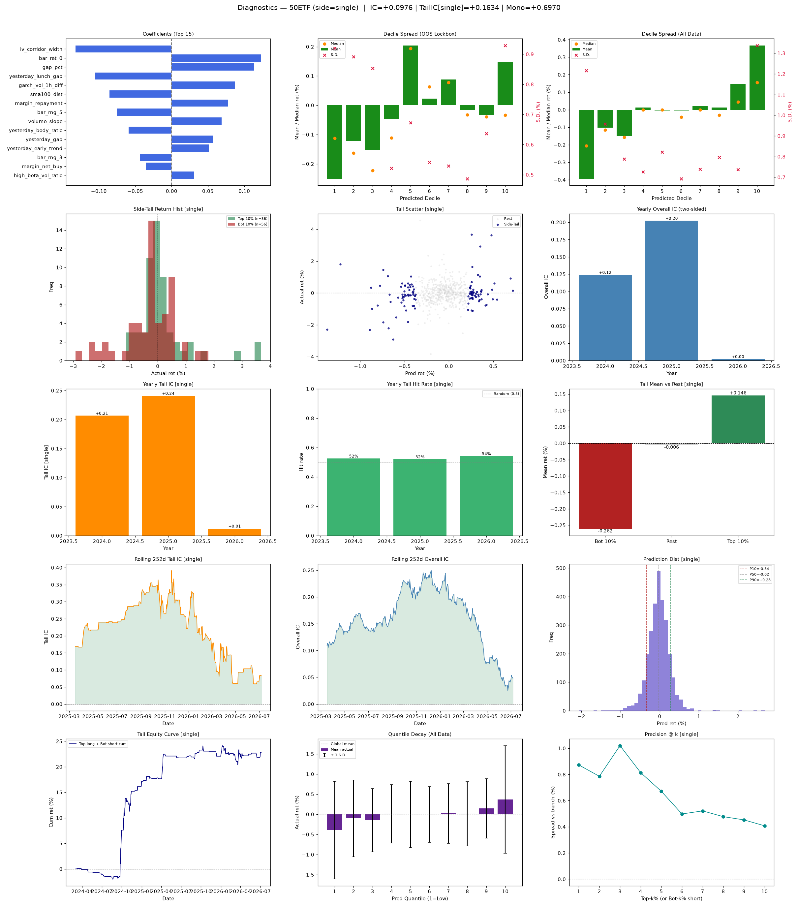

### 50ETF_gauss (50ETF, side=`single`)
- **Selected features**: 13
- **Active features**: 12
- **Active**: `first_bar_volume`, `bar_rng_5`, `sma100_dist`, `iv_corridor_width`, `yesterday_early_trend`, `yesterday_gap`, `northbound_net`, `first_bar_return`, `yesterday_body_ratio`, `gap_pct`, `yesterday_lunch_gap`, `vix_diff_1d`
- **Stopped by Step 1 (FDR Screening)** (0 features):
  None
- **Stopped by Step 2 (Stability & VIF Pruning)** (201 features):
  

  
Show 201 features

  
  `first_30min_return`, `early_realized_vol`, `early_range`, `early_trend`, `early_momentum`, `early_vwap_dev`, `early_skew`, `early_kurtosis`, `bar_ret_0`, `bar_ret_1`, `bar_ret_2`, `bar_vol_0`, `bar_vol_4`, `bar_vol_5`, `bar_rng_0`, `bar_rng_2`, `bar_rng_3`, `bar_body_rng_0`, `bar_body_rng_1`, `bar_body_rng_2`, `bar_vwap_dev_0`, `bar_vwap_dev_1`, `bar_vwap_dev_2`, `bar_vwap_dev_3`, `bar_vwap_dev_5`, `num_up_bars`, `max_up_ret`, `max_down_ret`, `cl_pos_in_range`, `body_to_range_ratio`, `total_path_length`, `volume_slope`, `spike_exhaustion_ratio`, `first_bar_sentiment`, `or_fill_ratio`, `close_vs_open_range`, `inside_bar_failure_bull`, `consecutive_higher_highs`, `early_bearish_engulfing_count`, `volume_surge_max`, `volume_concentration`, `volume_trend_intraday`, `volume_acceleration`, `volume_surge_direction`, `pullback_ratio`, `rally_ratio`, `range_expansion_ratio`, `pullback_depth_ratio`, `pullback_depth_max`, `rally_strength_max`, `vwap_slope_intraday`, `volume_weighted_price_position`, `net_volume_flow`, `early_body_momentum`, `late_bar_momentum`, `trend_strength_intraday`, `high_low_sequence_momentum`, `intraday_slope`, `intraday_autocorr`, `opening_momentum_score`, `opening_direction_stability`, `early_trend_hhi`, `session_high_proximity`, `session_low_proximity`, `close_above_open_count`, `open_to_current_return`, `upper_wick_dominance`, `rsi_opening`, `stoch_opening`, `momentum_strength_intraday`, `opening_auction_imbalance`, `intraday_close_position`, `limit_down_proximity_early`, `morning_trend_extrapolated`, `demark_setup_reversal_early`, `failed_breakout_reversal_early`, `early_wavetrend_cross`, `atr_expansion_flag_early`, `volatility_breakout_squeeze`, `early_bid_ask_spread_proxy`, `early_vwap_acceleration`, `early_order_flow_imbalance`, `rbreaker_sell_setup_proximity_early`, `rbreaker_buy_setup_proximity_early`, `skypark_gap_reversal_early`, `turtle_breakout_strength_early`, `macd_hist`, `sma20_dist`, `sma50_dist`, `atr14_norm`, `roc10`, `vol20`, `sma10_dist`, `sma200_dist`, `ema12_dist`, `rsi5`, `rsi21`, `roc5`, `roc20`, `roc60`, `cci14`, `willr14`, `stoch_k`, `stoch_d`, `mfi14`, `aroon_osc`, `vol5`, `vol10`, `vol60`, `vol_ratio_5_20`, `vol_ratio_10_60`, `bb_width`, `vol_pk20`, `vol_gk10`, `vol_gk20`, `volume_sma_ratio`, `margin_balance`, `buy_on_margin_value`, `margin_repayment`, `short_balance`, `short_balance_quantity`, `short_sell_quantity`, `short_repayment_quantity`, `total_balance`, `margin_net_buy`, `margin_short_ratio`, `capital_buy_volume`, `capital_buy_value`, `capital_sell_volume`, `capital_sell_value`, `capital_net_value`, `capital_net_ratio`, `northbound_buy`, `northbound_sell`, `iv`, `iv_vol_ratio`, `vix`, `vix_vol_ratio`, `vix_iv_spread`, `vix_iv_ratio`, `iv_diff_1d`, `tech_value_rotation`, `yesterday_limit_up_touch`, `limit_up_proximity_day`, `limit_down_proximity_day`, `growth_momentum_ratio`, `vix_skew_proxy`, `vix_rolling_percentile_60d`, `yesterday_vix_early_drift`, `vix_realized_spread`, `option_oi_growth`, `iv_envelope_deviation`, `margin_lever_ratio`, `capital_net_accel`, `northbound_volume_share`, `yesterday_northbound_net_ratio`, `margin_buy_repayment_spread`, `short_sell_cover_spread`, `margin_extreme_rank_252d`, `capital_large_order_ratio`, `consecutive_inside_bars_3d`, `outside_bar_reversal_day`, `wavetrend_osc_day`, `keltner_squeeze_width`, `yesterday_wavetrend_osc`, `yesterday_stoch_rsi_cross`, `cvd_divergence_day`, `yesterday_illiquidity_amihud`, `coppock_curve_day`, `yesterday_range_ratio`, `yesterday_volume_ratio`, `yesterday_return`, `yesterday_close_position`, `sma_distance_5d`, `sma_distance_60d`, `volatility_percentile_20d`, `volume_percentile_20d`, `yearly_high_distance`, `yearly_low_distance`, `twenty_gap_bars_regime`, `measured_move_proximity`, `yesterday_pm_return`, `yesterday_am_return`, `yesterday_gap_pct`, `yesterday_first_30min_return`, `yesterday_early_realized_vol`, `yesterday_early_range`, `yesterday_early_momentum`, `yesterday_first_bar_volume`, `yesterday_early_vwap_dev`, `yesterday_day_range`, `yesterday_day_realized_vol`, `yesterday_day_close_pos`, `yesterday_day_pm_am_vol_ratio`, `yesterday_day_vwap_dev`, `yesterday_day_skew`, `yesterday_day_kurtosis`, `yesterday_afternoon_reversal`, `yesterday_pm_am_vol_ratio`, `yesterday_afternoon_momentum`, `yesterday_cvd_close`
  

### 50ETF_rank (50ETF, side=`single`)
- **Selected features**: 14
- **Active features**: 14
- **Active**: `first_bar_volume`, `capital_buy_value`, `sma100_dist`, `iv_corridor_width`, `yesterday_gap`, `northbound_net`, `bar_ret_0`, `early_kurtosis`, `yesterday_stoch_rsi_cross`, `yesterday_body_ratio`, `high_beta_vol_ratio`, `gap_pct`, `yesterday_lunch_gap`, `outside_bar_reversal_day`
- **Stopped by Step 1 (FDR Screening)** (0 features):
  None
- **Stopped by Step 2 (Stability & VIF Pruning)** (200 features):
  

  
Show 200 features

  
  `first_30min_return`, `early_realized_vol`, `early_range`, `early_trend`, `early_momentum`, `first_bar_return`, `early_vwap_dev`, `early_skew`, `bar_ret_1`, `bar_ret_2`, `bar_vol_0`, `bar_vol_4`, `bar_vol_5`, `bar_rng_0`, `bar_rng_2`, `bar_rng_3`, `bar_rng_5`, `bar_body_rng_0`, `bar_body_rng_1`, `bar_body_rng_2`, `bar_vwap_dev_0`, `bar_vwap_dev_1`, `bar_vwap_dev_2`, `bar_vwap_dev_3`, `bar_vwap_dev_5`, `num_up_bars`, `max_up_ret`, `max_down_ret`, `cl_pos_in_range`, `body_to_range_ratio`, `total_path_length`, `volume_slope`, `spike_exhaustion_ratio`, `first_bar_sentiment`, `or_fill_ratio`, `close_vs_open_range`, `inside_bar_failure_bull`, `consecutive_higher_highs`, `early_bearish_engulfing_count`, `volume_surge_max`, `volume_concentration`, `volume_trend_intraday`, `volume_acceleration`, `volume_surge_direction`, `pullback_ratio`, `rally_ratio`, `range_expansion_ratio`, `pullback_depth_ratio`, `pullback_depth_max`, `rally_strength_max`, `vwap_slope_intraday`, `volume_weighted_price_position`, `net_volume_flow`, `early_body_momentum`, `late_bar_momentum`, `trend_strength_intraday`, `high_low_sequence_momentum`, `intraday_slope`, `intraday_autocorr`, `opening_momentum_score`, `opening_direction_stability`, `early_trend_hhi`, `session_high_proximity`, `session_low_proximity`, `close_above_open_count`, `open_to_current_return`, `upper_wick_dominance`, `rsi_opening`, `stoch_opening`, `momentum_strength_intraday`, `opening_auction_imbalance`, `intraday_close_position`, `limit_down_proximity_early`, `morning_trend_extrapolated`, `demark_setup_reversal_early`, `failed_breakout_reversal_early`, `early_wavetrend_cross`, `atr_expansion_flag_early`, `volatility_breakout_squeeze`, `early_bid_ask_spread_proxy`, `early_vwap_acceleration`, `early_order_flow_imbalance`, `rbreaker_sell_setup_proximity_early`, `rbreaker_buy_setup_proximity_early`, `skypark_gap_reversal_early`, `turtle_breakout_strength_early`, `macd_hist`, `sma20_dist`, `sma50_dist`, `atr14_norm`, `roc10`, `vol20`, `sma10_dist`, `sma200_dist`, `ema12_dist`, `rsi5`, `rsi21`, `roc5`, `roc20`, `roc60`, `cci14`, `willr14`, `stoch_k`, `stoch_d`, `mfi14`, `aroon_osc`, `vol5`, `vol10`, `vol60`, `vol_ratio_5_20`, `vol_ratio_10_60`, `bb_width`, `vol_pk20`, `vol_gk10`, `vol_gk20`, `volume_sma_ratio`, `margin_balance`, `buy_on_margin_value`, `margin_repayment`, `short_balance`, `short_balance_quantity`, `short_sell_quantity`, `short_repayment_quantity`, `total_balance`, `margin_net_buy`, `margin_short_ratio`, `capital_buy_volume`, `capital_sell_volume`, `capital_sell_value`, `capital_net_value`, `capital_net_ratio`, `northbound_buy`, `northbound_sell`, `iv`, `iv_vol_ratio`, `vix`, `vix_vol_ratio`, `vix_iv_spread`, `vix_iv_ratio`, `iv_diff_1d`, `vix_diff_1d`, `tech_value_rotation`, `yesterday_limit_up_touch`, `limit_up_proximity_day`, `limit_down_proximity_day`, `growth_momentum_ratio`, `vix_skew_proxy`, `vix_rolling_percentile_60d`, `yesterday_vix_early_drift`, `vix_realized_spread`, `option_oi_growth`, `iv_envelope_deviation`, `margin_lever_ratio`, `capital_net_accel`, `northbound_volume_share`, `yesterday_northbound_net_ratio`, `margin_buy_repayment_spread`, `short_sell_cover_spread`, `margin_extreme_rank_252d`, `capital_large_order_ratio`, `consecutive_inside_bars_3d`, `wavetrend_osc_day`, `keltner_squeeze_width`, `yesterday_wavetrend_osc`, `cvd_divergence_day`, `yesterday_illiquidity_amihud`, `coppock_curve_day`, `yesterday_range_ratio`, `yesterday_volume_ratio`, `yesterday_return`, `yesterday_close_position`, `sma_distance_5d`, `sma_distance_60d`, `volatility_percentile_20d`, `volume_percentile_20d`, `yearly_high_distance`, `yearly_low_distance`, `twenty_gap_bars_regime`, `measured_move_proximity`, `yesterday_pm_return`, `yesterday_am_return`, `yesterday_gap_pct`, `yesterday_first_30min_return`, `yesterday_early_realized_vol`, `yesterday_early_range`, `yesterday_early_trend`, `yesterday_early_momentum`, `yesterday_first_bar_volume`, `yesterday_early_vwap_dev`, `yesterday_day_range`, `yesterday_day_realized_vol`, `yesterday_day_close_pos`, `yesterday_day_pm_am_vol_ratio`, `yesterday_day_vwap_dev`, `yesterday_day_skew`, `yesterday_day_kurtosis`, `yesterday_afternoon_reversal`, `yesterday_pm_am_vol_ratio`, `yesterday_afternoon_momentum`, `yesterday_cvd_close`
  

### 50ETF_long (50ETF, side=`long`)
- **Selected features**: 13
- **Active features**: 10
- **Active**: `margin_repayment`, `bar_rng_5`, `sma100_dist`, `iv_corridor_width`, `yesterday_early_trend`, `first_bar_return`, `yesterday_body_ratio`, `gap_pct`, `yesterday_lunch_gap`, `vix_diff_1d`
- **Stopped by Step 1 (FDR Screening)** (0 features):
  None
- **Stopped by Step 2 (Stability & VIF Pruning)** (201 features):
  

  
Show 201 features

  
  `first_30min_return`, `early_realized_vol`, `early_range`, `early_trend`, `early_momentum`, `first_bar_volume`, `early_vwap_dev`, `early_skew`, `early_kurtosis`, `bar_ret_0`, `bar_ret_1`, `bar_ret_2`, `bar_vol_0`, `bar_vol_4`, `bar_vol_5`, `bar_rng_0`, `bar_rng_2`, `bar_rng_3`, `bar_body_rng_0`, `bar_body_rng_1`, `bar_body_rng_2`, `bar_vwap_dev_0`, `bar_vwap_dev_1`, `bar_vwap_dev_2`, `bar_vwap_dev_3`, `bar_vwap_dev_5`, `num_up_bars`, `max_up_ret`, `max_down_ret`, `cl_pos_in_range`, `body_to_range_ratio`, `total_path_length`, `spike_exhaustion_ratio`, `first_bar_sentiment`, `or_fill_ratio`, `close_vs_open_range`, `inside_bar_failure_bull`, `consecutive_higher_highs`, `early_bearish_engulfing_count`, `volume_surge_max`, `volume_concentration`, `volume_trend_intraday`, `volume_acceleration`, `volume_surge_direction`, `pullback_ratio`, `rally_ratio`, `range_expansion_ratio`, `pullback_depth_ratio`, `pullback_depth_max`, `rally_strength_max`, `vwap_slope_intraday`, `volume_weighted_price_position`, `net_volume_flow`, `early_body_momentum`, `late_bar_momentum`, `trend_strength_intraday`, `high_low_sequence_momentum`, `intraday_slope`, `intraday_autocorr`, `opening_momentum_score`, `opening_direction_stability`, `early_trend_hhi`, `session_high_proximity`, `session_low_proximity`, `close_above_open_count`, `open_to_current_return`, `upper_wick_dominance`, `rsi_opening`, `stoch_opening`, `momentum_strength_intraday`, `opening_auction_imbalance`, `intraday_close_position`, `limit_down_proximity_early`, `morning_trend_extrapolated`, `demark_setup_reversal_early`, `failed_breakout_reversal_early`, `early_wavetrend_cross`, `atr_expansion_flag_early`, `volatility_breakout_squeeze`, `early_bid_ask_spread_proxy`, `early_vwap_acceleration`, `early_order_flow_imbalance`, `rbreaker_sell_setup_proximity_early`, `rbreaker_buy_setup_proximity_early`, `skypark_gap_reversal_early`, `turtle_breakout_strength_early`, `macd_hist`, `sma20_dist`, `sma50_dist`, `atr14_norm`, `roc10`, `vol20`, `sma10_dist`, `sma200_dist`, `ema12_dist`, `rsi5`, `rsi21`, `roc5`, `roc20`, `roc60`, `cci14`, `willr14`, `stoch_k`, `stoch_d`, `mfi14`, `aroon_osc`, `vol5`, `vol10`, `vol60`, `vol_ratio_5_20`, `vol_ratio_10_60`, `bb_width`, `vol_pk20`, `vol_gk10`, `vol_gk20`, `volume_sma_ratio`, `margin_balance`, `buy_on_margin_value`, `short_balance`, `short_balance_quantity`, `short_sell_quantity`, `short_repayment_quantity`, `total_balance`, `margin_net_buy`, `margin_short_ratio`, `capital_buy_volume`, `capital_buy_value`, `capital_sell_volume`, `capital_sell_value`, `capital_net_value`, `capital_net_ratio`, `northbound_buy`, `northbound_sell`, `northbound_net`, `iv`, `iv_vol_ratio`, `vix`, `vix_vol_ratio`, `vix_iv_spread`, `vix_iv_ratio`, `iv_diff_1d`, `tech_value_rotation`, `yesterday_limit_up_touch`, `limit_up_proximity_day`, `limit_down_proximity_day`, `growth_momentum_ratio`, `high_beta_vol_ratio`, `vix_skew_proxy`, `vix_rolling_percentile_60d`, `yesterday_vix_early_drift`, `vix_realized_spread`, `option_oi_growth`, `iv_envelope_deviation`, `margin_lever_ratio`, `capital_net_accel`, `northbound_volume_share`, `yesterday_northbound_net_ratio`, `margin_buy_repayment_spread`, `short_sell_cover_spread`, `margin_extreme_rank_252d`, `capital_large_order_ratio`, `consecutive_inside_bars_3d`, `outside_bar_reversal_day`, `wavetrend_osc_day`, `keltner_squeeze_width`, `yesterday_wavetrend_osc`, `yesterday_stoch_rsi_cross`, `cvd_divergence_day`, `yesterday_illiquidity_amihud`, `coppock_curve_day`, `yesterday_range_ratio`, `yesterday_volume_ratio`, `yesterday_return`, `yesterday_close_position`, `sma_distance_5d`, `sma_distance_60d`, `volatility_percentile_20d`, `volume_percentile_20d`, `yearly_high_distance`, `yearly_low_distance`, `twenty_gap_bars_regime`, `measured_move_proximity`, `yesterday_pm_return`, `yesterday_am_return`, `yesterday_gap_pct`, `yesterday_first_30min_return`, `yesterday_early_realized_vol`, `yesterday_early_range`, `yesterday_early_momentum`, `yesterday_first_bar_volume`, `yesterday_early_vwap_dev`, `yesterday_day_range`, `yesterday_day_realized_vol`, `yesterday_day_close_pos`, `yesterday_day_pm_am_vol_ratio`, `yesterday_day_vwap_dev`, `yesterday_day_skew`, `yesterday_day_kurtosis`, `yesterday_afternoon_reversal`, `yesterday_pm_am_vol_ratio`, `yesterday_afternoon_momentum`
  

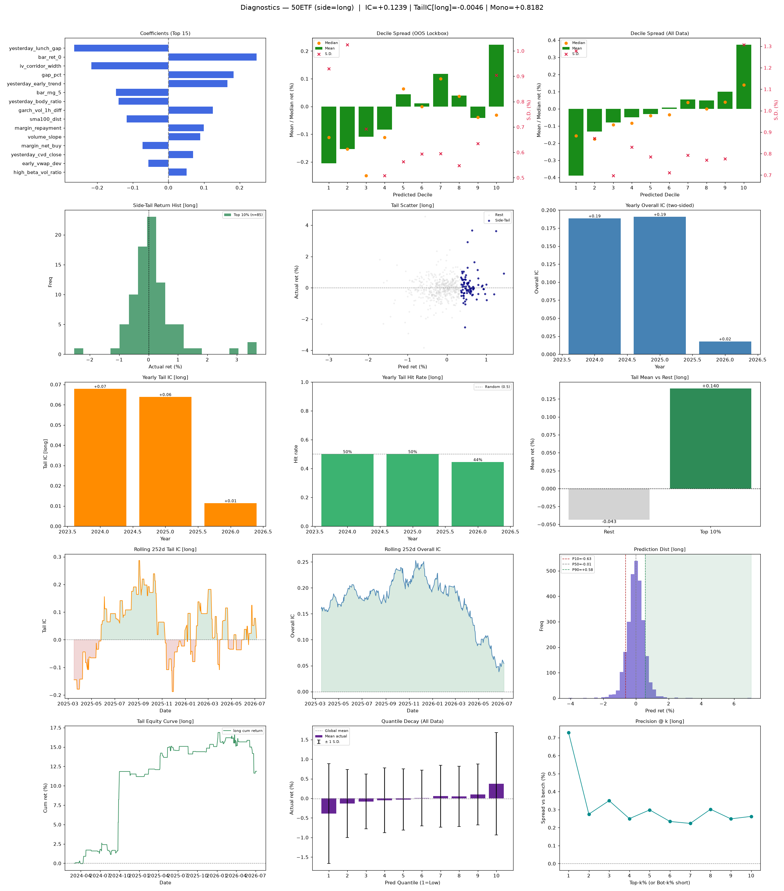

### 50ETF_long_gauss (50ETF, side=`long`)
- **Selected features**: 6
- **Active features**: 5
- **Active**: `iv_corridor_width`, `yesterday_early_trend`, `first_bar_return`, `gap_pct`, `yesterday_lunch_gap`
- **Stopped by Step 1 (FDR Screening)** (0 features):
  None
- **Stopped by Step 2 (Stability & VIF Pruning)** (208 features):
  

  
Show 208 features

  
  `first_30min_return`, `early_realized_vol`, `early_range`, `early_trend`, `early_momentum`, `first_bar_volume`, `early_vwap_dev`, `early_skew`, `early_kurtosis`, `bar_ret_0`, `bar_ret_1`, `bar_ret_2`, `bar_vol_0`, `bar_vol_4`, `bar_vol_5`, `bar_rng_0`, `bar_rng_2`, `bar_rng_3`, `bar_rng_5`, `bar_body_rng_0`, `bar_body_rng_1`, `bar_body_rng_2`, `bar_vwap_dev_0`, `bar_vwap_dev_1`, `bar_vwap_dev_2`, `bar_vwap_dev_3`, `bar_vwap_dev_5`, `num_up_bars`, `max_up_ret`, `max_down_ret`, `cl_pos_in_range`, `body_to_range_ratio`, `total_path_length`, `volume_slope`, `spike_exhaustion_ratio`, `first_bar_sentiment`, `or_fill_ratio`, `close_vs_open_range`, `inside_bar_failure_bull`, `consecutive_higher_highs`, `early_bearish_engulfing_count`, `volume_surge_max`, `volume_concentration`, `volume_trend_intraday`, `volume_acceleration`, `volume_surge_direction`, `pullback_ratio`, `rally_ratio`, `range_expansion_ratio`, `pullback_depth_ratio`, `pullback_depth_max`, `rally_strength_max`, `vwap_slope_intraday`, `volume_weighted_price_position`, `net_volume_flow`, `early_body_momentum`, `late_bar_momentum`, `trend_strength_intraday`, `high_low_sequence_momentum`, `intraday_slope`, `intraday_autocorr`, `opening_momentum_score`, `opening_direction_stability`, `early_trend_hhi`, `session_high_proximity`, `session_low_proximity`, `close_above_open_count`, `open_to_current_return`, `upper_wick_dominance`, `rsi_opening`, `stoch_opening`, `momentum_strength_intraday`, `opening_auction_imbalance`, `intraday_close_position`, `limit_down_proximity_early`, `morning_trend_extrapolated`, `demark_setup_reversal_early`, `failed_breakout_reversal_early`, `early_wavetrend_cross`, `atr_expansion_flag_early`, `volatility_breakout_squeeze`, `early_bid_ask_spread_proxy`, `early_vwap_acceleration`, `early_order_flow_imbalance`, `rbreaker_sell_setup_proximity_early`, `rbreaker_buy_setup_proximity_early`, `skypark_gap_reversal_early`, `turtle_breakout_strength_early`, `macd_hist`, `sma20_dist`, `sma50_dist`, `atr14_norm`, `roc10`, `vol20`, `sma10_dist`, `sma200_dist`, `ema12_dist`, `rsi5`, `rsi21`, `roc5`, `roc20`, `roc60`, `cci14`, `willr14`, `stoch_k`, `stoch_d`, `mfi14`, `aroon_osc`, `vol5`, `vol10`, `vol60`, `vol_ratio_5_20`, `vol_ratio_10_60`, `bb_width`, `vol_pk20`, `vol_gk10`, `vol_gk20`, `volume_sma_ratio`, `margin_balance`, `buy_on_margin_value`, `margin_repayment`, `short_balance`, `short_balance_quantity`, `short_sell_quantity`, `short_repayment_quantity`, `total_balance`, `margin_net_buy`, `margin_short_ratio`, `capital_buy_volume`, `capital_buy_value`, `capital_sell_volume`, `capital_sell_value`, `capital_net_value`, `capital_net_ratio`, `northbound_buy`, `northbound_sell`, `northbound_net`, `iv`, `iv_vol_ratio`, `vix`, `vix_vol_ratio`, `vix_iv_spread`, `vix_iv_ratio`, `iv_diff_1d`, `vix_diff_1d`, `tech_value_rotation`, `yesterday_limit_up_touch`, `limit_up_proximity_day`, `limit_down_proximity_day`, `growth_momentum_ratio`, `high_beta_vol_ratio`, `vix_skew_proxy`, `vix_rolling_percentile_60d`, `yesterday_vix_early_drift`, `vix_realized_spread`, `option_oi_growth`, `iv_envelope_deviation`, `margin_lever_ratio`, `capital_net_accel`, `northbound_volume_share`, `yesterday_northbound_net_ratio`, `margin_buy_repayment_spread`, `short_sell_cover_spread`, `margin_extreme_rank_252d`, `capital_large_order_ratio`, `consecutive_inside_bars_3d`, `outside_bar_reversal_day`, `wavetrend_osc_day`, `keltner_squeeze_width`, `yesterday_wavetrend_osc`, `yesterday_stoch_rsi_cross`, `cvd_divergence_day`, `yesterday_illiquidity_amihud`, `coppock_curve_day`, `yesterday_range_ratio`, `yesterday_body_ratio`, `yesterday_volume_ratio`, `yesterday_return`, `yesterday_gap`, `yesterday_close_position`, `sma_distance_5d`, `sma_distance_60d`, `volatility_percentile_20d`, `volume_percentile_20d`, `yearly_high_distance`, `yearly_low_distance`, `twenty_gap_bars_regime`, `measured_move_proximity`, `yesterday_pm_return`, `yesterday_am_return`, `yesterday_gap_pct`, `yesterday_first_30min_return`, `yesterday_early_realized_vol`, `yesterday_early_range`, `yesterday_early_momentum`, `yesterday_first_bar_volume`, `yesterday_early_vwap_dev`, `yesterday_day_range`, `yesterday_day_realized_vol`, `yesterday_day_close_pos`, `yesterday_day_pm_am_vol_ratio`, `yesterday_day_vwap_dev`, `yesterday_day_skew`, `yesterday_day_kurtosis`, `yesterday_afternoon_reversal`, `yesterday_pm_am_vol_ratio`, `yesterday_afternoon_momentum`, `yesterday_cvd_close`
  

### 50ETF_long_rank (50ETF, side=`long`)
- **Selected features**: 14
- **Active features**: 14
- **Active**: `first_bar_volume`, `capital_buy_value`, `sma100_dist`, `iv_corridor_width`, `yesterday_gap`, `northbound_net`, `bar_ret_0`, `early_kurtosis`, `yesterday_stoch_rsi_cross`, `yesterday_body_ratio`, `high_beta_vol_ratio`, `gap_pct`, `yesterday_lunch_gap`, `outside_bar_reversal_day`
- **Stopped by Step 1 (FDR Screening)** (0 features):
  None
- **Stopped by Step 2 (Stability & VIF Pruning)** (200 features):
  

  
Show 200 features

  
  `first_30min_return`, `early_realized_vol`, `early_range`, `early_trend`, `early_momentum`, `first_bar_return`, `early_vwap_dev`, `early_skew`, `bar_ret_1`, `bar_ret_2`, `bar_vol_0`, `bar_vol_4`, `bar_vol_5`, `bar_rng_0`, `bar_rng_2`, `bar_rng_3`, `bar_rng_5`, `bar_body_rng_0`, `bar_body_rng_1`, `bar_body_rng_2`, `bar_vwap_dev_0`, `bar_vwap_dev_1`, `bar_vwap_dev_2`, `bar_vwap_dev_3`, `bar_vwap_dev_5`, `num_up_bars`, `max_up_ret`, `max_down_ret`, `cl_pos_in_range`, `body_to_range_ratio`, `total_path_length`, `volume_slope`, `spike_exhaustion_ratio`, `first_bar_sentiment`, `or_fill_ratio`, `close_vs_open_range`, `inside_bar_failure_bull`, `consecutive_higher_highs`, `early_bearish_engulfing_count`, `volume_surge_max`, `volume_concentration`, `volume_trend_intraday`, `volume_acceleration`, `volume_surge_direction`, `pullback_ratio`, `rally_ratio`, `range_expansion_ratio`, `pullback_depth_ratio`, `pullback_depth_max`, `rally_strength_max`, `vwap_slope_intraday`, `volume_weighted_price_position`, `net_volume_flow`, `early_body_momentum`, `late_bar_momentum`, `trend_strength_intraday`, `high_low_sequence_momentum`, `intraday_slope`, `intraday_autocorr`, `opening_momentum_score`, `opening_direction_stability`, `early_trend_hhi`, `session_high_proximity`, `session_low_proximity`, `close_above_open_count`, `open_to_current_return`, `upper_wick_dominance`, `rsi_opening`, `stoch_opening`, `momentum_strength_intraday`, `opening_auction_imbalance`, `intraday_close_position`, `limit_down_proximity_early`, `morning_trend_extrapolated`, `demark_setup_reversal_early`, `failed_breakout_reversal_early`, `early_wavetrend_cross`, `atr_expansion_flag_early`, `volatility_breakout_squeeze`, `early_bid_ask_spread_proxy`, `early_vwap_acceleration`, `early_order_flow_imbalance`, `rbreaker_sell_setup_proximity_early`, `rbreaker_buy_setup_proximity_early`, `skypark_gap_reversal_early`, `turtle_breakout_strength_early`, `macd_hist`, `sma20_dist`, `sma50_dist`, `atr14_norm`, `roc10`, `vol20`, `sma10_dist`, `sma200_dist`, `ema12_dist`, `rsi5`, `rsi21`, `roc5`, `roc20`, `roc60`, `cci14`, `willr14`, `stoch_k`, `stoch_d`, `mfi14`, `aroon_osc`, `vol5`, `vol10`, `vol60`, `vol_ratio_5_20`, `vol_ratio_10_60`, `bb_width`, `vol_pk20`, `vol_gk10`, `vol_gk20`, `volume_sma_ratio`, `margin_balance`, `buy_on_margin_value`, `margin_repayment`, `short_balance`, `short_balance_quantity`, `short_sell_quantity`, `short_repayment_quantity`, `total_balance`, `margin_net_buy`, `margin_short_ratio`, `capital_buy_volume`, `capital_sell_volume`, `capital_sell_value`, `capital_net_value`, `capital_net_ratio`, `northbound_buy`, `northbound_sell`, `iv`, `iv_vol_ratio`, `vix`, `vix_vol_ratio`, `vix_iv_spread`, `vix_iv_ratio`, `iv_diff_1d`, `vix_diff_1d`, `tech_value_rotation`, `yesterday_limit_up_touch`, `limit_up_proximity_day`, `limit_down_proximity_day`, `growth_momentum_ratio`, `vix_skew_proxy`, `vix_rolling_percentile_60d`, `yesterday_vix_early_drift`, `vix_realized_spread`, `option_oi_growth`, `iv_envelope_deviation`, `margin_lever_ratio`, `capital_net_accel`, `northbound_volume_share`, `yesterday_northbound_net_ratio`, `margin_buy_repayment_spread`, `short_sell_cover_spread`, `margin_extreme_rank_252d`, `capital_large_order_ratio`, `consecutive_inside_bars_3d`, `wavetrend_osc_day`, `keltner_squeeze_width`, `yesterday_wavetrend_osc`, `cvd_divergence_day`, `yesterday_illiquidity_amihud`, `coppock_curve_day`, `yesterday_range_ratio`, `yesterday_volume_ratio`, `yesterday_return`, `yesterday_close_position`, `sma_distance_5d`, `sma_distance_60d`, `volatility_percentile_20d`, `volume_percentile_20d`, `yearly_high_distance`, `yearly_low_distance`, `twenty_gap_bars_regime`, `measured_move_proximity`, `yesterday_pm_return`, `yesterday_am_return`, `yesterday_gap_pct`, `yesterday_first_30min_return`, `yesterday_early_realized_vol`, `yesterday_early_range`, `yesterday_early_trend`, `yesterday_early_momentum`, `yesterday_first_bar_volume`, `yesterday_early_vwap_dev`, `yesterday_day_range`, `yesterday_day_realized_vol`, `yesterday_day_close_pos`, `yesterday_day_pm_am_vol_ratio`, `yesterday_day_vwap_dev`, `yesterday_day_skew`, `yesterday_day_kurtosis`, `yesterday_afternoon_reversal`, `yesterday_pm_am_vol_ratio`, `yesterday_afternoon_momentum`, `yesterday_cvd_close`
  

### 50ETF_short (50ETF, side=`short`)
- **Selected features**: 15
- **Active features**: 14
- **Active**: `early_vwap_dev`, `volume_slope`, `margin_repayment`, `bar_rng_5`, `margin_net_buy`, `sma100_dist`, `iv_corridor_width`, `yesterday_early_trend`, `yesterday_gap`, `first_bar_return`, `yesterday_body_ratio`, `gap_pct`, `yesterday_lunch_gap`, `vix_diff_1d`
- **Stopped by Step 1 (FDR Screening)** (0 features):
  None
- **Stopped by Step 2 (Stability & VIF Pruning)** (199 features):
  

  
Show 199 features

  
  `first_30min_return`, `early_realized_vol`, `early_range`, `early_trend`, `early_momentum`, `first_bar_volume`, `early_skew`, `early_kurtosis`, `bar_ret_0`, `bar_ret_1`, `bar_ret_2`, `bar_vol_0`, `bar_vol_4`, `bar_vol_5`, `bar_rng_0`, `bar_rng_2`, `bar_rng_3`, `bar_body_rng_0`, `bar_body_rng_1`, `bar_body_rng_2`, `bar_vwap_dev_0`, `bar_vwap_dev_1`, `bar_vwap_dev_2`, `bar_vwap_dev_3`, `bar_vwap_dev_5`, `num_up_bars`, `max_up_ret`, `max_down_ret`, `cl_pos_in_range`, `body_to_range_ratio`, `total_path_length`, `spike_exhaustion_ratio`, `first_bar_sentiment`, `or_fill_ratio`, `close_vs_open_range`, `inside_bar_failure_bull`, `consecutive_higher_highs`, `early_bearish_engulfing_count`, `volume_surge_max`, `volume_concentration`, `volume_trend_intraday`, `volume_acceleration`, `volume_surge_direction`, `pullback_ratio`, `rally_ratio`, `range_expansion_ratio`, `pullback_depth_ratio`, `pullback_depth_max`, `rally_strength_max`, `vwap_slope_intraday`, `volume_weighted_price_position`, `net_volume_flow`, `early_body_momentum`, `late_bar_momentum`, `trend_strength_intraday`, `high_low_sequence_momentum`, `intraday_slope`, `intraday_autocorr`, `opening_momentum_score`, `opening_direction_stability`, `early_trend_hhi`, `session_high_proximity`, `session_low_proximity`, `close_above_open_count`, `open_to_current_return`, `upper_wick_dominance`, `rsi_opening`, `stoch_opening`, `momentum_strength_intraday`, `opening_auction_imbalance`, `intraday_close_position`, `limit_down_proximity_early`, `morning_trend_extrapolated`, `demark_setup_reversal_early`, `failed_breakout_reversal_early`, `early_wavetrend_cross`, `atr_expansion_flag_early`, `volatility_breakout_squeeze`, `early_bid_ask_spread_proxy`, `early_vwap_acceleration`, `early_order_flow_imbalance`, `rbreaker_sell_setup_proximity_early`, `rbreaker_buy_setup_proximity_early`, `skypark_gap_reversal_early`, `turtle_breakout_strength_early`, `macd_hist`, `sma20_dist`, `sma50_dist`, `atr14_norm`, `roc10`, `vol20`, `sma10_dist`, `sma200_dist`, `ema12_dist`, `rsi5`, `rsi21`, `roc5`, `roc20`, `roc60`, `cci14`, `willr14`, `stoch_k`, `stoch_d`, `mfi14`, `aroon_osc`, `vol5`, `vol10`, `vol60`, `vol_ratio_5_20`, `vol_ratio_10_60`, `bb_width`, `vol_pk20`, `vol_gk10`, `vol_gk20`, `volume_sma_ratio`, `margin_balance`, `buy_on_margin_value`, `short_balance`, `short_balance_quantity`, `short_sell_quantity`, `short_repayment_quantity`, `total_balance`, `margin_short_ratio`, `capital_buy_volume`, `capital_buy_value`, `capital_sell_volume`, `capital_sell_value`, `capital_net_value`, `capital_net_ratio`, `northbound_buy`, `northbound_sell`, `northbound_net`, `iv`, `iv_vol_ratio`, `vix`, `vix_vol_ratio`, `vix_iv_spread`, `vix_iv_ratio`, `iv_diff_1d`, `tech_value_rotation`, `yesterday_limit_up_touch`, `limit_up_proximity_day`, `limit_down_proximity_day`, `growth_momentum_ratio`, `high_beta_vol_ratio`, `vix_skew_proxy`, `vix_rolling_percentile_60d`, `yesterday_vix_early_drift`, `vix_realized_spread`, `option_oi_growth`, `iv_envelope_deviation`, `margin_lever_ratio`, `capital_net_accel`, `northbound_volume_share`, `yesterday_northbound_net_ratio`, `margin_buy_repayment_spread`, `short_sell_cover_spread`, `margin_extreme_rank_252d`, `capital_large_order_ratio`, `consecutive_inside_bars_3d`, `outside_bar_reversal_day`, `wavetrend_osc_day`, `keltner_squeeze_width`, `yesterday_wavetrend_osc`, `yesterday_stoch_rsi_cross`, `cvd_divergence_day`, `yesterday_illiquidity_amihud`, `coppock_curve_day`, `yesterday_range_ratio`, `yesterday_volume_ratio`, `yesterday_return`, `yesterday_close_position`, `sma_distance_5d`, `sma_distance_60d`, `volatility_percentile_20d`, `volume_percentile_20d`, `yearly_high_distance`, `yearly_low_distance`, `twenty_gap_bars_regime`, `measured_move_proximity`, `yesterday_pm_return`, `yesterday_am_return`, `yesterday_gap_pct`, `yesterday_first_30min_return`, `yesterday_early_realized_vol`, `yesterday_early_range`, `yesterday_early_momentum`, `yesterday_first_bar_volume`, `yesterday_early_vwap_dev`, `yesterday_day_range`, `yesterday_day_realized_vol`, `yesterday_day_close_pos`, `yesterday_day_pm_am_vol_ratio`, `yesterday_day_vwap_dev`, `yesterday_day_skew`, `yesterday_day_kurtosis`, `yesterday_afternoon_reversal`, `yesterday_pm_am_vol_ratio`, `yesterday_afternoon_momentum`
  

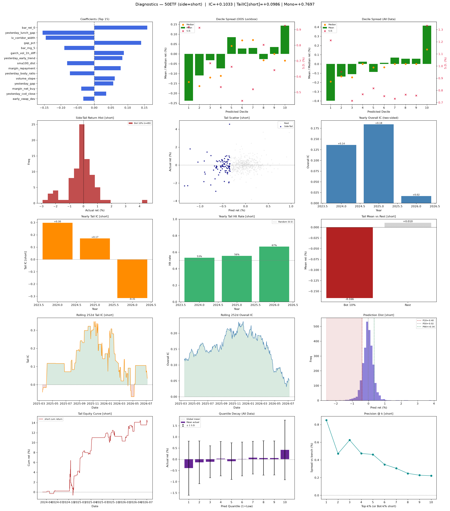

### 50ETF_short_gauss (50ETF, side=`short`)
- **Selected features**: 9
- **Active features**: 9
- **Active**: `bar_rng_5`, `sma100_dist`, `iv_corridor_width`, `yesterday_early_trend`, `yesterday_gap`, `first_bar_return`, `yesterday_body_ratio`, `gap_pct`, `yesterday_lunch_gap`
- **Stopped by Step 1 (FDR Screening)** (0 features):
  None
- **Stopped by Step 2 (Stability & VIF Pruning)** (205 features):
  

  
Show 205 features

  
  `first_30min_return`, `early_realized_vol`, `early_range`, `early_trend`, `early_momentum`, `first_bar_volume`, `early_vwap_dev`, `early_skew`, `early_kurtosis`, `bar_ret_0`, `bar_ret_1`, `bar_ret_2`, `bar_vol_0`, `bar_vol_4`, `bar_vol_5`, `bar_rng_0`, `bar_rng_2`, `bar_rng_3`, `bar_body_rng_0`, `bar_body_rng_1`, `bar_body_rng_2`, `bar_vwap_dev_0`, `bar_vwap_dev_1`, `bar_vwap_dev_2`, `bar_vwap_dev_3`, `bar_vwap_dev_5`, `num_up_bars`, `max_up_ret`, `max_down_ret`, `cl_pos_in_range`, `body_to_range_ratio`, `total_path_length`, `volume_slope`, `spike_exhaustion_ratio`, `first_bar_sentiment`, `or_fill_ratio`, `close_vs_open_range`, `inside_bar_failure_bull`, `consecutive_higher_highs`, `early_bearish_engulfing_count`, `volume_surge_max`, `volume_concentration`, `volume_trend_intraday`, `volume_acceleration`, `volume_surge_direction`, `pullback_ratio`, `rally_ratio`, `range_expansion_ratio`, `pullback_depth_ratio`, `pullback_depth_max`, `rally_strength_max`, `vwap_slope_intraday`, `volume_weighted_price_position`, `net_volume_flow`, `early_body_momentum`, `late_bar_momentum`, `trend_strength_intraday`, `high_low_sequence_momentum`, `intraday_slope`, `intraday_autocorr`, `opening_momentum_score`, `opening_direction_stability`, `early_trend_hhi`, `session_high_proximity`, `session_low_proximity`, `close_above_open_count`, `open_to_current_return`, `upper_wick_dominance`, `rsi_opening`, `stoch_opening`, `momentum_strength_intraday`, `opening_auction_imbalance`, `intraday_close_position`, `limit_down_proximity_early`, `morning_trend_extrapolated`, `demark_setup_reversal_early`, `failed_breakout_reversal_early`, `early_wavetrend_cross`, `atr_expansion_flag_early`, `volatility_breakout_squeeze`, `early_bid_ask_spread_proxy`, `early_vwap_acceleration`, `early_order_flow_imbalance`, `rbreaker_sell_setup_proximity_early`, `rbreaker_buy_setup_proximity_early`, `skypark_gap_reversal_early`, `turtle_breakout_strength_early`, `macd_hist`, `sma20_dist`, `sma50_dist`, `atr14_norm`, `roc10`, `vol20`, `sma10_dist`, `sma200_dist`, `ema12_dist`, `rsi5`, `rsi21`, `roc5`, `roc20`, `roc60`, `cci14`, `willr14`, `stoch_k`, `stoch_d`, `mfi14`, `aroon_osc`, `vol5`, `vol10`, `vol60`, `vol_ratio_5_20`, `vol_ratio_10_60`, `bb_width`, `vol_pk20`, `vol_gk10`, `vol_gk20`, `volume_sma_ratio`, `margin_balance`, `buy_on_margin_value`, `margin_repayment`, `short_balance`, `short_balance_quantity`, `short_sell_quantity`, `short_repayment_quantity`, `total_balance`, `margin_net_buy`, `margin_short_ratio`, `capital_buy_volume`, `capital_buy_value`, `capital_sell_volume`, `capital_sell_value`, `capital_net_value`, `capital_net_ratio`, `northbound_buy`, `northbound_sell`, `northbound_net`, `iv`, `iv_vol_ratio`, `vix`, `vix_vol_ratio`, `vix_iv_spread`, `vix_iv_ratio`, `iv_diff_1d`, `vix_diff_1d`, `tech_value_rotation`, `yesterday_limit_up_touch`, `limit_up_proximity_day`, `limit_down_proximity_day`, `growth_momentum_ratio`, `high_beta_vol_ratio`, `vix_skew_proxy`, `vix_rolling_percentile_60d`, `yesterday_vix_early_drift`, `vix_realized_spread`, `option_oi_growth`, `iv_envelope_deviation`, `margin_lever_ratio`, `capital_net_accel`, `northbound_volume_share`, `yesterday_northbound_net_ratio`, `margin_buy_repayment_spread`, `short_sell_cover_spread`, `margin_extreme_rank_252d`, `capital_large_order_ratio`, `consecutive_inside_bars_3d`, `outside_bar_reversal_day`, `wavetrend_osc_day`, `keltner_squeeze_width`, `yesterday_wavetrend_osc`, `yesterday_stoch_rsi_cross`, `cvd_divergence_day`, `yesterday_illiquidity_amihud`, `coppock_curve_day`, `yesterday_range_ratio`, `yesterday_volume_ratio`, `yesterday_return`, `yesterday_close_position`, `sma_distance_5d`, `sma_distance_60d`, `volatility_percentile_20d`, `volume_percentile_20d`, `yearly_high_distance`, `yearly_low_distance`, `twenty_gap_bars_regime`, `measured_move_proximity`, `yesterday_pm_return`, `yesterday_am_return`, `yesterday_gap_pct`, `yesterday_first_30min_return`, `yesterday_early_realized_vol`, `yesterday_early_range`, `yesterday_early_momentum`, `yesterday_first_bar_volume`, `yesterday_early_vwap_dev`, `yesterday_day_range`, `yesterday_day_realized_vol`, `yesterday_day_close_pos`, `yesterday_day_pm_am_vol_ratio`, `yesterday_day_vwap_dev`, `yesterday_day_skew`, `yesterday_day_kurtosis`, `yesterday_afternoon_reversal`, `yesterday_pm_am_vol_ratio`, `yesterday_afternoon_momentum`, `yesterday_cvd_close`
  

### 50ETF_short_rank (50ETF, side=`short`)
- **Selected features**: 11
- **Active features**: 8
- **Active**: `sma100_dist`, `iv_corridor_width`, `yesterday_gap`, `northbound_net`, `bar_ret_0`, `yesterday_body_ratio`, `gap_pct`, `yesterday_lunch_gap`
- **Stopped by Step 1 (FDR Screening)** (0 features):
  None
- **Stopped by Step 2 (Stability & VIF Pruning)** (203 features):
  

  
Show 203 features

  
  `first_30min_return`, `early_realized_vol`, `early_range`, `early_trend`, `early_momentum`, `first_bar_return`, `early_vwap_dev`, `early_skew`, `early_kurtosis`, `bar_ret_1`, `bar_ret_2`, `bar_vol_0`, `bar_vol_4`, `bar_vol_5`, `bar_rng_0`, `bar_rng_2`, `bar_rng_3`, `bar_rng_5`, `bar_body_rng_0`, `bar_body_rng_1`, `bar_body_rng_2`, `bar_vwap_dev_0`, `bar_vwap_dev_1`, `bar_vwap_dev_2`, `bar_vwap_dev_3`, `bar_vwap_dev_5`, `num_up_bars`, `max_up_ret`, `max_down_ret`, `cl_pos_in_range`, `body_to_range_ratio`, `total_path_length`, `volume_slope`, `spike_exhaustion_ratio`, `first_bar_sentiment`, `or_fill_ratio`, `close_vs_open_range`, `inside_bar_failure_bull`, `consecutive_higher_highs`, `early_bearish_engulfing_count`, `volume_surge_max`, `volume_concentration`, `volume_trend_intraday`, `volume_acceleration`, `volume_surge_direction`, `pullback_ratio`, `rally_ratio`, `range_expansion_ratio`, `pullback_depth_ratio`, `pullback_depth_max`, `rally_strength_max`, `vwap_slope_intraday`, `volume_weighted_price_position`, `net_volume_flow`, `early_body_momentum`, `late_bar_momentum`, `trend_strength_intraday`, `high_low_sequence_momentum`, `intraday_slope`, `intraday_autocorr`, `opening_momentum_score`, `opening_direction_stability`, `early_trend_hhi`, `session_high_proximity`, `session_low_proximity`, `close_above_open_count`, `open_to_current_return`, `upper_wick_dominance`, `rsi_opening`, `stoch_opening`, `momentum_strength_intraday`, `opening_auction_imbalance`, `intraday_close_position`, `limit_down_proximity_early`, `morning_trend_extrapolated`, `demark_setup_reversal_early`, `failed_breakout_reversal_early`, `early_wavetrend_cross`, `atr_expansion_flag_early`, `volatility_breakout_squeeze`, `early_bid_ask_spread_proxy`, `early_vwap_acceleration`, `early_order_flow_imbalance`, `rbreaker_sell_setup_proximity_early`, `rbreaker_buy_setup_proximity_early`, `skypark_gap_reversal_early`, `turtle_breakout_strength_early`, `macd_hist`, `sma20_dist`, `sma50_dist`, `atr14_norm`, `roc10`, `vol20`, `sma10_dist`, `sma200_dist`, `ema12_dist`, `rsi5`, `rsi21`, `roc5`, `roc20`, `roc60`, `cci14`, `willr14`, `stoch_k`, `stoch_d`, `mfi14`, `aroon_osc`, `vol5`, `vol10`, `vol60`, `vol_ratio_5_20`, `vol_ratio_10_60`, `bb_width`, `vol_pk20`, `vol_gk10`, `vol_gk20`, `volume_sma_ratio`, `margin_balance`, `buy_on_margin_value`, `margin_repayment`, `short_balance`, `short_balance_quantity`, `short_sell_quantity`, `short_repayment_quantity`, `total_balance`, `margin_net_buy`, `margin_short_ratio`, `capital_buy_volume`, `capital_sell_volume`, `capital_sell_value`, `capital_net_value`, `capital_net_ratio`, `northbound_buy`, `northbound_sell`, `iv`, `iv_vol_ratio`, `vix`, `vix_vol_ratio`, `vix_iv_spread`, `vix_iv_ratio`, `iv_diff_1d`, `vix_diff_1d`, `tech_value_rotation`, `yesterday_limit_up_touch`, `limit_up_proximity_day`, `limit_down_proximity_day`, `growth_momentum_ratio`, `vix_skew_proxy`, `vix_rolling_percentile_60d`, `yesterday_vix_early_drift`, `vix_realized_spread`, `option_oi_growth`, `iv_envelope_deviation`, `margin_lever_ratio`, `capital_net_accel`, `northbound_volume_share`, `yesterday_northbound_net_ratio`, `margin_buy_repayment_spread`, `short_sell_cover_spread`, `margin_extreme_rank_252d`, `capital_large_order_ratio`, `consecutive_inside_bars_3d`, `outside_bar_reversal_day`, `wavetrend_osc_day`, `keltner_squeeze_width`, `yesterday_wavetrend_osc`, `yesterday_stoch_rsi_cross`, `cvd_divergence_day`, `yesterday_illiquidity_amihud`, `coppock_curve_day`, `yesterday_range_ratio`, `yesterday_volume_ratio`, `yesterday_return`, `yesterday_close_position`, `sma_distance_5d`, `sma_distance_60d`, `volatility_percentile_20d`, `volume_percentile_20d`, `yearly_high_distance`, `yearly_low_distance`, `twenty_gap_bars_regime`, `measured_move_proximity`, `yesterday_pm_return`, `yesterday_am_return`, `yesterday_gap_pct`, `yesterday_first_30min_return`, `yesterday_early_realized_vol`, `yesterday_early_range`, `yesterday_early_trend`, `yesterday_early_momentum`, `yesterday_first_bar_volume`, `yesterday_early_vwap_dev`, `yesterday_day_range`, `yesterday_day_realized_vol`, `yesterday_day_close_pos`, `yesterday_day_pm_am_vol_ratio`, `yesterday_day_vwap_dev`, `yesterday_day_skew`, `yesterday_day_kurtosis`, `yesterday_afternoon_reversal`, `yesterday_pm_am_vol_ratio`, `yesterday_afternoon_momentum`, `yesterday_cvd_close`
  

## Methodology Overview
1. **Lockbox Split**: From 2024-03-01 to last day (OOS holdout).
2. **Selection Validation Split**: Six non-contiguous 3-month blocks carved out from the working set, partitioned into 4 inner (tuning) + 2 outer (held-out) blocks, with a 10-day embargo.
3. **BH-FDR Screening**: Robust marginal Spearman correlation at FDR = 0.15 on selection train.
4. **Hierarchical Clustering**: Groups collinear features (|r| >= 0.75).
5. **Cluster Stability Selection + VIF Pruning**: B=100 subsamples, pi=0.60 cluster threshold, then VIF <= 10 pruning.
6. **Weighted Fitting**: Sample weights w(y) = |y|^k.
7. **Side-Aware Optuna Objective**:
   - `single` (legacy): Tail IC two-sided (top10% U bot10%). Weights V1..V4 = [0.40, 0.40, 0.15, 0.05].
   - `long`: Tail IC top-only (`pred >= P85(pred)`). Weights [0.35, 0.50, 0.15, 0.00] (V4 dropped).
   - `short`: Tail IC bot-only (`pred <= P15(pred)`). Weights [0.35, 0.50, 0.15, 0.00] (V4 dropped).
   - CV fold kill-switches (M1..M6: hit rate, monotonicity, spread, ESS, Gini) stay **two-sided** for all sides.
8. **Deflated Objective + Plateau Selection**: Running Lopez de Prado deflation; final trial chosen via plateau search (r=0.25).
9. **15-Panel Diagnostics Figure per Tag**: One combined PNG (`diagnostics_{etf}_{side}.png`) with 15 subplots, saved to `day-model/plots/` and embedded above.
