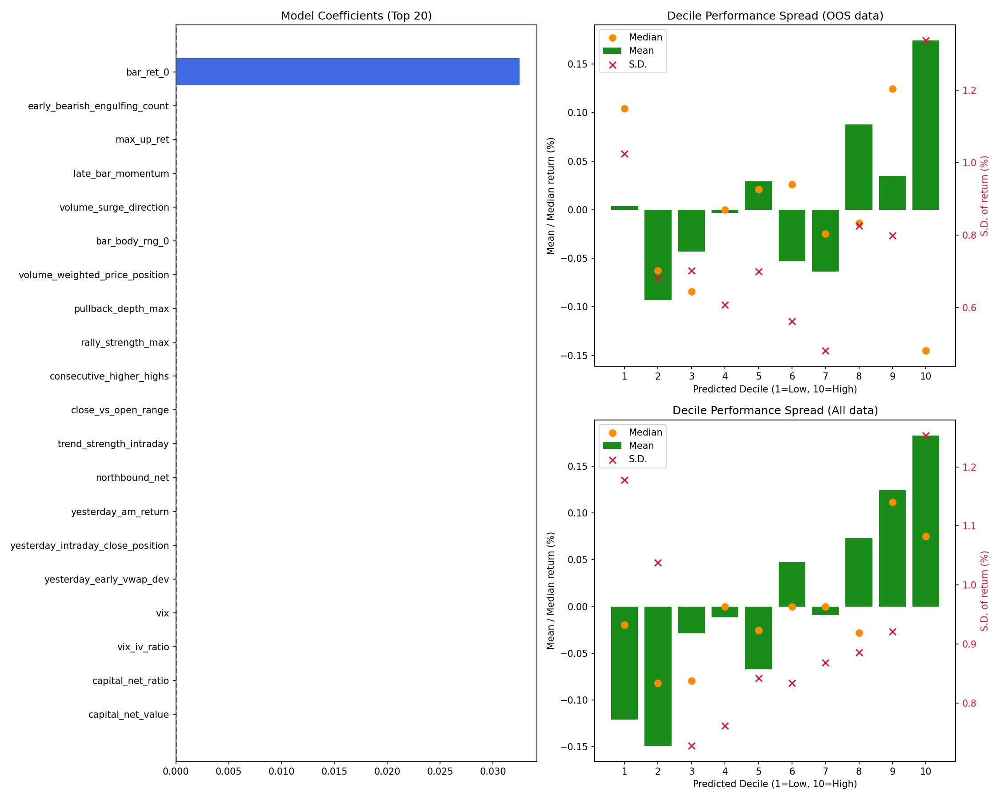
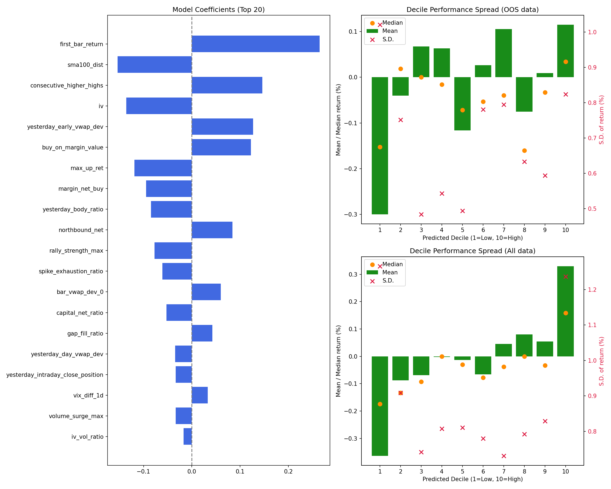
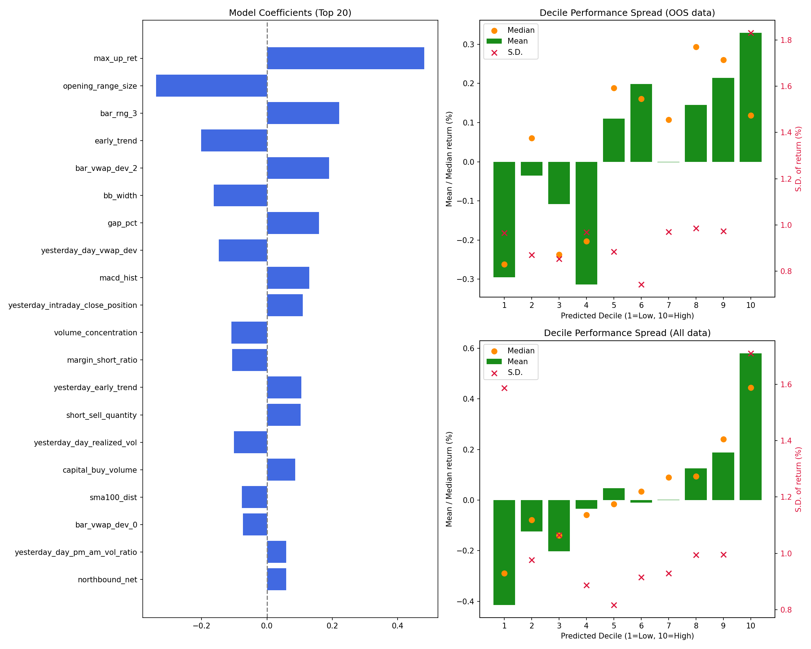
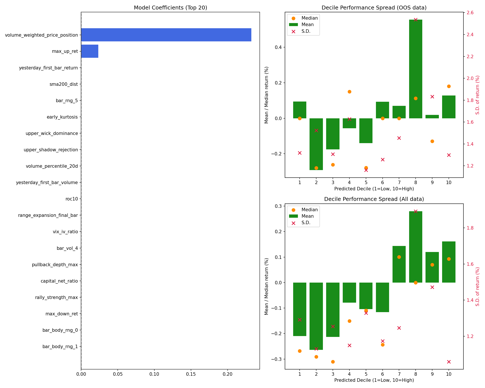
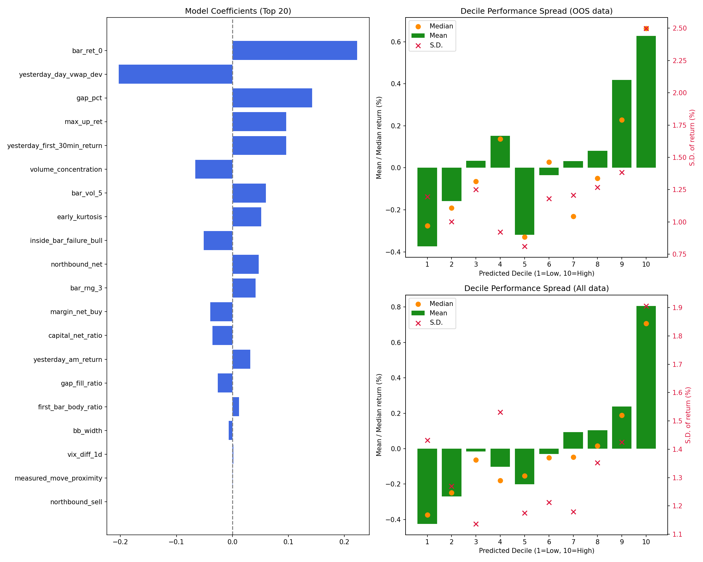

# Day-Model Remake Optimization Report
> Generated by day-model/generate_report.py
This report summarizes the performance and features of the remade `day-model` return predictors, optimized using first-principles multi-metric objective functions and stability selection.

## Out-of-Sample Lockbox Performance (2024-03 to Last Day)

| ETF | Selected Features | Active Features | Best Model Type | Lockbox Overall IC | Lockbox Tail IC |
| :--- | :---: | :---: | :---: | :---: | :---: |
| 300ETF | 32 | 1 | `skglm_huber_l1` | -0.0021 | +0.0486 |
| 50ETF | 33 | 23 | `skglm_mcp` | +0.0310 | +0.1835 |
| 500ETF | 25 | 25 | `skglm_huber_l1` | +0.1372 | +0.0711 |
| 588000ETF | 28 | 2 | `skglm_huber_l1` | +0.0601 | +0.0621 |
| 159915ETF | 33 | 19 | `skglm_huber_l1` | +0.1368 | +0.3035 |

## Detailed Trial Metrics & Optimization Objectives

| ETF | Yearly Tail IC IR | Yearly Tail IC Mean | Hit Rate | Decile Monotonicity | Top-Bottom Spread |
| :--- | :---: | :---: | :---: | :---: | :---: |
| 300ETF | 0.8868 | +0.1572 | 77.8% | 0.4411 | +39.0811% |
| 50ETF | 1.6751 | +0.2296 | 77.8% | 0.3980 | +43.7944% |
| 500ETF | 1.4197 | +0.2661 | 88.9% | 0.5300 | +91.4254% |
| 588000ETF | 1.7121 | +0.2988 | 100.0% | 0.4545 | +100.9277% |
| 159915ETF | 1.1332 | +0.2233 | 88.9% | 0.5192 | +72.1038% |

## Model Quality & Generalization Diagnostics

### Model Multi-Collinearity & Weight Concentration

| ETF | Raw X Cond | Reg normal eq kappa | Collinear Pairs ($\ge 0.85$) | Gini (Weight Concentration) | Tail Weight ESS | Tail Weight ESS % |
| :--- | :---: | :---: | :---: | :---: | :---: | :---: |
| 300ETF | 9.38 | 75.23 [MODERATE] | 0 | 0.9688 [HIGH] | 2134.3 | 98.5% |
| 50ETF | 5900066.50 | 3011.27 [SEVERE] | 0 | 0.5978 | 1737.6 | 80.2% |
| 500ETF | 4799469.00 | 1539992.62 [SEVERE] | 0 | 0.3824 | 1083.5 | 50.0% |
| 588000ETF | 9.61 | 68.86 [MODERATE] | 0 | 0.9578 [HIGH] | 320.9 | 43.5% |
| 159915ETF | 6.63 | 42.37 [MODERATE] | 0 | 0.7027 | 1488.3 | 68.7% |

### Generalization Gap (CV vs Selection Validation vs Out-of-Sample)

| ETF | CV Overall IC | Deflated CV IC | Selection Val IC | OOS Lockbox IC | IC Gen Gap (SelVal-OOS) | CV Monotonicity | OOS Monotonicity | Mono Gen Gap |
| :--- | :---: | :---: | :---: | :---: | :---: | :---: | :---: | :---: |
| 300ETF | +0.0796 | +0.0574 | +0.1207 | -0.0021 | +0.1228 [OVERFIT] | +0.4411 | +0.4545 | -0.0135 |
| 50ETF | +0.0868 | +0.0632 | +0.1245 | +0.0310 | +0.0935 [OVERFIT] | +0.3980 | +0.4424 | -0.0444 |
| 500ETF | +0.1524 | +0.1162 | +0.0924 | +0.1372 | -0.0449 | +0.5300 | +0.8545 | -0.3246 |
| 588000ETF | +0.1616 | +0.0980 | +0.2003 | +0.0601 | +0.1402 [OVERFIT] | +0.4545 | +0.5394 | -0.0848 |
| 159915ETF | +0.1458 | +0.0933 | +0.1513 | +0.1368 | +0.0145 | +0.5192 | +0.6121 | -0.0929 |

### Feature Selection Metrics & Fallbacks

| ETF | Screening Input | BH-FDR Pass | Screen Fallback? | Stability Input | Stability Pass | Stability Fallback? | Kept Features |
| :--- | :---: | :---: | :---: | :---: | :---: | :---: | :---: |
| 300ETF | 238 | 56 | NO | 56 | 54 | NO | **32** |
| 50ETF | 238 | 5 | YES [WARNING] | 50 | 50 | NO | **33** |
| 500ETF | 238 | 123 | NO | 123 | 26 | NO | **25** |
| 588000ETF | 238 | 63 | NO | 63 | 63 | NO | **28** |
| 159915ETF | 238 | 86 | NO | 86 | 36 | NO | **33** |

### Optuna Main Study & Pruning Reasons

| ETF | Total Trials | Completed | Pruned / Failed | M4 Pruned | M3 Pruned | M5 Pruned | M6 Pruned |
| :--- | :---: | :---: | :---: | :---: | :---: | :---: | :---: |
| 300ETF | 100 | 51 | 49 | 16 | 26 | 24 | 4 |
| 50ETF | 100 | 75 | 25 | 8 | 8 | 13 | 2 |
| 500ETF | 100 | 71 | 29 | 10 | 10 | 10 | 0 |
| 588000ETF | 100 | 25 | 75 | 26 | 25 | 28 | 26 |
| 159915ETF | 100 | 52 | 48 | 17 | 16 | 17 | 2 |

## Selected Features per ETF

### 300ETF
- **Total selected features (Stability Selection)**: 32
- **Active features (Non-zero weights)**: 1
- **Active features**: `bar_ret_0`

### 50ETF
- **Total selected features (Stability Selection)**: 33
- **Active features (Non-zero weights)**: 23
- **Active features**: `gap_fill_ratio`, `iv_diff_1d`, `vix_diff_1d`, `capital_net_ratio`, `volume_surge_max`, `first_bar_return`, `first_bar_sentiment`, `rally_strength_max`, `consecutive_higher_highs`, `iv_vol_ratio`, `bar_vwap_dev_0`, `yesterday_body_ratio`, `spike_exhaustion_ratio`, `yesterday_early_vwap_dev`, `yesterday_intraday_close_position`, `yesterday_am_return`, `northbound_net`, `yesterday_day_vwap_dev`, `sma100_dist`, `buy_on_margin_value`, `iv`, `max_up_ret`, `margin_net_buy`

### 500ETF
- **Total selected features (Stability Selection)**: 25
- **Active features (Non-zero weights)**: 25
- **Active features**: `capital_buy_volume`, `bar_vwap_dev_0`, `margin_short_ratio`, `opening_range_size`, `bar_rng_3`, `bb_width`, `yesterday_day_realized_vol`, `intraday_bullish_fvg`, `yesterday_early_trend`, `yesterday_intraday_close_position`, `northbound_net`, `macd_hist`, `bar_vwap_dev_2`, `early_trend`, `decision_bar_body`, `volume_concentration`, `short_sell_quantity`, `yesterday_day_pm_am_vol_ratio`, `bar_ret_0`, `volume_surge_direction`, `max_up_ret`, `gap_pct`, `yesterday_day_close_pos`, `yesterday_day_vwap_dev`, `sma100_dist`

### 588000ETF
- **Total selected features (Stability Selection)**: 28
- **Active features (Non-zero weights)**: 2
- **Active features**: `volume_weighted_price_position`, `max_up_ret`

### 159915ETF
- **Total selected features (Stability Selection)**: 33
- **Active features (Non-zero weights)**: 19
- **Active features**: `bb_width`, `bar_rng_3`, `early_kurtosis`, `yesterday_day_vwap_dev`, `gap_pct`, `bar_ret_0`, `max_up_ret`, `first_bar_body_ratio`, `capital_net_ratio`, `margin_net_buy`, `inside_bar_failure_bull`, `gap_fill_ratio`, `bar_vol_5`, `measured_move_proximity`, `yesterday_first_30min_return`, `yesterday_am_return`, `northbound_net`, `vix_diff_1d`, `volume_concentration`

## Methodology Overview
1. **Lockbox Split**: From 2024-03-01 to last day (OOS holdout).
2. **Selection Validation Split**: Dates from 2021-01-01 to 2021-12-31 carved out from the working set for selection-blind validation.
3. **BH-FDR Screening**: Retains features with robust marginal Spearman correlation at FDR = 0.40 (run only on selection training set, excluding 2021).
4. **Hierarchical Clustering**: Groups collinear features (correlation threshold |r| >= 0.75, distance = 0.25) and aggregates bootstrap votes at cluster level.
5. **Stability Selection**: Runs ElasticNet path (l1_ratio = 0.5) over $B=100$ subsamples on screened features, selecting clusters with frequency $\ge 0.60$, then selecting the most stable representative.
6. **VIF Pruning**: Iteratively drops features with Variance Inflation Factor (VIF) > 10.0 to eliminate multi-collinearity.
7. **Weighted Fitting**: Employs sample weights $w(y) = |y|^k$ to focus on tail-day returns.
8. **Optuna Objective**: Standardized multi-metric maximization evaluated on the selection-blind validation block, subject to hard CV constraints and continuous ESS penalties.