# Day-Model Linear PM Return Predictor — Report

*Generated by `generate_report.py`*

## 1. Executive Summary

Optuna-tuned linear models (Ridge, Lasso, ElasticNet, HuberRegressor) predicting PM session return (13:00–15:00) from early-bar features (first 30 min) + prior-day technical indicators. Features are robustly selected using Lasso-based Block Bootstrap Stability Selection (block length 20 days), with the stability selection threshold tuned as a walk-forward CV hyperparameter.

**Validation**: Purged walk-forward TimeSeriesSplit (gap=5 days, 5 folds). Optuna TPE hyperparameter search (100 trials). 20% holdout never used in tuning.


| ETF | Model | Threshold | Features | Samples | Holdout IC | Holdout Dir | L/S Sharpe | Ridge Base IC | IS-OOS Gap |
|-----|-------|-----------|----------|---------|-----------|-------------|-----------|---------------|------------|
| 300ETF | HUBER | 0.50 | 4/21 | 2722 | +0.0374 | 0.506 | +1.58 | +0.0327 | +0.0350 |
| 50ETF | HUBER | 0.65 | 3/21 | 2721 | +0.0839 | 0.533 | +1.52 | +0.1062 | -0.0502 |
| 500ETF | ELASTICNET | 0.50 | 8/21 | 2721 | +0.0717 | 0.540 | +0.74 | +0.0896 | -0.0092 |
| 588000ETF | LASSO | 0.80 | 5/21 | 1293 | -0.1373 | 0.446 | -2.18 | -0.1125 | +0.2645 |
| 159915ETF | HUBER | 0.90 | 5/21 | 2721 | +0.1078 | 0.570 | +1.35 | +0.1349 | +0.0305 |

## 2. Data & Features

### Feature Groups

| Group | Count | Features |
|-------|-------|----------|
| Early-bar (13) | 13 | gap_pct, first_30min_return, early_realized_vol, early_range, early_volume_ratio, early_trend, early_momentum, gap_direction, first_bar_return, first_bar_volume, early_vwap_dev, early_skew, early_kurtosis |
| Day-level (8) | 8 | rsi14, macd_hist, sma20_dist, sma50_dist, atr14_norm, roc10, bb_pctb, vol20 |

- **Early-bar**: First 6 five-minute bars (9:30–10:00). All computable by 10:00 AM.
- **Day-level**: Computed on `close_adj` shifted by 1 day (no look-ahead).
- **Target**: `pm_return` = sum of log returns over bars 24–47 (13:00–15:00 session).
- **Warmup**: First 60 rows dropped (SMA50/ATR14 burn-in).

## 3. Methodology

### Purged Walk-Forward Validation & Feature Selection

- **TimeSeriesSplit**: 5 folds expanding window.
- **Purge gap**: 5 trading days between train and test.
- **Stability Selection**: 50 block bootstrap trials (block length 20 days) using `LassoCV` as the base selector. Stability scores computed on the dev set.

- **Tuning**: The stability selection threshold is searched via Optuna in walk-forward CV over $[0.40, 0.90]$ to find the globally most robust subset.

- **Optuna objective**: mean Spearman rank IC across folds (100 trials)

### Search Space

| Parameter | Range / Options |
|-----------|-----------------|
| model_type | ridge, lasso, elasticnet, huber |
| stability_threshold | 0.40–0.90 (step 0.05) |
| **Ridge** alpha | $10^{-3}$–$10^4$ (log) |
| **Lasso** alpha | $10^{-5}$–$1.0$ (log) |
| **ElasticNet** alpha, l1_ratio | alpha: $10^{-5}$–$1.0$ (log), l1_ratio: 0.0–1.0 |
| **HuberRegressor** alpha, epsilon | alpha: $10^{-4}$–$10^4$ (log), epsilon: 1.0–2.0 |

## 4. Results

### 300ETF

- **Selected Model**: HUBER
- **Tuned Stability Threshold**: 0.50
- **Samples**: 2722 (2015-04-07 → 2026-06-17)
- **Holdout**: 544 days (2024-03-19 → 2026-06-17)
- **Target stats**: mean=0.0245%, std=0.8148%, Sharpe=0.48
- **Selected features (4)**: `gap_pct, early_realized_vol, first_bar_return, early_skew`

#### Feature Stability Scores (Block Bootstrap)

| Feature | Stability Score | Status |
|---------|-----------------|--------|
| first_bar_return | 80.0% | **Selected** |
| early_realized_vol | 68.0% | **Selected** |
| gap_pct | 58.0% | **Selected** |
| early_skew | 58.0% | **Selected** |
| first_bar_volume | 48.0% | Pruned |
| early_range | 44.0% | Pruned |
| roc10 | 44.0% | Pruned |
| early_vwap_dev | 40.0% | Pruned |
| atr14_norm | 40.0% | Pruned |
| early_trend | 38.0% | Pruned |
| early_momentum | 38.0% | Pruned |
| vol20 | 38.0% | Pruned |
| early_kurtosis | 36.0% | Pruned |
| early_volume_ratio | 34.0% | Pruned |
| first_30min_return | 32.0% | Pruned |
| sma20_dist | 32.0% | Pruned |
| macd_hist | 30.0% | Pruned |
| bb_pctb | 28.0% | Pruned |
| sma50_dist | 26.0% | Pruned |
| rsi14 | 24.0% | Pruned |
| gap_direction | 0.0% | Pruned |

#### Metrics

| Metric | Best Linear | Ridge Base | Zero | Yesterday PM | First 30min Mom |
|--------|-------------|------------|------|--------------|-----------------|
| IC | +0.0374 | +0.0327 | +0.0000 | -0.0787 | +0.0468 |
| Dir Acc | 0.506 | 0.524 | 0.500 | 0.478 | 0.507 |
| RMSE | 0.6168% | 0.6096% | 0.6187% | 0.8840% | 0.7349% |
| L/S Sharpe | +1.58 | +1.51 | — | — | — |

#### Best Hyperparameters

```json
{
  "model_type": "huber",
  "stability_threshold": 0.5,
  "huber_alpha": 8965.030254539577,
  "huber_epsilon": 1.4576635730871272
}
```

#### Walk-Forward Fold ICs

| Fold | IS IC | OOS IC |
|------|-------|--------|
| 1 | 0.1606 | +0.0578 |
| 2 | 0.0960 | +0.0584 |
| 3 | 0.0885 | -0.0196 |
| 4 | 0.0690 | +0.0467 |
| 5 | 0.0748 | +0.0379 |
| **Overall** | — | +0.0430 |

#### Year-by-Year OOS IC

| Year | IC | Dir Acc | N | L/S Sharpe |
|------|-----|---------|---|-----------|
| 2017 | +0.0461 | 0.577 | 215 | +0.48 |
| 2018 | +0.0182 | 0.502 | 243 | -0.93 |
| 2019 | +0.0754 | 0.529 | 244 | +1.36 |
| 2020 | +0.0780 | 0.572 | 243 | +2.98 |
| 2021 | +0.0988 | 0.551 | 243 | +1.13 |
| 2022 | -0.0721 | 0.446 | 242 | -0.48 |
| 2023 | +0.0372 | 0.541 | 242 | +0.81 |
| 2024 | +0.1797 | 0.483 | 242 | +5.00 |
| 2025 | +0.0757 | 0.535 | 243 | +1.58 |
| 2026 | -0.0684 | 0.528 | 108 | -1.74 |

#### Diagnostic Plots

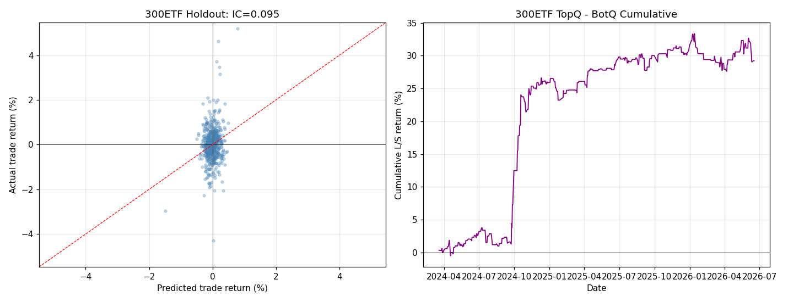


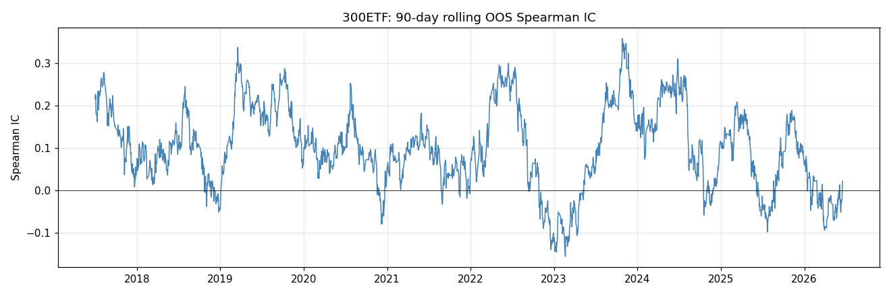


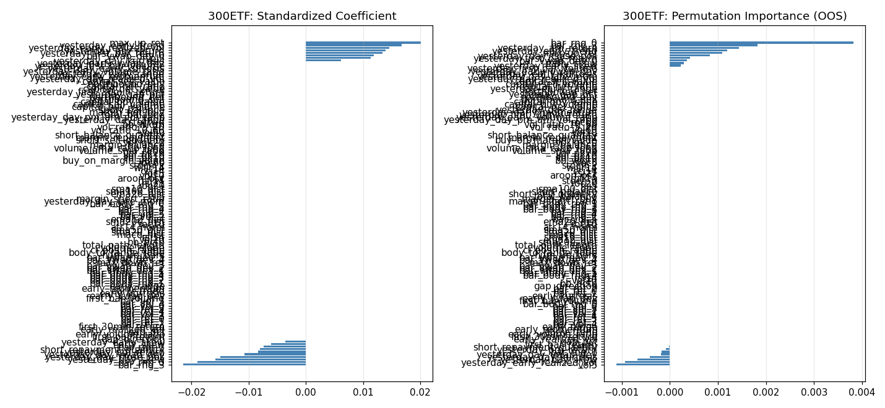


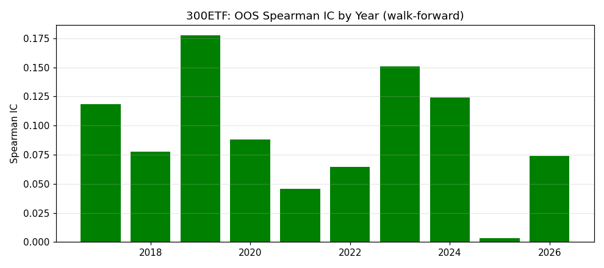


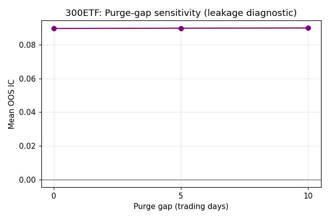


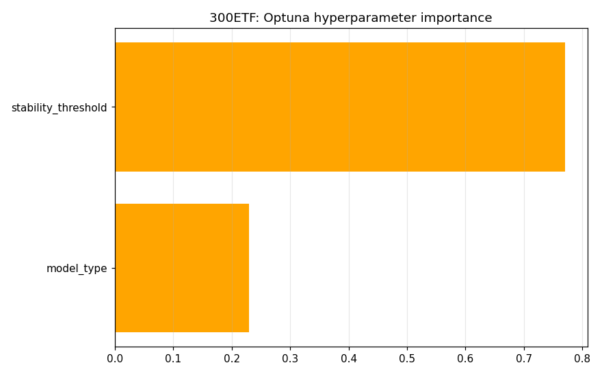


### 50ETF

- **Selected Model**: HUBER
- **Tuned Stability Threshold**: 0.65
- **Samples**: 2721 (2015-04-07 → 2026-06-16)
- **Holdout**: 544 days (2024-03-18 → 2026-06-16)
- **Target stats**: mean=0.0167%, std=0.7701%, Sharpe=0.34
- **Selected features (3)**: `first_bar_return, first_bar_volume, early_realized_vol`

#### Feature Stability Scores (Block Bootstrap)

| Feature | Stability Score | Status |
|---------|-----------------|--------|
| first_bar_return | 58.0% | **Selected** |
| first_bar_volume | 56.0% | **Selected** |
| early_realized_vol | 50.0% | **Selected** |
| early_trend | 40.0% | Pruned |
| sma20_dist | 40.0% | Pruned |
| vol20 | 40.0% | Pruned |
| sma50_dist | 38.0% | Pruned |
| early_range | 36.0% | Pruned |
| early_vwap_dev | 36.0% | Pruned |
| early_momentum | 34.0% | Pruned |
| early_skew | 34.0% | Pruned |
| bb_pctb | 34.0% | Pruned |
| gap_pct | 32.0% | Pruned |
| early_volume_ratio | 30.0% | Pruned |
| early_kurtosis | 30.0% | Pruned |
| macd_hist | 30.0% | Pruned |
| atr14_norm | 26.0% | Pruned |
| roc10 | 26.0% | Pruned |
| rsi14 | 22.0% | Pruned |
| first_30min_return | 20.0% | Pruned |
| gap_direction | 0.0% | Pruned |

#### Metrics

| Metric | Best Linear | Ridge Base | Zero | Yesterday PM | First 30min Mom |
|--------|-------------|------------|------|--------------|-----------------|
| IC | +0.0839 | +0.1062 | +0.0000 | +0.0523 | -0.0271 |
| Dir Acc | 0.533 | 0.539 | 0.500 | 0.506 | 0.449 |
| RMSE | 0.5567% | 0.5519% | 0.5598% | 0.7697% | 0.7018% |
| L/S Sharpe | +1.52 | +2.32 | — | — | — |

#### Best Hyperparameters

```json
{
  "model_type": "huber",
  "stability_threshold": 0.65,
  "huber_alpha": 0.00025114335241190993,
  "huber_epsilon": 1.8434409465376835
}
```

#### Walk-Forward Fold ICs

| Fold | IS IC | OOS IC |
|------|-------|--------|
| 1 | 0.0686 | +0.0637 |
| 2 | 0.0600 | +0.0478 |
| 3 | 0.0300 | +0.0056 |
| 4 | 0.0208 | +0.1188 |
| 5 | 0.0370 | +0.0689 |
| **Overall** | — | +0.0543 |

#### Year-by-Year OOS IC

| Year | IC | Dir Acc | N | L/S Sharpe |
|------|-----|---------|---|-----------|
| 2017 | +0.0319 | 0.514 | 216 | -0.17 |
| 2018 | +0.0358 | 0.551 | 243 | +0.01 |
| 2019 | +0.0865 | 0.516 | 244 | +3.58 |
| 2020 | -0.0119 | 0.519 | 243 | -1.10 |
| 2021 | +0.0407 | 0.551 | 243 | +0.28 |
| 2022 | -0.0235 | 0.471 | 242 | -0.90 |
| 2023 | +0.1113 | 0.550 | 242 | +2.65 |
| 2024 | +0.1684 | 0.562 | 242 | +3.78 |
| 2025 | +0.0655 | 0.523 | 243 | +0.65 |
| 2026 | -0.0312 | 0.542 | 107 | -1.05 |

#### Diagnostic Plots

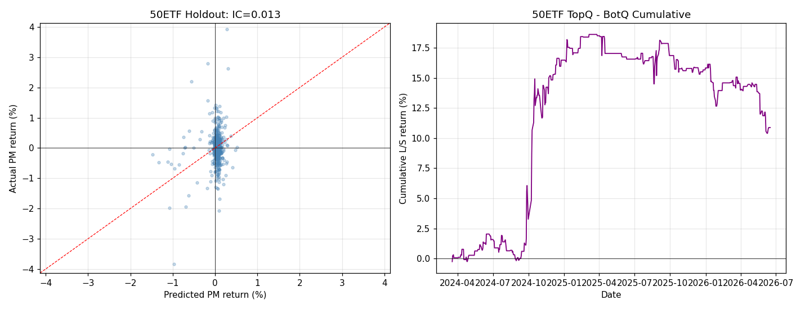


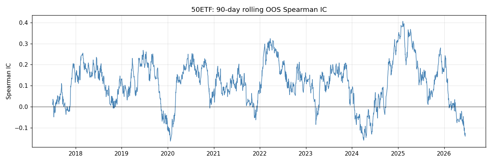


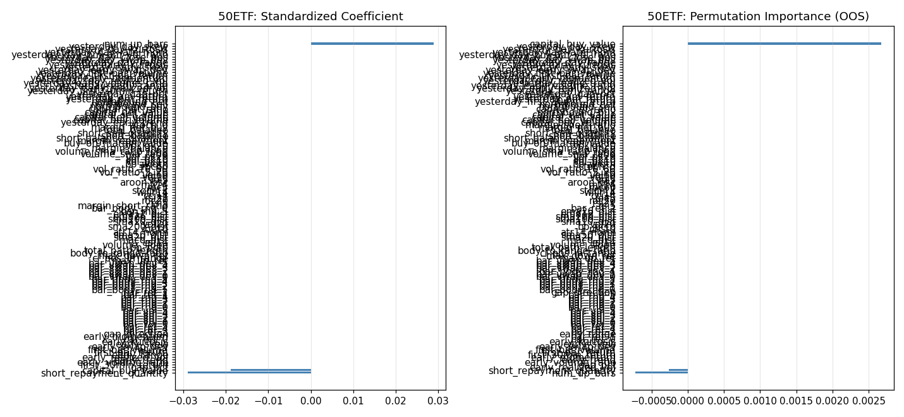


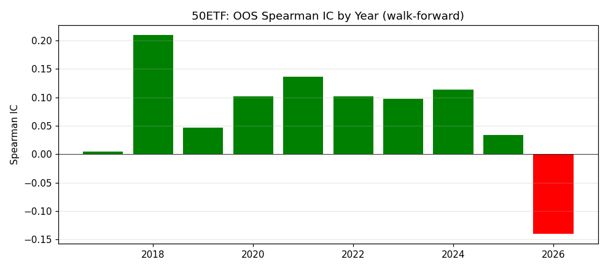


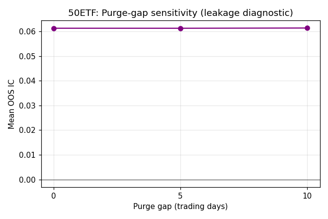


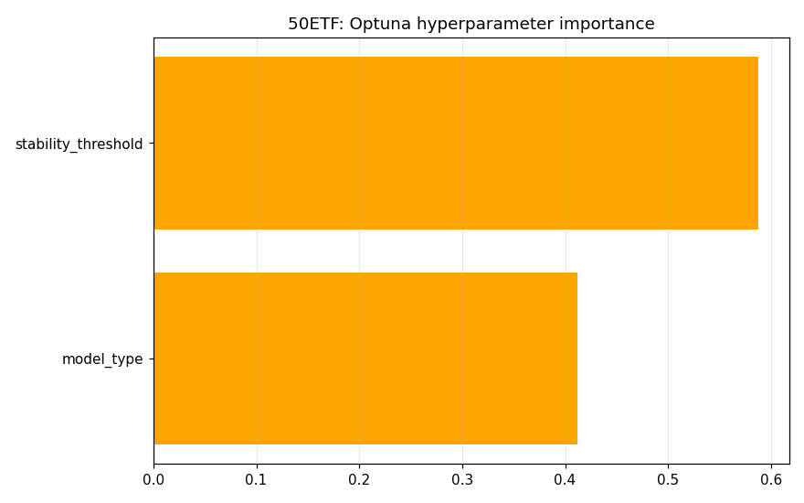


### 500ETF

- **Selected Model**: ELASTICNET
- **Tuned Stability Threshold**: 0.50
- **Samples**: 2721 (2015-04-07 → 2026-06-16)
- **Holdout**: 544 days (2024-03-18 → 2026-06-16)
- **Target stats**: mean=0.0095%, std=0.9738%, Sharpe=0.15
- **Selected features (8)**: `gap_pct, early_realized_vol, early_range, early_trend, first_bar_return, early_skew, macd_hist, sma50_dist`

#### Feature Stability Scores (Block Bootstrap)

| Feature | Stability Score | Status |
|---------|-----------------|--------|
| gap_pct | 64.0% | **Selected** |
| sma50_dist | 62.0% | **Selected** |
| early_range | 60.0% | **Selected** |
| early_skew | 58.0% | **Selected** |
| early_realized_vol | 54.0% | **Selected** |
| macd_hist | 54.0% | **Selected** |
| early_trend | 52.0% | **Selected** |
| first_bar_return | 50.0% | **Selected** |
| early_kurtosis | 48.0% | Pruned |
| rsi14 | 46.0% | Pruned |
| early_volume_ratio | 44.0% | Pruned |
| roc10 | 44.0% | Pruned |
| first_bar_volume | 42.0% | Pruned |
| sma20_dist | 42.0% | Pruned |
| vol20 | 42.0% | Pruned |
| atr14_norm | 40.0% | Pruned |
| early_momentum | 38.0% | Pruned |
| first_30min_return | 36.0% | Pruned |
| early_vwap_dev | 36.0% | Pruned |
| bb_pctb | 28.0% | Pruned |
| gap_direction | 10.0% | Pruned |

#### Metrics

| Metric | Best Linear | Ridge Base | Zero | Yesterday PM | First 30min Mom |
|--------|-------------|------------|------|--------------|-----------------|
| IC | +0.0717 | +0.0896 | +0.0000 | -0.0938 | +0.0588 |
| Dir Acc | 0.540 | 0.493 | 0.500 | 0.450 | 0.533 |
| RMSE | 0.7624% | 0.7615% | 0.7600% | 1.0946% | 0.9964% |
| L/S Sharpe | +0.74 | +1.14 | — | — | — |

#### Best Hyperparameters

```json
{
  "model_type": "elasticnet",
  "stability_threshold": 0.5,
  "en_alpha": 1.5042398426133465e-05,
  "en_l1_ratio": 0.326703555696136
}
```

#### Walk-Forward Fold ICs

| Fold | IS IC | OOS IC |
|------|-------|--------|
| 1 | 0.0732 | +0.0548 |
| 2 | 0.0727 | +0.0690 |
| 3 | 0.0707 | +0.0192 |
| 4 | 0.0551 | +0.0687 |
| 5 | 0.0714 | +0.0421 |
| **Overall** | — | +0.0572 |

#### Year-by-Year OOS IC

| Year | IC | Dir Acc | N | L/S Sharpe |
|------|-----|---------|---|-----------|
| 2017 | +0.0833 | 0.556 | 216 | +1.76 |
| 2018 | +0.0212 | 0.490 | 243 | -0.09 |
| 2019 | +0.0672 | 0.561 | 244 | -0.16 |
| 2020 | +0.0660 | 0.543 | 243 | +1.42 |
| 2021 | +0.0011 | 0.514 | 243 | -0.90 |
| 2022 | +0.0714 | 0.492 | 242 | +2.10 |
| 2023 | +0.0016 | 0.483 | 242 | +0.23 |
| 2024 | +0.0067 | 0.533 | 242 | +0.29 |
| 2025 | +0.0874 | 0.556 | 243 | +1.08 |
| 2026 | +0.1203 | 0.542 | 107 | +1.18 |

#### Diagnostic Plots

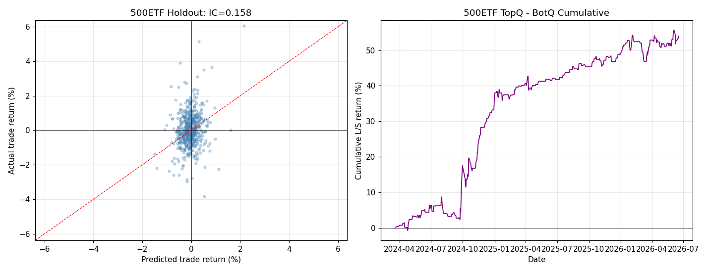


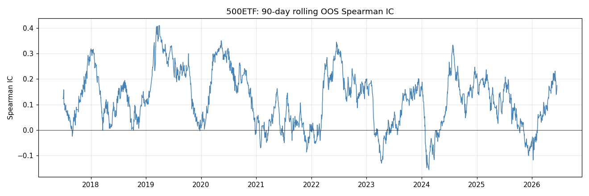


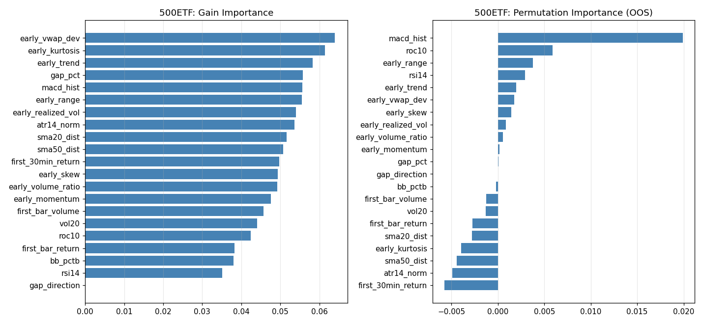


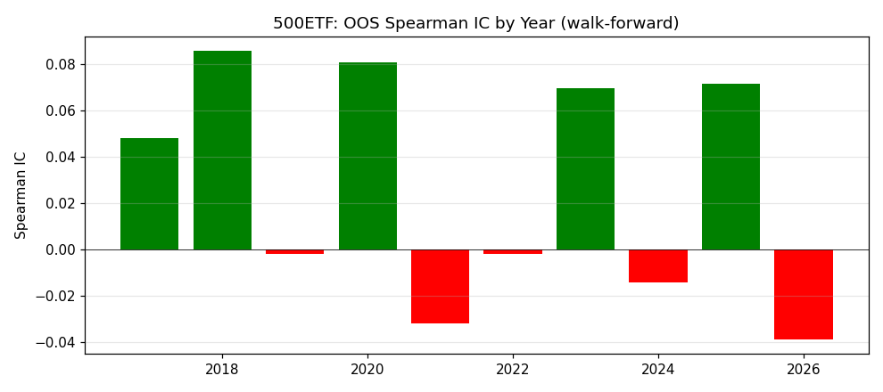


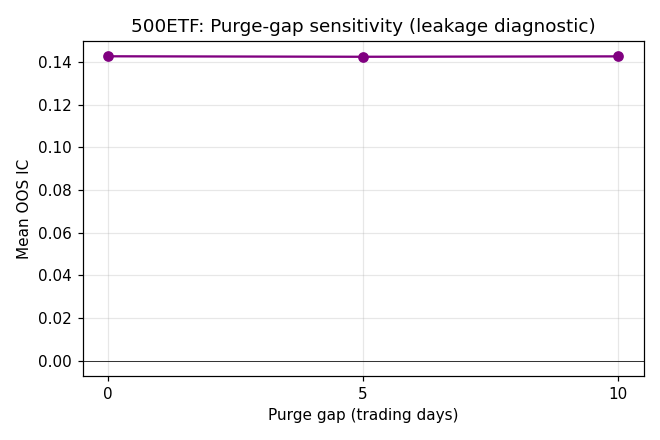


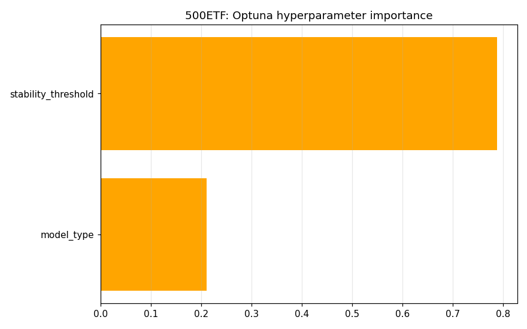


### 588000ETF

- **Selected Model**: LASSO
- **Tuned Stability Threshold**: 0.80
- **Samples**: 1293 (2021-02-09 → 2026-06-16)
- **Holdout**: 258 days (2025-05-26 → 2026-06-16)
- **Target stats**: mean=-0.0391%, std=0.9366%, Sharpe=-0.66
- **Selected features (5)**: `early_realized_vol, early_volume_ratio, early_vwap_dev, early_skew, sma20_dist`

#### Feature Stability Scores (Block Bootstrap)

| Feature | Stability Score | Status |
|---------|-----------------|--------|
| early_volume_ratio | 96.0% | **Selected** |
| early_skew | 90.0% | **Selected** |
| early_vwap_dev | 88.0% | **Selected** |
| early_realized_vol | 84.0% | **Selected** |
| sma20_dist | 80.0% | **Selected** |
| gap_pct | 78.0% | Pruned |
| early_kurtosis | 76.0% | Pruned |
| sma50_dist | 76.0% | Pruned |
| atr14_norm | 72.0% | Pruned |
| bb_pctb | 72.0% | Pruned |
| early_range | 62.0% | Pruned |
| first_bar_return | 60.0% | Pruned |
| first_bar_volume | 60.0% | Pruned |
| first_30min_return | 52.0% | Pruned |
| early_trend | 50.0% | Pruned |
| rsi14 | 48.0% | Pruned |
| macd_hist | 46.0% | Pruned |
| vol20 | 44.0% | Pruned |
| early_momentum | 42.0% | Pruned |
| roc10 | 40.0% | Pruned |
| gap_direction | 0.0% | Pruned |

#### Metrics

| Metric | Best Linear | Ridge Base | Zero | Yesterday PM | First 30min Mom |
|--------|-------------|------------|------|--------------|-----------------|
| IC | -0.1373 | -0.1125 | +0.0000 | -0.1046 | -0.0291 |
| Dir Acc | 0.446 | 0.453 | 0.500 | 0.450 | 0.492 |
| RMSE | 1.1194% | 1.1347% | 1.0403% | 1.5540% | 1.5099% |
| L/S Sharpe | -2.18 | -1.21 | — | — | — |

#### Best Hyperparameters

```json
{
  "model_type": "lasso",
  "stability_threshold": 0.8,
  "lasso_alpha": 0.005708158595135544
}
```

#### Walk-Forward Fold ICs

| Fold | IS IC | OOS IC |
|------|-------|--------|
| 1 | 0.1315 | +0.0407 |
| 2 | 0.0673 | +0.1501 |
| 3 | 0.1007 | +0.1254 |
| 4 | 0.1039 | +0.2355 |
| 5 | 0.1304 | -0.1704 |
| **Overall** | — | +0.0505 |

#### Year-by-Year OOS IC

| Year | IC | Dir Acc | N | L/S Sharpe |
|------|-----|---------|---|-----------|
| 2022 | +0.0393 | 0.560 | 241 | -0.08 |
| 2023 | +0.1538 | 0.541 | 242 | +3.54 |
| 2024 | +0.2022 | 0.566 | 242 | +3.52 |
| 2025 | +0.0557 | 0.519 | 243 | +0.92 |
| 2026 | -0.2666 | 0.346 | 107 | -5.82 |

#### Diagnostic Plots

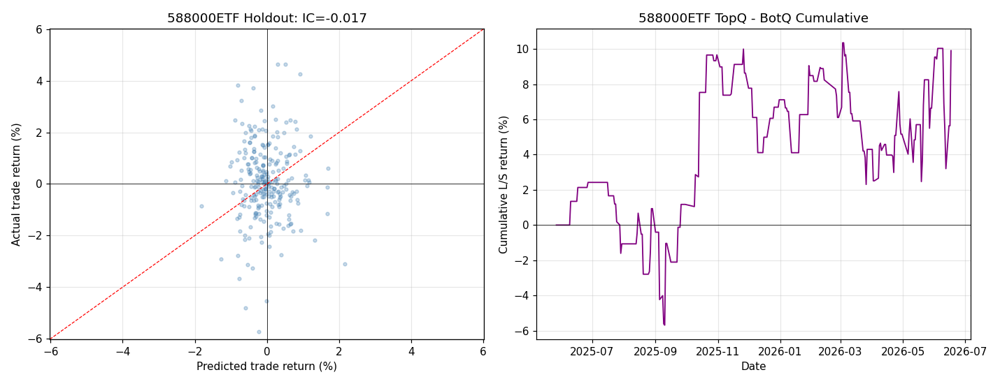


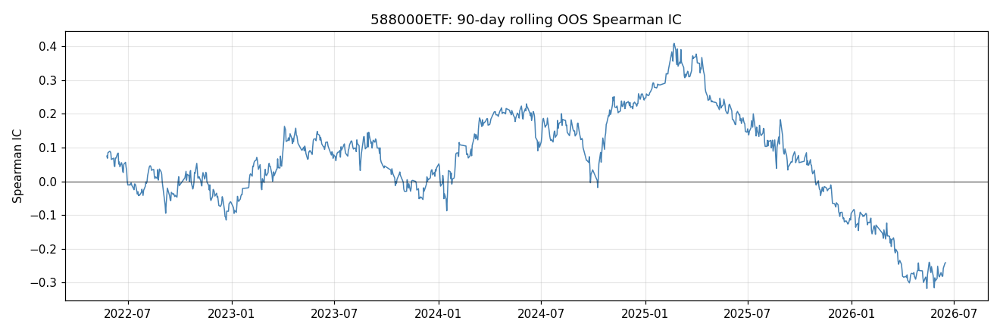


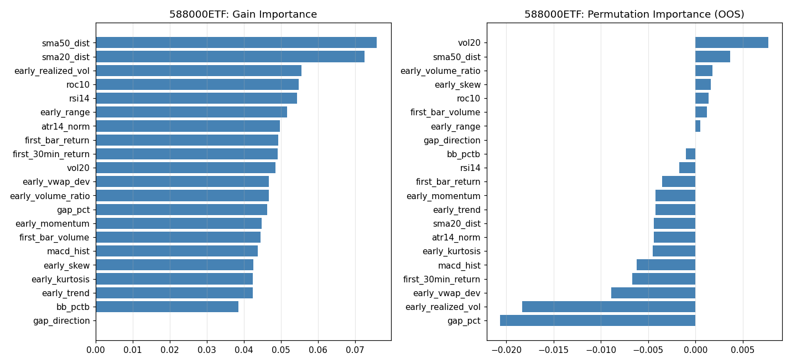


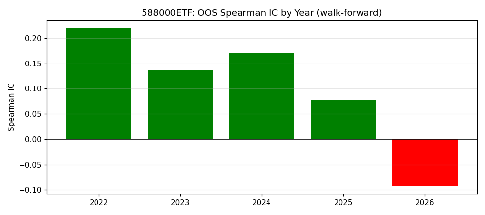


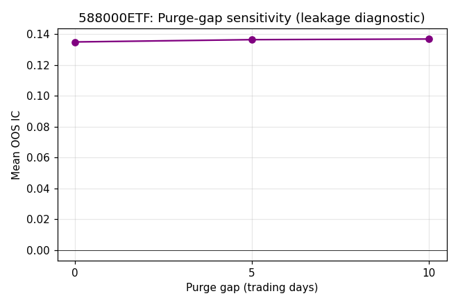


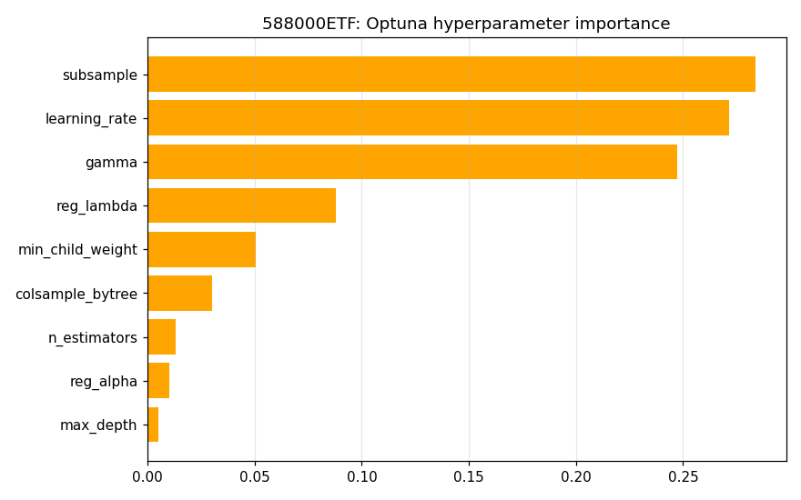


### 159915ETF

- **Selected Model**: HUBER
- **Tuned Stability Threshold**: 0.90
- **Samples**: 2721 (2015-04-07 → 2026-06-16)
- **Holdout**: 544 days (2024-03-18 → 2026-06-16)
- **Target stats**: mean=-0.0077%, std=1.1359%, Sharpe=-0.11
- **Selected features (5)**: `gap_pct, first_bar_return, first_bar_volume, macd_hist, roc10`

#### Feature Stability Scores (Block Bootstrap)

| Feature | Stability Score | Status |
|---------|-----------------|--------|
| gap_pct | 100.0% | **Selected** |
| first_bar_volume | 100.0% | **Selected** |
| first_bar_return | 92.0% | **Selected** |
| macd_hist | 92.0% | **Selected** |
| roc10 | 90.0% | **Selected** |
| early_range | 86.0% | Pruned |
| early_vwap_dev | 82.0% | Pruned |
| early_realized_vol | 80.0% | Pruned |
| early_kurtosis | 80.0% | Pruned |
| sma50_dist | 80.0% | Pruned |
| early_skew | 72.0% | Pruned |
| early_trend | 70.0% | Pruned |
| vol20 | 70.0% | Pruned |
| early_volume_ratio | 66.0% | Pruned |
| sma20_dist | 62.0% | Pruned |
| rsi14 | 58.0% | Pruned |
| atr14_norm | 58.0% | Pruned |
| bb_pctb | 58.0% | Pruned |
| early_momentum | 42.0% | Pruned |
| first_30min_return | 40.0% | Pruned |
| gap_direction | 0.0% | Pruned |

#### Metrics

| Metric | Best Linear | Ridge Base | Zero | Yesterday PM | First 30min Mom |
|--------|-------------|------------|------|--------------|-----------------|
| IC | +0.1078 | +0.1349 | +0.0000 | -0.1574 | +0.0692 |
| Dir Acc | 0.570 | 0.583 | 0.500 | 0.414 | 0.531 |
| RMSE | 0.9602% | 0.9682% | 1.0043% | 1.4921% | 1.2758% |
| L/S Sharpe | +1.35 | +2.11 | — | — | — |

#### Best Hyperparameters

```json
{
  "model_type": "huber",
  "stability_threshold": 0.9,
  "huber_alpha": 7.530395926504481,
  "huber_epsilon": 1.007984806902894
}
```

#### Walk-Forward Fold ICs

| Fold | IS IC | OOS IC |
|------|-------|--------|
| 1 | 0.1928 | +0.1225 |
| 2 | 0.1534 | +0.0985 |
| 3 | 0.1455 | +0.0682 |
| 4 | 0.1298 | +0.1725 |
| 5 | 0.1439 | +0.0926 |
| **Overall** | — | +0.0918 |

#### Year-by-Year OOS IC

| Year | IC | Dir Acc | N | L/S Sharpe |
|------|-----|---------|---|-----------|
| 2017 | +0.0860 | 0.551 | 216 | +2.44 |
| 2018 | +0.1261 | 0.564 | 243 | +1.22 |
| 2019 | +0.1331 | 0.512 | 244 | +3.38 |
| 2020 | +0.0718 | 0.506 | 243 | +2.75 |
| 2021 | +0.1702 | 0.568 | 243 | +3.77 |
| 2022 | -0.0667 | 0.479 | 242 | -0.94 |
| 2023 | +0.1473 | 0.579 | 242 | +1.51 |
| 2024 | +0.1593 | 0.599 | 242 | +2.84 |
| 2025 | +0.1055 | 0.539 | 243 | +1.94 |
| 2026 | +0.0978 | 0.607 | 107 | +0.97 |

#### Diagnostic Plots

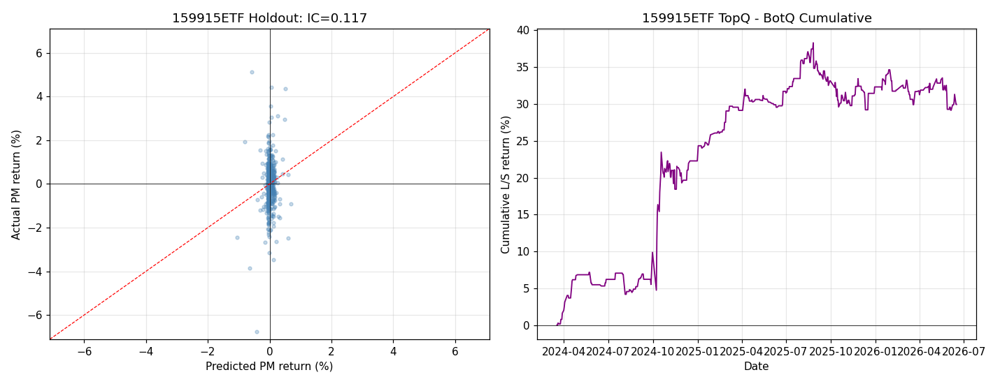


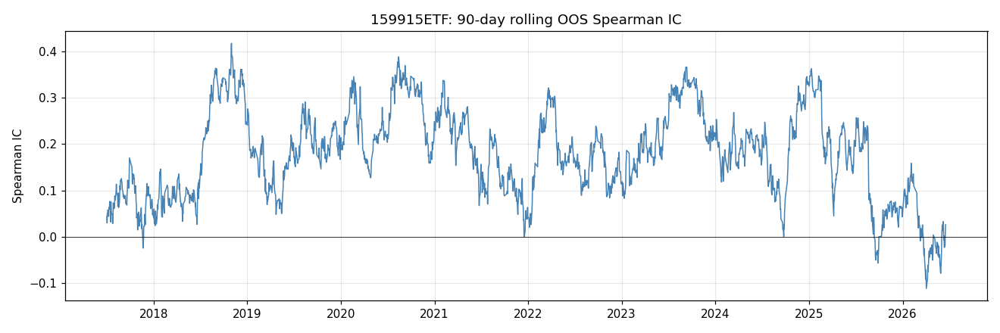


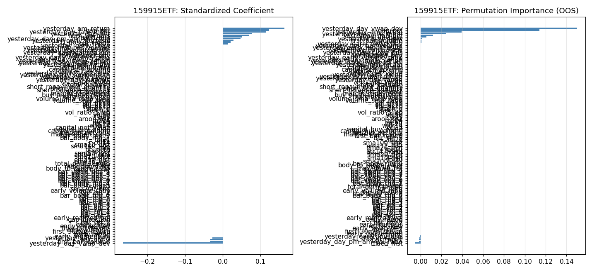


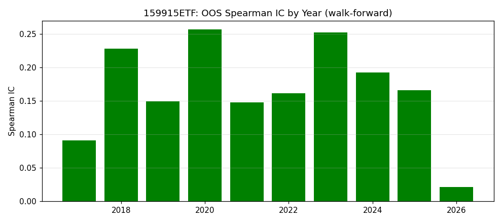


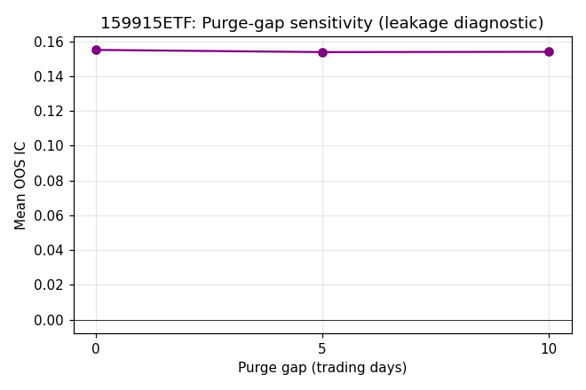


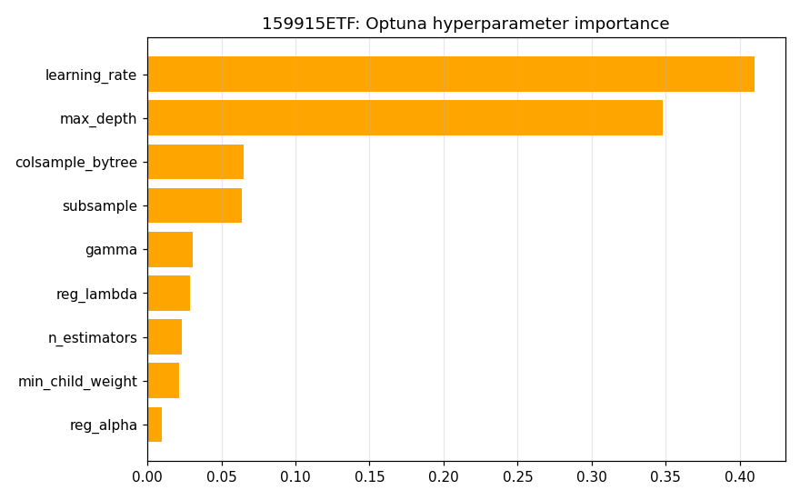


## 5. Comparison to Baselines

Four baselines evaluated on the same holdout set:

1. **Zero** (no-skill): Always predicts 0. IC=0 by definition.
2. **Yesterday PM return**: Autocorrelation baseline. Tests if PM returns are predictable from prior day.
3. **First 30-min return**: Momentum baseline. Tests AM-to-PM momentum.
4. **Ridge Base**: Ridge regression with alpha=1.0 on all 21 features. Controls for tuning/selection lift.

| ETF | Best Linear IC > Ridge Base IC? | Best Linear IC > Mom IC? | Best Baseline |
|-----|---------------------------------|--------------------------|---------------|
| 300ETF | Yes | No | first_30min_mom (IC=+0.0468) |
| 50ETF | No | Yes | ridge (IC=+0.1062) |
| 500ETF | No | Yes | ridge (IC=+0.0896) |
| 588000ETF | No | No | zero (IC=+0.0000) |
| 159915ETF | No | Yes | ridge (IC=+0.1349) |

## 6. Risk of Overfitting

### 6.1 IS vs OOS Gap

| ETF | IS IC | OOS IC | Gap | Assessment |
|-----|-------|--------|-----|-----------|
| 300ETF | 0.0725 | 0.0374 | +0.0350 | Low |
| 50ETF | 0.0338 | 0.0839 | -0.0502 | Low |
| 500ETF | 0.0626 | 0.0717 | -0.0092 | Low |
| 588000ETF | 0.1273 | -0.1373 | +0.2645 | Moderate |
| 159915ETF | 0.1383 | 0.1078 | +0.0305 | Low |

### 6.2 Regime Breakdown (Year-by-Year)

See per-ETF year-by-year tables in §4. Large year-to-year IC variance signals regime sensitivity.

### 6.3 Purge-Gap Sensitivity

If IC drops sharply as purge gap increases from 0→5→10, it indicates short-term leakage.

| ETF | Gap=0 | Gap=5 | Gap=10 | Delta(0→10) |
|-----|-------|-------|--------|------------|
| 300ETF | +0.0360 | +0.0362 | +0.0366 | -0.0006 |
| 50ETF | +0.0617 | +0.0609 | +0.0603 | +0.0014 |
| 500ETF | +0.0514 | +0.0508 | +0.0512 | +0.0002 |
| 588000ETF | +0.0731 | +0.0762 | +0.0745 | -0.0015 |
| 159915ETF | +0.1112 | +0.1108 | +0.1107 | +0.0005 |

### 6.4 Feature Importance Stability

Compare standardized coefficients vs permutation importance (OOS) across features. Large divergence indicates overfitting to specific features.

### 6.5 Top-5 Features: Standardized Coefficient vs Permutation


**300ETF**:

| Rank | Standardized Coefficient (Abs) | Permutation Importance |
|------|--------------------------------|----------------------|
| 1 | first_bar_return (+0.0115) | first_bar_return (+0.002098) |
| 2 | gap_pct (+0.0081) | early_skew (+0.000177) |
| 3 | early_skew (-0.0041) | early_realized_vol (+0.000120) |
| 4 | early_realized_vol (-0.0034) | gap_pct (+0.000063) |
| 5 | first_30min_return (+0.0000) | first_30min_return (+0.000000) |

**50ETF**:

| Rank | Standardized Coefficient (Abs) | Permutation Importance |
|------|--------------------------------|----------------------|
| 1 | first_bar_volume (-0.0239) | first_bar_return (+0.002788) |
| 2 | first_bar_return (+0.0236) | first_bar_volume (+0.001893) |
| 3 | early_realized_vol (-0.0155) | early_realized_vol (+0.000678) |
| 4 | gap_pct (+0.0000) | gap_pct (+0.000000) |
| 5 | first_30min_return (+0.0000) | first_30min_return (+0.000000) |

**500ETF**:

| Rank | Standardized Coefficient (Abs) | Permutation Importance |
|------|--------------------------------|----------------------|
| 1 | early_realized_vol (+0.1157) | early_range (+0.014823) |
| 2 | early_range (-0.1063) | early_skew (+0.002340) |
| 3 | macd_hist (+0.0363) | early_trend (+0.000884) |
| 4 | first_bar_return (+0.0315) | first_bar_return (+0.000815) |
| 5 | early_skew (+0.0285) | early_volume_ratio (+0.000000) |

**588000ETF**:

| Rank | Standardized Coefficient (Abs) | Permutation Importance |
|------|--------------------------------|----------------------|
| 1 | early_vwap_dev (+0.1198) | early_skew (+0.008047) |
| 2 | early_realized_vol (-0.1086) | first_30min_return (+0.000000) |
| 3 | sma20_dist (-0.0928) | early_range (+0.000000) |
| 4 | early_skew (+0.0621) | early_trend (+0.000000) |
| 5 | early_volume_ratio (-0.0325) | gap_pct (+0.000000) |

**159915ETF**:

| Rank | Standardized Coefficient (Abs) | Permutation Importance |
|------|--------------------------------|----------------------|
| 1 | gap_pct (+0.1332) | gap_pct (+0.127900) |
| 2 | first_bar_return (+0.0853) | first_bar_return (+0.025633) |
| 3 | first_bar_volume (-0.0673) | first_bar_volume (+0.008024) |
| 4 | roc10 (+0.0458) | macd_hist (+0.002207) |
| 5 | macd_hist (-0.0090) | first_30min_return (+0.000000) |

### 6.6 Hyperparameter Sensitivity

Optuna parameter importance shows which parameters most affect CV IC.

- **300ETF**: Most influential = `stability_threshold` (76.86%)
- **50ETF**: Most influential = `stability_threshold` (64.06%)
- **500ETF**: Most influential = `stability_threshold` (98.02%)
- **588000ETF**: Most influential = `stability_threshold` (67.06%)
- **159915ETF**: Most influential = `model_type` (70.05%)

## 7. Conclusions & Caveats

**Potentially deployable** (IC>0.03, L/S Sharpe>0.5, beats Ridge Base): 300ETF

**Marginal** (positive IC but weak Sharpe or below Ridge Base): 50ETF, 500ETF, 159915ETF

**Weak/Not recommended** (negative IC or no edge): 588000ETF


**Key caveats**:

1. PM return prediction is inherently noisy (low signal-to-noise ratio)
2. Feature selection using block bootstrap stability scores handles highly correlated features much better than greedy RFE
3. HuberRegressor handles extreme outlier days much better than standard MSE-based models
4. Transaction costs and execution slippage are not modeled here
