# Day-Model Linear Trade Return Predictor — Report

*Generated by `generate_report.py`*

## 1. Executive Summary

Optuna-tuned sparse/robust linear models (skglm_huber_l1, skglm_mcp from skglm) predicting entry-to-exit trade return (entry at open of decision_bar+1, exit at close of exit_bar (14:30)) using features and indicators calculated from daily and intraday Index data directly (to eliminate look-ahead bias and accelerate computation), while executing trades on the actual ETF (to accurately reflect P&L performance). The input feature space spans early-bar features (up to decision bar close) + prior-day technical indicators. Features are robustly selected using the new TimeSeriesStabilitySelector which incorporates regime-stratified bootstrapping, randomized ElasticNet penalties, OOB IC screening, and across-fold variance filtering.

**Validation**: Purged walk-forward TimeSeriesSplit (gap=5 days, 5 folds). Optuna TPE hyperparameter search (100 trials). 20% holdout never used in tuning.


| ETF/Tag | Model | Threshold | Features | Samples | Holdout IC | Holdout Dir | L/S Sharpe | Ridge Base IC | IS-OOS Gap |
|---------|-------|-----------|----------|---------|-----------|-------------|-----------|---------------|------------|
| 300ETF_long | SKGLM_HUBER_L1 | 0.23 | 70/238 | 2722 | +0.0478 | 0.513 | +2.21 | +0.1183 | +0.1177 |
| 300ETF_short | SKGLM_MCP | 0.17 | 92/238 | 2722 | +0.0521 | 0.528 | +0.88 | +0.1183 | +0.1359 |
| 50ETF_long | SKGLM_HUBER_L1 | 0.28 | 35/238 | 2722 | -0.0060 | 0.493 | +0.79 | +0.1178 | +0.1679 |
| 50ETF_short | SKGLM_MCP | 0.13 | 84/238 | 2722 | +0.1153 | 0.539 | +3.40 | +0.1178 | +0.1039 |
| 500ETF_long | SKGLM_MCP | 0.24 | 68/238 | 2722 | +0.1427 | 0.559 | +2.85 | +0.1348 | +0.0331 |
| 500ETF_short | SKGLM_HUBER_L1 | 0.16 | 77/238 | 2722 | +0.1492 | 0.555 | +2.60 | +0.1348 | +0.0084 |
| 588000ETF_long | SKGLM_MCP | 0.10 | 64/238 | 1294 | -0.0738 | 0.457 | -0.67 | -0.0277 | +0.3521 |
| 588000ETF_short | SKGLM_MCP | 0.10 | 79/238 | 1294 | +0.0465 | 0.481 | +1.93 | -0.0277 | +0.0853 |
| 159915ETF_long | SKGLM_HUBER_L1 | 0.19 | 66/238 | 2722 | +0.1433 | 0.546 | +3.34 | +0.0489 | +0.1062 |
| 159915ETF_short | SKGLM_MCP | 0.12 | 93/238 | 2722 | +0.1396 | 0.564 | +3.09 | +0.0489 | +0.0341 |

## 2. Data & Features

### Feature Groups

| Group | Count | Features |
|-------|-------|----------|
| Early-bar (139) | 139 | gap_pct, first_30min_return, early_realized_vol, early_range, early_trend, early_momentum, first_bar_return, first_bar_volume, early_vwap_dev, early_skew, early_kurtosis, bar_ret_0, bar_ret_1, bar_ret_2, bar_ret_3... and 124 more (total 139) |
| Day-level (74) | 74 | macd_hist, sma20_dist, sma50_dist, atr14_norm, roc10, bb_pctb, vol20, sma10_dist, sma100_dist, sma200_dist, ema12_dist, rsi5, rsi21, roc5, roc20... and 59 more (total 74) |
| Yesterday (25) | 25 | yesterday_pm_return, yesterday_am_return, yesterday_gap_pct, yesterday_first_30min_return, yesterday_early_realized_vol, yesterday_early_range, yesterday_early_volume_ratio, yesterday_early_trend, yesterday_early_momentum, yesterday_first_bar_return, yesterday_first_bar_volume, yesterday_early_vwap_dev, yesterday_early_skew, yesterday_early_kurtosis, yesterday_day_range... and 10 more (total 25) |

- **Early-bar**: First `decision_bar+1` five-minute bars of Index data (see `DECISION_BAR` dict in `build_features.py`). Bars beyond `decision_bar` padded with 0.0. Strictly causal — no look-ahead.
- **Day-level**: Technical indicators and 3rd party flows calculated using daily and intraday Index data directly, shifted by 1 day (no look-ahead).
- **Yesterday**: Shifted full-day and early-bar features of Index data from day t-1 (no look-ahead).
- **Target**: `trade_return` = log(close[EXIT_BAR] / open[decision_bar+1]) using ETF prices to accurately reflect actual daytrade P&L (entry at next-bar open after decision, exit at 14:30 close).
- **Diagnostic target**: `pm_return` (bars 24..47, 13:00→15:00) of the ETF, retained for IC sanity-checks vs the old baseline — do NOT train on it.
- **Warmup**: First 60 rows dropped (SMA50/ATR14 burn-in).

## 3. Methodology

### Purged Walk-Forward Validation & Feature Selection

- **TimeSeriesSplit**: 5 folds expanding window.
- **Purge gap**: 5 trading days between train and test.
- **Stability Selection**: 50 stratified block bootstrap trials (block length 20 days) using randomized `ElasticNet` (pre-tuned via `ElasticNetCV`) combined with an out-of-bag (OOB) Spearman rank IC significance check (p < 0.05 or |IC| > 0.02) as the base selector. Stability scores and cross-fold variance filters are computed across purged walk-forward validation folds.

- **Tuning**: The top K features by stability selection are tuned via Optuna in walk-forward CV over $K \in [3, 50]$ to find the globally most robust subset.

- **Optuna objective**: mean Spearman rank IC across folds (100 trials)

### Search Space

| Parameter | Range / Options |
|-----------|-----------------|
| model_type | skglm_huber_l1, skglm_mcp (from `skglm` library) |
| top_k_features | 3–50 (step 1) |
| **skglm_huber_l1** | alpha: $10^{-5}$–$10^3$ (log), delta: $1.0$–$3.0$ |
| **skglm_mcp** | alpha: $10^{-5}$–$10^3$ (log), gamma: $1.5$–$15.0$ |

## 4. Results

### 300ETF_long

- **Selected Model**: SKGLM_HUBER_L1
- **Tuned Stability Threshold**: 0.23
- **Samples**: 2722 (2015-04-07 → 2026-06-17)
- **Holdout**: 544 days (2024-03-19 → 2026-06-17)
- **Target stats**: mean=0.0125%, std=0.9550%, Sharpe=0.21
- **Selected features (70)**: `yesterday_early_range, early_skew, sma100_dist, consecutive_higher_highs, inside_bar_failure_bear, vol_gk10, intraday_bullish_fvg, yesterday_body_ratio, yesterday_early_realized_vol, roc10, early_bearish_shooting_star, intraday_bearish_fvg, upper_wick_dominance, inside_bar_failure_bull, capital_net_value, opening_gap_reversal, volume_surge_direction, yesterday_early_vwap_dev, volume_climax_exhaustion, consecutive_bearish_engulfing, max_up_ret, northbound_net, margin_repayment, yesterday_first_bar_return, yesterday_am_return, volume_concentration, bar_rng_2, measured_move_proximity, bar_body_rng_0, yesterday_day_late_mom, yesterday_early_skew, volatility_regime_intraday, upper_shadow_rejection, sma_distance_5d, barbed_wire_intensity, gap_fill_ratio, twenty_gap_bars_regime, first_bar_sentiment, vwap_touch_count, atr14_norm, total_path_length, opening_range_size, yesterday_intraday_close_position, bar_rng_0, early_bearish_engulfing_count, consolidation_bars_count, yesterday_day_close_pos, early_doji_count, vol_ratio_5_20, decision_bar_body, volatility_percentile_20d, bar_ret_2, bar_vwap_dev_0, early_range, yesterday_close_position, yesterday_gap_pct, inside_bar_compression, yesterday_early_kurtosis, yesterday_day_pm_am_vol_ratio, yesterday_spike_exhaustion_ratio, yesterday_gap, yesterday_opening_gap_reversal, volume_weighted_price_position, bar_rng_3, decision_bar_reversal_signal, open_efficiency, vwap_cross_count, early_kurtosis, gap_pct, yesterday_day_vwap_dev`

#### Selected Feature Stability Scores (Block Bootstrap)

<details>
<summary><b>Click to expand Feature Stability Scores Table</b></summary>

| Feature | Stability Score | Status | Pearson $r$ | Spearman $\rho$ | Monotonicity Score | Mutual Info | Quality Rating | Holdout IC | Yearly ICs | Yearly IC Std |
|---------|-----------------|--------|-------------|-----------------|--------------------|-------------|----------------|------------|------------|---------------|
| yesterday_early_range | 74.8% | **Selected** | +0.0278 | +0.0063 | +0.80 | 0.0409 | ** Moderate Monotonic | -0.0142 | 15:+0.13 16:-0.02 17:+0.06 18:+0.05 19:-0.05 20:+0.01 21:-0.09 22:-0.02 23:-0.04 24:+0.01 25:+0.02 26:-0.06 | 0.0579 |
| early_skew | 67.2% | **Selected** | +0.0386 | +0.0356 | +0.70 | 0.0035 | ** Moderate Monotonic | +0.0137 | 15:+0.11 16:+0.05 17:+0.08 18:-0.02 19:+0.04 20:+0.07 21:-0.03 22:+0.10 23:-0.00 24:+0.01 25:-0.00 26:+0.08 | 0.0469 |
| sma100_dist | 62.4% | **Selected** | -0.0790 | -0.0440 | -0.70 | 0.0350 | ** Moderate Monotonic | -0.0390 | 15:-0.18 16:-0.09 17:-0.01 18:-0.05 19:-0.16 20:-0.08 21:-0.14 22:-0.07 23:-0.09 24:-0.06 25:-0.01 26:-0.16 | 0.0535 |
| consecutive_higher_highs | 54.0% | **Selected** | +0.0565 | +0.0444 | +0.50 | 0.0000 | ** Moderate Monotonic | -0.0181 | 15:+0.04 16:+0.01 17:-0.03 18:+0.12 19:+0.06 20:-0.02 21:+0.19 22:+0.00 23:+0.11 24:-0.01 25:+0.07 26:-0.19 | 0.0925 |
| inside_bar_failure_bear | 52.8% | **Selected** | +0.0272 | +0.0257 | N/A | 0.0000 | N/A | +0.0561 | 15:+0.04 16:+0.07 17:+0.07 18:+0.07 19:-0.02 20:+0.03 21:-0.06 22:+0.05 23:-0.03 24:+0.02 25:-0.02 26:+0.20 | 0.0636 |
| vol_gk10 | 52.4% | **Selected** | +0.0401 | +0.0292 | +0.80 | 0.0392 | ** Moderate Monotonic | +0.0255 | 15:+0.04 16:+0.03 17:+0.09 18:+0.01 19:-0.04 20:-0.06 21:+0.04 22:+0.11 23:+0.01 24:+0.10 25:+0.06 26:+0.01 | 0.0504 |
| intraday_bullish_fvg | 50.4% | **Selected** | +0.0588 | +0.0444 | N/A | 0.0000 | N/A | +0.0100 | 15:+0.14 16:+0.04 17:+0.06 18:+0.00 19:-0.02 20:+0.04 21:+0.08 22:+0.08 23:-0.00 24:-0.02 25:+0.04 26:-0.01 | 0.0451 |
| yesterday_body_ratio | 47.6% | **Selected** | -0.0259 | -0.0316 | -0.70 | 0.0026 | ** Moderate Monotonic | -0.0492 | 15:+0.03 16:-0.04 17:+0.02 18:-0.04 19:+0.02 20:-0.14 21:-0.11 22:-0.01 23:+0.04 24:-0.03 25:-0.02 26:-0.12 | 0.0576 |
| yesterday_early_realized_vol | 43.6% | **Selected** | +0.0256 | +0.0150 | +0.30 | 0.0216 | * Non-Monotonic / Weak | +0.0239 | 15:+0.13 16:+0.09 17:-0.06 18:+0.05 19:-0.05 20:-0.05 21:+0.01 22:-0.07 23:-0.13 24:+0.09 25:+0.00 26:+0.01 | 0.0742 |
| roc10 | 43.6% | **Selected** | -0.0675 | -0.0325 | -0.50 | 0.0236 | * Non-Monotonic / Weak | -0.0431 | 15:-0.09 16:-0.12 17:-0.09 18:-0.00 19:-0.07 20:-0.02 21:-0.14 22:+0.05 23:+0.02 24:-0.06 25:+0.01 26:-0.12 | 0.0600 |
| early_bearish_shooting_star | 42.8% | **Selected** | -0.0083 | -0.0419 | N/A | 0.0028 | N/A | -0.0328 | 15:+0.03 16:-0.04 17:+0.01 18:-0.09 19:-0.13 20:-0.01 21:-0.17 22:+0.08 23:-0.01 24:-0.04 25:-0.02 26:-0.04 | 0.0653 |
| intraday_bearish_fvg | 41.2% | **Selected** | -0.0315 | -0.0269 | N/A | 0.0000 | N/A | -0.0789 | 15:-0.05 16:-0.01 17:+0.04 18:-0.07 19:-0.02 20:+0.01 21:-0.01 22:+0.02 23:-0.08 24:-0.07 25:-0.07 26:-0.09 | 0.0437 |
| upper_wick_dominance | 40.8% | **Selected** | -0.0113 | +0.0101 | +0.60 | 0.0000 | ** Moderate Monotonic | +0.0619 | 15:+0.02 16:-0.01 17:+0.04 18:+0.08 19:-0.05 20:+0.03 21:-0.07 22:-0.04 23:+0.02 24:+0.08 25:+0.05 26:+0.00 | 0.0479 |
| inside_bar_failure_bull | 40.4% | **Selected** | -0.0506 | -0.0409 | N/A | 0.0021 | N/A | -0.0058 | 15:-0.16 16:-0.01 17:-0.12 18:+0.01 19:-0.07 20:-0.06 21:-0.01 22:+0.05 23:-0.09 24:-0.03 25:+0.04 26:-0.12 | 0.0645 |
| capital_net_value | 40.0% | **Selected** | -0.0252 | -0.0462 | -0.60 | 0.0142 | ** Moderate Monotonic | -0.0077 | 15:+nan 16:+nan 17:-0.04 18:+0.04 19:-0.17 20:-0.10 21:-0.08 22:-0.07 23:+0.03 24:-0.06 25:-0.00 26:+0.02 | nan |
| opening_gap_reversal | 40.0% | **Selected** | -0.0588 | -0.0066 | -1.00 | 0.0000 | *** Strong Monotonic | +0.0330 | 15:+0.02 16:+0.01 17:-0.14 18:-0.01 19:+0.00 20:-0.02 21:-0.06 22:+0.05 23:-0.04 24:-0.09 25:+0.01 26:+0.13 | 0.0660 |
| volume_surge_direction | 40.0% | **Selected** | +0.1175 | +0.0760 | +0.90 | 0.0067 | *** Strong Monotonic | +0.0329 | 15:+0.19 16:+0.08 17:-0.05 18:+0.18 19:+0.12 20:+0.06 21:+0.08 22:+0.04 23:+0.14 24:+0.04 25:+0.09 26:-0.11 | 0.0832 |
| yesterday_early_vwap_dev | 39.6% | **Selected** | +0.0745 | +0.0406 | +0.60 | 0.0191 | ** Moderate Monotonic | +0.0473 | 15:+0.06 16:-0.02 17:+0.09 18:+0.07 19:+0.01 20:+0.13 21:-0.06 22:+0.03 23:-0.05 24:+0.03 25:+0.05 26:+0.05 | 0.0543 |
| volume_climax_exhaustion | 39.2% | **Selected** | -0.0138 | -0.0068 | -0.70 | 0.0190 | ** Moderate Monotonic | -0.0070 | 15:-0.11 16:-0.16 17:-0.05 18:+0.04 19:+0.06 20:+0.00 21:-0.08 22:+0.06 23:+0.12 24:+0.03 25:-0.02 26:-0.10 | 0.0803 |
| consecutive_bearish_engulfing | 38.8% | **Selected** | -0.0019 | -0.0094 | N/A | 0.0120 | N/A | -0.0644 | 15:+0.06 16:-0.04 17:+0.10 18:+0.02 19:+0.04 20:+0.01 21:-0.07 22:-0.08 23:-0.00 24:+0.00 25:-0.14 26:+0.04 | 0.0649 |
| max_up_ret | 36.8% | **Selected** | +0.1202 | +0.0819 | +0.80 | 0.0075 | ** Moderate Monotonic | +0.0000 | 15:+0.18 16:+0.10 17:+0.03 18:+0.19 19:+0.01 20:+0.05 21:+0.15 22:-0.03 23:+0.14 24:+0.10 25:+0.04 26:-0.16 | 0.0956 |
| northbound_net | 35.6% | **Selected** | +0.0381 | +0.0469 | +0.90 | 0.0000 | *** Strong Monotonic | -0.0416 | 15:+0.04 16:+0.01 17:-0.00 18:+0.07 19:+0.14 20:+0.05 21:+0.02 22:+0.06 23:+0.08 24:-0.01 26:+nan | nan |
| margin_repayment | 35.2% | **Selected** | +0.0026 | +0.0011 | +0.00 | 0.0064 | * Non-Monotonic / Weak | -0.0488 | 15:+0.03 16:+0.04 17:+0.05 18:-0.01 19:-0.06 20:-0.15 21:+0.00 22:+0.03 23:-0.01 24:+0.03 25:-0.08 26:-0.00 | 0.0550 |
| yesterday_first_bar_return | 34.8% | **Selected** | -0.0228 | +0.0267 | +0.00 | 0.0000 | * Non-Monotonic / Weak | +0.0649 | 15:+0.03 16:+0.05 17:+0.01 18:-0.12 19:+0.03 20:+0.00 21:-0.06 22:+0.06 23:+0.19 24:+0.02 25:+0.12 26:-0.01 | 0.0756 |
| yesterday_am_return | 34.8% | **Selected** | +0.0594 | +0.0241 | +0.30 | 0.0078 | * Non-Monotonic / Weak | -0.0303 | 15:+0.15 16:+0.02 17:-0.06 18:-0.01 19:+0.05 20:+0.03 21:-0.04 22:+0.07 23:+0.08 24:-0.05 25:+0.00 26:-0.12 | 0.0700 |
| volume_concentration | 34.4% | **Selected** | -0.0306 | -0.0310 | -0.70 | 0.0000 | ** Moderate Monotonic | -0.0346 | 15:+0.01 16:+0.10 17:-0.03 18:-0.09 19:+0.00 20:-0.02 21:-0.13 22:-0.07 23:-0.05 24:-0.01 25:-0.03 26:-0.02 | 0.0540 |
| bar_rng_2 | 34.0% | **Selected** | +0.0092 | +0.0017 | +0.20 | 0.0663 | * Non-Monotonic / Weak | -0.0829 | 15:+0.08 16:-0.07 17:+0.01 18:+0.02 19:-0.03 20:+0.01 21:-0.01 22:-0.02 23:+0.11 24:+0.05 25:-0.12 26:-0.10 | 0.0654 |
| measured_move_proximity | 32.8% | **Selected** | -0.0083 | +0.0133 | N/A | 0.0114 | N/A | -0.0214 | 15:-0.13 16:+0.00 17:-0.06 18:+0.18 19:+0.03 20:+0.06 21:+0.04 22:-0.02 23:+0.00 24:-0.01 25:-0.07 26:+0.00 | 0.0727 |
| bar_body_rng_0 | 32.0% | **Selected** | +0.1072 | +0.0952 | +1.00 | 0.0073 | *** Strong Monotonic | +0.0300 | 15:+0.22 16:+0.12 17:+0.03 18:+0.20 19:+0.07 20:-0.00 21:+0.16 22:-0.00 23:+0.14 24:+0.07 25:+0.07 26:-0.10 | 0.0883 |
| yesterday_day_late_mom | 32.0% | **Selected** | +0.0282 | -0.0038 | -0.10 | 0.0046 | * Non-Monotonic / Weak | -0.0514 | 15:+0.04 16:-0.01 17:+0.14 18:-0.02 19:-0.06 20:+0.07 21:-0.04 22:-0.03 23:-0.03 24:-0.05 25:+0.01 26:-0.10 | 0.0616 |
| yesterday_early_skew | 30.8% | **Selected** | -0.0366 | -0.0329 | -0.80 | 0.0000 | ** Moderate Monotonic | -0.0665 | 15:-0.05 16:+0.01 17:-0.16 18:-0.09 19:+0.10 20:-0.16 21:-0.00 22:+0.01 23:+0.06 24:-0.00 25:-0.07 26:-0.11 | 0.0781 |
| volatility_regime_intraday | 29.2% | **Selected** | +0.0338 | +0.0468 | +0.60 | 0.0122 | ** Moderate Monotonic | +0.1229 | 15:+0.04 16:+0.19 17:-0.01 18:+0.02 19:-0.03 20:-0.00 21:-0.02 22:-0.00 23:+0.07 24:+0.13 25:+0.11 26:+0.25 | 0.0870 |
| upper_shadow_rejection | 28.8% | **Selected** | +0.0004 | -0.0024 | -0.20 | 0.0054 | * Non-Monotonic / Weak | +0.0100 | 15:+0.08 16:+0.01 17:+0.05 18:+0.03 19:-0.08 20:-0.03 21:-0.08 22:+0.05 23:-0.01 24:+0.04 25:+0.02 26:-0.14 | 0.0628 |
| sma_distance_5d | 28.4% | **Selected** | -0.0174 | +0.0027 | +0.70 | 0.0000 | ** Moderate Monotonic | -0.0233 | 15:+0.00 16:-0.12 17:-0.05 18:+0.07 19:-0.02 20:+0.04 21:-0.01 22:+0.02 23:+0.03 24:-0.02 25:-0.07 26:-0.03 | 0.0492 |
| barbed_wire_intensity | 28.4% | **Selected** | +0.0071 | -0.0035 | N/A | 0.0000 | N/A | +0.0380 | 15:-0.11 18:-0.01 19:-0.12 20:+0.08 23:-0.04 24:+0.05 25:+0.00 26:+0.14 | 0.0845 |
| gap_fill_ratio | 28.4% | **Selected** | -0.0146 | -0.0020 | N/A | 0.0000 | N/A | -0.0133 | 15:-0.06 16:-0.01 17:+0.09 18:-0.05 19:+0.04 20:+0.00 21:-0.13 22:+0.04 23:+0.02 24:+0.04 25:-0.06 26:-0.08 | 0.0620 |
| twenty_gap_bars_regime | 28.4% | **Selected** | -0.0466 | -0.0436 | -0.90 | 0.0033 | *** Strong Monotonic | -0.0441 | 15:-0.10 16:-0.12 17:-0.01 18:-0.08 19:-0.11 20:-0.06 21:-0.11 22:+0.03 23:-0.07 24:-0.02 25:-0.01 26:-0.18 | 0.0551 |
| first_bar_sentiment | 27.6% | **Selected** | +0.0921 | +0.0807 | N/A | 0.0177 | N/A | +0.0058 | 15:+0.17 16:+0.12 17:-0.03 18:+0.17 19:+0.11 20:+0.01 21:+0.12 22:+0.03 23:+0.12 24:-0.00 25:+0.07 26:-0.11 | 0.0837 |
| vwap_touch_count | 27.2% | **Selected** | -0.0160 | -0.0091 | -0.50 | 0.0000 | ** Moderate Monotonic | +0.0089 | 15:-0.13 16:+0.04 17:-0.01 18:+0.03 19:-0.09 20:+0.03 21:+0.02 22:+0.09 23:-0.10 24:+0.07 25:-0.03 26:-0.03 | 0.0667 |
| atr14_norm | 27.2% | **Selected** | +0.0347 | +0.0158 | +0.30 | 0.0622 | * Non-Monotonic / Weak | -0.0003 | 15:+0.05 16:-0.02 17:+0.04 18:+0.03 19:-0.04 20:-0.06 21:+0.05 22:+0.15 23:+0.03 24:+0.06 25:+0.00 26:+0.05 | 0.0527 |
| total_path_length | 27.2% | **Selected** | +0.0298 | +0.0328 | +0.90 | 0.0553 | *** Strong Monotonic | -0.0158 | 15:-0.04 16:+0.06 17:+0.04 18:+0.06 19:+0.01 20:+0.10 21:+0.02 22:-0.05 23:+0.12 24:+0.06 25:-0.08 26:+0.08 | 0.0601 |
| opening_range_size | 27.2% | **Selected** | +0.0223 | +0.0312 | +0.70 | 0.0402 | ** Moderate Monotonic | +0.0042 | 15:-0.04 16:+0.09 17:+0.05 18:+0.06 19:-0.08 20:+0.07 21:+0.00 22:+0.03 23:-0.02 24:+0.11 25:-0.04 26:+0.07 | 0.0574 |
| yesterday_intraday_close_position | 26.8% | **Selected** | +0.0303 | +0.0536 | +0.70 | 0.0205 | ** Moderate Monotonic | +0.0387 | 15:+0.08 16:-0.03 17:+0.07 18:+0.12 19:+0.04 20:+0.17 21:-0.11 22:+0.04 23:+0.09 24:+0.02 25:+0.06 26:+0.02 | 0.0693 |
| bar_rng_0 | 26.4% | **Selected** | +0.0222 | +0.0309 | +0.70 | 0.0477 | ** Moderate Monotonic | +0.0035 | 15:-0.04 16:+0.09 17:+0.05 18:+0.06 19:-0.08 20:+0.08 21:+0.01 22:+0.02 23:-0.02 24:+0.11 25:-0.04 26:+0.07 | 0.0573 |
| early_bearish_engulfing_count | 26.4% | **Selected** | +0.0460 | +0.0365 | N/A | 0.0000 | N/A | -0.0189 | 15:+0.07 16:-0.01 17:+0.10 18:+0.10 19:+0.12 20:+0.00 21:+0.10 22:-0.10 23:+0.09 24:+0.09 25:-0.10 26:-0.01 | 0.0744 |
| consolidation_bars_count | 26.4% | **Selected** | -0.0251 | -0.0269 | N/A | 0.0000 | N/A | +0.0151 | 15:-0.08 16:-0.02 17:-0.06 18:-0.04 19:-0.08 20:-0.01 21:-0.06 22:+0.08 23:-0.09 24:+0.03 25:-0.05 26:+0.10 | 0.0611 |
| yesterday_day_close_pos | 26.0% | **Selected** | -0.0314 | -0.0382 | -0.90 | 0.0271 | *** Strong Monotonic | -0.0594 | 15:+0.01 16:-0.15 17:+0.01 18:-0.06 19:-0.12 20:-0.01 21:-0.00 22:-0.04 23:-0.01 24:-0.00 25:-0.06 26:-0.11 | 0.0516 |
| early_doji_count | 26.0% | **Selected** | -0.0153 | -0.0026 | N/A | 0.0000 | N/A | +0.0401 | 15:+0.04 16:-0.10 17:+0.10 18:-0.06 19:+0.01 20:-0.03 21:-0.09 22:+0.11 23:-0.01 24:+0.03 25:+0.03 26:-0.05 | 0.0639 |
| vol_ratio_5_20 | 26.0% | **Selected** | -0.0107 | -0.0304 | -0.60 | 0.0000 | ** Moderate Monotonic | -0.0260 | 15:+0.09 16:-0.11 17:-0.02 18:-0.11 19:+0.03 20:-0.07 21:-0.00 22:+0.03 23:-0.11 24:-0.16 25:+0.06 26:+0.15 | 0.0911 |
| decision_bar_body | 26.0% | **Selected** | +0.0087 | +0.0205 | +0.60 | 0.0094 | ** Moderate Monotonic | +0.0239 | 15:-0.06 16:+0.01 17:-0.02 18:+0.09 19:+0.11 20:+0.05 21:+0.02 22:-0.02 23:-0.03 24:+0.08 25:+0.00 26:-0.01 | 0.0517 |
| volatility_percentile_20d | 25.6% | **Selected** | +0.0085 | +0.0103 | +0.30 | 0.0012 | * Non-Monotonic / Weak | +0.0138 | 15:+0.05 16:+0.06 17:+0.06 18:-0.02 19:-0.02 20:+0.02 21:-0.02 22:-0.00 23:-0.07 24:+0.02 25:+0.11 26:-0.10 | 0.0572 |
| bar_ret_2 | 25.2% | **Selected** | -0.0230 | -0.0021 | -0.30 | 0.0211 | * Non-Monotonic / Weak | -0.0451 | 15:-0.03 16:-0.14 17:-0.07 18:+0.02 19:+0.05 20:+0.04 21:+0.05 22:-0.00 23:+0.05 24:-0.04 25:+0.04 26:-0.21 | 0.0817 |
| bar_vwap_dev_0 | 25.2% | **Selected** | -0.0056 | -0.0031 | N/A | 0.0000 | N/A | N/A | N/A | N/A |
| early_range | 25.2% | **Selected** | +0.0207 | +0.0324 | +0.90 | 0.0738 | ** Non-Linear Monotonic | -0.0513 | 15:+0.07 16:+0.07 17:+0.05 18:+0.07 19:+0.02 20:+0.07 21:-0.05 22:+0.01 23:+0.07 24:+0.04 25:-0.08 26:-0.00 | 0.0494 |
| yesterday_close_position | 25.2% | **Selected** | -0.0312 | -0.0379 | -0.90 | 0.0251 | *** Strong Monotonic | -0.0594 | 15:+0.01 16:-0.15 17:+0.01 18:-0.06 19:-0.12 20:-0.01 21:-0.00 22:-0.04 23:-0.01 24:-0.00 25:-0.06 26:-0.11 | 0.0514 |
| yesterday_gap_pct | 25.2% | **Selected** | -0.0003 | +0.0194 | +0.60 | 0.0000 | ** Moderate Monotonic | +0.0296 | 15:+0.06 16:-0.08 17:-0.05 18:-0.06 19:+0.05 20:+0.02 21:+0.11 22:+0.05 23:+0.01 24:+0.02 25:+0.07 26:-0.02 | 0.0536 |
| inside_bar_compression | 24.8% | **Selected** | -0.0099 | -0.0112 | -0.50 | 0.0000 | ** Moderate Monotonic | +0.0148 | 15:-0.05 16:+0.03 17:-0.05 18:-0.00 19:-0.03 20:-0.10 21:-0.02 22:+0.14 23:-0.12 24:+0.04 25:-0.01 26:+0.08 | 0.0705 |
| yesterday_early_kurtosis | 24.8% | **Selected** | -0.0060 | -0.0153 | +0.20 | 0.0000 | * Non-Monotonic / Weak | -0.0239 | 15:-0.02 16:+0.03 17:-0.02 18:+0.04 19:+0.02 20:-0.06 21:+0.05 22:-0.20 23:+0.01 24:-0.04 25:+0.05 26:-0.09 | 0.0691 |
| yesterday_day_pm_am_vol_ratio | 24.4% | **Selected** | +0.0123 | +0.0004 | +0.10 | 0.0097 | * Non-Monotonic / Weak | -0.0139 | 15:+0.02 16:+0.14 17:+0.03 18:+0.07 19:-0.16 20:-0.09 21:-0.02 22:-0.04 23:+0.01 24:+0.04 25:-0.07 26:+0.02 | 0.0762 |
| yesterday_spike_exhaustion_ratio | 24.4% | **Selected** | +0.0041 | -0.0047 | -0.20 | 0.0003 | * Non-Monotonic / Weak | +0.0419 | 15:+0.01 16:+0.03 17:-0.03 18:+0.01 19:-0.04 20:+0.05 21:+0.10 22:-0.11 23:-0.11 24:+0.01 25:+0.08 26:-0.02 | 0.0630 |
| yesterday_gap | 24.4% | **Selected** | -0.0008 | +0.0188 | +0.70 | 0.0000 | ** Moderate Monotonic | +0.0296 | 15:+0.06 16:-0.08 17:-0.05 18:-0.06 19:+0.05 20:+0.01 21:+0.11 22:+0.05 23:+0.01 24:+0.02 25:+0.07 26:-0.02 | 0.0536 |
| yesterday_opening_gap_reversal | 24.4% | **Selected** | -0.0034 | -0.0110 | +0.50 | 0.0226 | ** Moderate Monotonic | +0.0213 | 15:+0.01 16:-0.17 17:-0.14 18:+0.01 19:-0.01 20:-0.00 21:+0.07 22:-0.01 23:-0.08 24:-0.01 25:+0.06 26:+0.00 | 0.0695 |
| volume_weighted_price_position | 24.4% | **Selected** | +0.0850 | +0.0827 | +1.00 | 0.0208 | *** Strong Monotonic | +0.0089 | 15:+0.12 16:+0.08 17:+0.04 18:+0.19 19:+0.11 20:-0.06 21:+0.13 22:+0.07 23:+0.16 24:+0.05 25:+0.09 26:-0.17 | 0.0947 |
| bar_rng_3 | 24.0% | **Selected** | +0.0018 | +0.0070 | +0.30 | 0.0414 | * Non-Monotonic / Weak | -0.0704 | 15:-0.00 16:+0.02 17:+0.05 18:+0.07 19:+0.06 20:+0.05 21:-0.05 22:+0.08 23:-0.07 24:+0.04 25:-0.11 26:-0.15 | 0.0728 |
| decision_bar_reversal_signal | 24.0% | **Selected** | -0.0083 | -0.0139 | N/A | 0.0002 | N/A | -0.0074 | 15:+0.02 16:+0.10 17:+0.02 18:-0.12 19:-0.04 20:+0.01 21:-0.07 22:+0.01 23:-0.03 24:+0.04 25:-0.03 26:+0.07 | 0.0589 |
| open_efficiency | 23.6% | **Selected** | +0.0297 | +0.0350 | +0.70 | 0.0036 | ** Moderate Monotonic | +0.0118 | 15:+0.03 16:+0.08 17:-0.01 18:+0.08 19:+0.07 20:+0.12 21:+0.02 22:-0.06 23:+0.02 24:-0.02 25:+0.01 26:+0.13 | 0.0544 |
| vwap_cross_count | 23.6% | **Selected** | -0.0055 | +0.0045 | -1.00 | 0.0259 | *** Strong Monotonic | +0.0394 | 15:-0.14 16:+0.05 17:+0.05 18:+0.04 19:-0.02 20:-0.01 21:+0.04 22:-0.02 23:-0.05 24:+0.11 25:+0.02 26:+0.00 | 0.0593 |
| early_kurtosis | 23.2% | **Selected** | -0.0019 | -0.0038 | +0.30 | 0.0000 | * Non-Monotonic / Weak | +0.0023 | 15:+0.10 16:-0.06 17:-0.09 18:+0.01 19:-0.15 20:+0.10 21:-0.10 22:-0.02 23:+0.07 24:+0.10 25:-0.06 26:+0.03 | 0.0838 |
| gap_pct | 23.2% | **Selected** | +0.0344 | +0.0234 | +0.90 | 0.0000 | *** Strong Monotonic | +0.0381 | 15:+0.07 16:+0.03 17:-0.15 18:+0.06 19:+0.04 20:+0.01 21:+0.00 22:+0.05 23:-0.01 24:-0.06 25:+0.05 26:+0.12 | 0.0677 |
| yesterday_day_vwap_dev | 23.2% | **Selected** | -0.0144 | -0.0541 | -0.80 | 0.0240 | ** Moderate Monotonic | -0.0784 | 15:+0.03 16:-0.16 17:+0.01 18:-0.08 19:-0.13 20:-0.06 21:+0.00 22:-0.05 23:-0.01 24:-0.04 25:-0.08 26:-0.11 | 0.0564 |

</details>

#### Metrics

| Metric | Best Linear | Ridge Base | Zero | Yesterday PM | First 30min Mom |
|--------|-------------|------------|------|--------------|-----------------|
| IC | +0.0478 | +0.1183 | +0.0000 | -0.0638 | -0.0160 |
| Dir Acc | 0.513 | 0.531 | 0.500 | 0.458 | 0.493 |
| RMSE | 0.7920% | 0.8415% | 0.8010% | 1.1427% | 0.8685% |
| L/S Sharpe | +2.21 | +1.96 | — | — | — |

#### Best Hyperparameters

<details>
<summary><b>Click to expand Best Hyperparameters JSON</b></summary>

```json
{
  "model_type": "skglm_huber_l1",
  "top_k_features": 70,
  "skglm_huber_l1_alpha": 0.02969405782763769,
  "skglm_huber_delta": 1.5976655556137673,
  "stability_threshold": 0.23199999999999998
}
```

</details>

#### Walk-Forward Fold ICs

| Fold | IS IC | OOS IC |
|------|-------|--------|
| 1 | 0.3476 | +0.1022 |
| 2 | 0.2437 | +0.1152 |
| 3 | 0.1967 | +0.1007 |
| 4 | 0.1687 | +0.0960 |
| 5 | 0.1391 | +0.0227 |
| **Overall** | — | +0.0913 |

#### Year-by-Year OOS IC

| Year | IC | Dir Acc | N | L/S Sharpe |
|------|-----|---------|---|-----------|
| 2017 | +0.0314 | 0.474 | 215 | +1.86 |
| 2018 | +0.1621 | 0.506 | 243 | +3.91 |
| 2019 | +0.1383 | 0.570 | 244 | +3.23 |
| 2020 | +0.1061 | 0.494 | 243 | +3.00 |
| 2021 | +0.1132 | 0.543 | 243 | +0.94 |
| 2022 | +0.0589 | 0.512 | 242 | +1.81 |
| 2023 | +0.1459 | 0.574 | 242 | +2.73 |
| 2024 | +0.1018 | 0.537 | 242 | +3.48 |
| 2025 | +0.0824 | 0.514 | 243 | +2.46 |
| 2026 | -0.1375 | 0.454 | 108 | -2.98 |

#### Diagnostic Plots

<details>
<summary><b>Click to expand Diagnostic Plots</b></summary>

<br>


<br>


<br>


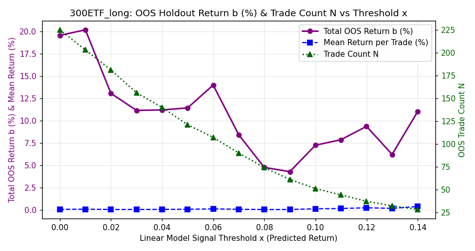<br>


<br>


<br>


<br>


<br>


</details>

### 300ETF_short

- **Selected Model**: SKGLM_MCP
- **Tuned Stability Threshold**: 0.17
- **Samples**: 2722 (2015-04-07 → 2026-06-17)
- **Holdout**: 544 days (2024-03-19 → 2026-06-17)
- **Target stats**: mean=0.0125%, std=0.9550%, Sharpe=0.21
- **Selected features (92)**: `bb_width, volume_dryup_ratio, gap_pct, inside_bar_failure_bull, northbound_net, yesterday_day_late_mom, barbed_wire_intensity, yesterday_early_vwap_dev, bar_rng_2, intraday_bearish_fvg, yesterday_am_return, early_doji_count, vwap_touch_count, adx_opening, first_bar_return, early_bearish_shooting_star, yesterday_opening_gap_reversal, early_bullish_hammer, bar_ret_0, early_bearish_engulfing_count, early_bullish_engulfing_count, intraday_bullish_fvg, yesterday_early_skew, momentum_divergence, cci14, yesterday_first_bar_return, yesterday_early_range, yesterday_early_kurtosis, yearly_low_distance, margin_repayment, opening_range_size, yesterday_intraday_close_position, bar_ret_3, rally_strength_max, volume_weighted_price_position, vol60, range_expansion_ratio, northbound_sell, roc10, inside_bar_failure_bear, gap_fill_ratio, vwap_deviation_decision_bar, iv_diff_1d, bar_rng_0, yesterday_gap_pct, twenty_gap_bars_regime, bar_ret_2, early_kurtosis, first_bar_sentiment, upper_wick_dominance, volume_surge_max, yesterday_day_skew, bar_rng_1, vol_pk20, capital_net_value, volume_climax_exhaustion, early_skew, measured_move_proximity, yesterday_early_realized_vol, trend_exhaustion_early, yesterday_day_pm_am_vol_ratio, margin_balance, volume_surge_direction, early_trend_hhi, macd_hist, yesterday_early_volume_ratio, margin_net_buy, consecutive_lower_lows, consecutive_bearish_engulfing, body_to_range_ratio, decision_bar_reversal_signal, spike_exhaustion_ratio, yesterday_close_position, yesterday_day_realized_vol, vix_iv_spread, vol_ratio_5_20, first_bar_volume, close_vs_open_range, yesterday_gap, lower_shadow_rejection, body_size_trend, yesterday_spike_exhaustion_ratio, bar_rng_3, bar_vol_0, opening_gap_reversal, trend_adherence, yesterday_day_kurtosis, yesterday_early_momentum, or_fill_ratio, consolidation_bars_count, volume_concentration, vwap_deviation_max`

#### Selected Feature Stability Scores (Block Bootstrap)

<details>
<summary><b>Click to expand Feature Stability Scores Table</b></summary>

| Feature | Stability Score | Status | Pearson $r$ | Spearman $\rho$ | Monotonicity Score | Mutual Info | Quality Rating | Holdout IC | Yearly ICs | Yearly IC Std |
|---------|-----------------|--------|-------------|-----------------|--------------------|-------------|----------------|------------|------------|---------------|
| bb_width | 71.6% | **Selected** | -0.0155 | -0.0173 | -0.90 | 0.0284 | *** Strong Monotonic | +0.0110 | 15:-0.02 16:+0.08 17:+0.02 18:-0.07 19:+0.03 20:+0.02 21:+0.02 22:-0.16 23:-0.12 24:-0.06 25:+0.03 26:-0.02 | 0.0671 |
| volume_dryup_ratio | 63.2% | **Selected** | +0.0333 | +0.0344 | N/A | 0.0000 | N/A | +0.0059 | 15:+0.08 16:+0.05 17:+0.07 18:-0.01 19:-0.01 20:+0.01 21:+0.04 22:-0.06 23:-0.02 24:+0.03 25:+0.04 | 0.0403 |
| gap_pct | 63.2% | **Selected** | +0.0344 | +0.0234 | +0.90 | 0.0000 | *** Strong Monotonic | +0.0381 | 15:+0.07 16:+0.03 17:-0.15 18:+0.06 19:+0.04 20:+0.01 21:+0.00 22:+0.05 23:-0.01 24:-0.06 25:+0.05 26:+0.12 | 0.0677 |
| inside_bar_failure_bull | 55.2% | **Selected** | -0.0506 | -0.0409 | N/A | 0.0021 | N/A | -0.0058 | 15:-0.16 16:-0.01 17:-0.12 18:+0.01 19:-0.07 20:-0.06 21:-0.01 22:+0.05 23:-0.09 24:-0.03 25:+0.04 26:-0.12 | 0.0645 |
| northbound_net | 53.6% | **Selected** | +0.0381 | +0.0469 | +0.90 | 0.0000 | *** Strong Monotonic | -0.0416 | 15:+0.04 16:+0.01 17:-0.00 18:+0.07 19:+0.14 20:+0.05 21:+0.02 22:+0.06 23:+0.08 24:-0.01 26:+nan | nan |
| yesterday_day_late_mom | 50.4% | **Selected** | +0.0282 | -0.0038 | -0.10 | 0.0046 | * Non-Monotonic / Weak | -0.0514 | 15:+0.04 16:-0.01 17:+0.14 18:-0.02 19:-0.06 20:+0.07 21:-0.04 22:-0.03 23:-0.03 24:-0.05 25:+0.01 26:-0.10 | 0.0616 |
| barbed_wire_intensity | 49.6% | **Selected** | +0.0071 | -0.0035 | N/A | 0.0000 | N/A | +0.0380 | 15:-0.11 18:-0.01 19:-0.12 20:+0.08 23:-0.04 24:+0.05 25:+0.00 26:+0.14 | 0.0845 |
| yesterday_early_vwap_dev | 48.4% | **Selected** | +0.0745 | +0.0406 | +0.60 | 0.0191 | ** Moderate Monotonic | +0.0473 | 15:+0.06 16:-0.02 17:+0.09 18:+0.07 19:+0.01 20:+0.13 21:-0.06 22:+0.03 23:-0.05 24:+0.03 25:+0.05 26:+0.05 | 0.0543 |
| bar_rng_2 | 48.0% | **Selected** | +0.0092 | +0.0017 | +0.20 | 0.0663 | * Non-Monotonic / Weak | -0.0829 | 15:+0.08 16:-0.07 17:+0.01 18:+0.02 19:-0.03 20:+0.01 21:-0.01 22:-0.02 23:+0.11 24:+0.05 25:-0.12 26:-0.10 | 0.0654 |
| intraday_bearish_fvg | 46.0% | **Selected** | -0.0315 | -0.0269 | N/A | 0.0000 | N/A | -0.0789 | 15:-0.05 16:-0.01 17:+0.04 18:-0.07 19:-0.02 20:+0.01 21:-0.01 22:+0.02 23:-0.08 24:-0.07 25:-0.07 26:-0.09 | 0.0437 |
| yesterday_am_return | 44.8% | **Selected** | +0.0594 | +0.0241 | +0.30 | 0.0078 | * Non-Monotonic / Weak | -0.0303 | 15:+0.15 16:+0.02 17:-0.06 18:-0.01 19:+0.05 20:+0.03 21:-0.04 22:+0.07 23:+0.08 24:-0.05 25:+0.00 26:-0.12 | 0.0700 |
| early_doji_count | 43.6% | **Selected** | -0.0153 | -0.0026 | N/A | 0.0000 | N/A | +0.0401 | 15:+0.04 16:-0.10 17:+0.10 18:-0.06 19:+0.01 20:-0.03 21:-0.09 22:+0.11 23:-0.01 24:+0.03 25:+0.03 26:-0.05 | 0.0639 |
| vwap_touch_count | 42.8% | **Selected** | -0.0160 | -0.0091 | -0.50 | 0.0000 | ** Moderate Monotonic | +0.0089 | 15:-0.13 16:+0.04 17:-0.01 18:+0.03 19:-0.09 20:+0.03 21:+0.02 22:+0.09 23:-0.10 24:+0.07 25:-0.03 26:-0.03 | 0.0667 |
| adx_opening | 40.4% | **Selected** | +0.0193 | -0.0061 | N/A | 0.0036 | N/A | +0.0439 | 15:-0.02 16:-0.03 17:-0.02 18:-0.01 19:-0.01 20:-0.06 21:+0.06 22:-0.00 23:+0.06 24:+0.06 25:+0.02 26:+0.09 | 0.0455 |
| first_bar_return | 39.2% | **Selected** | +0.1595 | +0.0934 | +1.00 | 0.0388 | *** Strong Monotonic | +0.0181 | 15:+0.20 16:+0.12 17:+0.05 18:+0.21 19:+0.08 20:+0.02 21:+0.13 22:+0.01 23:+0.12 24:+0.08 25:+0.05 26:-0.11 | 0.0821 |
| early_bearish_shooting_star | 38.8% | **Selected** | -0.0083 | -0.0419 | N/A | 0.0028 | N/A | -0.0328 | 15:+0.03 16:-0.04 17:+0.01 18:-0.09 19:-0.13 20:-0.01 21:-0.17 22:+0.08 23:-0.01 24:-0.04 25:-0.02 26:-0.04 | 0.0653 |
| yesterday_opening_gap_reversal | 38.0% | **Selected** | -0.0034 | -0.0110 | +0.50 | 0.0226 | ** Moderate Monotonic | +0.0213 | 15:+0.01 16:-0.17 17:-0.14 18:+0.01 19:-0.01 20:-0.00 21:+0.07 22:-0.01 23:-0.08 24:-0.01 25:+0.06 26:+0.00 | 0.0695 |
| early_bullish_hammer | 38.0% | **Selected** | -0.0241 | -0.0153 | N/A | 0.0000 | N/A | +0.0340 | 15:-0.08 16:+0.06 17:-0.05 18:+0.07 19:-0.04 20:-0.13 21:-0.04 22:-0.01 23:-0.01 24:-0.02 25:+0.06 26:-0.04 | 0.0578 |
| bar_ret_0 | 37.6% | **Selected** | +0.1595 | +0.0934 | +1.00 | 0.0388 | *** Strong Monotonic | +0.0181 | 15:+0.20 16:+0.12 17:+0.05 18:+0.21 19:+0.08 20:+0.02 21:+0.13 22:+0.01 23:+0.12 24:+0.08 25:+0.05 26:-0.11 | 0.0821 |
| early_bearish_engulfing_count | 37.2% | **Selected** | +0.0460 | +0.0365 | N/A | 0.0000 | N/A | -0.0189 | 15:+0.07 16:-0.01 17:+0.10 18:+0.10 19:+0.12 20:+0.00 21:+0.10 22:-0.10 23:+0.09 24:+0.09 25:-0.10 26:-0.01 | 0.0744 |
| early_bullish_engulfing_count | 35.6% | **Selected** | -0.0122 | +0.0096 | N/A | 0.0080 | N/A | +0.0684 | 15:-0.06 16:-0.08 17:+0.03 18:-0.10 19:+0.07 20:+0.08 21:+0.01 22:-0.02 23:+0.03 24:+0.06 25:+0.03 26:+0.07 | 0.0587 |
| intraday_bullish_fvg | 35.2% | **Selected** | +0.0588 | +0.0444 | N/A | 0.0000 | N/A | +0.0100 | 15:+0.14 16:+0.04 17:+0.06 18:+0.00 19:-0.02 20:+0.04 21:+0.08 22:+0.08 23:-0.00 24:-0.02 25:+0.04 26:-0.01 | 0.0451 |
| yesterday_early_skew | 35.2% | **Selected** | -0.0366 | -0.0329 | -0.80 | 0.0000 | ** Moderate Monotonic | -0.0665 | 15:-0.05 16:+0.01 17:-0.16 18:-0.09 19:+0.10 20:-0.16 21:-0.00 22:+0.01 23:+0.06 24:-0.00 25:-0.07 26:-0.11 | 0.0781 |
| momentum_divergence | 35.2% | **Selected** | -0.0073 | -0.0035 | N/A | 0.0025 | N/A | -0.0336 | 15:+0.01 16:-0.07 17:-0.11 18:-0.04 19:+0.02 20:-0.01 21:+0.09 22:+0.02 23:+0.10 24:-0.01 25:+0.04 26:-0.26 | 0.0922 |
| cci14 | 34.8% | **Selected** | +0.0046 | +0.0118 | +0.00 | 0.0519 | * Non-Monotonic / Weak | -0.0247 | 15:-0.05 16:-0.07 17:+0.00 18:+0.04 19:-0.08 20:+0.02 21:-0.04 22:+0.16 23:+0.05 24:+0.01 25:+0.01 26:-0.07 | 0.0651 |
| yesterday_first_bar_return | 33.6% | **Selected** | -0.0228 | +0.0267 | +0.00 | 0.0000 | * Non-Monotonic / Weak | +0.0649 | 15:+0.03 16:+0.05 17:+0.01 18:-0.12 19:+0.03 20:+0.00 21:-0.06 22:+0.06 23:+0.19 24:+0.02 25:+0.12 26:-0.01 | 0.0756 |
| yesterday_early_range | 33.6% | **Selected** | +0.0278 | +0.0063 | +0.80 | 0.0409 | ** Moderate Monotonic | -0.0142 | 15:+0.13 16:-0.02 17:+0.06 18:+0.05 19:-0.05 20:+0.01 21:-0.09 22:-0.02 23:-0.04 24:+0.01 25:+0.02 26:-0.06 | 0.0579 |
| yesterday_early_kurtosis | 32.4% | **Selected** | -0.0060 | -0.0153 | +0.20 | 0.0000 | * Non-Monotonic / Weak | -0.0239 | 15:-0.02 16:+0.03 17:-0.02 18:+0.04 19:+0.02 20:-0.06 21:+0.05 22:-0.20 23:+0.01 24:-0.04 25:+0.05 26:-0.09 | 0.0691 |
| yearly_low_distance | 30.8% | **Selected** | -0.0146 | +0.0027 | -0.90 | 0.0321 | *** Strong Monotonic | +0.0071 | 16:-0.09 17:-0.06 18:-0.03 19:-0.08 20:-0.01 21:-0.05 22:+0.00 23:-0.06 24:-0.10 25:+0.01 26:-0.02 | 0.0355 |
| margin_repayment | 30.0% | **Selected** | +0.0026 | +0.0011 | +0.00 | 0.0064 | * Non-Monotonic / Weak | -0.0488 | 15:+0.03 16:+0.04 17:+0.05 18:-0.01 19:-0.06 20:-0.15 21:+0.00 22:+0.03 23:-0.01 24:+0.03 25:-0.08 26:-0.00 | 0.0550 |
| opening_range_size | 28.8% | **Selected** | +0.0223 | +0.0312 | +0.70 | 0.0402 | ** Moderate Monotonic | +0.0042 | 15:-0.04 16:+0.09 17:+0.05 18:+0.06 19:-0.08 20:+0.07 21:+0.00 22:+0.03 23:-0.02 24:+0.11 25:-0.04 26:+0.07 | 0.0574 |
| yesterday_intraday_close_position | 28.8% | **Selected** | +0.0303 | +0.0536 | +0.70 | 0.0205 | ** Moderate Monotonic | +0.0387 | 15:+0.08 16:-0.03 17:+0.07 18:+0.12 19:+0.04 20:+0.17 21:-0.11 22:+0.04 23:+0.09 24:+0.02 25:+0.06 26:+0.02 | 0.0693 |
| bar_ret_3 | 28.8% | **Selected** | +0.0013 | -0.0025 | +0.00 | 0.0069 | * Non-Monotonic / Weak | -0.0231 | 15:+0.06 16:+0.08 17:-0.08 18:-0.12 19:-0.04 20:-0.01 21:+0.05 22:+0.11 23:+0.03 24:-0.08 25:+0.05 26:-0.11 | 0.0756 |
| rally_strength_max | 28.4% | **Selected** | +0.0502 | +0.0573 | +0.90 | 0.0000 | *** Strong Monotonic | -0.0146 | 15:+0.13 16:-0.01 17:-0.06 18:+0.08 19:+0.10 20:-0.04 21:+0.16 22:+0.07 23:+0.17 24:+0.04 25:+0.09 26:-0.26 | 0.1153 |
| volume_weighted_price_position | 27.2% | **Selected** | +0.0850 | +0.0827 | +1.00 | 0.0208 | *** Strong Monotonic | +0.0089 | 15:+0.12 16:+0.08 17:+0.04 18:+0.19 19:+0.11 20:-0.06 21:+0.13 22:+0.07 23:+0.16 24:+0.05 25:+0.09 26:-0.17 | 0.0947 |
| vol60 | 27.2% | **Selected** | +0.0184 | +0.0099 | +0.20 | 0.0297 | * Non-Monotonic / Weak | -0.0012 | 15:+0.03 16:-0.02 17:-0.03 18:-0.03 19:-0.06 20:-0.11 21:+0.01 22:+0.16 23:-0.02 24:+0.06 25:-0.06 26:-0.02 | 0.0644 |
| range_expansion_ratio | 26.8% | **Selected** | -0.0074 | +0.0005 | +0.00 | 0.0078 | * Non-Monotonic / Weak | -0.1085 | 15:+0.20 16:-0.02 17:-0.00 18:+0.02 19:+0.09 20:-0.06 21:-0.05 22:-0.01 23:+0.10 24:-0.16 25:-0.09 26:-0.09 | 0.0941 |
| northbound_sell | 26.8% | **Selected** | -0.0252 | -0.0459 | -0.90 | 0.0349 | ** Non-Linear Monotonic | -0.0340 | 15:-0.03 16:-0.05 17:+0.03 18:-0.06 19:-0.12 20:-0.05 21:-0.02 22:-0.08 23:-0.05 24:+0.09 25:+nan 26:+nan | nan |
| roc10 | 26.0% | **Selected** | -0.0675 | -0.0325 | -0.50 | 0.0236 | * Non-Monotonic / Weak | -0.0431 | 15:-0.09 16:-0.12 17:-0.09 18:-0.00 19:-0.07 20:-0.02 21:-0.14 22:+0.05 23:+0.02 24:-0.06 25:+0.01 26:-0.12 | 0.0600 |
| inside_bar_failure_bear | 25.2% | **Selected** | +0.0272 | +0.0257 | N/A | 0.0000 | N/A | +0.0561 | 15:+0.04 16:+0.07 17:+0.07 18:+0.07 19:-0.02 20:+0.03 21:-0.06 22:+0.05 23:-0.03 24:+0.02 25:-0.02 26:+0.20 | 0.0636 |
| gap_fill_ratio | 25.2% | **Selected** | -0.0146 | -0.0020 | N/A | 0.0000 | N/A | -0.0133 | 15:-0.06 16:-0.01 17:+0.09 18:-0.05 19:+0.04 20:+0.00 21:-0.13 22:+0.04 23:+0.02 24:+0.04 25:-0.06 26:-0.08 | 0.0620 |
| vwap_deviation_decision_bar | 24.8% | **Selected** | -0.0039 | +0.0081 | +0.40 | 0.0000 | * Non-Monotonic / Weak | -0.0225 | 15:+0.05 16:+0.02 17:-0.11 18:-0.01 19:-0.04 20:-0.02 21:+0.10 22:+0.05 23:+0.07 24:-0.04 25:+0.05 26:-0.18 | 0.0783 |
| iv_diff_1d | 24.8% | **Selected** | -0.0231 | -0.0179 | -0.80 | 0.0083 | ** Moderate Monotonic | +0.0402 | 19:+0.01 20:-0.07 21:-0.07 22:-0.05 23:-0.05 24:+0.00 25:+0.05 26:+0.04 | 0.0462 |
| bar_rng_0 | 24.4% | **Selected** | +0.0222 | +0.0309 | +0.70 | 0.0477 | ** Moderate Monotonic | +0.0035 | 15:-0.04 16:+0.09 17:+0.05 18:+0.06 19:-0.08 20:+0.08 21:+0.01 22:+0.02 23:-0.02 24:+0.11 25:-0.04 26:+0.07 | 0.0573 |
| yesterday_gap_pct | 24.4% | **Selected** | -0.0003 | +0.0194 | +0.60 | 0.0000 | ** Moderate Monotonic | +0.0296 | 15:+0.06 16:-0.08 17:-0.05 18:-0.06 19:+0.05 20:+0.02 21:+0.11 22:+0.05 23:+0.01 24:+0.02 25:+0.07 26:-0.02 | 0.0536 |
| twenty_gap_bars_regime | 24.0% | **Selected** | -0.0466 | -0.0436 | -0.90 | 0.0033 | *** Strong Monotonic | -0.0441 | 15:-0.10 16:-0.12 17:-0.01 18:-0.08 19:-0.11 20:-0.06 21:-0.11 22:+0.03 23:-0.07 24:-0.02 25:-0.01 26:-0.18 | 0.0551 |
| bar_ret_2 | 24.0% | **Selected** | -0.0230 | -0.0021 | -0.30 | 0.0211 | * Non-Monotonic / Weak | -0.0451 | 15:-0.03 16:-0.14 17:-0.07 18:+0.02 19:+0.05 20:+0.04 21:+0.05 22:-0.00 23:+0.05 24:-0.04 25:+0.04 26:-0.21 | 0.0817 |
| early_kurtosis | 23.6% | **Selected** | -0.0019 | -0.0038 | +0.30 | 0.0000 | * Non-Monotonic / Weak | +0.0023 | 15:+0.10 16:-0.06 17:-0.09 18:+0.01 19:-0.15 20:+0.10 21:-0.10 22:-0.02 23:+0.07 24:+0.10 25:-0.06 26:+0.03 | 0.0838 |
| first_bar_sentiment | 23.6% | **Selected** | +0.0921 | +0.0807 | N/A | 0.0177 | N/A | +0.0058 | 15:+0.17 16:+0.12 17:-0.03 18:+0.17 19:+0.11 20:+0.01 21:+0.12 22:+0.03 23:+0.12 24:-0.00 25:+0.07 26:-0.11 | 0.0837 |
| upper_wick_dominance | 23.6% | **Selected** | -0.0113 | +0.0101 | +0.60 | 0.0000 | ** Moderate Monotonic | +0.0619 | 15:+0.02 16:-0.01 17:+0.04 18:+0.08 19:-0.05 20:+0.03 21:-0.07 22:-0.04 23:+0.02 24:+0.08 25:+0.05 26:+0.00 | 0.0479 |
| volume_surge_max | 23.2% | **Selected** | -0.0068 | -0.0251 | -0.50 | 0.0116 | * Non-Monotonic / Weak | -0.0183 | 15:-0.00 16:-0.02 17:-0.10 18:-0.02 19:-0.01 20:+0.07 21:-0.13 22:-0.02 23:-0.01 24:+0.01 25:-0.06 26:-0.04 | 0.0501 |
| yesterday_day_skew | 23.2% | **Selected** | +0.0063 | +0.0089 | +0.70 | 0.0042 | ** Moderate Monotonic | +0.0367 | 15:+0.12 16:-0.02 17:-0.02 18:+0.00 19:+0.06 20:+0.04 21:-0.03 22:-0.01 23:-0.02 24:+0.06 25:-0.03 26:+0.13 | 0.0549 |
| bar_rng_1 | 23.2% | **Selected** | -0.0022 | +0.0162 | +0.00 | 0.0405 | * Non-Monotonic / Weak | +0.0123 | 15:-0.03 16:+0.02 17:+0.05 18:-0.02 19:+0.05 20:+0.00 21:+0.03 22:-0.11 23:+0.12 24:+0.04 25:-0.01 26:+0.06 | 0.0544 |
| vol_pk20 | 22.4% | **Selected** | +0.0248 | +0.0141 | +0.40 | 0.0394 | * Non-Monotonic / Weak | +0.0050 | 15:+0.00 16:-0.01 17:+0.02 18:+0.02 19:-0.07 20:-0.08 21:+0.02 22:+0.15 23:+0.01 24:+0.07 25:+0.01 26:+0.08 | 0.0603 |
| capital_net_value | 22.4% | **Selected** | -0.0252 | -0.0462 | -0.60 | 0.0142 | ** Moderate Monotonic | -0.0077 | 15:+nan 16:+nan 17:-0.04 18:+0.04 19:-0.17 20:-0.10 21:-0.08 22:-0.07 23:+0.03 24:-0.06 25:-0.00 26:+0.02 | nan |
| volume_climax_exhaustion | 22.0% | **Selected** | -0.0138 | -0.0068 | -0.70 | 0.0190 | ** Moderate Monotonic | -0.0070 | 15:-0.11 16:-0.16 17:-0.05 18:+0.04 19:+0.06 20:+0.00 21:-0.08 22:+0.06 23:+0.12 24:+0.03 25:-0.02 26:-0.10 | 0.0803 |
| early_skew | 22.0% | **Selected** | +0.0386 | +0.0356 | +0.70 | 0.0035 | ** Moderate Monotonic | +0.0137 | 15:+0.11 16:+0.05 17:+0.08 18:-0.02 19:+0.04 20:+0.07 21:-0.03 22:+0.10 23:-0.00 24:+0.01 25:-0.00 26:+0.08 | 0.0469 |
| measured_move_proximity | 22.0% | **Selected** | -0.0083 | +0.0133 | N/A | 0.0114 | N/A | -0.0214 | 15:-0.13 16:+0.00 17:-0.06 18:+0.18 19:+0.03 20:+0.06 21:+0.04 22:-0.02 23:+0.00 24:-0.01 25:-0.07 26:+0.00 | 0.0727 |
| yesterday_early_realized_vol | 22.0% | **Selected** | +0.0256 | +0.0150 | +0.30 | 0.0216 | * Non-Monotonic / Weak | +0.0239 | 15:+0.13 16:+0.09 17:-0.06 18:+0.05 19:-0.05 20:-0.05 21:+0.01 22:-0.07 23:-0.13 24:+0.09 25:+0.00 26:+0.01 | 0.0742 |
| trend_exhaustion_early | 22.0% | **Selected** | -0.0050 | -0.0003 | -0.80 | 0.0179 | ** Moderate Monotonic | +0.0827 | 15:-0.07 16:+0.04 17:+0.10 18:-0.08 19:-0.05 20:-0.09 21:+0.12 22:-0.06 23:-0.09 24:+0.09 25:+0.10 26:+0.05 | 0.0819 |
| yesterday_day_pm_am_vol_ratio | 21.6% | **Selected** | +0.0123 | +0.0004 | +0.10 | 0.0097 | * Non-Monotonic / Weak | -0.0139 | 15:+0.02 16:+0.14 17:+0.03 18:+0.07 19:-0.16 20:-0.09 21:-0.02 22:-0.04 23:+0.01 24:+0.04 25:-0.07 26:+0.02 | 0.0762 |
| margin_balance | 21.2% | **Selected** | +0.0092 | +0.0299 | +0.30 | 0.0256 | * Non-Monotonic / Weak | -0.0089 | 15:-0.03 16:-0.02 17:-0.06 18:+0.04 19:+0.04 20:-0.01 21:+0.07 22:+0.01 23:+0.05 24:+0.08 25:-0.07 26:+0.08 | 0.0524 |
| volume_surge_direction | 21.2% | **Selected** | +0.1175 | +0.0760 | +0.90 | 0.0067 | *** Strong Monotonic | +0.0329 | 15:+0.19 16:+0.08 17:-0.05 18:+0.18 19:+0.12 20:+0.06 21:+0.08 22:+0.04 23:+0.14 24:+0.04 25:+0.09 26:-0.11 | 0.0832 |
| early_trend_hhi | 21.2% | **Selected** | -0.0014 | -0.0098 | N/A | 0.0000 | N/A | -0.0503 | 15:+0.05 16:+0.04 17:-0.07 18:+0.03 19:-0.10 20:+0.11 21:-0.16 22:-0.01 23:+0.06 24:+0.03 25:-0.12 26:-0.04 | 0.0784 |
| macd_hist | 20.8% | **Selected** | -0.0415 | -0.0287 | -0.10 | 0.0149 | * Non-Monotonic / Weak | -0.0547 | 15:-0.03 16:-0.05 17:-0.10 18:-0.03 19:-0.07 20:+0.00 21:-0.14 22:+0.02 23:-0.01 24:-0.05 25:-0.01 26:-0.15 | 0.0536 |
| yesterday_early_volume_ratio | 20.8% | **Selected** | -0.0007 | -0.0093 | +0.10 | 0.0000 | * Non-Monotonic / Weak | +0.0008 | 15:+0.01 16:-0.12 17:+0.03 18:+0.06 19:+0.07 20:+0.04 21:-0.09 22:+0.00 23:-0.08 24:-0.02 25:+0.05 26:-0.03 | 0.0611 |
| margin_net_buy | 20.8% | **Selected** | -0.0280 | -0.0063 | +0.00 | 0.0000 | * Non-Monotonic / Weak | -0.0131 | 15:-0.01 16:-0.03 17:-0.06 18:+0.08 19:+0.06 20:+0.08 21:+0.04 22:-0.04 23:-0.03 24:-0.13 25:+0.01 26:+0.11 | 0.0674 |
| consecutive_lower_lows | 20.4% | **Selected** | -0.0431 | -0.0362 | -0.50 | 0.0000 | ** Moderate Monotonic | -0.0087 | 15:-0.01 16:-0.00 17:+0.06 18:-0.11 19:+0.01 20:+0.00 21:-0.13 22:-0.06 23:-0.04 24:-0.06 25:-0.04 26:+0.08 | 0.0595 |
| consecutive_bearish_engulfing | 20.4% | **Selected** | -0.0019 | -0.0094 | N/A | 0.0120 | N/A | -0.0644 | 15:+0.06 16:-0.04 17:+0.10 18:+0.02 19:+0.04 20:+0.01 21:-0.07 22:-0.08 23:-0.00 24:+0.00 25:-0.14 26:+0.04 | 0.0649 |
| body_to_range_ratio | 20.4% | **Selected** | +0.0057 | +0.0066 | +0.10 | 0.0000 | * Non-Monotonic / Weak | -0.0694 | 15:-0.00 16:+0.11 17:-0.08 18:+0.05 19:+0.01 20:+0.07 21:-0.09 22:+0.09 23:+0.08 24:-0.02 25:-0.11 26:-0.09 | 0.0761 |
| decision_bar_reversal_signal | 20.4% | **Selected** | -0.0083 | -0.0139 | N/A | 0.0002 | N/A | -0.0074 | 15:+0.02 16:+0.10 17:+0.02 18:-0.12 19:-0.04 20:+0.01 21:-0.07 22:+0.01 23:-0.03 24:+0.04 25:-0.03 26:+0.07 | 0.0589 |
| spike_exhaustion_ratio | 20.0% | **Selected** | -0.0067 | +0.0027 | +0.30 | 0.0020 | * Non-Monotonic / Weak | +0.0489 | 15:-0.00 16:+0.10 17:+0.05 18:-0.04 19:-0.05 20:-0.03 21:-0.04 22:-0.01 23:+0.03 24:-0.02 25:+0.04 26:+0.12 | 0.0529 |
| yesterday_close_position | 20.0% | **Selected** | -0.0312 | -0.0379 | -0.90 | 0.0251 | *** Strong Monotonic | -0.0594 | 15:+0.01 16:-0.15 17:+0.01 18:-0.06 19:-0.12 20:-0.01 21:-0.00 22:-0.04 23:-0.01 24:-0.00 25:-0.06 26:-0.11 | 0.0514 |
| yesterday_day_realized_vol | 20.0% | **Selected** | +0.0130 | +0.0183 | +0.50 | 0.0768 | * Non-Monotonic / Weak | -0.0286 | 15:+0.08 16:-0.02 17:+0.11 18:-0.05 19:-0.01 20:-0.02 21:+0.07 22:+0.03 23:-0.06 24:+0.09 25:-0.02 26:-0.14 | 0.0709 |
| vix_iv_spread | 19.6% | **Selected** | +0.0440 | +0.0576 | +0.80 | 0.0187 | ** Moderate Monotonic | +0.0185 | 19:-0.08 20:+0.11 21:+0.01 22:+0.06 23:+0.07 24:+0.16 25:+0.04 26:-0.17 | 0.0984 |
| vol_ratio_5_20 | 19.6% | **Selected** | -0.0107 | -0.0304 | -0.60 | 0.0000 | ** Moderate Monotonic | -0.0260 | 15:+0.09 16:-0.11 17:-0.02 18:-0.11 19:+0.03 20:-0.07 21:-0.00 22:+0.03 23:-0.11 24:-0.16 25:+0.06 26:+0.15 | 0.0911 |
| first_bar_volume | 19.6% | **Selected** | -0.0066 | -0.0258 | -0.50 | 0.0175 | * Non-Monotonic / Weak | -0.0183 | 15:-0.00 16:-0.03 17:-0.11 18:-0.02 19:-0.01 20:+0.07 21:-0.13 22:-0.02 23:-0.01 24:+0.01 25:-0.06 26:-0.04 | 0.0503 |
| close_vs_open_range | 19.2% | **Selected** | +0.0831 | +0.0591 | +1.00 | 0.0015 | *** Strong Monotonic | -0.0026 | 15:+0.15 16:+0.07 17:-0.04 18:+0.10 19:+0.01 20:+0.01 21:+0.15 22:+0.04 23:+0.13 24:+0.03 25:+0.08 26:-0.21 | 0.0950 |
| yesterday_gap | 19.2% | **Selected** | -0.0008 | +0.0188 | +0.70 | 0.0000 | ** Moderate Monotonic | +0.0296 | 15:+0.06 16:-0.08 17:-0.05 18:-0.06 19:+0.05 20:+0.01 21:+0.11 22:+0.05 23:+0.01 24:+0.02 25:+0.07 26:-0.02 | 0.0536 |
| lower_shadow_rejection | 19.2% | **Selected** | -0.0180 | -0.0109 | -0.70 | 0.0041 | ** Moderate Monotonic | -0.0503 | 15:-0.04 16:+0.01 17:+0.03 18:-0.07 19:-0.01 20:-0.04 21:+0.05 22:+0.11 23:-0.05 24:-0.04 25:-0.03 26:-0.15 | 0.0609 |
| body_size_trend | 18.8% | **Selected** | -0.0267 | -0.0077 | -0.30 | 0.0000 | * Non-Monotonic / Weak | -0.0766 | 15:+0.05 16:-0.08 17:-0.01 18:+0.04 19:+0.10 20:-0.05 21:-0.01 22:+0.04 23:-0.03 24:-0.04 25:-0.05 26:-0.19 | 0.0720 |
| yesterday_spike_exhaustion_ratio | 18.4% | **Selected** | +0.0041 | -0.0047 | -0.20 | 0.0003 | * Non-Monotonic / Weak | +0.0419 | 15:+0.01 16:+0.03 17:-0.03 18:+0.01 19:-0.04 20:+0.05 21:+0.10 22:-0.11 23:-0.11 24:+0.01 25:+0.08 26:-0.02 | 0.0630 |
| bar_rng_3 | 18.4% | **Selected** | +0.0018 | +0.0070 | +0.30 | 0.0414 | * Non-Monotonic / Weak | -0.0704 | 15:-0.00 16:+0.02 17:+0.05 18:+0.07 19:+0.06 20:+0.05 21:-0.05 22:+0.08 23:-0.07 24:+0.04 25:-0.11 26:-0.15 | 0.0728 |
| bar_vol_0 | 18.0% | **Selected** | -0.0066 | -0.0258 | -0.50 | 0.0175 | * Non-Monotonic / Weak | -0.0183 | 15:-0.00 16:-0.03 17:-0.11 18:-0.02 19:-0.01 20:+0.07 21:-0.13 22:-0.02 23:-0.01 24:+0.01 25:-0.06 26:-0.04 | 0.0503 |
| opening_gap_reversal | 18.0% | **Selected** | -0.0588 | -0.0066 | -1.00 | 0.0000 | *** Strong Monotonic | +0.0330 | 15:+0.02 16:+0.01 17:-0.14 18:-0.01 19:+0.00 20:-0.02 21:-0.06 22:+0.05 23:-0.04 24:-0.09 25:+0.01 26:+0.13 | 0.0660 |
| trend_adherence | 18.0% | **Selected** | -0.0081 | -0.0177 | +0.50 | 0.0205 | ** Moderate Monotonic | -0.0877 | 15:+0.04 16:-0.01 17:-0.04 18:+0.03 19:-0.11 20:+0.06 21:-0.07 22:+0.04 23:+0.02 24:-0.13 25:-0.07 26:-0.02 | 0.0592 |
| yesterday_day_kurtosis | 18.0% | **Selected** | -0.0159 | -0.0416 | -0.60 | 0.0117 | ** Moderate Monotonic | -0.0871 | 15:+0.05 16:+0.04 17:+0.02 18:-0.06 19:-0.03 20:+0.03 21:-0.11 22:-0.06 23:-0.13 24:-0.09 25:-0.13 26:-0.07 | 0.0628 |
| yesterday_early_momentum | 18.0% | **Selected** | +0.0602 | +0.0376 | +0.90 | 0.0376 | *** Strong Monotonic | +0.0274 | 15:+0.05 16:-0.02 17:+0.07 18:+0.11 19:+0.01 20:+0.18 21:-0.10 22:+0.03 23:-0.01 24:+0.01 25:+0.05 26:-0.01 | 0.0675 |
| or_fill_ratio | 17.6% | **Selected** | +0.0613 | +0.0408 | +0.60 | 0.0000 | ** Moderate Monotonic | -0.0170 | 15:+0.10 16:+0.06 17:-0.04 18:+0.06 19:+0.00 20:-0.01 21:+0.12 22:+0.06 23:+0.11 24:+0.01 25:+0.06 26:-0.21 | 0.0861 |
| consolidation_bars_count | 17.6% | **Selected** | -0.0251 | -0.0269 | N/A | 0.0000 | N/A | +0.0151 | 15:-0.08 16:-0.02 17:-0.06 18:-0.04 19:-0.08 20:-0.01 21:-0.06 22:+0.08 23:-0.09 24:+0.03 25:-0.05 26:+0.10 | 0.0611 |
| volume_concentration | 17.6% | **Selected** | -0.0306 | -0.0310 | -0.70 | 0.0000 | ** Moderate Monotonic | -0.0346 | 15:+0.01 16:+0.10 17:-0.03 18:-0.09 19:+0.00 20:-0.02 21:-0.13 22:-0.07 23:-0.05 24:-0.01 25:-0.03 26:-0.02 | 0.0540 |
| vwap_deviation_max | 17.2% | **Selected** | +0.0002 | +0.0059 | +0.10 | 0.0000 | * Non-Monotonic / Weak | -0.0273 | 15:+0.09 16:-0.08 17:-0.07 18:+0.05 19:+0.07 20:+0.01 21:+0.05 22:-0.04 23:+0.03 24:+0.06 25:-0.07 26:-0.13 | 0.0680 |

</details>

#### Metrics

| Metric | Best Linear | Ridge Base | Zero | Yesterday PM | First 30min Mom |
|--------|-------------|------------|------|--------------|-----------------|
| IC | +0.0521 | +0.1183 | +0.0000 | -0.0638 | -0.0160 |
| Dir Acc | 0.528 | 0.531 | 0.500 | 0.458 | 0.493 |
| RMSE | 0.8241% | 0.8415% | 0.8010% | 1.1427% | 0.8685% |
| L/S Sharpe | +0.88 | +1.96 | — | — | — |

#### Best Hyperparameters

<details>
<summary><b>Click to expand Best Hyperparameters JSON</b></summary>

```json
{
  "model_type": "skglm_mcp",
  "top_k_features": 92,
  "skglm_mcp_alpha": 0.0001486698311139974,
  "skglm_mcp_gamma": 10.518383064939837,
  "stability_threshold": 0.172
}
```

</details>

#### Walk-Forward Fold ICs

| Fold | IS IC | OOS IC |
|------|-------|--------|
| 1 | 0.4425 | +0.0263 |
| 2 | 0.3095 | +0.1195 |
| 3 | 0.2928 | +0.0652 |
| 4 | 0.2547 | +0.0476 |
| 5 | 0.2233 | +0.0478 |
| **Overall** | — | +0.0620 |

#### Year-by-Year OOS IC

| Year | IC | Dir Acc | N | L/S Sharpe |
|------|-----|---------|---|-----------|
| 2017 | -0.0160 | 0.423 | 215 | +1.12 |
| 2018 | +0.0727 | 0.510 | 243 | +2.83 |
| 2019 | +0.1469 | 0.512 | 244 | +4.83 |
| 2020 | +0.0841 | 0.502 | 243 | +2.40 |
| 2021 | +0.0656 | 0.486 | 243 | +2.15 |
| 2022 | +0.0118 | 0.529 | 242 | +1.20 |
| 2023 | +0.0710 | 0.525 | 242 | +1.62 |
| 2024 | +0.0425 | 0.541 | 242 | +2.00 |
| 2025 | +0.0298 | 0.502 | 243 | +1.67 |
| 2026 | +0.0751 | 0.556 | 108 | +0.63 |

#### Diagnostic Plots

<details>
<summary><b>Click to expand Diagnostic Plots</b></summary>

<br>


<br>


<br>


<br>


<br>


<br>


<br>


<br>


</details>

### 50ETF_long

- **Selected Model**: SKGLM_HUBER_L1
- **Tuned Stability Threshold**: 0.28
- **Samples**: 2722 (2015-04-07 → 2026-06-17)
- **Holdout**: 544 days (2024-03-19 → 2026-06-17)
- **Target stats**: mean=-0.0019%, std=0.9480%, Sharpe=-0.03
- **Selected features (35)**: `yesterday_body_ratio, yesterday_early_range, margin_net_buy, decision_bar_body, intraday_bullish_fvg, bar_rng_2, trend_bar_dominance, sma200_dist, yesterday_early_realized_vol, trend_exhaustion_early, vix_diff_1d, sma100_dist, bar_rng_1, bar_vwap_dev_0, vix_iv_spread, roc10, momentum_divergence, upper_wick_dominance, bar_rng_0, decision_bar_reversal_signal, opening_range_size, yesterday_day_late_mom, gap_pct, volume_sma_ratio_long, macd_hist, early_realized_vol, bar_vwap_dev_1, opening_gap_reversal, inside_bar_failure_bull, volume_surge_direction, yesterday_day_pm_am_vol_ratio, bar_ret_1, vwap_touch_count, yesterday_early_skew, yesterday_gap_pct`

#### Selected Feature Stability Scores (Block Bootstrap)

<details>
<summary><b>Click to expand Feature Stability Scores Table</b></summary>

| Feature | Stability Score | Status | Pearson $r$ | Spearman $\rho$ | Monotonicity Score | Mutual Info | Quality Rating | Holdout IC | Yearly ICs | Yearly IC Std |
|---------|-----------------|--------|-------------|-----------------|--------------------|-------------|----------------|------------|------------|---------------|
| yesterday_body_ratio | 94.0% | **Selected** | -0.0635 | -0.0554 | -0.80 | 0.0069 | ** Moderate Monotonic | -0.0322 | 15:-0.09 16:-0.14 17:-0.03 18:-0.03 19:+0.03 20:-0.08 21:-0.16 22:+0.00 23:-0.04 24:-0.04 25:-0.02 26:-0.04 | 0.0526 |
| yesterday_early_range | 84.4% | **Selected** | +0.0691 | -0.0258 | -0.20 | 0.0235 | * Non-Monotonic / Weak | -0.0498 | 15:+0.08 16:-0.02 17:+0.05 18:-0.01 19:-0.08 20:+0.03 21:-0.08 22:-0.00 23:-0.05 24:-0.02 25:-0.09 26:+0.06 | 0.0559 |
| margin_net_buy | 82.0% | **Selected** | -0.1262 | -0.0654 | -0.90 | 0.0000 | *** Strong Monotonic | -0.0343 | 15:-0.11 16:+0.05 17:+0.00 18:-0.08 19:-0.07 20:-0.08 21:-0.10 22:-0.07 23:-0.06 24:-0.18 25:+0.07 26:+0.07 | 0.0742 |
| decision_bar_body | 66.0% | **Selected** | +0.0383 | +0.0368 | +0.90 | 0.0288 | *** Strong Monotonic | -0.0202 | 15:+0.16 16:+0.06 17:+0.02 18:+0.11 19:-0.00 20:+0.01 21:+0.01 22:+0.05 23:+0.06 24:-0.09 25:+0.05 26:+0.02 | 0.0575 |
| intraday_bullish_fvg | 64.4% | **Selected** | +0.0392 | +0.0128 | N/A | 0.0000 | N/A | +0.0196 | 15:+0.04 16:+0.08 17:-0.08 18:+0.11 19:-0.18 20:-0.12 21:+0.11 22:-0.01 23:+0.05 24:-0.04 25:+0.06 26:+0.05 | 0.0883 |
| bar_rng_2 | 63.6% | **Selected** | -0.0089 | +0.0060 | +0.50 | 0.0221 | * Non-Monotonic / Weak | -0.0552 | 15:+0.07 16:-0.08 17:+0.02 18:+0.03 19:-0.01 20:-0.00 21:+0.04 22:+0.03 23:+0.11 24:-0.05 25:-0.07 26:+0.08 | 0.0575 |
| trend_bar_dominance | 61.2% | **Selected** | +0.0379 | +0.0244 | +0.50 | 0.0000 | ** Moderate Monotonic | +0.0361 | 15:+0.08 16:+0.00 17:-0.01 18:+0.05 19:+0.08 20:+0.09 21:+0.02 22:-0.07 23:+0.05 24:+0.01 25:-0.08 26:+0.19 | 0.0702 |
| sma200_dist | 58.8% | **Selected** | -0.0567 | -0.0335 | -0.70 | 0.0023 | ** Moderate Monotonic | -0.0475 | 15:-0.05 16:-0.01 17:-0.08 18:-0.08 19:-0.25 20:-0.10 21:-0.10 22:-0.06 23:-0.13 24:-0.11 25:-0.15 26:-0.07 | 0.0568 |
| yesterday_early_realized_vol | 55.6% | **Selected** | +0.0306 | -0.0039 | +0.50 | 0.0055 | * Non-Monotonic / Weak | +0.0023 | 15:+0.01 16:+0.02 17:+0.04 18:+0.05 19:-0.11 20:+0.01 21:+0.08 22:-0.03 23:-0.08 24:-0.01 25:+0.02 26:+0.05 | 0.0522 |
| trend_exhaustion_early | 49.6% | **Selected** | -0.0333 | -0.0302 | -0.80 | 0.0054 | ** Moderate Monotonic | +0.0356 | 15:-0.02 16:-0.05 17:-0.08 18:-0.02 19:-0.06 20:+0.01 21:-0.04 22:-0.10 23:-0.07 24:+0.07 25:+0.01 26:+0.01 | 0.0459 |
| vix_diff_1d | 48.0% | **Selected** | +0.0383 | -0.0402 | -0.60 | 0.0320 | ** Moderate Monotonic | -0.0495 | 15:+0.17 16:-0.16 17:-0.02 18:-0.09 19:-0.15 20:-0.03 21:-0.02 22:-0.09 23:-0.02 24:-0.01 25:-0.05 26:-0.07 | 0.0794 |
| sma100_dist | 44.8% | **Selected** | -0.0831 | -0.0496 | -0.70 | 0.0046 | ** Moderate Monotonic | -0.0418 | 15:-0.13 16:-0.06 17:-0.07 18:-0.05 19:-0.23 20:-0.09 21:-0.11 22:-0.06 23:-0.13 24:-0.08 25:-0.12 26:-0.10 | 0.0463 |
| bar_rng_1 | 44.4% | **Selected** | +0.0038 | -0.0298 | -0.60 | 0.0223 | ** Moderate Monotonic | -0.0595 | 15:-0.04 16:-0.09 17:+0.01 18:+0.02 19:+0.03 20:-0.07 21:-0.07 22:-0.08 23:+0.11 24:-0.04 25:-0.10 26:+0.02 | 0.0589 |
| bar_vwap_dev_0 | 42.4% | **Selected** | +0.0311 | +0.0409 | N/A | 0.0000 | N/A | N/A | N/A | N/A |
| vix_iv_spread | 41.6% | **Selected** | +0.0448 | +0.0625 | +0.80 | 0.0123 | ** Moderate Monotonic | +0.0274 | 15:+0.08 16:+0.08 17:+0.04 18:+0.02 19:+0.02 20:+0.13 21:+0.01 22:+0.04 23:+0.06 24:+0.11 25:+0.07 26:-0.11 | 0.0585 |
| roc10 | 40.8% | **Selected** | -0.0791 | -0.0420 | -0.10 | 0.0262 | * Non-Monotonic / Weak | -0.0668 | 15:-0.07 16:-0.07 17:-0.09 18:-0.04 19:-0.11 20:-0.06 21:-0.10 22:+0.05 23:-0.01 24:-0.09 25:-0.06 26:-0.09 | 0.0428 |
| momentum_divergence | 40.0% | **Selected** | -0.0068 | +0.0055 | N/A | 0.0000 | N/A | -0.0180 | 15:-0.05 16:-0.00 17:+0.03 18:+0.03 19:+0.00 20:-0.02 21:+0.07 22:-0.04 23:+0.03 24:+0.03 25:-0.00 26:-0.15 | 0.0539 |
| upper_wick_dominance | 38.8% | **Selected** | +0.0055 | -0.0120 | +0.20 | 0.0000 | * Non-Monotonic / Weak | +0.0025 | 15:-0.00 16:+0.03 17:+0.02 18:-0.03 19:-0.04 20:+0.04 21:-0.02 22:-0.09 23:-0.02 24:+0.08 25:-0.06 26:-0.04 | 0.0460 |
| bar_rng_0 | 38.8% | **Selected** | +0.0489 | -0.0012 | +0.50 | 0.0745 | * Non-Monotonic / Weak | -0.0345 | 15:-0.02 16:-0.05 17:+0.00 18:+0.03 19:-0.03 20:+0.07 21:+0.01 22:+0.02 23:-0.04 24:+0.03 25:-0.01 26:-0.10 | 0.0433 |
| decision_bar_reversal_signal | 38.4% | **Selected** | -0.0215 | -0.0187 | N/A | 0.0048 | N/A | +0.0640 | 15:-0.06 16:-0.04 17:-0.03 18:-0.14 19:+0.00 20:+0.04 21:-0.10 22:+0.01 23:-0.03 24:+0.06 25:+0.09 26:-0.04 | 0.0634 |
| opening_range_size | 37.6% | **Selected** | +0.0495 | -0.0010 | +0.30 | 0.0684 | * Non-Monotonic / Weak | -0.0341 | 15:-0.01 16:-0.05 17:+0.00 18:+0.03 19:-0.03 20:+0.07 21:+0.01 22:+0.02 23:-0.04 24:+0.04 25:-0.01 26:-0.10 | 0.0428 |
| yesterday_day_late_mom | 37.2% | **Selected** | +0.0363 | +0.0062 | +0.30 | 0.0000 | * Non-Monotonic / Weak | -0.0195 | 15:+0.10 16:+0.05 17:+0.13 18:-0.05 19:-0.05 20:+0.05 21:-0.06 22:-0.05 23:-0.05 24:-0.05 25:+0.05 26:+0.00 | 0.0635 |
| gap_pct | 35.2% | **Selected** | +0.0437 | +0.0200 | +0.70 | 0.0101 | ** Moderate Monotonic | +0.0164 | 15:+0.03 16:+0.06 17:-0.12 18:+0.03 19:+0.06 20:+0.07 21:+0.01 22:+0.08 23:-0.07 24:-0.06 25:+0.00 26:+0.18 | 0.0757 |
| volume_sma_ratio_long | 35.2% | **Selected** | -0.0277 | -0.0332 | -0.20 | 0.0270 | * Non-Monotonic / Weak | -0.0228 | 15:-0.04 16:-0.07 17:-0.08 18:+0.02 19:-0.14 20:+0.01 21:-0.04 22:+0.07 23:-0.15 24:-0.09 25:+0.11 26:-0.04 | 0.0738 |
| macd_hist | 33.2% | **Selected** | -0.0658 | -0.0520 | -0.90 | 0.0170 | *** Strong Monotonic | -0.0710 | 15:-0.07 16:-0.01 17:-0.09 18:-0.09 19:-0.09 20:-0.03 21:-0.10 22:+0.03 23:-0.03 24:-0.05 25:-0.07 26:-0.14 | 0.0430 |
| early_realized_vol | 32.8% | **Selected** | +0.0280 | -0.0066 | -0.10 | 0.0201 | * Non-Monotonic / Weak | +0.0261 | 15:+0.04 16:-0.00 17:-0.04 18:-0.01 19:-0.01 20:+0.00 21:-0.08 22:-0.07 23:+0.06 24:+0.06 25:+0.01 26:+0.01 | 0.0429 |
| bar_vwap_dev_1 | 32.4% | **Selected** | -0.0668 | -0.0006 | -0.60 | 0.0153 | ** Moderate Monotonic | -0.0558 | 15:-0.11 16:+0.00 17:+0.04 18:+0.12 19:-0.04 20:-0.03 21:+0.07 22:-0.05 23:+0.02 24:-0.00 25:-0.01 26:-0.16 | 0.0717 |
| opening_gap_reversal | 32.0% | **Selected** | -0.0255 | +0.0041 | +0.20 | 0.0101 | * Non-Monotonic / Weak | +0.0534 | 15:-0.03 16:+0.04 17:-0.04 18:-0.04 19:+0.07 20:+0.02 21:-0.02 22:+0.05 23:-0.07 24:-0.04 25:+0.01 26:+0.19 | 0.0673 |
| inside_bar_failure_bull | 31.2% | **Selected** | -0.0051 | +0.0076 | N/A | 0.0003 | N/A | +0.0608 | 15:-0.12 16:-0.07 17:+0.01 18:+0.11 19:-0.12 20:+0.12 21:+0.07 22:-0.03 23:-0.01 24:+0.07 25:+0.13 26:-0.17 | 0.0985 |
| volume_surge_direction | 30.4% | **Selected** | +0.0690 | +0.0402 | +0.90 | 0.0000 | *** Strong Monotonic | -0.0238 | 15:+0.13 16:+0.05 17:-0.08 18:+0.18 19:+0.10 20:+0.04 21:+0.05 22:+0.03 23:+0.03 24:-0.03 25:+0.03 26:-0.16 | 0.0873 |
| yesterday_day_pm_am_vol_ratio | 28.8% | **Selected** | +0.0077 | -0.0110 | +0.10 | 0.0000 | * Non-Monotonic / Weak | -0.0158 | 15:+0.01 16:+0.14 17:+0.03 18:+0.01 19:-0.12 20:-0.07 21:-0.06 22:-0.05 23:+0.03 24:+0.08 25:-0.06 26:-0.03 | 0.0701 |
| bar_ret_1 | 28.8% | **Selected** | -0.0677 | -0.0022 | -0.20 | 0.0154 | * Non-Monotonic / Weak | -0.0476 | 15:-0.12 16:+0.00 17:+0.04 18:+0.10 19:-0.04 20:-0.04 21:+0.07 22:-0.04 23:+0.01 24:+0.00 25:+0.00 26:-0.15 | 0.0685 |
| vwap_touch_count | 28.4% | **Selected** | +0.0054 | +0.0213 | N/A | 0.0034 | N/A | -0.0618 | 15:-0.02 16:+0.01 17:-0.09 18:+0.07 19:-0.04 20:+0.11 21:+0.14 22:+0.03 23:+0.06 24:-0.00 25:-0.07 26:-0.06 | 0.0702 |
| yesterday_early_skew | 28.4% | **Selected** | -0.0195 | -0.0293 | -0.10 | 0.0000 | * Non-Monotonic / Weak | -0.0152 | 15:-0.03 16:+0.05 17:-0.12 18:-0.03 19:+0.11 20:-0.05 21:-0.10 22:-0.05 23:+0.00 24:+0.04 25:-0.09 26:-0.02 | 0.0635 |
| yesterday_gap_pct | 28.4% | **Selected** | -0.0115 | +0.0254 | +0.90 | 0.0193 | ** Non-Linear Monotonic | +0.0571 | 15:+0.10 16:-0.05 17:-0.01 18:-0.07 19:+0.04 20:-0.01 21:+0.11 22:+0.08 23:+0.01 24:+0.04 25:+0.10 26:-0.01 | 0.0571 |

</details>

#### Metrics

| Metric | Best Linear | Ridge Base | Zero | Yesterday PM | First 30min Mom |
|--------|-------------|------------|------|--------------|-----------------|
| IC | -0.0060 | +0.1178 | +0.0000 | +0.0088 | -0.0301 |
| Dir Acc | 0.493 | 0.513 | 0.500 | 0.485 | 0.493 |
| RMSE | 0.7364% | 0.8028% | 0.7416% | 1.0417% | 0.8229% |
| L/S Sharpe | +0.79 | +3.25 | — | — | — |

#### Best Hyperparameters

<details>
<summary><b>Click to expand Best Hyperparameters JSON</b></summary>

```json
{
  "model_type": "skglm_huber_l1",
  "top_k_features": 35,
  "skglm_huber_l1_alpha": 0.02885899314480222,
  "skglm_huber_delta": 1.8447692281080421,
  "stability_threshold": 0.284
}
```

</details>

#### Walk-Forward Fold ICs

| Fold | IS IC | OOS IC |
|------|-------|--------|
| 1 | 0.2900 | +0.0830 |
| 2 | 0.2328 | +0.0981 |
| 3 | 0.1769 | +0.1086 |
| 4 | 0.1856 | +0.0438 |
| 5 | 0.1409 | +0.0017 |
| **Overall** | — | +0.0708 |

#### Year-by-Year OOS IC

| Year | IC | Dir Acc | N | L/S Sharpe |
|------|-----|---------|---|-----------|
| 2017 | +0.0056 | 0.512 | 215 | -0.45 |
| 2018 | +0.1337 | 0.502 | 243 | +3.79 |
| 2019 | +0.0713 | 0.516 | 244 | +1.10 |
| 2020 | +0.1361 | 0.523 | 243 | +2.94 |
| 2021 | +0.1263 | 0.510 | 243 | +3.53 |
| 2022 | +0.0963 | 0.492 | 242 | +1.72 |
| 2023 | +0.0755 | 0.488 | 242 | +2.93 |
| 2024 | +0.0672 | 0.492 | 242 | +2.17 |
| 2025 | +0.0552 | 0.506 | 243 | +1.09 |
| 2026 | -0.1647 | 0.380 | 108 | -4.47 |

#### Diagnostic Plots

<details>
<summary><b>Click to expand Diagnostic Plots</b></summary>

<br>


<br>


<br>


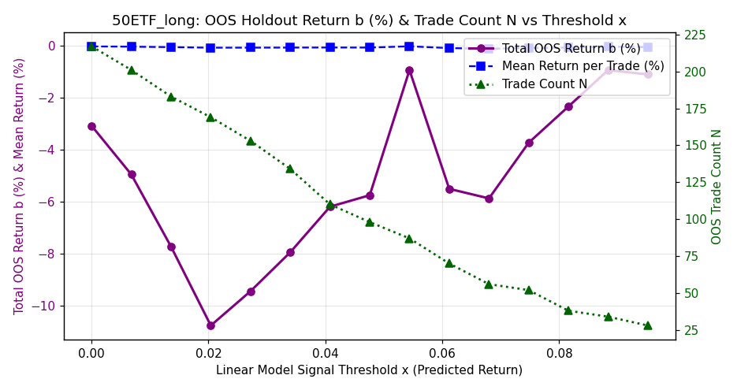<br>


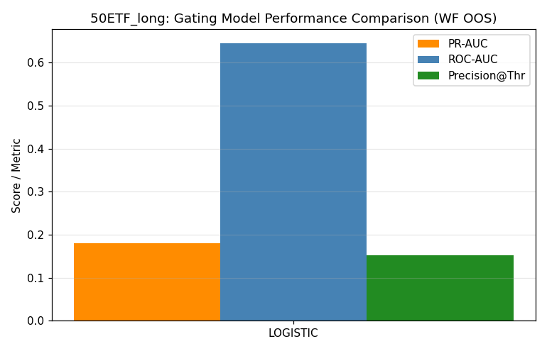<br>


<br>


<br>


<br>


</details>

### 50ETF_short

- **Selected Model**: SKGLM_MCP
- **Tuned Stability Threshold**: 0.13
- **Samples**: 2722 (2015-04-07 → 2026-06-17)
- **Holdout**: 544 days (2024-03-19 → 2026-06-17)
- **Target stats**: mean=-0.0019%, std=0.9480%, Sharpe=-0.03
- **Selected features (84)**: `bar_vol_2, gap_pct, spike_exhaustion_ratio, iv, adx_opening, northbound_net, yesterday_day_late_mom, inside_bar_compression, yesterday_body_ratio, yesterday_early_range, decision_bar_reversal_signal, vix_diff_1d, inside_bar_failure_bull, vix_vol_ratio, vix_iv_spread, yesterday_early_skew, volume_climax_exhaustion, short_balance_quantity, yesterday_early_realized_vol, volume_surge_direction, bar_vwap_dev_0, decision_bar_body, first_bar_return, early_skew, vwap_touch_count, consecutive_bullish_engulfing, measured_move_proximity, capital_sell_value, bar_ret_0, capital_buy_value, capital_net_ratio, margin_net_buy, yesterday_opening_gap_reversal, intraday_bearish_fvg, bar_ret_1, intraday_bullish_fvg, vol_pk20, opening_gap_reversal, roc60, volume_surge_max, bar_rng_0, lower_shadow_rejection, yesterday_intraday_close_position, margin_balance, iv_diff_1d, early_bearish_shooting_star, opening_range_size, yesterday_day_kurtosis, first_bar_body_ratio, yesterday_pm_return, early_bullish_hammer, trend_exhaustion_early, total_balance, yesterday_return, margin_repayment, yesterday_day_pm_am_vol_ratio, yesterday_gap_pct, bar_rng_1, early_trend_hhi, sma_distance_5d, trend_bar_dominance, vix, bb_width, bar_vol_0, volatility_regime_intraday, volume_dryup_ratio, vix_iv_ratio, yesterday_am_return, vol_ratio_5_20, yesterday_gap, roc10, first_bar_volume, northbound_sell, yesterday_day_close_pos, yesterday_day_skew, yesterday_day_vwap_dev, opening_direction_stability, yesterday_close_position, vwap_deviation_max, early_bullish_engulfing_count, vol20, early_doji_count, yesterday_first_bar_volume, volume_sma_ratio_long`

#### Selected Feature Stability Scores (Block Bootstrap)

<details>
<summary><b>Click to expand Feature Stability Scores Table</b></summary>

| Feature | Stability Score | Status | Pearson $r$ | Spearman $\rho$ | Monotonicity Score | Mutual Info | Quality Rating | Holdout IC | Yearly ICs | Yearly IC Std |
|---------|-----------------|--------|-------------|-----------------|--------------------|-------------|----------------|------------|------------|---------------|
| bar_vol_2 | 60.4% | **Selected** | -0.0341 | -0.0384 | -0.20 | 0.0246 | * Non-Monotonic / Weak | -0.0733 | 15:-0.04 16:-0.02 17:-0.02 18:-0.06 19:-0.03 20:+0.01 21:-0.11 22:+0.04 23:+0.02 24:-0.07 25:-0.05 26:-0.01 | 0.0392 |
| gap_pct | 55.6% | **Selected** | +0.0437 | +0.0200 | +0.70 | 0.0101 | ** Moderate Monotonic | +0.0164 | 15:+0.03 16:+0.06 17:-0.12 18:+0.03 19:+0.06 20:+0.07 21:+0.01 22:+0.08 23:-0.07 24:-0.06 25:+0.00 26:+0.18 | 0.0757 |
| spike_exhaustion_ratio | 54.0% | **Selected** | -0.0217 | -0.0235 | -0.60 | 0.0001 | ** Moderate Monotonic | +0.0241 | 15:-0.12 16:-0.04 17:-0.05 18:-0.03 19:+0.03 20:-0.01 21:+0.01 22:-0.05 23:-0.05 24:+0.06 25:-0.05 26:-0.00 | 0.0452 |
| iv | 52.0% | **Selected** | -0.0146 | -0.0456 | -0.70 | 0.0595 | ** Moderate Monotonic | -0.0462 | 15:-0.01 16:-0.11 17:-0.04 18:-0.02 19:-0.11 20:-0.08 21:-0.02 22:+0.08 23:-0.04 24:+0.01 25:-0.05 26:-0.05 | 0.0488 |
| adx_opening | 51.2% | **Selected** | +0.0776 | +0.0218 | N/A | 0.0000 | N/A | -0.0761 | 15:-0.03 16:-0.01 17:+0.09 18:+0.08 19:+0.12 20:-0.02 21:+0.02 22:+0.08 23:-0.01 24:-0.09 25:-0.02 26:-0.11 | 0.0702 |
| northbound_net | 50.0% | **Selected** | +0.0324 | +0.0458 | +0.90 | 0.0016 | *** Strong Monotonic | -0.0394 | 15:+0.06 16:-0.03 17:+0.01 18:+0.09 19:+0.15 20:+0.01 21:+0.04 22:+0.09 23:+0.06 24:-0.03 26:+nan | nan |
| yesterday_day_late_mom | 46.8% | **Selected** | +0.0363 | +0.0062 | +0.30 | 0.0000 | * Non-Monotonic / Weak | -0.0195 | 15:+0.10 16:+0.05 17:+0.13 18:-0.05 19:-0.05 20:+0.05 21:-0.06 22:-0.05 23:-0.05 24:-0.05 25:+0.05 26:+0.00 | 0.0635 |
| inside_bar_compression | 45.6% | **Selected** | +0.0037 | -0.0032 | +0.50 | 0.0000 | ** Moderate Monotonic | -0.0030 | 15:-0.07 16:+0.05 17:+0.07 18:-0.04 19:-0.02 20:+0.10 21:-0.04 22:-0.02 23:-0.05 24:+0.01 25:+0.03 26:-0.18 | 0.0694 |
| yesterday_body_ratio | 44.0% | **Selected** | -0.0635 | -0.0554 | -0.80 | 0.0069 | ** Moderate Monotonic | -0.0322 | 15:-0.09 16:-0.14 17:-0.03 18:-0.03 19:+0.03 20:-0.08 21:-0.16 22:+0.00 23:-0.04 24:-0.04 25:-0.02 26:-0.04 | 0.0526 |
| yesterday_early_range | 40.8% | **Selected** | +0.0691 | -0.0258 | -0.20 | 0.0235 | * Non-Monotonic / Weak | -0.0498 | 15:+0.08 16:-0.02 17:+0.05 18:-0.01 19:-0.08 20:+0.03 21:-0.08 22:-0.00 23:-0.05 24:-0.02 25:-0.09 26:+0.06 | 0.0559 |
| decision_bar_reversal_signal | 38.8% | **Selected** | -0.0215 | -0.0187 | N/A | 0.0048 | N/A | +0.0640 | 15:-0.06 16:-0.04 17:-0.03 18:-0.14 19:+0.00 20:+0.04 21:-0.10 22:+0.01 23:-0.03 24:+0.06 25:+0.09 26:-0.04 | 0.0634 |
| vix_diff_1d | 38.0% | **Selected** | +0.0383 | -0.0402 | -0.60 | 0.0320 | ** Moderate Monotonic | -0.0495 | 15:+0.17 16:-0.16 17:-0.02 18:-0.09 19:-0.15 20:-0.03 21:-0.02 22:-0.09 23:-0.02 24:-0.01 25:-0.05 26:-0.07 | 0.0794 |
| inside_bar_failure_bull | 37.2% | **Selected** | -0.0051 | +0.0076 | N/A | 0.0003 | N/A | +0.0608 | 15:-0.12 16:-0.07 17:+0.01 18:+0.11 19:-0.12 20:+0.12 21:+0.07 22:-0.03 23:-0.01 24:+0.07 25:+0.13 26:-0.17 | 0.0985 |
| vix_vol_ratio | 36.8% | **Selected** | +0.0053 | +0.0168 | +0.30 | 0.0049 | * Non-Monotonic / Weak | +0.0561 | 15:+0.02 16:+0.08 17:+0.07 18:-0.05 19:+0.03 20:-0.07 21:+0.01 22:-0.09 23:+0.10 24:+0.03 25:+0.06 26:-0.09 | 0.0646 |
| vix_iv_spread | 36.8% | **Selected** | +0.0448 | +0.0625 | +0.80 | 0.0123 | ** Moderate Monotonic | +0.0274 | 15:+0.08 16:+0.08 17:+0.04 18:+0.02 19:+0.02 20:+0.13 21:+0.01 22:+0.04 23:+0.06 24:+0.11 25:+0.07 26:-0.11 | 0.0585 |
| yesterday_early_skew | 35.2% | **Selected** | -0.0195 | -0.0293 | -0.10 | 0.0000 | * Non-Monotonic / Weak | -0.0152 | 15:-0.03 16:+0.05 17:-0.12 18:-0.03 19:+0.11 20:-0.05 21:-0.10 22:-0.05 23:+0.00 24:+0.04 25:-0.09 26:-0.02 | 0.0635 |
| volume_climax_exhaustion | 34.8% | **Selected** | -0.0234 | -0.0072 | -0.30 | 0.0114 | * Non-Monotonic / Weak | -0.0033 | 15:-0.20 16:-0.03 17:+0.02 18:+0.05 19:+0.06 20:-0.05 21:-0.03 22:+0.02 23:+0.12 24:+0.00 25:+0.08 26:-0.13 | 0.0856 |
| short_balance_quantity | 34.4% | **Selected** | -0.0051 | -0.0231 | -0.60 | 0.0447 | ** Moderate Monotonic | -0.0136 | 15:-0.04 16:-0.04 17:-0.04 18:-0.08 19:-0.17 20:-0.03 21:-0.10 22:+0.11 23:-0.04 24:+0.05 25:+0.01 26:-0.14 | 0.0721 |
| yesterday_early_realized_vol | 32.8% | **Selected** | +0.0306 | -0.0039 | +0.50 | 0.0055 | * Non-Monotonic / Weak | +0.0023 | 15:+0.01 16:+0.02 17:+0.04 18:+0.05 19:-0.11 20:+0.01 21:+0.08 22:-0.03 23:-0.08 24:-0.01 25:+0.02 26:+0.05 | 0.0522 |
| volume_surge_direction | 31.6% | **Selected** | +0.0690 | +0.0402 | +0.90 | 0.0000 | *** Strong Monotonic | -0.0238 | 15:+0.13 16:+0.05 17:-0.08 18:+0.18 19:+0.10 20:+0.04 21:+0.05 22:+0.03 23:+0.03 24:-0.03 25:+0.03 26:-0.16 | 0.0873 |
| bar_vwap_dev_0 | 31.6% | **Selected** | +0.0311 | +0.0409 | N/A | 0.0000 | N/A | N/A | N/A | N/A |
| decision_bar_body | 31.6% | **Selected** | +0.0383 | +0.0368 | +0.90 | 0.0288 | *** Strong Monotonic | -0.0202 | 15:+0.16 16:+0.06 17:+0.02 18:+0.11 19:-0.00 20:+0.01 21:+0.01 22:+0.05 23:+0.06 24:-0.09 25:+0.05 26:+0.02 | 0.0575 |
| first_bar_return | 30.4% | **Selected** | +0.1198 | +0.0526 | +0.90 | 0.0083 | *** Strong Monotonic | -0.0296 | 15:+0.14 16:+0.09 17:-0.05 18:+0.17 19:+0.03 20:+0.04 21:+0.05 22:+0.05 23:+0.07 24:-0.01 25:+0.00 26:-0.15 | 0.0812 |
| early_skew | 29.2% | **Selected** | +0.0314 | +0.0317 | +0.90 | 0.0000 | *** Strong Monotonic | +0.0465 | 15:+0.07 16:+0.09 17:+0.07 18:-0.07 19:-0.04 20:+0.00 21:-0.05 22:+0.22 23:-0.02 24:+0.08 25:+0.02 26:+0.02 | 0.0761 |
| vwap_touch_count | 28.8% | **Selected** | +0.0054 | +0.0213 | N/A | 0.0034 | N/A | -0.0618 | 15:-0.02 16:+0.01 17:-0.09 18:+0.07 19:-0.04 20:+0.11 21:+0.14 22:+0.03 23:+0.06 24:-0.00 25:-0.07 26:-0.06 | 0.0702 |
| consecutive_bullish_engulfing | 28.4% | **Selected** | -0.0191 | -0.0067 | N/A | 0.0000 | N/A | +0.0167 | 15:-0.06 16:-0.01 17:+0.05 18:-0.03 19:+0.02 20:+0.03 21:-0.02 22:-0.04 23:-0.08 24:+0.02 25:+0.04 26:-0.05 | 0.0417 |
| measured_move_proximity | 28.0% | **Selected** | +0.0191 | +0.0247 | +1.00 | 0.0025 | *** Strong Monotonic | -0.0470 | 15:-0.06 16:+0.17 17:-0.07 18:+0.10 19:+0.08 20:+0.02 21:+0.07 22:+0.01 23:-0.02 24:+0.00 25:-0.06 26:-0.11 | 0.0799 |
| capital_sell_value | 27.6% | **Selected** | -0.0209 | -0.0318 | -0.80 | 0.0360 | ** Moderate Monotonic | -0.0258 | 15:+nan 17:-0.05 18:-0.11 19:-0.09 20:-0.06 21:-0.03 22:-0.04 23:-0.07 24:+0.03 25:+0.06 26:-0.09 | nan |
| bar_ret_0 | 26.8% | **Selected** | +0.1197 | +0.0526 | +0.90 | 0.0083 | *** Strong Monotonic | -0.0296 | 15:+0.14 16:+0.09 17:-0.05 18:+0.17 19:+0.03 20:+0.04 21:+0.05 22:+0.05 23:+0.07 24:-0.01 25:+0.00 26:-0.15 | 0.0812 |
| capital_buy_value | 26.8% | **Selected** | -0.0318 | -0.0438 | -0.90 | 0.0398 | *** Strong Monotonic | -0.0411 | 16:+nan 17:-0.03 18:-0.16 19:-0.11 20:-0.09 21:-0.08 22:+0.00 23:-0.13 24:-0.04 25:+0.05 26:-0.08 | nan |
| capital_net_ratio | 26.4% | **Selected** | -0.0201 | -0.0390 | -0.70 | 0.0153 | ** Moderate Monotonic | +0.0021 | 17:-0.07 18:-0.05 19:-0.02 20:-0.05 21:-0.09 22:+0.05 23:-0.13 24:-0.14 25:+0.02 26:+0.10 | 0.0728 |
| margin_net_buy | 26.0% | **Selected** | -0.1262 | -0.0654 | -0.90 | 0.0000 | *** Strong Monotonic | -0.0343 | 15:-0.11 16:+0.05 17:+0.00 18:-0.08 19:-0.07 20:-0.08 21:-0.10 22:-0.07 23:-0.06 24:-0.18 25:+0.07 26:+0.07 | 0.0742 |
| yesterday_opening_gap_reversal | 25.6% | **Selected** | +0.0021 | +0.0118 | +0.40 | 0.0090 | * Non-Monotonic / Weak | +0.0066 | 15:+0.08 16:-0.13 17:-0.01 18:-0.03 19:+0.08 20:+0.03 21:+0.08 22:+0.04 23:-0.07 24:-0.06 25:+0.05 26:-0.02 | 0.0649 |
| intraday_bearish_fvg | 25.2% | **Selected** | -0.0403 | -0.0003 | N/A | 0.0000 | N/A | +0.0503 | 16:+0.05 17:-0.05 18:-0.07 19:-0.05 20:-0.01 21:+0.08 23:-0.04 24:+0.05 26:+0.11 | 0.0608 |
| bar_ret_1 | 24.8% | **Selected** | -0.0677 | -0.0022 | -0.20 | 0.0154 | * Non-Monotonic / Weak | -0.0476 | 15:-0.12 16:+0.00 17:+0.04 18:+0.10 19:-0.04 20:-0.04 21:+0.07 22:-0.04 23:+0.01 24:+0.00 25:+0.00 26:-0.15 | 0.0685 |
| intraday_bullish_fvg | 24.4% | **Selected** | +0.0392 | +0.0128 | N/A | 0.0000 | N/A | +0.0196 | 15:+0.04 16:+0.08 17:-0.08 18:+0.11 19:-0.18 20:-0.12 21:+0.11 22:-0.01 23:+0.05 24:-0.04 25:+0.06 26:+0.05 | 0.0883 |
| vol_pk20 | 24.0% | **Selected** | +0.0129 | -0.0194 | -0.10 | 0.0621 | * Non-Monotonic / Weak | +0.0039 | 15:-0.01 16:-0.08 17:-0.00 18:-0.00 19:-0.09 20:-0.01 21:+0.01 22:+0.12 23:-0.06 24:+0.05 25:+0.01 26:+0.07 | 0.0581 |
| opening_gap_reversal | 24.0% | **Selected** | -0.0255 | +0.0041 | +0.20 | 0.0101 | * Non-Monotonic / Weak | +0.0534 | 15:-0.03 16:+0.04 17:-0.04 18:-0.04 19:+0.07 20:+0.02 21:-0.02 22:+0.05 23:-0.07 24:-0.04 25:+0.01 26:+0.19 | 0.0673 |
| roc60 | 23.6% | **Selected** | -0.0570 | -0.0261 | -0.70 | 0.0356 | ** Moderate Monotonic | +0.0156 | 15:-0.08 16:-0.08 17:-0.05 18:-0.02 19:-0.20 20:-0.07 21:-0.08 22:-0.06 23:-0.07 24:-0.03 25:-0.03 26:-0.10 | 0.0450 |
| volume_surge_max | 23.2% | **Selected** | -0.0336 | -0.0333 | -0.20 | 0.0000 | * Non-Monotonic / Weak | -0.0033 | 15:-0.04 16:-0.03 17:-0.10 18:-0.10 19:-0.06 20:+0.04 21:-0.07 22:+0.01 23:-0.00 24:-0.02 25:+0.04 26:+0.02 | 0.0467 |
| bar_rng_0 | 22.8% | **Selected** | +0.0489 | -0.0012 | +0.50 | 0.0745 | * Non-Monotonic / Weak | -0.0345 | 15:-0.02 16:-0.05 17:+0.00 18:+0.03 19:-0.03 20:+0.07 21:+0.01 22:+0.02 23:-0.04 24:+0.03 25:-0.01 26:-0.10 | 0.0433 |
| lower_shadow_rejection | 22.8% | **Selected** | +0.0020 | +0.0082 | +0.60 | 0.0000 | ** Moderate Monotonic | +0.0007 | 15:-0.03 16:-0.04 17:-0.02 18:-0.02 19:+0.04 20:+0.00 21:+0.05 22:+0.06 23:-0.04 24:+0.01 25:+0.03 26:-0.02 | 0.0342 |
| yesterday_intraday_close_position | 22.8% | **Selected** | -0.0005 | +0.0207 | +0.40 | 0.0000 | * Non-Monotonic / Weak | +0.0256 | 15:+0.01 16:-0.08 17:+0.08 18:+0.14 19:-0.02 20:+0.07 21:-0.09 22:-0.02 23:+0.06 24:+0.02 25:+0.07 26:-0.06 | 0.0692 |
| margin_balance | 22.8% | **Selected** | +0.0005 | -0.0053 | +0.20 | 0.0334 | * Non-Monotonic / Weak | +0.0192 | 15:-0.07 16:-0.06 17:-0.09 18:-0.02 19:-0.01 20:-0.01 21:+0.01 22:+0.04 23:+0.04 24:+0.08 25:-0.01 26:+0.05 | 0.0489 |
| iv_diff_1d | 22.4% | **Selected** | -0.0140 | -0.0289 | -0.60 | 0.0022 | ** Moderate Monotonic | -0.0398 | 15:+0.06 16:+0.06 17:-0.05 18:-0.03 19:-0.11 20:-0.06 21:-0.07 22:-0.04 23:-0.06 24:-0.04 25:-0.01 26:-0.07 | 0.0482 |
| early_bearish_shooting_star | 22.4% | **Selected** | -0.0376 | +0.0038 | N/A | 0.0000 | N/A | -0.0154 | 15:+0.08 16:-0.00 17:+0.08 18:-0.07 19:-0.07 20:+0.02 21:+0.08 22:+0.02 23:-0.05 24:-0.00 25:-0.15 26:+0.23 | 0.0924 |
| opening_range_size | 22.4% | **Selected** | +0.0495 | -0.0010 | +0.30 | 0.0684 | * Non-Monotonic / Weak | -0.0341 | 15:-0.01 16:-0.05 17:+0.00 18:+0.03 19:-0.03 20:+0.07 21:+0.01 22:+0.02 23:-0.04 24:+0.04 25:-0.01 26:-0.10 | 0.0428 |
| yesterday_day_kurtosis | 22.0% | **Selected** | -0.0115 | -0.0207 | -0.60 | 0.0148 | ** Moderate Monotonic | -0.0571 | 15:+0.08 16:+0.01 17:-0.09 18:+0.08 19:+0.03 20:-0.06 21:-0.06 22:-0.04 23:-0.08 24:-0.07 25:-0.04 26:-0.09 | 0.0589 |
| first_bar_body_ratio | 22.0% | **Selected** | +0.0243 | +0.0249 | +0.80 | 0.0032 | ** Moderate Monotonic | +0.0535 | 15:-0.03 16:+0.13 17:+0.00 18:+0.06 19:-0.03 20:+0.06 21:+0.01 22:+0.00 23:-0.04 24:+0.07 25:+0.06 26:-0.04 | 0.0520 |
| yesterday_pm_return | 21.6% | **Selected** | +0.0062 | -0.0015 | +0.00 | 0.0000 | * Non-Monotonic / Weak | +0.0284 | 15:+0.07 16:-0.04 17:+0.02 18:-0.05 19:-0.16 20:+0.07 21:+0.00 22:+0.02 23:-0.04 24:+0.02 25:+0.03 26:+0.06 | 0.0625 |
| early_bullish_hammer | 21.2% | **Selected** | +0.0074 | -0.0023 | N/A | 0.0053 | N/A | -0.0360 | 15:-0.03 16:-0.07 17:-0.03 18:+0.04 19:+0.03 20:-0.05 21:+0.10 22:+0.08 23:+0.01 24:-0.02 25:-0.04 26:+0.00 | 0.0513 |
| trend_exhaustion_early | 20.4% | **Selected** | -0.0333 | -0.0302 | -0.80 | 0.0054 | ** Moderate Monotonic | +0.0356 | 15:-0.02 16:-0.05 17:-0.08 18:-0.02 19:-0.06 20:+0.01 21:-0.04 22:-0.10 23:-0.07 24:+0.07 25:+0.01 26:+0.01 | 0.0459 |
| total_balance | 20.0% | **Selected** | +0.0001 | -0.0062 | -0.10 | 0.0333 | * Non-Monotonic / Weak | +0.0158 | 15:-0.07 16:-0.06 17:-0.10 18:-0.02 19:-0.03 20:-0.02 21:+0.00 22:+0.05 23:+0.02 24:+0.08 25:-0.02 26:+0.03 | 0.0494 |
| yesterday_return | 20.0% | **Selected** | +0.0053 | +0.0191 | +0.80 | 0.0051 | ** Moderate Monotonic | +0.0291 | 15:+0.12 16:-0.14 17:+0.01 18:+0.03 19:+0.03 20:-0.00 21:+0.00 22:+0.05 23:+0.03 24:+0.02 25:+0.04 26:+0.07 | 0.0577 |
| margin_repayment | 19.6% | **Selected** | +0.0736 | -0.0337 | -0.70 | 0.0000 | ** Moderate Monotonic | -0.0389 | 15:+0.00 16:-0.14 17:-0.00 18:+0.01 19:-0.08 20:+0.01 21:+0.01 22:-0.03 23:-0.07 24:-0.01 25:+0.00 26:-0.08 | 0.0469 |
| yesterday_day_pm_am_vol_ratio | 19.6% | **Selected** | +0.0077 | -0.0110 | +0.10 | 0.0000 | * Non-Monotonic / Weak | -0.0158 | 15:+0.01 16:+0.14 17:+0.03 18:+0.01 19:-0.12 20:-0.07 21:-0.06 22:-0.05 23:+0.03 24:+0.08 25:-0.06 26:-0.03 | 0.0701 |
| yesterday_gap_pct | 19.2% | **Selected** | -0.0115 | +0.0254 | +0.90 | 0.0193 | ** Non-Linear Monotonic | +0.0571 | 15:+0.10 16:-0.05 17:-0.01 18:-0.07 19:+0.04 20:-0.01 21:+0.11 22:+0.08 23:+0.01 24:+0.04 25:+0.10 26:-0.01 | 0.0571 |
| bar_rng_1 | 18.8% | **Selected** | +0.0038 | -0.0298 | -0.60 | 0.0223 | ** Moderate Monotonic | -0.0595 | 15:-0.04 16:-0.09 17:+0.01 18:+0.02 19:+0.03 20:-0.07 21:-0.07 22:-0.08 23:+0.11 24:-0.04 25:-0.10 26:+0.02 | 0.0589 |
| early_trend_hhi | 18.8% | **Selected** | +0.0040 | +0.0048 | N/A | 0.0000 | N/A | -0.0673 | 15:-0.07 16:+0.01 17:+0.00 18:-0.06 19:+0.08 20:-0.05 21:+0.04 22:+0.13 23:+0.10 24:-0.07 25:-0.07 26:-0.01 | 0.0678 |
| sma_distance_5d | 18.4% | **Selected** | -0.0183 | +0.0031 | +0.10 | 0.0080 | * Non-Monotonic / Weak | -0.0209 | 15:+0.01 16:-0.10 17:-0.02 18:+0.05 19:-0.01 20:+0.02 21:+0.03 22:+0.01 23:-0.01 24:+0.02 25:-0.07 26:-0.01 | 0.0400 |
| trend_bar_dominance | 18.0% | **Selected** | +0.0379 | +0.0244 | +0.50 | 0.0000 | ** Moderate Monotonic | +0.0361 | 15:+0.08 16:+0.00 17:-0.01 18:+0.05 19:+0.08 20:+0.09 21:+0.02 22:-0.07 23:+0.05 24:+0.01 25:-0.08 26:+0.19 | 0.0702 |
| vix | 18.0% | **Selected** | +0.0045 | -0.0303 | -0.30 | 0.0341 | * Non-Monotonic / Weak | -0.0298 | 15:+0.01 16:-0.09 17:-0.04 18:-0.01 19:-0.13 20:-0.04 21:-0.03 22:+0.08 23:-0.00 24:+0.05 25:-0.03 26:-0.11 | 0.0601 |
| bb_width | 18.0% | **Selected** | -0.0056 | +0.0330 | +0.10 | 0.0548 | * Non-Monotonic / Weak | +0.1119 | 15:-0.02 16:+0.12 17:+0.06 18:-0.03 19:+0.06 20:-0.00 21:+0.09 22:-0.09 23:-0.03 24:-0.01 25:+0.16 26:+0.15 | 0.0765 |
| bar_vol_0 | 17.2% | **Selected** | -0.0327 | -0.0319 | -0.30 | 0.0000 | * Non-Monotonic / Weak | -0.0033 | 15:-0.04 16:-0.03 17:-0.11 18:-0.09 19:-0.06 20:+0.05 21:-0.07 22:+0.01 23:+0.00 24:-0.02 25:+0.04 26:+0.02 | 0.0484 |
| volatility_regime_intraday | 17.2% | **Selected** | +0.0099 | +0.0037 | +0.00 | 0.0150 | * Non-Monotonic / Weak | +0.0594 | 15:+0.01 16:+0.08 17:+0.02 18:-0.07 19:+0.00 20:+0.03 21:-0.07 22:-0.02 23:-0.10 24:+0.11 25:+0.10 26:-0.07 | 0.0679 |
| volume_dryup_ratio | 16.8% | **Selected** | +0.0038 | +0.0014 | N/A | 0.0005 | N/A | +0.0614 | 15:+0.01 16:-0.10 17:-0.00 18:+0.12 19:-0.07 20:+0.09 21:+0.08 22:-0.05 23:-0.03 24:+0.09 25:+0.02 | 0.0701 |
| vix_iv_ratio | 16.8% | **Selected** | +0.0340 | +0.0649 | +0.80 | 0.0270 | ** Moderate Monotonic | +0.0395 | 15:+0.07 16:+0.11 17:+0.04 18:+0.02 19:+0.02 20:+0.14 21:+0.02 22:+0.03 23:+0.06 24:+0.10 25:+0.08 26:-0.06 | 0.0500 |
| yesterday_am_return | 16.8% | **Selected** | +0.0364 | +0.0170 | +0.90 | 0.0000 | *** Strong Monotonic | -0.0050 | 15:+0.05 16:-0.06 17:-0.01 18:+0.07 19:+0.05 20:-0.00 21:-0.02 22:+0.03 23:+0.09 24:-0.02 25:+0.03 26:-0.07 | 0.0481 |
| vol_ratio_5_20 | 16.0% | **Selected** | -0.0057 | -0.0322 | -0.30 | 0.0000 | * Non-Monotonic / Weak | -0.0320 | 15:+0.12 16:-0.15 17:-0.04 18:-0.06 19:+0.02 20:-0.05 21:-0.02 22:+0.01 23:-0.11 24:-0.16 25:+0.07 26:+0.06 | 0.0839 |
| yesterday_gap | 16.0% | **Selected** | -0.0115 | +0.0254 | +0.90 | 0.0193 | ** Non-Linear Monotonic | +0.0571 | 15:+0.10 16:-0.05 17:-0.01 18:-0.07 19:+0.04 20:-0.01 21:+0.11 22:+0.08 23:+0.01 24:+0.04 25:+0.10 26:-0.01 | 0.0571 |
| roc10 | 16.0% | **Selected** | -0.0791 | -0.0420 | -0.10 | 0.0262 | * Non-Monotonic / Weak | -0.0668 | 15:-0.07 16:-0.07 17:-0.09 18:-0.04 19:-0.11 20:-0.06 21:-0.10 22:+0.05 23:-0.01 24:-0.09 25:-0.06 26:-0.09 | 0.0428 |
| first_bar_volume | 16.0% | **Selected** | -0.0327 | -0.0319 | -0.30 | 0.0000 | * Non-Monotonic / Weak | -0.0033 | 15:-0.04 16:-0.03 17:-0.11 18:-0.09 19:-0.06 20:+0.05 21:-0.07 22:+0.01 23:+0.00 24:-0.02 25:+0.04 26:+0.02 | 0.0484 |
| northbound_sell | 16.0% | **Selected** | -0.0172 | -0.0279 | -0.90 | 0.0260 | ** Non-Linear Monotonic | -0.0052 | 15:-0.09 16:-0.04 17:-0.02 18:-0.06 19:-0.16 20:-0.02 21:+0.00 22:-0.06 23:-0.06 24:+0.11 25:+nan 26:+nan | nan |
| yesterday_day_close_pos | 16.0% | **Selected** | -0.0143 | -0.0146 | -0.50 | 0.0039 | * Non-Monotonic / Weak | +0.0108 | 15:+0.03 16:-0.09 17:+0.04 18:-0.05 19:-0.10 20:+0.01 21:-0.02 22:-0.02 23:-0.01 24:+0.05 25:+0.01 26:+0.04 | 0.0469 |
| yesterday_day_skew | 15.6% | **Selected** | +0.0082 | +0.0104 | -0.60 | 0.0000 | ** Moderate Monotonic | +0.0387 | 15:+0.09 16:-0.04 17:-0.04 18:+0.11 19:+0.06 20:+0.03 21:-0.06 22:-0.10 23:+0.02 24:+0.00 25:+0.07 26:+0.12 | 0.0681 |
| yesterday_day_vwap_dev | 14.8% | **Selected** | -0.0057 | -0.0281 | -0.80 | 0.0000 | ** Moderate Monotonic | -0.0080 | 15:+0.04 16:-0.11 17:+0.04 18:-0.08 19:-0.13 20:-0.03 21:-0.01 22:-0.03 23:+0.01 24:+0.01 25:-0.02 26:+0.08 | 0.0583 |
| opening_direction_stability | 14.8% | **Selected** | +0.0040 | +0.0048 | N/A | 0.0000 | N/A | -0.0673 | 15:-0.07 16:+0.01 17:+0.00 18:-0.06 19:+0.08 20:-0.05 21:+0.04 22:+0.13 23:+0.10 24:-0.07 25:-0.07 26:-0.01 | 0.0678 |
| yesterday_close_position | 14.0% | **Selected** | -0.0140 | -0.0143 | -0.50 | 0.0050 | * Non-Monotonic / Weak | +0.0108 | 15:+0.03 16:-0.09 17:+0.03 18:-0.04 19:-0.10 20:+0.01 21:-0.02 22:-0.02 23:-0.01 24:+0.05 25:+0.01 26:+0.04 | 0.0461 |
| vwap_deviation_max | 13.6% | **Selected** | +0.0089 | +0.0147 | +1.00 | 0.0195 | ** Non-Linear Monotonic | +0.0072 | 15:+0.07 16:-0.05 17:+0.01 18:-0.02 19:+0.06 20:-0.09 21:+0.04 22:+0.03 23:+0.18 24:-0.06 25:+0.00 26:+0.04 | 0.0682 |
| early_bullish_engulfing_count | 13.6% | **Selected** | -0.0228 | -0.0114 | N/A | 0.0000 | N/A | +0.0556 | 15:-0.05 16:-0.06 17:+0.02 18:-0.02 19:-0.01 20:+0.11 21:-0.04 22:-0.06 23:-0.12 24:+0.02 25:+0.05 26:+0.07 | 0.0623 |
| vol20 | 13.6% | **Selected** | +0.0078 | -0.0306 | -0.40 | 0.0551 | * Non-Monotonic / Weak | -0.0502 | 15:-0.00 16:-0.11 17:-0.07 18:+0.00 19:-0.11 20:+0.03 21:-0.03 22:+0.11 23:-0.12 24:+0.02 25:-0.06 26:+0.09 | 0.0729 |
| early_doji_count | 13.2% | **Selected** | -0.0067 | -0.0133 | N/A | 0.0000 | N/A | +0.0006 | 15:-0.01 16:-0.15 17:+0.10 18:-0.04 19:+0.06 20:+0.05 21:-0.09 22:-0.02 23:-0.03 24:-0.01 25:-0.01 26:-0.04 | 0.0624 |
| yesterday_first_bar_volume | 13.2% | **Selected** | +0.0133 | -0.0306 | -0.20 | 0.0020 | * Non-Monotonic / Weak | -0.0542 | 15:-0.01 16:-0.11 17:-0.03 18:-0.01 19:+0.00 20:-0.00 21:-0.12 22:+0.03 23:-0.02 24:-0.14 25:+0.04 26:-0.03 | 0.0564 |
| volume_sma_ratio_long | 13.2% | **Selected** | -0.0277 | -0.0332 | -0.20 | 0.0270 | * Non-Monotonic / Weak | -0.0228 | 15:-0.04 16:-0.07 17:-0.08 18:+0.02 19:-0.14 20:+0.01 21:-0.04 22:+0.07 23:-0.15 24:-0.09 25:+0.11 26:-0.04 | 0.0738 |

</details>

#### Metrics

| Metric | Best Linear | Ridge Base | Zero | Yesterday PM | First 30min Mom |
|--------|-------------|------------|------|--------------|-----------------|
| IC | +0.1153 | +0.1178 | +0.0000 | +0.0088 | -0.0301 |
| Dir Acc | 0.539 | 0.513 | 0.500 | 0.485 | 0.493 |
| RMSE | 0.7521% | 0.8028% | 0.7416% | 1.0417% | 0.8229% |
| L/S Sharpe | +3.40 | +3.25 | — | — | — |

#### Best Hyperparameters

<details>
<summary><b>Click to expand Best Hyperparameters JSON</b></summary>

```json
{
  "model_type": "skglm_mcp",
  "top_k_features": 84,
  "skglm_mcp_alpha": 2.066442554014102e-05,
  "skglm_mcp_gamma": 5.6851546320431225,
  "stability_threshold": 0.132
}
```

</details>

#### Walk-Forward Fold ICs

| Fold | IS IC | OOS IC |
|------|-------|--------|
| 1 | 0.4492 | +0.0273 |
| 2 | 0.3333 | +0.1644 |
| 3 | 0.2891 | +0.1275 |
| 4 | 0.2721 | +0.0251 |
| 5 | 0.2317 | +0.0997 |
| **Overall** | — | +0.0890 |

#### Year-by-Year OOS IC

| Year | IC | Dir Acc | N | L/S Sharpe |
|------|-----|---------|---|-----------|
| 2017 | +0.0192 | 0.488 | 215 | +2.17 |
| 2018 | +0.0413 | 0.490 | 243 | +1.35 |
| 2019 | +0.1352 | 0.537 | 244 | +2.53 |
| 2020 | +0.1948 | 0.580 | 243 | +3.95 |
| 2021 | +0.0901 | 0.527 | 243 | +1.10 |
| 2022 | +0.1104 | 0.550 | 242 | +1.95 |
| 2023 | +0.0588 | 0.521 | 242 | +0.39 |
| 2024 | +0.0447 | 0.517 | 242 | +2.75 |
| 2025 | +0.1470 | 0.543 | 243 | +4.07 |
| 2026 | -0.0680 | 0.417 | 108 | -0.65 |

#### Diagnostic Plots

<details>
<summary><b>Click to expand Diagnostic Plots</b></summary>

<br>


<br>


<br>


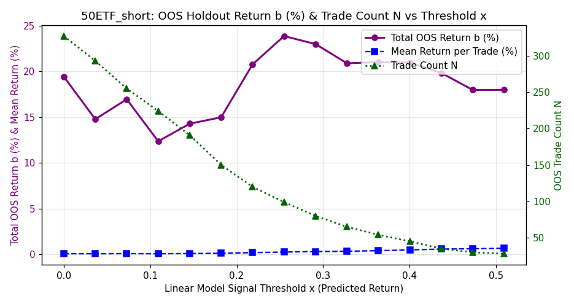<br>


<br>


<br>


<br>


<br>


</details>

### 500ETF_long

- **Selected Model**: SKGLM_MCP
- **Tuned Stability Threshold**: 0.24
- **Samples**: 2722 (2015-04-07 → 2026-06-17)
- **Holdout**: 544 days (2024-03-19 → 2026-06-17)
- **Target stats**: mean=0.0195%, std=1.1474%, Sharpe=0.27
- **Selected features (68)**: `sma100_dist, bar_rng_4, upper_shadow_rejection, bb_width, bar_vwap_dev_1, volume_surge_direction, yesterday_day_vwap_dev, yesterday_early_range, max_up_ret, volatility_regime_intraday, yesterday_intraday_close_position, sma_distance_5d, trend_bar_dominance, yesterday_early_realized_vol, trend_exhaustion_early, bar_rng_3, roc60, shark_32_signal, early_trend_consistency, volume_dryup_ratio, consecutive_bullish_engulfing, yesterday_early_vwap_dev, consecutive_higher_highs, bar_ret_3, vol_gk10, yesterday_gap_pct, yesterday_spike_exhaustion_ratio, body_to_range_ratio, volume_price_corr, spike_exhaustion_ratio, yesterday_day_skew, intraday_bullish_fvg, gap_pct, bar_vol_4, early_bearish_shooting_star, bar_rng_2, yesterday_gap, yesterday_day_late_mom, bar_ret_0, yesterday_opening_gap_reversal, margin_balance, vol_ratio_5_20, first_bar_return, range_expansion_ratio, vol20, yesterday_early_skew, volume_percentile_20d, yesterday_first_bar_return, vol_ratio_10_60, short_repayment_quantity, volume_weighted_price_position, upper_wick_dominance, yesterday_day_kurtosis, vwap_deviation_max, northbound_net, inside_bar_compression, decision_bar_range_rank, margin_net_buy, opening_gap_reversal, bar_rng_0, capital_net_value, intraday_bearish_fvg, measured_move_proximity, yesterday_day_pm_am_vol_ratio, barbed_wire_intensity, bar_ret_4, consecutive_bearish_engulfing, adx_opening`

#### Selected Feature Stability Scores (Block Bootstrap)

<details>
<summary><b>Click to expand Feature Stability Scores Table</b></summary>

| Feature | Stability Score | Status | Pearson $r$ | Spearman $\rho$ | Monotonicity Score | Mutual Info | Quality Rating | Holdout IC | Yearly ICs | Yearly IC Std |
|---------|-----------------|--------|-------------|-----------------|--------------------|-------------|----------------|------------|------------|---------------|
| sma100_dist | 84.0% | **Selected** | -0.0730 | -0.0389 | -0.90 | 0.0489 | *** Strong Monotonic | +0.0163 | 15:-0.19 16:-0.06 17:-0.09 18:-0.10 19:-0.03 20:-0.07 21:-0.16 22:-0.10 23:-0.12 24:-0.03 25:-0.02 26:+0.05 | 0.0627 |
| bar_rng_4 | 70.8% | **Selected** | +0.0421 | +0.0002 | +0.00 | 0.0526 | * Non-Monotonic / Weak | -0.0764 | 15:-0.04 16:+0.01 17:-0.05 18:+0.07 19:-0.02 20:+0.02 21:-0.03 22:+0.05 23:-0.01 24:+0.04 25:-0.10 26:-0.15 | 0.0597 |
| upper_shadow_rejection | 68.8% | **Selected** | +0.0271 | +0.0156 | +0.30 | 0.0000 | * Non-Monotonic / Weak | +0.0376 | 15:+0.08 16:+0.15 17:+0.07 18:-0.02 19:-0.08 20:-0.01 21:-0.10 22:-0.04 23:+0.05 24:+0.01 25:-0.08 26:+0.27 | 0.1034 |
| bb_width | 67.2% | **Selected** | -0.0362 | -0.0561 | -1.00 | 0.0631 | ** Non-Linear Monotonic | -0.0604 | 15:-0.01 16:-0.02 17:-0.06 18:-0.09 19:-0.03 20:+0.01 21:+0.06 22:-0.17 23:-0.13 24:-0.11 25:-0.03 26:-0.08 | 0.0619 |
| bar_vwap_dev_1 | 60.0% | **Selected** | +0.0854 | +0.0651 | +1.00 | 0.0325 | *** Strong Monotonic | +0.0648 | 15:+0.09 16:+0.11 17:+0.14 18:+0.01 19:+0.07 20:+0.02 21:+0.14 22:-0.02 23:+0.11 24:+0.07 25:-0.02 26:+0.08 | 0.0551 |
| volume_surge_direction | 59.6% | **Selected** | +0.1240 | +0.0946 | +1.00 | 0.0029 | *** Strong Monotonic | +0.1206 | 15:+0.25 16:+0.05 17:+0.04 18:+0.19 19:+0.08 20:+0.06 21:+0.08 22:+0.12 23:+0.03 24:+0.09 25:+0.15 26:+0.07 | 0.0636 |
| yesterday_day_vwap_dev | 59.2% | **Selected** | -0.0341 | -0.0436 | -0.60 | 0.0316 | ** Moderate Monotonic | -0.0735 | 15:+0.04 16:-0.09 17:-0.03 18:-0.07 19:-0.06 20:-0.14 21:-0.03 22:-0.01 23:-0.06 24:-0.01 25:-0.09 26:-0.15 | 0.0539 |
| yesterday_early_range | 57.2% | **Selected** | +0.0143 | +0.0359 | +0.80 | 0.0411 | ** Moderate Monotonic | +0.0219 | 15:+0.00 16:+0.06 17:+0.05 18:-0.00 19:+0.04 20:+0.05 21:-0.04 22:-0.02 23:+0.05 24:+0.07 25:+0.04 26:-0.05 | 0.0406 |
| max_up_ret | 56.4% | **Selected** | +0.1443 | +0.1276 | +0.90 | 0.0100 | *** Strong Monotonic | +0.1102 | 15:+0.28 16:+0.13 17:+0.16 18:+0.20 19:+0.03 20:+0.11 21:+0.13 22:+0.04 23:+0.11 24:+0.15 25:+0.12 26:-0.02 | 0.0750 |
| volatility_regime_intraday | 54.4% | **Selected** | +0.0169 | +0.0407 | +0.70 | 0.0000 | ** Moderate Monotonic | +0.0479 | 15:-0.03 16:+0.15 17:+0.02 18:+0.01 19:-0.00 20:+0.10 21:+0.05 22:-0.06 23:+0.01 24:+0.01 25:+0.12 26:+0.06 | 0.0593 |
| yesterday_intraday_close_position | 54.0% | **Selected** | +0.0944 | +0.0926 | +0.80 | 0.0057 | ** Moderate Monotonic | +0.0756 | 15:+0.10 16:+0.07 17:+0.04 18:+0.05 19:+0.08 20:+0.20 21:-0.02 22:+0.21 23:+0.13 24:-0.00 25:+0.06 26:+0.19 | 0.0721 |
| sma_distance_5d | 53.6% | **Selected** | +0.0003 | +0.0087 | +0.10 | 0.0258 | * Non-Monotonic / Weak | +0.0150 | 15:+0.04 16:-0.10 17:-0.06 18:+0.04 19:+0.03 20:+0.03 21:-0.03 22:+0.05 23:-0.01 24:-0.03 25:-0.04 26:+0.07 | 0.0493 |
| trend_bar_dominance | 52.0% | **Selected** | -0.0083 | -0.0015 | -0.50 | 0.0039 | ** Moderate Monotonic | +0.0081 | 15:-0.06 16:-0.02 17:+0.07 18:-0.01 19:-0.01 20:+0.02 21:-0.09 22:-0.04 23:+0.14 24:+0.01 25:+0.05 26:-0.14 | 0.0701 |
| yesterday_early_realized_vol | 52.0% | **Selected** | +0.0155 | +0.0366 | +0.90 | 0.0611 | ** Non-Linear Monotonic | +0.0131 | 15:-0.01 16:+0.10 17:+0.06 18:-0.02 19:+0.04 20:+0.04 21:+0.05 22:-0.01 23:-0.05 24:+0.05 25:-0.01 26:+0.01 | 0.0401 |
| trend_exhaustion_early | 51.6% | **Selected** | -0.0370 | -0.0474 | -0.60 | 0.0000 | ** Moderate Monotonic | -0.0756 | 15:-0.01 16:-0.11 17:-0.10 18:-0.16 19:+0.01 20:+0.00 21:-0.03 22:+0.00 23:-0.00 24:-0.00 25:-0.06 26:-0.23 | 0.0731 |
| bar_rng_3 | 46.4% | **Selected** | +0.0385 | +0.0346 | +0.70 | 0.0490 | ** Moderate Monotonic | -0.0003 | 15:+0.00 16:+0.06 17:+0.06 18:+0.10 19:-0.11 20:+0.09 21:+0.00 22:+0.09 23:+0.01 24:+0.06 25:+0.02 26:-0.13 | 0.0706 |
| roc60 | 46.0% | **Selected** | -0.0246 | -0.0163 | -1.00 | 0.0350 | *** Strong Monotonic | +0.0148 | 15:-0.03 16:-0.08 17:-0.07 18:-0.09 19:-0.01 20:-0.03 21:-0.09 22:-0.10 23:-0.04 24:-0.01 25:+0.01 26:-0.07 | 0.0341 |
| shark_32_signal | 45.6% | **Selected** | -0.0198 | -0.0298 | N/A | 0.0034 | N/A | +0.0518 | 15:-0.09 16:+0.03 17:+0.03 18:-0.08 19:-0.07 20:-0.05 23:-0.08 25:+0.08 | 0.0612 |
| early_trend_consistency | 45.6% | **Selected** | +0.0067 | +0.0219 | N/A | 0.0033 | N/A | -0.0047 | 15:+0.04 16:+0.14 17:+0.01 18:+0.08 19:-0.05 20:+0.01 21:+0.05 22:-0.01 23:+0.03 24:-0.04 25:-0.04 26:+0.11 | 0.0575 |
| volume_dryup_ratio | 45.2% | **Selected** | +0.0252 | +0.0318 | N/A | 0.0034 | N/A | +0.0430 | 15:-0.01 16:+0.12 17:+0.03 18:-0.03 19:+0.10 20:+0.03 22:-0.05 23:+0.07 24:+0.09 25:+0.04 26:-0.10 | 0.0639 |
| consecutive_bullish_engulfing | 42.8% | **Selected** | +0.0112 | +0.0161 | N/A | 0.0000 | N/A | +0.0987 | 15:-0.11 16:-0.04 17:+0.07 18:-0.09 19:-0.06 20:+0.05 21:+0.09 22:+0.07 23:-0.09 24:+0.15 25:+0.04 26:+0.06 | 0.0825 |
| yesterday_early_vwap_dev | 42.4% | **Selected** | +0.1047 | +0.0822 | +0.90 | 0.0290 | *** Strong Monotonic | +0.0866 | 15:+0.10 16:+0.09 17:+0.04 18:+0.06 19:+0.03 20:+0.16 21:+0.04 22:+0.16 23:+0.05 24:+0.02 25:+0.04 26:+0.22 | 0.0619 |
| consecutive_higher_highs | 41.2% | **Selected** | +0.0650 | +0.0609 | +1.00 | 0.0115 | *** Strong Monotonic | +0.0438 | 15:+0.11 16:-0.01 17:+0.06 18:+0.01 19:+0.09 20:+0.03 21:+0.07 22:+0.13 23:+0.07 24:+0.03 25:+0.08 26:-0.02 | 0.0456 |
| bar_ret_3 | 40.8% | **Selected** | -0.0288 | -0.0122 | -0.50 | 0.0143 | * Non-Monotonic / Weak | +0.0030 | 15:+0.00 16:+0.00 17:+0.01 18:-0.11 19:-0.04 20:-0.05 21:-0.08 22:+0.11 23:+0.01 24:-0.02 25:+0.03 26:-0.07 | 0.0552 |
| vol_gk10 | 39.2% | **Selected** | +0.0398 | +0.0508 | +0.70 | 0.0865 | ** Moderate Monotonic | -0.0007 | 15:-0.00 16:+0.09 17:+0.09 18:+0.11 19:+0.02 20:-0.06 21:+0.04 22:+0.17 23:+0.05 24:+0.11 25:+0.01 26:-0.09 | 0.0716 |
| yesterday_gap_pct | 38.8% | **Selected** | +0.0383 | +0.0175 | +0.40 | 0.0000 | * Non-Monotonic / Weak | +0.0535 | 15:+0.09 16:-0.11 17:-0.04 18:-0.05 19:+0.02 20:+0.03 21:+0.07 22:-0.00 23:+0.01 24:+0.06 25:+0.04 26:-0.02 | 0.0545 |
| yesterday_spike_exhaustion_ratio | 38.8% | **Selected** | +0.0234 | +0.0183 | +0.90 | 0.0063 | *** Strong Monotonic | +0.0239 | 15:+0.15 16:+0.06 17:-0.01 18:-0.01 19:-0.03 20:+0.04 21:+0.05 22:+0.01 23:+0.03 24:+0.07 25:-0.05 26:+0.02 | 0.0509 |
| body_to_range_ratio | 38.4% | **Selected** | +0.0366 | +0.0520 | +0.70 | 0.0000 | ** Moderate Monotonic | +0.0656 | 15:+0.06 16:+0.11 17:+0.12 18:+0.16 19:-0.00 20:+0.06 21:+0.00 22:-0.00 23:-0.03 24:-0.03 25:+0.06 26:+0.16 | 0.0663 |
| volume_price_corr | 37.2% | **Selected** | +0.0390 | +0.0495 | +0.60 | 0.0171 | ** Moderate Monotonic | +0.0878 | 15:+0.00 16:+0.21 17:+0.06 18:+0.03 19:-0.02 20:+0.14 21:-0.02 22:-0.01 23:+0.03 24:+0.06 25:+0.13 26:+0.08 | 0.0677 |
| spike_exhaustion_ratio | 37.2% | **Selected** | -0.0045 | +0.0297 | +0.10 | 0.0256 | * Non-Monotonic / Weak | +0.0272 | 15:-0.09 16:+0.13 17:+0.02 18:-0.03 19:-0.01 20:+0.07 21:+0.06 22:-0.01 23:+0.20 24:+0.03 25:+0.03 26:+0.04 | 0.0714 |
| yesterday_day_skew | 36.8% | **Selected** | -0.0012 | +0.0036 | -0.20 | 0.0000 | * Non-Monotonic / Weak | +0.0245 | 15:+0.02 16:+0.01 17:-0.02 18:-0.01 19:-0.04 20:+0.03 21:-0.01 22:+0.09 23:+0.05 24:+0.03 25:-0.04 26:+0.07 | 0.0394 |
| intraday_bullish_fvg | 36.4% | **Selected** | -0.0013 | +0.0292 | N/A | 0.0000 | N/A | -0.0043 | 15:+0.01 16:+0.03 17:+0.07 18:+0.07 19:+0.06 20:-0.07 21:+0.08 22:-0.08 23:+0.10 24:-0.06 25:-0.01 26:+0.13 | 0.0665 |
| gap_pct | 36.0% | **Selected** | +0.0412 | +0.0358 | +0.60 | 0.0388 | ** Moderate Monotonic | +0.0767 | 15:+0.07 16:+0.04 17:+0.05 18:+0.00 19:+0.08 20:-0.00 21:-0.06 22:+0.02 23:+0.02 24:-0.01 25:+0.06 26:+0.17 | 0.0544 |
| bar_vol_4 | 36.0% | **Selected** | +0.0488 | +0.0099 | +0.40 | 0.0000 | * Non-Monotonic / Weak | +0.0154 | 15:+0.03 16:-0.02 17:-0.06 18:+0.13 19:+0.00 20:+0.10 21:-0.09 22:-0.04 23:-0.02 24:-0.05 25:-0.03 26:+0.16 | 0.0759 |
| early_bearish_shooting_star | 35.6% | **Selected** | -0.0140 | -0.0034 | N/A | 0.0022 | N/A | -0.0333 | 15:+0.21 16:+0.04 17:+0.02 18:+0.01 19:-0.07 20:-0.03 21:-0.02 22:-0.04 23:+0.05 24:-0.08 25:-0.04 26:+0.01 | 0.0735 |
| bar_rng_2 | 34.8% | **Selected** | -0.0040 | +0.0115 | +0.60 | 0.0200 | ** Moderate Monotonic | -0.0411 | 15:-0.01 16:+0.01 17:-0.11 18:+0.05 19:-0.01 20:-0.01 21:+0.02 22:+0.06 23:+0.05 24:+0.03 25:-0.08 26:-0.01 | 0.0481 |
| yesterday_gap | 34.4% | **Selected** | +0.0383 | +0.0175 | +0.40 | 0.0000 | * Non-Monotonic / Weak | +0.0535 | 15:+0.09 16:-0.11 17:-0.04 18:-0.05 19:+0.02 20:+0.03 21:+0.07 22:-0.00 23:+0.01 24:+0.06 25:+0.04 26:-0.02 | 0.0545 |
| yesterday_day_late_mom | 34.0% | **Selected** | +0.0062 | -0.0107 | -0.40 | 0.0151 | * Non-Monotonic / Weak | -0.0332 | 15:-0.03 16:+0.02 17:+0.06 18:+0.04 19:+0.00 20:-0.02 21:-0.03 22:+0.00 23:-0.09 24:+0.00 25:-0.02 26:-0.12 | 0.0477 |
| bar_ret_0 | 34.0% | **Selected** | +0.1463 | +0.1212 | +1.00 | 0.0322 | *** Strong Monotonic | +0.0934 | 15:+0.25 16:+0.14 17:+0.11 18:+0.22 19:+0.11 20:+0.08 21:+0.10 22:+0.04 23:+0.06 24:+0.12 25:+0.13 26:-0.03 | 0.0710 |
| yesterday_opening_gap_reversal | 33.6% | **Selected** | +0.0125 | +0.0121 | +1.00 | 0.0000 | *** Strong Monotonic | +0.0401 | 15:+0.04 16:-0.12 17:+0.01 18:+0.02 19:+0.01 20:-0.01 21:+0.16 22:-0.08 23:-0.09 24:+0.10 25:+0.02 26:-0.04 | 0.0757 |
| margin_balance | 33.2% | **Selected** | -0.0182 | -0.0504 | -0.20 | 0.0391 | * Non-Monotonic / Weak | -0.0382 | 15:-0.14 16:-0.04 17:+0.04 18:-0.03 19:-0.07 20:-0.03 21:-0.05 22:+0.00 23:-0.01 24:+0.09 25:-0.05 26:-0.01 | 0.0549 |
| vol_ratio_5_20 | 32.4% | **Selected** | -0.0009 | -0.0068 | -0.30 | 0.0000 | * Non-Monotonic / Weak | -0.0417 | 15:-0.03 16:-0.06 17:+0.08 18:-0.04 19:+0.03 20:-0.02 21:+0.04 22:+0.07 23:+0.01 24:-0.13 25:+0.00 26:+0.01 | 0.0555 |
| first_bar_return | 32.0% | **Selected** | +0.1460 | +0.1212 | +1.00 | 0.0323 | *** Strong Monotonic | +0.0934 | 15:+0.25 16:+0.14 17:+0.11 18:+0.22 19:+0.11 20:+0.08 21:+0.10 22:+0.04 23:+0.06 24:+0.12 25:+0.13 26:-0.03 | 0.0710 |
| range_expansion_ratio | 31.6% | **Selected** | -0.0338 | +0.0137 | -0.30 | 0.0000 | * Non-Monotonic / Weak | -0.0457 | 15:+0.09 16:+0.02 17:-0.02 18:+0.11 19:+0.02 20:-0.01 21:-0.01 22:+0.02 23:+0.05 24:-0.14 25:-0.11 26:+0.08 | 0.0724 |
| vol20 | 30.4% | **Selected** | +0.0478 | +0.0456 | +0.70 | 0.0619 | ** Moderate Monotonic | +0.0288 | 15:+0.04 16:+0.04 17:+0.12 18:+0.11 19:-0.04 20:-0.03 21:+0.04 22:+0.17 23:+0.08 24:+0.12 25:+0.03 26:-0.06 | 0.0667 |
| yesterday_early_skew | 30.0% | **Selected** | +0.0063 | +0.0063 | -0.20 | 0.0000 | * Non-Monotonic / Weak | +0.0051 | 15:+0.13 16:+0.01 17:-0.04 18:+0.00 19:+0.02 20:-0.05 21:-0.01 22:+0.05 23:-0.02 24:+0.02 25:+0.00 26:-0.04 | 0.0455 |
| volume_percentile_20d | 30.0% | **Selected** | +0.0219 | +0.0185 | +0.30 | 0.0049 | * Non-Monotonic / Weak | +0.0657 | 15:+0.05 16:-0.13 17:-0.02 18:+0.04 19:+0.11 20:+0.08 21:-0.07 22:-0.01 23:-0.01 24:+0.07 25:+0.03 26:+0.10 | 0.0685 |
| yesterday_first_bar_return | 30.0% | **Selected** | -0.0144 | +0.0263 | +0.50 | 0.0083 | * Non-Monotonic / Weak | +0.0867 | 15:+0.02 16:+0.06 17:-0.01 18:-0.13 19:+0.07 20:-0.03 21:-0.07 22:+0.08 23:+0.12 24:+0.02 25:+0.10 26:+0.09 | 0.0723 |
| vol_ratio_10_60 | 29.6% | **Selected** | +0.0425 | +0.0374 | +0.60 | 0.0000 | ** Moderate Monotonic | +0.0089 | 15:+0.02 16:+0.06 17:+0.07 18:+0.11 19:+0.08 20:+0.03 21:+0.07 22:-0.01 23:+0.04 24:-0.01 25:+0.04 26:-0.08 | 0.0484 |
| short_repayment_quantity | 29.6% | **Selected** | -0.0004 | -0.0225 | -0.30 | 0.0154 | * Non-Monotonic / Weak | -0.0007 | 15:+0.01 16:-0.03 17:-0.08 18:-0.00 19:-0.02 20:-0.01 21:+0.05 22:+0.09 23:+0.05 24:-0.04 25:-0.00 26:+0.10 | 0.0527 |
| volume_weighted_price_position | 28.8% | **Selected** | +0.0896 | +0.0934 | +0.90 | 0.0031 | *** Strong Monotonic | +0.0612 | 15:+0.13 16:+0.08 17:+0.11 18:+0.12 19:+0.12 20:+0.03 21:+0.19 22:-0.00 23:+0.08 24:+0.14 25:+0.09 26:-0.13 | 0.0796 |
| upper_wick_dominance | 28.4% | **Selected** | +0.0104 | +0.0241 | +0.80 | 0.0015 | ** Moderate Monotonic | +0.0541 | 15:+0.10 16:+0.12 17:+0.12 18:+0.02 19:-0.06 20:+0.06 21:-0.13 22:-0.07 23:+0.05 24:-0.02 25:+0.02 26:+0.17 | 0.0853 |
| yesterday_day_kurtosis | 28.4% | **Selected** | -0.0093 | -0.0422 | -0.90 | 0.0048 | ** Non-Linear Monotonic | -0.0507 | 15:-0.06 16:+0.01 17:-0.11 18:-0.16 19:-0.01 20:+0.10 21:-0.11 22:-0.04 23:-0.05 24:-0.04 25:-0.07 26:-0.04 | 0.0632 |
| vwap_deviation_max | 27.2% | **Selected** | +0.0101 | +0.0158 | +0.30 | 0.0009 | * Non-Monotonic / Weak | +0.0010 | 15:+0.04 16:-0.01 17:+0.00 18:+0.05 19:-0.03 20:-0.04 21:+0.02 22:+0.12 23:+0.01 24:+0.03 25:-0.01 26:-0.10 | 0.0519 |
| northbound_net | 27.2% | **Selected** | +0.0326 | +0.0303 | +0.60 | 0.0072 | ** Moderate Monotonic | -0.0371 | 15:-0.01 16:+0.10 17:-0.04 18:+0.05 19:+0.11 20:+0.06 21:-0.02 22:+0.02 23:+0.09 24:-0.01 26:+nan | nan |
| inside_bar_compression | 27.2% | **Selected** | +0.0191 | +0.0271 | -0.40 | 0.0041 | * Non-Monotonic / Weak | +0.0589 | 15:+0.00 16:-0.05 17:+0.02 18:+0.06 19:-0.05 20:+0.05 21:-0.00 22:+0.14 23:-0.06 24:+0.06 25:+0.06 26:+0.06 | 0.0575 |
| decision_bar_range_rank | 26.8% | **Selected** | -0.0128 | -0.0250 | +0.50 | 0.0000 | ** Moderate Monotonic | -0.0443 | 15:-0.01 16:-0.08 17:-0.06 18:+0.09 19:-0.00 20:-0.06 21:+0.01 22:-0.01 23:-0.07 24:+0.00 25:-0.07 26:-0.06 | 0.0463 |
| margin_net_buy | 26.8% | **Selected** | -0.0137 | -0.0176 | -0.90 | 0.0000 | *** Strong Monotonic | +0.0165 | 15:-0.05 16:-0.07 17:-0.03 18:+0.01 19:+0.06 20:-0.04 21:-0.01 22:-0.16 23:-0.09 24:+0.04 25:+0.01 26:+0.00 | 0.0597 |
| opening_gap_reversal | 25.6% | **Selected** | -0.0617 | +0.0043 | -1.00 | 0.0019 | *** Strong Monotonic | +0.0547 | 15:-0.05 16:-0.03 17:-0.02 18:-0.04 19:+0.03 20:-0.05 21:-0.11 22:+0.06 23:+0.06 24:+0.01 25:+0.03 26:+0.06 | 0.0516 |
| bar_rng_0 | 24.8% | **Selected** | -0.0001 | +0.0520 | +0.90 | 0.0662 | ** Non-Linear Monotonic | +0.0479 | 15:-0.08 16:+0.10 17:+0.05 18:+0.08 19:-0.04 20:+0.07 21:+0.02 22:+0.04 23:+0.09 24:+0.08 25:+0.10 26:+0.04 | 0.0560 |
| capital_net_value | 24.8% | **Selected** | +0.0367 | -0.0065 | -0.20 | 0.0289 | * Non-Monotonic / Weak | +0.0076 | 15:+nan 16:+nan 17:+0.05 18:+0.04 19:-0.02 20:-0.02 21:-0.03 22:-0.00 23:-0.15 24:+0.02 25:+0.01 26:+0.02 | nan |
| intraday_bearish_fvg | 24.4% | **Selected** | -0.0401 | -0.0138 | N/A | 0.0000 | N/A | +0.0120 | 15:-0.01 16:+0.01 17:-0.05 18:+0.00 19:-0.08 20:-0.00 21:-0.03 22:-0.13 23:+0.06 24:+0.03 25:-0.11 26:+0.08 | 0.0621 |
| measured_move_proximity | 24.4% | **Selected** | +0.0142 | +0.0149 | N/A | 0.0144 | N/A | -0.0136 | 15:+0.05 16:-0.04 17:-0.05 18:+0.06 19:+0.08 20:+0.08 21:-0.03 22:+0.01 23:+0.00 24:-0.15 25:-0.07 26:+0.20 | 0.0848 |
| yesterday_day_pm_am_vol_ratio | 24.4% | **Selected** | +0.0262 | +0.0221 | +0.60 | 0.0301 | ** Moderate Monotonic | -0.0446 | 15:-0.06 16:+0.08 17:+0.05 18:+0.17 19:+0.02 20:-0.03 21:+0.04 22:+0.01 23:+0.03 24:+0.05 25:-0.11 26:+0.01 | 0.0667 |
| barbed_wire_intensity | 24.0% | **Selected** | +0.0401 | +0.0193 | N/A | 0.0000 | N/A | +0.0715 | 16:+0.08 18:+0.03 19:-0.07 20:-0.09 21:-0.00 22:-0.02 23:+0.01 24:+0.17 25:+0.07 26:+0.03 | 0.0710 |
| bar_ret_4 | 24.0% | **Selected** | +0.0064 | +0.0079 | +0.90 | 0.0457 | *** Strong Monotonic | +0.0224 | 15:-0.07 16:+0.09 17:+0.04 18:-0.04 19:-0.03 20:+0.01 21:-0.05 22:+0.02 23:+0.07 24:+0.10 25:+0.04 26:-0.15 | 0.0709 |
| consecutive_bearish_engulfing | 23.6% | **Selected** | -0.0251 | -0.0250 | N/A | 0.0051 | N/A | -0.0446 | 15:-0.02 16:+0.05 17:-0.05 18:-0.09 19:+0.05 20:-0.07 21:+0.08 22:-0.03 23:-0.09 24:-0.17 25:+0.08 26:-0.07 | 0.0757 |
| adx_opening | 23.6% | **Selected** | +0.0489 | +0.0156 | N/A | 0.0067 | N/A | +0.0259 | 15:+0.07 16:+0.02 17:+0.00 18:-0.02 19:+0.03 20:+0.01 21:+0.04 22:+0.11 23:-0.10 24:-0.04 25:+0.17 26:-0.05 | 0.0686 |

</details>

#### Metrics

| Metric | Best Linear | Ridge Base | Zero | Yesterday PM | First 30min Mom |
|--------|-------------|------------|------|--------------|-----------------|
| IC | +0.1427 | +0.1348 | +0.0000 | -0.0748 | +0.1142 |
| Dir Acc | 0.559 | 0.529 | 0.500 | 0.460 | 0.551 |
| RMSE | 1.0024% | 1.1061% | 1.0131% | 1.4746% | 1.1190% |
| L/S Sharpe | +2.85 | +3.10 | — | — | — |

#### Best Hyperparameters

<details>
<summary><b>Click to expand Best Hyperparameters JSON</b></summary>

```json
{
  "model_type": "skglm_mcp",
  "top_k_features": 68,
  "skglm_mcp_alpha": 0.04585493291884407,
  "skglm_mcp_gamma": 9.54358265620761,
  "stability_threshold": 0.236
}
```

</details>

#### Walk-Forward Fold ICs

| Fold | IS IC | OOS IC |
|------|-------|--------|
| 1 | 0.3479 | +0.1030 |
| 2 | 0.2596 | +0.0965 |
| 3 | 0.2048 | +0.1124 |
| 4 | 0.1767 | +0.1335 |
| 5 | 0.1640 | +0.1201 |
| **Overall** | — | +0.0894 |

#### Year-by-Year OOS IC

| Year | IC | Dir Acc | N | L/S Sharpe |
|------|-----|---------|---|-----------|
| 2017 | +0.0240 | 0.516 | 215 | -0.13 |
| 2018 | +0.1626 | 0.535 | 243 | +3.99 |
| 2019 | +0.0523 | 0.451 | 244 | +1.93 |
| 2020 | +0.1345 | 0.539 | 243 | +2.06 |
| 2021 | +0.1364 | 0.560 | 243 | +1.20 |
| 2022 | +0.1108 | 0.496 | 242 | +4.22 |
| 2023 | +0.1706 | 0.533 | 242 | +3.80 |
| 2024 | +0.1350 | 0.554 | 242 | +3.06 |
| 2025 | +0.1402 | 0.551 | 243 | +1.99 |
| 2026 | +0.0832 | 0.565 | 108 | +3.21 |

#### Diagnostic Plots

<details>
<summary><b>Click to expand Diagnostic Plots</b></summary>

<br>


<br>


<br>


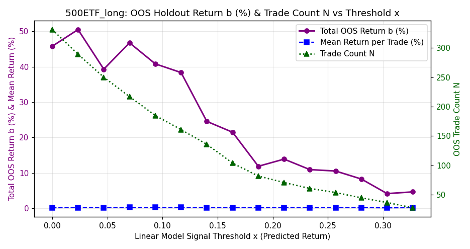<br>


<br>


<br>


<br>


<br>


</details>

### 500ETF_short

- **Selected Model**: SKGLM_HUBER_L1
- **Tuned Stability Threshold**: 0.16
- **Samples**: 2722 (2015-04-07 → 2026-06-17)
- **Holdout**: 544 days (2024-03-19 → 2026-06-17)
- **Target stats**: mean=0.0195%, std=1.1474%, Sharpe=0.27
- **Selected features (77)**: `yesterday_early_vwap_dev, bb_width, measured_move_proximity, gap_pct, margin_short_ratio, yesterday_intraday_close_position, bar_vwap_dev_2, yesterday_day_skew, volume_dryup_ratio, early_doji_count, yesterday_opening_gap_reversal, bar_vwap_dev_0, volume_surge_direction, yesterday_early_momentum, yesterday_early_kurtosis, opening_gap_reversal, macd_hist, intraday_bullish_fvg, yesterday_day_realized_vol, volume_weighted_price_position, inside_bar_failure_bull, bar_rng_1, yesterday_day_kurtosis, close_vs_open_range, range_expansion_ratio, bar_rng_2, vwap_cross_count, bar_rng_3, first_bar_body_ratio, first_bar_return, yesterday_early_skew, bar_ret_0, northbound_net, spike_exhaustion_ratio, bar_ret_4, intraday_bearish_fvg, late_bar_momentum, opening_range_size, vol5, upper_shadow_rejection, vwap_touch_count, yesterday_gap_pct, barbed_wire_intensity, bar_rng_0, bar_vwap_dev_1, or_fill_ratio, vol_ratio_10_60, max_down_ret, yesterday_first_bar_return, yesterday_spike_exhaustion_ratio, max_up_ret, yesterday_body_ratio, bar_rng_4, yesterday_day_pm_am_vol_ratio, trend_exhaustion_early, volume_climax_exhaustion, yesterday_gap, vol60, bar_vwap_dev_3, sma100_dist, roc10, first_bar_sentiment, intraday_autocorr, volume_concentration, volume_trend_intraday, pullback_depth_max, capital_net_ratio, lower_shadow_rejection, body_to_range_ratio, early_kurtosis, yesterday_am_return, momentum_divergence, yesterday_day_late_mom, decision_bar_range_rank, capital_net_value, early_bearish_engulfing_count, gap_fill_ratio`

#### Selected Feature Stability Scores (Block Bootstrap)

<details>
<summary><b>Click to expand Feature Stability Scores Table</b></summary>

| Feature | Stability Score | Status | Pearson $r$ | Spearman $\rho$ | Monotonicity Score | Mutual Info | Quality Rating | Holdout IC | Yearly ICs | Yearly IC Std |
|---------|-----------------|--------|-------------|-----------------|--------------------|-------------|----------------|------------|------------|---------------|
| yesterday_early_vwap_dev | 63.6% | **Selected** | +0.1047 | +0.0822 | +0.90 | 0.0290 | *** Strong Monotonic | +0.0866 | 15:+0.10 16:+0.09 17:+0.04 18:+0.06 19:+0.03 20:+0.16 21:+0.04 22:+0.16 23:+0.05 24:+0.02 25:+0.04 26:+0.22 | 0.0619 |
| bb_width | 62.4% | **Selected** | -0.0362 | -0.0561 | -1.00 | 0.0631 | ** Non-Linear Monotonic | -0.0604 | 15:-0.01 16:-0.02 17:-0.06 18:-0.09 19:-0.03 20:+0.01 21:+0.06 22:-0.17 23:-0.13 24:-0.11 25:-0.03 26:-0.08 | 0.0619 |
| measured_move_proximity | 58.0% | **Selected** | +0.0142 | +0.0149 | N/A | 0.0144 | N/A | -0.0136 | 15:+0.05 16:-0.04 17:-0.05 18:+0.06 19:+0.08 20:+0.08 21:-0.03 22:+0.01 23:+0.00 24:-0.15 25:-0.07 26:+0.20 | 0.0848 |
| gap_pct | 57.2% | **Selected** | +0.0412 | +0.0358 | +0.60 | 0.0388 | ** Moderate Monotonic | +0.0767 | 15:+0.07 16:+0.04 17:+0.05 18:+0.00 19:+0.08 20:-0.00 21:-0.06 22:+0.02 23:+0.02 24:-0.01 25:+0.06 26:+0.17 | 0.0544 |
| margin_short_ratio | 56.8% | **Selected** | -0.0018 | +0.0092 | +0.60 | 0.0511 | ** Moderate Monotonic | +0.0041 | 15:-0.08 16:+0.02 17:+0.13 18:-0.07 19:-0.09 20:+0.05 21:+0.03 22:+0.08 23:+0.01 24:+0.07 25:-0.03 26:+0.04 | 0.0646 |
| yesterday_intraday_close_position | 54.0% | **Selected** | +0.0944 | +0.0926 | +0.80 | 0.0057 | ** Moderate Monotonic | +0.0756 | 15:+0.10 16:+0.07 17:+0.04 18:+0.05 19:+0.08 20:+0.20 21:-0.02 22:+0.21 23:+0.13 24:-0.00 25:+0.06 26:+0.19 | 0.0721 |
| bar_vwap_dev_2 | 54.0% | **Selected** | +0.0781 | +0.0729 | +0.80 | 0.0387 | ** Moderate Monotonic | +0.0601 | 15:+0.10 16:+0.03 17:+0.06 18:+0.06 19:+0.06 20:+0.10 21:+0.08 22:+0.03 23:+0.08 24:+0.08 25:+0.06 26:+0.00 | 0.0278 |
| yesterday_day_skew | 49.6% | **Selected** | -0.0012 | +0.0036 | -0.20 | 0.0000 | * Non-Monotonic / Weak | +0.0245 | 15:+0.02 16:+0.01 17:-0.02 18:-0.01 19:-0.04 20:+0.03 21:-0.01 22:+0.09 23:+0.05 24:+0.03 25:-0.04 26:+0.07 | 0.0394 |
| volume_dryup_ratio | 47.2% | **Selected** | +0.0252 | +0.0318 | N/A | 0.0034 | N/A | +0.0430 | 15:-0.01 16:+0.12 17:+0.03 18:-0.03 19:+0.10 20:+0.03 22:-0.05 23:+0.07 24:+0.09 25:+0.04 26:-0.10 | 0.0639 |
| early_doji_count | 44.0% | **Selected** | -0.0373 | -0.0208 | N/A | 0.0000 | N/A | -0.0617 | 15:-0.10 16:+0.02 17:+0.06 18:-0.08 19:-0.00 20:-0.02 21:-0.03 22:+0.11 23:-0.07 24:-0.00 25:-0.13 26:+0.07 | 0.0700 |
| yesterday_opening_gap_reversal | 43.6% | **Selected** | +0.0125 | +0.0121 | +1.00 | 0.0000 | *** Strong Monotonic | +0.0401 | 15:+0.04 16:-0.12 17:+0.01 18:+0.02 19:+0.01 20:-0.01 21:+0.16 22:-0.08 23:-0.09 24:+0.10 25:+0.02 26:-0.04 | 0.0757 |
| bar_vwap_dev_0 | 43.2% | **Selected** | -0.0224 | -0.0317 | N/A | 0.0000 | N/A | N/A | N/A | N/A |
| volume_surge_direction | 42.0% | **Selected** | +0.1240 | +0.0946 | +1.00 | 0.0029 | *** Strong Monotonic | +0.1206 | 15:+0.25 16:+0.05 17:+0.04 18:+0.19 19:+0.08 20:+0.06 21:+0.08 22:+0.12 23:+0.03 24:+0.09 25:+0.15 26:+0.07 | 0.0636 |
| yesterday_early_momentum | 38.0% | **Selected** | +0.0983 | +0.0853 | +1.00 | 0.0062 | *** Strong Monotonic | +0.0719 | 15:+0.11 16:+0.08 17:+0.05 18:+0.07 19:+0.04 20:+0.22 21:-0.00 22:+0.16 23:+0.05 24:+0.02 25:+0.03 26:+0.21 | 0.0710 |
| yesterday_early_kurtosis | 37.6% | **Selected** | -0.0028 | +0.0064 | -0.10 | 0.0000 | * Non-Monotonic / Weak | -0.0444 | 15:-0.06 16:+0.06 17:+0.04 18:+0.09 19:-0.03 20:+0.03 21:+0.05 22:+0.03 23:-0.05 24:-0.05 25:+0.02 26:-0.13 | 0.0601 |
| opening_gap_reversal | 36.8% | **Selected** | -0.0617 | +0.0043 | -1.00 | 0.0019 | *** Strong Monotonic | +0.0547 | 15:-0.05 16:-0.03 17:-0.02 18:-0.04 19:+0.03 20:-0.05 21:-0.11 22:+0.06 23:+0.06 24:+0.01 25:+0.03 26:+0.06 | 0.0516 |
| macd_hist | 36.8% | **Selected** | +0.0430 | +0.0232 | +0.30 | 0.0172 | * Non-Monotonic / Weak | +0.0423 | 15:+0.12 16:-0.02 17:-0.07 18:-0.01 19:+0.00 20:+0.02 21:-0.12 22:+0.04 23:-0.01 24:-0.07 25:+0.05 26:+0.09 | 0.0654 |
| intraday_bullish_fvg | 36.4% | **Selected** | -0.0013 | +0.0292 | N/A | 0.0000 | N/A | -0.0043 | 15:+0.01 16:+0.03 17:+0.07 18:+0.07 19:+0.06 20:-0.07 21:+0.08 22:-0.08 23:+0.10 24:-0.06 25:-0.01 26:+0.13 | 0.0665 |
| yesterday_day_realized_vol | 36.0% | **Selected** | -0.0043 | +0.0366 | +0.90 | 0.0658 | ** Non-Linear Monotonic | -0.0039 | 15:-0.03 16:+0.04 17:+0.02 18:-0.04 19:+0.02 20:+0.00 21:+0.09 22:+0.06 23:+0.04 24:+0.11 25:-0.01 26:-0.10 | 0.0563 |
| volume_weighted_price_position | 34.4% | **Selected** | +0.0896 | +0.0934 | +0.90 | 0.0031 | *** Strong Monotonic | +0.0612 | 15:+0.13 16:+0.08 17:+0.11 18:+0.12 19:+0.12 20:+0.03 21:+0.19 22:-0.00 23:+0.08 24:+0.14 25:+0.09 26:-0.13 | 0.0796 |
| inside_bar_failure_bull | 34.0% | **Selected** | -0.0054 | -0.0022 | N/A | 0.0000 | N/A | -0.0446 | 15:-0.01 16:-0.05 17:-0.02 18:+0.04 19:-0.14 20:+0.11 21:+0.05 22:+0.07 23:-0.06 24:-0.01 25:-0.02 26:-0.07 | 0.0670 |
| bar_rng_1 | 34.0% | **Selected** | -0.0233 | +0.0046 | +0.00 | 0.0363 | * Non-Monotonic / Weak | -0.0276 | 15:-0.13 16:-0.01 17:-0.02 18:-0.00 19:+0.02 20:+0.02 21:-0.05 22:+0.00 23:+0.17 24:+0.04 25:-0.08 26:-0.07 | 0.0718 |
| yesterday_day_kurtosis | 32.8% | **Selected** | -0.0093 | -0.0422 | -0.90 | 0.0048 | ** Non-Linear Monotonic | -0.0507 | 15:-0.06 16:+0.01 17:-0.11 18:-0.16 19:-0.01 20:+0.10 21:-0.11 22:-0.04 23:-0.05 24:-0.04 25:-0.07 26:-0.04 | 0.0632 |
| close_vs_open_range | 32.4% | **Selected** | +0.0983 | +0.0935 | +0.90 | 0.0166 | *** Strong Monotonic | +0.1310 | 15:+0.20 16:+0.07 17:+0.17 18:+0.08 19:+0.02 20:+0.08 21:+0.07 22:+0.05 23:+0.07 24:+0.16 25:+0.15 26:-0.04 | 0.0650 |
| range_expansion_ratio | 30.4% | **Selected** | -0.0338 | +0.0137 | -0.30 | 0.0000 | * Non-Monotonic / Weak | -0.0457 | 15:+0.09 16:+0.02 17:-0.02 18:+0.11 19:+0.02 20:-0.01 21:-0.01 22:+0.02 23:+0.05 24:-0.14 25:-0.11 26:+0.08 | 0.0724 |
| bar_rng_2 | 30.0% | **Selected** | -0.0040 | +0.0115 | +0.60 | 0.0200 | ** Moderate Monotonic | -0.0411 | 15:-0.01 16:+0.01 17:-0.11 18:+0.05 19:-0.01 20:-0.01 21:+0.02 22:+0.06 23:+0.05 24:+0.03 25:-0.08 26:-0.01 | 0.0481 |
| vwap_cross_count | 29.6% | **Selected** | +0.0168 | -0.0040 | -0.50 | 0.0099 | ** Moderate Monotonic | -0.0049 | 15:+0.05 16:-0.09 17:+0.13 18:+0.03 19:+0.00 20:-0.00 21:-0.02 22:-0.05 23:-0.03 24:+0.01 25:-0.05 26:+0.07 | 0.0573 |
| bar_rng_3 | 29.6% | **Selected** | +0.0385 | +0.0346 | +0.70 | 0.0490 | ** Moderate Monotonic | -0.0003 | 15:+0.00 16:+0.06 17:+0.06 18:+0.10 19:-0.11 20:+0.09 21:+0.00 22:+0.09 23:+0.01 24:+0.06 25:+0.02 26:-0.13 | 0.0706 |
| first_bar_body_ratio | 29.6% | **Selected** | +0.0445 | +0.0488 | +0.80 | 0.0222 | ** Moderate Monotonic | +0.0870 | 15:-0.04 16:+0.21 17:+0.07 18:+0.04 19:+0.04 20:+0.14 21:-0.04 22:-0.03 23:-0.02 24:+0.01 25:+0.17 26:+0.03 | 0.0813 |
| first_bar_return | 29.2% | **Selected** | +0.1460 | +0.1212 | +1.00 | 0.0323 | *** Strong Monotonic | +0.0934 | 15:+0.25 16:+0.14 17:+0.11 18:+0.22 19:+0.11 20:+0.08 21:+0.10 22:+0.04 23:+0.06 24:+0.12 25:+0.13 26:-0.03 | 0.0710 |
| yesterday_early_skew | 28.4% | **Selected** | +0.0063 | +0.0063 | -0.20 | 0.0000 | * Non-Monotonic / Weak | +0.0051 | 15:+0.13 16:+0.01 17:-0.04 18:+0.00 19:+0.02 20:-0.05 21:-0.01 22:+0.05 23:-0.02 24:+0.02 25:+0.00 26:-0.04 | 0.0455 |
| bar_ret_0 | 27.2% | **Selected** | +0.1463 | +0.1212 | +1.00 | 0.0322 | *** Strong Monotonic | +0.0934 | 15:+0.25 16:+0.14 17:+0.11 18:+0.22 19:+0.11 20:+0.08 21:+0.10 22:+0.04 23:+0.06 24:+0.12 25:+0.13 26:-0.03 | 0.0710 |
| northbound_net | 27.2% | **Selected** | +0.0326 | +0.0303 | +0.60 | 0.0072 | ** Moderate Monotonic | -0.0371 | 15:-0.01 16:+0.10 17:-0.04 18:+0.05 19:+0.11 20:+0.06 21:-0.02 22:+0.02 23:+0.09 24:-0.01 26:+nan | nan |
| spike_exhaustion_ratio | 26.8% | **Selected** | -0.0045 | +0.0297 | +0.10 | 0.0256 | * Non-Monotonic / Weak | +0.0272 | 15:-0.09 16:+0.13 17:+0.02 18:-0.03 19:-0.01 20:+0.07 21:+0.06 22:-0.01 23:+0.20 24:+0.03 25:+0.03 26:+0.04 | 0.0714 |
| bar_ret_4 | 25.6% | **Selected** | +0.0064 | +0.0079 | +0.90 | 0.0457 | *** Strong Monotonic | +0.0224 | 15:-0.07 16:+0.09 17:+0.04 18:-0.04 19:-0.03 20:+0.01 21:-0.05 22:+0.02 23:+0.07 24:+0.10 25:+0.04 26:-0.15 | 0.0709 |
| intraday_bearish_fvg | 25.2% | **Selected** | -0.0401 | -0.0138 | N/A | 0.0000 | N/A | +0.0120 | 15:-0.01 16:+0.01 17:-0.05 18:+0.00 19:-0.08 20:-0.00 21:-0.03 22:-0.13 23:+0.06 24:+0.03 25:-0.11 26:+0.08 | 0.0621 |
| late_bar_momentum | 25.2% | **Selected** | -0.0864 | -0.0837 | -1.00 | 0.0247 | *** Strong Monotonic | -0.0574 | 15:-0.18 16:-0.04 17:-0.16 18:-0.18 19:-0.10 20:-0.06 21:-0.14 22:+0.04 23:-0.02 24:-0.03 25:-0.04 26:-0.10 | 0.0657 |
| opening_range_size | 24.8% | **Selected** | +0.0002 | +0.0524 | +0.90 | 0.0649 | ** Non-Linear Monotonic | +0.0486 | 15:-0.08 16:+0.10 17:+0.05 18:+0.08 19:-0.05 20:+0.07 21:+0.02 22:+0.04 23:+0.10 24:+0.08 25:+0.10 26:+0.04 | 0.0555 |
| vol5 | 24.0% | **Selected** | +0.0309 | +0.0336 | +0.30 | 0.0372 | * Non-Monotonic / Weak | -0.0154 | 15:+0.01 16:+0.01 17:+0.12 18:+0.02 19:+0.01 20:-0.05 21:+0.10 22:+0.14 23:+0.04 24:-0.01 25:+0.01 26:-0.02 | 0.0564 |
| upper_shadow_rejection | 24.0% | **Selected** | +0.0271 | +0.0156 | +0.30 | 0.0000 | * Non-Monotonic / Weak | +0.0376 | 15:+0.08 16:+0.15 17:+0.07 18:-0.02 19:-0.08 20:-0.01 21:-0.10 22:-0.04 23:+0.05 24:+0.01 25:-0.08 26:+0.27 | 0.1034 |
| vwap_touch_count | 23.6% | **Selected** | -0.0054 | -0.0313 | +0.50 | 0.0021 | ** Moderate Monotonic | -0.0415 | 15:-0.01 16:-0.07 17:+0.04 18:-0.04 19:-0.02 20:-0.03 21:-0.05 22:+0.06 23:-0.20 24:+0.05 25:-0.02 26:-0.11 | 0.0693 |
| yesterday_gap_pct | 23.6% | **Selected** | +0.0383 | +0.0175 | +0.40 | 0.0000 | * Non-Monotonic / Weak | +0.0535 | 15:+0.09 16:-0.11 17:-0.04 18:-0.05 19:+0.02 20:+0.03 21:+0.07 22:-0.00 23:+0.01 24:+0.06 25:+0.04 26:-0.02 | 0.0545 |
| barbed_wire_intensity | 23.6% | **Selected** | +0.0401 | +0.0193 | N/A | 0.0000 | N/A | +0.0715 | 16:+0.08 18:+0.03 19:-0.07 20:-0.09 21:-0.00 22:-0.02 23:+0.01 24:+0.17 25:+0.07 26:+0.03 | 0.0710 |
| bar_rng_0 | 23.6% | **Selected** | -0.0001 | +0.0520 | +0.90 | 0.0662 | ** Non-Linear Monotonic | +0.0479 | 15:-0.08 16:+0.10 17:+0.05 18:+0.08 19:-0.04 20:+0.07 21:+0.02 22:+0.04 23:+0.09 24:+0.08 25:+0.10 26:+0.04 | 0.0560 |
| bar_vwap_dev_1 | 23.2% | **Selected** | +0.0854 | +0.0651 | +1.00 | 0.0325 | *** Strong Monotonic | +0.0648 | 15:+0.09 16:+0.11 17:+0.14 18:+0.01 19:+0.07 20:+0.02 21:+0.14 22:-0.02 23:+0.11 24:+0.07 25:-0.02 26:+0.08 | 0.0551 |
| or_fill_ratio | 23.2% | **Selected** | +0.0759 | +0.0739 | +0.70 | 0.0000 | ** Moderate Monotonic | +0.1082 | 15:+0.15 16:+0.03 17:+0.16 18:+0.04 19:+0.03 20:+0.05 21:+0.05 22:+0.06 23:+0.07 24:+0.14 25:+0.11 26:-0.04 | 0.0571 |
| vol_ratio_10_60 | 23.2% | **Selected** | +0.0425 | +0.0374 | +0.60 | 0.0000 | ** Moderate Monotonic | +0.0089 | 15:+0.02 16:+0.06 17:+0.07 18:+0.11 19:+0.08 20:+0.03 21:+0.07 22:-0.01 23:+0.04 24:-0.01 25:+0.04 26:-0.08 | 0.0484 |
| max_down_ret | 22.8% | **Selected** | +0.1199 | +0.0933 | +1.00 | 0.0371 | *** Strong Monotonic | +0.1319 | 15:+0.20 16:+0.09 17:+0.20 18:+0.10 19:+0.07 20:+0.13 21:+0.07 22:+0.04 23:+0.01 24:+0.13 25:+0.17 26:-0.00 | 0.0651 |
| yesterday_first_bar_return | 22.8% | **Selected** | -0.0144 | +0.0263 | +0.50 | 0.0083 | * Non-Monotonic / Weak | +0.0867 | 15:+0.02 16:+0.06 17:-0.01 18:-0.13 19:+0.07 20:-0.03 21:-0.07 22:+0.08 23:+0.12 24:+0.02 25:+0.10 26:+0.09 | 0.0723 |
| yesterday_spike_exhaustion_ratio | 22.4% | **Selected** | +0.0234 | +0.0183 | +0.90 | 0.0063 | *** Strong Monotonic | +0.0239 | 15:+0.15 16:+0.06 17:-0.01 18:-0.01 19:-0.03 20:+0.04 21:+0.05 22:+0.01 23:+0.03 24:+0.07 25:-0.05 26:+0.02 | 0.0509 |
| max_up_ret | 22.0% | **Selected** | +0.1443 | +0.1276 | +0.90 | 0.0100 | *** Strong Monotonic | +0.1102 | 15:+0.28 16:+0.13 17:+0.16 18:+0.20 19:+0.03 20:+0.11 21:+0.13 22:+0.04 23:+0.11 24:+0.15 25:+0.12 26:-0.02 | 0.0750 |
| yesterday_body_ratio | 22.0% | **Selected** | +0.0101 | +0.0025 | +0.50 | 0.0000 | * Non-Monotonic / Weak | -0.0121 | 15:+0.01 16:+0.06 17:+0.05 18:+0.10 19:+0.00 20:-0.14 21:-0.13 22:+0.04 23:+0.07 24:+0.02 25:-0.10 26:+0.08 | 0.0783 |
| bar_rng_4 | 22.0% | **Selected** | +0.0421 | +0.0002 | +0.00 | 0.0526 | * Non-Monotonic / Weak | -0.0764 | 15:-0.04 16:+0.01 17:-0.05 18:+0.07 19:-0.02 20:+0.02 21:-0.03 22:+0.05 23:-0.01 24:+0.04 25:-0.10 26:-0.15 | 0.0597 |
| yesterday_day_pm_am_vol_ratio | 21.6% | **Selected** | +0.0262 | +0.0221 | +0.60 | 0.0301 | ** Moderate Monotonic | -0.0446 | 15:-0.06 16:+0.08 17:+0.05 18:+0.17 19:+0.02 20:-0.03 21:+0.04 22:+0.01 23:+0.03 24:+0.05 25:-0.11 26:+0.01 | 0.0667 |
| trend_exhaustion_early | 21.2% | **Selected** | -0.0370 | -0.0474 | -0.60 | 0.0000 | ** Moderate Monotonic | -0.0756 | 15:-0.01 16:-0.11 17:-0.10 18:-0.16 19:+0.01 20:+0.00 21:-0.03 22:+0.00 23:-0.00 24:-0.00 25:-0.06 26:-0.23 | 0.0731 |
| volume_climax_exhaustion | 21.2% | **Selected** | -0.0002 | -0.0037 | +0.30 | 0.0000 | * Non-Monotonic / Weak | +0.0047 | 15:+0.06 16:-0.15 17:-0.05 18:-0.01 19:+0.07 20:-0.02 21:-0.08 22:+0.10 23:+0.01 24:+0.01 25:-0.06 26:+0.05 | 0.0692 |
| yesterday_gap | 21.2% | **Selected** | +0.0383 | +0.0175 | +0.40 | 0.0000 | * Non-Monotonic / Weak | +0.0535 | 15:+0.09 16:-0.11 17:-0.04 18:-0.05 19:+0.02 20:+0.03 21:+0.07 22:-0.00 23:+0.01 24:+0.06 25:+0.04 26:-0.02 | 0.0545 |
| vol60 | 20.8% | **Selected** | +0.0222 | +0.0204 | +0.40 | 0.0458 | * Non-Monotonic / Weak | -0.0016 | 15:+0.02 16:+0.01 17:+0.12 18:+0.06 19:-0.08 20:-0.09 21:+0.02 22:+0.19 23:+0.09 24:+0.08 25:-0.04 26:-0.02 | 0.0785 |
| bar_vwap_dev_3 | 20.0% | **Selected** | +0.0376 | +0.0472 | +0.70 | 0.0222 | ** Moderate Monotonic | +0.0404 | 15:+0.10 16:+0.03 17:+0.07 18:-0.00 19:-0.01 20:+0.05 21:+0.01 22:+0.11 23:+0.06 24:+0.02 25:+0.07 26:-0.03 | 0.0417 |
| sma100_dist | 20.0% | **Selected** | -0.0730 | -0.0389 | -0.90 | 0.0489 | *** Strong Monotonic | +0.0163 | 15:-0.19 16:-0.06 17:-0.09 18:-0.10 19:-0.03 20:-0.07 21:-0.16 22:-0.10 23:-0.12 24:-0.03 25:-0.02 26:+0.05 | 0.0627 |
| roc10 | 20.0% | **Selected** | -0.0115 | +0.0155 | -0.20 | 0.0411 | * Non-Monotonic / Weak | +0.0465 | 15:+0.03 16:-0.10 17:-0.10 18:-0.03 19:+0.03 20:+0.01 21:-0.17 22:+0.05 23:-0.00 24:-0.03 25:+0.03 26:+0.11 | 0.0740 |
| first_bar_sentiment | 20.0% | **Selected** | +0.1028 | +0.0948 | N/A | 0.0101 | N/A | +0.0998 | 15:+0.24 16:+0.08 17:+0.05 18:+0.16 19:+0.08 20:+0.06 21:+0.09 22:+0.06 23:+0.04 24:+0.08 25:+0.12 26:+0.05 | 0.0537 |
| intraday_autocorr | 19.6% | **Selected** | -0.0051 | +0.0075 | -0.20 | 0.0000 | * Non-Monotonic / Weak | -0.0167 | 15:-0.07 16:+0.07 17:+0.13 18:-0.11 19:+0.08 20:+0.03 21:-0.03 22:+0.05 23:-0.04 24:+0.00 25:-0.05 26:+0.06 | 0.0688 |
| volume_concentration | 19.6% | **Selected** | -0.0285 | -0.0181 | -0.70 | 0.0000 | ** Moderate Monotonic | +0.0542 | 15:-0.05 16:-0.03 17:-0.05 18:-0.09 19:+0.05 20:+0.03 21:-0.12 22:-0.02 23:+0.06 24:+0.09 25:-0.01 26:-0.04 | 0.0581 |
| volume_trend_intraday | 19.2% | **Selected** | +0.0138 | +0.0137 | +0.60 | 0.0213 | ** Moderate Monotonic | -0.0732 | 15:+0.00 16:+0.07 17:-0.01 18:+0.10 19:-0.02 20:-0.04 21:+0.06 22:+0.02 23:-0.01 24:-0.10 25:-0.01 26:-0.00 | 0.0517 |
| pullback_depth_max | 18.8% | **Selected** | -0.0618 | -0.0690 | -0.90 | 0.0106 | *** Strong Monotonic | -0.0577 | 15:-0.11 16:-0.04 17:-0.13 18:-0.04 19:-0.11 20:-0.03 21:-0.08 22:-0.01 23:-0.06 24:-0.10 25:-0.12 26:+0.07 | 0.0556 |
| capital_net_ratio | 18.4% | **Selected** | +0.0040 | -0.0040 | -0.10 | 0.0067 | * Non-Monotonic / Weak | +0.0098 | 17:-0.07 18:+0.05 19:-0.01 20:-0.02 21:-0.04 22:-0.00 23:-0.16 24:+0.04 25:+0.00 26:+0.08 | 0.0643 |
| lower_shadow_rejection | 18.0% | **Selected** | -0.0273 | -0.0188 | -0.70 | 0.0000 | ** Moderate Monotonic | -0.0759 | 15:+0.01 16:+0.00 17:-0.12 18:-0.05 19:-0.01 20:-0.07 21:+0.10 22:+0.07 23:-0.04 24:+0.04 25:-0.15 26:-0.05 | 0.0702 |
| body_to_range_ratio | 17.6% | **Selected** | +0.0366 | +0.0520 | +0.70 | 0.0000 | ** Moderate Monotonic | +0.0656 | 15:+0.06 16:+0.11 17:+0.12 18:+0.16 19:-0.00 20:+0.06 21:+0.00 22:-0.00 23:-0.03 24:-0.03 25:+0.06 26:+0.16 | 0.0663 |
| early_kurtosis | 17.2% | **Selected** | +0.0021 | +0.0067 | +0.30 | 0.0157 | * Non-Monotonic / Weak | -0.0350 | 15:-0.01 16:+0.05 17:+0.05 18:+0.06 19:-0.02 20:-0.04 21:-0.02 22:+0.08 23:+0.02 24:-0.00 25:-0.09 26:+0.08 | 0.0493 |
| yesterday_am_return | 17.2% | **Selected** | +0.0471 | +0.0079 | +0.30 | 0.0077 | * Non-Monotonic / Weak | +0.0063 | 15:+0.05 16:+0.02 17:-0.06 18:-0.09 19:+0.07 20:+0.03 21:-0.10 22:+0.13 23:-0.03 24:-0.05 25:+0.02 26:-0.01 | 0.0661 |
| momentum_divergence | 17.2% | **Selected** | +0.0273 | +0.0238 | N/A | 0.0000 | N/A | +0.0234 | 15:+0.05 16:+0.02 17:+0.04 18:-0.06 19:+0.03 20:+0.05 21:-0.08 22:+0.07 23:+0.08 24:+0.02 25:+0.06 26:-0.09 | 0.0565 |
| yesterday_day_late_mom | 17.2% | **Selected** | +0.0062 | -0.0107 | -0.40 | 0.0151 | * Non-Monotonic / Weak | -0.0332 | 15:-0.03 16:+0.02 17:+0.06 18:+0.04 19:+0.00 20:-0.02 21:-0.03 22:+0.00 23:-0.09 24:+0.00 25:-0.02 26:-0.12 | 0.0477 |
| decision_bar_range_rank | 17.2% | **Selected** | -0.0128 | -0.0250 | +0.50 | 0.0000 | ** Moderate Monotonic | -0.0443 | 15:-0.01 16:-0.08 17:-0.06 18:+0.09 19:-0.00 20:-0.06 21:+0.01 22:-0.01 23:-0.07 24:+0.00 25:-0.07 26:-0.06 | 0.0463 |
| capital_net_value | 16.8% | **Selected** | +0.0367 | -0.0065 | -0.20 | 0.0289 | * Non-Monotonic / Weak | +0.0076 | 15:+nan 16:+nan 17:+0.05 18:+0.04 19:-0.02 20:-0.02 21:-0.03 22:-0.00 23:-0.15 24:+0.02 25:+0.01 26:+0.02 | nan |
| early_bearish_engulfing_count | 16.8% | **Selected** | +0.0055 | -0.0015 | N/A | 0.0000 | N/A | -0.0194 | 15:+0.12 16:+0.04 17:-0.06 18:-0.07 19:+0.05 20:-0.10 21:+0.11 22:-0.06 23:-0.01 24:-0.11 25:+0.08 26:-0.09 | 0.0818 |
| gap_fill_ratio | 16.4% | **Selected** | -0.0182 | -0.0065 | N/A | 0.0000 | N/A | +0.0153 | 15:-0.07 16:+0.10 17:-0.01 18:+0.01 19:-0.07 20:-0.04 21:-0.02 22:-0.07 23:-0.01 24:-0.01 25:-0.10 26:+0.17 | 0.0729 |

</details>

#### Metrics

| Metric | Best Linear | Ridge Base | Zero | Yesterday PM | First 30min Mom |
|--------|-------------|------------|------|--------------|-----------------|
| IC | +0.1492 | +0.1348 | +0.0000 | -0.0748 | +0.1142 |
| Dir Acc | 0.555 | 0.529 | 0.500 | 0.460 | 0.551 |
| RMSE | 1.0022% | 1.1061% | 1.0131% | 1.4746% | 1.1190% |
| L/S Sharpe | +2.60 | +3.10 | — | — | — |

#### Best Hyperparameters

<details>
<summary><b>Click to expand Best Hyperparameters JSON</b></summary>

```json
{
  "model_type": "skglm_huber_l1",
  "top_k_features": 77,
  "skglm_huber_l1_alpha": 0.04289676303472741,
  "skglm_huber_delta": 2.5942754794692027,
  "stability_threshold": 0.164
}
```

</details>

#### Walk-Forward Fold ICs

| Fold | IS IC | OOS IC |
|------|-------|--------|
| 1 | 0.3994 | +0.1271 |
| 2 | 0.2810 | +0.1499 |
| 3 | 0.2434 | +0.1081 |
| 4 | 0.2083 | +0.1535 |
| 5 | 0.1963 | +0.1308 |
| **Overall** | — | +0.1264 |

#### Year-by-Year OOS IC

| Year | IC | Dir Acc | N | L/S Sharpe |
|------|-----|---------|---|-----------|
| 2017 | +0.0444 | 0.502 | 215 | +0.04 |
| 2018 | +0.2052 | 0.531 | 243 | +6.89 |
| 2019 | +0.1018 | 0.492 | 244 | +2.78 |
| 2020 | +0.1772 | 0.572 | 243 | +3.09 |
| 2021 | +0.1509 | 0.539 | 243 | +2.06 |
| 2022 | +0.1151 | 0.508 | 242 | +4.04 |
| 2023 | +0.1638 | 0.521 | 242 | +3.72 |
| 2024 | +0.1424 | 0.570 | 242 | +3.15 |
| 2025 | +0.1446 | 0.556 | 243 | +1.55 |
| 2026 | +0.0991 | 0.528 | 108 | +2.73 |

#### Diagnostic Plots

<details>
<summary><b>Click to expand Diagnostic Plots</b></summary>

<br>


<br>


<br>


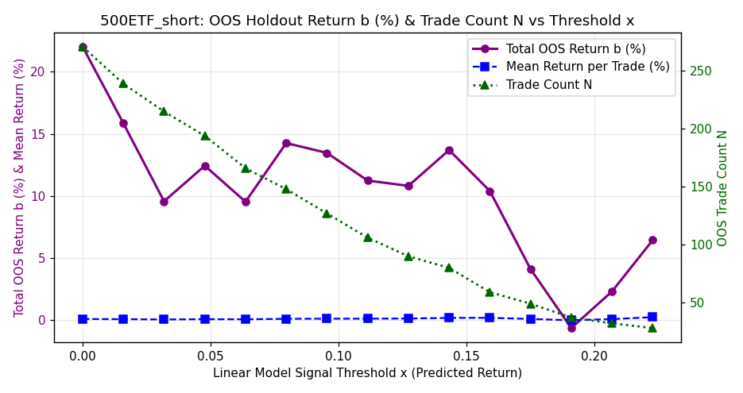<br>


<br>


<br>


<br>


<br>


</details>

### 588000ETF_long

- **Selected Model**: SKGLM_MCP
- **Tuned Stability Threshold**: 0.10
- **Samples**: 1294 (2021-02-09 → 2026-06-17)
- **Holdout**: 258 days (2025-05-27 → 2026-06-17)
- **Target stats**: mean=-0.0044%, std=1.3690%, Sharpe=-0.05
- **Selected features (64)**: `yesterday_day_realized_vol, vol5, roc5, pullback_depth_max, volume_weighted_price_position, bar_ret_2, yearly_high_distance, yesterday_day_kurtosis, yesterday_body_ratio, volatility_percentile_20d, yesterday_early_skew, body_to_range_ratio, vwap_deviation_max, sma100_dist, bb_width, yesterday_early_range, bar_vwap_dev_0, yesterday_opening_gap_reversal, vol_ratio_5_20, early_trend_hhi, decision_bar_range_rank, consecutive_bearish_engulfing, yesterday_early_realized_vol, sma200_dist, vol_ratio_10_60, margin_short_ratio, bar_vwap_dev_1, yesterday_pm_return, cci14, decision_bar_reversal_signal, early_range, yesterday_first_bar_volume, capital_net_value, yesterday_day_pm_am_vol_ratio, yesterday_day_vwap_dev, inside_bar_failure_bear, vix_diff_1d, capital_net_ratio, sma10_dist, yesterday_day_skew, inside_bar_compression, early_bullish_hammer, upper_wick_dominance, intraday_bullish_fvg, volume_trend_intraday, volume_percentile_20d, range_expansion_ratio, early_bearish_engulfing_count, yesterday_first_bar_return, adx_opening, yesterday_am_return, early_skew, opening_direction_stability, margin_net_buy, upper_shadow_rejection, bar_ret_1, yesterday_gap_pct, measured_move_proximity, trend_bar_dominance, early_bearish_shooting_star, max_up_ret, gap_pct, northbound_sell, volume_climax_exhaustion`

#### Selected Feature Stability Scores (Block Bootstrap)

<details>
<summary><b>Click to expand Feature Stability Scores Table</b></summary>

| Feature | Stability Score | Status | Pearson $r$ | Spearman $\rho$ | Monotonicity Score | Mutual Info | Quality Rating | Holdout IC | Yearly ICs | Yearly IC Std |
|---------|-----------------|--------|-------------|-----------------|--------------------|-------------|----------------|------------|------------|---------------|
| yesterday_day_realized_vol | 60.4% | **Selected** | +0.0612 | +0.0458 | +0.90 | 0.0380 | *** Strong Monotonic | -0.0176 | 21:+0.01 22:+0.19 23:-0.06 24:+0.08 25:+0.02 26:+0.03 | 0.0766 |
| vol5 | 39.6% | **Selected** | +0.0566 | +0.0443 | +0.70 | 0.0240 | ** Moderate Monotonic | -0.0448 | 21:+0.01 22:+0.18 23:+0.11 24:-0.01 25:+0.01 26:-0.02 | 0.0721 |
| roc5 | 37.2% | **Selected** | -0.0147 | -0.0026 | +0.00 | 0.0000 | * Non-Monotonic / Weak | -0.0143 | 21:-0.06 22:+0.05 23:+0.02 24:-0.08 25:-0.02 26:+0.05 | 0.0509 |
| pullback_depth_max | 34.0% | **Selected** | -0.1048 | -0.1069 | -0.90 | 0.0000 | *** Strong Monotonic | +0.0285 | 21:-0.23 22:-0.12 23:-0.12 24:-0.10 25:-0.06 26:+0.02 | 0.0752 |
| volume_weighted_price_position | 33.2% | **Selected** | +0.1182 | +0.1232 | +0.80 | 0.0000 | ** Moderate Monotonic | +0.0681 | 21:+0.29 22:+0.09 23:+0.12 24:+0.09 25:+0.05 26:+0.09 | 0.0787 |
| bar_ret_2 | 32.0% | **Selected** | +0.0033 | +0.0054 | +0.40 | 0.0000 | * Non-Monotonic / Weak | -0.0651 | 21:+0.01 22:-0.02 23:+0.12 24:-0.01 25:-0.01 26:-0.08 | 0.0577 |
| yearly_high_distance | 30.0% | **Selected** | +0.0060 | +0.0122 | +0.60 | 0.0005 | ** Moderate Monotonic | -0.0456 | 21:-0.14 22:-0.05 23:-0.05 24:-0.01 25:-0.04 26:-0.03 | 0.0424 |
| yesterday_day_kurtosis | 30.0% | **Selected** | -0.0229 | -0.0634 | -0.60 | 0.0069 | ** Moderate Monotonic | -0.0356 | 21:-0.11 22:-0.04 23:-0.06 24:-0.08 25:-0.05 26:-0.02 | 0.0309 |
| yesterday_body_ratio | 30.0% | **Selected** | +0.0004 | +0.0142 | +0.30 | 0.0174 | * Non-Monotonic / Weak | -0.0195 | 21:+0.03 22:-0.00 23:+0.10 24:-0.02 25:+0.03 26:-0.08 | 0.0541 |
| volatility_percentile_20d | 29.6% | **Selected** | +0.0841 | +0.0665 | +0.90 | 0.0222 | *** Strong Monotonic | -0.0048 | 21:+0.13 22:+0.11 23:+0.02 24:+0.04 25:+0.10 26:-0.05 | 0.0638 |
| yesterday_early_skew | 28.8% | **Selected** | -0.0420 | -0.0281 | -0.60 | 0.0000 | ** Moderate Monotonic | +0.0190 | 21:-0.10 22:-0.03 23:-0.07 24:+0.05 25:+0.03 26:-0.10 | 0.0603 |
| body_to_range_ratio | 26.8% | **Selected** | -0.0050 | +0.0154 | -0.30 | 0.0000 | * Non-Monotonic / Weak | -0.0199 | 21:+0.13 22:+0.03 23:-0.02 24:-0.01 25:-0.06 26:-0.02 | 0.0624 |
| vwap_deviation_max | 25.6% | **Selected** | -0.0189 | -0.0255 | -0.10 | 0.0000 | * Non-Monotonic / Weak | +0.1211 | 21:-0.04 22:-0.09 23:+0.02 24:-0.08 25:-0.04 26:+0.17 | 0.0883 |
| sma100_dist | 25.2% | **Selected** | -0.0296 | -0.0191 | -0.10 | 0.0556 | * Non-Monotonic / Weak | -0.0392 | 21:-0.03 22:-0.08 23:-0.05 24:-0.08 25:-0.06 26:+0.00 | 0.0286 |
| bb_width | 24.4% | **Selected** | -0.0634 | -0.0367 | -0.90 | 0.0166 | *** Strong Monotonic | +0.0096 | 21:+0.04 22:-0.12 23:-0.04 24:-0.08 25:-0.02 26:-0.06 | 0.0504 |
| yesterday_early_range | 24.0% | **Selected** | +0.0117 | +0.0197 | +0.50 | 0.0521 | * Non-Monotonic / Weak | -0.0134 | 21:-0.06 22:+0.11 23:-0.01 24:+0.01 25:+0.04 26:+0.04 | 0.0514 |
| bar_vwap_dev_0 | 23.6% | **Selected** | -0.0108 | -0.0175 | N/A | 0.0024 | N/A | N/A | N/A | N/A |
| yesterday_opening_gap_reversal | 22.8% | **Selected** | +0.0670 | +0.0392 | +0.80 | 0.0000 | ** Moderate Monotonic | +0.0945 | 21:+0.01 22:+0.00 23:-0.04 24:+0.08 25:+0.14 26:+0.01 | 0.0600 |
| vol_ratio_5_20 | 22.8% | **Selected** | +0.0433 | +0.0292 | +0.70 | 0.0033 | ** Moderate Monotonic | -0.0524 | 21:+0.05 22:+0.05 23:+0.12 24:-0.05 25:+0.04 26:-0.04 | 0.0568 |
| early_trend_hhi | 22.0% | **Selected** | -0.0102 | +0.0073 | N/A | 0.0066 | N/A | -0.0831 | 21:+0.13 22:+0.04 23:+0.00 24:-0.03 25:-0.08 26:-0.02 | 0.0642 |
| decision_bar_range_rank | 21.6% | **Selected** | -0.0198 | -0.0225 | N/A | 0.0053 | N/A | -0.0827 | 21:+0.05 22:-0.08 23:+0.06 24:-0.04 25:-0.02 26:-0.16 | 0.0763 |
| consecutive_bearish_engulfing | 19.6% | **Selected** | -0.0152 | -0.0102 | N/A | 0.0000 | N/A | +0.0722 | 21:-0.00 22:-0.05 23:-0.11 24:+0.04 25:+0.07 26:+0.07 | 0.0656 |
| yesterday_early_realized_vol | 19.2% | **Selected** | +0.0166 | -0.0002 | +0.40 | 0.0017 | * Non-Monotonic / Weak | -0.0335 | 21:-0.05 22:+0.04 23:-0.01 24:-0.04 25:+0.02 26:+0.09 | 0.0490 |
| sma200_dist | 18.4% | **Selected** | -0.0257 | -0.0033 | -0.30 | 0.0286 | * Non-Monotonic / Weak | -0.0808 | 21:-0.06 22:-0.14 23:-0.08 24:-0.08 25:-0.12 26:-0.02 | 0.0409 |
| vol_ratio_10_60 | 18.0% | **Selected** | +0.0534 | +0.0124 | +0.70 | 0.0001 | ** Moderate Monotonic | -0.0174 | 21:-0.08 22:+0.04 23:+0.01 24:-0.02 25:+0.09 26:-0.10 | 0.0644 |
| margin_short_ratio | 17.6% | **Selected** | +0.0183 | +0.0119 | +0.60 | 0.0455 | ** Moderate Monotonic | +0.0593 | 21:-0.05 22:+0.00 23:+0.09 24:+0.02 25:+0.06 26:+0.05 | 0.0440 |
| bar_vwap_dev_1 | 17.6% | **Selected** | +0.0523 | +0.0531 | +0.90 | 0.0154 | *** Strong Monotonic | +0.0586 | 21:+0.17 22:+0.01 23:+0.12 24:+0.06 25:-0.02 26:-0.01 | 0.0692 |
| yesterday_pm_return | 16.4% | **Selected** | -0.0155 | -0.0359 | -0.30 | 0.0161 | * Non-Monotonic / Weak | -0.2016 | 21:+0.09 22:-0.01 23:-0.04 24:+0.01 25:-0.09 26:-0.24 | 0.1040 |
| cci14 | 16.0% | **Selected** | +0.0351 | +0.0282 | +0.70 | 0.0008 | ** Moderate Monotonic | -0.0054 | 21:-0.04 22:+0.08 23:+0.01 24:+0.07 25:+0.00 26:+0.06 | 0.0435 |
| decision_bar_reversal_signal | 15.6% | **Selected** | -0.0122 | +0.0045 | N/A | 0.0000 | N/A | -0.0337 | 21:-0.01 22:+0.12 23:-0.03 24:-0.04 25:-0.06 26:+0.06 | 0.0616 |
| early_range | 15.6% | **Selected** | +0.0699 | +0.0144 | +0.50 | 0.0159 | * Non-Monotonic / Weak | +0.0320 | 21:-0.06 22:+0.15 23:-0.07 24:+0.01 25:-0.05 26:+0.07 | 0.0793 |
| yesterday_first_bar_volume | 15.6% | **Selected** | +0.0932 | +0.0411 | +0.80 | 0.0000 | ** Moderate Monotonic | -0.0210 | 21:+0.04 22:+0.11 23:-0.02 24:-0.03 25:+0.06 26:+0.08 | 0.0493 |
| capital_net_value | 15.2% | **Selected** | +0.0283 | -0.0619 | -1.00 | 0.0000 | ** Non-Linear Monotonic | -0.0003 | 21:-0.02 22:-0.09 23:-0.04 24:-0.14 25:-0.02 26:-0.03 | 0.0423 |
| yesterday_day_pm_am_vol_ratio | 15.2% | **Selected** | +0.0100 | +0.0133 | -0.20 | 0.0087 | * Non-Monotonic / Weak | +0.0358 | 21:-0.02 22:+0.04 23:+0.15 24:-0.02 25:-0.05 26:+0.04 | 0.0645 |
| yesterday_day_vwap_dev | 14.8% | **Selected** | -0.0269 | -0.0599 | -0.50 | 0.0379 | * Non-Monotonic / Weak | -0.1737 | 21:+0.00 22:-0.02 23:-0.06 24:-0.04 25:-0.08 26:-0.20 | 0.0641 |
| inside_bar_failure_bear | 14.8% | **Selected** | -0.0286 | -0.0152 | N/A | 0.0000 | N/A | -0.0459 | 21:-0.05 22:+0.01 23:-0.08 24:+0.03 25:+0.05 26:-0.11 | 0.0590 |
| vix_diff_1d | 14.0% | **Selected** | +0.1261 | +0.0665 | +0.80 | 0.0060 | ** Moderate Monotonic | +0.0526 | 23:+0.00 24:+0.16 25:+0.04 26:+0.10 | 0.0598 |
| capital_net_ratio | 14.0% | **Selected** | -0.0592 | -0.0736 | -0.90 | 0.0000 | *** Strong Monotonic | +0.0038 | 21:-0.03 22:-0.14 23:-0.04 24:-0.14 25:-0.03 26:-0.01 | 0.0524 |
| sma10_dist | 14.0% | **Selected** | -0.0071 | +0.0024 | -0.10 | 0.0000 | * Non-Monotonic / Weak | -0.0155 | 21:-0.03 22:+0.06 23:+0.01 24:-0.08 25:-0.03 26:+0.04 | 0.0482 |
| yesterday_day_skew | 14.0% | **Selected** | +0.0144 | +0.0015 | +0.10 | 0.0144 | * Non-Monotonic / Weak | +0.1410 | 21:-0.10 22:+0.04 23:-0.01 24:-0.01 25:+0.04 26:+0.09 | 0.0614 |
| inside_bar_compression | 14.0% | **Selected** | +0.0090 | +0.0035 | -0.50 | 0.0045 | ** Moderate Monotonic | -0.0683 | 21:-0.06 22:+0.02 23:-0.02 24:+0.10 25:+0.04 26:-0.14 | 0.0787 |
| early_bullish_hammer | 13.6% | **Selected** | -0.0155 | -0.0151 | N/A | 0.0005 | N/A | -0.0535 | 21:+0.07 22:+0.01 23:-0.03 24:-0.06 25:+0.00 26:-0.09 | 0.0511 |
| upper_wick_dominance | 12.8% | **Selected** | +0.0288 | -0.0525 | -0.70 | 0.0015 | ** Moderate Monotonic | -0.0613 | 21:-0.07 22:-0.08 23:-0.02 24:-0.04 25:-0.07 26:-0.08 | 0.0233 |
| intraday_bullish_fvg | 12.8% | **Selected** | +0.0571 | +0.0093 | N/A | 0.0000 | N/A | -0.0572 | 21:+0.00 22:+0.05 23:-0.05 24:+0.06 26:-0.08 | 0.0548 |
| volume_trend_intraday | 12.8% | **Selected** | +0.0070 | +0.0162 | +0.10 | 0.0000 | * Non-Monotonic / Weak | +0.0382 | 21:-0.09 22:+0.04 23:+0.09 24:+0.03 25:+0.04 26:+0.01 | 0.0544 |
| volume_percentile_20d | 12.8% | **Selected** | +0.0524 | +0.0294 | +0.30 | 0.0000 | * Non-Monotonic / Weak | -0.0400 | 21:+0.04 22:+0.15 23:-0.03 24:-0.05 25:+0.01 26:+0.01 | 0.0624 |
| range_expansion_ratio | 12.4% | **Selected** | +0.0225 | +0.0019 | -0.30 | 0.0000 | * Non-Monotonic / Weak | +0.0824 | 21:-0.01 22:+0.09 23:-0.02 24:-0.10 25:-0.03 26:+0.14 | 0.0794 |
| early_bearish_engulfing_count | 12.4% | **Selected** | +0.0159 | +0.0221 | N/A | 0.0039 | N/A | +0.0585 | 21:+0.06 22:-0.07 23:-0.00 24:+0.09 25:+0.02 26:+0.07 | 0.0542 |
| yesterday_first_bar_return | 12.4% | **Selected** | -0.0436 | +0.0225 | -0.20 | 0.0000 | * Non-Monotonic / Weak | -0.0411 | 21:+0.10 22:+0.04 23:+0.17 24:-0.05 25:-0.03 26:-0.08 | 0.0883 |
| adx_opening | 12.0% | **Selected** | +0.0449 | +0.0239 | N/A | 0.0005 | N/A | +0.0674 | 21:+0.04 22:-0.00 23:-0.01 24:-0.04 25:+0.04 26:+0.13 | 0.0561 |
| yesterday_am_return | 12.0% | **Selected** | +0.0192 | +0.0216 | +0.30 | 0.0439 | * Non-Monotonic / Weak | -0.0564 | 21:+0.04 22:+0.15 23:-0.00 24:-0.05 25:+0.00 26:-0.07 | 0.0739 |
| early_skew | 12.0% | **Selected** | -0.0173 | +0.0092 | -0.30 | 0.0153 | * Non-Monotonic / Weak | -0.0409 | 21:-0.02 22:+0.00 23:+0.08 24:+0.06 25:-0.06 26:-0.03 | 0.0486 |
| opening_direction_stability | 11.6% | **Selected** | -0.0102 | +0.0073 | N/A | 0.0068 | N/A | -0.0831 | 21:+0.13 22:+0.04 23:+0.00 24:-0.03 25:-0.08 26:-0.02 | 0.0642 |
| margin_net_buy | 11.6% | **Selected** | -0.0394 | -0.0229 | -0.90 | 0.0057 | *** Strong Monotonic | +0.0600 | 21:-0.01 22:-0.08 23:-0.02 24:-0.07 25:-0.03 26:+0.10 | 0.0561 |
| upper_shadow_rejection | 11.2% | **Selected** | -0.0463 | -0.0510 | -0.90 | 0.0000 | *** Strong Monotonic | -0.0718 | 21:-0.09 22:-0.07 23:-0.03 24:-0.07 25:+0.01 26:-0.07 | 0.0333 |
| bar_ret_1 | 10.8% | **Selected** | +0.0531 | +0.0537 | +0.80 | 0.0000 | ** Moderate Monotonic | +0.0624 | 21:+0.15 22:+0.01 23:+0.13 24:+0.06 25:-0.01 26:-0.01 | 0.0638 |
| yesterday_gap_pct | 10.8% | **Selected** | +0.1356 | +0.0385 | +0.60 | 0.0192 | ** Moderate Monotonic | +0.0551 | 21:-0.01 22:-0.02 23:+0.01 24:+0.10 25:+0.12 26:-0.01 | 0.0583 |
| measured_move_proximity | 10.8% | **Selected** | +0.0207 | +0.0108 | N/A | 0.0000 | N/A | +0.0076 | 21:+0.03 22:+0.10 23:-0.04 24:-0.05 25:-0.05 26:+0.06 | 0.0561 |
| trend_bar_dominance | 10.8% | **Selected** | -0.0276 | -0.0278 | -1.00 | 0.0168 | *** Strong Monotonic | -0.0075 | 21:-0.02 22:+0.01 23:-0.08 24:-0.04 25:+0.00 26:-0.09 | 0.0396 |
| early_bearish_shooting_star | 10.8% | **Selected** | -0.0046 | -0.0321 | N/A | 0.0044 | N/A | -0.0825 | 21:+0.05 22:-0.13 23:-0.05 24:-0.02 25:+0.05 26:-0.14 | 0.0760 |
| max_up_ret | 10.4% | **Selected** | +0.1308 | +0.0790 | +0.70 | 0.0000 | ** Moderate Monotonic | +0.0188 | 21:+0.16 22:+0.12 23:+0.08 24:+0.03 25:+0.01 26:+0.03 | 0.0536 |
| gap_pct | 10.4% | **Selected** | +0.0208 | -0.0034 | +0.30 | 0.0207 | * Non-Monotonic / Weak | +0.0165 | 21:+0.03 22:-0.03 23:+0.06 24:-0.07 25:+0.01 26:+0.01 | 0.0423 |
| northbound_sell | 10.4% | **Selected** | +0.0131 | -0.0005 | -0.20 | 0.0176 | * Non-Monotonic / Weak | N/A | 21:-0.16 22:+0.10 23:-0.02 24:+0.03 25:+nan 26:+nan | nan |
| volume_climax_exhaustion | 10.4% | **Selected** | +0.0115 | +0.0136 | +0.10 | 0.0000 | * Non-Monotonic / Weak | -0.0220 | 21:+0.03 22:+0.07 23:+0.06 24:-0.05 25:-0.07 26:+0.11 | 0.0654 |

</details>

#### Metrics

| Metric | Best Linear | Ridge Base | Zero | Yesterday PM | First 30min Mom |
|--------|-------------|------------|------|--------------|-----------------|
| IC | -0.0738 | -0.0277 | +0.0000 | -0.1324 | +0.0184 |
| Dir Acc | 0.457 | 0.450 | 0.500 | 0.403 | 0.496 |
| RMSE | 1.5659% | 1.7442% | 1.4761% | 2.1833% | 1.6720% |
| L/S Sharpe | -0.67 | +0.12 | — | — | — |

#### Best Hyperparameters

<details>
<summary><b>Click to expand Best Hyperparameters JSON</b></summary>

```json
{
  "model_type": "skglm_mcp",
  "top_k_features": 64,
  "skglm_mcp_alpha": 0.006139186430744701,
  "skglm_mcp_gamma": 2.0006951729626175,
  "stability_threshold": 0.10400000000000001
}
```

</details>

#### Walk-Forward Fold ICs

| Fold | IS IC | OOS IC |
|------|-------|--------|
| 1 | 0.6442 | +0.1627 |
| 2 | 0.4448 | +0.0736 |
| 3 | 0.3966 | +0.0498 |
| 4 | 0.3373 | +0.1274 |
| 5 | 0.2865 | -0.0290 |
| **Overall** | — | +0.0672 |

#### Year-by-Year OOS IC

| Year | IC | Dir Acc | N | L/S Sharpe |
|------|-----|---------|---|-----------|
| 2022 | +0.1671 | 0.475 | 240 | +4.30 |
| 2023 | +0.0741 | 0.500 | 242 | +2.43 |
| 2024 | +0.1495 | 0.537 | 242 | +4.86 |
| 2025 | +0.0206 | 0.465 | 243 | +1.04 |
| 2026 | -0.0980 | 0.454 | 108 | -3.13 |

#### Diagnostic Plots

<details>
<summary><b>Click to expand Diagnostic Plots</b></summary>

<br>


<br>


<br>


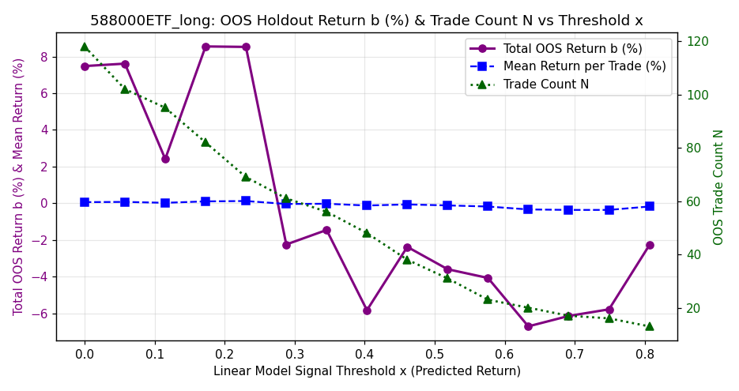<br>


<br>


<br>


<br>


<br>


</details>

### 588000ETF_short

- **Selected Model**: SKGLM_MCP
- **Tuned Stability Threshold**: 0.10
- **Samples**: 1294 (2021-02-09 → 2026-06-17)
- **Holdout**: 258 days (2025-05-27 → 2026-06-17)
- **Target stats**: mean=-0.0044%, std=1.3690%, Sharpe=-0.05
- **Selected features (79)**: `volume_weighted_price_position, yesterday_am_return, measured_move_proximity, yesterday_day_pm_am_vol_ratio, yesterday_first_bar_return, yesterday_early_realized_vol, volume_trend_intraday, pullback_depth_max, yesterday_spike_exhaustion_ratio, first_bar_return, bar_ret_0, inside_bar_failure_bear, volatility_percentile_20d, vwap_cross_count, upper_wick_dominance, gap_pct, margin_short_ratio, volume_climax_exhaustion, rally_strength_max, bar_rng_1, yesterday_day_kurtosis, upper_shadow_rejection, vol5, trend_adherence, decision_bar_reversal_signal, bar_rng_2, yesterday_body_ratio, capital_net_ratio, vwap_touch_count, consecutive_lower_lows, yesterday_early_skew, yesterday_opening_gap_reversal, consecutive_bearish_engulfing, opening_gap_reversal, early_skew, early_bearish_engulfing_count, early_bullish_engulfing_count, bar_vwap_dev_0, intraday_bullish_fvg, inside_bar_compression, lower_shadow_rejection, gap_fill_ratio, volume_price_corr, yesterday_day_late_mom, volume_percentile_20d, bb_width, yesterday_pm_return, momentum_divergence, cci14, northbound_net, vol_ratio_5_20, vol_ratio_10_60, early_bearish_shooting_star, first_bar_sentiment, consecutive_up_closes, yesterday_early_range, margin_net_buy, yesterday_gap, early_realized_vol, yesterday_day_skew, first_bar_body_ratio, open_efficiency, early_bullish_hammer, decision_bar_range_rank, trend_bar_dominance, early_doji_count, vwap_deviation_max, yesterday_first_bar_volume, bar_ret_2, early_trend_hhi, bar_rng_0, consecutive_down_closes, volume_slope, opening_range_size, consecutive_same_close_dir, yesterday_early_momentum, max_down_ret, volume_surge_direction, yearly_high_distance`

#### Selected Feature Stability Scores (Block Bootstrap)

<details>
<summary><b>Click to expand Feature Stability Scores Table</b></summary>

| Feature | Stability Score | Status | Pearson $r$ | Spearman $\rho$ | Monotonicity Score | Mutual Info | Quality Rating | Holdout IC | Yearly ICs | Yearly IC Std |
|---------|-----------------|--------|-------------|-----------------|--------------------|-------------|----------------|------------|------------|---------------|
| volume_weighted_price_position | 64.0% | **Selected** | +0.1182 | +0.1232 | +0.80 | 0.0000 | ** Moderate Monotonic | +0.0681 | 21:+0.29 22:+0.09 23:+0.12 24:+0.09 25:+0.05 26:+0.09 | 0.0787 |
| yesterday_am_return | 47.6% | **Selected** | +0.0192 | +0.0216 | +0.30 | 0.0439 | * Non-Monotonic / Weak | -0.0564 | 21:+0.04 22:+0.15 23:-0.00 24:-0.05 25:+0.00 26:-0.07 | 0.0739 |
| measured_move_proximity | 46.0% | **Selected** | +0.0207 | +0.0108 | N/A | 0.0000 | N/A | +0.0076 | 21:+0.03 22:+0.10 23:-0.04 24:-0.05 25:-0.05 26:+0.06 | 0.0561 |
| yesterday_day_pm_am_vol_ratio | 45.2% | **Selected** | +0.0100 | +0.0133 | -0.20 | 0.0087 | * Non-Monotonic / Weak | +0.0358 | 21:-0.02 22:+0.04 23:+0.15 24:-0.02 25:-0.05 26:+0.04 | 0.0645 |
| yesterday_first_bar_return | 42.8% | **Selected** | -0.0436 | +0.0225 | -0.20 | 0.0000 | * Non-Monotonic / Weak | -0.0411 | 21:+0.10 22:+0.04 23:+0.17 24:-0.05 25:-0.03 26:-0.08 | 0.0883 |
| yesterday_early_realized_vol | 40.4% | **Selected** | +0.0166 | -0.0002 | +0.40 | 0.0017 | * Non-Monotonic / Weak | -0.0335 | 21:-0.05 22:+0.04 23:-0.01 24:-0.04 25:+0.02 26:+0.09 | 0.0490 |
| volume_trend_intraday | 34.0% | **Selected** | +0.0070 | +0.0162 | +0.10 | 0.0000 | * Non-Monotonic / Weak | +0.0382 | 21:-0.09 22:+0.04 23:+0.09 24:+0.03 25:+0.04 26:+0.01 | 0.0544 |
| pullback_depth_max | 33.6% | **Selected** | -0.1048 | -0.1069 | -0.90 | 0.0000 | *** Strong Monotonic | +0.0285 | 21:-0.23 22:-0.12 23:-0.12 24:-0.10 25:-0.06 26:+0.02 | 0.0752 |
| yesterday_spike_exhaustion_ratio | 30.0% | **Selected** | +0.0020 | +0.0285 | +0.20 | 0.0000 | * Non-Monotonic / Weak | +0.0955 | 21:+0.02 22:-0.01 23:+0.05 24:-0.01 25:+0.08 26:+0.02 | 0.0317 |
| first_bar_return | 27.6% | **Selected** | +0.1231 | +0.0907 | +1.00 | 0.0341 | *** Strong Monotonic | -0.0147 | 21:+0.18 22:+0.13 23:+0.07 24:+0.06 25:+0.03 26:-0.01 | 0.0606 |
| bar_ret_0 | 27.2% | **Selected** | +0.1230 | +0.0907 | +1.00 | 0.0343 | *** Strong Monotonic | -0.0147 | 21:+0.18 22:+0.13 23:+0.07 24:+0.06 25:+0.03 26:-0.01 | 0.0606 |
| inside_bar_failure_bear | 27.2% | **Selected** | -0.0286 | -0.0152 | N/A | 0.0000 | N/A | -0.0459 | 21:-0.05 22:+0.01 23:-0.08 24:+0.03 25:+0.05 26:-0.11 | 0.0590 |
| volatility_percentile_20d | 25.6% | **Selected** | +0.0841 | +0.0665 | +0.90 | 0.0222 | *** Strong Monotonic | -0.0048 | 21:+0.13 22:+0.11 23:+0.02 24:+0.04 25:+0.10 26:-0.05 | 0.0638 |
| vwap_cross_count | 24.4% | **Selected** | +0.0452 | +0.0319 | N/A | 0.0000 | N/A | -0.0589 | 21:+0.10 22:+0.01 23:+0.07 24:+0.11 25:-0.04 26:-0.16 | 0.0944 |
| upper_wick_dominance | 24.4% | **Selected** | +0.0288 | -0.0525 | -0.70 | 0.0015 | ** Moderate Monotonic | -0.0613 | 21:-0.07 22:-0.08 23:-0.02 24:-0.04 25:-0.07 26:-0.08 | 0.0233 |
| gap_pct | 24.4% | **Selected** | +0.0208 | -0.0034 | +0.30 | 0.0207 | * Non-Monotonic / Weak | +0.0165 | 21:+0.03 22:-0.03 23:+0.06 24:-0.07 25:+0.01 26:+0.01 | 0.0423 |
| margin_short_ratio | 24.0% | **Selected** | +0.0183 | +0.0119 | +0.60 | 0.0455 | ** Moderate Monotonic | +0.0593 | 21:-0.05 22:+0.00 23:+0.09 24:+0.02 25:+0.06 26:+0.05 | 0.0440 |
| volume_climax_exhaustion | 24.0% | **Selected** | +0.0115 | +0.0136 | +0.10 | 0.0000 | * Non-Monotonic / Weak | -0.0220 | 21:+0.03 22:+0.07 23:+0.06 24:-0.05 25:-0.07 26:+0.11 | 0.0654 |
| rally_strength_max | 23.6% | **Selected** | +0.0928 | +0.0994 | +0.90 | 0.0000 | *** Strong Monotonic | +0.1534 | 21:+0.22 22:+0.04 23:+0.12 24:+0.05 25:+0.01 26:+0.21 | 0.0840 |
| bar_rng_1 | 23.6% | **Selected** | +0.0653 | +0.0035 | +0.60 | 0.0039 | ** Moderate Monotonic | +0.0157 | 21:-0.07 22:+0.10 23:-0.02 24:+0.06 25:-0.06 26:+0.04 | 0.0619 |
| yesterday_day_kurtosis | 23.2% | **Selected** | -0.0229 | -0.0634 | -0.60 | 0.0069 | ** Moderate Monotonic | -0.0356 | 21:-0.11 22:-0.04 23:-0.06 24:-0.08 25:-0.05 26:-0.02 | 0.0309 |
| upper_shadow_rejection | 22.8% | **Selected** | -0.0463 | -0.0510 | -0.90 | 0.0000 | *** Strong Monotonic | -0.0718 | 21:-0.09 22:-0.07 23:-0.03 24:-0.07 25:+0.01 26:-0.07 | 0.0333 |
| vol5 | 22.8% | **Selected** | +0.0566 | +0.0443 | +0.70 | 0.0240 | ** Moderate Monotonic | -0.0448 | 21:+0.01 22:+0.18 23:+0.11 24:-0.01 25:+0.01 26:-0.02 | 0.0721 |
| trend_adherence | 22.4% | **Selected** | +0.0011 | +0.0122 | N/A | 0.0018 | N/A | -0.0217 | 21:+0.12 22:+0.04 23:-0.03 24:-0.00 25:-0.09 26:+0.06 | 0.0653 |
| decision_bar_reversal_signal | 22.4% | **Selected** | -0.0122 | +0.0045 | N/A | 0.0000 | N/A | -0.0337 | 21:-0.01 22:+0.12 23:-0.03 24:-0.04 25:-0.06 26:+0.06 | 0.0616 |
| bar_rng_2 | 21.6% | **Selected** | +0.0138 | -0.0212 | -0.10 | 0.0590 | * Non-Monotonic / Weak | -0.0254 | 21:-0.06 22:-0.07 23:+0.01 24:+0.03 25:-0.04 26:-0.02 | 0.0340 |
| yesterday_body_ratio | 21.6% | **Selected** | +0.0004 | +0.0142 | +0.30 | 0.0174 | * Non-Monotonic / Weak | -0.0195 | 21:+0.03 22:-0.00 23:+0.10 24:-0.02 25:+0.03 26:-0.08 | 0.0541 |
| capital_net_ratio | 21.6% | **Selected** | -0.0592 | -0.0736 | -0.90 | 0.0000 | *** Strong Monotonic | +0.0038 | 21:-0.03 22:-0.14 23:-0.04 24:-0.14 25:-0.03 26:-0.01 | 0.0524 |
| vwap_touch_count | 21.2% | **Selected** | -0.0200 | -0.0169 | N/A | 0.0000 | N/A | -0.0745 | 21:-0.01 22:-0.11 23:+0.03 24:+0.02 25:+0.08 26:-0.16 | 0.0836 |
| consecutive_lower_lows | 20.8% | **Selected** | -0.0819 | -0.0768 | N/A | 0.0000 | N/A | -0.0077 | 21:-0.17 22:-0.01 23:-0.13 24:-0.12 25:+0.02 26:-0.02 | 0.0699 |
| yesterday_early_skew | 20.0% | **Selected** | -0.0420 | -0.0281 | -0.60 | 0.0000 | ** Moderate Monotonic | +0.0190 | 21:-0.10 22:-0.03 23:-0.07 24:+0.05 25:+0.03 26:-0.10 | 0.0603 |
| yesterday_opening_gap_reversal | 20.0% | **Selected** | +0.0670 | +0.0392 | +0.80 | 0.0000 | ** Moderate Monotonic | +0.0945 | 21:+0.01 22:+0.00 23:-0.04 24:+0.08 25:+0.14 26:+0.01 | 0.0600 |
| consecutive_bearish_engulfing | 19.6% | **Selected** | -0.0152 | -0.0102 | N/A | 0.0000 | N/A | +0.0722 | 21:-0.00 22:-0.05 23:-0.11 24:+0.04 25:+0.07 26:+0.07 | 0.0656 |
| opening_gap_reversal | 19.2% | **Selected** | -0.0225 | -0.0148 | -0.40 | 0.0003 | * Non-Monotonic / Weak | -0.0146 | 21:-0.03 22:-0.01 23:+0.00 24:-0.05 25:+0.00 26:+0.01 | 0.0232 |
| early_skew | 19.2% | **Selected** | -0.0173 | +0.0092 | -0.30 | 0.0153 | * Non-Monotonic / Weak | -0.0409 | 21:-0.02 22:+0.00 23:+0.08 24:+0.06 25:-0.06 26:-0.03 | 0.0486 |
| early_bearish_engulfing_count | 19.2% | **Selected** | +0.0159 | +0.0221 | N/A | 0.0039 | N/A | +0.0585 | 21:+0.06 22:-0.07 23:-0.00 24:+0.09 25:+0.02 26:+0.07 | 0.0542 |
| early_bullish_engulfing_count | 18.8% | **Selected** | +0.0138 | +0.0103 | N/A | 0.0124 | N/A | +0.0394 | 21:-0.08 22:-0.09 23:+0.11 24:+0.08 25:+0.08 26:-0.05 | 0.0833 |
| bar_vwap_dev_0 | 18.8% | **Selected** | -0.0108 | -0.0175 | N/A | 0.0024 | N/A | N/A | N/A | N/A |
| intraday_bullish_fvg | 18.4% | **Selected** | +0.0571 | +0.0093 | N/A | 0.0000 | N/A | -0.0572 | 21:+0.00 22:+0.05 23:-0.05 24:+0.06 26:-0.08 | 0.0548 |
| inside_bar_compression | 18.0% | **Selected** | +0.0090 | +0.0035 | -0.50 | 0.0045 | ** Moderate Monotonic | -0.0683 | 21:-0.06 22:+0.02 23:-0.02 24:+0.10 25:+0.04 26:-0.14 | 0.0787 |
| lower_shadow_rejection | 16.8% | **Selected** | +0.0504 | +0.0452 | +0.50 | 0.0000 | * Non-Monotonic / Weak | +0.0521 | 21:+0.02 22:+0.03 23:+0.02 24:+0.05 25:+0.09 26:+0.10 | 0.0345 |
| gap_fill_ratio | 16.4% | **Selected** | +0.0062 | +0.0003 | N/A | 0.0000 | N/A | N/A | 21:-0.03 22:+0.01 23:-0.10 24:+0.10 | 0.0704 |
| volume_price_corr | 16.0% | **Selected** | -0.0229 | -0.0181 | -0.30 | 0.0000 | * Non-Monotonic / Weak | +0.0201 | 21:+0.02 22:-0.03 23:-0.07 24:-0.06 25:+0.02 26:+0.02 | 0.0378 |
| yesterday_day_late_mom | 15.6% | **Selected** | +0.0086 | -0.0304 | +0.10 | 0.0000 | * Non-Monotonic / Weak | -0.0744 | 21:-0.05 22:-0.02 23:-0.04 24:+0.02 25:-0.00 26:-0.13 | 0.0497 |
| volume_percentile_20d | 15.6% | **Selected** | +0.0524 | +0.0294 | +0.30 | 0.0000 | * Non-Monotonic / Weak | -0.0400 | 21:+0.04 22:+0.15 23:-0.03 24:-0.05 25:+0.01 26:+0.01 | 0.0624 |
| bb_width | 15.2% | **Selected** | -0.0634 | -0.0367 | -0.90 | 0.0166 | *** Strong Monotonic | +0.0096 | 21:+0.04 22:-0.12 23:-0.04 24:-0.08 25:-0.02 26:-0.06 | 0.0504 |
| yesterday_pm_return | 14.0% | **Selected** | -0.0155 | -0.0359 | -0.30 | 0.0161 | * Non-Monotonic / Weak | -0.2016 | 21:+0.09 22:-0.01 23:-0.04 24:+0.01 25:-0.09 26:-0.24 | 0.1040 |
| momentum_divergence | 13.6% | **Selected** | +0.0467 | +0.0496 | N/A | 0.0252 | N/A | +0.0562 | 21:+0.16 22:-0.05 23:+0.10 24:+0.03 25:+0.03 26:+0.02 | 0.0670 |
| cci14 | 13.2% | **Selected** | +0.0351 | +0.0282 | +0.70 | 0.0008 | ** Moderate Monotonic | -0.0054 | 21:-0.04 22:+0.08 23:+0.01 24:+0.07 25:+0.00 26:+0.06 | 0.0435 |
| northbound_net | 13.2% | **Selected** | -0.0014 | -0.0156 | -0.60 | 0.0045 | ** Moderate Monotonic | N/A | 21:-0.00 22:-0.04 23:+0.04 24:-0.06 26:+nan | nan |
| vol_ratio_5_20 | 12.8% | **Selected** | +0.0433 | +0.0292 | +0.70 | 0.0033 | ** Moderate Monotonic | -0.0524 | 21:+0.05 22:+0.05 23:+0.12 24:-0.05 25:+0.04 26:-0.04 | 0.0568 |
| vol_ratio_10_60 | 12.8% | **Selected** | +0.0534 | +0.0124 | +0.70 | 0.0001 | ** Moderate Monotonic | -0.0174 | 21:-0.08 22:+0.04 23:+0.01 24:-0.02 25:+0.09 26:-0.10 | 0.0644 |
| early_bearish_shooting_star | 12.8% | **Selected** | -0.0046 | -0.0321 | N/A | 0.0044 | N/A | -0.0825 | 21:+0.05 22:-0.13 23:-0.05 24:-0.02 25:+0.05 26:-0.14 | 0.0760 |
| first_bar_sentiment | 12.8% | **Selected** | +0.0651 | +0.0682 | N/A | 0.0000 | N/A | -0.0244 | 21:+0.15 22:+0.10 23:+0.03 24:+0.03 25:+0.02 26:+0.05 | 0.0469 |
| consecutive_up_closes | 12.4% | **Selected** | +0.0377 | +0.0367 | N/A | 0.0000 | N/A | -0.0546 | 21:+0.09 22:+0.03 23:+0.14 24:+0.06 25:-0.08 26:-0.08 | 0.0823 |
| yesterday_early_range | 12.4% | **Selected** | +0.0117 | +0.0197 | +0.50 | 0.0521 | * Non-Monotonic / Weak | -0.0134 | 21:-0.06 22:+0.11 23:-0.01 24:+0.01 25:+0.04 26:+0.04 | 0.0514 |
| margin_net_buy | 12.0% | **Selected** | -0.0394 | -0.0229 | -0.90 | 0.0057 | *** Strong Monotonic | +0.0600 | 21:-0.01 22:-0.08 23:-0.02 24:-0.07 25:-0.03 26:+0.10 | 0.0561 |
| yesterday_gap | 12.0% | **Selected** | +0.1356 | +0.0385 | +0.60 | 0.0192 | ** Moderate Monotonic | +0.0551 | 21:-0.01 22:-0.02 23:+0.01 24:+0.10 25:+0.12 26:-0.01 | 0.0583 |
| early_realized_vol | 12.0% | **Selected** | +0.0204 | +0.0116 | +0.50 | 0.0000 | * Non-Monotonic / Weak | +0.1198 | 21:-0.05 22:+0.05 23:-0.07 24:+0.00 25:-0.02 26:+0.20 | 0.0894 |
| yesterday_day_skew | 11.6% | **Selected** | +0.0144 | +0.0015 | +0.10 | 0.0144 | * Non-Monotonic / Weak | +0.1410 | 21:-0.10 22:+0.04 23:-0.01 24:-0.01 25:+0.04 26:+0.09 | 0.0614 |
| first_bar_body_ratio | 11.6% | **Selected** | -0.0382 | -0.0273 | -0.70 | 0.0219 | ** Moderate Monotonic | +0.0201 | 21:-0.01 22:-0.00 23:-0.05 24:-0.08 25:-0.02 26:-0.03 | 0.0263 |
| open_efficiency | 11.6% | **Selected** | -0.0085 | -0.0120 | -0.70 | 0.0089 | ** Moderate Monotonic | +0.0998 | 21:-0.02 22:+0.01 23:+0.00 24:-0.07 25:-0.05 26:+0.08 | 0.0485 |
| early_bullish_hammer | 11.2% | **Selected** | -0.0155 | -0.0151 | N/A | 0.0005 | N/A | -0.0535 | 21:+0.07 22:+0.01 23:-0.03 24:-0.06 25:+0.00 26:-0.09 | 0.0511 |
| decision_bar_range_rank | 11.2% | **Selected** | -0.0198 | -0.0225 | N/A | 0.0053 | N/A | -0.0827 | 21:+0.05 22:-0.08 23:+0.06 24:-0.04 25:-0.02 26:-0.16 | 0.0763 |
| trend_bar_dominance | 11.2% | **Selected** | -0.0276 | -0.0278 | -1.00 | 0.0168 | *** Strong Monotonic | -0.0075 | 21:-0.02 22:+0.01 23:-0.08 24:-0.04 25:+0.00 26:-0.09 | 0.0396 |
| early_doji_count | 11.2% | **Selected** | +0.0105 | +0.0112 | N/A | 0.0000 | N/A | +0.0220 | 21:+0.02 22:+0.02 23:-0.05 24:+0.04 25:+0.01 26:+0.00 | 0.0281 |
| vwap_deviation_max | 11.2% | **Selected** | -0.0189 | -0.0255 | -0.10 | 0.0000 | * Non-Monotonic / Weak | +0.1211 | 21:-0.04 22:-0.09 23:+0.02 24:-0.08 25:-0.04 26:+0.17 | 0.0883 |
| yesterday_first_bar_volume | 11.2% | **Selected** | +0.0932 | +0.0411 | +0.80 | 0.0000 | ** Moderate Monotonic | -0.0210 | 21:+0.04 22:+0.11 23:-0.02 24:-0.03 25:+0.06 26:+0.08 | 0.0493 |
| bar_ret_2 | 11.2% | **Selected** | +0.0033 | +0.0054 | +0.40 | 0.0000 | * Non-Monotonic / Weak | -0.0651 | 21:+0.01 22:-0.02 23:+0.12 24:-0.01 25:-0.01 26:-0.08 | 0.0577 |
| early_trend_hhi | 10.8% | **Selected** | -0.0102 | +0.0073 | N/A | 0.0066 | N/A | -0.0831 | 21:+0.13 22:+0.04 23:+0.00 24:-0.03 25:-0.08 26:-0.02 | 0.0642 |
| bar_rng_0 | 10.8% | **Selected** | +0.0456 | +0.0191 | +0.60 | 0.0295 | ** Moderate Monotonic | -0.0264 | 21:-0.03 22:+0.09 23:-0.03 24:+0.08 25:+0.00 26:-0.04 | 0.0533 |
| consecutive_down_closes | 10.4% | **Selected** | -0.0377 | -0.0367 | N/A | 0.0000 | N/A | +0.0546 | 21:-0.09 22:-0.03 23:-0.14 24:-0.06 25:+0.08 26:+0.08 | 0.0823 |
| volume_slope | 10.0% | **Selected** | -0.0295 | +0.0047 | +0.00 | 0.0524 | * Non-Monotonic / Weak | +0.0289 | 21:-0.04 22:-0.03 23:+0.08 24:+0.02 25:+0.03 26:-0.04 | 0.0445 |
| opening_range_size | 10.0% | **Selected** | +0.0473 | +0.0184 | +0.70 | 0.0143 | ** Moderate Monotonic | -0.0279 | 21:-0.03 22:+0.09 23:-0.03 24:+0.08 25:+0.00 26:-0.04 | 0.0529 |
| consecutive_same_close_dir | 10.0% | **Selected** | -0.0404 | -0.0216 | N/A | 0.0008 | N/A | -0.0060 | 21:+0.10 22:-0.06 23:-0.02 24:-0.08 25:-0.06 26:+0.03 | 0.0650 |
| yesterday_early_momentum | 9.6% | **Selected** | -0.0285 | -0.0160 | -0.10 | 0.0000 | * Non-Monotonic / Weak | -0.0283 | 21:-0.06 22:+0.03 23:+0.00 24:-0.09 25:+0.06 26:-0.04 | 0.0516 |
| max_down_ret | 9.6% | **Selected** | +0.0610 | +0.0740 | +1.00 | 0.0381 | *** Strong Monotonic | -0.0273 | 21:+0.22 22:+0.04 23:+0.13 24:+0.03 25:+0.00 26:-0.03 | 0.0843 |
| volume_surge_direction | 9.6% | **Selected** | +0.0980 | +0.0555 | +0.90 | 0.0265 | *** Strong Monotonic | +0.0268 | 21:+0.12 22:+0.06 23:+0.02 24:+0.03 25:+0.04 26:+0.11 | 0.0377 |
| yearly_high_distance | 9.6% | **Selected** | +0.0060 | +0.0122 | +0.60 | 0.0005 | ** Moderate Monotonic | -0.0456 | 21:-0.14 22:-0.05 23:-0.05 24:-0.01 25:-0.04 26:-0.03 | 0.0424 |

</details>

#### Metrics

| Metric | Best Linear | Ridge Base | Zero | Yesterday PM | First 30min Mom |
|--------|-------------|------------|------|--------------|-----------------|
| IC | +0.0465 | -0.0277 | +0.0000 | -0.1324 | +0.0184 |
| Dir Acc | 0.481 | 0.450 | 0.500 | 0.403 | 0.496 |
| RMSE | 1.4960% | 1.7442% | 1.4761% | 2.1833% | 1.6720% |
| L/S Sharpe | +1.93 | +0.12 | — | — | — |

#### Best Hyperparameters

<details>
<summary><b>Click to expand Best Hyperparameters JSON</b></summary>

```json
{
  "model_type": "skglm_mcp",
  "top_k_features": 79,
  "skglm_mcp_alpha": 0.06341817883447538,
  "skglm_mcp_gamma": 2.5327891161497824,
  "stability_threshold": 0.096
}
```

</details>

#### Walk-Forward Fold ICs

| Fold | IS IC | OOS IC |
|------|-------|--------|
| 1 | 0.4612 | +0.0589 |
| 2 | 0.2659 | +0.1000 |
| 3 | 0.2040 | +0.0344 |
| 4 | 0.1638 | +0.1348 |
| 5 | 0.1277 | +0.0273 |
| **Overall** | — | +0.0501 |

#### Year-by-Year OOS IC

| Year | IC | Dir Acc | N | L/S Sharpe |
|------|-----|---------|---|-----------|
| 2022 | +0.0737 | 0.446 | 240 | +1.33 |
| 2023 | +0.1247 | 0.529 | 242 | +2.36 |
| 2024 | +0.0259 | 0.500 | 242 | +2.06 |
| 2025 | +0.1018 | 0.477 | 243 | +3.01 |
| 2026 | +0.0313 | 0.500 | 108 | +0.14 |

#### Diagnostic Plots

<details>
<summary><b>Click to expand Diagnostic Plots</b></summary>

<br>


<br>


<br>


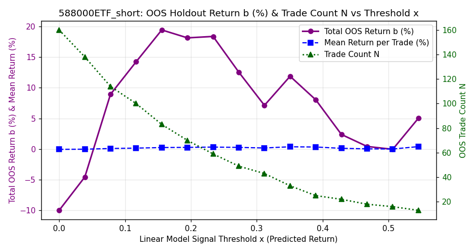<br>


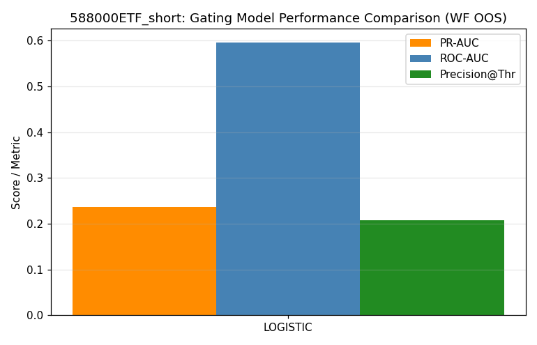<br>


<br>


<br>


<br>


</details>

### 159915ETF_long

- **Selected Model**: SKGLM_HUBER_L1
- **Tuned Stability Threshold**: 0.19
- **Samples**: 2722 (2015-04-07 → 2026-06-17)
- **Holdout**: 544 days (2024-03-19 → 2026-06-17)
- **Target stats**: mean=0.0195%, std=1.4037%, Sharpe=0.22
- **Selected features (66)**: `sma100_dist, yesterday_early_realized_vol, yesterday_day_vwap_dev, bb_width, bar_rng_2, vwap_cross_count, yesterday_early_range, sma_distance_5d, early_kurtosis, barbed_wire_intensity, volume_dryup_ratio, decision_bar_body, bar_vol_4, yesterday_early_vwap_dev, cci14, bar_ret_2, roc20, yesterday_opening_gap_reversal, yesterday_spike_exhaustion_ratio, gap_pct, bar_ret_0, total_path_length, first_bar_return, yesterday_day_late_mom, volume_surge_direction, roc10, body_to_range_ratio, yesterday_first_bar_return, adx_opening, vol20, bar_rng_3, vol5, yesterday_close_position, decision_bar_reversal_signal, yesterday_gap_pct, bar_vwap_dev_1, yesterday_day_range, first_bar_sentiment, yesterday_early_momentum, northbound_net, margin_net_buy, vol60, yesterday_day_close_pos, intraday_bullish_fvg, consecutive_lower_lows, early_trend_consistency, measured_move_proximity, opening_gap_reversal, max_up_ret, first_bar_body_ratio, vol_ratio_5_20, bar_rng_1, consolidation_bars_count, yesterday_gap, aroon_osc, bar_rng_4, volatility_regime_intraday, yesterday_day_kurtosis, bar_ret_4, vol_gk10, yesterday_first_30min_return, bar_ret_3, vwap_touch_count, lower_shadow_rejection, yesterday_body_ratio, volume_concentration`

#### Selected Feature Stability Scores (Block Bootstrap)

<details>
<summary><b>Click to expand Feature Stability Scores Table</b></summary>

| Feature | Stability Score | Status | Pearson $r$ | Spearman $\rho$ | Monotonicity Score | Mutual Info | Quality Rating | Holdout IC | Yearly ICs | Yearly IC Std |
|---------|-----------------|--------|-------------|-----------------|--------------------|-------------|----------------|------------|------------|---------------|
| sma100_dist | 84.0% | **Selected** | -0.0700 | -0.0320 | -0.80 | 0.0358 | ** Moderate Monotonic | -0.0170 | 15:-0.18 16:-0.09 17:-0.08 18:-0.07 19:-0.06 20:-0.07 21:-0.02 22:-0.06 23:-0.13 24:-0.06 25:+0.02 26:-0.10 | 0.0487 |
| yesterday_early_realized_vol | 76.8% | **Selected** | +0.0581 | +0.0246 | +0.90 | 0.0524 | *** Strong Monotonic | +0.0563 | 15:+0.10 16:+0.11 17:-0.01 18:-0.05 19:+0.00 20:-0.05 21:+0.10 22:-0.04 23:-0.01 24:+0.06 25:+0.02 26:+0.02 | 0.0562 |
| yesterday_day_vwap_dev | 69.6% | **Selected** | -0.0754 | -0.0876 | -1.00 | 0.0099 | *** Strong Monotonic | -0.1132 | 15:-0.05 16:-0.13 17:-0.11 18:-0.14 19:-0.05 20:-0.20 21:+0.01 22:-0.02 23:-0.08 24:-0.05 25:-0.12 26:-0.21 | 0.0653 |
| bb_width | 63.6% | **Selected** | -0.0495 | -0.0509 | -0.90 | 0.0841 | *** Strong Monotonic | -0.0488 | 15:-0.05 16:-0.06 17:-0.14 18:-0.10 19:+0.03 20:+0.03 21:-0.04 22:-0.08 23:-0.13 24:-0.10 25:-0.04 26:-0.03 | 0.0509 |
| bar_rng_2 | 63.2% | **Selected** | +0.0328 | +0.0075 | +1.00 | 0.0456 | *** Strong Monotonic | -0.0411 | 15:+0.05 16:+0.02 17:-0.03 18:+0.05 19:-0.04 20:-0.07 21:+0.07 22:-0.02 23:+0.09 24:+0.04 25:-0.06 26:-0.13 | 0.0644 |
| vwap_cross_count | 61.6% | **Selected** | -0.0141 | -0.0038 | -1.00 | 0.0000 | *** Strong Monotonic | +0.0172 | 15:-0.04 16:-0.04 17:-0.02 18:-0.07 19:-0.01 20:-0.05 21:-0.01 22:+0.15 23:+0.01 24:+0.04 25:-0.01 26:-0.03 | 0.0535 |
| yesterday_early_range | 60.4% | **Selected** | +0.0428 | +0.0128 | +0.60 | 0.0605 | ** Moderate Monotonic | +0.0088 | 15:-0.02 16:+0.07 17:-0.01 18:-0.04 19:+0.05 20:-0.06 21:+0.04 22:-0.07 23:+0.03 24:+0.01 25:+0.03 26:-0.03 | 0.0436 |
| sma_distance_5d | 57.6% | **Selected** | -0.0286 | -0.0051 | -0.60 | 0.0193 | ** Moderate Monotonic | -0.0081 | 15:-0.02 16:-0.08 17:-0.09 18:-0.02 19:-0.05 20:-0.02 21:+0.04 22:+0.08 23:+0.01 24:-0.05 25:-0.02 26:-0.03 | 0.0459 |
| early_kurtosis | 56.0% | **Selected** | +0.0324 | +0.0439 | +0.30 | 0.0000 | * Non-Monotonic / Weak | +0.0481 | 15:+0.01 16:+0.14 17:+0.06 18:+0.17 19:-0.05 20:+0.00 21:+0.02 22:-0.00 23:+0.02 24:+0.06 25:-0.02 26:+0.14 | 0.0665 |
| barbed_wire_intensity | 50.0% | **Selected** | +0.0225 | +0.0223 | N/A | 0.0000 | N/A | -0.0058 | 15:+0.12 16:-0.07 17:-0.00 19:-0.08 20:+0.00 21:-0.01 23:+0.16 24:+0.09 25:-0.02 26:-0.05 | 0.0781 |
| volume_dryup_ratio | 45.6% | **Selected** | -0.0073 | +0.0035 | N/A | 0.0061 | N/A | +0.0180 | 15:-0.09 16:+0.01 17:+0.03 18:-0.01 19:+0.07 20:-0.05 21:+0.01 22:+0.04 23:+0.00 24:+0.07 25:-0.06 26:+0.07 | 0.0504 |
| decision_bar_body | 45.2% | **Selected** | -0.0104 | -0.0186 | +0.10 | 0.0208 | * Non-Monotonic / Weak | -0.0940 | 15:+0.05 16:-0.01 17:+0.09 18:+0.03 19:-0.05 20:+0.01 21:-0.10 22:-0.04 23:+0.10 24:-0.09 25:-0.15 26:-0.04 | 0.0739 |
| bar_vol_4 | 44.8% | **Selected** | +0.0613 | +0.0322 | +0.90 | 0.0000 | *** Strong Monotonic | +0.0116 | 15:+0.02 16:-0.00 17:-0.05 18:+0.09 19:+0.05 20:+0.14 21:+0.01 22:+0.01 23:+0.06 24:-0.04 25:-0.04 26:+0.16 | 0.0667 |
| yesterday_early_vwap_dev | 43.2% | **Selected** | +0.0958 | +0.0733 | +0.90 | 0.0020 | *** Strong Monotonic | +0.0806 | 15:+0.06 16:+0.11 17:-0.04 18:+0.14 19:+0.01 20:+0.12 21:-0.00 22:+0.16 23:+0.10 24:+0.00 25:+0.05 26:+0.22 | 0.0737 |
| cci14 | 42.4% | **Selected** | +0.0420 | +0.0303 | +0.90 | 0.0347 | *** Strong Monotonic | +0.0193 | 15:-0.05 16:+0.05 17:+0.11 18:+0.08 19:+0.04 20:-0.09 21:-0.04 22:+0.05 23:+0.16 24:+0.02 25:+0.06 26:-0.01 | 0.0678 |
| bar_ret_2 | 40.8% | **Selected** | -0.0017 | +0.0271 | +0.10 | 0.0111 | * Non-Monotonic / Weak | +0.0127 | 15:-0.01 16:-0.06 17:+0.05 18:+0.08 19:+0.05 20:+0.05 21:-0.06 22:+0.06 23:-0.00 24:+0.03 25:+0.12 26:-0.17 | 0.0761 |
| roc20 | 38.8% | **Selected** | +0.0114 | +0.0205 | +0.10 | 0.0372 | * Non-Monotonic / Weak | -0.0127 | 15:+0.09 16:-0.12 17:-0.05 18:-0.04 19:+0.02 20:+0.05 21:+0.06 22:+0.02 23:-0.09 24:-0.06 25:+0.03 26:-0.08 | 0.0638 |
| yesterday_opening_gap_reversal | 38.8% | **Selected** | +0.0314 | +0.0227 | +0.80 | 0.0000 | ** Moderate Monotonic | +0.0175 | 15:-0.05 16:-0.10 17:-0.03 18:+0.06 19:+0.02 20:+0.04 21:+0.10 22:+0.02 23:-0.04 24:+0.05 25:+0.04 26:-0.01 | 0.0552 |
| yesterday_spike_exhaustion_ratio | 37.6% | **Selected** | +0.0174 | +0.0017 | +0.30 | 0.0000 | * Non-Monotonic / Weak | +0.0098 | 15:+0.00 16:+0.05 17:+0.07 18:-0.04 19:+0.04 20:-0.03 21:-0.01 22:-0.06 23:+0.03 24:+0.07 25:-0.03 26:+0.01 | 0.0421 |
| gap_pct | 36.0% | **Selected** | +0.0430 | +0.0557 | +0.90 | 0.0292 | *** Strong Monotonic | +0.0786 | 15:+0.06 16:+0.01 17:-0.04 18:+0.02 19:+0.13 20:+0.05 21:+0.05 22:+0.06 23:+0.01 24:-0.01 25:+0.07 26:+0.14 | 0.0513 |
| bar_ret_0 | 36.0% | **Selected** | +0.1479 | +0.1224 | +1.00 | 0.0004 | *** Strong Monotonic | +0.0588 | 15:+0.25 16:+0.19 17:-0.01 18:+0.13 19:+0.19 20:+0.13 21:+0.15 22:+0.07 23:+0.15 24:+0.06 25:+0.12 26:-0.05 | 0.0822 |
| total_path_length | 35.6% | **Selected** | +0.0543 | +0.0379 | +0.70 | 0.0450 | ** Moderate Monotonic | +0.0185 | 15:+0.02 16:+0.10 17:-0.00 18:+0.09 19:-0.06 20:+0.07 21:+0.00 22:+0.05 23:+0.06 24:+0.01 25:-0.00 26:-0.04 | 0.0488 |
| first_bar_return | 34.8% | **Selected** | +0.1479 | +0.1224 | +1.00 | 0.0006 | *** Strong Monotonic | +0.0588 | 15:+0.25 16:+0.19 17:-0.01 18:+0.13 19:+0.19 20:+0.13 21:+0.15 22:+0.07 23:+0.15 24:+0.06 25:+0.12 26:-0.05 | 0.0822 |
| yesterday_day_late_mom | 34.0% | **Selected** | +0.0060 | -0.0198 | -0.40 | 0.0185 | * Non-Monotonic / Weak | -0.0168 | 15:+0.03 16:-0.01 17:+0.00 18:+0.04 19:-0.01 20:-0.05 21:-0.06 22:-0.01 23:-0.14 24:-0.01 25:+0.01 26:-0.13 | 0.0546 |
| volume_surge_direction | 33.6% | **Selected** | +0.1241 | +0.0922 | +0.90 | 0.0066 | *** Strong Monotonic | +0.1152 | 15:+0.24 16:+0.14 17:-0.05 18:+0.03 19:+0.14 20:+0.15 21:+0.02 22:+0.05 23:+0.14 24:+0.10 25:+0.13 26:+0.06 | 0.0754 |
| roc10 | 33.2% | **Selected** | -0.0266 | +0.0101 | -0.10 | 0.0326 | * Non-Monotonic / Weak | -0.0090 | 15:+0.02 16:-0.10 17:-0.09 18:-0.08 19:+0.01 20:+0.05 21:-0.02 22:+0.03 23:+0.00 24:-0.07 25:+0.07 26:-0.12 | 0.0624 |
| body_to_range_ratio | 31.2% | **Selected** | +0.0407 | +0.0615 | +0.90 | 0.0022 | ** Non-Linear Monotonic | +0.0582 | 15:+0.06 16:+0.07 17:+0.04 18:+0.19 19:+0.02 20:+0.03 21:+0.00 22:+0.06 23:+0.09 24:+0.03 25:+0.09 26:+0.04 | 0.0461 |
| yesterday_first_bar_return | 30.4% | **Selected** | -0.0230 | +0.0092 | -0.30 | 0.0000 | * Non-Monotonic / Weak | +0.0161 | 15:+0.03 16:-0.02 17:+0.01 18:-0.08 19:+0.03 20:-0.07 21:-0.02 22:+0.12 23:+0.10 24:+0.03 25:+0.03 26:-0.05 | 0.0583 |
| adx_opening | 30.4% | **Selected** | +0.0130 | +0.0176 | N/A | 0.0018 | N/A | -0.0144 | 15:-0.05 16:-0.03 17:+0.08 18:+0.09 19:-0.03 20:-0.00 21:+0.05 22:+0.08 23:+0.04 24:-0.05 25:+0.07 26:-0.09 | 0.0580 |
| vol20 | 29.6% | **Selected** | +0.0529 | +0.0262 | +1.00 | 0.0611 | *** Strong Monotonic | +0.0274 | 15:-0.01 16:+0.06 17:+0.11 18:+0.10 19:-0.07 20:-0.09 21:+0.04 22:+0.08 23:+0.03 24:+0.05 25:+0.02 26:+0.05 | 0.0594 |
| bar_rng_3 | 29.6% | **Selected** | +0.0632 | +0.0497 | +0.90 | 0.0303 | *** Strong Monotonic | +0.0291 | 15:+0.06 16:+0.12 17:+0.04 18:+0.07 19:-0.05 20:+0.06 21:-0.00 22:+0.16 23:+0.03 24:+0.14 25:+0.00 26:-0.12 | 0.0757 |
| vol5 | 28.4% | **Selected** | +0.0497 | +0.0222 | +0.70 | 0.0431 | ** Moderate Monotonic | +0.0271 | 15:+0.07 16:+0.00 17:+0.11 18:+0.03 19:-0.05 20:-0.10 21:+0.10 22:+0.10 23:+0.06 24:-0.07 25:+0.04 26:+0.10 | 0.0691 |
| yesterday_close_position | 27.2% | **Selected** | -0.0592 | -0.0639 | -0.80 | 0.0245 | ** Moderate Monotonic | -0.0772 | 15:-0.03 16:-0.10 17:-0.09 18:-0.07 19:-0.04 20:-0.18 21:+0.01 22:-0.01 23:-0.08 24:-0.01 25:-0.10 26:-0.18 | 0.0585 |
| decision_bar_reversal_signal | 26.8% | **Selected** | -0.0004 | -0.0014 | N/A | 0.0000 | N/A | -0.0331 | 15:-0.07 16:-0.05 17:+0.02 18:+0.04 19:+0.10 20:-0.03 21:-0.03 22:-0.05 23:+0.07 24:+0.02 25:+0.04 26:-0.11 | 0.0593 |
| yesterday_gap_pct | 26.4% | **Selected** | +0.0393 | +0.0355 | +0.60 | 0.0166 | ** Moderate Monotonic | +0.0505 | 15:+0.08 16:-0.11 17:+0.00 18:-0.02 19:+0.02 20:+0.01 21:+0.11 22:+0.01 23:+0.02 24:+0.09 25:+0.10 26:-0.03 | 0.0608 |
| bar_vwap_dev_1 | 26.4% | **Selected** | +0.0451 | +0.0482 | +0.70 | 0.0067 | ** Moderate Monotonic | +0.0609 | 15:+0.03 16:+0.06 17:-0.01 18:-0.04 19:+0.09 20:-0.04 21:+0.08 22:+0.06 23:+0.19 24:+0.10 25:-0.01 26:+0.05 | 0.0629 |
| yesterday_day_range | 25.6% | **Selected** | +0.0264 | +0.0154 | +0.80 | 0.0645 | ** Moderate Monotonic | -0.0224 | 15:+0.01 16:+0.08 17:+0.02 18:+0.00 19:+0.09 20:-0.13 21:+0.06 22:-0.04 23:-0.01 24:-0.01 25:-0.02 26:-0.08 | 0.0610 |
| first_bar_sentiment | 24.8% | **Selected** | +0.1011 | +0.0980 | N/A | 0.0009 | N/A | +0.0571 | 15:+0.30 16:+0.15 17:-0.07 18:+0.08 19:+0.19 20:+0.16 21:+0.08 22:+0.03 23:+0.08 24:+0.05 25:+0.07 26:-0.02 | 0.0954 |
| yesterday_early_momentum | 24.8% | **Selected** | +0.0886 | +0.0780 | +1.00 | 0.0000 | *** Strong Monotonic | +0.0713 | 15:+0.08 16:+0.11 17:-0.02 18:+0.14 19:+0.01 20:+0.18 21:-0.02 22:+0.14 23:+0.08 24:+0.01 25:+0.04 26:+0.17 | 0.0702 |
| northbound_net | 24.8% | **Selected** | +0.0306 | +0.0285 | +0.60 | 0.0000 | ** Moderate Monotonic | -0.0061 | 15:+0.01 16:+0.07 17:-0.08 18:+0.06 19:+0.13 20:+0.05 21:-0.00 22:+0.01 23:+0.08 24:-0.00 26:+nan | nan |
| margin_net_buy | 24.8% | **Selected** | -0.0421 | -0.0321 | -0.90 | 0.0155 | *** Strong Monotonic | +0.0267 | 15:+nan 16:+nan 17:-0.04 18:+0.07 19:+0.02 20:-0.09 21:-0.04 22:-0.15 23:-0.15 24:-0.07 25:+0.01 26:+0.16 | nan |
| vol60 | 24.4% | **Selected** | +0.0287 | +0.0127 | +0.70 | 0.0335 | ** Moderate Monotonic | -0.0280 | 15:+0.03 16:+0.04 17:+0.10 18:-0.00 19:-0.10 20:-0.11 21:+0.05 22:+0.16 23:+0.09 24:+0.02 25:-0.04 26:-0.00 | 0.0753 |
| yesterday_day_close_pos | 24.4% | **Selected** | -0.0592 | -0.0639 | -0.80 | 0.0245 | ** Moderate Monotonic | -0.0772 | 15:-0.03 16:-0.10 17:-0.09 18:-0.07 19:-0.04 20:-0.18 21:+0.01 22:-0.01 23:-0.08 24:-0.01 25:-0.10 26:-0.18 | 0.0585 |
| intraday_bullish_fvg | 24.0% | **Selected** | +0.0044 | +0.0092 | N/A | 0.0026 | N/A | +0.1296 | 15:+0.14 16:-0.09 17:-0.02 18:-0.11 19:+0.01 20:-0.03 21:-0.06 22:-0.06 23:+0.04 24:+0.21 25:+0.09 26:+0.09 | 0.0942 |
| consecutive_lower_lows | 24.0% | **Selected** | -0.0463 | -0.0486 | -1.00 | 0.0158 | *** Strong Monotonic | -0.0372 | 15:-0.07 16:-0.00 17:-0.03 18:-0.05 19:-0.03 20:-0.04 21:-0.03 22:-0.04 23:-0.10 24:-0.06 25:-0.07 26:+0.07 | 0.0395 |
| early_trend_consistency | 23.6% | **Selected** | +0.0318 | +0.0312 | N/A | 0.0000 | N/A | +0.0219 | 15:-0.03 16:+0.04 17:-0.00 18:+0.16 19:+0.00 20:+0.09 21:+0.08 22:-0.04 23:-0.02 24:+0.06 25:-0.04 26:+0.05 | 0.0585 |
| measured_move_proximity | 23.6% | **Selected** | +0.0142 | +0.0234 | +0.50 | 0.0000 | ** Moderate Monotonic | -0.0214 | 15:+0.09 16:-0.02 17:+0.01 18:+0.10 19:-0.03 20:+0.05 21:+0.04 22:+0.06 23:-0.10 24:-0.03 25:-0.08 26:+0.11 | 0.0652 |
| opening_gap_reversal | 22.8% | **Selected** | -0.0752 | +0.0000 | -0.40 | 0.0000 | * Non-Monotonic / Weak | +0.0563 | 15:-0.04 16:-0.06 17:-0.03 18:-0.02 19:+0.02 20:-0.04 21:-0.11 22:+0.07 23:-0.01 24:-0.05 25:+0.08 26:+0.07 | 0.0553 |
| max_up_ret | 22.4% | **Selected** | +0.1375 | +0.1224 | +0.90 | 0.0174 | *** Strong Monotonic | +0.0734 | 15:+0.20 16:+0.13 17:+0.01 18:+0.09 19:+0.16 20:+0.14 21:+0.17 22:+0.12 23:+0.19 24:+0.06 25:+0.15 26:-0.12 | 0.0866 |
| first_bar_body_ratio | 22.4% | **Selected** | +0.0475 | +0.0357 | +0.90 | 0.0141 | *** Strong Monotonic | +0.0620 | 15:+0.07 16:+0.18 17:-0.04 18:+0.06 19:-0.06 20:+0.10 21:-0.04 22:+0.07 23:-0.02 24:-0.03 25:+0.08 26:+0.13 | 0.0745 |
| vol_ratio_5_20 | 22.0% | **Selected** | +0.0109 | +0.0004 | +0.30 | 0.0000 | * Non-Monotonic / Weak | +0.0092 | 15:+0.07 16:-0.07 17:+0.06 18:-0.02 19:-0.01 20:-0.06 21:+0.06 22:+0.04 23:+0.04 24:-0.14 25:+0.04 26:+0.06 | 0.0632 |
| bar_rng_1 | 22.0% | **Selected** | +0.0169 | +0.0028 | +0.50 | 0.0327 | * Non-Monotonic / Weak | -0.0045 | 15:-0.02 16:+0.01 17:-0.07 18:-0.06 19:+0.00 20:+0.03 21:+0.04 22:-0.04 23:+0.10 24:+0.00 25:-0.08 26:+0.00 | 0.0507 |
| consolidation_bars_count | 21.6% | **Selected** | -0.0059 | -0.0090 | N/A | 0.0117 | N/A | +0.0841 | 15:-0.06 16:-0.09 17:+0.00 18:+0.08 19:-0.12 20:-0.01 21:-0.06 22:-0.04 23:-0.03 24:+0.15 25:+0.09 26:+0.03 | 0.0756 |
| yesterday_gap | 21.6% | **Selected** | +0.0393 | +0.0356 | +0.60 | 0.0149 | ** Moderate Monotonic | +0.0505 | 15:+0.08 16:-0.11 17:+0.00 18:-0.02 19:+0.02 20:+0.01 21:+0.11 22:+0.01 23:+0.02 24:+0.09 25:+0.10 26:-0.03 | 0.0607 |
| aroon_osc | 21.2% | **Selected** | +0.0013 | +0.0108 | +0.30 | 0.0356 | * Non-Monotonic / Weak | +0.0054 | 15:+0.10 16:-0.06 17:+0.01 18:-0.10 19:-0.04 20:+0.07 21:-0.06 22:-0.03 23:-0.01 24:-0.08 25:+0.08 26:-0.10 | 0.0666 |
| bar_rng_4 | 20.4% | **Selected** | +0.0271 | -0.0057 | +0.40 | 0.0698 | * Non-Monotonic / Weak | -0.0461 | 15:+0.00 16:+0.04 17:-0.01 18:+0.02 19:-0.03 20:-0.08 21:+0.03 22:-0.08 23:+0.09 24:+0.04 25:-0.06 26:-0.10 | 0.0584 |
| volatility_regime_intraday | 20.4% | **Selected** | +0.0119 | +0.0451 | +0.80 | 0.0063 | ** Moderate Monotonic | +0.0822 | 15:-0.14 16:+0.14 17:+0.05 18:+0.00 19:-0.00 20:+0.16 21:+0.03 22:+0.12 23:-0.04 24:+0.02 25:+0.11 26:+0.11 | 0.0829 |
| yesterday_day_kurtosis | 20.0% | **Selected** | -0.0088 | -0.0471 | -0.90 | 0.0000 | ** Non-Linear Monotonic | +0.0001 | 15:-0.07 16:-0.01 17:-0.11 18:-0.11 19:-0.05 20:+0.04 21:-0.06 22:+0.00 23:-0.14 24:-0.07 25:-0.04 26:+0.08 | 0.0612 |
| bar_ret_4 | 20.0% | **Selected** | +0.0207 | +0.0005 | +0.40 | 0.0505 | * Non-Monotonic / Weak | -0.0030 | 15:-0.07 16:+0.06 17:-0.02 18:-0.04 19:+0.03 20:-0.00 21:+0.01 22:-0.00 23:+0.05 24:+0.02 25:+0.05 26:-0.10 | 0.0465 |
| vol_gk10 | 20.0% | **Selected** | +0.0454 | +0.0345 | +0.90 | 0.0661 | *** Strong Monotonic | +0.0142 | 15:-0.02 16:+0.08 17:+0.11 18:+0.09 19:-0.01 20:-0.10 21:+0.08 22:+0.11 23:+0.06 24:+0.04 25:+0.03 26:-0.12 | 0.0755 |
| yesterday_first_30min_return | 20.0% | **Selected** | +0.0567 | +0.0668 | +0.90 | 0.0121 | *** Strong Monotonic | +0.0877 | 15:+0.06 16:+0.08 17:-0.01 18:+0.08 19:+0.05 20:+0.09 21:-0.04 22:+0.16 23:+0.12 24:+0.02 25:+0.07 26:+0.15 | 0.0571 |
| bar_ret_3 | 19.6% | **Selected** | -0.0024 | +0.0118 | +0.00 | 0.0134 | * Non-Monotonic / Weak | +0.0176 | 15:+0.04 16:+0.01 17:-0.01 18:-0.11 19:-0.01 20:+0.02 21:+0.02 22:+0.11 23:+0.03 24:+0.02 25:+0.01 26:-0.04 | 0.0497 |
| vwap_touch_count | 19.2% | **Selected** | -0.0119 | -0.0154 | -0.50 | 0.0012 | ** Moderate Monotonic | +0.0025 | 15:-0.01 16:+0.04 17:+0.06 18:-0.04 19:-0.15 20:-0.05 21:-0.05 22:+0.05 23:-0.01 24:+0.01 25:+0.03 26:+0.01 | 0.0566 |
| lower_shadow_rejection | 19.2% | **Selected** | -0.0209 | -0.0154 | -0.40 | 0.0115 | * Non-Monotonic / Weak | -0.0464 | 15:-0.03 16:+0.04 17:-0.00 18:-0.09 19:+0.06 20:-0.11 21:+0.07 22:-0.08 23:+0.01 24:-0.00 25:-0.01 26:-0.06 | 0.0564 |
| yesterday_body_ratio | 19.2% | **Selected** | +0.0008 | -0.0075 | +0.20 | 0.0000 | * Non-Monotonic / Weak | -0.0578 | 15:+0.04 16:+0.05 17:+0.00 18:-0.02 19:+0.06 20:-0.09 21:+0.01 22:-0.04 23:+0.11 24:-0.07 25:-0.11 26:-0.06 | 0.0645 |
| volume_concentration | 18.8% | **Selected** | -0.0193 | -0.0235 | -0.40 | 0.0000 | * Non-Monotonic / Weak | +0.0111 | 15:-0.02 16:+0.08 17:-0.03 18:-0.04 19:-0.05 20:-0.02 21:-0.15 22:-0.03 23:+0.01 24:+0.06 25:-0.06 26:+0.01 | 0.0564 |

</details>

#### Metrics

| Metric | Best Linear | Ridge Base | Zero | Yesterday PM | First 30min Mom |
|--------|-------------|------------|------|--------------|-----------------|
| IC | +0.1433 | +0.0489 | +0.0000 | -0.1212 | +0.0808 |
| Dir Acc | 0.546 | 0.535 | 0.500 | 0.449 | 0.533 |
| RMSE | 1.2988% | 1.9078% | 1.3300% | 1.9558% | 1.4395% |
| L/S Sharpe | +3.34 | +2.30 | — | — | — |

#### Best Hyperparameters

<details>
<summary><b>Click to expand Best Hyperparameters JSON</b></summary>

```json
{
  "model_type": "skglm_huber_l1",
  "top_k_features": 66,
  "skglm_huber_l1_alpha": 0.016711547876315954,
  "skglm_huber_delta": 2.719878622950381,
  "stability_threshold": 0.188
}
```

</details>

#### Walk-Forward Fold ICs

| Fold | IS IC | OOS IC |
|------|-------|--------|
| 1 | 0.4084 | +0.1046 |
| 2 | 0.3055 | +0.1801 |
| 3 | 0.2748 | +0.1654 |
| 4 | 0.2542 | +0.1563 |
| 5 | 0.2419 | +0.1283 |
| **Overall** | — | +0.1357 |

#### Year-by-Year OOS IC

| Year | IC | Dir Acc | N | L/S Sharpe |
|------|-----|---------|---|-----------|
| 2017 | +0.0419 | 0.470 | 215 | +1.79 |
| 2018 | +0.1584 | 0.523 | 243 | +4.36 |
| 2019 | +0.0728 | 0.500 | 244 | +2.62 |
| 2020 | +0.2661 | 0.584 | 243 | +7.46 |
| 2021 | +0.1888 | 0.564 | 243 | +4.57 |
| 2022 | +0.1483 | 0.587 | 242 | +2.38 |
| 2023 | +0.1915 | 0.574 | 242 | +2.98 |
| 2024 | +0.1133 | 0.529 | 242 | +4.58 |
| 2025 | +0.1658 | 0.547 | 243 | +3.09 |
| 2026 | +0.0673 | 0.546 | 108 | +2.07 |

#### Diagnostic Plots

<details>
<summary><b>Click to expand Diagnostic Plots</b></summary>

<br>


<br>


<br>


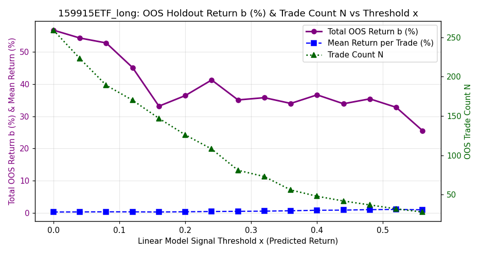<br>


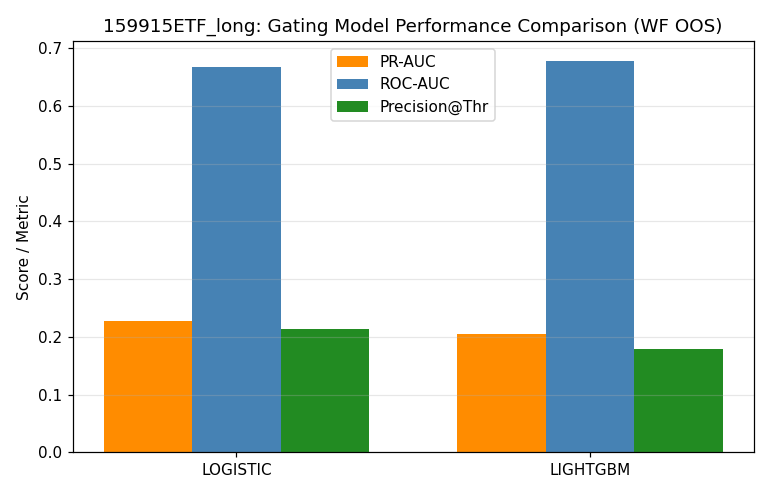<br>


<br>


<br>


<br>


</details>

### 159915ETF_short

- **Selected Model**: SKGLM_MCP
- **Tuned Stability Threshold**: 0.12
- **Samples**: 2722 (2015-04-07 → 2026-06-17)
- **Holdout**: 544 days (2024-03-19 → 2026-06-17)
- **Target stats**: mean=0.0195%, std=1.4037%, Sharpe=0.22
- **Selected features (93)**: `upper_wick_dominance, early_bullish_engulfing_count, gap_pct, early_kurtosis, yesterday_body_ratio, yesterday_day_vwap_dev, yesterday_early_momentum, yesterday_day_realized_vol, volume_surge_direction, opening_gap_reversal, bb_width, measured_move_proximity, max_down_ret, adx_opening, bar_rng_2, bar_rng_1, sma100_dist, inside_bar_failure_bull, early_doji_count, gap_fill_ratio, lower_shadow_rejection, vol60, macd_hist, yesterday_early_range, close_vs_open_range, decision_bar_range_rank, range_expansion_ratio, northbound_net, first_bar_sentiment, vwap_touch_count, bar_rng_3, yesterday_intraday_close_position, vol_gk20, intraday_bullish_fvg, spike_exhaustion_ratio, yesterday_first_bar_return, yesterday_early_skew, first_bar_return, bar_ret_0, intraday_autocorr, yesterday_day_range, consecutive_same_close_dir, first_bar_body_ratio, yesterday_early_realized_vol, yesterday_opening_gap_reversal, bar_body_rng_0, consolidation_bars_count, yesterday_gap_pct, yesterday_early_kurtosis, vol_ratio_10_60, volume_weighted_price_position, bar_ret_4, volume_percentile_20d, upper_shadow_rejection, capital_net_value, atr14_norm, yesterday_early_vwap_dev, trend_exhaustion_early, bar_vwap_dev_1, momentum_divergence, or_fill_ratio, yesterday_day_late_mom, yesterday_gap, yesterday_day_kurtosis, bar_vwap_dev_0, vol5, bar_vwap_dev_2, yesterday_day_skew, volume_climax_exhaustion, opening_range_size, body_to_range_ratio, trend_bar_dominance, yesterday_day_pm_am_vol_ratio, roc10, bar_rng_4, vwap_cross_count, volume_dryup_ratio, consecutive_bullish_engulfing, yesterday_am_return, yesterday_range_ratio, early_skew, volume_price_corr, consecutive_down_closes, inside_bar_compression, yesterday_spike_exhaustion_ratio, volatility_regime_intraday, consecutive_bearish_engulfing, yearly_low_distance, intraday_bearish_fvg, intraday_close_position, bar_rng_0, early_bearish_engulfing_count, opening_direction_stability`

#### Selected Feature Stability Scores (Block Bootstrap)

<details>
<summary><b>Click to expand Feature Stability Scores Table</b></summary>

| Feature | Stability Score | Status | Pearson $r$ | Spearman $\rho$ | Monotonicity Score | Mutual Info | Quality Rating | Holdout IC | Yearly ICs | Yearly IC Std |
|---------|-----------------|--------|-------------|-----------------|--------------------|-------------|----------------|------------|------------|---------------|
| upper_wick_dominance | 61.6% | **Selected** | -0.0314 | +0.0175 | -0.10 | 0.0000 | * Non-Monotonic / Weak | +0.0092 | 15:-0.05 16:+0.04 17:+0.07 18:+0.10 19:-0.02 20:+0.14 21:-0.07 22:-0.01 23:-0.00 24:-0.01 25:-0.03 26:+0.04 | 0.0604 |
| early_bullish_engulfing_count | 54.0% | **Selected** | -0.0250 | -0.0105 | N/A | 0.0000 | N/A | +0.0319 | 15:-0.15 16:-0.05 17:-0.04 18:-0.02 19:-0.06 20:-0.01 21:-0.02 22:+0.05 23:+0.04 24:+0.11 25:-0.02 26:-0.01 | 0.0614 |
| gap_pct | 50.0% | **Selected** | +0.0430 | +0.0557 | +0.90 | 0.0292 | *** Strong Monotonic | +0.0786 | 15:+0.06 16:+0.01 17:-0.04 18:+0.02 19:+0.13 20:+0.05 21:+0.05 22:+0.06 23:+0.01 24:-0.01 25:+0.07 26:+0.14 | 0.0513 |
| early_kurtosis | 49.6% | **Selected** | +0.0324 | +0.0439 | +0.30 | 0.0000 | * Non-Monotonic / Weak | +0.0481 | 15:+0.01 16:+0.14 17:+0.06 18:+0.17 19:-0.05 20:+0.00 21:+0.02 22:-0.00 23:+0.02 24:+0.06 25:-0.02 26:+0.14 | 0.0665 |
| yesterday_body_ratio | 46.4% | **Selected** | +0.0008 | -0.0075 | +0.20 | 0.0000 | * Non-Monotonic / Weak | -0.0578 | 15:+0.04 16:+0.05 17:+0.00 18:-0.02 19:+0.06 20:-0.09 21:+0.01 22:-0.04 23:+0.11 24:-0.07 25:-0.11 26:-0.06 | 0.0645 |
| yesterday_day_vwap_dev | 45.2% | **Selected** | -0.0754 | -0.0876 | -1.00 | 0.0099 | *** Strong Monotonic | -0.1132 | 15:-0.05 16:-0.13 17:-0.11 18:-0.14 19:-0.05 20:-0.20 21:+0.01 22:-0.02 23:-0.08 24:-0.05 25:-0.12 26:-0.21 | 0.0653 |
| yesterday_early_momentum | 44.4% | **Selected** | +0.0886 | +0.0780 | +1.00 | 0.0000 | *** Strong Monotonic | +0.0713 | 15:+0.08 16:+0.11 17:-0.02 18:+0.14 19:+0.01 20:+0.18 21:-0.02 22:+0.14 23:+0.08 24:+0.01 25:+0.04 26:+0.17 | 0.0702 |
| yesterday_day_realized_vol | 44.4% | **Selected** | +0.0319 | +0.0234 | +1.00 | 0.0747 | *** Strong Monotonic | +0.0101 | 15:+0.05 16:+0.06 17:+0.01 18:-0.06 19:-0.01 20:-0.08 21:+0.12 22:+0.04 23:-0.02 24:+0.07 25:-0.00 26:-0.06 | 0.0567 |
| volume_surge_direction | 44.4% | **Selected** | +0.1241 | +0.0922 | +0.90 | 0.0066 | *** Strong Monotonic | +0.1152 | 15:+0.24 16:+0.14 17:-0.05 18:+0.03 19:+0.14 20:+0.15 21:+0.02 22:+0.05 23:+0.14 24:+0.10 25:+0.13 26:+0.06 | 0.0754 |
| opening_gap_reversal | 44.0% | **Selected** | -0.0752 | +0.0000 | -0.40 | 0.0000 | * Non-Monotonic / Weak | +0.0563 | 15:-0.04 16:-0.06 17:-0.03 18:-0.02 19:+0.02 20:-0.04 21:-0.11 22:+0.07 23:-0.01 24:-0.05 25:+0.08 26:+0.07 | 0.0553 |
| bb_width | 43.6% | **Selected** | -0.0495 | -0.0509 | -0.90 | 0.0841 | *** Strong Monotonic | -0.0488 | 15:-0.05 16:-0.06 17:-0.14 18:-0.10 19:+0.03 20:+0.03 21:-0.04 22:-0.08 23:-0.13 24:-0.10 25:-0.04 26:-0.03 | 0.0509 |
| measured_move_proximity | 42.0% | **Selected** | +0.0142 | +0.0234 | +0.50 | 0.0000 | ** Moderate Monotonic | -0.0214 | 15:+0.09 16:-0.02 17:+0.01 18:+0.10 19:-0.03 20:+0.05 21:+0.04 22:+0.06 23:-0.10 24:-0.03 25:-0.08 26:+0.11 | 0.0652 |
| max_down_ret | 42.0% | **Selected** | +0.0945 | +0.1007 | +0.60 | 0.0051 | ** Moderate Monotonic | +0.0828 | 15:+0.17 16:+0.11 17:+0.01 18:+0.07 19:+0.18 20:+0.12 21:+0.08 22:+0.10 23:+0.17 24:+0.08 25:+0.14 26:-0.09 | 0.0716 |
| adx_opening | 41.6% | **Selected** | +0.0130 | +0.0176 | N/A | 0.0018 | N/A | -0.0144 | 15:-0.05 16:-0.03 17:+0.08 18:+0.09 19:-0.03 20:-0.00 21:+0.05 22:+0.08 23:+0.04 24:-0.05 25:+0.07 26:-0.09 | 0.0580 |
| bar_rng_2 | 40.4% | **Selected** | +0.0328 | +0.0075 | +1.00 | 0.0456 | *** Strong Monotonic | -0.0411 | 15:+0.05 16:+0.02 17:-0.03 18:+0.05 19:-0.04 20:-0.07 21:+0.07 22:-0.02 23:+0.09 24:+0.04 25:-0.06 26:-0.13 | 0.0644 |
| bar_rng_1 | 38.0% | **Selected** | +0.0169 | +0.0028 | +0.50 | 0.0327 | * Non-Monotonic / Weak | -0.0045 | 15:-0.02 16:+0.01 17:-0.07 18:-0.06 19:+0.00 20:+0.03 21:+0.04 22:-0.04 23:+0.10 24:+0.00 25:-0.08 26:+0.00 | 0.0507 |
| sma100_dist | 37.2% | **Selected** | -0.0700 | -0.0320 | -0.80 | 0.0358 | ** Moderate Monotonic | -0.0170 | 15:-0.18 16:-0.09 17:-0.08 18:-0.07 19:-0.06 20:-0.07 21:-0.02 22:-0.06 23:-0.13 24:-0.06 25:+0.02 26:-0.10 | 0.0487 |
| inside_bar_failure_bull | 36.8% | **Selected** | -0.0339 | -0.0411 | N/A | 0.0000 | N/A | +0.0005 | 15:-0.12 16:+0.00 17:+0.02 18:-0.06 19:-0.11 20:+0.01 21:-0.11 22:-0.07 23:-0.05 24:+0.01 25:-0.00 26:+0.03 | 0.0517 |
| early_doji_count | 36.8% | **Selected** | -0.0267 | -0.0201 | N/A | 0.0000 | N/A | -0.0076 | 15:-0.04 16:-0.07 17:+0.00 18:-0.06 19:+0.09 20:-0.01 21:-0.04 22:-0.08 23:-0.04 24:-0.04 25:+0.01 26:+0.04 | 0.0471 |
| gap_fill_ratio | 35.2% | **Selected** | -0.0203 | -0.0248 | N/A | 0.0000 | N/A | +0.1057 | 15:-0.03 16:+0.06 17:-0.09 18:-0.16 19:-0.05 20:-0.03 21:+0.00 22:-0.12 23:+0.01 24:+0.16 25:+0.02 26:+0.09 | 0.0858 |
| lower_shadow_rejection | 33.6% | **Selected** | -0.0209 | -0.0154 | -0.40 | 0.0115 | * Non-Monotonic / Weak | -0.0464 | 15:-0.03 16:+0.04 17:-0.00 18:-0.09 19:+0.06 20:-0.11 21:+0.07 22:-0.08 23:+0.01 24:-0.00 25:-0.01 26:-0.06 | 0.0564 |
| vol60 | 33.2% | **Selected** | +0.0287 | +0.0127 | +0.70 | 0.0335 | ** Moderate Monotonic | -0.0280 | 15:+0.03 16:+0.04 17:+0.10 18:-0.00 19:-0.10 20:-0.11 21:+0.05 22:+0.16 23:+0.09 24:+0.02 25:-0.04 26:-0.00 | 0.0753 |
| macd_hist | 33.2% | **Selected** | +0.0138 | +0.0168 | +0.60 | 0.0195 | ** Moderate Monotonic | -0.0035 | 15:+0.09 16:-0.04 17:-0.05 18:-0.04 19:-0.00 20:+0.07 21:-0.01 22:-0.00 23:-0.01 24:-0.08 25:+0.06 26:-0.08 | 0.0529 |
| yesterday_early_range | 33.2% | **Selected** | +0.0428 | +0.0128 | +0.60 | 0.0605 | ** Moderate Monotonic | +0.0088 | 15:-0.02 16:+0.07 17:-0.01 18:-0.04 19:+0.05 20:-0.06 21:+0.04 22:-0.07 23:+0.03 24:+0.01 25:+0.03 26:-0.03 | 0.0436 |
| close_vs_open_range | 32.8% | **Selected** | -0.0003 | +0.0925 | +0.90 | 0.0000 | ** Non-Linear Monotonic | +0.0992 | 15:+0.13 16:+0.08 17:+0.03 18:+0.01 19:+0.15 20:+0.08 21:+0.10 22:+0.07 23:+0.17 24:+0.10 25:+0.18 26:-0.12 | 0.0789 |
| decision_bar_range_rank | 32.0% | **Selected** | -0.0274 | -0.0225 | -0.50 | 0.0000 | ** Moderate Monotonic | +0.0025 | 15:-0.00 16:-0.09 17:+0.01 18:+0.02 19:+0.03 20:-0.14 21:+0.02 22:-0.10 23:+0.00 24:-0.03 25:+0.04 26:+0.02 | 0.0577 |
| range_expansion_ratio | 31.6% | **Selected** | -0.0003 | +0.0254 | +0.30 | 0.0021 | * Non-Monotonic / Weak | -0.0104 | 15:+0.09 16:-0.06 17:-0.03 18:+0.05 19:+0.11 20:-0.01 21:+0.05 22:+0.03 23:+0.06 24:-0.06 25:+0.01 26:-0.05 | 0.0564 |
| northbound_net | 31.6% | **Selected** | +0.0306 | +0.0285 | +0.60 | 0.0000 | ** Moderate Monotonic | -0.0061 | 15:+0.01 16:+0.07 17:-0.08 18:+0.06 19:+0.13 20:+0.05 21:-0.00 22:+0.01 23:+0.08 24:-0.00 26:+nan | nan |
| first_bar_sentiment | 31.6% | **Selected** | +0.1011 | +0.0980 | N/A | 0.0009 | N/A | +0.0571 | 15:+0.30 16:+0.15 17:-0.07 18:+0.08 19:+0.19 20:+0.16 21:+0.08 22:+0.03 23:+0.08 24:+0.05 25:+0.07 26:-0.02 | 0.0954 |
| vwap_touch_count | 30.4% | **Selected** | -0.0119 | -0.0154 | -0.50 | 0.0012 | ** Moderate Monotonic | +0.0025 | 15:-0.01 16:+0.04 17:+0.06 18:-0.04 19:-0.15 20:-0.05 21:-0.05 22:+0.05 23:-0.01 24:+0.01 25:+0.03 26:+0.01 | 0.0566 |
| bar_rng_3 | 30.4% | **Selected** | +0.0632 | +0.0497 | +0.90 | 0.0303 | *** Strong Monotonic | +0.0291 | 15:+0.06 16:+0.12 17:+0.04 18:+0.07 19:-0.05 20:+0.06 21:-0.00 22:+0.16 23:+0.03 24:+0.14 25:+0.00 26:-0.12 | 0.0757 |
| yesterday_intraday_close_position | 30.0% | **Selected** | -0.0003 | +0.0765 | +1.00 | 0.0000 | ** Non-Linear Monotonic | +0.0847 | 15:+0.03 16:+0.07 17:-0.04 18:+0.13 19:+0.08 20:+0.14 21:-0.04 22:+0.16 23:+0.13 24:+0.00 25:+0.06 26:+0.19 | 0.0725 |
| vol_gk20 | 30.0% | **Selected** | +0.0287 | +0.0217 | +0.90 | 0.0872 | *** Strong Monotonic | +0.0167 | 15:-0.07 16:+0.07 17:+0.08 18:+0.09 19:-0.04 20:-0.12 21:+0.02 22:+0.12 23:+0.02 24:+0.04 25:+0.03 26:-0.00 | 0.0676 |
| intraday_bullish_fvg | 28.8% | **Selected** | +0.0044 | +0.0092 | N/A | 0.0026 | N/A | +0.1296 | 15:+0.14 16:-0.09 17:-0.02 18:-0.11 19:+0.01 20:-0.03 21:-0.06 22:-0.06 23:+0.04 24:+0.21 25:+0.09 26:+0.09 | 0.0942 |
| spike_exhaustion_ratio | 28.8% | **Selected** | -0.0166 | +0.0049 | +0.10 | 0.0125 | * Non-Monotonic / Weak | +0.0472 | 15:-0.03 16:+0.07 17:-0.06 18:-0.04 19:-0.02 20:-0.01 21:+0.00 22:-0.01 23:+0.01 24:-0.02 25:+0.04 26:+0.10 | 0.0451 |
| yesterday_first_bar_return | 27.6% | **Selected** | -0.0230 | +0.0092 | -0.30 | 0.0000 | * Non-Monotonic / Weak | +0.0161 | 15:+0.03 16:-0.02 17:+0.01 18:-0.08 19:+0.03 20:-0.07 21:-0.02 22:+0.12 23:+0.10 24:+0.03 25:+0.03 26:-0.05 | 0.0583 |
| yesterday_early_skew | 27.6% | **Selected** | +0.0064 | +0.0023 | +0.30 | 0.0100 | * Non-Monotonic / Weak | -0.0159 | 15:+0.07 16:-0.01 17:+0.00 18:-0.02 19:+0.11 20:-0.04 21:-0.04 22:-0.04 23:-0.01 24:+0.01 25:+0.02 26:-0.04 | 0.0451 |
| first_bar_return | 27.2% | **Selected** | +0.1479 | +0.1224 | +1.00 | 0.0006 | *** Strong Monotonic | +0.0588 | 15:+0.25 16:+0.19 17:-0.01 18:+0.13 19:+0.19 20:+0.13 21:+0.15 22:+0.07 23:+0.15 24:+0.06 25:+0.12 26:-0.05 | 0.0822 |
| bar_ret_0 | 26.4% | **Selected** | +0.1479 | +0.1224 | +1.00 | 0.0004 | *** Strong Monotonic | +0.0588 | 15:+0.25 16:+0.19 17:-0.01 18:+0.13 19:+0.19 20:+0.13 21:+0.15 22:+0.07 23:+0.15 24:+0.06 25:+0.12 26:-0.05 | 0.0822 |
| intraday_autocorr | 26.4% | **Selected** | -0.0191 | -0.0175 | -0.70 | 0.0166 | ** Moderate Monotonic | -0.0439 | 15:+0.03 16:+0.08 17:+0.06 18:-0.03 19:+0.07 20:-0.13 21:-0.11 22:-0.07 23:+0.08 24:-0.02 25:-0.08 26:-0.04 | 0.0738 |
| yesterday_day_range | 26.0% | **Selected** | +0.0264 | +0.0154 | +0.80 | 0.0645 | ** Moderate Monotonic | -0.0224 | 15:+0.01 16:+0.08 17:+0.02 18:+0.00 19:+0.09 20:-0.13 21:+0.06 22:-0.04 23:-0.01 24:-0.01 25:-0.02 26:-0.08 | 0.0610 |
| consecutive_same_close_dir | 26.0% | **Selected** | +0.0367 | +0.0291 | +1.00 | 0.0000 | *** Strong Monotonic | +0.0164 | 15:-0.03 16:+0.03 17:+0.02 18:+0.14 19:+0.07 20:+0.04 21:+0.09 22:-0.06 23:-0.02 24:+0.06 25:-0.02 26:+0.04 | 0.0545 |
| first_bar_body_ratio | 25.6% | **Selected** | +0.0475 | +0.0357 | +0.90 | 0.0141 | *** Strong Monotonic | +0.0620 | 15:+0.07 16:+0.18 17:-0.04 18:+0.06 19:-0.06 20:+0.10 21:-0.04 22:+0.07 23:-0.02 24:-0.03 25:+0.08 26:+0.13 | 0.0745 |
| yesterday_early_realized_vol | 25.6% | **Selected** | +0.0581 | +0.0246 | +0.90 | 0.0524 | *** Strong Monotonic | +0.0563 | 15:+0.10 16:+0.11 17:-0.01 18:-0.05 19:+0.00 20:-0.05 21:+0.10 22:-0.04 23:-0.01 24:+0.06 25:+0.02 26:+0.02 | 0.0562 |
| yesterday_opening_gap_reversal | 25.2% | **Selected** | +0.0314 | +0.0227 | +0.80 | 0.0000 | ** Moderate Monotonic | +0.0175 | 15:-0.05 16:-0.10 17:-0.03 18:+0.06 19:+0.02 20:+0.04 21:+0.10 22:+0.02 23:-0.04 24:+0.05 25:+0.04 26:-0.01 | 0.0552 |
| bar_body_rng_0 | 24.8% | **Selected** | +0.1195 | +0.1201 | +1.00 | 0.0165 | *** Strong Monotonic | +0.0758 | 15:+0.26 16:+0.18 17:-0.05 18:+0.14 19:+0.19 20:+0.15 21:+0.14 22:+0.05 23:+0.15 24:+0.05 25:+0.15 26:-0.06 | 0.0924 |
| consolidation_bars_count | 24.8% | **Selected** | -0.0059 | -0.0090 | N/A | 0.0117 | N/A | +0.0841 | 15:-0.06 16:-0.09 17:+0.00 18:+0.08 19:-0.12 20:-0.01 21:-0.06 22:-0.04 23:-0.03 24:+0.15 25:+0.09 26:+0.03 | 0.0756 |
| yesterday_gap_pct | 24.0% | **Selected** | +0.0393 | +0.0355 | +0.60 | 0.0166 | ** Moderate Monotonic | +0.0505 | 15:+0.08 16:-0.11 17:+0.00 18:-0.02 19:+0.02 20:+0.01 21:+0.11 22:+0.01 23:+0.02 24:+0.09 25:+0.10 26:-0.03 | 0.0608 |
| yesterday_early_kurtosis | 24.0% | **Selected** | -0.0209 | -0.0211 | -0.90 | 0.0001 | *** Strong Monotonic | -0.0660 | 15:-0.07 16:+0.02 17:+0.07 18:+0.01 19:-0.07 20:+0.01 21:+0.08 22:-0.09 23:-0.03 24:-0.02 25:-0.09 26:-0.13 | 0.0632 |
| vol_ratio_10_60 | 23.6% | **Selected** | +0.0447 | +0.0142 | +0.70 | 0.0184 | ** Moderate Monotonic | +0.0340 | 15:+0.01 16:+0.04 17:+0.05 18:+0.08 19:-0.01 20:-0.05 21:+0.03 22:-0.06 23:+0.03 24:-0.04 25:+0.09 26:+0.00 | 0.0458 |
| volume_weighted_price_position | 23.2% | **Selected** | +0.0947 | +0.0976 | +1.00 | 0.0052 | *** Strong Monotonic | +0.0541 | 15:+0.12 16:+0.10 17:+0.03 18:+0.08 19:+0.18 20:+0.03 21:+0.21 22:+0.01 23:+0.16 24:+0.08 25:+0.12 26:-0.03 | 0.0691 |
| bar_ret_4 | 23.2% | **Selected** | +0.0207 | +0.0005 | +0.40 | 0.0505 | * Non-Monotonic / Weak | -0.0030 | 15:-0.07 16:+0.06 17:-0.02 18:-0.04 19:+0.03 20:-0.00 21:+0.01 22:-0.00 23:+0.05 24:+0.02 25:+0.05 26:-0.10 | 0.0465 |
| volume_percentile_20d | 23.2% | **Selected** | +0.0302 | +0.0203 | +0.70 | 0.0000 | ** Moderate Monotonic | -0.0051 | 15:+0.11 16:-0.11 17:-0.08 18:+0.00 19:+0.05 20:+0.08 21:+0.02 22:+0.09 23:+0.02 24:-0.03 25:-0.04 26:+0.11 | 0.0684 |
| upper_shadow_rejection | 22.4% | **Selected** | -0.0162 | +0.0021 | -0.30 | 0.0000 | * Non-Monotonic / Weak | -0.0208 | 15:-0.12 16:+0.08 17:+0.08 18:-0.03 19:+0.02 20:+0.09 21:-0.02 22:-0.08 23:+0.03 24:-0.02 25:-0.06 26:+0.00 | 0.0625 |
| capital_net_value | 22.4% | **Selected** | -0.0380 | -0.0463 | -1.00 | 0.0125 | *** Strong Monotonic | -0.0571 | 15:+nan 16:+nan 17:-0.02 18:-0.00 19:-0.08 20:-0.14 21:-0.05 22:-0.12 23:-0.01 24:-0.07 25:-0.05 26:+0.01 | nan |
| atr14_norm | 22.0% | **Selected** | +0.0368 | +0.0206 | +0.80 | 0.0720 | ** Moderate Monotonic | +0.0033 | 15:-0.03 16:+0.06 17:+0.10 18:+0.12 19:-0.05 20:-0.12 21:+0.05 22:+0.13 23:+0.10 24:+0.05 25:+0.00 26:-0.02 | 0.0742 |
| yesterday_early_vwap_dev | 21.6% | **Selected** | +0.0958 | +0.0733 | +0.90 | 0.0020 | *** Strong Monotonic | +0.0806 | 15:+0.06 16:+0.11 17:-0.04 18:+0.14 19:+0.01 20:+0.12 21:-0.00 22:+0.16 23:+0.10 24:+0.00 25:+0.05 26:+0.22 | 0.0737 |
| trend_exhaustion_early | 21.2% | **Selected** | -0.0311 | -0.0426 | -0.40 | 0.0213 | * Non-Monotonic / Weak | -0.0487 | 15:+0.01 16:-0.03 17:+0.03 18:-0.22 19:-0.02 20:-0.03 21:-0.10 22:+0.06 23:-0.01 24:-0.01 25:-0.06 26:-0.03 | 0.0674 |
| bar_vwap_dev_1 | 21.2% | **Selected** | +0.0451 | +0.0482 | +0.70 | 0.0067 | ** Moderate Monotonic | +0.0609 | 15:+0.03 16:+0.06 17:-0.01 18:-0.04 19:+0.09 20:-0.04 21:+0.08 22:+0.06 23:+0.19 24:+0.10 25:-0.01 26:+0.05 | 0.0629 |
| momentum_divergence | 20.8% | **Selected** | +0.0224 | +0.0377 | N/A | 0.0052 | N/A | +0.0360 | 15:+0.04 16:-0.09 17:+0.09 18:+0.02 19:+0.09 20:+0.04 21:-0.03 22:+0.05 23:+0.15 24:+0.04 25:+0.11 26:-0.15 | 0.0811 |
| or_fill_ratio | 20.8% | **Selected** | -0.0003 | +0.0672 | +0.90 | 0.0022 | ** Non-Linear Monotonic | +0.0800 | 15:+0.09 16:+0.04 17:+0.04 18:-0.02 19:+0.11 20:+0.04 21:+0.06 22:+0.05 23:+0.15 24:+0.09 25:+0.15 26:-0.12 | 0.0706 |
| yesterday_day_late_mom | 20.4% | **Selected** | +0.0060 | -0.0198 | -0.40 | 0.0185 | * Non-Monotonic / Weak | -0.0168 | 15:+0.03 16:-0.01 17:+0.00 18:+0.04 19:-0.01 20:-0.05 21:-0.06 22:-0.01 23:-0.14 24:-0.01 25:+0.01 26:-0.13 | 0.0546 |
| yesterday_gap | 20.4% | **Selected** | +0.0393 | +0.0356 | +0.60 | 0.0149 | ** Moderate Monotonic | +0.0505 | 15:+0.08 16:-0.11 17:+0.00 18:-0.02 19:+0.02 20:+0.01 21:+0.11 22:+0.01 23:+0.02 24:+0.09 25:+0.10 26:-0.03 | 0.0607 |
| yesterday_day_kurtosis | 20.4% | **Selected** | -0.0088 | -0.0471 | -0.90 | 0.0000 | ** Non-Linear Monotonic | +0.0001 | 15:-0.07 16:-0.01 17:-0.11 18:-0.11 19:-0.05 20:+0.04 21:-0.06 22:+0.00 23:-0.14 24:-0.07 25:-0.04 26:+0.08 | 0.0612 |
| bar_vwap_dev_0 | 20.0% | **Selected** | +0.0038 | -0.0049 | N/A | 0.0000 | N/A | N/A | N/A | N/A |
| vol5 | 19.6% | **Selected** | +0.0497 | +0.0222 | +0.70 | 0.0431 | ** Moderate Monotonic | +0.0271 | 15:+0.07 16:+0.00 17:+0.11 18:+0.03 19:-0.05 20:-0.10 21:+0.10 22:+0.10 23:+0.06 24:-0.07 25:+0.04 26:+0.10 | 0.0691 |
| bar_vwap_dev_2 | 19.6% | **Selected** | +0.0238 | +0.0573 | +0.60 | 0.0027 | ** Moderate Monotonic | +0.0399 | 15:+0.01 16:+0.01 17:+0.03 18:+0.06 19:+0.12 20:+0.03 21:+0.01 22:+0.07 23:+0.12 24:+0.08 25:+0.08 26:-0.11 | 0.0602 |
| yesterday_day_skew | 19.6% | **Selected** | +0.0079 | +0.0154 | +0.40 | 0.0000 | * Non-Monotonic / Weak | +0.0728 | 15:+0.03 16:+0.00 17:-0.04 18:-0.01 19:-0.02 20:+0.07 21:+0.03 22:+0.05 23:-0.00 24:+0.07 25:+0.02 26:+0.21 | 0.0623 |
| volume_climax_exhaustion | 19.6% | **Selected** | +0.0079 | -0.0118 | +0.10 | 0.0207 | * Non-Monotonic / Weak | -0.0568 | 15:+0.04 16:-0.02 17:-0.10 18:-0.05 19:+0.05 20:+0.05 21:-0.08 22:-0.01 23:+0.20 24:+0.07 25:-0.09 26:-0.16 | 0.0929 |
| opening_range_size | 19.2% | **Selected** | +0.0253 | +0.0358 | +0.70 | 0.0499 | ** Moderate Monotonic | +0.0389 | 15:-0.06 16:+0.15 17:+0.01 18:+0.05 19:-0.09 20:+0.06 21:+0.00 22:+0.04 23:+0.03 24:+0.06 25:+0.02 26:+0.11 | 0.0642 |
| body_to_range_ratio | 18.4% | **Selected** | +0.0407 | +0.0615 | +0.90 | 0.0022 | ** Non-Linear Monotonic | +0.0582 | 15:+0.06 16:+0.07 17:+0.04 18:+0.19 19:+0.02 20:+0.03 21:+0.00 22:+0.06 23:+0.09 24:+0.03 25:+0.09 26:+0.04 | 0.0461 |
| trend_bar_dominance | 18.4% | **Selected** | -0.0045 | -0.0018 | +0.50 | 0.0012 | ** Moderate Monotonic | -0.0413 | 15:+0.02 16:-0.07 17:+0.01 18:+0.04 19:-0.02 20:-0.04 21:+0.09 22:+0.05 23:-0.05 24:-0.06 25:+0.03 26:-0.17 | 0.0676 |
| yesterday_day_pm_am_vol_ratio | 18.4% | **Selected** | +0.0093 | +0.0034 | +0.20 | 0.0000 | * Non-Monotonic / Weak | -0.0554 | 15:-0.13 16:+0.00 17:+0.11 18:+0.17 19:+0.00 20:-0.03 21:+0.01 22:+0.02 23:+0.07 24:+0.03 25:-0.12 26:-0.03 | 0.0801 |
| roc10 | 17.6% | **Selected** | -0.0266 | +0.0101 | -0.10 | 0.0326 | * Non-Monotonic / Weak | -0.0090 | 15:+0.02 16:-0.10 17:-0.09 18:-0.08 19:+0.01 20:+0.05 21:-0.02 22:+0.03 23:+0.00 24:-0.07 25:+0.07 26:-0.12 | 0.0624 |
| bar_rng_4 | 17.2% | **Selected** | +0.0271 | -0.0057 | +0.40 | 0.0698 | * Non-Monotonic / Weak | -0.0461 | 15:+0.00 16:+0.04 17:-0.01 18:+0.02 19:-0.03 20:-0.08 21:+0.03 22:-0.08 23:+0.09 24:+0.04 25:-0.06 26:-0.10 | 0.0584 |
| vwap_cross_count | 16.8% | **Selected** | -0.0141 | -0.0038 | -1.00 | 0.0000 | *** Strong Monotonic | +0.0172 | 15:-0.04 16:-0.04 17:-0.02 18:-0.07 19:-0.01 20:-0.05 21:-0.01 22:+0.15 23:+0.01 24:+0.04 25:-0.01 26:-0.03 | 0.0535 |
| volume_dryup_ratio | 16.4% | **Selected** | -0.0073 | +0.0035 | N/A | 0.0061 | N/A | +0.0180 | 15:-0.09 16:+0.01 17:+0.03 18:-0.01 19:+0.07 20:-0.05 21:+0.01 22:+0.04 23:+0.00 24:+0.07 25:-0.06 26:+0.07 | 0.0504 |
| consecutive_bullish_engulfing | 16.4% | **Selected** | +0.0152 | +0.0330 | N/A | 0.0000 | N/A | +0.0268 | 15:-0.13 16:+0.06 17:+0.06 18:+0.04 19:+0.06 20:-0.06 21:+0.08 22:+0.06 23:+0.08 24:+0.08 25:+0.00 26:-0.00 | 0.0622 |
| yesterday_am_return | 16.4% | **Selected** | +0.0274 | +0.0274 | +0.40 | 0.0411 | * Non-Monotonic / Weak | -0.0192 | 15:+0.08 16:+0.02 17:-0.07 18:-0.10 19:+0.05 20:+0.02 21:+0.02 22:+0.18 23:+0.12 24:-0.03 25:-0.02 26:-0.05 | 0.0775 |
| yesterday_range_ratio | 16.4% | **Selected** | +0.0291 | +0.0162 | +0.90 | 0.0655 | *** Strong Monotonic | -0.0219 | 15:+0.01 16:+0.08 17:+0.02 18:+0.00 19:+0.09 20:-0.13 21:+0.06 22:-0.05 23:-0.01 24:-0.01 25:-0.02 26:-0.08 | 0.0603 |
| early_skew | 16.0% | **Selected** | +0.0352 | +0.0338 | +0.90 | 0.0065 | *** Strong Monotonic | +0.0628 | 15:+0.02 16:+0.01 17:+0.05 18:+0.02 19:+0.06 20:+0.03 21:-0.04 22:+0.07 23:+0.04 24:-0.02 25:+0.12 26:+0.11 | 0.0444 |
| volume_price_corr | 16.0% | **Selected** | +0.0267 | +0.0336 | +0.80 | 0.0107 | ** Moderate Monotonic | +0.0782 | 15:-0.04 16:+0.11 17:-0.07 18:+0.05 19:+0.01 20:+0.07 21:-0.02 22:+0.06 23:+0.03 24:+0.01 25:+0.06 26:+0.19 | 0.0664 |
| consecutive_down_closes | 16.0% | **Selected** | -0.0090 | -0.0267 | +0.50 | 0.0000 | ** Moderate Monotonic | -0.0297 | 15:-0.01 16:+0.02 17:+0.04 18:+0.04 19:-0.01 20:-0.06 21:+0.01 22:-0.11 23:-0.09 24:-0.05 25:-0.07 26:+0.10 | 0.0586 |
| inside_bar_compression | 14.8% | **Selected** | -0.0153 | -0.0066 | +0.00 | 0.0000 | * Non-Monotonic / Weak | +0.0170 | 15:-0.06 16:-0.06 17:+0.04 18:+0.03 19:-0.01 20:-0.04 21:+0.01 22:+0.01 23:-0.08 24:+0.07 25:-0.01 26:+0.05 | 0.0470 |
| yesterday_spike_exhaustion_ratio | 14.8% | **Selected** | +0.0174 | +0.0017 | +0.30 | 0.0000 | * Non-Monotonic / Weak | +0.0098 | 15:+0.00 16:+0.05 17:+0.07 18:-0.04 19:+0.04 20:-0.03 21:-0.01 22:-0.06 23:+0.03 24:+0.07 25:-0.03 26:+0.01 | 0.0421 |
| volatility_regime_intraday | 14.0% | **Selected** | +0.0119 | +0.0451 | +0.80 | 0.0063 | ** Moderate Monotonic | +0.0822 | 15:-0.14 16:+0.14 17:+0.05 18:+0.00 19:-0.00 20:+0.16 21:+0.03 22:+0.12 23:-0.04 24:+0.02 25:+0.11 26:+0.11 | 0.0829 |
| consecutive_bearish_engulfing | 14.0% | **Selected** | -0.0275 | -0.0465 | N/A | 0.0180 | N/A | -0.0325 | 15:+0.04 16:-0.06 17:+0.02 18:-0.04 19:-0.05 20:-0.10 21:+0.09 22:-0.16 23:-0.16 24:-0.06 25:-0.03 26:-0.04 | 0.0690 |
| yearly_low_distance | 13.6% | **Selected** | -0.0181 | +0.0040 | -0.70 | 0.0000 | ** Moderate Monotonic | +0.0183 | 16:-0.13 17:-0.08 18:-0.06 19:-0.02 20:+0.08 21:+0.02 22:-0.08 23:-0.08 24:-0.08 25:-0.04 26:+0.02 | 0.0587 |
| intraday_bearish_fvg | 13.6% | **Selected** | -0.0080 | -0.0012 | N/A | 0.0000 | N/A | +0.0131 | 15:+0.09 16:+0.06 17:-0.07 18:-0.12 19:+0.03 20:-0.05 21:+0.01 22:-0.03 23:+0.02 24:+0.05 25:-0.06 26:+0.09 | 0.0636 |
| intraday_close_position | 13.6% | **Selected** | -0.0003 | +0.0672 | +0.90 | 0.0022 | ** Non-Linear Monotonic | +0.0800 | 15:+0.09 16:+0.04 17:+0.04 18:-0.02 19:+0.11 20:+0.04 21:+0.06 22:+0.05 23:+0.15 24:+0.09 25:+0.15 26:-0.12 | 0.0706 |
| bar_rng_0 | 13.2% | **Selected** | +0.0238 | +0.0350 | +0.70 | 0.0604 | ** Moderate Monotonic | +0.0378 | 15:-0.07 16:+0.15 17:+0.01 18:+0.05 19:-0.09 20:+0.06 21:+0.00 22:+0.03 23:+0.03 24:+0.06 25:+0.02 26:+0.11 | 0.0637 |
| early_bearish_engulfing_count | 12.8% | **Selected** | +0.0174 | +0.0007 | N/A | 0.0126 | N/A | +0.0391 | 15:+0.16 16:-0.02 17:+0.02 18:-0.04 19:-0.04 20:-0.03 21:+0.12 22:-0.10 23:-0.08 24:-0.02 25:+0.04 26:+0.06 | 0.0744 |
| opening_direction_stability | 12.4% | **Selected** | +0.0197 | +0.0166 | N/A | 0.0067 | N/A | -0.0346 | 15:-0.04 16:+0.06 17:-0.01 18:+0.14 19:-0.00 20:+0.05 21:+0.05 22:-0.06 23:+0.10 24:-0.01 25:-0.09 26:+0.05 | 0.0631 |

</details>

#### Metrics

| Metric | Best Linear | Ridge Base | Zero | Yesterday PM | First 30min Mom |
|--------|-------------|------------|------|--------------|-----------------|
| IC | +0.1396 | +0.0489 | +0.0000 | -0.1212 | +0.0808 |
| Dir Acc | 0.564 | 0.535 | 0.500 | 0.449 | 0.533 |
| RMSE | 1.2994% | 1.9078% | 1.3300% | 1.9558% | 1.4395% |
| L/S Sharpe | +3.09 | +2.30 | — | — | — |

#### Best Hyperparameters

<details>
<summary><b>Click to expand Best Hyperparameters JSON</b></summary>

```json
{
  "model_type": "skglm_mcp",
  "top_k_features": 93,
  "skglm_mcp_alpha": 0.03768423331960898,
  "skglm_mcp_gamma": 6.934105309589818,
  "stability_threshold": 0.12400000000000003
}
```

</details>

#### Walk-Forward Fold ICs

| Fold | IS IC | OOS IC |
|------|-------|--------|
| 1 | 0.4197 | +0.1231 |
| 2 | 0.2699 | +0.2133 |
| 3 | 0.2650 | +0.1251 |
| 4 | 0.2245 | +0.1627 |
| 5 | 0.2020 | +0.1564 |
| **Overall** | — | +0.1332 |

#### Year-by-Year OOS IC

| Year | IC | Dir Acc | N | L/S Sharpe |
|------|-----|---------|---|-----------|
| 2017 | +0.0506 | 0.474 | 215 | +1.62 |
| 2018 | +0.1898 | 0.527 | 243 | +4.06 |
| 2019 | +0.1228 | 0.525 | 244 | +2.07 |
| 2020 | +0.2763 | 0.568 | 243 | +5.34 |
| 2021 | +0.1143 | 0.523 | 243 | +3.27 |
| 2022 | +0.1471 | 0.579 | 242 | +2.87 |
| 2023 | +0.1827 | 0.603 | 242 | +3.85 |
| 2024 | +0.1101 | 0.533 | 242 | +4.04 |
| 2025 | +0.1989 | 0.572 | 243 | +3.47 |
| 2026 | +0.1242 | 0.593 | 108 | +0.84 |

#### Diagnostic Plots

<details>
<summary><b>Click to expand Diagnostic Plots</b></summary>

<br>


<br>


<br>


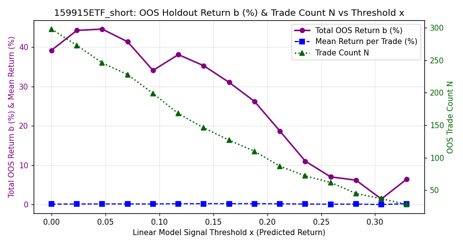<br>


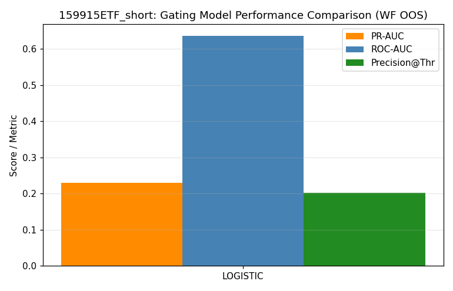<br>


<br>


<br>


<br>


</details>

## 5. Comparison to Baselines

Four baselines evaluated on the same holdout set:

1. **Zero** (no-skill): Always predicts 0. IC=0 by definition.
2. **Yesterday trade_return**: Autocorrelation baseline. Tests if trade returns are predictable from prior day.
3. **First 30-min return (up to decision time)**: Momentum baseline. Tests AM-to-PM momentum.
4. **Ridge Base**: Ridge regression with alpha=1.0 on all candidate features (238 features). Controls for tuning/selection lift.

| ETF/Tag | Best Linear IC > Ridge Base IC? | Best Linear IC > Mom IC? | Best Baseline |
|---------|---------------------------------|--------------------------|---------------|
| 300ETF_long | No | Yes | ridge (IC=+0.1183) |
| 300ETF_short | No | Yes | ridge (IC=+0.1183) |
| 50ETF_long | No | Yes | ridge (IC=+0.1178) |
| 50ETF_short | No | Yes | ridge (IC=+0.1178) |
| 500ETF_long | Yes | Yes | ridge (IC=+0.1348) |
| 500ETF_short | Yes | Yes | ridge (IC=+0.1348) |
| 588000ETF_long | No | No | first_30min_mom (IC=+0.0184) |
| 588000ETF_short | Yes | Yes | first_30min_mom (IC=+0.0184) |
| 159915ETF_long | Yes | Yes | first_30min_mom (IC=+0.0808) |
| 159915ETF_short | Yes | Yes | first_30min_mom (IC=+0.0808) |

## 6. Risk of Overfitting

### 6.1 IS vs OOS Gap

| ETF/Tag | IS IC | OOS IC | Gap | Assessment |
|---------|-------|--------|-----|-----------|
| 300ETF_long | 0.1656 | 0.0478 | +0.1177 | Low |
| 300ETF_short | 0.1880 | 0.0521 | +0.1359 | Low |
| 50ETF_long | 0.1619 | -0.0060 | +0.1679 | Low |
| 50ETF_short | 0.2192 | 0.1153 | +0.1039 | Low |
| 500ETF_long | 0.1758 | 0.1427 | +0.0331 | Low |
| 500ETF_short | 0.1576 | 0.1492 | +0.0084 | Low |
| 588000ETF_long | 0.2782 | -0.0738 | +0.3521 | Moderate |
| 588000ETF_short | 0.1318 | 0.0465 | +0.0853 | Low |
| 159915ETF_long | 0.2495 | 0.1433 | +0.1062 | Low |
| 159915ETF_short | 0.1737 | 0.1396 | +0.0341 | Low |

### 6.2 Regime Breakdown (Year-by-Year)

See per-ETF year-by-year tables in §4. Large year-to-year IC variance signals regime sensitivity.

### 6.3 Purge-Gap Sensitivity

If IC drops sharply as purge gap increases from 0→5→10, it indicates short-term leakage.

| ETF/Tag | Gap=0 | Gap=5 | Gap=10 | Delta(0→10) |
|---------|-------|-------|--------|------------|
| 300ETF_long | +0.0873 | +0.0873 | +0.0873 | -0.0000 |
| 300ETF_short | +0.0617 | +0.0613 | +0.0611 | +0.0007 |
| 50ETF_long | +0.0679 | +0.0670 | +0.0677 | +0.0002 |
| 50ETF_short | +0.0888 | +0.0888 | +0.0908 | -0.0021 |
| 500ETF_long | +0.1109 | +0.1131 | +0.1087 | +0.0022 |
| 500ETF_short | +0.1335 | +0.1339 | +0.1338 | -0.0003 |
| 588000ETF_long | +0.0664 | +0.0769 | +0.0832 | -0.0168 |
| 588000ETF_short | +0.0676 | +0.0711 | +0.0859 | -0.0184 |
| 159915ETF_long | +0.1478 | +0.1469 | +0.1482 | -0.0004 |
| 159915ETF_short | +0.1568 | +0.1561 | +0.1565 | +0.0003 |

### 6.4 Feature Importance Stability

Compare standardized coefficients vs permutation importance (OOS) across features. Large divergence indicates overfitting to specific features.

### 6.5 Top-5 Features: Standardized Coefficient vs Permutation


**300ETF_long**:

| Rank | Standardized Coefficient (Abs) | Permutation Importance |
|------|--------------------------------|----------------------|
| 1 | max_up_ret (+0.0698) | max_up_ret (+0.008109) |
| 2 | sma100_dist (-0.0422) | sma100_dist (+0.005528) |
| 3 | volume_weighted_price_position (+0.0229) | volume_surge_direction (+0.004829) |
| 4 | northbound_net (+0.0145) | yesterday_early_vwap_dev (+0.000465) |
| 5 | volume_surge_direction (+0.0142) | yesterday_am_return (+0.000460) |

**300ETF_short**:

| Rank | Standardized Coefficient (Abs) | Permutation Importance |
|------|--------------------------------|----------------------|
| 1 | volume_surge_max (-0.3057) | volume_surge_max (+0.307434) |
| 2 | first_bar_volume (+0.2053) | first_bar_volume (+0.147797) |
| 3 | roc10 (-0.1194) | roc10 (+0.039982) |
| 4 | close_vs_open_range (-0.1177) | close_vs_open_range (+0.024993) |
| 5 | or_fill_ratio (+0.0949) | bar_ret_0 (+0.021194) |

**50ETF_long**:

| Rank | Standardized Coefficient (Abs) | Permutation Importance |
|------|--------------------------------|----------------------|
| 1 | sma100_dist (-0.0473) | volume_surge_direction (+0.006307) |
| 2 | volume_surge_direction (+0.0429) | margin_net_buy (+0.004576) |
| 3 | margin_net_buy (-0.0362) | sma100_dist (+0.004360) |
| 4 | yesterday_body_ratio (-0.0257) | yesterday_body_ratio (+0.001285) |
| 5 | bar_vwap_dev_0 (+0.0166) | bar_vwap_dev_0 (+0.001102) |

**50ETF_short**:

| Rank | Standardized Coefficient (Abs) | Permutation Importance |
|------|--------------------------------|----------------------|
| 1 | yesterday_day_close_pos (-0.5817) | yesterday_close_position (+0.613350) |
| 2 | yesterday_close_position (+0.5694) | yesterday_day_close_pos (+0.571199) |
| 3 | margin_balance (+0.3461) | capital_sell_value (+0.175597) |
| 4 | total_balance (-0.3256) | capital_buy_value (+0.099118) |
| 5 | yesterday_day_vwap_dev (-0.2662) | volume_surge_max (+0.095887) |

**500ETF_long**:

| Rank | Standardized Coefficient (Abs) | Permutation Importance |
|------|--------------------------------|----------------------|
| 1 | max_up_ret (+0.1344) | max_up_ret (+0.033462) |
| 2 | yesterday_intraday_close_position (+0.0534) | yesterday_intraday_close_position (+0.012112) |
| 3 | yesterday_gap_pct (+0.0039) | sma100_dist (+0.000063) |
| 4 | sma100_dist (-0.0010) | early_range (+0.000000) |
| 5 | early_realized_vol (+0.0000) | early_realized_vol (+0.000000) |

**500ETF_short**:

| Rank | Standardized Coefficient (Abs) | Permutation Importance |
|------|--------------------------------|----------------------|
| 1 | max_up_ret (+0.0998) | max_up_ret (+0.016156) |
| 2 | yesterday_intraday_close_position (+0.0668) | yesterday_intraday_close_position (+0.015016) |
| 3 | bar_ret_0 (+0.0561) | bar_ret_0 (+0.007037) |
| 4 | sma100_dist (-0.0492) | sma100_dist (+0.004143) |
| 5 | yesterday_gap_pct (+0.0310) | gap_pct (+0.002311) |

**588000ETF_long**:

| Rank | Standardized Coefficient (Abs) | Permutation Importance |
|------|--------------------------------|----------------------|
| 1 | vol5 (+0.3297) | yesterday_day_vwap_dev (+0.307128) |
| 2 | yesterday_day_vwap_dev (-0.2558) | vol_ratio_10_60 (+0.115424) |
| 3 | yesterday_pm_return (+0.2384) | sma100_dist (+0.114611) |
| 4 | sma100_dist (-0.2138) | max_up_ret (+0.097035) |
| 5 | early_range (-0.2046) | early_range (+0.078955) |

**588000ETF_short**:

| Rank | Standardized Coefficient (Abs) | Permutation Importance |
|------|--------------------------------|----------------------|
| 1 | first_bar_return (+0.1854) | yesterday_gap (+0.034340) |
| 2 | yesterday_gap (+0.1593) | first_bar_return (+0.010580) |
| 3 | volatility_percentile_20d (+0.0274) | early_realized_vol (+0.000000) |
| 4 | early_range (+0.0000) | early_range (+0.000000) |
| 5 | early_realized_vol (+0.0000) | early_trend (+0.000000) |

**159915ETF_long**:

| Rank | Standardized Coefficient (Abs) | Permutation Importance |
|------|--------------------------------|----------------------|
| 1 | yesterday_day_vwap_dev (-0.1722) | gap_pct (+0.071415) |
| 2 | sma100_dist (-0.1719) | bar_ret_0 (+0.061537) |
| 3 | bar_ret_0 (+0.1659) | yesterday_day_vwap_dev (+0.054336) |
| 4 | gap_pct (+0.1167) | sma100_dist (+0.052431) |
| 5 | yesterday_early_momentum (+0.1136) | margin_net_buy (+0.046107) |

**159915ETF_short**:

| Rank | Standardized Coefficient (Abs) | Permutation Importance |
|------|--------------------------------|----------------------|
| 1 | first_bar_return (+0.1776) | first_bar_return (+0.067982) |
| 2 | yesterday_day_vwap_dev (-0.0838) | gap_pct (+0.027109) |
| 3 | yesterday_early_momentum (+0.0744) | yesterday_early_momentum (+0.019338) |
| 4 | gap_pct (+0.0440) | yesterday_day_vwap_dev (+0.015127) |
| 5 | bar_vwap_dev_1 (+0.0369) | bar_vwap_dev_1 (+0.005513) |

### 6.6 Hyperparameter Sensitivity

Optuna parameter importance shows which parameters most affect CV IC.

- **300ETF_long**: Most influential = `top_k_features` (96.27%)
- **300ETF_short**: Most influential = `top_k_features` (86.44%)
- **50ETF_long**: Most influential = `top_k_features` (88.92%)
- **50ETF_short**: Most influential = `top_k_features` (80.83%)
- **500ETF_long**: Most influential = `top_k_features` (61.72%)
- **500ETF_short**: Most influential = `top_k_features` (90.29%)
- **588000ETF_long**: Most influential = `top_k_features` (98.78%)
- **588000ETF_short**: Most influential = `top_k_features` (95.78%)
- **159915ETF_long**: Most influential = `top_k_features` (94.91%)
- **159915ETF_short**: Most influential = `top_k_features` (69.16%)

## 7. Sensitivity to Prediction Time (Bar Count Comparison)

To determine how early the trade_return prediction can be made, we evaluated model performance across different morning bar counts (target = `trade_return`: open[decision_bar+1] -> close[EXIT_BAR] using ETF prices, with features computed from Index data):
- **9:45 AM (3 bars)**: First 15 minutes of trading (9:30–9:45)
- **9:50 AM (4 bars)**: First 20 minutes of trading (9:30–9:50)
- **9:55 AM (5 bars)**: First 25 minutes of trading (9:30–9:55)
- **10:00 AM (6 bars)**: First 30 minutes of trading (9:30–10:00) [Original Baseline]

> [!IMPORTANT]
> **Look-Ahead Bias Correction**: To prevent any look-ahead bias, volume normalization in these experiments uses a rolling 20-day historical average of daily volume shifted by 1 day (i.e. expected bar volume = `yesterday_rolling_20d_daily_volume / 48`), ensuring zero future information leaks into the features.

### 7.1 Performance Summary by Bar Count

| ETF | Bar Count | Prediction Time | Selected Model | Features | Holdout IC | Holdout Dir | L/S Sharpe |
|-----|-----------|-----------------|----------------|----------|------------|-------------|------------|
| **300ETF** | 3 | 9:45 (3 bar) | RIDGE | 30 | +0.0212 | 0.482 | +1.46 |
|  | 4 | 9:50 (4 bar) | HUBER | 27 | +0.0449 | 0.487 | +0.92 |
|  | 5 | 9:55 (5 bar) | HUBER | 20 | +0.0632 | 0.504 | **+1.93** |
|  | 6 | 10:00 (6 bar) | HUBER | 14 | **+0.0770** | 0.507 | +1.72 |
| | | | | | | | |
| **50ETF** | 3 | 9:45 (3 bar) | HUBER | 10 | -0.0233 | 0.533 | -0.58 |
|  | 4 | 9:50 (4 bar) | HUBER | 13 | -0.0029 | 0.513 | +0.70 |
|  | 5 | 9:55 (5 bar) | HUBER | 13 | +0.0047 | 0.504 | -0.27 |
|  | 6 | 10:00 (6 bar) | HUBER | 27 | **+0.0188** | 0.507 | **+1.63** |
| | | | | | | | |
| **500ETF** | 3 | 9:45 (3 bar) | HUBER | 9 | +0.1369 | 0.564 | +2.54 |
|  | 4 | 9:50 (4 bar) | LASSO | 11 | +0.0880 | 0.549 | +1.12 |
|  | 5 | 9:55 (5 bar) | HUBER | 24 | **+0.1466** | 0.551 | +2.39 |
|  | 6 | 10:00 (6 bar) | RIDGE | 26 | +0.1149 | 0.551 | **+3.07** |
| | | | | | | | |
| **588000ETF** | 3 | 9:45 (3 bar) | ELASTICNET | 19 | -0.0213 | 0.492 | -0.37 |
|  | 4 | 9:50 (4 bar) | LASSO | 33 | **+0.0082** | 0.492 | +0.70 |
|  | 5 | 9:55 (5 bar) | ELASTICNET | 31 | -0.0283 | 0.484 | **+0.75** |
|  | 6 | 10:00 (6 bar) | LASSO | 23 | -0.0630 | 0.469 | -1.09 |
| | | | | | | | |
| **159915ETF** | 3 | 9:45 (3 bar) | RIDGE | 44 | +0.2032 | 0.578 | **+4.68** |
|  | 4 | 9:50 (4 bar) | HUBER | 12 | +0.2117 | 0.595 | +4.43 |
|  | 5 | 9:55 (5 bar) | ELASTICNET | 14 | **+0.2164** | 0.591 | +4.41 |
|  | 6 | 10:00 (6 bar) | ELASTICNET | 13 | +0.1802 | 0.571 | +3.98 |
| | | | | | | | |

### 7.2 Key Insights & Observations

1. **Window Duration vs. Model Maturity**:
   - For blue-chip ETFs (**300ETF** and **50ETF**), predictive accuracy improves monotonically as the morning observation window expands. 300ETF holdout IC climbs from `+0.0212` (9:45 AM) to `+0.0770` (10:00 AM) in experiments. This indicates that blue-chip index momentum requires a full 30-minute digestion period to become highly predictive.
2. **Early Peak Signals in Chinext/Mid-Cap**:
   - For high-beta/growth index ETFs (**159915ETF** and **500ETF**), prediction power peaks *before* 10:00 AM:
     - **159915ETF** achieves its highest Holdout IC at 9:55 AM (`+0.2164`, L/S Sharpe `+4.41`), and its highest L/S Sharpe at 9:45 AM (`+4.68`, Holdout IC `+0.2032`).
     - **500ETF** holds high predictive power at 9:45 AM (`+0.1369`, L/S Sharpe `+2.54`), peaking in Holdout IC at 9:55 AM (`+0.1466`).
     - *Rationale*: Opening cross and morning price action in mid-cap/growth stock structures are rich with early direction info. Waiting until 10:00 AM dilutes this signal as daily variance decays.
3. **Execution Edge**:
   - These findings indicate we can deploy day-models for **159915ETF** and **500ETF** as early as **9:45 AM** or **9:50 AM** with superior predictive stats. This gives execution models (e.g. limit entry solvers) more time to enter before the afternoon session.

## 8. Conclusions & Caveats

**Potentially deployable** (IC>0.03, L/S Sharpe>0.5, beats Ridge Base): 500ETF_long, 500ETF_short, 588000ETF_short, 159915ETF_long, 159915ETF_short

**Marginal** (positive IC but weak Sharpe or below Ridge Base): 300ETF_long, 300ETF_short, 50ETF_short

**Weak/Not recommended** (negative IC or no edge): 50ETF_long, 588000ETF_long


**Key caveats**:

1. Trade return prediction is inherently noisy (low signal-to-noise ratio)
2. Feature selection using block bootstrap stability scores handles highly correlated features much better than greedy RFE
3. Robust Huber datafits (used in both `skglm_huber_l1` and `skglm_mcp` models) handle extreme outlier days much better than standard MSE-based models
4. Transaction costs and execution slippage are not modeled here
