# Day-Model Remake Optimization Report
> Generated by day-model/generate_report.py

Side-aware objective: `single` (legacy two-sided Tail IC), `long` (top-only, `pred >= P85(pred)`), `short` (bot-only, `pred <= P15(pred)`). Tail IC and lockbox Tail IC are side-aware; CV M1..M6 metrics stay two-sided.

This report summarizes the performance and features of the remade `day-model` return predictors, optimized using first-principles multi-metric objective functions and stability selection.

## Out-of-Sample Lockbox Performance (2024-03 to Last Day)

| Tag | ETF | Side | Selected | Active | Model Type | Lockbox IC | Lockbox Tail IC | Tail IC Def |
| :--- | :---: | :---: | :---: | :---: | :---: | :---: | :---: | :---: |
| 300ETF_early | 300ETF | `single` | 16 | 14 | `unified` | +0.0214 | -0.0425 | single |
| 300ETF_long_early | 300ETF | `long` | 16 | 16 | `unified` | +0.0202 | -0.0167 | long |
| 300ETF_short_early | 300ETF | `short` | 16 | 16 | `unified` | +0.0317 | -0.1021 | short |
| 500ETF_early | 500ETF | `single` | 14 | 11 | `unified` | +0.0312 | -0.0115 | single |
| 500ETF_long_early | 500ETF | `long` | 20 | 18 | `unified` | +0.0435 | +0.0097 | long |
| 500ETF_short_early | 500ETF | `short` | 20 | 20 | `unified` | +0.0400 | +0.0108 | short |
| 588000ETF_early | 588000ETF | `single` | 6 | 4 | `unified` | +0.0207 | -0.0496 | single |
| 588000ETF_long_early | 588000ETF | `long` | 24 | 23 | `unified` | +0.0447 | +0.1175 | long |
| 588000ETF_short_early | 588000ETF | `short` | 8 | 5 | `unified` | +0.0094 | -0.0930 | short |
| 159915ETF_early | 159915ETF | `single` | 21 | 21 | `unified` | +0.0435 | +0.1178 | single |
| 159915ETF_long_early | 159915ETF | `long` | 21 | 21 | `unified` | +0.0398 | +0.1014 | long |
| 159915ETF_short_early | 159915ETF | `short` | 21 | 21 | `unified` | +0.0419 | +0.0052 | short |
| 50ETF_early | 50ETF | `single` | 21 | 20 | `unified` | +0.0165 | +0.1324 | single |
| 50ETF_long_early | 50ETF | `long` | 21 | 19 | `unified` | +0.0068 | +0.0393 | long |
| 50ETF_short_early | 50ETF | `short` | 13 | 10 | `unified` | +0.0225 | +0.0350 | short |

## Detailed Trial Metrics & Optimization Objectives

CV fold metrics M1..M6 are two-sided for all sides (per side-aware spec). V1..V4 weights: single `[0.40, 0.40, 0.15, 0.05]`; long/short `[0.45, 0.45, 0.10, 0.00]` (V4 dropped, renormalized).

| Tag | Side | Yearly Tail IC IR | Yearly Tail IC Mean | Hit Rate | Decile Monotonicity | Top-Bottom Spread |
| :--- | :---: | :---: | :---: | :---: | :---: | :---: |
| 300ETF_early | `single` | 1.3843 | +0.2004 | 90.0% | 0.4461 | +33.2259% |
| 300ETF_long_early | `long` | 1.5787 | +0.2195 | 90.0% | 0.3830 | +34.2406% |
| 300ETF_short_early | `short` | 1.7100 | +0.2178 | 90.0% | 0.4885 | +33.7544% |
| 500ETF_early | `single` | 1.2137 | +0.2730 | 80.0% | 0.4715 | +61.3474% |
| 500ETF_long_early | `long` | 1.5089 | +0.2825 | 90.0% | 0.5673 | +79.7094% |
| 500ETF_short_early | `short` | 1.5279 | +0.2394 | 90.0% | 0.4170 | +42.8772% |
| 588000ETF_early | `single` | 1.4784 | +0.2341 | 100.0% | 0.3261 | +57.8344% |
| 588000ETF_long_early | `long` | 1.4356 | +0.2255 | 80.0% | 0.4570 | +42.8792% |
| 588000ETF_short_early | `short` | 2.1391 | +0.3453 | 100.0% | 0.3212 | +66.9684% |
| 159915ETF_early | `single` | 0.9082 | +0.1730 | 90.0% | 0.4764 | +53.8078% |
| 159915ETF_long_early | `long` | 0.9218 | +0.1794 | 80.0% | 0.4776 | +52.6039% |
| 159915ETF_short_early | `short` | 1.1500 | +0.2267 | 70.0% | 0.4242 | +53.7894% |
| 50ETF_early | `single` | 3.1721 | +0.2957 | 100.0% | 0.4279 | +50.8630% |
| 50ETF_long_early | `long` | 3.0040 | +0.2655 | 100.0% | 0.3042 | +45.2907% |
| 50ETF_short_early | `short` | 1.6650 | +0.2170 | 90.0% | 0.3115 | +36.4361% |

## Model Quality & Generalization Diagnostics

### Multi-Collinearity & Weight Concentration

| Tag | Side | Raw X Cond | Reg kappa | Collinear Pairs (>=0.85) | Gini | Tail ESS | Tail ESS % |
| :--- | :---: | :---: | :---: | :---: | :---: | :---: | :---: |
| 300ETF_early | `single` | 2.80 | 6.74 | 0 | 0.5118 | 735.3 | 33.9% |
| 300ETF_long_early | `long` | 2.80 | 3.75 | 0 | 0.4164 | 438.5 | 20.2% |
| 300ETF_short_early | `short` | 2.80 | 7.84 | 0 | 0.3579 | 1914.7 | 88.4% |
| 500ETF_early | `single` | 4.36 | 10.05 | 0 | 0.4240 | 408.7 | 18.9% [LOW] |
| 500ETF_long_early | `long` | 5.76 | 18.49 | 0 | 0.4634 | 1084.7 | 50.1% |
| 500ETF_short_early | `short` | 5.76 | 29.47 | 0 | 0.3589 | 554.2 | 25.6% |
| 588000ETF_early | `single` | 1.53 | 2.28 | 0 | 0.5749 | 424.6 | 52.2% |
| 588000ETF_long_early | `long` | 19.88 | 365.10 [SEVERE] | 0 | 0.4221 | 451.3 | 55.4% |
| 588000ETF_short_early | `short` | 1.41 | 1.99 | 0 | 0.5504 | 441.7 | 54.3% |
| 159915ETF_early | `single` | 25.80 | 491.98 [SEVERE] | 0 | 0.3675 | 571.6 | 26.4% |
| 159915ETF_long_early | `long` | 25.80 | 663.03 [SEVERE] | 0 | 0.3406 | 1291.3 | 59.6% |
| 159915ETF_short_early | `short` | 25.80 | 663.40 [SEVERE] | 0 | 0.3417 | 1938.6 | 89.5% |
| 50ETF_early | `single` | 68.19 | 3119.34 [SEVERE] | 0 | 0.4761 | 2005.4 | 92.6% |
| 50ETF_long_early | `long` | 68.19 | 989.78 [SEVERE] | 0 | 0.4567 | 1929.7 | 89.1% |
| 50ETF_short_early | `short` | 56.19 | 24.11 | 0 | 0.4765 | 1703.0 | 78.6% |

### Generalization Gap (CV vs Selection Val vs OOS)

| Tag | Side | CV IC | Deflated CV IC | Sel Val IC | Deflated Val IC | OOS IC | IC Gen Gap | CV Mono | OOS Mono | Mono Gen Gap |
| :--- | :---: | :---: | :---: | :---: | :---: | :---: | :---: | :---: | :---: | :---: |
| 300ETF_early | `single` | +0.1087 | -0.0043 | +0.0714 | -0.0245 | +0.0214 | -0.0459 | +0.4461 | +0.3818 | +0.0642 |
| 300ETF_long_early | `long` | +0.1145 | +0.0522 | +0.0947 | +0.0460 | +0.0202 | +0.0258 | +0.3830 | +0.6121 | -0.2291 |
| 300ETF_short_early | `short` | +0.1176 | +0.0049 | +0.0634 | -0.0149 | +0.0317 | -0.0466 | +0.4885 | +0.2606 | +0.2279 [DEGRADED] |
| 500ETF_early | `single` | +0.1142 | +0.0037 | +0.1403 | +0.0334 | +0.0312 | +0.0022 | +0.4715 | +0.5394 | -0.0679 |
| 500ETF_long_early | `long` | +0.1466 | +0.0494 | +0.1262 | +0.0389 | +0.0435 | -0.0047 | +0.5673 | +0.5879 | -0.0206 |
| 500ETF_short_early | `short` | +0.0903 | +0.0247 | +0.1084 | +0.0429 | +0.0400 | +0.0029 | +0.4170 | +0.7212 | -0.3042 |
| 588000ETF_early | `single` | +0.1022 | -0.0795 | +0.1558 | -0.0324 | +0.0207 | -0.0532 | +0.3261 | +0.3697 | -0.0436 |
| 588000ETF_long_early | `long` | +0.1766 | +0.0040 | -0.0559 | -0.1948 | +0.0447 | -0.2394 | +0.4570 | +0.6485 | -0.1915 |
| 588000ETF_short_early | `short` | +0.1131 | -0.0723 | +0.1601 | -0.0120 | +0.0094 | -0.0214 | +0.3212 | +0.4909 | -0.1697 |
| 159915ETF_early | `single` | +0.1426 | +0.0296 | +0.0782 | +0.0253 | +0.0435 | -0.0182 | +0.4764 | +0.5758 | -0.0994 |
| 159915ETF_long_early | `long` | +0.1403 | +0.0415 | +0.0828 | +0.0327 | +0.0398 | -0.0070 | +0.4776 | +0.2121 | +0.2655 [DEGRADED] |
| 159915ETF_short_early | `short` | +0.1297 | +0.0406 | +0.0758 | +0.0276 | +0.0419 | -0.0143 | +0.4242 | +0.3576 | +0.0667 |
| 50ETF_early | `single` | +0.0956 | +0.0274 | +0.1566 | +0.0507 | +0.0165 | +0.0342 | +0.4279 | +0.2242 | +0.2036 [DEGRADED] |
| 50ETF_long_early | `long` | +0.1016 | +0.0336 | +0.1391 | +0.0395 | +0.0068 | +0.0326 | +0.3042 | +0.5030 | -0.1988 |
| 50ETF_short_early | `short` | +0.0796 | +0.0058 | +0.1620 | +0.0478 | +0.0225 | +0.0253 | +0.3115 | +0.4788 | -0.1673 |

### Overfitting Diagnostics (PBO & Lockbox Bootstrap CIs)

| Tag | Side | PBO | Perf Deg | OOS IC 95% CI | CV IC Target | IC Sig? | OOS Mono 95% CI | CV Mono | Mono Sig? |
| :--- | :---: | :---: | :---: | :---: | :---: | :---: | :---: | :---: | :---: |
| 300ETF_early | `single` | 26.7% | -1.0776 | [-0.0875, +0.1026] | -0.0245 | **Noise** | [-0.2852, +0.6973] | +0.4461 | **Noise** |
| 300ETF_long_early | `long` | 53.3% | -1.0776 | [-0.0945, +0.0982] | +0.0460 | **Noise** | [-0.2727, +0.7942] | +0.3830 | **Noise** |
| 300ETF_short_early | `short` | 26.7% | -1.0776 | [-0.0762, +0.1090] | -0.0149 | **Noise** | [-0.2488, +0.6242] | +0.4885 | **Noise** |
| 500ETF_early | `single` | 13.3% | -0.1840 | [-0.0639, +0.1201] | +0.0334 | **Noise** | [-0.3091, +0.7455] | +0.4715 | **Noise** |
| 500ETF_long_early | `long` | 13.3% | -0.0146 | [-0.0582, +0.1372] | +0.0389 | **Noise** | [-0.2242, +0.8424] | +0.5673 | **Noise** |
| 500ETF_short_early | `short` | 13.3% | -0.0784 | [-0.0591, +0.1261] | +0.0429 | **Noise** | [-0.2727, +0.8545] | +0.4170 | **Noise** |
| 588000ETF_early | `single` | 0.0% | -0.1178 | [-0.0510, +0.1128] | -0.0324 | **Noise** | [-0.2485, +0.6848] | +0.3261 | **Noise** |
| 588000ETF_long_early | `long` | 0.0% | -0.1178 | [-0.0583, +0.1320] | -0.1948 | **Signal** | [-0.2727, +0.7576] | +0.4570 | **Noise** |
| 588000ETF_short_early | `short` | 6.7% | -0.5584 | [-0.0647, +0.1006] | -0.0120 | **Noise** | [-0.2245, +0.7091] | +0.3212 | **Noise** |
| 159915ETF_early | `single` | 46.7% | -1.6820 | [-0.0551, +0.1277] | +0.0253 | **Noise** | [-0.5273, +0.5636] | +0.4764 | **Noise** |
| 159915ETF_long_early | `long` | 33.3% | -1.3854 | [-0.0593, +0.1227] | +0.0327 | **Noise** | [-0.6364, +0.5394] | +0.4776 | **Noise** |
| 159915ETF_short_early | `short` | 46.7% | -1.3306 | [-0.0518, +0.1232] | +0.0276 | **Noise** | [-0.5882, +0.5879] | +0.4242 | **Noise** |
| 50ETF_early | `single` | 26.7% | -0.5708 | [-0.0778, +0.0989] | +0.0507 | **Noise** | [-0.2606, +0.5879] | +0.4279 | **Noise** |
| 50ETF_long_early | `long` | 26.7% | -0.6136 | [-0.0880, +0.0861] | +0.0395 | **Noise** | [-0.3821, +0.6727] | +0.3042 | **Noise** |
| 50ETF_short_early | `short` | 46.7% | -0.5124 | [-0.0685, +0.1011] | +0.0478 | **Noise** | [-0.2970, +0.6485] | +0.3115 | **Noise** |

### Feature Selection Metrics & Fallbacks

| Tag | Side | Screen In | BH Pass | Screen FB? | Stability In | Stability Pass | Stability FB? | Kept |
| :--- | :---: | :---: | :---: | :---: | :---: | :---: | :---: | :---: |
| 300ETF_early | `single` | 214 | 26 | NO | 214 | 20 | NO | **16** |
| 300ETF_long_early | `long` | 214 | 26 | NO | 214 | 20 | NO | **16** |
| 300ETF_short_early | `short` | 214 | 26 | NO | 214 | 20 | NO | **16** |
| 500ETF_early | `single` | 214 | 41 | NO | 214 | 25 | NO | **20** |
| 500ETF_long_early | `long` | 214 | 41 | NO | 214 | 25 | NO | **20** |
| 500ETF_short_early | `short` | 214 | 41 | NO | 214 | 25 | NO | **20** |
| 588000ETF_early | `single` | 214 | 93 | NO | 214 | 28 | NO | **24** |
| 588000ETF_long_early | `long` | 214 | 93 | NO | 214 | 28 | NO | **24** |
| 588000ETF_short_early | `short` | 214 | 93 | NO | 214 | 28 | NO | **24** |
| 159915ETF_early | `single` | 214 | 40 | NO | 214 | 24 | NO | **21** |
| 159915ETF_long_early | `long` | 214 | 40 | NO | 214 | 24 | NO | **21** |
| 159915ETF_short_early | `short` | 214 | 40 | NO | 214 | 24 | NO | **21** |
| 50ETF_early | `single` | 214 | 85 | NO | 214 | 25 | NO | **21** |
| 50ETF_long_early | `long` | 214 | 85 | NO | 214 | 25 | NO | **21** |
| 50ETF_short_early | `short` | 214 | 85 | NO | 214 | 25 | NO | **21** |

### Optuna Main Study & Pruning Reasons

| Tag | Side | Total | Completed | Pruned/Failed | M4 | M3 | M5 | M6 | ESS | Floor | Gini |
| :--- | :---: | :---: | :---: | :---: | :---: | :---: | :---: | :---: | :---: | :---: | :---: |
| 300ETF_early | `single` | 100 | 64 | 36 | 19 | 25 | 26 | 10 | 0 | 36 | 0 |
| 300ETF_long_early | `long` | 100 | 93 | 7 | 4 | 5 | 5 | 1 | 0 | 6 | 0 |
| 300ETF_short_early | `short` | 100 | 69 | 31 | 17 | 19 | 24 | 8 | 0 | 27 | 0 |
| 500ETF_early | `single` | 100 | 80 | 20 | 15 | 16 | 18 | 8 | 0 | 19 | 0 |
| 500ETF_long_early | `long` | 100 | 82 | 18 | 11 | 11 | 13 | 3 | 0 | 18 | 0 |
| 500ETF_short_early | `short` | 100 | 90 | 10 | 7 | 7 | 8 | 3 | 0 | 9 | 0 |
| 588000ETF_early | `single` | 100 | 69 | 31 | 20 | 22 | 31 | 19 | 0 | 26 | 0 |
| 588000ETF_long_early | `long` | 100 | 67 | 33 | 14 | 15 | 20 | 13 | 0 | 18 | 0 |
| 588000ETF_short_early | `short` | 100 | 20 | 80 | 19 | 20 | 27 | 17 | 0 | 23 | 0 |
| 159915ETF_early | `single` | 100 | 89 | 11 | 11 | 11 | 11 | 11 | 0 | 11 | 0 |
| 159915ETF_long_early | `long` | 100 | 47 | 53 | 8 | 8 | 8 | 8 | 0 | 8 | 0 |
| 159915ETF_short_early | `short` | 100 | 42 | 58 | 6 | 6 | 8 | 7 | 0 | 8 | 0 |
| 50ETF_early | `single` | 100 | 87 | 13 | 0 | 12 | 12 | 11 | 0 | 13 | 0 |
| 50ETF_long_early | `long` | 100 | 86 | 14 | 0 | 12 | 12 | 9 | 0 | 14 | 0 |
| 50ETF_short_early | `short` | 100 | 78 | 22 | 0 | 15 | 19 | 11 | 0 | 19 | 0 |

### Hyperparameter Plateau Selection

| Tag | Side | Plateau Trial | Plateau Objective | Raw Best Trial | Raw Best Objective |
| :--- | :---: | :---: | :---: | :---: | :---: |
| 300ETF_early | `single` | 3 | +1.4091 | 84 | +4.5955 |
| 300ETF_long_early | `long` | 95 | +6.7433 | 98 | +10.3331 |
| 300ETF_short_early | `short` | 47 | +0.9737 | 71 | +7.4309 |
| 500ETF_early | `single` | 80 | +1.5843 | 92 | +2.9407 |
| 500ETF_long_early | `long` | 55 | +1.8831 | 79 | +2.2452 |
| 500ETF_short_early | `short` | 8 | -1.1633 | 47 | -0.3589 |
| 588000ETF_early | `single` | 90 | +3.1396 | 38 | +5.0878 |
| 588000ETF_long_early | `long` | 42 | +0.4596 | 50 | +2.0738 |
| 588000ETF_short_early | `short` | 45 | +1.2272 | 44 | +2.5771 |
| 159915ETF_early | `single` | 94 | +1.6893 | 66 | +1.8812 |
| 159915ETF_long_early | `long` | 99 | +1.2793 | 74 | +2.0030 |
| 159915ETF_short_early | `short` | 52 | +0.0325 | 98 | +0.8770 |
| 50ETF_early | `single` | 61 | +0.9128 | 95 | +1.1215 |
| 50ETF_long_early | `long` | 93 | +1.0040 | 60 | +2.2070 |
| 50ETF_short_early | `short` | 79 | +0.9413 | 31 | +1.7544 |

## Per-Tag Diagnostics (15-Panel Figure per Side)

Each tag has ONE combined diagnostics figure with 15 subplots (5 rows x 3 cols):
coefficients, OOS decile spread, all-data decile spread, side-tail return hist, tail scatter, yearly overall IC, yearly side-aware tail IC, yearly tail hit rate, tail vs rest mean, rolling 252d tail IC, rolling 252d overall IC, prediction dist, tail equity curve, quantile decay, precision @ k.

### 300ETF_early (300ETF, side=`single`)
- **Selected features**: 16
- **Active features**: 14
- **Active**: `early_vwap_dev`, `outside_bar_reversal_day`, `gap_pct`, `capital_large_order_ratio`, `bar_vol_4`, `sma100_dist`, `yesterday_day_kurtosis`, `yesterday_gap_pct`, `bar_ret_0`, `max_up_ret`, `option_oi_growth`, `yesterday_early_trend`, `yesterday_am_return`, `yesterday_lunch_gap`
- **Stopped by Step 1 (FDR Screening)** (0 features):
  None
- **Stopped by Step 2 (Stability & VIF Pruning)** (198 features):
  

  
Show 198 features

  
  `first_30min_return`, `early_realized_vol`, `early_range`, `early_trend`, `early_momentum`, `first_bar_return`, `first_bar_volume`, `early_skew`, `early_kurtosis`, `bar_ret_1`, `bar_ret_2`, `bar_vol_0`, `bar_vol_5`, `bar_rng_0`, `bar_rng_2`, `bar_rng_3`, `bar_rng_5`, `bar_body_rng_0`, `bar_body_rng_1`, `bar_body_rng_2`, `bar_vwap_dev_0`, `bar_vwap_dev_1`, `bar_vwap_dev_2`, `bar_vwap_dev_3`, `bar_vwap_dev_5`, `num_up_bars`, `max_down_ret`, `cl_pos_in_range`, `body_to_range_ratio`, `total_path_length`, `volume_slope`, `spike_exhaustion_ratio`, `first_bar_sentiment`, `or_fill_ratio`, `close_vs_open_range`, `inside_bar_failure_bull`, `consecutive_higher_highs`, `early_bearish_engulfing_count`, `volume_surge_max`, `volume_concentration`, `volume_trend_intraday`, `volume_acceleration`, `volume_surge_direction`, `pullback_ratio`, `rally_ratio`, `range_expansion_ratio`, `pullback_depth_ratio`, `pullback_depth_max`, `rally_strength_max`, `vwap_slope_intraday`, `volume_weighted_price_position`, `net_volume_flow`, `early_body_momentum`, `late_bar_momentum`, `trend_strength_intraday`, `high_low_sequence_momentum`, `intraday_slope`, `intraday_autocorr`, `opening_momentum_score`, `opening_direction_stability`, `early_trend_hhi`, `session_high_proximity`, `session_low_proximity`, `close_above_open_count`, `open_to_current_return`, `upper_wick_dominance`, `rsi_opening`, `stoch_opening`, `momentum_strength_intraday`, `opening_auction_imbalance`, `intraday_close_position`, `limit_down_proximity_early`, `morning_trend_extrapolated`, `demark_setup_reversal_early`, `failed_breakout_reversal_early`, `early_wavetrend_cross`, `atr_expansion_flag_early`, `volatility_breakout_squeeze`, `early_bid_ask_spread_proxy`, `early_vwap_acceleration`, `early_order_flow_imbalance`, `rbreaker_sell_setup_proximity_early`, `rbreaker_buy_setup_proximity_early`, `skypark_gap_reversal_early`, `turtle_breakout_strength_early`, `macd_hist`, `sma20_dist`, `sma50_dist`, `atr14_norm`, `roc10`, `vol20`, `sma10_dist`, `sma200_dist`, `ema12_dist`, `rsi5`, `rsi21`, `roc5`, `roc20`, `roc60`, `cci14`, `willr14`, `stoch_k`, `stoch_d`, `mfi14`, `aroon_osc`, `vol5`, `vol10`, `vol60`, `vol_ratio_10_60`, `bb_width`, `vol_pk20`, `vol_gk10`, `vol_gk20`, `volume_sma_ratio`, `margin_balance`, `buy_on_margin_value`, `margin_repayment`, `short_balance`, `short_balance_quantity`, `short_sell_quantity`, `short_repayment_quantity`, `total_balance`, `margin_net_buy`, `margin_short_ratio`, `capital_buy_volume`, `capital_buy_value`, `capital_sell_volume`, `capital_sell_value`, `capital_net_value`, `capital_net_ratio`, `northbound_buy`, `northbound_sell`, `northbound_net`, `iv`, `iv_vol_ratio`, `vix`, `vix_vol_ratio`, `vix_iv_spread`, `vix_iv_ratio`, `iv_diff_1d`, `vix_diff_1d`, `yesterday_limit_up_touch`, `limit_up_proximity_day`, `limit_down_proximity_day`, `growth_momentum_ratio`, `high_beta_vol_ratio`, `vix_skew_proxy`, `vix_rolling_percentile_60d`, `iv_corridor_width`, `yesterday_vix_early_drift`, `vix_realized_spread`, `iv_envelope_deviation`, `margin_lever_ratio`, `capital_net_accel`, `northbound_volume_share`, `yesterday_northbound_net_ratio`, `margin_buy_repayment_spread`, `short_sell_cover_spread`, `margin_extreme_rank_252d`, `consecutive_inside_bars_3d`, `wavetrend_osc_day`, `keltner_squeeze_width`, `yesterday_wavetrend_osc`, `yesterday_stoch_rsi_cross`, `cvd_divergence_day`, `yesterday_illiquidity_amihud`, `coppock_curve_day`, `yesterday_range_ratio`, `yesterday_body_ratio`, `yesterday_volume_ratio`, `yesterday_return`, `yesterday_gap`, `yesterday_close_position`, `sma_distance_5d`, `sma_distance_60d`, `volatility_percentile_20d`, `volume_percentile_20d`, `yearly_high_distance`, `yearly_low_distance`, `twenty_gap_bars_regime`, `measured_move_proximity`, `yesterday_pm_return`, `yesterday_first_30min_return`, `yesterday_early_realized_vol`, `yesterday_early_range`, `yesterday_early_momentum`, `yesterday_first_bar_volume`, `yesterday_early_vwap_dev`, `yesterday_day_range`, `yesterday_day_realized_vol`, `yesterday_day_close_pos`, `yesterday_day_pm_am_vol_ratio`, `yesterday_day_vwap_dev`, `yesterday_day_skew`, `yesterday_afternoon_reversal`, `yesterday_pm_am_vol_ratio`, `yesterday_afternoon_momentum`, `yesterday_cvd_close`
  

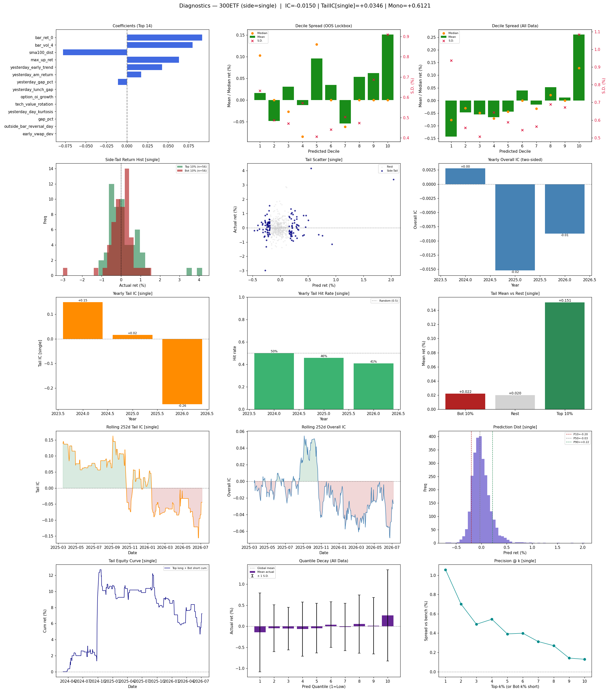

### 300ETF_long_early (300ETF, side=`long`)
- **Selected features**: 16
- **Active features**: 16
- **Active**: `early_vwap_dev`, `outside_bar_reversal_day`, `gap_pct`, `capital_large_order_ratio`, `bar_vol_4`, `vol_ratio_5_20`, `sma100_dist`, `yesterday_day_kurtosis`, `tech_value_rotation`, `yesterday_gap_pct`, `bar_ret_0`, `max_up_ret`, `option_oi_growth`, `yesterday_early_trend`, `yesterday_am_return`, `yesterday_lunch_gap`
- **Stopped by Step 1 (FDR Screening)** (0 features):
  None
- **Stopped by Step 2 (Stability & VIF Pruning)** (198 features):
  

  
Show 198 features

  
  `first_30min_return`, `early_realized_vol`, `early_range`, `early_trend`, `early_momentum`, `first_bar_return`, `first_bar_volume`, `early_skew`, `early_kurtosis`, `bar_ret_1`, `bar_ret_2`, `bar_vol_0`, `bar_vol_5`, `bar_rng_0`, `bar_rng_2`, `bar_rng_3`, `bar_rng_5`, `bar_body_rng_0`, `bar_body_rng_1`, `bar_body_rng_2`, `bar_vwap_dev_0`, `bar_vwap_dev_1`, `bar_vwap_dev_2`, `bar_vwap_dev_3`, `bar_vwap_dev_5`, `num_up_bars`, `max_down_ret`, `cl_pos_in_range`, `body_to_range_ratio`, `total_path_length`, `volume_slope`, `spike_exhaustion_ratio`, `first_bar_sentiment`, `or_fill_ratio`, `close_vs_open_range`, `inside_bar_failure_bull`, `consecutive_higher_highs`, `early_bearish_engulfing_count`, `volume_surge_max`, `volume_concentration`, `volume_trend_intraday`, `volume_acceleration`, `volume_surge_direction`, `pullback_ratio`, `rally_ratio`, `range_expansion_ratio`, `pullback_depth_ratio`, `pullback_depth_max`, `rally_strength_max`, `vwap_slope_intraday`, `volume_weighted_price_position`, `net_volume_flow`, `early_body_momentum`, `late_bar_momentum`, `trend_strength_intraday`, `high_low_sequence_momentum`, `intraday_slope`, `intraday_autocorr`, `opening_momentum_score`, `opening_direction_stability`, `early_trend_hhi`, `session_high_proximity`, `session_low_proximity`, `close_above_open_count`, `open_to_current_return`, `upper_wick_dominance`, `rsi_opening`, `stoch_opening`, `momentum_strength_intraday`, `opening_auction_imbalance`, `intraday_close_position`, `limit_down_proximity_early`, `morning_trend_extrapolated`, `demark_setup_reversal_early`, `failed_breakout_reversal_early`, `early_wavetrend_cross`, `atr_expansion_flag_early`, `volatility_breakout_squeeze`, `early_bid_ask_spread_proxy`, `early_vwap_acceleration`, `early_order_flow_imbalance`, `rbreaker_sell_setup_proximity_early`, `rbreaker_buy_setup_proximity_early`, `skypark_gap_reversal_early`, `turtle_breakout_strength_early`, `macd_hist`, `sma20_dist`, `sma50_dist`, `atr14_norm`, `roc10`, `vol20`, `sma10_dist`, `sma200_dist`, `ema12_dist`, `rsi5`, `rsi21`, `roc5`, `roc20`, `roc60`, `cci14`, `willr14`, `stoch_k`, `stoch_d`, `mfi14`, `aroon_osc`, `vol5`, `vol10`, `vol60`, `vol_ratio_10_60`, `bb_width`, `vol_pk20`, `vol_gk10`, `vol_gk20`, `volume_sma_ratio`, `margin_balance`, `buy_on_margin_value`, `margin_repayment`, `short_balance`, `short_balance_quantity`, `short_sell_quantity`, `short_repayment_quantity`, `total_balance`, `margin_net_buy`, `margin_short_ratio`, `capital_buy_volume`, `capital_buy_value`, `capital_sell_volume`, `capital_sell_value`, `capital_net_value`, `capital_net_ratio`, `northbound_buy`, `northbound_sell`, `northbound_net`, `iv`, `iv_vol_ratio`, `vix`, `vix_vol_ratio`, `vix_iv_spread`, `vix_iv_ratio`, `iv_diff_1d`, `vix_diff_1d`, `yesterday_limit_up_touch`, `limit_up_proximity_day`, `limit_down_proximity_day`, `growth_momentum_ratio`, `high_beta_vol_ratio`, `vix_skew_proxy`, `vix_rolling_percentile_60d`, `iv_corridor_width`, `yesterday_vix_early_drift`, `vix_realized_spread`, `iv_envelope_deviation`, `margin_lever_ratio`, `capital_net_accel`, `northbound_volume_share`, `yesterday_northbound_net_ratio`, `margin_buy_repayment_spread`, `short_sell_cover_spread`, `margin_extreme_rank_252d`, `consecutive_inside_bars_3d`, `wavetrend_osc_day`, `keltner_squeeze_width`, `yesterday_wavetrend_osc`, `yesterday_stoch_rsi_cross`, `cvd_divergence_day`, `yesterday_illiquidity_amihud`, `coppock_curve_day`, `yesterday_range_ratio`, `yesterday_body_ratio`, `yesterday_volume_ratio`, `yesterday_return`, `yesterday_gap`, `yesterday_close_position`, `sma_distance_5d`, `sma_distance_60d`, `volatility_percentile_20d`, `volume_percentile_20d`, `yearly_high_distance`, `yearly_low_distance`, `twenty_gap_bars_regime`, `measured_move_proximity`, `yesterday_pm_return`, `yesterday_first_30min_return`, `yesterday_early_realized_vol`, `yesterday_early_range`, `yesterday_early_momentum`, `yesterday_first_bar_volume`, `yesterday_early_vwap_dev`, `yesterday_day_range`, `yesterday_day_realized_vol`, `yesterday_day_close_pos`, `yesterday_day_pm_am_vol_ratio`, `yesterday_day_vwap_dev`, `yesterday_day_skew`, `yesterday_afternoon_reversal`, `yesterday_pm_am_vol_ratio`, `yesterday_afternoon_momentum`, `yesterday_cvd_close`
  

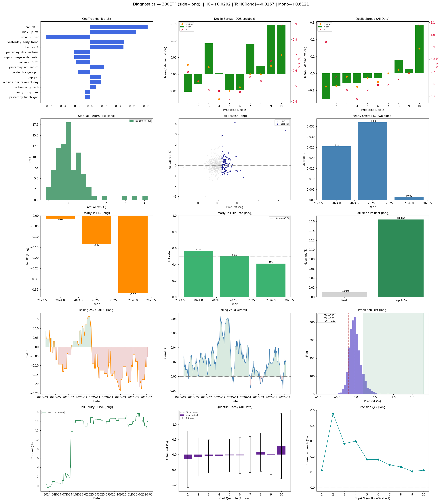

### 300ETF_short_early (300ETF, side=`short`)
- **Selected features**: 16
- **Active features**: 16
- **Active**: `early_vwap_dev`, `outside_bar_reversal_day`, `gap_pct`, `capital_large_order_ratio`, `bar_vol_4`, `vol_ratio_5_20`, `sma100_dist`, `yesterday_day_kurtosis`, `tech_value_rotation`, `yesterday_gap_pct`, `bar_ret_0`, `max_up_ret`, `option_oi_growth`, `yesterday_early_trend`, `yesterday_am_return`, `yesterday_lunch_gap`
- **Stopped by Step 1 (FDR Screening)** (0 features):
  None
- **Stopped by Step 2 (Stability & VIF Pruning)** (198 features):
  

  
Show 198 features

  
  `first_30min_return`, `early_realized_vol`, `early_range`, `early_trend`, `early_momentum`, `first_bar_return`, `first_bar_volume`, `early_skew`, `early_kurtosis`, `bar_ret_1`, `bar_ret_2`, `bar_vol_0`, `bar_vol_5`, `bar_rng_0`, `bar_rng_2`, `bar_rng_3`, `bar_rng_5`, `bar_body_rng_0`, `bar_body_rng_1`, `bar_body_rng_2`, `bar_vwap_dev_0`, `bar_vwap_dev_1`, `bar_vwap_dev_2`, `bar_vwap_dev_3`, `bar_vwap_dev_5`, `num_up_bars`, `max_down_ret`, `cl_pos_in_range`, `body_to_range_ratio`, `total_path_length`, `volume_slope`, `spike_exhaustion_ratio`, `first_bar_sentiment`, `or_fill_ratio`, `close_vs_open_range`, `inside_bar_failure_bull`, `consecutive_higher_highs`, `early_bearish_engulfing_count`, `volume_surge_max`, `volume_concentration`, `volume_trend_intraday`, `volume_acceleration`, `volume_surge_direction`, `pullback_ratio`, `rally_ratio`, `range_expansion_ratio`, `pullback_depth_ratio`, `pullback_depth_max`, `rally_strength_max`, `vwap_slope_intraday`, `volume_weighted_price_position`, `net_volume_flow`, `early_body_momentum`, `late_bar_momentum`, `trend_strength_intraday`, `high_low_sequence_momentum`, `intraday_slope`, `intraday_autocorr`, `opening_momentum_score`, `opening_direction_stability`, `early_trend_hhi`, `session_high_proximity`, `session_low_proximity`, `close_above_open_count`, `open_to_current_return`, `upper_wick_dominance`, `rsi_opening`, `stoch_opening`, `momentum_strength_intraday`, `opening_auction_imbalance`, `intraday_close_position`, `limit_down_proximity_early`, `morning_trend_extrapolated`, `demark_setup_reversal_early`, `failed_breakout_reversal_early`, `early_wavetrend_cross`, `atr_expansion_flag_early`, `volatility_breakout_squeeze`, `early_bid_ask_spread_proxy`, `early_vwap_acceleration`, `early_order_flow_imbalance`, `rbreaker_sell_setup_proximity_early`, `rbreaker_buy_setup_proximity_early`, `skypark_gap_reversal_early`, `turtle_breakout_strength_early`, `macd_hist`, `sma20_dist`, `sma50_dist`, `atr14_norm`, `roc10`, `vol20`, `sma10_dist`, `sma200_dist`, `ema12_dist`, `rsi5`, `rsi21`, `roc5`, `roc20`, `roc60`, `cci14`, `willr14`, `stoch_k`, `stoch_d`, `mfi14`, `aroon_osc`, `vol5`, `vol10`, `vol60`, `vol_ratio_10_60`, `bb_width`, `vol_pk20`, `vol_gk10`, `vol_gk20`, `volume_sma_ratio`, `margin_balance`, `buy_on_margin_value`, `margin_repayment`, `short_balance`, `short_balance_quantity`, `short_sell_quantity`, `short_repayment_quantity`, `total_balance`, `margin_net_buy`, `margin_short_ratio`, `capital_buy_volume`, `capital_buy_value`, `capital_sell_volume`, `capital_sell_value`, `capital_net_value`, `capital_net_ratio`, `northbound_buy`, `northbound_sell`, `northbound_net`, `iv`, `iv_vol_ratio`, `vix`, `vix_vol_ratio`, `vix_iv_spread`, `vix_iv_ratio`, `iv_diff_1d`, `vix_diff_1d`, `yesterday_limit_up_touch`, `limit_up_proximity_day`, `limit_down_proximity_day`, `growth_momentum_ratio`, `high_beta_vol_ratio`, `vix_skew_proxy`, `vix_rolling_percentile_60d`, `iv_corridor_width`, `yesterday_vix_early_drift`, `vix_realized_spread`, `iv_envelope_deviation`, `margin_lever_ratio`, `capital_net_accel`, `northbound_volume_share`, `yesterday_northbound_net_ratio`, `margin_buy_repayment_spread`, `short_sell_cover_spread`, `margin_extreme_rank_252d`, `consecutive_inside_bars_3d`, `wavetrend_osc_day`, `keltner_squeeze_width`, `yesterday_wavetrend_osc`, `yesterday_stoch_rsi_cross`, `cvd_divergence_day`, `yesterday_illiquidity_amihud`, `coppock_curve_day`, `yesterday_range_ratio`, `yesterday_body_ratio`, `yesterday_volume_ratio`, `yesterday_return`, `yesterday_gap`, `yesterday_close_position`, `sma_distance_5d`, `sma_distance_60d`, `volatility_percentile_20d`, `volume_percentile_20d`, `yearly_high_distance`, `yearly_low_distance`, `twenty_gap_bars_regime`, `measured_move_proximity`, `yesterday_pm_return`, `yesterday_first_30min_return`, `yesterday_early_realized_vol`, `yesterday_early_range`, `yesterday_early_momentum`, `yesterday_first_bar_volume`, `yesterday_early_vwap_dev`, `yesterday_day_range`, `yesterday_day_realized_vol`, `yesterday_day_close_pos`, `yesterday_day_pm_am_vol_ratio`, `yesterday_day_vwap_dev`, `yesterday_day_skew`, `yesterday_afternoon_reversal`, `yesterday_pm_am_vol_ratio`, `yesterday_afternoon_momentum`, `yesterday_cvd_close`
  

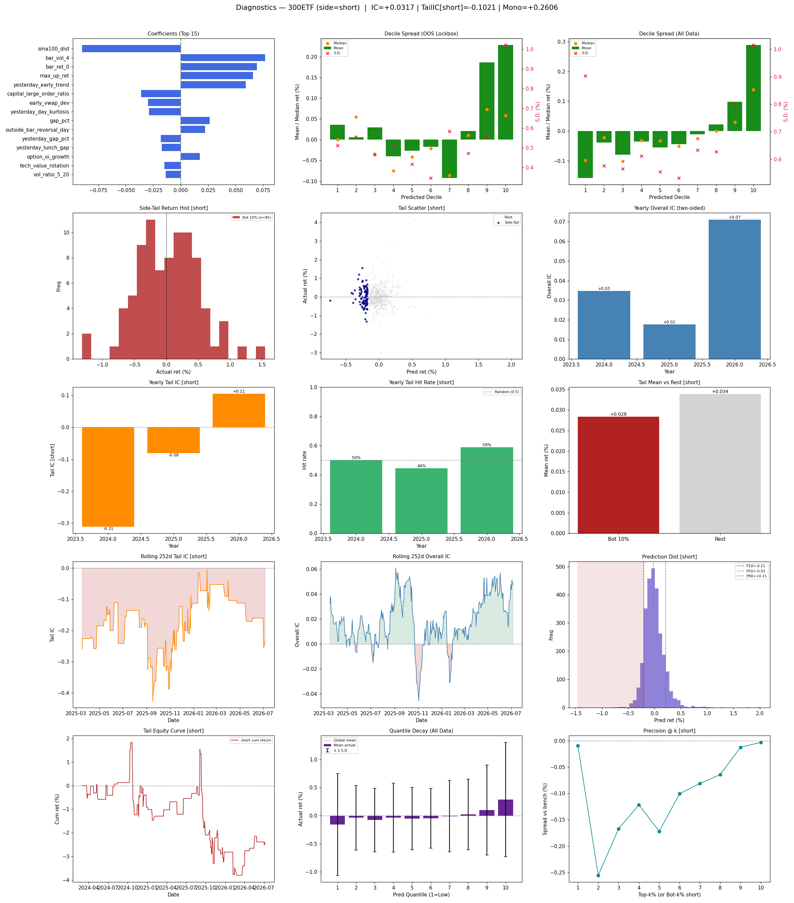

### 500ETF_early (500ETF, side=`single`)
- **Selected features**: 14
- **Active features**: 11
- **Active**: `yesterday_day_realized_vol`, `bar_rng_3`, `bar_vol_4`, `bar_vol_5`, `yesterday_lunch_gap`, `bar_ret_0`, `max_up_ret`, `yesterday_early_trend`, `bar_vwap_dev_2`, `sma100_dist`, `margin_buy_repayment_spread`
- **Stopped by Step 1 (FDR Screening)** (0 features):
  None
- **Stopped by Step 2 (Stability & VIF Pruning)** (200 features):
  

  
Show 200 features

  
  `gap_pct`, `first_30min_return`, `early_realized_vol`, `early_range`, `early_trend`, `early_momentum`, `first_bar_return`, `first_bar_volume`, `early_vwap_dev`, `early_skew`, `early_kurtosis`, `bar_ret_1`, `bar_ret_2`, `bar_vol_0`, `bar_rng_0`, `bar_rng_2`, `bar_rng_5`, `bar_body_rng_0`, `bar_body_rng_1`, `bar_body_rng_2`, `bar_vwap_dev_0`, `bar_vwap_dev_1`, `bar_vwap_dev_3`, `bar_vwap_dev_5`, `num_up_bars`, `max_down_ret`, `cl_pos_in_range`, `body_to_range_ratio`, `total_path_length`, `volume_slope`, `spike_exhaustion_ratio`, `first_bar_sentiment`, `or_fill_ratio`, `close_vs_open_range`, `inside_bar_failure_bull`, `consecutive_higher_highs`, `early_bearish_engulfing_count`, `volume_surge_max`, `volume_concentration`, `volume_trend_intraday`, `volume_acceleration`, `volume_surge_direction`, `pullback_ratio`, `rally_ratio`, `range_expansion_ratio`, `pullback_depth_ratio`, `pullback_depth_max`, `rally_strength_max`, `vwap_slope_intraday`, `volume_weighted_price_position`, `net_volume_flow`, `early_body_momentum`, `late_bar_momentum`, `trend_strength_intraday`, `high_low_sequence_momentum`, `intraday_slope`, `intraday_autocorr`, `opening_momentum_score`, `opening_direction_stability`, `early_trend_hhi`, `session_high_proximity`, `session_low_proximity`, `close_above_open_count`, `open_to_current_return`, `upper_wick_dominance`, `rsi_opening`, `stoch_opening`, `momentum_strength_intraday`, `opening_auction_imbalance`, `intraday_close_position`, `limit_down_proximity_early`, `morning_trend_extrapolated`, `demark_setup_reversal_early`, `failed_breakout_reversal_early`, `early_wavetrend_cross`, `atr_expansion_flag_early`, `volatility_breakout_squeeze`, `early_bid_ask_spread_proxy`, `early_vwap_acceleration`, `early_order_flow_imbalance`, `rbreaker_sell_setup_proximity_early`, `rbreaker_buy_setup_proximity_early`, `skypark_gap_reversal_early`, `turtle_breakout_strength_early`, `macd_hist`, `sma20_dist`, `sma50_dist`, `atr14_norm`, `roc10`, `vol20`, `sma10_dist`, `sma200_dist`, `ema12_dist`, `rsi5`, `rsi21`, `roc5`, `roc20`, `roc60`, `cci14`, `willr14`, `stoch_k`, `stoch_d`, `mfi14`, `aroon_osc`, `vol5`, `vol10`, `vol60`, `vol_ratio_5_20`, `vol_ratio_10_60`, `bb_width`, `vol_pk20`, `vol_gk10`, `vol_gk20`, `margin_balance`, `buy_on_margin_value`, `margin_repayment`, `short_balance`, `short_balance_quantity`, `short_sell_quantity`, `short_repayment_quantity`, `total_balance`, `margin_net_buy`, `margin_short_ratio`, `capital_buy_volume`, `capital_buy_value`, `capital_sell_volume`, `capital_sell_value`, `capital_net_value`, `capital_net_ratio`, `northbound_buy`, `northbound_sell`, `northbound_net`, `iv`, `iv_vol_ratio`, `vix`, `vix_vol_ratio`, `vix_iv_spread`, `vix_iv_ratio`, `iv_diff_1d`, `vix_diff_1d`, `tech_value_rotation`, `yesterday_limit_up_touch`, `limit_up_proximity_day`, `limit_down_proximity_day`, `growth_momentum_ratio`, `high_beta_vol_ratio`, `vix_skew_proxy`, `vix_rolling_percentile_60d`, `iv_corridor_width`, `yesterday_vix_early_drift`, `vix_realized_spread`, `option_oi_growth`, `iv_envelope_deviation`, `margin_lever_ratio`, `capital_net_accel`, `northbound_volume_share`, `yesterday_northbound_net_ratio`, `margin_extreme_rank_252d`, `capital_large_order_ratio`, `consecutive_inside_bars_3d`, `outside_bar_reversal_day`, `wavetrend_osc_day`, `keltner_squeeze_width`, `yesterday_wavetrend_osc`, `yesterday_stoch_rsi_cross`, `cvd_divergence_day`, `yesterday_illiquidity_amihud`, `coppock_curve_day`, `yesterday_range_ratio`, `yesterday_body_ratio`, `yesterday_volume_ratio`, `yesterday_return`, `yesterday_gap`, `yesterday_close_position`, `sma_distance_5d`, `sma_distance_60d`, `volatility_percentile_20d`, `volume_percentile_20d`, `yearly_high_distance`, `yearly_low_distance`, `twenty_gap_bars_regime`, `measured_move_proximity`, `yesterday_pm_return`, `yesterday_am_return`, `yesterday_gap_pct`, `yesterday_first_30min_return`, `yesterday_early_realized_vol`, `yesterday_early_range`, `yesterday_early_momentum`, `yesterday_first_bar_volume`, `yesterday_early_vwap_dev`, `yesterday_day_range`, `yesterday_day_close_pos`, `yesterday_day_pm_am_vol_ratio`, `yesterday_day_vwap_dev`, `yesterday_day_skew`, `yesterday_afternoon_reversal`, `yesterday_pm_am_vol_ratio`, `yesterday_afternoon_momentum`, `yesterday_cvd_close`
  

### 500ETF_long_early (500ETF, side=`long`)
- **Selected features**: 20
- **Active features**: 18
- **Active**: `yesterday_day_realized_vol`, `bar_rng_0`, `bar_rng_3`, `margin_short_ratio`, `volume_sma_ratio`, `bar_vol_4`, `bar_vol_5`, `yesterday_lunch_gap`, `bar_ret_0`, `max_up_ret`, `yesterday_early_trend`, `bar_vwap_dev_2`, `early_skew`, `sma100_dist`, `margin_buy_repayment_spread`, `cvd_divergence_day`, `short_sell_cover_spread`, `yesterday_day_kurtosis`
- **Stopped by Step 1 (FDR Screening)** (0 features):
  None
- **Stopped by Step 2 (Stability & VIF Pruning)** (194 features):
  

  
Show 194 features

  
  `first_30min_return`, `early_realized_vol`, `early_range`, `early_trend`, `early_momentum`, `first_bar_return`, `first_bar_volume`, `early_vwap_dev`, `early_kurtosis`, `bar_ret_1`, `bar_ret_2`, `bar_vol_0`, `bar_rng_2`, `bar_rng_5`, `bar_body_rng_0`, `bar_body_rng_1`, `bar_body_rng_2`, `bar_vwap_dev_0`, `bar_vwap_dev_1`, `bar_vwap_dev_3`, `bar_vwap_dev_5`, `num_up_bars`, `max_down_ret`, `cl_pos_in_range`, `body_to_range_ratio`, `total_path_length`, `volume_slope`, `spike_exhaustion_ratio`, `first_bar_sentiment`, `or_fill_ratio`, `close_vs_open_range`, `inside_bar_failure_bull`, `consecutive_higher_highs`, `early_bearish_engulfing_count`, `volume_surge_max`, `volume_concentration`, `volume_trend_intraday`, `volume_acceleration`, `volume_surge_direction`, `pullback_ratio`, `rally_ratio`, `range_expansion_ratio`, `pullback_depth_ratio`, `pullback_depth_max`, `rally_strength_max`, `vwap_slope_intraday`, `volume_weighted_price_position`, `net_volume_flow`, `early_body_momentum`, `late_bar_momentum`, `trend_strength_intraday`, `high_low_sequence_momentum`, `intraday_slope`, `intraday_autocorr`, `opening_momentum_score`, `opening_direction_stability`, `early_trend_hhi`, `session_high_proximity`, `session_low_proximity`, `close_above_open_count`, `open_to_current_return`, `upper_wick_dominance`, `rsi_opening`, `stoch_opening`, `momentum_strength_intraday`, `opening_auction_imbalance`, `intraday_close_position`, `limit_down_proximity_early`, `morning_trend_extrapolated`, `demark_setup_reversal_early`, `failed_breakout_reversal_early`, `early_wavetrend_cross`, `atr_expansion_flag_early`, `volatility_breakout_squeeze`, `early_bid_ask_spread_proxy`, `early_vwap_acceleration`, `early_order_flow_imbalance`, `rbreaker_sell_setup_proximity_early`, `rbreaker_buy_setup_proximity_early`, `skypark_gap_reversal_early`, `turtle_breakout_strength_early`, `macd_hist`, `sma20_dist`, `sma50_dist`, `atr14_norm`, `roc10`, `vol20`, `sma10_dist`, `sma200_dist`, `ema12_dist`, `rsi5`, `rsi21`, `roc5`, `roc20`, `roc60`, `cci14`, `willr14`, `stoch_k`, `stoch_d`, `mfi14`, `aroon_osc`, `vol5`, `vol10`, `vol60`, `vol_ratio_5_20`, `vol_ratio_10_60`, `bb_width`, `vol_pk20`, `vol_gk10`, `vol_gk20`, `margin_balance`, `buy_on_margin_value`, `margin_repayment`, `short_balance`, `short_balance_quantity`, `short_sell_quantity`, `short_repayment_quantity`, `total_balance`, `margin_net_buy`, `capital_buy_volume`, `capital_buy_value`, `capital_sell_volume`, `capital_sell_value`, `capital_net_value`, `capital_net_ratio`, `northbound_buy`, `northbound_sell`, `northbound_net`, `iv`, `iv_vol_ratio`, `vix`, `vix_vol_ratio`, `vix_iv_spread`, `vix_iv_ratio`, `iv_diff_1d`, `vix_diff_1d`, `tech_value_rotation`, `yesterday_limit_up_touch`, `limit_up_proximity_day`, `limit_down_proximity_day`, `growth_momentum_ratio`, `high_beta_vol_ratio`, `vix_skew_proxy`, `vix_rolling_percentile_60d`, `iv_corridor_width`, `yesterday_vix_early_drift`, `vix_realized_spread`, `option_oi_growth`, `iv_envelope_deviation`, `margin_lever_ratio`, `capital_net_accel`, `northbound_volume_share`, `yesterday_northbound_net_ratio`, `margin_extreme_rank_252d`, `capital_large_order_ratio`, `consecutive_inside_bars_3d`, `outside_bar_reversal_day`, `wavetrend_osc_day`, `keltner_squeeze_width`, `yesterday_wavetrend_osc`, `yesterday_stoch_rsi_cross`, `yesterday_illiquidity_amihud`, `coppock_curve_day`, `yesterday_range_ratio`, `yesterday_body_ratio`, `yesterday_volume_ratio`, `yesterday_return`, `yesterday_close_position`, `sma_distance_5d`, `sma_distance_60d`, `volatility_percentile_20d`, `volume_percentile_20d`, `yearly_high_distance`, `yearly_low_distance`, `twenty_gap_bars_regime`, `measured_move_proximity`, `yesterday_pm_return`, `yesterday_am_return`, `yesterday_gap_pct`, `yesterday_first_30min_return`, `yesterday_early_realized_vol`, `yesterday_early_range`, `yesterday_early_momentum`, `yesterday_first_bar_volume`, `yesterday_early_vwap_dev`, `yesterday_day_range`, `yesterday_day_close_pos`, `yesterday_day_pm_am_vol_ratio`, `yesterday_day_vwap_dev`, `yesterday_day_skew`, `yesterday_afternoon_reversal`, `yesterday_pm_am_vol_ratio`, `yesterday_afternoon_momentum`, `yesterday_cvd_close`
  

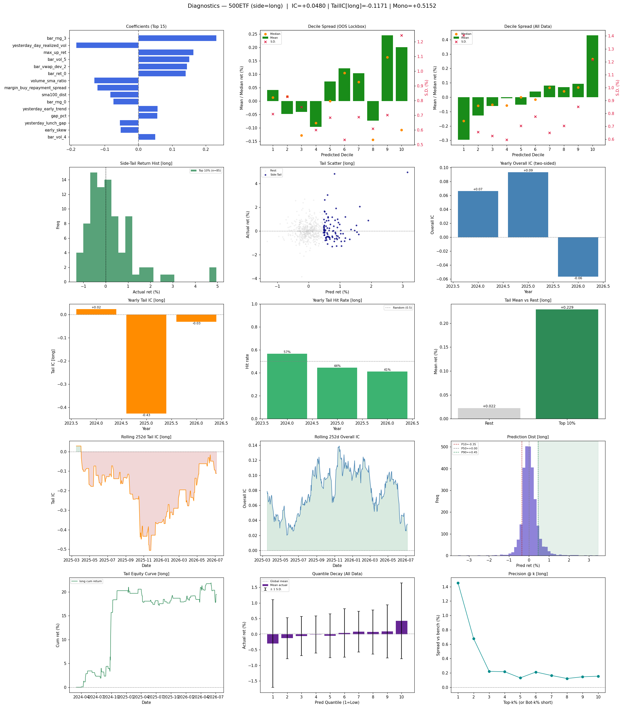

### 500ETF_short_early (500ETF, side=`short`)
- **Selected features**: 20
- **Active features**: 20
- **Active**: `yesterday_day_realized_vol`, `bar_rng_0`, `bar_rng_3`, `margin_short_ratio`, `volume_sma_ratio`, `bar_vol_4`, `bar_vol_5`, `yesterday_lunch_gap`, `yesterday_gap`, `bar_ret_0`, `max_up_ret`, `yesterday_early_trend`, `bar_vwap_dev_2`, `early_skew`, `sma100_dist`, `margin_buy_repayment_spread`, `gap_pct`, `cvd_divergence_day`, `short_sell_cover_spread`, `yesterday_day_kurtosis`
- **Stopped by Step 1 (FDR Screening)** (0 features):
  None
- **Stopped by Step 2 (Stability & VIF Pruning)** (194 features):
  

  
Show 194 features

  
  `first_30min_return`, `early_realized_vol`, `early_range`, `early_trend`, `early_momentum`, `first_bar_return`, `first_bar_volume`, `early_vwap_dev`, `early_kurtosis`, `bar_ret_1`, `bar_ret_2`, `bar_vol_0`, `bar_rng_2`, `bar_rng_5`, `bar_body_rng_0`, `bar_body_rng_1`, `bar_body_rng_2`, `bar_vwap_dev_0`, `bar_vwap_dev_1`, `bar_vwap_dev_3`, `bar_vwap_dev_5`, `num_up_bars`, `max_down_ret`, `cl_pos_in_range`, `body_to_range_ratio`, `total_path_length`, `volume_slope`, `spike_exhaustion_ratio`, `first_bar_sentiment`, `or_fill_ratio`, `close_vs_open_range`, `inside_bar_failure_bull`, `consecutive_higher_highs`, `early_bearish_engulfing_count`, `volume_surge_max`, `volume_concentration`, `volume_trend_intraday`, `volume_acceleration`, `volume_surge_direction`, `pullback_ratio`, `rally_ratio`, `range_expansion_ratio`, `pullback_depth_ratio`, `pullback_depth_max`, `rally_strength_max`, `vwap_slope_intraday`, `volume_weighted_price_position`, `net_volume_flow`, `early_body_momentum`, `late_bar_momentum`, `trend_strength_intraday`, `high_low_sequence_momentum`, `intraday_slope`, `intraday_autocorr`, `opening_momentum_score`, `opening_direction_stability`, `early_trend_hhi`, `session_high_proximity`, `session_low_proximity`, `close_above_open_count`, `open_to_current_return`, `upper_wick_dominance`, `rsi_opening`, `stoch_opening`, `momentum_strength_intraday`, `opening_auction_imbalance`, `intraday_close_position`, `limit_down_proximity_early`, `morning_trend_extrapolated`, `demark_setup_reversal_early`, `failed_breakout_reversal_early`, `early_wavetrend_cross`, `atr_expansion_flag_early`, `volatility_breakout_squeeze`, `early_bid_ask_spread_proxy`, `early_vwap_acceleration`, `early_order_flow_imbalance`, `rbreaker_sell_setup_proximity_early`, `rbreaker_buy_setup_proximity_early`, `skypark_gap_reversal_early`, `turtle_breakout_strength_early`, `macd_hist`, `sma20_dist`, `sma50_dist`, `atr14_norm`, `roc10`, `vol20`, `sma10_dist`, `sma200_dist`, `ema12_dist`, `rsi5`, `rsi21`, `roc5`, `roc20`, `roc60`, `cci14`, `willr14`, `stoch_k`, `stoch_d`, `mfi14`, `aroon_osc`, `vol5`, `vol10`, `vol60`, `vol_ratio_5_20`, `vol_ratio_10_60`, `bb_width`, `vol_pk20`, `vol_gk10`, `vol_gk20`, `margin_balance`, `buy_on_margin_value`, `margin_repayment`, `short_balance`, `short_balance_quantity`, `short_sell_quantity`, `short_repayment_quantity`, `total_balance`, `margin_net_buy`, `capital_buy_volume`, `capital_buy_value`, `capital_sell_volume`, `capital_sell_value`, `capital_net_value`, `capital_net_ratio`, `northbound_buy`, `northbound_sell`, `northbound_net`, `iv`, `iv_vol_ratio`, `vix`, `vix_vol_ratio`, `vix_iv_spread`, `vix_iv_ratio`, `iv_diff_1d`, `vix_diff_1d`, `tech_value_rotation`, `yesterday_limit_up_touch`, `limit_up_proximity_day`, `limit_down_proximity_day`, `growth_momentum_ratio`, `high_beta_vol_ratio`, `vix_skew_proxy`, `vix_rolling_percentile_60d`, `iv_corridor_width`, `yesterday_vix_early_drift`, `vix_realized_spread`, `option_oi_growth`, `iv_envelope_deviation`, `margin_lever_ratio`, `capital_net_accel`, `northbound_volume_share`, `yesterday_northbound_net_ratio`, `margin_extreme_rank_252d`, `capital_large_order_ratio`, `consecutive_inside_bars_3d`, `outside_bar_reversal_day`, `wavetrend_osc_day`, `keltner_squeeze_width`, `yesterday_wavetrend_osc`, `yesterday_stoch_rsi_cross`, `yesterday_illiquidity_amihud`, `coppock_curve_day`, `yesterday_range_ratio`, `yesterday_body_ratio`, `yesterday_volume_ratio`, `yesterday_return`, `yesterday_close_position`, `sma_distance_5d`, `sma_distance_60d`, `volatility_percentile_20d`, `volume_percentile_20d`, `yearly_high_distance`, `yearly_low_distance`, `twenty_gap_bars_regime`, `measured_move_proximity`, `yesterday_pm_return`, `yesterday_am_return`, `yesterday_gap_pct`, `yesterday_first_30min_return`, `yesterday_early_realized_vol`, `yesterday_early_range`, `yesterday_early_momentum`, `yesterday_first_bar_volume`, `yesterday_early_vwap_dev`, `yesterday_day_range`, `yesterday_day_close_pos`, `yesterday_day_pm_am_vol_ratio`, `yesterday_day_vwap_dev`, `yesterday_day_skew`, `yesterday_afternoon_reversal`, `yesterday_pm_am_vol_ratio`, `yesterday_afternoon_momentum`, `yesterday_cvd_close`
  

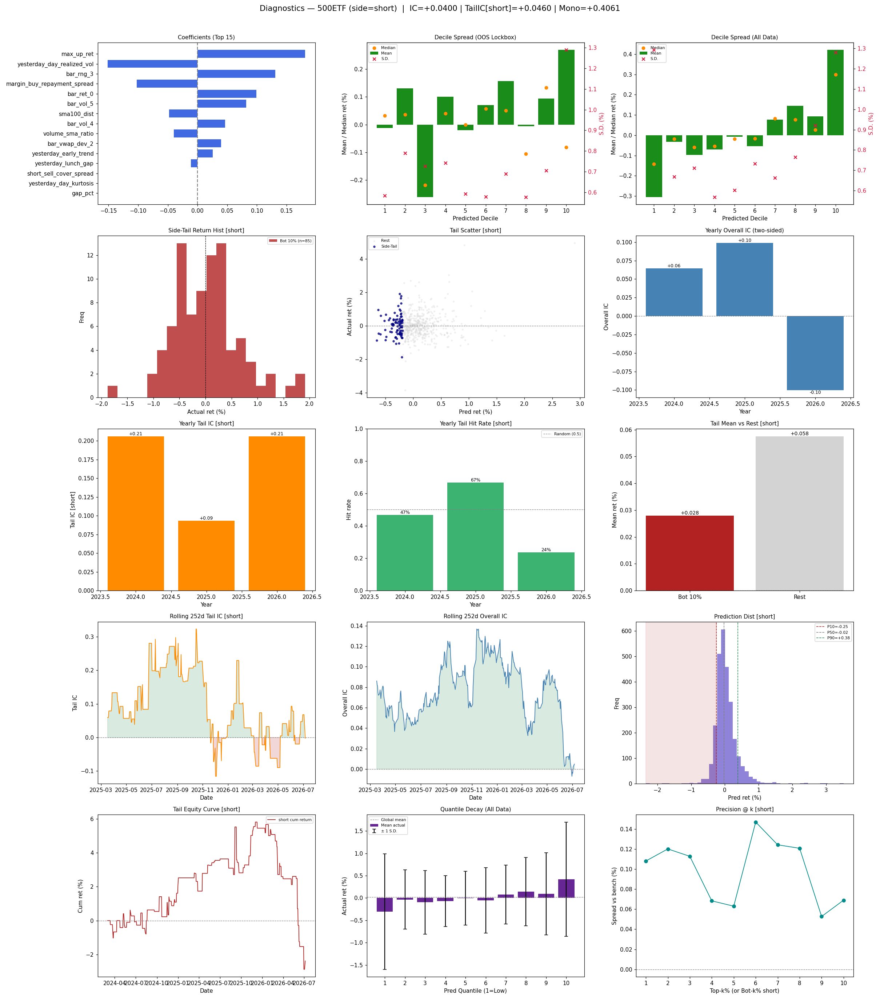

### 588000ETF_early (588000ETF, side=`single`)
- **Selected features**: 6
- **Active features**: 4
- **Active**: `vol60`, `first_bar_return`, `vol5`, `bar_vol_5`
- **Stopped by Step 1 (FDR Screening)** (0 features):
  None
- **Stopped by Step 2 (Stability & VIF Pruning)** (208 features):
  

  
Show 208 features

  
  `gap_pct`, `first_30min_return`, `early_realized_vol`, `early_range`, `early_trend`, `early_momentum`, `first_bar_volume`, `early_vwap_dev`, `early_skew`, `early_kurtosis`, `bar_ret_0`, `bar_ret_1`, `bar_ret_2`, `bar_vol_0`, `bar_vol_4`, `bar_rng_0`, `bar_rng_2`, `bar_rng_3`, `bar_rng_5`, `bar_body_rng_0`, `bar_body_rng_1`, `bar_body_rng_2`, `bar_vwap_dev_0`, `bar_vwap_dev_1`, `bar_vwap_dev_2`, `bar_vwap_dev_3`, `bar_vwap_dev_5`, `num_up_bars`, `max_up_ret`, `max_down_ret`, `cl_pos_in_range`, `body_to_range_ratio`, `total_path_length`, `volume_slope`, `spike_exhaustion_ratio`, `first_bar_sentiment`, `or_fill_ratio`, `close_vs_open_range`, `inside_bar_failure_bull`, `consecutive_higher_highs`, `early_bearish_engulfing_count`, `volume_surge_max`, `volume_concentration`, `volume_trend_intraday`, `volume_acceleration`, `volume_surge_direction`, `pullback_ratio`, `rally_ratio`, `range_expansion_ratio`, `pullback_depth_ratio`, `pullback_depth_max`, `rally_strength_max`, `vwap_slope_intraday`, `volume_weighted_price_position`, `net_volume_flow`, `early_body_momentum`, `late_bar_momentum`, `trend_strength_intraday`, `high_low_sequence_momentum`, `intraday_slope`, `intraday_autocorr`, `opening_momentum_score`, `opening_direction_stability`, `early_trend_hhi`, `session_high_proximity`, `session_low_proximity`, `close_above_open_count`, `open_to_current_return`, `upper_wick_dominance`, `rsi_opening`, `stoch_opening`, `momentum_strength_intraday`, `opening_auction_imbalance`, `intraday_close_position`, `limit_down_proximity_early`, `morning_trend_extrapolated`, `demark_setup_reversal_early`, `failed_breakout_reversal_early`, `early_wavetrend_cross`, `atr_expansion_flag_early`, `volatility_breakout_squeeze`, `early_bid_ask_spread_proxy`, `early_vwap_acceleration`, `early_order_flow_imbalance`, `rbreaker_sell_setup_proximity_early`, `rbreaker_buy_setup_proximity_early`, `skypark_gap_reversal_early`, `turtle_breakout_strength_early`, `macd_hist`, `sma20_dist`, `sma50_dist`, `atr14_norm`, `roc10`, `vol20`, `sma10_dist`, `sma100_dist`, `sma200_dist`, `ema12_dist`, `rsi5`, `rsi21`, `roc5`, `roc20`, `roc60`, `cci14`, `willr14`, `stoch_k`, `stoch_d`, `mfi14`, `aroon_osc`, `vol10`, `vol_ratio_5_20`, `vol_ratio_10_60`, `bb_width`, `vol_pk20`, `vol_gk10`, `vol_gk20`, `volume_sma_ratio`, `margin_balance`, `buy_on_margin_value`, `margin_repayment`, `short_balance`, `short_balance_quantity`, `short_sell_quantity`, `short_repayment_quantity`, `total_balance`, `margin_net_buy`, `margin_short_ratio`, `capital_buy_volume`, `capital_buy_value`, `capital_sell_volume`, `capital_sell_value`, `capital_net_value`, `capital_net_ratio`, `northbound_buy`, `northbound_sell`, `northbound_net`, `iv`, `iv_vol_ratio`, `vix`, `vix_vol_ratio`, `vix_iv_spread`, `vix_iv_ratio`, `iv_diff_1d`, `vix_diff_1d`, `tech_value_rotation`, `yesterday_limit_up_touch`, `limit_up_proximity_day`, `limit_down_proximity_day`, `growth_momentum_ratio`, `high_beta_vol_ratio`, `vix_skew_proxy`, `vix_rolling_percentile_60d`, `iv_corridor_width`, `yesterday_vix_early_drift`, `vix_realized_spread`, `option_oi_growth`, `iv_envelope_deviation`, `margin_lever_ratio`, `capital_net_accel`, `northbound_volume_share`, `yesterday_northbound_net_ratio`, `margin_buy_repayment_spread`, `short_sell_cover_spread`, `margin_extreme_rank_252d`, `capital_large_order_ratio`, `outside_bar_reversal_day`, `wavetrend_osc_day`, `keltner_squeeze_width`, `yesterday_wavetrend_osc`, `yesterday_stoch_rsi_cross`, `cvd_divergence_day`, `yesterday_illiquidity_amihud`, `coppock_curve_day`, `yesterday_range_ratio`, `yesterday_body_ratio`, `yesterday_volume_ratio`, `yesterday_return`, `yesterday_gap`, `yesterday_close_position`, `sma_distance_5d`, `sma_distance_60d`, `volatility_percentile_20d`, `volume_percentile_20d`, `yearly_high_distance`, `yearly_low_distance`, `twenty_gap_bars_regime`, `measured_move_proximity`, `yesterday_pm_return`, `yesterday_am_return`, `yesterday_gap_pct`, `yesterday_first_30min_return`, `yesterday_early_realized_vol`, `yesterday_early_range`, `yesterday_early_trend`, `yesterday_early_momentum`, `yesterday_first_bar_volume`, `yesterday_early_vwap_dev`, `yesterday_day_range`, `yesterday_day_realized_vol`, `yesterday_day_close_pos`, `yesterday_day_pm_am_vol_ratio`, `yesterday_day_vwap_dev`, `yesterday_day_skew`, `yesterday_afternoon_reversal`, `yesterday_lunch_gap`, `yesterday_pm_am_vol_ratio`, `yesterday_afternoon_momentum`, `yesterday_cvd_close`
  

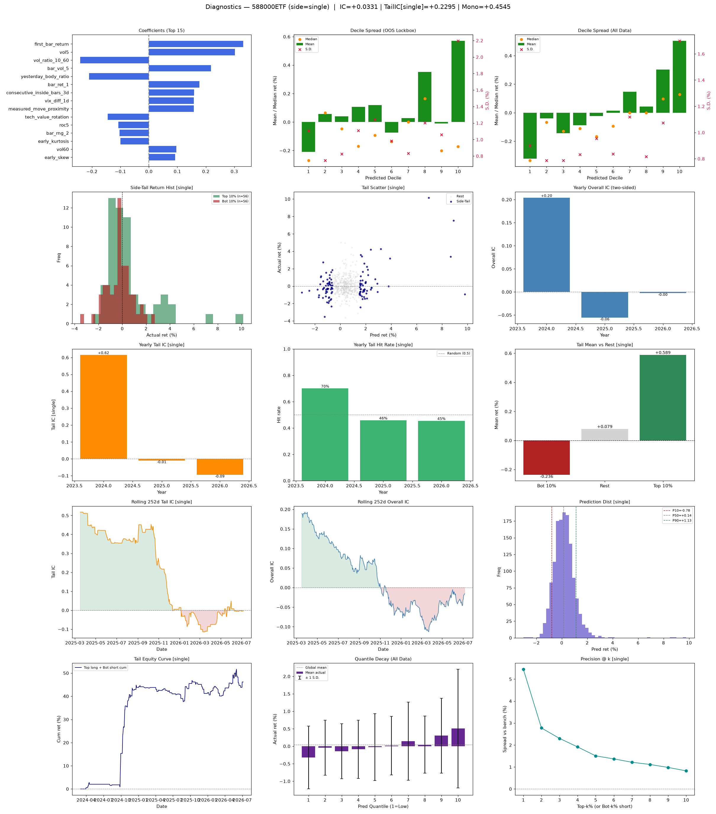

### 588000ETF_long_early (588000ETF, side=`long`)
- **Selected features**: 24
- **Active features**: 23
- **Active**: `bar_rng_3`, `bar_rng_2`, `vol60`, `first_bar_return`, `early_skew`, `bar_ret_1`, `vol5`, `vol_ratio_5_20`, `vol_ratio_10_60`, `yesterday_day_kurtosis`, `tech_value_rotation`, `consecutive_inside_bars_3d`, `yesterday_afternoon_momentum`, `short_sell_cover_spread`, `yesterday_illiquidity_amihud`, `yesterday_body_ratio`, `margin_extreme_rank_252d`, `sma100_dist`, `bar_vol_5`, `vix_diff_1d`, `capital_net_accel`, `roc5`, `measured_move_proximity`
- **Stopped by Step 1 (FDR Screening)** (0 features):
  None
- **Stopped by Step 2 (Stability & VIF Pruning)** (190 features):
  

  
Show 190 features

  
  `gap_pct`, `first_30min_return`, `early_realized_vol`, `early_range`, `early_trend`, `early_momentum`, `first_bar_volume`, `early_vwap_dev`, `early_kurtosis`, `bar_ret_0`, `bar_ret_2`, `bar_vol_0`, `bar_vol_4`, `bar_rng_0`, `bar_rng_5`, `bar_body_rng_0`, `bar_body_rng_1`, `bar_body_rng_2`, `bar_vwap_dev_0`, `bar_vwap_dev_1`, `bar_vwap_dev_2`, `bar_vwap_dev_3`, `bar_vwap_dev_5`, `num_up_bars`, `max_up_ret`, `max_down_ret`, `cl_pos_in_range`, `body_to_range_ratio`, `total_path_length`, `volume_slope`, `spike_exhaustion_ratio`, `first_bar_sentiment`, `or_fill_ratio`, `close_vs_open_range`, `inside_bar_failure_bull`, `consecutive_higher_highs`, `early_bearish_engulfing_count`, `volume_surge_max`, `volume_concentration`, `volume_trend_intraday`, `volume_acceleration`, `volume_surge_direction`, `pullback_ratio`, `rally_ratio`, `range_expansion_ratio`, `pullback_depth_ratio`, `pullback_depth_max`, `rally_strength_max`, `vwap_slope_intraday`, `volume_weighted_price_position`, `net_volume_flow`, `early_body_momentum`, `late_bar_momentum`, `trend_strength_intraday`, `high_low_sequence_momentum`, `intraday_slope`, `intraday_autocorr`, `opening_momentum_score`, `opening_direction_stability`, `early_trend_hhi`, `session_high_proximity`, `session_low_proximity`, `close_above_open_count`, `open_to_current_return`, `upper_wick_dominance`, `rsi_opening`, `stoch_opening`, `momentum_strength_intraday`, `opening_auction_imbalance`, `intraday_close_position`, `limit_down_proximity_early`, `morning_trend_extrapolated`, `demark_setup_reversal_early`, `failed_breakout_reversal_early`, `early_wavetrend_cross`, `atr_expansion_flag_early`, `volatility_breakout_squeeze`, `early_bid_ask_spread_proxy`, `early_vwap_acceleration`, `early_order_flow_imbalance`, `rbreaker_sell_setup_proximity_early`, `rbreaker_buy_setup_proximity_early`, `skypark_gap_reversal_early`, `turtle_breakout_strength_early`, `macd_hist`, `sma20_dist`, `sma50_dist`, `atr14_norm`, `roc10`, `vol20`, `sma10_dist`, `sma200_dist`, `ema12_dist`, `rsi5`, `rsi21`, `roc20`, `roc60`, `cci14`, `willr14`, `stoch_k`, `stoch_d`, `mfi14`, `aroon_osc`, `vol10`, `bb_width`, `vol_pk20`, `vol_gk10`, `vol_gk20`, `volume_sma_ratio`, `margin_balance`, `buy_on_margin_value`, `margin_repayment`, `short_balance`, `short_balance_quantity`, `short_sell_quantity`, `short_repayment_quantity`, `total_balance`, `margin_net_buy`, `margin_short_ratio`, `capital_buy_volume`, `capital_buy_value`, `capital_sell_volume`, `capital_sell_value`, `capital_net_value`, `capital_net_ratio`, `northbound_buy`, `northbound_sell`, `northbound_net`, `iv`, `iv_vol_ratio`, `vix`, `vix_vol_ratio`, `vix_iv_spread`, `vix_iv_ratio`, `iv_diff_1d`, `yesterday_limit_up_touch`, `limit_up_proximity_day`, `limit_down_proximity_day`, `growth_momentum_ratio`, `high_beta_vol_ratio`, `vix_skew_proxy`, `vix_rolling_percentile_60d`, `iv_corridor_width`, `yesterday_vix_early_drift`, `vix_realized_spread`, `option_oi_growth`, `iv_envelope_deviation`, `margin_lever_ratio`, `northbound_volume_share`, `yesterday_northbound_net_ratio`, `margin_buy_repayment_spread`, `capital_large_order_ratio`, `outside_bar_reversal_day`, `wavetrend_osc_day`, `keltner_squeeze_width`, `yesterday_wavetrend_osc`, `yesterday_stoch_rsi_cross`, `cvd_divergence_day`, `coppock_curve_day`, `yesterday_range_ratio`, `yesterday_volume_ratio`, `yesterday_return`, `yesterday_gap`, `yesterday_close_position`, `sma_distance_5d`, `sma_distance_60d`, `volatility_percentile_20d`, `volume_percentile_20d`, `yearly_high_distance`, `yearly_low_distance`, `twenty_gap_bars_regime`, `yesterday_pm_return`, `yesterday_am_return`, `yesterday_gap_pct`, `yesterday_first_30min_return`, `yesterday_early_realized_vol`, `yesterday_early_range`, `yesterday_early_trend`, `yesterday_early_momentum`, `yesterday_first_bar_volume`, `yesterday_early_vwap_dev`, `yesterday_day_range`, `yesterday_day_realized_vol`, `yesterday_day_close_pos`, `yesterday_day_vwap_dev`, `yesterday_day_skew`, `yesterday_afternoon_reversal`, `yesterday_lunch_gap`, `yesterday_pm_am_vol_ratio`, `yesterday_cvd_close`
  

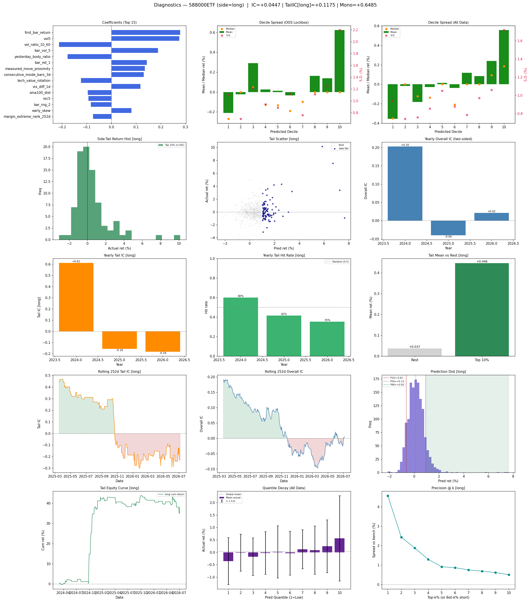

### 588000ETF_short_early (588000ETF, side=`short`)
- **Selected features**: 8
- **Active features**: 5
- **Active**: `vol60`, `first_bar_return`, `yesterday_body_ratio`, `sma100_dist`, `bar_vol_5`
- **Stopped by Step 1 (FDR Screening)** (0 features):
  None
- **Stopped by Step 2 (Stability & VIF Pruning)** (206 features):
  

  
Show 206 features

  
  `gap_pct`, `first_30min_return`, `early_realized_vol`, `early_range`, `early_trend`, `early_momentum`, `first_bar_volume`, `early_vwap_dev`, `early_kurtosis`, `bar_ret_0`, `bar_ret_1`, `bar_ret_2`, `bar_vol_0`, `bar_vol_4`, `bar_rng_0`, `bar_rng_2`, `bar_rng_3`, `bar_rng_5`, `bar_body_rng_0`, `bar_body_rng_1`, `bar_body_rng_2`, `bar_vwap_dev_0`, `bar_vwap_dev_1`, `bar_vwap_dev_2`, `bar_vwap_dev_3`, `bar_vwap_dev_5`, `num_up_bars`, `max_up_ret`, `max_down_ret`, `cl_pos_in_range`, `body_to_range_ratio`, `total_path_length`, `volume_slope`, `spike_exhaustion_ratio`, `first_bar_sentiment`, `or_fill_ratio`, `close_vs_open_range`, `inside_bar_failure_bull`, `consecutive_higher_highs`, `early_bearish_engulfing_count`, `volume_surge_max`, `volume_concentration`, `volume_trend_intraday`, `volume_acceleration`, `volume_surge_direction`, `pullback_ratio`, `rally_ratio`, `range_expansion_ratio`, `pullback_depth_ratio`, `pullback_depth_max`, `rally_strength_max`, `vwap_slope_intraday`, `volume_weighted_price_position`, `net_volume_flow`, `early_body_momentum`, `late_bar_momentum`, `trend_strength_intraday`, `high_low_sequence_momentum`, `intraday_slope`, `intraday_autocorr`, `opening_momentum_score`, `opening_direction_stability`, `early_trend_hhi`, `session_high_proximity`, `session_low_proximity`, `close_above_open_count`, `open_to_current_return`, `upper_wick_dominance`, `rsi_opening`, `stoch_opening`, `momentum_strength_intraday`, `opening_auction_imbalance`, `intraday_close_position`, `limit_down_proximity_early`, `morning_trend_extrapolated`, `demark_setup_reversal_early`, `failed_breakout_reversal_early`, `early_wavetrend_cross`, `atr_expansion_flag_early`, `volatility_breakout_squeeze`, `early_bid_ask_spread_proxy`, `early_vwap_acceleration`, `early_order_flow_imbalance`, `rbreaker_sell_setup_proximity_early`, `rbreaker_buy_setup_proximity_early`, `skypark_gap_reversal_early`, `turtle_breakout_strength_early`, `macd_hist`, `sma20_dist`, `sma50_dist`, `atr14_norm`, `roc10`, `vol20`, `sma10_dist`, `sma200_dist`, `ema12_dist`, `rsi5`, `rsi21`, `roc5`, `roc20`, `roc60`, `cci14`, `willr14`, `stoch_k`, `stoch_d`, `mfi14`, `aroon_osc`, `vol5`, `vol10`, `vol_ratio_5_20`, `vol_ratio_10_60`, `bb_width`, `vol_pk20`, `vol_gk10`, `vol_gk20`, `volume_sma_ratio`, `margin_balance`, `buy_on_margin_value`, `margin_repayment`, `short_balance`, `short_balance_quantity`, `short_sell_quantity`, `short_repayment_quantity`, `total_balance`, `margin_net_buy`, `margin_short_ratio`, `capital_buy_volume`, `capital_buy_value`, `capital_sell_volume`, `capital_sell_value`, `capital_net_value`, `capital_net_ratio`, `northbound_buy`, `northbound_sell`, `northbound_net`, `iv`, `iv_vol_ratio`, `vix`, `vix_vol_ratio`, `vix_iv_spread`, `vix_iv_ratio`, `iv_diff_1d`, `vix_diff_1d`, `tech_value_rotation`, `yesterday_limit_up_touch`, `limit_up_proximity_day`, `limit_down_proximity_day`, `growth_momentum_ratio`, `high_beta_vol_ratio`, `vix_skew_proxy`, `vix_rolling_percentile_60d`, `iv_corridor_width`, `yesterday_vix_early_drift`, `vix_realized_spread`, `option_oi_growth`, `iv_envelope_deviation`, `margin_lever_ratio`, `capital_net_accel`, `northbound_volume_share`, `yesterday_northbound_net_ratio`, `margin_buy_repayment_spread`, `short_sell_cover_spread`, `margin_extreme_rank_252d`, `capital_large_order_ratio`, `outside_bar_reversal_day`, `wavetrend_osc_day`, `keltner_squeeze_width`, `yesterday_wavetrend_osc`, `yesterday_stoch_rsi_cross`, `cvd_divergence_day`, `yesterday_illiquidity_amihud`, `coppock_curve_day`, `yesterday_range_ratio`, `yesterday_volume_ratio`, `yesterday_return`, `yesterday_gap`, `yesterday_close_position`, `sma_distance_5d`, `sma_distance_60d`, `volatility_percentile_20d`, `volume_percentile_20d`, `yearly_high_distance`, `yearly_low_distance`, `twenty_gap_bars_regime`, `measured_move_proximity`, `yesterday_pm_return`, `yesterday_am_return`, `yesterday_gap_pct`, `yesterday_first_30min_return`, `yesterday_early_realized_vol`, `yesterday_early_range`, `yesterday_early_trend`, `yesterday_early_momentum`, `yesterday_first_bar_volume`, `yesterday_early_vwap_dev`, `yesterday_day_range`, `yesterday_day_realized_vol`, `yesterday_day_close_pos`, `yesterday_day_pm_am_vol_ratio`, `yesterday_day_vwap_dev`, `yesterday_day_skew`, `yesterday_afternoon_reversal`, `yesterday_lunch_gap`, `yesterday_pm_am_vol_ratio`, `yesterday_afternoon_momentum`, `yesterday_cvd_close`
  

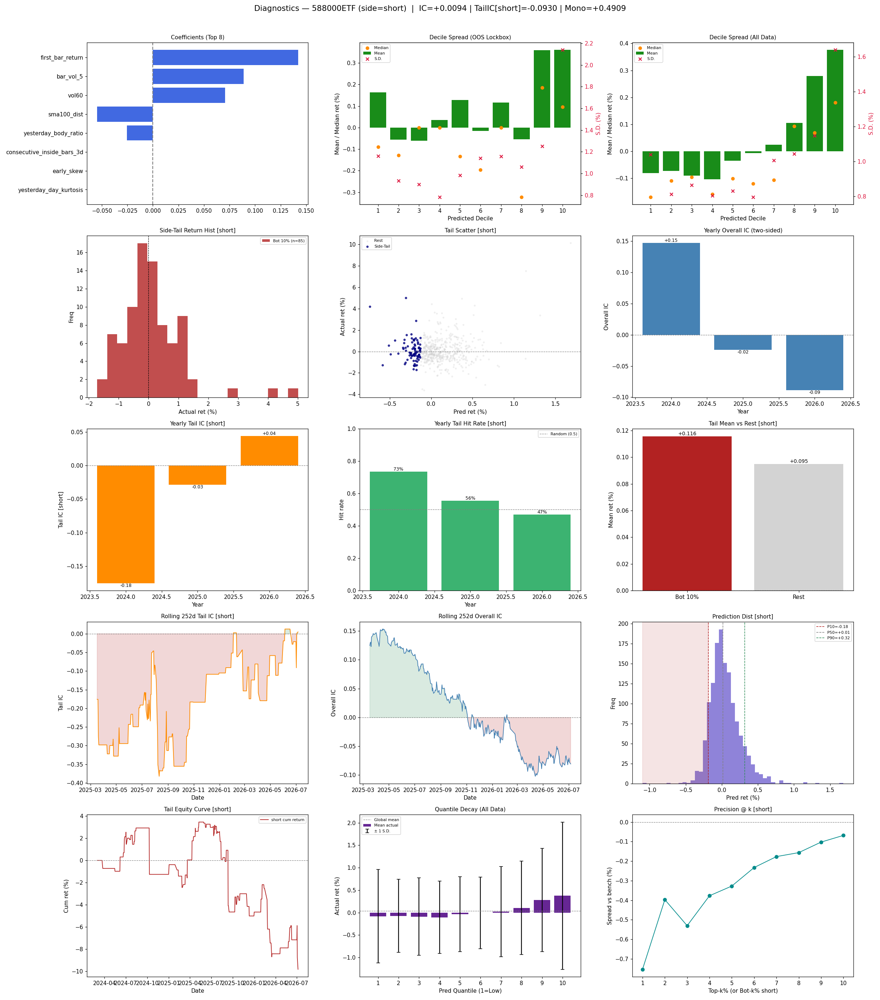

### 159915ETF_early (159915ETF, side=`single`)
- **Selected features**: 21
- **Active features**: 21
- **Active**: `yesterday_early_momentum`, `northbound_net`, `margin_extreme_rank_252d`, `yesterday_early_realized_vol`, `yesterday_day_range`, `bar_rng_3`, `bar_ret_0`, `num_up_bars`, `margin_buy_repayment_spread`, `capital_net_ratio`, `yesterday_lunch_gap`, `bar_vol_4`, `bar_vol_5`, `volume_sma_ratio`, `tech_value_rotation`, `macd_hist`, `sma_distance_5d`, `yesterday_illiquidity_amihud`, `early_kurtosis`, `sma100_dist`, `gap_pct`
- **Stopped by Step 1 (FDR Screening)** (0 features):
  None
- **Stopped by Step 2 (Stability & VIF Pruning)** (193 features):
  

  
Show 193 features

  
  `first_30min_return`, `early_realized_vol`, `early_range`, `early_trend`, `early_momentum`, `first_bar_return`, `first_bar_volume`, `early_vwap_dev`, `early_skew`, `bar_ret_1`, `bar_ret_2`, `bar_vol_0`, `bar_rng_0`, `bar_rng_2`, `bar_rng_5`, `bar_body_rng_0`, `bar_body_rng_1`, `bar_body_rng_2`, `bar_vwap_dev_0`, `bar_vwap_dev_1`, `bar_vwap_dev_2`, `bar_vwap_dev_3`, `bar_vwap_dev_5`, `max_up_ret`, `max_down_ret`, `cl_pos_in_range`, `body_to_range_ratio`, `total_path_length`, `volume_slope`, `spike_exhaustion_ratio`, `first_bar_sentiment`, `or_fill_ratio`, `close_vs_open_range`, `inside_bar_failure_bull`, `consecutive_higher_highs`, `early_bearish_engulfing_count`, `volume_surge_max`, `volume_concentration`, `volume_trend_intraday`, `volume_acceleration`, `volume_surge_direction`, `pullback_ratio`, `rally_ratio`, `range_expansion_ratio`, `pullback_depth_ratio`, `pullback_depth_max`, `rally_strength_max`, `vwap_slope_intraday`, `volume_weighted_price_position`, `net_volume_flow`, `early_body_momentum`, `late_bar_momentum`, `trend_strength_intraday`, `high_low_sequence_momentum`, `intraday_slope`, `intraday_autocorr`, `opening_momentum_score`, `opening_direction_stability`, `early_trend_hhi`, `session_high_proximity`, `session_low_proximity`, `close_above_open_count`, `open_to_current_return`, `upper_wick_dominance`, `rsi_opening`, `stoch_opening`, `momentum_strength_intraday`, `opening_auction_imbalance`, `intraday_close_position`, `limit_down_proximity_early`, `morning_trend_extrapolated`, `demark_setup_reversal_early`, `failed_breakout_reversal_early`, `early_wavetrend_cross`, `atr_expansion_flag_early`, `volatility_breakout_squeeze`, `early_bid_ask_spread_proxy`, `early_vwap_acceleration`, `early_order_flow_imbalance`, `rbreaker_sell_setup_proximity_early`, `rbreaker_buy_setup_proximity_early`, `skypark_gap_reversal_early`, `turtle_breakout_strength_early`, `sma20_dist`, `sma50_dist`, `atr14_norm`, `roc10`, `vol20`, `sma10_dist`, `sma200_dist`, `ema12_dist`, `rsi5`, `rsi21`, `roc5`, `roc20`, `roc60`, `cci14`, `willr14`, `stoch_k`, `stoch_d`, `mfi14`, `aroon_osc`, `vol5`, `vol10`, `vol60`, `vol_ratio_5_20`, `vol_ratio_10_60`, `bb_width`, `vol_pk20`, `vol_gk10`, `vol_gk20`, `margin_balance`, `buy_on_margin_value`, `margin_repayment`, `short_balance`, `short_balance_quantity`, `short_sell_quantity`, `short_repayment_quantity`, `total_balance`, `margin_net_buy`, `margin_short_ratio`, `capital_buy_volume`, `capital_buy_value`, `capital_sell_volume`, `capital_sell_value`, `capital_net_value`, `northbound_buy`, `northbound_sell`, `iv`, `iv_vol_ratio`, `vix`, `vix_vol_ratio`, `vix_iv_spread`, `vix_iv_ratio`, `iv_diff_1d`, `vix_diff_1d`, `yesterday_limit_up_touch`, `limit_up_proximity_day`, `limit_down_proximity_day`, `growth_momentum_ratio`, `high_beta_vol_ratio`, `vix_skew_proxy`, `vix_rolling_percentile_60d`, `iv_corridor_width`, `yesterday_vix_early_drift`, `vix_realized_spread`, `option_oi_growth`, `iv_envelope_deviation`, `margin_lever_ratio`, `capital_net_accel`, `northbound_volume_share`, `yesterday_northbound_net_ratio`, `short_sell_cover_spread`, `capital_large_order_ratio`, `consecutive_inside_bars_3d`, `outside_bar_reversal_day`, `wavetrend_osc_day`, `keltner_squeeze_width`, `yesterday_wavetrend_osc`, `yesterday_stoch_rsi_cross`, `cvd_divergence_day`, `coppock_curve_day`, `yesterday_range_ratio`, `yesterday_body_ratio`, `yesterday_volume_ratio`, `yesterday_return`, `yesterday_gap`, `yesterday_close_position`, `sma_distance_60d`, `volatility_percentile_20d`, `volume_percentile_20d`, `yearly_high_distance`, `yearly_low_distance`, `twenty_gap_bars_regime`, `measured_move_proximity`, `yesterday_pm_return`, `yesterday_am_return`, `yesterday_gap_pct`, `yesterday_first_30min_return`, `yesterday_early_range`, `yesterday_early_trend`, `yesterday_first_bar_volume`, `yesterday_early_vwap_dev`, `yesterday_day_realized_vol`, `yesterday_day_close_pos`, `yesterday_day_pm_am_vol_ratio`, `yesterday_day_vwap_dev`, `yesterday_day_skew`, `yesterday_day_kurtosis`, `yesterday_afternoon_reversal`, `yesterday_pm_am_vol_ratio`, `yesterday_afternoon_momentum`, `yesterday_cvd_close`
  

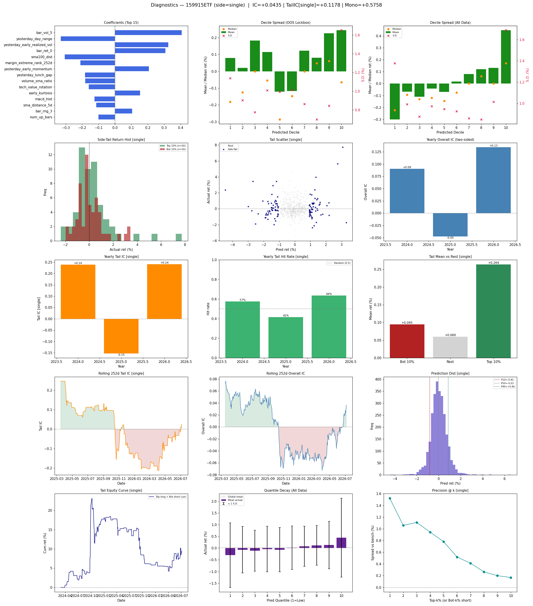

### 159915ETF_long_early (159915ETF, side=`long`)
- **Selected features**: 21
- **Active features**: 21
- **Active**: `yesterday_early_momentum`, `northbound_net`, `margin_extreme_rank_252d`, `yesterday_early_realized_vol`, `yesterday_day_range`, `bar_rng_3`, `bar_ret_0`, `num_up_bars`, `margin_buy_repayment_spread`, `capital_net_ratio`, `yesterday_lunch_gap`, `bar_vol_4`, `bar_vol_5`, `volume_sma_ratio`, `tech_value_rotation`, `macd_hist`, `sma_distance_5d`, `yesterday_illiquidity_amihud`, `early_kurtosis`, `sma100_dist`, `gap_pct`
- **Stopped by Step 1 (FDR Screening)** (0 features):
  None
- **Stopped by Step 2 (Stability & VIF Pruning)** (193 features):
  

  
Show 193 features

  
  `first_30min_return`, `early_realized_vol`, `early_range`, `early_trend`, `early_momentum`, `first_bar_return`, `first_bar_volume`, `early_vwap_dev`, `early_skew`, `bar_ret_1`, `bar_ret_2`, `bar_vol_0`, `bar_rng_0`, `bar_rng_2`, `bar_rng_5`, `bar_body_rng_0`, `bar_body_rng_1`, `bar_body_rng_2`, `bar_vwap_dev_0`, `bar_vwap_dev_1`, `bar_vwap_dev_2`, `bar_vwap_dev_3`, `bar_vwap_dev_5`, `max_up_ret`, `max_down_ret`, `cl_pos_in_range`, `body_to_range_ratio`, `total_path_length`, `volume_slope`, `spike_exhaustion_ratio`, `first_bar_sentiment`, `or_fill_ratio`, `close_vs_open_range`, `inside_bar_failure_bull`, `consecutive_higher_highs`, `early_bearish_engulfing_count`, `volume_surge_max`, `volume_concentration`, `volume_trend_intraday`, `volume_acceleration`, `volume_surge_direction`, `pullback_ratio`, `rally_ratio`, `range_expansion_ratio`, `pullback_depth_ratio`, `pullback_depth_max`, `rally_strength_max`, `vwap_slope_intraday`, `volume_weighted_price_position`, `net_volume_flow`, `early_body_momentum`, `late_bar_momentum`, `trend_strength_intraday`, `high_low_sequence_momentum`, `intraday_slope`, `intraday_autocorr`, `opening_momentum_score`, `opening_direction_stability`, `early_trend_hhi`, `session_high_proximity`, `session_low_proximity`, `close_above_open_count`, `open_to_current_return`, `upper_wick_dominance`, `rsi_opening`, `stoch_opening`, `momentum_strength_intraday`, `opening_auction_imbalance`, `intraday_close_position`, `limit_down_proximity_early`, `morning_trend_extrapolated`, `demark_setup_reversal_early`, `failed_breakout_reversal_early`, `early_wavetrend_cross`, `atr_expansion_flag_early`, `volatility_breakout_squeeze`, `early_bid_ask_spread_proxy`, `early_vwap_acceleration`, `early_order_flow_imbalance`, `rbreaker_sell_setup_proximity_early`, `rbreaker_buy_setup_proximity_early`, `skypark_gap_reversal_early`, `turtle_breakout_strength_early`, `sma20_dist`, `sma50_dist`, `atr14_norm`, `roc10`, `vol20`, `sma10_dist`, `sma200_dist`, `ema12_dist`, `rsi5`, `rsi21`, `roc5`, `roc20`, `roc60`, `cci14`, `willr14`, `stoch_k`, `stoch_d`, `mfi14`, `aroon_osc`, `vol5`, `vol10`, `vol60`, `vol_ratio_5_20`, `vol_ratio_10_60`, `bb_width`, `vol_pk20`, `vol_gk10`, `vol_gk20`, `margin_balance`, `buy_on_margin_value`, `margin_repayment`, `short_balance`, `short_balance_quantity`, `short_sell_quantity`, `short_repayment_quantity`, `total_balance`, `margin_net_buy`, `margin_short_ratio`, `capital_buy_volume`, `capital_buy_value`, `capital_sell_volume`, `capital_sell_value`, `capital_net_value`, `northbound_buy`, `northbound_sell`, `iv`, `iv_vol_ratio`, `vix`, `vix_vol_ratio`, `vix_iv_spread`, `vix_iv_ratio`, `iv_diff_1d`, `vix_diff_1d`, `yesterday_limit_up_touch`, `limit_up_proximity_day`, `limit_down_proximity_day`, `growth_momentum_ratio`, `high_beta_vol_ratio`, `vix_skew_proxy`, `vix_rolling_percentile_60d`, `iv_corridor_width`, `yesterday_vix_early_drift`, `vix_realized_spread`, `option_oi_growth`, `iv_envelope_deviation`, `margin_lever_ratio`, `capital_net_accel`, `northbound_volume_share`, `yesterday_northbound_net_ratio`, `short_sell_cover_spread`, `capital_large_order_ratio`, `consecutive_inside_bars_3d`, `outside_bar_reversal_day`, `wavetrend_osc_day`, `keltner_squeeze_width`, `yesterday_wavetrend_osc`, `yesterday_stoch_rsi_cross`, `cvd_divergence_day`, `coppock_curve_day`, `yesterday_range_ratio`, `yesterday_body_ratio`, `yesterday_volume_ratio`, `yesterday_return`, `yesterday_gap`, `yesterday_close_position`, `sma_distance_60d`, `volatility_percentile_20d`, `volume_percentile_20d`, `yearly_high_distance`, `yearly_low_distance`, `twenty_gap_bars_regime`, `measured_move_proximity`, `yesterday_pm_return`, `yesterday_am_return`, `yesterday_gap_pct`, `yesterday_first_30min_return`, `yesterday_early_range`, `yesterday_early_trend`, `yesterday_first_bar_volume`, `yesterday_early_vwap_dev`, `yesterday_day_realized_vol`, `yesterday_day_close_pos`, `yesterday_day_pm_am_vol_ratio`, `yesterday_day_vwap_dev`, `yesterday_day_skew`, `yesterday_day_kurtosis`, `yesterday_afternoon_reversal`, `yesterday_pm_am_vol_ratio`, `yesterday_afternoon_momentum`, `yesterday_cvd_close`
  

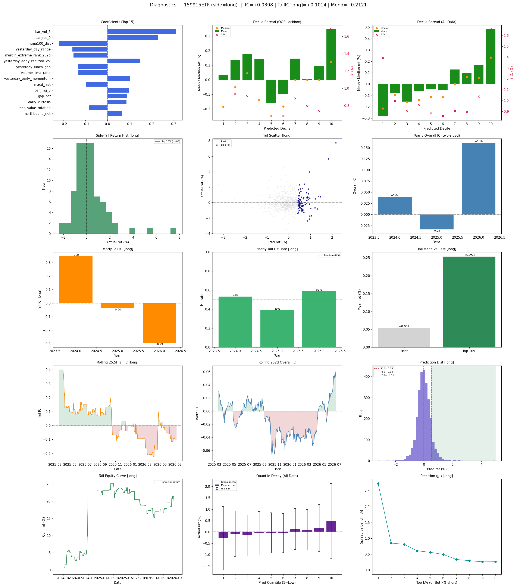

### 159915ETF_short_early (159915ETF, side=`short`)
- **Selected features**: 21
- **Active features**: 21
- **Active**: `yesterday_early_momentum`, `northbound_net`, `margin_extreme_rank_252d`, `yesterday_early_realized_vol`, `yesterday_day_range`, `bar_rng_3`, `bar_ret_0`, `num_up_bars`, `margin_buy_repayment_spread`, `capital_net_ratio`, `yesterday_lunch_gap`, `bar_vol_4`, `bar_vol_5`, `volume_sma_ratio`, `tech_value_rotation`, `macd_hist`, `sma_distance_5d`, `yesterday_illiquidity_amihud`, `early_kurtosis`, `sma100_dist`, `gap_pct`
- **Stopped by Step 1 (FDR Screening)** (0 features):
  None
- **Stopped by Step 2 (Stability & VIF Pruning)** (193 features):
  

  
Show 193 features

  
  `first_30min_return`, `early_realized_vol`, `early_range`, `early_trend`, `early_momentum`, `first_bar_return`, `first_bar_volume`, `early_vwap_dev`, `early_skew`, `bar_ret_1`, `bar_ret_2`, `bar_vol_0`, `bar_rng_0`, `bar_rng_2`, `bar_rng_5`, `bar_body_rng_0`, `bar_body_rng_1`, `bar_body_rng_2`, `bar_vwap_dev_0`, `bar_vwap_dev_1`, `bar_vwap_dev_2`, `bar_vwap_dev_3`, `bar_vwap_dev_5`, `max_up_ret`, `max_down_ret`, `cl_pos_in_range`, `body_to_range_ratio`, `total_path_length`, `volume_slope`, `spike_exhaustion_ratio`, `first_bar_sentiment`, `or_fill_ratio`, `close_vs_open_range`, `inside_bar_failure_bull`, `consecutive_higher_highs`, `early_bearish_engulfing_count`, `volume_surge_max`, `volume_concentration`, `volume_trend_intraday`, `volume_acceleration`, `volume_surge_direction`, `pullback_ratio`, `rally_ratio`, `range_expansion_ratio`, `pullback_depth_ratio`, `pullback_depth_max`, `rally_strength_max`, `vwap_slope_intraday`, `volume_weighted_price_position`, `net_volume_flow`, `early_body_momentum`, `late_bar_momentum`, `trend_strength_intraday`, `high_low_sequence_momentum`, `intraday_slope`, `intraday_autocorr`, `opening_momentum_score`, `opening_direction_stability`, `early_trend_hhi`, `session_high_proximity`, `session_low_proximity`, `close_above_open_count`, `open_to_current_return`, `upper_wick_dominance`, `rsi_opening`, `stoch_opening`, `momentum_strength_intraday`, `opening_auction_imbalance`, `intraday_close_position`, `limit_down_proximity_early`, `morning_trend_extrapolated`, `demark_setup_reversal_early`, `failed_breakout_reversal_early`, `early_wavetrend_cross`, `atr_expansion_flag_early`, `volatility_breakout_squeeze`, `early_bid_ask_spread_proxy`, `early_vwap_acceleration`, `early_order_flow_imbalance`, `rbreaker_sell_setup_proximity_early`, `rbreaker_buy_setup_proximity_early`, `skypark_gap_reversal_early`, `turtle_breakout_strength_early`, `sma20_dist`, `sma50_dist`, `atr14_norm`, `roc10`, `vol20`, `sma10_dist`, `sma200_dist`, `ema12_dist`, `rsi5`, `rsi21`, `roc5`, `roc20`, `roc60`, `cci14`, `willr14`, `stoch_k`, `stoch_d`, `mfi14`, `aroon_osc`, `vol5`, `vol10`, `vol60`, `vol_ratio_5_20`, `vol_ratio_10_60`, `bb_width`, `vol_pk20`, `vol_gk10`, `vol_gk20`, `margin_balance`, `buy_on_margin_value`, `margin_repayment`, `short_balance`, `short_balance_quantity`, `short_sell_quantity`, `short_repayment_quantity`, `total_balance`, `margin_net_buy`, `margin_short_ratio`, `capital_buy_volume`, `capital_buy_value`, `capital_sell_volume`, `capital_sell_value`, `capital_net_value`, `northbound_buy`, `northbound_sell`, `iv`, `iv_vol_ratio`, `vix`, `vix_vol_ratio`, `vix_iv_spread`, `vix_iv_ratio`, `iv_diff_1d`, `vix_diff_1d`, `yesterday_limit_up_touch`, `limit_up_proximity_day`, `limit_down_proximity_day`, `growth_momentum_ratio`, `high_beta_vol_ratio`, `vix_skew_proxy`, `vix_rolling_percentile_60d`, `iv_corridor_width`, `yesterday_vix_early_drift`, `vix_realized_spread`, `option_oi_growth`, `iv_envelope_deviation`, `margin_lever_ratio`, `capital_net_accel`, `northbound_volume_share`, `yesterday_northbound_net_ratio`, `short_sell_cover_spread`, `capital_large_order_ratio`, `consecutive_inside_bars_3d`, `outside_bar_reversal_day`, `wavetrend_osc_day`, `keltner_squeeze_width`, `yesterday_wavetrend_osc`, `yesterday_stoch_rsi_cross`, `cvd_divergence_day`, `coppock_curve_day`, `yesterday_range_ratio`, `yesterday_body_ratio`, `yesterday_volume_ratio`, `yesterday_return`, `yesterday_gap`, `yesterday_close_position`, `sma_distance_60d`, `volatility_percentile_20d`, `volume_percentile_20d`, `yearly_high_distance`, `yearly_low_distance`, `twenty_gap_bars_regime`, `measured_move_proximity`, `yesterday_pm_return`, `yesterday_am_return`, `yesterday_gap_pct`, `yesterday_first_30min_return`, `yesterday_early_range`, `yesterday_early_trend`, `yesterday_first_bar_volume`, `yesterday_early_vwap_dev`, `yesterday_day_realized_vol`, `yesterday_day_close_pos`, `yesterday_day_pm_am_vol_ratio`, `yesterday_day_vwap_dev`, `yesterday_day_skew`, `yesterday_day_kurtosis`, `yesterday_afternoon_reversal`, `yesterday_pm_am_vol_ratio`, `yesterday_afternoon_momentum`, `yesterday_cvd_close`
  

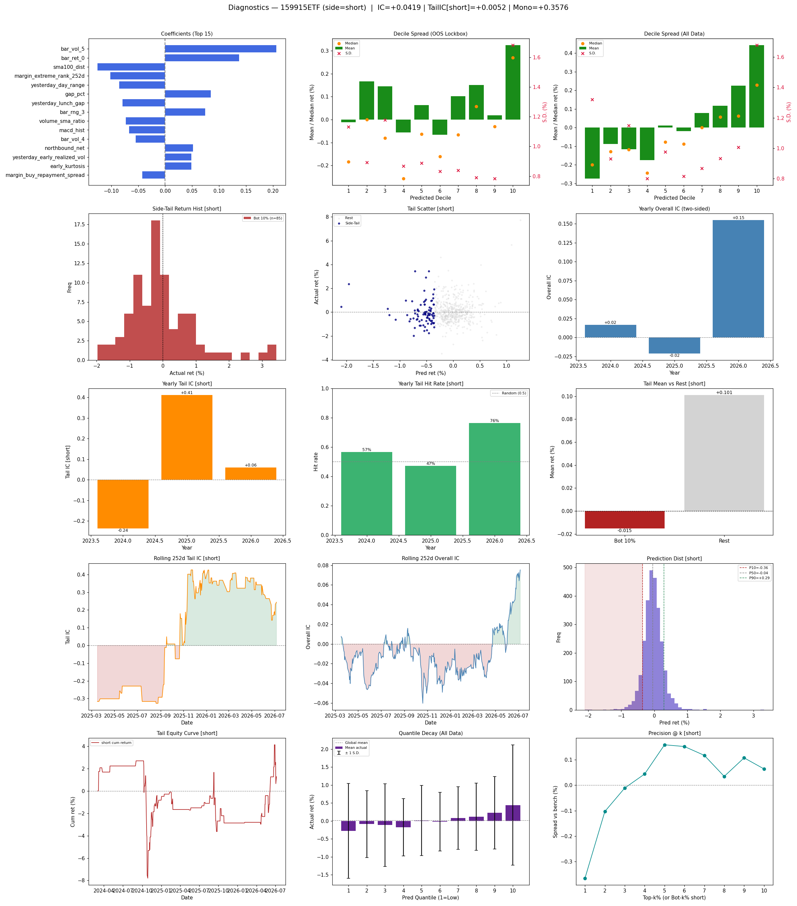

### 50ETF_early (50ETF, side=`single`)
- **Selected features**: 21
- **Active features**: 20
- **Active**: `early_vwap_dev`, `vix_rolling_percentile_60d`, `capital_sell_value`, `margin_repayment`, `short_sell_quantity`, `vix`, `sma100_dist`, `iv_corridor_width`, `yesterday_early_trend`, `yesterday_gap`, `northbound_net`, `bar_ret_0`, `cvd_divergence_day`, `yesterday_day_skew`, `yesterday_day_kurtosis`, `yesterday_illiquidity_amihud`, `gap_pct`, `yesterday_lunch_gap`, `vix_skew_proxy`, `option_oi_growth`
- **Stopped by Step 1 (FDR Screening)** (0 features):
  None
- **Stopped by Step 2 (Stability & VIF Pruning)** (193 features):
  

  
Show 193 features

  
  `first_30min_return`, `early_realized_vol`, `early_range`, `early_trend`, `early_momentum`, `first_bar_return`, `first_bar_volume`, `early_skew`, `bar_ret_1`, `bar_ret_2`, `bar_vol_0`, `bar_vol_4`, `bar_vol_5`, `bar_rng_0`, `bar_rng_2`, `bar_rng_3`, `bar_rng_5`, `bar_body_rng_0`, `bar_body_rng_1`, `bar_body_rng_2`, `bar_vwap_dev_0`, `bar_vwap_dev_1`, `bar_vwap_dev_2`, `bar_vwap_dev_3`, `bar_vwap_dev_5`, `num_up_bars`, `max_up_ret`, `max_down_ret`, `cl_pos_in_range`, `body_to_range_ratio`, `total_path_length`, `volume_slope`, `spike_exhaustion_ratio`, `first_bar_sentiment`, `or_fill_ratio`, `close_vs_open_range`, `inside_bar_failure_bull`, `consecutive_higher_highs`, `early_bearish_engulfing_count`, `volume_surge_max`, `volume_concentration`, `volume_trend_intraday`, `volume_acceleration`, `volume_surge_direction`, `pullback_ratio`, `rally_ratio`, `range_expansion_ratio`, `pullback_depth_ratio`, `pullback_depth_max`, `rally_strength_max`, `vwap_slope_intraday`, `volume_weighted_price_position`, `net_volume_flow`, `early_body_momentum`, `late_bar_momentum`, `trend_strength_intraday`, `high_low_sequence_momentum`, `intraday_slope`, `intraday_autocorr`, `opening_momentum_score`, `opening_direction_stability`, `early_trend_hhi`, `session_high_proximity`, `session_low_proximity`, `close_above_open_count`, `open_to_current_return`, `upper_wick_dominance`, `rsi_opening`, `stoch_opening`, `momentum_strength_intraday`, `opening_auction_imbalance`, `intraday_close_position`, `limit_down_proximity_early`, `morning_trend_extrapolated`, `demark_setup_reversal_early`, `failed_breakout_reversal_early`, `early_wavetrend_cross`, `atr_expansion_flag_early`, `volatility_breakout_squeeze`, `early_bid_ask_spread_proxy`, `early_vwap_acceleration`, `early_order_flow_imbalance`, `rbreaker_sell_setup_proximity_early`, `rbreaker_buy_setup_proximity_early`, `skypark_gap_reversal_early`, `turtle_breakout_strength_early`, `macd_hist`, `sma20_dist`, `sma50_dist`, `atr14_norm`, `roc10`, `vol20`, `sma10_dist`, `sma200_dist`, `ema12_dist`, `rsi5`, `rsi21`, `roc5`, `roc20`, `roc60`, `cci14`, `willr14`, `stoch_k`, `stoch_d`, `mfi14`, `aroon_osc`, `vol5`, `vol10`, `vol60`, `vol_ratio_5_20`, `vol_ratio_10_60`, `bb_width`, `vol_pk20`, `vol_gk10`, `vol_gk20`, `volume_sma_ratio`, `margin_balance`, `buy_on_margin_value`, `short_balance`, `short_balance_quantity`, `short_repayment_quantity`, `total_balance`, `margin_net_buy`, `margin_short_ratio`, `capital_buy_volume`, `capital_buy_value`, `capital_sell_volume`, `capital_net_value`, `capital_net_ratio`, `northbound_buy`, `northbound_sell`, `iv`, `iv_vol_ratio`, `vix_vol_ratio`, `vix_iv_spread`, `vix_iv_ratio`, `iv_diff_1d`, `vix_diff_1d`, `tech_value_rotation`, `yesterday_limit_up_touch`, `limit_up_proximity_day`, `limit_down_proximity_day`, `growth_momentum_ratio`, `high_beta_vol_ratio`, `yesterday_vix_early_drift`, `vix_realized_spread`, `iv_envelope_deviation`, `margin_lever_ratio`, `capital_net_accel`, `northbound_volume_share`, `yesterday_northbound_net_ratio`, `margin_buy_repayment_spread`, `short_sell_cover_spread`, `margin_extreme_rank_252d`, `capital_large_order_ratio`, `consecutive_inside_bars_3d`, `outside_bar_reversal_day`, `wavetrend_osc_day`, `keltner_squeeze_width`, `yesterday_wavetrend_osc`, `yesterday_stoch_rsi_cross`, `coppock_curve_day`, `yesterday_range_ratio`, `yesterday_body_ratio`, `yesterday_volume_ratio`, `yesterday_return`, `yesterday_close_position`, `sma_distance_5d`, `sma_distance_60d`, `volatility_percentile_20d`, `volume_percentile_20d`, `yearly_high_distance`, `yearly_low_distance`, `twenty_gap_bars_regime`, `measured_move_proximity`, `yesterday_pm_return`, `yesterday_am_return`, `yesterday_gap_pct`, `yesterday_first_30min_return`, `yesterday_early_realized_vol`, `yesterday_early_range`, `yesterday_early_momentum`, `yesterday_first_bar_volume`, `yesterday_early_vwap_dev`, `yesterday_day_range`, `yesterday_day_realized_vol`, `yesterday_day_close_pos`, `yesterday_day_pm_am_vol_ratio`, `yesterday_day_vwap_dev`, `yesterday_afternoon_reversal`, `yesterday_pm_am_vol_ratio`, `yesterday_afternoon_momentum`, `yesterday_cvd_close`
  

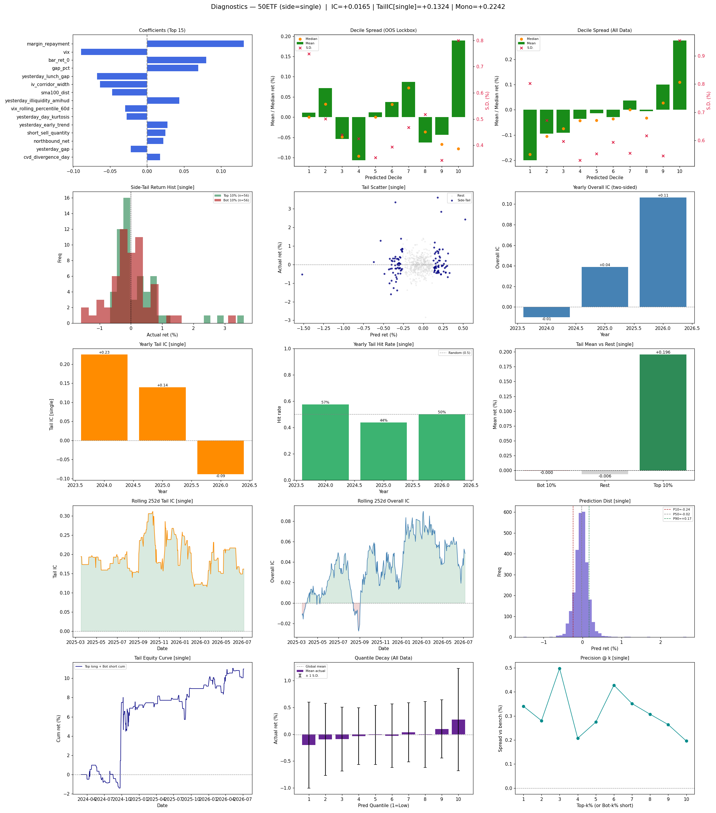

### 50ETF_long_early (50ETF, side=`long`)
- **Selected features**: 21
- **Active features**: 19
- **Active**: `early_vwap_dev`, `vix_rolling_percentile_60d`, `margin_repayment`, `short_sell_quantity`, `vix`, `sma100_dist`, `iv_corridor_width`, `yesterday_early_trend`, `yesterday_gap`, `northbound_net`, `bar_ret_0`, `cvd_divergence_day`, `yesterday_day_skew`, `yesterday_day_kurtosis`, `yesterday_illiquidity_amihud`, `gap_pct`, `yesterday_lunch_gap`, `vix_skew_proxy`, `option_oi_growth`
- **Stopped by Step 1 (FDR Screening)** (0 features):
  None
- **Stopped by Step 2 (Stability & VIF Pruning)** (193 features):
  

  
Show 193 features

  
  `first_30min_return`, `early_realized_vol`, `early_range`, `early_trend`, `early_momentum`, `first_bar_return`, `first_bar_volume`, `early_skew`, `bar_ret_1`, `bar_ret_2`, `bar_vol_0`, `bar_vol_4`, `bar_vol_5`, `bar_rng_0`, `bar_rng_2`, `bar_rng_3`, `bar_rng_5`, `bar_body_rng_0`, `bar_body_rng_1`, `bar_body_rng_2`, `bar_vwap_dev_0`, `bar_vwap_dev_1`, `bar_vwap_dev_2`, `bar_vwap_dev_3`, `bar_vwap_dev_5`, `num_up_bars`, `max_up_ret`, `max_down_ret`, `cl_pos_in_range`, `body_to_range_ratio`, `total_path_length`, `volume_slope`, `spike_exhaustion_ratio`, `first_bar_sentiment`, `or_fill_ratio`, `close_vs_open_range`, `inside_bar_failure_bull`, `consecutive_higher_highs`, `early_bearish_engulfing_count`, `volume_surge_max`, `volume_concentration`, `volume_trend_intraday`, `volume_acceleration`, `volume_surge_direction`, `pullback_ratio`, `rally_ratio`, `range_expansion_ratio`, `pullback_depth_ratio`, `pullback_depth_max`, `rally_strength_max`, `vwap_slope_intraday`, `volume_weighted_price_position`, `net_volume_flow`, `early_body_momentum`, `late_bar_momentum`, `trend_strength_intraday`, `high_low_sequence_momentum`, `intraday_slope`, `intraday_autocorr`, `opening_momentum_score`, `opening_direction_stability`, `early_trend_hhi`, `session_high_proximity`, `session_low_proximity`, `close_above_open_count`, `open_to_current_return`, `upper_wick_dominance`, `rsi_opening`, `stoch_opening`, `momentum_strength_intraday`, `opening_auction_imbalance`, `intraday_close_position`, `limit_down_proximity_early`, `morning_trend_extrapolated`, `demark_setup_reversal_early`, `failed_breakout_reversal_early`, `early_wavetrend_cross`, `atr_expansion_flag_early`, `volatility_breakout_squeeze`, `early_bid_ask_spread_proxy`, `early_vwap_acceleration`, `early_order_flow_imbalance`, `rbreaker_sell_setup_proximity_early`, `rbreaker_buy_setup_proximity_early`, `skypark_gap_reversal_early`, `turtle_breakout_strength_early`, `macd_hist`, `sma20_dist`, `sma50_dist`, `atr14_norm`, `roc10`, `vol20`, `sma10_dist`, `sma200_dist`, `ema12_dist`, `rsi5`, `rsi21`, `roc5`, `roc20`, `roc60`, `cci14`, `willr14`, `stoch_k`, `stoch_d`, `mfi14`, `aroon_osc`, `vol5`, `vol10`, `vol60`, `vol_ratio_5_20`, `vol_ratio_10_60`, `bb_width`, `vol_pk20`, `vol_gk10`, `vol_gk20`, `volume_sma_ratio`, `margin_balance`, `buy_on_margin_value`, `short_balance`, `short_balance_quantity`, `short_repayment_quantity`, `total_balance`, `margin_net_buy`, `margin_short_ratio`, `capital_buy_volume`, `capital_buy_value`, `capital_sell_volume`, `capital_net_value`, `capital_net_ratio`, `northbound_buy`, `northbound_sell`, `iv`, `iv_vol_ratio`, `vix_vol_ratio`, `vix_iv_spread`, `vix_iv_ratio`, `iv_diff_1d`, `vix_diff_1d`, `tech_value_rotation`, `yesterday_limit_up_touch`, `limit_up_proximity_day`, `limit_down_proximity_day`, `growth_momentum_ratio`, `high_beta_vol_ratio`, `yesterday_vix_early_drift`, `vix_realized_spread`, `iv_envelope_deviation`, `margin_lever_ratio`, `capital_net_accel`, `northbound_volume_share`, `yesterday_northbound_net_ratio`, `margin_buy_repayment_spread`, `short_sell_cover_spread`, `margin_extreme_rank_252d`, `capital_large_order_ratio`, `consecutive_inside_bars_3d`, `outside_bar_reversal_day`, `wavetrend_osc_day`, `keltner_squeeze_width`, `yesterday_wavetrend_osc`, `yesterday_stoch_rsi_cross`, `coppock_curve_day`, `yesterday_range_ratio`, `yesterday_body_ratio`, `yesterday_volume_ratio`, `yesterday_return`, `yesterday_close_position`, `sma_distance_5d`, `sma_distance_60d`, `volatility_percentile_20d`, `volume_percentile_20d`, `yearly_high_distance`, `yearly_low_distance`, `twenty_gap_bars_regime`, `measured_move_proximity`, `yesterday_pm_return`, `yesterday_am_return`, `yesterday_gap_pct`, `yesterday_first_30min_return`, `yesterday_early_realized_vol`, `yesterday_early_range`, `yesterday_early_momentum`, `yesterday_first_bar_volume`, `yesterday_early_vwap_dev`, `yesterday_day_range`, `yesterday_day_realized_vol`, `yesterday_day_close_pos`, `yesterday_day_pm_am_vol_ratio`, `yesterday_day_vwap_dev`, `yesterday_afternoon_reversal`, `yesterday_pm_am_vol_ratio`, `yesterday_afternoon_momentum`, `yesterday_cvd_close`
  

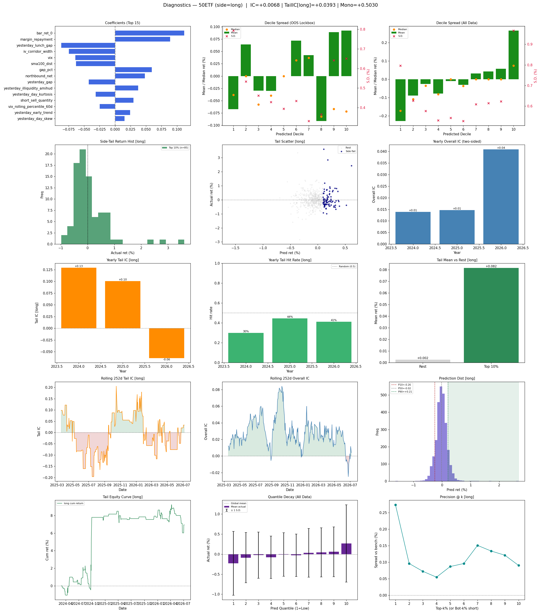

### 50ETF_short_early (50ETF, side=`short`)
- **Selected features**: 13
- **Active features**: 10
- **Active**: `vix_rolling_percentile_60d`, `margin_repayment`, `sma100_dist`, `iv_corridor_width`, `yesterday_early_trend`, `northbound_net`, `bar_ret_0`, `yesterday_illiquidity_amihud`, `gap_pct`, `yesterday_lunch_gap`
- **Stopped by Step 1 (FDR Screening)** (0 features):
  None
- **Stopped by Step 2 (Stability & VIF Pruning)** (201 features):
  

  
Show 201 features

  
  `first_30min_return`, `early_realized_vol`, `early_range`, `early_trend`, `early_momentum`, `first_bar_return`, `first_bar_volume`, `early_vwap_dev`, `early_skew`, `early_kurtosis`, `bar_ret_1`, `bar_ret_2`, `bar_vol_0`, `bar_vol_4`, `bar_vol_5`, `bar_rng_0`, `bar_rng_2`, `bar_rng_3`, `bar_rng_5`, `bar_body_rng_0`, `bar_body_rng_1`, `bar_body_rng_2`, `bar_vwap_dev_0`, `bar_vwap_dev_1`, `bar_vwap_dev_2`, `bar_vwap_dev_3`, `bar_vwap_dev_5`, `num_up_bars`, `max_up_ret`, `max_down_ret`, `cl_pos_in_range`, `body_to_range_ratio`, `total_path_length`, `volume_slope`, `spike_exhaustion_ratio`, `first_bar_sentiment`, `or_fill_ratio`, `close_vs_open_range`, `inside_bar_failure_bull`, `consecutive_higher_highs`, `early_bearish_engulfing_count`, `volume_surge_max`, `volume_concentration`, `volume_trend_intraday`, `volume_acceleration`, `volume_surge_direction`, `pullback_ratio`, `rally_ratio`, `range_expansion_ratio`, `pullback_depth_ratio`, `pullback_depth_max`, `rally_strength_max`, `vwap_slope_intraday`, `volume_weighted_price_position`, `net_volume_flow`, `early_body_momentum`, `late_bar_momentum`, `trend_strength_intraday`, `high_low_sequence_momentum`, `intraday_slope`, `intraday_autocorr`, `opening_momentum_score`, `opening_direction_stability`, `early_trend_hhi`, `session_high_proximity`, `session_low_proximity`, `close_above_open_count`, `open_to_current_return`, `upper_wick_dominance`, `rsi_opening`, `stoch_opening`, `momentum_strength_intraday`, `opening_auction_imbalance`, `intraday_close_position`, `limit_down_proximity_early`, `morning_trend_extrapolated`, `demark_setup_reversal_early`, `failed_breakout_reversal_early`, `early_wavetrend_cross`, `atr_expansion_flag_early`, `volatility_breakout_squeeze`, `early_bid_ask_spread_proxy`, `early_vwap_acceleration`, `early_order_flow_imbalance`, `rbreaker_sell_setup_proximity_early`, `rbreaker_buy_setup_proximity_early`, `skypark_gap_reversal_early`, `turtle_breakout_strength_early`, `macd_hist`, `sma20_dist`, `sma50_dist`, `atr14_norm`, `roc10`, `vol20`, `sma10_dist`, `sma200_dist`, `ema12_dist`, `rsi5`, `rsi21`, `roc5`, `roc20`, `roc60`, `cci14`, `willr14`, `stoch_k`, `stoch_d`, `mfi14`, `aroon_osc`, `vol5`, `vol10`, `vol60`, `vol_ratio_5_20`, `vol_ratio_10_60`, `bb_width`, `vol_pk20`, `vol_gk10`, `vol_gk20`, `volume_sma_ratio`, `margin_balance`, `buy_on_margin_value`, `short_balance`, `short_balance_quantity`, `short_sell_quantity`, `short_repayment_quantity`, `total_balance`, `margin_net_buy`, `margin_short_ratio`, `capital_buy_volume`, `capital_buy_value`, `capital_sell_volume`, `capital_net_value`, `capital_net_ratio`, `northbound_buy`, `northbound_sell`, `iv`, `iv_vol_ratio`, `vix`, `vix_vol_ratio`, `vix_iv_spread`, `vix_iv_ratio`, `iv_diff_1d`, `vix_diff_1d`, `tech_value_rotation`, `yesterday_limit_up_touch`, `limit_up_proximity_day`, `limit_down_proximity_day`, `growth_momentum_ratio`, `high_beta_vol_ratio`, `vix_skew_proxy`, `yesterday_vix_early_drift`, `vix_realized_spread`, `iv_envelope_deviation`, `margin_lever_ratio`, `capital_net_accel`, `northbound_volume_share`, `yesterday_northbound_net_ratio`, `margin_buy_repayment_spread`, `short_sell_cover_spread`, `margin_extreme_rank_252d`, `capital_large_order_ratio`, `consecutive_inside_bars_3d`, `outside_bar_reversal_day`, `wavetrend_osc_day`, `keltner_squeeze_width`, `yesterday_wavetrend_osc`, `yesterday_stoch_rsi_cross`, `cvd_divergence_day`, `coppock_curve_day`, `yesterday_range_ratio`, `yesterday_body_ratio`, `yesterday_volume_ratio`, `yesterday_return`, `yesterday_close_position`, `sma_distance_5d`, `sma_distance_60d`, `volatility_percentile_20d`, `volume_percentile_20d`, `yearly_high_distance`, `yearly_low_distance`, `twenty_gap_bars_regime`, `measured_move_proximity`, `yesterday_pm_return`, `yesterday_am_return`, `yesterday_gap_pct`, `yesterday_first_30min_return`, `yesterday_early_realized_vol`, `yesterday_early_range`, `yesterday_early_momentum`, `yesterday_first_bar_volume`, `yesterday_early_vwap_dev`, `yesterday_day_range`, `yesterday_day_realized_vol`, `yesterday_day_close_pos`, `yesterday_day_pm_am_vol_ratio`, `yesterday_day_vwap_dev`, `yesterday_day_skew`, `yesterday_day_kurtosis`, `yesterday_afternoon_reversal`, `yesterday_pm_am_vol_ratio`, `yesterday_afternoon_momentum`, `yesterday_cvd_close`
  

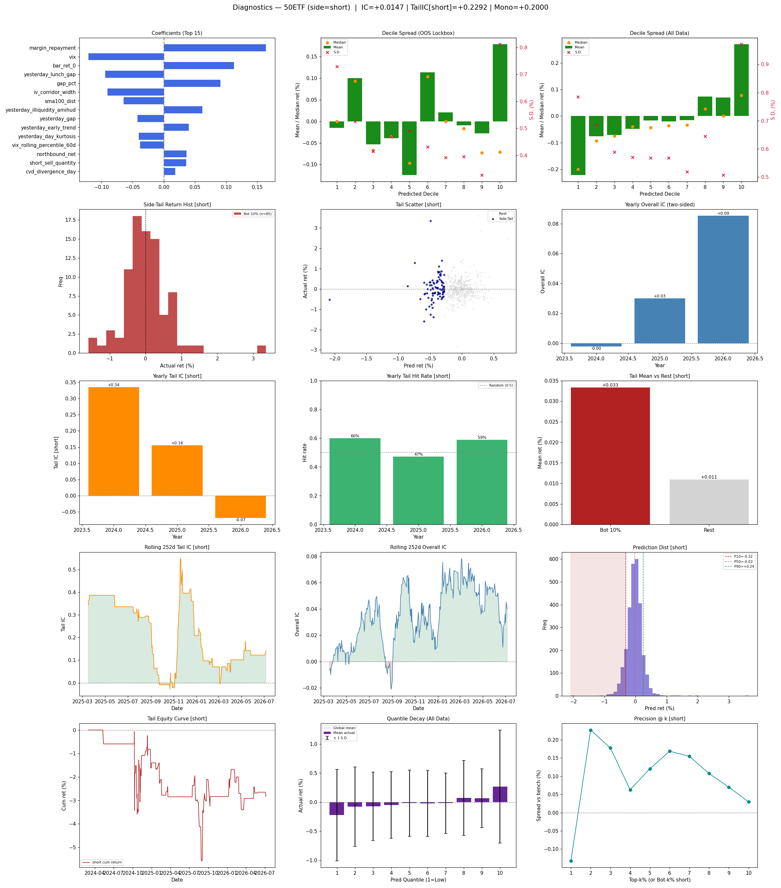

## Methodology Overview
1. **Lockbox Split**: From 2024-03-01 to last day (OOS holdout).
2. **Selection Validation Split**: Six non-contiguous 3-month blocks carved out from the working set, partitioned into 4 inner (tuning) + 2 outer (held-out) blocks, with a 10-day embargo.
3. **BH-FDR Screening**: Robust marginal Spearman correlation at FDR = 0.15 on selection train.
4. **Hierarchical Clustering**: Groups collinear features (|r| >= 0.75).
5. **Cluster Stability Selection + VIF Pruning**: B=100 subsamples, pi=0.60 cluster threshold, then VIF <= 10 pruning.
6. **Weighted Fitting**: Sample weights w(y) = |y|^k.
7. **Side-Aware Optuna Objective**:
   - `single` (legacy): Tail IC two-sided (top10% U bot10%). Weights V1..V4 = [0.40, 0.40, 0.15, 0.05].
   - `long`: Tail IC top-only (`pred >= P85(pred)`). Weights [0.35, 0.50, 0.15, 0.00] (V4 dropped).
   - `short`: Tail IC bot-only (`pred <= P15(pred)`). Weights [0.35, 0.50, 0.15, 0.00] (V4 dropped).
   - CV fold kill-switches (M1..M6: hit rate, monotonicity, spread, ESS, Gini) stay **two-sided** for all sides.
8. **Deflated Objective + Plateau Selection**: Running Lopez de Prado deflation; final trial chosen via plateau search (r=0.25).
9. **15-Panel Diagnostics Figure per Tag**: One combined PNG (`diagnostics_{etf}_{side}_early.png`) with 15 subplots, saved to `day-model/plots/` and embedded above.
