# Day-Model Remake Optimization Report
> Generated by day-model/generate_report.py

Side-aware objective: `single` (legacy two-sided Tail IC), `long` (top-only, `pred >= P85(pred)`), `short` (bot-only, `pred <= P15(pred)`). Tail IC and lockbox Tail IC are side-aware; CV M1..M6 metrics stay two-sided.

This report summarizes the performance and features of the remade `day-model` return predictors, optimized using first-principles multi-metric objective functions and stability selection.

## Out-of-Sample Lockbox Performance (2024-03 to Last Day)

| Tag | ETF | Side | Selected | Active | Model Type | Lockbox IC | Lockbox Tail IC | Tail IC Def |
| :--- | :---: | :---: | :---: | :---: | :---: | :---: | :---: | :---: |
| 300ETF_early | 300ETF | `single` | 16 | 10 | `unified` | +0.0168 | +0.0811 | single |
| 300ETF_long_early | 300ETF | `long` | 16 | 14 | `unified` | +0.0214 | -0.0027 | long |
| 300ETF_short_early | 300ETF | `short` | 16 | 16 | `unified` | +0.0206 | -0.1664 | short |
| 500ETF_early | 500ETF | `single` | 20 | 20 | `unified` | +0.0436 | +0.0342 | single |
| 500ETF_long_early | 500ETF | `long` | 20 | 20 | `unified` | +0.0453 | -0.0627 | long |
| 500ETF_short_early | 500ETF | `short` | 20 | 20 | `unified` | +0.0470 | +0.0116 | short |
| 588000ETF_early | 588000ETF | `single` | 15 | 8 | `unified` | +0.0158 | +0.1203 | single |
| 588000ETF_long_early | 588000ETF | `long` | 24 | 24 | `unified` | +0.0352 | +0.2218 | long |
| 588000ETF_short_early | 588000ETF | `short` | 24 | 23 | `unified` | +0.0165 | +0.1198 | short |
| 159915ETF_early | 159915ETF | `single` | 21 | 21 | `unified` | +0.0422 | +0.1206 | single |
| 159915ETF_long_early | 159915ETF | `long` | 21 | 21 | `unified` | +0.0422 | +0.1157 | long |
| 159915ETF_short_early | 159915ETF | `short` | 21 | 20 | `unified` | +0.0444 | +0.0546 | short |
| 50ETF_early | 50ETF | `single` | 18 | 12 | `unified` | +0.0311 | +0.0706 | single |
| 50ETF_long_early | 50ETF | `long` | 21 | 19 | `unified` | +0.0079 | +0.0449 | long |
| 50ETF_short_early | 50ETF | `short` | 21 | 19 | `unified` | +0.0180 | +0.2181 | short |

## Detailed Trial Metrics & Optimization Objectives

CV fold metrics M1..M6 are two-sided for all sides (per side-aware spec). V1..V4 weights: single `[0.40, 0.40, 0.15, 0.05]`; long/short `[0.45, 0.45, 0.10, 0.00]` (V4 dropped, renormalized).

| Tag | Side | Yearly Tail IC IR | Yearly Tail IC Mean | Hit Rate | Decile Monotonicity | Top-Bottom Spread |
| :--- | :---: | :---: | :---: | :---: | :---: | :---: |
| 300ETF_early | `single` | 1.6283 | +0.2264 | 90.0% | 0.3673 | +34.3945% |
| 300ETF_long_early | `long` | 1.3843 | +0.2004 | 90.0% | 0.4461 | +33.2259% |
| 300ETF_short_early | `short` | 1.2789 | +0.1908 | 90.0% | 0.4812 | +32.5346% |
| 500ETF_early | `single` | 1.4885 | +0.2736 | 90.0% | 0.4655 | +77.2971% |
| 500ETF_long_early | `long` | 1.6274 | +0.2744 | 90.0% | 0.4679 | +76.0730% |
| 500ETF_short_early | `short` | 1.6686 | +0.2436 | 100.0% | 0.4376 | +37.6063% |
| 588000ETF_early | `single` | 1.3000 | +0.3032 | 80.0% | 0.2800 | +55.3423% |
| 588000ETF_long_early | `long` | 1.3919 | +0.1858 | 80.0% | 0.4473 | +43.0936% |
| 588000ETF_short_early | `short` | 1.3221 | +0.3183 | 80.0% | 0.4788 | +54.2641% |
| 159915ETF_early | `single` | 0.9502 | +0.1757 | 90.0% | 0.4945 | +58.3082% |
| 159915ETF_long_early | `long` | 1.1870 | +0.2272 | 80.0% | 0.4958 | +50.7973% |
| 159915ETF_short_early | `short` | 0.9796 | +0.2246 | 80.0% | 0.5358 | +57.4123% |
| 50ETF_early | `single` | 1.8030 | +0.2463 | 90.0% | 0.3236 | +37.0034% |
| 50ETF_long_early | `long` | 2.3541 | +0.2530 | 100.0% | 0.3903 | +40.8886% |
| 50ETF_short_early | `short` | 2.8400 | +0.3002 | 100.0% | 0.3552 | +50.7056% |

## Model Quality & Generalization Diagnostics

### Multi-Collinearity & Weight Concentration

| Tag | Side | Raw X Cond | Reg kappa | Collinear Pairs (>=0.85) | Gini | Tail ESS | Tail ESS % |
| :--- | :---: | :---: | :---: | :---: | :---: | :---: | :---: |
| 300ETF_early | `single` | 2.80 | 6.64 | 0 | 0.6912 | 427.1 | 19.7% [LOW] |
| 300ETF_long_early | `long` | 2.80 | 6.74 | 0 | 0.5118 | 735.3 | 33.9% |
| 300ETF_short_early | `short` | 2.80 | 6.85 | 0 | 0.3999 | 1161.9 | 53.6% |
| 500ETF_early | `single` | 5.76 | 16.18 | 0 | 0.3722 | 820.8 | 37.9% |
| 500ETF_long_early | `long` | 5.76 | 23.99 | 0 | 0.3578 | 2059.1 | 95.1% |
| 500ETF_short_early | `short` | 5.76 | 17.07 | 0 | 0.3025 | 683.4 | 31.6% |
| 588000ETF_early | `single` | 6.10 | 23.85 | 0 | 0.6540 | 479.7 | 58.9% |
| 588000ETF_long_early | `long` | 19.88 | 394.56 [SEVERE] | 0 | 0.3351 | 687.8 | 84.5% |
| 588000ETF_short_early | `short` | 19.88 | 9.93 | 0 | 0.3554 | 692.9 | 85.1% |
| 159915ETF_early | `single` | 25.80 | 622.32 [SEVERE] | 0 | 0.3748 | 504.8 | 23.3% |
| 159915ETF_long_early | `long` | 25.80 | 658.58 [SEVERE] | 0 | 0.3339 | 1946.8 | 89.9% |
| 159915ETF_short_early | `short` | 25.80 | 65.79 [MODERATE] | 0 | 0.3537 | 2040.4 | 94.2% |
| 50ETF_early | `single` | 60.49 | 15.73 | 0 | 0.5442 | 596.4 | 27.5% |
| 50ETF_long_early | `long` | 68.19 | 50.35 [MODERATE] | 0 | 0.4551 | 806.8 | 37.3% |
| 50ETF_short_early | `short` | 68.19 | 781.47 [SEVERE] | 0 | 0.4868 | 1657.9 | 76.5% |

### Generalization Gap (CV vs Selection Val vs OOS)

| Tag | Side | CV IC | Deflated CV IC | Sel Val IC | Deflated Val IC | OOS IC | IC Gen Gap | CV Mono | OOS Mono | Mono Gen Gap |
| :--- | :---: | :---: | :---: | :---: | :---: | :---: | :---: | :---: | :---: | :---: |
| 300ETF_early | `single` | +0.1108 | +0.0127 | +0.0945 | +0.0092 | +0.0168 | -0.0076 | +0.3673 | +0.5636 | -0.1964 |
| 300ETF_long_early | `long` | +0.1087 | -0.0036 | +0.0714 | -0.0186 | +0.0214 | -0.0401 | +0.4461 | +0.3818 | +0.0642 |
| 300ETF_short_early | `short` | +0.1115 | -0.0021 | +0.0650 | -0.0167 | +0.0206 | -0.0373 | +0.4812 | +0.3939 | +0.0873 |
| 500ETF_early | `single` | +0.1305 | +0.0176 | +0.1272 | +0.0224 | +0.0436 | -0.0212 | +0.4655 | +0.6848 | -0.2194 |
| 500ETF_long_early | `long` | +0.1205 | +0.0392 | +0.1198 | +0.0391 | +0.0453 | -0.0062 | +0.4679 | +0.6000 | -0.1321 |
| 500ETF_short_early | `short` | +0.0907 | +0.0091 | +0.1058 | +0.0230 | +0.0470 | -0.0241 | +0.4376 | +0.6485 | -0.2109 |
| 588000ETF_early | `single` | +0.1371 | -0.0438 | +0.0657 | -0.1409 | +0.0158 | -0.1568 | +0.2800 | +0.1879 | +0.0921 |
| 588000ETF_long_early | `long` | +0.1688 | +0.0367 | -0.1044 | -0.1828 | +0.0352 | -0.2180 | +0.4473 | +0.5879 | -0.1406 |
| 588000ETF_short_early | `short` | +0.1897 | +0.0377 | -0.2090 | -0.3950 | +0.0165 | -0.4114 | +0.4788 | +0.2970 | +0.1818 |
| 159915ETF_early | `single` | +0.1416 | +0.0620 | +0.0840 | +0.0431 | +0.0422 | +0.0008 | +0.4945 | +0.2727 | +0.2218 [DEGRADED] |
| 159915ETF_long_early | `long` | +0.1350 | +0.0422 | +0.0750 | +0.0317 | +0.0422 | -0.0104 | +0.4958 | +0.3939 | +0.1018 |
| 159915ETF_short_early | `short` | +0.1415 | +0.0462 | +0.0589 | +0.0115 | +0.0444 | -0.0329 | +0.5358 | +0.3939 | +0.1418 |
| 50ETF_early | `single` | +0.0818 | +0.0044 | +0.1386 | +0.0209 | +0.0311 | -0.0103 | +0.3236 | +0.2970 | +0.0267 |
| 50ETF_long_early | `long` | +0.0933 | +0.0218 | +0.1479 | +0.0416 | +0.0079 | +0.0337 | +0.3903 | +0.5394 | -0.1491 |
| 50ETF_short_early | `short` | +0.0980 | +0.0226 | +0.1528 | +0.0356 | +0.0180 | +0.0176 | +0.3552 | +0.2242 | +0.1309 |

### Overfitting Diagnostics (PBO & Lockbox Bootstrap CIs)

| Tag | Side | PBO | Perf Deg | OOS IC 95% CI | CV IC Target | IC Sig? | OOS Mono 95% CI | CV Mono | Mono Sig? |
| :--- | :---: | :---: | :---: | :---: | :---: | :---: | :---: | :---: | :---: |
| 300ETF_early | `single` | 13.3% | -1.0776 | [-0.0909, +0.0973] | +0.0092 | **Noise** | [-0.3336, +0.7333] | +0.3673 | **Noise** |
| 300ETF_long_early | `long` | 26.7% | -1.0776 | [-0.0875, +0.1026] | -0.0186 | **Noise** | [-0.2852, +0.6973] | +0.4461 | **Noise** |
| 300ETF_short_early | `short` | 26.7% | -1.0776 | [-0.0871, +0.0994] | -0.0167 | **Noise** | [-0.3336, +0.6000] | +0.4812 | **Noise** |
| 500ETF_early | `single` | 6.7% | -0.0809 | [-0.0596, +0.1373] | +0.0224 | **Noise** | [-0.2606, +0.8545] | +0.4655 | **Noise** |
| 500ETF_long_early | `long` | 20.0% | -0.0821 | [-0.0500, +0.1349] | +0.0391 | **Noise** | [-0.2730, +0.8182] | +0.4679 | **Noise** |
| 500ETF_short_early | `short` | 6.7% | -0.0784 | [-0.0481, +0.1334] | +0.0230 | **Noise** | [-0.2003, +0.8667] | +0.4376 | **Noise** |
| 588000ETF_early | `single` | 0.0% | -0.1050 | [-0.0683, +0.1047] | -0.1409 | **Signal** | [-0.3458, +0.6727] | +0.2800 | **Noise** |
| 588000ETF_long_early | `long` | 13.3% | -0.0627 | [-0.0657, +0.1229] | -0.1828 | **Signal** | [-0.3215, +0.7212] | +0.4473 | **Noise** |
| 588000ETF_short_early | `short` | 6.7% | -0.2458 | [-0.0734, +0.1097] | -0.3950 | **Signal** | [-0.3939, +0.5879] | +0.4788 | **Noise** |
| 159915ETF_early | `single` | 33.3% | -1.5013 | [-0.0566, +0.1251] | +0.0431 | **Noise** | [-0.5152, +0.5515] | +0.4945 | **Noise** |
| 159915ETF_long_early | `long` | 46.7% | -1.3334 | [-0.0561, +0.1240] | +0.0317 | **Noise** | [-0.6242, +0.5636] | +0.4958 | **Noise** |
| 159915ETF_short_early | `short` | 60.0% | -1.8989 | [-0.0533, +0.1285] | +0.0115 | **Noise** | [-0.5639, +0.6127] | +0.5358 | **Noise** |
| 50ETF_early | `single` | 6.7% | -0.6193 | [-0.0700, +0.1142] | +0.0209 | **Noise** | [-0.2848, +0.6488] | +0.3236 | **Noise** |
| 50ETF_long_early | `long` | 40.0% | -0.4962 | [-0.0874, +0.0867] | +0.0416 | **Noise** | [-0.4182, +0.7094] | +0.3903 | **Noise** |
| 50ETF_short_early | `short` | 33.3% | -0.4608 | [-0.0746, +0.0990] | +0.0356 | **Noise** | [-0.2485, +0.6000] | +0.3552 | **Noise** |

### Feature Selection Metrics & Fallbacks

| Tag | Side | Screen In | BH Pass | Screen FB? | Stability In | Stability Pass | Stability FB? | Kept |
| :--- | :---: | :---: | :---: | :---: | :---: | :---: | :---: | :---: |
| 300ETF_early | `single` | 214 | 26 | NO | 214 | 20 | NO | **16** |
| 300ETF_long_early | `long` | 214 | 26 | NO | 214 | 20 | NO | **16** |
| 300ETF_short_early | `short` | 214 | 26 | NO | 214 | 20 | NO | **16** |
| 500ETF_early | `single` | 214 | 41 | NO | 214 | 25 | NO | **20** |
| 500ETF_long_early | `long` | 214 | 41 | NO | 214 | 25 | NO | **20** |
| 500ETF_short_early | `short` | 214 | 41 | NO | 214 | 25 | NO | **20** |
| 588000ETF_early | `single` | 214 | 93 | NO | 214 | 28 | NO | **24** |
| 588000ETF_long_early | `long` | 214 | 93 | NO | 214 | 28 | NO | **24** |
| 588000ETF_short_early | `short` | 214 | 93 | NO | 214 | 28 | NO | **24** |
| 159915ETF_early | `single` | 214 | 40 | NO | 214 | 24 | NO | **21** |
| 159915ETF_long_early | `long` | 214 | 40 | NO | 214 | 24 | NO | **21** |
| 159915ETF_short_early | `short` | 214 | 40 | NO | 214 | 24 | NO | **21** |
| 50ETF_early | `single` | 214 | 85 | NO | 214 | 25 | NO | **21** |
| 50ETF_long_early | `long` | 214 | 85 | NO | 214 | 25 | NO | **21** |
| 50ETF_short_early | `short` | 214 | 85 | NO | 214 | 25 | NO | **21** |

### Optuna Main Study & Pruning Reasons

| Tag | Side | Total | Completed | Pruned/Failed | M4 | M3 | M5 | M6 | ESS | Floor | Gini |
| :--- | :---: | :---: | :---: | :---: | :---: | :---: | :---: | :---: | :---: | :---: | :---: |
| 300ETF_early | `single` | 100 | 75 | 25 | 9 | 16 | 18 | 5 | 0 | 24 | 0 |
| 300ETF_long_early | `long` | 100 | 68 | 32 | 17 | 20 | 23 | 9 | 0 | 31 | 0 |
| 300ETF_short_early | `short` | 100 | 71 | 29 | 16 | 22 | 22 | 12 | 0 | 26 | 0 |
| 500ETF_early | `single` | 100 | 76 | 24 | 16 | 17 | 21 | 11 | 0 | 24 | 0 |
| 500ETF_long_early | `long` | 100 | 84 | 16 | 8 | 8 | 10 | 2 | 0 | 16 | 0 |
| 500ETF_short_early | `short` | 100 | 84 | 16 | 12 | 13 | 13 | 5 | 0 | 15 | 0 |
| 588000ETF_early | `single` | 100 | 71 | 29 | 20 | 24 | 27 | 20 | 0 | 28 | 0 |
| 588000ETF_long_early | `long` | 100 | 83 | 17 | 7 | 7 | 8 | 7 | 0 | 7 | 0 |
| 588000ETF_short_early | `short` | 100 | 45 | 55 | 7 | 10 | 15 | 8 | 0 | 13 | 0 |
| 159915ETF_early | `single` | 100 | 95 | 5 | 5 | 5 | 5 | 5 | 0 | 5 | 0 |
| 159915ETF_long_early | `long` | 100 | 64 | 36 | 7 | 7 | 7 | 7 | 0 | 7 | 0 |
| 159915ETF_short_early | `short` | 100 | 47 | 53 | 7 | 7 | 8 | 7 | 0 | 8 | 0 |
| 50ETF_early | `single` | 100 | 71 | 29 | 1 | 19 | 25 | 13 | 0 | 21 | 0 |
| 50ETF_long_early | `long` | 100 | 84 | 16 | 0 | 13 | 13 | 10 | 0 | 15 | 0 |
| 50ETF_short_early | `short` | 100 | 80 | 20 | 2 | 16 | 18 | 7 | 0 | 15 | 0 |

### Hyperparameter Plateau Selection

| Tag | Side | Plateau Trial | Plateau Objective | Raw Best Trial | Raw Best Objective |
| :--- | :---: | :---: | :---: | :---: | :---: |
| 300ETF_early | `single` | 71 | +3.0109 | 67 | +3.9583 |
| 300ETF_long_early | `long` | 3 | +1.4002 | 39 | +9.3035 |
| 300ETF_short_early | `short` | 96 | +1.2673 | 61 | +3.7937 |
| 500ETF_early | `single` | 51 | +0.7841 | 98 | +2.0216 |
| 500ETF_long_early | `long` | 0 | +0.3970 | 45 | +1.8463 |
| 500ETF_short_early | `short` | 74 | -0.1839 | 95 | +0.1782 |
| 588000ETF_early | `single` | 44 | +0.7807 | 74 | +1.6085 |
| 588000ETF_long_early | `long` | 77 | -1.1777 | 6 | -0.9294 |
| 588000ETF_short_early | `short` | 35 | -2.9369 | 98 | +2.0437 |
| 159915ETF_early | `single` | 58 | +1.2365 | 95 | +1.5734 |
| 159915ETF_long_early | `long` | 45 | +0.1909 | 50 | +1.5849 |
| 159915ETF_short_early | `short` | 0 | -1.4471 | 47 | +0.5928 |
| 50ETF_early | `single` | 84 | +1.8139 | 81 | +2.0273 |
| 50ETF_long_early | `long` | 3 | +1.0183 | 96 | +2.8984 |
| 50ETF_short_early | `short` | 80 | +1.0649 | 99 | +2.2496 |

## Per-Tag Diagnostics (15-Panel Figure per Side)

Each tag has ONE combined diagnostics figure with 15 subplots (5 rows x 3 cols):
coefficients, OOS decile spread, all-data decile spread, side-tail return hist, tail scatter, yearly overall IC, yearly side-aware tail IC, yearly tail hit rate, tail vs rest mean, rolling 252d tail IC, rolling 252d overall IC, prediction dist, tail equity curve, quantile decay, precision @ k.

### 300ETF_early (300ETF, side=`single`)
- **Selected features**: 16
- **Active features**: 10
- **Active**: `outside_bar_reversal_day`, `gap_pct`, `capital_large_order_ratio`, `bar_vol_4`, `vol_ratio_5_20`, `sma100_dist`, `yesterday_day_kurtosis`, `bar_ret_0`, `max_up_ret`, `yesterday_early_trend`
- **Stopped by Step 1 (FDR Screening)** (0 features):
  None
- **Stopped by Step 2 (Stability & VIF Pruning)** (198 features):
  

  
Show 198 features

  
  `first_30min_return`, `early_realized_vol`, `early_range`, `early_trend`, `early_momentum`, `first_bar_return`, `first_bar_volume`, `early_skew`, `early_kurtosis`, `bar_ret_1`, `bar_ret_2`, `bar_vol_0`, `bar_vol_5`, `bar_rng_0`, `bar_rng_2`, `bar_rng_3`, `bar_rng_5`, `bar_body_rng_0`, `bar_body_rng_1`, `bar_body_rng_2`, `bar_vwap_dev_0`, `bar_vwap_dev_1`, `bar_vwap_dev_2`, `bar_vwap_dev_3`, `bar_vwap_dev_5`, `num_up_bars`, `max_down_ret`, `cl_pos_in_range`, `body_to_range_ratio`, `total_path_length`, `volume_slope`, `spike_exhaustion_ratio`, `first_bar_sentiment`, `or_fill_ratio`, `close_vs_open_range`, `inside_bar_failure_bull`, `consecutive_higher_highs`, `early_bearish_engulfing_count`, `volume_surge_max`, `volume_concentration`, `volume_trend_intraday`, `volume_acceleration`, `volume_surge_direction`, `pullback_ratio`, `rally_ratio`, `range_expansion_ratio`, `pullback_depth_ratio`, `pullback_depth_max`, `rally_strength_max`, `vwap_slope_intraday`, `volume_weighted_price_position`, `net_volume_flow`, `early_body_momentum`, `late_bar_momentum`, `trend_strength_intraday`, `high_low_sequence_momentum`, `intraday_slope`, `intraday_autocorr`, `opening_momentum_score`, `opening_direction_stability`, `early_trend_hhi`, `session_high_proximity`, `session_low_proximity`, `close_above_open_count`, `open_to_current_return`, `upper_wick_dominance`, `rsi_opening`, `stoch_opening`, `momentum_strength_intraday`, `opening_auction_imbalance`, `intraday_close_position`, `limit_down_proximity_early`, `morning_trend_extrapolated`, `demark_setup_reversal_early`, `failed_breakout_reversal_early`, `early_wavetrend_cross`, `atr_expansion_flag_early`, `volatility_breakout_squeeze`, `early_bid_ask_spread_proxy`, `early_vwap_acceleration`, `early_order_flow_imbalance`, `rbreaker_sell_setup_proximity_early`, `rbreaker_buy_setup_proximity_early`, `skypark_gap_reversal_early`, `turtle_breakout_strength_early`, `macd_hist`, `sma20_dist`, `sma50_dist`, `atr14_norm`, `roc10`, `vol20`, `sma10_dist`, `sma200_dist`, `ema12_dist`, `rsi5`, `rsi21`, `roc5`, `roc20`, `roc60`, `cci14`, `willr14`, `stoch_k`, `stoch_d`, `mfi14`, `aroon_osc`, `vol5`, `vol10`, `vol60`, `vol_ratio_10_60`, `bb_width`, `vol_pk20`, `vol_gk10`, `vol_gk20`, `volume_sma_ratio`, `margin_balance`, `buy_on_margin_value`, `margin_repayment`, `short_balance`, `short_balance_quantity`, `short_sell_quantity`, `short_repayment_quantity`, `total_balance`, `margin_net_buy`, `margin_short_ratio`, `capital_buy_volume`, `capital_buy_value`, `capital_sell_volume`, `capital_sell_value`, `capital_net_value`, `capital_net_ratio`, `northbound_buy`, `northbound_sell`, `northbound_net`, `iv`, `iv_vol_ratio`, `vix`, `vix_vol_ratio`, `vix_iv_spread`, `vix_iv_ratio`, `iv_diff_1d`, `vix_diff_1d`, `yesterday_limit_up_touch`, `limit_up_proximity_day`, `limit_down_proximity_day`, `growth_momentum_ratio`, `high_beta_vol_ratio`, `vix_skew_proxy`, `vix_rolling_percentile_60d`, `iv_corridor_width`, `yesterday_vix_early_drift`, `vix_realized_spread`, `iv_envelope_deviation`, `margin_lever_ratio`, `capital_net_accel`, `northbound_volume_share`, `yesterday_northbound_net_ratio`, `margin_buy_repayment_spread`, `short_sell_cover_spread`, `margin_extreme_rank_252d`, `consecutive_inside_bars_3d`, `wavetrend_osc_day`, `keltner_squeeze_width`, `yesterday_wavetrend_osc`, `yesterday_stoch_rsi_cross`, `cvd_divergence_day`, `yesterday_illiquidity_amihud`, `coppock_curve_day`, `yesterday_range_ratio`, `yesterday_body_ratio`, `yesterday_volume_ratio`, `yesterday_return`, `yesterday_gap`, `yesterday_close_position`, `sma_distance_5d`, `sma_distance_60d`, `volatility_percentile_20d`, `volume_percentile_20d`, `yearly_high_distance`, `yearly_low_distance`, `twenty_gap_bars_regime`, `measured_move_proximity`, `yesterday_pm_return`, `yesterday_first_30min_return`, `yesterday_early_realized_vol`, `yesterday_early_range`, `yesterday_early_momentum`, `yesterday_first_bar_volume`, `yesterday_early_vwap_dev`, `yesterday_day_range`, `yesterday_day_realized_vol`, `yesterday_day_close_pos`, `yesterday_day_pm_am_vol_ratio`, `yesterday_day_vwap_dev`, `yesterday_day_skew`, `yesterday_afternoon_reversal`, `yesterday_pm_am_vol_ratio`, `yesterday_afternoon_momentum`, `yesterday_cvd_close`
  

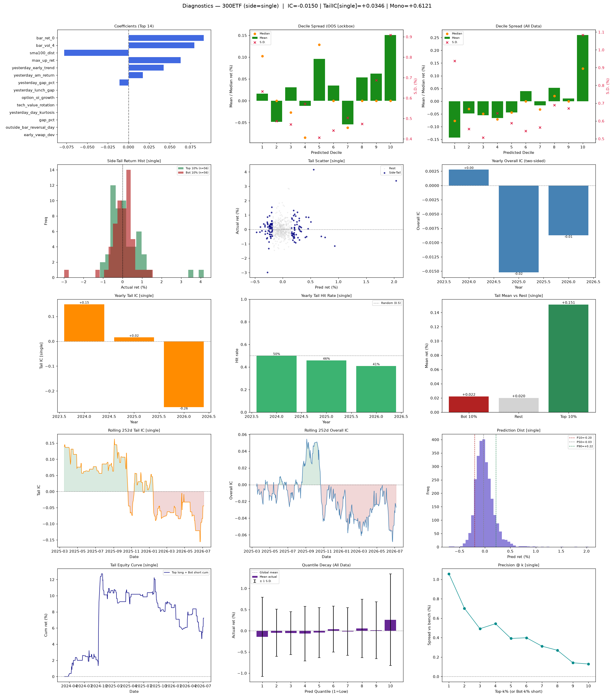

### 300ETF_long_early (300ETF, side=`long`)
- **Selected features**: 16
- **Active features**: 14
- **Active**: `early_vwap_dev`, `outside_bar_reversal_day`, `gap_pct`, `capital_large_order_ratio`, `bar_vol_4`, `sma100_dist`, `yesterday_day_kurtosis`, `yesterday_gap_pct`, `bar_ret_0`, `max_up_ret`, `option_oi_growth`, `yesterday_early_trend`, `yesterday_am_return`, `yesterday_lunch_gap`
- **Stopped by Step 1 (FDR Screening)** (0 features):
  None
- **Stopped by Step 2 (Stability & VIF Pruning)** (198 features):
  

  
Show 198 features

  
  `first_30min_return`, `early_realized_vol`, `early_range`, `early_trend`, `early_momentum`, `first_bar_return`, `first_bar_volume`, `early_skew`, `early_kurtosis`, `bar_ret_1`, `bar_ret_2`, `bar_vol_0`, `bar_vol_5`, `bar_rng_0`, `bar_rng_2`, `bar_rng_3`, `bar_rng_5`, `bar_body_rng_0`, `bar_body_rng_1`, `bar_body_rng_2`, `bar_vwap_dev_0`, `bar_vwap_dev_1`, `bar_vwap_dev_2`, `bar_vwap_dev_3`, `bar_vwap_dev_5`, `num_up_bars`, `max_down_ret`, `cl_pos_in_range`, `body_to_range_ratio`, `total_path_length`, `volume_slope`, `spike_exhaustion_ratio`, `first_bar_sentiment`, `or_fill_ratio`, `close_vs_open_range`, `inside_bar_failure_bull`, `consecutive_higher_highs`, `early_bearish_engulfing_count`, `volume_surge_max`, `volume_concentration`, `volume_trend_intraday`, `volume_acceleration`, `volume_surge_direction`, `pullback_ratio`, `rally_ratio`, `range_expansion_ratio`, `pullback_depth_ratio`, `pullback_depth_max`, `rally_strength_max`, `vwap_slope_intraday`, `volume_weighted_price_position`, `net_volume_flow`, `early_body_momentum`, `late_bar_momentum`, `trend_strength_intraday`, `high_low_sequence_momentum`, `intraday_slope`, `intraday_autocorr`, `opening_momentum_score`, `opening_direction_stability`, `early_trend_hhi`, `session_high_proximity`, `session_low_proximity`, `close_above_open_count`, `open_to_current_return`, `upper_wick_dominance`, `rsi_opening`, `stoch_opening`, `momentum_strength_intraday`, `opening_auction_imbalance`, `intraday_close_position`, `limit_down_proximity_early`, `morning_trend_extrapolated`, `demark_setup_reversal_early`, `failed_breakout_reversal_early`, `early_wavetrend_cross`, `atr_expansion_flag_early`, `volatility_breakout_squeeze`, `early_bid_ask_spread_proxy`, `early_vwap_acceleration`, `early_order_flow_imbalance`, `rbreaker_sell_setup_proximity_early`, `rbreaker_buy_setup_proximity_early`, `skypark_gap_reversal_early`, `turtle_breakout_strength_early`, `macd_hist`, `sma20_dist`, `sma50_dist`, `atr14_norm`, `roc10`, `vol20`, `sma10_dist`, `sma200_dist`, `ema12_dist`, `rsi5`, `rsi21`, `roc5`, `roc20`, `roc60`, `cci14`, `willr14`, `stoch_k`, `stoch_d`, `mfi14`, `aroon_osc`, `vol5`, `vol10`, `vol60`, `vol_ratio_10_60`, `bb_width`, `vol_pk20`, `vol_gk10`, `vol_gk20`, `volume_sma_ratio`, `margin_balance`, `buy_on_margin_value`, `margin_repayment`, `short_balance`, `short_balance_quantity`, `short_sell_quantity`, `short_repayment_quantity`, `total_balance`, `margin_net_buy`, `margin_short_ratio`, `capital_buy_volume`, `capital_buy_value`, `capital_sell_volume`, `capital_sell_value`, `capital_net_value`, `capital_net_ratio`, `northbound_buy`, `northbound_sell`, `northbound_net`, `iv`, `iv_vol_ratio`, `vix`, `vix_vol_ratio`, `vix_iv_spread`, `vix_iv_ratio`, `iv_diff_1d`, `vix_diff_1d`, `yesterday_limit_up_touch`, `limit_up_proximity_day`, `limit_down_proximity_day`, `growth_momentum_ratio`, `high_beta_vol_ratio`, `vix_skew_proxy`, `vix_rolling_percentile_60d`, `iv_corridor_width`, `yesterday_vix_early_drift`, `vix_realized_spread`, `iv_envelope_deviation`, `margin_lever_ratio`, `capital_net_accel`, `northbound_volume_share`, `yesterday_northbound_net_ratio`, `margin_buy_repayment_spread`, `short_sell_cover_spread`, `margin_extreme_rank_252d`, `consecutive_inside_bars_3d`, `wavetrend_osc_day`, `keltner_squeeze_width`, `yesterday_wavetrend_osc`, `yesterday_stoch_rsi_cross`, `cvd_divergence_day`, `yesterday_illiquidity_amihud`, `coppock_curve_day`, `yesterday_range_ratio`, `yesterday_body_ratio`, `yesterday_volume_ratio`, `yesterday_return`, `yesterday_gap`, `yesterday_close_position`, `sma_distance_5d`, `sma_distance_60d`, `volatility_percentile_20d`, `volume_percentile_20d`, `yearly_high_distance`, `yearly_low_distance`, `twenty_gap_bars_regime`, `measured_move_proximity`, `yesterday_pm_return`, `yesterday_first_30min_return`, `yesterday_early_realized_vol`, `yesterday_early_range`, `yesterday_early_momentum`, `yesterday_first_bar_volume`, `yesterday_early_vwap_dev`, `yesterday_day_range`, `yesterday_day_realized_vol`, `yesterday_day_close_pos`, `yesterday_day_pm_am_vol_ratio`, `yesterday_day_vwap_dev`, `yesterday_day_skew`, `yesterday_afternoon_reversal`, `yesterday_pm_am_vol_ratio`, `yesterday_afternoon_momentum`, `yesterday_cvd_close`
  

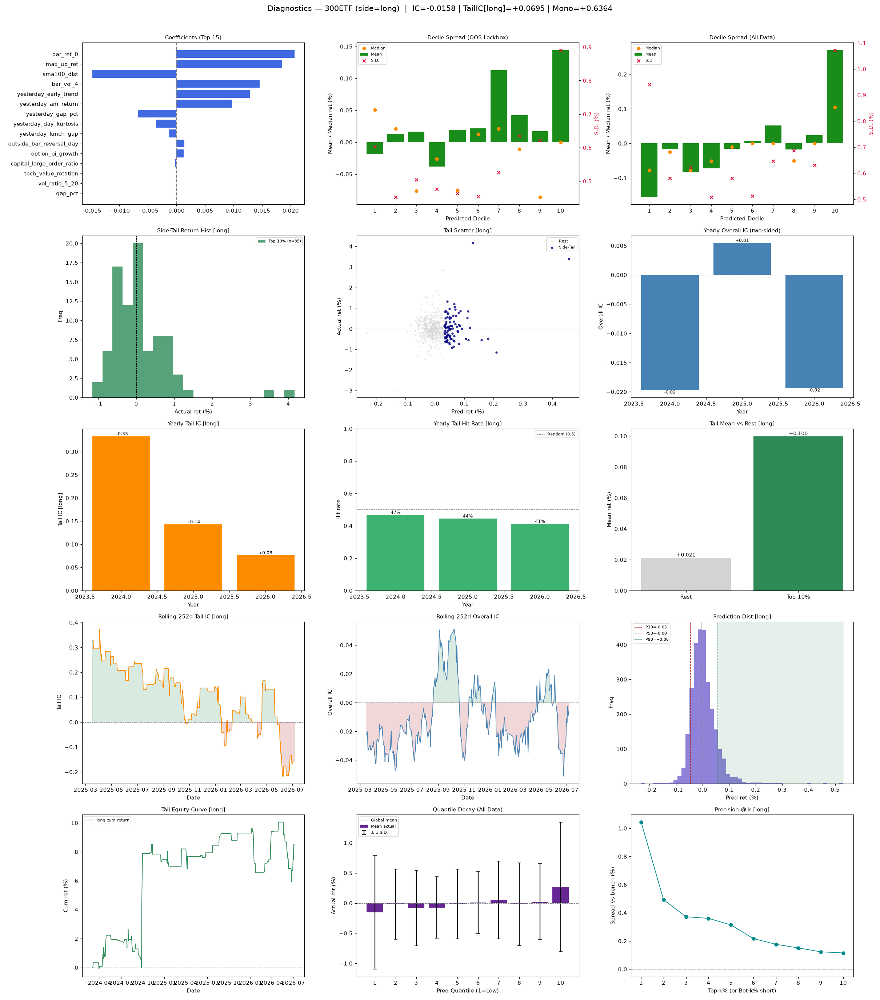

### 300ETF_short_early (300ETF, side=`short`)
- **Selected features**: 16
- **Active features**: 16
- **Active**: `early_vwap_dev`, `outside_bar_reversal_day`, `gap_pct`, `capital_large_order_ratio`, `bar_vol_4`, `vol_ratio_5_20`, `sma100_dist`, `yesterday_day_kurtosis`, `tech_value_rotation`, `yesterday_gap_pct`, `bar_ret_0`, `max_up_ret`, `option_oi_growth`, `yesterday_early_trend`, `yesterday_am_return`, `yesterday_lunch_gap`
- **Stopped by Step 1 (FDR Screening)** (0 features):
  None
- **Stopped by Step 2 (Stability & VIF Pruning)** (198 features):
  

  
Show 198 features

  
  `first_30min_return`, `early_realized_vol`, `early_range`, `early_trend`, `early_momentum`, `first_bar_return`, `first_bar_volume`, `early_skew`, `early_kurtosis`, `bar_ret_1`, `bar_ret_2`, `bar_vol_0`, `bar_vol_5`, `bar_rng_0`, `bar_rng_2`, `bar_rng_3`, `bar_rng_5`, `bar_body_rng_0`, `bar_body_rng_1`, `bar_body_rng_2`, `bar_vwap_dev_0`, `bar_vwap_dev_1`, `bar_vwap_dev_2`, `bar_vwap_dev_3`, `bar_vwap_dev_5`, `num_up_bars`, `max_down_ret`, `cl_pos_in_range`, `body_to_range_ratio`, `total_path_length`, `volume_slope`, `spike_exhaustion_ratio`, `first_bar_sentiment`, `or_fill_ratio`, `close_vs_open_range`, `inside_bar_failure_bull`, `consecutive_higher_highs`, `early_bearish_engulfing_count`, `volume_surge_max`, `volume_concentration`, `volume_trend_intraday`, `volume_acceleration`, `volume_surge_direction`, `pullback_ratio`, `rally_ratio`, `range_expansion_ratio`, `pullback_depth_ratio`, `pullback_depth_max`, `rally_strength_max`, `vwap_slope_intraday`, `volume_weighted_price_position`, `net_volume_flow`, `early_body_momentum`, `late_bar_momentum`, `trend_strength_intraday`, `high_low_sequence_momentum`, `intraday_slope`, `intraday_autocorr`, `opening_momentum_score`, `opening_direction_stability`, `early_trend_hhi`, `session_high_proximity`, `session_low_proximity`, `close_above_open_count`, `open_to_current_return`, `upper_wick_dominance`, `rsi_opening`, `stoch_opening`, `momentum_strength_intraday`, `opening_auction_imbalance`, `intraday_close_position`, `limit_down_proximity_early`, `morning_trend_extrapolated`, `demark_setup_reversal_early`, `failed_breakout_reversal_early`, `early_wavetrend_cross`, `atr_expansion_flag_early`, `volatility_breakout_squeeze`, `early_bid_ask_spread_proxy`, `early_vwap_acceleration`, `early_order_flow_imbalance`, `rbreaker_sell_setup_proximity_early`, `rbreaker_buy_setup_proximity_early`, `skypark_gap_reversal_early`, `turtle_breakout_strength_early`, `macd_hist`, `sma20_dist`, `sma50_dist`, `atr14_norm`, `roc10`, `vol20`, `sma10_dist`, `sma200_dist`, `ema12_dist`, `rsi5`, `rsi21`, `roc5`, `roc20`, `roc60`, `cci14`, `willr14`, `stoch_k`, `stoch_d`, `mfi14`, `aroon_osc`, `vol5`, `vol10`, `vol60`, `vol_ratio_10_60`, `bb_width`, `vol_pk20`, `vol_gk10`, `vol_gk20`, `volume_sma_ratio`, `margin_balance`, `buy_on_margin_value`, `margin_repayment`, `short_balance`, `short_balance_quantity`, `short_sell_quantity`, `short_repayment_quantity`, `total_balance`, `margin_net_buy`, `margin_short_ratio`, `capital_buy_volume`, `capital_buy_value`, `capital_sell_volume`, `capital_sell_value`, `capital_net_value`, `capital_net_ratio`, `northbound_buy`, `northbound_sell`, `northbound_net`, `iv`, `iv_vol_ratio`, `vix`, `vix_vol_ratio`, `vix_iv_spread`, `vix_iv_ratio`, `iv_diff_1d`, `vix_diff_1d`, `yesterday_limit_up_touch`, `limit_up_proximity_day`, `limit_down_proximity_day`, `growth_momentum_ratio`, `high_beta_vol_ratio`, `vix_skew_proxy`, `vix_rolling_percentile_60d`, `iv_corridor_width`, `yesterday_vix_early_drift`, `vix_realized_spread`, `iv_envelope_deviation`, `margin_lever_ratio`, `capital_net_accel`, `northbound_volume_share`, `yesterday_northbound_net_ratio`, `margin_buy_repayment_spread`, `short_sell_cover_spread`, `margin_extreme_rank_252d`, `consecutive_inside_bars_3d`, `wavetrend_osc_day`, `keltner_squeeze_width`, `yesterday_wavetrend_osc`, `yesterday_stoch_rsi_cross`, `cvd_divergence_day`, `yesterday_illiquidity_amihud`, `coppock_curve_day`, `yesterday_range_ratio`, `yesterday_body_ratio`, `yesterday_volume_ratio`, `yesterday_return`, `yesterday_gap`, `yesterday_close_position`, `sma_distance_5d`, `sma_distance_60d`, `volatility_percentile_20d`, `volume_percentile_20d`, `yearly_high_distance`, `yearly_low_distance`, `twenty_gap_bars_regime`, `measured_move_proximity`, `yesterday_pm_return`, `yesterday_first_30min_return`, `yesterday_early_realized_vol`, `yesterday_early_range`, `yesterday_early_momentum`, `yesterday_first_bar_volume`, `yesterday_early_vwap_dev`, `yesterday_day_range`, `yesterday_day_realized_vol`, `yesterday_day_close_pos`, `yesterday_day_pm_am_vol_ratio`, `yesterday_day_vwap_dev`, `yesterday_day_skew`, `yesterday_afternoon_reversal`, `yesterday_pm_am_vol_ratio`, `yesterday_afternoon_momentum`, `yesterday_cvd_close`
  

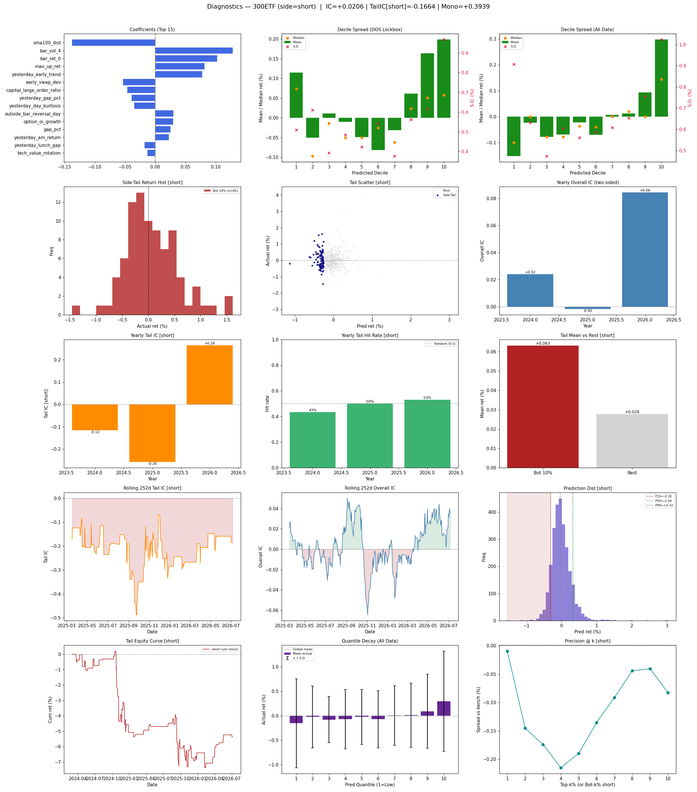

### 500ETF_early (500ETF, side=`single`)
- **Selected features**: 20
- **Active features**: 20
- **Active**: `yesterday_day_realized_vol`, `bar_rng_0`, `bar_rng_3`, `margin_short_ratio`, `volume_sma_ratio`, `bar_vol_4`, `bar_vol_5`, `yesterday_lunch_gap`, `yesterday_gap`, `bar_ret_0`, `max_up_ret`, `yesterday_early_trend`, `bar_vwap_dev_2`, `early_skew`, `sma100_dist`, `margin_buy_repayment_spread`, `gap_pct`, `cvd_divergence_day`, `short_sell_cover_spread`, `yesterday_day_kurtosis`
- **Stopped by Step 1 (FDR Screening)** (0 features):
  None
- **Stopped by Step 2 (Stability & VIF Pruning)** (194 features):
  

  
Show 194 features

  
  `first_30min_return`, `early_realized_vol`, `early_range`, `early_trend`, `early_momentum`, `first_bar_return`, `first_bar_volume`, `early_vwap_dev`, `early_kurtosis`, `bar_ret_1`, `bar_ret_2`, `bar_vol_0`, `bar_rng_2`, `bar_rng_5`, `bar_body_rng_0`, `bar_body_rng_1`, `bar_body_rng_2`, `bar_vwap_dev_0`, `bar_vwap_dev_1`, `bar_vwap_dev_3`, `bar_vwap_dev_5`, `num_up_bars`, `max_down_ret`, `cl_pos_in_range`, `body_to_range_ratio`, `total_path_length`, `volume_slope`, `spike_exhaustion_ratio`, `first_bar_sentiment`, `or_fill_ratio`, `close_vs_open_range`, `inside_bar_failure_bull`, `consecutive_higher_highs`, `early_bearish_engulfing_count`, `volume_surge_max`, `volume_concentration`, `volume_trend_intraday`, `volume_acceleration`, `volume_surge_direction`, `pullback_ratio`, `rally_ratio`, `range_expansion_ratio`, `pullback_depth_ratio`, `pullback_depth_max`, `rally_strength_max`, `vwap_slope_intraday`, `volume_weighted_price_position`, `net_volume_flow`, `early_body_momentum`, `late_bar_momentum`, `trend_strength_intraday`, `high_low_sequence_momentum`, `intraday_slope`, `intraday_autocorr`, `opening_momentum_score`, `opening_direction_stability`, `early_trend_hhi`, `session_high_proximity`, `session_low_proximity`, `close_above_open_count`, `open_to_current_return`, `upper_wick_dominance`, `rsi_opening`, `stoch_opening`, `momentum_strength_intraday`, `opening_auction_imbalance`, `intraday_close_position`, `limit_down_proximity_early`, `morning_trend_extrapolated`, `demark_setup_reversal_early`, `failed_breakout_reversal_early`, `early_wavetrend_cross`, `atr_expansion_flag_early`, `volatility_breakout_squeeze`, `early_bid_ask_spread_proxy`, `early_vwap_acceleration`, `early_order_flow_imbalance`, `rbreaker_sell_setup_proximity_early`, `rbreaker_buy_setup_proximity_early`, `skypark_gap_reversal_early`, `turtle_breakout_strength_early`, `macd_hist`, `sma20_dist`, `sma50_dist`, `atr14_norm`, `roc10`, `vol20`, `sma10_dist`, `sma200_dist`, `ema12_dist`, `rsi5`, `rsi21`, `roc5`, `roc20`, `roc60`, `cci14`, `willr14`, `stoch_k`, `stoch_d`, `mfi14`, `aroon_osc`, `vol5`, `vol10`, `vol60`, `vol_ratio_5_20`, `vol_ratio_10_60`, `bb_width`, `vol_pk20`, `vol_gk10`, `vol_gk20`, `margin_balance`, `buy_on_margin_value`, `margin_repayment`, `short_balance`, `short_balance_quantity`, `short_sell_quantity`, `short_repayment_quantity`, `total_balance`, `margin_net_buy`, `capital_buy_volume`, `capital_buy_value`, `capital_sell_volume`, `capital_sell_value`, `capital_net_value`, `capital_net_ratio`, `northbound_buy`, `northbound_sell`, `northbound_net`, `iv`, `iv_vol_ratio`, `vix`, `vix_vol_ratio`, `vix_iv_spread`, `vix_iv_ratio`, `iv_diff_1d`, `vix_diff_1d`, `tech_value_rotation`, `yesterday_limit_up_touch`, `limit_up_proximity_day`, `limit_down_proximity_day`, `growth_momentum_ratio`, `high_beta_vol_ratio`, `vix_skew_proxy`, `vix_rolling_percentile_60d`, `iv_corridor_width`, `yesterday_vix_early_drift`, `vix_realized_spread`, `option_oi_growth`, `iv_envelope_deviation`, `margin_lever_ratio`, `capital_net_accel`, `northbound_volume_share`, `yesterday_northbound_net_ratio`, `margin_extreme_rank_252d`, `capital_large_order_ratio`, `consecutive_inside_bars_3d`, `outside_bar_reversal_day`, `wavetrend_osc_day`, `keltner_squeeze_width`, `yesterday_wavetrend_osc`, `yesterday_stoch_rsi_cross`, `yesterday_illiquidity_amihud`, `coppock_curve_day`, `yesterday_range_ratio`, `yesterday_body_ratio`, `yesterday_volume_ratio`, `yesterday_return`, `yesterday_close_position`, `sma_distance_5d`, `sma_distance_60d`, `volatility_percentile_20d`, `volume_percentile_20d`, `yearly_high_distance`, `yearly_low_distance`, `twenty_gap_bars_regime`, `measured_move_proximity`, `yesterday_pm_return`, `yesterday_am_return`, `yesterday_gap_pct`, `yesterday_first_30min_return`, `yesterday_early_realized_vol`, `yesterday_early_range`, `yesterday_early_momentum`, `yesterday_first_bar_volume`, `yesterday_early_vwap_dev`, `yesterday_day_range`, `yesterday_day_close_pos`, `yesterday_day_pm_am_vol_ratio`, `yesterday_day_vwap_dev`, `yesterday_day_skew`, `yesterday_afternoon_reversal`, `yesterday_pm_am_vol_ratio`, `yesterday_afternoon_momentum`, `yesterday_cvd_close`
  

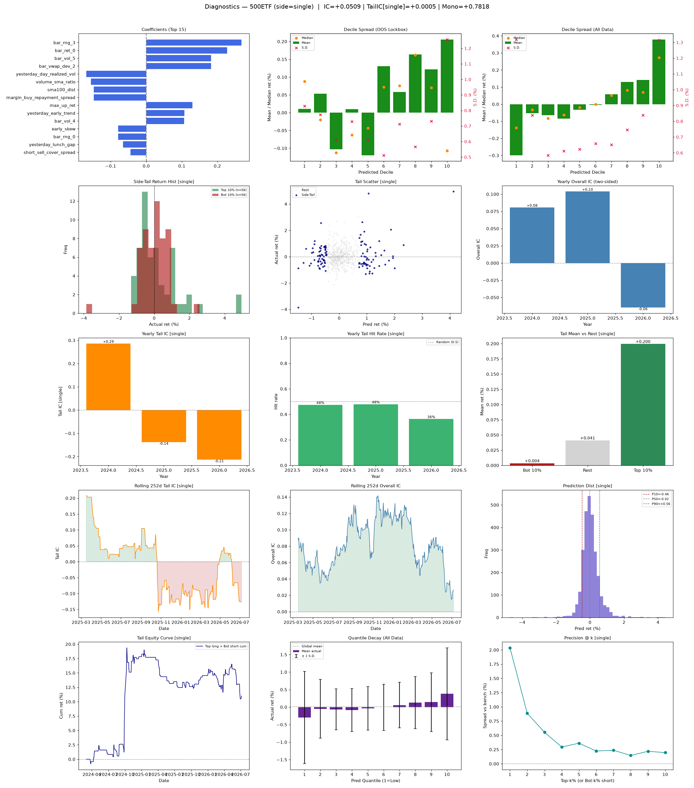

### 500ETF_long_early (500ETF, side=`long`)
- **Selected features**: 20
- **Active features**: 20
- **Active**: `yesterday_day_realized_vol`, `bar_rng_0`, `bar_rng_3`, `margin_short_ratio`, `volume_sma_ratio`, `bar_vol_4`, `bar_vol_5`, `yesterday_lunch_gap`, `yesterday_gap`, `bar_ret_0`, `max_up_ret`, `yesterday_early_trend`, `bar_vwap_dev_2`, `early_skew`, `sma100_dist`, `margin_buy_repayment_spread`, `gap_pct`, `cvd_divergence_day`, `short_sell_cover_spread`, `yesterday_day_kurtosis`
- **Stopped by Step 1 (FDR Screening)** (0 features):
  None
- **Stopped by Step 2 (Stability & VIF Pruning)** (194 features):
  

  
Show 194 features

  
  `first_30min_return`, `early_realized_vol`, `early_range`, `early_trend`, `early_momentum`, `first_bar_return`, `first_bar_volume`, `early_vwap_dev`, `early_kurtosis`, `bar_ret_1`, `bar_ret_2`, `bar_vol_0`, `bar_rng_2`, `bar_rng_5`, `bar_body_rng_0`, `bar_body_rng_1`, `bar_body_rng_2`, `bar_vwap_dev_0`, `bar_vwap_dev_1`, `bar_vwap_dev_3`, `bar_vwap_dev_5`, `num_up_bars`, `max_down_ret`, `cl_pos_in_range`, `body_to_range_ratio`, `total_path_length`, `volume_slope`, `spike_exhaustion_ratio`, `first_bar_sentiment`, `or_fill_ratio`, `close_vs_open_range`, `inside_bar_failure_bull`, `consecutive_higher_highs`, `early_bearish_engulfing_count`, `volume_surge_max`, `volume_concentration`, `volume_trend_intraday`, `volume_acceleration`, `volume_surge_direction`, `pullback_ratio`, `rally_ratio`, `range_expansion_ratio`, `pullback_depth_ratio`, `pullback_depth_max`, `rally_strength_max`, `vwap_slope_intraday`, `volume_weighted_price_position`, `net_volume_flow`, `early_body_momentum`, `late_bar_momentum`, `trend_strength_intraday`, `high_low_sequence_momentum`, `intraday_slope`, `intraday_autocorr`, `opening_momentum_score`, `opening_direction_stability`, `early_trend_hhi`, `session_high_proximity`, `session_low_proximity`, `close_above_open_count`, `open_to_current_return`, `upper_wick_dominance`, `rsi_opening`, `stoch_opening`, `momentum_strength_intraday`, `opening_auction_imbalance`, `intraday_close_position`, `limit_down_proximity_early`, `morning_trend_extrapolated`, `demark_setup_reversal_early`, `failed_breakout_reversal_early`, `early_wavetrend_cross`, `atr_expansion_flag_early`, `volatility_breakout_squeeze`, `early_bid_ask_spread_proxy`, `early_vwap_acceleration`, `early_order_flow_imbalance`, `rbreaker_sell_setup_proximity_early`, `rbreaker_buy_setup_proximity_early`, `skypark_gap_reversal_early`, `turtle_breakout_strength_early`, `macd_hist`, `sma20_dist`, `sma50_dist`, `atr14_norm`, `roc10`, `vol20`, `sma10_dist`, `sma200_dist`, `ema12_dist`, `rsi5`, `rsi21`, `roc5`, `roc20`, `roc60`, `cci14`, `willr14`, `stoch_k`, `stoch_d`, `mfi14`, `aroon_osc`, `vol5`, `vol10`, `vol60`, `vol_ratio_5_20`, `vol_ratio_10_60`, `bb_width`, `vol_pk20`, `vol_gk10`, `vol_gk20`, `margin_balance`, `buy_on_margin_value`, `margin_repayment`, `short_balance`, `short_balance_quantity`, `short_sell_quantity`, `short_repayment_quantity`, `total_balance`, `margin_net_buy`, `capital_buy_volume`, `capital_buy_value`, `capital_sell_volume`, `capital_sell_value`, `capital_net_value`, `capital_net_ratio`, `northbound_buy`, `northbound_sell`, `northbound_net`, `iv`, `iv_vol_ratio`, `vix`, `vix_vol_ratio`, `vix_iv_spread`, `vix_iv_ratio`, `iv_diff_1d`, `vix_diff_1d`, `tech_value_rotation`, `yesterday_limit_up_touch`, `limit_up_proximity_day`, `limit_down_proximity_day`, `growth_momentum_ratio`, `high_beta_vol_ratio`, `vix_skew_proxy`, `vix_rolling_percentile_60d`, `iv_corridor_width`, `yesterday_vix_early_drift`, `vix_realized_spread`, `option_oi_growth`, `iv_envelope_deviation`, `margin_lever_ratio`, `capital_net_accel`, `northbound_volume_share`, `yesterday_northbound_net_ratio`, `margin_extreme_rank_252d`, `capital_large_order_ratio`, `consecutive_inside_bars_3d`, `outside_bar_reversal_day`, `wavetrend_osc_day`, `keltner_squeeze_width`, `yesterday_wavetrend_osc`, `yesterday_stoch_rsi_cross`, `yesterday_illiquidity_amihud`, `coppock_curve_day`, `yesterday_range_ratio`, `yesterday_body_ratio`, `yesterday_volume_ratio`, `yesterday_return`, `yesterday_close_position`, `sma_distance_5d`, `sma_distance_60d`, `volatility_percentile_20d`, `volume_percentile_20d`, `yearly_high_distance`, `yearly_low_distance`, `twenty_gap_bars_regime`, `measured_move_proximity`, `yesterday_pm_return`, `yesterday_am_return`, `yesterday_gap_pct`, `yesterday_first_30min_return`, `yesterday_early_realized_vol`, `yesterday_early_range`, `yesterday_early_momentum`, `yesterday_first_bar_volume`, `yesterday_early_vwap_dev`, `yesterday_day_range`, `yesterday_day_close_pos`, `yesterday_day_pm_am_vol_ratio`, `yesterday_day_vwap_dev`, `yesterday_day_skew`, `yesterday_afternoon_reversal`, `yesterday_pm_am_vol_ratio`, `yesterday_afternoon_momentum`, `yesterday_cvd_close`
  

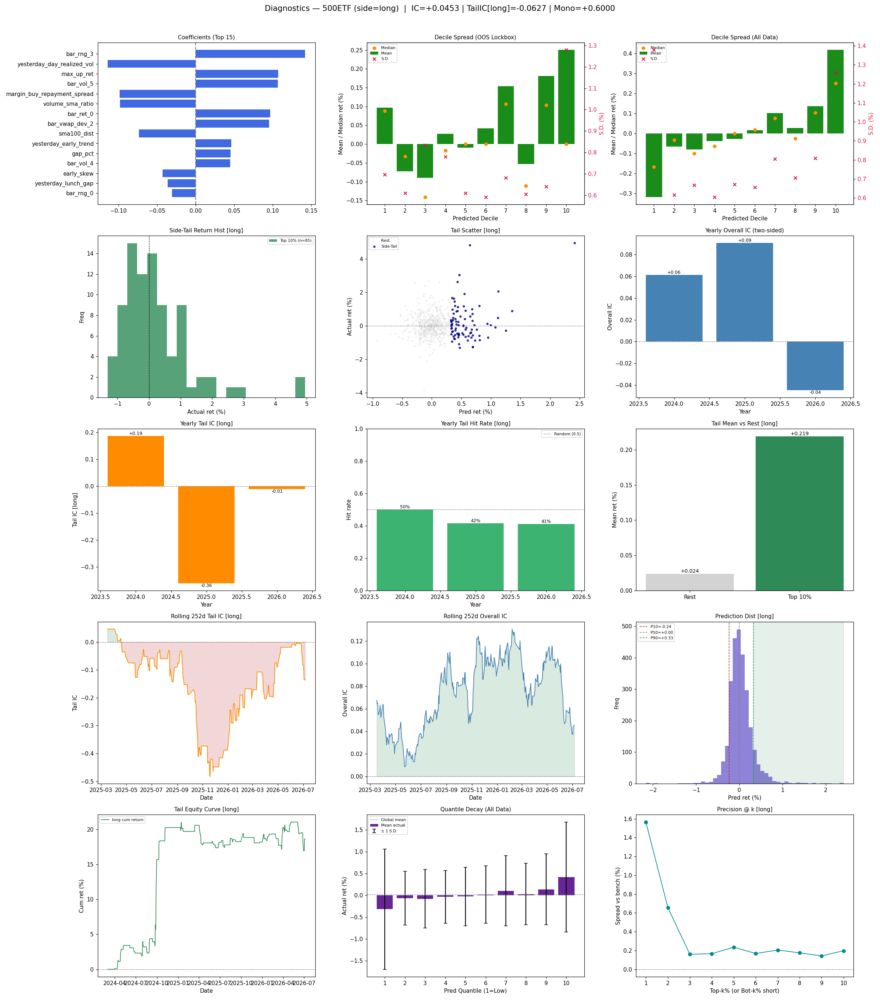

### 500ETF_short_early (500ETF, side=`short`)
- **Selected features**: 20
- **Active features**: 20
- **Active**: `yesterday_day_realized_vol`, `bar_rng_0`, `bar_rng_3`, `margin_short_ratio`, `volume_sma_ratio`, `bar_vol_4`, `bar_vol_5`, `yesterday_lunch_gap`, `yesterday_gap`, `bar_ret_0`, `max_up_ret`, `yesterday_early_trend`, `bar_vwap_dev_2`, `early_skew`, `sma100_dist`, `margin_buy_repayment_spread`, `gap_pct`, `cvd_divergence_day`, `short_sell_cover_spread`, `yesterday_day_kurtosis`
- **Stopped by Step 1 (FDR Screening)** (0 features):
  None
- **Stopped by Step 2 (Stability & VIF Pruning)** (194 features):
  

  
Show 194 features

  
  `first_30min_return`, `early_realized_vol`, `early_range`, `early_trend`, `early_momentum`, `first_bar_return`, `first_bar_volume`, `early_vwap_dev`, `early_kurtosis`, `bar_ret_1`, `bar_ret_2`, `bar_vol_0`, `bar_rng_2`, `bar_rng_5`, `bar_body_rng_0`, `bar_body_rng_1`, `bar_body_rng_2`, `bar_vwap_dev_0`, `bar_vwap_dev_1`, `bar_vwap_dev_3`, `bar_vwap_dev_5`, `num_up_bars`, `max_down_ret`, `cl_pos_in_range`, `body_to_range_ratio`, `total_path_length`, `volume_slope`, `spike_exhaustion_ratio`, `first_bar_sentiment`, `or_fill_ratio`, `close_vs_open_range`, `inside_bar_failure_bull`, `consecutive_higher_highs`, `early_bearish_engulfing_count`, `volume_surge_max`, `volume_concentration`, `volume_trend_intraday`, `volume_acceleration`, `volume_surge_direction`, `pullback_ratio`, `rally_ratio`, `range_expansion_ratio`, `pullback_depth_ratio`, `pullback_depth_max`, `rally_strength_max`, `vwap_slope_intraday`, `volume_weighted_price_position`, `net_volume_flow`, `early_body_momentum`, `late_bar_momentum`, `trend_strength_intraday`, `high_low_sequence_momentum`, `intraday_slope`, `intraday_autocorr`, `opening_momentum_score`, `opening_direction_stability`, `early_trend_hhi`, `session_high_proximity`, `session_low_proximity`, `close_above_open_count`, `open_to_current_return`, `upper_wick_dominance`, `rsi_opening`, `stoch_opening`, `momentum_strength_intraday`, `opening_auction_imbalance`, `intraday_close_position`, `limit_down_proximity_early`, `morning_trend_extrapolated`, `demark_setup_reversal_early`, `failed_breakout_reversal_early`, `early_wavetrend_cross`, `atr_expansion_flag_early`, `volatility_breakout_squeeze`, `early_bid_ask_spread_proxy`, `early_vwap_acceleration`, `early_order_flow_imbalance`, `rbreaker_sell_setup_proximity_early`, `rbreaker_buy_setup_proximity_early`, `skypark_gap_reversal_early`, `turtle_breakout_strength_early`, `macd_hist`, `sma20_dist`, `sma50_dist`, `atr14_norm`, `roc10`, `vol20`, `sma10_dist`, `sma200_dist`, `ema12_dist`, `rsi5`, `rsi21`, `roc5`, `roc20`, `roc60`, `cci14`, `willr14`, `stoch_k`, `stoch_d`, `mfi14`, `aroon_osc`, `vol5`, `vol10`, `vol60`, `vol_ratio_5_20`, `vol_ratio_10_60`, `bb_width`, `vol_pk20`, `vol_gk10`, `vol_gk20`, `margin_balance`, `buy_on_margin_value`, `margin_repayment`, `short_balance`, `short_balance_quantity`, `short_sell_quantity`, `short_repayment_quantity`, `total_balance`, `margin_net_buy`, `capital_buy_volume`, `capital_buy_value`, `capital_sell_volume`, `capital_sell_value`, `capital_net_value`, `capital_net_ratio`, `northbound_buy`, `northbound_sell`, `northbound_net`, `iv`, `iv_vol_ratio`, `vix`, `vix_vol_ratio`, `vix_iv_spread`, `vix_iv_ratio`, `iv_diff_1d`, `vix_diff_1d`, `tech_value_rotation`, `yesterday_limit_up_touch`, `limit_up_proximity_day`, `limit_down_proximity_day`, `growth_momentum_ratio`, `high_beta_vol_ratio`, `vix_skew_proxy`, `vix_rolling_percentile_60d`, `iv_corridor_width`, `yesterday_vix_early_drift`, `vix_realized_spread`, `option_oi_growth`, `iv_envelope_deviation`, `margin_lever_ratio`, `capital_net_accel`, `northbound_volume_share`, `yesterday_northbound_net_ratio`, `margin_extreme_rank_252d`, `capital_large_order_ratio`, `consecutive_inside_bars_3d`, `outside_bar_reversal_day`, `wavetrend_osc_day`, `keltner_squeeze_width`, `yesterday_wavetrend_osc`, `yesterday_stoch_rsi_cross`, `yesterday_illiquidity_amihud`, `coppock_curve_day`, `yesterday_range_ratio`, `yesterday_body_ratio`, `yesterday_volume_ratio`, `yesterday_return`, `yesterday_close_position`, `sma_distance_5d`, `sma_distance_60d`, `volatility_percentile_20d`, `volume_percentile_20d`, `yearly_high_distance`, `yearly_low_distance`, `twenty_gap_bars_regime`, `measured_move_proximity`, `yesterday_pm_return`, `yesterday_am_return`, `yesterday_gap_pct`, `yesterday_first_30min_return`, `yesterday_early_realized_vol`, `yesterday_early_range`, `yesterday_early_momentum`, `yesterday_first_bar_volume`, `yesterday_early_vwap_dev`, `yesterday_day_range`, `yesterday_day_close_pos`, `yesterday_day_pm_am_vol_ratio`, `yesterday_day_vwap_dev`, `yesterday_day_skew`, `yesterday_afternoon_reversal`, `yesterday_pm_am_vol_ratio`, `yesterday_afternoon_momentum`, `yesterday_cvd_close`
  

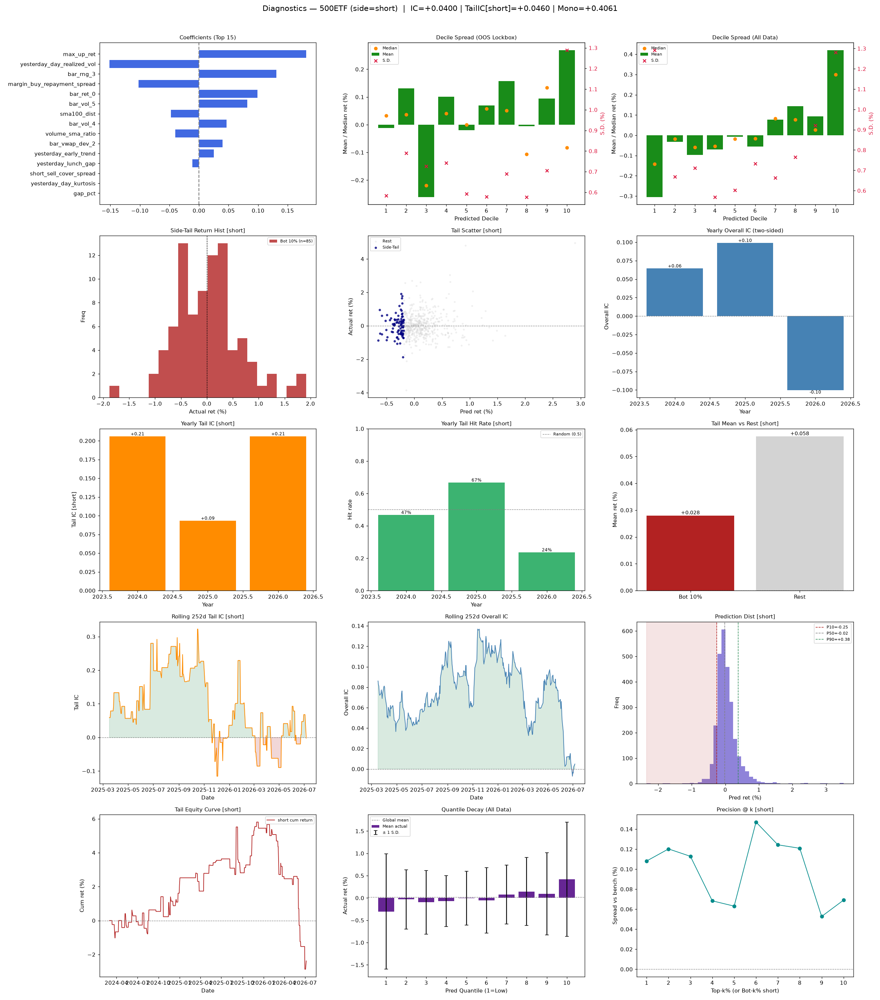

### 588000ETF_early (588000ETF, side=`single`)
- **Selected features**: 15
- **Active features**: 8
- **Active**: `vol60`, `first_bar_return`, `early_skew`, `vol5`, `tech_value_rotation`, `yesterday_body_ratio`, `sma100_dist`, `bar_vol_5`
- **Stopped by Step 1 (FDR Screening)** (0 features):
  None
- **Stopped by Step 2 (Stability & VIF Pruning)** (199 features):
  

  
Show 199 features

  
  `gap_pct`, `first_30min_return`, `early_realized_vol`, `early_range`, `early_trend`, `early_momentum`, `first_bar_volume`, `early_vwap_dev`, `early_kurtosis`, `bar_ret_0`, `bar_ret_1`, `bar_ret_2`, `bar_vol_0`, `bar_vol_4`, `bar_rng_0`, `bar_rng_2`, `bar_rng_3`, `bar_rng_5`, `bar_body_rng_0`, `bar_body_rng_1`, `bar_body_rng_2`, `bar_vwap_dev_0`, `bar_vwap_dev_1`, `bar_vwap_dev_2`, `bar_vwap_dev_3`, `bar_vwap_dev_5`, `num_up_bars`, `max_up_ret`, `max_down_ret`, `cl_pos_in_range`, `body_to_range_ratio`, `total_path_length`, `volume_slope`, `spike_exhaustion_ratio`, `first_bar_sentiment`, `or_fill_ratio`, `close_vs_open_range`, `inside_bar_failure_bull`, `consecutive_higher_highs`, `early_bearish_engulfing_count`, `volume_surge_max`, `volume_concentration`, `volume_trend_intraday`, `volume_acceleration`, `volume_surge_direction`, `pullback_ratio`, `rally_ratio`, `range_expansion_ratio`, `pullback_depth_ratio`, `pullback_depth_max`, `rally_strength_max`, `vwap_slope_intraday`, `volume_weighted_price_position`, `net_volume_flow`, `early_body_momentum`, `late_bar_momentum`, `trend_strength_intraday`, `high_low_sequence_momentum`, `intraday_slope`, `intraday_autocorr`, `opening_momentum_score`, `opening_direction_stability`, `early_trend_hhi`, `session_high_proximity`, `session_low_proximity`, `close_above_open_count`, `open_to_current_return`, `upper_wick_dominance`, `rsi_opening`, `stoch_opening`, `momentum_strength_intraday`, `opening_auction_imbalance`, `intraday_close_position`, `limit_down_proximity_early`, `morning_trend_extrapolated`, `demark_setup_reversal_early`, `failed_breakout_reversal_early`, `early_wavetrend_cross`, `atr_expansion_flag_early`, `volatility_breakout_squeeze`, `early_bid_ask_spread_proxy`, `early_vwap_acceleration`, `early_order_flow_imbalance`, `rbreaker_sell_setup_proximity_early`, `rbreaker_buy_setup_proximity_early`, `skypark_gap_reversal_early`, `turtle_breakout_strength_early`, `macd_hist`, `sma20_dist`, `sma50_dist`, `atr14_norm`, `roc10`, `vol20`, `sma10_dist`, `sma200_dist`, `ema12_dist`, `rsi5`, `rsi21`, `roc20`, `roc60`, `cci14`, `willr14`, `stoch_k`, `stoch_d`, `mfi14`, `aroon_osc`, `vol10`, `bb_width`, `vol_pk20`, `vol_gk10`, `vol_gk20`, `volume_sma_ratio`, `margin_balance`, `buy_on_margin_value`, `margin_repayment`, `short_balance`, `short_balance_quantity`, `short_sell_quantity`, `short_repayment_quantity`, `total_balance`, `margin_net_buy`, `margin_short_ratio`, `capital_buy_volume`, `capital_buy_value`, `capital_sell_volume`, `capital_sell_value`, `capital_net_value`, `capital_net_ratio`, `northbound_buy`, `northbound_sell`, `northbound_net`, `iv`, `iv_vol_ratio`, `vix`, `vix_vol_ratio`, `vix_iv_spread`, `vix_iv_ratio`, `iv_diff_1d`, `vix_diff_1d`, `yesterday_limit_up_touch`, `limit_up_proximity_day`, `limit_down_proximity_day`, `growth_momentum_ratio`, `high_beta_vol_ratio`, `vix_skew_proxy`, `vix_rolling_percentile_60d`, `iv_corridor_width`, `yesterday_vix_early_drift`, `vix_realized_spread`, `option_oi_growth`, `iv_envelope_deviation`, `margin_lever_ratio`, `northbound_volume_share`, `yesterday_northbound_net_ratio`, `margin_buy_repayment_spread`, `short_sell_cover_spread`, `capital_large_order_ratio`, `outside_bar_reversal_day`, `wavetrend_osc_day`, `keltner_squeeze_width`, `yesterday_wavetrend_osc`, `yesterday_stoch_rsi_cross`, `cvd_divergence_day`, `yesterday_illiquidity_amihud`, `coppock_curve_day`, `yesterday_range_ratio`, `yesterday_volume_ratio`, `yesterday_return`, `yesterday_gap`, `yesterday_close_position`, `sma_distance_5d`, `sma_distance_60d`, `volatility_percentile_20d`, `volume_percentile_20d`, `yearly_high_distance`, `yearly_low_distance`, `twenty_gap_bars_regime`, `measured_move_proximity`, `yesterday_pm_return`, `yesterday_am_return`, `yesterday_gap_pct`, `yesterday_first_30min_return`, `yesterday_early_realized_vol`, `yesterday_early_range`, `yesterday_early_trend`, `yesterday_early_momentum`, `yesterday_first_bar_volume`, `yesterday_early_vwap_dev`, `yesterday_day_range`, `yesterday_day_realized_vol`, `yesterday_day_close_pos`, `yesterday_day_pm_am_vol_ratio`, `yesterday_day_vwap_dev`, `yesterday_day_skew`, `yesterday_afternoon_reversal`, `yesterday_lunch_gap`, `yesterday_pm_am_vol_ratio`, `yesterday_afternoon_momentum`, `yesterday_cvd_close`
  

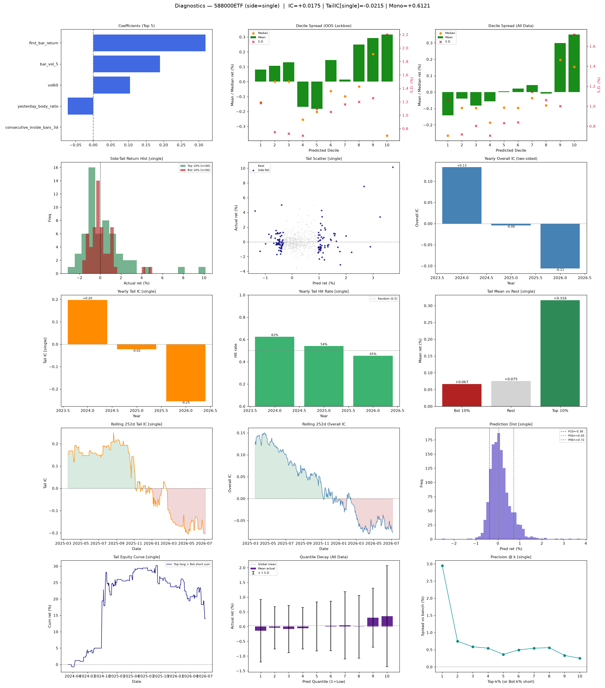

### 588000ETF_long_early (588000ETF, side=`long`)
- **Selected features**: 24
- **Active features**: 24
- **Active**: `bar_rng_3`, `bar_rng_2`, `vol60`, `first_bar_return`, `early_skew`, `bar_ret_1`, `vol5`, `vol_ratio_5_20`, `vol_ratio_10_60`, `yesterday_day_kurtosis`, `tech_value_rotation`, `consecutive_inside_bars_3d`, `yesterday_afternoon_momentum`, `short_sell_cover_spread`, `yesterday_day_pm_am_vol_ratio`, `yesterday_illiquidity_amihud`, `yesterday_body_ratio`, `margin_extreme_rank_252d`, `sma100_dist`, `bar_vol_5`, `vix_diff_1d`, `capital_net_accel`, `roc5`, `measured_move_proximity`
- **Stopped by Step 1 (FDR Screening)** (0 features):
  None
- **Stopped by Step 2 (Stability & VIF Pruning)** (190 features):
  

  
Show 190 features

  
  `gap_pct`, `first_30min_return`, `early_realized_vol`, `early_range`, `early_trend`, `early_momentum`, `first_bar_volume`, `early_vwap_dev`, `early_kurtosis`, `bar_ret_0`, `bar_ret_2`, `bar_vol_0`, `bar_vol_4`, `bar_rng_0`, `bar_rng_5`, `bar_body_rng_0`, `bar_body_rng_1`, `bar_body_rng_2`, `bar_vwap_dev_0`, `bar_vwap_dev_1`, `bar_vwap_dev_2`, `bar_vwap_dev_3`, `bar_vwap_dev_5`, `num_up_bars`, `max_up_ret`, `max_down_ret`, `cl_pos_in_range`, `body_to_range_ratio`, `total_path_length`, `volume_slope`, `spike_exhaustion_ratio`, `first_bar_sentiment`, `or_fill_ratio`, `close_vs_open_range`, `inside_bar_failure_bull`, `consecutive_higher_highs`, `early_bearish_engulfing_count`, `volume_surge_max`, `volume_concentration`, `volume_trend_intraday`, `volume_acceleration`, `volume_surge_direction`, `pullback_ratio`, `rally_ratio`, `range_expansion_ratio`, `pullback_depth_ratio`, `pullback_depth_max`, `rally_strength_max`, `vwap_slope_intraday`, `volume_weighted_price_position`, `net_volume_flow`, `early_body_momentum`, `late_bar_momentum`, `trend_strength_intraday`, `high_low_sequence_momentum`, `intraday_slope`, `intraday_autocorr`, `opening_momentum_score`, `opening_direction_stability`, `early_trend_hhi`, `session_high_proximity`, `session_low_proximity`, `close_above_open_count`, `open_to_current_return`, `upper_wick_dominance`, `rsi_opening`, `stoch_opening`, `momentum_strength_intraday`, `opening_auction_imbalance`, `intraday_close_position`, `limit_down_proximity_early`, `morning_trend_extrapolated`, `demark_setup_reversal_early`, `failed_breakout_reversal_early`, `early_wavetrend_cross`, `atr_expansion_flag_early`, `volatility_breakout_squeeze`, `early_bid_ask_spread_proxy`, `early_vwap_acceleration`, `early_order_flow_imbalance`, `rbreaker_sell_setup_proximity_early`, `rbreaker_buy_setup_proximity_early`, `skypark_gap_reversal_early`, `turtle_breakout_strength_early`, `macd_hist`, `sma20_dist`, `sma50_dist`, `atr14_norm`, `roc10`, `vol20`, `sma10_dist`, `sma200_dist`, `ema12_dist`, `rsi5`, `rsi21`, `roc20`, `roc60`, `cci14`, `willr14`, `stoch_k`, `stoch_d`, `mfi14`, `aroon_osc`, `vol10`, `bb_width`, `vol_pk20`, `vol_gk10`, `vol_gk20`, `volume_sma_ratio`, `margin_balance`, `buy_on_margin_value`, `margin_repayment`, `short_balance`, `short_balance_quantity`, `short_sell_quantity`, `short_repayment_quantity`, `total_balance`, `margin_net_buy`, `margin_short_ratio`, `capital_buy_volume`, `capital_buy_value`, `capital_sell_volume`, `capital_sell_value`, `capital_net_value`, `capital_net_ratio`, `northbound_buy`, `northbound_sell`, `northbound_net`, `iv`, `iv_vol_ratio`, `vix`, `vix_vol_ratio`, `vix_iv_spread`, `vix_iv_ratio`, `iv_diff_1d`, `yesterday_limit_up_touch`, `limit_up_proximity_day`, `limit_down_proximity_day`, `growth_momentum_ratio`, `high_beta_vol_ratio`, `vix_skew_proxy`, `vix_rolling_percentile_60d`, `iv_corridor_width`, `yesterday_vix_early_drift`, `vix_realized_spread`, `option_oi_growth`, `iv_envelope_deviation`, `margin_lever_ratio`, `northbound_volume_share`, `yesterday_northbound_net_ratio`, `margin_buy_repayment_spread`, `capital_large_order_ratio`, `outside_bar_reversal_day`, `wavetrend_osc_day`, `keltner_squeeze_width`, `yesterday_wavetrend_osc`, `yesterday_stoch_rsi_cross`, `cvd_divergence_day`, `coppock_curve_day`, `yesterday_range_ratio`, `yesterday_volume_ratio`, `yesterday_return`, `yesterday_gap`, `yesterday_close_position`, `sma_distance_5d`, `sma_distance_60d`, `volatility_percentile_20d`, `volume_percentile_20d`, `yearly_high_distance`, `yearly_low_distance`, `twenty_gap_bars_regime`, `yesterday_pm_return`, `yesterday_am_return`, `yesterday_gap_pct`, `yesterday_first_30min_return`, `yesterday_early_realized_vol`, `yesterday_early_range`, `yesterday_early_trend`, `yesterday_early_momentum`, `yesterday_first_bar_volume`, `yesterday_early_vwap_dev`, `yesterday_day_range`, `yesterday_day_realized_vol`, `yesterday_day_close_pos`, `yesterday_day_vwap_dev`, `yesterday_day_skew`, `yesterday_afternoon_reversal`, `yesterday_lunch_gap`, `yesterday_pm_am_vol_ratio`, `yesterday_cvd_close`
  

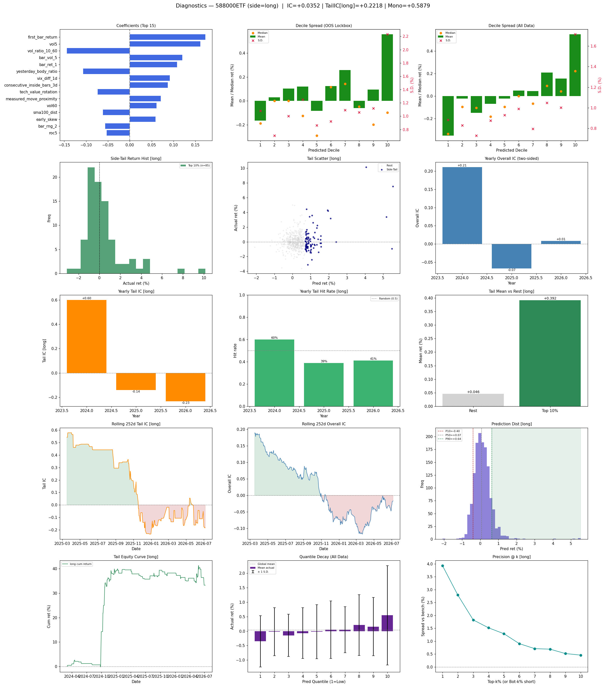

### 588000ETF_short_early (588000ETF, side=`short`)
- **Selected features**: 24
- **Active features**: 23
- **Active**: `bar_rng_3`, `bar_rng_2`, `vol60`, `first_bar_return`, `early_skew`, `bar_ret_1`, `vol5`, `vol_ratio_5_20`, `vol_ratio_10_60`, `yesterday_day_kurtosis`, `tech_value_rotation`, `consecutive_inside_bars_3d`, `yesterday_afternoon_momentum`, `short_sell_cover_spread`, `yesterday_day_pm_am_vol_ratio`, `yesterday_illiquidity_amihud`, `yesterday_body_ratio`, `margin_extreme_rank_252d`, `sma100_dist`, `bar_vol_5`, `vix_diff_1d`, `capital_net_accel`, `measured_move_proximity`
- **Stopped by Step 1 (FDR Screening)** (0 features):
  None
- **Stopped by Step 2 (Stability & VIF Pruning)** (190 features):
  

  
Show 190 features

  
  `gap_pct`, `first_30min_return`, `early_realized_vol`, `early_range`, `early_trend`, `early_momentum`, `first_bar_volume`, `early_vwap_dev`, `early_kurtosis`, `bar_ret_0`, `bar_ret_2`, `bar_vol_0`, `bar_vol_4`, `bar_rng_0`, `bar_rng_5`, `bar_body_rng_0`, `bar_body_rng_1`, `bar_body_rng_2`, `bar_vwap_dev_0`, `bar_vwap_dev_1`, `bar_vwap_dev_2`, `bar_vwap_dev_3`, `bar_vwap_dev_5`, `num_up_bars`, `max_up_ret`, `max_down_ret`, `cl_pos_in_range`, `body_to_range_ratio`, `total_path_length`, `volume_slope`, `spike_exhaustion_ratio`, `first_bar_sentiment`, `or_fill_ratio`, `close_vs_open_range`, `inside_bar_failure_bull`, `consecutive_higher_highs`, `early_bearish_engulfing_count`, `volume_surge_max`, `volume_concentration`, `volume_trend_intraday`, `volume_acceleration`, `volume_surge_direction`, `pullback_ratio`, `rally_ratio`, `range_expansion_ratio`, `pullback_depth_ratio`, `pullback_depth_max`, `rally_strength_max`, `vwap_slope_intraday`, `volume_weighted_price_position`, `net_volume_flow`, `early_body_momentum`, `late_bar_momentum`, `trend_strength_intraday`, `high_low_sequence_momentum`, `intraday_slope`, `intraday_autocorr`, `opening_momentum_score`, `opening_direction_stability`, `early_trend_hhi`, `session_high_proximity`, `session_low_proximity`, `close_above_open_count`, `open_to_current_return`, `upper_wick_dominance`, `rsi_opening`, `stoch_opening`, `momentum_strength_intraday`, `opening_auction_imbalance`, `intraday_close_position`, `limit_down_proximity_early`, `morning_trend_extrapolated`, `demark_setup_reversal_early`, `failed_breakout_reversal_early`, `early_wavetrend_cross`, `atr_expansion_flag_early`, `volatility_breakout_squeeze`, `early_bid_ask_spread_proxy`, `early_vwap_acceleration`, `early_order_flow_imbalance`, `rbreaker_sell_setup_proximity_early`, `rbreaker_buy_setup_proximity_early`, `skypark_gap_reversal_early`, `turtle_breakout_strength_early`, `macd_hist`, `sma20_dist`, `sma50_dist`, `atr14_norm`, `roc10`, `vol20`, `sma10_dist`, `sma200_dist`, `ema12_dist`, `rsi5`, `rsi21`, `roc20`, `roc60`, `cci14`, `willr14`, `stoch_k`, `stoch_d`, `mfi14`, `aroon_osc`, `vol10`, `bb_width`, `vol_pk20`, `vol_gk10`, `vol_gk20`, `volume_sma_ratio`, `margin_balance`, `buy_on_margin_value`, `margin_repayment`, `short_balance`, `short_balance_quantity`, `short_sell_quantity`, `short_repayment_quantity`, `total_balance`, `margin_net_buy`, `margin_short_ratio`, `capital_buy_volume`, `capital_buy_value`, `capital_sell_volume`, `capital_sell_value`, `capital_net_value`, `capital_net_ratio`, `northbound_buy`, `northbound_sell`, `northbound_net`, `iv`, `iv_vol_ratio`, `vix`, `vix_vol_ratio`, `vix_iv_spread`, `vix_iv_ratio`, `iv_diff_1d`, `yesterday_limit_up_touch`, `limit_up_proximity_day`, `limit_down_proximity_day`, `growth_momentum_ratio`, `high_beta_vol_ratio`, `vix_skew_proxy`, `vix_rolling_percentile_60d`, `iv_corridor_width`, `yesterday_vix_early_drift`, `vix_realized_spread`, `option_oi_growth`, `iv_envelope_deviation`, `margin_lever_ratio`, `northbound_volume_share`, `yesterday_northbound_net_ratio`, `margin_buy_repayment_spread`, `capital_large_order_ratio`, `outside_bar_reversal_day`, `wavetrend_osc_day`, `keltner_squeeze_width`, `yesterday_wavetrend_osc`, `yesterday_stoch_rsi_cross`, `cvd_divergence_day`, `coppock_curve_day`, `yesterday_range_ratio`, `yesterday_volume_ratio`, `yesterday_return`, `yesterday_gap`, `yesterday_close_position`, `sma_distance_5d`, `sma_distance_60d`, `volatility_percentile_20d`, `volume_percentile_20d`, `yearly_high_distance`, `yearly_low_distance`, `twenty_gap_bars_regime`, `yesterday_pm_return`, `yesterday_am_return`, `yesterday_gap_pct`, `yesterday_first_30min_return`, `yesterday_early_realized_vol`, `yesterday_early_range`, `yesterday_early_trend`, `yesterday_early_momentum`, `yesterday_first_bar_volume`, `yesterday_early_vwap_dev`, `yesterday_day_range`, `yesterday_day_realized_vol`, `yesterday_day_close_pos`, `yesterday_day_vwap_dev`, `yesterday_day_skew`, `yesterday_afternoon_reversal`, `yesterday_lunch_gap`, `yesterday_pm_am_vol_ratio`, `yesterday_cvd_close`
  

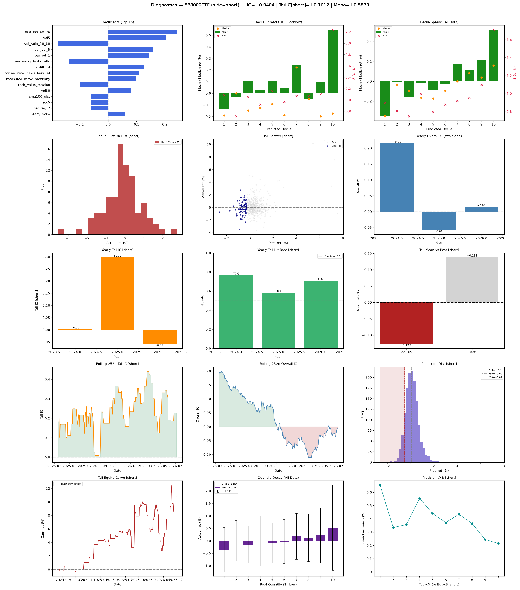

### 159915ETF_early (159915ETF, side=`single`)
- **Selected features**: 21
- **Active features**: 21
- **Active**: `yesterday_early_momentum`, `northbound_net`, `margin_extreme_rank_252d`, `yesterday_early_realized_vol`, `yesterday_day_range`, `bar_rng_3`, `bar_ret_0`, `num_up_bars`, `margin_buy_repayment_spread`, `capital_net_ratio`, `yesterday_lunch_gap`, `bar_vol_4`, `bar_vol_5`, `volume_sma_ratio`, `tech_value_rotation`, `macd_hist`, `sma_distance_5d`, `yesterday_illiquidity_amihud`, `early_kurtosis`, `sma100_dist`, `gap_pct`
- **Stopped by Step 1 (FDR Screening)** (0 features):
  None
- **Stopped by Step 2 (Stability & VIF Pruning)** (193 features):
  

  
Show 193 features

  
  `first_30min_return`, `early_realized_vol`, `early_range`, `early_trend`, `early_momentum`, `first_bar_return`, `first_bar_volume`, `early_vwap_dev`, `early_skew`, `bar_ret_1`, `bar_ret_2`, `bar_vol_0`, `bar_rng_0`, `bar_rng_2`, `bar_rng_5`, `bar_body_rng_0`, `bar_body_rng_1`, `bar_body_rng_2`, `bar_vwap_dev_0`, `bar_vwap_dev_1`, `bar_vwap_dev_2`, `bar_vwap_dev_3`, `bar_vwap_dev_5`, `max_up_ret`, `max_down_ret`, `cl_pos_in_range`, `body_to_range_ratio`, `total_path_length`, `volume_slope`, `spike_exhaustion_ratio`, `first_bar_sentiment`, `or_fill_ratio`, `close_vs_open_range`, `inside_bar_failure_bull`, `consecutive_higher_highs`, `early_bearish_engulfing_count`, `volume_surge_max`, `volume_concentration`, `volume_trend_intraday`, `volume_acceleration`, `volume_surge_direction`, `pullback_ratio`, `rally_ratio`, `range_expansion_ratio`, `pullback_depth_ratio`, `pullback_depth_max`, `rally_strength_max`, `vwap_slope_intraday`, `volume_weighted_price_position`, `net_volume_flow`, `early_body_momentum`, `late_bar_momentum`, `trend_strength_intraday`, `high_low_sequence_momentum`, `intraday_slope`, `intraday_autocorr`, `opening_momentum_score`, `opening_direction_stability`, `early_trend_hhi`, `session_high_proximity`, `session_low_proximity`, `close_above_open_count`, `open_to_current_return`, `upper_wick_dominance`, `rsi_opening`, `stoch_opening`, `momentum_strength_intraday`, `opening_auction_imbalance`, `intraday_close_position`, `limit_down_proximity_early`, `morning_trend_extrapolated`, `demark_setup_reversal_early`, `failed_breakout_reversal_early`, `early_wavetrend_cross`, `atr_expansion_flag_early`, `volatility_breakout_squeeze`, `early_bid_ask_spread_proxy`, `early_vwap_acceleration`, `early_order_flow_imbalance`, `rbreaker_sell_setup_proximity_early`, `rbreaker_buy_setup_proximity_early`, `skypark_gap_reversal_early`, `turtle_breakout_strength_early`, `sma20_dist`, `sma50_dist`, `atr14_norm`, `roc10`, `vol20`, `sma10_dist`, `sma200_dist`, `ema12_dist`, `rsi5`, `rsi21`, `roc5`, `roc20`, `roc60`, `cci14`, `willr14`, `stoch_k`, `stoch_d`, `mfi14`, `aroon_osc`, `vol5`, `vol10`, `vol60`, `vol_ratio_5_20`, `vol_ratio_10_60`, `bb_width`, `vol_pk20`, `vol_gk10`, `vol_gk20`, `margin_balance`, `buy_on_margin_value`, `margin_repayment`, `short_balance`, `short_balance_quantity`, `short_sell_quantity`, `short_repayment_quantity`, `total_balance`, `margin_net_buy`, `margin_short_ratio`, `capital_buy_volume`, `capital_buy_value`, `capital_sell_volume`, `capital_sell_value`, `capital_net_value`, `northbound_buy`, `northbound_sell`, `iv`, `iv_vol_ratio`, `vix`, `vix_vol_ratio`, `vix_iv_spread`, `vix_iv_ratio`, `iv_diff_1d`, `vix_diff_1d`, `yesterday_limit_up_touch`, `limit_up_proximity_day`, `limit_down_proximity_day`, `growth_momentum_ratio`, `high_beta_vol_ratio`, `vix_skew_proxy`, `vix_rolling_percentile_60d`, `iv_corridor_width`, `yesterday_vix_early_drift`, `vix_realized_spread`, `option_oi_growth`, `iv_envelope_deviation`, `margin_lever_ratio`, `capital_net_accel`, `northbound_volume_share`, `yesterday_northbound_net_ratio`, `short_sell_cover_spread`, `capital_large_order_ratio`, `consecutive_inside_bars_3d`, `outside_bar_reversal_day`, `wavetrend_osc_day`, `keltner_squeeze_width`, `yesterday_wavetrend_osc`, `yesterday_stoch_rsi_cross`, `cvd_divergence_day`, `coppock_curve_day`, `yesterday_range_ratio`, `yesterday_body_ratio`, `yesterday_volume_ratio`, `yesterday_return`, `yesterday_gap`, `yesterday_close_position`, `sma_distance_60d`, `volatility_percentile_20d`, `volume_percentile_20d`, `yearly_high_distance`, `yearly_low_distance`, `twenty_gap_bars_regime`, `measured_move_proximity`, `yesterday_pm_return`, `yesterday_am_return`, `yesterday_gap_pct`, `yesterday_first_30min_return`, `yesterday_early_range`, `yesterday_early_trend`, `yesterday_first_bar_volume`, `yesterday_early_vwap_dev`, `yesterday_day_realized_vol`, `yesterday_day_close_pos`, `yesterday_day_pm_am_vol_ratio`, `yesterday_day_vwap_dev`, `yesterday_day_skew`, `yesterday_day_kurtosis`, `yesterday_afternoon_reversal`, `yesterday_pm_am_vol_ratio`, `yesterday_afternoon_momentum`, `yesterday_cvd_close`
  

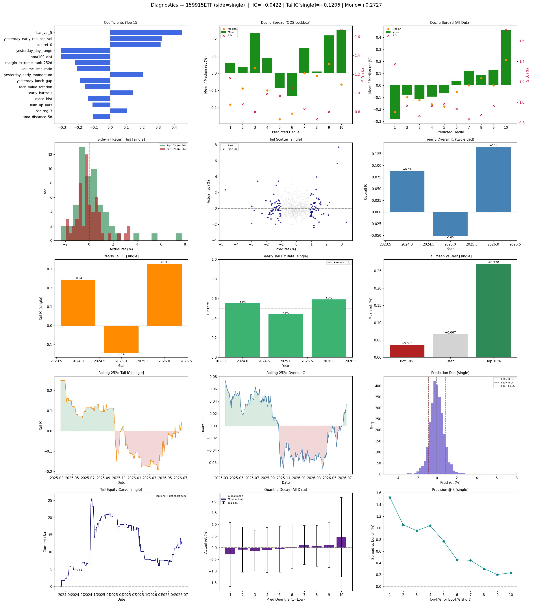

### 159915ETF_long_early (159915ETF, side=`long`)
- **Selected features**: 21
- **Active features**: 21
- **Active**: `yesterday_early_momentum`, `northbound_net`, `margin_extreme_rank_252d`, `yesterday_early_realized_vol`, `yesterday_day_range`, `bar_rng_3`, `bar_ret_0`, `num_up_bars`, `margin_buy_repayment_spread`, `capital_net_ratio`, `yesterday_lunch_gap`, `bar_vol_4`, `bar_vol_5`, `volume_sma_ratio`, `tech_value_rotation`, `macd_hist`, `sma_distance_5d`, `yesterday_illiquidity_amihud`, `early_kurtosis`, `sma100_dist`, `gap_pct`
- **Stopped by Step 1 (FDR Screening)** (0 features):
  None
- **Stopped by Step 2 (Stability & VIF Pruning)** (193 features):
  

  
Show 193 features

  
  `first_30min_return`, `early_realized_vol`, `early_range`, `early_trend`, `early_momentum`, `first_bar_return`, `first_bar_volume`, `early_vwap_dev`, `early_skew`, `bar_ret_1`, `bar_ret_2`, `bar_vol_0`, `bar_rng_0`, `bar_rng_2`, `bar_rng_5`, `bar_body_rng_0`, `bar_body_rng_1`, `bar_body_rng_2`, `bar_vwap_dev_0`, `bar_vwap_dev_1`, `bar_vwap_dev_2`, `bar_vwap_dev_3`, `bar_vwap_dev_5`, `max_up_ret`, `max_down_ret`, `cl_pos_in_range`, `body_to_range_ratio`, `total_path_length`, `volume_slope`, `spike_exhaustion_ratio`, `first_bar_sentiment`, `or_fill_ratio`, `close_vs_open_range`, `inside_bar_failure_bull`, `consecutive_higher_highs`, `early_bearish_engulfing_count`, `volume_surge_max`, `volume_concentration`, `volume_trend_intraday`, `volume_acceleration`, `volume_surge_direction`, `pullback_ratio`, `rally_ratio`, `range_expansion_ratio`, `pullback_depth_ratio`, `pullback_depth_max`, `rally_strength_max`, `vwap_slope_intraday`, `volume_weighted_price_position`, `net_volume_flow`, `early_body_momentum`, `late_bar_momentum`, `trend_strength_intraday`, `high_low_sequence_momentum`, `intraday_slope`, `intraday_autocorr`, `opening_momentum_score`, `opening_direction_stability`, `early_trend_hhi`, `session_high_proximity`, `session_low_proximity`, `close_above_open_count`, `open_to_current_return`, `upper_wick_dominance`, `rsi_opening`, `stoch_opening`, `momentum_strength_intraday`, `opening_auction_imbalance`, `intraday_close_position`, `limit_down_proximity_early`, `morning_trend_extrapolated`, `demark_setup_reversal_early`, `failed_breakout_reversal_early`, `early_wavetrend_cross`, `atr_expansion_flag_early`, `volatility_breakout_squeeze`, `early_bid_ask_spread_proxy`, `early_vwap_acceleration`, `early_order_flow_imbalance`, `rbreaker_sell_setup_proximity_early`, `rbreaker_buy_setup_proximity_early`, `skypark_gap_reversal_early`, `turtle_breakout_strength_early`, `sma20_dist`, `sma50_dist`, `atr14_norm`, `roc10`, `vol20`, `sma10_dist`, `sma200_dist`, `ema12_dist`, `rsi5`, `rsi21`, `roc5`, `roc20`, `roc60`, `cci14`, `willr14`, `stoch_k`, `stoch_d`, `mfi14`, `aroon_osc`, `vol5`, `vol10`, `vol60`, `vol_ratio_5_20`, `vol_ratio_10_60`, `bb_width`, `vol_pk20`, `vol_gk10`, `vol_gk20`, `margin_balance`, `buy_on_margin_value`, `margin_repayment`, `short_balance`, `short_balance_quantity`, `short_sell_quantity`, `short_repayment_quantity`, `total_balance`, `margin_net_buy`, `margin_short_ratio`, `capital_buy_volume`, `capital_buy_value`, `capital_sell_volume`, `capital_sell_value`, `capital_net_value`, `northbound_buy`, `northbound_sell`, `iv`, `iv_vol_ratio`, `vix`, `vix_vol_ratio`, `vix_iv_spread`, `vix_iv_ratio`, `iv_diff_1d`, `vix_diff_1d`, `yesterday_limit_up_touch`, `limit_up_proximity_day`, `limit_down_proximity_day`, `growth_momentum_ratio`, `high_beta_vol_ratio`, `vix_skew_proxy`, `vix_rolling_percentile_60d`, `iv_corridor_width`, `yesterday_vix_early_drift`, `vix_realized_spread`, `option_oi_growth`, `iv_envelope_deviation`, `margin_lever_ratio`, `capital_net_accel`, `northbound_volume_share`, `yesterday_northbound_net_ratio`, `short_sell_cover_spread`, `capital_large_order_ratio`, `consecutive_inside_bars_3d`, `outside_bar_reversal_day`, `wavetrend_osc_day`, `keltner_squeeze_width`, `yesterday_wavetrend_osc`, `yesterday_stoch_rsi_cross`, `cvd_divergence_day`, `coppock_curve_day`, `yesterday_range_ratio`, `yesterday_body_ratio`, `yesterday_volume_ratio`, `yesterday_return`, `yesterday_gap`, `yesterday_close_position`, `sma_distance_60d`, `volatility_percentile_20d`, `volume_percentile_20d`, `yearly_high_distance`, `yearly_low_distance`, `twenty_gap_bars_regime`, `measured_move_proximity`, `yesterday_pm_return`, `yesterday_am_return`, `yesterday_gap_pct`, `yesterday_first_30min_return`, `yesterday_early_range`, `yesterday_early_trend`, `yesterday_first_bar_volume`, `yesterday_early_vwap_dev`, `yesterday_day_realized_vol`, `yesterday_day_close_pos`, `yesterday_day_pm_am_vol_ratio`, `yesterday_day_vwap_dev`, `yesterday_day_skew`, `yesterday_day_kurtosis`, `yesterday_afternoon_reversal`, `yesterday_pm_am_vol_ratio`, `yesterday_afternoon_momentum`, `yesterday_cvd_close`
  

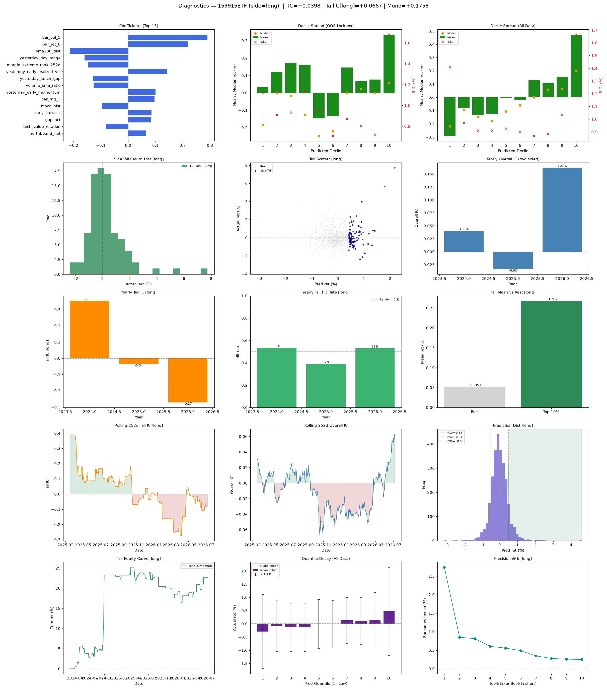

### 159915ETF_short_early (159915ETF, side=`short`)
- **Selected features**: 21
- **Active features**: 20
- **Active**: `yesterday_early_momentum`, `northbound_net`, `margin_extreme_rank_252d`, `yesterday_early_realized_vol`, `yesterday_day_range`, `bar_rng_3`, `bar_ret_0`, `num_up_bars`, `margin_buy_repayment_spread`, `capital_net_ratio`, `yesterday_lunch_gap`, `bar_vol_5`, `volume_sma_ratio`, `tech_value_rotation`, `macd_hist`, `sma_distance_5d`, `yesterday_illiquidity_amihud`, `early_kurtosis`, `sma100_dist`, `gap_pct`
- **Stopped by Step 1 (FDR Screening)** (0 features):
  None
- **Stopped by Step 2 (Stability & VIF Pruning)** (193 features):
  

  
Show 193 features

  
  `first_30min_return`, `early_realized_vol`, `early_range`, `early_trend`, `early_momentum`, `first_bar_return`, `first_bar_volume`, `early_vwap_dev`, `early_skew`, `bar_ret_1`, `bar_ret_2`, `bar_vol_0`, `bar_rng_0`, `bar_rng_2`, `bar_rng_5`, `bar_body_rng_0`, `bar_body_rng_1`, `bar_body_rng_2`, `bar_vwap_dev_0`, `bar_vwap_dev_1`, `bar_vwap_dev_2`, `bar_vwap_dev_3`, `bar_vwap_dev_5`, `max_up_ret`, `max_down_ret`, `cl_pos_in_range`, `body_to_range_ratio`, `total_path_length`, `volume_slope`, `spike_exhaustion_ratio`, `first_bar_sentiment`, `or_fill_ratio`, `close_vs_open_range`, `inside_bar_failure_bull`, `consecutive_higher_highs`, `early_bearish_engulfing_count`, `volume_surge_max`, `volume_concentration`, `volume_trend_intraday`, `volume_acceleration`, `volume_surge_direction`, `pullback_ratio`, `rally_ratio`, `range_expansion_ratio`, `pullback_depth_ratio`, `pullback_depth_max`, `rally_strength_max`, `vwap_slope_intraday`, `volume_weighted_price_position`, `net_volume_flow`, `early_body_momentum`, `late_bar_momentum`, `trend_strength_intraday`, `high_low_sequence_momentum`, `intraday_slope`, `intraday_autocorr`, `opening_momentum_score`, `opening_direction_stability`, `early_trend_hhi`, `session_high_proximity`, `session_low_proximity`, `close_above_open_count`, `open_to_current_return`, `upper_wick_dominance`, `rsi_opening`, `stoch_opening`, `momentum_strength_intraday`, `opening_auction_imbalance`, `intraday_close_position`, `limit_down_proximity_early`, `morning_trend_extrapolated`, `demark_setup_reversal_early`, `failed_breakout_reversal_early`, `early_wavetrend_cross`, `atr_expansion_flag_early`, `volatility_breakout_squeeze`, `early_bid_ask_spread_proxy`, `early_vwap_acceleration`, `early_order_flow_imbalance`, `rbreaker_sell_setup_proximity_early`, `rbreaker_buy_setup_proximity_early`, `skypark_gap_reversal_early`, `turtle_breakout_strength_early`, `sma20_dist`, `sma50_dist`, `atr14_norm`, `roc10`, `vol20`, `sma10_dist`, `sma200_dist`, `ema12_dist`, `rsi5`, `rsi21`, `roc5`, `roc20`, `roc60`, `cci14`, `willr14`, `stoch_k`, `stoch_d`, `mfi14`, `aroon_osc`, `vol5`, `vol10`, `vol60`, `vol_ratio_5_20`, `vol_ratio_10_60`, `bb_width`, `vol_pk20`, `vol_gk10`, `vol_gk20`, `margin_balance`, `buy_on_margin_value`, `margin_repayment`, `short_balance`, `short_balance_quantity`, `short_sell_quantity`, `short_repayment_quantity`, `total_balance`, `margin_net_buy`, `margin_short_ratio`, `capital_buy_volume`, `capital_buy_value`, `capital_sell_volume`, `capital_sell_value`, `capital_net_value`, `northbound_buy`, `northbound_sell`, `iv`, `iv_vol_ratio`, `vix`, `vix_vol_ratio`, `vix_iv_spread`, `vix_iv_ratio`, `iv_diff_1d`, `vix_diff_1d`, `yesterday_limit_up_touch`, `limit_up_proximity_day`, `limit_down_proximity_day`, `growth_momentum_ratio`, `high_beta_vol_ratio`, `vix_skew_proxy`, `vix_rolling_percentile_60d`, `iv_corridor_width`, `yesterday_vix_early_drift`, `vix_realized_spread`, `option_oi_growth`, `iv_envelope_deviation`, `margin_lever_ratio`, `capital_net_accel`, `northbound_volume_share`, `yesterday_northbound_net_ratio`, `short_sell_cover_spread`, `capital_large_order_ratio`, `consecutive_inside_bars_3d`, `outside_bar_reversal_day`, `wavetrend_osc_day`, `keltner_squeeze_width`, `yesterday_wavetrend_osc`, `yesterday_stoch_rsi_cross`, `cvd_divergence_day`, `coppock_curve_day`, `yesterday_range_ratio`, `yesterday_body_ratio`, `yesterday_volume_ratio`, `yesterday_return`, `yesterday_gap`, `yesterday_close_position`, `sma_distance_60d`, `volatility_percentile_20d`, `volume_percentile_20d`, `yearly_high_distance`, `yearly_low_distance`, `twenty_gap_bars_regime`, `measured_move_proximity`, `yesterday_pm_return`, `yesterday_am_return`, `yesterday_gap_pct`, `yesterday_first_30min_return`, `yesterday_early_range`, `yesterday_early_trend`, `yesterday_first_bar_volume`, `yesterday_early_vwap_dev`, `yesterday_day_realized_vol`, `yesterday_day_close_pos`, `yesterday_day_pm_am_vol_ratio`, `yesterday_day_vwap_dev`, `yesterday_day_skew`, `yesterday_day_kurtosis`, `yesterday_afternoon_reversal`, `yesterday_pm_am_vol_ratio`, `yesterday_afternoon_momentum`, `yesterday_cvd_close`
  

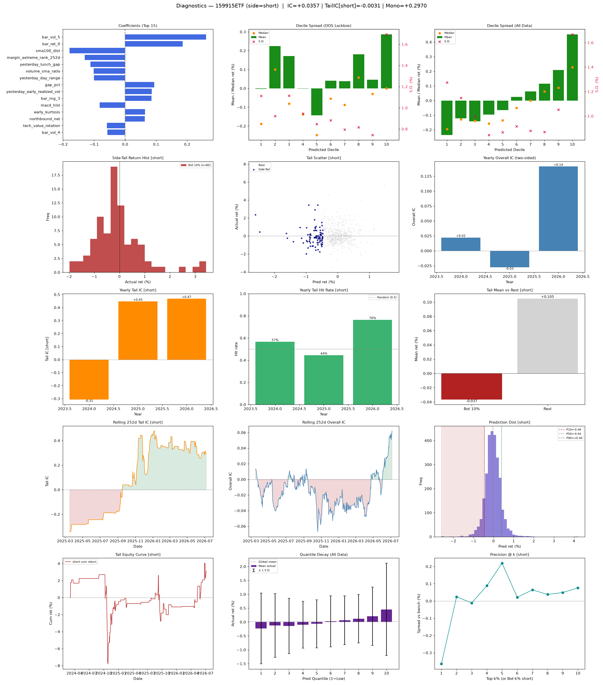

### 50ETF_early (50ETF, side=`single`)
- **Selected features**: 18
- **Active features**: 12
- **Active**: `vix_rolling_percentile_60d`, `margin_repayment`, `short_sell_quantity`, `sma100_dist`, `iv_corridor_width`, `yesterday_early_trend`, `yesterday_gap`, `northbound_net`, `bar_ret_0`, `yesterday_illiquidity_amihud`, `gap_pct`, `yesterday_lunch_gap`
- **Stopped by Step 1 (FDR Screening)** (0 features):
  None
- **Stopped by Step 2 (Stability & VIF Pruning)** (196 features):
  

  
Show 196 features

  
  `first_30min_return`, `early_realized_vol`, `early_range`, `early_trend`, `early_momentum`, `first_bar_return`, `first_bar_volume`, `early_skew`, `bar_ret_1`, `bar_ret_2`, `bar_vol_0`, `bar_vol_4`, `bar_vol_5`, `bar_rng_0`, `bar_rng_2`, `bar_rng_3`, `bar_rng_5`, `bar_body_rng_0`, `bar_body_rng_1`, `bar_body_rng_2`, `bar_vwap_dev_0`, `bar_vwap_dev_1`, `bar_vwap_dev_2`, `bar_vwap_dev_3`, `bar_vwap_dev_5`, `num_up_bars`, `max_up_ret`, `max_down_ret`, `cl_pos_in_range`, `body_to_range_ratio`, `total_path_length`, `volume_slope`, `spike_exhaustion_ratio`, `first_bar_sentiment`, `or_fill_ratio`, `close_vs_open_range`, `inside_bar_failure_bull`, `consecutive_higher_highs`, `early_bearish_engulfing_count`, `volume_surge_max`, `volume_concentration`, `volume_trend_intraday`, `volume_acceleration`, `volume_surge_direction`, `pullback_ratio`, `rally_ratio`, `range_expansion_ratio`, `pullback_depth_ratio`, `pullback_depth_max`, `rally_strength_max`, `vwap_slope_intraday`, `volume_weighted_price_position`, `net_volume_flow`, `early_body_momentum`, `late_bar_momentum`, `trend_strength_intraday`, `high_low_sequence_momentum`, `intraday_slope`, `intraday_autocorr`, `opening_momentum_score`, `opening_direction_stability`, `early_trend_hhi`, `session_high_proximity`, `session_low_proximity`, `close_above_open_count`, `open_to_current_return`, `upper_wick_dominance`, `rsi_opening`, `stoch_opening`, `momentum_strength_intraday`, `opening_auction_imbalance`, `intraday_close_position`, `limit_down_proximity_early`, `morning_trend_extrapolated`, `demark_setup_reversal_early`, `failed_breakout_reversal_early`, `early_wavetrend_cross`, `atr_expansion_flag_early`, `volatility_breakout_squeeze`, `early_bid_ask_spread_proxy`, `early_vwap_acceleration`, `early_order_flow_imbalance`, `rbreaker_sell_setup_proximity_early`, `rbreaker_buy_setup_proximity_early`, `skypark_gap_reversal_early`, `turtle_breakout_strength_early`, `macd_hist`, `sma20_dist`, `sma50_dist`, `atr14_norm`, `roc10`, `vol20`, `sma10_dist`, `sma200_dist`, `ema12_dist`, `rsi5`, `rsi21`, `roc5`, `roc20`, `roc60`, `cci14`, `willr14`, `stoch_k`, `stoch_d`, `mfi14`, `aroon_osc`, `vol5`, `vol10`, `vol60`, `vol_ratio_5_20`, `vol_ratio_10_60`, `bb_width`, `vol_pk20`, `vol_gk10`, `vol_gk20`, `volume_sma_ratio`, `margin_balance`, `buy_on_margin_value`, `short_balance`, `short_balance_quantity`, `short_repayment_quantity`, `total_balance`, `margin_net_buy`, `margin_short_ratio`, `capital_buy_volume`, `capital_buy_value`, `capital_sell_volume`, `capital_net_value`, `capital_net_ratio`, `northbound_buy`, `northbound_sell`, `iv`, `iv_vol_ratio`, `vix`, `vix_vol_ratio`, `vix_iv_spread`, `vix_iv_ratio`, `iv_diff_1d`, `vix_diff_1d`, `tech_value_rotation`, `yesterday_limit_up_touch`, `limit_up_proximity_day`, `limit_down_proximity_day`, `growth_momentum_ratio`, `high_beta_vol_ratio`, `yesterday_vix_early_drift`, `vix_realized_spread`, `iv_envelope_deviation`, `margin_lever_ratio`, `capital_net_accel`, `northbound_volume_share`, `yesterday_northbound_net_ratio`, `margin_buy_repayment_spread`, `short_sell_cover_spread`, `margin_extreme_rank_252d`, `capital_large_order_ratio`, `consecutive_inside_bars_3d`, `outside_bar_reversal_day`, `wavetrend_osc_day`, `keltner_squeeze_width`, `yesterday_wavetrend_osc`, `yesterday_stoch_rsi_cross`, `cvd_divergence_day`, `coppock_curve_day`, `yesterday_range_ratio`, `yesterday_body_ratio`, `yesterday_volume_ratio`, `yesterday_return`, `yesterday_close_position`, `sma_distance_5d`, `sma_distance_60d`, `volatility_percentile_20d`, `volume_percentile_20d`, `yearly_high_distance`, `yearly_low_distance`, `twenty_gap_bars_regime`, `measured_move_proximity`, `yesterday_pm_return`, `yesterday_am_return`, `yesterday_gap_pct`, `yesterday_first_30min_return`, `yesterday_early_realized_vol`, `yesterday_early_range`, `yesterday_early_momentum`, `yesterday_first_bar_volume`, `yesterday_early_vwap_dev`, `yesterday_day_range`, `yesterday_day_realized_vol`, `yesterday_day_close_pos`, `yesterday_day_pm_am_vol_ratio`, `yesterday_day_vwap_dev`, `yesterday_day_kurtosis`, `yesterday_afternoon_reversal`, `yesterday_pm_am_vol_ratio`, `yesterday_afternoon_momentum`, `yesterday_cvd_close`
  

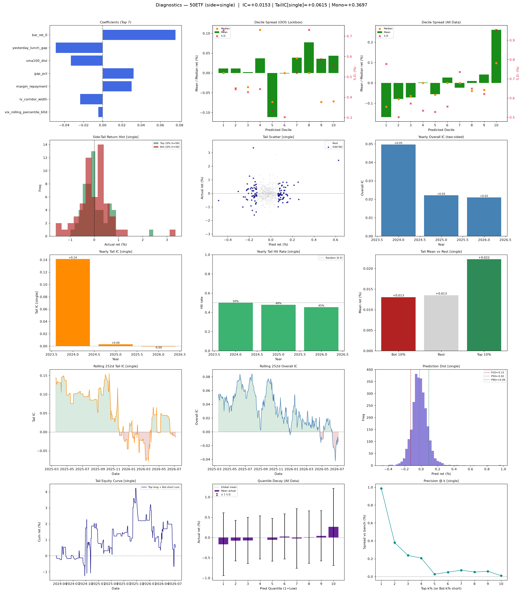

### 50ETF_long_early (50ETF, side=`long`)
- **Selected features**: 21
- **Active features**: 19
- **Active**: `early_vwap_dev`, `vix_rolling_percentile_60d`, `margin_repayment`, `short_sell_quantity`, `vix`, `sma100_dist`, `iv_corridor_width`, `yesterday_early_trend`, `yesterday_gap`, `northbound_net`, `bar_ret_0`, `cvd_divergence_day`, `yesterday_day_skew`, `yesterday_day_kurtosis`, `yesterday_illiquidity_amihud`, `gap_pct`, `yesterday_lunch_gap`, `vix_skew_proxy`, `option_oi_growth`
- **Stopped by Step 1 (FDR Screening)** (0 features):
  None
- **Stopped by Step 2 (Stability & VIF Pruning)** (193 features):
  

  
Show 193 features

  
  `first_30min_return`, `early_realized_vol`, `early_range`, `early_trend`, `early_momentum`, `first_bar_return`, `first_bar_volume`, `early_skew`, `bar_ret_1`, `bar_ret_2`, `bar_vol_0`, `bar_vol_4`, `bar_vol_5`, `bar_rng_0`, `bar_rng_2`, `bar_rng_3`, `bar_rng_5`, `bar_body_rng_0`, `bar_body_rng_1`, `bar_body_rng_2`, `bar_vwap_dev_0`, `bar_vwap_dev_1`, `bar_vwap_dev_2`, `bar_vwap_dev_3`, `bar_vwap_dev_5`, `num_up_bars`, `max_up_ret`, `max_down_ret`, `cl_pos_in_range`, `body_to_range_ratio`, `total_path_length`, `volume_slope`, `spike_exhaustion_ratio`, `first_bar_sentiment`, `or_fill_ratio`, `close_vs_open_range`, `inside_bar_failure_bull`, `consecutive_higher_highs`, `early_bearish_engulfing_count`, `volume_surge_max`, `volume_concentration`, `volume_trend_intraday`, `volume_acceleration`, `volume_surge_direction`, `pullback_ratio`, `rally_ratio`, `range_expansion_ratio`, `pullback_depth_ratio`, `pullback_depth_max`, `rally_strength_max`, `vwap_slope_intraday`, `volume_weighted_price_position`, `net_volume_flow`, `early_body_momentum`, `late_bar_momentum`, `trend_strength_intraday`, `high_low_sequence_momentum`, `intraday_slope`, `intraday_autocorr`, `opening_momentum_score`, `opening_direction_stability`, `early_trend_hhi`, `session_high_proximity`, `session_low_proximity`, `close_above_open_count`, `open_to_current_return`, `upper_wick_dominance`, `rsi_opening`, `stoch_opening`, `momentum_strength_intraday`, `opening_auction_imbalance`, `intraday_close_position`, `limit_down_proximity_early`, `morning_trend_extrapolated`, `demark_setup_reversal_early`, `failed_breakout_reversal_early`, `early_wavetrend_cross`, `atr_expansion_flag_early`, `volatility_breakout_squeeze`, `early_bid_ask_spread_proxy`, `early_vwap_acceleration`, `early_order_flow_imbalance`, `rbreaker_sell_setup_proximity_early`, `rbreaker_buy_setup_proximity_early`, `skypark_gap_reversal_early`, `turtle_breakout_strength_early`, `macd_hist`, `sma20_dist`, `sma50_dist`, `atr14_norm`, `roc10`, `vol20`, `sma10_dist`, `sma200_dist`, `ema12_dist`, `rsi5`, `rsi21`, `roc5`, `roc20`, `roc60`, `cci14`, `willr14`, `stoch_k`, `stoch_d`, `mfi14`, `aroon_osc`, `vol5`, `vol10`, `vol60`, `vol_ratio_5_20`, `vol_ratio_10_60`, `bb_width`, `vol_pk20`, `vol_gk10`, `vol_gk20`, `volume_sma_ratio`, `margin_balance`, `buy_on_margin_value`, `short_balance`, `short_balance_quantity`, `short_repayment_quantity`, `total_balance`, `margin_net_buy`, `margin_short_ratio`, `capital_buy_volume`, `capital_buy_value`, `capital_sell_volume`, `capital_net_value`, `capital_net_ratio`, `northbound_buy`, `northbound_sell`, `iv`, `iv_vol_ratio`, `vix_vol_ratio`, `vix_iv_spread`, `vix_iv_ratio`, `iv_diff_1d`, `vix_diff_1d`, `tech_value_rotation`, `yesterday_limit_up_touch`, `limit_up_proximity_day`, `limit_down_proximity_day`, `growth_momentum_ratio`, `high_beta_vol_ratio`, `yesterday_vix_early_drift`, `vix_realized_spread`, `iv_envelope_deviation`, `margin_lever_ratio`, `capital_net_accel`, `northbound_volume_share`, `yesterday_northbound_net_ratio`, `margin_buy_repayment_spread`, `short_sell_cover_spread`, `margin_extreme_rank_252d`, `capital_large_order_ratio`, `consecutive_inside_bars_3d`, `outside_bar_reversal_day`, `wavetrend_osc_day`, `keltner_squeeze_width`, `yesterday_wavetrend_osc`, `yesterday_stoch_rsi_cross`, `coppock_curve_day`, `yesterday_range_ratio`, `yesterday_body_ratio`, `yesterday_volume_ratio`, `yesterday_return`, `yesterday_close_position`, `sma_distance_5d`, `sma_distance_60d`, `volatility_percentile_20d`, `volume_percentile_20d`, `yearly_high_distance`, `yearly_low_distance`, `twenty_gap_bars_regime`, `measured_move_proximity`, `yesterday_pm_return`, `yesterday_am_return`, `yesterday_gap_pct`, `yesterday_first_30min_return`, `yesterday_early_realized_vol`, `yesterday_early_range`, `yesterday_early_momentum`, `yesterday_first_bar_volume`, `yesterday_early_vwap_dev`, `yesterday_day_range`, `yesterday_day_realized_vol`, `yesterday_day_close_pos`, `yesterday_day_pm_am_vol_ratio`, `yesterday_day_vwap_dev`, `yesterday_afternoon_reversal`, `yesterday_pm_am_vol_ratio`, `yesterday_afternoon_momentum`, `yesterday_cvd_close`
  

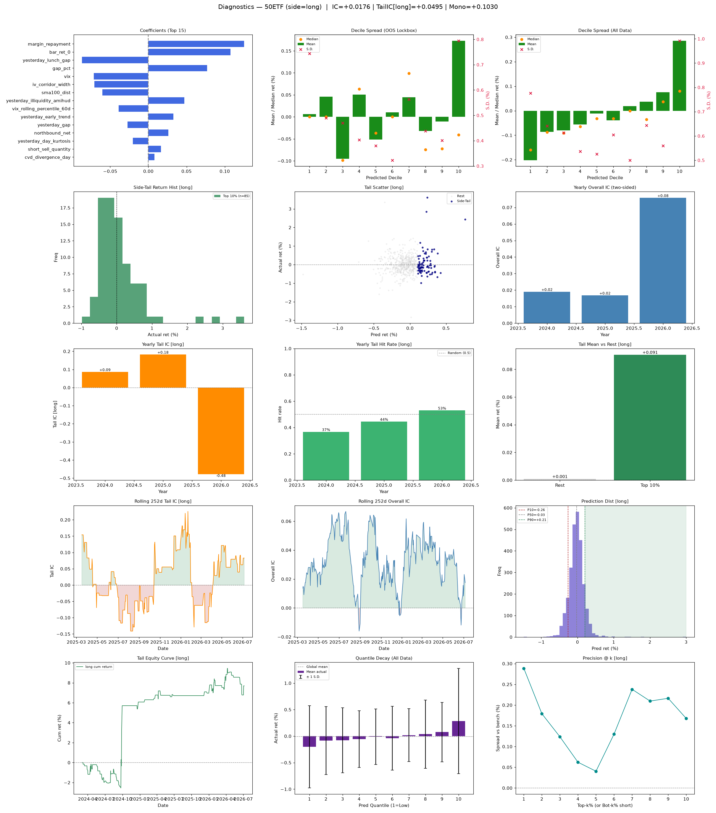

### 50ETF_short_early (50ETF, side=`short`)
- **Selected features**: 21
- **Active features**: 19
- **Active**: `vix_rolling_percentile_60d`, `capital_sell_value`, `margin_repayment`, `short_sell_quantity`, `vix`, `sma100_dist`, `iv_corridor_width`, `yesterday_early_trend`, `yesterday_gap`, `northbound_net`, `bar_ret_0`, `cvd_divergence_day`, `yesterday_day_skew`, `yesterday_day_kurtosis`, `yesterday_illiquidity_amihud`, `gap_pct`, `yesterday_lunch_gap`, `vix_skew_proxy`, `option_oi_growth`
- **Stopped by Step 1 (FDR Screening)** (0 features):
  None
- **Stopped by Step 2 (Stability & VIF Pruning)** (193 features):
  

  
Show 193 features

  
  `first_30min_return`, `early_realized_vol`, `early_range`, `early_trend`, `early_momentum`, `first_bar_return`, `first_bar_volume`, `early_skew`, `bar_ret_1`, `bar_ret_2`, `bar_vol_0`, `bar_vol_4`, `bar_vol_5`, `bar_rng_0`, `bar_rng_2`, `bar_rng_3`, `bar_rng_5`, `bar_body_rng_0`, `bar_body_rng_1`, `bar_body_rng_2`, `bar_vwap_dev_0`, `bar_vwap_dev_1`, `bar_vwap_dev_2`, `bar_vwap_dev_3`, `bar_vwap_dev_5`, `num_up_bars`, `max_up_ret`, `max_down_ret`, `cl_pos_in_range`, `body_to_range_ratio`, `total_path_length`, `volume_slope`, `spike_exhaustion_ratio`, `first_bar_sentiment`, `or_fill_ratio`, `close_vs_open_range`, `inside_bar_failure_bull`, `consecutive_higher_highs`, `early_bearish_engulfing_count`, `volume_surge_max`, `volume_concentration`, `volume_trend_intraday`, `volume_acceleration`, `volume_surge_direction`, `pullback_ratio`, `rally_ratio`, `range_expansion_ratio`, `pullback_depth_ratio`, `pullback_depth_max`, `rally_strength_max`, `vwap_slope_intraday`, `volume_weighted_price_position`, `net_volume_flow`, `early_body_momentum`, `late_bar_momentum`, `trend_strength_intraday`, `high_low_sequence_momentum`, `intraday_slope`, `intraday_autocorr`, `opening_momentum_score`, `opening_direction_stability`, `early_trend_hhi`, `session_high_proximity`, `session_low_proximity`, `close_above_open_count`, `open_to_current_return`, `upper_wick_dominance`, `rsi_opening`, `stoch_opening`, `momentum_strength_intraday`, `opening_auction_imbalance`, `intraday_close_position`, `limit_down_proximity_early`, `morning_trend_extrapolated`, `demark_setup_reversal_early`, `failed_breakout_reversal_early`, `early_wavetrend_cross`, `atr_expansion_flag_early`, `volatility_breakout_squeeze`, `early_bid_ask_spread_proxy`, `early_vwap_acceleration`, `early_order_flow_imbalance`, `rbreaker_sell_setup_proximity_early`, `rbreaker_buy_setup_proximity_early`, `skypark_gap_reversal_early`, `turtle_breakout_strength_early`, `macd_hist`, `sma20_dist`, `sma50_dist`, `atr14_norm`, `roc10`, `vol20`, `sma10_dist`, `sma200_dist`, `ema12_dist`, `rsi5`, `rsi21`, `roc5`, `roc20`, `roc60`, `cci14`, `willr14`, `stoch_k`, `stoch_d`, `mfi14`, `aroon_osc`, `vol5`, `vol10`, `vol60`, `vol_ratio_5_20`, `vol_ratio_10_60`, `bb_width`, `vol_pk20`, `vol_gk10`, `vol_gk20`, `volume_sma_ratio`, `margin_balance`, `buy_on_margin_value`, `short_balance`, `short_balance_quantity`, `short_repayment_quantity`, `total_balance`, `margin_net_buy`, `margin_short_ratio`, `capital_buy_volume`, `capital_buy_value`, `capital_sell_volume`, `capital_net_value`, `capital_net_ratio`, `northbound_buy`, `northbound_sell`, `iv`, `iv_vol_ratio`, `vix_vol_ratio`, `vix_iv_spread`, `vix_iv_ratio`, `iv_diff_1d`, `vix_diff_1d`, `tech_value_rotation`, `yesterday_limit_up_touch`, `limit_up_proximity_day`, `limit_down_proximity_day`, `growth_momentum_ratio`, `high_beta_vol_ratio`, `yesterday_vix_early_drift`, `vix_realized_spread`, `iv_envelope_deviation`, `margin_lever_ratio`, `capital_net_accel`, `northbound_volume_share`, `yesterday_northbound_net_ratio`, `margin_buy_repayment_spread`, `short_sell_cover_spread`, `margin_extreme_rank_252d`, `capital_large_order_ratio`, `consecutive_inside_bars_3d`, `outside_bar_reversal_day`, `wavetrend_osc_day`, `keltner_squeeze_width`, `yesterday_wavetrend_osc`, `yesterday_stoch_rsi_cross`, `coppock_curve_day`, `yesterday_range_ratio`, `yesterday_body_ratio`, `yesterday_volume_ratio`, `yesterday_return`, `yesterday_close_position`, `sma_distance_5d`, `sma_distance_60d`, `volatility_percentile_20d`, `volume_percentile_20d`, `yearly_high_distance`, `yearly_low_distance`, `twenty_gap_bars_regime`, `measured_move_proximity`, `yesterday_pm_return`, `yesterday_am_return`, `yesterday_gap_pct`, `yesterday_first_30min_return`, `yesterday_early_realized_vol`, `yesterday_early_range`, `yesterday_early_momentum`, `yesterday_first_bar_volume`, `yesterday_early_vwap_dev`, `yesterday_day_range`, `yesterday_day_realized_vol`, `yesterday_day_close_pos`, `yesterday_day_pm_am_vol_ratio`, `yesterday_day_vwap_dev`, `yesterday_afternoon_reversal`, `yesterday_pm_am_vol_ratio`, `yesterday_afternoon_momentum`, `yesterday_cvd_close`
  

## Methodology Overview
1. **Lockbox Split**: From 2024-03-01 to last day (OOS holdout).
2. **Selection Validation Split**: Six non-contiguous 3-month blocks carved out from the working set, partitioned into 4 inner (tuning) + 2 outer (held-out) blocks, with a 10-day embargo.
3. **BH-FDR Screening**: Robust marginal Spearman correlation at FDR = 0.15 on selection train.
4. **Hierarchical Clustering**: Groups collinear features (|r| >= 0.75).
5. **Cluster Stability Selection + VIF Pruning**: B=100 subsamples, pi=0.60 cluster threshold, then VIF <= 10 pruning.
6. **Weighted Fitting**: Sample weights w(y) = |y|^k.
7. **Side-Aware Optuna Objective**:
   - `single` (legacy): Tail IC two-sided (top10% U bot10%). Weights V1..V4 = [0.40, 0.40, 0.15, 0.05].
   - `long`: Tail IC top-only (`pred >= P85(pred)`). Weights [0.35, 0.50, 0.15, 0.00] (V4 dropped).
   - `short`: Tail IC bot-only (`pred <= P15(pred)`). Weights [0.35, 0.50, 0.15, 0.00] (V4 dropped).
   - CV fold kill-switches (M1..M6: hit rate, monotonicity, spread, ESS, Gini) stay **two-sided** for all sides.
8. **Deflated Objective + Plateau Selection**: Running Lopez de Prado deflation; final trial chosen via plateau search (r=0.25).
9. **15-Panel Diagnostics Figure per Tag**: One combined PNG (`diagnostics_{etf}_{side}_early.png`) with 15 subplots, saved to `day-model/plots/` and embedded above.
