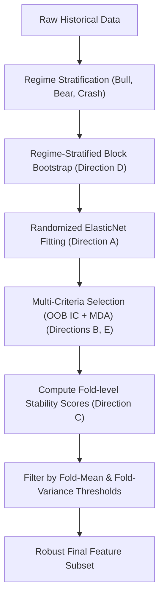

# Research Plan: Improving Feature Stability Selection

## 0. Project Background

This research plan is part of the Option daytrading strategy. In this step, we would foucus on evaluating the features and their stability. 

### The Day-Model Strategy
* **Goal**: Predict the entry-to-exit trade return of the ETF, where entry is executed at the open of `decision_bar + 1` (mid-day) and exit is executed at the 14:30 market close.
* **Target**: $\text{trade\_return} = \log(P_{\text{close, 14:30}} / P_{\text{open, decision\_bar + 1}})$.
* **Feature Space**: 130 features consisting of early-bar intraday features (computed up to the decision bar close from 5-minute index data), day-level technical indicators (shifted by 1 day to prevent leakage), capital flow, securities margin, and option-derived features (e.g., VIX, IV, VIX-IV spread).
* **Modeling**: Optuna-tuned linear models (Ridge, Lasso, ElasticNet, HuberRegressor) trained using walk-forward purged cross-validation.
* **Dual Asymmetric Models**: Features are selected and models are trained separately for the `long` side (upside specialist predicting positive returns) and `short` side (downside specialist predicting negative returns). The feature selection target is asymmetric: $y_{\text{clip}} = \max(0, \text{trade\_return})$ for long, and $y_{\text{clip}} = \max(0, -\text{trade\_return})$ for short.

### Why Feature Selection Stability Matters
Because the candidate feature space is large ($130$ features, will even add more) and financial data is highly noisy with short histories, standard model fitting overfits. We use **Block Bootstrap Stability Selection** on the dev set to identify a robust, sparse subset of features that persist across time before tuning hyperparameters.

---

## 1. Current Stability Score Calculation

The stability score is calculated in [train_model.py](file:///home/hallo/Documents/option-longterm/day-model/train_model.py#L161-L183) using **Lasso-based Block Bootstrap Stability Selection**:

Let $X \in \mathbb{R}^{N \times D}$ be the pre-scaled feature matrix and $y \in \mathbb{R}^N$ be the target vector on the dev set, where $N$ is the number of trading days and $D$ is the number of features.

1. **Block Bootstrap Sampling**:
   * Block size $L = 20$ trading days.
   * Number of blocks $M = \lceil N / L \rceil$.
   * For each trial $b \in \{1, \dots, B\}$ (where $B = 50$):
     * Draw start indices uniformly with replacement:
       $$s_m \sim \text{Uniform}(\{0, 1, \dots, N - L\}), \quad \text{for } m = 1, \dots, M$$
     * Construct the bootstrap sample index list $I_b$ of length $N$:
       $$I_b = \left( \bigcup_{m=1}^{M} \{s_m, s_m+1, \dots, s_m + L - 1\} \right)_{[1:N]}$$
     * Define the bootstrap feature and target matrices:
       $$X^{(b)} = X[I_b, :], \quad y^{(b)} = y[I_b]$$

2. **Lasso Fitting via Cross-Validation**:
   * Solve the Lasso optimization problem over a grid of L1 penalties $\Lambda$:
     $$\beta^{(b)}(\lambda) = \arg\min_{\beta \in \mathbb{R}^D} \left( \frac{1}{2 N} \|y^{(b)} - X^{(b)}\beta\|_2^2 + \lambda \|\beta\|_1 \right)$$
   * Select the optimal penalty $\lambda_{opt}^{(b)} \in \Lambda$ using 5-fold cross-validation on the bootstrap sample $(X^{(b)}, y^{(b)})$ with $50$ alpha candidates:
     $$\lambda_{opt}^{(b)} = \arg\min_{\lambda} \text{MSE}_{5\text{-fold}}\left( \beta^{(b)}(\lambda) \right)$$

3. **Selection Rule & Indicators**:
   * Define the indicator function $z_{j,b}$ for feature $j$ in bootstrap trial $b$:
     $$z_{j,b} = \mathbb{I}\left( \left|\beta_{j}^{(b)}(\lambda_{opt}^{(b)})\right| > 10^{-5} \right)$$

4. **Stability Score**:
   * Compute the stability score for feature $j$:
     $$S_j = \frac{1}{B} \sum_{b=1}^{B} z_{j,b}$$

5. **Pruning**:
   * Prune features whose stability score is below the threshold $t$:
     $$\text{Selected Features} = \{ j \mid S_j \ge t \}$$
     where $t \in [0.40, 0.90]$ is tuned via Optuna walk-forward CV.

---

## 2. Technical Limitations of Current Approach

* **Collinearity Masking**: Lasso arbitrarily selects one feature from a group of highly correlated features and sets the rest to zero. This artificially lowers the stability scores of collinear features.
* **Target Mismatch**: Lasso minimizes Mean Squared Error (MSE). However, the model's actual trading performance is evaluated on **Spearman Rank IC** and **L/S Sharpe**. A feature may reduce MSE slightly (selected by Lasso) but yield unstable or negative IC.
* **Non-Stationarity & Regime Shifts**: The block bootstrap samples uniformly across the entire history. It does not account for the fact that a feature's predictive power might be highly regime-dependent (e.g., only predictive in high-volatility regimes).
* **Temporal Leakage / Fold Instability**: Stability is evaluated globally on the dev set. We do not track whether a feature's stability remains consistent across different chronological folds in the walk-forward validation.

---

## 3. Recommended Areas for Research & Essays

Here are five concrete directions to research, including recommended papers and search queries.

### Direction A: Randomized Lasso & ElasticNet (Meinshausen & Bühlmann)
* **Concept**: Instead of standard Lasso, use Randomized Lasso. In each bootstrap trial, randomly scale the L1 penalty of each feature by a factor $W_j \sim \text{Uniform}(\alpha, 1)$. 
* **Why it helps**: Forces the optimizer to select other collinear variables across trials, yielding more accurate joint stability scores.
* **Essays/Papers to search**:
  * *Meinshausen, N., & Bühlmann, P. (2010). "Stability Selection". Journal of the Royal Statistical Society.*
  * *Bach, F. R. (2008). "Bolasso: Model consistent lasso estimation through the bootstrap". ICML.*
* **Key Terms**: Randomized Lasso, Stability Selection, Bolasso, Random Subspace Method.

### Direction B: IC-Based Stability Scoring
* **Concept**: Align feature selection with evaluation. Compute the stability score based on the feature's OOS Spearman IC stability rather than L1 coefficients.
* **Method**: For each bootstrap sample:
  1. Fit a single-variable model (or calculate univariate Spearman IC) on the bootstrap sample.
  2. Evaluate Spearman IC on out-of-bag blocks.
  3. Mark as selected if the OOS IC is statistically significant ($p < 0.05$) or above a minimum threshold (e.g., $|IC| > 0.02$).
* **Key Terms**: Univariate Feature Screening, Sure Independence Screening (SIS), Information Coefficient Stability.

### Direction C: Walk-Forward Fold-Level Stability
* **Concept**: Calculate stability scores independently inside each of the 5 walk-forward CV folds.
* **Metrics**:
  * **Mean Stability**: Average stability score of a feature across folds.
  * **Stability Variance**: Variance/standard deviation of the stability score across folds.
* **Why it helps**: Prunes features that are highly stable in one era but completely lose stability in another, reducing time-series overfitting.
* **Key Terms**: Walk-forward feature selection stability, non-stationary feature selection.

### Direction D: Regime-Stratified Block Bootstrapping
* **Concept**: Instead of sampling blocks uniformly, cluster the timeline into market regimes (e.g., Bull, Bear, High-Vol, Low-Vol). Draw bootstrap blocks stratified by these regimes.
* **Why it helps**: Prevents dominant regimes from washing out features that are critical but only active during rarer regimes (e.g., market crashes).
* **Key Terms**: Stratified Block Bootstrap, Regime-switching feature selection, Markov Regime Bootstrapping.

### Direction E: Combinatorial Purged Cross-Validation (CPCV) & MDA (Marcos Lopez de Prado)
* **Concept**: Use CPCV to generate multiple OOS paths, and compute the distribution of Mean Decrease Accuracy (MDA) or Single Feature Importance (SFI) across paths.
* **Why it helps**: Yields mathematically rigorous confidence intervals and stability profiles for feature importance under time-series constraints.
* **Essays/Papers to search**:
  * *Lopez de Prado, M. (2018). "Advances in Financial Machine Learning" (Chapter 6 & 8).*
* **Key Terms**: CPCV, Mean Decrease Accuracy stability, Single Feature Importance (SFI).

---

## 4. Expected Deliverables: Unified Feature Stability Framework

The final goal of this research is to design and implement a **Unified Multi-Regime Time-Series Feature Stability Framework** that integrates the strengths of all five directions into a single, cohesive algorithm:

### Expected Output & Structure
The final research implementation should deliver:

1. **A Mathematical Formulation Document**:
   * Complete formulas detailing the joint probability of selection under the randomized penalty matrix.
   * Algorithmic definition of regime stratification and blocked bootstrap indexing.
   * Formal definition of fold-wise stability variance filters.

2. **An Improved Feature Selector Class (`TimeSeriesStabilitySelector`)**:
   * A Python class compatible with Scikit-Learn pipelines.
   * Parameters to tune: `n_bootstraps`, `block_size`, `randomization_alpha`, `regime_indicators`, `ic_threshold`, `fold_variance_cap`.
   * Able to output a dataframe of feature statistics (Pearson $r$, Spearman $\rho$, Mean Bootstrap Selection Rate, Across-Fold Selection Variance, and OOB MDA).

3. **Performance Diagnostics & Reports**:
   * Comparison tables showing before/after feature selection outcomes per ETF.
   * Metrics demonstrating:
     * **Stability of Selection**: Lower variance in the selected feature set across cross-validation folds.
     * **Out-of-Sample IC Improvement**: Higher and more stable OOS IC (lower standard deviation of rolling OOS IC).
     * **Reduced Overfitting**: Smaller gap between In-Sample (IS) IC and Out-of-Sample (OOS) IC.
     * **Collinearity Coverage**: Verification that collinear but structurally sound features are not randomly masked/dropped.

### Research guideline:
Professional Academic research paper are prefered. The final result should be professional and can be used in a quant trading strategy. Newer paper are prefered
