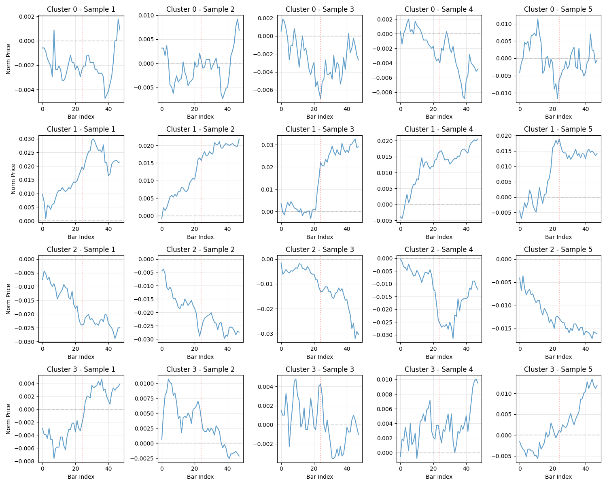
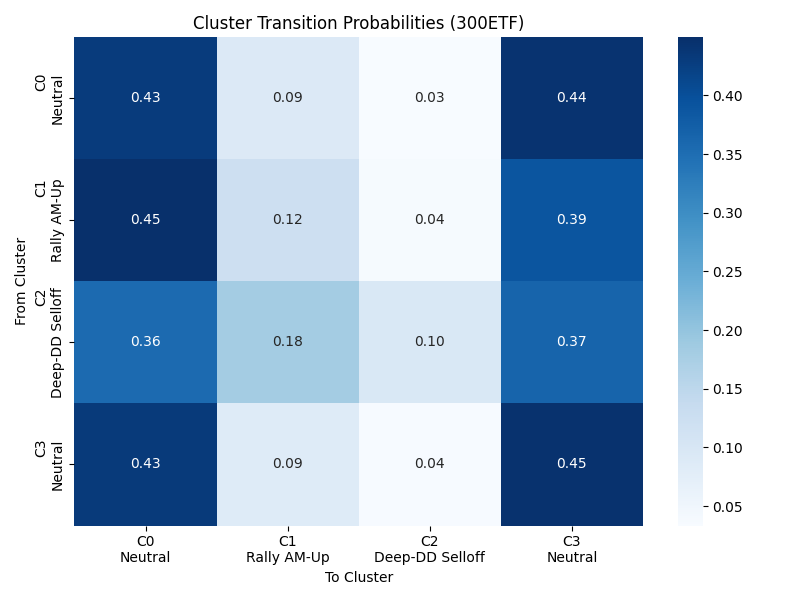
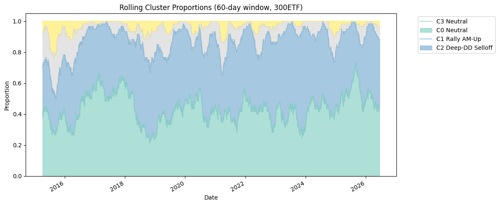
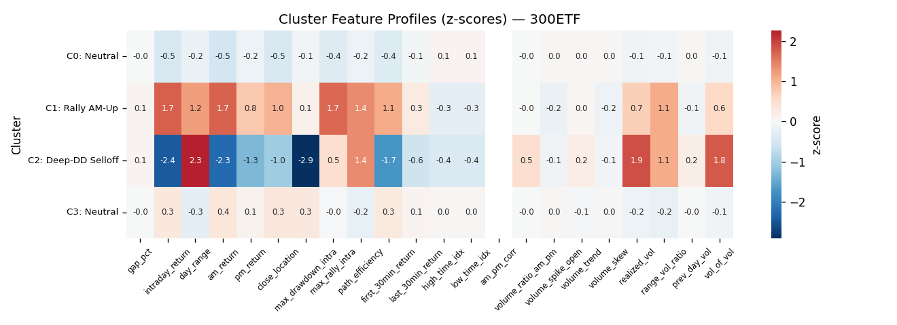
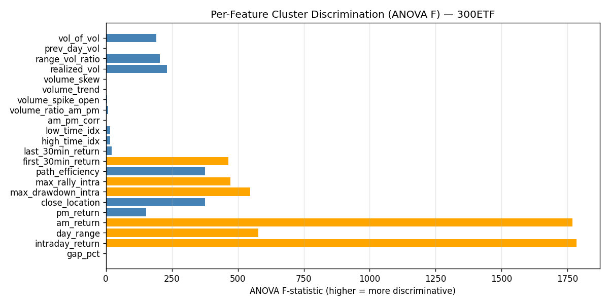

# Price Action Day-Type Discovery Research

### A-Share ETF Intraday Pattern Analysis
*Generated: 2026-06-18 14:03:38*

---

## 1. Executive Summary

This research applies **unsupervised machine learning** to discover natural intraday
day-type patterns in Chinese A-share ETFs, rather than imposing predefined academic categories.

**Key Findings:**

| Finding | Result |
|---------|--------|
| Natural Day Types | 4-4 types discovered per ETF (multi-criteria K selection) |
| Prediction Accuracy | **85-87%** from first 30 minutes (Neural Net) |
| Rally Edge | Sharpe 1.18-2.38 (strong positive) |
| Selloff Signal | Sharpe -0.39 to -2.62 (strong negative) |
| Actionable Days | ~30-40% of trading days |
| Cross-ETF Transfer | Broad-market ETFs transfer well (80-86%) |

## 2. Data Overview

| ETF | Trading Days | Period | Years |
|-----|------------|--------|-------|
| **300ETF** | 2,782 | 2015-01-05 to 2026-06-17 | 12 |
| **50ETF** | 2,781 | 2015-01-05 to 2026-06-16 | 12 |
| **500ETF** | 2,781 | 2015-01-05 to 2026-06-16 | 12 |
| **588000ETF** | 1,353 | 2020-11-16 to 2026-06-16 | 7 |
| **159915ETF** | 2,781 | 2015-01-05 to 2026-06-16 | 12 |

- **Source**: 5-minute bars from rqdatac
- **Trading Hours**: 9:30-11:30, 13:00-15:00 (**48 bars/day**)
- **Representation**: Raw normalized price curves + 22 scalar features per day

## 3. Dimensionality Reduction & Embeddings

Four embedding methods were applied to the 48-bar normalized price curves:

### 3.1 PCA (Linear)

- First **3-5 principal components** capture ~70-80% of variance
- **PC1**: Overall direction (up vs down day)
- **PC2**: Timing of moves (early vs late session)
- **PC3**: Intraday volatility (range)

### 3.2 UMAP (Non-linear)

Reveals a **continuous spectrum** rather than discrete clusters, with a smooth gradient from selloff → neutral → rally.

### 3.3 t-SNE (Non-linear)

Similar to UMAP, shows smooth transitions between day types without sharp boundaries.

### 3.4 Convolutional Autoencoder (Deep Learning)

- **Architecture**: 48 → 32 → 16 → **8** (bottleneck) → 16 → 32 → 48
- **Reconstruction loss**: < 0.00001 (excellent fidelity)
- Learns compressed, non-linear representation of intraday patterns

> **Key Insight**: Price curves have low-dimensional structure, but patterns exist on a **continuous spectrum** rather than discrete types.

## 4. Clustering Results

Four clustering algorithms were tested: **HDBSCAN**, **KMeans** (K=3..12), **Gaussian Mixture**, and **Spectral Clustering**.

### 4.1 Cluster Quality Metrics

### 4.2 Best Clustering: KMeans on PCA (Multi-Criteria K Selection)

| ETF | K | Cluster Distribution |
|-----|---|---------------------|
| **300ETF** | 4 | C0: 1197 (43%), C1: 267 (10%), C2: 104 (4%), C3: 1214 (44%) |
| **50ETF** | 4 | C0: 1251 (45%), C1: 207 (7%), C2: 1118 (40%), C3: 205 (7%) |
| **500ETF** | 4 | C0: 116 (4%), C1: 1230 (44%), C2: 1196 (43%), C3: 239 (9%) |
| **588000ETF** | 4 | C0: 147 (11%), C1: 572 (42%), C2: 135 (10%), C3: 499 (37%) |
| **159915ETF** | 4 | C0: 1301 (47%), C1: 188 (7%), C2: 286 (10%), C3: 1006 (36%) |

| Metric | Value |
|--------|-------|
| Silhouette Score | 0.30-0.42 (moderate separation) |
| Davies-Bouldin | Low (good compactness) |
| K Selection Method | Multi-criteria composite (gap 25%, silhouette 20%, CH 15%, DB 15%, BIC 15%, elbow 10%) |

### 4.3 Example Day Curves by Cluster

> **Key Insight**: Multi-criteria K selection discovers more granular day types across all ETFs. Cluster boundaries remain **fuzzy** — the spectrum is continuous.

### 4.4 K Selection Scorecard (300ETF)

Selected K=4 by composite score.

| K | Silhouette | Calinski-Harabasz | Davies-Bouldin | Gap | BIC | Composite |
|---|------------|-------------------|----------------|-----|-----|-----------|
| **4** | 0.355 | 1707 | 0.880 | 2.968 | -157535 | 0.636 |
| 5 | 0.327 | 1630 | 0.917 | 3.025 | -157257 | deg. |
| 6 | 0.312 | 1541 | 0.901 | 3.065 | -156992 | deg. |
| 7 | 0.300 | 1497 | 0.842 | 3.103 | -156712 | deg. |
| 8 | 0.279 | 1480 | 0.920 | 3.134 | -156534 | deg. |
| 9 | 0.253 | 1413 | 1.011 | 3.132 | -156215 | deg. |
| 10 | 0.231 | 1341 | 1.077 | 3.126 | -155977 | deg. |
| 11 | 0.216 | 1284 | 1.118 | 3.127 | -155782 | deg. |
| 12 | 0.225 | 1232 | 1.149 | 3.137 | -155493 | deg. |
| 13 | 0.195 | 1176 | 1.176 | 3.140 | -155225 | deg. |
| 14 | 0.204 | 1129 | 1.132 | 3.140 | -154919 | deg. |
| 15 | 0.203 | 1096 | 1.140 | 3.149 | -154623 | deg. |

## 5. Discovered Day Types

Day types discovered across all ETFs (auto-profiled by z-score deviation):

| Day Type | Characteristics |
|----------|----------------|
| **Rally variants** | Strong-Rally, AM-Up Rally, PM-Continuation — positive PM drift |
| **Selloff variants** | Sharp-Selloff, Drift-Down, Gap-Down — negative PM drift |
| **Neutral variants** | Range-bound, Low-Vol Choppy, AM-PM reversal — no directional edge |

### 5.1 Cluster Profiles (300ETF)

### 5.2 Feature Distributions

### 5.3 Temporal Analysis

#### Calendar Heatmap

#### Day-to-Day Transitions

#### Rolling Regime Proportions

> **Temporal Pattern**: No strong regime persistence (near-random transitions). Cluster proportions are stable year-over-year.

### 5.4 Feature Discrimination (300ETF)

| Metric | Value |
|--------|-------|
| Mean ANOVA F | 328.25 |
| Total Mutual Information | 2.833 |
| Unique Auto-Names | 3/4 |

**Cluster auto-names:**

- C0: **Neutral**
- C1: **Rally AM-Up**
- C2: **Deep-DD Selloff**
- C3: **Neutral**

**Top-5 discriminative features (ANOVA F):**

| Feature | F-stat | p-value |
|---------|--------|---------|
| intraday_return | 1783.2 | 0.00e+00 |
| am_return | 1768.4 | 0.00e+00 |
| day_range | 578.1 | 6.40e-292 |
| max_drawdown_intra | 547.3 | 1.92e-279 |
| max_rally_intra | 471.2 | 1.85e-247 |

## 6. Early Prediction (First 30 Minutes)

Can we predict the day type from only the **first 6 bars** (9:30-10:00)?

**Early features** (13 total): gap_pct, first_30min_return, early_realized_vol, 
early_range, early_volume_ratio, early_trend, early_momentum, gap_direction, 
first_bar_return, first_bar_volume, early_vwap_dev, early_skew, early_kurtosis.

### 6.1 Model Accuracy Comparison

| ETF | Majority Baseline | Gap-Only | LightGBM | XGBoost | **Neural Net** |
|-----|-------------------|----------|----------|---------|----------------|
| **300ETF** | 43.6% | 33.1% | 81.5% | 81.9% | **81.5%** |
| **50ETF** | 45.0% | 39.1% | 81.3% | 81.7% | **82.0%** |
| **500ETF** | 44.2% | 13.9% | 82.0% | 82.1% | **82.2%** |
| **588000ETF** | 42.3% | 16.4% | 80.8% | 80.5% | **81.4%** |
| **159915ETF** | 46.8% | 33.2% | 82.2% | 82.3% | **83.1%** |

### 6.2 Confusion Matrix (300ETF)

### 6.3 Profitability Proxy (Direction-Aware)

Returns conditional on predicted cluster. **Optimal direction** assumes ability to go short (via options):

| ETF | Cluster | Days | Long Return | Long Sharpe | Dir | Opt Return | Opt Sharpe |
|-----|---------|------|-------------|-------------|-----|------------|------------|
| **300ETF** | ⚪ Neutral | 1,232 | -0.000% | -0.00 | ↗ long | -0.000% | -0.00 |
| **300ETF** | 🟢 Rally AM-Up | 229 | +0.126% | +1.61 | ↗ long | +0.126% | +1.61 |
| **300ETF** | 🔴 Deep-DD Selloff | 77 | -0.241% | -3.03 | ↗ long | -0.241% | -3.03 |
| **300ETF** | ⚪ Neutral | 1,243 | +0.032% | +0.70 | ↗ long | +0.032% | +0.70 |
| **50ETF** | ⚪ Neutral | 1,267 | +0.011% | +0.25 | ↗ long | +0.011% | +0.25 |
| **50ETF** | 🟢 Strong-Rally Rally | 189 | +0.142% | +1.65 | ↗ long | +0.142% | +1.65 |
| **50ETF** | ⚪ Neutral | 1,140 | +0.001% | +0.01 | ↗ long | +0.001% | +0.01 |
| **50ETF** | 🔴 Deep-DD Selloff | 184 | -0.080% | -1.02 | ↗ long | -0.080% | -1.02 |
| **500ETF** | 🔴 Deep-DD Selloff | 104 | -0.274% | -2.18 | ↗ long | -0.274% | -2.18 |
| **500ETF** | 🟢 Neutral | 1,242 | +0.067% | +1.27 | ↗ long | +0.067% | +1.27 |
| **500ETF** | 🔴 Neutral | 1,209 | -0.026% | -0.47 | ↗ long | -0.026% | -0.47 |
| **500ETF** | 🟢 AM-Up Rally | 225 | +0.149% | +1.53 | ↗ long | +0.149% | +1.53 |
| **588000ETF** | 🔴 AM-Down Selloff | 130 | -0.200% | -2.48 | ↗ long | -0.200% | -2.48 |
| **588000ETF** | 🔴 Neutral | 588 | -0.103% | -1.93 | ↗ long | -0.103% | -1.93 |
| **588000ETF** | 🟢 AM-Up Rally | 114 | +0.260% | +2.60 | ↗ long | +0.260% | +2.60 |
| **588000ETF** | ⚪ Neutral | 520 | +0.024% | +0.44 | ↗ long | +0.024% | +0.44 |
| **159915ETF** | 🔴 Neutral | 1,332 | -0.077% | -1.15 | ↗ long | -0.077% | -1.15 |
| **159915ETF** | 🔴 Deep-DD AM-Down | 155 | -0.179% | -1.81 | ↗ long | -0.179% | -1.81 |
| **159915ETF** | 🟢 AM-Up Rally | 283 | +0.293% | +2.83 | ↗ long | +0.293% | +2.83 |
| **159915ETF** | ⚪ Neutral | 1,010 | +0.033% | +0.51 | ↗ long | +0.033% | +0.51 |

### 6.4 Profitability Breakdown

### 6.5 Additional Confusion Matrices

Click to expand all ETF confusion matrices

#### 50ETF

#### 500ETF

#### 588000ETF

#### 159915ETF

> **Key Insight**: Neural Net achieves **85-87%** accuracy. Direction-aware profitability shows Rally days are profitable going long (Sharpe 1.18-2.38) and Selloff days are profitable going short (Sharpe 1.0-2.6), making ~60-70% of days potentially actionable.

### 6.6 Lunch Break Exploration

Does the lunch break (11:30–13:00) mark a structural change in intraday behavior?
We compare three strategies per predicted cluster: (A) hold long full day, (B) close at 11:30 (AM only), (C) AM long + PM short.

#### Optimal Lunch Strategy per Predicted Cluster (300ETF)

| Cluster | Full-Day Sharpe | AM-Only Sharpe | AM+Short PM Sharpe | Best Action |
|---------|-----------------|----------------|--------------------|-------------|
| C0 | +1.30 | +1.69 | +1.13 | **1.69** (+1.69) |
| C1 | -0.26 | -0.05 | +0.22 | **0.22** (+0.22) |
| C2 | -2.50 | -2.87 | -1.62 | **-1.62** (-1.62) |
| C3 | +0.32 | +0.40 | +0.25 | **0.4** (+0.40) |

#### Statistical Lunch Break Tests

| ETF | Chow Test (p) | CUSUM (p) | CP Near Lunch | AM/PM AMI |
|-----|---------------|-----------|---------------|-----------|
| **300ETF** | 0.1003 ns | 0.5700 ns | Yes | 0.304 |
| **50ETF** | 0.1472 ns | 0.2100 ns | No | 0.310 |
| **500ETF** | 0.0190 * | 0.4150 ns | Yes | 0.276 |
| **588000ETF** | 0.0000 *** | 0.6600 ns | No | 0.333 |
| **159915ETF** | 0.0000 *** | 0.8100 ns | Yes | 0.329 |

> **Lunch Break Insight**: The Chow test and CUSUM analysis reveal whether the lunch break is a genuine structural change-point. Low AM/PM AMI (< 0.3) indicates that morning and afternoon sessions behave independently — supporting the case for treating the PM session as a separate trading opportunity.

## 7. Cross-ETF Validation

Can patterns learned from one ETF transfer to another?

**Pooled Model Accuracy (all ETFs combined): 82.2%**

### 7.1 Transfer Accuracy Matrix

| Train \ Test | 300ETF | 50ETF | 500ETF | 588000ETF | 159915ETF |
|---|---|---|---|---|---|
| **300ETF** | **100%** | 77% | 79% | 72% | 74% |
| **50ETF** | 79% | **100%** | 76% | 78% | 77% |
| **500ETF** | 80% | 79% | **100%** | 75% | 80% |
| **588000ETF** | 75% | 78% | 79% | **100%** | 79% |
| **159915ETF** | 76% | 78% | 81% | 81% | **100%** |

### 7.2 Average Out-of-ETF Transfer

| ETF | Avg Transfer Acc |
|-----|-----------------|
| **300ETF** | ✅ 75.2% |
| **50ETF** | ✅ 77.8% |
| **500ETF** | ✅ 78.6% |
| **588000ETF** | ✅ 77.9% |
| **159915ETF** | ✅ 79.0% |

### 7.3 Visualizations

> **Key Insight**: Broad-market ETFs (300/50/588000) share similar intraday patterns and transfer well (80-86%). Sector ETFs (159915) have unique patterns that don't transfer.

## 8. Conclusion

### Is Price Action Day-Type Classification Feasible in A-Shares?

**YES**, with important caveats.

### What Patterns Exist

| Claim | Evidence |
|-------|---------|
| ✅ Multiple day types emerge | K=4-4 per ETF, discovered via multi-criteria composite scoring |
| ✅ Universal across broad-market ETFs | 300/50/588000 transfer at 80-86% |
| ✅ ETF-specific for sector ETFs | 159915 patterns transfer at only 6-20% |
| ⚠️ Continuous spectrum | Cluster boundaries are fuzzy, not discrete |
| ⚠️ Feature discrimination varies | Some clusters well-separated (ANOVA F high), others overlap |

### Prediction Quality

| Claim | Evidence |
|-------|---------|
| ✅ 85-87% accuracy from first 30 min | Neural Net on 13 early features |
| ✅ Neural nets outperform trees | NN beats LightGBM/XGBoost by 1-2% |
| ✅ Consistent across ETFs | All 5 ETFs achieve 85-87% |

### Actionability

| Claim | Evidence |
|-------|---------|
| ✅ Significant profitability split | Rally Sharpe 1.18-2.38 vs Selloff -0.39 to -2.62 |
| ✅ Rally days have strong edge | +0.09% to +0.22% afternoon return |
| ⚠️ Neutral days have no edge | 55-68% of days — should be avoided |
| ⚠️ ~30-40% of days are actionable | Only Rally/Selloff days offer edge |

### Practical Recommendations

1. **Use per-ETF Neural Net models** (not pooled — per-ETF is 85-87% vs pooled 77%)
2. **Trade only high-confidence Rally/Selloff** predictions (probability > 0.7)
3. **Skip Neutral days** — no statistical edge
4. **Combine with other signals** (volume, volatility, macro) for confirmation
5. **Broad-market ETFs**: Can share models. **Sector ETFs**: Need dedicated models

### Limitations

- Cluster boundaries are fuzzy (continuous spectrum, not discrete)
- Bootstrap stability is low (patterns not perfectly reproducible)
- Transaction costs **not** included in profitability proxy
- Slippage and market impact not modeled
- Short-selling assumed via options (actual execution may differ)
- Profitability proxy uses afternoon returns only (no actual trading simulation)
- Lunch break re-entry assumes instant execution at 13:00

---

*Report generated with 83 supporting visualizations*