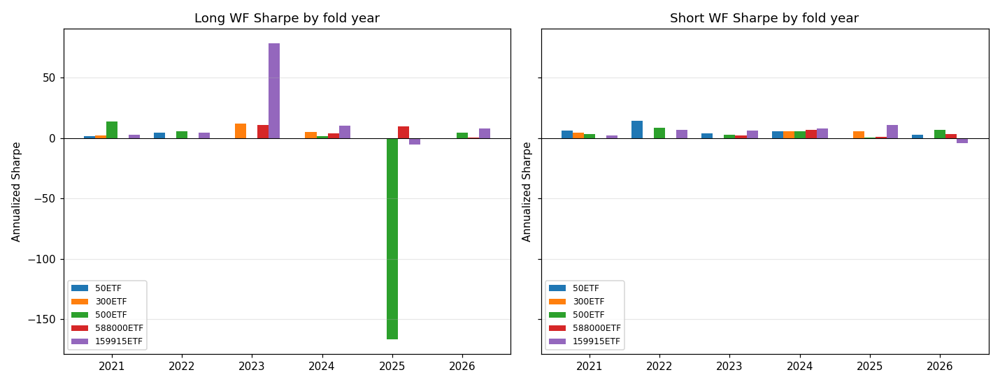
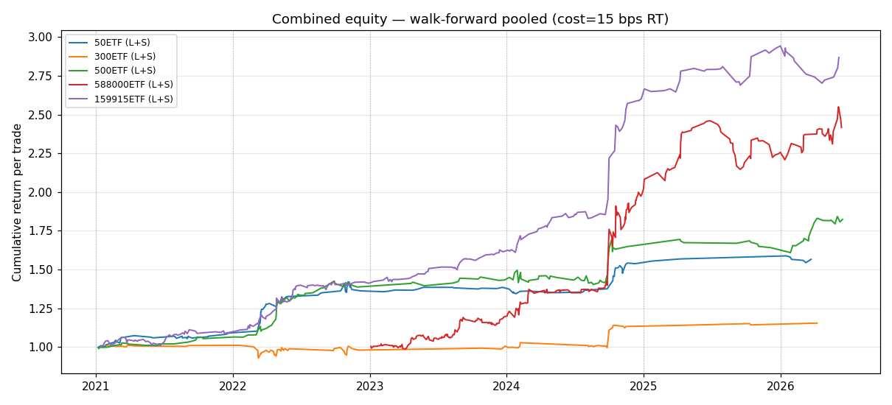
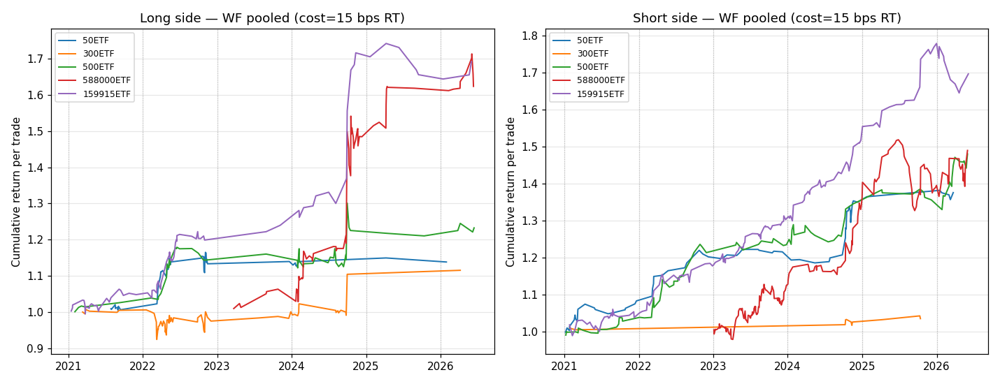

# Daytrade — Frozen-Linear Intraday Alpha (Walk-Forward Calibrated)

*Signal = frozen LASSO/Huber coefficients from day-model (target = `trade_return`, log return from entry-open to exit-close). Per-side (threshold, conviction, stop, exit_bar, mode) selected via **purged expanding-window walk-forward** (yearly folds, train = all prior years). No hyperparameter snooping. Decision at close[DECISION_BAR[etf]] -> entry at open[DECISION_BAR[etf]+1] -> exit dynamically selected per fold (between 13:05 and 14:55). Cost 15 bps round-trip.*

## 1. Strategy

- **Signal**: frozen LASSO/Huber/ElasticNet score from `day-model/models/linear_{ETF}.joblib`
- **Model target**: `trade_return` = log(close[EXIT_BAR] / open[decision_bar+1]) — mirrors actual trade P&L exactly
- **Per-side thresholds**: expanding-window percentile of |score| computed only over that side's prior history (causal: `series.shift(1)`)
- **Direction**: `long_model` fires when score>0 & crosses long thresholds; `short_model` fires when score<0 & crosses short thresholds
- **Calibration**: walk-forward yearly folds (test year Y, train = all years < Y, 1-day purge gap). Grid-search (thr, conv, stop, exit_bar) per fold using train-window data only; deploy on the test year. Trades stitched across test folds → pooled WF metrics.
- **Eligibility guard (per fold)**: train P&L>0 AND train Sharpe>0 AND n≥20. A side **deploys** only if eligible in ≥50% of folds AND pooled WF Sharpe>0.
- **Mode**: **mixed** (Phase 4 per-side deployment). Each side uses the mode (single/hybrid/dual, optionally +gated) with the highest pooled WF Sharpe among configs that pass the eligibility majority gate.
- **Decision/Entry**: per-ETF `DECISION_BAR` (see day-model/build_features.py).
- **Exit bar**: dynamically optimized per fold (between bar 24 [13:05] and bar 46 [14:55], default 41 [14:30])
- **Cost**: 15 bps round-trip (parametrizable)

## 2. Deployed Configurations

### 2.1 Deployed Modes & Performance

| ETF | Long mode | Long pooled S | Long elig | Short mode | Short pooled S | Short elig |
|-----|-----------|---------------|-----------|------------|----------------|------------|
| 50ETF | **dual+gated** | +3.71 | 6/6 | **single+gated** | +5.90 | 6/6 |
| 300ETF | **hybrid+gated** | +1.67 | 6/6 | **single** | +5.72 | 6/6 |
| 500ETF | **hybrid+gated** | +3.11 | 6/6 | **dual+gated** | +5.49 | 6/6 |
| 588000ETF | **single** | +3.88 | 4/4 | **single** | +2.61 | 4/4 |
| 159915ETF | **single+gated** | +4.72 | 6/6 | **hybrid** | +4.94 | 6/6 |

### 2.2 Summary of Deployed Stop Loss & Take-Profit Exit Times

| ETF | Side | Mode | Selected Stop Loss Types (across folds) | Selected Exit Times (across folds) |
|-----|------|------|-----------------------------------------|------------------------------------|
| 50ETF | `long` | **dual+gated** | 3.5×ATR | 41 (14:30) |
| 50ETF | `short` | **single+gated** | 4.00%, str+0.50%, str+1.00% | 42 (14:35), 44 (14:45) |
| 300ETF | `long` | **hybrid+gated** | 3.5×ATR, 4.00% | 41 (14:30), 46 (14:55) |
| 300ETF | `short` | **single** | str+0.50% | 24 (13:05), 44 (14:45) |
| 500ETF | `long` | **hybrid+gated** | 3.5×ATR, 5.00% | 28 (13:25), 41 (14:30), 46 (14:55) |
| 500ETF | `short` | **dual+gated** | str+1.00%, struct | 46 (14:55) |
| 588000ETF | `long` | **single** | 3.00%, 3.5×ATR | 24 (13:05), 32 (13:45), 46 (14:55) |
| 588000ETF | `short` | **single** | 3.5×ATR, str+0.5×ATR | 42 (14:35), 44 (14:45) |
| 159915ETF | `long` | **single+gated** | 5.00%, str+1.0×ATR | 46 (14:55) |
| 159915ETF | `short` | **hybrid** | str+1.0×ATR | 44 (14:45), 46 (14:55) |

### 2.3 Per-Fold Config Stability & Execution Details

Shows the (mode / threshold / conviction / stop / exit time) chosen for each fold's test year, plus train and test Sharpe. Variation across years exposes regime drift; consistency suggests a stable edge.

**50ETF / long** (mode=dual+gated, pooled WF S=+3.71, elig 6/6):
| Fold | Thr | Conv | Stop | Exit Time | Train S | Train P&L | Train N | Test S | Test P&L | Test N |
|------|-----|------|------|-----------|---------|-----------|---------|--------|-----------|--------|
| 2021 | 50 | 90 | 3.5×ATR | 41 (14:30) | +2.66 | +1414 | 29 | +3.06 | +168 | 10 |
| 2022 | 50 | 90 | 3.5×ATR | 41 (14:30) | +2.54 | +1582 | 39 | +4.24 | +1215 | 36 |
| 2023 | 50 | 90 | 3.5×ATR | 41 (14:30) | +2.94 | +2796 | 75 | +nan | +55 | 1 |
| 2024 | 50 | 90 | 3.5×ATR | 41 (14:30) | +2.98 | +2851 | 76 | -0.02 | -1 | 5 |
| 2025 | 50 | 90 | 3.5×ATR | 41 (14:30) | +2.87 | +2851 | 81 | +nan | +88 | 1 |
| 2026 | 50 | 90 | 3.5×ATR | 41 (14:30) | +2.94 | +2939 | 82 | +nan | -97 | 1 |

**50ETF / short** (mode=single+gated, pooled WF S=+5.90, elig 6/6):
| Fold | Thr | Conv | Stop | Exit Time | Train S | Train P&L | Train N | Test S | Test P&L | Test N |
|------|-----|------|------|-----------|---------|-----------|---------|--------|-----------|--------|
| 2021 | 50 | 80 | str+0.50% | 44 (14:45) | +4.02 | +1727 | 56 | +6.15 | +806 | 18 |
| 2022 | 50 | 80 | 4.00% | 42 (14:35) | +4.99 | +2703 | 74 | +8.00 | +831 | 12 |
| 2023 | 50 | 80 | 4.00% | 44 (14:45) | +5.34 | +3408 | 86 | +3.64 | +113 | 12 |
| 2024 | 50 | 80 | 4.00% | 44 (14:45) | +5.02 | +3458 | 98 | +5.64 | +1070 | 22 |
| 2025 | 50 | 90 | str+1.00% | 44 (14:45) | +6.69 | +3117 | 64 | +nan | +109 | 1 |
| 2026 | 50 | 90 | str+1.00% | 44 (14:45) | +6.86 | +3230 | 65 | +2.46 | +84 | 5 |

**300ETF / long** (mode=hybrid+gated, pooled WF S=+1.67, elig 6/6):
| Fold | Thr | Conv | Stop | Exit Time | Train S | Train P&L | Train N | Test S | Test P&L | Test N |
|------|-----|------|------|-----------|---------|-----------|---------|--------|-----------|--------|
| 2021 | 50 | 80 | 4.00% | 41 (14:30) | +4.92 | +2661 | 54 | +2.26 | +56 | 6 |
| 2022 | 50 | 80 | 4.00% | 46 (14:55) | +4.72 | +2718 | 60 | -0.61 | -253 | 45 |
| 2023 | 50 | 80 | 3.5×ATR | 46 (14:55) | +2.97 | +2812 | 105 | +12.10 | +261 | 5 |
| 2024 | 50 | 80 | 3.5×ATR | 46 (14:55) | +3.11 | +3025 | 110 | +4.84 | +1019 | 15 |
| 2025 | 50 | 80 | 3.5×ATR | 46 (14:55) | +3.13 | +3599 | 125 | +nan | +0 | 0 |
| 2026 | 50 | 80 | 3.5×ATR | 46 (14:55) | +3.13 | +3599 | 125 | +nan | +99 | 1 |

**300ETF / short** (mode=single, pooled WF S=+5.72, elig 6/6):
| Fold | Thr | Conv | Stop | Exit Time | Train S | Train P&L | Train N | Test S | Test P&L | Test N |
|------|-----|------|------|-----------|---------|-----------|---------|--------|-----------|--------|
| 2021 | 95 | 40 | str+0.50% | 24 (13:05) | +3.27 | +825 | 37 | +4.07 | +45 | 2 |
| 2022 | 95 | 40 | str+0.50% | 24 (13:05) | +3.22 | +844 | 39 | +nan | +0 | 0 |
| 2023 | 95 | 40 | str+0.50% | 24 (13:05) | +3.22 | +844 | 39 | +nan | +0 | 0 |
| 2024 | 95 | 40 | str+0.50% | 24 (13:05) | +3.22 | +844 | 39 | +5.43 | +210 | 7 |
| 2025 | 95 | 40 | str+0.50% | 44 (14:45) | +4.08 | +1421 | 46 | +5.29 | +90 | 3 |
| 2026 | 95 | 40 | str+0.50% | 44 (14:45) | +4.41 | +1605 | 49 | +nan | +0 | 0 |

**500ETF / long** (mode=hybrid+gated, pooled WF S=+3.11, elig 6/6):
| Fold | Thr | Conv | Stop | Exit Time | Train S | Train P&L | Train N | Test S | Test P&L | Test N |
|------|-----|------|------|-----------|---------|-----------|---------|--------|-----------|--------|
| 2021 | 50 | 80 | 5.00% | 46 (14:55) | +8.15 | +4946 | 64 | +11.37 | +255 | 6 |
| 2022 | 50 | 80 | 5.00% | 46 (14:55) | +8.13 | +5195 | 70 | +5.75 | +1109 | 21 |
| 2023 | 50 | 80 | 5.00% | 41 (14:30) | +7.84 | +6397 | 91 | +nan | +148 | 1 |
| 2024 | 50 | 80 | 5.00% | 41 (14:30) | +7.96 | +6545 | 92 | +1.55 | +619 | 26 |
| 2025 | 50 | 90 | 3.5×ATR | 28 (13:25) | +4.44 | +2927 | 53 | -166.68 | -122 | 2 |
| 2026 | 50 | 90 | 3.5×ATR | 46 (14:55) | +4.30 | +2896 | 55 | +4.58 | +185 | 4 |

**500ETF / short** (mode=dual+gated, pooled WF S=+5.49, elig 6/6):
| Fold | Thr | Conv | Stop | Exit Time | Train S | Train P&L | Train N | Test S | Test P&L | Test N |
|------|-----|------|------|-----------|---------|-----------|---------|--------|-----------|--------|
| 2021 | 50 | 90 | str+1.00% | 46 (14:55) | +4.26 | +4001 | 83 | +3.44 | +280 | 16 |
| 2022 | 50 | 90 | str+1.00% | 46 (14:55) | +4.02 | +4202 | 99 | +8.20 | +1686 | 22 |
| 2023 | 50 | 90 | str+1.00% | 46 (14:55) | +4.17 | +5136 | 121 | +2.75 | +181 | 9 |
| 2024 | 50 | 90 | str+1.00% | 46 (14:55) | +4.08 | +5322 | 130 | +5.33 | +935 | 17 |
| 2025 | 95 | 40 | struct | 46 (14:55) | +4.05 | +3068 | 78 | +0.57 | +30 | 8 |
| 2026 | 50 | 90 | str+1.00% | 46 (14:55) | +3.96 | +6324 | 160 | +6.56 | +892 | 15 |

**588000ETF / long** (mode=single, pooled WF S=+3.88, elig 4/4):
| Fold | Thr | Conv | Stop | Exit Time | Train S | Train P&L | Train N | Test S | Test P&L | Test N |
|------|-----|------|------|-----------|---------|-----------|---------|--------|-----------|--------|
| 2023 | 50 | 80 | 3.00% | 46 (14:55) | +5.20 | +2195 | 39 | +10.75 | +628 | 6 |
| 2024 | 50 | 80 | 3.00% | 46 (14:55) | +5.40 | +2569 | 45 | +3.49 | +3593 | 49 |
| 2025 | 95 | 40 | 3.5×ATR | 32 (13:45) | +7.80 | +5296 | 32 | +9.73 | +879 | 8 |
| 2026 | 95 | 40 | 3.5×ATR | 24 (13:05) | +7.96 | +6214 | 40 | +0.42 | +44 | 10 |

**588000ETF / short** (mode=single, pooled WF S=+2.61, elig 4/4):
| Fold | Thr | Conv | Stop | Exit Time | Train S | Train P&L | Train N | Test S | Test P&L | Test N |
|------|-----|------|------|-----------|---------|-----------|---------|--------|-----------|--------|
| 2023 | 50 | 40 | 3.5×ATR | 44 (14:45) | +4.41 | +3246 | 103 | +2.07 | +1229 | 98 |
| 2024 | 50 | 40 | str+0.5×ATR | 42 (14:35) | +3.09 | +4056 | 201 | +6.75 | +1935 | 38 |
| 2025 | 50 | 80 | str+0.5×ATR | 44 (14:45) | +4.81 | +3189 | 88 | +0.72 | +293 | 38 |
| 2026 | 50 | 80 | str+0.5×ATR | 44 (14:45) | +3.26 | +3634 | 126 | +3.02 | +696 | 16 |

**159915ETF / long** (mode=single+gated, pooled WF S=+4.72, elig 6/6):
| Fold | Thr | Conv | Stop | Exit Time | Train S | Train P&L | Train N | Test S | Test P&L | Test N |
|------|-----|------|------|-----------|---------|-----------|---------|--------|-----------|--------|
| 2021 | 50 | 80 | 5.00% | 46 (14:55) | +11.09 | +6450 | 45 | +2.57 | +493 | 28 |
| 2022 | 50 | 80 | 5.00% | 46 (14:55) | +7.87 | +6770 | 73 | +4.62 | +1375 | 33 |
| 2023 | 50 | 90 | 5.00% | 46 (14:55) | +5.73 | +2981 | 50 | +78.11 | +336 | 2 |
| 2024 | 50 | 90 | 5.00% | 46 (14:55) | +6.13 | +3267 | 52 | +9.89 | +3385 | 13 |
| 2025 | 95 | 40 | 5.00% | 46 (14:55) | +6.67 | +3366 | 27 | -5.47 | -348 | 5 |
| 2026 | 50 | 90 | str+1.0×ATR | 46 (14:55) | +4.92 | +5255 | 75 | +7.90 | +219 | 3 |

**159915ETF / short** (mode=hybrid, pooled WF S=+4.94, elig 6/6):
| Fold | Thr | Conv | Stop | Exit Time | Train S | Train P&L | Train N | Test S | Test P&L | Test N |
|------|-----|------|------|-----------|---------|-----------|---------|--------|-----------|--------|
| 2021 | 50 | 80 | str+1.0×ATR | 44 (14:45) | +4.68 | +4347 | 108 | +1.85 | +390 | 26 |
| 2022 | 50 | 80 | str+1.0×ATR | 44 (14:45) | +3.89 | +4520 | 134 | +6.76 | +1279 | 28 |
| 2023 | 50 | 80 | str+1.0×ATR | 46 (14:55) | +4.28 | +5743 | 162 | +5.90 | +1020 | 45 |
| 2024 | 50 | 80 | str+1.0×ATR | 46 (14:55) | +4.24 | +6596 | 207 | +7.90 | +1543 | 33 |
| 2025 | 50 | 90 | str+1.0×ATR | 46 (14:55) | +4.57 | +3431 | 94 | +10.98 | +1614 | 17 |
| 2026 | 95 | 40 | str+1.0×ATR | 46 (14:55) | +6.90 | +2988 | 43 | -4.46 | -459 | 9 |

## 3. Walk-Forward OOS Performance (15 bps round-trip)

All metrics below are **pooled across test folds** (no IS/OOS split at a fixed date). Each fold's config was selected using train-window data only.

### 3.1 Per-Side Pooled WF Metrics

*Place%* = side trades / total trading days across all test folds (capital deployment rate).

*Warnings* = non-blocking fragility flags (`median<=0`, `win<=50%`, `n<60`).

| ETF | Side | N WF | Place% | Win% | Sharpe | P&L bps | MaxDD bps | Mean bps | Median bps | Warnings |
|-----|------|------|--------|------|--------|---------|-----------|----------|------------|----------|
| 50ETF | `long` | 53 | 4.0% | 56.6% | +3.51 | +1335 | -398 | +25.2 | +26.6 | n<60 |
| 50ETF | `short` | 69 | 5.2% | 65.2% | +6.65 | +3236 | -326 | +46.9 | +41.7 | — |
| 300ETF | `long` | 72 | 5.5% | 52.8% | +1.67 | +1183 | -841 | +16.4 | +10.3 | — |
| 300ETF | `short` | 12 | 0.9% | 66.7% | +5.72 | +344 | -155 | +28.7 | +44.2 | n<60 |
| 500ETF | `long` | 59 | 4.5% | 55.9% | +3.14 | +2199 | -704 | +37.3 | +16.2 | n<60 |
| 500ETF | `short` | 87 | 6.6% | 60.9% | +5.49 | +4003 | -403 | +46.0 | +52.8 | — |
| 588000ETF | `long` | 73 | 8.7% | 60.3% | +3.88 | +5144 | -836 | +70.5 | +41.8 | — |
| 588000ETF | `short` | 190 | 22.8% | 58.4% | +2.61 | +4153 | -1337 | +21.9 | +22.9 | — |
| 159915ETF | `long` | 84 | 6.4% | 59.5% | +4.72 | +5460 | -572 | +65.0 | +37.4 | — |
| 159915ETF | `short` | 158 | 12.0% | 70.3% | +4.94 | +5386 | -770 | +34.1 | +36.8 | — |

### 3.2 Combined (Long+Short) Per ETF

| ETF | N WF | L Place% | S Place% | Tot Place% | Win% | Sharpe | P&L bps | MaxDD bps |
|-----|------|----------|----------|------------|------|--------|---------|-----------|
| **50ETF** | 122 | 4.0% | 5.2% | 9.2% | 61.5% | +5.27 | +4571 | -548 |
| **300ETF** | 84 | 5.5% | 0.9% | 6.4% | 54.8% | +1.96 | +1527 | -841 |
| **500ETF** | 146 | 4.5% | 6.6% | 11.1% | 58.9% | +4.29 | +6202 | -605 |
| **588000ETF** | 263 | 8.7% | 22.8% | 31.5% | 58.9% | +2.95 | +9298 | -1352 |
| **159915ETF** | 242 | 6.4% | 12.0% | 18.3% | 66.5% | +4.54 | +10846 | -842 |

### 3.3 Year-by-Year Sharpe (fold-aligned)

| ETF | Side | 2021 | 2022 | 2023 | 2024 | 2025 | 2026 |
|-----|------|---|---|---|---|---|---|
| 50ETF | `long` | +1.49 | +4.24 | — | -0.02 | — | — |
| 50ETF | `short` | +6.15 | +14.21 | +3.64 | +5.64 | — | +2.46 |
| 300ETF | `long` | +2.26 | -0.61 | +12.10 | +4.84 | — | — |
| 300ETF | `short` | +4.07 | — | — | +5.43 | +5.29 | — |
| 500ETF | `long` | +13.49 | +5.75 | — | +1.55 | -166.68 | +4.58 |
| 500ETF | `short` | +3.44 | +8.20 | +2.75 | +5.33 | +0.57 | +6.56 |
| 588000ETF | `long` | — | — | +10.75 | +3.49 | +9.73 | +0.42 |
| 588000ETF | `short` | — | — | +2.07 | +6.75 | +0.72 | +3.02 |
| 159915ETF | `long` | +2.57 | +4.62 | +78.11 | +9.89 | -5.47 | +7.90 |
| 159915ETF | `short` | +1.85 | +6.76 | +5.90 | +7.90 | +10.98 | -4.46 |

### 3.4 Cost Sensitivity (per-side, same per-fold configs)

_Per-fold configs are fixed (chosen at 15 bps). Cost sweep re-evaluates P&L only; it is a sensitivity diagnostic, not a re-optimisation._

| ETF | Side | 5 bps | 15 bps | 30 bps |
|-----|------|-------|--------|--------|
| 50ETF | `long` | +5.11 | +3.71 | +1.60 |
| 50ETF | `short` | +7.27 | +5.90 | +3.85 |
| 300ETF | `long` | +2.68 | +1.67 | +0.15 |
| 300ETF | `short` | +7.71 | +5.72 | +2.73 |
| 500ETF | `long` | +3.96 | +3.11 | +1.83 |
| 500ETF | `short` | +6.68 | +5.49 | +3.70 |
| 588000ETF | `long` | +4.43 | +3.88 | +3.06 |
| 588000ETF | `short` | +3.80 | +2.61 | +0.82 |
| 159915ETF | `long` | +5.44 | +4.72 | +3.63 |
| 159915ETF | `short` | +6.38 | +4.94 | +2.76 |

### 3.5 Equity Curves (stitched across WF test folds)

### 3.6 Fragility Warnings Summary

Non-blocking transparency flags. A side with warnings is still deployed (passes the hard eligibility majority gate) but the positive Sharpe may be a small-sample / heavy-tail artifact. Investigate before sizing.

| ETF | Side | N WF | Median bps | Win% | Warnings |
|-----|------|------|------------|------|----------|
| 50ETF | `long` | 53 | +26.6 | 56.6% | n<60 |
| 50ETF | `short` | 69 | +41.7 | 65.2% | — |
| 300ETF | `long` | 72 | +10.3 | 52.8% | — |
| 300ETF | `short` | 12 | +44.2 | 66.7% | n<60 |
| 500ETF | `long` | 59 | +16.2 | 55.9% | n<60 |
| 500ETF | `short` | 87 | +52.8 | 60.9% | — |
| 588000ETF | `long` | 73 | +41.8 | 60.3% | — |
| 588000ETF | `short` | 190 | +22.9 | 58.4% | — |
| 159915ETF | `long` | 84 | +37.4 | 59.5% | — |
| 159915ETF | `short` | 158 | +36.8 | 70.3% | — |

## 4. Diagnostic: Cluster Confusion (WF traded days)

Of days traded on each side, what fraction belonged to day-trading's discovered Rally/Selloff/Neutral clusters?

| ETF | Side | N | Rally% | Selloff% | Neutral% |
|-----|------|---|--------|----------|----------|
| 50ETF | `long` | 53 | 36% | 26% | 38% |
| 50ETF | `short` | 69 | 6% | 43% | 51% |
| 300ETF | `long` | 72 | 46% | 12% | 42% |
| 300ETF | `short` | 12 | 25% | 67% | 8% |
| 500ETF | `long` | 59 | 68% | 3% | 29% |
| 500ETF | `short` | 87 | 5% | 51% | 45% |
| 588000ETF | `long` | 73 | 40% | 18% | 42% |
| 588000ETF | `short` | 190 | 8% | 45% | 47% |
| 159915ETF | `long` | 84 | 61% | 5% | 35% |
| 159915ETF | `short` | 158 | 3% | 42% | 55% |

## 5. Mode Comparison (Phase 4 — all walk-forward)

Each side deploys the mode with the highest pooled WF Sharpe among configs that pass the eligibility majority gate.

| ETF | Side | Single | Hybrid | Dual | Single+g | Hybrid+g | Dual+g | **Deployed** |
|-----|------|--------|--------|------|----------|----------|--------|--------------|
| 50ETF | `long` | +1.82 | +2.14 | +2.77 | +3.06 | +3.16 | +3.71 | **dual+gated** (+3.71) |
| 50ETF | `short` | +1.46 | +2.19 | — | +5.90 | +4.75 | — | **single+gated** (+5.90) |
| 300ETF | `long` | — | +0.43 | +0.30 | +0.63 | +1.67 | +0.88 | **hybrid+gated** (+1.67) |
| 300ETF | `short` | +5.72 | — | — | +2.87 | — | +1.42 | **single** (+5.72) |
| 500ETF | `long` | +2.00 | +1.86 | +1.24 | +2.84 | +3.11 | +2.21 | **hybrid+gated** (+3.11) |
| 500ETF | `short` | +2.49 | +2.99 | +2.81 | +4.80 | +3.12 | +5.49 | **dual+gated** (+5.49) |
| 588000ETF | `long` | +3.88 | +0.61 | — | +3.44 | +1.21 | — | **single** (+3.88) |
| 588000ETF | `short` | +2.61 | +2.56 | — | +1.87 | +1.75 | — | **single** (+2.61) |
| 159915ETF | `long` | +4.57 | +2.13 | — | +4.72 | +3.16 | +0.17 | **single+gated** (+4.72) |
| 159915ETF | `short` | +4.23 | +4.94 | +1.75 | +4.33 | +4.14 | +1.58 | **hybrid** (+4.94) |

**Total deployed pooled WF Sharpe**: +41.73

## 5.5 Gating Impact (v3, walk-forward)

Per-side pooled WF Sharpe: best ungated mode vs best gated mode.

| ETF | Side | Best Ungated | Best Gated | Δ | Deployed |
|-----|------|--------------|------------|---|----------|
| 50ETF | `long` | +2.77 | +3.71 | +0.93 | **dual+gated** (+3.71) |
| 50ETF | `short` | +2.19 | +5.90 | +3.71 | **single+gated** (+5.90) |
| 300ETF | `long` | +0.43 | +1.67 | +1.23 | **hybrid+gated** (+1.67) |
| 300ETF | `short` | +5.72 | +2.87 | -2.84 | **single** (+5.72) |
| 500ETF | `long` | +2.00 | +3.11 | +1.11 | **hybrid+gated** (+3.11) |
| 500ETF | `short` | +2.99 | +5.49 | +2.50 | **dual+gated** (+5.49) |
| 588000ETF | `long` | +3.88 | +3.44 | -0.44 | **single** (+3.88) |
| 588000ETF | `short` | +2.61 | +1.87 | -0.73 | **single** (+2.61) |
| 159915ETF | `long` | +4.57 | +4.72 | +0.15 | **single+gated** (+4.72) |
| 159915ETF | `short` | +4.94 | +4.33 | -0.61 | **hybrid** (+4.94) |

**Totals** — Ungated: +32.09 | Gated: +37.11 | Deployed: +41.73 (Δ vs ungated = +9.64)

## 6. Verdict

- **Robust long (pooled WF Sharpe ≥ +1.5)**: 50ETF, 300ETF, 500ETF, 588000ETF, 159915ETF
- **Robust short (pooled WF Sharpe ≥ +1.5)**: 50ETF, 300ETF, 500ETF, 588000ETF, 159915ETF
- **Disabled long**: none
- **Disabled short**: none

_Note: the per-side deployability bar dropped from the previous single-split (Sharpe ≥ +2.0) to pooled-WF (Sharpe ≥ +1.5) because walk-forward metrics are honestly out-of-sample — the previous numbers were optimistically biased by hyperparameter selection on the reported window._

## 7. Caveats

- Short-side P&L assumes 15bps transaction cost; real options/margin/borrow costs not modeled
- Frozen coefficients = no regime adaptation; live IC decay will hurt deployability
- Exit bar dynamically optimized per fold (swept between 13:05 and 14:55 bar closes)
- No position sizing (fixed notional); drawdowns are per-unit-notional
- Walk-forward folds are yearly; intra-year regime shifts are not captured
- Per-fold small-sample noise (fold with <60 trades) is flagged via the `n<60` warning
- Cost sensitivity holds per-fold configs fixed; a true cost re-optimisation may shift choices