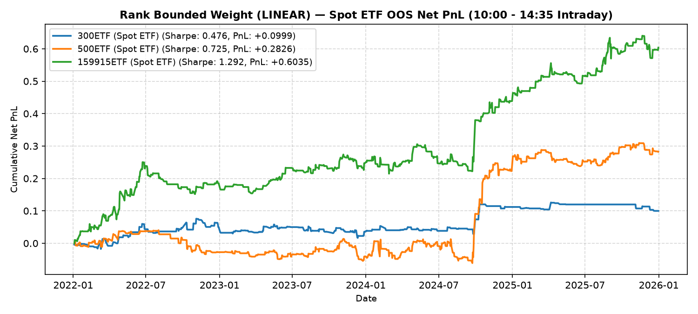

# NewTrade OOS Backtest Report

- **OOS Evaluation Period**: `2022-01-01 ~ 2026-01-01`
- **Intraday Trade Session**: `10:00 AM Open -> 14:35 PM Close`
- **Scheme(s)**: `ALL`
- **Conviction Threshold**: `auto` (buffer=+0.1)
- **Position Mode**: `binary`
- **Transaction Friction**: `8.0 bps`
- **Rank Mapping Options**: `mapping=linear, min_ratio=0.2, max_ratio=1.8, power=2.0`

## Rank Bounded Weight (Linear)

| ETF | Asset | Side | OOS Period | Z_th | Features | Trades | Cost Sharpe | Raw Sharpe | Total PnL | Max DD | Win Rate | Turnover |
| --- | --- | --- | --- | --- | --- | --- | --- | --- | --- | --- | --- | --- |
| 300ETF | Spot ETF | single | 2022-01 ~ 2025-12 | L:1.50/S:0.80 (train L:1.40/S:0.70) | 10 | 152 (11L/141S) | 0.476 | 1.450 | +0.0999 | 0.0592 | 53.3% (L:72.7%, S:51.8%) | 67.1x |
| 500ETF | Spot ETF | single | 2022-01 ~ 2025-12 | L:0.70/S:0.90 (train L:0.60/S:0.80) | 32 | 324 (207L/117S) | 0.725 | 1.813 | +0.2826 | 0.1015 | 57.4% (L:57.5%, S:57.3%) | 137.8x |
| 50ETF | Spot ETF | single | 2022-01 ~ 2026-01 | N/A | 0 | N/A | N/A | N/A | N/A | N/A | N/A | N/A |
| 588000ETF | Spot ETF | single | 2022-01 ~ 2026-01 | N/A | 0 | N/A | N/A | N/A | N/A | N/A | N/A | N/A |
| 159915ETF | Spot ETF | single | 2022-01 ~ 2025-12 | L:0.80/S:0.90 (train L:0.70/S:0.80) | 11 | 329 (172L/157S) | 1.292 | 2.214 | +0.6035 | 0.0986 | 55.9% (L:52.3%, S:59.9%) | 140.2x |

<b>Equal Weight (EW)</b> (click to expand)

| ETF | Asset | Side | OOS Period | Z_th | Features | Trades | Cost Sharpe | Raw Sharpe | Total PnL | Max DD | Win Rate | Turnover |
| --- | --- | --- | --- | --- | --- | --- | --- | --- | --- | --- | --- | --- |
| 300ETF | Spot ETF | single | 2022-01 ~ 2025-12 | L:1.20/S:1.00 (train L:1.10/S:0.90) | 10 | 47 (20L/27S) | 0.780 | 1.176 | +0.1378 | 0.0724 | 57.4% (L:70.0%, S:48.1%) | 23.4x |
| 500ETF | Spot ETF | single | 2022-01 ~ 2025-12 | L:0.70/S:0.90 (train L:0.60/S:0.80) | 32 | 229 (166L/63S) | 0.873 | 1.806 | +0.2945 | 0.0888 | 58.1% (L:57.8%, S:58.7%) | 102.5x |
| 50ETF | Spot ETF | single | 2022-01 ~ 2026-01 | N/A | 0 | N/A | N/A | N/A | N/A | N/A | N/A | N/A |
| 588000ETF | Spot ETF | single | 2022-01 ~ 2026-01 | N/A | 0 | N/A | N/A | N/A | N/A | N/A | N/A | N/A |
| 159915ETF | Spot ETF | single | 2022-01 ~ 2025-12 | L:0.90/S:0.90 (train L:0.80/S:0.80) | 11 | 283 (122L/161S) | 1.233 | 2.098 | +0.5510 | 0.0866 | 59.0% (L:58.2%, S:59.6%) | 125.9x |

<b>IC Weight (ICW)</b> (click to expand)

| ETF | Asset | Side | OOS Period | Z_th | Features | Trades | Cost Sharpe | Raw Sharpe | Total PnL | Max DD | Win Rate | Turnover |
| --- | --- | --- | --- | --- | --- | --- | --- | --- | --- | --- | --- | --- |
| 300ETF | Spot ETF | single | 2022-01 ~ 2025-12 | L:1.30/S:1.00 (train L:1.20/S:0.90) | 10 | 62 (20L/42S) | 0.815 | 1.334 | +0.1467 | 0.0652 | 58.1% (L:70.0%, S:52.4%) | 31.2x |
| 500ETF | Spot ETF | single | 2022-01 ~ 2025-12 | L:0.60/S:0.90 (train L:0.50/S:0.80) | 32 | 290 (216L/74S) | 0.980 | 1.998 | +0.3734 | 0.1022 | 58.6% (L:58.3%, S:59.5%) | 125.9x |
| 50ETF | Spot ETF | single | 2022-01 ~ 2026-01 | N/A | 0 | N/A | N/A | N/A | N/A | N/A | N/A | N/A |
| 588000ETF | Spot ETF | single | 2022-01 ~ 2026-01 | N/A | 0 | N/A | N/A | N/A | N/A | N/A | N/A | N/A |
| 159915ETF | Spot ETF | single | 2022-01 ~ 2025-12 | L:0.90/S:0.90 (train L:0.80/S:0.80) | 11 | 274 (119L/155S) | 1.141 | 2.004 | +0.4998 | 0.0891 | 58.0% (L:56.3%, S:59.4%) | 123.3x |

<b>Score Weighted</b> (click to expand)

| ETF | Asset | Side | OOS Period | Z_th | Features | Trades | Cost Sharpe | Raw Sharpe | Total PnL | Max DD | Win Rate | Turnover |
| --- | --- | --- | --- | --- | --- | --- | --- | --- | --- | --- | --- | --- |
| 300ETF | Spot ETF | single | 2022-01 ~ 2025-12 | L:1.50/S:0.80 (train L:1.40/S:0.70) | 10 | 145 (10L/135S) | 0.673 | 1.633 | +0.1384 | 0.0559 | 55.2% (L:70.0%, S:54.1%) | 65.0x |
| 500ETF | Spot ETF | single | 2022-01 ~ 2025-12 | L:0.70/S:0.90 (train L:0.60/S:0.80) | 32 | 328 (210L/118S) | 0.754 | 1.858 | +0.2943 | 0.0958 | 57.9% (L:58.1%, S:57.6%) | 139.9x |
| 50ETF | Spot ETF | single | 2022-01 ~ 2026-01 | N/A | 0 | N/A | N/A | N/A | N/A | N/A | N/A | N/A |
| 588000ETF | Spot ETF | single | 2022-01 ~ 2026-01 | N/A | 0 | N/A | N/A | N/A | N/A | N/A | N/A | N/A |
| 159915ETF | Spot ETF | single | 2022-01 ~ 2025-12 | L:0.70/S:0.90 (train L:0.60/S:0.80) | 11 | 352 (195L/157S) | 1.187 | 2.158 | +0.5650 | 0.1231 | 55.4% (L:51.8%, S:59.9%) | 150.1x |

