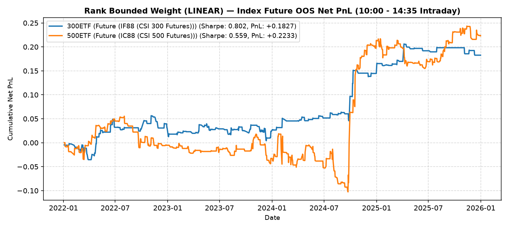

# NewTrade OOS Backtest Report

- **OOS Evaluation Period**: `2022-01-01 ~ 2026-01-01`
- **Intraday Trade Session**: `10:00 AM Open -> 14:35 PM Close`
- **Scheme(s)**: `RANK`
- **Conviction Threshold**: `auto` (buffer=+0.1)
- **Position Mode**: `binary`
- **Transaction Friction**: `8.0 bps`
- **Rank Mapping Options**: `mapping=linear, min_ratio=0.2, max_ratio=1.8, power=2.0`

## Rank Bounded Weight (Linear)

| ETF | Asset | Side | OOS Period | Z_th | Features | Trades | Cost Sharpe | Raw Sharpe | Total PnL | Max DD | Win Rate | Turnover |
| --- | --- | --- | --- | --- | --- | --- | --- | --- | --- | --- | --- | --- |
| 300ETF | Future (IF88 (CSI 300 Futures)) | single | 2022-01 ~ 2025-12 | L:1.40/S:0.80 (train L:1.30/S:0.70) | 10 | 143 (17L/126S) | 0.802 | 1.674 | +0.1827 | 0.0524 | 56.6% (L:76.5%, S:54.0%) | 66.1x |
| 500ETF | Future (IC88 (CSI 500 Futures)) | single | 2022-01 ~ 2025-12 | L:0.60/S:1.00 (train L:0.50/S:0.90) | 32 | 270 (226L/44S) | 0.559 | 1.420 | +0.2233 | 0.1579 | 55.2% (L:56.2%, S:50.0%) | 111.8x |
| 50ETF | Future | single | 2022-01 ~ 2026-01 | N/A | 0 | N/A | N/A | N/A | N/A | N/A | N/A | N/A |
| 588000ETF | Future | single | 2022-01 ~ 2026-01 | N/A | 0 | N/A | N/A | N/A | N/A | N/A | N/A | N/A |
| 159915ETF | Future (N/A) | single | 2022-01 ~ 2026-01 | N/A | 11 | N/A | N/A | N/A | N/A | N/A | N/A | N/A |
