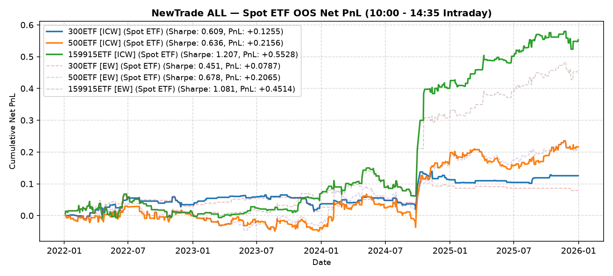

# NewTrade OOS Backtest Report

- **OOS Evaluation Period**: `2022-01-01 ~ 2026-01-01`
- **Intraday Trade Session**: `10:00 AM Open -> 14:35 PM Close`
- **Scheme(s)**: `ALL`
- **Conviction Threshold**: `auto` (buffer=+0.1)
- **Position Mode**: `binary`
- **Transaction Friction**: `8.0 bps`
- **Rank Mapping Options**: `mapping=linear, min_ratio=0.2, max_ratio=1.8, power=2.0`

## IC Weight (ICW)

| ETF | Asset | Side | OOS Period | Z_th | Features | Trades | Cost Sharpe | Raw Sharpe | Total PnL | Long PnL | Long Sharpe | Short PnL | Short Sharpe | Max DD | Win Rate | Turnover |
| --- | --- | --- | --- | --- | --- | --- | --- | --- | --- | --- | --- | --- | --- | --- | --- | --- |
| 300ETF | Spot ETF | single | 2022-01 ~ 2025-12 | L:1.30/S:1.00 (train L:1.20/S:0.90) | 10 | 62 (20L/42S) | 0.815 | 1.334 | +0.1467 | +0.1383 | 7.689 | +0.0564 | 2.402 | 0.0652 | 58.1% (L:70.0%, S:52.4%) | 31.2x |
| 500ETF | Spot ETF | single | 2022-01 ~ 2025-12 | L:0.80/S:1.30 (train L:0.70/S:1.20) | 32 | 219 (195L/24S) | 1.081 | 1.935 | +0.3514 | +0.3670 | 2.777 | +0.1156 | 6.189 | 0.0992 | 59.4% (L:59.0%, S:62.5%) | 91.0x |
| 50ETF | Spot ETF | single | 2022-01 ~ 2026-01 | N/A | 0 | N/A | N/A | N/A | N/A | N/A | N/A | N/A | N/A | N/A | N/A | N/A |
| 588000ETF | Spot ETF | single | 2022-01 ~ 2026-01 | N/A | 0 | N/A | N/A | N/A | N/A | N/A | N/A | N/A | N/A | N/A | N/A | N/A |
| 159915ETF | Spot ETF | single | 2022-01 ~ 2025-12 | L:1.00/S:1.10 (train L:0.90/S:1.00) | 11 | 203 (115L/88S) | 1.497 | 2.191 | +0.6053 | +0.5042 | 4.188 | +0.2283 | 4.255 | 0.0670 | 64.0% (L:60.9%, S:68.2%) | 92.6x |

<b>Equal Weight (EW)</b> (click to expand)

| ETF | Asset | Side | OOS Period | Z_th | Features | Trades | Cost Sharpe | Raw Sharpe | Total PnL | Long PnL | Long Sharpe | Short PnL | Short Sharpe | Max DD | Win Rate | Turnover |
| --- | --- | --- | --- | --- | --- | --- | --- | --- | --- | --- | --- | --- | --- | --- | --- | --- |
| 300ETF | Spot ETF | single | 2022-01 ~ 2025-12 | L:1.20/S:1.00 (train L:1.10/S:0.90) | 10 | 47 (20L/27S) | 0.780 | 1.176 | +0.1378 | +0.1383 | 7.689 | +0.0355 | 1.971 | 0.0724 | 57.4% (L:70.0%, S:48.1%) | 23.4x |
| 500ETF | Spot ETF | single | 2022-01 ~ 2025-12 | L:0.80/S:1.30 (train L:0.70/S:1.20) | 32 | 218 (193L/25S) | 1.035 | 1.893 | +0.3345 | +0.3515 | 2.688 | +0.1142 | 5.957 | 0.0992 | 59.2% (L:59.1%, S:60.0%) | 91.0x |
| 50ETF | Spot ETF | single | 2022-01 ~ 2026-01 | N/A | 0 | N/A | N/A | N/A | N/A | N/A | N/A | N/A | N/A | N/A | N/A | N/A |
| 588000ETF | Spot ETF | single | 2022-01 ~ 2026-01 | N/A | 0 | N/A | N/A | N/A | N/A | N/A | N/A | N/A | N/A | N/A | N/A | N/A |
| 159915ETF | Spot ETF | single | 2022-01 ~ 2025-12 | L:0.80/S:1.00 (train L:0.70/S:0.90) | 11 | 311 (174L/137S) | 1.141 | 2.073 | +0.5143 | +0.4573 | 2.736 | +0.2265 | 2.938 | 0.1123 | 56.9% (L:52.9%, S:62.0%) | 136.8x |

---

## Validation (DSR + CPCV)

- **DSR Trials**: `10`
- **CPCV**: `6` splits, `2` test chunks, purge=5

| ETF | Scheme | Sharpe | DSR | Verdict | CPCV Median | CPCV Std | % Positive |
| --- | --- | --- | --- | --- | --- | --- | --- |
| 300ETF | icw | 0.815 | 0.617 | NOT_SIGNIFICANT | 0.862 | 0.239 | 100% |
| 500ETF | icw | 1.081 | 0.781 | NOT_SIGNIFICANT | 1.260 | 0.558 | 100% |
| 159915ETF | icw | 1.497 | 0.955 | SIGNIFICANT | 1.026 | 0.377 | 100% |
| 300ETF | ew | 0.780 | 0.587 | NOT_SIGNIFICANT | 0.734 | 0.267 | 100% |
| 500ETF | ew | 1.035 | 0.748 | NOT_SIGNIFICANT | 1.180 | 0.571 | 100% |
| 159915ETF | ew | 1.141 | 0.796 | NOT_SIGNIFICANT | 0.968 | 0.328 | 100% |

