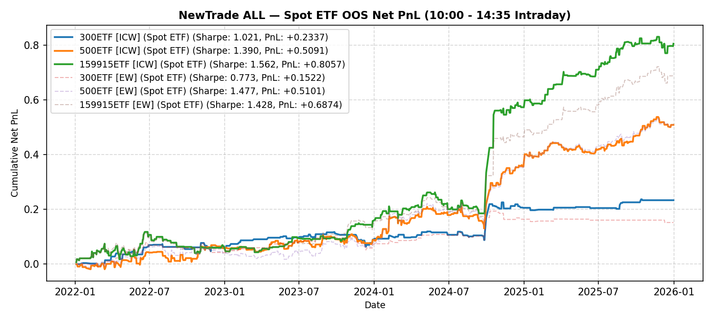

# NewTrade OOS Backtest Report

- **OOS Evaluation Period**: `2022-01-01 ~ 2026-01-01`
- **Intraday Trade Session**: `10:00 AM Open -> 14:35 PM Close`
- **Scheme(s)**: `ALL`
- **Conviction Threshold**: `auto` (buffer=+0.1)
- **Position Mode**: `binary`
- **Stop-Loss Execution**: `Enabled (time_decay_trailing=0.03)`
- **Transaction Friction**: `8.0 bps (+ 2.0 bps stop-loss execution slippage)`

## IC Weight (ICW)

| ETF | Asset | Side | OOS Period | Z_th | Features | Trades | Cost Sharpe | Raw Sharpe | Total PnL | Long PnL | Long Sharpe | Short PnL | Short Sharpe | Max DD | Win Rate | Turnover |
| --- | --- | --- | --- | --- | --- | --- | --- | --- | --- | --- | --- | --- | --- | --- | --- | --- |
| 300ETF | Spot ETF | single | 2022-01 ~ 2025-12 | L:1.10/S:1.30 (train L:1.00/S:1.20) | 22 | 118 (76L/42S) | 1.021 | 1.415 | +0.2337 | +0.1591 | 3.042 | +0.0746 | 2.837 | 0.0532 | 55.9% (L:56.6%, S:54.8%) | 59.8x |
| 500ETF | Spot ETF | single | 2022-01 ~ 2025-12 | L:0.70/S:1.10 (train L:0.60/S:1.00) | 193 | 383 (253L/130S) | 1.390 | 2.220 | +0.5091 | +0.1559 | 1.084 | +0.3532 | 4.235 | 0.0814 | 54.8% (L:53.4%, S:57.7%) | 161.2x |
| 50ETF | Spot ETF | single | 2022-01 ~ 2026-01 | N/A | 0 | N/A | N/A | N/A | N/A | N/A | N/A | N/A | N/A | N/A | N/A | N/A |
| 159915ETF | Spot ETF | single | 2022-01 ~ 2025-12 | L:0.90/S:1.10 (train L:0.80/S:1.00) | 27 | 253 (154L/99S) | 1.562 | 1.950 | +0.8057 | +0.5079 | 3.012 | +0.2978 | 3.295 | 0.0777 | 58.1% (L:53.9%, S:64.6%) | 115.7x |

<b>Equal Weight (EW)</b> (click to expand)

| ETF | Asset | Side | OOS Period | Z_th | Features | Trades | Cost Sharpe | Raw Sharpe | Total PnL | Long PnL | Long Sharpe | Short PnL | Short Sharpe | Max DD | Win Rate | Turnover |
| --- | --- | --- | --- | --- | --- | --- | --- | --- | --- | --- | --- | --- | --- | --- | --- | --- |
| 300ETF | Spot ETF | single | 2022-01 ~ 2025-12 | L:1.40/S:1.20 (train L:1.30/S:1.10) | 22 | 98 (39L/59S) | 0.773 | 1.159 | +0.1522 | +0.1082 | 3.388 | +0.0440 | 1.614 | 0.0458 | 57.1% (L:61.5%, S:54.2%) | 49.4x |
| 500ETF | Spot ETF | single | 2022-01 ~ 2025-12 | L:0.70/S:1.20 (train L:0.60/S:1.10) | 193 | 358 (247L/111S) | 1.477 | 2.294 | +0.5101 | +0.1209 | 0.903 | +0.3892 | 5.452 | 0.0779 | 56.1% (L:53.4%, S:62.2%) | 146.2x |
| 50ETF | Spot ETF | single | 2022-01 ~ 2026-01 | N/A | 0 | N/A | N/A | N/A | N/A | N/A | N/A | N/A | N/A | N/A | N/A | N/A |
| 159915ETF | Spot ETF | single | 2022-01 ~ 2025-12 | L:0.90/S:1.10 (train L:0.80/S:1.00) | 27 | 248 (152L/96S) | 1.428 | 1.838 | +0.6874 | +0.5222 | 3.142 | +0.1652 | 2.358 | 0.0777 | 58.5% (L:55.9%, S:62.5%) | 113.4x |

---

## Validation (DSR + CPCV)

- **DSR Trials**: `10`
- **CPCV**: `6` splits, `2` test chunks, purge=5

| ETF | Scheme | Sharpe | DSR | Verdict | CPCV Median | CPCV Std | % Positive |
| --- | --- | --- | --- | --- | --- | --- | --- |
| 300ETF | icw | 1.021 | 0.787 | NOT_SIGNIFICANT | 0.542 | 0.125 | 100% |
| 500ETF | icw | 1.390 | 0.924 | MARGINAL | 0.531 | 0.431 | 93% |
| 159915ETF | icw | 1.562 | 0.995 | SIGNIFICANT | 1.133 | 0.288 | 100% |
| 300ETF | ew | 0.773 | 0.550 | NOT_SIGNIFICANT | 0.450 | 0.217 | 100% |
| 500ETF | ew | 1.477 | 0.943 | MARGINAL | 0.795 | 0.385 | 93% |
| 159915ETF | ew | 1.428 | 0.980 | SIGNIFICANT | 1.024 | 0.324 | 100% |

