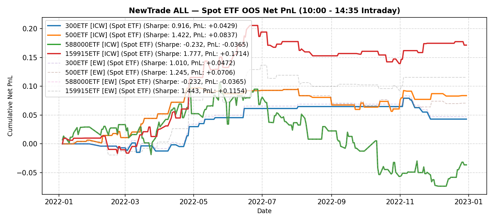

# NewTrade OOS Backtest Report

- **OOS Evaluation Period**: `2022-01-01 ~ 2023-01-01`
- **Intraday Trade Session**: `10:00 AM Open -> 14:35 PM Close`
- **Scheme(s)**: `ALL`
- **Conviction Threshold**: `auto` (buffer=+0.1)
- **Position Mode**: `binary`
- **Stop-Loss Execution**: `Disabled (Hold to 14:35 Close)`
- **Transaction Friction**: `8.0 bps`

## IC Weight (ICW)

| ETF | Asset | Side | OOS Period | Z_th | Features | Trades | Cost Sharpe | Raw Sharpe | Total PnL | Long PnL | Long Sharpe | Short PnL | Short Sharpe | Max DD | Win Rate | Turnover |
| --- | --- | --- | --- | --- | --- | --- | --- | --- | --- | --- | --- | --- | --- | --- | --- | --- |
| 300ETF | Spot ETF | single | 2022-01 ~ 2022-12 | L:1.30/S:1.00 (train L:1.20/S:0.90) | 10 | 23 (7L/16S) | 0.916 | 1.638 | +0.0429 | +0.0391 | 8.523 | +0.0039 | 0.425 | 0.0363 | 52.2% (L:71.4%, S:43.8%) | 45.8x |
| 500ETF | Spot ETF | single | 2022-01 ~ 2022-12 | L:0.80/S:1.30 (train L:0.70/S:1.20) | 32 | 46 (39L/7S) | 1.422 | 2.564 | +0.0837 | +0.0208 | 1.100 | +0.0629 | 13.778 | 0.0409 | 63.0% (L:61.5%, S:71.4%) | 81.2x |
| 50ETF | Spot ETF | single | 2022-01 ~ 2023-01 | N/A | 0 | N/A | N/A | N/A | N/A | N/A | N/A | N/A | N/A | N/A | N/A | N/A |
| 588000ETF | Spot ETF | single | 2022-01 ~ 2022-12 | L:0.80/S:0.60 (train L:0.70/S:0.50) | 1 | 138 (59L/79S) | -0.232 | 1.170 | -0.0365 | +0.0464 | 0.966 | -0.0828 | -1.178 | 0.1858 | 50.7% (L:49.2%, S:51.9%) | 197.8x |
| 159915ETF | Spot ETF | single | 2022-01 ~ 2022-12 | L:1.00/S:1.10 (train L:0.90/S:1.00) | 11 | 62 (33L/29S) | 1.777 | 2.733 | +0.1714 | +0.1015 | 3.558 | +0.0699 | 3.696 | 0.0662 | 64.5% (L:66.7%, S:62.1%) | 118.7x |

<b>Equal Weight (EW)</b> (click to expand)

| ETF | Asset | Side | OOS Period | Z_th | Features | Trades | Cost Sharpe | Raw Sharpe | Total PnL | Long PnL | Long Sharpe | Short PnL | Short Sharpe | Max DD | Win Rate | Turnover |
| --- | --- | --- | --- | --- | --- | --- | --- | --- | --- | --- | --- | --- | --- | --- | --- | --- |
| 300ETF | Spot ETF | single | 2022-01 ~ 2022-12 | L:1.20/S:1.00 (train L:1.10/S:0.90) | 10 | 22 (7L/15S) | 1.010 | 1.695 | +0.0472 | +0.0391 | 8.523 | +0.0081 | 0.922 | 0.0363 | 54.5% (L:71.4%, S:46.7%) | 43.7x |
| 500ETF | Spot ETF | single | 2022-01 ~ 2022-12 | L:0.80/S:1.30 (train L:0.70/S:1.20) | 32 | 44 (37L/7S) | 1.245 | 2.390 | +0.0706 | +0.0077 | 0.444 | +0.0629 | 13.778 | 0.0379 | 63.6% (L:62.2%, S:71.4%) | 79.1x |
| 50ETF | Spot ETF | single | 2022-01 ~ 2023-01 | N/A | 0 | N/A | N/A | N/A | N/A | N/A | N/A | N/A | N/A | N/A | N/A | N/A |
| 588000ETF | Spot ETF | single | 2022-01 ~ 2022-12 | L:0.80/S:0.60 (train L:0.70/S:0.50) | 1 | 138 (59L/79S) | -0.232 | 1.170 | -0.0365 | +0.0464 | 0.966 | -0.0828 | -1.178 | 0.1858 | 50.7% (L:49.2%, S:51.9%) | 197.8x |
| 159915ETF | Spot ETF | single | 2022-01 ~ 2022-12 | L:1.00/S:1.50 (train L:0.90/S:1.40) | 11 | 34 (33L/1S) | 1.443 | 2.063 | +0.1154 | +0.1015 | 3.558 | +0.0139 | 0.000 | 0.0437 | 67.6% (L:66.7%, S:100.0%) | 60.4x |

---

## Validation (DSR + CPCV)

- **DSR Trials**: `10`
- **CPCV**: `6` splits, `2` test chunks, purge=5

| ETF | Scheme | Sharpe | DSR | Verdict | CPCV Median | CPCV Std | % Positive |
| --- | --- | --- | --- | --- | --- | --- | --- |
| 300ETF | icw | 0.916 | 0.259 | NOT_SIGNIFICANT | 0.851 | 0.239 | 100% |
| 500ETF | icw | 1.422 | 0.458 | NOT_SIGNIFICANT | 1.005 | 0.414 | 100% |
| 588000ETF | icw | -0.232 | 0.036 | NOT_SIGNIFICANT | -0.025 | 0.575 | 47% |
| 159915ETF | icw | 1.777 | 0.619 | NOT_SIGNIFICANT | 0.836 | 0.274 | 100% |
| 300ETF | ew | 1.010 | 0.292 | NOT_SIGNIFICANT | 0.705 | 0.257 | 100% |
| 500ETF | ew | 1.245 | 0.381 | NOT_SIGNIFICANT | 0.967 | 0.404 | 100% |
| 588000ETF | ew | -0.232 | 0.036 | NOT_SIGNIFICANT | -0.025 | 0.575 | 47% |
| 159915ETF | ew | 1.443 | 0.499 | NOT_SIGNIFICANT | 0.852 | 0.243 | 100% |

