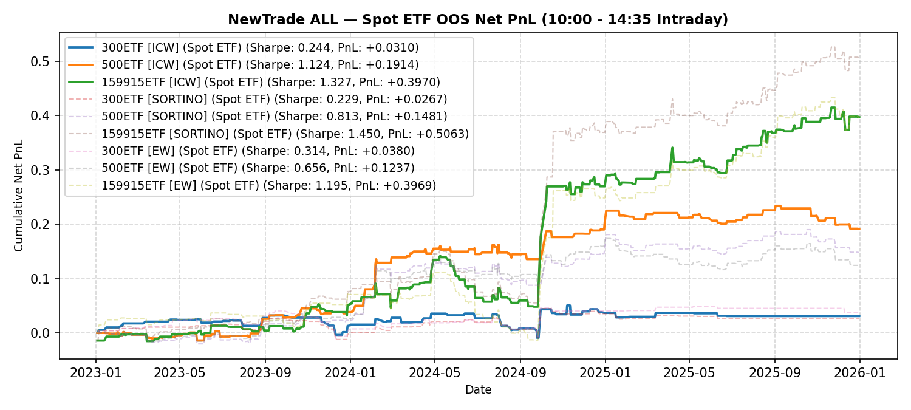

# NewTrade OOS Backtest Report

- **OOS Evaluation Period**: `2023-01-01 ~ 2026-01-01`
- **Intraday Trade Session**: `10:00 AM Open -> 14:35 PM Close`
- **Scheme(s)**: `ALL`
- **Conviction Threshold**: `auto` (buffer=+0.1)
- **Position Mode**: `fast_ramp_quadratic`
- **Stop-Loss Execution**: `Enabled (time_decay_trailing=0.03)`
- **Transaction Friction**: `16.0 bps roundtrip (8.0 bps/leg)`

## IC Weight (ICW)

| ETF | Asset | Side | OOS Period | Z_th | Features | Trades | Cost Sharpe | Raw Sharpe | Total PnL | Long PnL | Long Sharpe | Short PnL | Short Sharpe | Max DD | Win Rate | Turnover |
| --- | --- | --- | --- | --- | --- | --- | --- | --- | --- | --- | --- | --- | --- | --- | --- | --- |
| 300ETF | Spot ETF | single | 2023-01 ~ 2025-12 | L:1.30/S:1.50 (train L:1.20/S:1.40) | 51 | 63 (43L/20S) | 0.244 | 0.888 | +0.0310 | +0.0280 | 0.972 | +0.0029 | 0.391 | 0.0448 | 50.8% (L:48.8%, S:55.0%) | 35.4x |
| 500ETF | Spot ETF | single | 2023-01 ~ 2025-12 | L:1.30/S:1.30 (train L:1.20/S:1.20) | 215 | 121 (57L/64S) | 1.124 | 2.012 | +0.1914 | +0.0050 | 0.186 | +0.1864 | 4.646 | 0.0426 | 57.9% (L:45.6%, S:68.8%) | 65.8x |
| 50ETF | Spot ETF | single | 2023-01 ~ 2026-01 | N/A | 0 | N/A | N/A | N/A | N/A | N/A | N/A | N/A | N/A | N/A | N/A | N/A |
| 159915ETF | Spot ETF | single | 2023-01 ~ 2025-12 | L:0.90/S:1.10 (train L:0.80/S:1.00) | 78 | 161 (107L/54S) | 1.327 | 2.004 | +0.3970 | +0.2128 | 2.263 | +0.1842 | 4.110 | 0.0934 | 54.0% (L:49.5%, S:63.0%) | 82.7x |

<b>Sortino Weight (tail-IC selection + Score-blend weights)</b> (click to expand)

| ETF | Asset | Side | OOS Period | Z_th | Features | Trades | Cost Sharpe | Raw Sharpe | Total PnL | Long PnL | Long Sharpe | Short PnL | Short Sharpe | Max DD | Win Rate | Turnover |
| --- | --- | --- | --- | --- | --- | --- | --- | --- | --- | --- | --- | --- | --- | --- | --- | --- |
| 300ETF | Spot ETF | single | 2023-01 ~ 2025-12 | L:1.60/S:1.40 (train L:1.50/S:1.30) | 51 | 50 (20L/30S) | 0.229 | 0.782 | +0.0267 | +0.0433 | 2.544 | -0.0166 | -1.548 | 0.0387 | 50.0% (L:55.0%, S:46.7%) | 28.7x |
| 500ETF | Spot ETF | single | 2023-01 ~ 2025-12 | L:1.20/S:1.30 (train L:1.10/S:1.20) | 215 | 143 (78L/65S) | 0.813 | 1.826 | +0.1481 | -0.0479 | -1.282 | +0.1960 | 4.831 | 0.0460 | 55.2% (L:43.6%, S:69.2%) | 75.7x |
| 50ETF | Spot ETF | single | 2023-01 ~ 2026-01 | N/A | 0 | N/A | N/A | N/A | N/A | N/A | N/A | N/A | N/A | N/A | N/A | N/A |
| 159915ETF | Spot ETF | single | 2023-01 ~ 2025-12 | L:0.80/S:1.10 (train L:0.70/S:1.00) | 78 | 188 (135L/53S) | 1.450 | 2.140 | +0.5063 | +0.3139 | 2.397 | +0.1924 | 4.382 | 0.0972 | 53.7% (L:49.6%, S:64.2%) | 95.8x |

<b>Equal Weight (EW, Score-selected top-K)</b> (click to expand)

| ETF | Asset | Side | OOS Period | Z_th | Features | Trades | Cost Sharpe | Raw Sharpe | Total PnL | Long PnL | Long Sharpe | Short PnL | Short Sharpe | Max DD | Win Rate | Turnover |
| --- | --- | --- | --- | --- | --- | --- | --- | --- | --- | --- | --- | --- | --- | --- | --- | --- |
| 300ETF | Spot ETF | single | 2023-01 ~ 2025-12 | L:1.60/S:1.40 (train L:1.50/S:1.30) | 51 | 60 (19L/41S) | 0.314 | 0.964 | +0.0380 | +0.0493 | 3.024 | -0.0113 | -0.748 | 0.0508 | 58.3% (L:57.9%, S:58.5%) | 34.1x |
| 500ETF | Spot ETF | single | 2023-01 ~ 2025-12 | L:1.00/S:1.40 (train L:0.90/S:1.30) | 215 | 160 (106L/54S) | 0.656 | 1.802 | +0.1237 | -0.0473 | -0.928 | +0.1711 | 4.937 | 0.0575 | 53.8% (L:45.3%, S:70.4%) | 86.7x |
| 50ETF | Spot ETF | single | 2023-01 ~ 2026-01 | N/A | 0 | N/A | N/A | N/A | N/A | N/A | N/A | N/A | N/A | N/A | N/A | N/A |
| 159915ETF | Spot ETF | single | 2023-01 ~ 2025-12 | L:0.80/S:1.30 (train L:0.70/S:1.20) | 78 | 148 (129L/19S) | 1.195 | 1.785 | +0.3969 | +0.2590 | 2.069 | +0.1380 | 6.328 | 0.1252 | 50.0% (L:48.1%, S:63.2%) | 76.3x |

---

## Validation (DSR + CPCV)

- **DSR Trials**: `10`
- **CPCV**: `6` splits, `2` test chunks, purge=5

| ETF | Scheme | Sharpe | DSR | Verdict | CPCV Median | CPCV Std | % Positive |
| --- | --- | --- | --- | --- | --- | --- | --- |
| 300ETF | icw | 0.244 | 0.129 | NOT_SIGNIFICANT | 0.330 | 0.350 | 87% |
| 500ETF | icw | 1.124 | 0.779 | NOT_SIGNIFICANT | 0.884 | 0.417 | 100% |
| 159915ETF | icw | 1.327 | 0.896 | NOT_SIGNIFICANT | 0.899 | 0.409 | 93% |
| 300ETF | sortino | 0.229 | 0.125 | NOT_SIGNIFICANT | 0.278 | 0.336 | 73% |
| 500ETF | sortino | 0.813 | 0.499 | NOT_SIGNIFICANT | 0.754 | 0.456 | 100% |
| 159915ETF | sortino | 1.450 | 0.955 | SIGNIFICANT | 0.888 | 0.355 | 100% |
| 300ETF | ew | 0.314 | 0.162 | NOT_SIGNIFICANT | 0.267 | 0.362 | 73% |
| 500ETF | ew | 0.656 | 0.361 | NOT_SIGNIFICANT | 0.854 | 0.505 | 93% |
| 159915ETF | ew | 1.195 | 0.838 | NOT_SIGNIFICANT | 0.907 | 0.307 | 100% |

