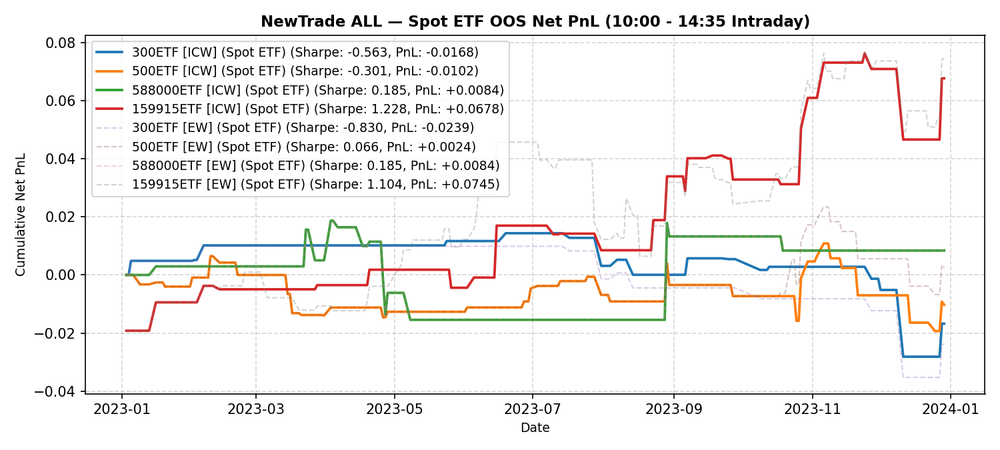

# NewTrade OOS Backtest Report

- **OOS Evaluation Period**: `2023-01-01 ~ 2024-01-01`
- **Intraday Trade Session**: `10:00 AM Open -> 14:35 PM Close`
- **Scheme(s)**: `ALL`
- **Conviction Threshold**: `auto` (buffer=+0.1)
- **Position Mode**: `binary`
- **Stop-Loss Execution**: `Disabled (Hold to 14:35 Close)`
- **Transaction Friction**: `8.0 bps`

## IC Weight (ICW)

| ETF | Asset | Side | OOS Period | Z_th | Features | Trades | Cost Sharpe | Raw Sharpe | Total PnL | Long PnL | Long Sharpe | Short PnL | Short Sharpe | Max DD | Win Rate | Turnover |
| --- | --- | --- | --- | --- | --- | --- | --- | --- | --- | --- | --- | --- | --- | --- | --- | --- |
| 300ETF | Spot ETF | single | 2023-01 ~ 2023-12 | L:1.30/S:1.00 (train L:1.20/S:0.90) | 10 | 17 (3L/14S) | -0.563 | 0.352 | -0.0168 | +0.0066 | 3.980 | -0.0234 | -3.929 | 0.0426 | 52.9% (L:66.7%, S:50.0%) | 35.4x |
| 500ETF | Spot ETF | single | 2023-01 ~ 2023-12 | L:0.80/S:1.40 (train L:0.70/S:1.30) | 32 | 37 (37L/0S) | -0.301 | 1.408 | -0.0102 | -0.0102 | -0.770 | +0.0000 | 0.000 | 0.0302 | 45.9% (L:45.9%, S:N/A) | 63.5x |
| 50ETF | Spot ETF | single | 2023-01 ~ 2024-01 | N/A | 0 | N/A | N/A | N/A | N/A | N/A | N/A | N/A | N/A | N/A | N/A | N/A |
| 588000ETF | Spot ETF | single | 2023-01 ~ 2023-12 | L:1.00/S:1.30 (train L:0.90/S:1.20) | 1 | 14 (14L/0S) | 0.185 | 0.671 | +0.0084 | +0.0084 | 0.772 | +0.0000 | 0.000 | 0.0342 | 42.9% (L:42.9%, S:N/A) | 22.9x |
| 159915ETF | Spot ETF | single | 2023-01 ~ 2023-12 | L:1.00/S:1.20 (train L:0.90/S:1.10) | 11 | 27 (13L/14S) | 1.228 | 1.935 | +0.0678 | +0.0898 | 11.441 | -0.0220 | -2.551 | 0.0297 | 59.3% (L:69.2%, S:50.0%) | 50.0x |

<b>Equal Weight (EW)</b> (click to expand)

| ETF | Asset | Side | OOS Period | Z_th | Features | Trades | Cost Sharpe | Raw Sharpe | Total PnL | Long PnL | Long Sharpe | Short PnL | Short Sharpe | Max DD | Win Rate | Turnover |
| --- | --- | --- | --- | --- | --- | --- | --- | --- | --- | --- | --- | --- | --- | --- | --- | --- |
| 300ETF | Spot ETF | single | 2023-01 ~ 2023-12 | L:1.20/S:1.00 (train L:1.10/S:0.90) | 10 | 10 (3L/7S) | -0.830 | -0.283 | -0.0239 | +0.0066 | 3.980 | -0.0305 | -8.310 | 0.0452 | 40.0% (L:66.7%, S:28.6%) | 20.8x |
| 500ETF | Spot ETF | single | 2023-01 ~ 2023-12 | L:0.80/S:1.30 (train L:0.70/S:1.20) | 32 | 39 (37L/2S) | 0.066 | 1.747 | +0.0024 | -0.0102 | -0.770 | +0.0126 | 19.093 | 0.0302 | 48.7% (L:45.9%, S:100.0%) | 67.7x |
| 50ETF | Spot ETF | single | 2023-01 ~ 2024-01 | N/A | 0 | N/A | N/A | N/A | N/A | N/A | N/A | N/A | N/A | N/A | N/A | N/A |
| 588000ETF | Spot ETF | single | 2023-01 ~ 2023-12 | L:1.00/S:1.30 (train L:0.90/S:1.20) | 1 | 14 (14L/0S) | 0.185 | 0.671 | +0.0084 | +0.0084 | 0.772 | +0.0000 | 0.000 | 0.0342 | 42.9% (L:42.9%, S:N/A) | 22.9x |
| 159915ETF | Spot ETF | single | 2023-01 ~ 2023-12 | L:1.00/S:1.00 (train L:0.90/S:0.90) | 11 | 62 (12L/50S) | 1.104 | 2.498 | +0.0745 | +0.0888 | 11.978 | -0.0144 | -0.595 | 0.0393 | 58.1% (L:66.7%, S:56.0%) | 108.3x |

---

## Validation (DSR + CPCV)

- **DSR Trials**: `10`
- **CPCV**: `6` splits, `2` test chunks, purge=5

| ETF | Scheme | Sharpe | DSR | Verdict | CPCV Median | CPCV Std | % Positive |
| --- | --- | --- | --- | --- | --- | --- | --- |
| 300ETF | icw | -0.563 | 0.014 | NOT_SIGNIFICANT | 0.895 | 0.220 | 100% |
| 500ETF | icw | -0.301 | 0.031 | NOT_SIGNIFICANT | 1.005 | 0.414 | 100% |
| 588000ETF | icw | 0.185 | 0.083 | NOT_SIGNIFICANT | -0.025 | 0.575 | 47% |
| 159915ETF | icw | 1.228 | 0.357 | NOT_SIGNIFICANT | 0.836 | 0.275 | 100% |
| 300ETF | ew | -0.830 | 0.005 | NOT_SIGNIFICANT | 0.705 | 0.257 | 100% |
| 500ETF | ew | 0.066 | 0.066 | NOT_SIGNIFICANT | 0.967 | 0.404 | 100% |
| 588000ETF | ew | 0.185 | 0.083 | NOT_SIGNIFICANT | -0.025 | 0.575 | 47% |
| 159915ETF | ew | 1.104 | 0.305 | NOT_SIGNIFICANT | 0.852 | 0.243 | 100% |

