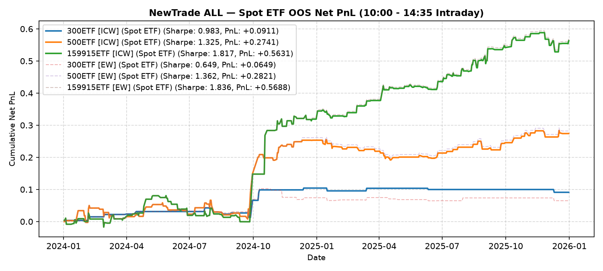

# NewTrade OOS Backtest Report

- **OOS Evaluation Period**: `2024-01-01 ~ 2026-01-01`
- **Intraday Trade Session**: `10:00 AM Open -> 14:35 PM Close`
- **Scheme(s)**: `ALL`
- **Conviction Threshold**: `auto` (buffer=+0.1)
- **Position Mode**: `binary`
- **Stop-Loss Execution**: `Enabled (time_decay_trailing=0.03)`
- **Transaction Friction**: `8.0 bps (+ 2.0 bps stop-loss execution slippage)`

## IC Weight (ICW)

| ETF | Asset | Side | OOS Period | Z_th | Features | Trades | Cost Sharpe | Raw Sharpe | Total PnL | Long PnL | Long Sharpe | Short PnL | Short Sharpe | Max DD | Win Rate | Turnover |
| --- | --- | --- | --- | --- | --- | --- | --- | --- | --- | --- | --- | --- | --- | --- | --- | --- |
| 300ETF | Spot ETF | single | 2024-01 ~ 2025-12 | L:1.60/S:1.30 (train L:1.50/S:1.20) | 85 | 20 (13L/7S) | 0.983 | 1.138 | +0.0911 | +0.0583 | 4.395 | +0.0328 | 7.703 | 0.0297 | 60.0% (L:61.5%, S:57.1%) | 20.8x |
| 500ETF | Spot ETF | single | 2024-01 ~ 2025-12 | L:0.80/S:1.40 (train L:0.70/S:1.30) | 144 | 118 (105L/13S) | 1.325 | 1.779 | +0.2741 | +0.1822 | 2.109 | +0.0919 | 6.840 | 0.0628 | 54.2% (L:53.3%, S:61.5%) | 96.6x |
| 50ETF | Spot ETF | single | 2024-01 ~ 2026-01 | N/A | 0 | N/A | N/A | N/A | N/A | N/A | N/A | N/A | N/A | N/A | N/A | N/A |
| 159915ETF | Spot ETF | single | 2024-01 ~ 2025-12 | L:0.80/S:1.10 (train L:0.70/S:1.00) | 118 | 157 (105L/52S) | 1.817 | 2.219 | +0.5631 | +0.3754 | 2.791 | +0.1877 | 5.782 | 0.0814 | 56.1% (L:50.5%, S:67.3%) | 137.7x |

<b>Equal Weight (EW)</b> (click to expand)

| ETF | Asset | Side | OOS Period | Z_th | Features | Trades | Cost Sharpe | Raw Sharpe | Total PnL | Long PnL | Long Sharpe | Short PnL | Short Sharpe | Max DD | Win Rate | Turnover |
| --- | --- | --- | --- | --- | --- | --- | --- | --- | --- | --- | --- | --- | --- | --- | --- | --- |
| 300ETF | Spot ETF | single | 2024-01 ~ 2025-12 | L:1.50/S:1.20 (train L:1.40/S:1.10) | 85 | 35 (15L/20S) | 0.649 | 0.925 | +0.0649 | +0.0362 | 2.319 | +0.0287 | 3.258 | 0.0376 | 48.6% (L:60.0%, S:40.0%) | 35.3x |
| 500ETF | Spot ETF | single | 2024-01 ~ 2025-12 | L:0.80/S:1.40 (train L:0.70/S:1.30) | 144 | 119 (105L/14S) | 1.362 | 1.819 | +0.2821 | +0.1822 | 2.109 | +0.0999 | 7.163 | 0.0628 | 54.6% (L:53.3%, S:64.3%) | 97.7x |
| 50ETF | Spot ETF | single | 2024-01 ~ 2026-01 | N/A | 0 | N/A | N/A | N/A | N/A | N/A | N/A | N/A | N/A | N/A | N/A | N/A |
| 159915ETF | Spot ETF | single | 2024-01 ~ 2025-12 | L:0.80/S:1.10 (train L:0.70/S:1.00) | 118 | 155 (104L/51S) | 1.836 | 2.233 | +0.5688 | +0.3794 | 2.837 | +0.1894 | 5.906 | 0.0814 | 56.8% (L:51.0%, S:68.6%) | 135.6x |

---

## Validation (DSR + CPCV)

- **DSR Trials**: `10`
- **CPCV**: `6` splits, `2` test chunks, purge=5

| ETF | Scheme | Sharpe | DSR | Verdict | CPCV Median | CPCV Std | % Positive |
| --- | --- | --- | --- | --- | --- | --- | --- |
| 300ETF | icw | 0.983 | 0.668 | NOT_SIGNIFICANT | 0.519 | 0.199 | 100% |
| 500ETF | icw | 1.325 | 0.708 | NOT_SIGNIFICANT | 1.199 | 0.363 | 100% |
| 159915ETF | icw | 1.817 | 0.976 | SIGNIFICANT | 0.793 | 0.300 | 100% |
| 300ETF | ew | 0.649 | 0.308 | NOT_SIGNIFICANT | 0.504 | 0.237 | 100% |
| 500ETF | ew | 1.362 | 0.730 | NOT_SIGNIFICANT | 1.196 | 0.342 | 100% |
| 159915ETF | ew | 1.836 | 0.979 | SIGNIFICANT | 0.721 | 0.294 | 100% |

