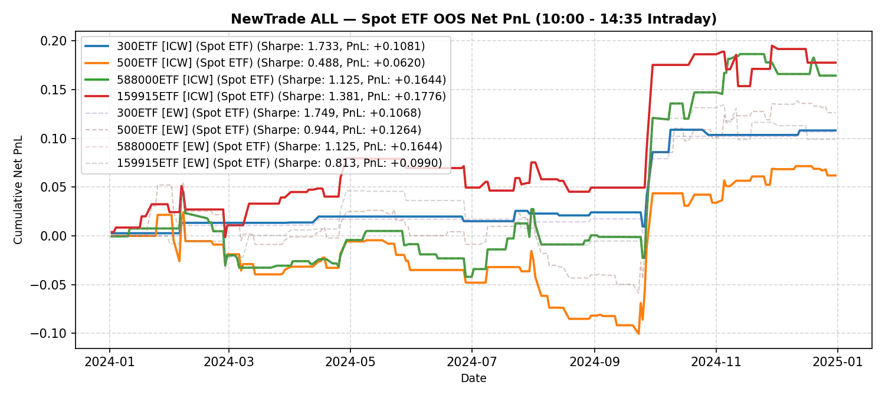

# NewTrade OOS Backtest Report

- **OOS Evaluation Period**: `2024-01-01 ~ 2025-01-01`
- **Intraday Trade Session**: `10:00 AM Open -> 14:35 PM Close`
- **Scheme(s)**: `ALL`
- **Conviction Threshold**: `auto` (buffer=+0.1)
- **Position Mode**: `binary`
- **Stop-Loss Execution**: `Disabled (Hold to 14:35 Close)`
- **Transaction Friction**: `8.0 bps`

## IC Weight (ICW)

| ETF | Asset | Side | OOS Period | Z_th | Features | Trades | Cost Sharpe | Raw Sharpe | Total PnL | Long PnL | Long Sharpe | Short PnL | Short Sharpe | Max DD | Win Rate | Turnover |
| --- | --- | --- | --- | --- | --- | --- | --- | --- | --- | --- | --- | --- | --- | --- | --- | --- |
| 300ETF | Spot ETF | single | 2024-01 ~ 2024-12 | L:1.30/S:1.00 (train L:1.20/S:0.90) | 10 | 15 (7L/8S) | 1.733 | 2.029 | +0.1081 | +0.0820 | 10.020 | +0.0261 | 5.772 | 0.0160 | 66.7% (L:85.7%, S:50.0%) | 29.2x |
| 500ETF | Spot ETF | single | 2024-01 ~ 2024-12 | L:0.80/S:1.40 (train L:0.70/S:1.30) | 32 | 60 (59L/1S) | 0.488 | 1.234 | +0.0620 | +0.0840 | 1.363 | -0.0220 | 0.000 | 0.1249 | 48.3% (L:49.2%, S:0.0%) | 85.4x |
| 50ETF | Spot ETF | single | 2024-01 ~ 2025-01 | N/A | 0 | N/A | N/A | N/A | N/A | N/A | N/A | N/A | N/A | N/A | N/A | N/A |
| 588000ETF | Spot ETF | single | 2024-01 ~ 2024-12 | L:1.00/S:1.10 (train L:0.90/S:1.00) | 1 | 56 (41L/15S) | 1.125 | 1.719 | +0.1644 | +0.1669 | 2.861 | -0.0025 | -0.373 | 0.0889 | 50.0% (L:53.7%, S:40.0%) | 95.8x |
| 159915ETF | Spot ETF | single | 2024-01 ~ 2024-12 | L:1.00/S:1.20 (train L:0.90/S:1.10) | 11 | 44 (32L/12S) | 1.381 | 1.898 | +0.1776 | +0.1238 | 2.726 | +0.0539 | 12.367 | 0.0525 | 59.1% (L:50.0%, S:83.3%) | 77.1x |

<b>Equal Weight (EW)</b> (click to expand)

| ETF | Asset | Side | OOS Period | Z_th | Features | Trades | Cost Sharpe | Raw Sharpe | Total PnL | Long PnL | Long Sharpe | Short PnL | Short Sharpe | Max DD | Win Rate | Turnover |
| --- | --- | --- | --- | --- | --- | --- | --- | --- | --- | --- | --- | --- | --- | --- | --- | --- |
| 300ETF | Spot ETF | single | 2024-01 ~ 2024-12 | L:1.20/S:1.00 (train L:1.10/S:0.90) | 10 | 10 (7L/3S) | 1.749 | 1.926 | +0.1068 | +0.0820 | 10.020 | +0.0248 | 12.121 | 0.0145 | 80.0% (L:85.7%, S:66.7%) | 18.7x |
| 500ETF | Spot ETF | single | 2024-01 ~ 2024-12 | L:0.80/S:1.30 (train L:0.70/S:1.20) | 32 | 69 (59L/10S) | 0.944 | 1.749 | +0.1264 | +0.0840 | 1.363 | +0.0424 | 4.515 | 0.1136 | 50.7% (L:49.2%, S:60.0%) | 104.1x |
| 50ETF | Spot ETF | single | 2024-01 ~ 2025-01 | N/A | 0 | N/A | N/A | N/A | N/A | N/A | N/A | N/A | N/A | N/A | N/A | N/A |
| 588000ETF | Spot ETF | single | 2024-01 ~ 2024-12 | L:1.00/S:1.10 (train L:0.90/S:1.00) | 1 | 56 (41L/15S) | 1.125 | 1.719 | +0.1644 | +0.1669 | 2.861 | -0.0025 | -0.373 | 0.0889 | 50.0% (L:53.7%, S:40.0%) | 95.8x |
| 159915ETF | Spot ETF | single | 2024-01 ~ 2024-12 | L:1.10/S:1.50 (train L:1.00/S:1.40) | 11 | 28 (28L/0S) | 0.813 | 1.168 | +0.0990 | +0.0990 | 2.414 | +0.0000 | 0.000 | 0.0557 | 50.0% (L:50.0%, S:N/A) | 45.8x |

---

## Validation (DSR + CPCV)

- **DSR Trials**: `10`
- **CPCV**: `6` splits, `2` test chunks, purge=5

| ETF | Scheme | Sharpe | DSR | Verdict | CPCV Median | CPCV Std | % Positive |
| --- | --- | --- | --- | --- | --- | --- | --- |
| 300ETF | icw | 1.733 | 0.878 | NOT_SIGNIFICANT | 0.903 | 0.223 | 100% |
| 500ETF | icw | 0.488 | 0.140 | NOT_SIGNIFICANT | 1.005 | 0.415 | 100% |
| 588000ETF | icw | 1.125 | 0.396 | NOT_SIGNIFICANT | -0.025 | 0.575 | 47% |
| 159915ETF | icw | 1.381 | 0.518 | NOT_SIGNIFICANT | 0.836 | 0.361 | 100% |
| 300ETF | ew | 1.749 | 0.908 | MARGINAL | 0.705 | 0.257 | 100% |
| 500ETF | ew | 0.944 | 0.277 | NOT_SIGNIFICANT | 0.967 | 0.404 | 100% |
| 588000ETF | ew | 1.125 | 0.396 | NOT_SIGNIFICANT | -0.025 | 0.575 | 47% |
| 159915ETF | ew | 0.813 | 0.252 | NOT_SIGNIFICANT | 0.852 | 0.243 | 100% |

