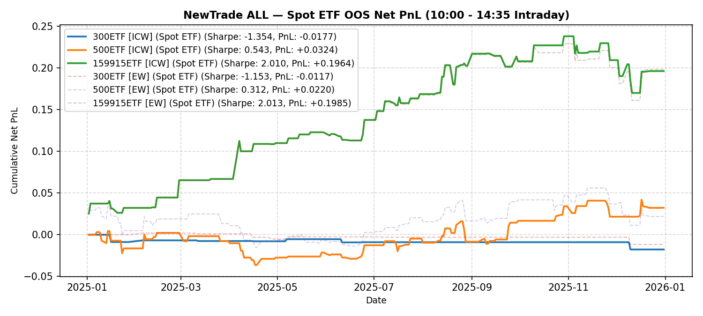

# NewTrade OOS Backtest Report

- **OOS Evaluation Period**: `2025-01-01 ~ 2026-01-01`
- **Intraday Trade Session**: `10:00 AM Open -> 14:35 PM Close`
- **Scheme(s)**: `ALL`
- **Conviction Threshold**: `auto` (buffer=+0.1)
- **Position Mode**: `binary`
- **Stop-Loss Execution**: `Enabled (time_decay_trailing=0.03)`
- **Transaction Friction**: `8.0 bps (+ 2.0 bps stop-loss execution slippage)`

## IC Weight (ICW)

| ETF | Asset | Side | OOS Period | Z_th | Features | Trades | Cost Sharpe | Raw Sharpe | Total PnL | Long PnL | Long Sharpe | Short PnL | Short Sharpe | Max DD | Win Rate | Turnover |
| --- | --- | --- | --- | --- | --- | --- | --- | --- | --- | --- | --- | --- | --- | --- | --- | --- |
| 300ETF | Spot ETF | single | 2025-01 ~ 2025-12 | L:1.50/S:1.30 (train L:1.40/S:1.20) | 14 | 10 (3L/7S) | -1.354 | -0.789 | -0.0177 | -0.0123 | -17.783 | -0.0054 | -3.531 | 0.0177 | 30.0% (L:33.3%, S:28.6%) | 20.7x |
| 500ETF | Spot ETF | single | 2025-01 ~ 2025-12 | L:0.70/S:1.30 (train L:0.60/S:1.20) | 12 | 67 (64L/3S) | 0.543 | 1.439 | +0.0324 | +0.0425 | 1.407 | -0.0101 | -13.674 | 0.0408 | 56.7% (L:57.8%, S:33.3%) | 103.7x |
| 50ETF | Spot ETF | single | 2025-01 ~ 2026-01 | N/A | 0 | N/A | N/A | N/A | N/A | N/A | N/A | N/A | N/A | N/A | N/A | N/A |
| 159915ETF | Spot ETF | single | 2025-01 ~ 2025-12 | L:0.80/S:1.00 (train L:0.70/S:0.90) | 13 | 63 (41L/22S) | 2.010 | 2.514 | +0.1964 | +0.1135 | 4.164 | +0.0829 | 4.023 | 0.0681 | 63.5% (L:61.0%, S:68.2%) | 116.2x |

<b>Equal Weight (EW)</b> (click to expand)

| ETF | Asset | Side | OOS Period | Z_th | Features | Trades | Cost Sharpe | Raw Sharpe | Total PnL | Long PnL | Long Sharpe | Short PnL | Short Sharpe | Max DD | Win Rate | Turnover |
| --- | --- | --- | --- | --- | --- | --- | --- | --- | --- | --- | --- | --- | --- | --- | --- | --- |
| 300ETF | Spot ETF | single | 2025-01 ~ 2025-12 | L:1.40/S:1.20 (train L:1.30/S:1.10) | 14 | 10 (0L/10S) | -1.153 | -0.387 | -0.0117 | +0.0000 | 0.000 | -0.0117 | -6.072 | 0.0137 | 20.0% (L:N/A, S:20.0%) | 18.7x |
| 500ETF | Spot ETF | single | 2025-01 ~ 2025-12 | L:0.70/S:1.00 (train L:0.60/S:0.90) | 12 | 81 (62L/19S) | 0.312 | 1.233 | +0.0220 | +0.0612 | 2.121 | -0.0392 | -3.529 | 0.0491 | 55.6% (L:59.7%, S:42.1%) | 136.9x |
| 50ETF | Spot ETF | single | 2025-01 ~ 2026-01 | N/A | 0 | N/A | N/A | N/A | N/A | N/A | N/A | N/A | N/A | N/A | N/A | N/A |
| 159915ETF | Spot ETF | single | 2025-01 ~ 2025-12 | L:0.80/S:0.80 (train L:0.70/S:0.70) | 13 | 69 (42L/27S) | 2.013 | 2.563 | +0.1985 | +0.1113 | 4.025 | +0.0872 | 3.738 | 0.0681 | 60.9% (L:59.5%, S:63.0%) | 124.4x |

---

## Validation (DSR + CPCV)

- **DSR Trials**: `10`
- **CPCV**: `6` splits, `2` test chunks, purge=5

| ETF | Scheme | Sharpe | DSR | Verdict | CPCV Median | CPCV Std | % Positive |
| --- | --- | --- | --- | --- | --- | --- | --- |
| 300ETF | icw | -1.354 | 0.000 | NOT_SIGNIFICANT | 0.596 | 0.282 | 100% |
| 500ETF | icw | 0.543 | 0.149 | NOT_SIGNIFICANT | 1.040 | 0.448 | 100% |
| 159915ETF | icw | 2.010 | 0.724 | NOT_SIGNIFICANT | 0.938 | 0.262 | 100% |
| 300ETF | ew | -1.153 | 0.001 | NOT_SIGNIFICANT | 0.276 | 0.502 | 73% |
| 500ETF | ew | 0.312 | 0.103 | NOT_SIGNIFICANT | 0.798 | 0.520 | 100% |
| 159915ETF | ew | 2.013 | 0.724 | NOT_SIGNIFICANT | 0.957 | 0.369 | 100% |

