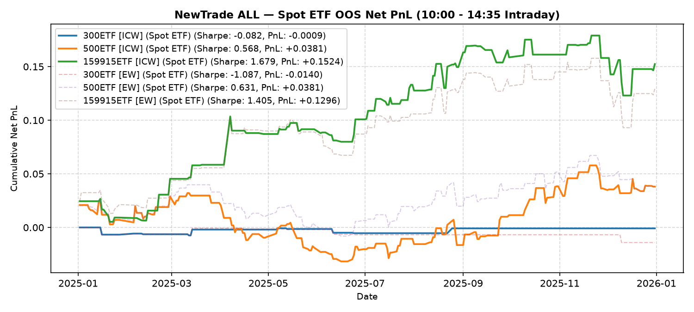

# NewTrade OOS Backtest Report

- **OOS Evaluation Period**: `2025-01-01 ~ 2026-01-01`
- **Intraday Trade Session**: `10:00 AM Open -> 14:35 PM Close`
- **Scheme(s)**: `ALL`
- **Conviction Threshold**: `auto` (buffer=+0.1)
- **Position Mode**: `fast_ramp_quadratic`
- **Stop-Loss Execution**: `Enabled (time_decay_trailing=0.03)`
- **Transaction Friction**: `16.0 bps roundtrip (8.0 bps/leg)`

## IC Weight (ICW)

| ETF | Asset | Side | OOS Period | Z_th | Features | Trades | Cost Sharpe | Raw Sharpe | Total PnL | Long PnL | Long Sharpe | Short PnL | Short Sharpe | Max DD | Win Rate | Turnover |
| --- | --- | --- | --- | --- | --- | --- | --- | --- | --- | --- | --- | --- | --- | --- | --- | --- |
| 300ETF | Spot ETF | single | 2025-01 ~ 2025-12 | L:1.60/S:1.30 (train L:1.50/S:1.20) | 22 | 10 (5L/5S) | -0.082 | 0.993 | -0.0009 | -0.0007 | -0.451 | -0.0002 | -0.665 | 0.0074 | 40.0% (L:40.0%, S:40.0%) | 15.2x |
| 500ETF | Spot ETF | single | 2025-01 ~ 2025-12 | L:0.60/S:1.10 (train L:0.50/S:1.00) | 193 | 110 (84L/26S) | 0.568 | 2.873 | +0.0381 | +0.0316 | 0.958 | +0.0065 | 0.544 | 0.0637 | 55.5% (L:57.1%, S:50.0%) | 156.7x |
| 50ETF | Spot ETF | single | 2025-01 ~ 2026-01 | N/A | 0 | N/A | N/A | N/A | N/A | N/A | N/A | N/A | N/A | N/A | N/A | N/A |
| 159915ETF | Spot ETF | single | 2025-01 ~ 2025-12 | L:0.90/S:1.10 (train L:0.80/S:1.00) | 27 | 77 (48L/29S) | 1.679 | 2.759 | +0.1524 | +0.1027 | 3.616 | +0.0497 | 2.287 | 0.0560 | 55.8% (L:56.2%, S:55.2%) | 120.3x |

<b>Equal Weight (EW)</b> (click to expand)

| ETF | Asset | Side | OOS Period | Z_th | Features | Trades | Cost Sharpe | Raw Sharpe | Total PnL | Long PnL | Long Sharpe | Short PnL | Short Sharpe | Max DD | Win Rate | Turnover |
| --- | --- | --- | --- | --- | --- | --- | --- | --- | --- | --- | --- | --- | --- | --- | --- | --- |
| 300ETF | Spot ETF | single | 2025-01 ~ 2025-12 | L:1.40/S:1.20 (train L:1.30/S:1.10) | 22 | 10 (4L/6S) | -1.087 | -0.122 | -0.0140 | -0.0044 | -3.283 | -0.0097 | -9.743 | 0.0140 | 20.0% (L:25.0%, S:16.7%) | 16.2x |
| 500ETF | Spot ETF | single | 2025-01 ~ 2025-12 | L:0.70/S:1.20 (train L:0.60/S:1.10) | 193 | 97 (76L/21S) | 0.631 | 2.840 | +0.0381 | +0.0284 | 1.019 | +0.0097 | 0.972 | 0.0479 | 59.8% (L:60.5%, S:57.1%) | 140.1x |
| 50ETF | Spot ETF | single | 2025-01 ~ 2026-01 | N/A | 0 | N/A | N/A | N/A | N/A | N/A | N/A | N/A | N/A | N/A | N/A | N/A |
| 159915ETF | Spot ETF | single | 2025-01 ~ 2025-12 | L:0.90/S:1.00 (train L:0.80/S:0.90) | 27 | 85 (46L/39S) | 1.405 | 2.590 | +0.1296 | +0.0846 | 3.211 | +0.0450 | 1.637 | 0.0648 | 55.3% (L:56.5%, S:53.8%) | 129.6x |

---

## Validation (DSR + CPCV)

- **DSR Trials**: `10`
- **CPCV**: `6` splits, `2` test chunks, purge=5

| ETF | Scheme | Sharpe | DSR | Verdict | CPCV Median | CPCV Std | % Positive |
| --- | --- | --- | --- | --- | --- | --- | --- |
| 300ETF | icw | -0.082 | 0.049 | NOT_SIGNIFICANT | 0.517 | 0.175 | 100% |
| 500ETF | icw | 0.568 | 0.155 | NOT_SIGNIFICANT | 0.656 | 0.405 | 93% |
| 159915ETF | icw | 1.679 | 0.593 | NOT_SIGNIFICANT | 1.092 | 0.311 | 100% |
| 300ETF | ew | -1.087 | 0.003 | NOT_SIGNIFICANT | 0.434 | 0.227 | 100% |
| 500ETF | ew | 0.631 | 0.170 | NOT_SIGNIFICANT | 0.792 | 0.367 | 93% |
| 159915ETF | ew | 1.405 | 0.465 | NOT_SIGNIFICANT | 1.095 | 0.325 | 100% |

