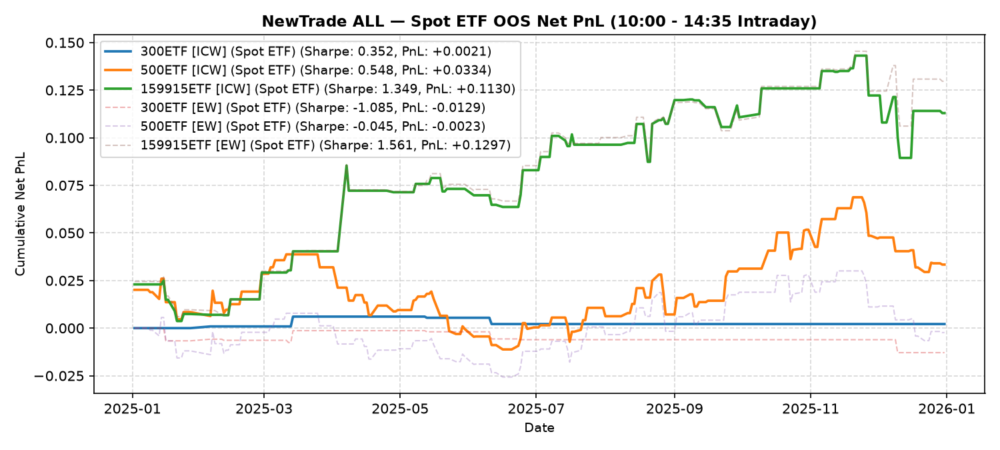

# NewTrade OOS Backtest Report

- **OOS Evaluation Period**: `2025-01-01 ~ 2026-01-01`
- **Intraday Trade Session**: `10:00 AM Open -> 14:35 PM Close`
- **Scheme(s)**: `ALL`
- **Conviction Threshold**: `auto` (buffer=+0.2)
- **Position Mode**: `fast_ramp_quadratic`
- **Stop-Loss Execution**: `Enabled (time_decay_trailing=0.03)`
- **Transaction Friction**: `16.0 bps roundtrip (8.0 bps/leg)`

## IC Weight (ICW)

| ETF | Asset | Side | OOS Period | Z_th | Features | Trades | Cost Sharpe | Raw Sharpe | Total PnL | Long PnL | Long Sharpe | Short PnL | Short Sharpe | Max DD | Win Rate | Turnover |
| --- | --- | --- | --- | --- | --- | --- | --- | --- | --- | --- | --- | --- | --- | --- | --- | --- |
| 300ETF | Spot ETF | single | 2025-01 ~ 2025-12 | L:1.70/S:1.40 (train L:1.50/S:1.20) | 22 | 4 (2L/2S) | 0.352 | 0.984 | +0.0021 | +0.0019 | 3.503 | +0.0003 | 2.995 | 0.0039 | 50.0% (L:50.0%, S:50.0%) | 6.0x |
| 500ETF | Spot ETF | single | 2025-01 ~ 2025-12 | L:0.70/S:1.20 (train L:0.50/S:1.00) | 193 | 97 (76L/21S) | 0.548 | 2.738 | +0.0334 | +0.0260 | 0.924 | +0.0074 | 0.735 | 0.0499 | 57.7% (L:57.9%, S:57.1%) | 143.6x |
| 50ETF | Spot ETF | single | 2025-01 ~ 2026-01 | N/A | 0 | N/A | N/A | N/A | N/A | N/A | N/A | N/A | N/A | N/A | N/A | N/A |
| 159915ETF | Spot ETF | single | 2025-01 ~ 2025-12 | L:1.00/S:1.20 (train L:0.80/S:1.00) | 27 | 60 (39L/21S) | 1.349 | 2.255 | +0.1130 | +0.0606 | 2.606 | +0.0523 | 3.020 | 0.0537 | 53.3% (L:53.8%, S:52.4%) | 93.8x |

<b>Equal Weight (EW)</b> (click to expand)

| ETF | Asset | Side | OOS Period | Z_th | Features | Trades | Cost Sharpe | Raw Sharpe | Total PnL | Long PnL | Long Sharpe | Short PnL | Short Sharpe | Max DD | Win Rate | Turnover |
| --- | --- | --- | --- | --- | --- | --- | --- | --- | --- | --- | --- | --- | --- | --- | --- | --- |
| 300ETF | Spot ETF | single | 2025-01 ~ 2025-12 | L:1.50/S:1.30 (train L:1.30/S:1.10) | 22 | 9 (4L/5S) | -1.085 | -0.201 | -0.0129 | -0.0046 | -3.780 | -0.0083 | -9.926 | 0.0129 | 22.2% (L:25.0%, S:20.0%) | 13.8x |
| 500ETF | Spot ETF | single | 2025-01 ~ 2025-12 | L:0.80/S:1.30 (train L:0.60/S:1.10) | 193 | 82 (67L/15S) | -0.045 | 2.146 | -0.0023 | +0.0265 | 1.116 | -0.0289 | -5.020 | 0.0366 | 57.3% (L:59.7%, S:46.7%) | 123.2x |
| 50ETF | Spot ETF | single | 2025-01 ~ 2026-01 | N/A | 0 | N/A | N/A | N/A | N/A | N/A | N/A | N/A | N/A | N/A | N/A | N/A |
| 159915ETF | Spot ETF | single | 2025-01 ~ 2025-12 | L:1.00/S:1.10 (train L:0.80/S:0.90) | 27 | 65 (37L/28S) | 1.561 | 2.541 | +0.1297 | +0.0700 | 3.304 | +0.0597 | 2.863 | 0.0393 | 56.9% (L:56.8%, S:57.1%) | 101.2x |

---

## Validation (DSR + CPCV)

- **DSR Trials**: `10`
- **CPCV**: `6` splits, `2` test chunks, purge=5

| ETF | Scheme | Sharpe | DSR | Verdict | CPCV Median | CPCV Std | % Positive |
| --- | --- | --- | --- | --- | --- | --- | --- |
| 300ETF | icw | 0.352 | 0.114 | NOT_SIGNIFICANT | 0.477 | 0.185 | 100% |
| 500ETF | icw | 0.548 | 0.150 | NOT_SIGNIFICANT | 0.763 | 0.396 | 93% |
| 159915ETF | icw | 1.349 | 0.455 | NOT_SIGNIFICANT | 0.921 | 0.268 | 100% |
| 300ETF | ew | -1.085 | 0.003 | NOT_SIGNIFICANT | 0.481 | 0.274 | 100% |
| 500ETF | ew | -0.045 | 0.053 | NOT_SIGNIFICANT | 0.788 | 0.393 | 93% |
| 159915ETF | ew | 1.561 | 0.560 | NOT_SIGNIFICANT | 1.010 | 0.350 | 100% |

