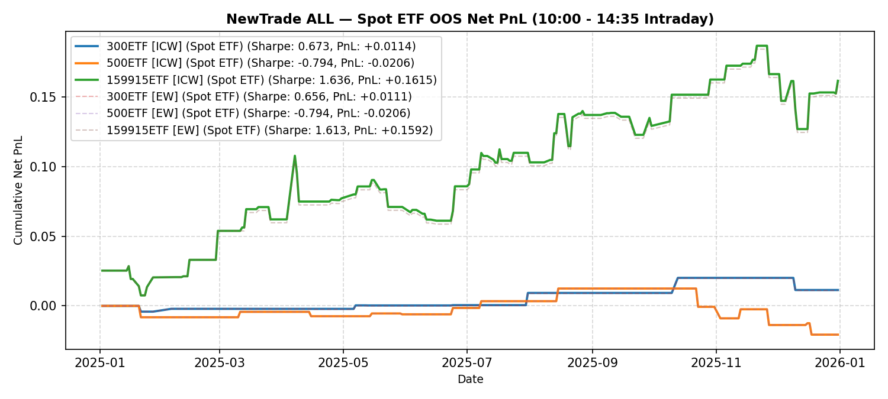

# NewTrade OOS Backtest Report

- **OOS Evaluation Period**: `2025-01-01 ~ 2026-01-01`
- **Intraday Trade Session**: `10:00 AM Open -> 14:35 PM Close`
- **Scheme(s)**: `ALL`
- **Conviction Threshold**: `auto` (buffer=+0.1)
- **Position Mode**: `binary`
- **Stop-Loss Execution**: `Enabled (time_decay_trailing=0.03)`
- **Transaction Friction**: `8.0 bps (+ 2.0 bps stop-loss execution slippage)`

## IC Weight (ICW)

| ETF | Asset | Side | OOS Period | Z_th | Features | Trades | Cost Sharpe | Raw Sharpe | Total PnL | Long PnL | Long Sharpe | Short PnL | Short Sharpe | Max DD | Win Rate | Turnover |
| --- | --- | --- | --- | --- | --- | --- | --- | --- | --- | --- | --- | --- | --- | --- | --- | --- |
| 300ETF | Spot ETF | single | 2025-01 ~ 2025-12 | L:1.50/S:1.40 (train L:1.40/S:1.30) | 99 | 9 (2L/7S) | 0.673 | 1.058 | +0.0114 | +0.0110 | 16.527 | +0.0003 | 0.154 | 0.0087 | 55.6% (L:100.0%, S:42.9%) | 18.7x |
| 500ETF | Spot ETF | single | 2025-01 ~ 2025-12 | L:1.40/S:1.60 (train L:1.30/S:1.50) | 126 | 14 (7L/7S) | -0.794 | -0.369 | -0.0206 | +0.0094 | 2.939 | -0.0300 | -12.916 | 0.0331 | 50.0% (L:71.4%, S:28.6%) | 29.0x |
| 50ETF | Spot ETF | single | 2025-01 ~ 2026-01 | N/A | 0 | N/A | N/A | N/A | N/A | N/A | N/A | N/A | N/A | N/A | N/A | N/A |
| 159915ETF | Spot ETF | single | 2025-01 ~ 2025-12 | L:0.80/S:1.00 (train L:0.70/S:0.90) | 146 | 76 (52L/24S) | 1.636 | 2.249 | +0.1615 | +0.0899 | 2.796 | +0.0716 | 3.337 | 0.0598 | 60.5% (L:57.7%, S:66.7%) | 135.8x |

<b>Equal Weight (EW)</b> (click to expand)

| ETF | Asset | Side | OOS Period | Z_th | Features | Trades | Cost Sharpe | Raw Sharpe | Total PnL | Long PnL | Long Sharpe | Short PnL | Short Sharpe | Max DD | Win Rate | Turnover |
| --- | --- | --- | --- | --- | --- | --- | --- | --- | --- | --- | --- | --- | --- | --- | --- | --- |
| 300ETF | Spot ETF | single | 2025-01 ~ 2025-12 | L:1.50/S:1.30 (train L:1.40/S:1.20) | 99 | 10 (2L/8S) | 0.656 | 1.087 | +0.0111 | +0.0110 | 16.527 | +0.0001 | 0.028 | 0.0087 | 50.0% (L:100.0%, S:37.5%) | 20.7x |
| 500ETF | Spot ETF | single | 2025-01 ~ 2025-12 | L:1.40/S:1.60 (train L:1.30/S:1.50) | 126 | 14 (7L/7S) | -0.794 | -0.369 | -0.0206 | +0.0094 | 2.939 | -0.0300 | -12.916 | 0.0331 | 50.0% (L:71.4%, S:28.6%) | 29.0x |
| 50ETF | Spot ETF | single | 2025-01 ~ 2026-01 | N/A | 0 | N/A | N/A | N/A | N/A | N/A | N/A | N/A | N/A | N/A | N/A | N/A |
| 159915ETF | Spot ETF | single | 2025-01 ~ 2025-12 | L:0.80/S:1.00 (train L:0.70/S:0.90) | 146 | 76 (52L/24S) | 1.613 | 2.227 | +0.1592 | +0.0899 | 2.796 | +0.0693 | 3.228 | 0.0598 | 60.5% (L:57.7%, S:66.7%) | 135.8x |

---

## Validation (DSR + CPCV)

- **DSR Trials**: `10`
- **CPCV**: `6` splits, `2` test chunks, purge=5

| ETF | Scheme | Sharpe | DSR | Verdict | CPCV Median | CPCV Std | % Positive |
| --- | --- | --- | --- | --- | --- | --- | --- |
| 300ETF | icw | 0.673 | 0.192 | NOT_SIGNIFICANT | 0.322 | 0.293 | 80% |
| 500ETF | icw | -0.794 | 0.008 | NOT_SIGNIFICANT | 0.768 | 0.521 | 93% |
| 159915ETF | icw | 1.636 | 0.564 | NOT_SIGNIFICANT | 0.911 | 0.354 | 100% |
| 300ETF | ew | 0.656 | 0.187 | NOT_SIGNIFICANT | 0.035 | 0.302 | 60% |
| 500ETF | ew | -0.794 | 0.008 | NOT_SIGNIFICANT | 0.627 | 0.547 | 93% |
| 159915ETF | ew | 1.613 | 0.554 | NOT_SIGNIFICANT | 0.890 | 0.365 | 100% |

