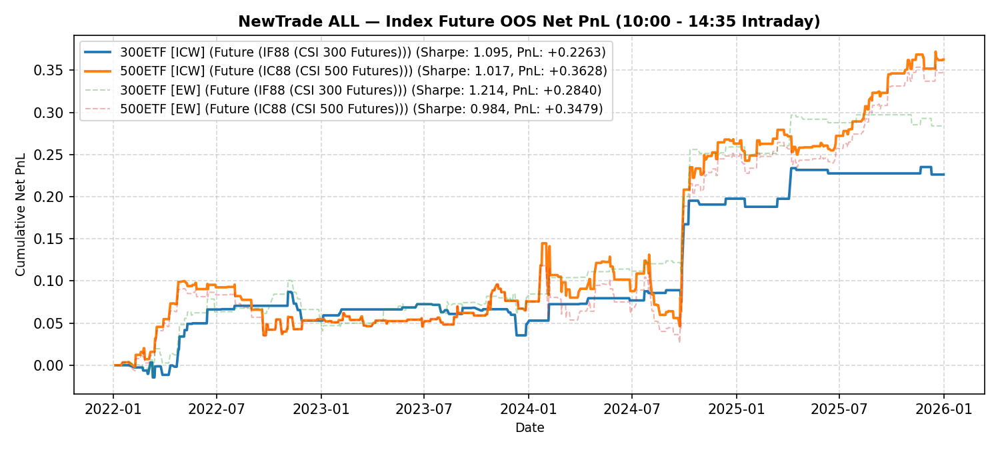

# NewTrade OOS Backtest Report

- **OOS Evaluation Period**: `2022-01-01 ~ 2026-01-01`
- **Intraday Trade Session**: `10:00 AM Open -> 14:35 PM Close`
- **Scheme(s)**: `ALL`
- **Conviction Threshold**: `auto` (buffer=+0.1)
- **Position Mode**: `binary`
- **Transaction Friction**: `4.0 bps`
- **Rank Mapping Options**: `mapping=linear, min_ratio=0.2, max_ratio=1.8, power=2.0`

## IC Weight (ICW)

| ETF | Asset | Side | OOS Period | Z_th | Features | Trades | Cost Sharpe | Raw Sharpe | Total PnL | Long PnL | Long Sharpe | Short PnL | Short Sharpe | Max DD | Win Rate | Turnover |
| --- | --- | --- | --- | --- | --- | --- | --- | --- | --- | --- | --- | --- | --- | --- | --- | --- |
| 300ETF | Future (IF88 (CSI 300 Futures)) | single | 2022-01 ~ 2025-12 | L:1.30/S:1.00 (train L:1.20/S:0.90) | 10 | 62 (20L/42S) | 1.090 | 1.312 | +0.2279 | +0.1635 | 8.037 | +0.0884 | 3.168 | 0.0519 | 59.7% (L:70.0%, S:54.8%) | 31.2x |
| 500ETF | Future (IC88 (CSI 500 Futures)) | single | 2022-01 ~ 2025-12 | L:0.80/S:1.30 (train L:0.70/S:1.20) | 32 | 219 (195L/24S) | 1.103 | 1.495 | +0.3964 | +0.3483 | 2.414 | +0.1141 | 4.925 | 0.0906 | 60.3% (L:60.0%, S:62.5%) | 92.1x |
| 50ETF | Future | single | 2022-01 ~ 2026-01 | N/A | 0 | N/A | N/A | N/A | N/A | N/A | N/A | N/A | N/A | N/A | N/A | N/A |
| 588000ETF | Future | single | 2022-01 ~ 2026-01 | N/A | 0 | N/A | N/A | N/A | N/A | N/A | N/A | N/A | N/A | N/A | N/A | N/A |
| 159915ETF | Future (N/A) | single | 2022-01 ~ 2026-01 | N/A | 11 | N/A | N/A | N/A | N/A | N/A | N/A | N/A | N/A | N/A | N/A | N/A |

<b>Equal Weight (EW)</b> (click to expand)

| ETF | Asset | Side | OOS Period | Z_th | Features | Trades | Cost Sharpe | Raw Sharpe | Total PnL | Long PnL | Long Sharpe | Short PnL | Short Sharpe | Max DD | Win Rate | Turnover |
| --- | --- | --- | --- | --- | --- | --- | --- | --- | --- | --- | --- | --- | --- | --- | --- | --- |
| 300ETF | Future (IF88 (CSI 300 Futures)) | single | 2022-01 ~ 2025-12 | L:1.20/S:0.80 (train L:1.10/S:0.70) | 10 | 105 (20L/85S) | 1.234 | 1.548 | +0.2920 | +0.1635 | 8.037 | +0.1657 | 3.238 | 0.0603 | 59.0% (L:70.0%, S:56.5%) | 49.4x |
| 500ETF | Future (IC88 (CSI 500 Futures)) | single | 2022-01 ~ 2025-12 | L:0.80/S:1.30 (train L:0.70/S:1.20) | 32 | 221 (194L/27S) | 1.074 | 1.472 | +0.3823 | +0.3373 | 2.373 | +0.1106 | 4.445 | 0.0829 | 60.2% (L:60.3%, S:59.3%) | 92.6x |
| 50ETF | Future | single | 2022-01 ~ 2026-01 | N/A | 0 | N/A | N/A | N/A | N/A | N/A | N/A | N/A | N/A | N/A | N/A | N/A |
| 588000ETF | Future | single | 2022-01 ~ 2026-01 | N/A | 0 | N/A | N/A | N/A | N/A | N/A | N/A | N/A | N/A | N/A | N/A | N/A |
| 159915ETF | Future (N/A) | single | 2022-01 ~ 2026-01 | N/A | 11 | N/A | N/A | N/A | N/A | N/A | N/A | N/A | N/A | N/A | N/A | N/A |

---

## Validation (DSR + CPCV)

- **DSR Trials**: `10`
- **CPCV**: `6` splits, `2` test chunks, purge=5

| ETF | Scheme | Sharpe | DSR | Verdict | CPCV Median | CPCV Std | % Positive |
| --- | --- | --- | --- | --- | --- | --- | --- |
| 300ETF | icw | 1.090 | 0.878 | NOT_SIGNIFICANT | 1.174 | 0.242 | 100% |
| 500ETF | icw | 1.103 | 0.797 | NOT_SIGNIFICANT | 1.514 | 0.601 | 100% |
| 300ETF | ew | 1.234 | 0.919 | MARGINAL | 1.115 | 0.278 | 100% |
| 500ETF | ew | 1.074 | 0.777 | NOT_SIGNIFICANT | 1.413 | 0.628 | 100% |

