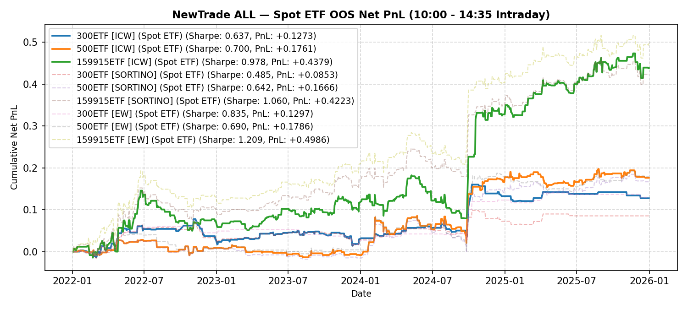

# NewTrade OOS Backtest Report

- **OOS Evaluation Period**: `2022-01-01 ~ 2026-01-01`
- **Intraday Trade Session**: `10:00 AM Open -> 14:35 PM Close`
- **Scheme(s)**: `ALL`
- **Conviction Threshold**: `auto` (buffer=+0.1)
- **Position Mode**: `fast_ramp_quadratic`
- **Stop-Loss Execution**: `Enabled (time_decay_trailing=0.03)`
- **Transaction Friction**: `16.0 bps roundtrip (8.0 bps/leg)`

## IC Weight (ICW)

| ETF | Asset | Side | OOS Period | Z_th | Features | Trades | Cost Sharpe | Raw Sharpe | Total PnL | Long PnL | Long Sharpe | Short PnL | Short Sharpe | Max DD | Win Rate | Turnover |
| --- | --- | --- | --- | --- | --- | --- | --- | --- | --- | --- | --- | --- | --- | --- | --- | --- |
| 300ETF | Spot ETF | single | 2022-01 ~ 2025-12 | L:1.20/S:1.00 (train L:1.10/S:0.90) | 10 | 133 (43L/90S) | 0.637 | 1.458 | +0.1273 | +0.0938 | 3.092 | +0.0335 | 0.810 | 0.0634 | 54.1% (L:60.5%, S:51.1%) | 50.8x |
| 500ETF | Spot ETF | single | 2022-01 ~ 2025-12 | L:0.90/S:1.30 (train L:0.80/S:1.20) | 32 | 194 (155L/39S) | 0.700 | 1.712 | +0.1761 | +0.0873 | 0.939 | +0.0889 | 4.819 | 0.0646 | 54.6% (L:52.9%, S:61.5%) | 73.3x |
| 50ETF | Spot ETF | single | 2022-01 ~ 2026-01 | N/A | 0 | N/A | N/A | N/A | N/A | N/A | N/A | N/A | N/A | N/A | N/A | N/A |
| 159915ETF | Spot ETF | single | 2022-01 ~ 2025-12 | L:0.80/S:1.00 (train L:0.70/S:0.90) | 11 | 324 (177L/147S) | 0.978 | 1.921 | +0.4379 | +0.3591 | 2.072 | +0.0788 | 1.102 | 0.1029 | 51.5% (L:49.2%, S:54.4%) | 118.9x |

<b>Sortino Weight (tail-IC selection + Score-blend weights)</b> (click to expand)

| ETF | Asset | Side | OOS Period | Z_th | Features | Trades | Cost Sharpe | Raw Sharpe | Total PnL | Long PnL | Long Sharpe | Short PnL | Short Sharpe | Max DD | Win Rate | Turnover |
| --- | --- | --- | --- | --- | --- | --- | --- | --- | --- | --- | --- | --- | --- | --- | --- | --- |
| 300ETF | Spot ETF | single | 2022-01 ~ 2025-12 | L:1.20/S:1.00 (train L:1.10/S:0.90) | 10 | 106 (37L/69S) | 0.485 | 1.232 | +0.0853 | +0.0772 | 2.912 | +0.0080 | 0.277 | 0.0559 | 54.7% (L:62.2%, S:50.7%) | 41.1x |
| 500ETF | Spot ETF | single | 2022-01 ~ 2025-12 | L:0.90/S:1.30 (train L:0.80/S:1.20) | 32 | 193 (158L/35S) | 0.642 | 1.619 | +0.1666 | +0.0743 | 0.759 | +0.0923 | 5.542 | 0.0805 | 53.9% (L:51.9%, S:62.9%) | 72.1x |
| 50ETF | Spot ETF | single | 2022-01 ~ 2026-01 | N/A | 0 | N/A | N/A | N/A | N/A | N/A | N/A | N/A | N/A | N/A | N/A | N/A |
| 159915ETF | Spot ETF | single | 2022-01 ~ 2025-12 | L:0.90/S:1.00 (train L:0.80/S:0.90) | 11 | 289 (144L/145S) | 1.060 | 1.994 | +0.4223 | +0.3366 | 2.511 | +0.0856 | 1.181 | 0.0748 | 54.0% (L:52.8%, S:55.2%) | 107.7x |

<b>Equal Weight (EW, Score-selected top-K)</b> (click to expand)

| ETF | Asset | Side | OOS Period | Z_th | Features | Trades | Cost Sharpe | Raw Sharpe | Total PnL | Long PnL | Long Sharpe | Short PnL | Short Sharpe | Max DD | Win Rate | Turnover |
| --- | --- | --- | --- | --- | --- | --- | --- | --- | --- | --- | --- | --- | --- | --- | --- | --- |
| 300ETF | Spot ETF | single | 2022-01 ~ 2025-12 | L:1.20/S:1.00 (train L:1.10/S:0.90) | 10 | 47 (20L/27S) | 0.835 | 1.178 | +0.1297 | +0.1099 | 6.339 | +0.0199 | 1.395 | 0.0581 | 57.4% (L:70.0%, S:48.1%) | 18.6x |
| 500ETF | Spot ETF | single | 2022-01 ~ 2025-12 | L:0.90/S:1.40 (train L:0.80/S:1.30) | 32 | 164 (136L/28S) | 0.690 | 1.499 | +0.1786 | +0.0517 | 0.597 | +0.1269 | 6.992 | 0.0827 | 54.3% (L:52.2%, S:64.3%) | 61.6x |
| 50ETF | Spot ETF | single | 2022-01 ~ 2026-01 | N/A | 0 | N/A | N/A | N/A | N/A | N/A | N/A | N/A | N/A | N/A | N/A | N/A |
| 159915ETF | Spot ETF | single | 2022-01 ~ 2025-12 | L:0.80/S:0.90 (train L:0.70/S:0.80) | 11 | 303 (162L/141S) | 1.209 | 2.149 | +0.4986 | +0.3582 | 2.435 | +0.1404 | 1.886 | 0.0876 | 54.1% (L:51.2%, S:57.4%) | 110.5x |

---

## Validation (DSR + CPCV)

- **DSR Trials**: `10`
- **CPCV**: `6` splits, `2` test chunks, purge=5

| ETF | Scheme | Sharpe | DSR | Verdict | CPCV Median | CPCV Std | % Positive |
| --- | --- | --- | --- | --- | --- | --- | --- |
| 300ETF | icw | 0.637 | 0.427 | NOT_SIGNIFICANT | 0.680 | 0.229 | 100% |
| 500ETF | icw | 0.700 | 0.468 | NOT_SIGNIFICANT | 0.972 | 0.479 | 93% |
| 159915ETF | icw | 0.978 | 0.746 | NOT_SIGNIFICANT | 0.873 | 0.251 | 100% |
| 300ETF | sortino | 0.485 | 0.297 | NOT_SIGNIFICANT | 0.603 | 0.289 | 100% |
| 500ETF | sortino | 0.642 | 0.422 | NOT_SIGNIFICANT | 0.994 | 0.475 | 100% |
| 159915ETF | sortino | 1.060 | 0.802 | NOT_SIGNIFICANT | 0.844 | 0.245 | 100% |
| 300ETF | ew | 0.835 | 0.704 | NOT_SIGNIFICANT | 0.873 | 0.252 | 100% |
| 500ETF | ew | 0.690 | 0.475 | NOT_SIGNIFICANT | 0.915 | 0.307 | 100% |
| 159915ETF | ew | 1.209 | 0.886 | NOT_SIGNIFICANT | 0.929 | 0.296 | 100% |

