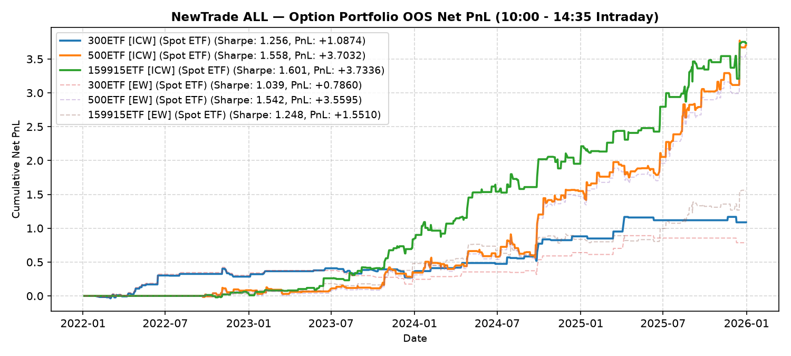

# NewTrade OOS Backtest Report

- **OOS Evaluation Period**: `2022-01-01 ~ 2026-01-01`
- **Intraday Trade Session**: `10:00 AM Open -> 14:35 PM Close`
- **Scheme(s)**: `ALL`
- **Conviction Threshold**: `auto` (buffer=+0.1)
- **Position Mode**: `binary`
- **Mode**: `Option Portfolio`
- **Initial Capital**: `100,000 RMB per ETF`
- **Trade Budget**: `10% of portfolio capital per signal`
- **Commission**: `4 RMB per side (8 RMB round-trip)`
- **Option Selection**: `Nearest OTM, >=7 DTM`

## IC Weight (ICW)

| ETF | Asset | Side | OOS Period | Z_th | Features | Trades | Cost Sharpe | Raw Sharpe | Total PnL | Long PnL | Long Sharpe | Short PnL | Short Sharpe | Max DD | Win Rate | Turnover |
| --- | --- | --- | --- | --- | --- | --- | --- | --- | --- | --- | --- | --- | --- | --- | --- | --- |
| 300ETF | Spot ETF | single | 2022-01 ~ 2025-12 | L:1.30/S:1.00 (train L:1.20/S:0.90) | 10 | 62 opt | 1.256 | 1.261 | +108,745 RMB | +0.6542 | 8.553 | +0.4333 | 3.415 | 0.1344 | 56.5% (L:70.0%, S:50.0%) | 31.2x |
| 500ETF | Spot ETF | single | 2022-01 ~ 2025-12 | L:0.80/S:1.30 (train L:0.70/S:1.20) | 32 | 188 opt | 1.558 | 1.564 | +370,320 RMB | +3.4359 | 3.397 | +0.2673 | 2.778 | 0.3456 | 46.1% (L:46.7%, S:41.7%) | 91.0x |
| 50ETF | Spot ETF | single | 2022-01 ~ 2026-01 | N/A | 0 | N/A | N/A | N/A | N/A | N/A | N/A | N/A | N/A | N/A | N/A | N/A |
| 588000ETF | Spot ETF | single | 2022-01 ~ 2026-01 | N/A | 0 | N/A | N/A | N/A | N/A | N/A | N/A | N/A | N/A | N/A | N/A | N/A |
| 159915ETF | Spot ETF | single | 2022-01 ~ 2025-12 | L:1.00/S:1.10 (train L:0.90/S:1.00) | 11 | 154 opt | 1.601 | 1.606 | +373,364 RMB | +2.4606 | 3.454 | +1.2730 | 4.343 | 0.3382 | 45.8% (L:41.7%, S:51.1%) | 92.6x |

<b>Equal Weight (EW)</b> (click to expand)

| ETF | Asset | Side | OOS Period | Z_th | Features | Trades | Cost Sharpe | Raw Sharpe | Total PnL | Long PnL | Long Sharpe | Short PnL | Short Sharpe | Max DD | Win Rate | Turnover |
| --- | --- | --- | --- | --- | --- | --- | --- | --- | --- | --- | --- | --- | --- | --- | --- | --- |
| 300ETF | Spot ETF | single | 2022-01 ~ 2025-12 | L:1.20/S:1.00 (train L:1.10/S:0.90) | 10 | 47 opt | 1.039 | 1.043 | +78,601 RMB | +0.6095 | 8.615 | +0.1765 | 2.087 | 0.2480 | 55.3% (L:70.0%, S:44.4%) | 23.4x |
| 500ETF | Spot ETF | single | 2022-01 ~ 2025-12 | L:0.80/S:1.30 (train L:0.70/S:1.20) | 32 | 188 opt | 1.542 | 1.549 | +355,945 RMB | +3.3115 | 3.390 | +0.2480 | 2.585 | 0.3370 | 45.9% (L:46.6%, S:40.0%) | 91.0x |
| 50ETF | Spot ETF | single | 2022-01 ~ 2026-01 | N/A | 0 | N/A | N/A | N/A | N/A | N/A | N/A | N/A | N/A | N/A | N/A | N/A |
| 588000ETF | Spot ETF | single | 2022-01 ~ 2026-01 | N/A | 0 | N/A | N/A | N/A | N/A | N/A | N/A | N/A | N/A | N/A | N/A | N/A |
| 159915ETF | Spot ETF | single | 2022-01 ~ 2025-12 | L:1.00/S:1.50 (train L:0.90/S:1.40) | 11 | 86 opt | 1.248 | 1.254 | +155,096 RMB | +1.5510 | 3.744 | +0.0000 | 0.000 | 0.1698 | 41.2% (L:41.6%, S:0.0%) | 49.4x |

---

## Validation (DSR + CPCV)

- **DSR Trials**: `10`
- **CPCV**: `6` splits, `2` test chunks, purge=5

| ETF | Scheme | Sharpe | DSR | Verdict | CPCV Median | CPCV Std | % Positive |
| --- | --- | --- | --- | --- | --- | --- | --- |
| 300ETF | icw | 1.256 | 0.942 | MARGINAL | 0.851 | 0.239 | 100% |
| 500ETF | icw | 1.558 | 0.994 | SIGNIFICANT | 1.005 | 0.414 | 100% |
| 159915ETF | icw | 1.601 | 0.987 | SIGNIFICANT | 0.836 | 0.274 | 100% |
| 300ETF | ew | 1.039 | 0.825 | NOT_SIGNIFICANT | 0.705 | 0.257 | 100% |
| 500ETF | ew | 1.542 | 0.993 | SIGNIFICANT | 0.967 | 0.404 | 100% |
| 159915ETF | ew | 1.248 | 0.913 | MARGINAL | 0.852 | 0.243 | 100% |

