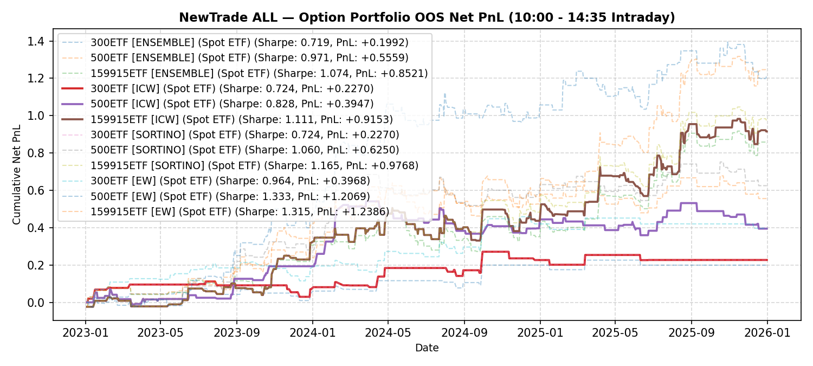

# NewTrade OOS Backtest Report

- **OOS Evaluation Period**: `2023-01-01 ~ 2026-01-01`
- **Intraday Trade Session**: `10:00 AM Open -> 14:35 PM Close`
- **Scheme(s)**: `ALL`
- **Conviction Threshold**: `auto` (buffer=+0.2)
- **Position Mode**: `fast_ramp_quadratic`
- **Mode**: `Option Portfolio`
- **Initial Capital**: `100,000 RMB per ETF`
- **Trade Budget**: `10% of portfolio capital per signal`
- **Commission**: `4.0 RMB per contract per side (8.0 RMB round-trip per contract)`
- **Option Selection**: `Nearest OTM, >=7 DTM`

## Ensemble (Equal-Weight Average)

| ETF | Asset | Side | OOS Period | Z_th | Features | Trades | Cost Sharpe | Raw Sharpe | Total PnL | Long PnL | Long Sharpe | Short PnL | Short Sharpe | Max DD | Win Rate | Turnover |
| --- | --- | --- | --- | --- | --- | --- | --- | --- | --- | --- | --- | --- | --- | --- | --- | --- |
| 300ETF | Spot ETF | single | 2023-01 ~ 2025-12 | L:1.70/S:1.40 (train L:1.50/S:1.20) | 47 | 28 opt | 0.719 | 0.887 | +19,918 RMB | +0.2223 | 6.151 | -0.0231 | -1.964 | 0.0649 | 53.6% (L:56.2%, S:50.0%) | 13.7x |
| 500ETF | Spot ETF | single | 2023-01 ~ 2025-12 | L:1.30/S:1.40 (train L:1.10/S:1.20) | 297 | 104 opt | 0.971 | 1.187 | +55,595 RMB | -0.0041 | -0.039 | +0.5601 | 5.345 | 0.1859 | 51.0% (L:46.3%, S:56.0%) | 54.1x |
| 50ETF | Spot ETF | single | 2023-01 ~ 2026-01 | N/A | 0 | N/A | N/A | N/A | N/A | N/A | N/A | N/A | N/A | N/A | N/A | N/A |
| 159915ETF | Spot ETF | single | 2023-01 ~ 2025-12 | L:0.90/S:1.20 (train L:0.70/S:1.00) | 77 | 139 opt | 1.074 | 1.494 | +85,208 RMB | +0.4328 | 1.607 | +0.4193 | 5.806 | 0.2353 | 42.4% (L:38.2%, S:58.6%) | 66.7x |

<b>IC Weight (ICW)</b> (click to expand)

| ETF | Asset | Side | OOS Period | Z_th | Features | Trades | Cost Sharpe | Raw Sharpe | Total PnL | Long PnL | Long Sharpe | Short PnL | Short Sharpe | Max DD | Win Rate | Turnover |
| --- | --- | --- | --- | --- | --- | --- | --- | --- | --- | --- | --- | --- | --- | --- | --- | --- |
| 300ETF | Spot ETF | single | 2023-01 ~ 2025-12 | L:1.50/S:1.50 (train L:1.30/S:1.30) | 47 | 31 opt | 0.724 | 0.877 | +22,697 RMB | +0.2639 | 4.842 | -0.0369 | -7.078 | 0.0823 | 54.8% (L:56.0%, S:50.0%) | 16.8x |
| 500ETF | Spot ETF | single | 2023-01 ~ 2025-12 | L:1.30/S:1.60 (train L:1.10/S:1.40) | 297 | 86 opt | 0.828 | 1.035 | +39,475 RMB | -0.0390 | -0.408 | +0.4338 | 6.965 | 0.1814 | 52.3% (L:45.3%, S:63.6%) | 43.7x |
| 50ETF | Spot ETF | single | 2023-01 ~ 2026-01 | N/A | 0 | N/A | N/A | N/A | N/A | N/A | N/A | N/A | N/A | N/A | N/A | N/A |
| 159915ETF | Spot ETF | single | 2023-01 ~ 2025-12 | L:0.90/S:1.10 (train L:0.70/S:0.90) | 77 | 149 opt | 1.111 | 1.580 | +91,532 RMB | +0.4521 | 1.714 | +0.4633 | 4.438 | 0.1746 | 45.6% (L:39.4%, S:60.0%) | 72.4x |

<b>Sortino Weight (tail-IC selection + Score-blend weights)</b> (click to expand)

| ETF | Asset | Side | OOS Period | Z_th | Features | Trades | Cost Sharpe | Raw Sharpe | Total PnL | Long PnL | Long Sharpe | Short PnL | Short Sharpe | Max DD | Win Rate | Turnover |
| --- | --- | --- | --- | --- | --- | --- | --- | --- | --- | --- | --- | --- | --- | --- | --- | --- |
| 300ETF | Spot ETF | single | 2023-01 ~ 2025-12 | L:1.50/S:1.50 (train L:1.30/S:1.30) | 47 | 31 opt | 0.724 | 0.877 | +22,697 RMB | +0.2639 | 4.842 | -0.0369 | -7.078 | 0.0823 | 54.8% (L:56.0%, S:50.0%) | 16.7x |
| 500ETF | Spot ETF | single | 2023-01 ~ 2025-12 | L:1.30/S:1.40 (train L:1.10/S:1.20) | 297 | 105 opt | 1.060 | 1.278 | +62,499 RMB | -0.0670 | -0.648 | +0.6920 | 6.155 | 0.1658 | 51.4% (L:44.2%, S:58.5%) | 53.6x |
| 50ETF | Spot ETF | single | 2023-01 ~ 2026-01 | N/A | 0 | N/A | N/A | N/A | N/A | N/A | N/A | N/A | N/A | N/A | N/A | N/A |
| 159915ETF | Spot ETF | single | 2023-01 ~ 2025-12 | L:0.90/S:1.10 (train L:0.70/S:0.90) | 77 | 148 opt | 1.165 | 1.626 | +97,683 RMB | +0.5056 | 1.900 | +0.4712 | 4.400 | 0.1670 | 45.9% (L:39.8%, S:60.0%) | 72.1x |

<b>Equal Weight (EW, TailIC-selected top-K)</b> (click to expand)

| ETF | Asset | Side | OOS Period | Z_th | Features | Trades | Cost Sharpe | Raw Sharpe | Total PnL | Long PnL | Long Sharpe | Short PnL | Short Sharpe | Max DD | Win Rate | Turnover |
| --- | --- | --- | --- | --- | --- | --- | --- | --- | --- | --- | --- | --- | --- | --- | --- | --- |
| 300ETF | Spot ETF | single | 2023-01 ~ 2025-12 | L:1.30/S:1.30 (train L:1.10/S:1.10) | 47 | 55 opt | 0.964 | 1.202 | +39,682 RMB | +0.3142 | 4.036 | +0.0826 | 2.654 | 0.1013 | 52.7% (L:51.4%, S:55.0%) | 29.4x |
| 500ETF | Spot ETF | single | 2023-01 ~ 2025-12 | L:1.00/S:1.40 (train L:0.80/S:1.20) | 297 | 162 opt | 1.333 | 1.592 | +120,691 RMB | +0.4203 | 1.445 | +0.7866 | 6.168 | 0.2034 | 50.6% (L:46.8%, S:58.8%) | 80.7x |
| 50ETF | Spot ETF | single | 2023-01 ~ 2026-01 | N/A | 0 | N/A | N/A | N/A | N/A | N/A | N/A | N/A | N/A | N/A | N/A | N/A |
| 159915ETF | Spot ETF | single | 2023-01 ~ 2025-12 | L:0.90/S:1.10 (train L:0.70/S:0.90) | 77 | 162 opt | 1.315 | 1.790 | +123,856 RMB | +0.5506 | 1.790 | +0.6880 | 5.335 | 0.1777 | 46.3% (L:39.4%, S:60.4%) | 78.0x |

---

## Validation (DSR + CPCV)

- **DSR Trials**: `10`
- **CPCV**: `6` splits, `2` test chunks, purge=5

| ETF | Scheme | Sharpe | DSR | Verdict | CPCV Median | CPCV Std | % Positive |
| --- | --- | --- | --- | --- | --- | --- | --- |
| 300ETF | ensemble | 0.719 | 0.477 | NOT_SIGNIFICANT | 0.568 | 0.219 | 100% |
| 500ETF | ensemble | 0.971 | 0.580 | NOT_SIGNIFICANT | 0.786 | 0.441 | 100% |
| 159915ETF | ensemble | 1.074 | 0.689 | NOT_SIGNIFICANT | 1.159 | 0.379 | 100% |
| 300ETF | icw | 0.724 | 0.462 | NOT_SIGNIFICANT | 0.496 | 0.224 | 100% |
| 500ETF | icw | 0.828 | 0.476 | NOT_SIGNIFICANT | 0.975 | 0.388 | 100% |
| 159915ETF | icw | 1.111 | 0.718 | NOT_SIGNIFICANT | 1.184 | 0.317 | 100% |
| 300ETF | sortino | 0.724 | 0.462 | NOT_SIGNIFICANT | 0.477 | 0.249 | 100% |
| 500ETF | sortino | 1.060 | 0.647 | NOT_SIGNIFICANT | 0.831 | 0.345 | 100% |
| 159915ETF | sortino | 1.165 | 0.759 | NOT_SIGNIFICANT | 1.163 | 0.357 | 100% |
| 300ETF | ew | 0.964 | 0.645 | NOT_SIGNIFICANT | 0.462 | 0.207 | 100% |
| 500ETF | ew | 1.333 | 0.822 | NOT_SIGNIFICANT | 0.944 | 0.447 | 93% |
| 159915ETF | ew | 1.315 | 0.841 | NOT_SIGNIFICANT | 1.192 | 0.423 | 100% |

