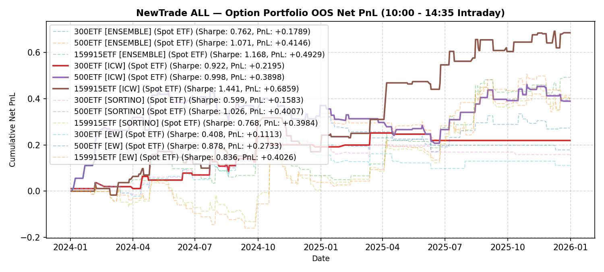

# NewTrade OOS Backtest Report

- **OOS Evaluation Period**: `2024-01-01 ~ 2026-01-01`
- **Intraday Trade Session**: `10:00 AM Open -> 14:35 PM Close`
- **Scheme(s)**: `ALL`
- **Conviction Threshold**: `auto` (buffer=+0.2)
- **Position Mode**: `fast_ramp_quadratic`
- **Mode**: `Option Portfolio`
- **Initial Capital**: `100,000 RMB per ETF`
- **Trade Budget**: `10% of portfolio capital per signal`
- **Commission**: `4.0 RMB per contract per side (8.0 RMB round-trip per contract)`
- **Option Selection**: `Nearest OTM, >=7 DTM`

## Ensemble (Equal-Weight Average)

| ETF | Asset | Side | OOS Period | Z_th | Features | Trades | Cost Sharpe | Raw Sharpe | Total PnL | Long PnL | Long Sharpe | Short PnL | Short Sharpe | Max DD | Win Rate | Turnover |
| --- | --- | --- | --- | --- | --- | --- | --- | --- | --- | --- | --- | --- | --- | --- | --- | --- |
| 300ETF | Spot ETF | single | 2024-01 ~ 2025-12 | L:1.70/S:1.40 (train L:1.50/S:1.20) | 37 | 30 opt | 0.762 | 0.986 | +17,886 RMB | +0.1596 | 5.309 | +0.0192 | 0.828 | 0.0594 | 33.3% (L:41.7%, S:27.8%) | 21.7x |
| 500ETF | Spot ETF | single | 2024-01 ~ 2025-12 | L:1.10/S:1.40 (train L:0.90/S:1.20) | 111 | 89 opt | 1.071 | 1.301 | +41,457 RMB | +0.0789 | 0.751 | +0.3356 | 5.878 | 0.1932 | 48.3% (L:41.8%, S:58.8%) | 68.8x |
| 50ETF | Spot ETF | single | 2024-01 ~ 2026-01 | N/A | 0 | N/A | N/A | N/A | N/A | N/A | N/A | N/A | N/A | N/A | N/A | N/A |
| 159915ETF | Spot ETF | single | 2024-01 ~ 2025-12 | L:1.10/S:1.70 (train L:0.90/S:1.50) | 99 | 59 opt | 1.168 | 1.409 | +49,286 RMB | +0.3579 | 2.769 | +0.1350 | 0.000 | 0.1518 | 45.8% (L:44.8%, S:100.0%) | 45.0x |

<b>IC Weight (ICW)</b> (click to expand)

| ETF | Asset | Side | OOS Period | Z_th | Features | Trades | Cost Sharpe | Raw Sharpe | Total PnL | Long PnL | Long Sharpe | Short PnL | Short Sharpe | Max DD | Win Rate | Turnover |
| --- | --- | --- | --- | --- | --- | --- | --- | --- | --- | --- | --- | --- | --- | --- | --- | --- |
| 300ETF | Spot ETF | single | 2024-01 ~ 2025-12 | L:1.60/S:1.50 (train L:1.40/S:1.30) | 37 | 25 opt | 0.922 | 1.109 | +21,947 RMB | +0.1346 | 3.887 | +0.0849 | 5.227 | 0.0500 | 44.0% (L:42.9%, S:45.5%) | 19.4x |
| 500ETF | Spot ETF | single | 2024-01 ~ 2025-12 | L:1.10/S:1.40 (train L:0.90/S:1.20) | 111 | 92 opt | 0.998 | 1.237 | +38,981 RMB | +0.0377 | 0.359 | +0.3521 | 5.746 | 0.2377 | 47.8% (L:40.0%, S:59.5%) | 70.9x |
| 50ETF | Spot ETF | single | 2024-01 ~ 2026-01 | N/A | 0 | N/A | N/A | N/A | N/A | N/A | N/A | N/A | N/A | N/A | N/A | N/A |
| 159915ETF | Spot ETF | single | 2024-01 ~ 2025-12 | L:1.20/S:1.30 (train L:1.00/S:1.10) | 99 | 71 opt | 1.441 | 1.746 | +68,586 RMB | +0.3386 | 2.665 | +0.3473 | 7.072 | 0.1472 | 49.3% (L:44.2%, S:63.2%) | 51.4x |

<b>Sortino Weight (tail-IC selection + Score-blend weights)</b> (click to expand)

| ETF | Asset | Side | OOS Period | Z_th | Features | Trades | Cost Sharpe | Raw Sharpe | Total PnL | Long PnL | Long Sharpe | Short PnL | Short Sharpe | Max DD | Win Rate | Turnover |
| --- | --- | --- | --- | --- | --- | --- | --- | --- | --- | --- | --- | --- | --- | --- | --- | --- |
| 300ETF | Spot ETF | single | 2024-01 ~ 2025-12 | L:1.40/S:1.40 (train L:1.20/S:1.20) | 37 | 38 opt | 0.599 | 0.852 | +15,825 RMB | +0.1088 | 2.173 | +0.0495 | 2.362 | 0.0875 | 36.8% (L:40.9%, S:31.2%) | 31.2x |
| 500ETF | Spot ETF | single | 2024-01 ~ 2025-12 | L:1.10/S:1.40 (train L:0.90/S:1.20) | 111 | 92 opt | 1.026 | 1.264 | +40,069 RMB | +0.0485 | 0.462 | +0.3522 | 5.743 | 0.2377 | 48.9% (L:41.8%, S:59.5%) | 71.0x |
| 50ETF | Spot ETF | single | 2024-01 ~ 2026-01 | N/A | 0 | N/A | N/A | N/A | N/A | N/A | N/A | N/A | N/A | N/A | N/A | N/A |
| 159915ETF | Spot ETF | single | 2024-01 ~ 2025-12 | L:0.70/S:1.30 (train L:0.50/S:1.10) | 99 | 132 opt | 0.768 | 1.241 | +39,839 RMB | +0.1063 | 0.471 | +0.2921 | 7.135 | 0.1908 | 40.9% (L:37.2%, S:63.2%) | 96.9x |

<b>Equal Weight (EW, TailIC-selected top-K)</b> (click to expand)

| ETF | Asset | Side | OOS Period | Z_th | Features | Trades | Cost Sharpe | Raw Sharpe | Total PnL | Long PnL | Long Sharpe | Short PnL | Short Sharpe | Max DD | Win Rate | Turnover |
| --- | --- | --- | --- | --- | --- | --- | --- | --- | --- | --- | --- | --- | --- | --- | --- | --- |
| 300ETF | Spot ETF | single | 2024-01 ~ 2025-12 | L:1.40/S:1.30 (train L:1.20/S:1.10) | 37 | 47 opt | 0.408 | 0.711 | +11,129 RMB | +0.0903 | 1.772 | +0.0210 | 0.682 | 0.1337 | 36.2% (L:39.1%, S:33.3%) | 36.5x |
| 500ETF | Spot ETF | single | 2024-01 ~ 2025-12 | L:1.30/S:1.40 (train L:1.10/S:1.20) | 111 | 67 opt | 0.878 | 1.086 | +27,329 RMB | -0.0958 | -1.651 | +0.3691 | 7.012 | 0.1500 | 49.3% (L:36.4%, S:61.8%) | 52.1x |
| 50ETF | Spot ETF | single | 2024-01 ~ 2026-01 | N/A | 0 | N/A | N/A | N/A | N/A | N/A | N/A | N/A | N/A | N/A | N/A | N/A |
| 159915ETF | Spot ETF | single | 2024-01 ~ 2025-12 | L:0.80/S:1.70 (train L:0.60/S:1.50) | 99 | 95 opt | 0.836 | 1.183 | +40,256 RMB | +0.2705 | 1.382 | +0.1321 | 0.000 | 0.2051 | 40.0% (L:39.4%, S:100.0%) | 72.0x |

---

## Validation (DSR + CPCV)

- **DSR Trials**: `10`
- **CPCV**: `6` splits, `2` test chunks, purge=5

| ETF | Scheme | Sharpe | DSR | Verdict | CPCV Median | CPCV Std | % Positive |
| --- | --- | --- | --- | --- | --- | --- | --- |
| 300ETF | ensemble | 0.762 | 0.392 | NOT_SIGNIFICANT | 0.376 | 0.309 | 100% |
| 500ETF | ensemble | 1.071 | 0.511 | NOT_SIGNIFICANT | 0.870 | 0.435 | 100% |
| 159915ETF | ensemble | 1.168 | 0.638 | NOT_SIGNIFICANT | 1.089 | 0.247 | 100% |
| 300ETF | icw | 0.922 | 0.518 | NOT_SIGNIFICANT | 0.434 | 0.294 | 100% |
| 500ETF | icw | 0.998 | 0.464 | NOT_SIGNIFICANT | 0.880 | 0.436 | 100% |
| 159915ETF | icw | 1.441 | 0.808 | NOT_SIGNIFICANT | 0.852 | 0.331 | 100% |
| 300ETF | sortino | 0.599 | 0.260 | NOT_SIGNIFICANT | 0.387 | 0.324 | 93% |
| 500ETF | sortino | 1.026 | 0.482 | NOT_SIGNIFICANT | 0.867 | 0.416 | 100% |
| 159915ETF | sortino | 0.768 | 0.347 | NOT_SIGNIFICANT | 1.024 | 0.319 | 100% |
| 300ETF | ew | 0.408 | 0.166 | NOT_SIGNIFICANT | 0.366 | 0.261 | 100% |
| 500ETF | ew | 0.878 | 0.390 | NOT_SIGNIFICANT | 0.964 | 0.408 | 100% |
| 159915ETF | ew | 0.836 | 0.399 | NOT_SIGNIFICANT | 0.857 | 0.320 | 100% |

