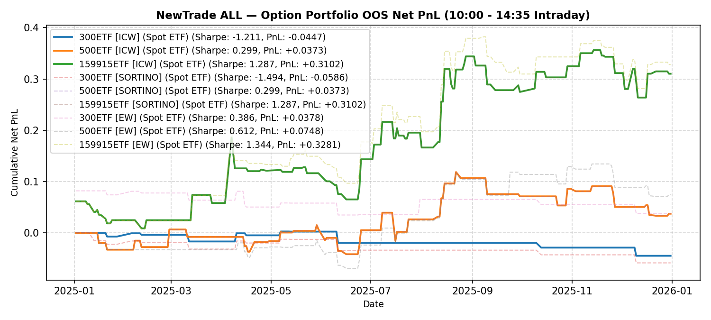

# NewTrade OOS Backtest Report

- **OOS Evaluation Period**: `2025-01-01 ~ 2026-01-01`
- **Intraday Trade Session**: `10:00 AM Open -> 14:35 PM Close`
- **Scheme(s)**: `ALL`
- **Conviction Threshold**: `auto` (buffer=+0.1)
- **Position Mode**: `fast_ramp_quadratic`
- **Mode**: `Option Portfolio`
- **Initial Capital**: `100,000 RMB per ETF`
- **Trade Budget**: `10% of portfolio capital per signal`
- **Commission**: `4.0 RMB per contract per side (8.0 RMB round-trip per contract)`
- **Option Selection**: `Nearest OTM, >=7 DTM`

## IC Weight (ICW)

| ETF | Asset | Side | OOS Period | Z_th | Features | Trades | Cost Sharpe | Raw Sharpe | Total PnL | Long PnL | Long Sharpe | Short PnL | Short Sharpe | Max DD | Win Rate | Turnover |
| --- | --- | --- | --- | --- | --- | --- | --- | --- | --- | --- | --- | --- | --- | --- | --- | --- |
| 300ETF | Spot ETF | single | 2025-01 ~ 2025-12 | L:1.60/S:1.30 (train L:1.50/S:1.20) | 60 | 11 opt | -1.211 | -0.722 | -4,473 RMB | -0.0312 | -38.886 | -0.0135 | -2.474 | 0.0474 | 27.3% (L:0.0%, S:33.3%) | 19.5x |
| 500ETF | Spot ETF | single | 2025-01 ~ 2025-12 | L:1.00/S:1.40 (train L:0.90/S:1.30) | 258 | 43 opt | 0.299 | 0.561 | +3,731 RMB | +0.0526 | 1.247 | -0.0153 | -1.530 | 0.0852 | 48.8% (L:51.5%, S:40.0%) | 68.0x |
| 50ETF | Spot ETF | single | 2025-01 ~ 2026-01 | N/A | 0 | N/A | N/A | N/A | N/A | N/A | N/A | N/A | N/A | N/A | N/A | N/A |
| 159915ETF | Spot ETF | single | 2025-01 ~ 2025-12 | L:0.80/S:1.20 (train L:0.70/S:1.10) | 168 | 69 opt | 1.287 | 1.766 | +31,017 RMB | +0.1636 | 1.820 | +0.1466 | 4.232 | 0.1207 | 46.4% (L:47.3%, S:42.9%) | 110.3x |

<b>Sortino Weight (tail-IC selection + Score-blend weights)</b> (click to expand)

| ETF | Asset | Side | OOS Period | Z_th | Features | Trades | Cost Sharpe | Raw Sharpe | Total PnL | Long PnL | Long Sharpe | Short PnL | Short Sharpe | Max DD | Win Rate | Turnover |
| --- | --- | --- | --- | --- | --- | --- | --- | --- | --- | --- | --- | --- | --- | --- | --- | --- |
| 300ETF | Spot ETF | single | 2025-01 ~ 2025-12 | L:1.50/S:1.30 (train L:1.40/S:1.20) | 60 | 13 opt | -1.494 | -0.991 | -5,856 RMB | -0.0453 | -21.958 | -0.0133 | -2.476 | 0.0586 | 30.8% (L:25.0%, S:33.3%) | 22.7x |
| 500ETF | Spot ETF | single | 2025-01 ~ 2025-12 | L:1.00/S:1.40 (train L:0.90/S:1.30) | 258 | 43 opt | 0.299 | 0.561 | +3,731 RMB | +0.0526 | 1.247 | -0.0153 | -1.530 | 0.0852 | 48.8% (L:51.5%, S:40.0%) | 68.0x |
| 50ETF | Spot ETF | single | 2025-01 ~ 2026-01 | N/A | 0 | N/A | N/A | N/A | N/A | N/A | N/A | N/A | N/A | N/A | N/A | N/A |
| 159915ETF | Spot ETF | single | 2025-01 ~ 2025-12 | L:0.80/S:1.20 (train L:0.70/S:1.10) | 168 | 69 opt | 1.287 | 1.766 | +31,017 RMB | +0.1636 | 1.820 | +0.1466 | 4.232 | 0.1207 | 46.4% (L:47.3%, S:42.9%) | 110.4x |

<b>Equal Weight (EW, Score-selected top-K)</b> (click to expand)

| ETF | Asset | Side | OOS Period | Z_th | Features | Trades | Cost Sharpe | Raw Sharpe | Total PnL | Long PnL | Long Sharpe | Short PnL | Short Sharpe | Max DD | Win Rate | Turnover |
| --- | --- | --- | --- | --- | --- | --- | --- | --- | --- | --- | --- | --- | --- | --- | --- | --- |
| 300ETF | Spot ETF | single | 2025-01 ~ 2025-12 | L:1.60/S:1.20 (train L:1.50/S:1.10) | 60 | 15 opt | 0.386 | 0.660 | +3,779 RMB | -0.0326 | -17.706 | +0.0704 | 3.424 | 0.0471 | 40.0% (L:33.3%, S:41.7%) | 24.5x |
| 500ETF | Spot ETF | single | 2025-01 ~ 2025-12 | L:1.00/S:1.50 (train L:0.90/S:1.40) | 258 | 40 opt | 0.612 | 0.857 | +7,479 RMB | +0.1297 | 3.019 | -0.0549 | -14.771 | 0.0693 | 50.0% (L:54.5%, S:28.6%) | 60.6x |
| 50ETF | Spot ETF | single | 2025-01 ~ 2026-01 | N/A | 0 | N/A | N/A | N/A | N/A | N/A | N/A | N/A | N/A | N/A | N/A | N/A |
| 159915ETF | Spot ETF | single | 2025-01 ~ 2025-12 | L:0.80/S:1.10 (train L:0.70/S:1.00) | 168 | 67 opt | 1.344 | 1.830 | +32,813 RMB | +0.1776 | 2.131 | +0.1505 | 3.506 | 0.1052 | 44.8% (L:44.7%, S:45.0%) | 111.2x |

---

## Validation (DSR + CPCV)

- **DSR Trials**: `10`
- **CPCV**: `6` splits, `2` test chunks, purge=5

| ETF | Scheme | Sharpe | DSR | Verdict | CPCV Median | CPCV Std | % Positive |
| --- | --- | --- | --- | --- | --- | --- | --- |
| 300ETF | icw | -1.211 | 0.002 | NOT_SIGNIFICANT | 0.546 | 0.168 | 100% |
| 500ETF | icw | 0.299 | 0.100 | NOT_SIGNIFICANT | 0.785 | 0.384 | 93% |
| 159915ETF | icw | 1.287 | 0.448 | NOT_SIGNIFICANT | 1.162 | 0.380 | 100% |
| 300ETF | sortino | -1.494 | 0.001 | NOT_SIGNIFICANT | 0.402 | 0.209 | 100% |
| 500ETF | sortino | 0.299 | 0.100 | NOT_SIGNIFICANT | 0.747 | 0.452 | 93% |
| 159915ETF | sortino | 1.287 | 0.448 | NOT_SIGNIFICANT | 1.075 | 0.356 | 100% |
| 300ETF | ew | 0.386 | 0.124 | NOT_SIGNIFICANT | 0.486 | 0.190 | 100% |
| 500ETF | ew | 0.612 | 0.168 | NOT_SIGNIFICANT | 1.024 | 0.511 | 93% |
| 159915ETF | ew | 1.344 | 0.478 | NOT_SIGNIFICANT | 0.948 | 0.364 | 100% |

