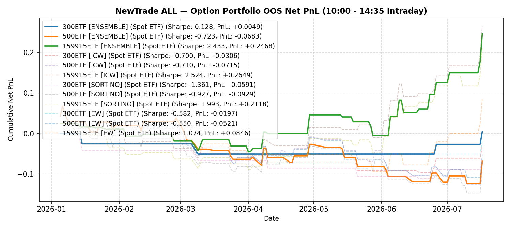

# NewTrade OOS Backtest Report

- **OOS Evaluation Period**: `2026-01-01 ~ 2026-01-01`
- **Intraday Trade Session**: `10:00 AM Open -> 14:35 PM Close`
- **Scheme(s)**: `ALL`
- **Conviction Threshold**: `auto` (buffer=+0.2)
- **Position Mode**: `fast_ramp_quadratic`
- **Mode**: `Option Portfolio`
- **Initial Capital**: `100,000 RMB per ETF`
- **Trade Budget**: `10% of portfolio capital per signal`
- **Commission**: `4.0 RMB per contract per side (8.0 RMB round-trip per contract)`
- **Option Selection**: `Nearest OTM, >=7 DTM`

## Ensemble (Equal-Weight Average)

| ETF | Asset | Side | OOS Period | Z_th | Features | Trades | Cost Sharpe | Raw Sharpe | Total PnL | Long PnL | Long Sharpe | Short PnL | Short Sharpe | Max DD | Win Rate | Turnover |
| --- | --- | --- | --- | --- | --- | --- | --- | --- | --- | --- | --- | --- | --- | --- | --- | --- |
| 300ETF | Spot ETF | single | 2026-01 ~ 2026-07 | L:1.60/S:1.60 (train L:1.40/S:1.40) | 43 | 4 opt | 0.128 | 0.220 | +489 RMB | -0.0256 | 0.000 | +0.0305 | 6.416 | 0.0507 | 50.0% (L:0.0%, S:66.7%) | 10.2x |
| 500ETF | Spot ETF | single | 2026-01 ~ 2026-07 | L:1.00/S:1.40 (train L:0.80/S:1.20) | 56 | 39 opt | -0.723 | -0.533 | -6,827 RMB | -0.0772 | -2.042 | +0.0089 | 0.641 | 0.1913 | 33.3% (L:31.0%, S:40.0%) | 100.6x |
| 50ETF | Spot ETF | single | 2026-01 ~ 2026-01 | N/A | 0 | N/A | N/A | N/A | N/A | N/A | N/A | N/A | N/A | N/A | N/A | N/A |
| 159915ETF | Spot ETF | single | 2026-01 ~ 2026-07 | L:0.90/S:1.20 (train L:0.70/S:1.00) | 146 | 31 opt | 2.433 | 2.687 | +24,676 RMB | +0.1375 | 7.383 | +0.1092 | 3.797 | 0.0700 | 54.8% (L:64.3%, S:47.1%) | 80.8x |

<b>IC Weight (ICW)</b> (click to expand)

| ETF | Asset | Side | OOS Period | Z_th | Features | Trades | Cost Sharpe | Raw Sharpe | Total PnL | Long PnL | Long Sharpe | Short PnL | Short Sharpe | Max DD | Win Rate | Turnover |
| --- | --- | --- | --- | --- | --- | --- | --- | --- | --- | --- | --- | --- | --- | --- | --- | --- |
| 300ETF | Spot ETF | single | 2026-01 ~ 2026-07 | L:1.60/S:1.60 (train L:1.40/S:1.40) | 43 | 8 opt | -0.700 | -0.560 | -3,058 RMB | -0.0591 | -13.679 | +0.0285 | 6.119 | 0.0961 | 37.5% (L:20.0%, S:66.7%) | 18.3x |
| 500ETF | Spot ETF | single | 2026-01 ~ 2026-07 | L:0.90/S:1.30 (train L:0.70/S:1.10) | 56 | 47 opt | -0.710 | -0.500 | -7,152 RMB | -0.0424 | -1.043 | -0.0292 | -1.457 | 0.1944 | 36.2% (L:37.5%, S:33.3%) | 125.6x |
| 50ETF | Spot ETF | single | 2026-01 ~ 2026-01 | N/A | 0 | N/A | N/A | N/A | N/A | N/A | N/A | N/A | N/A | N/A | N/A | N/A |
| 159915ETF | Spot ETF | single | 2026-01 ~ 2026-07 | L:0.80/S:1.20 (train L:0.60/S:1.00) | 146 | 34 opt | 2.524 | 2.788 | +26,491 RMB | +0.1931 | 8.195 | +0.0718 | 2.613 | 0.0882 | 55.9% (L:66.7%, S:43.8%) | 89.4x |

<b>Sortino Weight (tail-IC selection + Score-blend weights)</b> (click to expand)

| ETF | Asset | Side | OOS Period | Z_th | Features | Trades | Cost Sharpe | Raw Sharpe | Total PnL | Long PnL | Long Sharpe | Short PnL | Short Sharpe | Max DD | Win Rate | Turnover |
| --- | --- | --- | --- | --- | --- | --- | --- | --- | --- | --- | --- | --- | --- | --- | --- | --- |
| 300ETF | Spot ETF | single | 2026-01 ~ 2026-07 | L:1.60/S:1.60 (train L:1.40/S:1.40) | 43 | 8 opt | -1.361 | -1.234 | -5,908 RMB | -0.0864 | -40.542 | +0.0273 | 6.010 | 0.1111 | 25.0% (L:0.0%, S:66.7%) | 16.3x |
| 500ETF | Spot ETF | single | 2026-01 ~ 2026-07 | L:0.90/S:1.30 (train L:0.70/S:1.10) | 56 | 48 opt | -0.927 | -0.716 | -9,291 RMB | -0.0407 | -1.018 | -0.0522 | -2.499 | 0.2145 | 35.4% (L:37.5%, S:31.2%) | 129.7x |
| 50ETF | Spot ETF | single | 2026-01 ~ 2026-01 | N/A | 0 | N/A | N/A | N/A | N/A | N/A | N/A | N/A | N/A | N/A | N/A | N/A |
| 159915ETF | Spot ETF | single | 2026-01 ~ 2026-07 | L:0.80/S:1.10 (train L:0.60/S:0.90) | 146 | 38 opt | 1.993 | 2.286 | +21,175 RMB | +0.1878 | 8.226 | +0.0239 | 0.742 | 0.1135 | 52.6% (L:66.7%, S:40.0%) | 100.5x |

<b>Equal Weight (EW, TailIC-selected top-K)</b> (click to expand)

| ETF | Asset | Side | OOS Period | Z_th | Features | Trades | Cost Sharpe | Raw Sharpe | Total PnL | Long PnL | Long Sharpe | Short PnL | Short Sharpe | Max DD | Win Rate | Turnover |
| --- | --- | --- | --- | --- | --- | --- | --- | --- | --- | --- | --- | --- | --- | --- | --- | --- |
| 300ETF | Spot ETF | single | 2026-01 ~ 2026-07 | L:1.60/S:1.60 (train L:1.40/S:1.40) | 43 | 3 opt | -0.582 | -0.505 | -1,971 RMB | -0.0256 | 0.000 | +0.0059 | 1.663 | 0.0507 | 33.3% (L:0.0%, S:50.0%) | 8.3x |
| 500ETF | Spot ETF | single | 2026-01 ~ 2026-07 | L:1.00/S:1.50 (train L:0.80/S:1.30) | 56 | 37 opt | -0.550 | -0.369 | -5,212 RMB | -0.0523 | -1.369 | +0.0002 | 0.015 | 0.1761 | 35.1% (L:34.5%, S:37.5%) | 92.6x |
| 50ETF | Spot ETF | single | 2026-01 ~ 2026-01 | N/A | 0 | N/A | N/A | N/A | N/A | N/A | N/A | N/A | N/A | N/A | N/A | N/A |
| 159915ETF | Spot ETF | single | 2026-01 ~ 2026-07 | L:1.00/S:1.20 (train L:0.80/S:1.00) | 146 | 25 opt | 1.074 | 1.347 | +8,463 RMB | -0.0046 | -0.575 | +0.0892 | 3.557 | 0.1190 | 48.0% (L:44.4%, S:50.0%) | 67.5x |

---

## Validation (DSR + CPCV)

- **DSR Trials**: `10`
- **CPCV**: `6` splits, `2` test chunks, purge=5

| ETF | Scheme | Sharpe | DSR | Verdict | CPCV Median | CPCV Std | % Positive |
| --- | --- | --- | --- | --- | --- | --- | --- |
| 300ETF | ensemble | 0.128 | 0.069 | NOT_SIGNIFICANT | 0.619 | 0.331 | 93% |
| 500ETF | ensemble | -0.723 | 0.019 | NOT_SIGNIFICANT | 1.044 | 0.497 | 100% |
| 159915ETF | ensemble | 2.433 | 0.693 | NOT_SIGNIFICANT | 1.003 | 0.270 | 100% |
| 300ETF | icw | -0.700 | 0.019 | NOT_SIGNIFICANT | 0.535 | 0.339 | 93% |
| 500ETF | icw | -0.710 | 0.019 | NOT_SIGNIFICANT | 0.898 | 0.511 | 100% |
| 159915ETF | icw | 2.524 | 0.717 | NOT_SIGNIFICANT | 1.001 | 0.292 | 100% |
| 300ETF | sortino | -1.361 | 0.005 | NOT_SIGNIFICANT | 0.548 | 0.316 | 93% |
| 500ETF | sortino | -0.927 | 0.013 | NOT_SIGNIFICANT | 0.921 | 0.516 | 100% |
| 159915ETF | sortino | 1.993 | 0.508 | NOT_SIGNIFICANT | 0.948 | 0.263 | 100% |
| 300ETF | ew | -0.582 | 0.023 | NOT_SIGNIFICANT | 0.563 | 0.358 | 87% |
| 500ETF | ew | -0.550 | 0.025 | NOT_SIGNIFICANT | 1.001 | 0.423 | 100% |
| 159915ETF | ew | 1.074 | 0.229 | NOT_SIGNIFICANT | 0.936 | 0.248 | 100% |

