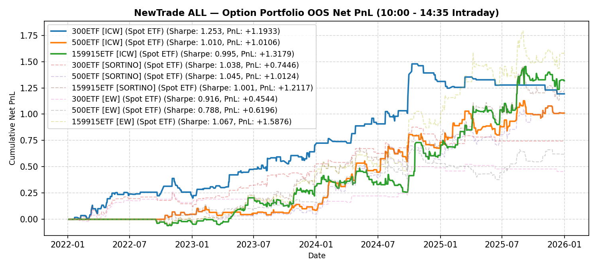

# NewTrade OOS Backtest Report

- **OOS Evaluation Period**: `2022-01-01 ~ 2026-01-01`
- **Intraday Trade Session**: `10:00 AM Open -> 14:35 PM Close`
- **Scheme(s)**: `ALL`
- **Conviction Threshold**: `auto` (buffer=+0.1)
- **Position Mode**: `fast_ramp_quadratic`
- **Mode**: `Option Portfolio`
- **Initial Capital**: `100,000 RMB per ETF`
- **Trade Budget**: `10% of portfolio capital per signal`
- **Commission**: `4.0 RMB per contract per side (8.0 RMB round-trip per contract)`
- **Option Selection**: `Nearest OTM, >=7 DTM`

## IC Weight (ICW)

| ETF | Asset | Side | OOS Period | Z_th | Features | Trades | Cost Sharpe | Raw Sharpe | Total PnL | Long PnL | Long Sharpe | Short PnL | Short Sharpe | Max DD | Win Rate | Turnover |
| --- | --- | --- | --- | --- | --- | --- | --- | --- | --- | --- | --- | --- | --- | --- | --- | --- |
| 300ETF | Spot ETF | single | 2022-01 ~ 2025-12 | L:1.20/S:1.00 (train L:1.10/S:0.90) | 10 | 133 opt | 1.253 | 1.556 | +119,334 RMB | +0.6755 | 4.554 | +0.5179 | 2.812 | 0.2848 | 53.4% (L:55.8%, S:52.2%) | 50.8x |
| 500ETF | Spot ETF | single | 2022-01 ~ 2025-12 | L:0.90/S:1.30 (train L:0.80/S:1.20) | 32 | 170 opt | 1.010 | 1.213 | +101,056 RMB | +0.8474 | 2.269 | +0.1631 | 2.419 | 0.2268 | 44.3% (L:43.2%, S:48.7%) | 73.3x |
| 50ETF | Spot ETF | single | 2022-01 ~ 2026-01 | N/A | 0 | N/A | N/A | N/A | N/A | N/A | N/A | N/A | N/A | N/A | N/A | N/A |
| 159915ETF | Spot ETF | single | 2022-01 ~ 2025-12 | L:0.80/S:1.00 (train L:0.70/S:0.90) | 11 | 263 opt | 0.995 | 1.527 | +131,789 RMB | +0.7306 | 1.525 | +0.5873 | 2.165 | 0.2286 | 37.7% (L:30.5%, S:46.3%) | 118.9x |

<b>Sortino Weight (tail-IC selection + Score-blend weights)</b> (click to expand)

| ETF | Asset | Side | OOS Period | Z_th | Features | Trades | Cost Sharpe | Raw Sharpe | Total PnL | Long PnL | Long Sharpe | Short PnL | Short Sharpe | Max DD | Win Rate | Turnover |
| --- | --- | --- | --- | --- | --- | --- | --- | --- | --- | --- | --- | --- | --- | --- | --- | --- |
| 300ETF | Spot ETF | single | 2022-01 ~ 2025-12 | L:1.20/S:1.00 (train L:1.10/S:0.90) | 10 | 106 opt | 1.038 | 1.316 | +74,456 RMB | +0.4382 | 4.335 | +0.3064 | 2.427 | 0.1623 | 52.8% (L:56.8%, S:50.7%) | 41.1x |
| 500ETF | Spot ETF | single | 2022-01 ~ 2025-12 | L:0.90/S:1.30 (train L:0.80/S:1.20) | 32 | 171 opt | 1.045 | 1.249 | +101,244 RMB | +0.8356 | 2.280 | +0.1769 | 2.976 | 0.1798 | 44.6% (L:43.0%, S:51.4%) | 72.1x |
| 50ETF | Spot ETF | single | 2022-01 ~ 2026-01 | N/A | 0 | N/A | N/A | N/A | N/A | N/A | N/A | N/A | N/A | N/A | N/A | N/A |
| 159915ETF | Spot ETF | single | 2022-01 ~ 2025-12 | L:0.90/S:1.00 (train L:0.80/S:0.90) | 11 | 232 opt | 1.001 | 1.552 | +121,165 RMB | +0.5389 | 1.443 | +0.6728 | 2.427 | 0.3247 | 39.1% (L:32.6%, S:45.5%) | 107.7x |

<b>Equal Weight (EW, Score-selected top-K)</b> (click to expand)

| ETF | Asset | Side | OOS Period | Z_th | Features | Trades | Cost Sharpe | Raw Sharpe | Total PnL | Long PnL | Long Sharpe | Short PnL | Short Sharpe | Max DD | Win Rate | Turnover |
| --- | --- | --- | --- | --- | --- | --- | --- | --- | --- | --- | --- | --- | --- | --- | --- | --- |
| 300ETF | Spot ETF | single | 2022-01 ~ 2025-12 | L:1.20/S:1.00 (train L:1.10/S:0.90) | 10 | 47 opt | 0.916 | 1.055 | +45,441 RMB | +0.4791 | 8.776 | -0.0247 | -0.611 | 0.1587 | 48.9% (L:65.0%, S:37.0%) | 18.6x |
| 500ETF | Spot ETF | single | 2022-01 ~ 2025-12 | L:0.90/S:1.40 (train L:0.80/S:1.30) | 32 | 137 opt | 0.788 | 0.974 | +61,956 RMB | +0.4124 | 1.497 | +0.2071 | 4.682 | 0.2903 | 42.1% (L:41.9%, S:42.9%) | 61.7x |
| 50ETF | Spot ETF | single | 2022-01 ~ 2026-01 | N/A | 0 | N/A | N/A | N/A | N/A | N/A | N/A | N/A | N/A | N/A | N/A | N/A |
| 159915ETF | Spot ETF | single | 2022-01 ~ 2025-12 | L:0.80/S:0.90 (train L:0.70/S:0.80) | 11 | 243 opt | 1.067 | 1.554 | +158,764 RMB | +0.8306 | 1.644 | +0.7571 | 2.435 | 0.3567 | 38.6% (L:32.1%, S:46.1%) | 110.5x |

---

## Validation (DSR + CPCV)

- **DSR Trials**: `10`
- **CPCV**: `6` splits, `2` test chunks, purge=5

| ETF | Scheme | Sharpe | DSR | Verdict | CPCV Median | CPCV Std | % Positive |
| --- | --- | --- | --- | --- | --- | --- | --- |
| 300ETF | icw | 1.253 | 0.924 | MARGINAL | 0.680 | 0.229 | 100% |
| 500ETF | icw | 1.010 | 0.736 | NOT_SIGNIFICANT | 0.972 | 0.479 | 93% |
| 159915ETF | icw | 0.995 | 0.746 | NOT_SIGNIFICANT | 0.873 | 0.251 | 100% |
| 300ETF | sortino | 1.038 | 0.798 | NOT_SIGNIFICANT | 0.603 | 0.289 | 100% |
| 500ETF | sortino | 1.045 | 0.762 | NOT_SIGNIFICANT | 0.994 | 0.475 | 100% |
| 159915ETF | sortino | 1.001 | 0.731 | NOT_SIGNIFICANT | 0.844 | 0.245 | 100% |
| 300ETF | ew | 0.916 | 0.751 | NOT_SIGNIFICANT | 0.873 | 0.252 | 100% |
| 500ETF | ew | 0.788 | 0.553 | NOT_SIGNIFICANT | 0.863 | 0.346 | 100% |
| 159915ETF | ew | 1.067 | 0.805 | NOT_SIGNIFICANT | 0.929 | 0.296 | 100% |

