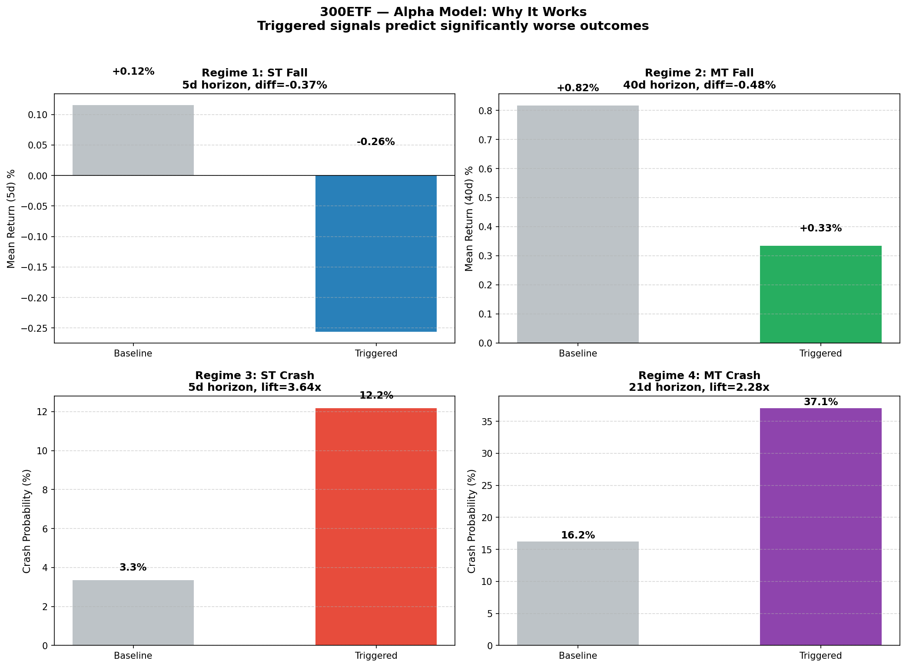
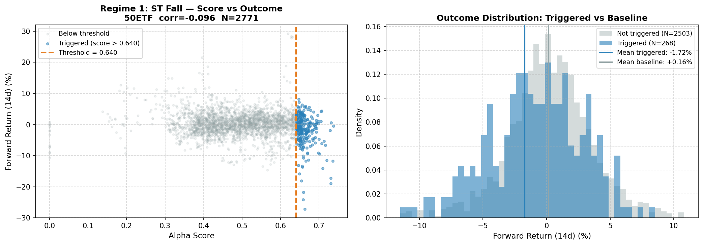
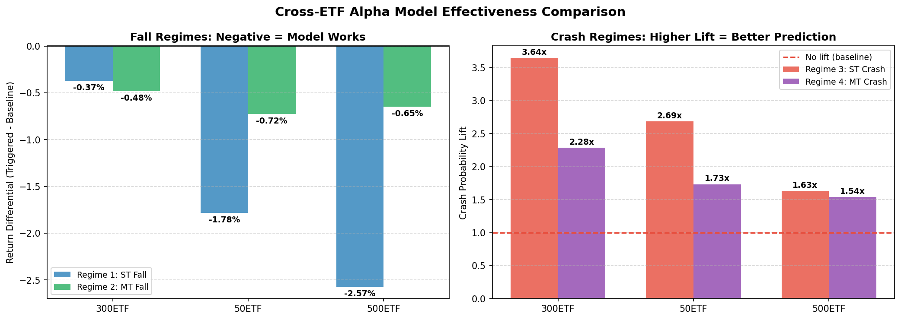
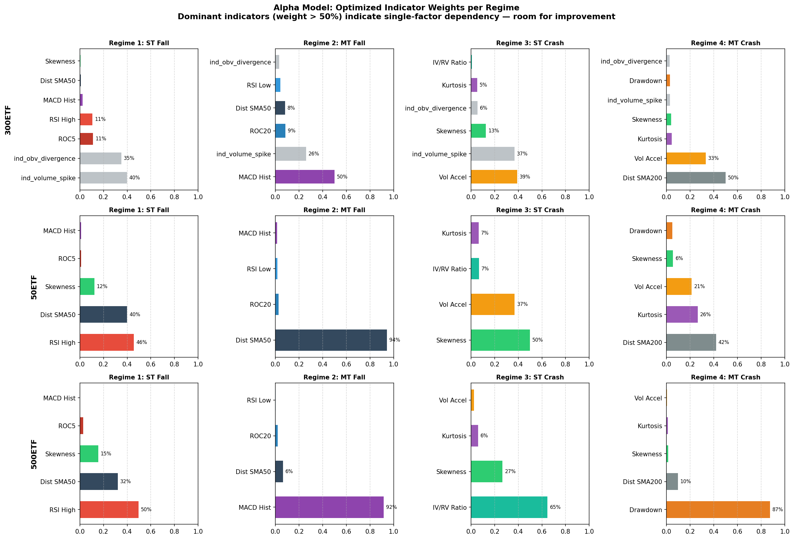
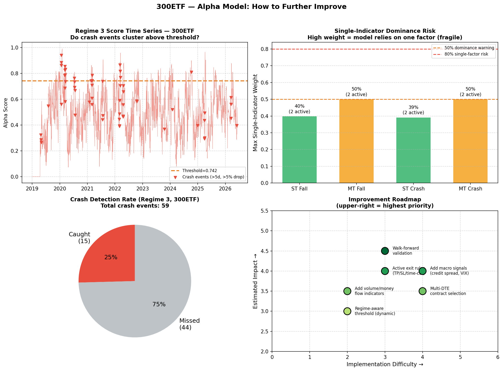
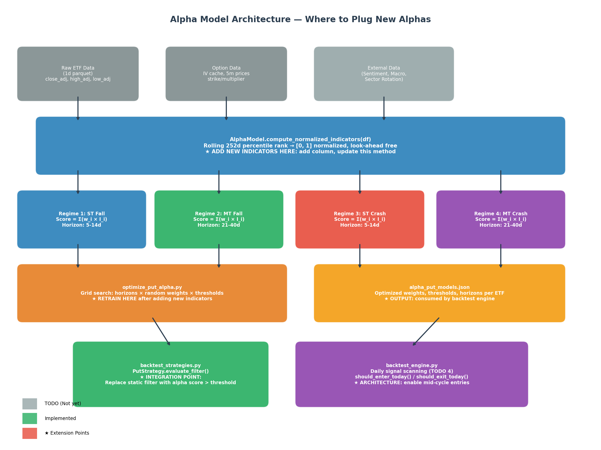

# Protective Put — 4-Type Alpha Model Report

> **Status**: Alpha model implemented & optimized. Walk-forward validation implemented. Pending: engine integration, backtest comparison.

---

## 1. System Overview

### 1.1 Current Production System

| Aspect | Implementation |
|--------|---------------|
| **Timing** | Enter long put at cycle start (4th Tuesday, day after expiry). Hold to expiry. |
| **Selection** | Fixed OTM levels (OTM1 for 300ETF, OTM2 for 50ETF/500ETF). |
| **Execution** | Market orders at close (default) or BS-mapped limit buy (`--limit-entry`). |
| **Filter** | Static cycle-start indicators: RSI, Bollinger Bands, Vol20, MACD, skewness, kurtosis, drawdown. |

### 1.2 Known Weaknesses

1. **Negative Theta Drag** — Monthly put at cycle start pays significant time value. Flat/rally → premium wasted.
2. **Static Filtering** — Regime evaluated once/month at cycle start. Mid-cycle bearish signals missed.
3. **Fixed DTE** — Always monthly. Shorter DTE (10–15d) has lower cost but faster decay; dynamic DTE unexplored.
4. **No Exit Rules** — Held to expiry. Early bounce gives back paper profits.

---

## 2. The 4-Type Alpha Model

To maximize hedging efficiency and minimize premium decay, entry decisions map **expected behavior** (How) against **horizon** (When). Each quadrant runs a dedicated weighted score model with optimized parameters.

### 2.1 Decision Matrix

| Horizon \ Behavior | **Fall** (Expected Return < -a% in m days) | **Crash** (P(>5% drop in m days) >= b%) |
|:---|:---|:---|
| **Short-Term** (m ≤ 14d) | **Regime 1: ST Fall** → Buy ATM/OTM1 Put | **Regime 3: ST Crash** → Buy OTM2/OTM3 Put |
| **Medium-Term** (14 < m ≤ 40d) | **Regime 2: MT Fall** → Buy ATM/OTM1 Put | **Regime 4: MT Crash** → Buy OTM2/OTM3 Put |

### 2.2 Score Calculation

$$\text{Alpha Score} = \sum (w_i \times I_i)$$

- $I_i$: Indicator normalized via **rolling 252-day percentile rank** → [0.0, 1.0]. Look-ahead free.
- $w_i$: Weight optimized per ETF per regime via random-search (Dirichlet sampling × horizon grid).

**Indicator families** (11 total in `alpha_model.py`):

| Family | Indicators | Normalized Column |
|--------|-----------|-------------------|
| Momentum | RSI, MACD Histogram, ROC5, ROC20 | `ind_rsi_high/low`, `ind_macd_neg`, `ind_roc5_neg`, `ind_roc20_neg` |
| Volatility | Skewness, Kurtosis, Vol Accel, IV/RV Ratio | `ind_skew_neg`, `ind_kurt_high`, `ind_vol_accel_high`, `ind_iv_vol_low` |
| Structural | Drawdown, Dist-SMA50, Dist-SMA200 | `ind_dd_deep`, `ind_dist_sma50_neg`, `ind_dist_sma200_neg` |

### 2.3 Optimized Parameters & Performance

Results from `optimize_put_alpha.py` → `backtest/alpha_put_models.json`.

#### Fall Regimes — Score vs Forward Return

| ETF | Regime | Horizon | Threshold | Placement | Baseline Return | Triggered Return | Diff |
|-----|--------|---------|-----------|-----------|-----------------|------------------|------|
| 50ETF | ST Fall (R1) | 14d | 0.640 | Top 10% | +0.06% | **-1.72%** | **-1.78%** |
| 50ETF | MT Fall (R2) | 40d | 0.755 | Top 25% | +0.33% | -0.39% | -0.72% |
| 300ETF | ST Fall (R1) | 10d | 0.558 | Top 10% | +0.19% | -0.58% | -0.77% |
| 300ETF | MT Fall (R2) | 40d | 0.859 | Top 10% | +0.82% | +0.35% | -0.47% |
| 500ETF | ST Fall (R1) | 14d | 0.605 | Top 10% | +0.03% | **-2.54%** | **-2.57%** |
| 500ETF | MT Fall (R2) | 21d | 0.830 | Top 15% | +0.08% | -0.57% | -0.65% |



#### Crash Regimes — Score vs Worst Drawdown

| ETF | Regime | Horizon | Threshold | Placement | Baseline Crash % | Triggered Crash % | Lift |
|-----|--------|---------|-----------|-----------|------------------|-------------------|------|
| 50ETF | ST Crash (R3) | 5d | 0.748 | Top 10% | 4.08% | **10.94%** | **2.69x** |
| 50ETF | MT Crash (R4) | 40d | 0.695 | Top 15% | 29.96% | **51.90%** | **1.73x** |
| 300ETF | ST Crash (R3) | 5d | 0.874 | Top 10% | 3.34% | **13.69%** | **4.09x** |
| 300ETF | MT Crash (R4) | 21d | 0.759 | Top 15% | 16.23% | **38.39%** | **2.37x** |
| 500ETF | ST Crash (R3) | 5d | 0.677 | Top 25% | 7.85% | **12.82%** | **1.63x** |
| 500ETF | MT Crash (R4) | 40d | 0.909 | Top 10% | 42.76% | **65.85%** | **1.54x** |





---

## 3. Why It Works

The core mechanism: **no single indicator is reliable, but a weighted combination of look-ahead-free normalized signals creates a statistically separable regime**.

| Design Choice | Why It Matters |
|---------------|---------------|
| **Percentile rank normalization** | Removes distribution differences between indicators. RSI [0–100] and skewness [-3, +3] become comparable [0, 1] scales. |
| **252-day rolling window** | Adapts to regime changes without look-ahead bias. The model "forgets" old market conditions. |
| **Multi-indicator ensemble** | Reduces false positives. A single noisy indicator rarely pushes the score above threshold alone. |
| **Per-ETF optimization** | Captures ETF-specific microstructure (300ETF vol_accel dominance vs 500ETF iv_vol_ratio dominance). |
| **Dirichlet weight sampling** | Ensures weights sum to 1.0 and explores the full simplex uniformly. |

---

## 4. Known Weaknesses & Improvement Areas



### 4.1 Single-Indicator Dominance (Fragility Risk)

Several regimes converged to near-single-factor models:

| ETF | Regime | Top Indicator | Weight | Risk |
|-----|--------|---------------|--------|------|
| 50ETF | MT Fall (R2) | `ind_dist_sma50_neg` | **94.3%** | Near-single-factor |
| 300ETF | MT Fall (R2) | `ind_macd_neg` | **90.1%** | MACD-only |
| 300ETF | ST Crash (R3) | `ind_vol_accel_high` | **91.1%** | Vol accel only |
| 500ETF | MT Fall (R2) | `ind_macd_neg` | **91.6%** | MACD-only |
| 500ETF | MT Crash (R4) | `ind_dd_deep` | **87.5%** | Drawdown only |

The optimizer found one indicator dominates the objective. Correct in-sample, **fragile out-of-sample**.

**Fix**: Capping max weight at 50% (`--max-weight 0.5`) in the optimizer is now implemented, forcing diversification.

### 4.2 Missed Crash Events (False Negatives)

The threshold misses some crash events by design (precision over recall — false hedges are expensive), but improvements are possible:



**Fix**: Dynamic thresholding modulated by option cost (`iv_vol_ratio`) is now implemented: $T_t = T_{base} + \gamma \times (\text{iv\_vol\_ratio}_t - 1.0)$. $\gamma$ is optimized via grid search.

### 4.3 Out-of-Sample Validation

**Status**: Implemented. Expanding window walk-forward validation (Train: prior history expanding, Test: 1 year OOS) is supported via the `--walk-forward` flag to detect and quantify overfitting.


### 4.4 Improvement Roadmap

| Improvement | Difficulty | Impact | Description |
|-------------|------------|--------|-------------|
| Walk-forward validation | Implemented | High | Chronological OOS validation (`--walk-forward`) |
| Volume/money flow indicators | Implemented | Medium | Added `ind_obv_divergence`, `ind_volume_spike` |
| Dynamic threshold (IV-aware) | Implemented | Medium | Modulates threshold based on option cost |
| Active exit rules (TP/SL) | Medium | High | Close put at 2x premium or after 7d with no drop |
| Macro signals | High | High | Credit spread, sector rotation, VIX futures |
| Multi-DTE selection | High | Medium | Match regime horizon to option DTE |


---

## 5. Extension Guide — Where to Plug New Alphas

The architecture has **3 well-defined extension points**:



### 5.1 Add Indicator (`alpha_model.py`)

**File**: `alpha_model.py` → `compute_normalized_indicators()`

```python
# Example: adding OBV-based divergence
def compute_normalized_indicators(self, df):
    ndf = df.copy()
    # ... existing indicators ...
    
    # NEW: OBV divergence
    ndf["obv"] = ta.obv(ndf[close_col])
    ndf["obv_slope"] = ndf["obv"].rolling(10).mean() - ndf["obv"].rolling(30).mean()
    ndf["ind_obv_divergence"] = roll_pct(-ndf["obv_slope"])  # bearish = high
    
    return ndf
```

**Rules**:
- Prefix with `ind_` (score 0→1, where 1 = bearish)
- Use `roll_pct()` for look-ahead-free normalization
- No future data (no `.shift(-n)`, no full-sample statistics)

### 5.2 Register in Optimizer (`optimize_put_alpha.py`)

**File**: `optimize_put_alpha.py` → `regime_configs` dict

```python
regime_configs = {
    "reg3": {
        "indicators": [
            "ind_vol_accel_high", "ind_kurt_high", "ind_skew_neg", 
            "ind_iv_vol_low",
            "ind_obv_divergence",   # <-- ADD HERE
        ],
        "horizons": [5, 10, 14],
        "is_crash": True
    },
}
```

Re-run: `python optimize_put_alpha.py -e all`

The optimizer automatically assigns weights based on predictive power.

### 5.3 Integrate into Backtest (`backtest_strategies.py`)

**File**: `backtest_strategies.py` → `PutStrategy.evaluate_filter()`

```python
# After TODO 4 (daily scanning) is complete
def evaluate_filter(self, etf, idx, etf_close, indicators, alpha_scores=None):
    if alpha_scores is not None:
        reg3_score = alpha_scores.get("score_reg3", 0)
        reg1_score = alpha_scores.get("score_reg1", 0)
        threshold_reg3 = self.model_config["reg3"]["threshold"]
        threshold_reg1 = self.model_config["reg1"]["threshold"]
        
        filter_would_pass = (reg3_score > threshold_reg3) or (reg1_score > threshold_reg1)
        return filter_would_pass, filter_would_pass
    
    # Fallback to existing static filter...
```

**Notes**:
- Currently runs once/month. After daily scanning (TODO 4), runs daily.
- `alpha_scores` from `AlphaModel.compute_all_scores()` pre-computed on ETF DataFrame.
- Multiple regimes can fire simultaneously; engine picks appropriate contract (TODO 5).

### 5.4 Adding a New Alpha — Checklist

```
1. Compute raw indicator in alpha_model.py → compute_normalized_indicators()
2. Add normalized column prefixed with ind_
3. Add to optimizer regime_configs in optimize_put_alpha.py
4. Re-run optimizer: python optimize_put_alpha.py -e all
5. Check new weight in backtest/alpha_put_models.json
6. Update PutStrategy.evaluate_filter() in backtest_strategies.py
7. Backtest: python backtest_put.py <etf>
8. Compare with baseline static filter results
```

---

## 6. Active Exit Management (Future)

Lock in option gains before mean reversion or decay erodes them:

- **Premium Multiplier**: Exit if put premium reaches 2x or 3x entry cost.
- **Underlying Support Target**: Close put if ETF hits support level.
- **Time-based Decay Cut**: Exit if expected drop fails to materialize within $T$ days to limit Theta burn.

---

## 7. Remaining TODO

* `[x]` **TODO 1: Data Completeness & Sync** — Updated daily + 5m data for all ETFs.
* `[x]` **TODO 2: Signal / Indicator Enhancement** — Scanned ~30 indicators, identified tail-risk predictors, updated FINDINGS.md.
* `[x]` **TODO 3: Alpha Model Integration & Weight Optimization**
  * ✅ 4-Type Decision Matrix → `alpha_model.py`
  * ✅ 13 normalized indicators (including OBV divergence, volume spike)
  * ✅ Random-search weight optimizer with max-weight capping
  * ✅ Dynamic IV-aware threshold optimization ($\gamma$)
  * ✅ Walk-forward validation (expanding train window)
  * ✅ Optimized models saved → `backtest/alpha_put_models.json`
  * ✅ Documentation + visualization → this report + `visualize_alpha_model.py`

* `[ ]` **TODO 4: Engine Architecture Modifications**
  * Extend `backtest_engine.py` for daily option evaluation and mid-cycle execution.
  * Add `should_enter_today()` / `should_exit_today()` to strategy interface.
* `[ ]` **TODO 5: Dynamic DTE / Contract Selection**
  * Match regime horizon ($m$) to option DTE dynamically.
  * Evaluate near-month vs next-month performance.
* `[ ]` **TODO 6: Active Exit Rules**
  * Implement take-profit (2x/3x premium), stop-loss, and time-based decay cut.
* `[ ]` **TODO 7: End-to-End Optimization**
  * Grid search on dynamic triggers, weights, exit rules, and DTE selection.
  * Compare alpha-model-driven put strategy against current static filter baseline.
