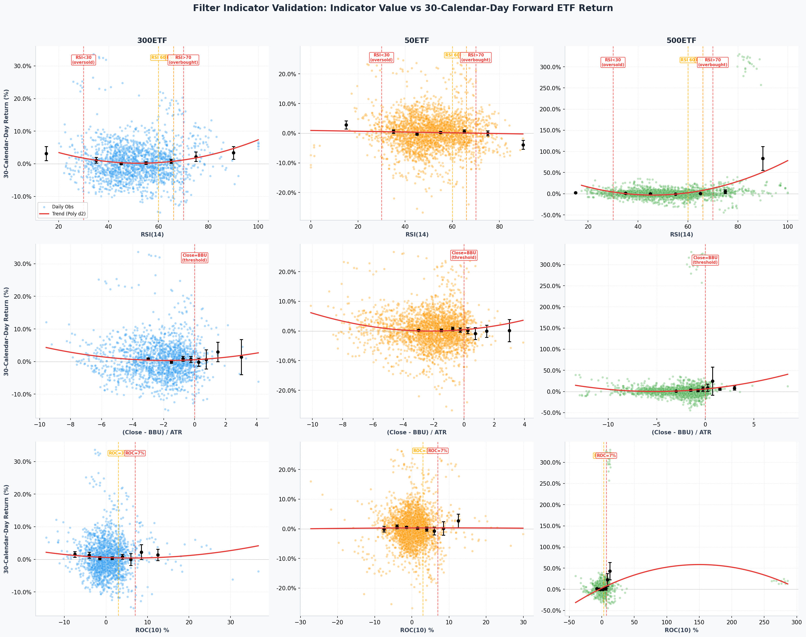
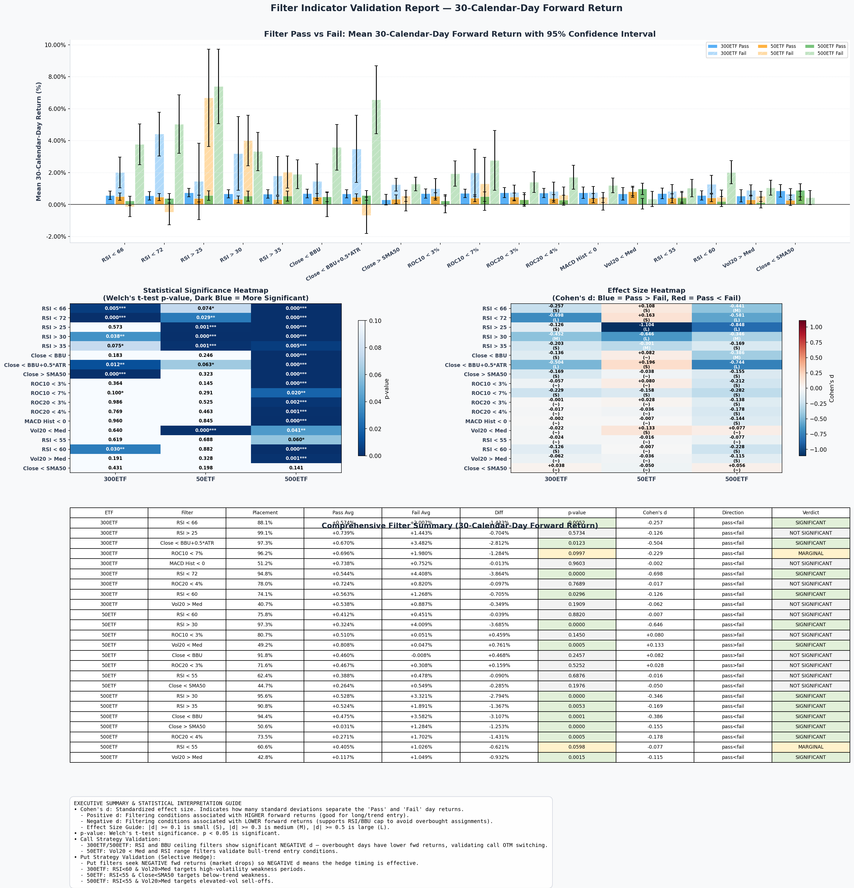

# Filter Indicator Statistical Validation Report

Generated on: `2026-06-15 23:05:03`  
Primary Horizon: `30` calendar days  
Horizons: `['7d', '14d', '30d']`  

> [!NOTE]
> Validates technical indicators used in both the **Call Strategy** (`backtest_covered_call.py`) and the **Put Strategy** (`backtest_put.py`) (RSI, BBU, ROC, SMA50, MACD Hist, Vol20 regime) against forward ETF returns. Determines if filter conditions have statistical edge.

## Visualizations

### Figure 1: Indicator Value vs 30-Calendar-Day Forward Return Scatter & Bin Plots

### Figure 2: Filter Pass/Fail Bar Chart, Significance Heatmap, and Summary Table

## Interpretation Guide

- **Cohen's d (Effect Size)**: Standard deviation difference between Pass and Fail returns.
  - Positive: Filter-pass has higher forward returns (good for trend entry checks).
  - Negative: Filter-pass has lower forward returns (supports RSI/BBU cap to avoid overbought assignments).
  - Size: 0.1 = small, 0.3 = medium, 0.5 = large.
- **p-value**: Welch's t-test / Mann-Whitney U test significance. p < 0.05 is statistically reliable.
- **Verdict**:
  - `SIGNIFICANT`: p < 0.05 and |Cohen's d| >= 0.1
  - `MARGINAL`: p < 0.10
  - `NOT SIGNIFICANT`: p >= 0.10

## Individual Filter Analysis (Call + Put Indicators)

### 7-Calendar-Day Forward Return Horizon

| ETF | Filter | Placement % | Pass Avg | Fail Avg | Diff | p(t-test) | p(M-W) | Cohen's d | Verdict |
| :--- | :--- | :---: | :---: | :---: | :---: | :---: | :---: | :---: | :--- |
| 300ETF | RSI < 66 | 88.2% | +0.092% | +0.864% | -0.772% | 0.0085 | 0.0584 | -0.269 | **SIGNIFICANT** |
| 300ETF | RSI < 72 | 94.8% | +0.107% | +1.583% | -1.476% | 0.0016 | 0.0004 | -0.515 | **SIGNIFICANT** |
| 300ETF | RSI > 25 | 99.1% | +0.168% | +1.861% | -1.693% | 0.1113 | 0.0371 | -0.588 | NOT SIGNIFICANT |
| 300ETF | RSI > 30 | 97.0% | +0.157% | +1.029% | -0.872% | 0.0464 | 0.0530 | -0.303 | **SIGNIFICANT** |
| 300ETF | RSI > 35 | 92.4% | +0.150% | +0.585% | -0.435% | 0.0563 | 0.0356 | -0.151 | *MARGINAL* |
| 300ETF | Close < BBU | 92.7% | +0.099% | +1.241% | -1.142% | 0.0109 | 0.0832 | -0.398 | **SIGNIFICANT** |
| 300ETF | Close < BBU+0.5*ATR | 97.4% | +0.112% | +2.819% | -2.707% | 0.0037 | 0.0001 | -0.949 | **SIGNIFICANT** |
| 300ETF | Close > SMA50 | 52.9% | +0.134% | +0.239% | -0.105% | 0.4397 | 0.1875 | -0.036 | NOT SIGNIFICANT |
| 300ETF | ROC10 < 3% | 80.3% | +0.094% | +0.547% | -0.453% | 0.0323 | 0.6954 | -0.158 | **SIGNIFICANT** |
| 300ETF | ROC10 < 7% | 96.2% | +0.142% | +1.236% | -1.094% | 0.0841 | 0.1094 | -0.380 | *MARGINAL* |
| 300ETF | ROC20 < 3% | 70.7% | +0.153% | +0.255% | -0.102% | 0.5141 | 0.4914 | -0.035 | NOT SIGNIFICANT |
| 300ETF | ROC20 < 4% | 78.2% | +0.111% | +0.443% | -0.332% | 0.0639 | 0.0750 | -0.115 | *MARGINAL* |
| 300ETF | MACD Hist < 0 | 51.6% | +0.177% | +0.190% | -0.013% | 0.9241 | 0.2611 | -0.005 | NOT SIGNIFICANT |
| 300ETF | Vol20 < Med | 44.6% | +0.066% | +0.277% | -0.211% | 0.1152 | 0.0258 | -0.073 | NOT SIGNIFICANT |
| 300ETF | RSI < 55 | 60.8% | +0.125% | +0.274% | -0.149% | 0.3058 | 0.6195 | -0.052 | NOT SIGNIFICANT |
| 300ETF | RSI < 60 | 74.2% | +0.121% | +0.361% | -0.240% | 0.1846 | 0.9506 | -0.083 | NOT SIGNIFICANT |
| 300ETF | Vol20 > Med | 41.0% | +0.211% | +0.164% | +0.047% | 0.7403 | 0.9165 | +0.016 | NOT SIGNIFICANT |
| 300ETF | Close < SMA50 | 45.2% | +0.140% | +0.219% | -0.079% | 0.5603 | 0.9506 | -0.027 | NOT SIGNIFICANT |
| 50ETF | RSI < 66 | 88.6% | +0.068% | +0.274% | -0.206% | 0.2861 | 0.6727 | -0.070 | NOT SIGNIFICANT |
| 50ETF | RSI < 72 | 95.8% | +0.074% | +0.485% | -0.410% | 0.2221 | 0.9647 | -0.139 | NOT SIGNIFICANT |
| 50ETF | RSI > 25 | 99.2% | +0.069% | +2.886% | -2.817% | 0.0280 | 0.0286 | -0.955 | **SIGNIFICANT** |
| 50ETF | RSI > 30 | 97.4% | +0.054% | +1.461% | -1.407% | 0.0033 | 0.0013 | -0.477 | **SIGNIFICANT** |
| 50ETF | RSI > 35 | 93.2% | +0.066% | +0.437% | -0.371% | 0.1841 | 0.1779 | -0.125 | NOT SIGNIFICANT |
| 50ETF | Close < BBU | 91.9% | +0.077% | +0.254% | -0.177% | 0.4110 | 0.9599 | -0.060 | NOT SIGNIFICANT |
| 50ETF | Close < BBU+0.5*ATR | 97.6% | +0.097% | -0.137% | +0.234% | 0.6487 | 0.0248 | +0.079 | NOT SIGNIFICANT |
| 50ETF | Close > SMA50 | 54.0% | +0.097% | +0.085% | +0.011% | 0.9207 | 0.1485 | +0.004 | NOT SIGNIFICANT |
| 50ETF | ROC10 < 3% | 80.8% | +0.119% | -0.024% | +0.142% | 0.3523 | 0.0046 | +0.048 | NOT SIGNIFICANT |
| 50ETF | ROC10 < 7% | 96.4% | +0.090% | +0.135% | -0.045% | 0.9150 | 0.5126 | -0.015 | NOT SIGNIFICANT |
| 50ETF | ROC20 < 3% | 71.8% | +0.115% | +0.032% | +0.083% | 0.5133 | 0.0710 | +0.028 | NOT SIGNIFICANT |
| 50ETF | ROC20 < 4% | 78.3% | +0.079% | +0.137% | -0.058% | 0.6901 | 0.5965 | -0.020 | NOT SIGNIFICANT |
| 50ETF | MACD Hist < 0 | 48.7% | +0.094% | +0.089% | +0.006% | 0.9589 | 0.7879 | +0.002 | NOT SIGNIFICANT |
| 50ETF | Vol20 < Med | 48.9% | +0.245% | -0.056% | +0.302% | 0.0070 | 0.0149 | +0.102 | **SIGNIFICANT** |
| 50ETF | RSI < 55 | 62.7% | +0.113% | +0.055% | +0.059% | 0.6107 | 0.0213 | +0.020 | NOT SIGNIFICANT |
| 50ETF | RSI < 60 | 76.0% | +0.077% | +0.138% | -0.062% | 0.6461 | 0.1078 | -0.021 | NOT SIGNIFICANT |
| 50ETF | Vol20 > Med | 41.8% | +0.007% | +0.152% | -0.145% | 0.1969 | 0.0840 | -0.049 | NOT SIGNIFICANT |
| 50ETF | Close < SMA50 | 44.8% | +0.066% | +0.112% | -0.046% | 0.6852 | 0.2197 | -0.016 | NOT SIGNIFICANT |
| 500ETF | RSI < 66 | 88.1% | -0.034% | +1.370% | -1.404% | 0.0000 | 0.0000 | -0.370 | **SIGNIFICANT** |
| 500ETF | RSI < 72 | 94.2% | +0.027% | +1.868% | -1.841% | 0.0000 | 0.0000 | -0.484 | **SIGNIFICANT** |
| 500ETF | RSI > 25 | 98.7% | +0.090% | +3.390% | -3.300% | 0.0005 | 0.0000 | -0.867 | **SIGNIFICANT** |
| 500ETF | RSI > 30 | 95.7% | +0.066% | +1.607% | -1.541% | 0.0002 | 0.0000 | -0.404 | **SIGNIFICANT** |
| 500ETF | RSI > 35 | 90.9% | +0.088% | +0.577% | -0.489% | 0.1229 | 0.0016 | -0.128 | NOT SIGNIFICANT |
| 500ETF | Close < BBU | 94.4% | +0.032% | +1.841% | -1.809% | 0.0000 | 0.0000 | -0.476 | **SIGNIFICANT** |
| 500ETF | Close < BBU+0.5*ATR | 98.6% | +0.087% | +3.281% | -3.194% | 0.0078 | 0.0004 | -0.839 | **SIGNIFICANT** |
| 500ETF | Close > SMA50 | 50.9% | +0.174% | +0.090% | +0.084% | 0.5666 | 0.9602 | +0.022 | NOT SIGNIFICANT |
| 500ETF | ROC10 < 3% | 75.3% | -0.085% | +0.800% | -0.885% | 0.0000 | 0.0000 | -0.233 | **SIGNIFICANT** |
| 500ETF | ROC10 < 7% | 93.0% | +0.047% | +1.282% | -1.235% | 0.0021 | 0.0000 | -0.324 | **SIGNIFICANT** |
| 500ETF | ROC20 < 3% | 67.6% | -0.086% | +0.590% | -0.676% | 0.0000 | 0.0001 | -0.177 | **SIGNIFICANT** |
| 500ETF | ROC20 < 4% | 73.5% | -0.085% | +0.737% | -0.822% | 0.0000 | 0.0000 | -0.216 | **SIGNIFICANT** |
| 500ETF | MACD Hist < 0 | 47.4% | -0.154% | +0.391% | -0.545% | 0.0002 | 0.0153 | -0.143 | **SIGNIFICANT** |
| 500ETF | Vol20 < Med | 47.5% | +0.108% | +0.156% | -0.048% | 0.7352 | 0.4063 | -0.013 | NOT SIGNIFICANT |
| 500ETF | RSI < 55 | 60.7% | -0.029% | +0.382% | -0.410% | 0.0051 | 0.1823 | -0.107 | **SIGNIFICANT** |
| 500ETF | RSI < 60 | 74.8% | -0.032% | +0.623% | -0.654% | 0.0002 | 0.0120 | -0.172 | **SIGNIFICANT** |
| 500ETF | Vol20 > Med | 43.2% | +0.118% | +0.144% | -0.027% | 0.8530 | 0.1750 | -0.007 | NOT SIGNIFICANT |
| 500ETF | Close < SMA50 | 47.9% | +0.020% | +0.236% | -0.216% | 0.1387 | 0.3534 | -0.057 | NOT SIGNIFICANT |

### 14-Calendar-Day Forward Return Horizon

| ETF | Filter | Placement % | Pass Avg | Fail Avg | Diff | p(t-test) | p(M-W) | Cohen's d | Verdict |
| :--- | :--- | :---: | :---: | :---: | :---: | :---: | :---: | :---: | :--- |
| 300ETF | RSI < 66 | 88.2% | +0.192% | +1.277% | -1.085% | 0.0023 | 0.0022 | -0.277 | **SIGNIFICANT** |
| 300ETF | RSI < 72 | 94.8% | +0.222% | +2.132% | -1.910% | 0.0001 | 0.0001 | -0.488 | **SIGNIFICANT** |
| 300ETF | RSI > 25 | 99.1% | +0.306% | +1.874% | -1.567% | 0.1654 | 0.2337 | -0.398 | NOT SIGNIFICANT |
| 300ETF | RSI > 30 | 97.0% | +0.243% | +2.799% | -2.556% | 0.0050 | 0.0008 | -0.654 | **SIGNIFICANT** |
| 300ETF | RSI > 35 | 92.4% | +0.256% | +1.102% | -0.847% | 0.0404 | 0.1297 | -0.215 | **SIGNIFICANT** |
| 300ETF | Close < BBU | 92.6% | +0.257% | +1.114% | -0.857% | 0.0470 | 0.2591 | -0.218 | **SIGNIFICANT** |
| 300ETF | Close < BBU+0.5*ATR | 97.4% | +0.277% | +1.902% | -1.625% | 0.0382 | 0.0447 | -0.414 | **SIGNIFICANT** |
| 300ETF | Close > SMA50 | 52.8% | +0.176% | +0.482% | -0.306% | 0.1020 | 0.5686 | -0.078 | NOT SIGNIFICANT |
| 300ETF | ROC10 < 3% | 80.2% | +0.255% | +0.584% | -0.329% | 0.1832 | 0.7068 | -0.084 | NOT SIGNIFICANT |
| 300ETF | ROC10 < 7% | 96.2% | +0.295% | +0.963% | -0.668% | 0.2334 | 0.2786 | -0.170 | NOT SIGNIFICANT |
| 300ETF | ROC20 < 3% | 70.6% | +0.297% | +0.376% | -0.079% | 0.7097 | 0.2449 | -0.020 | NOT SIGNIFICANT |
| 300ETF | ROC20 < 4% | 78.2% | +0.283% | +0.452% | -0.169% | 0.4912 | 0.1606 | -0.043 | NOT SIGNIFICANT |
| 300ETF | MACD Hist < 0 | 51.5% | +0.400% | +0.236% | +0.163% | 0.3821 | 0.3528 | +0.042 | NOT SIGNIFICANT |
| 300ETF | Vol20 < Med | 44.7% | +0.257% | +0.371% | -0.114% | 0.5427 | 0.0003 | -0.029 | NOT SIGNIFICANT |
| 300ETF | RSI < 55 | 60.8% | +0.227% | +0.465% | -0.238% | 0.2182 | 0.1691 | -0.060 | NOT SIGNIFICANT |
| 300ETF | RSI < 60 | 74.2% | +0.242% | +0.546% | -0.304% | 0.1873 | 0.2840 | -0.077 | NOT SIGNIFICANT |
| 300ETF | Vol20 > Med | 40.9% | +0.225% | +0.386% | -0.161% | 0.3871 | 0.2409 | -0.041 | NOT SIGNIFICANT |
| 300ETF | Close < SMA50 | 45.3% | +0.307% | +0.331% | -0.025% | 0.8958 | 0.2927 | -0.006 | NOT SIGNIFICANT |
| 50ETF | RSI < 66 | 88.6% | +0.171% | +0.222% | -0.051% | 0.8356 | 0.1126 | -0.013 | NOT SIGNIFICANT |
| 50ETF | RSI < 72 | 95.8% | +0.187% | -0.047% | +0.234% | 0.5342 | 0.0474 | +0.059 | NOT SIGNIFICANT |
| 50ETF | RSI > 25 | 99.2% | +0.139% | +4.877% | -4.738% | 0.0021 | 0.0002 | -1.195 | **SIGNIFICANT** |
| 50ETF | RSI > 30 | 97.4% | +0.106% | +2.788% | -2.682% | 0.0002 | 0.0000 | -0.677 | **SIGNIFICANT** |
| 50ETF | RSI > 35 | 93.3% | +0.106% | +1.158% | -1.052% | 0.0069 | 0.0050 | -0.264 | **SIGNIFICANT** |
| 50ETF | Close < BBU | 91.9% | +0.177% | +0.172% | +0.005% | 0.9840 | 0.7087 | +0.001 | NOT SIGNIFICANT |
| 50ETF | Close < BBU+0.5*ATR | 97.6% | +0.204% | -0.928% | +1.132% | 0.0092 | 0.0009 | +0.284 | **SIGNIFICANT** |
| 50ETF | Close > SMA50 | 54.1% | +0.181% | +0.172% | +0.009% | 0.9553 | 0.2126 | +0.002 | NOT SIGNIFICANT |
| 50ETF | ROC10 < 3% | 80.8% | +0.269% | -0.210% | +0.479% | 0.0245 | 0.0003 | +0.120 | **SIGNIFICANT** |
| 50ETF | ROC10 < 7% | 96.4% | +0.193% | -0.259% | +0.453% | 0.4045 | 0.0645 | +0.114 | NOT SIGNIFICANT |
| 50ETF | ROC20 < 3% | 71.7% | +0.218% | +0.073% | +0.145% | 0.4104 | 0.0154 | +0.036 | NOT SIGNIFICANT |
| 50ETF | ROC20 < 4% | 78.3% | +0.178% | +0.174% | +0.004% | 0.9853 | 0.0873 | +0.001 | NOT SIGNIFICANT |
| 50ETF | MACD Hist < 0 | 48.6% | +0.246% | +0.112% | +0.134% | 0.3762 | 0.6080 | +0.034 | NOT SIGNIFICANT |
| 50ETF | Vol20 < Med | 49.0% | +0.457% | -0.093% | +0.550% | 0.0003 | 0.0168 | +0.138 | **SIGNIFICANT** |
| 50ETF | RSI < 55 | 62.6% | +0.149% | +0.224% | -0.075% | 0.6296 | 0.2558 | -0.019 | NOT SIGNIFICANT |
| 50ETF | RSI < 60 | 75.9% | +0.150% | +0.263% | -0.114% | 0.5280 | 0.1549 | -0.029 | NOT SIGNIFICANT |
| 50ETF | Vol20 > Med | 41.7% | +0.011% | +0.295% | -0.284% | 0.0539 | 0.0380 | -0.071 | *MARGINAL* |
| 50ETF | Close < SMA50 | 44.7% | +0.082% | +0.254% | -0.172% | 0.2649 | 0.7275 | -0.043 | NOT SIGNIFICANT |
| 500ETF | RSI < 66 | 88.1% | +0.003% | +2.329% | -2.326% | 0.0000 | 0.0000 | -0.436 | **SIGNIFICANT** |
| 500ETF | RSI < 72 | 94.2% | +0.133% | +2.689% | -2.557% | 0.0000 | 0.0000 | -0.478 | **SIGNIFICANT** |
| 500ETF | RSI > 25 | 98.7% | +0.233% | +3.852% | -3.619% | 0.0080 | 0.0017 | -0.674 | **SIGNIFICANT** |
| 500ETF | RSI > 30 | 95.6% | +0.227% | +1.441% | -1.213% | 0.0233 | 0.0536 | -0.225 | **SIGNIFICANT** |
| 500ETF | RSI > 35 | 90.9% | +0.229% | +0.789% | -0.560% | 0.1439 | 0.0936 | -0.104 | NOT SIGNIFICANT |
| 500ETF | Close < BBU | 94.4% | +0.142% | +2.608% | -2.466% | 0.0000 | 0.0000 | -0.460 | **SIGNIFICANT** |
| 500ETF | Close < BBU+0.5*ATR | 98.5% | +0.226% | +3.948% | -3.722% | 0.0017 | 0.0002 | -0.693 | **SIGNIFICANT** |
| 500ETF | Close > SMA50 | 50.8% | +0.205% | +0.358% | -0.153% | 0.4553 | 0.7854 | -0.028 | NOT SIGNIFICANT |
| 500ETF | ROC10 < 3% | 75.3% | -0.033% | +1.233% | -1.266% | 0.0000 | 0.0000 | -0.236 | **SIGNIFICANT** |
| 500ETF | ROC10 < 7% | 93.0% | +0.161% | +1.867% | -1.705% | 0.0033 | 0.0000 | -0.318 | **SIGNIFICANT** |
| 500ETF | ROC20 < 3% | 67.6% | -0.030% | +0.927% | -0.957% | 0.0001 | 0.0000 | -0.178 | **SIGNIFICANT** |
| 500ETF | ROC20 < 4% | 73.5% | -0.024% | +1.122% | -1.146% | 0.0000 | 0.0000 | -0.214 | **SIGNIFICANT** |
| 500ETF | MACD Hist < 0 | 47.3% | -0.154% | +0.670% | -0.824% | 0.0001 | 0.0001 | -0.153 | **SIGNIFICANT** |
| 500ETF | Vol20 < Med | 47.6% | +0.333% | +0.232% | +0.101% | 0.6184 | 0.3009 | +0.019 | NOT SIGNIFICANT |
| 500ETF | RSI < 55 | 60.6% | +0.033% | +0.660% | -0.626% | 0.0030 | 0.0155 | -0.116 | **SIGNIFICANT** |
| 500ETF | RSI < 60 | 74.8% | -0.024% | +1.183% | -1.207% | 0.0000 | 0.0000 | -0.225 | **SIGNIFICANT** |
| 500ETF | Vol20 > Med | 43.1% | +0.121% | +0.401% | -0.280% | 0.1553 | 0.0795 | -0.052 | NOT SIGNIFICANT |
| 500ETF | Close < SMA50 | 47.9% | +0.201% | +0.353% | -0.152% | 0.4582 | 0.2292 | -0.028 | NOT SIGNIFICANT |

### 30-Calendar-Day Forward Return Horizon

| ETF | Filter | Placement % | Pass Avg | Fail Avg | Diff | p(t-test) | p(M-W) | Cohen's d | Verdict |
| :--- | :--- | :---: | :---: | :---: | :---: | :---: | :---: | :---: | :--- |
| 300ETF | RSI < 66 | 88.1% | +0.574% | +2.007% | -1.433% | 0.0052 | 0.0020 | -0.257 | **SIGNIFICANT** |
| 300ETF | RSI < 72 | 94.8% | +0.544% | +4.408% | -3.864% | 0.0000 | 0.0000 | -0.698 | **SIGNIFICANT** |
| 300ETF | RSI > 25 | 99.1% | +0.739% | +1.443% | -0.704% | 0.5734 | 0.6681 | -0.126 | NOT SIGNIFICANT |
| 300ETF | RSI > 30 | 96.9% | +0.668% | +3.190% | -2.522% | 0.0379 | 0.1489 | -0.452 | **SIGNIFICANT** |
| 300ETF | RSI > 35 | 92.3% | +0.658% | +1.793% | -1.135% | 0.0750 | 0.4480 | -0.203 | *MARGINAL* |
| 300ETF | Close < BBU | 92.6% | +0.689% | +1.451% | -0.763% | 0.1830 | 0.2507 | -0.136 | NOT SIGNIFICANT |
| 300ETF | Close < BBU+0.5*ATR | 97.3% | +0.670% | +3.482% | -2.812% | 0.0123 | 0.0106 | -0.504 | **SIGNIFICANT** |
| 300ETF | Close > SMA50 | 52.5% | +0.297% | +1.240% | -0.943% | 0.0004 | 0.0051 | -0.169 | **SIGNIFICANT** |
| 300ETF | ROC10 < 3% | 80.1% | +0.682% | +0.999% | -0.317% | 0.3644 | 0.0564 | -0.057 | NOT SIGNIFICANT |
| 300ETF | ROC10 < 7% | 96.2% | +0.696% | +1.980% | -1.284% | 0.0997 | 0.0022 | -0.229 | *MARGINAL* |
| 300ETF | ROC20 < 3% | 70.7% | +0.743% | +0.749% | -0.005% | 0.9857 | 0.4262 | -0.001 | NOT SIGNIFICANT |
| 300ETF | ROC20 < 4% | 78.0% | +0.724% | +0.820% | -0.097% | 0.7689 | 0.3214 | -0.017 | NOT SIGNIFICANT |
| 300ETF | MACD Hist < 0 | 51.2% | +0.738% | +0.752% | -0.013% | 0.9603 | 0.4848 | -0.002 | NOT SIGNIFICANT |
| 300ETF | Vol20 < Med | 44.8% | +0.676% | +0.801% | -0.125% | 0.6399 | 0.0206 | -0.022 | NOT SIGNIFICANT |
| 300ETF | RSI < 55 | 61.0% | +0.692% | +0.828% | -0.137% | 0.6188 | 0.4248 | -0.024 | NOT SIGNIFICANT |
| 300ETF | RSI < 60 | 74.1% | +0.563% | +1.268% | -0.705% | 0.0296 | 0.0261 | -0.126 | **SIGNIFICANT** |
| 300ETF | Vol20 > Med | 40.7% | +0.538% | +0.887% | -0.349% | 0.1909 | 0.9573 | -0.062 | NOT SIGNIFICANT |
| 300ETF | Close < SMA50 | 45.5% | +0.860% | +0.649% | +0.211% | 0.4309 | 0.6508 | +0.038 | NOT SIGNIFICANT |
| 50ETF | RSI < 66 | 88.6% | +0.492% | -0.125% | +0.617% | 0.0738 | 0.0168 | +0.108 | *MARGINAL* |
| 50ETF | RSI < 72 | 95.8% | +0.461% | -0.473% | +0.934% | 0.0287 | 0.0370 | +0.163 | **SIGNIFICANT** |
| 50ETF | RSI > 25 | 99.2% | +0.371% | +6.676% | -6.305% | 0.0006 | 0.0000 | -1.104 | **SIGNIFICANT** |
| 50ETF | RSI > 30 | 97.3% | +0.324% | +4.009% | -3.685% | 0.0000 | 0.0000 | -0.646 | **SIGNIFICANT** |
| 50ETF | RSI > 35 | 93.2% | +0.305% | +2.028% | -1.723% | 0.0012 | 0.0021 | -0.301 | **SIGNIFICANT** |
| 50ETF | Close < BBU | 91.8% | +0.460% | -0.008% | +0.468% | 0.2457 | 0.0568 | +0.082 | NOT SIGNIFICANT |
| 50ETF | Close < BBU+0.5*ATR | 97.6% | +0.449% | -0.673% | +1.121% | 0.0632 | 0.0136 | +0.196 | *MARGINAL* |
| 50ETF | Close > SMA50 | 54.1% | +0.321% | +0.540% | -0.220% | 0.3234 | 0.4981 | -0.038 | NOT SIGNIFICANT |
| 50ETF | ROC10 < 3% | 80.7% | +0.510% | +0.051% | +0.459% | 0.1450 | 0.0250 | +0.080 | NOT SIGNIFICANT |
| 50ETF | ROC10 < 7% | 96.4% | +0.389% | +1.295% | -0.907% | 0.2908 | 0.7492 | -0.158 | NOT SIGNIFICANT |
| 50ETF | ROC20 < 3% | 71.6% | +0.467% | +0.308% | +0.159% | 0.5252 | 0.1215 | +0.028 | NOT SIGNIFICANT |
| 50ETF | ROC20 < 4% | 78.2% | +0.376% | +0.584% | -0.208% | 0.4632 | 0.8194 | -0.036 | NOT SIGNIFICANT |
| 50ETF | MACD Hist < 0 | 48.4% | +0.400% | +0.442% | -0.043% | 0.8455 | 0.8035 | -0.007 | NOT SIGNIFICANT |
| 50ETF | Vol20 < Med | 49.2% | +0.808% | +0.047% | +0.761% | 0.0005 | 0.0056 | +0.133 | **SIGNIFICANT** |
| 50ETF | RSI < 55 | 62.4% | +0.388% | +0.478% | -0.090% | 0.6876 | 0.9396 | -0.016 | NOT SIGNIFICANT |
| 50ETF | RSI < 60 | 75.8% | +0.412% | +0.451% | -0.039% | 0.8820 | 0.2811 | -0.007 | NOT SIGNIFICANT |
| 50ETF | Vol20 > Med | 41.4% | +0.300% | +0.508% | -0.208% | 0.3285 | 0.2669 | -0.036 | NOT SIGNIFICANT |
| 50ETF | Close < SMA50 | 44.7% | +0.264% | +0.549% | -0.285% | 0.1976 | 0.4764 | -0.050 | NOT SIGNIFICANT |
| 500ETF | RSI < 66 | 88.1% | +0.227% | +3.761% | -3.534% | 0.0000 | 0.0000 | -0.441 | **SIGNIFICANT** |
| 500ETF | RSI < 72 | 94.2% | +0.380% | +5.034% | -4.654% | 0.0000 | 0.0000 | -0.581 | **SIGNIFICANT** |
| 500ETF | RSI > 25 | 98.7% | +0.560% | +7.389% | -6.829% | 0.0000 | 0.0000 | -0.848 | **SIGNIFICANT** |
| 500ETF | RSI > 30 | 95.6% | +0.528% | +3.321% | -2.794% | 0.0000 | 0.0000 | -0.346 | **SIGNIFICANT** |
| 500ETF | RSI > 35 | 90.8% | +0.524% | +1.891% | -1.367% | 0.0053 | 0.0051 | -0.169 | **SIGNIFICANT** |
| 500ETF | Close < BBU | 94.4% | +0.475% | +3.582% | -3.107% | 0.0001 | 0.0000 | -0.386 | **SIGNIFICANT** |
| 500ETF | Close < BBU+0.5*ATR | 98.5% | +0.562% | +6.556% | -5.993% | 0.0000 | 0.0000 | -0.744 | **SIGNIFICANT** |
| 500ETF | Close > SMA50 | 50.6% | +0.031% | +1.284% | -1.253% | 0.0000 | 0.0001 | -0.155 | **SIGNIFICANT** |
| 500ETF | ROC10 < 3% | 75.2% | +0.227% | +1.934% | -1.707% | 0.0001 | 0.0000 | -0.212 | **SIGNIFICANT** |
| 500ETF | ROC10 < 7% | 93.0% | +0.491% | +2.762% | -2.272% | 0.0202 | 0.0000 | -0.282 | **SIGNIFICANT** |
| 500ETF | ROC20 < 3% | 67.7% | +0.291% | +1.403% | -1.113% | 0.0025 | 0.0000 | -0.138 | **SIGNIFICANT** |
| 500ETF | ROC20 < 4% | 73.5% | +0.271% | +1.702% | -1.431% | 0.0005 | 0.0000 | -0.178 | **SIGNIFICANT** |
| 500ETF | MACD Hist < 0 | 47.1% | +0.035% | +1.198% | -1.163% | 0.0001 | 0.0000 | -0.144 | **SIGNIFICANT** |
| 500ETF | Vol20 < Med | 47.8% | +0.975% | +0.352% | +0.622% | 0.0411 | 0.3707 | +0.077 | *MARGINAL* |
| 500ETF | RSI < 55 | 60.6% | +0.405% | +1.026% | -0.621% | 0.0598 | 0.0527 | -0.077 | *MARGINAL* |
| 500ETF | RSI < 60 | 74.7% | +0.185% | +2.020% | -1.835% | 0.0000 | 0.0000 | -0.228 | **SIGNIFICANT** |
| 500ETF | Vol20 > Med | 42.8% | +0.117% | +1.049% | -0.932% | 0.0015 | 0.0062 | -0.115 | **SIGNIFICANT** |
| 500ETF | Close < SMA50 | 48.1% | +0.885% | +0.432% | +0.453% | 0.1406 | 0.0513 | +0.056 | NOT SIGNIFICANT |

## Put Strategy Combined Filter Analysis

> Per-ETF combined conditions as implemented in `PutStrategy.evaluate_filter()` (`backtest_strategies.py`).
> Optimized via `optimize_put_filters.py` (real data, 6-component composite score).
> For put timing, **negative** Cohen's d is desired — pass days should have *lower* forward returns (i.e. the market drops after the signal, validating hedge timing).

| ETF | Combined Filter | Condition |
| :--- | :--- | :--- |
| 300ETF | `RSI<60 & Vol20>Med` | `RSI(14) < 60` AND `Vol20 > Vol20_252d_median` |
| 50ETF  | `RSI<55 & Close<SMA50` | `RSI(14) < 55` AND `Close < SMA(50)` |
| 500ETF | `RSI<55 & Vol20>Med` | `RSI(14) < 55` AND `Vol20 > Vol20_252d_median` |

### Put Combined Filter — 7-Calendar-Day Forward Return

| ETF | Filter | Placement % | Pass Avg | Fail Avg | Diff | p(t-test) | p(M-W) | Cohen's d | Verdict |
| :--- | :--- | :---: | :---: | :---: | :---: | :---: | :---: | :---: | :--- |
| 300ETF | RSI<60 & Vol20>Med | 30.4% | +0.120% | +0.211% | -0.091% | 0.5144 | 0.6027 | -0.032 | NOT SIGNIFICANT |
| 50ETF | RSI<55 & Close<SMA50 | 43.8% | +0.065% | +0.112% | -0.046% | 0.6855 | 0.1975 | -0.016 | NOT SIGNIFICANT |
| 500ETF | RSI<55 & Vol20>Med | 30.9% | +0.019% | +0.184% | -0.165% | 0.2566 | 0.1859 | -0.043 | NOT SIGNIFICANT |

### Put Combined Filter — 14-Calendar-Day Forward Return

| ETF | Filter | Placement % | Pass Avg | Fail Avg | Diff | p(t-test) | p(M-W) | Cohen's d | Verdict |
| :--- | :--- | :---: | :---: | :---: | :---: | :---: | :---: | :---: | :--- |
| 300ETF | RSI<60 & Vol20>Med | 30.2% | +0.186% | +0.379% | -0.193% | 0.3077 | 0.1516 | -0.049 | NOT SIGNIFICANT |
| 50ETF | RSI<55 & Close<SMA50 | 43.7% | +0.051% | +0.275% | -0.224% | 0.1482 | 0.9487 | -0.056 | NOT SIGNIFICANT |
| 500ETF | RSI<55 & Vol20>Med | 30.7% | +0.048% | +0.383% | -0.335% | 0.0823 | 0.0473 | -0.062 | *MARGINAL* |

### Put Combined Filter — 30-Calendar-Day Forward Return

| ETF | Filter | Placement % | Pass Avg | Fail Avg | Diff | p(t-test) | p(M-W) | Cohen's d | Verdict |
| :--- | :--- | :---: | :---: | :---: | :---: | :---: | :---: | :---: | :--- |
| 300ETF | RSI<60 & Vol20>Med | 30.1% | +0.339% | +0.920% | -0.581% | 0.0327 | 0.6748 | -0.104 | **SIGNIFICANT** |
| 50ETF | RSI<55 & Close<SMA50 | 43.7% | +0.241% | +0.562% | -0.321% | 0.1480 | 0.3120 | -0.056 | NOT SIGNIFICANT |
| 500ETF | RSI<55 & Vol20>Med | 30.6% | +0.364% | +0.776% | -0.412% | 0.1481 | 0.2945 | -0.051 | NOT SIGNIFICANT |

### Put Combined Filter Interpretation

For the protective put strategy, we buy puts when the filter passes and skip when it fails. A **negative** `Pass Avg - Fail Avg` (Diff) means the market tends to drop more on filter-pass days, which makes the put hedge more valuable — this validates the timing signal. Conversely, a positive Diff suggests the filter triggers before rallies, making the put a drag.

**Placement rate** is important: too low (<20%) means the hedge rarely activates, too high (>80%) means the filter provides little selectivity. The optimized filters target 30–50% placement.
