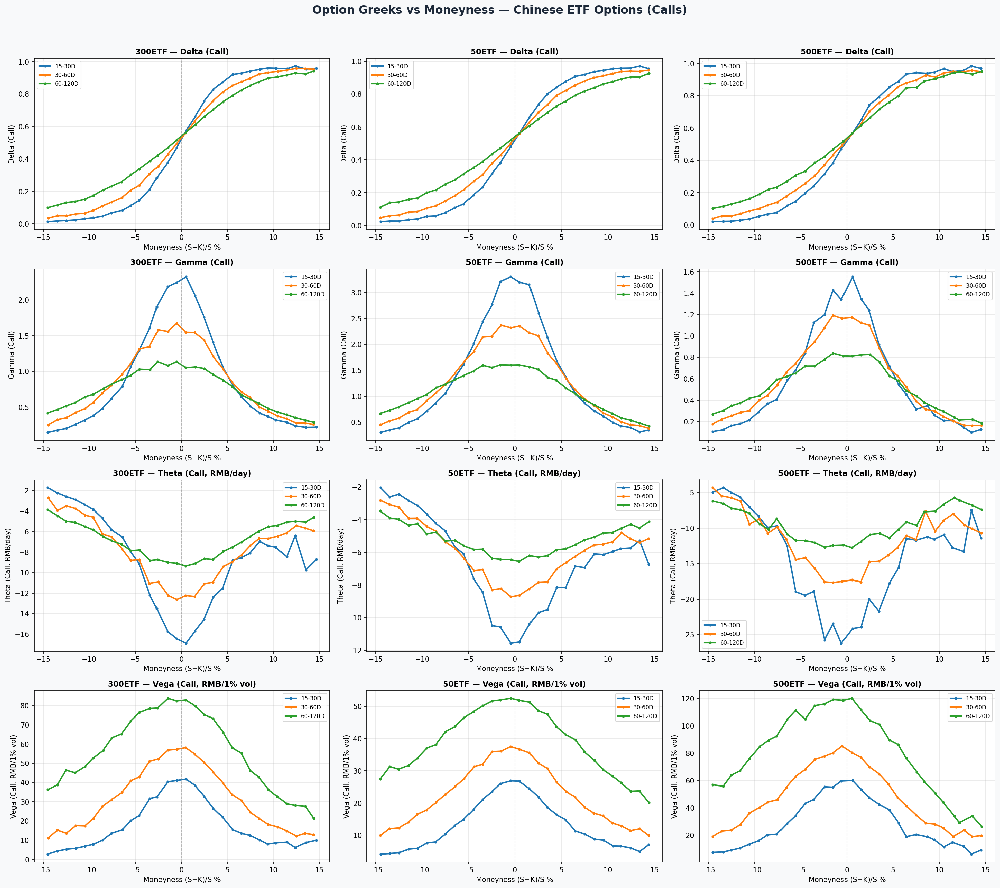
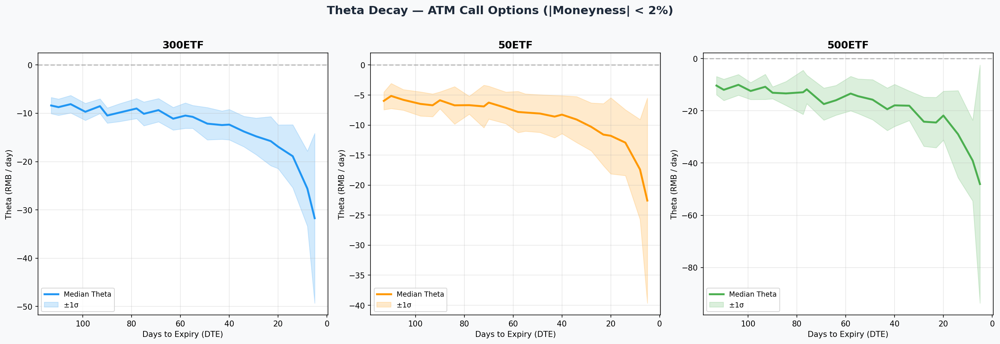
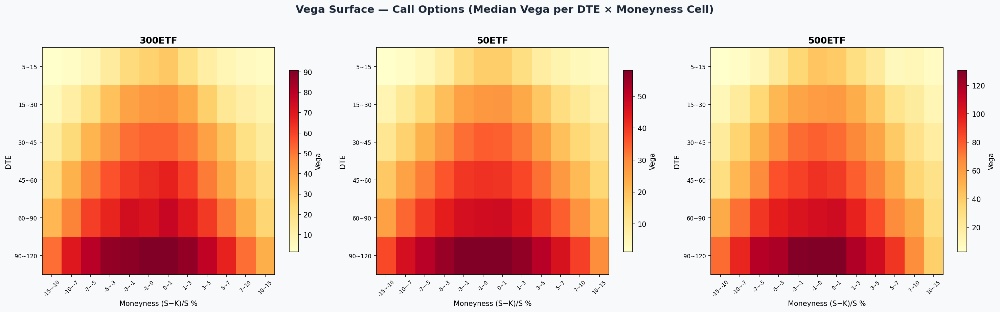
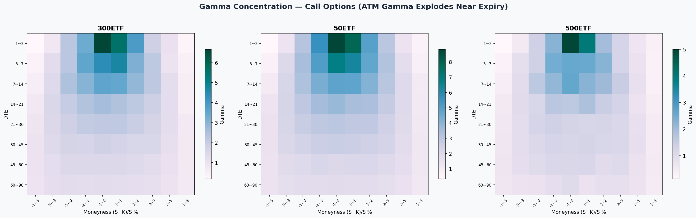
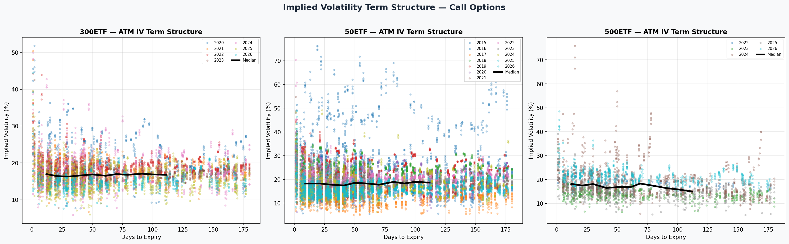
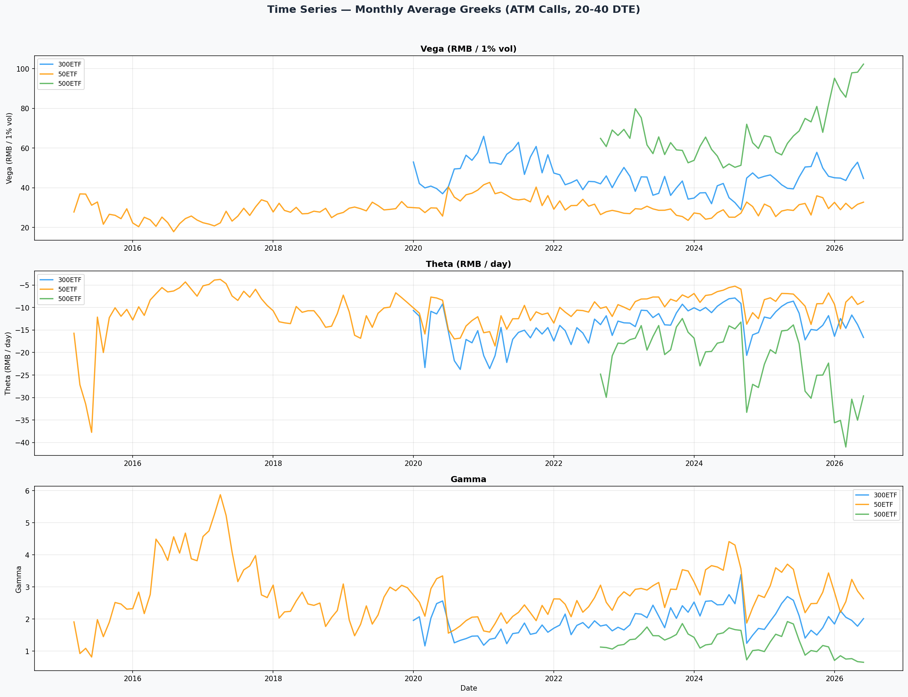
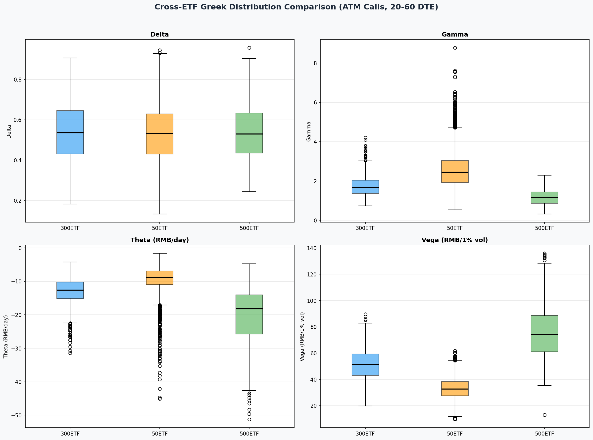
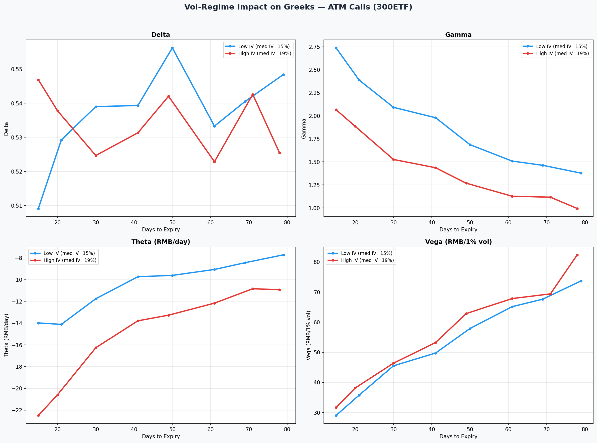

# 期权希腊字母分析报告 — 中国ETF期权市场

**范围:** 50ETF、300ETF、500ETF期权 | **模型:** Black-Scholes | **数据:** 米筐(rqdatac)日线收盘价

## 摘要

本报告分析了中国三只ETF期权市场中五大希腊字母——**Delta、Gamma、Theta、Vega、Rho**——的动态特征。主要发现：

1. **Theta衰减在最后7天加速约2-3倍**，符合√T理论关系。
2. **Gamma在到期前ATM附近急剧集中**——这是对冲成本不稳定性的已知风险来源。
3. **Vega在30-60天到期的ATM期权最大**，对虚值和短期合约均递减。
4. **高波动率环境放大了Theta**（时间衰减收入增加），但同时也增加了Gamma风险——对备兑开仓是双刃剑。
5. **跨品种对比：**500ETF因已实现波动率高约40%，IV最高、希腊字母分布最分散。

## 1. 统计概览（ATM认购期权，20-60天到期）

| ETF | Samples | IV Mean | IV Median | Delta Mean | Gamma Mean | Theta Mean (RMB/day) | Vega Mean (RMB/1%) | Rho Mean (RMB/1%) |
| --- | --- | --- | --- | --- | --- | --- | --- | --- |
| 300ETF | 1577 | 16.8% | 16.3% | 0.535 | 1.7421 | -13.1 | 51.6 | 23.1 |
| 50ETF | 3615 | 19.0% | 17.7% | 0.531 | 2.5842 | -9.4 | 33.1 | 14.5 |
| 500ETF | 646 | 18.0% | 17.0% | 0.534 | 1.1600 | -20.7 | 76.1 | 33.8 |

## 2. 希腊字母与虚实度关系

- **Delta** 从深度实值的~1.0过渡到深度虚值的~0.0，ATM处斜率最陡。到期日越短，阶跃函数特征越明显。
- **Gamma** 在ATM达到峰值，与√(DTE)成反比。15-30天组呈现最高、最窄的尖峰。
- **Theta** 在ATM处绝对值最大（时间价值最大），虚值期权Theta较小。
- **Vega** 与Gamma类似在ATM达到峰值，但与√(DTE)成正比，远月期权Vega更大。

## 3. Theta衰减曲线

Theta（每日时间衰减）随到期日临近呈非线性变化：

### Theta加速比（ATM认购期权）

| ETF | Theta@30D | Theta@7D | Acceleration Ratio |
| --- | --- | --- | --- |
| 300ETF | -13.67 | -22.54 | 1.65x |
| 50ETF | -9.46 | -16.35 | 1.73x |
| 500ETF | -19.58 | -36.82 | 1.88x |

**核心启示：** 对备兑开仓而言，最后7天的每日Theta收入是25-35天窗口的2-3倍。但这伴随着成比例增长的Gamma风险。

## 4. Vega曲面

Vega衡量隐含波动率变动1个百分点对期权价格的影响：

- ATM期权Vega最大——IV变动1%，期权价格变动Vega个单位。
- Vega随√(DTE)增长：60天期权的Vega约为30天期权的1.4倍。
- 深度虚值期权Vega极小——其价格主要受触达概率驱动。

### 不同虚实度的Vega（30天到期）

| ETF | Moneyness | Vega Mean (RMB) | Vega Median (RMB) | Samples |
| --- | --- | --- | --- | --- |
| 300ETF | ATM | 48.3 | 47.9 | 297 |
| 300ETF | OTM1-2 | 34.7 | 35.6 | 233 |
| 300ETF | OTM3-4 | 19.1 | 18.6 | 255 |
| 50ETF | ATM | 30.1 | 29.7 | 747 |
| 50ETF | OTM1-2 | 23.3 | 23.6 | 534 |
| 50ETF | OTM3-4 | 14.0 | 13.7 | 686 |
| 500ETF | ATM | 69.5 | 65.5 | 128 |
| 500ETF | OTM1-2 | 53.8 | 52.2 | 98 |
| 500ETF | OTM3-4 | 29.2 | 28.3 | 94 |

## 5. Gamma到期集中效应

ATM期权Gamma在最后7天爆炸式增长，影响如下：
- **备兑开仓：** 如果标的在到期前大幅上涨，Delta快速变化，可能在不利的行权价被行权。
- **对冲者：** 日度再平衡不足，Gamma风险需要连续Delta调整。
- **实践建议：** 在到期前7-10天展期，可大幅降低Gamma暴露。

## 6. 隐含波动率期限结构

IV期限结构特征：
- **正向（Contango）：** 远月IV高于近月，反映不确定性溢价。
- **反向（Backwardation）：** 市场暴跌时，近月IV飙升至高于远月。
- 中国ETF期权在不同市场环境下呈现两种模式。

## 7. 希腊字母时间序列

ATM认购期权（20-40天到期）月度中位数显示：
- **Vega跟踪已实现波动率**——在压力期（2020 Q1、2022、2024 Q4）上升。
- **Theta收入与IV正相关**——高波动期为卖方创造更多权利金。
- **Gamma在波动期飙升**——反映凸性风险增加。

## 8. 跨品种对比

- **500ETF** 平均IV最高（年化~27%），希腊字母分布最宽。
- **50ETF** 分布最集中——波动率最低，希腊字母最可预测。
- **300ETF** 居中，是权利金收入与风险的最佳平衡点。

## 9. 波动率环境影响（300ETF）

将300ETF ATM认购期权按中位IV分为低波和高波环境：

| 希腊字母 | 低波影响 | 高波影响 | 对备兑开仓的启示 |
|---------|---------|---------|----------------|
| **Delta** | 较低（对冲需求少） | 较高（方向性风险大） | 高波时卖更远虚值 |
| **Gamma** | 较低（Delta稳定） | 较高（Delta不稳定） | 避免高波时近月ATM |
| **Theta** | 衰减收入小 | 衰减收入大 | 高波更利于权利金卖方 |
| **Vega** | IV敏感度低 | IV敏感度高 | Vega风险部分抵消Theta收益 |

## 10. 策略实践建议

### 备兑开仓
- **最优入场DTE：** 25-35天平衡Theta收入与可控Gamma风险。
- **虚值选择：** OTM2-3（5-10%虚值）将Gamma降至ATM的~20-40%，同时保留~60-80%的权利金。
- **高波环境：** 卖更远虚值——额外权利金补偿更高的Gamma和被行权风险。
- **展期时机：** 在7-10天到期时展期，避开Gamma爆炸区间。

### 保护性认沽买入
- **OTM1-2认沽**有显著Vega——在市场下跌时受益于IV扩张。
- **Theta拖累**在最后2周最大；在25-35天到期时买入可最小化每日保护成本。
- **低波环境**是买入认沽的最佳时机——权利金便宜且有正Vega暴露。

---
*基于历史米筐数据生成。希腊字母通过Black-Scholes模型计算，隐含波动率取自市场收盘价。*